# L1 · Introduzione

*Lezione 1 · Antonio Carta · 1 settembre 2026*

[Versione interattiva sul sito, con videolezione](https://gabriele-marsili.github.io/appunti-magistrale-ai/anno-2/computer-vision/sito/#L1) · [Indice della dispensa](README.md)

**In una frase:** la computer vision **cerca di ricavare dalle immagini com'è fatto il mondo** (cosa c'è e dove), **ma un'immagine non contiene abbastanza informazione per deciderlo da sola**: ogni metodo del corso, dai filtri alle reti neurali, **è un modo di aggiungere ipotesi sul mondo (prior) e di sfruttare corrispondenze, geometria, rappresentazioni e tempo** per rendere il problema risolvibile.

### Prima di iniziare

È la lezione di apertura: non servono lezioni precedenti. Le poche formule usano cose che conosci dalla triennale:

  - **derivate parziali e gradiente** di una funzione di due variabili (servono per i bordi);
  - **sistemi lineari sovradeterminati e minimi quadrati**: con più equazioni che incognite, A·x ≈ b si risolve con x = (AᵀA)⁻¹Aᵀb;
  - **teorema di Bayes**: P(A | B) ∝ P(B | A) · P(A);
  - trigonometria di base (seni, coseni, teorema dei seni).

Lo scopo è avere in testa le idee con cui leggere il resto del corso: quasi ogni lezione successiva risponde a una domanda aperta qui.

### Guarda prima questi video

  - [What is Computer Vision?](https://www.youtube.com/watch?v=wVE8SFMSBJ0) (Video). Shree Nayar, First Principles of Computer Vision (Columbia). Guardalo tutto: è breve e definisce la visione come estrazione di informazione sulla scena dalle immagini, con il confronto con la grafica.
  - [How Do Humans Do it?](https://www.youtube.com/watch?v=EOUcIto5WMU) (Video). Shree Nayar, stessa serie. Guardalo tutto: illusioni e percezione umana, cioè la parte della lezione sulle slide 20–29. Concentrati su perché il cervello "sbaglia" le misure per dare la risposta giusta sulla scena.
  - [How we're teaching computers to understand pictures](https://www.ted.com/talks/fei_fei_li_how_we_re_teaching_computers_to_understand_pictures) (Video · 18 min). Fei-Fei Li, TED 2015. Tutto: perché il riconoscimento è difficile e come ImageNet ha aperto l'era del deep learning (slide 17–19). Datato nei risultati, non nell'idea.
  - [Lecture 1: Introduction to Deep Learning for Computer Vision (UMich EECS 498-007)](https://www.youtube.com/watch?v=QytpbYkGxKo) (Video). Justin Johnson, University of Michigan. Facoltativo: guarda la parte sulla storia della visione (da Hubel e Wiesel e il mondo a blocchi fino ad AlexNet), che completa la slide 19.

### 1 · Che cosa vuol dire "vedere" per una macchina

**Il problema.** Il tuo telefono riconosce il tuo volto, un'auto a guida autonoma vede un pedone, Google Foto trova "tutte le foto con un cane". Eppure per il computer una foto 1000×1000 a colori è solo una tabella di tre milioni di numeri, ognuno dei quali misura quanta luce è arrivata su un sensore. Come si passa da quella tabella a "c'è una tazza sul tavolo, a mezzo metro, davanti al portatile"?

**L'idea.** David Marr lo riassume così (slide 3): vedere è *"to know what is where by looking"*, sapere **cosa** c'è (riconoscimento) e **dove** (struttura spaziale, forma 3D). Il libro (cap. 1) precisa: in uscita non vogliamo misure di luce, ma proprietà del mondo (oggetti, forme, materiali).

Il modo più chiaro per capire cos'è la visione è guardare **cosa entra e cosa esce** rispetto ai campi vicini (slide 4 e 11):

  - **image processing**: immagine in ingresso, immagine in uscita (togliere rumore, aumentare il contrasto);
  - **computer graphics**: descrizione della scena (geometria, materiali, luci, camera) in ingresso, immagine in uscita. È il **problema diretto**: **ha una sola risposta e si calcola**;
  - **computer vision**: immagine in ingresso, descrizione della scena in uscita. È il **problema inverso** della grafica, **"la grafica eseguita al contrario"**. Ed è qui che sta la difficoltà;
  - **robotica** (la percezione serve ad agire) e **machine learning** (la cassetta degli attrezzi moderna) sono i vicini con cui si mescola.

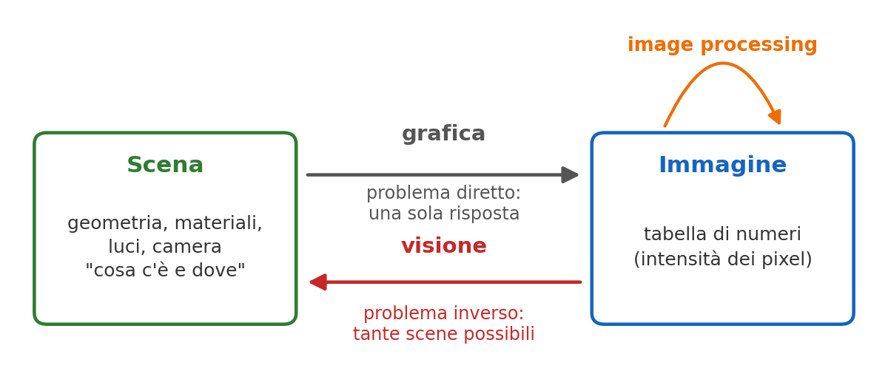

La grafica va dalla scena all'immagine e ha una sola risposta; **la visione fa il percorso inverso, dove molte scene diverse sono compatibili con la stessa immagine**. Tutto il corso parte da questa asimmetria.

**Un esempio.** Un videogioco disegna l'immagine dalla descrizione del livello, senza dubbi. Guardare uno screenshot e ricostruire il livello non ha invece una risposta unica: un muro scuro può essere un muro grigio in ombra o un muro nero illuminato.

> **Il punto**
> 
> Vedere = ricavare cosa c'è e dove a partire dalla luce. La visione è il problema inverso della grafica: la grafica calcola l'immagine dalla scena, la visione deve indovinare la scena dall'immagine.

### 2 · Basso, medio e alto livello

**Il problema.** "Fare visione" copre compiti molto diversi: togliere il rumore da una foto notturna, misurare la distanza di un'auto, scrivere una didascalia. Serve un modo per ordinarli.

**L'idea.** I compiti si ordinano per **quanto sono lontani dai pixel** (slide 6–8):

  - **basso livello**: operazioni vicino ai pixel, spesso immagine in ingresso e immagine o campo in uscita: denoising, rilevamento dei bordi, flusso ottico. È la prima parte del corso ([L3](https://gabriele-marsili.github.io/appunti-magistrale-ai/anno-2/computer-vision/sito/#L3), [L5](https://gabriele-marsili.github.io/appunti-magistrale-ai/anno-2/computer-vision/sito/#L5), [L6](https://gabriele-marsili.github.io/appunti-magistrale-ai/anno-2/computer-vision/sito/#L6));
  - **medio livello**: raggruppare pixel e ricavare geometria: segmentazione, profondità, corrispondenze, ricostruzione 3D;
  - **alto livello**: semantica e ragionamento: riconoscimento, detection, didascalie, generazione di immagini da testo. La borsa a forma di gatto generata da ChatGPT (slide 9) mostra la **composizionalità**: combinare due concetti noti in un oggetto mai visto.

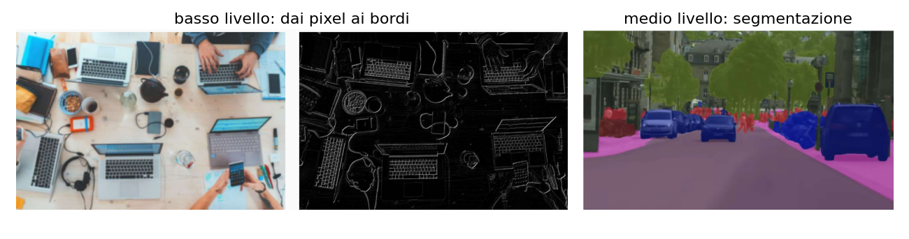

**Esempio: un'auto a guida autonoma** li usa tutti e tre in ogni frame (slide 10): toglie il rumore e trova i bordi delle corsie (basso), segmenta la strada e stima la profondità degli ostacoli (medio), riconosce "pedone" e "semaforo rosso" (alto). Lo stesso vale per telefono, medicina (tumori nelle TAC) e realtà aumentata: pixel grezzi in ingresso, informazione strutturata in uscita, con vincoli stretti di tempo.

> **Il punto**
> 
> Basso livello lavora sui pixel, medio livello sulla geometria e sulle regioni, alto livello sul significato. Il corso sale questa scala nello stesso ordine.

### 3 · Perché è difficile: un problema inverso mal posto

**Il problema.** Nel 1966 al MIT Seymour Papert pensava di far risolvere buona parte della visione a degli studenti in un progetto estivo (slide 5). Sessant'anni dopo ci stiamo ancora lavorando. Perché?

**L'idea.** Un problema si dice **ben posto** (definizione di Hadamard) se la soluzione **esiste**, è **unica** e **dipende con continuità dai dati** (un piccolo rumore cambia poco la risposta). Un problema che viola una di queste condizioni è **mal posto**. **La visione viola già la seconda condizione: la proiezione dal mondo 3D all'immagine 2D butta via una dimensione, quindi infinite scene diverse producono la stessa immagine** (slide 12).

Non è solo un problema di profondità. **La stessa silhouette può venire da forme diverse; lo stesso ombreggiamento da combinazioni diverse di forma, materiale e luce.**

**La matematica, in piccolo.** In una camera (la vedrai in [L2](https://gabriele-marsili.github.io/appunti-magistrale-ai/anno-2/computer-vision/sito/#L2)) un oggetto alto H a distanza Z produce un'immagine alta h = f · H / Z, dove f è la distanza focale. La formula dipende solo dal **rapporto** H / Z.

**Esempio svolto.** Con f = 50 mm: una persona alta 1,8 m a 18 m dà h = 50 · 1,8 / 18 = 5 mm sul sensore. Un bambino alto 0,9 m a 9 m dà 50 · 0,9 / 9 = 5 mm. Stessa immagine, scene diverse: dall'altezza nell'immagine non puoi sapere quale delle due hai davanti. Se però sai che "le persone adulte sono alte circa 1,8 m", la distanza diventa calcolabile. Questa ipotesi in più è un **prior**: un'ipotesi su come è fatto di solito il mondo, che permette di scegliere fra le scene compatibili.

> **Il punto**
> 
> La visione è mal posta perché la proiezione 3D → 2D perde informazione: molte scene danno la stessa immagine. Senza prior non c'è modo di scegliere; tutto il corso è un catalogo di modi di aggiungerli.

### 4 · I fattori di disturbo

**Il problema.** Anche se l'ambiguità 3D sparisse, resterebbe un'altra difficoltà: molte cose cambiano moltissimo i pixel senza cambiare la risposta che vogliamo. Si chiamano **fattori di disturbo** (*nuisance factors*): variazioni dei pixel che non cambiano la risposta.

  - **Illuminazione** (slide 13): direzione e colore della luce, ombre, riflessi. **La stessa tazzina sotto luci diverse ha pixel completamente diversi.**
  - **Punto di vista** (slide 14): scorcio, auto-occlusione (parti dell'oggetto che ne nascondono altre), proporzioni che cambiano. Nota che la figura della slide non è un oggetto 3D **visto da angoli diversi ma una foto piana deformata: vedi la correzione nella scheda della slide 14**.
  - **Occlusione** (slide 15): **parti della scena sono semplicemente assenti dall'immagine**; bisogna ragionare su ciò che non si vede, usando contesto e prior.
  - **Scala e variazione intra-classe** (slide 16): lo stesso oggetto occupa tanti o pochissimi pixel a seconda della distanza, e oggetti della stessa categoria ("uccello") possono avere forma, colore e posa molto diversi. Una buona rappresentazione deve generalizzare lungo entrambi gli assi. La scala torna in [L6](https://gabriele-marsili.github.io/appunti-magistrale-ai/anno-2/computer-vision/sito/#L6) con le piramidi.

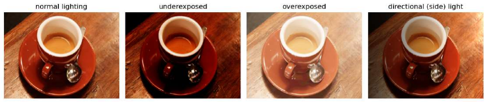

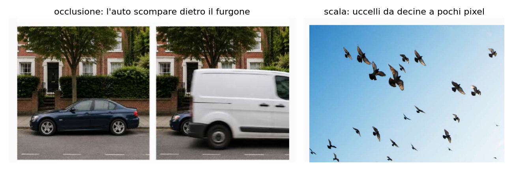

**Esempio svolto: la scala.** Riprendi h = f · H / Z con f espressa in pixel, f = 1000 px. Un uccello di 30 cm a 1 m occupa 1000 · 0,3 / 1 = 300 px; a 100 m ne occupa 3. In 3 pixel non ci sono becco né ali: servono elaborazione multi-scala e rappresentazioni invarianti.

**E le reti neurali?** Gli umani risolvono tutto questo in millisecondi, con un'enorme conoscenza a priori (slide 17). Le reti profonde addestrate su grandi dataset oggi eguagliano gli umani su molti compiti ristretti, ma **sbagliano in modo diverso**: esempi avversari (perturbazioni invisibili che cambiano la predizione) e distribution shift (dati di test diversi da quelli di addestramento). La slide 18 aggiunge che un sistema classico ha limiti comprensibili perché le ipotesi sono scritte, mentre **di una rete è difficile prevedere dove fallirà**.

> **Il punto**
> 
> Luce, punto di vista, occlusione, scala e variazione intra-classe cambiano i pixel senza cambiare la risposta. Un buon sistema deve essere insensibile a tutti questi fattori insieme, e sapere quando non lo è.

### 5 · Un sistema di visione completo, in piccolo (libro, cap. 2)

**Il problema.** Le slide dicono "servono prior" ma non mostrano come si usano. Il capitolo 2 del libro lo fa in un mondo giocattolo, il **mondo a blocchi** della tesi di Larry Roberts (MIT, 1963): oggetti con facce solo orizzontali o verticali, appoggiati su un piano bianco. Contiene in miniatura tutto il corso.

#### Il modello di formazione dell'immagine

Per semplicità il libro usa la **proiezione ortografica**: i raggi di luce **arrivano alla camera paralleli fra loro (è come una foto scattata da molto lontano con un forte zoom**; la prospettiva vera arriva in [L2](https://gabriele-marsili.github.io/appunti-magistrale-ai/anno-2/computer-vision/sito/#L2)). Il mondo ha coordinate X (destra), Y (alto), Z (profondità); la camera è inclinata di un angolo θ verso il terreno. **Un punto del mondo finisce nel pixel**

`x = X,  y = cos(θ) · Y − sin(θ) · Z`

**dove (x, y) sono le coordinate nell'immagine**, **(X, Y, Z) quelle del punto nel mondo** e θ l'inclinazione della camera. La seconda equazione è il cuore del problema: **altezza Y e profondità Z si mescolano in un solo numero y**.

**Esempio svolto.** Con θ = 60° si ha cos θ = 0,5 e sin θ ≈ 0,866, quindi y = 0,5·Y − 0,866·Z.

  - **Lo spigolo superiore di un blocco alto 2**, a profondità Z = 0: y = 0,5·2 − 0 = **1**.
  - Un punto del terreno (Y = 0) a profondità Z = −1,155: y = 0 + 0,866·1,155 = **1**.

Due punti diversi del mondo, stesso pixel. Tutti i punti con cos θ·Y − sin θ·Z = 1 formano una retta nel piano (Z, Y), e l'immagine non può distinguerli. Nella figura **le rette grigie sono i punti che finiscono nella stessa riga dell'immagine**.

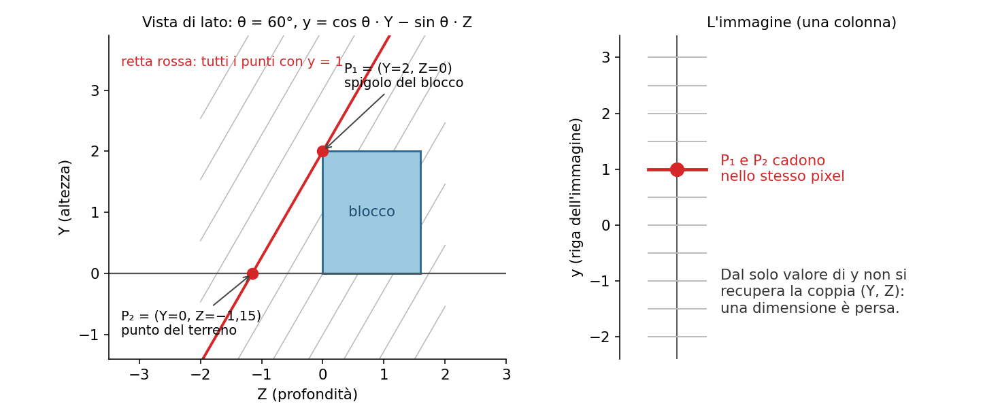

L'obiettivo del sistema è modesto ma concreto: per ogni pixel (x, y) ricostruire le **coordinate X, Y, Z del punto visibile. X è gratis (X = x)**; se conosciamo Y, Z si ricava invertendo la proiezione: Z = (cos θ · Y − y) / sin θ. Quindi **tutto si riduce a stimare l'altezza Y(x, y) di ogni pixel**.

#### Dai pixel ai bordi

**I bordi sono i punti in cui l'intensità ℓ(x, y) cambia bruscamente.** Si misurano con il **gradiente** ∇ℓ = (∂ℓ/∂x, ∂ℓ/∂y), approssimato con differenze fra pixel vicini:

`∂ℓ/∂x ≈ ℓ(x, y) − ℓ(x−1, y),   ∂ℓ/∂y ≈ ℓ(x, y) − ℓ(x, y−1)`

La **forza** del bordo è la norma ‖∇ℓ‖, la sua **orientazione** è l'angolo del vettore gradiente. Si tiene come bordo ciò che supera una soglia. **Numeri:** se un pixel vale 200 (terreno bianco) e quello alla sua sinistra 60 (blocco scuro), ∂ℓ/∂x ≈ 140; se sotto c'è ancora terreno, ∂ℓ/∂y ≈ 0. Il gradiente (140, 0) punta in orizzontale: il bordo è verticale. In [L5](https://gabriele-marsili.github.io/appunti-magistrale-ai/anno-2/computer-vision/sito/#L5) vedrai filtri migliori, perché le differenze semplici amplificano il rumore.

Poi i bordi vanno **interpretati**. Il libro ne distingue i tipi: bordi di **occlusione** (un oggetto davanti a un altro, salto di profondità), bordi di **contatto** (un oggetto **appoggiato sul terreno, nessun salto**), bordi dovuti a un **cambio di orientazione** della superficie (lo spigolo fra due facce), bordi d'**ombra**. Il terreno si riconosce facilmente: pixel bianchi e poco saturi.

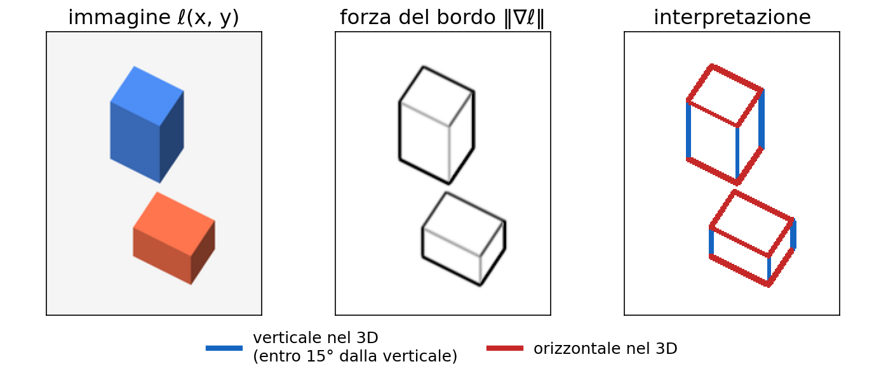

#### Il prior della vista generica

Come si decide se un bordo dell'immagine è verticale nel mondo? Con un prior, la **vista generica**: si assume che la camera non sia in una posizione "speciale". Segmenti che si toccano nel 3D si toccano anche nell'immagine, ma non vale il contrario: possono toccarsi nell'immagine per un allineamento casuale. **Se però il punto di vista non è "speciale", queste coincidenze sono improbabili e possiamo assumere che le proprietà dell'immagine riflettano quelle del mondo.**

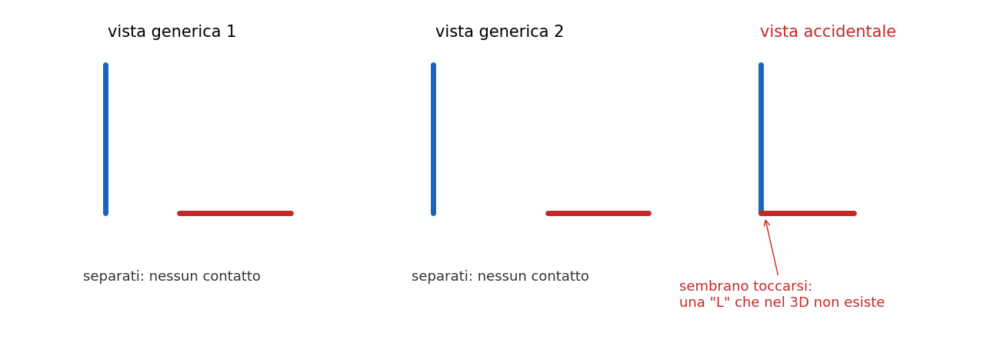

In pratica: un bordo quasi verticale nell'immagine (entro 15°) viene classificato come **bordo verticale nel 3D**, gli altri come orizzontali. **Il cap. 3 (§ 3.8) mostra che nelle foto vere le coincidenze accadono**: un motivo della fragilità delle regole fisse.

#### I prior diventano equazioni

**Ogni prior diventa un'equazione lineare** sulle incognite Y(x, y):

  - **terreno** e **bordi di contatto**: Y = 0;
  - **bordi verticali** nel 3D: lungo il bordo, salendo di un pixel nell'immagine l'altezza cresce di 1/cos θ, cioè ∂Y/∂y = 1/cos θ. Perché: su una faccia verticale Z è costante, quindi dalla proiezione dy = cos θ · dY;
  - **bordi orizzontali** nel 3D: l'altezza non cambia lungo il bordo, ∂Y/∂t = 0 con t la direzione del bordo nell'immagine;
  - **facce piane**: dentro una faccia Y varia linearmente, quindi **le derivate seconde sono nulle: ∂²Y/∂x² = 0, ∂²Y/∂y² = 0, ∂²Y/∂x∂y = 0**. **Questo vincolo "propaga" l'informazione dai bordi alle zone uniformi**, dove i pixel da soli non dicono niente.

Messe insieme, le equazioni formano un sistema **A·Y = b**, dove Y è il vettore di tutte le altezze (una per pixel), ogni riga di A è un vincolo e b contiene i termini noti (0 o 1/cos θ). Ci sono più equazioni che incognite e, per errori nei bordi, non tutte si possono soddisfare: si cerca la Y che le viola il meno possibile, minimizzando J = ∑ᵢ wᵢ (aᵢ·Y − bᵢ)², con aᵢ la riga i di A e wᵢ un peso di affidabilità. La soluzione (senza pesi) è

`Y = (AᵀA)⁻¹ Aᵀ b`

A è enorme (una colonna per pixel) ma **sparsa**: ogni equazione coinvolge pochi pixel vicini, quindi il sistema si risolve in fretta.

#### Esempio svolto: una colonna di sei pixel

Prendi una sola colonna dell'immagine, righe 0–5 dal basso, con θ = 60° (quindi 1/cos θ = 2). Le righe 0 e 1 sono terreno, la riga 2 è il bordo di contatto, le righe 2–5 sono la faccia frontale (verticale) di un blocco. Incognite: Y₀, …, Y₅. Vincoli:

  - **terreno e contatto: Y₀ = 0, Y₁ = 0, Y₂ = 0 (3 equazioni)**;
  - faccia verticale: Y₃ − Y₂ = 2, Y₄ − Y₃ = 2, Y₅ − Y₄ = 2 (3 equazioni);
  - faccia piana: Y₂ − 2Y₃ + Y₄ = 0, Y₃ − 2Y₄ + Y₅ = 0 (2 equazioni, derivata seconda discreta nulla).

Otto equazioni, sei incognite. Sono coerenti, e i minimi quadrati danno la soluzione esatta Y = (0, 0, 0, 2, 4, 6). Ricavando Z = (cos θ · Y − y)/sin θ, il bordo di contatto (riga 2) e la riga 4 hanno entrambi Z = −2,309: la faccia è davvero verticale. Ricostruito: un blocco alto 6.

Supponi ora che il rilevatore di bordi sbagli e fornisca Y₅ − Y₄ = 1. Le equazioni non sono più tutte soddisfacibili e i minimi quadrati distribuiscono l'errore: Y ≈ (0, 0, 0, 1,88; 3,63; 5). **Si ottiene un compromesso, non un crollo.**

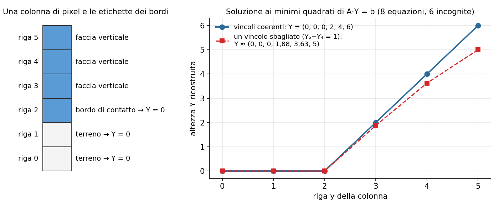

Il codice qui sotto fa esattamente questo. **La funzione vincolo(coef, val) trasforma un prior in una riga di A**: **coef è un dizionario {indice\_pixel: coefficiente} che riempie una riga r = np.zeros(6)**, val è il termine noto. Poi **A.append(r); b.append(val) aggiunge la riga al sistema**, e lstsq lo risolve ai minimi quadrati.

    import numpy as np
    c = np.cos(np.deg2rad(60))            # cos(theta) = 0.5
    A, b = [], []
    def vincolo(coef, val):               # coef: {indice_pixel: coefficiente}
        r = np.zeros(6)
        for k, v in coef.items(): r[k] = v
        A.append(r); b.append(val)
    for k in (0, 1, 2): vincolo({k: 1}, 0)                 # terreno, contatto
    for r in (2, 3, 4): vincolo({r+1: 1, r: -1}, 1/c)      # bordo verticale
    vincolo({2: 1, 3: -2, 4: 1}, 0); vincolo({3: 1, 4: -2, 5: 1}, 0)  # faccia piana
    Y = np.linalg.lstsq(np.array(A), np.array(b), rcond=None)[0]
    print(Y.round(2))                     # [0. 0. 0. 2. 4. 6.]

Il libro fa lo stesso su tutta l'immagine e poi **ri-renderizza** la scena da punti di vista nuovi: la grafica usata per verificare la visione.

#### Cosa insegna, e dove si rompe

Il libro prova il sistema anche fuori dalle sue ipotesi (§ 2.7): ombre nette, oggetti impilati, figure impossibili. **Spesso funziona ancora, ma niente lo garantisce.** E soprattutto il sistema **non capisce gli oggetti**: non sa contarli, non sa immaginare le facce nascoste. Per questo servono riconoscimento e apprendimento.

> **Il punto**
> 
> **Un problema mal posto diventa risolvibile aggiungendo prior**: **nel 1963 i prior si scrivevano a mano come equazioni, oggi una rete li impara dai dati** (Depth Anything, slide 42, stima la profondità da una sola immagine proprio così).

### 6 · Cosa ci insegna la percezione umana

**Il problema.** Se la visione è così mal posta, come facciamo noi a vedere senza sforzo? La parte centrale della lezione (slide 20–29, quasi tutte figure del cap. 3 del libro) risponde: **il nostro sistema visivo fa esattamente questo, usa prior fortissimi**, per lo più senza che ce ne accorgiamo.

#### Il significato non sta nel pixel

In un'immagine di pochi pixel per lato riconosciamo una persona che scrive alla scrivania con una tazza blu (slide 21–22). Ritagliate da sole, le stesse patch sono macchie di colore senza senso.

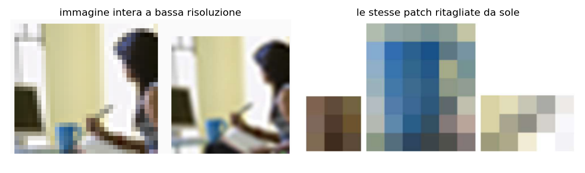

Il significato nasce dal contesto, non dal singolo pixel. Conseguenza per gli algoritmi: servono rappresentazioni che guardino regioni ampie (campo recettivo grande nelle CNN, attenzione globale nei ViT).

#### Il contesto completa la scena

In una foto sfocata di un ufficio "vediamo" una persona al telefono (slide 23). Nella foto nitida (slide 24) tiene all'orecchio una scarpa. Il cervello ha messo nella scena l'oggetto più probabile in quel contesto.

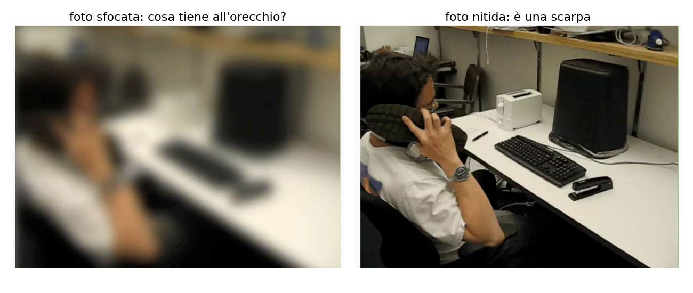

Il prior indovina quasi sempre, e **quando sbaglia sbaglia con sicurezza**.

#### Il cervello riempie i buchi

Nel **punto cieco** della retina, dove il nervo ottico esce dall'occhio, non ci sono fotorecettori (slide 25). Eppure non vediamo un buco: il cervello interpola con ciò che c'è intorno. Prova il test della slide.

#### Percepire non è misurare

Nell'illusione della scacchiera di Adelson (slide 26) i quadrati A e B hanno lo stesso grigio, ma B ci sembra chiaro perché è in ombra.

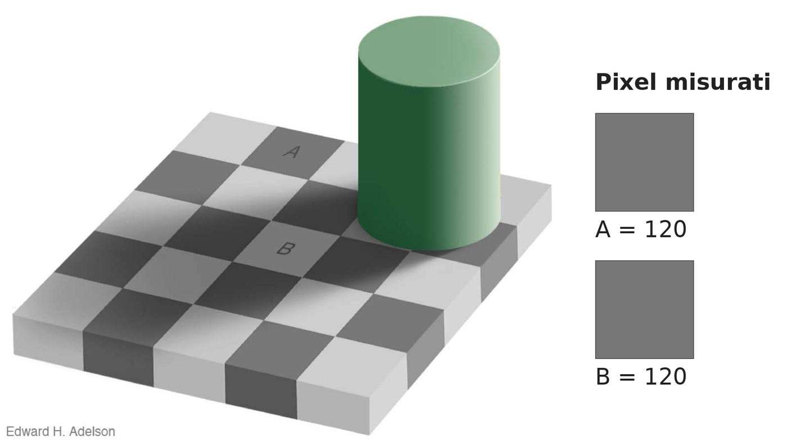

Il sistema visivo stima la **riflettanza**: la frazione di luce che una superficie rimanda, cioè il suo "colore vero", scontando l'ombra. **Numeri:** se B riceve metà della luce di A e lo vediamo con lo stesso valore 120, allora deve rimandare il doppio della luce: è una casella chiara. **Come misura sbaglia**, **come risposta sulla scena è giusto**. **L'uscita della visione sono proprietà del mondo, non intensità.**

#### Prospettiva e mosso

Lo stesso disegno di linee, ruotato di 90°, si legge come pavimento o come muro (slide 27), a seconda di dove sta la retta che unisce i punti di fuga: ci aspettiamo che l'orizzonte sia orizzontale. È un altro prior.

Anche i difetti portano informazione (slide 28). In una foto scattata da un'auto in corsa gli oggetti vicini sono più mossi di quelli lontani.

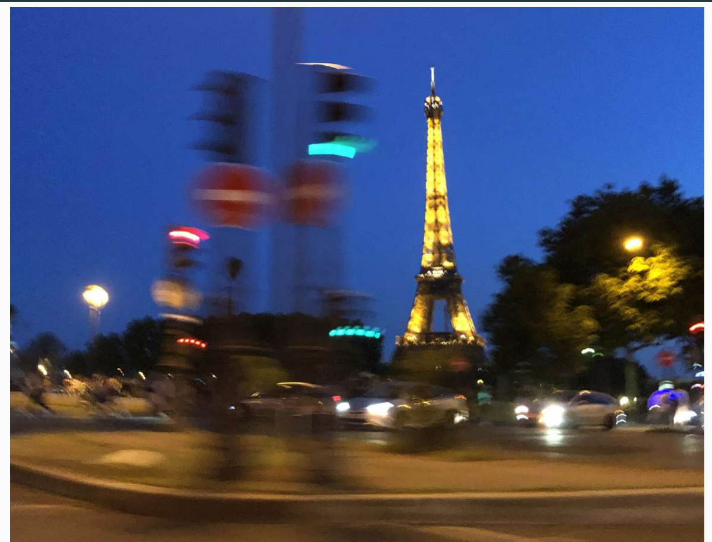

Perché: durante l'esposizione T l'auto si muove a velocità v, e un oggetto a distanza Z si sposta nell'immagine di circa f · v · T / Z pixel. **Esempio:** f = 1000 px, v = 10 m/s (36 km/h), T = 1/30 s. Un semaforo a 5 m si sposta di 1000 · 10 / 30 / 5 ≈ 67 px; la Torre a 1 km di 0,3 px. **Il mosso codifica la profondità relativa.** L'immagine mossa è la media di copie traslate della scena: è una **convoluzione**, che ritrovi in [L3](https://gabriele-marsili.github.io/appunti-magistrale-ai/anno-2/computer-vision/sito/#L3) e [L5](https://gabriele-marsili.github.io/appunti-magistrale-ai/anno-2/computer-vision/sito/#L5).

> **Il punto**
> 
> **Cosa ci insegna la percezione umana**: usa contesto, riempimento, prospettiva e perfino il mosso per scegliere la scena più plausibile. Per sistemi robusti servono prior simili a quelli umani, e oggi si imparano dai dati (sintesi della slide 29).

### 7 · Vedere è inferire: Helmholtz e Bayes

**Il problema.** Gli esempi del paragrafo 6 sono curiosità o c'è una teoria che li unisce?

**L'idea.** Il quadro è di Helmholtz (cap. 1 del libro): la percezione è **inferenza inconscia**: vediamo la scena che più probabilmente avrebbe prodotto ciò che arriva agli occhi. In linguaggio moderno è un'inferenza bayesiana:

`P(scena | immagine) ∝ P(immagine | scena) · P(scena)`

P(scena | immagine) è il **posteriore**, quello che vogliamo. P(immagine | scena) è la **verosimiglianza**: quanto quella scena spiega i pixel osservati (è il modello diretto, la grafica). P(scena) è il **prior**: quanto è plausibile quella scena a priori. Il simbolo ∝ vuol dire "proporzionale": alla fine si divide per la somma.

La formula dice: quando l'immagine è povera (sfocata, piccola, ambigua) la verosimiglianza è quasi uguale per molte scene e decide il prior; quando l'immagine è chiara, decide la verosimiglianza.

**Esempio svolto** (numeri inventati per la scena della scarpa). Quattro ipotesi su cosa tiene all'orecchio, con prior telefono 0,55, tazza 0,30, banana 0,10, scarpa 0,05.

  - **Foto sfocata**: verosimiglianze quasi uguali (0,27; 0,22; 0,24; 0,27). Prodotti: 0,149; 0,066; 0,024; 0,014, somma 0,252. Posteriore del telefono 0,149 / 0,252 ≈ **0,59**: vince il prior.
  - **Foto nitida**: verosimiglianze 0,03; 0,02; 0,03; 0,92. Prodotti: 0,017; 0,006; 0,003; 0,046, somma 0,072. Posteriore della scarpa 0,046 / 0,072 ≈ **0,64**: i dati battono il prior, anche se la scarpa partiva da 0,05.

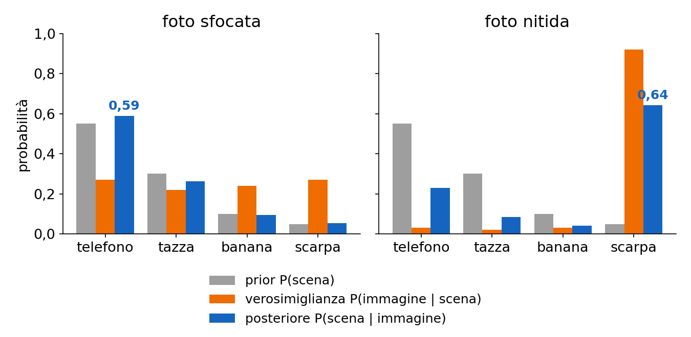

> **Il punto**
> 
> Vedere = scegliere la scena con il posteriore più alto. Il prior conta tanto più quanto l'immagine è povera: è il meccanismo dietro il mondo a blocchi, le illusioni e le reti addestrate.

### 8 · Breve storia: tre modi di programmare la visione

**Il problema.** La slide 19 elenca decenni di metodi. C'è un filo?

**L'idea.** Le tappe **si leggono meglio, come fa il libro (cap. 1), come tre modi di costruire un sistema visivo**, cioè tre modi di inserire i prior:

  - **regole scritte a mano** (anni '60–'80: mondo a blocchi, primi rilevatori di bordi, stereo, flusso ottico);
  - **algoritmi derivati da un modello del mondo** (anni '90–2000: corner di Harris, SIFT, RANSAC, structure-from-motion, geometria multi-vista, con **feature progettate e classificatori "superficiali" come SVM e boosting**);
  - **apprendimento dai dati** (dal 2012 le CNN; dal 2017 **transformer, ViT, self-supervised**, foundation model e modelli visione-linguaggio).

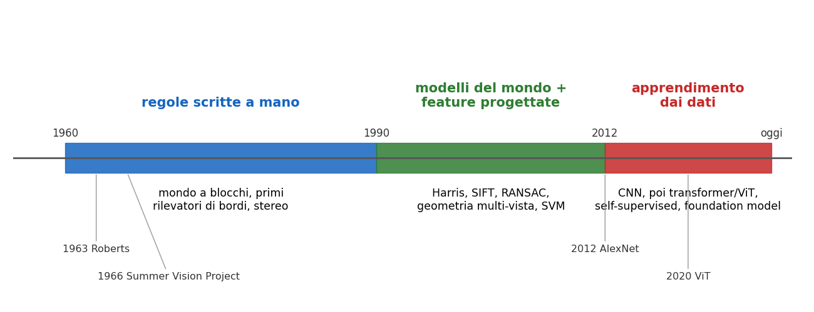

**Un numero per capire il salto del 2012.** Nella gara ImageNet di quell'anno AlexNet sbagliò la top-5 (la classe giusta non è fra le 5 più probabili) sul 15,3% delle immagini, contro il 26,2% del miglior metodo a feature progettate. Da lì il riconoscimento è passato all'apprendimento.

Il corso li attraversa in quest'ordine perché i metodi classici spiegano **cosa** le reti devono imparare (bordi, scale, corrispondenze, geometria), e nei sistemi moderni spesso convivono.

> **Il punto**
> 
> La storia della visione è la storia di dove stanno i prior: nel codice, nel modello del mondo, nei dati.

### 9 · I quattro temi unificanti

**Il problema.** Il corso tocca decine di argomenti. Serve una chiave di lettura per non perdersi.

**L'idea.** **Le slide 30–37 indicano quattro idee che tornano in quasi ogni argomento**: corrispondenza, vincoli geometrici, rappresentazioni apprese, coerenza temporale.

#### Corrispondenza

**Corrispondenza**: date due immagini della stessa scena, trovare quale punto dell'una corrisponde a quale dell'altra (slide 32–33). Serve per panorami, stereo, tracking, ricostruzione 3D. La ricetta classica: rilevare punti distintivi (**keypoint**), descriverli con un vettore, accoppiare i descrittori simili. È il contenuto di [L8](https://gabriele-marsili.github.io/appunti-magistrale-ai/anno-2/computer-vision/sito/#L8) e [L9](https://gabriele-marsili.github.io/appunti-magistrale-ai/anno-2/computer-vision/sito/#L9).

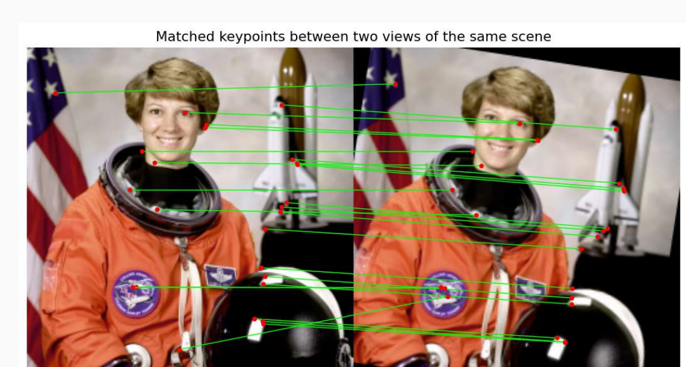

#### Vincoli geometrici

Le camere seguono un modello preciso, la proiezione prospettica, e questo vincola come i punti si muovono fra le viste (slide 34). Per una scena piana (o una camera che ruota senza spostarsi) due immagini sono legate da una sola matrice 3×3, l'**omografia**: dato un punto, il corrispondente è determinato. Per una scena qualsiasi vale il più debole **vincolo epipolare**: il corrispondente sta su una retta, e la ricerca passa da 2D a 1D. I vincoli servono anche a scartare i match sbagliati.

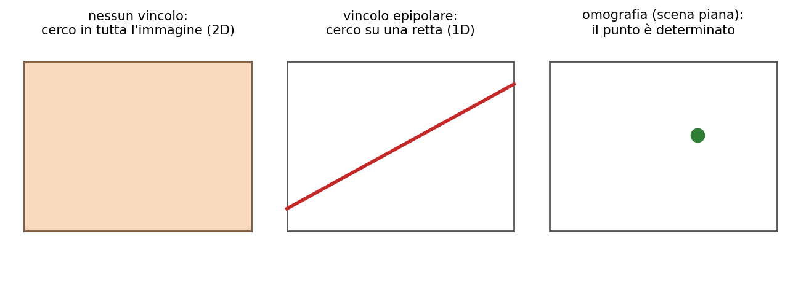

**Numeri:** in un'immagine 1000×1000 senza vincoli i candidati sono un milione; sulla retta epipolare circa mille; con l'omografia uno.

Il caso più semplice è la **triangolazione**: due viste con posizioni note fissano un punto all'incrocio dei raggi (slide 35). Una vista sola dà solo la direzione. L'esempio della barca (cap. 40 del libro): due osservatori a distanza t (la **baseline**) misurano gli angoli α e β fra la costa e la barca. La distanza della barca dalla costa è

`d = t · sin(α) · sin(β) / sin(α + β)`

Derivazione: il terzo angolo del triangolo è 180° − α − β, con seno sin(α + β); per il teorema dei seni il lato dall'osservatore con angolo α alla barca vale t · sin β / sin(α + β), e per sin α dà l'altezza d. **Numeri:** t = 100 m, α = β = 60°: d = 100 · 0,866 · 0,866 / 0,866 ≈ 86,6 m, l'altezza di un triangolo equilatero di lato 100. **Con una baseline piccola rispetto a d, sin(α + β) tende a zero e un piccolo errore sugli angoli cambia molto d**: per questo lo stereo con camere vicine stima male gli oggetti lontani.

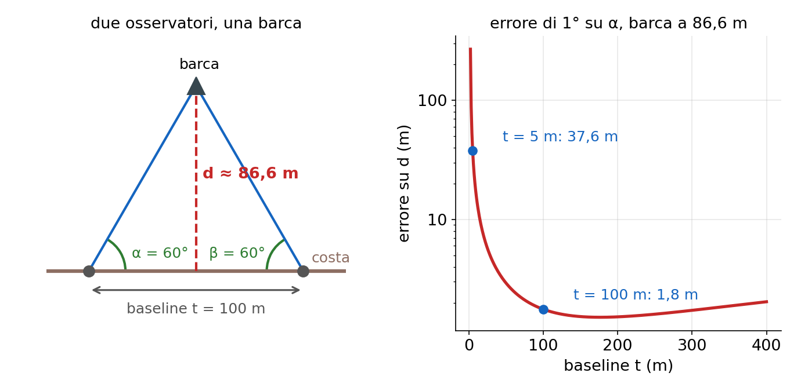

Attenzione alla figura della slide 35: solo il pannello di destra è triangolazione. **Il pannello di sinistra della figura della slide usa invece una vista sola più un'altezza nota** h, cioè un prior: d = h / tan(α) (vedi la scheda della slide 35).

#### Apprendimento di rappresentazioni

Una **rappresentazione** trasforma i pixel in un vettore più utile (slide 36). Deve essere **invariante** ai fattori di disturbo (luce, punto di vista, scala) e **discriminativa** per ciò che conta (identità, categoria).

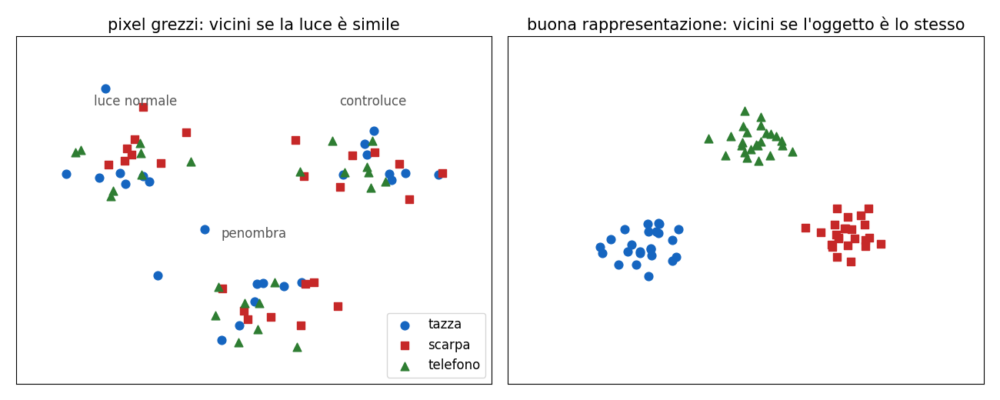

**Esempio svolto.** Prendi una foto 100×100 in grigi di una tazza e una seconda foto identica ma più luminosa, con ogni pixel +50. Come vettori di pixel distano 50 · √10 000 = 5000: per un confronto pixel a pixel sono molto diverse. Ora usa come rappresentazione "pixel meno la loro media": la media sale di 50 in entrambe, la differenza si annulla e le due foto coincidono, distanza 0. Hai ottenuto invarianza alla luminosità.

**Le due richieste tirano in direzioni opposte**: una costante è invariante a tutto e inutile, i pixel grezzi distinguono tutto e non sono invarianti a niente; **l'invarianza alla rotazione aiuta a riconoscere una tazza ma confonde "6" e "9"**. Classicamente la rappresentazione si progetta (SIFT, [L8](https://gabriele-marsili.github.io/appunti-magistrale-ai/anno-2/computer-vision/sito/#L8)), oggi si impara (CNN, ViT, DINOv3 alla slide 43).

#### Coerenza temporale

Nei video frame consecutivi sono molto simili (slide 37). **Coerenza temporale**: le uscite (identità, posizione, etichetta di un oggetto) non devono "sfarfallare" da un frame all'altro. È la corrispondenza applicata al tempo invece che a viste diverse: tracking, flusso ottico.

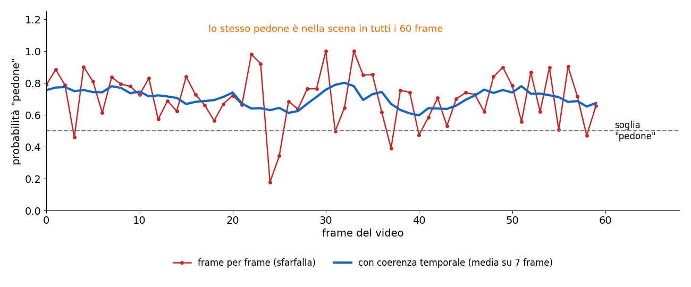

Il modo più semplice di imporla è una media mobile: st = (1/7) · ∑k=−3…3 pt+k, dove pt è la probabilità data dal detector al frame t e st quella "lisciata". Per un'auto a guida autonoma un pedone che sparisce per un frame è un problema serio; il prior "gli oggetti non spariscono da un frame all'altro" lo evita.

Gli esempi di stato dell'arte (slide 38–45) si leggono con questi temi: Depth Anything (profondità da una vista con prior appresi), DINOv3 (rappresentazioni senza etichette), SAM 2 (segmentazione nel tempo), D4RT (tutti e quattro; **il secondo link della slide 45 è sbagliato**, vedi la scheda).

> **Il punto**
> 
> Corrispondenza, vincoli geometrici, rappresentazioni e coerenza temporale sono i quattro modi in cui il corso aggiunge informazione a un'immagine che da sola non basta.

### 10 · La mappa del corso

**Il problema.** Dove si colloca ciascuna lezione rispetto a tutto questo? **La mappa del corso** (slide 47–50) ha quattro parti, e ognuna corrisponde ad alcuni dei temi appena visti.

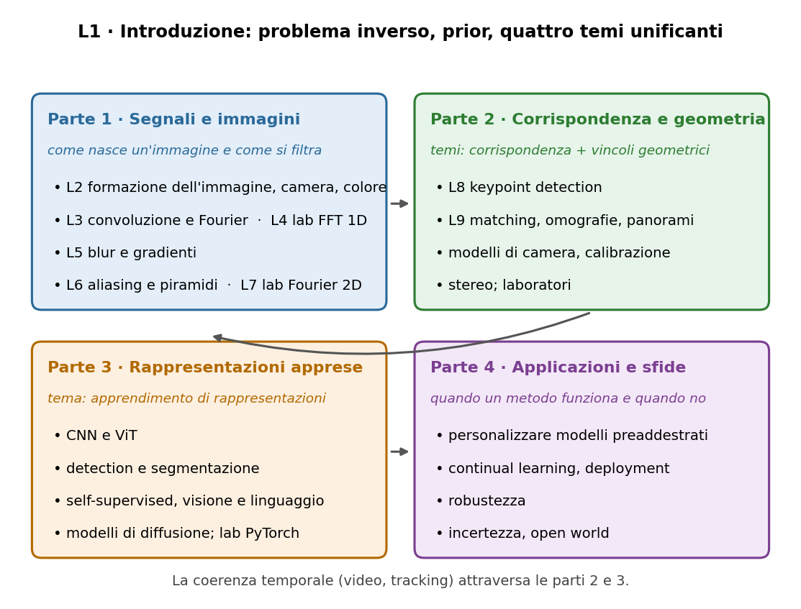

  - **Parte 1 · Segnali e immagini** ([L2](https://gabriele-marsili.github.io/appunti-magistrale-ai/anno-2/computer-vision/sito/#L2)–[L7](https://gabriele-marsili.github.io/appunti-magistrale-ai/anno-2/computer-vision/sito/#L7)): come nasce un'immagine (camera pinhole, luce, colore: il modello diretto della slide 11), poi l'immagine come segnale: convoluzione e Fourier, filtri di blur e derivate, campionamento e aliasing, piramidi multiscala. Qui hanno la loro teoria il gradiente del mondo a blocchi, il motion blur, la scala degli uccelli lontani.
  - **Parte 2 · Corrispondenza e geometria** (da [L8](https://gabriele-marsili.github.io/appunti-magistrale-ai/anno-2/computer-vision/sito/#L8)): keypoint e descrittori, matching, omografie e panorami, poi modelli di camera e prospettiva, calibrazione, stereo.
  - **Parte 3 · Rappresentazioni apprese**: CNN e ViT, detection e segmentazione, self-supervised, modelli visione-linguaggio, diffusione, con laboratori in PyTorch. Le CNN sono banchi di filtri appresi: con la parte 1 non restano scatole nere.
  - **Parte 4 · Applicazioni avanzate e sfide**: adattare modelli preaddestrati, continual learning, deployment, robustezza, incertezza e mondo aperto. È la risposta sistematica alle domande della slide 18.

**Organizzazione** (slide 51–57): esame **solo orale**, forse preceduto da un breve test a risposta multipla, niente prove intermedie; laboratori su notebook non valutati (scrivi prima cosa ti aspetti, poi cosa hai visto); strumenti numpy/scipy, OpenCV, Kornia, PyTorch e timm; libri: il **visionbook** di Torralba, Isola e Freeman per la visione, Prince e Goodfellow per il deep learning.

**Come usare il sito:** dispensa (questa sezione), poi schede slide per slide per il ripasso, poi "Studia dal libro" e la guida allo studio con le domande tipo orale. **Le slide riassumono, spesso in modo impreciso, il visionbook**: il libro è la fonte per capire, le slide l'indice di cosa chiede l'esame.

> **Il punto**
> 
> Prima i segnali, poi corrispondenza e geometria, poi le reti, poi le sfide: ogni parte usa la precedente. L'esame è orale, quindi allenati a spiegare a voce.

### Il riassunto in 10 righe

1.  La visione ricava dalle immagini cosa c'è nella scena e dove (Marr).
2.  È il problema inverso della grafica: dall'immagine alla scena.
3.  È mal posta: la proiezione 3D → 2D perde una dimensione, infinite scene danno la stessa immagine.
4.  In più ci sono i disturbi: luce, punto di vista, occlusione, scala, variazione intra-classe.
5.  Si risolve aggiungendo prior, ipotesi su come è fatto il mondo.
6.  Nel mondo a blocchi i prior sono equazioni lineari sulle altezze, risolte ai minimi quadrati: Y = (AᵀA)⁻¹Aᵀb.
7.  La percezione umana fa lo stesso: contesto, riempimento, riflettanza invece di luce; è inferenza bayesiana (Helmholtz).
8.  La storia va da regole a mano, a modelli del mondo, all'apprendimento dai dati.
9.  Quattro temi tornano ovunque: corrispondenza, vincoli geometrici, rappresentazioni, coerenza temporale.
10. Il corso li segue in ordine: segnali, corrispondenza e geometria, rappresentazioni apprese, applicazioni e sfide.

### Verifica di aver capito

**Perché si dice che la visione è un problema mal posto? Spiegalo con l'equazione del mondo a blocchi.**

Un problema è ben posto se la soluzione esiste, è unica e stabile. Con y = cos θ · Y − sin θ · Z altezza e profondità finiscono in un solo numero: tutti i punti sulla retta cos θ · Y − sin θ · Z = costante cadono nello stesso pixel (con θ = 60°, sia (Y = 2, Z = 0) sia (Y = 0, Z = −1,155) danno y = 1). Manca l'unicità; servono prior per scegliere.

**Perché il sistema usa i minimi quadrati invece di risolvere esattamente le equazioni?**

Le equazioni sono più delle incognite e, per errori nella classificazione dei bordi, non sono tutte compatibili. I minimi quadrati trovano le altezze che violano meno i vincoli nel complesso, distribuendo l'errore invece di fallire (nella colonna di esempio Y ≈ 0; 0; 0; 1,88; 3,63; 5 invece di 0; 0; 0; 2; 4; 6).

**Cosa mostra l'illusione di Adelson su quale sia l'uscita di un sistema visivo?**

A e B hanno lo stesso valore di grigio, ma vediamo B più chiaro perché il sistema visivo stima la riflettanza della superficie scontando l'ombra. L'uscita della visione non è la quantità di luce ma proprietà della scena: come misura è sbagliata, come percezione è giusta.

**Nella formula di Bayes, quando vince il prior e quando la verosimiglianza? Usa l'esempio della scarpa.**

Con la foto sfocata le verosimiglianze sono quasi uguali per tutte le ipotesi, quindi il posteriore segue il prior e vince "telefono" (0,59). Con la foto nitida la verosimiglianza della scarpa è 0,92 contro 0,02–0,03 delle altre e vince la scarpa (0,64) anche se il suo prior era solo 0,05.

**Due osservatori a 100 m di distanza vedono una barca con angoli α = β = 60°. Quanto dista la barca dalla costa? Cosa succede se la baseline si riduce molto?**

d = t sin α sin β / sin(α + β) = 100 · 0,866 · 0,866 / 0,866 ≈ 86,6 m. Con baseline piccola α + β si avvicina a 180°, il denominatore tende a zero e piccoli errori sugli angoli producono grandi errori su d.

**Perché invarianza e discriminatività di una rappresentazione sono in tensione? Fai un esempio.**

Più una rappresentazione ignora (luce, rotazione, scala), meno informazione resta per distinguere: una costante è invariante a tutto e inutile. L'invarianza alla rotazione aiuta a riconoscere un oggetto ruotato ma rende uguali "6" e "9".

### Come proseguire

  - [Cap. 1 · The Challenge of Vision](https://visionbook.mit.edu/taxonomy.html): la lettura indicata dalle slide; soprattutto § 1.2 (input e output della visione), § 1.3.2 (Helmholtz), § 1.3.6 (Marr), § 1.3.7–1.3.8 (storia).
  - [Cap. 2 · A Simple Vision System](https://visionbook.mit.edu/simplesystem.html): tutto, è il sistema del paragrafo 5 con le figure vere della ricostruzione.
  - [Cap. 3 · Looking at Images](https://visionbook.mit.edu/visionscience.html): senza formule, da leggere guardando le figure; contano § 3.2, 3.6, 3.7, 3.8, 3.11.
  - I dettagli su cosa leggere e cosa saltare sono nella sezione "Studia dal libro" in fondo alla pagina.

Ora ripassa con le schede qui sotto, slide per slide, e poi passa alle domande della guida allo studio. La lezione successiva è [L2](https://gabriele-marsili.github.io/appunti-magistrale-ai/anno-2/computer-vision/sito/#L2), formazione dell'immagine: il modello diretto che qui abbiamo usato in versione semplificata.
