# L2 · Formazione immagine

*Lezione 2 · Antonio Carta · 2 settembre 2026*

[Versione interattiva sul sito, con videolezione](https://gabriele-marsili.github.io/appunti-magistrale-ai/anno-2/computer-vision/sito/#L2) · [Indice della dispensa](README.md)

**In una frase:** una foto è il risultato di una catena fisica (luce che rimbalza su un materiale, raggi scelti da un foro o da una lente, un sensore che somma luce, tre numeri per il colore) e ogni anello della catena butta via informazione; questa lezione costruisce il *modello diretto* che la visione dovrà poi invertire.

### Prima di iniziare

  - **Prodotto scalare** fra vettori **unitari: n · p = cos θ**, con θ angolo fra i due.
  - **Triangoli simili**: stessi angoli, lati in proporzione.
  - **Algebra lineare**: inversa, trasposta, autovalori di una matrice simmetrica, nucleo e teorema rango-nullità, gradiente di una forma quadratica.
  - Dalla [L1](https://gabriele-marsili.github.io/appunti-magistrale-ai/anno-2/computer-vision/sito/#L1): la visione è un *problema inverso*, risalire dall'immagine alla scena (la grafica fa il contrario).

### Guarda prima questi video

Lezioni brevi di Shree Nayar (Columbia). Per la camera come sistema lineare basta il cap. 7 del libro.

  - [Reflectance Models](https://www.youtube.com/watch?v=HPNW0we-ft0) (Video). Shree Nayar. Guardalo tutto: modello lambertiano e riflessione speculare spiegati con esempi. Ti serve per le sezioni 2–4.
  - [Pinhole and Perspective Projection](https://www.youtube.com/watch?v=_EhY31MSbNM) (Video). Shree Nayar. Guardalo tutto: perché serve un foro, derivazione di x = fX/Z, punto di fuga. Sezioni 5 e 7–8.
  - [Image Formation using Lenses](https://www.youtube.com/watch?v=7LX-19v_9ns) (Video). Shree Nayar. Facoltativo: equazione della lente sottile e perché la lente non cambia la geometria del pinhole (sezione 6).
  - [Sensing Color](https://www.youtube.com/watch?v=V4y3K6zoUQs) (Video). Shree Nayar. Guarda la parte iniziale su spettro e sensibilità: come un sensore riduce uno spettro a tre numeri (sezioni 13–15).

### 1\. Il quadro: modello diretto e tre perdite

**Il problema.** Un'auto a guida autonoma vede un pedone: è alto o è vicino? Quella macchia scura è un'ombra o asfalto bagnato? Per rispondere bisogna sapere come la scena è diventata pixel.

**L'idea.** **Una foto è l'output di una funzione**: in ingresso la scena, in uscita una matrice di numeri. **Per invertirla bisogna saperla scrivere e sapere dove non è iniettiva**, cioè dove scene diverse danno la stessa immagine. Lì nessun algoritmo le distingue senza **informazione aggiuntiva** (altre viste, conoscenze a priori, modelli appresi).

**La catena (slide 5): scena → ottica (foro o lente) → sensore → ISP**. Il sensore somma la luce che cade su ogni pixel; l'ISP del telefono fa demosaicing, bilanciamento del bianco e **gamma**. Alla fine (slide 71) avrai tre perdite:

1.  **geometrica**: la prospettiva confonde dimensione e profondità;
2.  **lineare**: la camera mescola i valori della scena con una matrice A, e invertirla è instabile;
3.  **spettrale**: il colore riduce uno spettro a tre numeri e mescola materiale e luce.

**Un'ipotesi regge tutto: la linearità della luce** (slide 10). Con due sorgenti, **la luce riflessa è la somma dei contributi** di ciascuna: lampada da sola 0.3, finestra da sola 0.5, insieme 0.8. Vale per il dato grezzo (raw). In un JPEG la gamma (circa valore1/2.2) la rompe: 0.3 e 0.5 diventano 0.58 e 0.73, ma 0.8 diventa 0.90, non 1.31.

> **Il punto**
> 
> Prima di invertire la formazione dell'immagine bisogna scriverla. Ogni stadio perde informazione: geometrica, lineare, spettrale. La luce raw è lineare, e questo rende tutto trattabile.

### 2\. Luce e superfici: BRDF e Lambert

**Il problema.** **Un pixel misura la luce che lascia un punto verso la camera**, e **questa dipende da quanta luce arriva, da dove, dall'orientazione della superficie** e dal materiale. Come lo scriviamo?

**L'idea** (slide 7). In un bagno buio un solo raggio laser sul lavandino tinge di rosa tutta la stanza: una superficie opaca sparpaglia ogni raggio in molte direzioni. Il modo in cui lo fa è la "firma" del materiale, la **BRDF (bidirectional reflectance distribution function**, slide 9):

`ℓout = F(ℓin, n, p, q, λ)`

**ℓin e ℓout: intensità del raggio entrante e uscente; n: normale alla superficie (unitaria); p: vettore unitario che punta dalla superficie verso la sorgente; q: direzione uscente (verso la camera)**; λ: lunghezza d'onda. "Bidirezionale": dipende da due direzioni, p e q.

Il caso più semplice è la **superficie lambertiana**, **perfettamente opaca (carta, gesso, intonaco), che rimanda la luce allo stesso modo in tutte le direzioni** (slide 11):

`ℓout = a · ℓin(λ) · (n · p)`

**a è l'albedo**, un **numero fra 0 e 1 che dice quale frazione della luce viene rimandata**. n · p = cos θ, con θ angolo fra normale e luce. **q non compare: la superficie ha la stessa luminosità da qualunque punto la guardi**.

Perché il coseno? Un fascio inclinato **si spalma su un'area 1/cos θ volte più grande**, quindi ogni punto riceve meno luce. **Se n · p \< 0 la luce sta dietro la superficie**: si usa max(0, n · p).

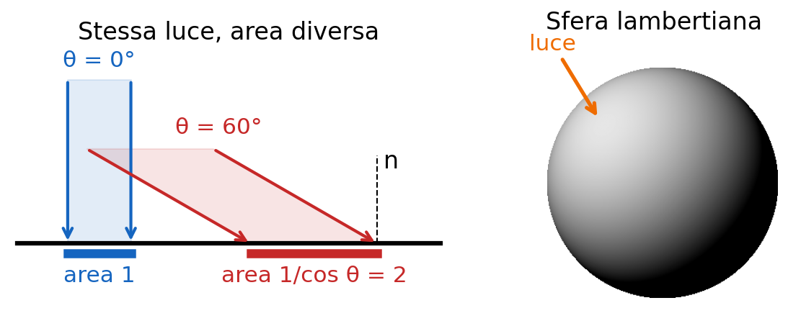

**Esempio.** a = 0.6, luce 1 a θ = 60°: ℓout = 0.6 · 0.5 = 0.3. A θ = 0 il massimo, 0.6; a θ = 90° (luce radente) zero. Poiché lo shading dipende dalla normale, si può tentare di risalire alla forma (*shape from shading*).

> **Il punto**
> 
> La BRDF descrive il materiale. Una superficie lambertiana dipende da albedo, luce e angolo normale-luce, non dal punto di vista.

### 3\. Riflessi: il modello di Phong

**Il problema.** Sul cofano di un'auto c'è un punto bianco che si sposta quando ti muovi. Lambert non lo prevede, perché q non compare.

**L'idea.** Plastica, metallo, ceramica smaltata **hanno in più un riflesso brillante (highlight)**, come uno specchio. Phong (slide 13–14) somma tre termini, grazie alla linearità:

`ℓout = ka + a · ℓin (n · p) + ks (r · q)α ℓin`

**ka è un termine ambientale** costante (approssima **la luce rimbalzata dal resto della stanza); il secondo è il termine diffuso di Lambert**; il terzo è lo speculare. r è la direzione di uno specchio perfetto, p ribaltato rispetto alla normale:

`r = 2 (n · p) n − p`

r · q vale 1 se guardi esattamente "nello specchio" e cala se ti sposti. ks regola la forza del riflesso, α (shininess) quanto è stretto: più α è grande, più (r · q)α crolla lontano da r.

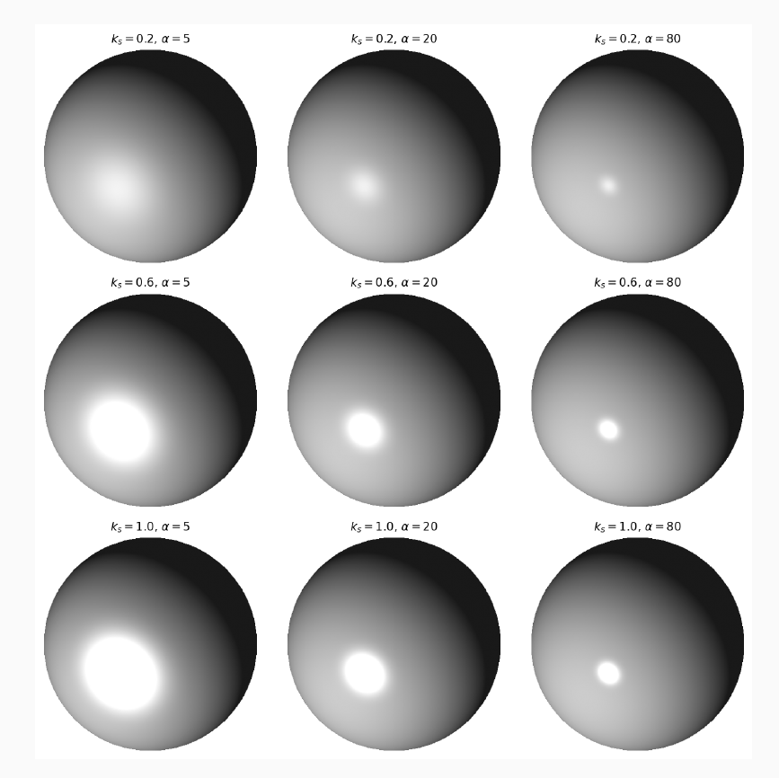

**Esempio** **svolto.** In 2D con n = (0, 1) e luce a 60°: p = (−0.866, 0.5), n · p = 0.5, r = 2 · 0.5 · (0, 1) − p = (0.866, 0.5), simmetrico a p. Con a = 0.6, ℓin = 1, ka = 0.05, ks = 0.4, α = 20:

  - camera lungo r: r · q = 1, ℓout = 0.05 + 0.3 + 0.4 = 0.75;
  - camera **lungo la normale**: r · q = 0.5, 0.520 ≈ 10−6, **ℓout ≈ 0.35. Il riflesso è sparito.**

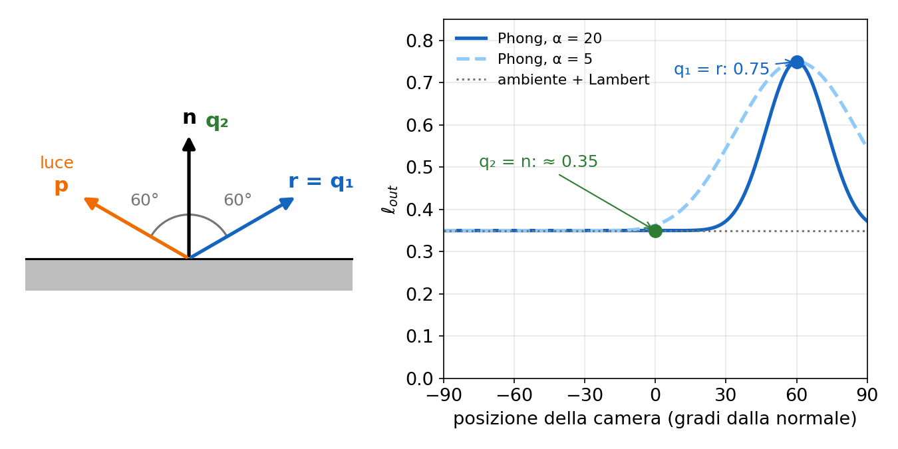

Perché importa? **Lo stesso punto ha valori diversi da due punti di vista, e questo disturba il confronto fra immagini** (stereo, tracking, matching di [L8](https://gabriele-marsili.github.io/appunti-magistrale-ai/anno-2/computer-vision/sito/#L8)). Phong è empirico (slide 17), ma cattura l'essenziale.

> **Il punto**
> 
> Phong = ambiente + diffuso + speculare. Il termine ks(r · q)α dipende dalla vista: gli highlight si spostano con l'osservatore.

### 4\. La prima ambiguità: materiale, luce, forma

**Il problema.** Foto di un dolce su Instagram: è dorato perché è cotto bene o perché la vetrina ha luci calde?

**L'idea.** **La prima ambiguità: materiale contro luce e forma.** In a · ℓin · cos θ ci sono tre incognite moltiplicate. **Un pixel scuro può essere un materiale scuro (a piccolo), una zona poco illuminata (ℓin piccolo) o una superficie inclinata rispetto alla luce** (cos θ piccolo): da solo non lo dice (slide 18–19).

**Esempio.** Tre pixel che valgono 0.3: (a = 0.3, ℓin = 1, θ = 0), (a = 0.6, ℓin = 0.5, θ = 0), (a = 0.6, ℓin = 1, θ = 60°). Tre mondi, stesso numero.

> **Il punto**
> 
> Geometria, luce e materiale si moltiplicano: dal pixel non si separano. La stessa struttura torna nel colore (sezione 14).

### 5\. Perché serve una camera: il pinhole

**Il problema.** **Un muro bianco davanti a una finestra riceve la luce di tutta la stanza. Perché non ci vediamo sopra l'immagine della finestra?** Perché ogni punto del muro riceve luce da tutte le direzioni **e la somma**:

`ℓout = ∫p a · ℓin(p) · (n · p) dp`

L'integrale corre sulle **direzioni p della semisfera sopra la superficie. Il risultato è un solo numero** per punto, quasi uguale per punti vicini: "da dove arriva cosa" è mediato via. La slide 21 (e il libro, § 5.3) scrive cos(n · p), un refuso perché n · p è già il coseno: **la versione corretta è quella sopra** (riquadro della slide 21 qui sotto).

**L'idea.** **Formare un'immagine vuol dire impedire l'integrazione**: ogni punto deve ricevere luce da una sola direzione. Basta **mettere davanti al muro una barriera con un piccolo foro** (slide 22–23). **Ora un punto del muro riceve la luce di un solo punto della scena: l'integrale diventa una corrispondenza uno a uno** fra punti della scena e dell'immagine.

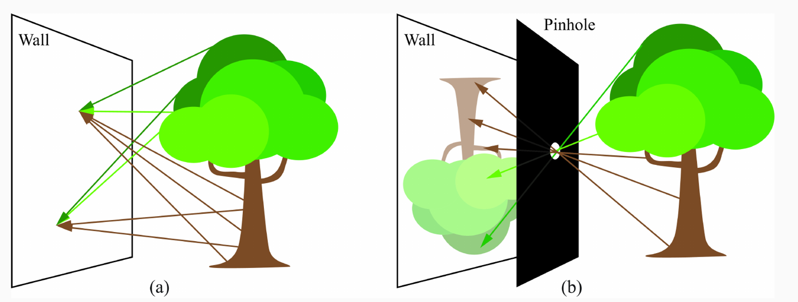

L'immagine (slide 24) è **capovolta**, **scura** (passa poca luce) e un po' **sfocata** (il foro non è un punto). Le macchie rotonde di sole sotto un albero sono immagini pinhole.

**Esempio.** Scena di tre punti: verde, rosso, blu. Senza foro ogni punto del muro riceve la media, un grigio uniforme. Con il foro tre punti del muro ricevono verde, rosso, blu.

> **Il punto**
> 
> Una camera organizza i raggi: un raggio per punto immagine. Il pinhole ideale realizza la proiezione prospettica.

### 6\. Il compromesso e la lente

**Il problema.** Col pinhole **nitidezza e luminosità sono in conflitto** (slide 26): un foro piccolo dà un'immagine nitida ma buia; allargandolo, ogni punto della scena manda luce **attraverso tutta l'apertura** e si spalma su una macchia: **l'immagine diventa luminosa** ma sfocata.

**L'idea.** **La lente rompe il compromesso**: raccoglie i raggi di un punto su tutta l'apertura e li fa **riconvergere in un solo punto**.

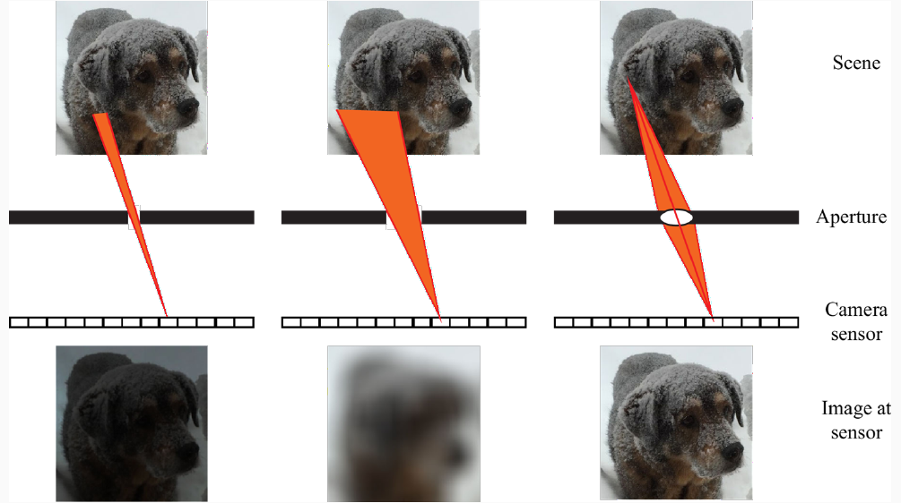

**La matematica.** **Il libro (cap. 6) ricava la condizione di fuoco per una lente sottile**:

`1/a + 1/b = 1/f`

**a è la distanza dell'oggetto dalla lente, b quella del piano** dove l'immagine è nitida, f la focale. Un punto all'infinito va a fuoco a distanza f. Il raggio per il centro della lente non devia: **la geometria resta quella del pinhole**, per questo il corso usa il modello pinhole anche con gli obiettivi.

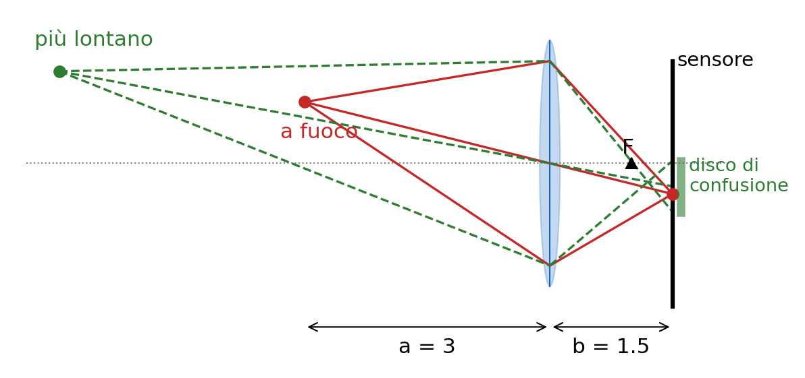

**Esempio.** Obiettivo da 50 mm, soggetto a 2 m: 1/b = 1/50 − 1/2000, b ≈ 51.3 mm. Per mettere a fuoco a 2 m il sensore si allontana di 1.3 mm rispetto al fuoco all'infinito.

Ma **la lente mette a fuoco una sola distanza**: gli altri punti diventano dischi (cerchi di confusione). **L'intervallo di distanze ancora nitido è la profondità di campo**, D ≈ 2NCU²/f² (N = f/apertura, C cerchio massimo accettabile, U distanza di fuoco). Con f = 50 mm, U = 2 m, C = 0.03 mm: a f/2.8 D ≈ 27 cm, a f/8 circa 77 cm.

> **Il punto**
> 
> La lente dà luce e nitidezza insieme, solo per i punti a fuoco. La geometria resta quella del pinhole.

### 7\. La proiezione prospettica

**Il problema: dato un punto 3D, dove cade sull'immagine?** La realtà aumentata lo calcola a ogni frame.

**Il setup** (slide 28–30). **Origine nel foro (centro ottico), asse Z = asse ottico verso la scena**, X e Y orizzontale e verticale. Il piano immagine reale sta dietro il foro a distanza f, capovolto; **per evitare i segni meno si usa un piano virtuale** davanti al foro, sempre a distanza f. Fisicamente non esiste: è solo comodo.

**L'idea: triangoli simili** (slide 31). Di lato, P, il foro e il piede di P sull'asse **formano un triangolo rettangolo** con cateti Z e Y. Il foro, **il punto immagine p = (x, y) e il centro del piano virtuale** ne formano uno con cateti f e y. Stessi angoli, quindi y / Y = f / Z.

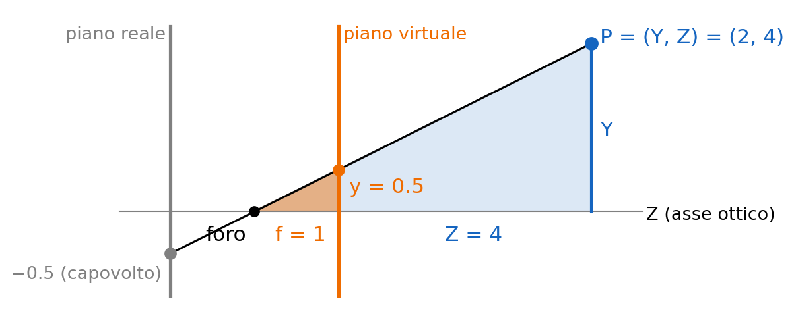

`x = f · X / Z     y = f · Y / Z`

x, y: coordinate sul piano immagine (in mm, origine sull'asse ottico); X, Y, Z: il punto 3D nel sistema della camera; **f la focale. Tutto l'effetto prospettico sta nella divisione per Z, che rende la mappa non lineare**.

**Esempio.** Spigolo di un tavolo in (0.4, −0.2, 2) m, f = 4 mm (telefono): x = 4 · 0.4/2 = 0.8 mm, y = −0.4 mm.

> **Il punto**
> 
> Prospettiva: (x, y) = f (X, Y) / Z, dai triangoli simili. La divisione per Z genera tutti gli effetti prospettici.

### 8\. Tre conseguenze della prospettiva

**Tre conseguenze** della divisione per Z.

**1. Lontano = piccolo** (slide 32). Persona di 1.8 m a 10 m, f = 50 mm: x = 0.05 · 1.8/10 m = 9 mm sul sensore; a 20 m, 4.5 mm. La dimensione scala come 1/Z.

**2.** **Le rette parallele convergono in un punto di fuga.** La slide 32 lo **giustifica male** (vedi il riquadro Attenzione): dice x → 0, vero solo per rette parallele all'asse ottico. **Il ragionamento corretto**: una retta è P(t) = P0 + t d, con d = (dX, dY, dZ) la direzione, e x(t) = f (X0 + t dX) / (Z0 + t dZ). Per t → ∞, se dZ ≠ 0:

`x → f · dX / dZ     y → f · dY / dZ`

Il limite non dipende da P0: **ogni famiglia di parallele converge nel punto f(dX, dY)/dZ**. Binari lungo l'asse, d = (0, 0, 1): verso (0, 0). Rette a 45°, d = (1, 0, 1): verso (f, 0). Se dZ = 0 (parallele al piano immagine) restano parallele.

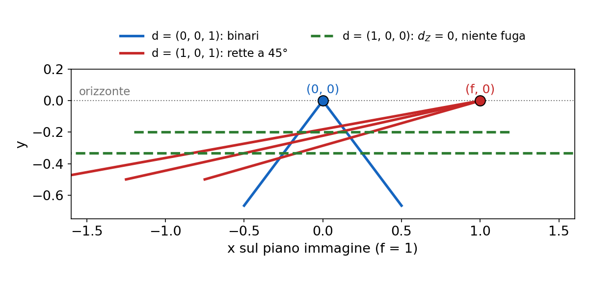

**3.** **Dimensione e profondità sono confuse (slide 33): conta solo il rapporto X/Z, quindi un oggetto di dimensione kX a profondità kZ dà la stessa immagine** di uno X a profondità Z. Tutto un raggio per il foro finisce nello **stesso pixel: la proiezione è una mappa molti a uno**.

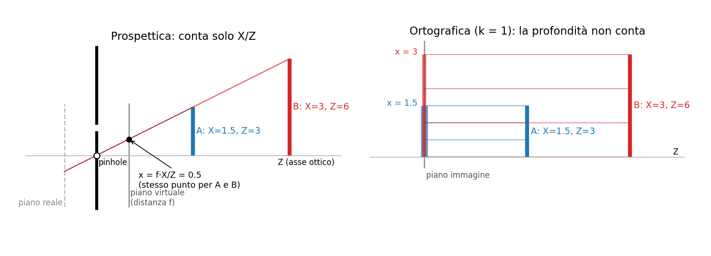

**Esempio.** Auto di 4 m a 20 m e modellino di 40 cm a 2 m: stesso X/Z = 0.2, foto identiche. Servono altre viste, prior o modelli appresi; e feature invarianti alla scala ([L6](https://gabriele-marsili.github.io/appunti-magistrale-ai/anno-2/computer-vision/sito/#L6), [L8](https://gabriele-marsili.github.io/appunti-magistrale-ai/anno-2/computer-vision/sito/#L8)).

> **Il punto**
> 
> Lontano = piccolo; le parallele fuggono in un punto che dipende solo dalla direzione; da una sola immagine dimensione e profondità non si separano.

### 9\. Dai millimetri ai pixel

**Il problema.** Il sensore dà indici di pixel (n, m), con origine in un angolo (slide 34–35); ogni libreria ha la sua convenzione.

**L'idea.** Una scala più una traslazione:

`n = ± a x + n0     m = ± a y + m0`

**a converte unità fisiche in pixel** (pixel da 5 µm: a = 200 px/mm); (n0, m0) è il **punto principale, il pixel dove cade l'asse ottico**. Segno + se asse camera e asse pixel hanno lo stesso verso, − se opposto. La slide 35 scrive due segni meno, ma con la sua figura il secondo è **+** (libro: n = −ax + n0, m = ay + m0): all'esame dichiara i versi degli assi (riquadro della slide 35).

**Esempio.** Convenzione OpenCV (x, n a destra; y, m in basso: segni +). Sensore 6000 × 4000 da 5 µm, punto principale (3000, 2000), f = 50 mm, punto (0.5, 1.0, 10) m: x = 2.5 mm, y = 5 mm, n = 200 · 2.5 + 3000 = 3500, m = 200 · 5 + 2000 = 3000.

Catena completa (slide 36): (X, Y, Z) → (x, y) → (n, m). Il libro (cap. 39) la scrive **come prodotto per una matrice** in coordinate omogenee: **la matrice degli intrinseci K, che ritroverai nella parte di geometria; per ora basta sapere che esiste.**

> **Il punto**
> 
> Pixel = scala a più punto principale. I segni dipendono dai versi degli assi: dichiarali sempre.

### 10\. La proiezione ortografica

**Il problema.** **La prospettiva nasce dal fatto che tutti i raggi passano per un punto. E se accettassimo solo i raggi perpendicolari al piano immagine** (slide 38)?

**L'idea.** Ogni punto arriva sull'immagine **lungo una retta parallela all'asse ottico**, e (slide 39)

`x = k · X     y = k · Y`

con k scala fissa. Z è sparito: **la dimensione nell'immagine non dipende dalla distanza**, niente punti di fuga. Realizzazione fisica: un fascio di **cannucce parallele, dipinte di nero dentro** (slide 40), che lasciano passare solo i raggi allineati. Nel libro k = 1 e l'immagine non è capovolta.

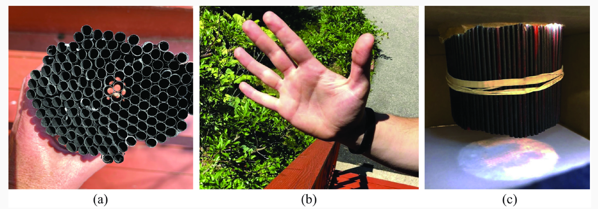

**Esempio.** Un teleobiettivo su oggetti lontani è quasi ortografico: **la "prospettiva debole" usa k = f / Zmedio**. f = 400 mm, auto a 200 m: k = 0.002, l'auto è lunga 8 mm sul sensore, e muso e coda (4 m di differenza su 200) hanno scale diverse solo del 2%.

Il **messaggio della slide 41: nessuna delle due proiezioni è "giusta"**. La prospettica tiene un indizio di profondità ma lo confonde con la dimensione; l'ortografica toglie la confusione buttando via la profondità.

> **Il punto**
> 
> Ortografica: x = kX, niente Z. Ogni geometria sceglie quale informazione tenere.

### 11\. La camera come sistema lineare

**Il problema.** Un foro largo, lo spigolo di un muro (la corner camera della slide 48 "vede" chi cammina dietro l'angolo), un oggetto che fa ombra: serve un linguaggio unico, **la camera come sistema lineare**.

**L'idea.** Per la linearità della luce, **ogni pixel misura una somma pesata delle intensità della scena**. **Somme pesate di tante incognite: matrice per vettore.**

**La matematica** (slide 44–45). Il libro usa "flatland": **scena 1D a profondità fissa**, N valori nel vettore ℓw ∈ ℝN (world); M pixel nel vettore ℓs ∈ ℝM (sensor):

`ℓs = A ℓw,    A ∈ ℝM×N`

La riga i di A dice "cosa vede il pixel i"; la colonna j dove finisce la luce del punto j. I **casi delle slide 46–49, con N = M = 13 come nel libro**:

  - **Pinhole ideale**: ogni pixel vede un punto, A = I. Per una camera normale A è "quasi l'identità": per questo i dati del sensore somigliano già a un'immagine.
  - **Foro largo**: ogni pixel vede due punti vicini, ogni riga ha due 1 consecutivi. È una media mobile, un **blur**: il ponte con la convoluzione di [L3](https://gabriele-marsili.github.io/appunti-magistrale-ai/anno-2/computer-vision/sito/#L3).
  - **Edge camera**: l'occlusore è uno spigolo; A è triangolare piena di 1 (somma cumulativa), l'inversa fa differenze (una derivata). La corner camera è una edge camera.
  - **Pinspeck camera: un piccolo oggetto** opaco al posto del foro; A = 1 − Aforo largo (1 = matrice di uni): **un segnale piccolo sopra un fondo grande**.

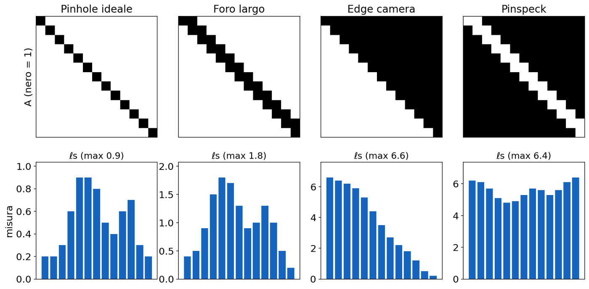

**Esempio a 3 pixel.** Scena (1, 0, 2), foro largo: A = \[\[1,1,0\],\[0,1,1\],\[0,0,1\]\], ℓs = (1, 2, 2). Il punto buio in mezzo è sparito: il blur lo ha riempito.

> **Il punto**
> 
> Ogni camera è ℓs = A ℓw. Più A si allontana dall'identità, meno la misura somiglia alla scena.

### 12\. Invertire: rumore e inversa regolarizzata

**Il problema.** Se A è invertibile, ℓw = A−1 ℓs. Ma c'è sempre rumore: ℓs = A ℓw + η, quindi A−1ℓs **= ℓw + A−1 η. Se A "schiaccia" quasi a zero qualche direzione (valori singolari piccoli), A−1 la moltiplica per un numero enorme**, e **con essa il rumore** (slide 50). Il problema è mal posto.

**Esempio a due pixel.** Blur forte: A = \[\[1, 0.9\], \[0.9, 1\]\], autovettori u1 = (1, 1)/√2 con autovalore 1.9 (la media, ben misurata) e u2 = (1, −1)/√2 con autovalore 0.1 (la differenza, misurata quasi niente). Scena (1, 1), A ℓw = (1.9, 1.9). Rumore **minuscolo η = (0.05, −0.05): ℓs = (1.95, 1.85)**. Il rumore sta **lungo u2, che A−1 amplifica di 1/0.1 = 10**: A−1ℓs = (1.5, 0.5). **Un errore di 0.05 sulle misure diventa 0.5 sulla scena.**

**L'idea.** **Invece di chiedere "la scena che spiega esattamente le misure"**, chiediamo "una scena che le spieghi bene *e* sia plausibile" (slide 51):

`E(ℓw) = ‖ℓs − A ℓw‖² + λ ‖ℓw‖²`

Primo termine: **fedeltà ai dati**. Secondo: **regolarizzatore**, penalizza scene con valori grandi. λ \> 0 pesa il compromesso (λ → 0: minimi quadrati puri; λ grande: ℓw → 0).

**Derivazione** (slide 52, da saper rifare). Con ∇x‖b − Ax‖² = −2AT(b − Ax) e ∇x(xTx) = 2x:

`−2AT(ℓs − Aℓw) + 2λ ℓw = 0  ⇒  (ATA + λI) ℓw = ATℓs` `ℓw = (ATA + λI)−1 AT ℓs = B ℓs`

B è l'**inversa regolarizzata** (slide 53). E è convessa (minimo globale) e ATA + λI è **sempre invertibile**: gli autovalori di ATA sono ≥ 0 e λI li sposta tutti di λ. È la regolarizzazione di Tikhonov, la ridge regression del machine learning.

**Cosa fa B.** Lungo una direzione che A moltiplica per σ, A−1 moltiplica per 1/σ, B per σ/(σ² + λ). σ grande: ≈ 1/σ, come l'inversa. σ piccolo: ≈ σ/λ → 0, **B "spegne" la direzione mal misurata** invece di esplodere. Nell'esempio, con λ = 0.1: lungo u1 1.9/3.71 ≈ 0.51 (contro 0.53), lungo u2 0.1/0.11 ≈ 0.91 (contro 10). B ℓs ≈ (1.02, 0.93), vicino a (1, 1). **Il prezzo è un piccolo bias**: senza rumore B A ℓw ≈ (0.97, 0.97) (slide 55).

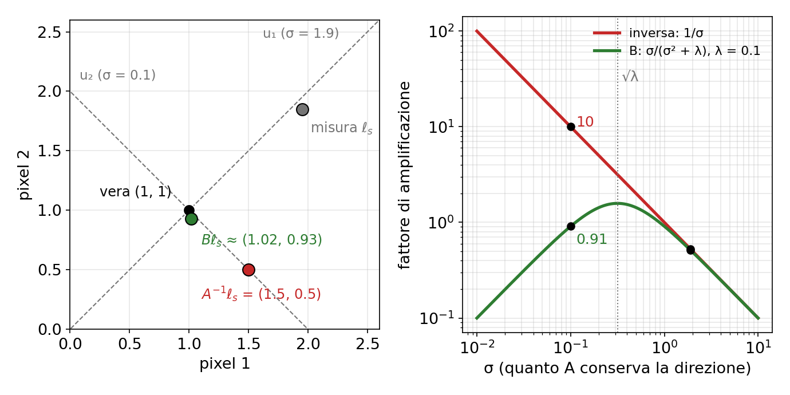

Ora il foro largo del libro, con **N = 13**, rumore 0.05 e λ = 0.1 (in numpy: `B = np.linalg.solve(A.T @ A + 0.1*np.eye(13), A.T)`):

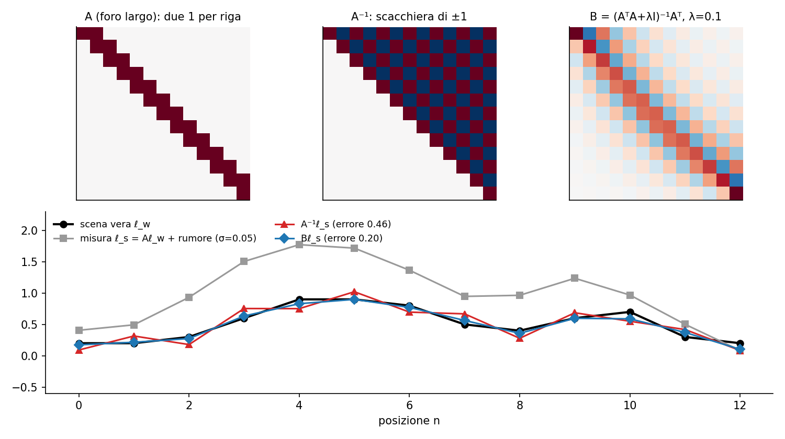

**Perché una scacchiera** (slide 47 e 54)? A = I + U, con U di 1 sulla sopradiagonale, nilpotente: A−1 = I − U + U² − …, elementi (−1)j−i per j ≥ i. B ha **la stessa struttura ma smorzata**. L'alternanza **±1 è la frequenza più alta, proprio quella che il blur attenua di più** e l'inversa deve riamplificare. (La didascalia della slide 54 è un copia-incolla sbagliato: mostra due pinhole.)

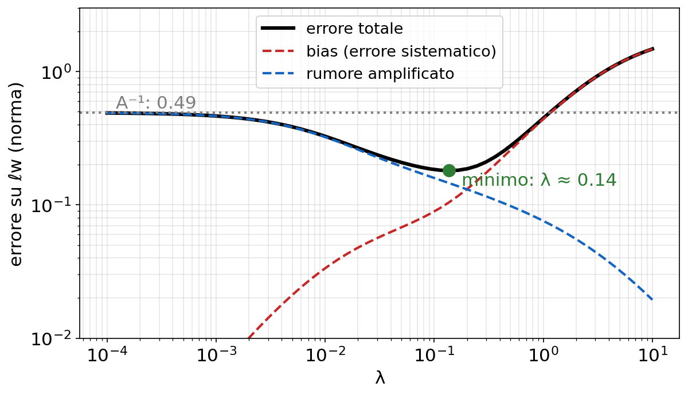

In Fourier ([L3](https://gabriele-marsili.github.io/appunti-magistrale-ai/anno-2/computer-vision/sito/#L3)) B diventa H\* / (|H|² + λ), il filtro di Wiener (slide 56): una deconvoluzione.

> **Il punto**
> 
> A−1 amplifica il rumore lungo le direzioni misurate male. B le spegne: un po' di bias in cambio di molta stabilità.

### 13\. Il colore: spettri e primari

**Il problema.** La luce non è un numero ma una funzione: lo **spettro di potenza ℓ(λ), l'intensità a ogni lunghezza d'onda** (slide 58–59). Occhio e camera RGB ne tengono tre numeri. Cosa si perde?

**L'idea.** Il visibile va da circa 400 nm (blu-violetto) a 700 nm (rosso): 400–500 blu, 500–600 verde, 600–700 rosso. Lo spettro ha infinite dimensioni (N se campionato); **RGB ne è una proiezione su tre**.

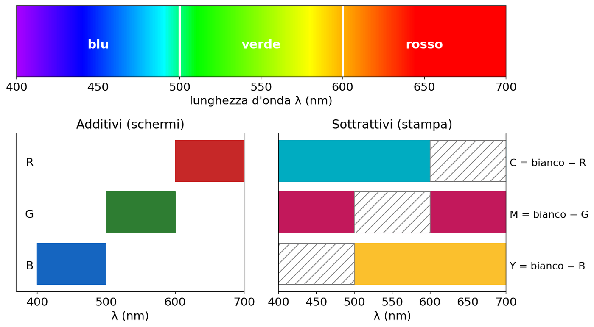

Primari (slide 60): **additivi** negli schermi, si somma luce (R + G + B = bianco); **sottrattivi** nella stampa, ogni pigmento toglie una banda (ciano = bianco − rosso, magenta = bianco − verde, giallo = bianco − blu).

**Esempio.** Lo schermo fa il giallo accendendo rosso e verde: lo spettro emesso ha due picchi e quasi niente a 580 nm, eppure lo vediamo come il giallo di un limone. Lo spiega la sezione 15.

> **Il punto**
> 
> Il colore fisico è uno spettro; tre numeri ne sono una compressione con perdita.

### 14\. Riflettanza e color constancy

**Il problema.** Sotto i lampioni arancioni il bilanciamento del bianco sbaglia e una camicia bianca esce arancione. Perché è difficile?

**L'idea.** Lambert lunghezza d'onda per lunghezza d'onda: l'albedo diventa lo **spettro di riflettanza s(λ) ∈ \[0, 1\]**, quanta luce di ogni λ il materiale rimanda (slide 61). Alla camera arriva

`r(λ) = k · ℓin(λ) · s(λ)`

con ℓin(λ) spettro dell'illuminante, s(λ) il "colore vero" del materiale, k il fattore geometrico n · p. **Di nuovo un prodotto di due incognite**: da r(λ) non si **separa s(λ) da ℓin(λ)** senza ipotesi (slide 62).

**Esempio** (bande B, G, R). Oggetto rossastro s = (0.2, 0.2, 0.6) in luce bianca (1, 1, 1): r = (0.2, 0.2, 0.6). Oggetto grigio s = (0.3, 0.3, 0.3) in luce rossastra (0.67, 0.67, 2): r = (0.2, 0.2, 0.6). **Stesso segnale, mondi diversi.**

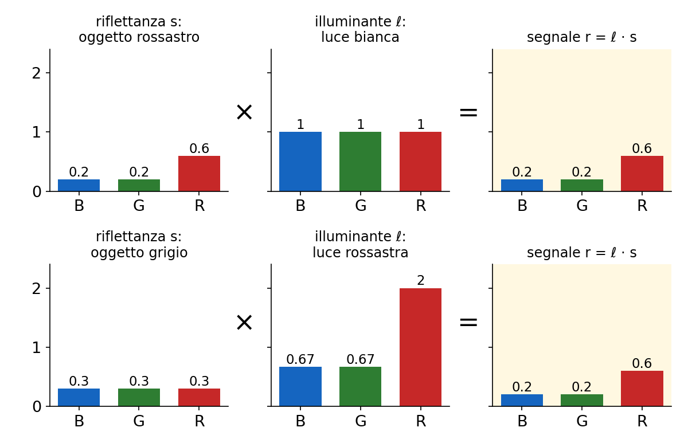

Stimare s scontando la luce è la **color constancy**: il cervello la fa in automatico, le camere con il bilanciamento del bianco. Il *grey world* assume che la media della scena sia grigia e **scala i canali finché le medie sono uguali: un prior, come λ prima**. Medie (0.4, 0.5, 0.8): si moltiplica per (1.25, 1, 0.625) e diventano tutte 0.5.

Anche noi usiamo prior: nella scacchiera di Adelson (slide 63) B sembra più chiaro di A perché il cervello sconta l'ombra. **Il vestito** (slide 64): chi assume luce calda lo vede blu e nero, chi assume luce fredda bianco e oro.

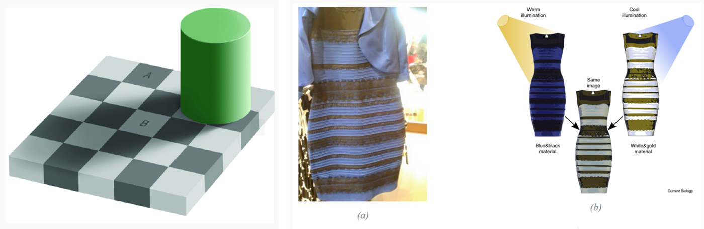

> **Il punto**
> 
> Il pixel è materiale × luce, non il colore della superficie. La color constancy è mal posta: si risolve con prior.

### 15\. L'occhio, la tricromia e i metameri

**Il problema.** Perché bastano tre primari per gli schermi? E perché un vestito comprato in negozio a casa sembra di un altro colore?

**L'idea.** La retina ha tre **tipi di coni, L, M, S (lunghezze d'onda lunghe, medie, corte), con picchi intorno a 570, 540 e 440 nm** (slide 65). Ogni cono somma lo spettro pesato dalla propria curva di sensibilità. Con lo spettro campionato in N valori t e le tre curve come righe di Ceye ∈ ℝ3×N (slide 66):

`(L, M, S)T = Ceye · t`

Di nuovo ℓs = A ℓw, con A larghissima: tre misure di N incognite. È la **tricromia**: per l'occhio un colore è fatto di tre numeri, quindi bastano tre primari.

**La matematica.** Rango-nullità: se Ceye ha rango 3, il nucleo ha dimensione N − 3. Se Ceye v = 0, t e t + v danno la stessa risposta: **due spettri diversi che vediamo identici si chiamano metameri** (slide 67).

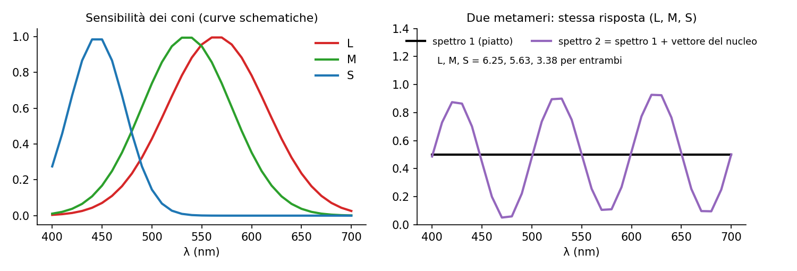

**Esempio.** Campioni ogni 10 nm fra 400 e 700: N = 31, nucleo di dimensione 28. **Quasi tutta l'informazione spettrale ci è invisibile.** Unico vincolo: lo spettro resta non negativo.

Una camera ha curve diverse dai coni, quindi un altro nucleo: due vestiti uguali a occhio possono uscire diversi in foto. Perché veda come l'occhio serve C = R Ceye, R 3 × 3 invertibile (libro § 8.3.5). **Le camere iperspettrali, con molte bande, distinguono i metameri** (materiali, maturazione della frutta).

> **Il punto**
> 
> L'occhio è una mappa lineare 3 × N con nucleo di dimensione N − 3: spettri diversi appaiono uguali.

### 16\. Luminanza e crominanza

**Il problema.** Perché JPEG butta via tre quarti dei dati di colore senza che te ne accorga?

**L'idea** (slide 68–69). **Vediamo il dettaglio molto meglio nella luminanza** (quanto è chiaro) che nella crominanza (che colore è). Sfocare G sfoca tutta la foto, sfocare B quasi non si nota: la luminanza è fatta soprattutto di verde e i coni S sono radi.

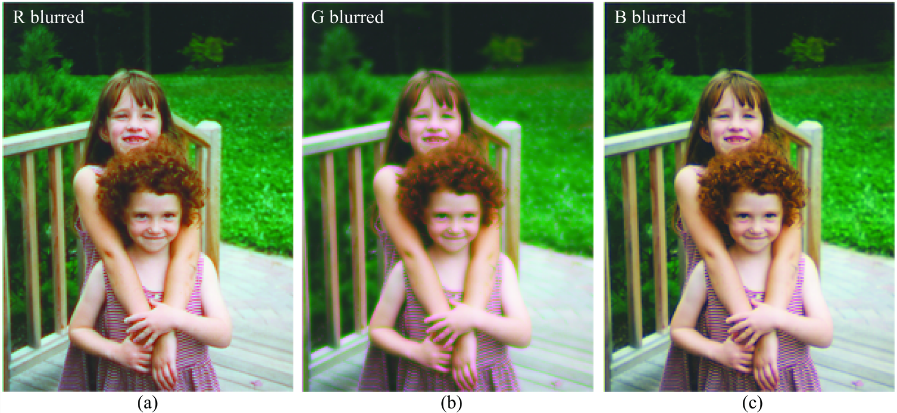

**Esempio.** Y ≈ 0.30 R + 0.59 G + 0.11 B: un errore di 0.1 su G sposta Y di 0.059, su B di 0.011, cinque volte meno. JPEG salva Cb e Cr a metà risoluzione per lato (4:2:0): un quarto dei campioni di colore, differenza quasi invisibile.

> **Il punto**
> 
> Il dettaglio sta nella luminanza; il colore si può campionare più grossolanamente.

### Il riassunto in 10 righe

1.  Modello diretto: scena → ottica → sensore → ISP; la visione lo inverte.
2.  La luce (raw) è lineare: i contributi si sommano.
3.  Lambert: a ℓin (n · p), non dipende dalla vista; Phong aggiunge ambiente e speculare ks(r · q)α, che ne dipende.
4.  Un muro integra la luce di tutte le direzioni; un pinhole tiene un raggio per punto.
5.  Pinhole: nitidezza contro luce; la lente (1/a + 1/b = 1/f) le dà entrambe ai punti a fuoco.
6.  Prospettiva: x = fX/Z; lontano = piccolo, punti di fuga f(dX, dY)/dZ, dimensione e profondità confuse.
7.  Pixel: n = ±a x + n0, segni dai versi degli assi. Ortografica: x = kX.
8.  Ogni camera è ℓs = Aℓw; A−1 amplifica il rumore, B = (ATA + λI)−1AT no, con un po' di bias.
9.  Colore: r = k ℓin s mescola luce e materiale (color constancy con prior).
10. Occhio: mappa 3 × N con nucleo enorme (metameri); il dettaglio sta nella luminanza.

### Verifica di aver capito

**Perché una superficie lambertiana appare ugualmente luminosa da ogni punto di vista, mentre un highlight si sposta quando ti muovi?**

In a ℓin(n · p) la vista q non compare. Nel termine ks(r · q)α sì: è grande solo dove q è vicina a r, quindi muovendo la camera il punto con r · q ≈ 1 si sposta.

**Dove fuggono le rette con direzione d = (1, 0, 2) se f = 50 mm? E quelle con d = (1, 1, 0)?**

In (f dX/dZ, f dY/dZ) = (25, 0) mm, ovunque partano. Le seconde hanno dZ = 0: restano parallele, nessun punto di fuga.

**Ricava l'inversa regolarizzata nel caso scalare A = a e commenta a = 2 e a = 0.01 con λ = 0.01.**

E = (s − a w)² + λ w², dE/dw = −2a(s − a w) + 2λ w = 0, w = a s/(a² + λ). a = 2: 2/4.01 ≈ 0.499 ≈ 1/a. a = 0.01: 0.01/0.0101 ≈ 0.99 invece di 100: niente amplificazione del rumore, al prezzo di una stima distorta.

**Lo spettro è campionato in 61 valori (ogni 5 nm fra 400 e 700). Quanto è grande lo spazio dei metameri, e perché una camera RGB può distinguere due metameri dell'occhio?**

Ceye è 3 × 61 di rango 3: nucleo di dimensione 58. La camera ha un'altra C con un altro nucleo, quindi in generale C v ≠ 0 (salvo se C = R Ceye).

### Come proseguire

1.  [Visionbook cap. 5 Imaging](https://visionbook.mit.edu/imaging.html): BRDF, Lambert, Phong, pinhole, prospettica e ortografica (slide 7–41).
2.  [Cap. 6 Lenses](https://visionbook.mit.edu/lenses.html): § 6.1 e § 6.3 (ray tracing, profondità di campo); la derivazione del § 6.2 leggila una volta.
3.  [Cap. 7 Cameras as Linear Systems](https://visionbook.mit.edu/camera_as_linsys.html): tutto, corrisponde alle slide 42–56.
4.  [Cap. 8 Color](https://visionbook.mit.edu/color.html): § 8.2–8.4; il § 8.3.5 (color matching) chiarisce la slide 67.
5.  [Cap. 39 Imaging Geometry](https://visionbook.mit.edu/imaging_geometry.html), § 39.2–39.3: la proiezione in coordinate omogenee, anticipo della parte di geometria.

Percorso dettagliato nella sezione "Studia dal libro" in fondo. Ora ripassa con le schede qui sotto: i riquadri Attenzione delle slide 21, 32 e 35 e le note delle slide 47 e 54 correggono gli errori citati sopra.
