# L3 · Fourier e convoluzione

*Lezione 3 · Antonio Carta · 17 settembre 2026*

[Versione interattiva sul sito, con videolezione](https://gabriele-marsili.github.io/appunti-magistrale-ai/anno-2/computer-vision/sito/#L3) · [Indice della dispensa](README.md)

**In una frase:** le operazioni sulle immagini che sono lineari e uguali in ogni punto (sfocare, derivare, trovare bordi) sono tutte **convoluzioni con un piccolo kernel**; la trasformata di Fourier riscrive l'immagine come somma di onde, e in quella base **ogni convoluzione diventa una semplice moltiplicazione** frequenza per frequenza.

### Prima di iniziare

È la lezione più matematica della prima parte e la base di quasi tutto il resto (filtri in [L5](https://gabriele-marsili.github.io/appunti-magistrale-ai/anno-2/computer-vision/sito/#L5), aliasing in [L6](https://gabriele-marsili.github.io/appunti-magistrale-ai/anno-2/computer-vision/sito/#L6), CNN). La costruiamo un mattone alla volta. Servono solo cose della triennale:

  - **Prodotto matrice-vettore e cambio di base**: y = Ax; in una base ortogonale le coordinate di un vettore si trovano con prodotti scalari.
  - **Serie geometrica**: **∑n=0N−1 rn = (1 − rN)/(1 − r) per r ≠ 1**.
  - **Numeri complessi**: modulo, fase, coniugato e la **formula di Eulero ejθ = cos θ + j sin θ** (in ingegneria l'unità immaginaria si chiama j). Moltiplicare per ejθ vuol dire ruotare di θ nel piano complesso.
  - **L'immagine come matrice di numeri** e il modello lineare di formazione dell'immagine di [L2](https://gabriele-marsili.github.io/appunti-magistrale-ai/anno-2/computer-vision/sito/#L2): lì il foro finito del pinhole produceva una sfocatura, che qui scoprirai essere una convoluzione.

Notazione delle slide, che seguo: **ℓ\[n, m\] è l'immagine discreta (n riga, m colonna), ℓ(x) un segnale continuo, h il kernel, ∗ la convoluzione**, ℒ = ℱ{ℓ} la trasformata. Parentesi quadre = discreto, tonde = continuo. Il libro scrive la convoluzione con ∘ e chiama "LTI" quello che le slide chiamano "LSI": sono la stessa cosa.

### Guarda prima questi video

  - [But what is a convolution?](https://www.youtube.com/watch?v=KuXjwB4LzSA) (Video). 3Blue1Brown. Tutto. La parte su dadi e medie mobili costruisce l'intuizione "ribalta, sposta, moltiplica, somma"; il blur di immagini e il finale con la FFT anticipano il teorema di convoluzione.
  - [LSIS and Convolution](https://www.youtube.com/watch?v=0OHRJMNKhX0) (Video). Shree Nayar, First Principles of Computer Vision. Perché "lineare + invariante per traslazione" implica "convoluzione", con la risposta all'impulso: sezioni 2–4 qui sotto.
  - [But what is the Fourier Transform? A visual introduction.](https://www.youtube.com/watch?v=spUNpyF58BY) (Video). 3Blue1Brown. Tutto. Gli esponenziali complessi come punti che girano, e perché il prodotto con un'onda "misura" quanto di quella frequenza c'è nel segnale (sezioni 9–11).
  - [Fourier Transform](https://www.youtube.com/watch?v=tEzgtbnbXgQ) (Video). Shree Nayar, First Principles of Computer Vision. Trasformata di Fourier con esempi su immagini: da guardare dopo aver letto la seconda metà della dispensa.
  - [Convolution Theorem](https://www.youtube.com/watch?v=kQUfKf-vPdI) (Video). Shree Nayar, First Principles of Computer Vision. Facoltativo: perché la convoluzione nello spazio diventa una moltiplicazione in frequenza (sezione 13).

### 1\. Le immagini come segnali

**Il problema.** Instagram sfoca lo sfondo, il telefono rende più nitida una foto mossa, un'auto a guida autonoma cerca i bordi della corsia. Per ragionare su tutte queste operazioni con lo stesso linguaggio serve smettere di pensare all'immagine come "una foto" e pensarla come un **segnale**: una funzione che a ogni posizione associa un numero.

**L'idea.** Prendi una riga di una foto in bianco e nero e disegna l'intensità di ogni pixel in funzione della colonna: ottieni un grafico come quello di un suono nel tempo. Zone uniformi diventano tratti piatti, bordi diventano salti, texture come l'erba diventano oscillazioni rapide.

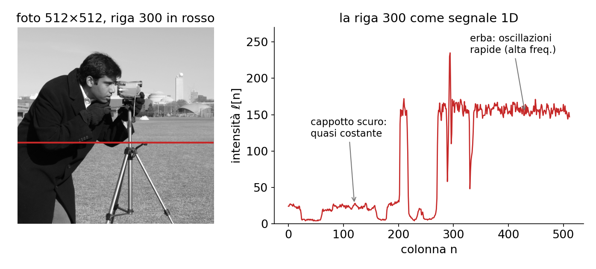

**La matematica.** Un'immagine è una funzione continua della scena campionata su una griglia: ℓ\[n\] = ℓ(n ΔT), dove ΔT è il passo di campionamento (slide 5). In 2D ℓ\[n, m\] con n = 0, …, N − 1 e m = 0, …, M − 1. Due grandezze torneranno: il **valore DC**, cioè la media μ = (1/N) ∑n ℓ\[n\], e l'energia E = ∑n ℓ\[n\]².

Lo stesso segnale si può guardare in due modi (slide 6–7). Nel **dominio spaziale** è una lista di valori, uno per posizione. Nel **dominio della frequenza** è una **somma di onde**: tanta onda lenta, un po' di onda veloce, e così via. Le due descrizioni contengono esattamente la stessa informazione; la seconda rende facili cose che nella prima sono difficili. Il ponte fra le due è il teorema di convoluzione (sezione 13).

> **Attenzione alla slide 7**
> 
> La slide chiama l'aliasing "rumore ad alta frequenza". È il contrario: è contenuto ad alta frequenza che, campionato troppo rado, ricompare come falsa bassa frequenza. Si vede bene in [L6](https://gabriele-marsili.github.io/appunti-magistrale-ai/anno-2/computer-vision/sito/#L6).

> **Il punto**
> 
> Un'immagine è un segnale: un numero per ogni posizione. Lo si può descrivere pixel per pixel (spazio) o onda per onda (frequenza), senza perdere nulla.

### 2\. Sistemi lineari e invarianti per traslazione (LSI)

**Il problema.** Per ripulire una foto rumorosa si sostituisce ogni pixel con la media dei vicini. Per trovare i contorni si fa, in ogni pixel, la differenza tra il vicino di destra e quello di sinistra. Operazioni diverse, ma con due cose in comune. Quali, esattamente?

**L'idea.**

1.  **l'output è una somma pesata dei valori in input**: l'operazione è **lineare**;
2.  la regola è **la stessa in ogni posizione**: se sposto la foto di 3 pixel, il risultato si sposta di 3 pixel e basta. È l'**invarianza per traslazione**.

Un sistema con entrambe le proprietà si chiama **LSI, Linear Shift-Invariant** (slide 9–11). La figura mette alla prova due sistemi lineari con lo stesso input in due posizioni diverse.

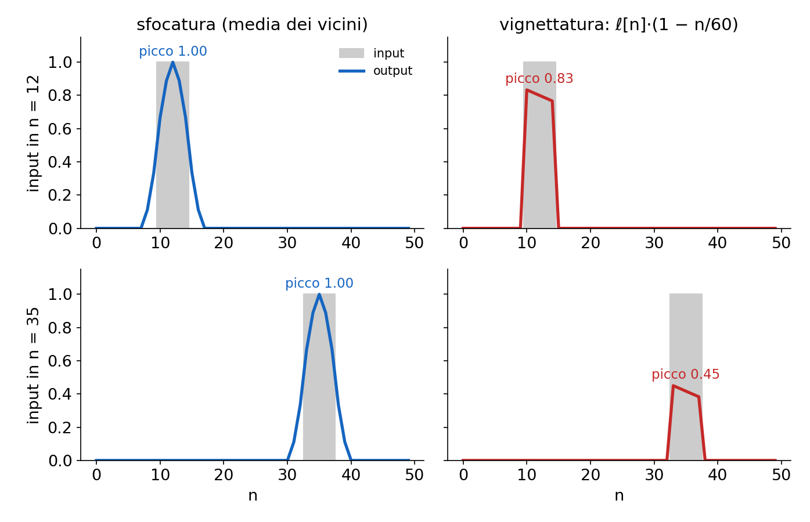

**La matematica.** Sia T il sistema, che prende un segnale e ne restituisce un altro. Formalmente, **un sistema T è lineare se T\[a ℓ1 + b ℓ2\] = a T\[ℓ1\] + b T\[ℓ2\] per ogni coppia di segnali e di scalari a, b; è invariante per traslazione se, chiamato ℓout = T\[ℓin\], vale T\[ℓin\[n − n0\]\] = ℓout\[n − n0\] per ogni spostamento n0**. A parole: "sommare prima o dopo è uguale" e "spostare prima o dopo è uguale".

**Esempi (slide 18–20).** Per classificare un'operazione verifica le due proprietà separatamente.

  - **LSI**: blur, sharpening, derivate discrete, qualunque kernel fisso.
  - **Non lineari**: soglia (thresholding), correzione gamma, elevare al quadrato, la ReLU delle CNN. Raddoppiare l'input non raddoppia l'output.
  - **Lineari ma non invarianti**: rotazione attorno al centro, ritaglio, ridimensionamento, vignettatura. Il centro di rotazione è un punto speciale, quindi non tutte le posizioni sono trattate allo stesso modo (slide 19).

> **Il punto**
> 
> LSI = somma pesata (lineare) + stessa regola ovunque (invariante). Quasi tutto il "filtraggio" classico è LSI; soglie, ReLU e geometria (rotazioni, zoom) no.

### 3\. Dalla matrice piena alla convoluzione

**Il problema.** Un sistema lineare qualsiasi su una foto da un megapixel ha bisogno di quanti numeri per essere descritto? E quanti ne restano se è anche invariante?

**L'idea.** Lineare vuol dire "matrice". Invariante vuol dire che la matrice ripete sempre la stessa riga, spostata. Quindi basta conoscere una riga: il **kernel**.

**La matematica.** Metti il segnale in un vettore ℓin di N numeri. Ogni sistema lineare si scrive (libro § 15.3)

`ℓout[n] = ∑k h[n, k] · ℓin[k]   cioè   ℓout = H ℓin`

dove h\[n, k\] = Hnk è il peso con cui l'input in posizione k contribuisce all'output in posizione n. Servono N² pesi: con 106 pixel sono 1012 numeri, **ingestibile**. È un layer fully connected.

Ora aggiungi l'invarianza. Se ogni posizione è trattata allo stesso modo, il peso fra input k e output n può dipendere solo dalla loro **distanza** n − k, non da dove si trovano. Quindi h\[n, k\] = h\[n − k\], una funzione di una sola variabile:

`ℓout[n] = ∑k h[n − k] · ℓin[k] = (h ∗ ℓin)[n]`

Questa è la **convoluzione discreta** (slide 14). Simbolo per simbolo: n è la posizione dell'output che stai calcolando; k scorre su tutte le posizioni dell'input; ℓin\[k\] è il valore dell'input in k; h\[n − k\] è il peso che spetta a un input che sta a distanza n − k. **Ogni riga di H è ora la precedente spostata di un posto (matrice di Toeplitz)**.

![A sinistra un sistema lineare generico: ogni peso è libero. A destra il kernel ¼\[1, 2, 1\] come matrice: ogni riga è la precedente spostata di un posto e fuori dalla banda è tutto zero.](../sito-src/L3/disp_toeplitz.png)

**Esempio.** N = 5, kernel h\[−1\] = 1/4, h\[0\] = 2/4, h\[1\] = 1/4, zero fuori dal segnale:

`H = ¼ · [[2,1,0,0,0], [1,2,1,0,0], [0,1,2,1,0], [0,0,1,2,1], [0,0,0,1,2]]`

25 posti nella matrice, 3 numeri distinti. Questa è l'idea delle CNN: un layer convoluzionale è un layer denso con **pesi condivisi** (la stessa h in ogni riga) e **locali** (zero lontano dalla diagonale). Le slide 29–30 fanno lo stesso con un kernel circolare.

> **Attenzione alla slide 30**
> 
> La slide dice che le righe di H sono shift ciclici di h: sono le **colonne**; le righe sono shift di h ribaltato. La matrice scritta è comunque giusta. Vedi la scheda.

> **Il punto**
> 
> Lineare = matrice; invariante = ogni riga è la stessa, spostata. Da N² pesi si passa ai pochi numeri del kernel h.

### 4\. Il kernel è la risposta all'impulso

**Il problema.** Ti danno una "scatola nera" LSI, per esempio un obiettivo fotografico. Come scopri il suo kernel?

**L'idea.** Le dai in input il segnale più semplice possibile, un solo punto acceso, e guardi cosa esce. Poi, siccome ogni segnale è una somma di punti, la risposta a qualunque segnale è la somma delle risposte ai singoli punti.

**La matematica.** Cosa succede **se in input metto l'impulso δ\[n\] (1 in n = 0, zero altrove)? Nella somma sopravvive solo** k = 0, e l'output è h\[n\]. Quindi **il kernel è l'output del sistema quando l'input è un impulso**: si chiama **risposta all'impulso** (slide 18 e 65, libro § 15.6). Ora scrivi un segnale qualsiasi come somma di impulsi spostati e pesati:

`ℓ[n] = ∑k ℓ[k] · δ[n − k]`

Per invarianza, δ\[n − k\] produce h\[n − k\]; per linearità, il peso ℓ\[k\] resta davanti e le risposte si sommano. Risultato: ∑k ℓ\[k\] h\[n − k\], esattamente la convoluzione della sezione 3. È la dimostrazione che **un sistema è LSI se e solo se è una convoluzione**.

![La convoluzione passo per passo: l'input \[3, 1, 2\] è tre impulsi; ognuno diventa una copia del kernel \[2, 1\], scalata e spostata; l'output è la loro somma (i colori nelle barre dicono da quale impulso viene ogni pezzo).](../sito-src/L3/disp2_somma_impulsi.png)

**Esempio svolto.** x = \[3, 1, 2\], h = \[2, 1\] (h\[0\] = 2, h\[1\] = 1).

  - 3·δ\[n\] produce 3·h\[n\] = \[6, 3, 0, 0\];
  - 1·δ\[n − 1\] produce \[0, 2, 1, 0\];
  - 2·δ\[n − 2\] produce \[0, 0, 4, 2\];
  - somma: **y = \[6, 5, 5, 2\]**. Controllo: np.convolve(\[3, 1, 2\], \[2, 1\]) dà lo stesso.

Esempi reali. In una stanza un battito di mani è quasi un impulso, e l'eco che registri è la risposta all'impulso della stanza: qualunque voce arriva all'orecchio come convoluzione con quell'eco (libro § 15.6). In un obiettivo, l'immagine di una stella (un punto) è la sua risposta all'impulso, detta PSF ([L2](https://gabriele-marsili.github.io/appunti-magistrale-ai/anno-2/computer-vision/sito/#L2)).

> **Il punto**
> 
> h = T\[δ\]: il kernel è ciò che esce da un impulso. Ogni segnale è una somma di impulsi, quindi l'output è una somma di copie spostate e scalate di h.

### 5\. Calcolare una convoluzione a mano

**Il problema.** La formula ∑k h\[n − k\] ℓ\[k\] è compatta, ma all'esame bisogna calcolarla in fretta e senza sbagliare segni. Serve una ricetta meccanica.

**L'idea.** Per ottenere l'output in n: **ribalta** il kernel (h\[−k\] invece di h\[k\]), **spostalo** su n, **moltiplica** elemento per elemento con l'input sotto, **somma**. Il ribaltamento viene dal segno meno in h\[n − k\]: quando k cresce, l'indice del kernel scende.

![Kernel di differenza h\[0\] = 1, h\[1\] = −1 sul gradino. Ribaltato, il +1 sta su k = n e il −1 su k = n − 1: l'output è x\[n\] − x\[n − 1\], diverso da zero solo dove il segnale salta.](../sito-src/L3/disp2_passi_convoluzione.png)

**Esempio 1: derivata.** Input x = \[0, 0, 0, 4, 4, 4\] (indici 0–5, zero fuori). Kernel h\[0\] = 1, h\[1\] = −1, cioè y\[n\] = x\[n\] − x\[n − 1\]. Seguendo la figura: n = 2 dà 0, n = 3 dà 4, n = 4 dà 0. Output completo: \[0, 0, 0, 4, 0, 0, −4\]. Zero dove il segnale è piatto, 4 sul salto: è una **derivata discreta**. Il −4 finale è un **effetto di bordo**: oltre la fine abbiamo supposto zeri. **Pesi con somma 0 danno output nullo sulle zone costanti**: è la firma di ogni rilevatore di bordi.

**Esempio 2: blur.** Stesso input, **kernel di media h = ¼ \[1, 2, 1\]. È simmetrico, quindi ribaltarlo non cambia niente**: ogni output è (sinistro + 2·centrale + destro)/4.

  - n = 2: (0 + 2·0 + 4)/4 = 1
  - n = 3: (0 + 2·4 + 4)/4 = 3
  - n = 4: (4 + 8 + 4)/4 = 4

Output "same": \[0, 0, 1, 3, 4, 3\]. Il salto netto è diventato una rampa: questo è il blur. **I pesi sommano a 1, quindi le zone costanti restano invariate**.

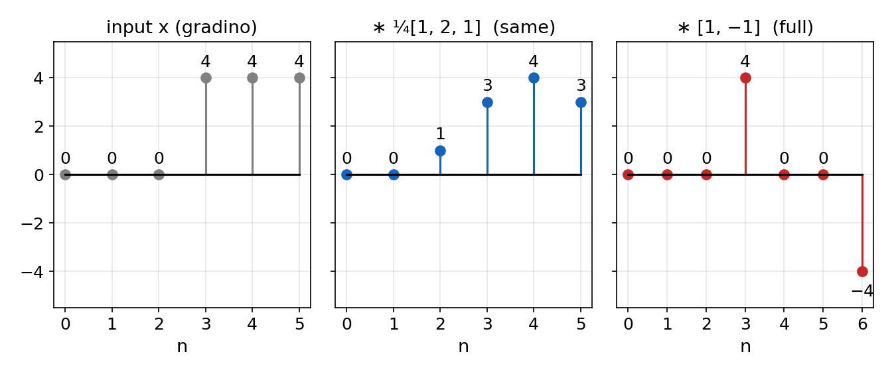

La slide 16 fa lo stesso con f = \[1, 2, 3, 4\] e h = \[1, 0, −1\]; la scheda svolge il conto (\[1, 2, 2, 2, −3, −4\]). Rifallo da solo.

#### Quanto è lungo l'output

Segnale **di N campioni, kernel di k**. La convoluzione completa ("full") ha **N + k − 1 campioni** (6 + 2 − 1 = 7 nell'esempio 1); **"same" ne tiene N**; **"valid" tiene solo gli N − k + 1 in cui il kernel sta tutto dentro il segnale**, senza inventare nulla.

#### In 2D

`(h ∗ ℓ)[n, m] = ∑k ∑l h[n − k, m − l] · ℓ[k, l]`

Stessa ricetta, ma il kernel si ribalta sia in verticale sia in orizzontale (slide 17). Esempio: immagine con un bordo verticale, ogni riga \[0, 0, 9, 9\], e **kernel box 3×3 con tutti i pesi 1/9**.

![La finestra 3×3 scorre sull'immagine. In colonna 1 copre tre volte \[0, 0, 9\]: 27/9 = 3. In colonna 2 copre tre volte \[0, 9, 9\]: 54/9 = 6. Il bordo netto diventa una rampa.](../sito-src/L3/disp2_conv2d.png)

    import numpy as np
    from scipy.signal import convolve2d
    img = np.tile([0, 0, 9, 9], (4, 1)).astype(float)
    box = np.ones((3, 3)) / 9
    print(convolve2d(img, box, mode='same', boundary='symm')[1])   # [0. 3. 6. 9.]

#### I kernel più comuni (slide 20–22)

  - **Box**: media uniforme, (1/9) in ogni casella del 3×3.
  - **Gaussiana**: h(x, y) ∝ exp(−(x² + y²)/(2σ²)). Più σ è grande, più sfoca. Si tronca a circa ±3σ e si normalizza a somma 1. Dà un blur più naturale del box (vedremo perché in sezione 13).
  - **Sobel**: Sx = \[\[−1, 0, 1\], \[−2, 0, 2\], \[−1, 0, 1\]\], derivata orizzontale con un po' di smoothing verticale. Ripreso in [L5](https://gabriele-marsili.github.io/appunti-magistrale-ai/anno-2/computer-vision/sito/#L5).

> **Il punto**
> 
> Ribalta, sposta, moltiplica, somma. Somma dei pesi 1 = blur (le zone piatte restano uguali); somma 0 = rilevatore di bordi (le zone piatte vanno a zero).

### 6\. Proprietà della convoluzione e filtri separabili

**Il problema.** Una pipeline applica tre filtri di fila; un'altra vuole sfocare con una gaussiana 31×31 su foto da 12 megapixel. Si può risparmiare?

**L'idea.** La convoluzione si comporta come una moltiplicazione: si può riordinare e raggruppare. Questo permette di fondere filtri o di spezzarli in pezzi più economici.

#### Le proprietà (slide 23–24)

  - **Commutativa**: h ∗ ℓ = ℓ ∗ h. Non c'è differenza vera fra "segnale" e "kernel".
  - **Associativa: (ℓ ∗ h1) ∗ h2 = ℓ ∗ (h1 ∗ h2)**. Due filtri in cascata equivalgono a un unico filtro, il cui kernel è la convoluzione dei due: due blur 5×5 danno un kernel 9×9 (5 + 5 − 1).
  - **Distributiva**: h ∗ (ℓ1 + ℓ2) = h ∗ ℓ1 + h ∗ ℓ2.
  - **Elemento neutro: δ ∗ ℓ = ℓ. Un impulso spostato, δ\[n − n0\], trasla l'immagine di n0**.

#### Filtri separabili (slide 25)

Un kernel 2D è **separabile** se è il prodotto di un kernel colonna per un kernel riga: h\[n, m\] = hy\[n\] · hx\[m\]. Come **matrice, ha rango 1. Allora per associatività si può filtrare prima ogni riga con hx e** poi ogni colonna con hy.

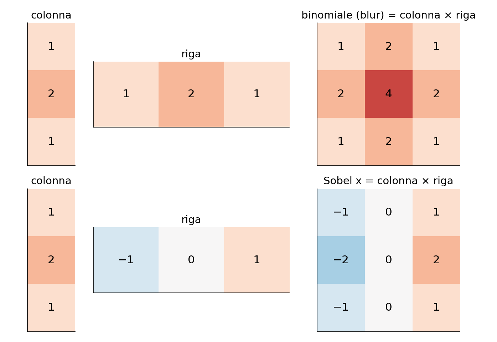

**Esempio di costo.** **Costo per pixel con kernel k×k: k² moltiplicazioni contro 2k. Per k = 9: 81 contro 18**. Per la gaussiana 31×31: 961 contro 62, quindici volte meno. **Sono separabili la gaussiana (exp(−(x² + y²)/2σ²) = exp(−x²/2σ²) · exp(−y²/2σ²))**, il box e il Sobel \[1, 2, 1\]T · \[−1, 0, 1\].

Le **depthwise separable convolutions** della slide 26 applicano un'idea simile ai canali di una CNN: un filtro k×k per canale, poi un 1×1 che mescola i canali. Molti meno parametri (MobileNet).

> **Il punto**
> 
> La convoluzione si riordina e si raggruppa come un prodotto. Un kernel di rango 1 si spezza in due passate 1D: costo 2k invece di k² per pixel.

### 7\. Bordi, correlazione e caso continuo

#### Cosa fare ai bordi (slide 27)

**Il problema.** **Vicino al bordo il kernel chiede pixel che non esistono**. Qualcosa bisogna inventare, e la scelta si vede nel risultato.

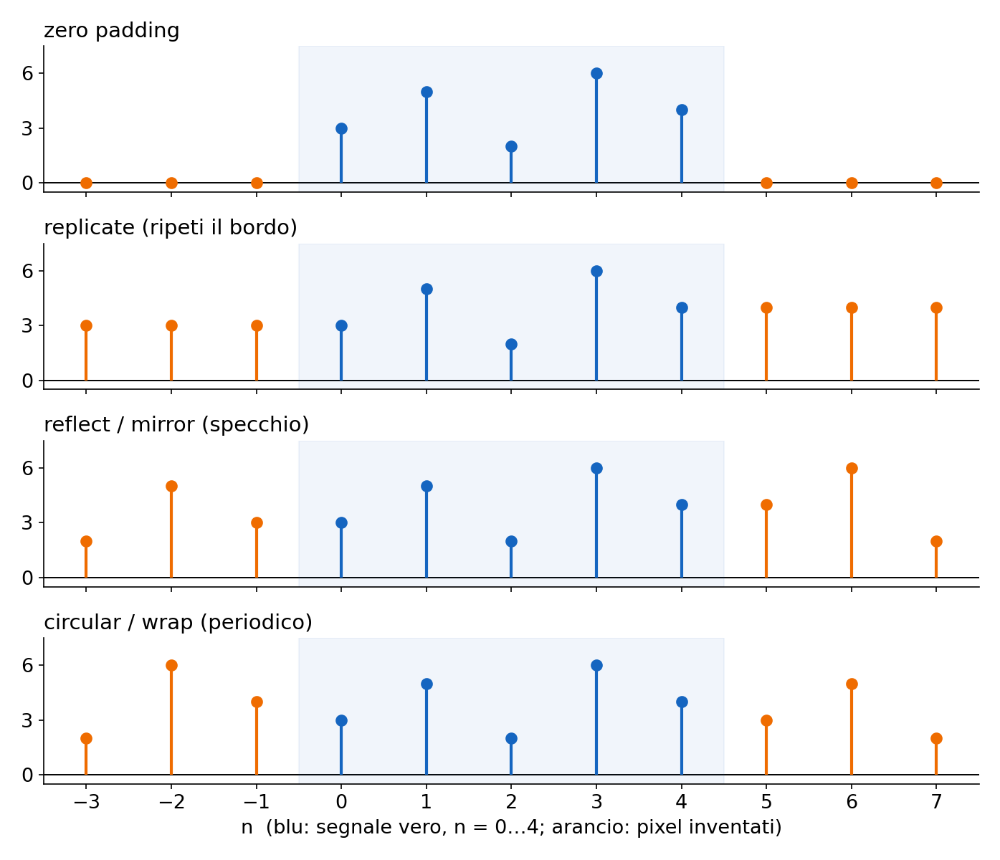

  - **Zero padding**: fuori è 0. **Un blur scurisce i bordi**, perché media con dello zero.
  - **Replicate**: si ripete il pixel di bordo.
  - **Reflect (mirror)**: l'immagine si specchia. **Secondo il confronto del libro (§ 15.4.3) il mirror sbaglia meno**.
  - **Circular (wrap)**: l'immagine si ripete periodicamente. **Attacca il bordo destro al sinistro**, ma è quello implicito nella DFT (sezione 13).

#### Convoluzione o correlazione? (slide 28)

La **cross-correlazione** è la stessa somma **senza ribaltare**: (ℓ ⋆ h)\[n\] = ∑k h\[k\] ℓ\[n + k\]. Il modo più rapido per vedere la differenza: input un impulso, kernel centrato h = \[1, 2, 3\] (pesi in −1, 0, 1). La convoluzione restituisce una copia del kernel, 1, 2, 3; la correlazione la restituisce ribaltata, 3, 2, 1. Per kernel simmetrici coincidono.

**Il "conv2d" di PyTorch è in realtà una correlazione** (irrilevante, i pesi sono appresi). La correlazione **non è associativa**, ma è quella giusta per cercare un pattern uguale al kernel (template matching, libro § 15.5.1): dà la risposta massima dove l'immagine "somiglia" al kernel.

#### Il caso continuo (slide 15)

Con segnali continui la somma diventa un integrale, (f ∗ h)(x) = ∫ f(τ) h(x − τ) dτ, e l'impulso diventa la **delta di Dirac** δ(x): nulla tranne che in 0, con area 1. Non confonderla con δ\[n\], che vale semplicemente 1 in n = 0. Servirà per il campionamento in [L6](https://gabriele-marsili.github.io/appunti-magistrale-ai/anno-2/computer-vision/sito/#L6).

> **Il punto**
> 
> Ai bordi si inventano pixel: lo specchio sbaglia meno, lo zero scurisce, il circolare è quello della DFT. Correlazione = convoluzione senza ribaltare.

### 8\. Perché Fourier: cercare la base giusta

**Il problema.** Ora sappiamo cosa fa una convoluzione pixel per pixel, ma non **perché** il box sfoca peggio della gaussiana, o cosa resta di un'immagine dopo un filtro. Serve un punto di vista in cui l'effetto di un filtro si legge a colpo d'occhio.

**L'idea.** **Abbiamo visto che un sistema LSI è una matrice H con struttura speciale. In algebra lineare il modo migliore per capire una matrice è trovare una base in cui diventa diagonale: lì la matrice moltiplica ogni coordinata per un numero** e basta. La **sorpresa** è che **la stessa base diagonalizza tutte le convoluzioni contemporaneamente**: è la base delle onde, e passarci è la **trasformata di Fourier, un cambio di base lineare e invertibile** (slide 8, 33).

In quella base i fatti della slide 37 diventano evidenti: **il blur toglie le alte frequenze, i bordi sono alta frequenza**, il rumore è sparso su tutte le frequenze mentre le foto concentrano l'energia in basso, JPEG butta le alte frequenze che l'occhio non vede. Le prossime tre sezioni costruiscono la base: prima le onde (sezione 9), poi la versione complessa (sezione 10), poi come si calcolano le coordinate (sezione 11).

> **Il punto**
> 
> Fourier è un cambio di base. La base delle onde rende diagonale ogni convoluzione: in quella base un filtro moltiplica ogni frequenza per un numero.

### 9\. Le onde discrete

**Il problema.** Che cos'è esattamente un'"onda" su N pixel, e quante onde diverse esistono?

**L'idea.** Un'onda è descritta da tre numeri (slide 34): **ampiezza** A (quanto è alta), **frequenza** (quanto è fitta), **fase** θ (dove cadono le creste): s(t) = A sin(ωt − θ), con periodo T = 2π/ω. Su N campioni le frequenze utili sono poche, perché un'onda troppo fitta non si distingue da una lenta.

**La matematica (slide 39–41).** Su N campioni, un'onda che compie esattamente k oscillazioni è

`ck[n] = cos(2π k n / N),   sk[n] = sin(2π k n / N),   n = 0, …, N − 1`

k è la frequenza in "cicli per N campioni". Tre fatti, verificabili sostituendo:

  - k = 0: il coseno vale sempre 1. È il segnale costante, la componente **DC**.
  - k = N/2 (N pari): cos(πn) = (−1)n = +1, −1, +1, … È l'onda più veloce che N campioni possono rappresentare, la **frequenza di Nyquist**.
  - k e N − k danno lo stesso coseno: cos(2π(N − k)n/N) = cos(2πn − 2πkn/N), e 2πn è un giro intero. **Oltre N/2 non nascono frequenze nuove, si rivedono quelle sotto (con la fase invertita**: vedi la correzione della slide 41). È il germe dell'**aliasing** di [L6](https://gabriele-marsili.github.io/appunti-magistrale-ai/anno-2/computer-vision/sito/#L6).

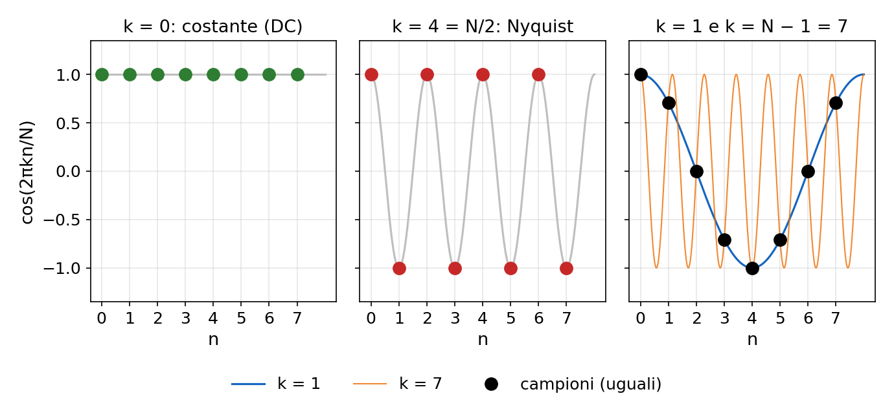

**In 2D** un'onda ha due frequenze, u lungo n e v lungo m: cos(2π(un/N + vm/M)). Si vede come un pattern di strisce: più u e v sono grandi, più le strisce sono fitte; il rapporto tra u e v ne fissa l'orientazione (slide 42; figura in sezione 12).

> **Attenzione alla slide 41**
> 
> Le uguaglianze fra frequenza k e N − k valgono solo con fase nulla. Con fase θ, la frequenza N − k equivale alla k con fase −θ. Vedi la scheda.

> **Il punto**
> 
> Su N campioni esistono solo le frequenze da 0 (DC) a N/2 (Nyquist); quelle sopra sono copie di quelle sotto.

### 10\. Esponenziali complessi: le onde che i filtri non deformano

**Il problema.** Se do un coseno in pasto a un filtro, esce un coseno? Non proprio: in generale esce un coseno **spostato**, cioè una miscela di coseno e seno. Quindi né i coseni né i seni, da soli, sono "autovettori" del filtro. Serve un oggetto che li tenga insieme.

**L'idea.** Si combinano coseno e seno in un solo numero complesso che gira:

`eu[n] = exp(2πj u n / N) = cos(2π u n / N) + j sin(2π u n / N)`

A ogni campione il punto avanza di un angolo 2πu/N sulla circonferenza unitaria. Il coseno è la sua "ombra" sull'asse reale, il seno quella sull'asse immaginario. Spostare l'onda vuol dire solo farla partire da un altro angolo, cioè moltiplicarla per ejθ (slide 43–46).

![e1\[n\] con N = 8: un giro completo in 8 passi da 45°. Le coordinate dei punti, lette in ordine, sono un coseno (blu) e un seno (rosso).](../sito-src/L3/disp2_cerchio.png)

**Il conto chiave (slide 44).** Do in input a un sistema LSI di kernel h l'onda x\[n\] = ejωn (con ω = 2πu/N):

`y[n] = ∑k h[k] ejω(n − k) = ejωn · ∑k h[k] e−jωk = H(ω) · ejωn`

Passaggio per passaggio: si usa la forma commutata della convoluzione, ∑k h\[k\] x\[n − k\]; si spezza ejω(n−k) = ejωn e−jωk; ejωn non dipende da k ed esce dalla somma. Quello che resta, H(ω), dipende solo dal kernel e dalla frequenza.

A parole: **l'onda esce identica, moltiplicata per un numero complesso H(ω)**. Il modulo |H| dice quanto viene amplificata o attenuata, la fase di H di quanto viene spostata. In algebra lineare: **gli esponenziali complessi sono autovettori di ogni convoluzione**, e H(ω) è l'autovalore. H si chiama **risposta in frequenza** o funzione di trasferimento.

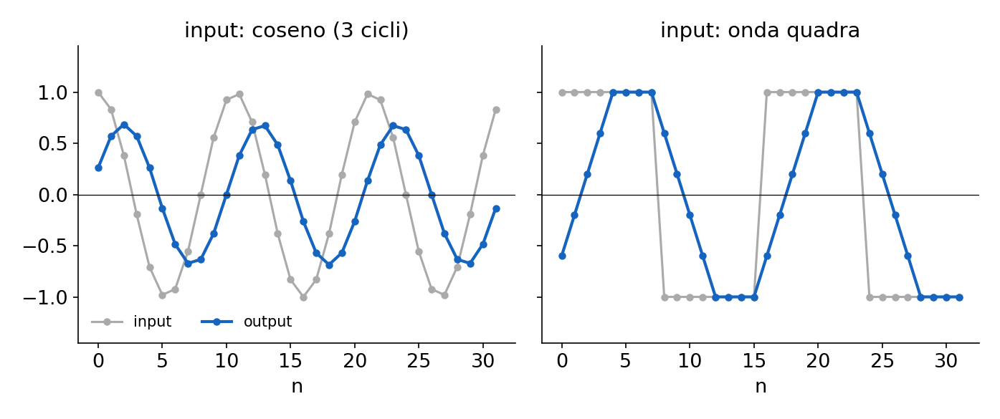

**Esempio a mano.** Il kernel di differenza y\[n\] = x\[n\] − x\[n − 1\] ha H(ω) = 1 − e−jω.

  - ω = 0 (segnale costante): H = 1 − 1 = 0. Le costanti spariscono, come da una derivata.
  - ω = π (segnale +1, −1, +1, …): e−jπ = −1, quindi **H = 1 − (−1) = 2: l'alternanza viene raddoppiata. Le alte frequenze passano, le basse no**: è un **passa-alto**.

> **Il punto**
> 
> Un'onda complessa ejωn attraversa qualunque convoluzione restando sé stessa, moltiplicata per H(ω). Ecco perché la base di Fourier usa gli esponenziali e non seni e coseni separati.

### 11\. La DFT: misurare quanto di ogni onda c'è nel segnale

**Il problema.** Abbiamo la base (le N onde e0, …, eN−1). Dato un segnale, come trovo i suoi coefficienti, cioè quanto contiene di ciascuna onda?

**L'idea.** **In una base ortogonale la coordinata di un vettore lungo un elemento della base si trova con un prodotto scalare**. Moltiplica il segnale per l'onda di prova campione per campione e somma: se il segnale contiene quell'onda, i prodotti sono quasi tutti positivi e la somma è grande; se non la contiene, positivi e negativi si cancellano.

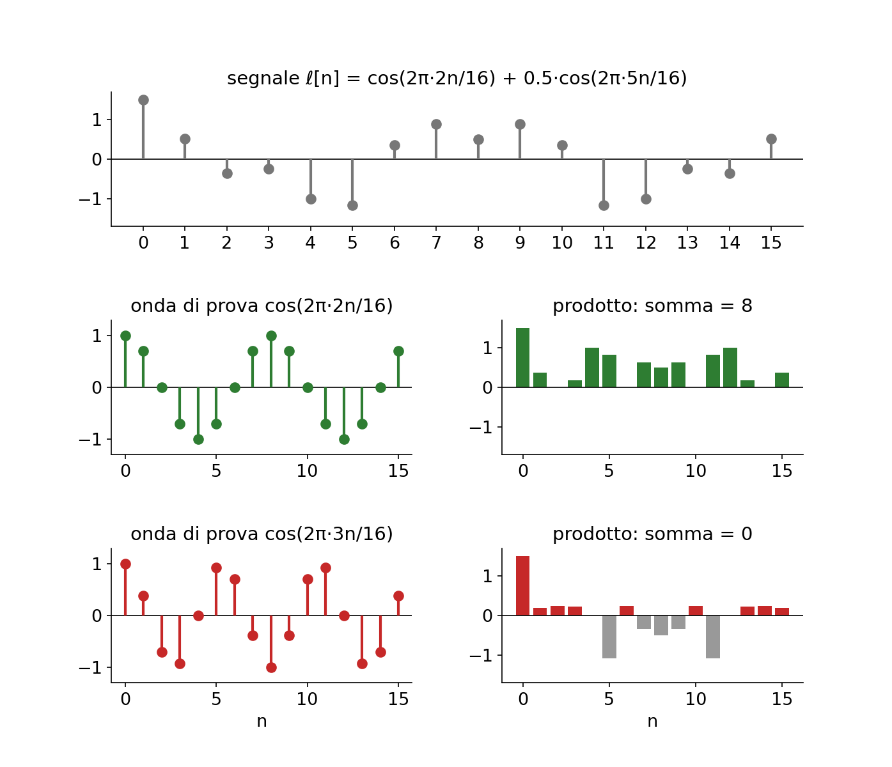

#### Perché si cancella: ortogonalità (slide 47)

`⟨eu, eu′⟩ = ∑n=0N−1 e2πj(u − u′)n/N`

È una serie geometrica di ragione r = e2πj(u − u′)/N. Se u = u′ ogni termine vale 1 e la somma è N. Altrimenti vale (1 − rN)/(1 − r), e rN = e2πj(u − u′) = 1 perché u − u′ è intero: la somma è 0. Quindi **le N onde sono ortogonali**, ciascuna con norma al quadrato N (non 1: da qui viene l'1/N dell'inversa).

#### La formula (slide 49)

Applicato alle onde (**il coniugato nel prodotto scalare complesso cambia il segno dell'esponente**), il prodotto scalare dà la DFT; la ricostruzione come somma pesata delle onde dà l'inversa:

`ℒ[u] = ∑n=0N−1 ℓ[n] · e−2πj u n / N     ℓ[n] = (1/N) ∑u=0N−1 ℒ[u] · e+2πj u n / N`

Simbolo per simbolo: ℓ\[n\] è il segnale; u l'indice di frequenza; ℒ\[u\] un numero complesso: il **modulo** dice quanto di quell'onda c'è, la **fase** dove sono le sue creste. Il segno − nella diretta viene dal coniugato; l'1/N nell'inversa compensa la norma N. È la convenzione di numpy. In 2D si somma su n e m con esponente −2πj(un/N + vm/M) e l'inversa ha 1/(NM).

#### Esempio completo con N = 4

Con N = 4 l'angolo base è 90°, quindi e−2πj/4 = −j e le potenze sono solo 1, −j, −1, j. La matrice di Fourier Fu,n = e−2πjun/4 (slide 51) è

`F = [[1, 1, 1, 1], [1, −j, −1, j], [1, −1, 1, −1], [1, j, −1, −j]]`

Riga 0: onda costante. Riga 2: alternanza (Nyquist). Righe 1 e 3: un giro in un verso e nell'altro. Trasformiamo ℓ = \[1, 2, 3, 4\]:

  - **ℒ\[0\] = 1 + 2 + 3 + 4 = 10. Sempre: la componente DC è la somma dei campioni**, cioè N volte la media.
  - ℒ\[1\] = 1 + 2(−j) + 3(−1) + 4(j) = (1 − 3) + j(−2 + 4) = −2 + 2j
  - ℒ\[2\] = 1 − 2 + 3 − 4 = −2: il segnale "alterna" poco, è una rampa liscia.
  - **ℒ\[3\] = 1 + 2j − 3 − 4j** **= −2 − 2j, il coniugato di ℒ\[1\]**.

**Verifica con l'inversa nel primo campione**: **ℓ\[0\] = (10 + (−2 + 2j) + (−2) + (−2 − 2j))/4 = 4/4 = 1**. **Corretto. E ℒ\[3\] = ℒ\[1\]∗** non è un caso: per ogni segnale reale vale la **simmetria coniugata ℒ\[N − u\] = ℒ\[u\]∗ (slide 62), perché coniugare** la formula della DFT cambia solo il segno dell'esponente. **Metà dello spettro è ridondante**: è il motivo di `np.fft.rfft`.

    import numpy as np
    x = np.array([1, 2, 3, 4])
    print(np.fft.fft(x))                  # [10.+0.j  -2.+2.j  -2.+0.j  -2.-2.j]
    F = np.exp(-2j*np.pi*np.outer(range(4), range(4))/4)
    print(np.allclose(F @ x, np.fft.fft(x)))          # True: la DFT è un prodotto matrice-vettore
    print(np.allclose(F.conj() @ F, 4*np.eye(4)))     # True: F* F = N I, quindi F⁻¹ = F*/N

> **Attenzione alla slide 51**
> 
> La slide scrive F−1 = F∗: **manca il fattore 1/N**, come mostra l'ultima riga del codice. Vedi la scheda.

La DFT è un prodotto per una matrice N×N, che costerebbe O(N²). La **FFT** non è un'altra trasformata: è un algoritmo che calcola lo stesso prodotto **in O(N log N)**.

> **Il punto**
> 
> ℒ\[u\] = prodotto scalare fra il segnale e l'onda u. Grazie all'ortogonalità ogni coefficiente misura una sola frequenza; l'inversa risomma le onde con il fattore 1/N.

### 12\. Sommare onde: serie di Fourier e spettri

#### Ricostruire un segnale onda per onda

**Il problema.** **Che cosa vuol dire**, concretamente, che un segnale "è una somma di onde"?

**L'idea.** Si parte dalla media e si aggiungono onde sempre più fitte: le lente danno la forma, le veloci i dettagli. Con tutte le frequenze il segnale torna identico: **la DFT non perde informazione**.

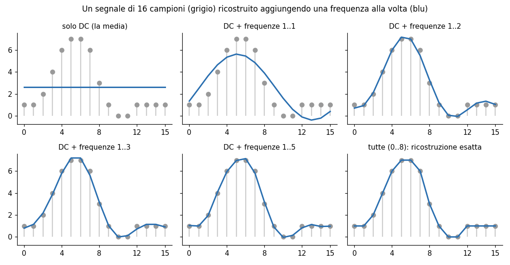

È la versione discreta della **serie di Fourier** (slide 35–36, 48): un segnale periodico continuo è una somma, in generale infinita, di sinusoidi. Esempio del libro: la rampa t/2 = sin t − ½ sin 2t + ⅓ sin 3t − … Con un salto netto (onda quadra, slide 48) **troncare la serie lascia un'oscillazione vicino al salto, circa il 9%, che non sparisce aggiungendo termini**: è il **fenomeno di Gibbs**, parente del ringing.

> **Attenzione alla slide 35**
> 
> La formula dei coefficienti ha 1/T davanti all'integrale: serve 2/T. E per un segnale periodico qualunque servono anche coseni e termine costante, non solo seni. La scheda ha la forma corretta.

#### Ampiezza e fase

Ogni ℒ\[u, v\] è complesso, quindi si scrive in forma polare ℒ = A ejθ: **l'ampiezza A = |ℒ| dice quanto c'è di quella frequenza, la fase θ dove sono posizionate le creste** dell'onda. Per disegnare uno spettro si usa log(1 + |ℒ|), perché **la DC domina tutto, con `fftshift` per mettere (0, 0) al centro (slide 50,** 53–54). Regola di lettura: **centro = basse frequenze, periferia = alte**.

#### Le coppie da sapere (slide 56–58)

  - **Impulso ↔ costante**: ℱ{δ} = 1. Nella somma resta solo n = 0: **un impulso contiene tutte le frequenze con la stessa ampiezza**.
  - **Costante ↔ impulso**: un'immagine uniforme ha solo la DC.
  - **Coseno ↔ due punti**: per Eulero cos(2π(u0n/N + v0m/M)) = (eu0,v0 + e−u0,−v0)/2, quindi lo spettro ha due picchi simmetrici in ±(u0, v0), ciascuno di valore NM/2 con la DFT della slide 49.
  - **Traslazione ↔ fase**: ℓ\[n − n0\] ha trasformata ℒ\[u\] e−2πjun0/N. **Il modulo non cambia, solo la fase**.
  - **Box ↔ sinc discreta**: lobo centrale e lobi laterali di segno alterno (sezione 13).

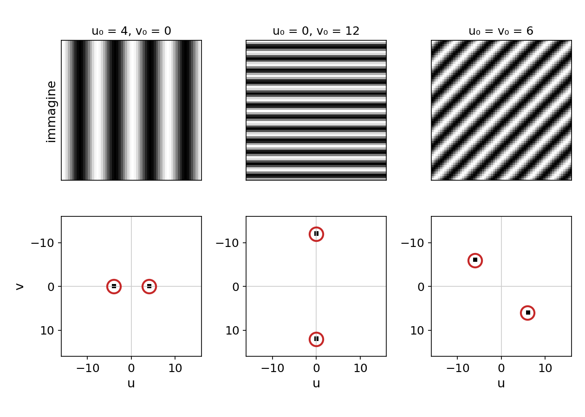

> **Attenzione alla slide 57**
> 
> La trasformata del seno ha un segno sbagliato e manca il fattore NM. La scheda ha le versioni corrette.

#### Cosa c'è nello spettro di una foto vera

Regioni lisce = bassa frequenza; un bordo netto = frequenze su un'ampia banda, nella direzione perpendicolare al bordo; una texture periodica = picchi isolati (slide 55). **Nelle foto naturali l'ampiezza decade circa come 1/|frequenza|**: quasi tutta l'energia sta vicino al centro. La croce luminosa sugli assi (vedi la figura in sezione 14) **non viene dalla scena**: la DFT tratta l'immagine come periodica, e il salto fra bordo destro e sinistro è un bordo netto.

#### Ampiezza o fase, cosa conta di più? (slide 59–60)

Scambiando ampiezza e fase di due foto, in ogni ibrido si riconosce l'immagine che ha dato la **fase**. Nelle foto **la posizione dei bordi sta nella fase**. Per una texture periodica (il tessuto della slide 60) vale invece il contrario: conta l'ampiezza.

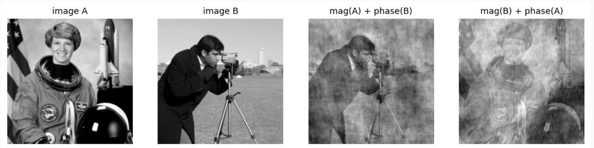

> **Attenzione alla slide 60**
> 
> La didascalia descrive uno scambio fra immagini, ma la figura fa un esperimento diverso (fase casuale e ampiezza 1/f). Vedi la scheda.

> **Il punto**
> 
> Lo spettro si legge così: centro = lento, periferia = fitto; due punti = un'onda; l'ampiezza dice quanto, la fase dove. Nelle foto la fase porta la struttura.

### 13\. Il teorema di convoluzione

**Il problema.** Convolvere un'immagine 4000×3000 con un kernel 101×101 costa circa 1011 moltiplicazioni. E capire a occhio cosa fa un kernel è difficile. Fourier risolve entrambe le cose.

**L'idea.** Mettiamo insieme i pezzi. Ogni onda eu attraversa il filtro moltiplicata per H\[u\] (sezione 10). Ogni segnale è una somma di onde con coefficienti ℒ\[u\] (sezione 11). Per linearità l'output è la stessa somma, con ogni coefficiente moltiplicato per H\[u\]:

`ℱ{h ∗ ℓ}[u] = H[u] · ℒ[u]`

**La convoluzione nello spazio è un prodotto punto per punto in frequenza** (slide 63). H\[u\] = ℱ{h} è la DFT del kernel, cioè la funzione di trasferimento: **kernel e funzione di trasferimento sono due descrizioni dello stesso sistema** (slide 65).

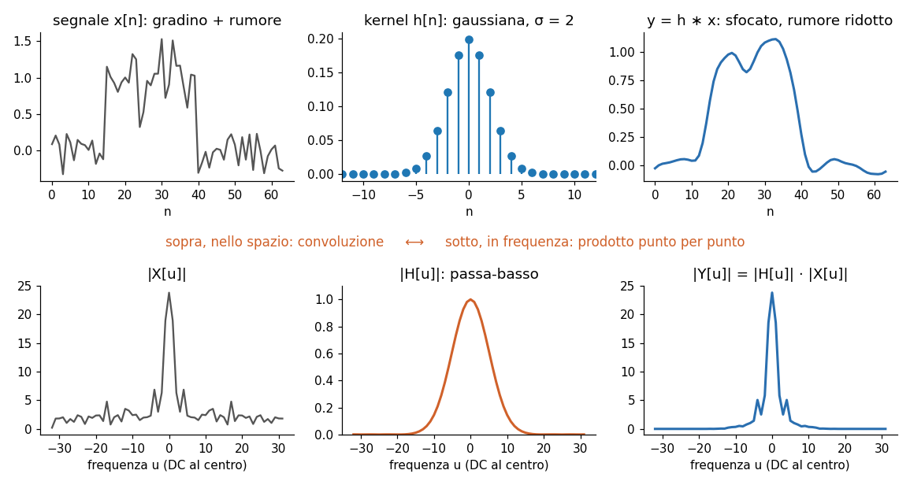

#### Verifica con i numeri

Riprendiamo ℓ = \[1, 2, 3, 4\], con ℒ = \[10, −2 + 2j, −2, −2 − 2j\], e il kernel di differenza circolare h = \[1, −1, 0, 0\] (slide 30). La sua DFT è H\[u\] = 1 − (−j)u, cioè H = \[0, 1 + j, 2, 1 − j\]. Il prodotto punto per punto:

  - Y\[0\] = 10 · 0 = 0
  - Y\[1\] = (−2 + 2j)(1 + j) = −2 − 2j + 2j + 2j² = −4
  - **Y\[2\] = (−2)(2) = −4**
  - **Y\[3\] = (−2 − 2j)(1 − j)** **= −2 + 2j − 2j + 2j² = −4**

**Antitrasformando**: **y\[0\] = (0 − 4 − 4 − 4)/4 = −3, e per n = 1, y\[1\] = (0 + (−4)(j) + (−4)(−1) + (−4)(−j))/4 = 1; allo stesso modo y\[2\] = y\[3\] = 1**. Risultato \[−3, 1, 1, 1\]: identico alla convoluzione **calcolata nello spazio** nella scheda della slide 30. **Leggi anche i numeri di H: H\[0\] = 0 dice che la DC viene eliminata** (infatti −3 + 1 + 1 + 1 = 0), H\[2\] = 2 che l'alternanza viene raddoppiata: è il passa-alto della sezione 10.

#### Convoluzione circolare e zero padding (slide 64)

Perché −3 e non 1? La convoluzione lineare di \[1, 2, 3, 4\] con \[1, −1\] è \[1, 1, 1, 1, −4\], lunga 5. **La DFT però lavora su 4 campioni e tratta i segnali come periodici**: il quinto valore rientra in posizione 0 (wrap-around).

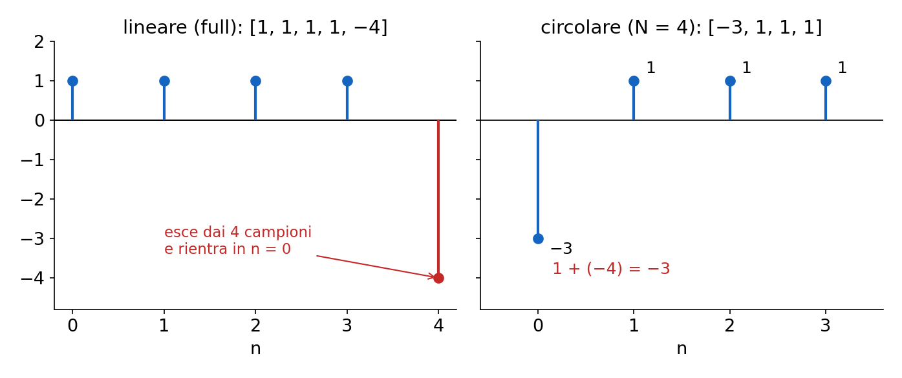

Il teorema vale esattamente per la **convoluzione circolare**. **Per avere quella lineare si allungano entrambi i segnali con zeri fino ad almeno N + k − 1 campioni** (qui 5). La FFT conviene per kernel grandi (O(N log N) contro O(Nk)); per i 3×3 delle CNN si usa la convoluzione diretta.

    x, h = np.array([1., 2, 3, 4]), np.array([1., -1])
    L = len(x) + len(h) - 1
    y = np.fft.ifft(np.fft.fft(x, L) * np.fft.fft(h, L)).real
    print(np.round(y, 6), np.convolve(x, h))   # [1 1 1 1 -4] in entrambi i casi

#### Leggere un kernel in frequenza: box contro binomiale

**Due esempi da fare a mano, con kernel centrati in 0 (quindi H reale**: nessuno sfasamento). Uso ω = 2πu/N, tra −π e π.

  - **Box** h = ⅓\[1, 1, 1\]: H(ω) = ⅓(ejω + 1 + e−jω) = (1 + 2 cos ω)/3. Vale 1 in ω = 0, si annulla in ω = 2π/3 e in ω = π vale −1/3: **una frequenza alta passa ancora, per di più con il segno invertito**. Il box è un passa-basso scadente.
  - **Binomiale** h = ¼\[1, 2, 1\]: H(ω) = (2 + 2 cos ω)/4 = cos²(ω/2). Vale 1 in 0, **scende in modo monotono e vale 0 esattamente a Nyquist**. È la versione discreta della gaussiana, e il motivo per cui si preferisce la gaussiana al box per sfocare (slide 22, [L5](https://gabriele-marsili.github.io/appunti-magistrale-ai/anno-2/computer-vision/sito/#L5)).

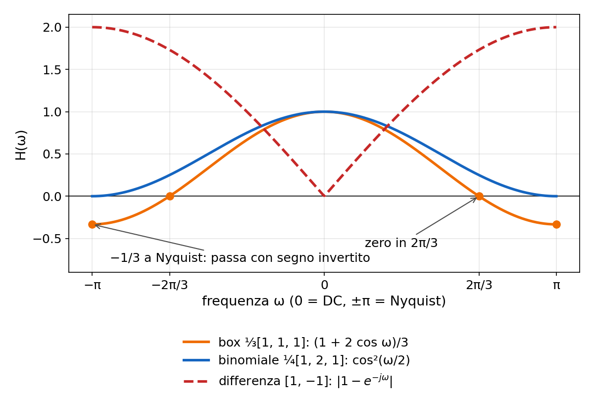

**La differenza (tratteggio) ha |H| = 0 in DC e 2 a Nyquist**: il passa-alto. In tutti e tre H(0) = somma dei pesi: il guadagno DC di un kernel è la somma dei coefficienti, e un **kernel di blur deve avere somma 1 per non cambiare la luminosità media**.

> **Il punto**
> 
> ℱ{h ∗ ℓ} = H · ℒ: convolvere = moltiplicare gli spettri. Esatto per la convoluzione circolare; per quella lineare serve zero padding a N + k − 1. H(0) = somma dei pesi.

### 14\. Filtrare in frequenza

**Il problema.** Vuoi togliere il rumore, o tenere solo i contorni, o eliminare un pattern periodico (le righe di uno scanner, un moiré). Scegliere i pesi del kernel a mano è scomodo.

**L'idea.** Il teorema dà un secondo modo di progettare filtri: invece dei pesi del kernel si sceglie direttamente la curva H, cioè quanto lasciar passare di ogni frequenza (slide 66–67). Trasformi, moltiplichi per H, antitrasformi.

  - **Passa-basso**: H ≈ 1 vicino alla DC, ≈ 0 lontano. Toglie dettagli e rumore: sfoca.
  - **Passa-alto**: il complementare, HHP = 1 − HLP, cioè nello spazio hHP = δ − hLP: l'immagine meno la sua versione sfocata. Restano bordi e dettagli.
  - **Passa-banda**: solo un anello di frequenze intermedie, per esempio la differenza di due passa-basso. Utile per texture e orientazioni (slide 73, filtri di Gabor) e alla base delle piramidi di [L6](https://gabriele-marsili.github.io/appunti-magistrale-ai/anno-2/computer-vision/sito/#L6).

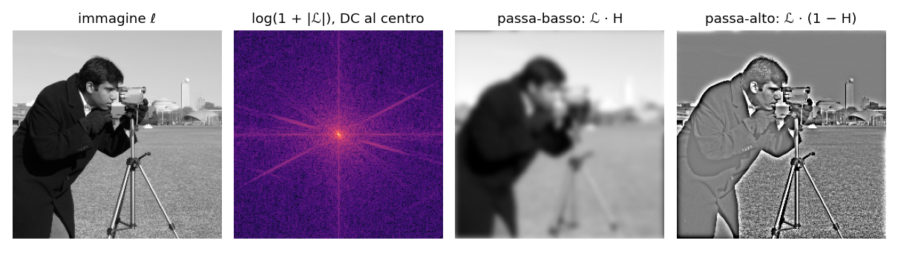

    F = np.fft.fftshift(np.fft.fft2(img))                    # DC al centro
    R, C = img.shape                                          # dimensioni pari
    yy, xx = np.mgrid[-R//2:R//2, -C//2:C//2]
    LP = np.exp(-(xx**2 + yy**2) / (2 * 12**2))               # gaussiana in frequenza
    low  = np.fft.ifft2(np.fft.ifftshift(F * LP)).real
    high = np.fft.ifft2(np.fft.ifftshift(F * (1 - LP))).real  # = img - low

**Esempio del libro (§ 16.10.1).** In una foto 256×256 di un edificio le colonne si ripetono ogni 14 pixel, quindi lo spettro ha picchi isolati a 256/14 ≈ 18 e multipli. Azzerando quei picchi le colonne spariscono e il resto della foto rimane: un filtro difficilissimo da descrivere nello spazio, banale in frequenza.

Un limite netto: **un filtro lineare può solo scalare e sfasare le frequenze che ci sono già, non può crearne di nuove**. Un dettaglio perso con il blur non si recupera con un altro filtro LSI.

> **Il punto**
> 
> Filtrare = scegliere H. Passa-basso sfoca, passa-alto = 1 − passa-basso tiene i bordi, passa-banda isola texture. Nessun filtro lineare inventa frequenze.

### 15\. Due applicazioni: JPEG e CNN

#### Compressione (slide 69–70)

**Il problema.** Una foto da 12 megapixel non compressa occupa 36 MB; il telefono la salva in 3. Come?

**L'idea.** Le foto concentrano l'energia in bassa frequenza e l'occhio vede poco i dettagli finissimi. Il libro (§ 16.5.3) mostra che tenendo solo i 127 coefficienti più grandi su 4096 un'immagine 64×64 è già riconoscibile. JPEG fa la **DCT** (parente reale della DFT, solo coseni) di blocchi 8×8, **quantizza grossolanamente i coefficienti alti** (molti diventano zero) e comprime gli zeri. **A compressione forte compaiono blocchi e ringing vicino ai bordi**, parente di Gibbs.

#### Collegamenti con le CNN (slide 71–72)

  - Un layer convoluzionale è un insieme di sistemi LSI, uno per canale di output: pesi condivisi e locali (sezione 3). Ogni filtro ha una risposta in frequenza; nei primi layer i filtri appresi somigliano a **passa-banda orientati tipo Gabor**.
  - Due convoluzioni di fila senza nulla in mezzo equivalgono a una sola (associatività), e in frequenza al prodotto delle risposte. **Senza nonlinearità una CNN profonda collasserebbe in un unico filtro**. Lo impedisce la ReLU: **non lineare, crea frequenze nuove** (armoniche).
  - **Campo recettivo**: L layer k×k con stride 1 vedono 1 + L(k − 1) pixel. Due 3×3 vedono quanto un 5×5 con 18 pesi invece di 25. Un campo più ampio coglie frequenze più basse, cioè struttura più globale. Le convoluzioni dilatate campionano l'input in modo rado e, se progettate male, danno **artefatti tipo aliasing (gridding)**.

Il limite di Fourier, con cui il libro chiude: **lo spettro dice quali frequenze ci sono, ma non dove**, perché ogni coefficiente dipende da tutta l'immagine. Serve qualcosa di localizzato sia nello spazio sia in frequenza: piramidi ([L6](https://gabriele-marsili.github.io/appunti-magistrale-ai/anno-2/computer-vision/sito/#L6)) e banchi di filtri ([L7](https://gabriele-marsili.github.io/appunti-magistrale-ai/anno-2/computer-vision/sito/#L7)).

> **Il punto**
> 
> JPEG scarta le alte frequenze che non si vedono. Una CNN è una pila di filtri LSI separati da nonlinearità: senza di esse sarebbe un solo filtro.

### Il riassunto in 10 righe

1.  Lineare + invariante per traslazione (LSI) ⇔ convoluzione: ℓout\[n\] = ∑k h\[n − k\] ℓin\[k\].
2.  Il kernel h è la risposta all'impulso; come matrice è Toeplitz, cioè un layer denso con pesi condivisi e locali.
3.  A mano: ribalta, sposta, moltiplica, somma. Somma dei pesi 1 = blur, somma 0 = rilevatore di bordi. Full: N + k − 1 campioni.
4.  Commutativa, associativa (filtri in cascata = un filtro), distributiva, δ neutro. Correlazione = senza ribaltare, non associativa.
5.  Kernel separabile (rango 1) ⇒ due passate 1D, 2k invece di k² per pixel. Ai bordi: zero, replicate, reflect (il migliore), wrap.
6.  Gli esponenziali complessi sono autovettori di ogni convoluzione: ejωn esce come H(ω) ejωn.
7.  DFT: ℒ\[u\] = ∑ ℓ\[n\] e−2πjun/N; inversa con segno + e 1/N; F∗F = N I. ℒ\[0\] = somma dei campioni. FFT = O(N log N).
8.  Segnale reale ⇒ ℒ\[N − u\] = ℒ\[u\]∗. δ ↔ 1, coseno ↔ due picchi, traslazione ↔ solo fase. Nelle foto la struttura sta nella fase.
9.  Teorema di convoluzione: ℱ{h ∗ ℓ} = H · ℒ, esatto per la circolare; per la lineare zero padding a N + k − 1.
10. Filtrare = scegliere H: passa-basso, passa-alto = 1 − passa-basso, passa-banda. I filtri lineari non creano frequenze, le nonlinearità sì.

### Verifica di aver capito

**La rotazione attorno al centro è un sistema LSI? E sottrarre la media globale?**

La rotazione è lineare ma non invariante: il centro di rotazione è fisso, quindi spostare e poi ruotare non equivale a ruotare e poi spostare. Non è una convoluzione. Sottrarre la media globale è lineare e, su segnali circolari, invariante: è la convoluzione con δ − (1/N)·\[1, …, 1\], che azzera solo la DC.

**Calcola a mano la convoluzione "full" di x = \[2, 0, 1\] con h = \[1, 3\]. Quanto è lunga?**

Lunghezza 3 + 2 − 1 = 4. y\[0\] = 2·1 = 2; y\[1\] = 2·3 + 0·1 = 6; y\[2\] = 0·3 + 1·1 = 1; y\[3\] = 1·3 = 3. Risultato \[2, 6, 1, 3\]. Controllo con gli impulsi: 2·\[1, 3\] in posizione 0 più 1·\[1, 3\] in posizione 2.

**Quanto vale la DFT di ℓ = \[1, 1, 1, 1\]? E di ℓ = \[1, −1, 1, −1\]? Perché?**

\[4, 0, 0, 0\] e \[0, 0, 4, 0\]. Il primo è costante: solo DC, che vale la somma, 4. Il secondo è esattamente l'onda di Nyquist (riga 2 della matrice F con N = 4): il prodotto scalare con la riga 2 dà 4, con le altre 0 per ortogonalità.

**Perché la base di Fourier usa gli esponenziali complessi e non seni e coseni separati?**

Perché gli esponenziali sono autovettori di ogni convoluzione: ejωn esce come H(ω) ejωn. Un coseno filtrato in generale esce spostato, cioè come miscela di coseno e seno, quindi non è un autovettore. In più l'ortogonalità si dimostra con una sola serie geometrica.

**Convolvi via FFT un segnale di 100 campioni con un kernel di 11 usando DFT di lunghezza 100. Cosa va storto e come si corregge?**

La DFT fa la convoluzione circolare: i 10 campioni che la lineare produrrebbe oltre la fine rientrano all'inizio e si sommano ai primi (wrap-around). Si corregge con zero padding di entrambi a lunghezza almeno 100 + 11 − 1 = 110, poi si ritaglia l'output.

**Il kernel ⅓\[1, 1, 1\] e il kernel ¼\[1, 2, 1\] sfocano entrambi. Quale preferisci e perché, guardando H?**

¼\[1, 2, 1\], con H(ω) = cos²(ω/2): scende in modo monotono da 1 a 0 a Nyquist. Il box ha H(ω) = (1 + 2 cos ω)/3, che si annulla a 2π/3 e poi diventa negativo, −1/3 a Nyquist: lascia passare parte delle alte frequenze e ne inverte il segno.

### Come proseguire

  - [Visionbook cap. 15, Linear Image Filtering](https://visionbook.mit.edu/linear_image_filtering.html): § 15.3 (da sistema lineare a convoluzione), § 15.4 (proprietà, bordi, circolare), § 15.5 (correlazione e template matching), § 15.6 (risposta all'impulso).
  - [Visionbook cap. 16, Fourier Analysis](https://visionbook.mit.edu/image_processing_fourier.html): § 16.4–16.5 (onde, DFT, matrice), § 16.6 (trasformate notevoli), § 16.7 (proprietà, teorema di convoluzione), § 16.9–16.10 (ampiezza e fase, filtri in frequenza).
  - In [L4](https://gabriele-marsili.github.io/appunti-magistrale-ai/anno-2/computer-vision/sito/#L4) rifai tutto in numpy su segnali 1D; in [L5](https://gabriele-marsili.github.io/appunti-magistrale-ai/anno-2/computer-vision/sito/#L5) blur e derivate diventano strumenti; in [L6](https://gabriele-marsili.github.io/appunti-magistrale-ai/anno-2/computer-vision/sito/#L6) il teorema duale (prodotto ↔ convoluzione) spiega l'aliasing.
  - Ora ripassa con le schede qui sotto, slide per slide: tieni d'occhio i riquadri "Attenzione" delle slide 7, 30, 35, 41, 51, 57 e 60.
