# L4 · Lab FFT 1D

*Lezione 4 · Antonio Carta · laboratorio, settembre 2026*

[Versione interattiva sul sito, con videolezione](https://gabriele-marsili.github.io/appunti-magistrale-ai/anno-2/computer-vision/sito/#L4) · [Indice della dispensa](README.md)

**In una frase:** il laboratorio prende gli strumenti della [L3](https://gabriele-marsili.github.io/appunti-magistrale-ai/anno-2/computer-vision/sito/#L3) (DFT, convoluzione, teorema di convoluzione) e li usa su segnali 1D che si possono vedere e ascoltare, per imparare tre abilità concrete: leggere uno spettro, capire che cosa fa un kernel guardando la sua risposta in frequenza, e usare la cross-correlazione per misurare la somiglianza, fino a classificare cifre parlate e a cercare un pattern in un'immagine.

### Prima di iniziare

Ti servono tre cose, tutte della [L3](https://gabriele-marsili.github.io/appunti-magistrale-ai/anno-2/computer-vision/sito/#L3).

  - **Segnale discreto**: una sequenza x\[0\], …, x\[N−1\] di numeri presi a intervalli regolari. Nell'audio il passo è 1/fs secondi, dove fs (sample rate) è il numero di campioni al secondo.
  - **Numeri complessi**: ejθ = cos θ + j sin θ. Il modulo |X| di un numero complesso dice "quanto" di una sinusoide c'è, la fase "dove è spostata".
  - **Convoluzione**: ogni campione di uscita è una somma pesata dei campioni vicini dell'ingresso, con i pesi dati dal kernel ribaltato. La riprendiamo da zero nella sezione 6.

Più numpy e l'idea di k-NN dal corso di machine learning.

### Guarda prima questi video

  - [But what is the Fourier Transform? A visual introduction.](https://www.youtube.com/watch?v=spUNpyF58BY) (Video). 3Blue1Brown. Guardalo tutto: l'idea di "avvolgere" il segnale attorno a una circonferenza a ogni frequenza è esattamente ciò che fa la DFT, e l'esempio è proprio un suono composto da più note, come l'accordo di demo.ipynb.
  - [But what is a convolution?](https://www.youtube.com/watch?v=KuXjwB4LzSA) (Video). 3Blue1Brown. Tutto: la convoluzione dalle probabilità alla media mobile e allo sfocamento, il ribaltamento del kernel, e nell'ultima parte perché la FFT la rende veloce (teorema di convoluzione).
  - [Denoising Data with FFT \[Python\]](https://www.youtube.com/watch?v=s2K1JfNR7Sc) (Video). Steve Brunton. Il codice è quasi identico a freq\_filter del notebook: FFT, maschera sullo spettro, IFFT. Guarda come sceglie la soglia osservando lo spettro e come confronta il segnale prima e dopo.
  - [Template Matching](https://www.youtube.com/watch?v=1_hwFc8PXVE) (Video). Shree Nayar, First Principles of Computer Vision (Image Processing I). Per l'ultima parte del lab: perché la correlazione semplice sbaglia sulle zone chiare e come la correlazione normalizzata risolve il problema.

### 1\. Perché un laboratorio sull'audio

**Il problema.** Nelle prossime lezioni ([L5](https://gabriele-marsili.github.io/appunti-magistrale-ai/anno-2/computer-vision/sito/#L5), [L6](https://gabriele-marsili.github.io/appunti-magistrale-ai/anno-2/computer-vision/sito/#L6), [L7](https://gabriele-marsili.github.io/appunti-magistrale-ai/anno-2/computer-vision/sito/#L7)) filtri, derivate e spettri verranno applicati alle immagini, dove sono bidimensionali e **difficili** da intuire.

**L'idea.** Il suono **è il caso più semplice**: una sola variabile, spettri che sono curve, e un controllo immediato, perché un passa-basso lo senti come voce "ovattata", come attraverso un muro. Ogni idea passa invariata alle immagini sostituendo il tempo con le coordinate dei pixel.

I tre notebook vanno fatti in ordine e hanno ciascuno un obiettivo diverso:

  - **demo.ipynb** (schede 1–12): leggere uno spettro e filtrare, prima in frequenza e poi nel tempo con tre kernel.
  - **classification.ipynb** (schede 13–20): usare lo spettro non per modificare il segnale ma per **descriverlo**, e classificare con un k-NN quale cifra viene pronunciata.
  - **15lif.ipynb** (schede 21–27): scrivere a mano convoluzione e cross-correlazione, in 1D e 2D, fino al template matching.

**Il filo che li lega è uno solo:** **un segnale si può guardare nel tempo o in frequenza, e una convoluzione nel tempo è una moltiplicazione in frequenza**.

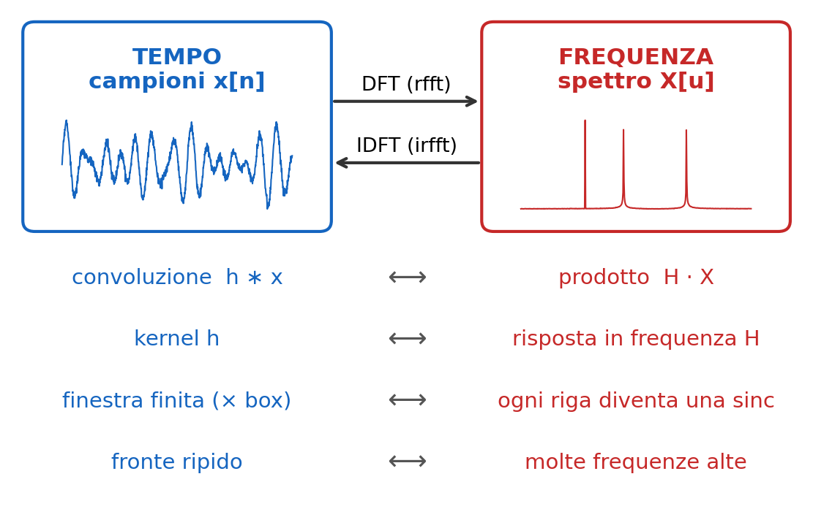

> **Il punto**
> 
> L'audio è la palestra 1D per tutto ciò che farai sulle immagini. Il lab allena un solo riflesso: per ogni operazione, chiederti che cosa fa nel tempo e che cosa fa in frequenza.

### 2\. Dal tempo alla frequenza: la DFT

**Il problema.** Il notebook sintetizza un accordo di La minore: tre sinusoidi a 220 (A3), 261.63 (C4) e 329.63 Hz (E4), più rumore, campionate a fs = 22050 Hz per 2 secondi. Se disegni il segnale nel tempo (scheda 3) vedi un'oscillazione irregolare con un inviluppo che sale e scende (i **battimenti** fra note vicine, alla frequenza differenza, circa 42 Hz), ma non riesci a dire **quante note ci sono né quali. Il tempo nasconde le frequenze. La DFT serve a rendere** visibile proprio questa informazione.

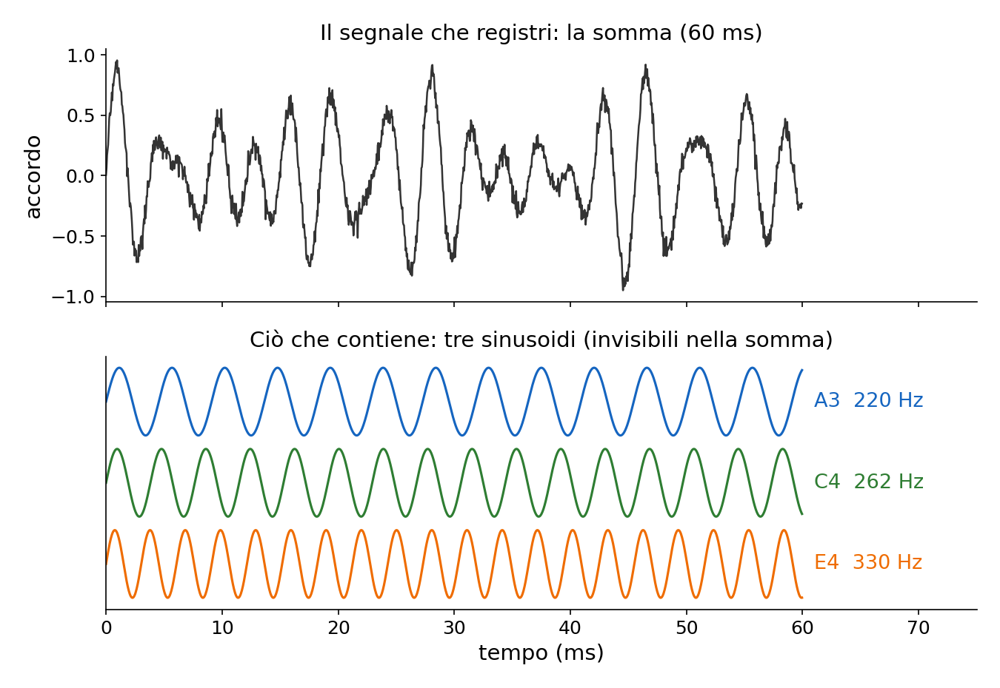

**L'idea.** **La DFT è un cambio di base** (libro, cap. 16, § 16.2 e 16.5). **Invece di descrivere il segnale con N valori nel tempo, lo descrivi con N coefficienti, uno per ciascuna sinusoide complessa che compie un numero intero di cicli nella finestra.** Il coefficiente u misura quanto il segnale "somiglia" alla sinusoide che fa u cicli: è un prodotto scalare, grande se le due curve vanno su e giù insieme.

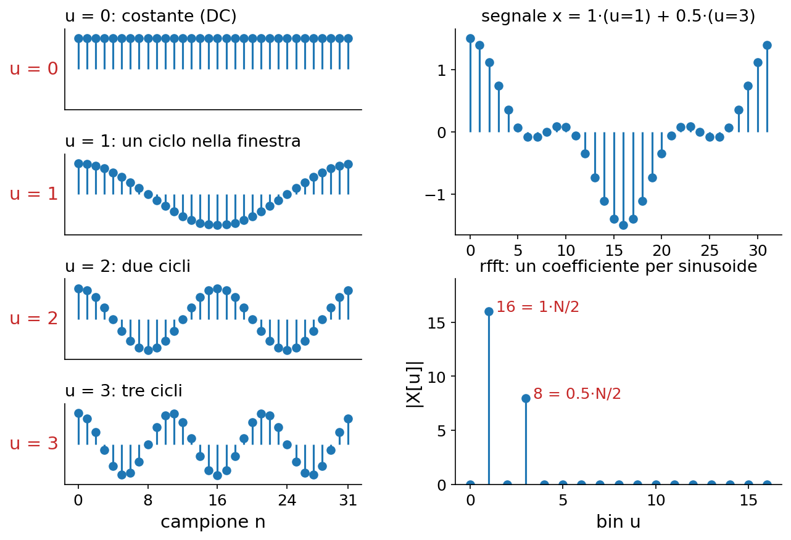

**La matematica.**

`X[u] = ∑n=0N−1 x[n] e−2πj un/N,   u = 0, …, N−1`

  - **x\[n\]** è il campione n-esimo, **N** il numero di campioni.
  - **u** è l'indice di frequenza (il **bin**: conta i cicli che la sinusoide compie nella finestra di N campioni).
  - **e−2πj un/N** è la sinusoide complessa con cui confronti il segnale; il segno meno è una convenzione.
  - L'inversa ha davanti 1/N: x\[n\] = (1/N) ∑u X\[u\] e+2πj un/N. È la convenzione del libro e di numpy: **la FFT diretta non divide per nulla**, quindi i picchi sono grandi (scheda 4).

A parole: per ogni u, moltiplica il segnale campione per campione per una sinusoide che fa u cicli e somma tutto. Se il segnale contiene quella sinusoide i prodotti si sommano, altrimenti si cancellano. La FFT calcola la stessa cosa in O(N log N).

Per un segnale reale vale la **simmetria hermitiana** X\[N−u\] = X\[u\]\* (il coniugato): la seconda metà dello spettro ripete la prima. Per questo `np.fft.rfft` restituisce solo i bin da 0 a N/2, cioè N/2 + 1 valori.

**Esempio svolto.** Prendi N = 8 e x = \[1, 0, −1, 0, 1, 0, −1, 0\]: è un coseno che fa 2 cicli nella finestra. Calcola X\[2\] = ∑ x\[n\] e−2πj·2n/8 = ∑ x\[n\] e−jπn/2: i termini non nulli sono n = 0, 2, 4, 6, con e−jπn/2 = 1, −1, 1, −1, quindi X\[2\] = 1·1 + (−1)(−1) + 1·1 + (−1)(−1) = 4. Tutti gli altri bin valgono 0 tranne X\[6\] = 4, il gemello coniugato. **`np.fft.rfft(x)` restituisce \[0, 0, 4, 0, 0\]**: cinque valori (N/2 + 1), un solo picco. L'altezza è **A·N/2** = 1·8/2 = 4: metà dell'ampiezza va nel bin positivo, metà nel suo gemello negativo che rfft non mostra.

> **Il punto**
> 
> La DFT riscrive N campioni come N coefficienti, uno per ogni sinusoide che fa un numero intero di cicli nella finestra. Ogni coefficiente è un prodotto scalare: misura quanto di quella sinusoide c'è nel segnale.

### 3\. Leggere uno spettro: bin, hertz, risoluzione, scala log

**Il problema.** Per dire "c'è una nota a 220 Hz" devi sapere a quale frequenza corrisponde ogni indice u, quanto distano due indici e dove finisce l'asse.

**L'idea.** **Per passare dai bin agli hertz** basta ricordare che la finestra dura N/fs secondi. Se la sinusoide fa u cicli **in N/fs secondi, la sua frequenza è:**

`fu = u · fs / N,   Δf = fs / N = 1 / durata,   fmax = fs / 2`

  - **Δf** è la **risoluzione**, la distanza in Hz fra due bin vicini.
  - **fs/2** è la **frequenza di Nyquist**, **la più alta rappresentabile: sopra, una sinusoide è indistinguibile da una più lenta (aliasing**, che vedrai in [L6](https://gabriele-marsili.github.io/appunti-magistrale-ai/anno-2/computer-vision/sito/#L6)).

Nota la conseguenza pratica, la più controintuitiva del lab: per separare due frequenze vicine serve un segnale **più lungo**, non un campionamento più fitto. Alzare fs allunga l'asse verso le alte frequenze, ma la distanza fra i bin dipende solo dalla durata. Per questo un accordatore deve "ascoltare" la nota per un po'.

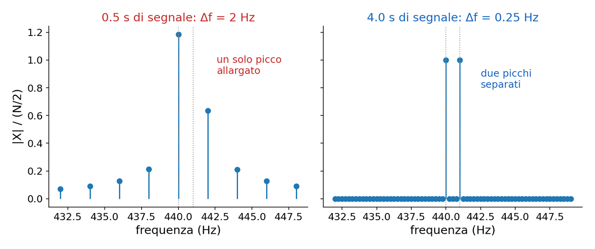

**Esempio svolto.** Con i numeri del notebook (scheda 4): N = 44100 campioni (2 s a fs = 22050 Hz), quindi rfft dà 22051 valori, Δf = 0.5 Hz, fmax = 11025 Hz, e la nota A3 a 220 Hz cade nel bin 220/0.5 = 440. Un picco ha altezza A·N/2 = A·22050: per leggere l'ampiezza vera dividi per N/2.

    X = np.fft.rfft(x)                        # N/2+1 coefficienti complessi
    freqs = np.fft.rfftfreq(len(x), d=1/SR)   # asse in Hz: k * SR / N
    mag = np.abs(X)                           # quanto di ogni frequenza
    plt.semilogy(freqs, mag)                  # scala log sulle y

**Perché la scala logaritmica** (scheda 5). In scala lineare vedi solo i tre picchi, alti migliaia; il rumore, circa mille volte più piccolo, è schiacciato sullo zero. In scala log ogni fattore 10 occupa lo stesso spazio, e compare il **pavimento di rumore**, piatto perché il rumore bianco contiene tutte le frequenze in egual misura. Nella figura i picchi sono alti circa 6800 (A3) e 6070 (C4, E4). **In log compaiono il pavimento di rumore intorno a 10–30 e le "gonne"** attorno a C4 ed E4. Nelle immagini si usa quasi sempre il log.

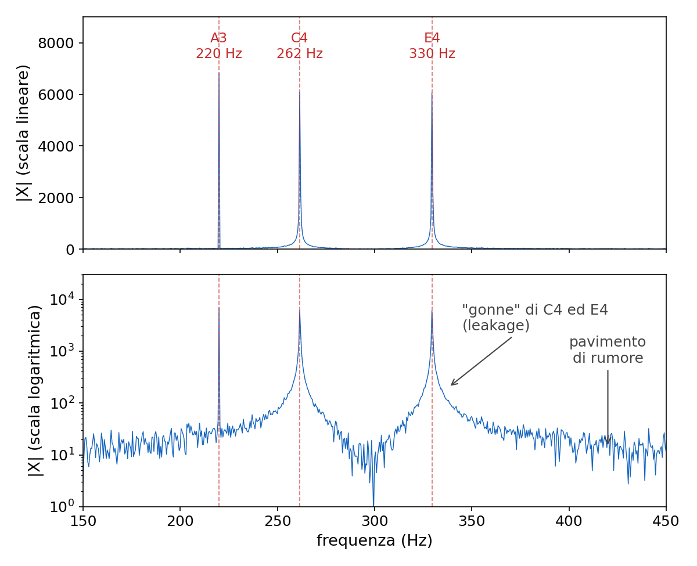

> **Il punto**
> 
> Bin u = u·fs/N hertz; i bin distano 1/durata; l'asse finisce a fs/2. Per vedere dettagli fini in frequenza serve un segnale lungo, e lo spettro si guarda in scala log.

### 4\. Perché tre note uguali danno picchi diversi: il leakage

**Il problema.** Guardando lo spettro della scheda 5 noti un dettaglio **strano: le tre sinusoidi hanno la stessa ampiezza, ma il picco di A3 è più alto (circa 6810) di quelli di C4 ed E4** (circa 6070), che in scala log hanno anche **"gonne" larghe**. Non è un errore: è lo **spectral leakage** (dispersione spettrale).

**L'idea.** La DFT usa solo sinusoidi che fanno un numero **intero** di cicli nella finestra, e tratta il segnale come se si ripetesse all'infinito (finestra incollata a se stessa). Se la tua sinusoide fa 8 cicli esatti, l'incollatura è perfetta e tutta l'energia finisce in un bin. Se **ne fa 8.5, alla giunzione c'è un salto, e per descrivere** quel salto servono anche i bin vicini.

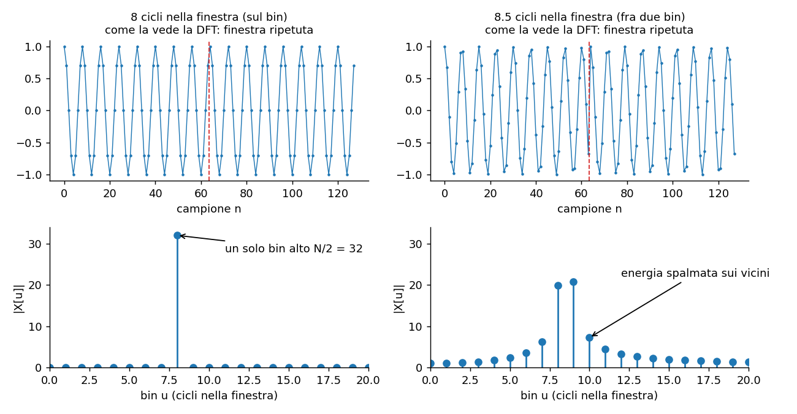

Nella figura, **con 8 cicli la giunzione è invisibile, con 8.5 c'è un salto**, e lo spettro passa da un bin solo a una coda lunga.

**La matematica.** Il libro fornisce gli strumenti per fare il conto (scheda 5, riquadro "Dal libro"), in tre passi:

1.  Osservare una sinusoide per 2 secondi significa moltiplicarla per un **box**.
2.  Un prodotto nel tempo è una convoluzione in frequenza (**dual convolution, § 16.7.5); la trasformata del box** è una **sinc discreta** (§ 16.6.3), con zeri a distanza di un bin.
3.  Ogni riga dello spettro diventa quindi una sinc, e i bin la campionano: se la frequenza cade esattamente su un bin, i bin vicini cadono sugli zeri della sinc; altrimenti raccolgono i suoi lobi.

`|picco| / (A·N/2) ≈ |sin(πδ) / (πδ)|,   δ = distanza della frequenza vera dal bin più vicino`

**Esempio svolto.** A3: 220 Hz / 0.5 Hz = bin 440 esatto, δ = 0, nessuna perdita. C4: 261.63 / 0.5 = 523.26, quindi δ = 0.26 e **il picco si riduce di |sin(0.26π)/(0.26π)| ≈ 0.89, cioè 6070/6810**. L'energia mancante è finita nei bin vicini: sono le gonne.

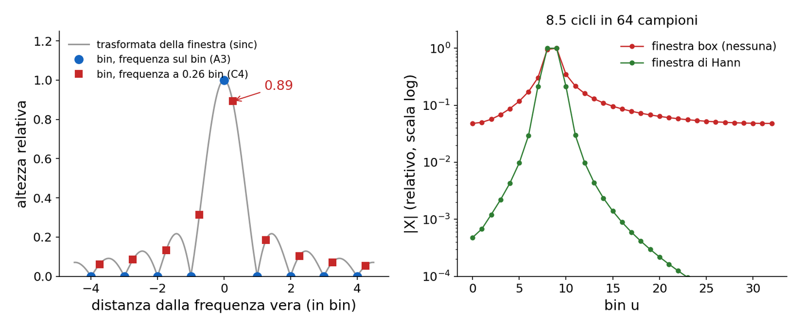

**Rimedio standard: moltiplicare prima per una finestra liscia (Hann)**, che scende dolcemente a zero ai bordi. La sua trasformata ha lobi molto più bassi, al prezzo di un picco un po' più largo. Nelle immagini **lo stesso fenomeno produce la croce lungo gli assi dello spettro** ([L7](https://gabriele-marsili.github.io/appunti-magistrale-ai/anno-2/computer-vision/sito/#L7)): i bordi della foto sono salti.

> **Il punto**
> 
> Una finestra finita è un box, e il box in frequenza è una sinc: ogni riga dello spettro si allarga. Se la frequenza non cade su un bin, il picco si abbassa e l'energia si spalma sui vicini.

### 5\. Filtrare in frequenza è convolvere nel tempo

**Il problema.** Vuoi **togliere da un segnale alcune frequenze e lasciarne altre**: tenere solo la nota più bassa, eliminare il fruscio acuto. Con lo spettro in mano la soluzione sembra ovvia: azzera i bin che non ti servono e torna indietro.

**L'idea.** È quello che fa **`freq_filter(x, sr, mask_fn)`** (scheda 6), in tre passi: `np.fft.rfft(x)`, moltiplicazione per una maschera, antitrasformata.

    def freq_filter(x, sr, mask_fn):
        X = np.fft.rfft(x)                          # 1. vai in frequenza
        f = np.fft.rfftfreq(len(x), d=1/sr)
        return np.fft.irfft(X * mask_fn(f), n=len(x))  # 2. moltiplica, 3. torna

La maschera H(f) vale 1 dove vuoi tenere e 0 dove vuoi togliere: **passa-basso** (f ≤ 240 Hz, resta solo A3), **passa-alto** (f ≥ 300 Hz, restano E4 e il rumore), **passa-banda** (245–280 Hz, resta C4). Il passa-banda **funziona perché le note** distano circa 42 Hz e con Δf = 0.5 Hz la banda contiene 70 bin e una sola nota (schede 6–7). **Nella scheda 8 lo stesso trucco separa accordo e melodia** (D5 e E5, a 587 e 659 Hz) perché occupano bande disgiunte, sotto 400 Hz e sopra 500 Hz.

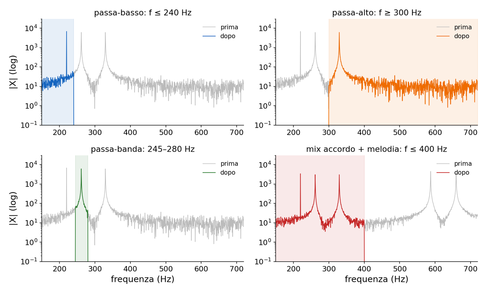

Limite: il rumore dentro la banda tenuta resta tutto, e nella separazione il rumore dell'accordo sopra 500 Hz finisce nella melodia: **un filtro lineare** **non separa ciò che si sovrappone in frequenza**.

**La matematica: il teorema che collega i due mondi.**

`DFT(h ∘N x) = H · X`

Qui ∘N è la convoluzione **circolare** (libro § 15.4.4 e § 16.7.4): gli indici si prendono modulo N, cioè il segnale è **trattato come periodico, la stessa ipotesi del leakage. Letto da destra a sinistra, il teorema dice** **che moltiplicare lo spettro per una maschera** H equivale a convolvere il segnale con il kernel h = IDFT(H). Quindi **ogni maschera ha un kernel nel tempo, e ogni kernel ha una maschera in frequenza**: sono la stessa operazione vista da due lati. Per ottenere via FFT la convoluzione lineare di `np.convolve` si allungano i segnali con zeri fino a N + M − 1 campioni (scheda 6).

#### Il prezzo del taglio netto: il ringing

Che kernel corrisponde a una maschera 0/1? Una sinc: un picco centrale con code che oscillano e decadono lentamente, con lobi **negativi**. Convolvere un fronte ripido con un kernel che ha lobi negativi produce un'uscita che supera il valore finale e poi oscilla: è il **ringing** (fenomeno di Gibbs). Una maschera morbida, per esempio gaussiana, ha come kernel una gaussiana, sempre positiva, e **il ringing sparisce**. Nelle immagini sono gli aloni attorno ai bordi delle foto troppo compresse.

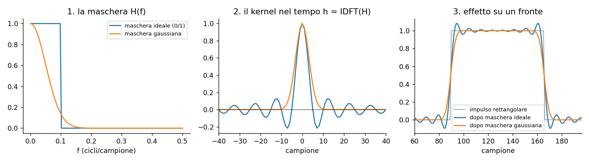

**Esempio.** Sull'accordo il ringing non si sente: non ci sono fronti. Sull'impulso rettangolare della scheda 9 invece l'uscita di `freq_filter` supera il livello finale di circa il 10% (codice nella guida allo studio, "Il ringing").

#### E nel mondo reale: causalità

Il notebook nota che i sistemi audio reali non filtrano così: `freq_filter` ha bisogno dell'intero segnale, incluso il futuro. **Il cap. 19 del libro (§ 19.4) formalizza il punto: un filtro applicabile in tempo reale deve essere** **causale**, h\[t\] = 0 per t \< 0: usa solo presente e passato. Un kernel centrato si rende causale spostandolo in avanti, pagando un ritardo; in alternativa si usano filtri ricorsivi come y\[t\] = x\[t\] + α·y\[t−1\], con risposta all'impulso αt infinita, **stabili solo se |α| \< 1** (scheda 10, riquadro "Dal libro"). Con α = 0.5 un impulso dà 1, 0.5, 0.25, … e si spegne; con α = 1.1 dà 1, 1.1, 1.21, … ed esplode.

> **Il punto**
> 
> rfft, maschera, irfft equivale a convolvere con h = IDFT(maschera). Una maschera a taglio netto ha come kernel una sinc con lobi negativi, quindi produce ringing; una maschera morbida no.

### 6\. La convoluzione 1D, indice per indice

**Il problema.** Fra tutti i modi di trasformare un segnale, perché proprio la convoluzione? E come si calcola a mano senza sbagliare gli indici?

**L'idea.** Il libro (cap. 15, § 15.3–15.4) parte da due richieste ragionevoli su un filtro.

  - **Linearità**: l'uscita è una combinazione lineare degli ingressi, y\[n\] = ∑k h\[n, k\] x\[k\], con un peso per ogni coppia (uscita n, ingresso k): **una matrice qualunque**, come uno strato fully connected.
  - **Invarianza alla traslazione**: se sposti l'ingresso, l'uscita si sposta uguale, perché un suono (o un oggetto in un'immagine) va trattato allo stesso modo ovunque compaia.

**La seconda richiesta obbliga il peso a** **dipendere solo dalla distanza**: h\[n, k\] = h\[n − k\]. Il risultato è la **convoluzione:**

`y[n] = (h ∗ x)[n] = ∑k x[k] · h[n − k]`

**La matematica.** y\[n\] è l'uscita nella posizione n, x\[k\] l'ingresso, h il kernel. L'indice n − k è ciò che "ribalta" il kernel: **mentre k cresce, l'indice del kernel decresce. Il libro scrive la convoluzione con ∘, le slide della L3 e le schede con ∗.**

**Conseguenza immediata: se l'ingresso è un impulso δ (un 1 e poi zeri), l'uscita è h stesso.** Per questo h si chiama **risposta all'impulso** (§ 15.6), e lo vedi nella scheda 24: convolvere un'immagine con due pixel accesi "stampa" due copie del kernel. Esempio del libro: un battito di mani registrato in una stanza è la sua risposta all'impulso, e convolvere un suono con quella registrazione lo fa "suonare" come lì.

**Esempio svolto** (15lif.ipynb, scheda 21): x = \[1, 2, 3, 4\], h = \[−1, −2, −3\]. Ribalta h in \[−3, −2, −1\] e fallo scorrere sopra x, sommando i prodotti dove si sovrappongono:

  - y\[0\] = 1·(−1) = −1 (solo il primo campione si sovrappone)
  - y\[1\] = 1·(−2) + 2·(−1) = −4
  - y\[2\] = 1·(−3) + 2·(−2) + 3·(−1) = −10
  - y\[3\] = 2·(−3) + 3·(−2) + 4·(−1) = −16
  - y\[4\] = 3·(−3) + 4·(−2) = −17, y\[5\] = 4·(−3) = −12

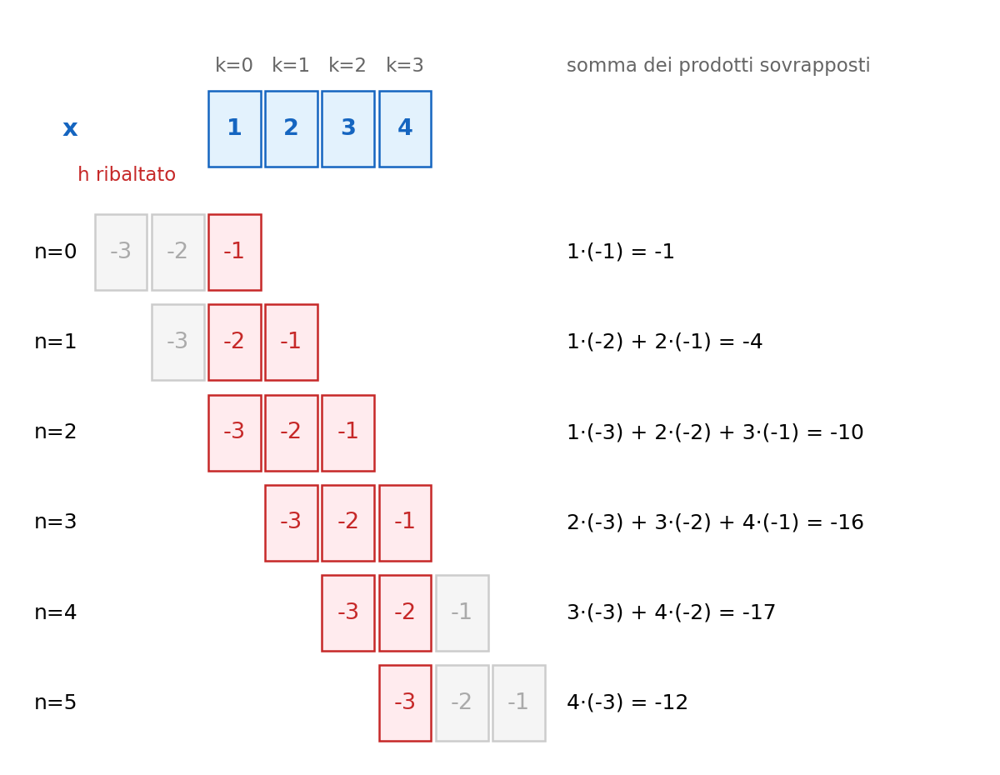

Risultato \[−1, −4, −10, −16, −17, −12\]: 4 + 3 − 1 = 6 valori, identico a `np.convolve`.

#### Le modalità di uscita

Ai bordi il kernel "esce" dal segnale e bisogna decidere cosa fare: è la scelta delle **modalità di uscita**. Con un segnale di lunghezza N e un kernel di lunghezza M (scheda 9, N = 60, M = 7):

  - **full**: ogni posizione con almeno un campione in comune, N + M − 1 = 66 valori (come l'esempio **sopra);**
  - **same**: la parte centrale di full, lunga N = 60, allineata all'ingresso;
  - **valid**: solo dove il kernel sta tutto dentro il segnale, N − M + 1 = 54 valori, **senza bordi inventati**.

**Full e same assumono zeri fuori dal segnale**, che scuriscono i bordi. Il libro (§ 15.4.3) elenca anche circolare, mirror (**la migliore**) e repeat: sono le scelte di `padding` di una CNN.

#### Convoluzione e cross-correlazione

**Se non ribalti il kernel ottieni la** **cross-correlazione** (scheda 22):

`(h ⋆ x)[n] = ∑k h[k] · x[n + k]`

A parole: il prodotto scalare fra h e il tratto di segnale che parte da n. Sullo stesso esempio il notebook dà \[−14, −20, −11, −4\]: per esempio −14 = (−1)·1 + (−2)·2 + (−3)·3. **Le due operazioni coincidono per kernel simmetrici** (box, gaussiana) e **differiscono di segno per quelli antisimmetrici** (derivate). Le "convoluzioni" delle CNN sono cross-correlazioni: con pesi appresi il ribaltamento non conta. A differenza della convoluzione, la cross-correlazione **non è commutativa né associativa** (§ 15.5).

> **Il punto**
> 
> Lineare più invariante alla traslazione vuol dire convoluzione, e il kernel è la risposta all'impulso. La cross-correlazione è la stessa cosa senza ribaltare il kernel; full, same e valid sono solo modi diversi di trattare i bordi.

### 7\. Tre kernel visti dai due lati

**Il problema.** La parte finale di demo.ipynb (schede 10–11) **applica tre kernel all'impulso rumoroso**: un box di 7 campioni, una gaussiana di 15 campioni con σ = 2.5 e la derivata \[−1, 0, 1\]/2. La risposta in frequenza dice cosa fa il kernel su **qualunque** segnale: è il punto più importante del lab.

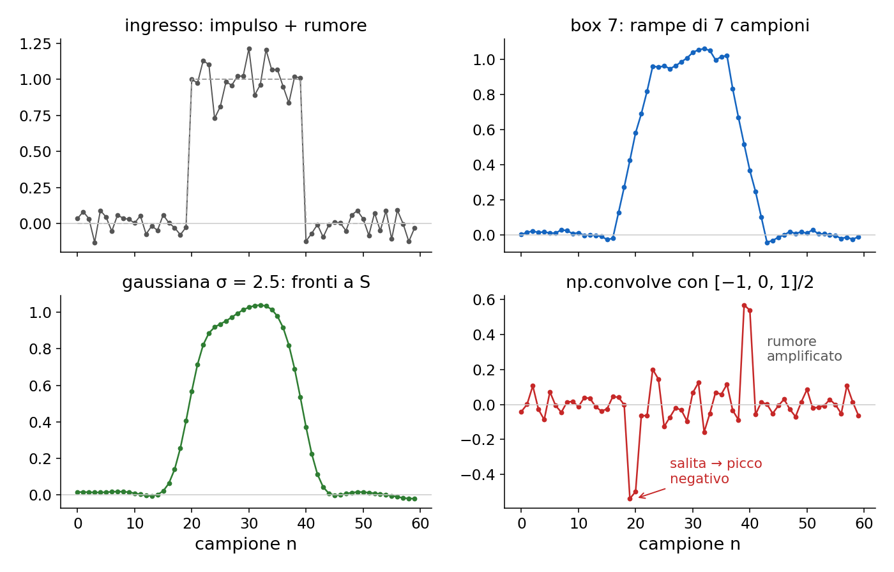

**L'idea.** Un filtro lineare e invariante alla traslazione non può creare frequenze nuove: **una sinusoide lo attraversa restando la stessa sinusoide**, solo moltiplicata per un numero complesso H(f). Il modulo |H(f)| dice quanto quella frequenza viene amplificata o attenuata: è la **risposta in frequenza** (o funzione di trasferimento) del kernel.

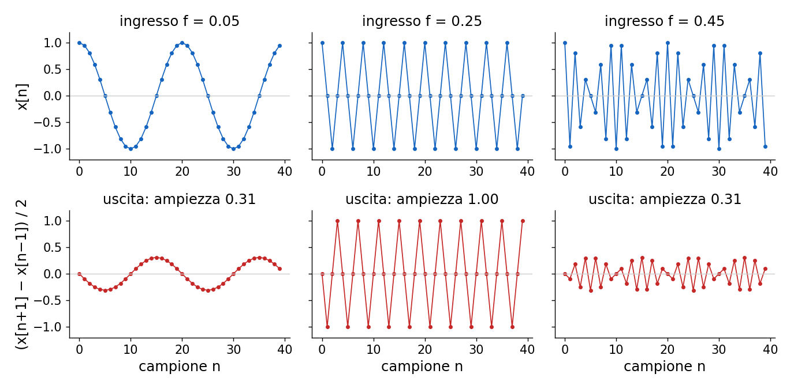

**La matematica: il trucco per calcolare H a mano.** Inserisci x\[n\] = e2πj f n nella formula del filtro e raccogli. Per la derivata centrale y\[n\] = (x\[n+1\] − x\[n−1\]) / 2:

`y[n] = e2πj f n · (e2πj f − e−2πj f) / 2 = e2πj f n · j sin(2πf)  ⇒  |H(f)| = |sin(2πf)|`

con f in cicli per campione, da 0 a 0.5 (Nyquist). Allo stesso modo per il box di 7 campioni a somma 1 ottieni |H(f)| = |sin(7πf) / (7 sin πf)|, la sinc discreta del libro (§ 16.6.3), e per la gaussiana un'altra gaussiana.

**Esempio svolto.** Differenza centrale a f = 0.05: |sin(0.1π)| = 0.31; a f = 0.25: |sin(0.5π)| = 1; a f = 0.45: |sin(0.9π)| = 0.31. Sono le tre ampiezze della figura sopra. Per il box a f = 0: sin(7πf)/(7 sin πf) → 1, la media non cambia; a f = 1/7: sin(π) = 0, quella frequenza viene cancellata.

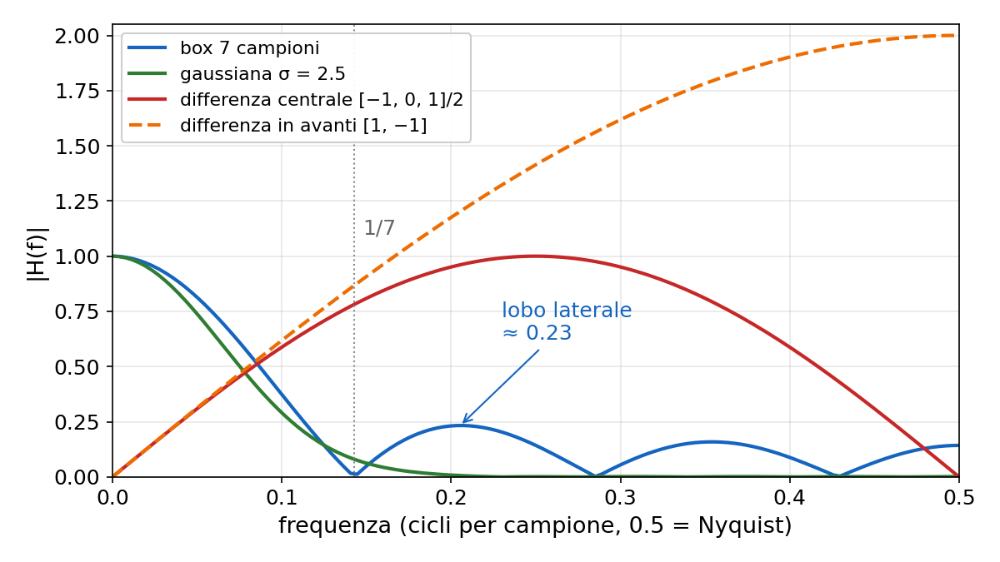

**Cosa dice ciascuna curva.**

  - **Box** (media di 7 **campioni**): |H(0)| = 1, quindi la media del segnale resta uguale. Primo zero a f = 1/7 ≈ 0.14, poi **lobi laterali** fino al 23%, con segno alterno. Passa-basso imperfetto: lascia passare un po' di alte frequenze, alcune con segno invertito.
  - **Gaussiana** (15 campioni, σ = 2.5): |H| è anch'essa una gaussiana, monotona e praticamente nulla **oltre 0.2. È il passa-basso "pulito"**.
  - **Derivata centrale** \[−1, 0, 1\]/2: |H| = |sin(2πf)|, nulla in 0 (un segnale costante ha derivata zero), massima a 0.25 e di nuovo nulla a Nyquist. È un **passa-banda**, non un passa-alto come dice il notebook (scheda 11, riquadro Attenzione): l'alternanza \[1, −1, 1, −1, …\] dà x\[n+1\] − x\[n−1\] = 0. La differenza in avanti \[1, −1\] ha invece |H| = 2|sin πf| e cresce fino a Nyquist. Li ritroverai in [L5](https://gabriele-marsili.github.io/appunti-magistrale-ai/anno-2/computer-vision/sito/#L5).

Due correzioni al notebook. **La prima: il box non produce ringing** nel tempo. **Un kernel tutto positivo e a somma 1 fa una media pesata**, quindi l'uscita resta fra il minimo e il massimo dell'ingresso: sul gradino dà una rampa monotona. Il ringing viene dai kernel con lobi negativi, come la sinc della sezione 5. La seconda è il segno della derivata.

#### Il segno della derivata

Il notebook usa `np.convolve(x, [-1, 0, 1]/2)`. **La convoluzione ribalta il kernel, quindi calcola (x\[n−1\] − x\[n+1\])/2, cioè meno** **la derivata: il fronte di salita dà un picco negativo** (scheda 10, riquadro Attenzione).

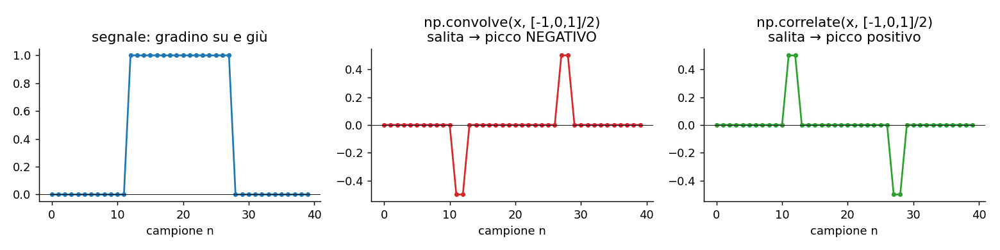

**La derivata amplifica il rumore**, perché |H| è grande alle frequenze medio-alte dove il rumore ha la stessa energia del segnale: per questo in [L5](https://gabriele-marsili.github.io/appunti-magistrale-ai/anno-2/computer-vision/sito/#L5) si deriva dopo aver sfocato.

#### Come leggere i grafici di demo.ipynb

  - **Forma d'onda** (scheda 3): cerca **solo l'inviluppo che** pulsa (battimenti).
  - **Spettro lineare e log** (scheda 5): posizione dei picchi, pavimento di rumore, gonne di C4 ed E4.
  - **Dopo ogni maschera** (scheda 7): la zona tolta crolla a 10−13, lo zero numerico.
  - **Mix e separazione** (scheda 8): cinque picchi nel mix, tre e due nei recuperati, e il rumore che segue **la parte alta.**
  - **Kernel nel tempo e in frequenza** (schede 10–11): larghezza delle rampe, **rumore ridotto, segno** dei picchi della derivata, valore in 0 e lobi di |H|. Lo zero-padding a 256 campioni rende solo la curva liscia.

> **Il punto**
> 
> La risposta in frequenza |H(f)| dice che cosa un kernel fa a ogni frequenza: box e gaussiana sono passa-basso (il box con lobi), la differenza centrale è un passa-banda. np.convolve ribalta il kernel, quindi \[−1, 0, 1\] dà meno la derivata.

### 8\. Lo spettro come descrittore: classificare cifre parlate

**Il problema.** Finora lo spettro serviva a modificare il segnale. classification.ipynb lo usa per **descriverlo**. Il dataset è il Free Spoken Digit Dataset: 3000 registrazioni a 8 kHz di 6 speaker che dicono 50 volte ciascuna le cifre da 0 a 9 (scheda 13). Il compito è riconoscere la cifra.

**L'idea.** Vocali e consonanti diverse occupano zone diverse dello spettro: "six" e "seven" hanno sibilanti sopra i 2000 Hz, "four" e "zero" no. Se lo spettro cambia da cifra a cifra, lo si può usare come vettore di feature.

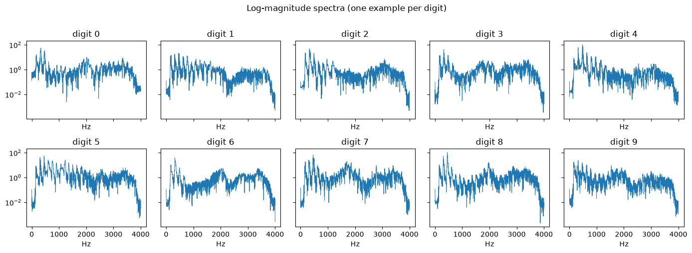

Ogni clip è portata a 8000 campioni (1 s) con zeri in coda: tutte le FFT hanno lo stesso asse, 4001 bin da 0 a 4000 Hz (la Nyquist a 8 kHz, banda telefonica).

#### Tre numeri per clip

Invece di 4001 valori, il notebook estrae tre misure di "brillantezza" (contenuto ad alta frequenza) (scheda 15):

`centroide = ∑k fk |Xk| / ∑k |Xk|`

  - **Centroide**: **il baricentro dello spettro, la media delle frequenze fk pesata con la magnitudine |Xk|**. Esempio: magnitudine 1 a 100 Hz, 1 a 200 Hz, 2 a 1000 Hz dà (100 + 200 + 2000)/4 = 575 Hz.
  - **Rolloff**: la frequenza sotto cui sta l'85% della somma cumulata. Il codice somma |X| e non |X|2, quindi **non è "l'85% dell'energia"** come dice il testo, e sulle clip vere la differenza è grande: con |X|2 il rolloff mediano scende da 2128 a 668 Hz (scheda 15, riquadro Attenzione).
  - **Zero-crossing rate**: la frazione di coppie di campioni consecutivi che cambiano segno. Una sinusoide a frequenza f attraversa lo zero 2f volte al secondo, quindi ZCR ≈ 2f/fs: **stima la frequenza senza FFT**. **Calcolata sulla clip riempita di zeri, però, misura soprattutto la durata** (scheda 15).

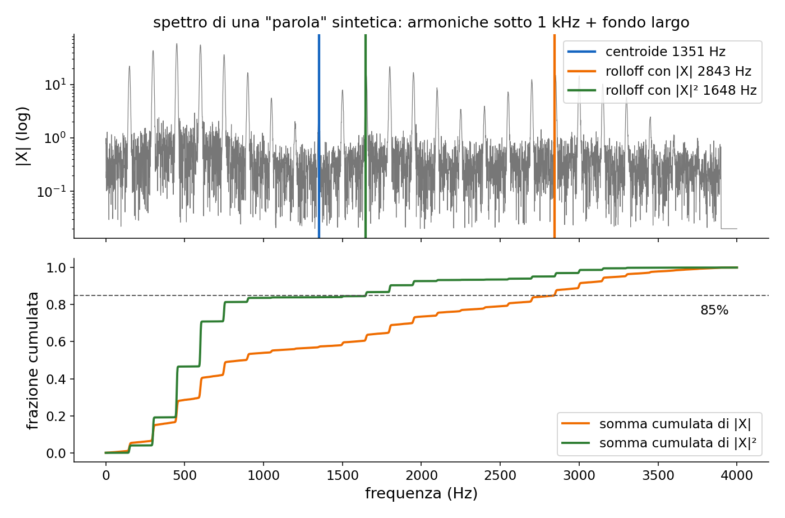

Nello scatter centroide-rolloff (scheda 16) cerca due cose: i punti formano **una sola banda curva**, quindi **le due feature misurano quasi la stessa cosa**; e i colori sono in parte ordinati lungo la banda ma molto sovrapposti. Tre numeri non bastano per dieci classi.

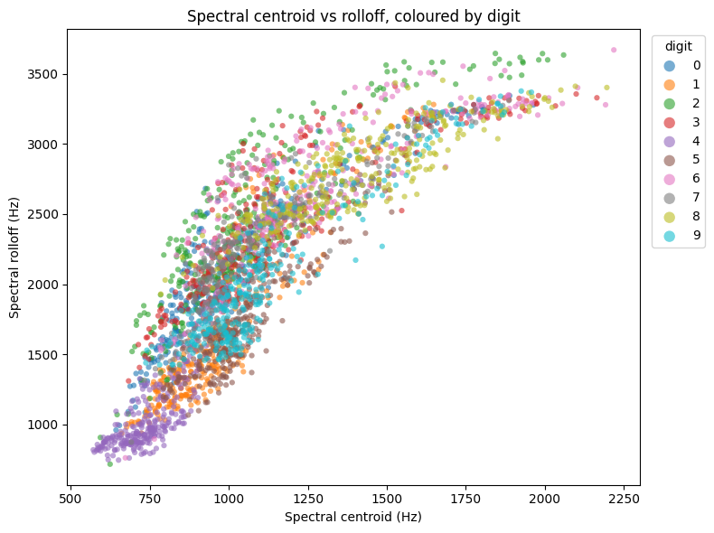

#### k-NN e standardizzazione

**Il k-NN con k = 5 assegna la classe più votata fra i 5 esempi di training più vicini** in distanza euclidea. Prima si **standardizza** ogni feature (media 0, deviazione standard 1): altrimenti il centroide, in migliaia di Hz, dominerebbe la ZCR, in decimi. Due clip che differiscono di 300 Hz nel centroide e di 0.2 nella ZCR distano ≈ 300: decide solo il centroide. Risultato con split casuale 80/20 (scheda 17): 49.8% con 3 feature, **88.0% aggiungendo il log-spettro completo** log(|X| + 1). Il log comprime la dinamica come nei grafici, così le distanze non sono decise solo dai picchi più alti. La matrice di confusione (scheda 18) si legge per righe: riga = cifra vera, colonna = predetta, 60 esempi per riga; gli errori principali sono fra 0, 2, 3 e 6, foneticamente vicini.

#### Il risultato che conta: speaker nuovi

Nello split casuale ogni clip di test ha nel training decine di registrazioni della stessa cifra detta dalla stessa persona. Il vicino più prossimo è quasi sempre "lei che dice la stessa cosa", e lo spettro dell'intera clip contiene anche timbro, altezza della voce, volume, microfono. Con il **leave-one-speaker-out** (6 fold, ciascuno testa su uno speaker mai visto) **l'accuratezza crolla: 28.7% con 3 feature, 32.2% con lo spettro** (scheda 19).

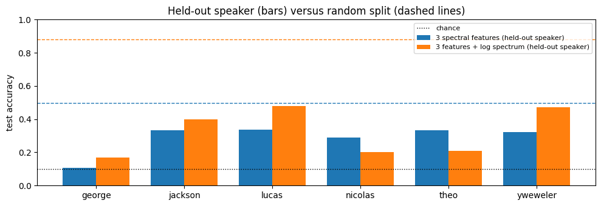

Vale identico per le immagini: **un buon numero su uno split sbagliato misura le scorciatoie** (stessa camera, stesso sfondo). L'esercizio (scheda 20) chiede feature robuste allo speaker (log meno la media, poche bande larghe, pezzi consecutivi del parlato): la soluzione nella guida allo studio arriva al 61%.

> **Il punto**
> 
> Lo spettro è anche una feature: con il k-NN dà l'88% su split casuale. Ma crolla al 32% su speaker nuovi, perché codifica anche la voce: come valuti conta quanto le feature che scegli.

### 9\. Template matching: la correlazione come misura di somiglianza

**Il problema.** Hai un piccolo pattern (un triangolo 3×5 nel notebook, una lettera in una pagina, un logo in una foto) e vuoi trovare dove compare in un'immagine. L'idea più semplice: far scorrere il pattern ovunque e misurare la somiglianza.

**L'idea.** Il prodotto scalare fra due vettori è grande quando puntano nella stessa direzione. La cross-correlazione calcola esattamente il prodotto scalare fra il pattern h e ogni finestra dell'immagine, quindi è **un rivelatore di somiglianza** (scheda 25). La convoluzione invece ribalta il pattern e **cerca il triangolo capovolto**: nella figura della scheda 25 i due triangoli dritti danno 9 nella correlazione, quello capovolto lo dà nella convoluzione.

Ma il prodotto scalare cresce anche con la luminosità della finestra: **una zona bianca uniforme può superare il pattern vero**. Nella scheda 26 il notebook aggiunge un rettangolo bianco: nella correlazione semplice raggiunge 9 come i triangoli, e 26 posizioni sono a pari merito.

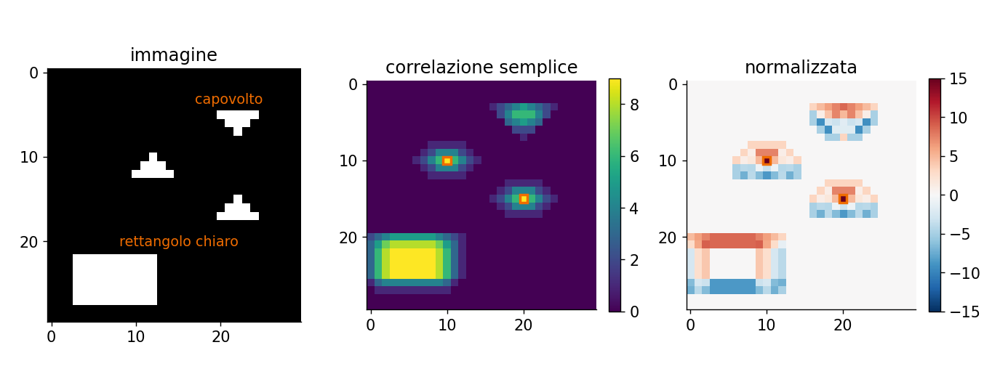

**La matematica.** La **correlazione normalizzata** (libro § 15.5.1, scheda 26) corregge in due passi:

`y[n] = (1/σ[n]) ∑k x[n + k] · ĥ[k]`

  - **ĥ** è il template a media zero (e norma o deviazione standard fissata): **su una zona costante il prodotto scalare vale 0, qualunque sia la sua luminosità**.
  - **σ\[n\]** è la deviazione standard dell'immagine nella finestra che parte da n: **dividendo, il risultato non dipende dal contrasto locale**.

**Esempio svolto in 1D.** Segnale x = \[0, 0, 1, 2, 1, 0, 5, 5, 5\], template h = \[1, 2, 1\]. La correlazione semplice sulle finestre valide dà \[1, 4, 6, 4, 6, 15, 20\]: il massimo, 20, cade sulla finestra \[5, 5, 5\], che non somiglia affatto al template; il pattern vero, \[1, 2, 1\], vale solo 6, a pari merito con \[1, 0, 5\].

Normalizziamo come il notebook. La media di h è 4/3, la sua deviazione standard √(2/9) ≈ 0.471, quindi ĥ = (h − 4/3)/0.471 ≈ \[−0.707, 1.414, −0.707\]. Sulla finestra \[1, 2, 1\]: ĥ·x = −0.707 + 2.828 − 0.707 = 1.414, la σ locale è 0.471, risultato 3.0. Su \[5, 5, 5\]: ĥ·x = 5·(−0.707 + 1.414 − 0.707) = 0, risultato 0. Su \[1, 0, 5\]: −1.96. Ora il massimo è sul pattern vero e vale 3, il numero di campioni del template (il notebook normalizza a deviazione standard 1, non a norma 1): per questo in 2D, con un template 3×5, il massimo è 15. Dividendo per 15 ottieni la NCC in \[−1, 1\].

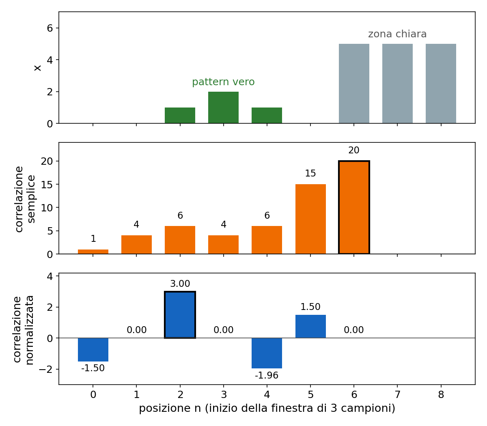

Nelle figure delle schede 24–26 la correlazione del notebook aggancia la finestra all'angolo in alto a sinistra, quindi i picchi cadono lì e non al centro del pattern. E anche nella versione normalizzata **il bordo del rettangolo arriva a 9. La normalizzazione aiuta, non risolve tutto.**

Il metodo è **invariante alla traslazione** ma **non a scala, rotazione o cambio di forma**: lo stesso libro lo definisce fragile. Le piramidi ([L6](https://gabriele-marsili.github.io/appunti-magistrale-ai/anno-2/computer-vision/sito/#L6)) affrontano la scala, i descrittori ([L8](https://gabriele-marsili.github.io/appunti-magistrale-ai/anno-2/computer-vision/sito/#L8)) il resto.

> **Il punto**
> 
> Template matching = cross-correlazione, cioè un prodotto scalare in ogni posizione. Va normalizzato (template a media zero, divisione per la σ locale) per non premiare le zone chiare, e resta fragile a scala e rotazione.

### Il riassunto in 10 righe

1.  La DFT riscrive N campioni come N sinusoidi; il bin u fa u cicli nella finestra, cioè f = u·fs/N.
2.  Risoluzione Δf = fs/N = 1/durata; frequenza massima fs/2; rfft restituisce N/2 + 1 bin per simmetria hermitiana.
3.  numpy non normalizza la FFT diretta: una sinusoide di ampiezza A dà un picco A·N/2; lo spettro si guarda in scala log.
4.  Le frequenze che non cadono su un bin si spalmano sui vicini (leakage): finestra finita = box, la cui trasformata è una sinc. Rimedio: finestra di Hann.
5.  Filtrare in frequenza (rfft, maschera, irfft) equivale a una convoluzione circolare con h = IDFT(H).
6.  Una maschera a taglio netto ha come kernel una sinc con lobi negativi: ringing sui fronti. Una maschera gaussiana no.
7.  La convoluzione è l'unico operatore lineare e invariante alla traslazione; il kernel è la risposta all'impulso. Modalità full, same, valid.
8.  Box: passa-basso con lobi; gaussiana: passa-basso pulito; differenza centrale: passa-banda |sin 2πf|; np.convolve ribalta, quindi \[−1, 0, 1\] dà meno la derivata.
9.  Lo spettro descrive un suono; con il k-NN funziona su split casuale (88%) ma crolla su speaker nuovi (32%): la valutazione conta quanto le feature.
10. Template matching = cross-correlazione; va normalizzato (template a media zero, divisione per la σ locale) e non gestisce scala né rotazione.

### Verifica di aver capito

**Un segnale di 0.5 s campionato a 16 kHz: quanti valori restituisce rfft, qual è la risoluzione e la frequenza massima? Riesci a separare due note a 440 e 441 Hz?**

N = 8000, quindi 4001 valori; Δf = 16000/8000 = 2 Hz; fmax = 8000 Hz. No: le note distano mezzo bin. Si fondono in un unico picco allargato (figura della sezione 3). Serve un segnale più lungo (con 4 s, Δf = 0.25 Hz e le note distano 4 bin), non una fs più alta.

**Perché nel notebook il picco di A3 è più alto di quello di C4, anche se le sinusoidi hanno la stessa ampiezza?**

220 Hz cade esattamente sul bin 440; 261.63 Hz cade a 523.26, fra due bin. La finestra finita trasforma ogni riga in una sinc: fuori dal bin il picco si abbassa (di 0.89) e l'energia va nei vicini (leakage).

**Applichi a un segnale una maschera passa-basso 0/1 in frequenza e vedi oscillazioni vicino ai fronti. Da dove vengono e come le elimini?**

Per il teorema di convoluzione la maschera equivale a convolvere con la sua IDFT, una sinc con lobi negativi: è il ringing (Gibbs). Si elimina con una maschera che scende gradualmente, per esempio gaussiana, il cui kernel è positivo.

**Calcola |H(f)| della differenza centrale e dì se è un passa-alto.**

Inserendo e2πjfn in y\[n\] = (x\[n+1\] − x\[n−1\])/2 ottieni H(f) = j sin(2πf), quindi |H| = |sin 2πf|: zero in 0 e in 0.5, massimo in 0.25. È un passa-banda. La differenza in avanti \[1, −1\] ha 2|sin πf| ed è un passa-alto.

**Calcola a mano la convoluzione full di \[1, 1, 2\] con \[1, −1\] e la cross-correlazione valid degli stessi.**

Convoluzione: \[1, 1−1, 2−1, −2\] = \[1, 0, 1, −2\] (4 = 3 + 2 − 1 valori). Cross-correlazione valid, h ⋆ x\[n\] = h\[0\]x\[n\] + h\[1\]x\[n+1\]: \[1 − 1, 1 − 2\] = \[0, −1\]. Sono una il ribaltamento dell'altra: la convoluzione valid sarebbe \[0, 1\].

**Perché il k-NN sullo spettro passa dall'88% al 32% quando lo speaker di test non è nel training, e perché la correlazione semplice è un cattivo template matcher? Cosa hanno in comune?**

Nel primo caso lo spettro codifica anche la voce, e lo split casuale premia chi la riconosce; nel secondo il prodotto scalare premia la luminosità della finestra. In entrambi la misura di somiglianza risponde a qualcosa che non è ciò che cerchi, e la cura è rendersi invarianti a ciò che non conta (sottrarre la media del log-spettro; template a media zero e divisione per la σ locale).

### Come proseguire

  - [Cap. 15 Linear Image Filtering](https://visionbook.mit.edu/linear_image_filtering.html): § 15.3–15.4 (dalla linearità alla convoluzione, proprietà, bordi, convoluzione circolare), § 15.5–15.5.1 (correlazione e template matching normalizzato), § 15.6 (risposta all'impulso, l'esempio acustico della stanza).
  - [Cap. 16 Fourier Analysis](https://visionbook.mit.edu/image_processing_fourier.html): § 16.5 (DFT), § 16.6.3 (box e sinc), § 16.7.4–16.7.5 (teorema di convoluzione e dual convolution), § 16.10 (funzione di trasferimento e tipi di filtro).
  - [Cap. 19 Temporal Filters](https://visionbook.mit.edu/temporal_filters_v2.html): § 19.4, solo causalità, filtri ricorsivi e derivata temporale.

La sezione "Studia dal libro" in fondo alla pagina dice cosa saltare e spiega le derivazioni centrali. Ora apri i notebook e ripassa con le schede qui sotto, una per blocco di celle: i riquadri Attenzione segnalano i punti in cui il notebook sbaglia.
