# L5 · Filtri e gradienti

*Lezione 5 · Antonio Carta · 23 settembre 2026*

[Versione interattiva sul sito, con videolezione](https://gabriele-marsili.github.io/appunti-magistrale-ai/anno-2/computer-vision/sito/#L5) · [Indice della dispensa](README.md)

**In una frase:** con la convoluzione si costruiscono due famiglie di filtri che stanno alla base di quasi tutta la visione "classica": quelli che **sfocano** (box, gaussiano, binomiale: passa-basso) e quelli che **derivano** (differenze finite, derivate di gaussiana, Sobel, laplaciano). **Ognuno si capisce guardando insieme il suo kernel e la sua risposta in frequenza.**

### Prima di iniziare

Ti servono quattro idee delle lezioni precedenti.

  - **Convoluzione discreta** ([L3](https://gabriele-marsili.github.io/appunti-magistrale-ai/anno-2/computer-vision/sito/#L3)): (h ∗ ℓ)\[n\] = ∑k h\[k\] ℓ\[n − k\]. Il kernel h si ribalta e scorre sul segnale ℓ. Un filtro lineare e invariante per traslazione (**LSI**) è sempre una convoluzione, e il suo kernel è la sua **risposta all'impulso**.
  - **Teorema di convoluzione** ([L3](https://gabriele-marsili.github.io/appunti-magistrale-ai/anno-2/computer-vision/sito/#L3), [L4](https://gabriele-marsili.github.io/appunti-magistrale-ai/anno-2/computer-vision/sito/#L4)): convolvere nello spazio equivale a moltiplicare in frequenza, H(ω)·L(ω). La trasformata del kernel, la **risposta in frequenza** H(ω), dice quanto il filtro amplifica o attenua ciascuna sinusoide.
  - **Frequenze discrete**: per un segnale campionato ω va da −π a π. ω = 0 è la componente costante (DC); ω = π è l'oscillazione più rapida possibile, \[1, −1, 1, −1, …\].
  - **Le varianze di variabili indipendenti si sommano**: Var(X − Y) = Var(X) + Var(Y). Ci servirà per capire il rumore.

### Guarda prima questi video

  - [Linear Image Filters](https://www.youtube.com/watch?v=-LD9MxBUFQo) (Video). Shree Nayar (First Principles of Computer Vision). La parte iniziale ripassa la convoluzione di L3; concentrati su box e gaussiana, sulla separabilità e sul perché la gaussiana sfoca "meglio".
  - [How Blurs & Filters Work](https://www.youtube.com/watch?v=C_zFhWdM4ic) (Video). Computerphile (Mike Pound). Tutto: è l'intuizione pratica del kernel che scorre sull'immagine, con media e gaussiana viste pixel per pixel.
  - [Edge Detection Using Gradients](https://www.youtube.com/watch?v=lOEBsQodtEQ) (Video). Shree Nayar. Tutto: gradiente, modulo e direzione, operatori discreti (Roberts, Sobel) e perché si sfoca prima di derivare.
  - [Edge Detection Using Laplacian](https://www.youtube.com/watch?v=uNP6ZwQ3r6A) (Video). Shree Nayar. Tutto: laplaciano, zero-crossing, LoG. Corrisponde alle slide 51–57.

### 1\. Il problema: due operazioni elementari

**Il problema.** Una foto fatta col telefono di sera è piena di grana; un'auto a guida autonoma deve trovare il bordo della corsia in pochi millisecondi. Le immagini contengono cose che non vuoi (rumore, artefatti, dettagli troppo fini), e **l'informazione che vuoi sta soprattutto dove l'intensità cambia**: i bordi degli oggetti, le linee, gli angoli.

**L'idea.** La lezione costruisce due strumenti, uno per ciascuna esigenza.

  - **Sfocare** (blur): **sostituire ogni pixel con una media pesata dei vicini. Toglie il rumore, cancella i dettagli sotto una certa scala, prepara l'immagine a essere rimpicciolita** ([L6](https://gabriele-marsili.github.io/appunti-magistrale-ai/anno-2/computer-vision/sito/#L6)).
  - **Derivare**: **misurare quanto e in che direzione l'intensità cambia. Fa emergere i bordi** (slide 26) **ed è la materia prima di detector e descrittori** (Harris, SIFT, HOG, nelle lezioni successive).

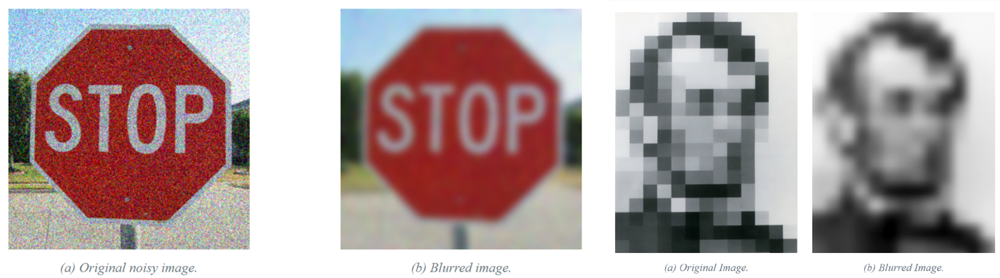

Nel ritratto i bordi fra i blocchi li ha inventati il campionamento: sfocando resta la struttura vera, a bassa frequenza. Nel cartello si vede il prezzo del blur: **il rumore sta alle alte frequenze, ma lì stanno anche i dettagli**, e un filtro lineare li toglie insieme.

**La matematica.** Sfocare e derivare sono operazioni **lineari e invarianti per traslazione, quindi sono convoluzioni**. **La regola che ti accompagnerà per tutta la lezione (slide 2): di ogni filtro guarda il kernel e la risposta in frequenza.** **Il kernel dice cosa fa localmente; la risposta in frequenza spiega i difetti** (aloni, rumore che passa, spostamenti di mezzo pixel).

Un numero ricorre in tutta la lezione. Il **guadagno DC** è il valore della risposta in frequenza a ω = 0, cioè la somma dei coefficienti del kernel: **è l'uscita che ottieni su un'immagine costante uguale a 1.**

`H(0) = ∑n h[n]`

**Esempio.** \[1, 2, 1\] ha guadagno DC 4: un muro grigio di intensità 10 esce a 40. Un blur deve avere guadagno 1, quindi si usa \[1, 2, 1\]/4; una derivata deve avere guadagno 0, come \[1, −1\], perché su una zona uniforme non cambia nulla.

> **Il punto**
> 
> Blur e derivate sono convoluzioni. Ogni filtro si giudica da due grafici: il kernel (cosa fa vicino al pixel) e la risposta in frequenza (quali sinusoidi lascia passare). Il guadagno DC è la somma del kernel: 1 per un blur, 0 per una derivata.

### 2\. Sfocare 1: il box filter

**Il problema.** Vuoi togliere la grana. Il rumore va su e giù a caso: mediando i vicini si cancella.

**L'idea.** Ogni pixel diventa **la media dei pixel in un rettangolo attorno** a lui (slide 7).

![Il box \[1, 1, 1\]/3 scorre sul gradino: la fascia arancione è la finestra, ogni punto blu è la media dei tre valori dentro. Il salto diventa una rampa.](../sito-src/L5/disp2_box_passi.png)

**La matematica.** In 2D il kernel è:

`boxN,M[n, m] = 1 se |n| ≤ N e |m| ≤ M, altrimenti 0`

n e m sono gli spostamenti dal pixel centrale (riga e colonna); N e M sono le semiampiezze, quindi il rettangolo è (2N+1) × (2M+1). **Così com'è, il kernel somma i pixel: il guadagno DC è (2N+1)(2M+1) e l'immagine diventa più luminosa.** Per fare la media si divide per il numero di tap e il guadagno DC diventa 1.

> **Attenzione · slide 7**
> 
> La slide dice "il guadagno DC è la media". È la **somma** dei coefficienti; è il box **normalizzato** a restituire la media dei pixel della finestra.

**Il box è separabile: box 2D = box 1D sulle righe seguito da box 1D sulle colonne**. Invece di (2N+1)² operazioni per pixel ne bastano 2(2N+1).

**Esempio svolto** (la figura sopra). Gradino ℓ = \[0, 0, 0, 4, 4, 4\], box \[1, 1, 1\]/3: al pixel 2 la finestra contiene (0, 0, 4), media 1.33; al pixel 3 (0, 4, 4), media 2.67. Il gradino diventa la rampa \[0, 1.33, 2.67, 4\].

**In frequenza.** Sommando la **serie geometrica** ∑n=−k..k e−jωn si trova la risposta di un box 1D di 2k+1 tap (slide 8):

`H(ω) = sin((2k+1)ω/2) / sin(ω/2)`

A parole: vale 2k+1 in ω = 0 (il guadagno DC), scende, si annulla in ω = 2π/(2k+1) e poi **risale: ha dei lobi laterali**. È la versione discreta della sinc. Nella figura (curva blu, box a 5 tap normalizzato) si annulla in 0.4π e 0.8π, ma in mezzo, a 0.6π, il guadagno torna a 1/(5·sin(0.3π)) ≈ 0.25.

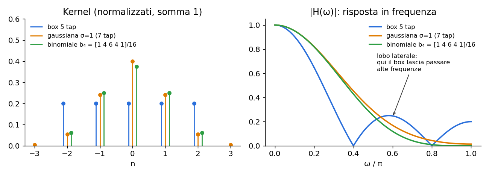

**Cosa va storto: l'esempio del libro** (slide 10). Passa due segnali nel **box \[1, 1, 1\]. L'oscillazione più rapida \[1, −1, 1, −1, …\] esce come \[1, −1, 1, …\]: non viene attenuata rispetto al DC quanto vorresti (1 contro 3).** L'onda più lenta di periodo 3, \[0.5, 0.5, −1, …\], **esce tutta zero**. Un passa-basso che cancella una frequenza bassa e lascia passare la più alta non è un buon passa-basso.

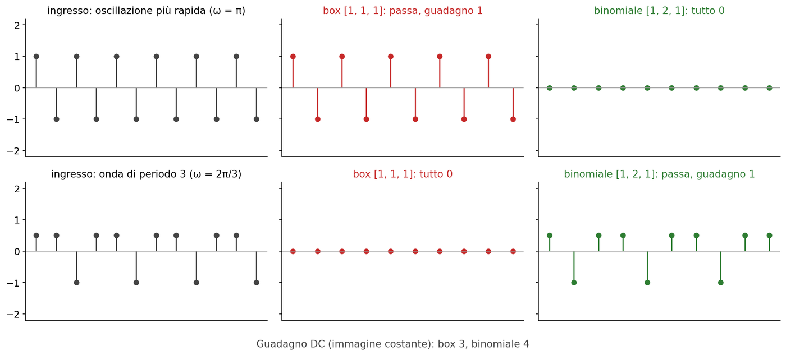

Nelle immagini si vede come trame residue e aloni (slide 23, sezione 4). **Altri due difetti: non si compone (\[1, 1, 1\] ∗ \[1, 1, 1\] = \[1, 2, 3, 2, 1\], un triangolo**: sfocare due volte non dà un box più largo, mentre le piramidi di [L6](https://gabriele-marsili.github.io/appunti-magistrale-ai/anno-2/computer-vision/sito/#L6) vorrebbero blur che si compongono); e **un box con numero pari di tap, come \[1, 1\], non ha centro e sposta l'uscita di mezzo pixel** (slide 9). Per questo si usano kernel dispari.

> **Il punto**
> 
> Il box è il blur più economico e separabile, ma la sua risposta in frequenza ha lobi laterali: lascia passare alte frequenze, ne cancella di basse e non si compone in un box più grande.

### 3\. Sfocare 2: il filtro gaussiano

**Il problema.** I lobi del box nascono dai bordi netti del kernel, che passa di colpo da 1 a 0. Serve un kernel che si spenga dolcemente.

**L'idea.** **Pesa di più i vicini prossimi e sempre meno quelli lontani**, con una campana. Senza bordi netti nel kernel, niente oscillazioni nella trasformata.

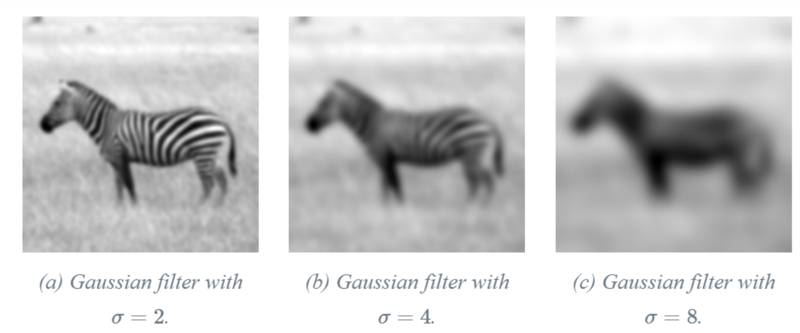

**La matematica.**

`g(x; σ) = 1/√(2πσ²) · exp(−x² / 2σ²)      g(x, y; σ) = 1/(2πσ²) · exp(−(x² + y²) / 2σ²)`

x, y sono le coordinate rispetto al centro del kernel; σ è la deviazione standard e **fa da manopola della scala**: più è grande, più largo è il kernel e più forte il blur. Le costanti davanti fanno sì che l'integrale valga 1 (guadagno DC 1).

> **Attenzione · slide 11–12**
> 
> Le slide scrivono per la 2D lo stesso fattore della 1D. La 2D è il prodotto di due gaussiane 1D, quindi il fattore è **1/(2πσ²), non 1/√(2πσ²) come nelle slide 11–12**.

**Discretizzazione** (slide 12). **Si campiona la gaussiana sugli interi fino a circa ±3σ** (oltre, i valori sono sotto l'1% del picco), senza la costante, e poi si divide per la somma dei campioni.

**Esempio svolto**, σ = 1, kernel a 7 tap (n da −3 a 3). exp(−n²/2) dà \[0.011, 0.135, 0.607, 1, 0.607, 0.135, 0.011\]; la somma è 2.506 (quasi √(2π) ≈ 2.507, come ti aspetti); dividendo si ottiene circa \[0.004, 0.054, 0.242, 0.399, 0.242, 0.054, 0.004\].

**Separabilità** (slide 14). Siccome exp(a + b) = exp(a)·exp(b), **la gaussiana 2D è il prodotto di una gaussiana in x e una in y, e la convoluzione 2D si spezza in due convoluzioni 1D**: prima lungo le colonne, poi lungo le righe. **Con un kernel K × K il costo per pixel scende da K² a 2K** moltiplicazioni: per σ = 2 (K = 13) da 169 a 26.

**Le proprietà che la rendono speciale** (slide 15–16):

  - **È l'unico filtro che è insieme separabile e a simmetria circolare** (sfoca allo stesso modo in tutte le direzioni).
  - La sua trasformata è ancora una gaussiana: `G(ω; σ) = exp(−ω²σ² / 2)` **Monotona, senza lobi: niente aloni.** **Nota l'inversione: σ grande nello spazio vuol dire campana stretta in frequenza** (larghezza 1/σ), cioè si salvano solo le frequenze più basse.
  - **Le varianze si sommano**: gσ1 ∗ gσ2 = gσ3 con σ3² = σ1² + σ2². Dimostrazione in una riga col teorema di convoluzione: exp(−ω²σ1²/2)·exp(−ω²σ2²/2) = exp(−ω²(σ1² + σ2²)/2). Esempio: σ = 3 seguito da σ = 4 equivale a σ = 5; due blur con σ = 1 danno σ = √2, non 2.
  - Due collegamenti (slide 16): è la soluzione dell'**equazione del calore** ∂u/∂t = ∇²u partendo da un impulso, al tempo t = σ²/2; e per il **teorema del limite centrale** un kernel positivo convoluto molte volte con se stesso tende a una gaussiana.

**Cosa va storto** (slide 17). **Tutte queste proprietà valgono per la gaussiana continua. Troncata e campionata, la somma delle varianze vale solo circa**, l'oscillazione \[1, −1, 1, …\] non viene cancellata del tutto, e con convoluzioni ripetute gli errori si accumulano. Esempio del libro: g5 = \[0.018, 0.368, 1, 0.368, 0.018\] (σ² = 1/2) convolta con se stessa dà \[0.135, 0.589, 1, 0.589, 0.135\], mentre la gaussiana con σ² = 1 è \[0.135, 0.607, 1, 0.607, 0.135\]. Vicino, non uguale.

> **Il punto**
> 
> La gaussiana è il blur ideale nel continuo: separabile, circolare, trasformata gaussiana senza lobi, varianze che si sommano, σ come manopola della scala. Campionata e troncata perde queste proprietà in modo approssimato.

### 4\. Sfocare 3: il filtro binomiale

**Il problema.** Vogliamo le proprietà della gaussiana, ma esatte sulla griglia di pixel.

**L'idea** (slide 18): invece di campionare la gaussiana, **costruisci un blur partendo dal kernel più semplice che esista, \[1, 1\], e convolvilo con se stesso. Ottieni le righe del triangolo di Tartaglia**, che per il limite centrale assomigliano sempre di più a una gaussiana.

`b1 = [1, 1]   b2 = [1, 2, 1]   b3 = [1, 3, 3, 1]   b4 = [1, 4, 6, 4, 1]`

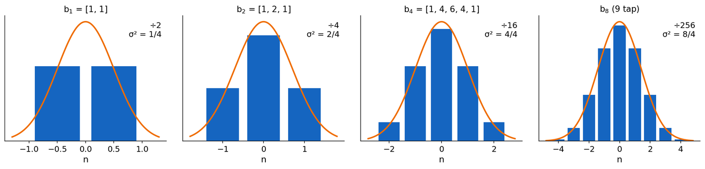

**La matematica.** bn ha n+1 tap, con coefficienti C(n, k). Le **proprietà** (slide 19):

  - **Guadagno DC = 2n** (somma di una riga del triangolo): si normalizza dividendo per 2n.
  - **Varianza σ² = n/4**: \[1, 1\]/2 ha due tap a distanza 1, quindi varianza 1/4; bn è la convoluzione di n copie e le varianze si sommano. Così b4/16 ha σ = 1: nella figura dei tre blur (sezione 2) è quasi sovrapposto alla **gaussiana σ = 1**.
  - **Composizione esatta**: bn ∗ bm = bn+m, con coefficienti interi. Nessun errore di troncamento, a differenza della gaussiana campionata.
  - **Risposta in frequenza**: \[1, 1\]/2 ha modulo |cos(ω/2)|, quindi `|Bn(ω)| = cosn(ω/2)` (normalizzato). **Monotona, nessun lobo, e vale zero in ω = π.**

**Esempio svolto.** Scacchiera 1D \[1, −1, 1, −1\] convoluta con \[1, 2, 1\]: ogni uscita è 1 − 2 + 1 = 0. Con il box \[1, 1, 1\] era 1 − 1 + 1 = 1. (riga in alto della figura sul box): il binomiale cancella esattamente l'oscillazione più rapida, il box no. Su una foto vera:

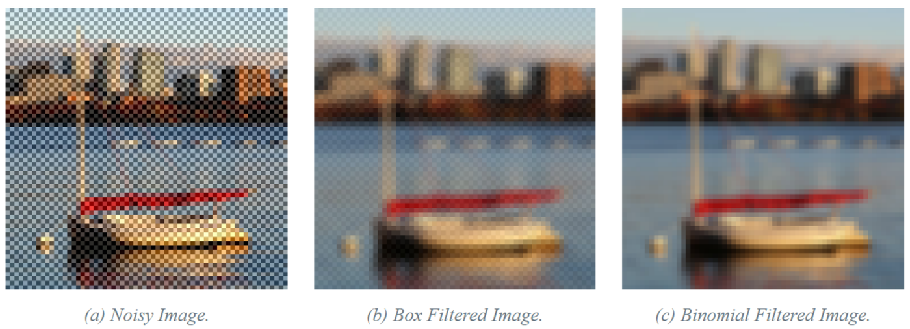

In 2D si usa il prodotto esterno (slide 20): b2 ⊗ b2 = \[\[1, 2, 1\], \[2, 4, 2\], \[1, 2, 1\]\]/16. Il libro lo raccomanda come il kernel da avere sempre in tasca: per togliere rumore, prima di sottocampionare di un fattore 2, nelle piramidi di [L6](https://gabriele-marsili.github.io/appunti-magistrale-ai/anno-2/computer-vision/sito/#L6), perfino nel pooling di alcune reti.

**Confronto finale** (slide 21–24): box veloce ma con artefatti; gaussiana ideale nel continuo ma "rotta" nel discreto; **binomiale veloce e fedele alla gaussiana anche nel discreto**.

> **Attenzione · slide 21–22**
> 
> "n = 16" conta le applicazioni di \[1, 2, 1\]/4, non l'indice di bn: sedici applicazioni danno b32, con σ² = 8 (σ ≈ 2.83), più largo della gaussiana σ = 2 del confronto. Per questo il binomiale sembra più sfocato. L'equivalente della gaussiana σ = 2 è b16.

> **Il punto**
> 
> Il binomiale bn = \[1, 1\] convoluto n volte ha coefficienti interi, σ² = n/4, composizione esatta e risposta cosn(ω/2), nulla in ω = π. Nella pratica \[1, 2, 1\]/4 (e la sua versione 3 × 3) è il blur da usare.

### 5\. Derivare: le differenze finite

**Il problema** (slide 26–27). Per trovare i bordi vogliamo la derivata dell'intensità. **La derivata è il limite di (f(x+h) − f(x))/h** **per h → 0, ma su un'immagine h non può scendere sotto un pixel.** Il minimo è h = 1 pixel.

**L'idea.** Si prende la differenza fra pixel vicini: fra un pixel e il precedente, oppure fra il successivo e il precedente.

`d0 = [1, −1]   →  (ℓ ∗ d0)[n] = ℓ[n] − ℓ[n−1]` `d1 = ½ [1, 0, −1]   →  (ℓ ∗ d1)[n] = (ℓ[n+1] − ℓ[n−1]) / 2`

Il segno "al contrario" (\[1, −1\] invece di \[−1, 1\]) viene dal ribaltamento del kernel nella convoluzione. **d0 ha due tap, quindi nessun centro: il suo valore appartiene al punto n − ½. d1 è centrata, ma salta il pixel di mezzo.**

**Esempio svolto.** Rampa ℓ = \[0, 1, 2, 3, 3, 3\]. Con d0: \[1, 1, 1, 0, 0\]; la pendenza 1 è giusta, ma ogni valore sta fra due pixel. Con d1 (pixel 1–4): \[1, 1, 0.5, 0\]; al pixel 3, dove la rampa si ferma, d1 fa la media fra la pendenza a sinistra (1) e quella a destra (0). Sui bordi netti d1 dà picchi più bassi e più larghi (slide 28).

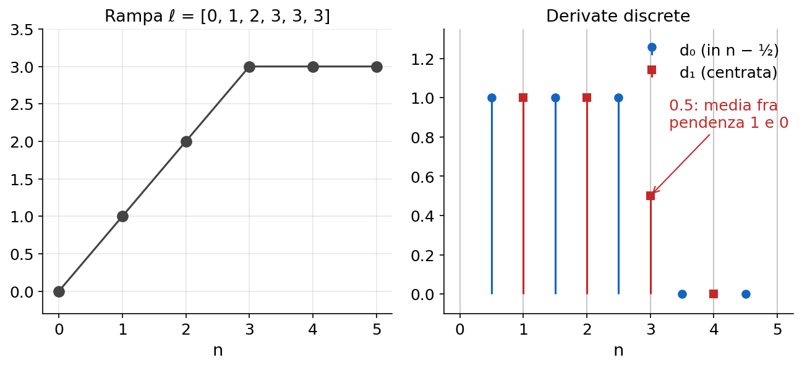

**In frequenza** (slide 29). **La derivata ideale moltiplica per jω**: guadagno |ω|, che cresce con la frequenza. Le due approssimazioni:

  - D0(ω) = 1 − e−jω = 2j sin(ω/2)·e−jω/2. Modulo 2|sin(ω/2)|, buono fino a frequenze abbastanza alte; il fattore e−jω/2 è una fase lineare, cioè proprio il ritardo di mezzo campione.
  - D1(ω) = (ejω − e−jω)/2 = j sin ω. Nessuno sfasamento, ma il modulo |sin ω| torna a zero in ω = π: **d1 è cieca all'oscillazione più rapida**.

**Entrambe sono buone solo alle basse frequenze, dove sin ω ≈ ω.** (figura nella sezione 7).

**In 2D** (slide 30). **Si deriva lungo x e lungo y separatamente**. Con d0 le due derivate sono spostate di mezzo pixel in direzioni diverse, quindi non si possono combinare pixel per pixel. Rimedi: d1, Sobel (sezione 8), o Roberts (due differenze diagonali 2 × 2 centrate nello stesso punto).

> **Attenzione · slide 30**
> 
> Qui d0x è un vettore colonna, quindi deriva in verticale; nella slide 46 Sx deriva lungo le righe. Con la convenzione usuale (x orizzontale) la derivata in x è il kernel riga. All'esame dichiara la convenzione che usi.

> **Il punto**
> 
> d0 = \[1, −1\] è la differenza più semplice ma è spostata di mezzo pixel; d1 = ½\[1, 0, −1\] è centrata ma cieca in ω = π. Tutte e due approssimano bene la derivata solo alle basse frequenze.

### 6\. Si può tornare indietro? I gradienti come rappresentazione

**Il problema.** **Le derivate buttano via informazione?** Dalle sole differenze si ricostruisce l'immagine?

**L'idea.** La risposta (slide 33–36) è: **quasi niente**, **solo la media**. Derivare è come dare le indicazioni "sali di 1, resta, scendi di 2": puoi ripercorrere il sentiero, ma non sai a che quota sei partito.

**La matematica.** In 1D scrivi la convoluzione con d0 come un prodotto matrice-vettore, r = D0 ℓ.

  - **Con zero padding D0 è quadrata (1 sulla diagonale, −1 sotto) e invertibile**: la sua inversa è la somma cumulativa, l'analogo discreto dell'integrale. Il primo valore r\[0\] = ℓ\[0\] fa da costante di integrazione.
  - **Con convoluzione valid** (solo le uscite che non escono dal **segnale) da 5 pixel ottieni 4 differenze**. La matrice è 4 × 5, non invertibile: **tutti i segnali costanti hanno derivata zero**. Si usa la **pseudo-inversa** D0+, che fra tutti i segnali con quelle differenze sceglie quello di norma minima, cioè a media zero.

**Esempio svolto** (slide 36). ℓ = \[1, 1, 2, 2, 0\], con righe di D0 della forma (−1, 1): r\[i\] = ℓ\[i+1\] − ℓ\[i\] = \[0, 1, 0, −2\]. La ricostruzione D0+ r = \[−0.2, −0.2, 0.8, 0.8, −1.2\] è ℓ meno la sua media 1.2: la forma è identica, la quota no.

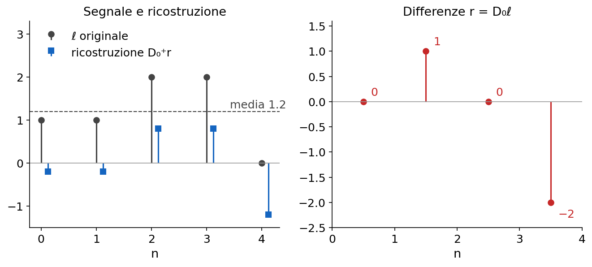

> **Attenzione · slide 36**
> 
> La slide (e il libro) scrivono r = \[0, −1, 0, 2\], con il segno sbagliato: con quella D0 viene \[0, 1, 0, −2\]. Il risultato finale della slide invece è corretto.

**A cosa serve: editing nel dominio del gradiente** (slide 37). **Si codifica l'immagine con le sue derivate in x e y, si azzerano le derivate nella zona della scritta "STOP", si ricostruisce con** la pseudo-inversa (calcolata in modo efficiente con la FFT).

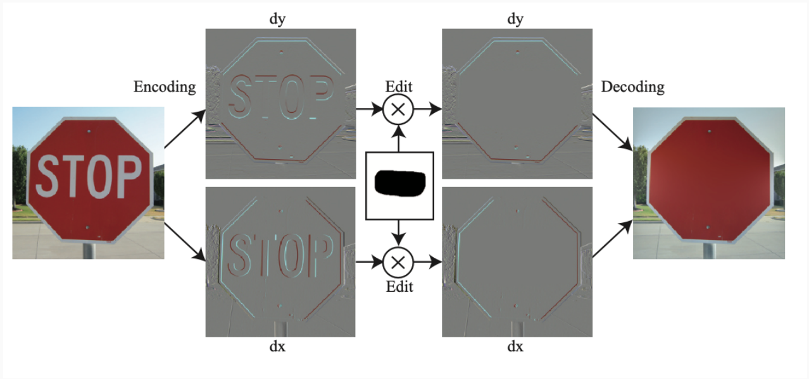

Dove i gradienti sono zero l'integrazione mette un colore liscio raccordato ai bordi rimasti: la scritta sparisce senza dover dire di che colore riempire. È l'idea del Poisson image editing.

> **Il punto**
> 
> Dai gradienti si ricostruisce l'immagine a meno della media: la pseudo-inversa sceglie la soluzione a media zero. Modificare i gradienti e reintegrare è un modo potente di fare editing.

### 7\. Il rumore e le derivate di gaussiana

**Il problema** (slide 38–39). d0 su una foto vera dà soprattutto grana. Se ogni pixel ha rumore gaussiano **indipendente** di varianza σn², l'uscita di d0 è la differenza di due variabili indipendenti: varianza 2σn². In frequenza: la derivata moltiplica per |ω| e **il rumore bianco ha la stessa energia a tutte le frequenze, quindi la derivata esalta proprio la banda dove il rumore domina il segnale**.

**Esempio svolto.** Rumore con σn = 0.1 e un bordo morbido che sale di 0.125 per pixel. d0 dà sul bordo 0.125, ma il rumore della differenza ha deviazione standard √2·0.1 ≈ 0.14: il rumore è più grande del segnale. Con d1 va un po' meglio (deviazione standard 0.1/√2 ≈ 0.07), ma i picchi casuali di 2–3 deviazioni standard (0.15–0.2) superano comunque il bordo: è il secondo pannello della figura.

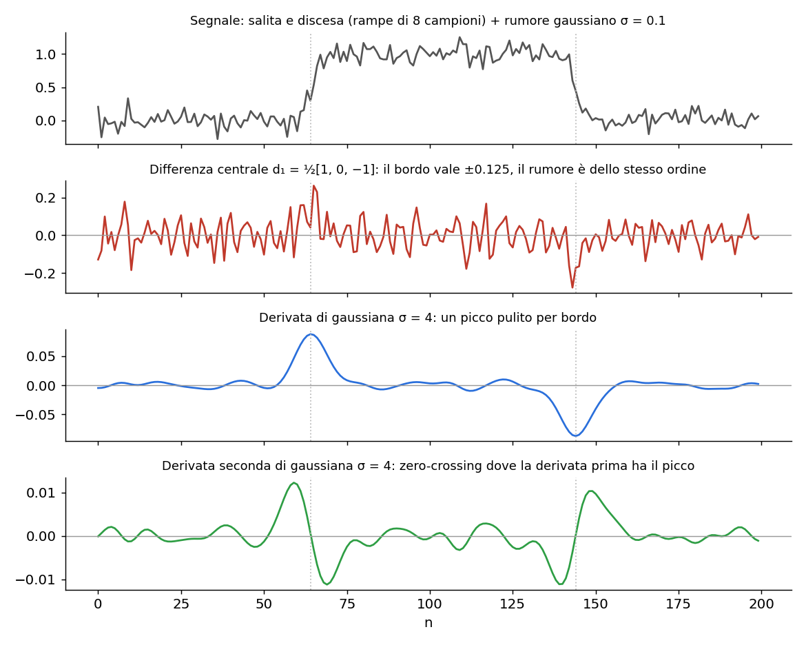

**L'idea** (slide 40): **sfocare e poi derivare, in un colpo solo**. Sfocare con una gaussiana **prima di derivare toglie il rumore ad alta frequenza**. E siccome derivata e convoluzione sono entrambe LSI, **commutano**:

`(∂ℓ/∂x) ∗ g = ∂(ℓ ∗ g)/∂x = ℓ ∗ (∂g/∂x)`

A parole: basta una convoluzione, con il kernel ∂g/∂x calcolato una volta per tutte (in frequenza jω·G(ω) non dipende dall'ordine). Bonus: **la gaussiana è liscia, quindi la sua derivata esiste anche dove l'immagine ha un salto netto**.

**La matematica.** **Derivando g = c·exp(−x²/2σ²)** (slide 41):

`g′σ(x) = −(x / σ²) · gσ(x)`

Un lobo positivo a sinistra e uno negativo a destra, somma zero (risposta nulla sulle zone costanti). In 2D, gx(x, y) = g′σ(x)·gσ(y): deriva lungo x e sfoca lungo y. Nel pannello blu della figura sopra, con σ = 4: **due picchi puliti esattamente sui bordi**.

**Perché funziona, in frequenza.** La risposta della derivata di gaussiana è |ω|·exp(−σ²ω²/2): sale come la derivata ideale alle basse frequenze e poi viene schiacciata a zero dalla gaussiana, con il picco in ω = 1/σ. Non è più un passa-alto ma un **passa-banda**, e σ sceglie la banda.

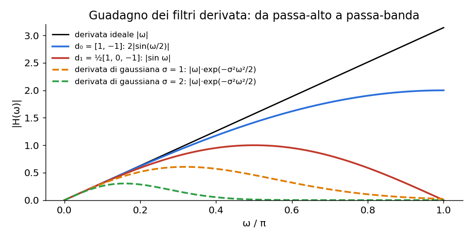

**La scala** (slide 42–43). σ piccolo vede il dettaglio fine ma soffre il rumore; σ grande vede solo le variazioni grossolane. Nella zebra σ = 1 risponde ai bordi delle singole strisce, σ = 4 **solo ai contorni dell'animale**.

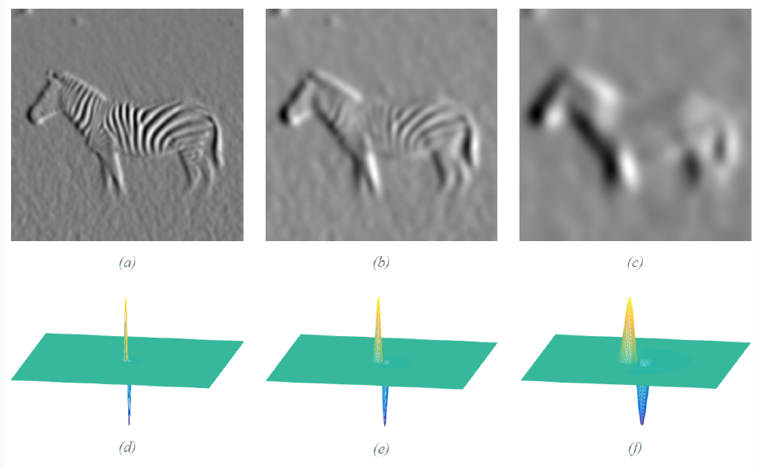

**Le derivate non sono invarianti alla scala**: **scegliere σ significa scegliere quale bordo cerchi**. Anche l'ampiezza cambia con σ: servirà una normalizzazione di scala ([L6](https://gabriele-marsili.github.io/appunti-magistrale-ai/anno-2/computer-vision/sito/#L6), keypoint).

> **Attenzione · slide 72**
> 
> La slide dice "ora abbiamo filtri invarianti alla scala". Contraddice la slide 42: i filtri visti hanno un parametro di scala σ, cioè si possono regolare su una scala, ma non sono invarianti. L'invarianza si ottiene solo con le rappresentazioni multiscala di [L6](https://gabriele-marsili.github.io/appunti-magistrale-ai/anno-2/computer-vision/sito/#L6).

**Ordini superiori** (slide 44–45). Derivando ancora si ottiene **sempre un polinomio per la gaussiana**:

`g″σ(x) = (x²/σ⁴ − 1/σ²) · gσ(x)`

e in generale g(n) = (polinomio di Hermite di grado n)·g. In 2D le derivate miste sono prodotti, per esempio **∂xyg = g′(x)·g′(y). Tutte insieme formano un banco di filtri** che misura la struttura locale, come i termini di uno sviluppo di Taylor dell'immagine sfocata.

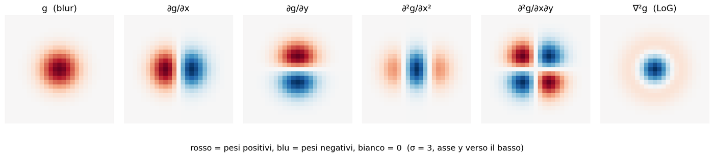

> **Il punto**
> 
> Le derivate amplificano il rumore. La derivata di gaussiana sfoca e deriva in una sola convoluzione, ℓ ∗ ∂g/∂x, ed è un passa-banda: σ sceglie la scala dei bordi che trovi. Le derivate non sono invarianti alla scala.

### 8\. Sobel, gradiente e derivate direzionali

**Il problema.** Esiste una derivata di gaussiana piccola e intera, 3 × 3? E come si combinano le derivate in x e y per avere la direzione del bordo?

**L'idea.** **Sobel (slide 46) è la derivata di gaussiana fatta con i binomiali**: usa la differenza centrale \[1, 0, −1\] in una direzione e lo smoothing \[1, 2, 1\] nell'altra.

`Sx = [1, 2, 1]T ∗ [1, 0, −1] = [[1, 0, −1], [2, 0, −2], [1, 0, −1]]`

Come kernel di convoluzione dà ℓ\[n+1\] − ℓ\[n−1\] (pesato sulle tre righe), positivo quando l'intensità cresce verso destra. **Siccome \[1, 0, −1\] = \[1, 1\] ∗ \[1, −1\], Sobel è un d0 più un po' di binomiale: così recupera il centro che d0 non aveva.**

> **Attenzione · slide 46**
> 
> La slide scrive la matrice con il segno opposto: è la stessa scritta come maschera di correlazione (kernel ribaltato), la forma che trovi in OpenCV. Il libro (§ 18.7) usa la forma di convoluzione scritta sopra.

**Esempio svolto.** Patch 3 × 3 con le prime due colonne a 0 e la terza a 1 (bordo verticale, più chiaro a destra). La convoluzione ribalta Sx, quindi pesa la colonna destra con +1, +2, +1: l'uscita è 1 + 2 + 1 = 4. Normalizzando per 8 (4 del binomiale per 2 della differenza) ottieni 0.5, esattamente ciò che dà d1 = (1 − 0)/2.

**In frequenza** (slide 49) Sobel è il prodotto di sin(ωx) (come d1) e cos²(ωy/2) (il binomiale): risponde alle variazioni in x a frequenze medio-basse e smorza il rumore lungo y. Sul disco della slide 48 dà il modulo del gradiente più uniforme lungo il cerchio, cioè **il più vicino all'invarianza per rotazione**, ma più sfocato.

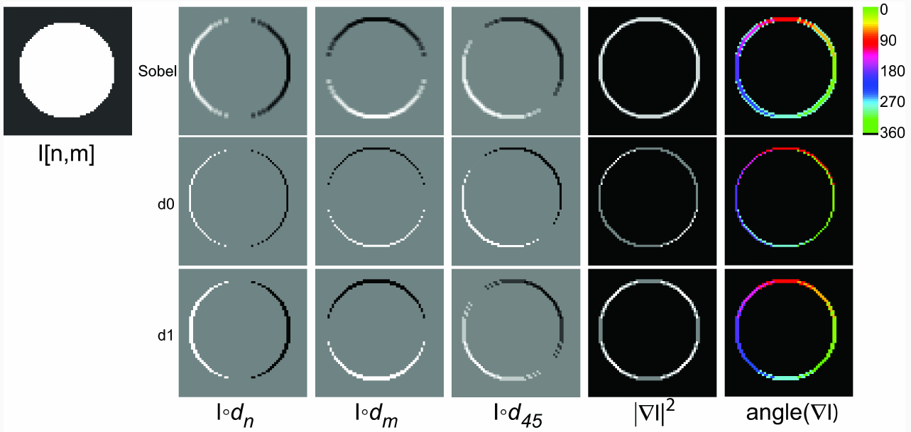

**La matematica del gradiente** (slide 47). **Le due derivate formano un vettore per ogni pixel**:

`∇ℓ = (∂ℓ/∂x, ∂ℓ/∂y),   |∇ℓ| = √(ℓx² + ℓy²),   θ = atan2(ℓy, ℓx)`

ℓx, ℓy abbreviano le due derivate. Il modulo |∇ℓ| è grande sui bordi; **la direzione θ è perpendicolare al bordo, verso il lato più chiaro** (slide 50). Sul disco qui sotto **il modulo è diverso da zero solo sul contorno**.

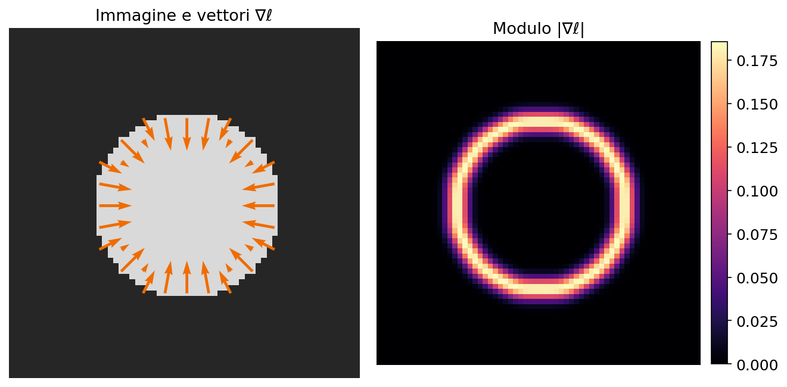

**Derivata direzionale.** La derivata lungo il versore t = (cos θ, sin θ) è il prodotto scalare ∇ℓ · t:

`∂ℓ/∂t = cos θ · ∂ℓ/∂x + sin θ · ∂ℓ/∂y`

Quindi **con due sole convoluzioni (gx e gy) ottieni la derivata in qualunque direzione**, come combinazione lineare, senza nuove convoluzioni.

**Esempio svolto.** In un pixel ℓx = 3 e ℓy = 4. Modulo √(9 + 16) = 5, direzione atan2(4, 3) ≈ 53°. La derivata a 30° è 0.866·3 + 0.5·4 ≈ 4.6, meno di 5: il massimo, 5, si ha proprio lungo il gradiente.

In pratica, con numpy (convoluzione separabile scritta a mano):

    import numpy as np
    def conv_rows(img, k):   # convolve ogni riga con il kernel 1D k
        return np.apply_along_axis(lambda r: np.convolve(r, k, 'same'), 1, img)
    def conv_cols(img, k):   # convolve ogni colonna
        return np.apply_along_axis(lambda c: np.convolve(c, k, 'same'), 0, img)
    
    s = 2.0; x = np.arange(-3*int(s), 3*int(s) + 1)
    g  = np.exp(-x**2 / (2*s*s)); g /= g.sum()       # gaussiana 1D normalizzata
    gd = -x / s**2 * g                               # sua derivata
    blur = conv_cols(conv_rows(img, g), g)           # blur separabile
    Ix = conv_cols(conv_rows(img, gd), g)            # deriva in x, sfoca in y
    Iy = conv_cols(conv_rows(img, g), gd)            # sfoca in x, deriva in y
    mag, ang = np.hypot(Ix, Iy), np.arctan2(Iy, Ix)  # modulo e direzione
    I45 = np.cos(np.pi/4)*Ix + np.sin(np.pi/4)*Iy    # derivata a 45 gradi, gratis

> **Il punto**
> 
> Sobel = differenza centrale più binomiale: centrato, robusto al rumore, quasi invariante per rotazione. Il gradiente (ℓx, ℓy) ha modulo grande sui bordi e direzione perpendicolare al bordo; la derivata in ogni direzione è cos θ·ℓx + sin θ·ℓy.

### 9\. Il laplaciano e il LoG

**Il problema** (slide 51). Le derivate prime sono orientate: per vedere bordi in tutte le direzioni ne servono **almeno due. Il laplaciano è un solo operatore, del secondo ordine e invariante alla rotazione**.

**L'idea.** Invece della pendenza misuro la **curvatura**: su un bordo la pendenza prima cresce e poi cala, quindi la curvatura cambia segno proprio lì.

`∇²ℓ = ∂²ℓ/∂x² + ∂²ℓ/∂y²`

È invariante perché in frequenza moltiplica per −(ωx² + ωy²), che dipende solo dalla distanza dall'origine. Il prezzo: **amplifica il rumore più della derivata prima** (guadagno |ω|² invece di |ω|).

**Versione discreta** (slide 54–55). **In 1D la derivata seconda è d0 ∗ d0 = \[1, −1\] ∗ \[1, −1\] = \[1, −2, 1\]**: **i due mezzi pixel di ritardo si sommano in un pixel intero, si centra il kernel e il problema dello spostamento sparisce. In 2D si sommano** la versione in x e quella in y, la formula a 5 punti:

`∇²5 = [[0, 1, 0], [1, −4, 1], [0, 1, 0]]`

**Esempio svolto.** Rampa ℓ = \[0, 1, 2, 3, 3, 3\] con \[1, −2, 1\]: sui pixel 1 e 2 dà 0 − 2 + 2 = 0 e 1 − 4 + 3 = 0, al pixel 3 (dove la rampa si ferma) 2 − 6 + 3 = −1, poi 0. **Il laplaciano è zero sulle zone piatte e sulle rampe: misura la curvatura, non la pendenza.** In 2D: un pixel scuro (0) circondato da quattro vicini chiari (1) dà 4 − 0 = 4 \> 0; un pixel chiaro fra vicini scuri dà un valore negativo.

**Zero-crossing** (slide 56–57). **Su un bordo la derivata prima ha un picco, e la derivata seconda passa per zero esattamente lì**: un lobo positivo da una parte e uno negativo dall'altra. Nella figura del rumore (sezione 7) gli zeri del pannello verde cadono dove il blu ha i picchi. **Gli zero-crossing formano contorni chiusi, ma sono poco affidabili** come detector di bordi: anche un piccolo rumore crea zeri ovunque.

**LoG** (slide 52–53). **Il laplaciano va sfocato, e per commutatività si sfoca il kernel**:

`(∇²ℓ) ∗ gσ = ℓ ∗ ∇²gσ,    ∇²gσ = ((x² + y² − 2σ²) / σ⁴) · gσ(x, y)`

È il "cappello messicano" rovesciato (ultimo kernel del banco, sezione 7): negativo al centro, si annulla sul cerchio di raggio σ√2, un anello positivo attorno, somma zero. In frequenza vale −|ω|²·exp(−σ²|ω|²/2): zero in DC, zero alle alte frequenze, **picco a |ω| = √2/σ, quindi un passa-banda** ad anello.

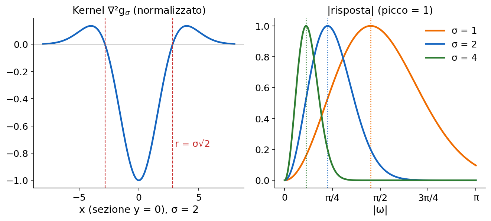

Con σ molto piccolo (sotto circa 0,45, perché il picco sta a ω = √2/σ) il picco cadrebbe oltre ω = π: sulla griglia si vede solo la parte crescente e il LoG si comporta da passa-alto, come ∇²5 (slide 53). Il LoG tornerà nelle piramidi laplaciane ([L6](https://gabriele-marsili.github.io/appunti-magistrale-ai/anno-2/computer-vision/sito/#L6)) e in SIFT, dove è approssimato dalla differenza di gaussiane.

> **Il punto**
> 
> Il laplaciano è invariante alla rotazione e misura la curvatura: zero sulle rampe, zero-crossing sui bordi. Sfocato diventa il LoG, un passa-banda con picco a √2/σ.

### 10\. Un modello del sistema visivo

**Il problema** (slide 59–62). Perché vediamo bene i dettagli di media grandezza, ma perdiamo sia le variazioni lentissime sia le righe finissime? Guarda la carta di Campbell-Robson: la frequenza delle onde cresce da sinistra a destra, il contrasto diminuisce dal basso verso l'alto ed è uguale lungo ogni riga. Eppure le onde sembrano arrivare più in alto al centro che ai lati.

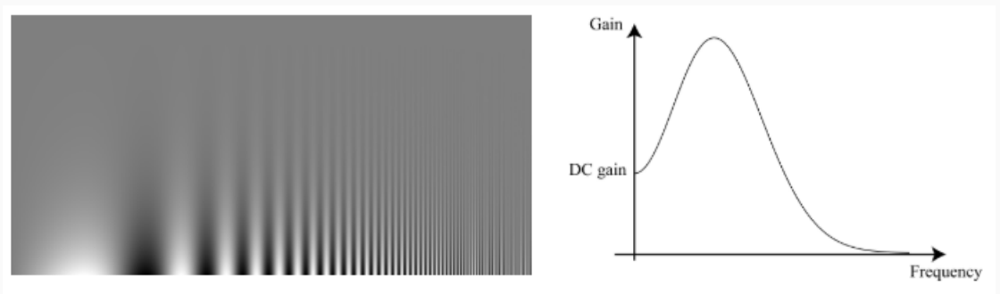

**L'idea.** Il sistema visivo precoce (retina e V1) si comporta più o meno come un passa-banda. Un modello minimo (slide 61):

`h = −∇²gσ + λ gσ`

−∇²gσ è il cappello messicano dritto: centro positivo, periferia negativa, come i campi recettivi centro-periferia delle cellule della retina. **λgσ, con λ piccolo, aggiunge un po' di guadagno DC, perché vediamo anche le zone uniformi. In frequenza H(ω) = (|ω|² + λ)·exp(−σ²|ω|²/2): parte da λ**, sale a un picco a frequenze medie, poi scende. È qualitativamente la **funzione di sensibilità al contrasto** umana. Nel libro i parametri sono λ = 2 e σ = 5.

Lo stesso h, applicato ai quadrati concentrici di Vasarely (slide 63), fa comparire le diagonali illusorie che percepiamo. È un modello minimo, non un modello fisiologico: il libro non sostiene che il cervello calcoli un LoG.

> **Attenzione · slide 63**
> 
> Il testo chiama le illusioni (a), (c) e i risultati filtrati (b), (d). Nella figura le etichette sono per righe: illusioni (a) e (d), risultati filtrati (b) ed (e), profili (c) e (f).

> **Il punto**
> 
> h = −∇²gσ + λgσ è un passa-banda con un po' di DC: riproduce la sensibilità al contrasto umana e l'illusione di Vasarely. È un modello qualitativo.

### 11\. Sharpening: il blur usato al contrario

**Il problema.** Il cursore "nitidezza" di Instagram: come si rende una foto più incisa con un filtro lineare?

**L'idea** (slide 64–65). **ℓ − g ∗ ℓ toglie all'immagine la sua parte sfocata e lascia solo il dettaglio** (un passa-alto). Sommandolo all'immagine il dettaglio raddoppia.

**La matematica.**

`ℓsharp = ℓ + (ℓ − g ∗ ℓ) = 2ℓ − g ∗ ℓ = (2δ − g) ∗ ℓ`

δ è l'impulso (il filtro identità: δ ∗ ℓ = ℓ). **Il kernel 2δ − g ha guadagno DC 2 − 1 = 1, quindi la luminosità media non cambia; in frequenza vale 2 − G(ω), che va da 1 in DC a quasi 2** alle alte frequenze. Nella versione discreta del libro (slide 66) g è il binomiale 3 × 3: al centro 2 − 4/16 = 1.75, −2/16 sui quattro vicini laterali, −1/16 sui diagonali.

**Esempio svolto** in 1D, con g = \[1, 2, 1\]/4: il kernel è 2δ − g = \[−0.25, 1.5, −0.25\]. Sul gradino \[0, 0, 0, 1, 1, 1\] l'ultimo pixel scuro diventa 1.5·0 − 0.25·1 = −0.25 e il primo chiaro 1.5·1 − 0.25·0 = 1.25; lontano dal salto tutto resta uguale. Il bordo è più ripido, ma con un **overshoot** da entrambe le parti.

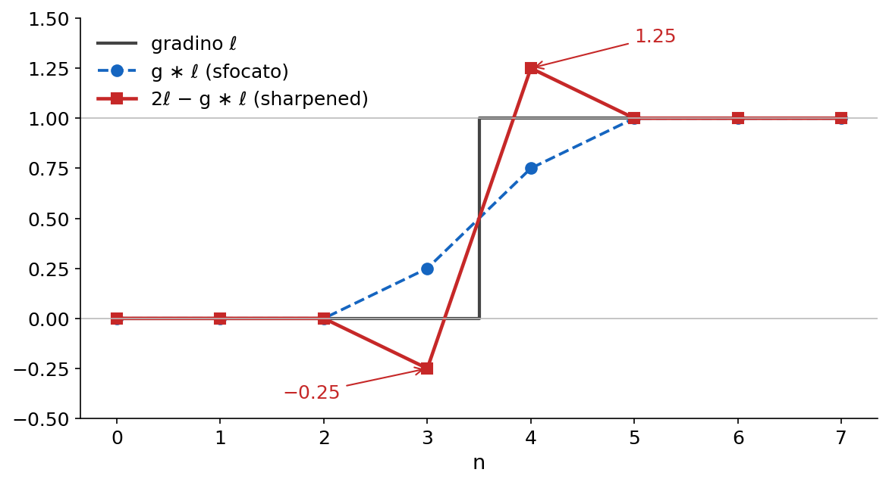

Sulle foto l'overshoot si vede come aloni attorno ai bordi forti, per esempio attorno al casco dell'astronauta:

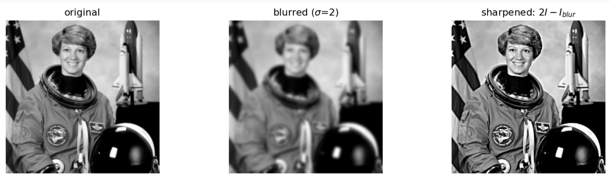

Applicando il filtro più volte (slide 68) il guadagno alle alte frequenze si moltiplica: crescono anche rumore e aloni. **Lo sharpening non crea dettaglio nuovo: amplifica quello che c'è già, rumore compreso.**

> **Il punto**
> 
> Sharpening = immagine + dettaglio = (2δ − g) ∗ ℓ. Guadagno DC 1, alte frequenze quasi raddoppiate: bordi più ripidi, ma con overshoot (aloni) e più rumore.

### Il riassunto in 10 righe

1.  Blur e derivate sono filtri LSI: si capiscono guardando kernel e risposta in frequenza; il guadagno DC è la somma del kernel.
2.  Il box è economico ma la sua risposta è una sinc con lobi laterali: lascia passare alte frequenze e non si compone in un box.
3.  La gaussiana è separabile e circolare, la sua trasformata è gaussiana (niente lobi), le varianze si sommano sotto convoluzione.
4.  Campionata e troncata, la gaussiana perde queste proprietà in modo approssimato.
5.  Il binomiale bn = \[1, 1\]∗n ha interi, σ² = n/4, composizione esatta, risposta cosn(ω/2) nulla in π: \[1, 2, 1\]/4 è il blur da usare.
6.  d0 = \[1, −1\] è spostata di mezzo pixel; d1 = ½\[1, 0, −1\] è centrata ma cieca in ω = π; entrambe valgono solo a basse frequenze.
7.  Dai gradienti si ricostruisce l'immagine a meno della media (pseudo-inversa), e questo permette l'editing nel dominio del gradiente.
8.  Le derivate amplificano il rumore; le derivate di gaussiana sfocano e derivano in una convoluzione, e σ sceglie la scala.
9.  Sobel = differenza centrale più binomiale; la derivata in qualunque direzione è cos θ·ℓx + sin θ·ℓy.
10. Il laplaciano è invariante alla rotazione e misura la curvatura; il LoG è un passa-banda; 2δ − g è lo sharpening.

### Verifica di aver capito

**Perché il binomiale \[1, 2, 1\]/4 toglie la scacchiera e il box \[1, 1, 1\]/3 no?**

La scacchiera è l'oscillazione più rapida, ω = π, cioè \[1, −1, 1, −1, …\]. Il binomiale dà 1 − 2 + 1 = 0: la sua risposta cos²(ω/2) si annulla in π. Il box dà (1 − 1 + 1)/3 = 1/3: in π la sua risposta è su un lobo laterale, non nulla. In 2D vale lo stesso con i prodotti esterni (guadagno 1/9 contro 0).

**Sfoco con una gaussiana σ = 3 e poi con una σ = 4. Quale singolo blur ottengo? E se uso b8 e poi b8?**

Le varianze si sommano: σ² = 9 + 16 = 25, quindi σ = 5 (nel continuo; sul discreto solo circa). Con i binomiali è esatto: b8 ∗ b8 = b16, con σ² = 16/4 = 4, cioè σ = 2.

**Perché si calcola ℓ ∗ (∂g/∂x) invece di derivare l'immagine e poi sfocarla? Dimostra che è lo stesso.**

Derivata e convoluzione con g sono entrambe LSI, e i sistemi LSI commutano: in frequenza sono i prodotti jω·G(ω)·L(ω), che non dipendono dall'ordine. Il vantaggio è pratico: un solo kernel invece di due convoluzioni, e il kernel ∂g/∂x è liscio e calcolabile analiticamente, (−x/σ²)·g, anche dove l'immagine ha discontinuità.

**Hai le immagini ℓx e ℓy. Come ottieni la derivata a 30°, e in quale direzione la derivata direzionale è massima?**

ℓ30° = cos 30°·ℓx + sin 30°·ℓy ≈ 0.866ℓx + 0.5ℓy, nessuna nuova convoluzione. È il prodotto scalare ∇ℓ · t, massimo quando t è parallelo al gradiente, θ = atan2(ℓy, ℓx), dove vale |∇ℓ|.

**Su una rampa lineare di intensità che cosa danno la derivata prima e il laplaciano? Cosa ne segue per trovare i bordi?**

La derivata prima è costante e diversa da zero (la pendenza); il laplaciano è zero (\[1, −2, 1\] su a·n dà 0). Il laplaciano risponde alla curvatura, cioè a dove la pendenza cambia: ai due estremi di un bordo dà un lobo positivo e uno negativo, e il bordo sta nello zero-crossing fra i due, dove la derivata prima ha il massimo.

### Come proseguire

  - Leggi il libro: [cap. 17 Blur Filters](https://visionbook.mit.edu/blurring_2.html) (tutto, è breve: box, gaussiana, binomiale, con gli esempi numerici citati qui) e [cap. 18 Image Derivatives](https://visionbook.mit.edu/derivatives.html), §§ 18.1–18.11. Il § 18.12 (Retinex: separare riflettanza e illuminazione integrando solo i gradienti grandi) non è nelle slide, ma è una bella applicazione della sezione 6.
  - Per il seguito: blur e campionamento si incontrano in [L6](https://gabriele-marsili.github.io/appunti-magistrale-ai/anno-2/computer-vision/sito/#L6) (aliasing, piramidi gaussiane e laplaciane), le derivate di gaussiana e il LoG tornano nei keypoint.
  - Ora ripassa con le schede qui sotto: una per slide, con le correzioni (slide 7, 11, 21, 30, 36, 46, 63, 72) e i riquadri "Dal libro".
