# L6 · Aliasing e piramidi

*Lezione 6 · Antonio Carta · 24 settembre 2026*

[Versione interattiva sul sito, con videolezione](https://gabriele-marsili.github.io/appunti-magistrale-ai/anno-2/computer-vision/sito/#L6) · [Indice della dispensa](README.md)

**In una frase:** **campionare un segnale ne copia lo spettro a intervalli regolari, e se le copie si toccano le alte frequenze si travestono da basse** (aliasing); per ridurre un'immagine senza inventare strutture false **bisogna quindi sfocarla prima, e ripetendo "sfoca e dimezza" si ottiene la piramide gaussiana, dalla quale, salvando a ogni passo ciò che il blur ha tolto, nasce la piramide laplaciana, invertibile** e utile per cercare a più scale e per fondere immagini.

### Prima di iniziare

Ti servono tre cose già viste.

  - **Fourier e teorema di convoluzione** ([L3](https://gabriele-marsili.github.io/appunti-magistrale-ai/anno-2/computer-vision/sito/#L3), [L4](https://gabriele-marsili.github.io/appunti-magistrale-ai/anno-2/computer-vision/sito/#L4)): ogni segnale è una somma di sinusoidi; la trasformata dice quanto pesa ciascuna frequenza. Il fatto che userai di continuo: **un prodotto in un dominio diventa una convoluzione nell'altro**. Ricorda anche che la DFT di un segnale di lunghezza N è periodica di periodo N: le frequenze u e u + N sono la stessa cosa.
  - **Filtro gaussiano e binomiale** ([L5](https://gabriele-marsili.github.io/appunti-magistrale-ai/anno-2/computer-vision/sito/#L5)): la gaussiana gσ è un passa-basso, tanto più forte quanto più σ è grande; il binomiale b4 = \[1, 4, 6, 4, 1\]/16 ne è l'approssimazione discreta (varianza 1, quindi σ = 1 pixel).
  - **Composizione di gaussiane** ([L5](https://gabriele-marsili.github.io/appunti-magistrale-ai/anno-2/computer-vision/sito/#L5)): sfocare con σ1 e poi con σ2 equivale a sfocare una volta con σ = √(σ1² + σ2²). Si sommano le varianze, non le σ: la slide 36 sbaglia proprio qui.

Notazione: tonde per il continuo, ℓ(t); quadre per il discreto, ℓ\[n\]. Ts è il periodo di campionamento (distanza fra due campioni), fs = 1/Ts la frequenza di campionamento in cicli per unità, ωs = 2π/Ts la stessa in radianti. Le slide passano da f a ω senza avvisare: è sempre ω = 2πf.

### Guarda prima questi video

  - [Shannon Nyquist Sampling Theorem](https://www.youtube.com/watch?v=FcXZ28BX-xE) (Video). Steve Brunton. Guardalo tutto: in pochi minuti ti dà l'enunciato e l'idea "almeno due campioni per periodo", con l'esempio della sinusoide che diventa più lenta. È il punto di partenza.
  - [Sampling Theory and Aliasing | Image Processing II](https://www.youtube.com/watch?v=YFZsxY_2_l4) (Video). Shree Nayar (Columbia). Tutto: campionare come prodotto per un treno di impulsi, le copie dello spettro, la ricostruzione e il prefiltro anti-aliasing, già sulle immagini. Corrisponde alle sezioni 2–6 di questa dispensa.
  - [How a 40-Year-Old Trick Solves Seamless Image Blending](https://www.youtube.com/watch?v=U7qa7i0K9C4) (Video). Jia-Bin Huang. Piramide gaussiana, laplaciana e blending di Burt e Adelson (la "orapple" del notebook) spiegati visivamente. Guardalo dopo aver letto la parte sulle piramidi.

### 1\. Il problema: ridimensionare e guardare a più scale

In visione **si cambia risoluzione di continuo**. Instagram riduce la tua foto da 12 megapixel a 1080 pixel di lato. Una rete vuole l'input a 224×224. Dentro la rete, stride e pooling dimezzano le feature map. Un'auto a guida autonoma deve riconoscere un pedone a 5 metri (grande) e a 50 metri (minuscolo). La lezione risponde a due domande.

1.  **Come si riduce un'immagine senza rovinarla?** **L'idea ingenua, tenere un pixel ogni k, non perde solo dettaglio**: **crea strutture che non esistono** (slide 5–6, 21). Guarda la figura: a destra righe ondulate e scacchiere che nell'originale non ci sono.
2.  **Come si analizza un'immagine a tutte le scale?** Lo stesso uccello può occupare 10 o 200 pixel (slide 31). Invece di costruire un detector per ogni dimensione, **si costruiscono versioni ridotte dell'immagine e si usa sempre lo stesso detector** (slide 32). Per farlo bene bisogna saper ridurre: per questo la prima domanda viene prima.

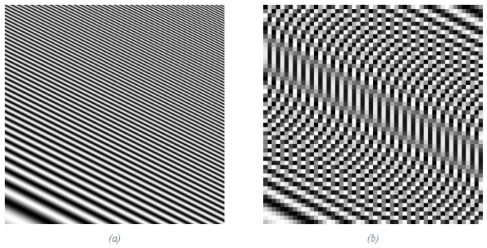

> **Il punto**
> 
> Ridurre un'immagine è un'operazione quotidiana e farla male non la rende solo più povera: la riempie di strutture false. Capire perché (sezioni 2–6) è anche la base per costruire le piramidi (sezioni 8–12).

### 2\. Aliasing: una sinusoide che cambia identità

**Il problema.** Fra due campioni non sai cosa succede. Può un segnale veloce sembrare lento solo perché lo guardi troppo di rado?

**L'idea.** Sì. Prendi una sinusoide veloce, f0 = 0.9 cicli per unità di tempo, e misurala una volta per unità (fs = 1). In 10 unità la sinusoide compie 9 oscillazioni, ma tu prendi solo 11 campioni. Guarda la figura (a): i punti rossi stanno esattamente su **una sinusoide lentissima, f = 0.1, che fa un solo ciclo**. **Dai campioni non c'è modo di distinguere le due.**

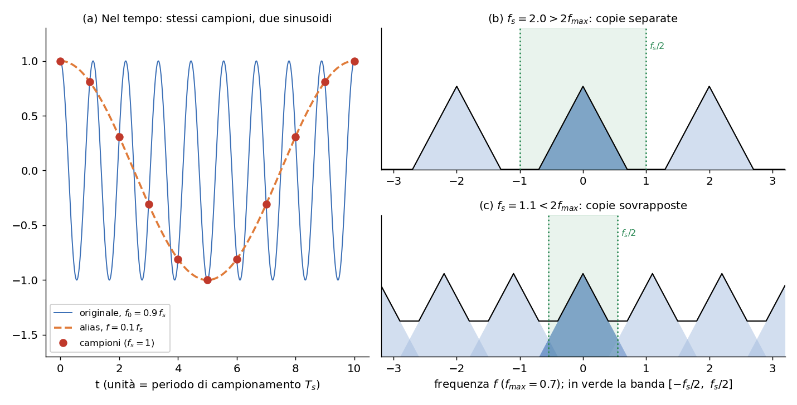

**La matematica.** Per n intero:

`cos(2π · 0.9 · n) = cos(2πn − 2π · 0.1 · n) = cos(2π · 0.1 · n)`

perché togliere 2πn (un numero intero di giri) non cambia il coseno, e il coseno è pari. In generale **una sinusoide di frequenza f0 campionata a fs dà gli stessi campioni di tutte le sinusoidi a frequenza |f0 − k fs|** con k intero. Fra tutte queste, chi guarda i campioni (noi, o un algoritmo di ricostruzione) sceglie la più lenta: è il prior "slow and smooth" della slide 8. **La frequenza che "vedi" è quindi:**

`fvista = |f0 − k fs|,  con k intero scelto in modo che il risultato stia in [0, fs/2]`

**Simboli: f0 è la frequenza vera**, fs la frequenza di campionamento, k il numero intero di "giri" da togliere. Il limite fs/2 si chiama **frequenza di Nyquist: la più alta frequenza che i campioni possono rappresentare**. La figura qui sotto è questa formula disegnata: sopra la Nyquist le frequenze si **ripiegano** a zig-zag.

**Esempio svolto (libro, § 20.2).** ℓ(t) = cos(18πt): la pulsazione è 18π, quindi la frequenza è 18π/2π = 9 cicli per unità. La campioni con Ts = 1/11, cioè fs = 11. Nyquist vale 5.5 e 9 \> 5.5: siamo nei guai. Con k = 1: |9 − 11| = 2. Ricostruendo dai campioni vedi un coseno di frequenza 2, cioè periodo 1/2, anche se hai più campioni (11) che periodi (9). **Avere "più campioni che oscillazioni" non basta**: ne servono più del doppio.

**Dove lo incontri.** **Nello spazio l'aliasing è il moiré delle righe fini (slide 6), i bordi a scaletta e le texture che diventano scacchiere quando riduci con nearest neighbor (slide 14, 21)**: la camicia a righe che in foto "vibra", lo schermo fotografato col telefono. **Nel tempo è la ruota che nei film gira all'indietro** (wagon-wheel, slide 13). Il libro lo chiama una "confusione di frequenze": **la frequenza alta non sparisce, viene scambiata per un'altra**.

Non confondere **campionamento** (*dove* misuri) e **quantizzazione** (*con che precisione* scrivi il valore, es. 8 bit): **l'aliasing viene solo dal campionamento** (slide 15).

> **Il punto**
> 
> Campionando a fs, una frequenza f0 sopra fs/2 si presenta come |f0 − k fs|, una frequenza più bassa che non c'era. Per rappresentare f0 servono più di due campioni per periodo.

### 3\. Perché succede: le copie dello spettro

**Il problema.** Una foto non è una sinusoide: ne contiene migliaia. Cosa fa il campionamento a *tutto* lo spettro insieme (slide 9, libro § 20.3)?

**L'idea.** **Campionare = moltiplicare per un pettine.** Una moltiplicazione nel tempo è una convoluzione in frequenza, e convolvere con un pettine fa copie.

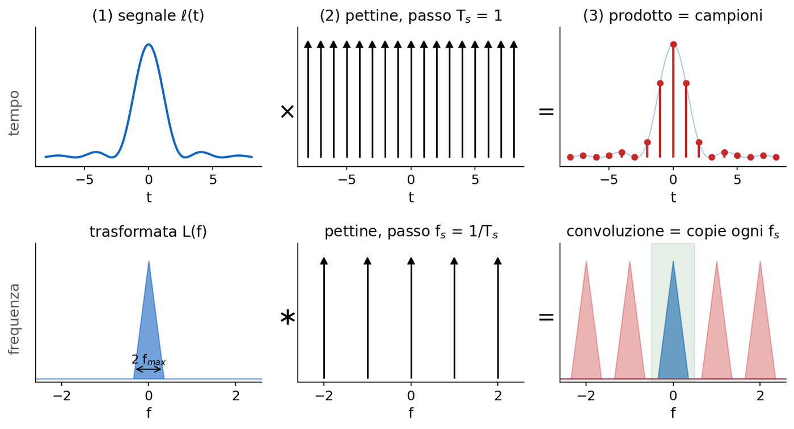

**La matematica, passo 1.** Il **treno di delta** (o pettine di Dirac) **è una fila di impulsi a distanza Ts**:

`δTs(t) = ∑n δ(t − n Ts)`

Qui δ è la **delta di Dirac** (un impulso unitario concentrato in un punto) e n scorre su tutti gli interi. Se moltiplichi il segnale ℓ(t) **per il pettine, ogni impulso "raccoglie" il valore del segnale nel suo punto** e tutto il resto si azzera:

`ℓδ(t) = ℓ(t) · δTs(t) = ∑n ℓ[n] δ(t − n Ts),   con ℓ[n] = ℓ(n Ts)`

ℓδ è ancora una funzione del continuo (si può trasformare con Fourier) ma contiene solo i campioni.

**Passo 2.** Due fatti, e il teorema è dimostrato.

1.  **La trasformata di un pettine di passo Ts è ancora un pettine, di passo 2π/Ts in frequenza** (cioè fs in cicli). Campioni fitti nello spazio, impulsi radi in frequenza, e viceversa (slide 22).
2.  **Il prodotto nel tempo diventa convoluzione in frequenza, e convolvere con un pettine vuol dire copiare lo spettro su ogni impulso**: `Lδ(ω) = (2π/Ts) ∑k L(ω − k · 2π/Ts)` L è la trasformata del segnale originale, Lδ quella del segnale campionato, k scorre sugli interi: la somma mette una copia di L centrata in ogni multiplo di 2π/Ts.

**Passo 3.** Torna alla figura della sezione 2, pannelli (b) e (c). **Se il segnale è a banda limitata, cioè L(ω) = 0 fuori da \[−ωmax, ωmax\], ogni copia è larga 2ωmax e i centri** distano ωs = 2π/Ts. Nel pannello (b), **campionato a fs = 2: le copie sono separate e nella banda verde** resta solo l'originale. Le copie non si toccano se la distanza supera la larghezza:

`ωs > 2 ωmax   ⇔   fs > 2 fmax   ⇔   Ts < π / ωmax`

È il **teorema del campionamento di Nyquist-Shannon** (slide 11): **se vale, il segnale si ricostruisce** perfettamente (sezione 4). La disuguaglianza è stretta: con fs = 2f0 i campioni di un coseno possono cadere tutti sugli zeri. Attenzione alla slide 11, che scrive la frequenza di Nyquist come "ωf = fs/2" mescolando i simboli: **intende fs/2 in cicli, ovvero ωs/2** in radianti.

**Se invece le copie si sovrappongono** (pannello c), nella banda centrale si sommano pezzi dello spettro **originale e code delle copie vicine. Una somma non si può disfare: sapendo che** 5 = a + b non ricavi a e b. Per questo la slide 9 insiste che **l'informazione aliasata non è "persa", è mescolata, e nessun filtro successivo la separa**.

**Esempio svolto.** L'orecchio sente fino a circa 20 kHz; i CD campionano a 44.1 kHz \> 2 · 20: condizione rispettata. La telefonia classica campiona a 8 kHz (Nyquist 4 kHz) e prima **filtra** la voce sotto circa 3.4 kHz: senza filtro una sibilante a 6 kHz ricomparirebbe a |6 − 8| = 2 kHz. Per le immagini, con un campione per pixel, la Nyquist è 0.5 cicli per pixel: **un periodo non può essere più corto di 2 pixel**.

> **Il punto**
> 
> Campionare copia lo spettro ogni fs. Se fs \> 2fmax le copie restano separate e non si perde nulla; altrimenti si sommano e l'errore non si può più togliere.

### 4\. Ricostruire dai campioni

**Il problema.** Per ingrandire o ruotare una foto serve il valore "fra due pixel". Come si riempiono i buchi?

**L'idea.** Se le copie sono separate, basta tenere la copia centrale con un passa-basso ideale (un box in frequenza su \[−π/Ts, π/Ts\]), che nel tempo è una sinc, sinc(t) = sin(πt)/(πt). Ogni campione "accende" una sinc centrata su di sé, che vale 1 nel suo punto e 0 negli altri campioni (libro, § 20.4.1).

`ℓ̃(t) = ∑n ℓ[n] · sinc((t − n Ts) / Ts)`

![(a) Ogni sinc grigia vale ℓ\[n\] nel proprio campione e zero negli altri: la somma (blu) passa per tutti i punti rossi. (b) Gli stessi campioni con i tre kernel: il box dà i gradini del nearest neighbor, il triangolo una spezzata, la sinc la curva liscia.](../sito-src/L6/disp_sinc.png)

In pratica **la sinc è troppo lunga** (decade come 1/t, quindi ogni punto dipende da campioni lontanissimi). Si usano kernel locali: un box largo Ts (**nearest neighbor**, risultato a blocchi), un triangolo largo 2Ts (**interpolazione lineare**), o il solo lobo centrale della sinc (**Lanczos**). Sono i filtri del menu "ridimensiona" di qualunque programma.

**Esempio svolto.** Vuoi il valore in t = 2.5 Ts, a metà fra ℓ\[2\] = 4 e ℓ\[3\] = 8. Nearest neighbor dà 4 oppure 8 (a metà strada decide una convenzione). Lineare: 0.5 · 4 + 0.5 · 8 = 6. La sinc usa tutti i campioni: i due vicini con peso sinc(0.5) = 0.64, i due successivi con sinc(1.5) = −0.21, poi sinc(2.5) = 0.13, e così via.

Da qui segue una cosa che la slide 5 dice di passaggio: **l'upsampling non recupera nulla**. Nessun kernel crea frequenze sopra la vecchia Nyquist: l'immagine diventa più grande, non più dettagliata. Lo "zoom e migliora" dei film non esiste.

> **Il punto**
> 
> Ricostruire = filtrare i campioni con un passa-basso. La sinc è il filtro ideale ma è infinita; box, triangolo e Lanczos sono approssimazioni corte. Nessuna crea dettaglio nuovo.

### 5\. Nel discreto: decimare un'immagine

**Il problema.** Con le immagini digitali si parte già da campioni e si vuole ridurre di un fattore k, per esempio da 128×128 a 64×64. Cosa succede allo spettro?

**L'idea.** La **decimazione** (slide 20) **tiene un pixel ogni k**:

`ℓ↓k[n, m] = ℓ[k n, k m]`

Un'immagine N×M diventa N/k × M/k. È lo stesso discorso di prima: decimare equivale a moltiplicare per un pettine discreto di passo k (azzerando i pixel scartati), la cui DFT è un pettine con k × k impulsi distanti N/k (slide 22). Lo spettro viene copiato k × k volte, e la nuova banda utile si restringe a \[−N/2k, N/2k\].

**La matematica** (libro § 21.3.2):

`L↓k[u, v] = (1/k²) ∑s=0k−1 ∑r=0k−1 L[u − sN/k, v − rM/k]`

L è la DFT dell'immagine originale, u e v le frequenze (indici della DFT), s e r contano le copie. In parole: **ogni frequenza dell'immagine ridotta è la media di k² frequenze dell'originale**. In 1D con k = 2 diventa L↓2\[u\] = ½ (L\[u\] + L\[u + N/2\]), cioè in forma matriciale L↓2 = ½ \[IN/2 | IN/2\] L: ogni coefficiente somma una frequenza bassa e la sua "gemella" alta. Se la gemella è zero va tutto bene; **se no, è aliasing**.

**Esempio svolto.** N = 8, ℓ\[n\] = cos(2π · 3n/8). La sua DFT ha due picchi, in u = 3 e u = 5 (cioè −3). La nuova Nyquist dopo k = 2 è N/4 = 2, e 3 \> 2: ci sarà aliasing. Decimando: ℓ↓2\[m\] = ℓ\[2m\] = cos(2π · 3m/4). Siccome 3/4 = 1 − 1/4 e il coseno è pari, cos(2π · 3m/4) = cos(2π · m/4): un coseno di frequenza 1 su 4 campioni. Con la formula: L↓2\[1\] = ½ (L\[1\] + L\[5\]) = ½ L\[5\], quindi il picco che stava in 5 finisce in 1. La frequenza 3 si è travestita da frequenza 1 = |3 − 4|.

#### Un attacco che sfrutta la decimazione

Slide 17: un'immagine nascosta (un cartello di STOP) moltiplicata per (−1)n+m finisce alle frequenze più alte, una trama finissima quasi invisibile se sommata all'uccello con peso 0.05. La decimazione di 2 ripiega proprio quelle frequenze sull'origine, e il sistema vede lo STOP.

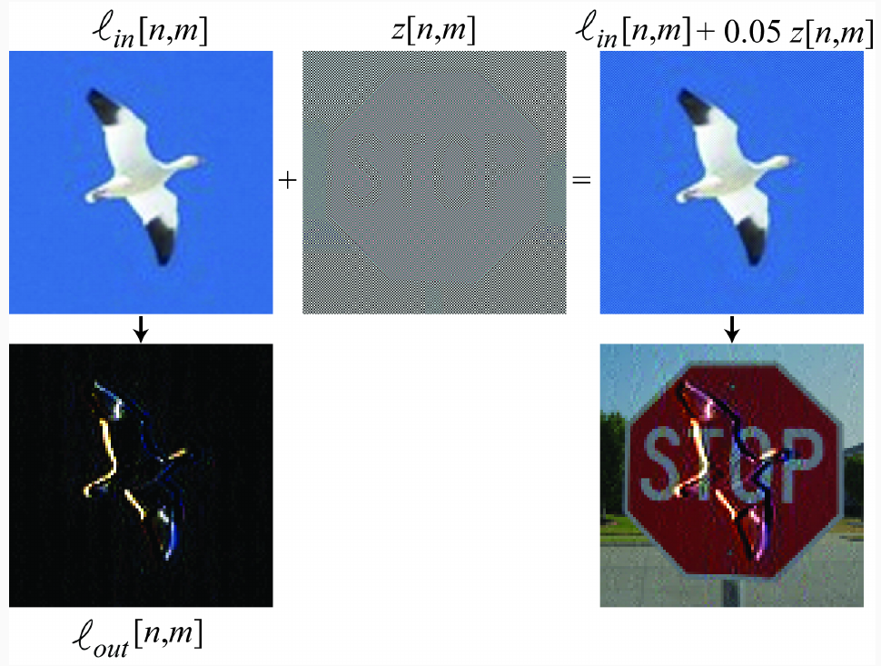

**Il punto debole è la decimazione senza filtro, non i pesi della rete.** Stride e pooling nelle CNN sono decimazioni (slide 16): **spostando l'input di un pixel la predizione può cambiare**. La correzione (anti-aliased CNN, Zhang 2019) è un piccolo blur prima di ogni sottocampionamento.

> **Il punto**
> 
> Decimare di k fa la media di k² frequenze in una: ogni frequenza oltre la nuova Nyquist (N/2k) si somma a una frequenza bassa. È la sezione 3 nel discreto.

### 6\. La cura: sfocare prima di decimare

**Il problema.** Le frequenze sopra la nuova Nyquist le perderemo comunque. Come evitare che si travestano da frequenze basse?

**L'idea.** Toglierle **prima** di decimare, con un passa-basso: il **prefiltro anti-aliasing** (slide 24). Meglio sfocata ma fedele che nitida e falsa. Il libro chiama **downsampling** l'operazione completa e decimazione solo il secondo passo:

`z = ℓ ∗ hk,    ℓout[n, m] = z[k n, k m]`

dove hk è il passa-basso adatto al fattore k: **per ridurre di k serve un taglio intorno a π/k** (in radianti per campione), quindi con una gaussiana σ proporzionale a k. Le fotocamere hanno un filtro ottico davanti al sensore per lo stesso motivo.

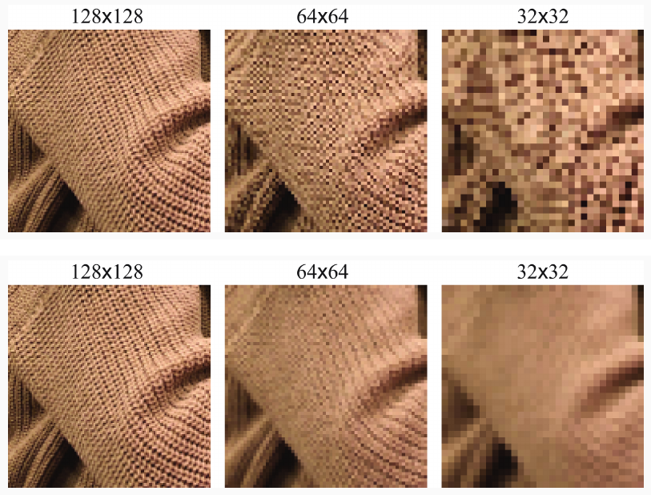

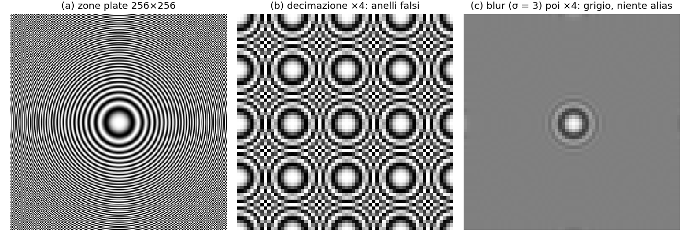

#### Quale passa-basso?

Qui entra il compromesso della slide 26, che si ritrova ovunque: **un filtro ripido in frequenza è lungo e oscillante nello spazio**.

  - **Ideale** (box in frequenza, sinc nello spazio): taglio perfetto, ma **i lobi della sinc producono ringing, aloni paralleli ai bordi netti**.
  - **Sinc con finestra di Hamming**: la sinc viene troncata dolcemente, w\[n\] = 0.54 + 0.46 cos(πn/L) per |n| ≤ L. Kernel corto, ringing ridotto ma non assente.
  - **Binomiale**: b2 = \[1, 2, 1\]/4 ha risposta in frequenza ½ (1 + cos(2πu/N)), che **scende senza oscillare: niente ringing**. Il prezzo: **un po' di aliasing passa, attenuato**.

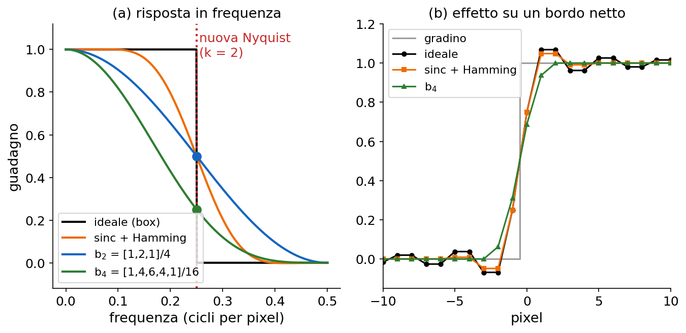

**Esempio svolto.** Riduci di k = 2 un segnale lungo N. La nuova Nyquist è u = N/4. Il guadagno di b2 lì è ½ (1 + cos(2π · N/4 / N)) = ½ (1 + cos(π/2)) = ½. Con b4 = b2 ∗ b2 le risposte si moltiplicano: ½ · ½ = ¼. E una tenda a righe con periodo 3 pixel (1/3 di ciclo per pixel)? Contata nei nuovi pixel la frequenza è 2/3 \> ½: senza prefiltro ricompare a |2/3 − 1| = 1/3, cioè righe false con periodo 6 pixel dell'originale. Con il prefiltro diventano un grigio uniforme.

In visione si sceglie quasi sempre il binomiale o la gaussiana: **meglio un po' di aliasing residuo che aloni su ogni bordo**. E per ridurre molto conviene dimezzare più volte con un filtro piccolo (libro, § 21.3.5): è già l'idea della piramide.

> **Il punto**
> 
> Downsampling corretto = passa-basso con taglio a circa π/k, poi decimazione. Si perde il dettaglio fine in modo onesto. In pratica si usa un binomiale o una gaussiana, che non producono ringing.

### 7\. All'indietro: upsampling

**Il problema.** Per la piramide laplaciana (sezione 9) bisognerà riportare un'immagine piccola alla dimensione doppia. Come si fa, nel discreto?

**L'idea.** Due passi (libro, § 21.4): **espansione**, cioè si inseriscono zeri fra i campioni, e **interpolazione** con un passa-basso che riempie gli zeri. L'espansione replica lo spettro; il filtro toglie le copie in più.

![(a) Espansione di \[1, 11, 15, 5\]: metà dei campioni è zero: la somma resta 32 (era già dimezzata dalla decimazione), ma la media su 8 campioni si dimezza. (b) Sfocando con b4 esce un segnale liscio ma alto la metà del gradino originale (tratteggio). (c) Con 2 · b4 l'altezza torna giusta.](../sito-src/L6/disp2_espansione.png)

**La matematica.** Inserire zeri **dimezza il valore medio in 1D**, perché metà dei campioni è zero; in 2D lo riduce a un quarto. Un filtro con somma 1 non cambia la media, quindi **il filtro di interpolazione deve avere guadagno 2 per asse** (4 in 2D). Il kernel lineare per k = 2 è infatti \[½, 1, ½\] = 2 · b2. Questo fattore le slide lo omettono (vedi il riquadro Attenzione della slide 49).

**Esempio svolto.** g = \[1, 11, 15, 5\] espanso diventa \[1, 0, 11, 0, 15, 0, 5, 0\]. Con 2 · b4 e zeri fuori dal segnale, in posizione 2: 2 · (1·1 + 6·11 + 1·15)/16 = 2 · 82/16 = 10.25; in posizione 3: 2 · (4·11 + 4·15)/16 = 13. Senza il 2 avresti 5.125 e 6.5: tutto a metà altezza, come nel pannello (b).

> **Il punto**
> 
> Upsampling = zeri + interpolazione. Il filtro di interpolazione deve avere guadagno 2 per asse, altrimenti l'immagine ingrandita è più scura. E, come per ogni interpolazione, non aggiunge dettaglio.

### 8\. Scale-space: tutte le scale insieme

**Il problema.** Seconda parte. Un filtro di dimensione fissa "vede" bene solo strutture di una certa dimensione (slide 31): un detector 20×20 trova gli uccelli lontani, non quello che riempie mezza foto.

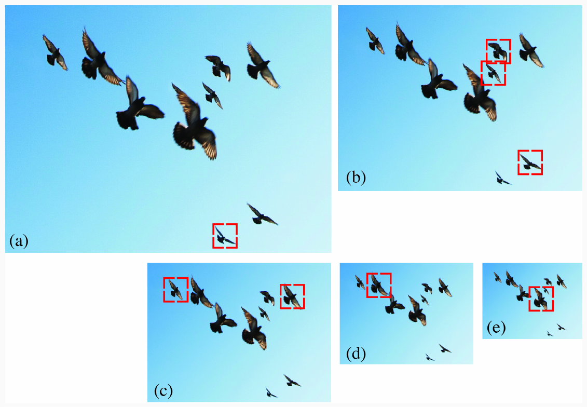

**L'idea.** In [L5](https://gabriele-marsili.github.io/appunti-magistrale-ai/anno-2/computer-vision/sito/#L5) la soluzione era già nascosta nella σ: la derivata di gaussiana con σ piccola risponde ai bordi fini, con σ grande ai contorni grossi. Lo **scale-space** (slide 34) rende sistematica l'idea: invece di scegliere una σ, si calcolano tutte.

`L(x, y; σ) = (gσ ∗ I)(x, y)`

I è l'immagine, gσ la gaussiana 2D con deviazione standard σ, **L la famiglia di immagini sfocate indicizzata da σ** (σ = 0 è l'originale). Salendo in σ **la texture fine sparisce per prima e le forme grandi restano più a lungo** (slide 37).

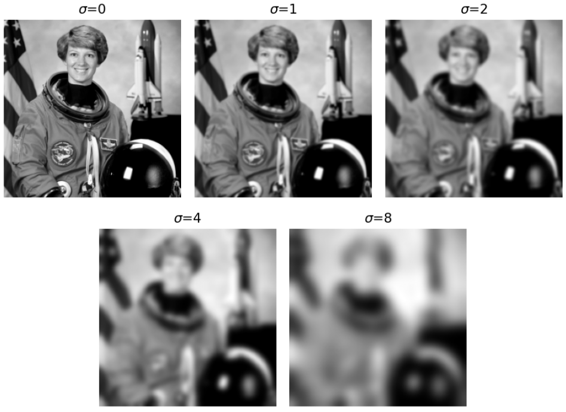

**Perché proprio la gaussiana?** Perché è l'**unico** kernel che soddisfa gli assiomi della slide 36: **lineare e invariante per traslazione, simmetrico per rotazione, componibile** (sfocare due volte è sfocare una volta di più) e soprattutto **senza creazione di struttura**: salendo di scala non nascono bordi o picchi che a scala più fine non c'erano. **Un box filter, per esempio, può creare oscillazioni spurie.** Due correzioni alle slide, già segnalate nelle schede:

  - **Slide 35**: la gaussiana risolve l'equazione del calore nella forma ∂L/∂t = ∇²L con t = σ²/2 (equivalente: ∂L/∂σ = σ ∇²L). ∇² è il laplaciano (somma delle derivate seconde): l'intensità "diffonde" come il calore.
  - **Slide 36**: la composizione è gσ2 ∗ gσ1 = gσ con **σ² = σ1² + σ2²**. **Due blur con σ = 1 danno σ = √2 ≈ 1.41, non 2.**

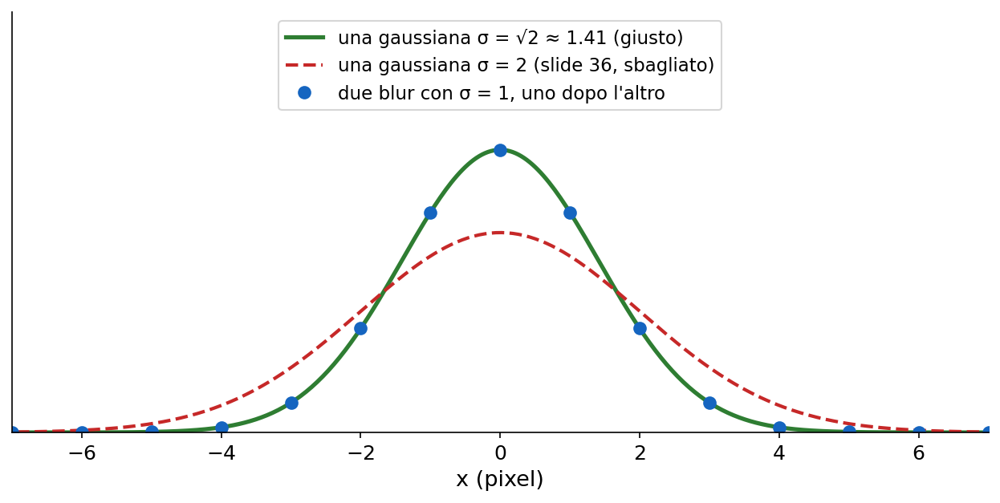

**Esempio svolto.** Da un'immagine sfocata con σ = 2 vuoi arrivare a σ = 3: serve un secondo blur con σ2 = √(9 − 4) = √5 ≈ 2.24, non 1.

Lo scale-space ha un difetto: **tiene tutte le scale a piena risoluzione**. Ma un'immagine sfocata con σ grande non ha più alte frequenze, quindi la si può campionare più rada senza aliasing (slide 38). **Il blur dello scale-space è esattamente il prefiltro della sezione 6.** Unendo le due cose si ottengono le piramidi.

> **Il punto**
> 
> Lo scale-space è l'immagine sfocata con tutte le σ. La gaussiana è l'unico kernel che non inventa strutture, e le varianze si sommano. A σ grande tenere tutti i pixel è uno spreco: da qui le piramidi.

### 9\. La piramide gaussiana

**Il problema.** Vogliamo le scale grossolane dello scale-space senza pagarle a piena risoluzione.

**L'idea.** Si parte da g0 = immagine e si ripete **"sfoca con b4, tieni un pixel ogni due per riga e per colonna"** (slide 42–44, libro § 23.4). Ogni livello è il downsampling corretto del precedente.

**La matematica.**

`gk+1 = Dk Bk gk = Gk gk`

gk è il livello k (come vettore colonna di pixel), Bk la matrice di blur (convoluzione separabile con b4), Dk la decimazione (righe dell'identità prese una sì e una no), Gk = DkBk il passo completo. Con 8 campioni, B0 è 8×8, D0 è 4×8 e G0 è 4×8 (slide 44). Nel codice: una convoluzione e uno slicing `[::2, ::2]`; a colori, canale per canale.

Tre proprietà da sapere.

  - **Lo stesso filtro piccolo simula filtri sempre più grandi.** Dopo ogni dimezzamento, i 5 tap di b4 coprono una zona doppia dell'originale. Le varianze si sommano: in pixel dell'originale, al livello l la varianza totale è σb² (4l − 1)/3, quindi la σ effettiva circa raddoppia a ogni livello. Un raddoppio di scala si chiama **ottava** (slide 40).
  - **Costa pochissima memoria.** Ogni livello ha ¼ dei pixel del precedente: 1 + ¼ + 1/16 + … = 1/(1 − ¼) = **4/3**. Tutta la piramide occupa un terzo in più dell'immagine (in 1D sarebbe il doppio).
  - **Perde informazione.** Da gk+1 non torni a gk: il dettaglio tolto dal blur è sparito (slide 48). Ai bordi, con lo zero-padding del libro, le righe di B sommano a meno di 1 e i bordi si scuriscono un po'.

**Esempio svolto.** Una foto 512×512 ha 262 144 pixel. I livelli 256², 128², 64², … aggiungono 65 536 + 16 384 + 4 096 + … ≈ 87 381: in tutto circa 349 525 numeri, cioè 4/3 dell'originale. La σ effettiva, con σb = 1: σ² = 1, 5, 21 per l = 1, 2, 3, cioè σ ≈ 1, 2.24, 4.58 pixel dell'originale. Il rapporto tende a 2 a ogni livello.

> **Il punto**
> 
> Piramide gaussiana = "sfoca con b4 e dimezza", ripetuto. Ogni livello è uno scale-space a σ circa doppia ma con un quarto dei pixel; tutta la piramide costa 4/3 dell'immagine. Però non si torna indietro.

### 10\. La piramide laplaciana

**Il problema.** La piramide gaussiana butta via il dettaglio a ogni livello. Possiamo conservarlo, separato per scala, e poter tornare all'immagine originale?

**L'idea.** A ogni livello **salvi proprio ciò che il blur ha tolto**: riporti gk+1 alla dimensione di gk e fai la differenza (slide 49, libro § 23.5). Prima la versione grossolana, poi le correzioni sempre più fini.

**La matematica.**

`lk = gk − Fk gk+1,    Fk = Bk Uk`

Uk è l'espansione (inserisce zeri), Bk lo stesso blur binomiale **con guadagno 2 per asse** (4 in 2D), per il motivo della sezione 7. Sostituendo gk+1 = Gkgk si ottiene lk = (I − FkGk) gk: ogni livello è un filtro lineare dell'immagine. **lk contiene ciò che c'è in gk ma non nel livello sopra: una banda di frequenze**, non tutte le alte. Si chiama "laplaciana" perché la differenza di due gaussiane (DoG) somiglia al laplaciano di gaussiana di [L5](https://gabriele-marsili.github.io/appunti-magistrale-ai/anno-2/computer-vision/sito/#L5): risponde sui bordi, ha media circa zero e valori di entrambi i segni (figura della sezione 9, riga in basso).

**Esempio svolto, 1D con 8 campioni.** Un gradino su e giù: g0 = \[0, 0, 16, 16, 16, 16, 0, 0\].

1.  **Blur** con \[1, 4, 6, 4, 1\]/16 (zero fuori dal segnale). Nella posizione 2: (1·0 + 4·0 + 6·16 + 4·16 + 1·16)/16 = 176/16 = 11. Tutto: B0g0 = \[1, 5, 11, 15, 15, 11, 5, 1\].
2.  **Decimazione**, posizioni 0, 2, 4, 6: g1 = \[1, 11, 15, 5\].
3.  **Espansione e blur con 2 · b4** (sezione 7): F0g1 = \[2.125, 6, 10.25, 13, 13.25, 10, 5.625, 2.5\]. È una versione liscia del gradino.
4.  **Differenza**: l0 = g0 − F0g1 = \[−2.125, −6, 5.75, 3, 2.75, 6, −5.625, −2.5\].

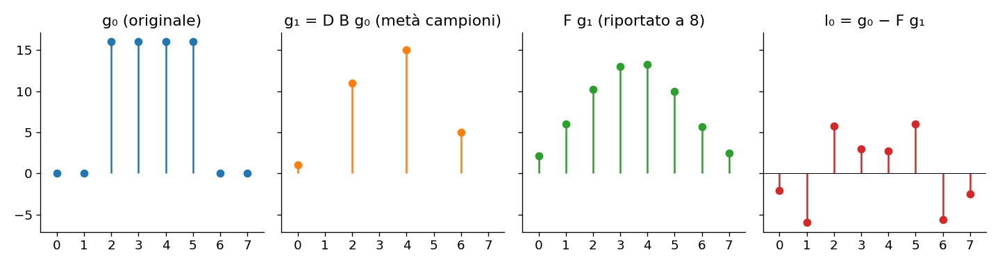

**Senza il fattore 2** avresti F0g1 circa la metà del segnale e **l0 conterrebbe metà del gradino stesso, non solo i suoi bordi**. E i livelli vanno tenuti in float, non in uint8, perché hanno segno: è uno dei due bug del notebook.

#### Invertire

Ribaltando la definizione (slide 51):

`gk = lk + Fk gk+1`

Si conserva l'ultimo livello della gaussiana (il **residuo passa-basso** gN) e si risale: espandi, sfoca, aggiungi il livello laplaciano, ripeti fino a g0. Nell'esempio: F0g1 + l0 ridà esattamente \[0, 0, 16, 16, 16, 16, 0, 0\]. Il punto da orale: **la ricostruzione è esatta qualunque filtro usi**, anche pessimo, perché lk è definito come "quello che manca"; basta che costruzione e ricostruzione usino lo stesso Fk. Il prezzo è che **la rappresentazione è sovracompleta: circa 4/3 dei numeri dell'immagine** (le wavelet, libro § 23.3, ne usano N ma tollerano male le modifiche a una banda sola). L'uso originale di Burt e Adelson (1983) era la compressione: i livelli laplaciani sono quasi tutti vicini a zero.

> **Il punto**
> 
> lk = gk − Fkgk+1 salva il dettaglio tolto a ogni livello, banda per banda. Con il residuo gN si torna all'immagine esatta, con qualunque filtro. Costa 4/3 dei pixel.

### 11\. Usare la piramide per cercare: coarse-to-fine

**Il problema.** Molti problemi cercano in uno spazio enorme: tutte le posizioni di un template, tutti gli spostamenti fra due fotogrammi. A piena risoluzione costa troppo.

**L'idea.** **Si risolve prima al livello più piccolo, dove tutto costa poco, e si usa la soluzione come punto di partenza al livello sotto, dove basta una ricerca locale** (slide 53). Come cercare una casa: prima la città sulla cartina, poi la via.

**Esempio svolto, con i numeri della figura.** Ricerca esaustiva a 256×256 con un template 32×32: 225 × 225 = 50 625 posizioni, ognuna con 1 024 confronti, circa 52 milioni di operazioni. Coarse-to-fine: al livello 2, 57 × 57 = 3 249 posizioni × 64 pixel ≈ 208 000; al livello 1, 25 × 256 = 6 400; al livello 0, 25 × 1 024 = 25 600. Totale circa 240 000: **più di 200 volte meno**. È la regola della slide 55: **scendere di un livello divide per 4 sia le posizioni sia i pixel del template, quindi il costo esaustivo cala di 16 volte per livello**.

**Flusso ottico** (slide 54): uno spostamento di 32 pixel al livello 4 è di 2 pixel, facile da stimare; poi lo si raddoppia scendendo e lo si raffina. È Lucas-Kanade piramidale; tra i metodi deep SPyNet e PWC-Net. La slide cita RAFT, che però non è coarse-to-fine (correzione nella scheda 54).

**Il rischio: se al livello grossolano scegli male, i livelli fini non correggono**, perché cercano solo vicino. Oggetti piccoli o sottili possono sparire nei livelli alti. Si mitiga tenendo più candidati.

> **Il punto**
> 
> Coarse-to-fine: ricerca completa solo dove costa poco, poi raffinamento locale livello per livello. Risparmia ordini di grandezza, ma non garantisce l'ottimo globale.

### 12\. Blending multi-banda

**Il problema.** Vuoi unire metà mela e metà arancia (slide 57), o due foto di un panorama. **Con un taglio netto si vede la cucitura.** Se sfumi la maschera su una zona larga, colori e luce si raccordano ma **le texture si sovrappongono e compaiono doppi contorni**; su una zona stretta, niente fantasmi ma si vede il salto di colore. **Nessuna larghezza va bene per tutte le frequenze.**

**L'idea** di Burt e Adelson (slide 58, libro § 23.5.1): **usare una larghezza diversa per ogni banda**. La piramide laplaciana separa già le bande; basta fonderle una per una con una maschera sempre più sfumata.

1.  piramidi laplaciane lA e lB delle due immagini;
2.  piramide **gaussiana** mk della maschera binaria m (1 dove vuoi A), con un livello in più per il residuo;
3.  fusione livello per livello, pixel per pixel: `lk = mk · lkA + (1 − mk) · lkB` e lo stesso sul residuo passa-basso;
4.  ricostruzione con gk = lk + Fkgk+1.

**Perché funziona.** Salendo nella piramide la maschera si sfoca sempre di più, ma anche le immagini sono più piccole. **Le basse frequenze (colore, illuminazione) si fondono su una zona larga, le alte (texture, bordi) su una zona stretta.** Così niente gradino di colore e niente fantasmi.

**Esempio svolto.** Pixel vicino al confine, livello 3: m3 = 0.7, l3A = 10, l3B = −4. Valore fuso: 0.7 · 10 + 0.3 · (−4) = 5.8. Al livello 0 lì la maschera è già 0 o 1: il dettaglio fine viene da una sola immagine.

È il notebook di questa lezione: leggi la sezione "Notebook" in fondo alla pagina, perché **il codice fornito ha due bug (tutto in uint8) che rovinano proprio la maschera sfumata**.

> **Il punto**
> 
> Si fondono le piramidi laplaciane banda per banda, pesando con la piramide gaussiana della maschera. Ogni banda ha una transizione larga quanto la sua scala: colori raccordati, texture senza fantasmi.

### 13\. Piramidi nelle reti

**Il problema.** Oggi detection e segmentazione si fanno con le CNN. Dove sono le piramidi?

**L'idea.** **Una CNN con stride e pooling è una piramide appresa** (slide 59): primi layer ad alta risoluzione e campo recettivo piccolo, ultimi a bassa risoluzione e campo recettivo grande. Ma **di solito manca il prefiltro, quindi può fare aliasing** (sezione 5).

Le **Feature Pyramid Networks** (slide 60, Lin et al. 2017): l'ultimo layer è troppo grossolano per gli oggetti piccoli, i primi sono precisi ma poveri di significato. FPN aggiunge un percorso top-down che porta in alta risoluzione le feature grossolane e le somma a quelle fini con connessioni laterali: lo schema di gk = lk + Fkgk+1, con Fkgk+1 il contributo dall'alto e lk quello laterale.

> **Il punto**
> 
> Le CNN sono piramidi apprese, spesso senza anti-aliasing. FPN copia la ricostruzione laplaciana per avere a ogni scala feature sia precise sia ricche di significato.

### 14\. In pratica: il codice

Piramide laplaciana e ricostruzione per un'immagine in scala di grigi, in numpy. Ogni riga corrisponde a una formula: `[::2, ::2]` è D, gli zeri sono U, `2*b4` su ogni asse è il guadagno 4 in 2D.

    import numpy as np
    from scipy.ndimage import convolve1d
    
    b4 = np.array([1, 4, 6, 4, 1]) / 16
    
    def blur(x, k=b4):                       # separabile: colonne poi righe
        return convolve1d(convolve1d(x, k, axis=0, mode='reflect'), k, axis=1, mode='reflect')
    
    def down(x):                             # G = D B
        return blur(x)[::2, ::2]
    
    def up(x, shape):                        # F = B U, guadagno 2 per asse
        z = np.zeros(shape); z[::2, ::2] = x
        return blur(z, 2 * b4)
    
    def laplacian_pyramid(img, levels):
        g = [img.astype(float)]; l = []      # float: i livelli hanno segno
        for _ in range(levels):
            g.append(down(g[-1]))
            l.append(g[-2] - up(g[-1], g[-2].shape))
        return l, g[-1]                      # bande + residuo passa-basso
    
    def reconstruct(l, base):
        for lk in reversed(l):
            base = lk + up(base, lk.shape)
        return base
    
    img = np.random.rand(256, 256)
    l, base = laplacian_pyramid(img, 5)
    print(np.abs(reconstruct(l, base) - img).max())   # ~1e-16: esatta

Per vedere l'aliasing: confronta `img[::4, ::4]` con `down(down(img))` su una foto con righe fini. Le figure delle piramidi qui sopra sono fatte con queste funzioni.

### Il riassunto in 10 righe

1.  Campionare a passo Ts = moltiplicare per un pettine; in frequenza lo spettro si copia ogni fs = 1/Ts.
2.  Nyquist-Shannon: se fs \> 2fmax le copie non si toccano e il segnale si ricostruisce (con le sinc; in pratica box, triangolo, Lanczos).
3.  Se no, le copie si sommano: una frequenza f0 appare come |f0 − k fs| ≤ fs/2. È l'aliasing, e non si disfa.
4.  Decimare di k: ogni coefficiente della DFT ridotta è la media di k² coefficienti dell'originale.
5.  Downsampling corretto = passa-basso con taglio a circa π/k, poi decimazione. Ideale: ringing; binomiale/gaussiano: un po' di aliasing residuo, niente aloni.
6.  Upsampling = zeri + interpolazione con guadagno 2 per asse; non aggiunge dettaglio.
7.  Scale-space: L(x, y; σ) = gσ ∗ I; la gaussiana è l'unico kernel che non crea struttura; le varianze si sommano.
8.  Piramide gaussiana: gk+1 = D B gk con b4, memoria 4/3, σ circa doppia a ogni livello.
9.  Laplaciana: lk = gk − F gk+1, inversa gk = lk + F gk+1, esatta con qualsiasi filtro.
10. Usi: coarse-to-fine (template matching, flow), blending multi-banda, CNN e FPN come piramidi apprese.

### Verifica di aver capito

**Un ventilatore con una sola pala dipinta di rosso fa 11 giri al secondo e lo filmi a 12 fotogrammi al secondo. Cosa vedi?**

Fra due fotogrammi la pala fa 11/12 di giro, che per la camera è indistinguibile da −1/12 di giro. Si vede quindi il ventilatore ruotare lentamente **all'indietro**, a 1 giro al secondo: |11 − 12| = 1, la formula fvista = |f0 − k fs| con k = 1 (è il punto blu nella figura del ripiegamento). Per vederlo girare correttamente servirebbero più di 22 fotogrammi al secondo.

**Segnale di 8 campioni ℓ\[n\] = cos(2π · 3n/8), decimato di 2 senza filtro. Che frequenza ottieni, e cosa avrebbe dovuto fare un buon prefiltro?**

Ottieni un coseno di frequenza 1 su 4 campioni, perché L↓2\[u\] = ½ (L\[u\] + L\[u + 4\]) porta il picco in 5 (cioè −3) nella posizione 1. La nuova Nyquist è 2, e 3 \> 2. Un prefiltro con taglio a N/4 = 2 avrebbe dovuto eliminare quel coseno: il risultato corretto è un segnale (quasi) costante, non un coseno inventato.

**Hai sfocato un'immagine con σ = 3 e la vuoi a σ = 5. Con che σ devi sfocare ancora?**

Le varianze si sommano: 25 = 9 + σ2², quindi σ2 = 4. Chi sommasse le σ (come la slide 36) risponderebbe 2, e otterrebbe in realtà σ = √13 ≈ 3.6.

**Perché, nel costruire la laplaciana, il blur dopo l'espansione va moltiplicato per 4 in 2D?**

Inserire zeri lascia un pixel su quattro diverso da zero, quindi la media dell'immagine espansa è un quarto di quella originale. Un filtro con somma 1 non cambia la media, quindi bisogna compensare con guadagno 2 per asse. Senza, F gk+1 sarebbe troppo scuro e lk conterrebbe una copia attenuata dell'immagine, non solo i dettagli.

**La ricostruzione dalla laplaciana è esatta anche se usi un filtro scadente, ad esempio un box 3×3. Perché?**

Perché lk = gk − Fkgk+1 è per definizione ciò che manca a Fkgk+1: rifacendo Fkgk+1 + lk con lo stesso Fk torni a gk. Il filtro cambia la qualità delle bande, non l'invertibilità. Serve però conservare il residuo gN.

**Nel blending multi-banda, perché si usa la piramide gaussiana della maschera e non la sua laplaciana?**

Perché la maschera serve come peso fra 0 e 1 a ogni livello, e deve essere sempre più sfumata salendo di livello: è quello che fa la gaussiana. Così ogni banda viene fusa su una zona proporzionale alla sua scala: transizione larga per colori e luce, stretta per texture e bordi. La laplaciana della maschera sarebbe nulla quasi ovunque e non darebbe pesi.

### Come proseguire

  - [Cap. 20, Sampling and Aliasing](https://visionbook.mit.edu/sampling_and_aliasing.html): § 20.2–20.5 (aliasing, treno di delta, ricostruzione con sinc, filtro anti-aliasing). Corrisponde alle sezioni 2–4 qui sopra.
  - [Cap. 21, Downsampling and Upsampling](https://visionbook.mit.edu/upsamplig_downsampling_2.html): § 21.2–21.3 (attacco, decimazione nella DFT, filtri anti-aliasing) e § 21.4.3–21.4.5 (espansione e guadagno). Sezioni 5–7.
  - [Cap. 23, Image Pyramids](https://visionbook.mit.edu/pyramids_new_notation.html): § 23.4–23.5.1 (gaussiana, laplaciana, blending); § 23.3 e 23.6 se vuoi capire wavelet e steerable pyramid, che servono in [L7](https://gabriele-marsili.github.io/appunti-magistrale-ai/anno-2/computer-vision/sito/#L7). Sezioni 9–12.
  - Per scale-space e composizione delle gaussiane: [cap. 17](https://visionbook.mit.edu/blurring_2.html), § 17.3.2 e 17.4.1 (già di L5). Sezione 8.

Ora ripassa con le schede qui sotto, slide per slide: hanno le correzioni alle slide 35, 36, 49 e 54, le note sulla notazione della slide 11, i riquadri "Dal libro" e, in fondo, la sezione "Studia dal libro", la guida allo studio e il notebook `06-image-blending` con i due bug spiegati.
