# L7 · Lab Fourier 2D

*Lezione 7 · Antonio Carta · laboratorio, settembre 2026*

[Versione interattiva sul sito, con videolezione](https://gabriele-marsili.github.io/appunti-magistrale-ai/anno-2/computer-vision/sito/#L7) · [Indice della dispensa](README.md)

**In una frase:** **un'immagine è una somma di onde 2D**, e guardare quali onde contiene (lo spettro) permette di sfocarla, ripulirla e comprimerla con una sola moltiplicazione; ma Fourier dice *cosa* c'è e non *dove*, e per riconoscere oggetti servono filtri piccoli e localizzati seguiti da una non linearità e da un pooling: **è esattamente uno strato di CNN, con i filtri scelti a mano invece che appresi**.

### Prima di iniziare

Lezione di laboratorio: niente slide, due notebook, `demo.ipynb` (Fourier sulle immagini) e `filter_bank.ipynb` (classificare vestiti con banchi di filtri), che mettono alla prova la teoria delle lezioni precedenti. Ti servono:

  - dalla [L3](https://gabriele-marsili.github.io/appunti-magistrale-ai/anno-2/computer-vision/sito/#L3): la convoluzione e il teorema di convoluzione (convolvere nello spazio = moltiplicare le trasformate);
  - dalla [L4](https://gabriele-marsili.github.io/appunti-magistrale-ai/anno-2/computer-vision/sito/#L4): la FFT in numpy, `fftfreq`, lo spettro in scala log, lo spectral leakage;
  - dalla [L5](https://gabriele-marsili.github.io/appunti-magistrale-ai/anno-2/computer-vision/sito/#L5): il blur gaussiano, Sobel, il laplaciano, le derivate della gaussiana;
  - dalla [L6](https://gabriele-marsili.github.io/appunti-magistrale-ai/anno-2/computer-vision/sito/#L6): aliasing e piramidi (il pooling è un sottocampionamento);
  - da machine learning di base: classificatore lineare, training, validazione e test.

Le schede sotto seguono i notebook (1–13 `demo`, 14–29 `filter_bank`); questa dispensa segue l'ordine dei concetti. Mentre leggi i notebook guarda gli `assert`: dicono quale teorema ogni cella verifica.

### Guarda prima questi video

  - [Fourier Transform](https://www.youtube.com/watch?v=tEzgtbnbXgQ) (Video). Shree Nayar, First Principles of Computer Vision (Columbia). Tutto: dalla trasformata 1D a quella 2D, con lo spettro di onde orientate. Per le sezioni 1–3.
  - [Image Filtering in Frequency Domain](https://www.youtube.com/watch?v=OOu5KP3Gvx0) (Video). Shree Nayar. Passa-basso ideale e gaussiano, ringing, passa-alto. Tutto.
  - [Image Compression and the FFT](https://www.youtube.com/watch?v=gGEBUdM0PVc) (Video). Steve Brunton. Tenere i coefficienti più grandi e ricostruire: l'esercizio 2 di demo. Facoltativo.
  - [Lecture 5 | Convolutional Neural Networks](https://www.youtube.com/watch?v=bNb2fEVKeEo) (Video). Stanford CS231n (2017). Dopo la sezione 14: la parte su layer convoluzionale e pooling, dove riconoscerai la pipeline di filter\_bank.

### 1 · Un'immagine è una somma di onde

**Il problema.** Molte cose che vogliamo fare a una foto si descrivono con "quanto varia velocemente": sfocare (togliere le variazioni rapide), estrarre i dettagli (tenere solo quelle), togliere un disturbo a righe, comprimere. Nello spazio dei pixel queste operazioni sono convoluzioni, spesso con kernel grandi. Esiste un sistema di coordinate in cui diventano una semplice moltiplicazione: quello delle frequenze.

**L'idea.** Un'**onda 2D è un'immagine a strisce**: un coseno che varia lungo una direzione ed è costante lungo quella perpendicolare. Ha una **frequenza** (quanto sono fitte le strisce) e un'**orientazione**. Fourier dice che **ogni immagine H × W è la somma di H·W onde di questo tipo**, ciascuna con la sua ampiezza e il suo sfasamento. Lo spettro è la ricetta: quali onde, in che dose.

**La matematica.** La DFT 2D, nella convenzione di numpy e del libro (eq. 16.2):

`F[v, u] = ∑y=0H−1 ∑x=0W−1 f[y, x] · e−2πj (u x/W + v y/H)`

  - **f\[y, x\]**: il pixel in riga y e colonna x (valori in \[0, 1\] nel notebook).
  - **u, v**: interi, quanti periodi interi compie l'onda in orizzontale e in verticale nell'immagine. In cicli per pixel la frequenza è (fx, fy) = (u/W, v/H), fra −0.5 e 0.5.
  - **e−2πj(…)**: l'esponenziale complesso, cioè un coseno e un seno insieme (formula di Eulero). La somma è un prodotto scalare: misura quanto l'immagine "somiglia" a quell'onda.
  - **F\[v, u\]**: un numero complesso. Il **modulo |F| dice quanto pesa l'onda, la fase ∠F dove stanno le sue creste**.

L'inversa è la stessa somma con il segno + e un fattore 1/(HW): `ifft2(fft2(img))` ridà l'immagine con errore 10−16 (scheda 4). Due conseguenze immediate:

  - **Componente continua (DC).** Con u = v = 0 l'esponenziale vale 1, quindi **F\[0, 0\] = somma dei pixel**; diviso per HW è la media (0.398 per il cameraman).
  - **Parseval.** **L'energia si conserva**: ∑ f2 = (1/HW) ∑ |F|2 (16143.14 da entrambi i lati nel notebook). Quindi "quanta energia sta in certe frequenze" ha senso, e servirà per comprimere.

**Esempio svolto.** Un'immagine 256 × 256 con g\[y, x\] = cos(2π(12x/256 + 8y/256)), il reticolo obliquo della scheda 3. Per Eulero cos θ = ½ ejθ + ½ e−jθ, quindi g è la somma di due esponenziali, con (u, v) = (12, 8) e (−12, −8). Gli esponenziali sono ortogonali fra loro: ciascuno accende solo il proprio coefficiente, con valore ½ · HW = ½ · 65536 = **32768**. Tutti gli altri valgono 0. È ciò che verifica l'assert della scheda 3. Tre cose da ricordare:

  - **un'onda reale dà due picchi simmetrici** rispetto al centro (in generale, per ogni immagine reale F\[−v, −u\] è il coniugato di F\[v, u\]);
  - la distanza dei picchi dal centro è la frequenza: strisce più fitte, picchi più lontani;
  - la direzione dei picchi è **perpendicolare alle strisce**: strisce verticali (variano lungo x) danno picchi sull'asse orizzontale.

> **Il punto**
> 
> La DFT riscrive l'immagine come somma di onde: ogni coefficiente è una frequenza (u, v), con un modulo (quanto pesa) e una fase (dove sta). Un coseno puro sono due punti simmetrici nello spettro.

### 2 · Leggere lo spettro di una foto

**Il problema.** Disegni `np.fft.fft2` del cameraman e vedi quattro macchie negli angoli e una croce. Cosa stai guardando?

**L'idea.** Confondono due cose: l'ordine in cui numpy salva le frequenze, e il fatto che la DFT vede l'immagine come una piastrella ripetuta all'infinito.

**Dove sono le frequenze nell'array.** `fft2` restituisce un array H × W in cui la riga r corrisponde a v = r per r \< H/2 e a v = r − H per le altre: prima la DC, poi le frequenze positive, poi quelle **negative**. Per esempio `fftfreq(10)` = \[0, 0.1, 0.2, 0.3, 0.4, −0.5, −0.4, −0.3, −0.2, −0.1\]. Quindi **le basse frequenze stanno ai quattro angoli dell'array** (scheda 2). Regola pratica: **`fftshift` serve per guardare, le maschere si costruiscono sulle griglie di `fftfreq`**, che sono già nell'ordine giusto e si moltiplicano per `fft2(img)` senza shift. Lo spettro si disegna come log(1 + |F|) perché i valori vanno da 104 a quasi 0.

**Leakage e croce.** Se la frequenza non è intera (u = 12.5), l'onda non chiude un numero intero di periodi. La DFT, che ripete l'immagine periodicamente, trova un salto al bordo e **l'energia si spalma su molti coefficienti**: 256 sopra l'1% del massimo invece di 2. È il leakage della [L4](https://gabriele-marsili.github.io/appunti-magistrale-ai/anno-2/computer-vision/sito/#L4). Lo stesso motivo spiega la **croce luminosa sugli assi** nello spettro del cameraman: il bordo sinistro non combacia con il destro né il superiore con l'inferiore, e quei salti sono bordi verticali e orizzontali "finti".

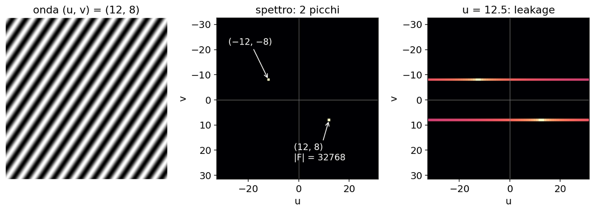

**La forma tipica.** Per le foto lo spettro ha sempre la stessa forma: massimo al centro e decadimento con la distanza, circa come a/(u2+v2)b (§ 16.9 del libro). **Le basse frequenze contengono quasi tutta l'energia**: questo fatto da solo spiega perché funzionano sia il passa-basso sia la compressione.

> **Il punto**
> 
> In `fft2` la DC è nell'angolo e le frequenze negative sono in fondo; `fftshift` serve solo per disegnare. La croce sugli assi viene dai bordi non periodici, non dal contenuto della foto.

### 3 · Modulo e fase: dove sta la posizione

**Il problema.** Se sposto il soggetto di una foto, cosa cambia nello spettro? Un'auto a guida autonoma vede lo stesso pedone un metro più in là: quale parte dei numeri di Fourier se ne accorge?

**L'idea.** Spostare l'immagine sposta ogni onda della stessa quantità. Spostare un coseno vuol dire cambiarne la fase, non l'ampiezza. Quindi **il modulo dice quali strutture ci sono, la fase dice dove sono**.

**La matematica.** È il **teorema di traslazione** (§ 16.7.6): spostare di (dy, dx) pixel moltiplica ogni coefficiente per un fattore di modulo 1.

`f[y − dy, x − dx] ⟷ F[v, u] · e−2πj (fy dy + fx dx)`

A parole: il modulo non cambia, la fase diminuisce di 2π(fxdx + fydy), una "rampa" lineare nella frequenza. La scheda 5 lo verifica.

**Esempio svolto.** Sposto di dx = 1 pixel un'immagine 256 × 256. L'onda u = 64 ha fx = 64/256 = 0.25 cicli/pixel: la sua fase cambia di 2π · 0.25 · 1 = π/2, un quarto di periodo, proprio perché un pixel è un quarto del suo periodo di 4 pixel. L'onda u = 1 (periodo 256 pixel) ruota invece solo di 2π/256: lo stesso spostamento pesa poco per le onde lente e molto per quelle rapide.

Il libro mostra quanto conta la fase scambiando le fasi di due immagini (fig. 16.14): **il risultato somiglia all'immagine che ha dato la fase**.

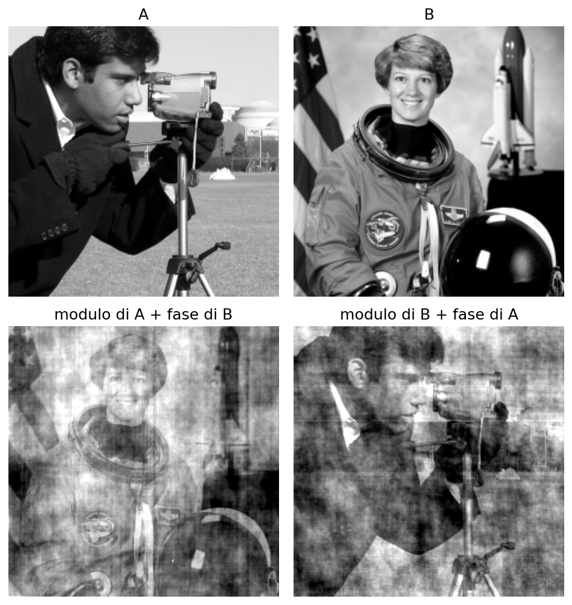

> **Attenzione: vale solo per lo shift circolare (scheda 5)**
> 
> "Lo shift cambia solo la fase" è esatto per `np.roll`, dove ciò che esce a destra rientra a sinistra. **Se la camera si sposta davvero entrano pixel nuovi ed escono pixel vecchi, e il modulo cambia** (del 22% nell'esempio verificato).

> **Il punto**
> 
> Una traslazione moltiplica lo spettro per una rampa di fase e lascia il modulo invariato. La posizione delle cose sta nella fase.

### 4 · Filtrare = moltiplicare, e il problema dei bordi

**Il problema.** Vogliamo sfocare un'immagine con un kernel grande: nello spazio servono molte moltiplicazioni per ogni pixel. C'è una scorciatoia?

**L'idea.** Dalla [L3](https://gabriele-marsili.github.io/appunti-magistrale-ai/anno-2/computer-vision/sito/#L3): **convolvere nello spazio equivale a moltiplicare le trasformate**. Quindi un filtro lineare si può progettare direttamente come una **maschera M\[v, u\] che dice, per ogni frequenza, quanto tenerla**: 1 intatta, 0 eliminata. Il filtraggio diventa una riga: `np.fft.ifft2(F * M).real`.

**Il prezzo.** Il teorema vale per la convoluzione **circolare**: la DFT tratta l'immagine come una piastrella che si ripete, quindi a sinistra del bordo sinistro "c'è" il bordo destro. Nello spazio questa scelta si chiama `boundary="wrap"` (scheda 6), e ce ne sono altre due.

  - **fill** (zeri fuori): **scurisce i bordi**, perché la media include pixel neri inesistenti.
  - **wrap** (periodica): unisce i lati opposti; è **ciò che fa implicitamente il filtraggio con la FFT**.
  - **symm** (specchio, ripetendo il pixel di bordo): **la più neutra per le foto**.

**Esempio svolto (scheda 6).** Il notebook sfoca un quadrato 16 × 16, metà bianco e metà nero, con una gaussiana σ = 3. L'angolo bianco in alto a sinistra, che dovrebbe restare vicino a 1, vale 0.318 con fill, 0.563 con wrap e 0.993 con symm. Con la FFT vedrai fasce sbagliate lungo i bordi; il rimedio è fare padding prima e ritagliare dopo.

> **Il punto**
> 
> Un filtro lineare in frequenza è una maschera moltiplicata per lo spettro. Però la FFT fa sempre convoluzione circolare (`wrap`): i bordi opposti si mescolano.

### 5 · Passa-basso ideale contro gaussiano: il ringing

**Il problema.** Vogliamo sfocare tenendo solo le frequenze basse. La scelta più ovvia è "tieni tutto sotto una soglia, butta il resto". Funziona?

**L'idea.** No: **un taglio netto in frequenza crea onde nello spazio**. Un taglio morbido, a forma di gaussiana, sfoca senza artefatti.

**Le due maschere.** La maschera **ideale** vale 1 dentro un disco di raggio 0.08 cicli/pixel e 0 fuori. La maschera **gaussiana** è

`M(f) = exp(−2π2 σ2 |f|2),   |f| = √(fx2 + fy2)`

dove σ (in pixel) è la deviazione standard del blur gaussiano corrispondente: **questa maschera è proprio la trasformata di un blur gaussiano**. In frequenza la sua larghezza è σf = 1/(2πσ): con σ = 2, σf = 1/(4π) ≈ 0.080, la stessa del disco ideale. Il confronto è equo: stessa larghezza, forma diversa. Regola da ricordare: **largo nello spazio ⇔ stretto in frequenza**.

**Perché succede.** Il filtro nello spazio è la trasformata inversa della maschera. Un rettangolo in frequenza diventa nello spazio una sinc (in 2D la sua versione radiale, con la funzione di Bessel): un kernel esteso e con **lobi negativi**. Un kernel con pesi negativi non è più una media pesata: vicino a un bordo "sottrae" i pixel dell'altro lato e crea onde. È il **ringing (fenomeno di Gibbs)**. La gaussiana invece ha trasformata gaussiana, **positiva ovunque: l'uscita resta fra i valori di partenza**.

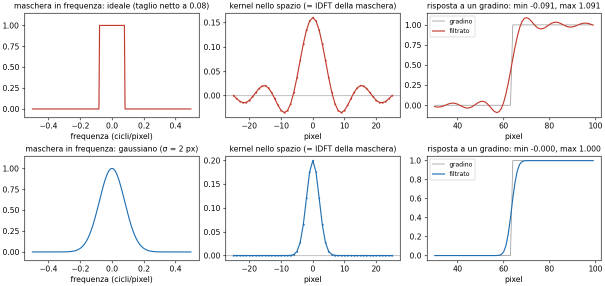

**Esempio svolto (scheda 8).** Una fascia bianca su fondo nero filtrata con la maschera ideale va da −0.091 a 1.091: supera il bianco del 9% e scende sotto il nero. Con la gaussiana resta fra 0 e 1. Per questo in pratica ([L5](https://gabriele-marsili.github.io/appunti-magistrale-ai/anno-2/computer-vision/sito/#L5), [L6](https://gabriele-marsili.github.io/appunti-magistrale-ai/anno-2/computer-vision/sito/#L6)) si sfoca con gaussiane o binomiali.

**Il passa-alto.** Con la maschera complementare 1 − M si ottiene ciò che il passa-basso ha tolto: **falto = f − fbasso** (scheda 9; l'assert verifica che le due parti sommate ridiano l'immagine). Il residuo ha media zero, perché la maschera gaussiana vale 1 in DC. Contiene contorni, texture fine *e* rumore insieme: **un filtro lineare non sa separarli, perché occupano le stesse frequenze**. È lo stesso passo che costruisce un livello della piramide laplaciana della [L6](https://gabriele-marsili.github.io/appunti-magistrale-ai/anno-2/computer-vision/sito/#L6).

> **Il punto**
> 
> Taglio netto in frequenza = kernel con lobi negativi = aloni (ringing, overshoot 9%). La gaussiana sfoca senza artefatti perché resta una media pesata positiva.

### 6 · Togliere un disturbo periodico: il filtro notch

**Il problema.** Una foto scansionata da una rivista, o un'immagine con un'interferenza elettrica, è coperta da righe regolari. Sfocarla toglie le righe ma rovina la foto.

**L'idea.** Un disturbo periodico è un'onda: nello spazio è ovunque, ma **nello spettro sono due soli punti**, di solito lontani dal centro dove sta l'energia della foto. Basta spegnere quei due punti.

Il notebook (schede 10–11) aggiunge al cameraman un'onda di ampiezza A = 0.2 con (kx, ky) = (37, 21). Il **filtro notch è una maschera che vale 1 ovunque tranne due piccoli buchi** gaussiani (larghezza 1 bin) centrati sui picchi.

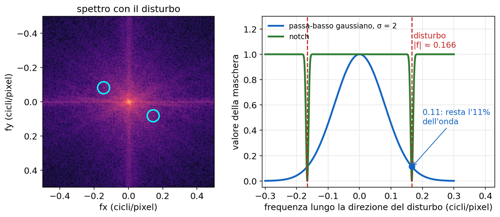

**Esempio svolto: i tre errori quadratici medi (MSE).**

  - Immagine corrotta: l'errore è la potenza media dell'onda, A2/2 = 0.04/2 = **0.020** (la media di cos2 è ½). Il notebook stampa 0.020000.
  - Notch: tocca pochissimi coefficienti della foto, MSE **0.000001**.
  - Passa-basso gaussiano σ = 2: la frequenza del disturbo è |f| = √((37/256)2 + (21/256)2) = √(0.0209 + 0.0067) ≈ 0.166; lì la maschera vale exp(−2π2 · 4 · 0.0276) = exp(−2.18) ≈ **0.11**. **Resta l'11% dell'onda e in più la foto è sfocata**: MSE 0.0049.

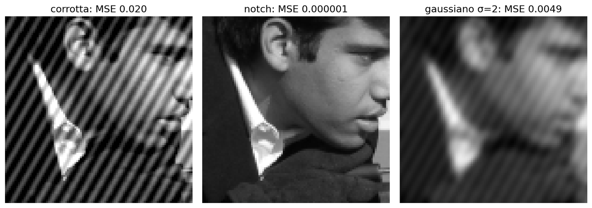

Un dettaglio: **vanno tolti entrambi i picchi**, altrimenti resta metà dell'onda e la ricostruzione diventa complessa.

**Passo passo: l'esercizio 1 (scheda 12).** Stesso problema, ma la frequenza del disturbo è ignota. L'algoritmo:

1.  calcola lo spettro della foto osservata;
2.  azzera le basse frequenze (|f| \< 0.05), perché lì il massimo è sempre la DC;
3.  trova il picco con `argmax` e converti l'indice in frequenza con `fftfreq`;
4.  applica il notch in quel punto e nel suo simmetrico.

Nel notebook il picco cade in (ky, kx) = ±(−43, 29) e l'MSE passa da 0.0162 a 1.8·10−6 (gaussiano: 0.0034).

> **Il punto**
> 
> Il passa-basso non è un buon denoiser in generale. Ma quando il disturbo occupa frequenze dove la foto non ha quasi nulla, si toglie chirurgicamente spegnendo quei coefficienti: è il filtro notch.

### 7 · Comprimere: tenere i coefficienti più grandi

**Il problema.** Una foto 256 × 256 sono 65536 numeri: servono tutti per riconoscerla? È la domanda dietro JPEG e dietro le foto che Instagram comprime.

**L'idea.** Lo spettro decade in fretta: pochi coefficienti grandi portano quasi tutta l'energia. **Teniamo solo i coefficienti di modulo più grande**, azzeriamo gli altri e ricostruiamo (esercizio 2, scheda 13, che rifà la fig. 16.8 del libro).

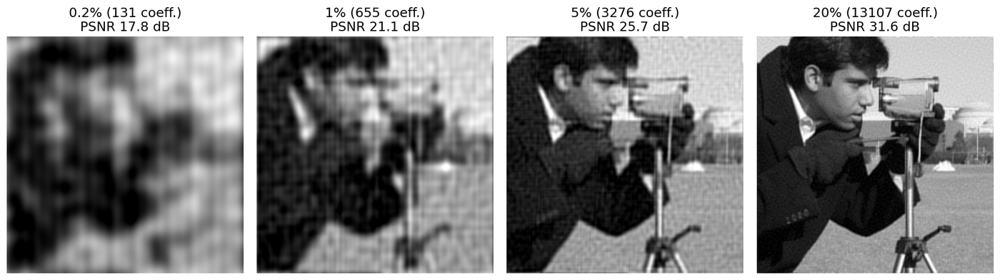

**La matematica.** Perché proprio i più grandi? Le onde di Fourier formano una **base ortogonale**; per Parseval l'errore quadratico della ricostruzione è (a meno di 1/HW) la somma dei |F|2 scartati. Per avere l'errore minimo con n coefficienti si scartano i più piccoli: **è la migliore approssimazione ai minimi quadrati con n onde**. La qualità si misura con il PSNR (rapporto segnale/rumore di picco), per immagini in \[0, 1\]:

`PSNR = 10 · log10(1 / MSE) dB`

**Esempio svolto.** Tenendo l'1% dei coefficienti (655 su 65536) il notebook trova MSE = 0.00776: PSNR = 10 · log10(1/0.00776) = 10 · log10(128.9) ≈ **21.1 dB**. Quei 655 coefficienti tengono circa il 97% dell'energia. Al 20% (13107 coefficienti) MSE = 0.00068 e PSNR ≈ 31.6 dB.

**Gli artefatti forti sono onde su tutta l'immagine**: un coefficiente buttato via toglie un'onda ovunque, anche dove la foto è liscia. Per questo JPEG trasforma separatamente blocchi 8 × 8.

> **Attenzione: la ricostruzione non è sempre esattamente reale (scheda 13)**
> 
> In teoria i due coefficienti di una coppia coniugata hanno lo stesso modulo ed entrano o escono insieme. In pratica i moduli possono differire nell'ultima cifra e la soglia può tagliarne uno solo: al 5% la parte immaginaria di `ifft2` arriva a 8·10−4. La versione pulita confronta i moduli arrotondati o tiene sempre le coppie.

> **Il punto**
> 
> Tenere gli n coefficienti di modulo più grande è la compressione ottima ai minimi quadrati; poiché lo spettro delle foto decade in fretta, l'1% dei coefficienti basta a riconoscere il soggetto.

### 8 · Dal "cosa" al "dove": la pipeline del banco di filtri

**Il problema.** Ora cambiamo compito: non pulire un'immagine, ma *riconoscere* cosa contiene. Lo spettro aiuta poco. Il libro chiude il capitolo su Fourier così: la trasformata "ci dice qualcosa su cosa succede nell'immagine, ma niente su dove succede" (§ 16.11). **Ogni coefficiente dipende da tutti i pixel**; all'altro estremo, un pixel dice dove ma non cosa.

**L'idea.** Una via di mezzo: misurare **localmente** quanta struttura c'è a una certa scala e orientazione. Lo strumento è un **banco di filtri: un insieme di kernel piccoli, ciascuno sensibile a un tipo di struttura** (bordo verticale, bordo a 45°, linea sottile, blob), applicati in ogni posizione.

Il compito del notebook è **Fashion-MNIST**: immagini 28 × 28 in scala di grigi di 10 tipi di capi (T-shirt, pantalone, pullover, vestito, cappotto, sandalo, camicia, sneaker, borsa, stivaletto). Training 20000 immagini, validazione 10000, test 10000. Il classificatore è fisso (ridge lineare); cambiano solo le feature (scheda 14):

`x → x ∗ wk → ρ(x ∗ wk) → P(ρ(x ∗ wk)) → classificatore lineare`

  - **x ∗ wk**: l'immagine convoluta con il k-esimo filtro del banco; uscita 28 × 28 (`mode="same"`).
  - **ρ**: una **non linearità applicata pixel per pixel**: valore assoluto |r|, quadrato r2, oppure max(r, 0) (la ReLU).
  - **P**: **pooling, la media (o il massimo) su blocchi p × p non sovrapposti**. Con p = 4 la mappa 28 × 28 diventa 7 × 7.

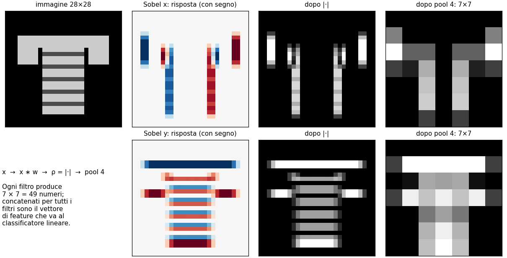

**Esempio svolto: quante feature?** Le mappe di tutti i filtri vengono appiattite e concatenate, quindi **numero di feature = numero di filtri × (28/p)2**. Con 7 filtri e pool 4: 7 × 72 = 7 × 49 = 343. Con gli stessi 7 filtri e pool 1: 7 × 784 = 5488.

Il punto di partenza (scheda 17) è il filtro identità senza non linearità e senza pooling, cioè i 784 pixel grezzi: **81.3%**. La baseline (identità, box, Sobel x e y, con |·| e pool 4) arriva all'**83.8%** con 196 feature: **quattro volte meno dei pixel e 2.5 punti meglio** (scheda 18).

> **Attenzione: "ReLU" non esiste nel dizionario (scheda 16)**
> 
> Il testo elenca la non linearità `'ReLU'`, ma nel codice la chiave è `'rectify'`: `nonlinearity="ReLU"` dà `KeyError`.

> **Il punto**
> 
> Un banco di filtri descrive un'immagine con "quanta struttura di ogni tipo c'è in ogni zona": convoluzione, non linearità, pooling, poi un classificatore lineare.

### 9 · Perché la non linearità è indispensabile

**Il problema.** Perché non dare al classificatore direttamente le risposte dei filtri, senza ρ? È il ragionamento più importante del notebook e **una domanda d'esame quasi certa**.

**L'idea.** Convoluzione e pooling medio sono lineari: senza ρ la catena è solo un'altra combinazione lineare dei pixel, e nella media i bordi positivi e negativi si annullano.

**La matematica.** Senza ρ la catena si scrive z = A x, con A una matrice fissata (enorme ma fissata). Il classificatore lineare calcola un punteggio

`s = wT z = wT A x = (AT w)T x`

che è ancora un classificatore lineare sui pixel, con pesi ATw. **Aggiungere filtri lineari, anche mille, non allarga la famiglia di funzioni**: può solo restringerla, se A perde informazione (come fa il pooling).

**Esempio svolto (scheda 23).** Con 7 filtri, nessuna non linearità e pool 1 (5488 feature, sette volte i pixel) si ottiene **0.8127** contro 0.8128 dei pixel: tutte quelle feature sono combinazioni lineari degli stessi 784 pixel. Con pool 4 si scende a 0.8091. Con ρ = |·| lo stesso banco arriva a **0.864**.

**Cosa fa ρ, intuitivamente.** Rende la feature **indipendente dalla polarità del bordo** e fa sì che il pooling misuri "quanto bordo c'è in questa zona", invece di una media in cui bordi positivi e negativi si annullano. Confronto con pool 4: none 0.809, abs 0.864, rectify 0.865, square 0.847. **Il quadrato fa peggio perché esalta i valori grandi**: pochi bordi molto contrastati dominano le feature.

> **Attenzione: il pooling medio non è una non linearità (scheda 14)**
> 
> Il notebook scrive che per questo "we have a nonlinearity and pooling". **Il pooling medio è lineare** (un blur box seguito da sottocampionamento), quindi da solo non risolve nulla: lo risolve ρ. Il max pooling invece è non lineare.

> **Il punto**
> 
> Senza ρ, filtri + pooling medio + classificatore lineare = un classificatore lineare sui pixel: non si possono battere i pixel grezzi. La non linearità (|·| o ReLU) è ciò che rende utili i filtri.

### 10 · Il pooling: invarianza contro posizione

**Il problema.** Lo stesso pantalone, spostato di un pixel, deve restare un pantalone. Ma il vettore delle risposte cambia: per un classificatore lineare è un'altra immagine.

**L'idea.** La convoluzione è **equivariante** alla traslazione: se l'oggetto si sposta di un pixel, la mappa di risposta si sposta di un pixel. Il pooling converte l'equivarianza in **invarianza** locale: **se il bordo resta dentro lo stesso blocco, la feature non cambia** (§ 24.3.1 del libro).

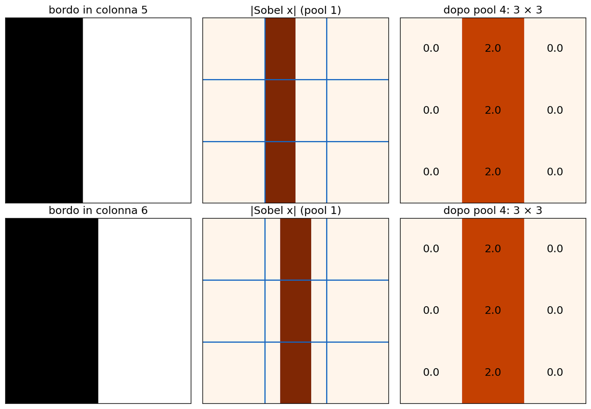

**Il prezzo.** Il pooling inoltre **riduce il numero di feature e il rumore**. Ma **perde la posizione**: con un blocco 28 × 28 resta un numero per filtro ("quanti bordi verticali ci sono"), senza sapere dove.

**Esempio svolto (scheda 24).** Con i 7 filtri e |·|: pool 1 → 0.864, **pool 2 → 0.881**, pool 4 → 0.864, pool 7 → 0.818, pool 14 → 0.703, pool 28 → 0.524. **C'è una scala giusta**: su capi 28 × 28 centrati i dettagli utili sono di pochi pixel, e blocchi 2 × 2 tolgono la variabilità di un pixel senza confondere le zone.

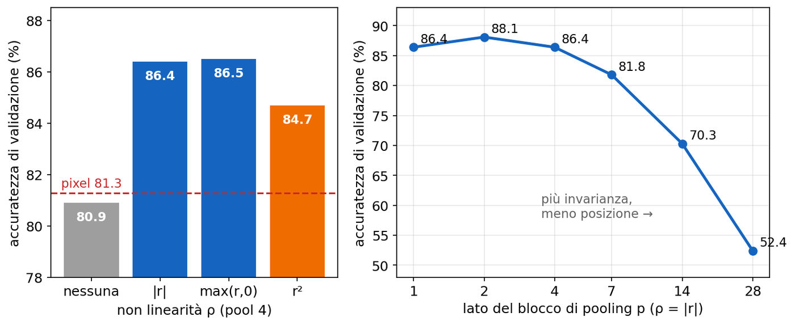

**Due varianti (scheda 25).** Il **max pooling** fa peggio della media (0.853 contro 0.864): tiene solo la risposta più forte del blocco ed è più sensibile al rumore. La **radice** delle feature (`power=0.5`) guadagna quasi un punto (0.872) comprimendo i valori grandi: **conta più *se* c'è struttura che *quanto* è contrastata**. Ricorda anche che il pooling medio con passo p è un blur box più sottocampionamento: **vale l'aliasing della L6**.

> **Attenzione: show\_responses usa sempre pool 4 (scheda 16)**
> 
> La funzione disegna le mappe con `reshape(7, 7)` qualunque sia `pool_size`: cambiando il pooling le figure non cambiano. Per vederle va passata la dimensione e usato `reshape(28//p, 28//p)`.

> **Il punto**
> 
> Il pooling scambia posizione con tolleranza agli spostamenti. Troppo piccolo non tollera nulla, troppo grande butta via il "dove": qui l'ottimo è a 2.

### 11 · Quali filtri: orientazioni, scale e filtri casuali

**Il problema.** Fissati ρ e pooling, conviene aggiungere filtri? Quali?

**L'idea.** Ogni famiglia aggiunge un tipo di informazione: **più orientazioni e più scale aiutano**, con guadagni che calano.

  - **Diagonali e laplaciano** (scheda 19). Le due Sobel diagonali aggiungono orientazioni che x e y non coprono (colletti a V, spalle): +2.2 punti. Il laplaciano è isotropo (risponde ai bordi di ogni orientazione senza dire quale): +1.0. Tutti e due: 0.864.
  - **Derivate gaussiane a più scale** (scheda 20). Per ogni σ: G, Gx, Gy, Gxx, Gyy, Gxy, con le formule della [L5](https://gabriele-marsili.github.io/appunti-magistrale-ai/anno-2/computer-vision/sito/#L5) (per esempio ∂G/∂x = −(x/σ2)G). Una scala sola vale quanto i filtri 3 × 3; più scale insieme danno 0.881 (σ = 1, 2) e 0.891 (σ = 0.7, 1, 2, 3). **σ piccolo vede cuciture e bottoni, σ grande la forma di una manica**: è lo scale-space della [L6](https://gabriele-marsili.github.io/appunti-magistrale-ai/anno-2/computer-vision/sito/#L6).
  - **Filtri casuali** (scheda 26): kernel 5 × 5 con valori gaussiani a caso. 4 filtri 0.836, 13 filtri 0.877, 34 filtri 0.892, **quasi quanto i banchi progettati con lo stesso numero di feature**.

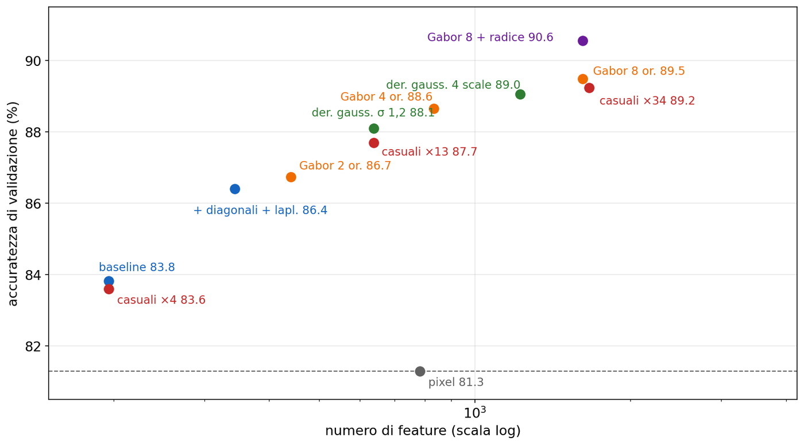

**Cosa dicono i filtri casuali.** Un filtro casuale mescola tutte le frequenze e orientazioni, e molti filtri insieme coprono lo spettro. Quindi **buona parte del lavoro la fanno ρ, pooling e classificatore**. I filtri a mano vincono in **interpretabilità ("bordo a 45° a scala 2") ed efficienza**: servono meno filtri per lo stesso risultato.

**Una sottigliezza: perché le diagonali aiutano.** Le derivate gaussiane sono **steerable** (§ 22.3.1): la derivata in una direzione θ qualsiasi è cos θ · Gx + sin θ · Gy. Prima di ρ una diagonale sarebbe ridondante; **dopo ρ no, perché da |Gx| e |Gy| non si ricostruisce |cos θ Gx + sin θ Gy|**.

**Esempio svolto.** Un bordo con il gradiente a 45° e contrasto 1 dà Gx ≈ Gy ≈ 0.71. Uno con il gradiente a −45° dà Gx ≈ 0.71 e Gy ≈ −0.71. Dopo il valore assoluto entrambi diventano (0.71, 0.71): il classificatore non li distingue più. Un filtro diagonale a 45° li separa: risponde 1 al primo e 0 al secondo.

> **Il punto**
> 
> Più orientazioni e più scale migliorano l'accuratezza; dopo la non linearità le orientazioni vanno messe esplicitamente. Anche filtri casuali funzionano quasi altrettanto bene, perché il grosso lo fanno ρ e pooling.

### 12 · Il filtro di Gabor: un po' di Fourier, in un punto

**Il problema.** Vorremmo un filtro che dica "qui c'è un'onda di questa frequenza e orientazione", cioè Fourier ma in un punto preciso. Un'onda pura è ovunque; un pixel non ha frequenza.

**L'idea.** **Un Gabor è una gaussiana moltiplicata per un'onda**: la gaussiana dice *dove* guardare, l'onda dice *quale* frequenza e orientazione cercare. È come ascoltare una sola nota, ma solo per un attimo.

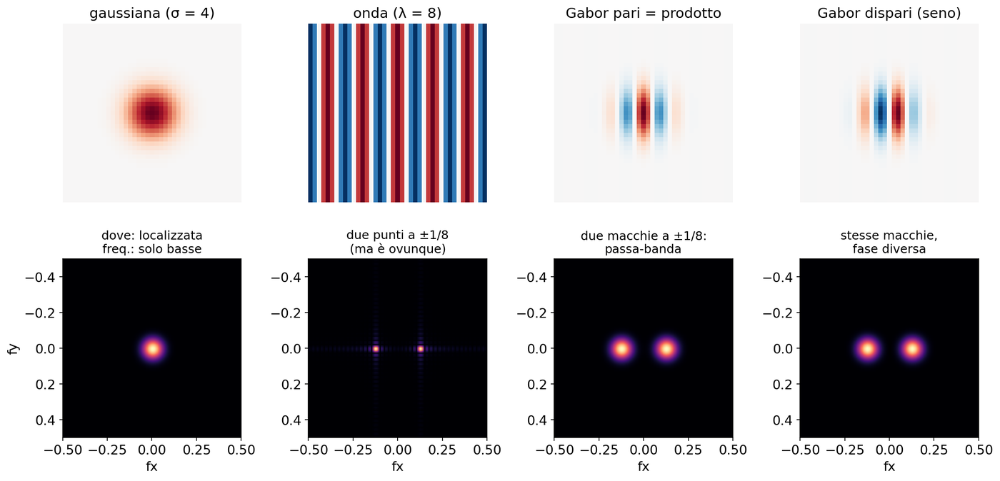

**La matematica.** Nel notebook:

`g(x, y) = exp(−(x'2 + y'2) / 2σ2) · cos(2π x'/λ + φ),   x' = x cos θ + y sin θ,   y' = −x sin θ + y cos θ`

  - **σ**: larghezza dell'inviluppo gaussiano, cioè la zona su cui il filtro guarda;
  - **θ**: orientazione dell'onda (x', y' sono le coordinate ruotate di θ);
  - **λ**: lunghezza d'onda in pixel, cioè la frequenza 1/λ a cui il filtro è sintonizzato;
  - **φ**: fase. φ = 0 dà il Gabor **pari** (coseno: una barra fra due di segno opposto, **rileva linee**), φ = π/2 il **dispari** (seno: **rileva bordi**). Insieme sono una **coppia in quadratura**.

Il libro (eq. 22.1) usa la versione complessa, gaussiana × exp(j(u0x + v0y)): parte reale = pari, immaginaria = dispari.

**Perché in frequenza è un passa-banda.** Moltiplicare per un'onda sposta lo spettro (modulazione): la trasformata del Gabor è la gaussiana dell'inviluppo, larga 1/(2πσ), centrata in ±(cos θ, sin θ)/λ. Quindi **un Gabor è un passa-banda orientato, localizzato sia nello spazio sia in frequenza**; il libro ricorda che è il filtro che ottimizza questa localizzazione congiunta.

**Esempio svolto.** Le due scale del notebook: (σ, λ) = (1.5, 4) è sintonizzata su 1/4 = 0.25 cicli/pixel, con una macchia larga 1/(2π · 1.5) ≈ 0.11; (σ, λ) = (3, 8) su 0.125 cicli/pixel, con larghezza ≈ 0.053. Stesso rapporto σ/λ = 0.375: **lo stesso filtro ingrandito, come in una piramide**. Con 8 orientazioni × 2 scale × 2 fasi = 32 Gabor, più l'identità, si hanno 33 × 49 = 1617 feature e l'**89.5%**.

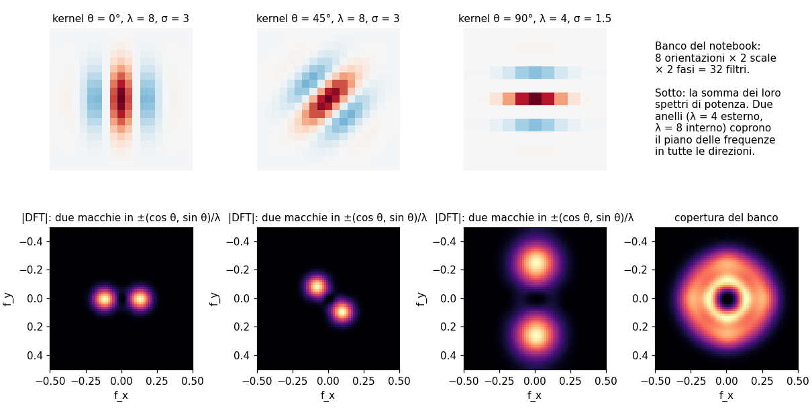

**Ampiezza locale (challenge, scheda 27; § 22.2.2).** Invece di tenere separati pari e dispari si calcola **a = √(pari2 + dispari2)**. Il risultato **non dipende più dalla fase né dal segno del contrasto**: un bordo e una linea con la stessa orientazione danno lo stesso valore. Con metà delle feature (833) si ottiene 0.892. Il libro nota che "quadratura → quadrato → somma" è già una piccola rete a due strati, il modello delle cellule complesse di V1.

> **Il punto**
> 
> Gabor = gaussiana × onda: un passa-banda orientato che dice quale frequenza c'è in quale punto. Un banco di Gabor a più orientazioni e scale è un'analisi di Fourier locale, ed è il miglior banco fisso del notebook.

### 13 · Il metodo: validazione, test e cosa sbaglia ancora

**Il problema.** Abbiamo scelto la configurazione migliore fra decine guardando la validazione: quel 90.6% è un po' ottimistico.

**L'idea.** **Tutte le scelte si fanno sulla validazione; il test si usa una volta sola, alla fine**, riallenando su training + validazione (scheda 28).

**Esempio svolto.** Sul test: pixel 81.0%, baseline 83.8%, Gabor 8 + radice **89.9%**. Il calo di 0.7 punti rispetto alla validazione è normale.

> **Attenzione: nel notebook del docente FINAL\_BANK è la baseline (scheda 28)**
> 
> La riga distribuita è `FINAL_BANK = baseline_bank  # best validation entry`: **il commento chiede il banco migliore, il codice mette la baseline**, quindi "final" e "baseline" darebbero lo stesso numero. Va messo il proprio banco migliore (nella copia in `lab/` è già corretto).

**Cosa sbaglia (scheda 29).** La matrice di confusione sul test mostra che **la classe peggiore è la camicia (66%)**, scambiata con T-shirt (14%), cappotto (8%) e pullover (7%). Pantaloni e borse invece sono al 98%. Sono capi con la **stessa sagoma**, diversi per un colletto o dei bottoni. **Un solo strato misura "quanti bordi di che orientazione in ogni zona", non sa comporre i bordi in un colletto**.

> **Il punto**
> 
> Validazione per scegliere, test una volta sola. Il miglior banco fisso arriva circa al 90% e sbaglia soprattutto le classi che differiscono per dettagli piccoli.

### 14 · Dal banco di filtri alla CNN

**Il problema.** Come si supera il limite del 90%? Servono due cose che il notebook non ha, e che sono la definizione stessa di rete convoluzionale (cap. 24).

  - **Filtri appresi.** Un layer convoluzionale calcola xout = w ⋆ xin + b con più canali in ingresso e in uscita: è la funzione `convolve` del notebook, ma **i pesi w si ottimizzano con la discesa del gradiente sul compito**. Una piccola CNN addestrata sulle linee impara da sola filtri simili a derivate gaussiane (§ 24.5). In sintesi: **una CNN *impara* un banco di filtri efficace**.
  - **Gerarchia.** Si ripete il blocco convoluzione → ρ (ReLU) → pooling più volte. Il secondo strato combina i bordi del primo in angoli e texture, poi in parti e oggetti. A ogni pooling cresce il **campo recettivo, la zona dell'immagine da cui dipende un neurone** (§ 24.7), cosa che un singolo filtro 3 × 3 non può fare.

**Esempio.** Il classificatore CNN più semplice del libro (§ 24.4) è convoluzione → ReLU → pooling medio globale → strato lineare → softmax: **la pipeline di questo notebook con i filtri appresi**. Nelle reti "convoluzione" è in realtà cross-correlazione; con pesi appresi non conta.

> **Il punto**
> 
> Una CNN è la stessa pipeline (filtri → ρ → pooling → lineare) con i filtri imparati dai dati e ripetuta su più strati, così da comporre bordi in parti e parti in oggetti.

### Il riassunto in 10 righe

1.  La DFT 2D scrive un'immagine come somma di onde; F\[0, 0\] è la somma dei pixel e Parseval conserva l'energia.
2.  `fft2` mette la DC nell'angolo e le frequenze negative in fondo; `fftshift` serve per guardare, le maschere si costruiscono su `fftfreq`.
3.  Un coseno dà due picchi simmetrici di modulo HW/2, perpendicolari alle strisce; frequenze non intere e bordi non periodici danno leakage (la croce).
4.  Una traslazione circolare cambia solo la fase (rampa lineare): la posizione sta nella fase.
5.  Filtrare con la FFT = convoluzione circolare = `boundary="wrap"`.
6.  Passa-basso ideale = kernel con lobi negativi ⇒ ringing (overshoot 9%); gaussiano exp(−2π2σ2|f|2) ⇒ nessuna oscillazione; σf = 1/(2πσ); passa-alto = immagine − passa-basso.
7.  Un disturbo periodico sono due picchi: il notch li toglie quasi senza toccare la foto; tenere i coefficienti più grandi è la compressione ottima ai minimi quadrati.
8.  Banco di filtri: convoluzione → ρ → pooling → lineare; senza ρ il modello resta lineare nei pixel e non batte i pixel.
9.  Il pooling scambia posizione con invarianza (ottimo a 2); più orientazioni e scale aiutano; i Gabor sono passa-banda orientati e localizzati.
10. Una CNN è la stessa pipeline con filtri appresi, ripetuta su più strati.

### Verifica di aver capito

**1. Un'immagine 256 × 256 è cos(2π(5x/256 − 20y/256)). In quali posizioni dell'array fft2 ci sono i picchi e quanto valgono? Come sono orientate le strisce?**

I due esponenziali hanno (u, v) = (5, −20) e (−5, 20). Nell'array (riga = v mod 256, colonna = u mod 256): F\[236, 5\] e F\[20, 251\], entrambi di modulo 256 · 256 / 2 = 32768. Le strisce sono perpendicolari a (5, −20): quasi orizzontali, leggermente inclinate.

**2. Perché il passa-basso ideale produce aloni attorno ai contorni e il gaussiano no?**

Il filtro nello spazio è la trasformata inversa della maschera. Un taglio netto in frequenza dà un kernel di tipo sinc, esteso e con lobi negativi: vicino a un bordo l'uscita oscilla e supera i valori originali (overshoot del 9%, Gibbs). La gaussiana ha trasformata gaussiana, positiva ovunque: l'uscita è una media pesata e resta compresa fra i valori di partenza.

**3. Il passa-basso con σ = 2 lascia ancora vedere le righe del disturbo (37, 21). Quanto ne lascia, e perché il notch fa molto meglio?**

|f| = √(372 + 212)/256 ≈ 0.166; la maschera vale exp(−2π2 · 4 · 0.1662) ≈ 0.11, quindi resta l'11% dell'onda, e intanto la foto viene sfocata. Il notch azzera solo i due coefficienti (e pochi vicini) del disturbo: MSE da 0.02 a 10−6, contro 0.005 del passa-basso.

**4. Perché un banco di filtri senza non linearità non può fare meglio dei pixel grezzi, per quanti filtri si aggiungano?**

Convoluzioni e pooling medio sono lineari: le feature sono z = A x. Un classificatore lineare su z calcola wTA x = (ATw)Tx, cioè un classificatore lineare sui pixel. La famiglia di funzioni non si allarga (al più si restringe, se A perde informazione). Verifica: 0.8127 con 5488 feature contro 0.8128 dei pixel.

**5. Cosa si guadagna e cosa si perde aumentando la dimensione del pooling? Perché l'ottimo è a 2?**

Si guadagna invarianza a piccoli spostamenti, meno feature e meno rumore; si perde l'informazione su dove sta la struttura. Su capi 28 × 28 centrati i dettagli utili sono di pochi pixel: blocchi 2 × 2 tolgono la variabilità di un pixel senza confondere le zone (0.881), già 4 × 4 perde troppo (0.864), 28 lascia un conteggio globale (0.524).

**6. Che cos'è un filtro di Gabor, che aspetto ha il suo spettro, e cosa aggiunge una CNN rispetto a un banco di Gabor fisso?**

È una gaussiana (larghezza σ) moltiplicata per un'onda di orientazione θ, lunghezza d'onda λ e fase φ. Il suo spettro sono due macchie gaussiane in ±(cos θ, sin θ)/λ, larghe 1/(2πσ): un passa-banda orientato, localizzato nello spazio e in frequenza. Una CNN impara i filtri dai dati invece di fissarli e li impila su più strati, così gli strati successivi combinano le risposte del primo in strutture più complesse, con campo recettivo crescente.

### Come proseguire

  - Libro, [cap. 16 Fourier Analysis](https://visionbook.mit.edu/image_processing_fourier.html): § 16.4–16.5 (onde 2D, DFT, fig. 16.8), § 16.7 (proprietà, in particolare 16.7.4 convoluzione e 16.7.6 traslazione), § 16.9 (modulo e fase, spettro delle immagini naturali), § 16.10 (filtri in frequenza), § 16.11.
  - Libro, [cap. 22 Filter Banks](https://visionbook.mit.edu/spatial_filter_sets.html): § 22.1, § 22.2 (Gabor, quadratura, ampiezza locale, banchi), § 22.3.1 (steerable). Il § 22.4 sul moto si può saltare.
  - Libro, [cap. 24 Convolutional Neural Nets](https://visionbook.mit.edu/convolutional_neural_nets.html), come ponte: § 24.1–24.5 e § 24.7.

Ora apri i notebook e ripassa con le schede qui sotto: 1–13 per `demo.ipynb`, 14–29 per `filter_bank.ipynb`. Per ogni scheda prova prima a prevedere il risultato, poi controlla il numero.
