# L8 · Keypoint detection

*Lezione 8 · Antonio Carta · 30 settembre 2026*

[Versione interattiva sul sito, con videolezione](https://gabriele-marsili.github.io/appunti-magistrale-ai/anno-2/computer-vision/sito/#L8) · [Indice della dispensa](README.md)

**In una frase:** per ritrovare lo stesso punto fisico in due foto diverse **si scelgono pochi punti "speciali"** (angoli con Harris, blob con la DoG di SIFT), si dà a ciascuno una posizione, una scala e un'orientazione proprie, e lo si descrive con istogrammi di gradienti normalizzati, così che il descrittore resti uguale anche se l'immagine è traslata, ingrandita, ruotata o illuminata diversamente.

### Prima di iniziare

Ti servono:

  - **Gradienti e derivate di gaussiana** ([L5](https://gabriele-marsili.github.io/appunti-magistrale-ai/anno-2/computer-vision/sito/#L5)): Ix e Iy si ottengono convolvendo con la derivata di una gaussiana. Il gradiente ∇I = (Ix, Iy) è perpendicolare ai bordi.
  - **Laplaciano e LoG** ([L5](https://gabriele-marsili.github.io/appunti-magistrale-ai/anno-2/computer-vision/sito/#L5)): ∇²I = Ixx + Iyy, calcolato sull'immagine sfocata.
  - **Scale-space e piramidi** ([L6](https://gabriele-marsili.github.io/appunti-magistrale-ai/anno-2/computer-vision/sito/#L6)): L(x, y, σ) = G(σ) ∗ I con σ crescente; la piramide gaussiana ripete "sfoca e dimezza".
  - **Convoluzione** ([L3](https://gabriele-marsili.github.io/appunti-magistrale-ai/anno-2/computer-vision/sito/#L3)): lineare, associativa, commuta con le traslazioni.
  - **Algebra lineare**: una matrice 2×2 simmetrica ha autovalori reali; det = prodotto degli autovalori, traccia = somma. Serve anche Taylor in più variabili.

### Guarda prima questi video

  - [Corner Detection](https://www.youtube.com/watch?v=Z_HwkG90Yvw) (Video). Shree Nayar, First Principles of Computer Vision. Tutto. Perché un angolo è localizzabile e un bordo no, fino alla matrice dei momenti del secondo ordine e alla sua ellisse: guardalo prima delle sezioni 3–5.
  - [Detecting Blobs](https://www.youtube.com/watch?v=zItstOggP7M) (Video). Shree Nayar. Il laplaciano di gaussiana normalizzato e la scala caratteristica (sezione 7 qui sotto). Guardalo prima di "SIFT Detector".
  - [SIFT Detector](https://www.youtube.com/watch?v=ram-jbLJjFg) (Video). Shree Nayar. Tutto. DoG ed estremi nello scale-space: la parte dove le slide sono più frammentarie.
  - [SIFT Descriptor](https://www.youtube.com/watch?v=IBcsS8_gPzE) (Video). Shree Nayar. Tutto. Orientazione dominante e descrittore 4×4×8 = 128: perché confrontare istogrammi invece di pixel.
  - [SIFT - 5 Minutes with Cyrill](https://www.youtube.com/watch?v=4AvTMVD9ig0) (Video · breve). Cyrill Stachniss. Ripasso compatto della pipeline SIFT: guardalo alla fine per fissare la sequenza degli stadi.

### 1\. Il problema: lo stesso punto in due foto

**Il problema.** Il telefono che compone un panorama, l'app che ricostruisce una stanza in 3D, l'auto a guida autonoma che stima il proprio moto: tutti devono rispondere alla stessa domanda. **Quale pixel della seconda foto corrisponde a questo pixel della prima?** È il **problema della corrispondenza** (slide 5–6): trovare coppie di pixel che sono proiezioni dello stesso punto 3D.

Confrontare direttamente i pixel non funziona. Fra le due foto **cambiano il punto di vista, la scala apparente, l'illuminazione, e qualcosa può essere coperto**.

**L'idea.** Rinunciare ad accoppiare tutti i pixel e lavorare su un insieme **sparso** di punti scelti bene, i **keypoint**. Guarda la figura: un quadratino di cielo è uguale a mille altri, mentre la cima della montagna si riconosce subito anche nella seconda foto.

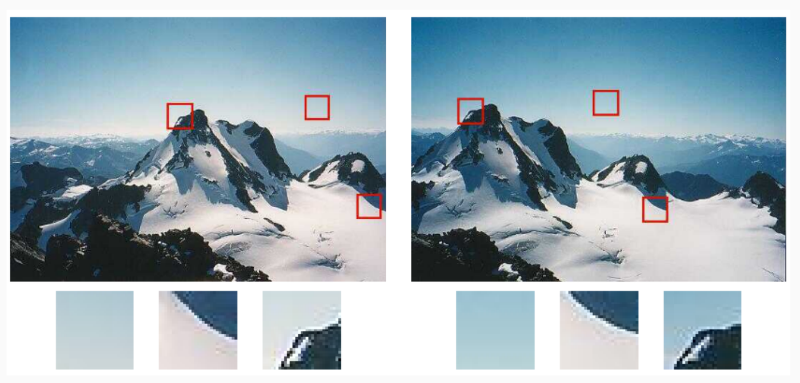

Il lavoro si divide in due pezzi (slide 8):

  - **Detector**: dice *dove* sono i keypoint (in SIFT anche a che scala e con che orientazione). Deve essere **equivariante: se l'immagine si sposta, ruota o si ingrandisce, i punti trovati si spostano, ruotano e si ingrandiscono con lei**.
  - **Descrittore**: trasforma l'intorno del keypoint in un vettore di numeri. Deve essere **invariante: lo stesso punto fisico deve dare lo stesso vettore nelle due foto**, così che si possano accoppiare confrontando vettori.

Dopo detector e descrittore vengono il **matching** (accoppiare i vettori) e la **verifica geometrica** (RANSAC): sono la lezione [L9](https://gabriele-marsili.github.io/appunti-magistrale-ai/anno-2/computer-vision/sito/#L9). Il trucco di SIFT, che vedremo, è usare ciò che il detector misura per **normalizzare la patch prima di descriverla**.

> **Il punto**
> 
> Non si accoppiano tutti i pixel ma pochi keypoint. Il detector li trova in modo equivariante, il descrittore li riassume in un vettore invariante.

### 2\. Che cosa rende buono un keypoint

**Il problema.** Quali punti scegliere? Serve un criterio calcolabile, non "quelli che sembrano interessanti".

**L'idea.** Immagina di guardare l'immagine attraverso un piccolo oblò (la finestra) e di spostarlo un poco (slide 20). Ci sono tre casi:

  - **Zona piatta** (cielo, muro): spostando la finestra **in qualunque direzione il contenuto non cambia**. Il punto è irriconoscibile.
  - **Bordo**: spostando la finestra *attraverso* il bordo il contenuto cambia molto; spostandola *lungo* il bordo non cambia affatto. Il punto è localizzato in una sola direzione.
  - **Angolo**: **qualunque spostamento cambia il contenuto**. Il punto è vincolato in due direzioni, quindi localizzato bene.

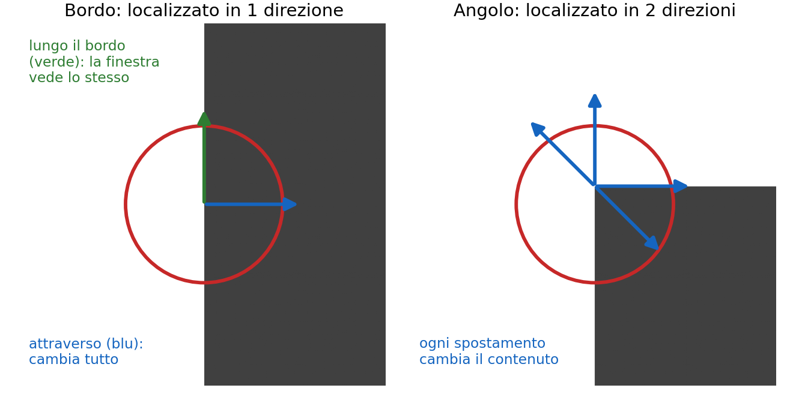

Il caso del bordo ha un nome: **aperture problem** (slide 21). Attraverso un'apertura piccola, un bordo che scorre lungo se stesso sembra fermo. È l'illusione del palo del barbiere: le strisce sembrano salire anche se il palo ruota soltanto.

Da qui le tre proprietà di un buon keypoint (slide 12–13): **ripetibile** (lo ritrovi in viste diverse), **ben localizzato** e **distintivo**.

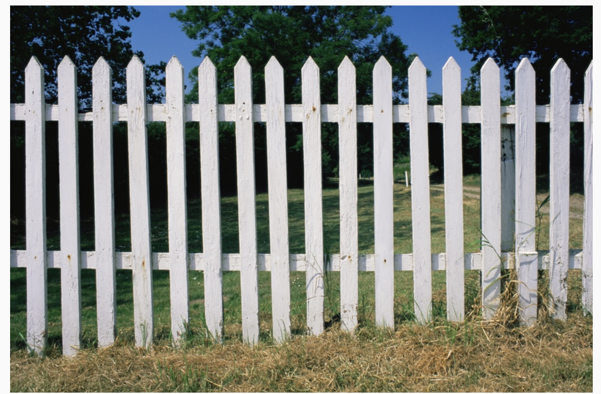

Attenzione a un dettaglio della slide 16: **un punto può essere un angolo perfetto e comparire identico venti volte nell'immagine**. La distintività è una proprietà **globale**. Il detector, che guarda solo l'intorno, non può risolverla: se ne occuperà il ratio test nel matching ([L9](https://gabriele-marsili.github.io/appunti-magistrale-ai/anno-2/computer-vision/sito/#L9)).

> **Il punto**
> 
> Un buon keypoint è un punto in cui il contenuto cambia spostandosi in *ogni* direzione: un angolo sì, un bordo no (aperture problem), una zona piatta no.

### 3\. Harris: misurare quanto cambia la finestra

**Il problema.** "Il contenuto cambia in ogni direzione" va trasformato in un numero calcolabile in ogni pixel.

**L'idea.** Si confronta la finestra intorno al punto con una sua copia spostata di un vettore Δu = (Δx, Δy), e si misura la differenza. Se è grande per ogni Δu, siamo su un angolo.

**La matematica.** Si usa la somma pesata dei quadrati delle differenze, che Szeliski chiama **autocorrelazione** (slide 25):

`EAC(Δu) = Σi w(xi) [I(xi + Δu) − I(xi)]²`

Simbolo per simbolo: xi sono le posizioni dei pixel nella finestra; I(xi) è l'intensità lì; I(xi + Δu) è l'intensità del pixel spostato di Δu; w(xi) ≥ 0 è un peso, di solito una gaussiana centrata sul punto, che conta di più i pixel vicini al centro.

EAC è una funzione di Δu: un piccolo "paesaggio" 2D (le superfici della slide 15).

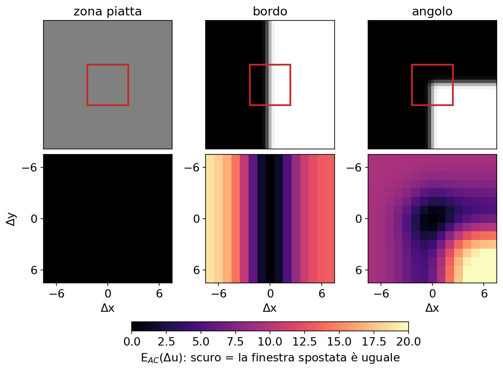

**Calcolare EAC per tutti i Δu in tutti i pixel sarebbe costosissimo.** Serve un'approssimazione che dica, con pochi numeri, come cresce EAC in ogni direzione.

#### Lo sviluppo di Taylor (slide 27–28)

Per spostamenti piccoli, l'intensità nel pixel spostato si approssima al primo ordine:

`I(xi + Δu) ≈ I(xi) + ∇I(xi)⊤ Δu = I(xi) + Ix Δx + Iy Δy`

Sostituendo nella somma, I(xi) si cancella e resta il quadrato del prodotto scalare ∇I⊤Δu. Il passaggio chiave: per un vettore g vale (g⊤Δu)² = Δu⊤(g g⊤)Δu. Portando Δu fuori dalla somma:

`EAC(Δu) ≈ Δu⊤ A Δu,   A = Σi w(xi) [ Ix²  IxIy ; IxIy  Iy² ]`

A è una matrice 2×2 chiamata **matrice dei momenti del secondo ordine o tensore di struttura**. Le sue entrate sono medie pesate, nella finestra, di Ix², Iy² e IxIy. A parole: **il paesaggio EAC, vicino all'origine, è un paraboloide descritto da soli tre numeri**. Questa derivazione in tre righe è una classica domanda d'orale: sappila rifare.

**In pratica** (slide 30–31) A si calcola in tutti i pixel insieme. Calcoli Ix e Iy con una derivata di gaussiana di scala σD (la **scala di derivazione**). Formi le tre immagini Ix², Iy², IxIy e le sfochi con una gaussiana più larga σI (la **scala di integrazione**, cioè la finestra w). **Tre convoluzioni e hai A ovunque.**

**Esempio svolto.** Una finestra di 4 pixel con pesi 1, gradienti (2, 0), (2, 0), (0, 2), (0, 2) Ogni g g⊤ vale \[4 0; 0 0\] oppure \[0 0; 0 4\]; sommando A = \[8 0; 0 8\]. Per Δu = (1, 0) la stima è EAC ≈ 8, e per Δu = (0, 1) ancora 8: l'errore cresce in tutte e due le direzioni.

> **Il punto**
> 
> Con Taylor, "quanto cambia la finestra spostata di Δu" diventa Δu⊤AΔu: tutta l'informazione sta nella matrice 2×2 A, fatta di medie di prodotti di derivate prime.

### 4\. Autovalori di A e risposta di Harris

**Il problema.** Abbiamo A in ogni pixel. Come decidiamo da A se è un angolo, un bordo o una zona piatta?

**L'idea.** A è simmetrica, quindi ha due autovalori reali λ1 ≥ λ2 e autovettori ortogonali e1, e2. È anche semidefinita positiva (somma pesata di matrici g g⊤), quindi λ1, λ2 ≥ 0. Scrivendo lo spostamento nelle coordinate degli autovettori, Δu = u′1e1 + u′2e2, la forma quadratica diventa diagonale (slide 33):

`EAC ≈ λ1 u′1² + λ2 u′2²`

Leggila così: **λ1 dice quanto cresce l'errore spostandosi lungo la direzione di massima variazione, λ2 quanto cresce nella direzione peggiore**. Quindi:

  - λ1 e λ2 entrambi piccoli → **zona piatta**;
  - λ1 grande, λ2 ≈ 0 → **bordo** (lungo e2 non cambia niente);
  - **entrambi grandi → angolo**.

#### La risposta R (slide 36–37)

Harris e Stephens (1988) evitano di calcolare gli autovalori in ogni pixel. Usano det(A) = λ1λ2 e trace(A) = λ1 + λ2, che si leggono direttamente dalle entrate di A:

`R = det(A) − α · trace(A)² = λ1λ2 − α (λ1 + λ2)²`

α è una costante empirica, di solito fra 0.04 e 0.06. Il prodotto λ1λ2 è grande solo se *entrambi* gli autovalori lo sono; il termine sottratto penalizza i casi sbilanciati. Risultato: **R \> 0 e grande sugli angoli, R \< 0 sui bordi, |R| piccolo nelle zone piatte**. Facendo il conto, R \> 0 solo se il rapporto r = λ1/λ2 soddisfa r/(1 + r)² \> α: con α = 0.05 serve r sotto circa 18.

Un'osservazione dalla slide 35: sul bordo λ1 ≈ 1.40, più grande dei due autovalori dell'angolo (0.72 e 0.52). **Guardare solo l'autovalore massimo o la traccia ti farebbe scegliere il bordo**: conta che siano grandi **tutti e due**. Shi e Tomasi usano direttamente λmin (slide 36).

#### Esempio svolto

Stessa finestra di 4 pixel con pesi 1, tre casi.

  - **Angolo**: A = \[8 0; 0 8\] (calcolata nella sezione 3). det = 64, trace = 16, R = 64 − 0.05 · 256 = **51.2** \> 0. Autovalori 8 e 8.
  - **Bordo verticale**: quattro gradienti (2, 0). A = \[16 0; 0 0\], det = 0, trace = 16, R = −0.05 · 256 = **−12.8**. Spostandoti lungo il bordo, Δu = (0, 1), l'errore è 0.
  - **Bordo diagonale**: quattro gradienti (√2, √2). Ogni g g⊤ = \[2 2; 2 2\], quindi A = \[8 8; 8 8\]. Le entrate diagonali sono identiche a quelle dell'angolo\! Ma det = 64 − 64 = 0 e R = −12.8. Autovalori 16 e 0.

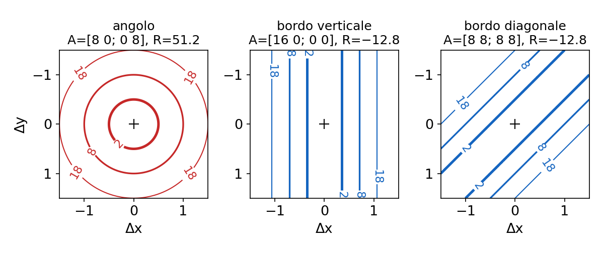

Due morali. **Senza il termine IxIy un bordo obliquo sembrerebbe un angolo.** E **R non cambia ruotando il bordo, perché dipende solo dagli autovalori**.

> **Il punto**
> 
> Angolo = due autovalori di A grandi. R = det − α trace² lo misura senza calcolarli: positivo sugli angoli, negativo sui bordi, circa zero nelle zone piatte.

### 5\. Dalla mappa R ai punti: soglia e soppressione

**Il problema.** Intorno a un angolo decine di pixel hanno R alta. Vogliamo *un* punto per angolo, e non tutti ammassati nello stesso posto.

**L'idea** (slide 37–39), in due passi:

  - una **soglia** R \> τ: troppo bassa e passa il rumore, **troppo alta e perdi angoli buoni**;
  - la **soppressione dei non-massimi (NMS)**: di un grappolo di pixel con R alta si tiene solo il massimo locale.

Ecco Harris completo in poche righe di numpy/scipy:

    import numpy as np
    from scipy.ndimage import gaussian_filter, maximum_filter
    
    def harris(I, sD=1.0, sI=2.0, alpha=0.05):
        Ix = gaussian_filter(I, sD, order=(0, 1))   # derivata lungo le colonne (x)
        Iy = gaussian_filter(I, sD, order=(1, 0))   # derivata lungo le righe (y)
        Sxx = gaussian_filter(Ix * Ix, sI)          # entrate di A in ogni pixel
        Syy = gaussian_filter(Iy * Iy, sI)
        Sxy = gaussian_filter(Ix * Iy, sI)
        return Sxx * Syy - Sxy**2 - alpha * (Sxx + Syy)**2
    
    R = harris(I)
    picchi = (R == maximum_filter(R, size=9)) & (R > 0.05 * R.max())   # NMS + soglia
    ys, xs = np.nonzero(picchi)

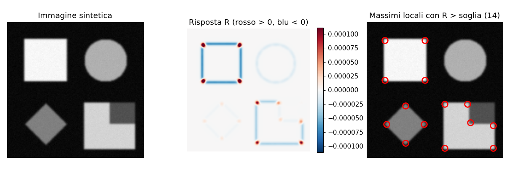

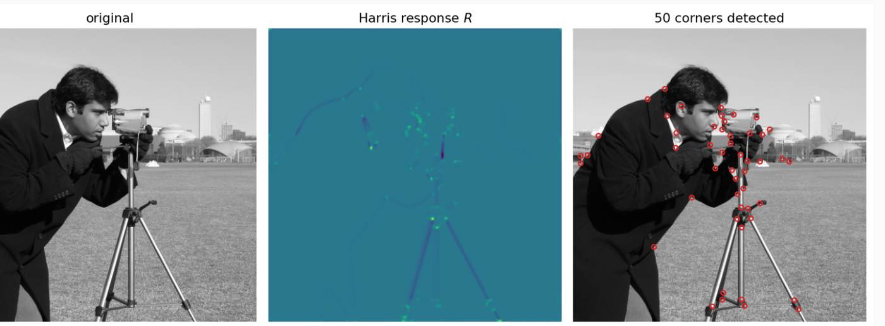

#### ANMS: spargere i punti

La slide 38 chiama il passo di soppressione ANMS, ma come segnala il riquadro "Attenzione" della sua scheda, quella descritta è la normale NMS. **Tenendo solo i punti più forti, questi si ammassano nelle zone ad alto contrasto** e lasciano vuoto il resto. L'**ANMS (adaptive non-maximal suppression)** vera calcola per ogni punto la distanza dal più vicino punto più forte almeno del 10%, e tiene gli n punti con distanza maggiore.

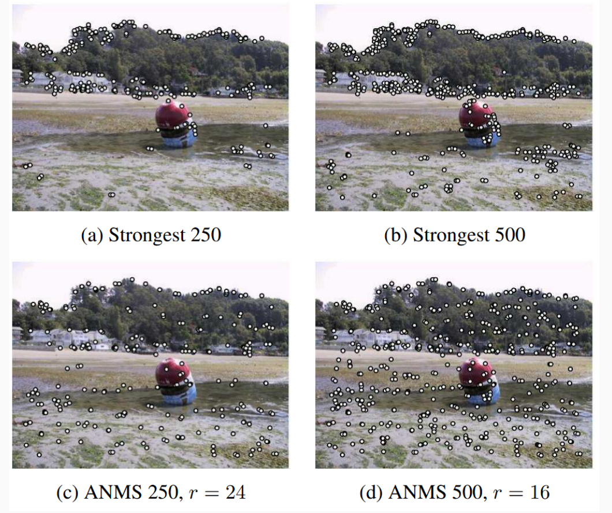

**Un difetto da ricordare.** **La risposta dipende dal contrasto: A scala come il quadrato del contrasto, quindi R come la quarta potenza.** Una soglia fissa su R non è quindi invariante ai cambi di luce, ed è uno dei motivi per cui nella slide 41 si ritrova "solo" il 74% degli angoli dopo rotazione e cambio di illuminazione.

> **Il punto**
> 
> Dalla mappa R si passa ai punti con soglia + NMS; l'ANMS distribuisce i punti su tutta l'immagine. La soglia su R dipende dal contrasto.

### 6\. Il limite di Harris: la scala

**Il problema.** Fotografa una porta da 10 metri e poi da 2 metri. Harris trova gli stessi angoli?

La slide 42 dice che Harris non è invariante né alla scala né alla rotazione. Sulla rotazione è imprecisa (vedi il riquadro "Attenzione" nella scheda): **R dipende solo dagli autovalori, che non cambiano ruotando l'immagine, quindi il detector è già equivariante alla rotazione**, come hai visto con il rombo. Quello che manca è un'**orientazione** da associare al punto per costruire un descrittore invariante; ci penserà SIFT.

**L'idea.** Il vero problema è la **scala: le finestre σD e σI sono fisse per tutta l'immagine**. Pensa a un angolo arrotondato. Da lontano, in una finestra di 10 pixel, è un angolo netto. Da vicino, con la stessa finestra, vedi solo un pezzetto di arco quasi dritto, cioè un bordo.

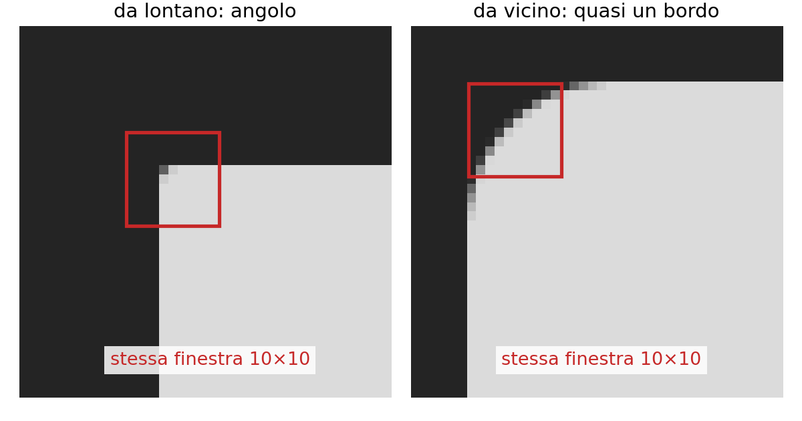

Avvicinandoti, lo stesso punto fisico può smettere di essere rilevato. E anche se lo rilevi, **la finestra copre porzioni di scena diverse nelle due foto, quindi i descrittori non coincidono**. Eseguire Harris a più scale non basta: bisogna sapere **quale** scala è quella giusta per ciascun punto.

> **Il punto**
> 
> Harris è equivariante a traslazione e rotazione, ma non alla scala: la finestra ha una dimensione fissa e un oggetto più vicino ci "sta" in modo diverso.

### 7\. Selezione automatica della scala con il LoG

**Il problema.** Per ogni punto vogliamo una finestra grande "quanto la struttura", così che da vicino e da lontano contenga lo stesso pezzo di scena.

**L'idea** (slide 44–46). Molte strutture hanno una dimensione propria: una macchia circolare ha un raggio. Per questo si passa dagli angoli ai **blob** (slide 44): regioni con proprietà uniformi (colore, luminosità) e una dimensione naturale, spesso ellittiche. Per ogni punto si cerca la σ\* che **massimizza** una risposta al variare di σ: la **scala caratteristica**. Se la risposta è costruita bene, **σ\* è covariante con la scala: ingrandendo l'immagine di un fattore s, σ\* diventa s·σ\***. Una patch di raggio proporzionale a σ\* contiene allora lo stesso pezzo di scena in entrambe le foto.

È come regolare lo zoom finché la macchia riempie esattamente il mirino: da qualunque distanza, ci si ferma sullo stesso riempimento.

#### Il LoG (slide 47–50)

La risposta usata è il laplaciano dell'immagine sfocata. Per l'associatività della convoluzione ∇²(Gσ ∗ I) = (∇²Gσ) ∗ I, quindi basta convolvere con il kernel LoG (lo stesso di [L5](https://gabriele-marsili.github.io/appunti-magistrale-ai/anno-2/computer-vision/sito/#L5)):

`∇²G(x, y, σ) = −1/(πσ⁴) · [1 − (x² + y²)/(2σ²)] · e−(x² + y²)/(2σ²)`

È negativo al centro, si annulla sul cerchio x² + y² = 2σ² (lo vedi dalla parentesi quadra) ed è leggermente positivo fuori. Una macchia chiara su fondo scuro, centrata sul kernel, dà una risposta fortemente negativa. **La risposta più forte si ha quando la macchia riempie esattamente la parte negativa, cioè quando il suo raggio è r = √2·σ.**

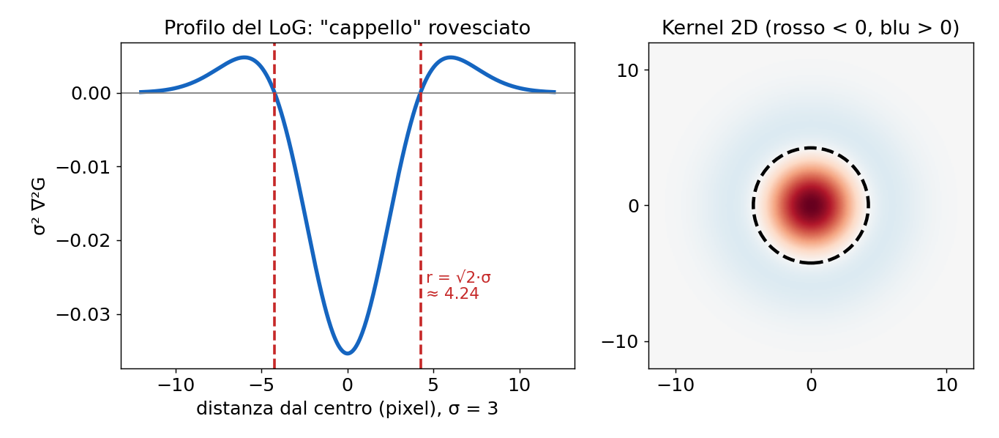

**La normalizzazione.** **Ogni derivata di una gaussiana porta un fattore 1/σ, quindi le derivate seconde scalano come 1/σ²: senza correzione la risposta cala sempre al crescere di σ** e il massimo cadrebbe sempre alla σ più piccola. Si usa il LoG **normalizzato in scala**:

`LLoG(x, y, σ) = σ² ∇²(Gσ ∗ I)(x, y)`

Il σ² compensa esattamente il calo, e **le risposte a scale diverse diventano confrontabili**. Il punto rilevato è un estremo di questa funzione sia nello spazio (x, y) sia nella scala σ.

**Esempio svolto.** Un disco chiaro di raggio 6 pixel: la scala caratteristica attesa è σ\* = 6/√2 ≈ 4.24. Ingrandisci l'immagine di 2: il disco ha raggio 12 e σ\* ≈ 8.49, esattamente il doppio. Nella figura (calcolata con `scipy.ndimage.gaussian_laplace`) i picchi cadono a 4.20 e 8.42 con la **stessa altezza**: è l'effetto di σ².

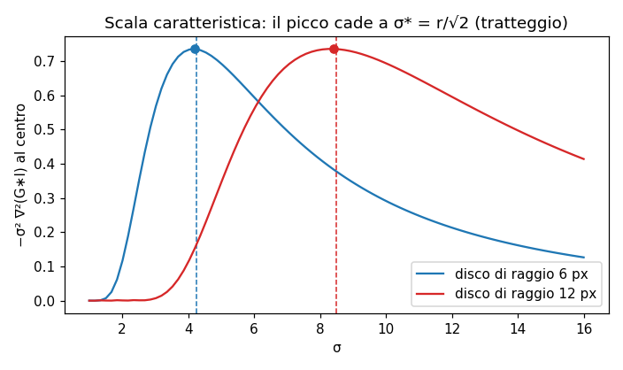

> **Il punto**
> 
> La scala caratteristica è la σ che massimizza il LoG normalizzato σ²∇²(G ∗ I). Segue la dimensione della struttura (per un disco σ\* = r/√2), quindi dà a ogni punto una finestra della taglia giusta.

### 8\. La DoG: lo stesso risultato quasi gratis

**Il problema.** **Calcolare il LoG a molte scale costa**: una convoluzione con un kernel grande per ogni σ.

**L'idea.** Lowe usa la **differenza di gaussiane (DoG)** (slide 51): due immagini dello scale-space a scale vicine, σ e kσ (con k poco più di 1), sottratte pixel per pixel.

`D(x, y, σ) = G(kσ) ∗ I − G(σ) ∗ I`

**Perché approssima il LoG.** Dall'equazione del calore (la gaussiana "diffonde" al crescere di σ, [L6](https://gabriele-marsili.github.io/appunti-magistrale-ai/anno-2/computer-vision/sito/#L6)) vale ∂G/∂σ = σ∇²G. Approssimando la derivata con un rapporto incrementale:

`σ∇²G = ∂G/∂σ ≈ (G(kσ) − G(σ)) / (kσ − σ)   ⇒   G(kσ) − G(σ) ≈ (k − 1) σ² ∇²G`

A parole: **la DoG è proporzionale al LoG già normalizzato σ²∇²G**, con un fattore (k − 1) uguale a tutte le scale, che non sposta gli estremi. E le immagini G(σ) ∗ I le hai già, se costruisci la piramide gaussiana: **la DoG costa una sottrazione**. La slide scrive "for a small scale k": è impreciso (vedi il riquadro "Attenzione" della scheda), k è un rapporto fra scale e deve essere vicino a 1, non piccolo.

#### La piramide DoG (slide 52, 58)

SIFT organizza lo scale-space in **ottave**, come la piramide di [L6](https://gabriele-marsili.github.io/appunti-magistrale-ai/anno-2/computer-vision/sito/#L6), ma con più livelli per ottava. Con s intervalli per ottava si pone k = 21/s: dopo s passi σ raddoppia. Servono s + 3 immagini gaussiane per ottava, che danno s + 2 DoG.

**Esempio svolto** con i valori di Lowe (σ0 = 1.6, s = 3). k = 21/3 ≈ 1.26. Le sei gaussiane della prima ottava hanno σ ≈ 1.6, 2.02, 2.54, 3.2, 4.03, 5.08. Sottraendo le coppie adiacenti si ottengono 5 DoG. L'immagine con σ = 3.2 (il doppio di 1.6) viene sottocampionata di 2 e diventa la base dell'ottava successiva: nella nuova griglia ha di nuovo σ = 1.6 in pixel, e si ricomincia.

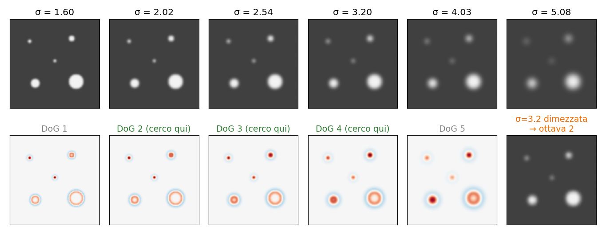

#### Gli estremi su 26 vicini (slide 52, 59)

Un pixel è un **keypoint candidato se è più grande (o più piccolo) di tutti i suoi 26 vicini** nel cubo 3 × 3 × 3: 8 nella stessa DoG, 9 in quella sopra, 9 in quella sotto. **Una sola ricerca dà insieme la posizione (x, y) e la scala σ.** Si cercano sia massimi sia minimi (macchie chiare su fondo scuro e viceversa). La prima e l'ultima DoG di ogni ottava non hanno un vicino sopra o sotto: su 5 DoG si cercano estremi nelle 3 centrali. Ecco perché servono s + 3 gaussiane per avere s livelli utili.

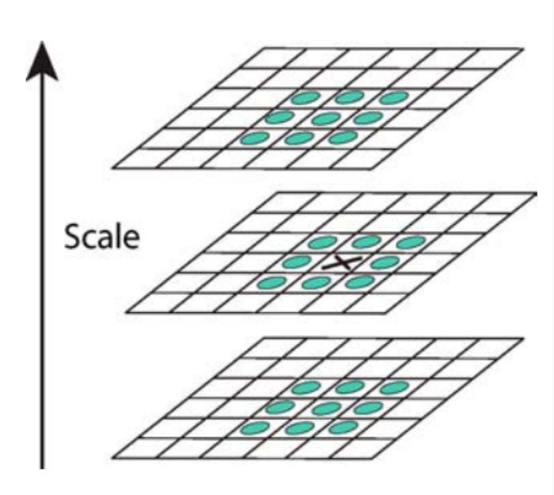

> **Il punto**
> 
> La DoG G(kσ) ∗ I − G(σ) ∗ I ≈ (k − 1)σ²∇²G ∗ I approssima il LoG normalizzato al costo di una sottrazione. Gli estremi sui 26 vicini danno posizione e scala insieme.

### 9\. SIFT: ripulire i candidati

**Il problema.** **La ricerca degli estremi produce molti candidati, parecchi instabili**: SIFT (Lowe 2004) applica tre filtri (slide 60–62).

#### Raffinamento sub-pixel

**L'idea.** L'estremo trovato sta su un campione della griglia, ma quello vero può cadere fra due pixel o fra due scale. Si approssima D intorno al campione con una parabola (Taylor al secondo ordine) e se ne prende il vertice. Nelle tre variabili x = (x, y, σ):

`D(x) ≈ D + ∇D⊤x + ½ x⊤HDx   ⇒   x̂ = −HD−1∇D`

D, il gradiente ∇D (3 componenti) e l'hessiana HD (3×3) si stimano con differenze finite fra campioni vicini. x̂ è lo scostamento dell'estremo dal campione, ottenuto annullando la derivata della quadrica. Il passo trova l'estremo, massimo o minimo che sia (la slide dice "minima": vedi il riquadro "Attenzione" della scheda 60). Se una componente di x̂ supera 0.5, l'estremo è più vicino a un altro campione: ci si sposta lì e si ripete. Risultato: **precisione sub-pixel e sub-scala**.

**Esempio in 1D.** Valori di D in tre pixel consecutivi: 0.8, 1.0, 0.6. Derivata centrale D′ = (0.6 − 0.8)/2 = −0.1; derivata seconda D″ = 0.6 − 2·1.0 + 0.8 = −0.6. Allora x̂ = −D′/D″ = −0.167: il massimo vero è un sesto di pixel a sinistra, verso il vicino più alto (0.8).

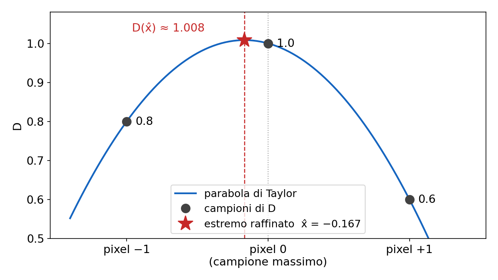

#### Scarto dei punti a basso contrasto

Si valuta D nel punto raffinato, D(x̂) = D + ½∇D⊤x̂, e **si scarta il punto se |D(x̂)| \< 0.03** (intensità in \[0, 1\]). Una risposta debole vuol dire poco contrasto: **il punto è sensibile al rumore e difficilmente ripetibile**. Nell'esempio D(x̂) = 1.0 + ½·(−0.1)(−0.167) ≈ 1.008: tenuto.

#### Scarto dei punti sui bordi

**La DoG risponde forte anche lungo i bordi, dove però il punto è mal localizzato**: di nuovo l'aperture problem. Si riusa l'idea di Harris con una matrice diversa: l'**hessiana 2×2 di D nel punto, H = \[Dxx Dxy; Dxy Dyy\]**. I suoi autovalori sono le **curvature principali** di D: su un bordo una è grande (attraverso) e l'altra piccola (lungo). Senza calcolarli, con r = λmax/λmin:

`trace(H)² / det(H) = (λmax + λmin)² / (λmaxλmin) = (r + 1)² / r`

Questa quantità vale 4 per r = 1 e cresce con r: controllarla equivale a controllare il rapporto delle curvature. **Lowe tiene il punto se trace²/det \< (10 + 1)²/10 = 12.1**, e lo scarta se det \< 0 (curvature di segno opposto: una sella).

**Esempio.** H = \[−4 0; 0 −2\]: trace² / det = 36/8 = 4.5 \< 12.1, tenuto (blob un po' allungato). H = \[−10 0; 0 −0.5\]: 110.25/5 = 22.05 \> 12.1, scartato (curvature in rapporto 20: è un bordo).

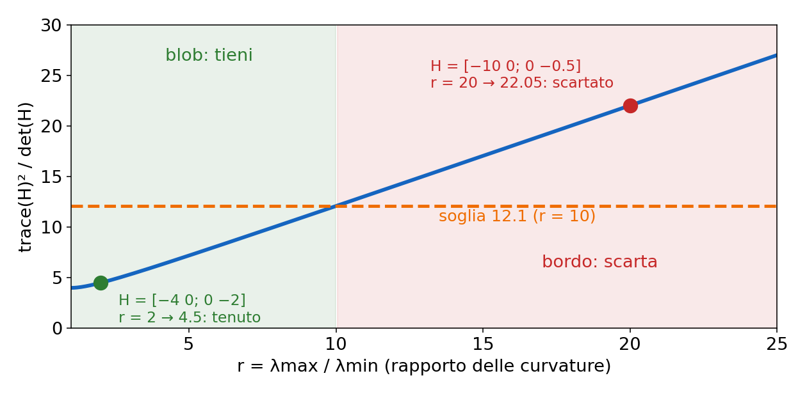

**Non confondere le due matrici:** Harris usa il tensore di struttura A, fatto di prodotti di derivate **prime**; SIFT qui usa l'hessiana, fatta di derivate **seconde**. Stessa logica, stesso trucco det/trace.

> **Il punto**
> 
> SIFT raffina ogni candidato al sub-pixel con una quadrica, butta quelli con |D| \< 0.03 e quelli con trace²/det dell'hessiana ≥ 12.1 (bordi).

### 10\. SIFT: orientazione e descrittore

#### Orientazione dominante (slide 65–67)

**Il problema.** Ogni keypoint ha ora (x, y, σ). Se giri il telefono di 30° la patch ruota, e un descrittore "pixel per pixel" cambia completamente.

**L'idea.** Dare al punto una "bussola": un angolo θ, misurato dall'immagine stessa, rispetto a cui descrivere tutto. Se l'immagine ruota, θ ruota con lei e la descrizione relativa a θ non cambia.

**La matematica.** Sull'immagine gaussiana L con scala più vicina a σ (così tutto è misurato "alla scala del punto") si calcolano in ogni pixel modulo e angolo del gradiente con differenze finite: m = √(dx² + dy²), θ = atan2(dy, dx). La slide scrive tan−1(dy/dx), ma **tan−1 da sola copre solo 180°**: per coprire 360° serve atan2, che guarda i segni di entrambe le componenti.

In un intorno del punto ogni pixel vota in un **istogramma a 36 bin** (10° ciascuno) con peso m × gaussiana (σ pari a 1.5 volte la scala del punto). **Il picco è l'orientazione dominante.** **Ogni altro picco sopra l'80% del massimo genera una copia del keypoint** con quell'orientazione (slide 67): succede a circa il 15% dei punti, per esempio dove si incrociano due bordi forti.

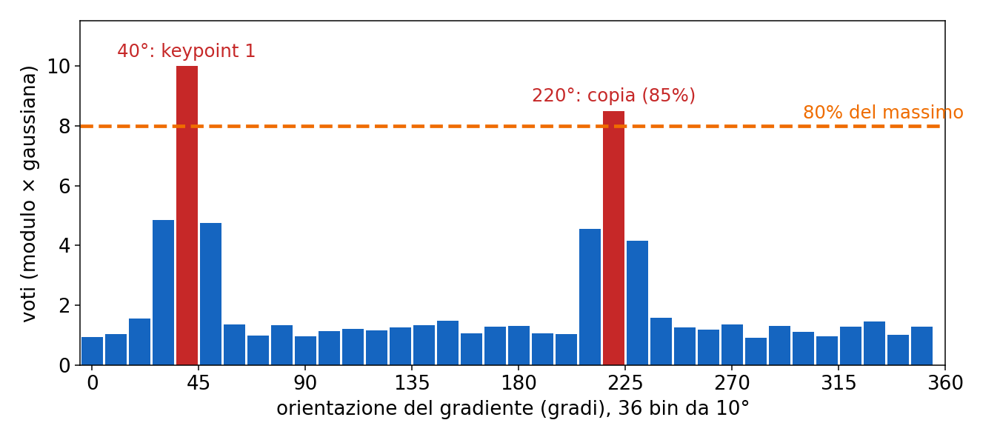

#### Il descrittore a 128 numeri (slide 68–70)

**Il problema.** Ora ogni keypoint ha un riferimento proprio: origine nel punto, unità proporzionale a σ, assi ruotati di θ. Come riassumere l'intorno in un vettore che sopravviva a piccoli errori e deformazioni? **La correlazione normalizzata dei pixel non è abbastanza robusta alle trasformazioni non rigide** (slide 68).

**L'idea.** Si prende la patch in questo riferimento, cioè ruotata di −θ e riportata a dimensione fissa, e invece dei pixel si descrive "quanta struttura c'è in ciascuna direzione" in piccole celle:

  - finestra di 16 × 16 campioni intorno al punto, divisa in una griglia di **4 × 4 celle** di 4 × 4 campioni;
  - in ogni cella un istogramma delle orientazioni dei gradienti a **8 bin** (45° ciascuno), con voti pesati dal modulo e da una gaussiana centrata sul punto;
  - concatenando: **4 × 4 × 8 = 128 numeri, il descrittore SIFT**.

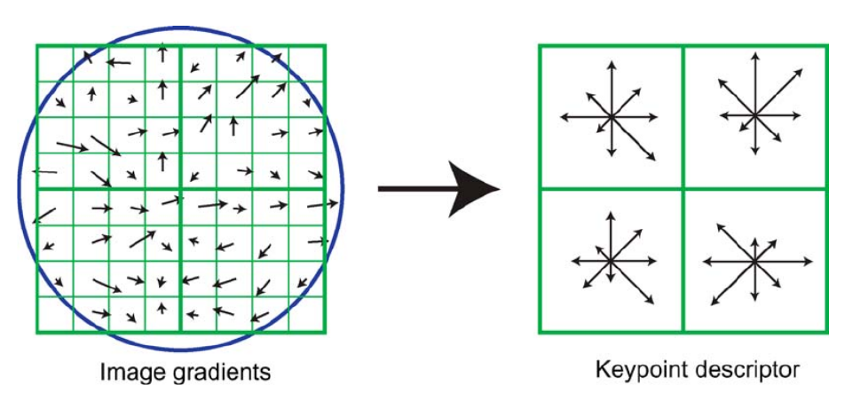

Perché istogrammi e non pixel? **Se un errore di localizzazione sposta un gradiente di un pixel dentro la cella, il vettore quasi non cambia.** Per evitare salti quando un gradiente passa da una cella all'altra o da un bin all'altro, ogni voto è distribuito fra celle e bin vicini (**interpolazione trilineare**). Non confondere questi istogrammi a 8 bin con quello a 36 bin dell'orientazione.

**Esempio piccolo.** Una cella in cui tutti i 16 gradienti puntano a 0° con modulo 1 mette 16 nel bin 0° e zero altrove. Ruota l'immagine di 90°: anche θ ruota di 90°, la patch viene "raddrizzata" e la cella mette di nuovo 16 nel bin 0°. Senza orientazione, i 16 voti finirebbero nel bin 90° e il vettore sarebbe diverso.

#### Normalizzazione per l'illuminazione (slide 71)

**Il problema.** La stessa facciata fotografata al sole e all'ombra. Un cambio di luce si modella spesso come I′ = a·I + b.

  - **L'offset b sparisce nei gradienti** (la derivata di una costante è zero).
  - Il guadagno a moltiplica tutti i moduli, quindi tutto il vettore: **normalizzandolo a norma 1 il fattore sparisce**.
  - Restano gli effetti non lineari (saturazione, riflessi), che creano pochi gradienti enormi: **si tagliano le componenti a 0.2 e si rinormalizza**.

**Esempio** con 4 componenti invece di 128: v = (0.9, 0.3, 0.3, 0.1) ha già norma 1 (0.81 + 0.09 + 0.09 + 0.01 = 1). Tagliando a 0.2: (0.2, 0.2, 0.2, 0.1), norma √0.13 ≈ 0.361. Rinormalizzando: (0.55, 0.55, 0.55, 0.28). La componente dominante non schiaccia più le altre.

> **Il punto**
> 
> L'orientazione dominante (istogramma a 36 bin, copie sopra l'80%) dà l'invarianza alla rotazione. Il descrittore 4 × 4 × 8 = 128 di istogrammi di gradienti, normalizzato, tagliato a 0.2 e rinormalizzato, resiste a piccoli spostamenti e cambi di luce.

### 11\. Il quadro d'insieme e il confronto con Harris

La slide 73 riassume tutto in una tabella che devi saper ricostruire: **ogni invarianza ha il suo meccanismo**.

  - **Traslazione** → descrittore calcolato in un riferimento centrato sul keypoint.
  - **Scala** → estremi della DoG nello scale-space; σ salvata e usata per dimensionare la patch.
  - **Rotazione** → orientazione dominante; patch ruotata prima del descrittore.
  - **Luce additiva** → gradienti; **luce moltiplicativa** → normalizzazione del vettore; **saturazione** → clipping a 0.2.
  - **Localizzazione** → raffinamento sub-pixel; **stabilità** → scarto di basso contrasto e bordi.

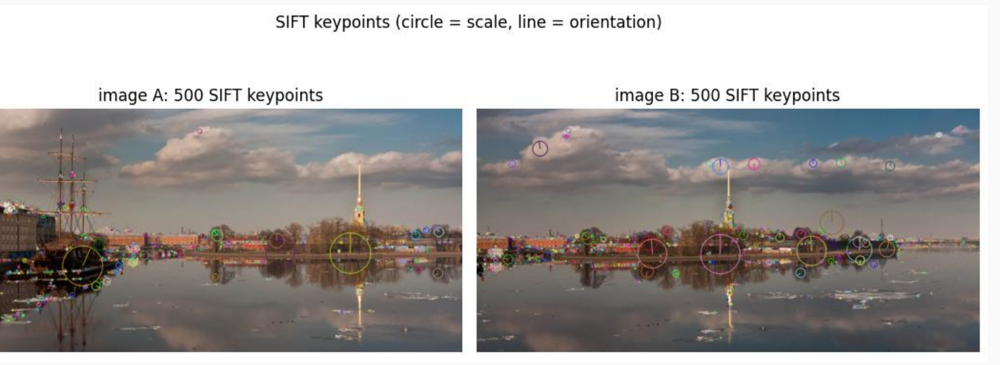

La **ripetibilità** (frazione di punti dell'immagine 1 ritrovati nel posto giusto nell'immagine 2, slide 78) è **più alta per SIFT quando cambia la scala**. Ma **SIFT non gestisce bene forti cambi di prospettiva** (la patch subisce una deformazione affine o proiettiva, non solo rotazione e zoom) **né le texture ripetitive**.

Mancano due pezzi della pipeline (slide 81): **accoppiare** i descrittori (nearest neighbor e ratio test di Lowe) e **verificare** le coppie con un modello geometrico (DLT e RANSAC). Sono la prossima lezione ([L9](https://gabriele-marsili.github.io/appunti-magistrale-ai/anno-2/computer-vision/sito/#L9)). I metodi appresi (SuperPoint, LightGlue, slide 80) mantengono la stessa struttura: detect, describe, match, verify.

> **Il punto**
> 
> SIFT = detector DoG (posizione + scala) + orientazione + descrittore normalizzato: un meccanismo per ogni invarianza. Resta debole su forti cambi di prospettiva e texture ripetitive.

### Il riassunto in 10 righe

1.  Le corrispondenze fra immagini si cercano su pochi keypoint: il detector è equivariante, il descrittore invariante.
2.  Un angolo è localizzato in due direzioni; un bordo solo in una (aperture problem); una zona piatta in nessuna.
3.  L'autocorrelazione EAC(Δu), sviluppata con Taylor, diventa Δu⊤AΔu con A = Σ w ∇I ∇I⊤.
4.  Autovalori di A: entrambi grandi = angolo, uno solo = bordo, nessuno = piatto.
5.  Harris: R = det A − α trace² A (α ≈ 0.05), poi soglia e NMS; ANMS per distribuire i punti.
6.  Harris è equivariante a traslazione e rotazione ma non alla scala: la finestra è fissa.
7.  Scala caratteristica: estremo in σ del LoG normalizzato σ²∇²(G ∗ I); per un disco di raggio r, σ\* = r/√2.
8.  La DoG G(kσ) ∗ I − G(σ) ∗ I ≈ (k − 1)σ²∇²G ∗ I: estremi su 26 vicini nella piramide DoG (k = 21/s, s + 3 gaussiane per ottava).
9.  SIFT ripulisce i candidati: sub-pixel con Taylor, |D| \< 0.03 scartato, trace²/det dell'hessiana ≥ 12.1 scartato.
10. Orientazione da istogramma a 36 bin (copie sopra l'80%), descrittore 4 × 4 × 8 = 128, normalizzato, tagliato a 0.2, rinormalizzato.

### Verifica di aver capito

**1. Perché un punto su un bordo rettilineo non è un buon keypoint, anche se ha un gradiente fortissimo?**

Perché spostando la finestra lungo il bordo il contenuto non cambia: EAC resta circa zero in quella direzione (uno dei due autovalori di A è nullo). Nella seconda immagine non sapresti quale dei tanti punti del bordo scegliere. È l'aperture problem.

**2. Ricava EAC(Δu) ≈ Δu⊤AΔu e spiega il ruolo della finestra w.**

Taylor al primo ordine: I(xi + Δu) ≈ I(xi) + ∇I⊤Δu; sostituendo, I(xi) si cancella e resta Σ w (∇I⊤Δu)² = Δu⊤\[Σ w ∇I∇I⊤\]Δu. w pesa i pixel (gaussiana: risposta isotropa) e fissa la scala di integrazione. Vale solo per Δu piccoli.

**3. A = \[10 2; 2 1\], α = 0.05. Calcola R: angolo o bordo?**

det = 10 − 4 = 6, trace = 11, R = 6 − 0.05 · 121 = −0.05. R è (di poco) negativo: bordo. Autovalori (11 ± √(121 − 24))/2 ≈ 10.42 e 0.58, rapporto circa 18, appena oltre il limite di circa 17.9 che con α = 0.05 separa angoli e bordi.

**4. Perché nel LoG si moltiplica per σ², e cosa succede alla scala caratteristica se fotografi lo stesso oggetto da metà della distanza?**

Le derivate seconde di una gaussiana scalano come 1/σ²: senza correzione la risposta calerebbe sempre con σ e il massimo cadrebbe alla scala più piccola. Da metà distanza l'oggetto appare circa due volte più grande, quindi σ\* raddoppia: la scala è covariante, ed è questo che permette di normalizzare la patch.

**5. Perché la DoG approssima il LoG normalizzato, e quante DoG utili ha un'ottava con s = 3?**

Dall'equazione del calore ∂G/∂σ = σ∇²G; approssimando la derivata fra σ e kσ si ottiene G(kσ) − G(σ) ≈ (k − 1)σ²∇²G. Il fattore (k − 1) è costante e non sposta gli estremi, e la normalizzazione σ² viene da sé. Con s = 3: 6 gaussiane, 5 DoG, estremi cercati nelle 3 centrali.

**6. Una foto è più scura e con meno contrasto: I′ = 0.5·I − 0.1. Quale parte di SIFT rende il descrittore uguale?**

L'offset −0.1 sparisce perché si usano i gradienti. Il fattore 0.5 dimezza tutti i moduli, quindi tutto il vettore, e la normalizzazione a norma 1 lo elimina. Il detector invece no del tutto: la soglia |D| \< 0.03 è assoluta, e alcuni punti deboli spariscono.

### Come proseguire

  - **Szeliski, *Computer Vision: Algorithms and Applications*, 2a ed., cap. 7 Feature detection and matching, § 7.1 Points and patches** ([szeliski.org/Book](https://szeliski.org/Book/)): leggi tutto il paragrafo **Feature detectors** (autocorrelazione, matrice A, misure di Harris e alternative, ANMS, ripetibilità, invarianza di scala e orientazione) e, del paragrafo **Feature descriptors**, la parte su SIFT e sulla normalizzazione. **Feature matching** è per la prossima lezione.
  - **Lowe 2004**, "Distinctive Image Features from Scale-Invariant Keypoints" ([PDF](https://www.cs.ubc.ca/~lowe/papers/ijcv04.pdf)), sezioni 3–6: leggibile, contiene tutti i numeri usati qui.
  - Visionbook, [cap. 18 Image Derivatives](https://visionbook.mit.edu/derivatives.html) per gradiente e laplaciano, e [cap. 23 Image Pyramids](https://visionbook.mit.edu/pyramids_new_notation.html) per la piramide gaussiana; come anteprima della prossima lezione, [cap. 41 Homographies](https://visionbook.mit.edu/homography.html), § 41.3.
  - Ordine di lettura dettagliato nella sezione "Studia dal libro" più in basso.

Ora ripassa con le schede qui sotto: la derivazione di Harris è nelle slide 24–37, la selezione della scala nelle 45–54, SIFT nelle 57–73. Fai attenzione ai riquadri "Attenzione" sulle slide 38, 42, 51 e 60.
