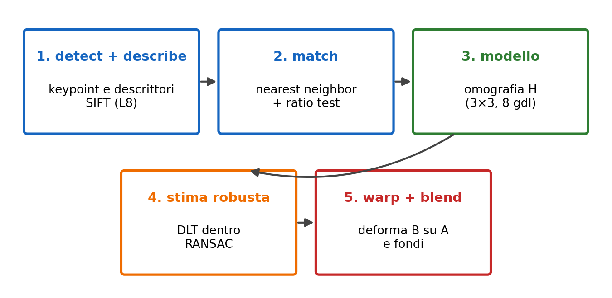
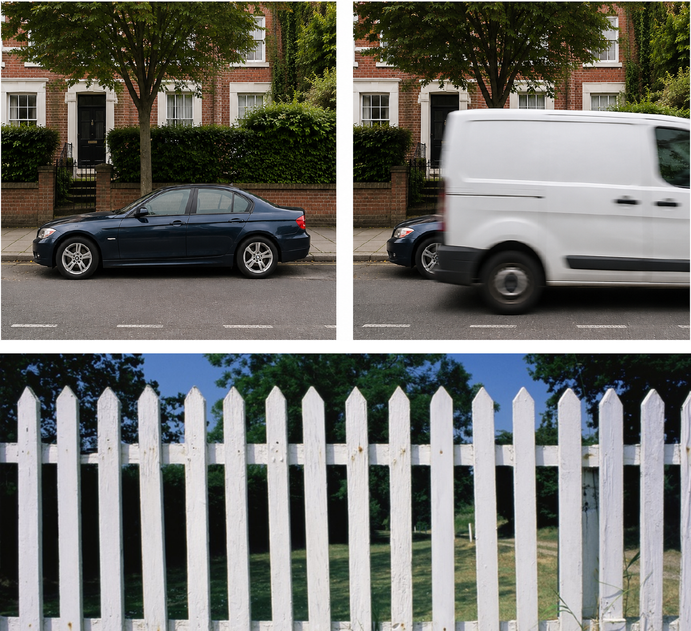
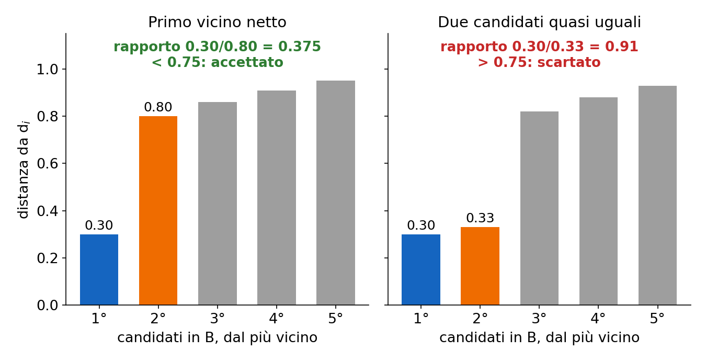
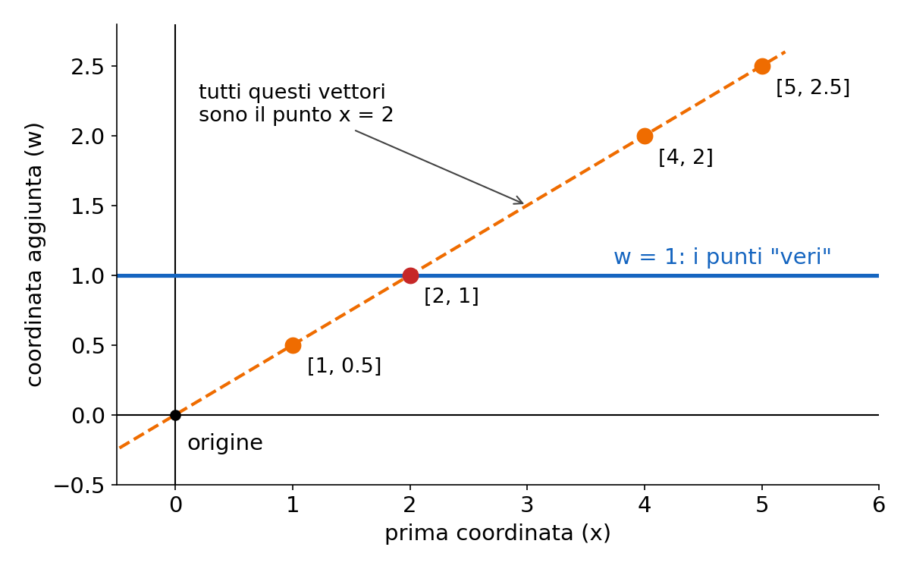
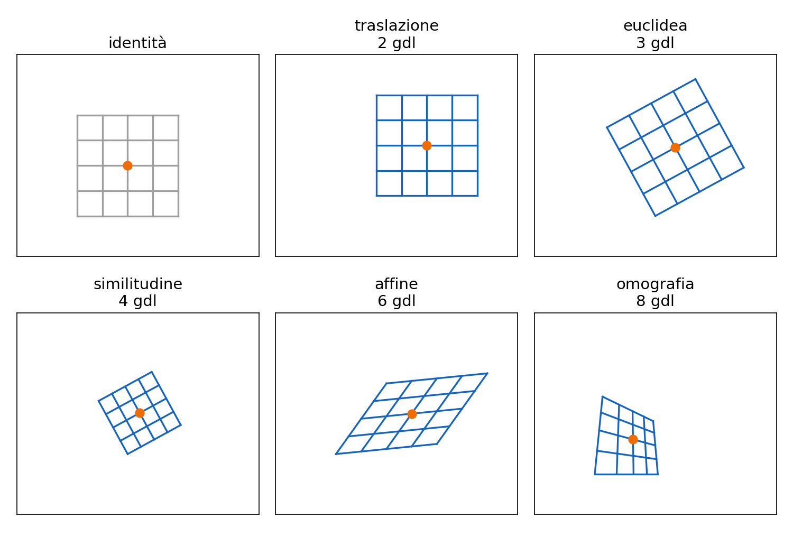
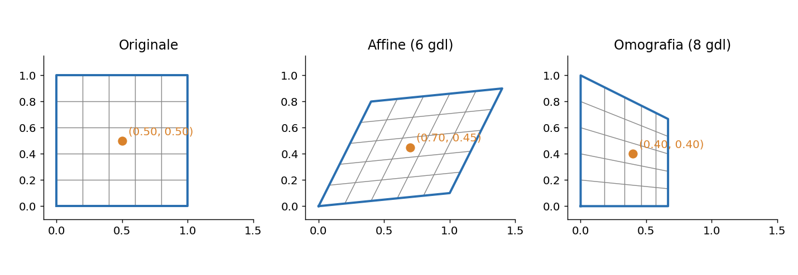
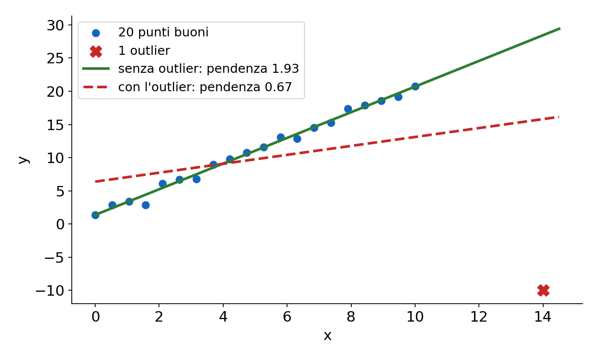
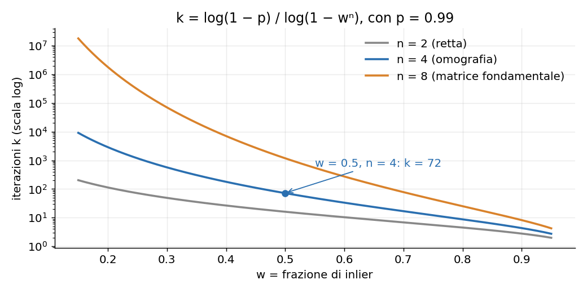

# L9 · Omografie e panorami

*Lezione 9 · Antonio Carta · 1 ottobre 2026*

[Versione interattiva sul sito, con videolezione](https://gabriele-marsili.github.io/appunti-magistrale-ai/anno-2/computer-vision/sito/#L9) · [Indice della dispensa](README.md)

**In una frase:** per cucire due foto in un panorama si accoppiano i descrittori delle due immagini (nearest neighbor + ratio test), si stima con la DLT dentro RANSAC l'**omografia** H, una matrice 3×3 che porta le coordinate di una foto in quelle dell'altra, e infine si deforma un'immagine nel riferimento dell'altra e si fondono le due con un blending.

### Prima di iniziare

Questa lezione usa tre cose viste prima:

  - **Keypoint e descrittori** ([L8](https://gabriele-marsili.github.io/appunti-magistrale-ai/anno-2/computer-vision/sito/#L8)): Harris e SIFT. Ogni keypoint ha posizione, scala, orientazione e un descrittore di 128 numeri. Qui li assumiamo già calcolati.
  - **Interpolazione e blending** ([L6](https://gabriele-marsili.github.io/appunti-magistrale-ai/anno-2/computer-vision/sito/#L6)): leggere un'immagine in punti non interi (interpolazione bilineare) e fondere due immagini con la piramide laplaciana (la "orapple").
  - **Proiezione prospettica** ([L2](https://gabriele-marsili.github.io/appunti-magistrale-ai/anno-2/computer-vision/sito/#L2)): un punto 3D (X, Y, Z) finisce nell'immagine in (fX/Z, fY/Z). La divisione per Z è il motivo per cui servono le coordinate omogenee.

Di algebra lineare ti servono: sistemi omogenei A h = 0, rango, nucleo e la SVD (A = UΣV⊤).

### Guarda prima questi video

  - [Homogeneous Coordinates - 5 Minutes with Cyrill](https://www.youtube.com/watch?v=PvEl63t-opM) (Video). Cyrill Stachniss. Tutto: perché si aggiunge una coordinata, l'equivalenza a meno di scala, come tornare alle coordinate normali. È la base di tutto il resto.
  - [3x3 Image Transformations](https://www.youtube.com/watch?v=B8kMB6Hv2eI) (Video). Shree Nayar. Facoltativo, prima del prossimo: traslazione, affine e proiettiva in coordinate omogenee (sezione 5 qui sotto).
  - [Computing Homography](https://www.youtube.com/watch?v=l_qjO4cM74o) (Video). Shree Nayar, First Principles of Computer Vision. Tutto: la matrice 3×3, perché 8 gradi di libertà, come si scrive il sistema lineare a partire da 4 coppie e come lo si risolve. Corrisponde alle sezioni 5 e 7 qui sotto.
  - [Dealing with Outliers: RANSAC](https://www.youtube.com/watch?v=EkYXjmiolBg) (Video). Shree Nayar. Tutto: perché i minimi quadrati falliscono con gli outlier e come RANSAC li ignora, con l'esempio della retta.
  - [RANSAC - 5 Minutes with Cyrill](https://www.youtube.com/watch?v=9D5rrtCC_E0) (Video). Cyrill Stachniss. Ripasso compatto, utile soprattutto per la formula del numero di iterazioni.
  - [Warping and Blending Images](https://www.youtube.com/watch?v=D9rAOAL12SY) (Video). Shree Nayar. Da guardare alla fine: warping all'indietro e fusione delle immagini del panorama (sezione 11 qui sotto).

### 1\. Il problema: da tre foto a un panorama

Sei in cima a una torre e vuoi fotografare tutto il paesaggio. Il telefono non lo inquadra in una foto sola. Allora attivi la modalità "Panorama" e giri lentamente il braccio: il telefono scatta tante foto e le cuce in una sola immagine larga. Questa lezione spiega come.

Il punto difficile è che **ogni foto ha le sue coordinate**. Il pixel (500, 200) della prima foto e il pixel (500, 200) della seconda mostrano punti diversi della scena. Serve una funzione che dica, per ogni punto della foto A, **dove si trova lo stesso punto della scena nella foto B**.

La lezione costruisce questa funzione in cinque passi (slide 6 e 48). Tienili a mente: sono la scaletta di tutta la dispensa.

1.  **detect + describe**: keypoint e descrittori SIFT in A e in B ([L8](https://gabriele-marsili.github.io/appunti-magistrale-ai/anno-2/computer-vision/sito/#L8));
2.  **match**: per ogni keypoint di A si cerca il keypoint di B con il descrittore più simile, e si scartano i match dubbi;
3.  **modello**: si sceglie la forma matematica della funzione A → B, che per i panorami è un'**omografia**;
4.  **stima robusta**: si calcolano i parametri dell'omografia dai match con la **DLT**, dentro **RANSAC** che elimina i match sbagliati;
5.  **warp + blend**: si deforma B nel riferimento di A e si fondono le zone sovrapposte.

Lo stesso schema si usa ovunque servano corrispondenze fra immagini: scansionare un documento col telefono, la realtà aumentata che appoggia un oggetto virtuale su un tavolo, le mappe fatte da droni, il calcolo del moto di un'auto a guida autonoma.

> **Il punto**
> 
> Un panorama è una catena: **trova punti simili, scegli un modello geometrico, stimalo ignorando gli errori, deforma e fondi**. Ogni anello ha un suo problema e una sua soluzione.

### 2\. Accoppiare i descrittori: nearest neighbor

**Il problema.** Da A hai un elenco di coppie (pi, di): pi è la posizione in pixel del keypoint i, di il suo descrittore. Da B hai le coppie (qj, ej). Vuoi sapere quale keypoint di B è "lo stesso" di ogni keypoint di A.

Un **match è una coppia (i, j) che secondo noi rappresenta lo stesso punto della scena**. I match giusti si chiamano **inlier**, quelli sbagliati **outlier**. In questa fase si guardano **solo i descrittori**: la geometria entra dopo.

**L'idea.** Ogni descrittore è un punto in uno spazio a 128 dimensioni. Descrittori di zone che si somigliano sono punti vicini. Quindi, per ogni di, prendi il descrittore di B più vicino: è il **nearest neighbor** (NN, vicino più prossimo).

**La matematica.**

`j* = argminj ‖di − ej‖2`

Qui ‖·‖2 è la distanza euclidea fra due vettori di 128 numeri, e argminj vuol dire "l'indice j che rende minima la distanza". A parole: "il partner di i è il descrittore di B più simile al suo".

La distanza deve adattarsi al descrittore (slide 12). SIFT è fatto di numeri reali: si usa l'euclidea. ORB e BRIEF sono stringhe di bit: si usa la **distanza di Hamming, il numero di bit diversi**. Si calcola con uno XOR e un conteggio dei bit a 1, **velocissimo**.

**Esempio.** Due descrittori binari di 8 bit: 10110010 e 10011010. Lo XOR è 00101000: due bit a 1, quindi distanza di Hamming 2. Un descrittore vero ha 256 bit, ma il conto è lo stesso.

**Cosa va storto.** Il nearest neighbor **dà sempre una risposta**, anche quando la risposta giusta non esiste. Due casi tipici (slide 7–8):

  - **occlusione**: un furgone copre nella foto B l'auto visibile in A. I keypoint dell'auto non hanno corrispondente, ma il NN **ne sceglie comunque uno, a caso**;
  - **strutture ripetute**: una staccionata di assi identiche. La punta di ogni asse è un ottimo keypoint, ma i descrittori sono quasi uguali, e **il più vicino può essere l'asse accanto**.

> **Il punto**
> 
> Il nearest neighbor accoppia ogni descrittore di A al più simile di B (euclidea per SIFT, Hamming per i binari). Il suo difetto: **non sa dire "non c'è"**, e con occlusioni o pattern ripetuti produce match sbagliati.

### 3\. Scartare i match dubbi: ratio test e mutual NN

**Il problema.** Come capire se il nearest neighbor è affidabile? Una soglia sulla distanza non basta: in una zona poco distintiva (cielo, prato, muro di mattoni) anche il match giusto può essere lontano, e in una zona ricca anche un match sbagliato può essere vicino.

**L'idea di Lowe.** Non chiederti "quanto è vicino il migliore?", ma **"quanto è più vicino del secondo?"**. Se il vero corrispondente esiste, spicca su tutti gli altri. Se primo e secondo sono quasi alla pari, la scelta è una moneta lanciata.

**La matematica.** Per ogni di trova i **due** descrittori di B più vicini, ej1 (il migliore) ed ej2 (il secondo). Il **ratio test** accetta il match solo se:

`‖di − ej1‖ / ‖di − ej2‖ < τ,   τ ≈ 0.7–0.8`

A parole: la distanza dal primo deve essere al massimo il 70–80% di quella dal secondo.

**Esempio svolto.** Distanze 0.30 e 0.80: rapporto 0.375, il primo vicino spicca, match accettato. Distanze 0.30 e 0.33: rapporto 0.91, due candidati quasi equivalenti, match scartato. La distanza dal primo è la stessa (0.30): **una soglia assoluta non li distinguerebbe** (slide 13).

Funziona davvero: Lowe riporta che **con soglia 0.8 si elimina circa il 90% dei match falsi perdendo meno del 5% di quelli giusti** (riquadro alla slide 14).

#### Come scegliere τ: precision e recall

Due misure dicono quanto è buono un insieme di match (slide 15):

  - **precision**: fra i match accettati, quanti sono giusti;
  - **recall**: fra i match giusti che esistono, quanti ne hai trovati.

Con τ piccola (0.6) accetti solo match netti: **alta precision** ma **basso recall**. Con τ grande (0.9) il contrario. È un compromesso: per un panorama con tanti keypoint conviene la precision, se i keypoint sono pochi conviene il recall. Nel notebook del corso τ = 0.75.

#### Mutual nearest neighbor

Un secondo filtro, combinabile col primo. Il **mutual NN** accetta (i, j) solo se **j è il più vicino a i e i è il più vicino a j** (slide 16). Esempio: a1 e a2 di A scelgono entrambi b1 di B; ma b1, guardando in A, sceglie a1. Resta solo (a1, b1). Così **si eliminano i casi "molti a uno"**, al prezzo di perdere qualche match giusto.

Anche dopo questi filtri **restano sempre outlier** (slide 32). Se ne occuperà RANSAC.

> **Il punto**
> 
> Il ratio test tiene un match solo se **il primo vicino è nettamente più vicino del secondo**; τ regola il compromesso fra precision e recall. Il mutual NN controlla i due versi. Riducono gli outlier, non li azzerano.

### 4\. Coordinate omogenee

**Il problema.** Ora vogliamo scrivere la funzione che porta A in B. Le trasformazioni che ci interessano contengono traslazioni e divisioni (come la proiezione fX/Z di [L2](https://gabriele-marsili.github.io/appunti-magistrale-ai/anno-2/computer-vision/sito/#L2)). Con le coordinate normali **una traslazione non è un prodotto matrice-vettore** (p′ = p + t), e una divisione nemmeno. Vorremmo invece che tutto fosse "moltiplica per una matrice", per poter comporre le trasformazioni moltiplicando matrici.

**L'idea.** Si aggiunge una coordinata in più, e si accetta che lo stesso punto abbia tante scritture diverse, tutte multiple fra loro. La divisione viene rimandata all'ultimo momento.

**La matematica** (visionbook § 38.2):

`(x, y) → [x, y, 1]⊤,   [x, y, w]⊤ → (x/w, y/w)`

e **tutti i multipli non nulli \[λx, λy, λw\]⊤ rappresentano lo stesso punto**. Per tornare alle coordinate normali si divide per l'ultima componente.

**Esempio svolto.** \[2, 4, 1\], \[4, 8, 2\] e \[−1, −2, −0.5\] sono tutti il punto (2, 4). Per traslare (3, 4) di (2, 1):

`[[1, 0, 2], [0, 1, 1], [0, 0, 1]] · [3, 4, 1]⊤ = [5, 5, 1]⊤ → (5, 5)`

Due vantaggi:

  - **la traslazione diventa una matrice**, quindi **tutte le trasformazioni si compongono moltiplicando matrici**;
  - **la divisione si rimanda alla fine**: un prodotto matrice-vettore, poi una divisione per la terza componente. Se il prodotto dà \[6, 4, 2\], il punto è (3, 2). È esattamente quello che fa una camera.

**Le rette** (§ 38.4). La retta ax + by + c = 0 diventa il vettore l = \[a, b, c\]⊤, e **un punto p sta sulla retta se l⊤p = 0**. Esempio: l = \[1, −1, 0\] è la retta y = x, e p = \[2, 2, 1\] dà 2 − 2 + 0 = 0, quindi ci sta sopra. La retta per due punti è il prodotto vettoriale l = p1 × p2; per p1 = \[0, 0, 1\] e p2 = \[1, 1, 1\] viene \[−1, 1, 0\], di nuovo y = x. Tre punti sono allineati se e solo se det\[p1 p2 p3\] = 0. Ci servirà per capire perché l'omografia conserva le rette.

> **Il punto**
> 
> In coordinate omogenee si aggiunge un 1, si moltiplica per una matrice 3×3 e alla fine si divide per la terza componente. **Punti multipli fra loro sono lo stesso punto**: è questo che rende "lineari" traslazioni e prospettiva.

### 5\. L'omografia

**Il problema.** Che forma deve avere la funzione A → B? Se fosse solo uno spostamento, basterebbe una traslazione. Ma quando giri la fotocamera le cose lontane dal centro si deformano: i rettangoli diventano trapezi. Serve una famiglia di trasformazioni abbastanza ricca.

**L'idea.** In coordinate omogenee ogni trasformazione del piano che ci interessa è una matrice 3×3. Le famiglie si distinguono per quanti parametri liberi hanno (**gradi di libertà**, gdl) e per cosa conservano (visionbook § 38.3). Più gdl, più libertà, meno cose conservate:

  - **traslazione**, 2 gdl: sposta e basta;
  - **euclidea o rigida** (rotazione + traslazione), 3 gdl: conserva lunghezze e angoli;
  - **similitudine** (+ scala uniforme), 4 gdl: conserva angoli e rapporti fra lunghezze;
  - **affine**, matrice con ultima riga \[0, 0, 1\], 6 gdl: conserva il parallelismo e i punti medi;
  - **proiettiva o omografia**, matrice 3×3 qualunque invertibile, 8 gdl: conserva solo le rette (e il birapporto, un rapporto fra quattro punti allineati).

L'omografia è quindi il gradino più generale, **non una trasformazione rigida**: le slide 5 e 32 la chiamano "rigid", ed è sbagliato (vedi il riquadro Attenzione alla slide 32).

**La matematica.** Applicare H a un punto si fa in tre passi (slide 24): omogeneizza, moltiplica, dividi per la terza componente.

`p′ ∝ H p,   H ∈ ℝ3×3`

Il simbolo ∝ vuol dire "uguale a meno di un fattore di scala". Scritta per intero, con H = \[\[h11, h12, h13\], \[h21, h22, h23\], \[h31, h32, h33\]\], la mappa (x, y) → (x′, y′) è (slide 25):

`x′ = (h11x + h12y + h13) / (h31x + h32y + h33),   y′ = (h21x + h22y + h23) / (h31x + h32y + h33)`

Il denominatore comune è la terza componente di H\[x, y, 1\]⊤. Se h31 = h32 = 0 il denominatore è costante e torni all'affine: **tutta la "prospettiva" sta nell'ultima riga**.

**Perché 8 gradi di libertà e non 9.** H e 2H danno lo stesso risultato: il fattore 2 compare sopra e sotto la frazione e si semplifica. Quindi **H è definita a meno di un fattore di scala: delle 9 entrate solo 8 contano**. Si può per esempio fissare h33 = 1 o ‖H‖ = 1.

**Perché conserva le rette.** Se p′ = Hp e il punto p sta sulla retta l (l⊤p = 0), allora l⊤H−1p′ = 0, cioè p′ sta sulla retta l′ = H−⊤l. Tutti i punti di una retta finiscono su una retta. La proprietà va enunciata su **tre punti allineati: la slide 22 la dice su due, che sono sempre allineati** (riquadro Attenzione alla slide 22).

#### Esempio svolto

Prendi H = \[\[1, 0, 0\], \[0, 1, 0\], \[0.5, 0, 1\]\] e applicala al quadrato unitario:

  - (0, 0) → \[0, 0, 1\] → (0, 0).
  - (1, 0) → \[1, 0, 1.5\] → (0.667, 0).
  - (1, 1) → \[1, 1, 1.5\] → (0.667, 0.667).
  - (0, 1) → \[0, 1, 1\] → (0, 1).
  - il centro (0.5, 0.5) → \[0.5, 0.5, 1.25\] → (0.4, 0.4).

Il quadrato diventa un trapezio: il lato destro si accorcia perché lì il denominatore 1 + 0.5x è più grande. I lati sopra e sotto, che erano paralleli, **non lo sono più**. Il punto medio del lato inferiore, (0.5, 0), va in (0.4, 0), non nel punto medio (0.333, 0) del lato trasformato: **le distanze non si conservano**. **Le rette sì**: tutte le righe della griglia restano rette.

> **Il punto**
> 
> Un'**omografia è una matrice 3×3 invertibile definita a meno di scala: 8 gdl, conserva solo le rette**. Si applica moltiplicando in coordinate omogenee e dividendo per la terza componente.

### 6\. Quando due foto sono legate da un'omografia

**Il problema.** L'omografia è una trasformazione del piano. Ma il mondo è in 3D: perché due foto vere dovrebbero essere legate da una matrice 3×3? Il visionbook (§ 41.2) mostra che succede in **due casi precisi** (slide 27), e solo in quelli.

#### Caso 1: la camera ruota attorno al centro ottico

**L'idea.** Se giri la testa senza spostarla, ogni raggio che esce dal tuo occhio resta lo stesso raggio: cambia solo dove cade sul "piano immagine". Tutti i punti 3D su uno stesso raggio, vicini o lontani, finiscono nello stesso pixel in entrambe le foto. Quindi **la profondità non conta**.

**La matematica.** Usiamo il modello di camera di [L2](https://gabriele-marsili.github.io/appunti-magistrale-ai/anno-2/computer-vision/sito/#L2) in forma matriciale: λ\[x, y, 1\]⊤ = K\[X, Y, Z\]⊤. Qui \[X, Y, Z\] è il punto 3D nel riferimento della camera, K è la matrice 3×3 degli **intrinseci** (focale f e centro dell'immagine cx, cy: K = \[\[f, 0, cx\], \[0, f, cy\], \[0, 0, 1\]\]) e λ è la profondità, il fattore per cui si divide.

Mettiamo il riferimento del mondo sulla camera 1. La camera 2 sta nello stesso punto ma è ruotata di R (matrice di rotazione 3×3):

`λ1[x, y, 1]⊤ = K[X, Y, Z]⊤,   λ2[x′, y′, 1]⊤ = K R [X, Y, Z]⊤`

Dalla prima ricavi \[X, Y, Z\]⊤ = λ1K−1\[x, y, 1\]⊤ e lo sostituisci nella seconda:

`[x′, y′, 1]⊤ ∝ K R K−1 [x, y, 1]⊤,   H = K R K−1`

La profondità Z è sparita: **qualunque sia la scena, vicina o lontana, piatta o no, i due piani immagine sono legati da H**.

**Esempio numerico.** Camera 640×480 con f = 500, cx = 320, cy = 240, e una rotazione di 10° attorno all'asse verticale. Calcolando K R K−1 con numpy e applicandola al centro dell'immagine (320, 240) si ottiene (408.2, 240): il centro si sposta di 500 · tan 10° ≈ 88 pixel in orizzontale, come ti aspetti girando la testa. Gli altri punti si spostano in modo un po' diverso, e per questo le foto laterali diventano trapezi.

#### Caso 2: la scena è un piano

**L'idea.** Ora la camera può anche spostarsi, ma guarda una superficie piana: un muro, una pagina, la fila di dorsi di libri della slide 23. Un piano visto da due punti diversi si deforma come una cartolina inclinata: è un'omografia. È il principio delle app che "raddrizzano" un documento fotografato di sbieco.

**La matematica.** Mettiamo il riferimento del mondo sul piano, così che i suoi punti abbiano Z = 0. Il modello completo della camera è λp = K\[R | t\]\[X, Y, Z, 1\]⊤, con t la traslazione. Con Z = 0 la terza colonna di R viene moltiplicata per zero e sparisce:

`λ[x, y, 1]⊤ = K [c1 c2 t] [X, Y, 1]⊤`

dove c1, c2 sono le prime due colonne di R. K\[c1 c2 t\] è una matrice 3×3: **il piano del mondo e l'immagine sono legati da un'omografia** H1. Con una seconda camera c'è un'altra omografia H2, e fra le due immagini la mappa è H2H1−1, ancora un'omografia.

#### Quando non vale: la parallasse

Se la camera **trasla** e la scena **non è piana**, **il modello si rompe**. Spostando la camera di t, un punto a profondità Z si sposta nell'immagine di circa f·t/Z: gli oggetti vicini scorrono molto, quelli lontani poco. È la **parallasse**, quella che vedi dal finestrino del treno. **Nessuna singola H produce spostamenti che dipendono da Z**.

**Esempio.** f = 500 pixel, ti sposti di t = 10 cm. Un albero a 2 m scorre di 500 · 0.1 / 2 = 25 pixel; una montagna a 2 km di 0.025 pixel. La montagna si allinea con un'omografia, l'albero no. Ruotando il telefono a mano il centro ottico si sposta di qualche centimetro: trascurabile per un paesaggio, visibile come **doppie immagini ("ghosting")** per oggetti vicini.

> **Il punto**
> 
> Due foto sono legate da un'omografia **se la camera ruota senza spostarsi (H = KRK−1) oppure se la scena è un piano**. Se la camera trasla davanti a una scena 3D c'è parallasse e **nessuna omografia basta**.

### 7\. Stimare H dalle corrispondenze: la DLT

**Il problema.** Abbiamo i match e sappiamo che A e B sono legate da un'omografia. Ma quanto valgono le 9 entrate di H? Le slide (28–29) trattano la DLT come una scatola nera e rimandano a una lezione futura; il libro (§ 41.3.1) la spiega già, ed è breve.

**Quante coppie servono.** H ha 8 incognite. Ogni coppia (x, y) ↔ (x′, y′) dà due equazioni, una per x′ e una per y′. Quindi **servono almeno 4 coppie, con nessuna terna allineata** (slide 26). Con lo stesso conto: un'affine (6 gdl) richiede 3 coppie, una similitudine 2, una traslazione 1.

**L'idea.** L'equazione di x′ è una frazione, quindi non è lineare nelle incognite. Il trucco della **DLT (Direct Linear Transform)** è moltiplicare per il denominatore: l'equazione diventa lineare, e un sistema lineare si risolve con l'algebra di base.

**La matematica.** Moltiplica entrambi i lati per il denominatore e porta tutto a sinistra:

`x′(h31x + h32y + h33) − (h11x + h12y + h13) = 0`

Questa è lineare nelle h. Mettendo le 9 entrate in un vettore h = \[h11, h12, h13, h21, …, h33\]⊤, ogni coppia dà due righe:

`[ x  y  1  0  0  0  −x′x  −x′y  −x′ ] · h = 0[ 0  0  0  x  y  1  −y′x  −y′y  −y′ ] · h = 0`

Impilando N coppie ottieni il sistema **A h = 0, con A di dimensione 2N × 9**.

**Verifica sull'esempio.** Nella sezione 5 la coppia (1, 0) → (0.667, 0). Le due righe sono \[1, 0, 1, 0, 0, 0, −0.667, 0, −0.667\] e \[0, 0, 0, 1, 0, 1, 0, 0, 0\]. Con h = \[1, 0, 0, 0, 1, 0, 0.5, 0, 1\] la prima dà 1 − 0.667·0.5 − 0.667 = 0 e la seconda 0 + 0 = 0.

**Risolvere.** h = 0 risolve sempre il sistema ma non serve. Poiché la scala è arbitraria, si cerca il vettore di **norma 1** che rende ‖Ah‖ il più piccolo possibile. La soluzione è **l'ultimo vettore singolare destro della SVD di A** (ultima riga di V⊤), cioè l'autovettore di A⊤A con l'autovalore minimo. Con 4 coppie esatte A ha rango 8, il nucleo è una retta e la soluzione è esatta; con più coppie rumorose il minimo non è zero e ottieni la soluzione ai minimi quadrati.

    import numpy as np
    
    def apply(H, p):                       # p: (N, 2) -> (N, 2)
        ph = np.c_[p, np.ones(len(p))] @ H.T
        return ph[:, :2] / ph[:, 2:]       # de-omogeneizza
    
    def dlt(p, q):                         # p in A, q in B, (N, 2), N >= 4
        A = []
        for (x, y), (u, v) in zip(p, q):
            A.append([x, y, 1, 0, 0, 0, -u*x, -u*y, -u])
            A.append([0, 0, 0, x, y, 1, -v*x, -v*y, -v])
        _, _, Vt = np.linalg.svd(np.array(A))
        H = Vt[-1].reshape(3, 3)           # ultimo vettore singolare destro
        return H / H[2, 2]

Tre dettagli che il libro e le schede aggiungono:

  - ‖Ah‖ è un **errore algebrico, non in pixel**: la DLT è un punto di partenza da rifinire minimizzando l'errore in pixel.
  - In pixel la matrice A mescola 1 e x′x ≈ 105, e la SVD diventa imprecisa: **si normalizzano prima i punti** (centro nell'origine, distanza media √2; Hartley, riquadro alla slide 29).
  - Se tre dei quattro punti sono **allineati** A ha rango 7 e **le soluzioni sono infinite**: configurazione degenere (slide 51).

> **Il punto**
> 
> La DLT rende lineari le equazioni moltiplicando per il denominatore: due righe per coppia, A h = 0, e **h è l'ultimo vettore singolare destro di A**. Servono 4 coppie in posizione generale.

### 8\. Il guaio degli outlier

**Il problema.** Con più di 4 coppie la DLT è un problema ai **minimi quadrati**: minimizza la somma dei residui al quadrato, ∑i ri2, dove il residuo ri misura quanto la coppia i viola il modello. Il quadrato è il guaio (slide 33): **un residuo 100 pesa come diecimila residui 1**. Un solo match sbagliato e lontano può trascinare la soluzione dove vuole.

**Esempio.** La slide 34 lo mostra con una retta, il caso più semplice: venti punti su y ≈ 2x + 1 e un solo outlier in (14, −10). La figura qui sotto rifà l'esperimento.

E di outlier ne abbiamo sempre, anche dopo il ratio test (slide 31): strutture ripetute, occlusioni, cambi di luce o di punto di vista, sfondi disordinati. C'è anche una **circolarità**: per sapere quali match sono outlier servirebbe H, e per stimare bene H servirebbe sapere quali sono gli outlier.

> **Il punto**
> 
> **I minimi quadrati non sono robusti**: anche un solo outlier lontano sposta la soluzione a piacere. Servono stimatori robusti, che limitano l'influenza dei singoli punti.

### 9\. RANSAC

**Il problema.** Vogliamo H da 200 match, di cui magari 80 sbagliati, senza sapere quali.

**L'idea.** I minimi quadrati usano tutti i dati e sperano che gli errori si compensino. **RANSAC (RANdom SAmple Consensus, Fischler e Bolles 1981)** fa il contrario: costruisce tante ipotesi usando il **minimo numero di dati possibile**, così che almeno qualche ipotesi sia fatta di soli inlier, e poi chiede a tutti i dati di "votare". Un'ipotesi giusta raccoglie i voti di tutti gli inlier; un'ipotesi costruita con un outlier raccoglie pochi voti, **perché gli outlier non sono d'accordo fra loro**. È come un'elezione: vince il modello con il **consenso più grande**.

**L'algoritmo** (slide 38). Ripeti k volte:

1.  **campiona** a caso il numero minimo n di coppie che determina il modello: n = 4 per un'omografia, n = 2 per una retta;
2.  **stima** il modello dal campione (per H, la DLT con 4 coppie: soluzione esatta);
3.  **conta** gli inlier: le coppie il cui errore è sotto una soglia t;
4.  **tieni** il modello se ha più inlier del migliore trovato finora.

Alla fine **ristima H con la DLT su tutti gli inlier del modello migliore**: il campione minimo serve a trovare chi sono gli inlier, la precisione si recupera usandoli tutti.

**Quando un match è inlier** (slide 39). Si proietta p con H e si misura la distanza in pixel dal punto q che il matching aveva proposto: errore in un verso d(q, Hp), oppure simmetrico d(q, Hp)2 + d(p, H−1q)2. La soglia t dipende dal rumore atteso, tipicamente 3–5 pixel (4.0 nel notebook). **t troppo piccola butta via inlier veri, troppo grande accetta outlier** (slide 42).

#### Quante iterazioni

**Il problema.** RANSAC tira a sorte: quante volte bisogna estrarre per essere quasi sicuri di pescare almeno un campione tutto di inlier?

**La matematica.** Sia **w** la frazione di inlier fra i match (per esempio 0.5) e **n** la dimensione del campione. La derivazione (slide 41, visionbook eq. 41.8) è un conto di probabilità in tre passi:

  - un campione è tutto di inlier con probabilità wn (n estrazioni, ciascuna inlier con probabilità w; trascuriamo che si estrae senza rimpiazzo);
  - contiene almeno un outlier con probabilità 1 − wn;
  - k campioni indipendenti contengono **tutti** almeno un outlier con probabilità (1 − wn)k: è la probabilità di fallire.

Vuoi che la probabilità di successo sia almeno **p** (tipicamente 0.99), cioè che il fallimento sia 1 − p. Imponi (1 − wn)k = 1 − p e prendi il logaritmo:

`k = log(1 − p) / log(1 − wn),   arrotondato per eccesso`

**Esempio svolto.** Omografia (n = 4), metà dei match giusti (w = 0.5), p = 0.99. w4 = 0.0625, quindi 1 − w4 = 0.9375. log(0.01) = −4.605, log(0.9375) = −0.0645. k = 4.605 / 0.0645 ≈ 71.4, quindi **72 iterazioni**. Con w = 0.6 bastano 34, con w = 0.8 ne bastano 9.

Due osservazioni importanti:

  - **k non dipende dal numero di match**, solo da w, n e p.
  - **k esplode quando n cresce e w cala**: il campione minimo massimizza wn.

Tre errori da non copiare:

  - La slide 41 definisce p come "la probabilità che tutti i punti siano inlier": **è sbagliato**, **p è la confidenza di trovare almeno un campione pulito** (riquadro Attenzione alla slide 41).
  - L'esempio numerico del libro (una retta, n = 2) usa w = 0.18 per 2 outlier su 11 punti, che è la frazione di outlier: con la definizione corretta w = 9/11 ≈ 0.82 e con p = 0.95 servono 3 iterazioni, non 91 (riquadro alla slide 41).
  - Il "50% di outlier" della slide 42 non è un limite di RANSAC: con n = 4 e il 70% di outlier bastano circa 570 iterazioni. Il problema è il costo, che cresce in fretta.

RANSAC in numpy, usando le funzioni della sezione 7:

    rng = np.random.default_rng(0)
    
    def ransac_h(p, q, t=3.0, k=1000):
        best = np.zeros(len(p), bool)
        for _ in range(k):
            idx = rng.choice(len(p), 4, replace=False)       # campione minimo
            H = dlt(p[idx], q[idx])
            err = np.linalg.norm(apply(H, p) - q, axis=1)     # errore in un verso, pixel
            inl = err < t
            if inl.sum() > best.sum():
                best = inl
        return dlt(p[best], q[best]), best                    # ristima su tutti gli inlier

Provato su 200 match sintetici con il 40% di outlier: H ritrovata a meno di qualche per cento. In pratica si scartano anche i campioni degeneri e si aggiorna k ricalcolando w quando si trova un modello migliore.

> **Il punto**
> 
> RANSAC: **campione minimo, modello, conta gli inlier entro t, ripeti, tieni il migliore e ristima su tutti i suoi inlier**. Il numero di iterazioni k = log(1 − p)/log(1 − wn) dipende solo da w, n e p: 72 per n = 4, w = 0.5, p = 0.99.

### 10\. Matching appreso, in breve

**Il problema.** Nel matching classico **ogni descrittore è confrontato da solo**, senza guardare i vicini (slide 44). Fallisce con cambi di vista estremi (oltre circa 60°), zone con poca texture, pattern ripetitivi, immagini buie e rumorose.

**L'idea.** Un umano non accoppia un punto alla volta: guarda anche il contesto ("questo spigolo sta sotto quella finestra"). Le reti neurali di matching fanno lo stesso con l'**attenzione**, il meccanismo dei transformer.

  - **SuperGlue** (2020, slide 45) tratta il matching come un **problema di assegnamento su un grafo**: i keypoint delle due immagini sono i nodi. La **self-attention** raffina ogni descrittore guardando gli altri keypoint della stessa immagine; la **cross-attention** guarda quelli dell'altra. **Un punto può restare senza partner**, quindi le occlusioni sono gestite.
  - **LightGlue** (2023, slide 46) riprogetta SuperGlue per la **velocità**: si ferma prima sulle coppie facili e scarta durante il calcolo i keypoint poco promettenti. Secondo la slide è 2–10 volte più veloce con accuratezza simile.

Vantaggi: sono addestrati su moltissime coppie di immagini e usano il contesto. Ma **non sostituiscono RANSAC**: i loro match passano comunque dalla stima robusta.

> **Il punto**
> 
> SuperGlue e LightGlue accoppiano i keypoint **usando il contesto** tramite self- e cross-attention, e reggono casi in cui il ratio test fallisce. Il resto della pipeline (RANSAC, warp) non cambia.

### 11\. Dalla H al panorama: warping e blending

**Il problema.** Ora hai H. Resta da costruire l'immagine (slide 49): deformare B nel riferimento di A e incollarle senza che si veda la giunta.

#### Warping all'indietro

**L'idea sbagliata.** Prendere ogni pixel di B e mandarlo nel riferimento di A (**forward mapping**). **Lascia buchi**: le posizioni d'arrivo non sono intere e, dove l'immagine si allarga, alcuni pixel non li raggiunge nessuno.

**L'idea giusta** (visionbook § 38.5): il **backward mapping**. Per ogni pixel dell'immagine di uscita ti chiedi "da quale punto di B arriva?", applichi la mappa dall'uscita a B, e leggi B in quel punto con l'**interpolazione bilineare** di [L6](https://gabriele-marsili.github.io/appunti-magistrale-ai/anno-2/computer-vision/sito/#L6). **Ogni pixel di uscita riceve un valore, niente buchi**.

**Esempio.** Ingrandisci una riga di 100 pixel a 200. Col forward mapping il pixel 3 va in 6, il 4 in 8: il pixel di uscita 7 non lo riempie nessuno, e così metà dell'uscita. Col backward mapping il pixel di uscita 7 si chiede da dove viene: da 3.5, e prende la media dei pixel 3 e 4.

**Attenzione al verso.** Il warping all'indietro usa la mappa **dall'uscita all'ingresso**. Se H va da A a B (come nella lezione: errore d(q, Hp) con p in A) e l'uscita è nel riferimento di A, si campiona B in H(x′, y′), **non in H−1(x′, y′) come scrive la slide 49** (riquadro Attenzione alla slide 49). Si usa H−1 solo se H è stata stimata da B ad A.

#### Più di due immagini

(visionbook § 41.3.3) Si stima H fra ogni coppia di foto vicine, si sceglie come riferimento la foto **centrale** e si portano le altre nel suo riferimento componendo le omografie: H1→3 = H2→3H1→2. La figura della sezione 6 mostra perché la centrale: le foto laterali si allargano tanto più quanto sono lontane dal riferimento. Per panorami molto larghi **il piano non basta (l'omografia esplode verso i 90°)** e si proietta su un cilindro o una sfera (Szeliski cap. 8).

#### Blending

**Il problema.** Anche con un allineamento perfetto **la giunzione si vede**: esposizioni diverse, vignettatura (bordi più scuri), oggetti che si muovono fra uno scatto e l'altro.

**Le soluzioni:**

  - **feathering**: una media pesata in cui il peso di ogni immagine cala verso i suoi bordi;
  - scelta di una **cucitura** (seam) che passi dove le immagini si somigliano, evitando per esempio una persona in movimento;
  - **blending multi-banda** con la piramide laplaciana di [L6](https://gabriele-marsili.github.io/appunti-magistrale-ai/anno-2/computer-vision/sito/#L6): **fonde le basse frequenze su una fascia larga (niente salti di colore) e le alte su una fascia stretta (niente doppi contorni)**.

**Esempio.** A copre x da 0 a 60 con luminosità 0.45, B copre x da 40 a 100 con 0.70. Al centro della sovrapposizione, x = 50, i pesi sono 0.5 e 0.5: il panorama vale 0.5 · 0.45 + 0.5 · 0.70 = 0.575. A x = 45 il peso di A è 0.75: 0.75 · 0.45 + 0.25 · 0.70 = 0.51. Il gradino diventa una rampa.

Tutta la pipeline in OpenCV sta in poche righe (A e B immagini in scala di grigi, panorama nel riferimento di A):

    import cv2, numpy as np
    sift = cv2.SIFT_create()
    kA, dA = sift.detectAndCompute(A, None)
    kB, dB = sift.detectAndCompute(B, None)
    knn = cv2.BFMatcher(cv2.NORM_L2).knnMatch(dA, dB, k=2)
    good = [m for m, n in knn if m.distance < 0.75 * n.distance]     # ratio test
    pA = np.float32([kA[m.queryIdx].pt for m in good])
    pB = np.float32([kB[m.trainIdx].pt for m in good])
    H_BA, inl = cv2.findHomography(pB, pA, cv2.RANSAC, 4.0)           # da B ad A
    W = cv2.warpPerspective(B, H_BA, (2 * A.shape[1], A.shape[0]))    # warping all'indietro
    W[:, :A.shape[1]] = A                                             # composizione grezza, senza blending

H è stimata da B ad A e `warpPerspective` la inverte internamente. L'ultima riga va sostituita con il blending di L6. Se le ipotesi non valgono si cambia modello (slide 51): affine per i documenti scansionati, geometria epipolare per camere che traslano in scene 3D.

> **Il punto**
> 
> Si deforma con il **warping all'indietro: per ogni pixel di uscita si va a leggere l'ingresso con la mappa uscita → ingresso e si interpola**. Poi si fondono le immagini con feathering o multi-banda per nascondere la giunta.

### Il riassunto in 10 righe

1.  Un panorama si costruisce con detect → describe → match → RANSAC + DLT → warp → blend.
2.  Il matching accoppia i descrittori con il nearest neighbor (euclidea per SIFT, Hamming per descrittori binari), che però risponde sempre, anche quando il partner non c'è.
3.  Il ratio test tiene un match solo se il primo vicino è nettamente più vicino del secondo (rapporto \< 0.7–0.8; τ regola precision e recall); il mutual NN controlla i due versi.
4.  In coordinate omogenee (x, y) → \[x, y, 1\] e i multipli sono lo stesso punto: traslazioni e prospettiva diventano matrici 3×3.
5.  L'omografia è una 3×3 a meno di scala, 8 gdl, conserva solo le rette; si applica moltiplicando e dividendo per la terza componente.
6.  Due foto sono legate da un'omografia se la camera ruota attorno al centro ottico (H = KRK−1) o se la scena è un piano; con traslazione e scena 3D c'è parallasse.
7.  La DLT rende lineari le equazioni: due righe per coppia, A h = 0, h = ultimo vettore singolare destro; servono 4 coppie, nessuna terna allineata.
8.  I minimi quadrati non reggono gli outlier: un solo punto lontano sposta la soluzione a piacere.
9.  RANSAC: campione minimo, modello, conta gli inlier entro t, ripeti, tieni il migliore e ristima; k = log(1 − p)/log(1 − wn), 72 per n = 4, w = 0.5, p = 0.99.
10. Il panorama si compone con il warping all'indietro (mappa dall'uscita all'ingresso, interpolazione bilineare) e un blending, per esempio multi-banda (L6).

### Verifica di aver capito

**Un descrittore ha primo vicino a distanza 0.42 e secondo a 0.47. Lo accetti con τ = 0.75? Cosa può essere successo?**

Rapporto 0.42/0.47 ≈ 0.89 \> 0.75: scartato. Due candidati quasi equivalenti: occlusione o struttura ripetuta.

**Applica H = \[\[2, 0, 1\], \[0, 2, 0\], \[0, 0.1, 1\]\] al punto (3, 4).**

\[3, 4, 1\] → H·\[3, 4, 1\]⊤ = \[2·3 + 1, 2·4, 0.1·4 + 1\] = \[7, 8, 1.4\]. Dividendo per 1.4: (5, 5.71). Senza la divisione avresti ottenuto (7, 8), sbagliato.

**Perché H ha 8 gradi di libertà e perché servono 4 corrispondenze?**

Ha 9 entrate, ma H e λH danno la stessa mappa perché λ si semplifica nella divisione: 9 − 1 = 8. Ogni coppia dà 2 equazioni (per x′ e per y′), quindi 8/2 = 4 coppie, con nessuna terna allineata, altrimenti il sistema ha infinite soluzioni.

**Scatti due foto spostandoti di un metro di lato davanti a un cortile con alberi vicini e montagne sullo sfondo. Puoi cucirle con un'omografia?**

No, non esattamente: la camera trasla e la scena non è piana, quindi c'è parallasse. Le montagne (f·t/Z ≈ 0) si allineano quasi perfettamente, gli alberi daranno doppie immagini.

**Hai 1000 match con il 30% di outlier. Quante iterazioni di RANSAC servono per stimare un'omografia con confidenza 0.99? E se i match fossero 100?**

w = 0.7, n = 4: w4 = 0.2401, k = log(0.01)/log(0.7599) = −4.605/−0.2746 ≈ 16.8, quindi 17. Con 100 match è lo stesso: k dipende solo da w, n e p, non dal numero di punti.

**Perché RANSAC per un'omografia campiona 4 coppie e non, per esempio, 8?**

Perché la probabilità che il campione sia tutto di inlier è wn: con w = 0.5 vale 0.0625 per n = 4 e 0.0039 per n = 8, e le iterazioni passano da 72 a circa 1200. Il campione minimo massimizza la probabilità di pescarne uno pulito; la precisione si recupera dopo, ristimando su tutti gli inlier.

**Nel warping all'indietro, quale mappa usi e perché non il forward mapping?**

Per ogni pixel dell'uscita serve la mappa dall'uscita all'immagine di ingresso, poi si interpola l'ingresso in quel punto (bilineare). Il forward mapping manda i pixel di ingresso in posizioni non intere e lascia buchi dove l'immagine si allarga. Se H va dall'immagine da deformare al riferimento dell'uscita si usa H−1, altrimenti H.

### Come proseguire

  - Visionbook, cap. 41 [Homographies](https://visionbook.mit.edu/homography.html): tutto, è breve (derivazioni del § 41.2, DLT, RANSAC, stitching). Occhio al refuso w = 0.18 nell'esempio di RANSAC.
  - Visionbook, cap. 38 [Representing Images and Geometry](https://visionbook.mit.edu/homogeneous_coordinates.html): § 38.2–38.5 (coordinate omogenee, gerarchia delle trasformazioni, rette, warping).
  - Szeliski, *Computer Vision: Algorithms and Applications*, 2a ed. ([szeliski.org/Book](https://szeliski.org/Book/)): cap. 7, paragrafo Feature matching (ratio test, chiamato NNDR); cap. 8 Image alignment and stitching, paragrafi Pairwise alignment (minimi quadrati robusti e RANSAC), Image stitching (panorami rotazionali, proiezioni cilindriche) e Compositing (feathering, cuciture, blending).
  - Lowe 2004, § 7.1, per la motivazione del ratio test.

Ora ripassa con le schede qui sotto, slide per slide: i riquadri «Dal libro» riprendono le derivazioni, i riquadri Attenzione correggono le slide 22, 32, 41 e 49.
