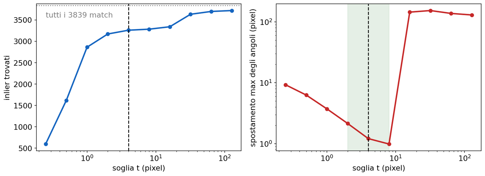
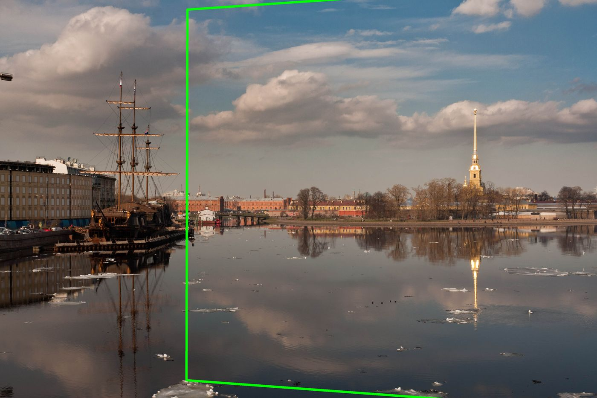
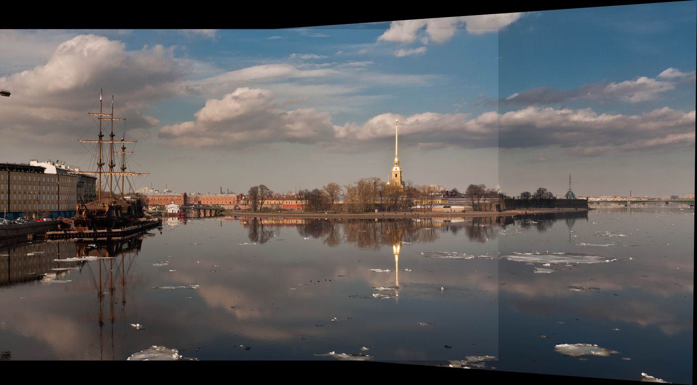
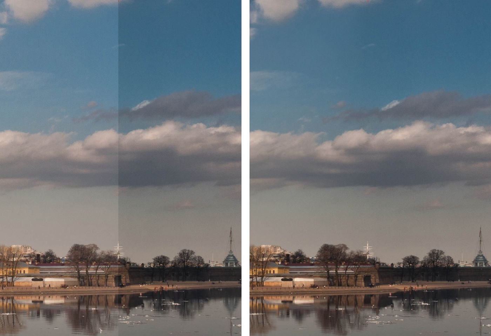

# L10 · Lab panorami

*Lezione 10 · Antonio Carta · laboratorio, 6 ottobre 2026*

[Versione interattiva sul sito, con videolezione](https://gabriele-marsili.github.io/appunti-magistrale-ai/anno-2/computer-vision/sito/#L10) · [Indice della dispensa](README.md)

**In una frase:** il laboratorio rifà a mano, con OpenCV e NumPy, la pipeline del panorama della [L9](https://gabriele-marsili.github.io/appunti-magistrale-ai/anno-2/computer-vision/sito/#L9) su due foto vere: **keypoint SIFT, match con ratio test, omografia stimata con DLT normalizzata dentro RANSAC, warping su una tela abbastanza grande e composizione**; poi lascia fare tutto allo `Stitcher` di OpenCV su sei foto e mostra, numeri alla mano, cosa si rompe quando si salta un passo.

### Prima di iniziare

Lezione di laboratorio: niente slide, un notebook (`panorama.ipynb`) e sei foto della Neva a San Pietroburgo (`boat1.jpg` … `boat6.jpg`, 3888 × 2592 pixel ciascuna), scattate ruotando la fotocamera. Ti servono:

  - dalla [L8](https://gabriele-marsili.github.io/appunti-magistrale-ai/anno-2/computer-vision/sito/#L8): cos'è un keypoint SIFT (posizione, scala, orientazione) e il suo descrittore di 128 numeri;
  - dalla [L9](https://gabriele-marsili.github.io/appunti-magistrale-ai/anno-2/computer-vision/sito/#L9): nearest neighbor e ratio test, coordinate omogenee, omografia (3 × 3, 8 gradi di libertà), DLT, RANSAC e la formula delle iterazioni, warping all'indietro e blending;
  - dalla [L6](https://gabriele-marsili.github.io/appunti-magistrale-ai/anno-2/computer-vision/sito/#L6): interpolazione bilineare e blending con la piramide laplaciana;
  - di Python: NumPy (array, broadcasting, `np.linalg.svd`) e le basi di OpenCV.

La dispensa segue l'ordine della pipeline. Le schede qui sotto seguono il notebook: 1–6 keypoint e match, 7–10 DLT e RANSAC, 11–14 warping e composizione, 15–17 Stitcher ed esercizi. Tutti i numeri vengono dall'esecuzione del notebook con OpenCV 4.13 (RANSAC non ha un seme fisso: il numero di inlier cambia di qualche unità a ogni esecuzione).

### Guarda prima questi video

  - [SIFT Descriptor](https://www.youtube.com/watch?v=IBcsS8_gPzE) (Video). Shree Nayar. Ripasso della L8: che cosa c'è nei 128 numeri che detectAndCompute restituisce per ogni keypoint. Per la sezione 2.
  - [Computing Homography](https://www.youtube.com/watch?v=l_qjO4cM74o) (Video). Shree Nayar, First Principles of Computer Vision. Il sistema lineare A h = 0 e la soluzione con la SVD: è esattamente la funzione dlt\_homography del notebook (sezione 5).
  - [Dealing with Outliers: RANSAC](https://www.youtube.com/watch?v=EkYXjmiolBg) (Video). Shree Nayar. Perché i minimi quadrati non reggono gli outlier e come RANSAC li ignora. Per le sezioni 6–8.
  - [Warping and Blending Images](https://www.youtube.com/watch?v=D9rAOAL12SY) (Video). Shree Nayar. Warping all'indietro e fusione delle immagini: guardalo prima delle sezioni 9–11.

### 1\. Il problema: due foto, un panorama

**Il problema.** Hai due foto dello stesso paesaggio, scattate girando la fotocamera verso destra. La seconda ripete buona parte della prima: la guglia dorata della fortezza compare in tutte e due, ma in posizioni diverse. Vuoi un'unica immagine larga, come fa il telefono in modalità "Panorama".

**L'idea.** È la pipeline della [L9](https://gabriele-marsili.github.io/appunti-magistrale-ai/anno-2/computer-vision/sito/#L9). In questo laboratorio ogni passo corrisponde a una funzione:

1.  **keypoint e descrittori**: `cv2.SIFT_create().detectAndCompute`;
2.  **match**: `cv2.BFMatcher.knnMatch` con k = 2, poi il ratio test;
3.  **stima robusta di H**: `ransac_homography`, scritta a mano, che chiama `dlt_homography` e `reprojection_errors`;
4.  **tela e warping**: `cv2.perspectiveTransform` sugli angoli, una traslazione T, `cv2.warpPerspective`;
5.  **composizione**: si incolla la prima foto sopra la seconda deformata.

Perché funziona con una sola omografia? Perché **la fotocamera ruota attorno al suo centro ottico**, e in quel caso due foto sono legate esattamente da H = K R K−1, qualunque sia la profondità della scena ([L9](https://gabriele-marsili.github.io/appunti-magistrale-ai/anno-2/computer-vision/sito/#L9), sezione 6).

Un dettaglio pratico: **OpenCV carica le immagini in ordine BGR**, non RGB. Prima di disegnarle con matplotlib il notebook le converte con `cv2.cvtColor(img, cv2.COLOR_BGR2RGB)`; altrimenti il cielo esce arancione.

> **Il punto**
> 
> Il panorama è una catena di cinque passi: **keypoint, match, H robusta, tela e warping, composizione**. Il notebook scrive a mano la parte centrale (DLT e RANSAC) e usa OpenCV per il resto.

### 2\. Keypoint SIFT con detectAndCompute

**Il problema.** Per sapere dove sta la seconda foto rispetto alla prima servono punti riconoscibili in entrambe, descritti in modo che lo stesso punto abbia lo stesso "codice" nelle due foto anche se ruotato, ingrandito o illuminato diversamente.

**L'idea.** È esattamente ciò che fa SIFT ([L8](https://gabriele-marsili.github.io/appunti-magistrale-ai/anno-2/computer-vision/sito/#L8)): trova i blob nello scale-space e descrive l'intorno di ciascuno con istogrammi di gradienti orientati.

    gray1 = cv2.cvtColor(img1, cv2.COLOR_BGR2GRAY)
    gray2 = cv2.cvtColor(img2, cv2.COLOR_BGR2GRAY)
    sift = cv2.SIFT_create()
    kps1, desc1 = sift.detectAndCompute(gray1, None)   # None: nessuna maschera
    kps2, desc2 = sift.detectAndCompute(gray2, None)

Cosa restituisce, per ogni immagine:

  - `kps1`: una lista di oggetti **`cv2.KeyPoint`**, ciascuno con `pt` (posizione in pixel, x e y non intere), `size` (diametro della zona, proporzionale alla scala), `angle` (orientazione dominante in gradi) e `response` (quanto è forte il blob);
  - `desc1`: una matrice **N × 128 di float32**, una riga per keypoint.

**Esempio svolto.** Su queste foto SIFT trova **19096** keypoint nella prima e **12804** nella seconda, in circa 3 secondi per immagine. Il primo keypoint della lista, `kps1[0]`, sta in (2.35, 478.26), ha size 1.97, angolo 22.7° e response 0.0195: un dettaglio minuscolo sul bordo sinistro. La size mediana è 2.6 pixel, ma qualche blob arriva a centinaia di pixel.

Il commento del notebook spiega perché si passa al grigio: **il colore dello stesso punto cambia fra due scatti** (luce, ombre, esposizione), la struttura dei gradienti molto meno. In realtà `detectAndCompute` accetta anche l'immagine a colori e la converte da sola (riquadro Attenzione della scheda 2).

> **Il punto**
> 
> `detectAndCompute` dà una lista di `KeyPoint` (posizione, scala, orientazione, forza) e una matrice di descrittori N × 128. **I keypoint cadono dove c'è struttura**, e sono decine di migliaia su foto da 10 megapixel.

### 3\. Match con knnMatch e ratio test

**Il problema.** Per ognuno dei 19096 descrittori della prima foto bisogna trovare il suo partner fra i 12804 della seconda, e capire quando il partner non esiste (un punto fuori dalla zona comune, un riflesso, una finestra fra cento uguali).

**L'idea.** Si prendono per ogni descrittore i **due** più vicini nell'altra foto e si tiene il match solo se il primo spicca nettamente sul secondo: è il ratio test di Lowe ([L9](https://gabriele-marsili.github.io/appunti-magistrale-ai/anno-2/computer-vision/sito/#L9), sezione 3). Se il primo e il secondo sono quasi alla pari, la scelta è una moneta lanciata.

    bf = cv2.BFMatcher(cv2.NORM_L2)            # forza bruta, distanza euclidea
    knn = bf.knnMatch(desc1, desc2, k=2)       # per ogni riga di desc1: i 2 più vicini in desc2
    
    matches = []
    for m, n in knn:                           # m = primo vicino, n = secondo
        if m.distance < ratio * n.distance:    # ratio = 0.75
            matches.append(m)
    
    pts1 = np.float64([kps1[m.queryIdx].pt for m in matches])
    pts2 = np.float64([kps2[m.trainIdx].pt for m in matches])

  - **`BFMatcher` (brute force) confronta ogni descrittore con tutti quelli dell'altra immagine**: 19096 × 12804 ≈ 245 milioni di distanze, circa 7 secondi. `NORM_L2` è la distanza euclidea, quella giusta per SIFT.
  - Ogni elemento di `knn` è una coppia di oggetti **`DMatch`**: `distance` (la distanza fra i descrittori), `queryIdx` (indice nella prima lista) e `trainIdx` (indice nella seconda).
  - `pts1[i]` e `pts2[i]` sono le posizioni in pixel dei due estremi dell'i-esimo match: **da qui in poi si lavora solo con queste coppie di coordinate**.

**Esempio svolto.** Il primo match accettato ha `distance` 163.10, `queryIdx` 79 e `trainIdx` 5091: il keypoint 79 della prima foto va con il 5091 della seconda. Per questo `pts1[0]` = (28.37, 2301.59) non coincide con `kps1[0].pt`: i match sono indicizzati a parte. Il ratio test con τ = 0.75 tiene **3839** match su 19096, circa il 20%.

Mediana del rapporto: 0.51 per i match coerenti con H, 0.96 per gli altri. La figura mostra anche il compromesso: con τ = 0.6 restano 2854 match coerenti al 90%, con τ = 0.9 ne restano 6593 ma solo al 57%.

**Cosa va storto senza ratio test.** Tenendo tutti i nearest neighbor (cioè τ = 1) i match sono 19096, ma **solo 3989, il 21%, sono coerenti con H**. **Il nearest neighbor risponde sempre**, anche per i keypoint del veliero e dei palazzi, che nella seconda foto non ci sono proprio.

> **Il punto**
> 
> `knnMatch(k=2)` dà primo e secondo vicino; il ratio test tiene il match solo se **d1 \< 0.75 · d2**. Qui porta la quota di match giusti **dal 21% all'85%**, che, come si vedrà, è la differenza fra un RANSAC immediato e uno lentissimo.

### 4\. Normalizzare i punti prima della DLT

**Il problema.** La DLT ([L9](https://gabriele-marsili.github.io/appunti-magistrale-ai/anno-2/computer-vision/sito/#L9), sezione 7) scrive per ogni coppia (x, y) → (u, v) due righe di una matrice A, con dentro x, y, 1 e i prodotti u·x, u·y. In pixel x e u arrivano a 4000: **nella stessa riga convivono 1 e numeri dell'ordine di 4 · 106**. Una matrice così è **mal condizionata**: la SVD tratta male le colonne piccole, e il risultato cambia se sposti l'origine delle coordinate. Il notebook la chiama "not discussed in class"; è la normalizzazione di Hartley (Hartley e Zisserman, cap. 4).

**L'idea.** Prima di costruire A si porta ogni insieme di punti in un sistema di riferimento "comodo": **centrato nell'origine e con una dispersione dell'ordine di 1**. Si stima H in quel riferimento, poi si torna ai pixel.

    def normalize_points(pts):
        mean = pts.mean(axis=0)                 # baricentro (2,)
        std = pts.std(axis=0).mean()            # dispersione media di x e y
        s = np.sqrt(2) / std                    # fattore di scala
        T = np.array([[s, 0, -s * mean[0]],
                      [0, s, -s * mean[1]],
                      [0, 0, 1]])               # scala e trasla in una matrice 3x3
        pts_h = np.column_stack([pts, np.ones(len(pts))])
        pts_n = (T @ pts_h.T).T
        return pts_n[:, :2], T

**La matematica.** T è una similitudine: p̃ = T p sposta il baricentro nell'origine e moltiplica tutto per s. In coordinate omogenee è una matrice 3 × 3, quindi si combina con le altre per prodotto. Se H̃ è l'omografia fra i punti normalizzati, cioè ũ ∝ H̃ x̃ con x̃ = Tsrc x e ũ = Tdst u, allora Tdst u ∝ H̃ Tsrc x, e quindi

`H = Tdst−1 · H̃ · Tsrc`

A parole: normalizza la sorgente, applica H̃, de-normalizza verso la destinazione. È la riga `H = np.linalg.inv(T_dst) @ H_n @ T_src`.

**Esempio svolto.** Sui 3256 inlier di questa coppia:

  - in pixel le entrate tipiche di A vanno da 1 (colonna dell'1) a 3.8 · 106 (colonna u·x); normalizzate stanno fra 0.2 e 4;
  - il **numero di condizionamento** (rapporto fra il valore singolare più grande e quello che determina la soluzione) passa da **1.2 · 108** a **21**.

Una nota onesta: su queste foto, in doppia precisione, **la DLT senza normalizzazione dà quasi lo stesso risultato** (errore mediano 0.391 contro 0.393 pixel sugli inlier). La normalizzazione è una cintura di sicurezza: costa tre righe e **rende il risultato indipendente da dove metti l'origine e da quanto sono grandi i numeri**. Con coordinate grandi (tele di panorami lunghi, immagini satellitari) o in precisione singola diventa indispensabile.

Un dettaglio: con `s = √2 / std` ciascuna coordinata ha deviazione standard √2, quindi la distanza media dall'origine viene circa 2.2, non √2 come nella ricetta originale di Hartley. Non cambia nulla: conta che i numeri siano centrati e dell'ordine di 1.

> **Il punto**
> 
> **Si normalizza per avere una matrice A ben condizionata**: punti centrati e di scala circa 1, stima di H̃, poi H = Tdst−1 H̃ Tsrc. Qui il condizionamento passa da 108 a 21.

### 5\. La DLT con la SVD, e perché H\[2,2\] = 1

**Il problema.** Ora che i punti sono normalizzati, come si trovano le 9 entrate di H?

**L'idea** (ripasso dalla [L9](https://gabriele-marsili.github.io/appunti-magistrale-ai/anno-2/computer-vision/sito/#L9), sezione 7). L'equazione u = (h11x + h12y + h13) / (h31x + h32y + h33) non è lineare, ma moltiplicando per il denominatore lo diventa. **Ogni coppia dà due equazioni lineari nelle 9 incognite**; impilandole si ottiene A h = 0, e la soluzione di norma 1 che rende ‖A h‖ minima è **l'ultimo vettore singolare destro di A**.

    def dlt_homography(src_pts, dst_pts):       # H tale che dst ~ H @ src
        src_n, T_src = normalize_points(src_pts)
        dst_n, T_dst = normalize_points(dst_pts)
        A = []
        for (x, y), (u, v) in zip(src_n, dst_n):
            A.append([-x, -y, -1,  0,  0,  0, u*x, u*y, u])
            A.append([ 0,  0,  0, -x, -y, -1, v*x, v*y, v])
        A = np.asarray(A)                       # (2N, 9)
        _, _, Vt = np.linalg.svd(A)
        H_n = Vt[-1].reshape(3, 3)              # ultima riga di V^T
        H = np.linalg.inv(T_dst) @ H_n @ T_src  # torna ai pixel
        H /= H[2, 2]
        return H

Le righe di A sono quelle della [L9](https://gabriele-marsili.github.io/appunti-magistrale-ai/anno-2/computer-vision/sito/#L9) cambiate di segno: moltiplicare un'equazione "= 0" per −1 non cambia le soluzioni. **Con 4 coppie A è 8 × 9 e la soluzione è esatta**; con tutti gli inlier è 6512 × 9 e la SVD dà la soluzione ai minimi quadrati (algebrici).

**Perché `H /= H[2, 2]`.** H è definita **a meno di un fattore di scala**: H e λH mandano ogni punto nello stesso punto, perché λ compare sopra e sotto la frazione. La SVD restituisce il rappresentante con ‖h‖ = 1, che ha segno e scala arbitrari. Dividere per h33 sceglie un rappresentante fisso, quello con **h33 = 1**: così due stime diverse si possono confrontare entrata per entrata, e la terza riga di H applicata a un punto vicino all'origine dà circa 1. **Funziona finché h33 non è vicino a zero**, cioè finché H non manda l'origine della sorgente all'infinito; per due foto di un panorama non succede mai.

**Esempio svolto.** L'omografia stimata da img2 a img1 è

`H ≈ [[0.807, 0.0000644, 1220.4], [−0.0629, 0.936, 62.3], [−0.0000511, 0.0000020, 1]]`

Si legge così: l'angolo (0, 0) di img2 va in (1220.4, 62.3) di img1 (terza colonna, perché il denominatore vale 1), cioè **la seconda foto è spostata di circa 1220 pixel a destra**. Il termine h31 = −5.1 · 10−5 sembra trascurabile, ma all'angolo destro x = 3888 il denominatore vale 1 − 0.2 = 0.8: è lui che fa allargare la foto verso destra, cioè la prospettiva.

> **Attenzione: il try/except non intercetta i campioni degeneri (scheda 8)**
> 
> Il commento del notebook dice che con 4 punti allineati la DLT "will fail". Non è così: **`np.linalg.svd` non solleva nessuna eccezione** e restituisce una H assurda (entrate dell'ordine di 1016, verificato). Il codice funziona lo stesso perché quella H raccoglie pochissimi inlier e non vince mai.

> **Il punto**
> 
> DLT = due righe per coppia, A h = 0, h = ultimo vettore singolare destro, poi de-normalizzazione. **H /= H\[2, 2\] fissa la scala arbitraria** scegliendo il rappresentante con h33 = 1.

### 6\. L'errore di riproiezione

**Il problema.** RANSAC deve decidere, per ogni match, se va d'accordo con un'omografia candidata. Serve un numero, in pixel, che dica quanto il match la viola.

**L'idea.** Si prende il punto di img2, lo si porta in img1 con H e si misura quanto cade lontano dal punto che il matching aveva proposto. È l'**errore di riproiezione** (in un verso solo):

`ei = ‖ π(H [xi, yi, 1]⊤) − (ui, vi) ‖2`

dove (xi, yi) è il punto in img2, (ui, vi) il suo partner in img1 e π divide per la terza componente. A differenza dell'errore algebrico ‖A h‖ della DLT, **si misura in pixel e ha un significato geometrico**: "quanti pixel di sbaglio".

    def reprojection_errors(H, src_pts, dst_pts):
        src_h = np.column_stack([src_pts, np.ones(len(src_pts))])   # (N, 3)
        pred_h = (H @ src_h.T).T                                    # H applicata a tutti
        pred = pred_h[:, :2] / pred_h[:, 2:3]                       # de-omogeneizza
        return np.linalg.norm(pred - dst_pts, axis=1)               # (N,) in pixel

Tutto vettorizzato: un solo prodotto matrice per i 3839 punti, nessun ciclo Python.

**Esempio svolto.** Il 90% degli inlier ha errore sotto 1 pixel: i keypoint SIFT sono localizzati con precisione sub-pixel. Dove stanno gli outlier? **Il 78% è nella metà inferiore della foto, sull'acqua**, contro il 5% degli inlier: verosimilmente pezzi di ghiaccio che si spostano con la corrente fra uno scatto e l'altro, e riflessi che cambiano con le increspature. **Nessuna omografia può spiegare un oggetto che si muove.**

> **Il punto**
> 
> L'errore di riproiezione è la **distanza in pixel fra H p2 e p1**. Qui separa nettamente gli inlier (mediana 0.39 px) dagli outlier (mediana 71 px).

### 7\. RANSAC nel notebook

**Il problema.** Il 15% dei 3839 match è sbagliato. Una DLT su tutti verrebbe trascinata dagli outlier ([L9](https://gabriele-marsili.github.io/appunti-magistrale-ai/anno-2/computer-vision/sito/#L9), sezione 8).

**L'idea** ([L9](https://gabriele-marsili.github.io/appunti-magistrale-ai/anno-2/computer-vision/sito/#L9), sezione 9): campiona 4 match a caso, stima H esatta, conta quanti match hanno errore sotto la soglia, ripeti e tieni il modello con più voti. Alla fine si ristima H su tutti i suoi inlier.

    def ransac_homography(src_pts, dst_pts, num_iters=3000, threshold=4.0):
        best_H, best_inliers, best_count = None, None, 0
        n = len(src_pts)
        for _ in range(num_iters):
            idx = np.random.choice(n, 4, replace=False)       # campione minimo
            try:
                H = dlt_homography(src_pts[idx], dst_pts[idx])
            except np.linalg.LinAlgError:
                continue
            errs = reprojection_errors(H, src_pts, dst_pts)
            inliers = errs < threshold
            count = np.sum(inliers)
            if count > best_count:                            # nuovo campione migliore
                best_count, best_inliers, best_H = count, inliers, H
        H_refined = dlt_homography(src_pts[best_inliers], dst_pts[best_inliers])
        return H_refined, best_inliers
    
    H, inliers = ransac_homography(pts2, pts1)   # attenzione all'ordine: H va da img2 a img1

Due cose da notare. **L'ordine degli argomenti conta**: `ransac_homography(pts2, pts1)` stima H che porta img2 in img1, perché poi si deformerà img2 nel riferimento di img1. E la ristima finale **usa tutti gli inlier**: il campione di 4 serve solo a scoprire chi sono.

**Esempio svolto.** Il notebook stampa `inliers: 3258 / 3839` (3260 alla seconda esecuzione, 3256–3261 nelle mie). Gli inlier sono l'85%, quindi w = 0.85, n = 4, p = 0.99:

`k = log(1 − 0.99) / log(1 − 0.854) = −4.605 / −0.738 ≈ 6.2 → 7 iterazioni`

**Le 3000 iterazioni del notebook sono circa 400 volte più del necessario**: costano qualche secondo e garantiscono il risultato.

#### Cosa succede con troppi outlier

Senza ratio test gli inlier sono il 21% (sezione 3). La formula dice:

`k = log(0.01) / log(1 − 0.2094) ≈ 2416 iterazioni`

**da 7 a 2416**, e ogni iterazione costa cinque volte di più perché i match da controllare sono 19096. E c'è di peggio, come mostra la figura.

Perché le misure stanno sotto la teoria? La formula conta i campioni *puliti*, ma **un campione pulito non è per forza un campione buono**. Quattro inlier vicini fra loro, ciascuno con mezzo pixel di rumore, danno una H che va bene vicino a loro e sbaglia di decine di pixel lontano: raccoglie solo una parte degli inlier, e la ristima su quella parte non recupera il resto. Su 300 campioni di 4 inlier puliti, la H stimata ha errore mediano di 5 pixel sugli altri inlier. Per questo le implementazioni serie (anche `cv2.findHomography`) aggiungono passi di raffinamento locale.

> **Il punto**
> 
> Con l'85% di inlier ne bastano 7 per la teoria e circa 20 in pratica; con il 21% ne servono migliaia e non bastano. **Il ratio test, prima di RANSAC, è quello che rende RANSAC veloce**.

### 8\. La soglia di RANSAC

**Il problema.** La soglia t decide chi è inlier. Il notebook usa 4 pixel. Cosa succede se si sbaglia?

**L'idea.** **t va scelta guardando il rumore atteso degli inlier**: abbastanza grande da includerli tutti, abbastanza piccola da escludere gli outlier. Nell'istogramma della sezione 6 la soglia giusta cade nel vuoto fra la campana verde e i gruppi rossi.

  - **Soglia troppo piccola** (0.25 pixel): solo 594 inlier, perché si buttano via inlier veri con un po' di rumore. H si stima con meno dati: angoli sbagliati di 9 pixel.
  - **Soglia giusta** (2–8 pixel): 3169–3282 inlier, angoli entro 1–2 pixel.
  - **Soglia troppo grande** (16 pixel e oltre): entrano match sbagliati con errori di 10–15 pixel, e la ristima finale con i minimi quadrati se ne lascia tirare. **Gli angoli si spostano di circa 140 pixel**: piccolo errore dove ci sono i match, grande dove si estrapola, cioè ai bordi della foto.

> **Il punto**
> 
> **t va messa a qualche volta il rumore degli inlier** (qui 2–8 pixel). Troppo piccola butta via dati buoni, troppo grande lascia entrare gli outlier nella ristima e rovina H soprattutto ai bordi.

### 9\. Dove finisce img2: l'impronta e la bounding box

**Il problema.** Abbiamo H da img2 a img1. Prima di deformare qualcosa bisogna sapere quanto deve essere grande l'immagine finale, la **tela**: deve contenere img1 e tutta img2 deformata.

**L'idea.** Un'omografia manda rette in rette ([L9](https://gabriele-marsili.github.io/appunti-magistrale-ai/anno-2/computer-vision/sito/#L9), sezione 5), quindi il rettangolo di img2 diventa un quadrilatero, determinato dai suoi 4 angoli. **Basta trasformare gli angoli.**

    corners = np.float32([[0, 0], [w2, 0], [w2, h2], [0, h2]]).reshape(-1, 1, 2)
    proj = cv2.perspectiveTransform(corners, H)   # applica H e divide per w

`cv2.perspectiveTransform` fa la stessa cosa di `reprojection_errors` senza la distanza: omogeneizza, moltiplica per H, divide. Vuole i punti nella forma **(N, 1, 2)**, da cui il `reshape`.

**Esempio svolto.** I quattro angoli di img2 finiscono in (1220, 62), (5437, −227), (5402, 2784) e (1214, 2476). Il lato destro è più alto del sinistro (3011 pixel contro 2414): la foto si allarga verso destra, come previsto dalla prospettiva.

**La bounding box.** Il rettangolo più piccolo che contiene tutto si ottiene da minimi e massimi degli 8 angoli (4 di img1, 4 di img2 trasformati):

    all_pts = np.vstack([corners_img1, warped_corners_img2])
    xmin, ymin = np.floor(all_pts.min(axis=0)).astype(int)    # (0, -228)
    xmax, ymax = np.ceil(all_pts.max(axis=0)).astype(int)     # (5438, 2784)

**L'angolo in alto a destra di img2 ha y = −227**: sta sopra il bordo di img1. Un'immagine però ha indici da 0 in su, e quello che finisce a coordinate negative viene tagliato.

**La traslazione T.** Si sposta tutto in modo che l'angolo in alto a sinistra della bounding box vada in (0, 0):

`tx = −xmin,   ty = −ymin,   T = [[1, 0, tx], [0, 1, ty], [0, 0, 1]]`

Qui tx = 0 (img2 sta tutta a destra, quindi xmin è lo 0 di img1) e ty = 228. La tela è larga xmax − xmin = 5438 e alta ymax − ymin = 3012 pixel. Siccome gli angoli di img1 sono inclusi, xmin e ymin sono sempre ≤ 0, e **tx e ty non sono mai negativi**.

> **Il punto**
> 
> Si trasformano i 4 angoli di img2, si prende la **bounding box di tutti gli 8 angoli** e la si porta nell'origine con una traslazione T. La tela ha le dimensioni della bounding box.

### 10\. Il warping: warpPerspective con T · H

**Il problema.** Ora bisogna davvero costruire l'immagine di img2 deformata, pixel per pixel, sulla tela.

**L'idea.** Un pixel di img2 deve passare prima per H (va nel riferimento di img1) e poi per T (va nel riferimento della tela). Applicare H e poi T equivale a moltiplicare per una sola matrice:

`ptela ∝ T · H · pimg2`

L'ordine conta: **la matrice più a destra si applica per prima**. `H @ T` sarebbe sbagliato: trasla img2 *prima* di trasformarla.

    warped_img2 = cv2.warpPerspective(img2, T @ H, (pano_w, pano_h))   # dimensione: (larghezza, altezza)

Dentro, `warpPerspective` fa il **warping all'indietro** della [L9](https://gabriele-marsili.github.io/appunti-magistrale-ai/anno-2/computer-vision/sito/#L9) (sezione 11): per ogni pixel della tela calcola con (T H)−1 da dove viene in img2 e legge img2 lì con l'interpolazione bilineare. **Niente buchi**. La matrice che gli passi è quella "in avanti", da img2 alla tela: l'inversa la calcola da solo (a meno che non passi il flag `WARP_INVERSE_MAP`). I pixel della tela che vengono da fuori img2 restano neri.

Attenzione all'ordine delle dimensioni: **OpenCV vuole (larghezza, altezza)**, mentre `img.shape` di NumPy dà (altezza, larghezza, canali).

> **Il punto**
> 
> `warpPerspective(img2, T @ H, (w, h))` porta img2 sulla tela con il **warping all'indietro e l'interpolazione bilineare**. Prima H, poi T: nel prodotto T sta a sinistra.

### 11\. La composizione e la giunzione visibile

**Il problema.** Sulla tela c'è img2 deformata. Manca img1, che non va deformata: basta spostarla di (tx, ty).

    panorama = warped_img2.copy()
    panorama[ty:ty + h1, tx:tx + w1] = img1      # incolla img1, coprendo ciò che c'era

**Cosa va storto: la giunzione.** Incollare img1 sopra img2 vuol dire che **ogni pixel viene da una sola foto**, e il confine fra le due è una linea netta. Se le foto hanno esposizioni diverse, **la giunzione (seam) si vede anche con un allineamento perfetto**. Qui nella zona di sovrapposizione la luminosità media è 114.5 in img1 e 98.2 in img2 (su 255): la seconda foto è circa il 14% più scura, e il cielo lo mostra subito.

**Come si rimedia.** Con il **feathering** della [L9](https://gabriele-marsili.github.io/appunti-magistrale-ai/anno-2/computer-vision/sito/#L9): nella zona comune ogni pixel è una media pesata delle due foto, con un peso che cala avvicinandosi al bordo di ciascuna. Il peso si ottiene con la distanza dal bordo (`cv2.distanceTransform` sulla maschera di ciascuna immagine):

    d1 = cv2.distanceTransform(mask1, cv2.DIST_L2, 5)   # distanza dal bordo di img1 (0 fuori)
    d2 = cv2.distanceTransform(mask2, cv2.DIST_L2, 5)   # idem per img2 deformata
    w1 = d1 / (d1 + d2 + 1e-9)                          # peso di img1, fra 0 e 1
    pano = canvas1 * w1[..., None] + warped_img2 * (1 - w1[..., None])

Il feathering ha un limite: dove qualcosa si è mosso fra i due scatti (il ghiaccio) **la media produce doppie immagini semitrasparenti**. Per questo gli stitcher veri scelgono una cucitura che eviti gli oggetti in movimento e poi fondono con il blending multi-banda ([L6](https://gabriele-marsili.github.io/appunti-magistrale-ai/anno-2/computer-vision/sito/#L6)). Il nero intorno si toglie ritagliando il rettangolo più grande coperto da entrambe (riquadro Attenzione della scheda 13).

> **Il punto**
> 
> La composizione del notebook è un copia-incolla: **allineamento giusto ma giunzione visibile**, perché le esposizioni differiscono del 14%. Un blending (feathering o multi-banda) la nasconde.

### 12\. Lo Stitcher di OpenCV

**Il problema.** Tutto quello che abbiamo scritto vale per due foto. Per sei, con esposizioni diverse e un campo visivo molto largo, serve molto di più. OpenCV lo impacchetta in una classe.

    stitcher = cv2.Stitcher_create(cv2.Stitcher_PANORAMA)   # oppure cv2.Stitcher_SCANS
    status, pano = stitcher.stitch(imgs)                     # lista di immagini BGR
    if status != cv2.Stitcher_OK:                            # 0 = OK
        print("errore", status)

`status` vale 0 se tutto va bene; gli errori sono **1 (servono più immagini: non ha trovato abbastanza sovrapposizione), 2 (stima delle omografie fallita), 3 (ottimizzazione dei parametri della camera fallita)**. Le due modalità usano modelli diversi:

  - **`PANORAMA`**: assume una **camera che ruota**. Stima rotazioni e focale di ogni foto, le raffina tutte insieme (bundle adjustment), raddrizza l'orizzonte (wave correction), proietta su una **sfera**, compensa le esposizioni, cerca le cuciture e fonde con il blending multi-banda.
  - **`SCANS`**: assume un **modello affine**, pensato per documenti o immagini piatte fotografate spostando la camera (scanner, microscopio). Niente sfera, niente compensazione dell'esposizione, niente wave correction.

Per velocità lo Stitcher non lavora a piena risoluzione: cerca i match su versioni ridotte a **0.6 megapixel**, le cuciture a 0.1 megapixel, e solo il risultato finale è a risoluzione originale.

**Esempio svolto.** Sulle sei foto, PANORAMA impiega 13.7 secondi e produce un'immagine di **10722 × 2663** pixel; SCANS 4.2 secondi e 10970 × 2856.

Il notebook ha anche un'opzione `d3`, che taglia ogni foto in tre strisce sovrapposte prima di passarle allo Stitcher: più immagini, più coppie con sovrapposizione, più probabilità che la catena di match non si spezzi. Su sole due foto SCANS fallisce con status 1, mentre PANORAMA riesce (4800 × 2543).

> **Attenzione: se lo stitching fallisce, la cella va in errore (scheda 16)**
> 
> In caso di errore `main` restituisce `1` invece di un'immagine, e la riga dopo prova a convertirlo in RGB: **l'eccezione di OpenCV non dice nulla dello status**. Conviene controllare il valore restituito prima di disegnarlo.

> **Il punto**
> 
> `Stitcher_create(mode).stitch(imgs)` fa tutta la pipeline. **PANORAMA = camera che ruota, proiezione sferica, esposizione compensata e blending; SCANS = modello affine** per scene piatte.

### 13\. Panorami larghi: perché il piano non basta

**Il problema.** Il nostro codice di sezioni 9–11 mette tutto nel piano di img1. Che succede se continuiamo ad aggiungere foto nello stesso piano?

**L'idea.** Il piano di un'immagine copre meno di 180°: **un raggio che forma 90° con l'asse ottico non incontra il piano**, finisce all'infinito. Più una foto è ruotata rispetto al riferimento, più la sua proiezione si allunga. Componendo le omografie fra foto vicine, Hk→1 = H2→1 H3→2 ⋯ Hk→k−1, si porta ogni foto nel piano di img1.

**Esempio svolto.** Nel piano di boat1 la terza componente omogenea dei due angoli destri di boat5 vale −0.15 e −0.11: **w \< 0 vuol dire che quei punti sono "dietro" la camera di boat1**, oltre i 90°. Dividere per w dà coordinate senza senso. Anche dove w è positivo ma piccolo (boat4: 0.17) l'immagine viene stirata enormemente: **pochi pixel di boat4 riempiono migliaia di pixel di tela, sfocati e deformati**.

Due rimedi, quelli della [L9](https://gabriele-marsili.github.io/appunti-magistrale-ai/anno-2/computer-vision/sito/#L9): scegliere come riferimento la foto **centrale** (aiuta, ma non basta per sei foto) e soprattutto **proiettare su un cilindro o una sfera**, dove ogni direzione ha lo stesso spazio. È ciò che fa lo Stitcher in modalità PANORAMA, ed è il motivo dei suoi bordi curvi.

> **Il punto**
> 
> Nel piano di una foto le immagini lontane dal riferimento si stirano senza limite e oltre 90° diventano irrappresentabili (w \< 0). **Per panorami larghi si proietta su un cilindro o una sfera**.

### 14\. Gli esercizi

Il notebook propone tre esercizi. Ecco come si risolvono e cosa danno su questa coppia di foto.

#### Mutual nearest neighbours

**L'idea** ([L9](https://gabriele-marsili.github.io/appunti-magistrale-ai/anno-2/computer-vision/sito/#L9), sezione 3): un match (i, j) è **mutuo se j è il più vicino a i e i è il più vicino a j**. Serve un secondo matching nel verso opposto:

    knn12 = bf.knnMatch(desc1, desc2, k=2)
    nn21 = bf.match(desc2, desc1)                      # per ogni j: il più vicino in desc1
    best_back = np.array([m.trainIdx for m in nn21])   # best_back[j] = indice in desc1
    matches = [m for m, n in knn12
               if m.distance < 0.75 * n.distance       # ratio test
               and best_back[m.trainIdx] == m.queryIdx] # controllo mutuo

**Risultato.** Il controllo mutuo da solo tiene 6437 match, ma solo il 59% coerenti: **da solo è un filtro molto più debole del ratio test**. Sommato al ratio test toglie 101 match, di cui 73 sbagliati, e porta la quota di coerenti dall'84.8% all'86.4%. RANSAC trova 3232 inlier su 3738 e la stessa H (angoli entro 1 pixel).

#### Il modello affine

L'esercizio chiede di provare lo Stitcher con il modello affine, cioè `Stitcher_SCANS` (sezione 12). A basso livello lo stesso confronto si fa con `cv2.estimateAffine2D(pts2, pts1, method=cv2.RANSAC, ransacReprojThreshold=4.0)`: un'affine ha 6 gradi di libertà, ultima riga \[0, 0, 1\], e bastano 3 coppie.

**Risultato.** Con la stessa soglia di 4 pixel **l'affine trova solo 908 inlier su 3839**, contro 3256 dell'omografia, e i suoi angoli distano fino a 241 pixel da quelli di H. Non può riprodurre il lato destro più alto del sinistro: **tutta la prospettiva sta nell'ultima riga di H**, che l'affine fissa a \[0, 0, 1\].

#### ORB con la distanza di Hamming

**L'idea.** ORB è un detector e descrittore **binario**: ogni descrittore sono 32 byte, cioè 256 bit, ciascuno il risultato di un confronto di intensità fra due pixel. La distanza giusta è quella di **Hamming, il numero di bit diversi** ([L9](https://gabriele-marsili.github.io/appunti-magistrale-ai/anno-2/computer-vision/sito/#L9), sezione 2): uno XOR e un conteggio, velocissimo.

    orb = cv2.ORB_create(nfeatures=10000)      # il default è 500
    kps1, desc1 = orb.detectAndCompute(gray1, None)   # desc1: (N, 32) uint8
    bf = cv2.BFMatcher(cv2.NORM_HAMMING)       # non NORM_L2

**Risultato.** Con il default di 500 keypoint si ottengono solo 74 match: **su foto da 10 megapixel 500 punti sono pochissimi**. Con 10000 keypoint: 1667 match, 1526 inlier, H con gli angoli entro 3.5 pixel da quella di SIFT. La detection costa 0.12 secondi per foto contro 3.1 di SIFT: **circa 25 volte più veloce**. Usare per errore `NORM_L2` sui byte del descrittore dimezza i match buoni (600 invece di 1667).

> **Attenzione: per ORB la norma è NORM\_HAMMING (scheda 17)**
> 
> Il notebook suggerisce `NORM_HAMMING2`. Secondo la documentazione di OpenCV **`NORM_HAMMING2` serve solo per ORB con `WTA_K` = 3 o 4**; con il default `WTA_K` = 2 la norma giusta è `NORM_HAMMING`. HAMMING2 qui funziona lo stesso (1561 match), ma misura una distanza diversa da quella per cui il descrittore è fatto.

> **Il punto**
> 
> Il mutual NN è un buon complemento al ratio test, non un sostituto. L'affine non basta per un panorama ruotato. ORB con Hamming è molto più veloce di SIFT, ma **va usato con molti più keypoint del default e con la norma giusta**.

### Il riassunto in 10 righe

1.  Pipeline: SIFT (`detectAndCompute`) → `knnMatch(k=2)` + ratio test → RANSAC con DLT → bounding box e T → `warpPerspective(img2, T @ H)` → composizione.
2.  SIFT trova 19096 e 12804 keypoint; `KeyPoint` ha pt, size, angle, response; i descrittori sono N × 128 float32; `DMatch` ha distance, queryIdx, trainIdx.
3.  Il ratio test con τ = 0.75 tiene 3839 match su 19096 e porta i match coerenti con H dal 21% all'85%.
4.  La normalizzazione (centro nell'origine, scala circa 1) porta il condizionamento di A da 108 a 21; poi H = Tdst−1 H̃ Tsrc.
5.  DLT: due righe per coppia, h = ultimo vettore singolare destro di A; H /= H\[2, 2\] fissa la scala arbitraria.
6.  L'errore di riproiezione ‖π(H p2) − p1‖ separa inlier (mediana 0.39 px) e outlier (mediana 71 px, quasi tutti sull'acqua).
7.  Con w = 0.85 RANSAC richiede in teoria 7 iterazioni (il notebook ne fa 3000); con w = 0.21 ne servirebbero 2416, e in pratica non bastano, perché un campione pulito non è sempre buono.
8.  La soglia va fra 2 e 8 pixel: più piccola butta inlier, più grande lascia entrare outlier e sposta gli angoli di 140 pixel.
9.  La tela è la bounding box degli 8 angoli, traslata con T (qui ty = 228, tela 5438 × 3012); `warpPerspective` fa il warping all'indietro con T · H.
10. Il copia-incolla lascia una giunzione visibile (esposizioni diverse del 14%); servono blending e, per panorami larghi, la proiezione sferica dello Stitcher (PANORAMA; SCANS è affine).

### Verifica di aver capito

**1. Perché il notebook chiama ransac\_homography(pts2, pts1) e non (pts1, pts2)? Cosa cambierebbe nel resto del codice?**

La funzione stima H tale che dst ∝ H src: con (pts2, pts1) H porta img2 nel riferimento di img1, ed è img2 che poi si deforma sulla tela, mentre img1 si incolla solo traslata. Con (pts1, pts2) si otterrebbe H−1: per deformare img2 bisognerebbe passare a `warpPerspective` T · H−1, e gli angoli da trasformare sarebbero quelli di img2 con H−1.

**2. Senza normalizzazione la DLT su questi inlier dà quasi lo stesso risultato. Allora a cosa serve?**

A rendere A ben condizionata (da 1.2 · 108 a 21) e la stima indipendente da dove si mette l'origine e da quanto sono grandi le coordinate. In doppia precisione, con coordinate fino a qualche migliaio, il problema non si vede; con coordinate dell'ordine di 106 l'errore senza normalizzazione passa da 1.2 a 7 e poi a 216 pixel, con normalizzazione resta 1.2.

**3. Il 30% dei match è sbagliato. Quante iterazioni servono per p = 0.99? E perché in pratica conviene farne di più?**

w = 0.7, w4 = 0.2401, k = log(0.01) / log(0.7599) = −4.605 / −0.2746 ≈ 16.8, quindi 17. Conviene farne di più perché la formula conta i campioni senza outlier, ma un campione di 4 inlier vicini fra loro e rumorosi dà una H imprecisa lontano da loro, che raccoglie solo parte degli inlier.

**4. Gli angoli di img2 trasformati con H sono (1220, 62), (5437, −227), (5402, 2784), (1214, 2476); img1 è 3888 × 2592. Calcola T e la dimensione della tela.**

Con gli angoli di img1 (0, 0), (3888, 0), (3888, 2592), (0, 2592): xmin = 0, ymin = floor(−227.4) = −228, xmax = ceil(5437.4) = 5438, ymax = ceil(2783.5) = 2784. Quindi tx = 0, ty = 228, tela 5438 × 3012, e img1 va incollata in `panorama[228:2820, 0:3888]`.

**5. Perché si passa T @ H a warpPerspective e non H @ T? E perché non serve passare l'inversa?**

Un punto di img2 va prima nel riferimento di img1 (H) e poi in quello della tela (T): ptela = T (H p), e la matrice applicata per prima sta a destra. H @ T traslerebbe il punto nelle coordinate di img2 prima di trasformarlo. L'inversa non serve perché `warpPerspective` riceve la mappa ingresso → uscita e la inverte da sola per fare il warping all'indietro.

**6. Il panorama del notebook ha un bordo verticale nel cielo, ma la guglia e la riva sono perfettamente allineate. Da cosa dipende e come si toglie?**

Non è un errore di H: le due foto hanno esposizioni diverse (luminosità media 114.5 contro 98.2 nella zona comune) e la composizione prende ogni pixel da una sola foto, quindi il confine si vede. Si toglie con un blending: feathering (media pesata con pesi che calano verso i bordi), meglio ancora cucitura ottima e blending multi-banda, più una compensazione dell'esposizione come fa lo Stitcher.

**7. Perché per sei foto lo Stitcher in modalità PANORAMA proietta su una sfera invece di usare il piano di una foto?**

Il piano di una foto copre meno di 180°: le foto ruotate di molto rispetto al riferimento si stirano senza limite e oltre 90° finiscono dietro la camera (w \< 0). Qui nel piano di boat1 boat4 è già 14.6 volte più grande e boat5 non è rappresentabile. Sulla sfera ogni direzione ha lo stesso spazio.

### Come proseguire

  - Visionbook, cap. 41 [Homographies](https://visionbook.mit.edu/homography.html): § 41.3.1 (DLT), § 41.3.2 (RANSAC), § 41.3.3 (panorami con più immagini e scelta del riferimento).
  - Visionbook, cap. 38 [Representing Images and Geometry](https://visionbook.mit.edu/homogeneous_coordinates.html): § 38.5 per il warping all'indietro.
  - Hartley e Zisserman, *Multiple View Geometry*, cap. 4: la DLT normalizzata e perché senza normalizzazione la stima non è invariante.
  - Szeliski, *Computer Vision: Algorithms and Applications*, 2a ed. ([szeliski.org/Book](https://szeliski.org/Book/)), cap. 8: image stitching, proiezioni cilindriche e sferiche, compositing (cuciture, feathering, multi-banda).
  - Documentazione di OpenCV: il tutorial sullo Stitcher citato in testa al notebook e i tutorial Python su feature e ORB.

Ora apri il notebook e ripassa con le schede qui sotto: 1–6 per keypoint e match, 7–10 per DLT e RANSAC, 11–14 per warping e composizione, 15–17 per Stitcher ed esercizi. Prova anche a rifare gli esperimenti di questa dispensa: togliere il ratio test, cambiare la soglia, aggiungere il feathering.
