# L11 · Modello della camera

*Lezione 11 · Antonio Carta · 7 ottobre 2026*

[Versione interattiva sul sito, con videolezione](https://gabriele-marsili.github.io/appunti-magistrale-ai/anno-2/computer-vision/sito/#L11) · [Indice della dispensa](README.md)

**In una frase:** con le **coordinate omogenee** (si aggiunge una coordinata e si divide per essa solo alla fine) traslazioni, rotazioni, scale e perfino la proiezione prospettica diventano prodotti per una matrice; così il modello della camera si scrive in una riga, **p = K\[R | −RT\] PW**: gli **estrinseci** R, T portano il punto dal mondo al riferimento della camera, gli **intrinseci** K lo proiettano e lo convertono in pixel.

### Prima di iniziare

Questa lezione rimette insieme pezzi già visti e li generalizza:

  - **La camera pinhole** ([L2](https://gabriele-marsili.github.io/appunti-magistrale-ai/anno-2/computer-vision/sito/#L2)): un punto 3D (X, Y, Z) davanti al foro finisce nell'immagine in (fX/Z, fY/Z). Lì la camera stava nell'origine e guardava lungo Z. Oggi la togliamo da lì.
  - **Coordinate omogenee e omografie** ([L9](https://gabriele-marsili.github.io/appunti-magistrale-ai/anno-2/computer-vision/sito/#L9)): le hai già usate per i panorami. Qui le riprendiamo da capo con più calma, e le usiamo in 3D.
  - **Interpolazione e aliasing** ([L6](https://gabriele-marsili.github.io/appunti-magistrale-ai/anno-2/computer-vision/sito/#L6)): servono per il warping, cioè per deformare un'immagine vera.

Di algebra lineare ti servono: prodotto matrice-vettore, prodotto di matrici (e il fatto che non commuta), matrice inversa, matrici ortogonali (R⊤ = R−1).

### Guarda prima questi video

  - [Homogeneous Coordinates - 5 Minutes with Cyrill](https://www.youtube.com/watch?v=PvEl63t-opM) (Video). Cyrill Stachniss. Tutto, è breve: perché si aggiunge una coordinata e perché i multipli sono lo stesso punto. Sezione 2 qui sotto.
  - [Linear Camera Model | Camera Calibration](https://www.youtube.com/watch?v=qByYk6JggQU) (Video). Shree Nayar, First Principles of Computer Vision. Tutto: dalla proiezione prospettica ai pixel, poi la posizione e l'orientamento della camera nel mondo. È la spina dorsale delle sezioni 6–10.
  - [Intrinsic and Extrinsic Matrices | Camera Calibration](https://www.youtube.com/watch?v=2XM2Rb2pfyQ) (Video). Shree Nayar. Subito dopo il precedente: come le stesse equazioni diventano una matrice intrinseca e una estrinseca in coordinate omogenee, e come si compongono in una 3×4. Sezioni 7, 9 e 10.
  - [Camera Parameters - Extrinsics and Intrinsics (Cyrill Stachniss)](https://www.youtube.com/watch?v=uHApDqH-8UE) (Video · lezione lunga). Cyrill Stachniss. Facoltativo, come ripasso approfondito: lezione universitaria completa sugli stessi parametri, con notazione un po' diversa (usa X O per il centro della camera, che qui è T).

### 1\. Il problema: dalle foto al mondo 3D

Un'auto a guida autonoma vede un pedone nel pixel (840, 460): a quanti metri è, in che direzione? Un telefono con la realtà aumentata deve disegnare un divano virtuale sul pavimento mentre si muove. Le due domande chiedono la stessa cosa: **la relazione esatta fra un punto 3D del mondo e il pixel in cui compare**, e il viaggio inverso dal pixel al 3D (slide 4).

In [L2](https://gabriele-marsili.github.io/appunti-magistrale-ai/anno-2/computer-vision/sito/#L2) la relazione l'abbiamo scritta solo nel caso più comodo: camera nell'origine, asse ottico lungo Z, coordinate in metri. Nella realtà **le camere sono tante, si muovono, e i pixel si contano dall'angolo in alto a sinistra** (slide 36). E **la formula x = fX/Z contiene una divisione**: non è lineare, quindi è scomoda da comporre con altre trasformazioni e da invertire (slide 4, 8).

La scaletta (slide 6): **coordinate omogenee**; **trasformazioni 2D e warping**, le prove in 2D; **intrinseci K**, dalla camera ai pixel; **estrinseci R, T**, dal mondo alla camera; **la matrice completa P = K\[R | −RT\]**.

**Tre modi di vedere un'immagine** (slide 5, visionbook § 38.1). Finora un'immagine era una **griglia** ℓ\[n, m\], comoda per la convoluzione. Per la geometria conviene un **insieme di punti {(ℓi, xi, yi)}**, ciascuno col suo valore e la sua posizione: spostare l'immagine a destra vuol dire sostituire xi con xi + 1. Il prezzo: **dopo una trasformazione i punti non cadono più sulla griglia** e bisogna ricampionare (sezione 5). Il terzo modo è l'immagine come **funzione continua** ℓ(x, y) = fθ(x, y), un'interpolazione o una piccola rete neurale, valutabile anche in punti non interi.

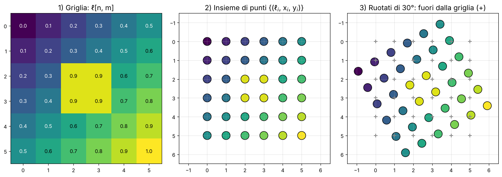

> **Il punto**
> 
> Ci serve una formula unica che porti un punto 3D del mondo nel suo pixel, per qualunque posizione della camera. **Il trucco per scriverla bene sono le coordinate omogenee**.

### 2\. Coordinate omogenee

**Il problema.** Con le coordinate normali (**eterogenee** o cartesiane) le trasformazioni hanno forme diverse (slide 8): rotazione e scala sono prodotti per una matrice, la **traslazione è una somma**, la **proiezione è una divisione**. Per comporle bisogna ricordarsi ogni passo e il suo ordine (slide 9). Vorremmo invece che **ogni trasformazione fosse una matrice, la composizione un prodotto di matrici e l'inversa una matrice inversa**.

**L'idea.** Si aggiunge una coordinata in più e si accetta che uno stesso punto abbia infinite scritture, tutte multiple fra loro. La divisione si rimanda all'ultimo momento.

**La matematica** (slide 10–11, visionbook § 38.2). Il libro usa parentesi tonde per le eterogenee e quadre per le omogenee:

`(x, y) → [x, y, 1],   [x, y, w] → (x/w, y/w),   [x, y, w] ≡ [λx, λy, λw] per ogni λ ≠ 0`

In 3D è lo stesso: (X, Y, Z) → \[X, Y, Z, 1\]. A parole: per entrare in omogenee aggiungi un 1; per uscire dividi per l'ultima componente; e **due vettori multipli fra loro sono lo stesso punto** (invarianza di scala).

![Il punto (2, 1.5) del piano diventa una retta per l'origine nello spazio \[x, y, w\] (slide 11). Tutti i punti della retta sono lo stesso punto; il rappresentante "normale" è quello sul piano w = 1, dove la retta lo attraversa.](../sito-src/L11/disp2_omogenee_raggi.png)

**Esempio.** \[6, 4, 2\] è il punto (3, 2); anche \[3, 2, 1\] e \[−9, −6, −3\]. È questo che **rende lineare la proiezione** (slide 11): una matrice può produrre \[fX, fY, Z\], e la divisione per Z la fa la conversione finale, non la matrice.

Una cautela (slide 10): **in omogenee i punti non si sommano**. \[1, 0, 1\] + \[1, 0, 1\] = \[2, 0, 2\], che è ancora il punto (1, 0), non (2, 0).

> **Il punto**
> 
> Aggiungi un 1, moltiplica per matrici, dividi per l'ultima componente solo alla fine. **Ogni punto è una retta per l'origine**: i suoi rappresentanti differiscono per un fattore di scala.

### 3\. Le trasformazioni 2D come matrici 3×3

**Il problema.** Ruotare una foto storta, ingrandirla, raddrizzarla: sono trasformazioni del piano (slide 13). Vogliamo scriverle tutte nella stessa forma p′ = M p, con p = \[x, y, 1\] e M una matrice 3×3.

**Traslazione** (slide 14–15). In eterogenee è una somma; in omogenee diventa un prodotto:

`T = [[1, 0, tx], [0, 1, ty], [0, 0, 1]],   T[x, y, 1]⊤ = [x + tx, y + ty, 1]⊤`

L'1 in fondo al vettore "raccoglie" la terza colonna: **una somma è diventata un prodotto**. Due traslazioni di seguito, T2T1, sono la traslazione della somma dei vettori.

**Scala** (slide 16–17). S = \[\[sx, 0, 0\], \[0, sy, 0\], \[0, 0, 1\]\] stira o comprime rispetto all'origine. Se sx = sy è **uniforme** e **conserva gli angoli**; se no è **anisotropa** e **gli angoli cambiano** (le diagonali di un quadrato non sono più a 45°).

**Rotazione** (slide 18–21). La rotazione antioraria di un angolo θ attorno all'origine è

`Rθ = [[cos θ, −sin θ, 0], [sin θ, cos θ, 0], [0, 0, 1]]`

Come ricordarla (slide 21): le colonne di una matrice sono le immagini dei vettori di base. Ruotando di θ, (1, 0) va in (cos θ, sin θ) e (0, 1) va in (−sin θ, cos θ): messe in colonna danno R. **R è ortogonale: R−1 = R⊤** (l'inversa è la rotazione di −θ), e conserva le distanze dall'origine (slide 20).

**Esempio.** θ = 30°: (2, 0) → (2 cos 30°, 2 sin 30°) = (1.732, 1). La distanza dall'origine resta 2.

**Una trappola sul verso.** Il libro (§ 38.3.3) scrive \[\[cos θ, sin θ\], \[−sin θ, cos θ\]\] e la chiama antioraria, ma con y verso l'alto è oraria: con θ = 30° manda (1, 0) in (0.866, −0.5), sotto l'asse x. La slide 19 lo segnala correttamente. Il motivo dell'ambiguità: **un verso antiorario con y in alto appare orario con y in basso**, come nei pixel (lo vedrai nella figura del warping).

**Shear** (slide 22). Q = \[\[1, qx, 0\], \[qy, 1, 0\], \[0, 0, 1\]\]. Con qy = 0 è orizzontale: x′ = x + qxy, ogni riga scivola di lato in proporzione alla sua altezza, come un mazzo di carte spinto. Con qx = 1: (1, 1) → (2, 1). Il quadrato diventa un parallelogramma: **rette e parallele si conservano**, **gli angoli no**. La slide dice che conserva l'area: **vale solo con un parametro nullo**, perché det Q = 1 − qxqy (riquadro Attenzione alla slide 22).

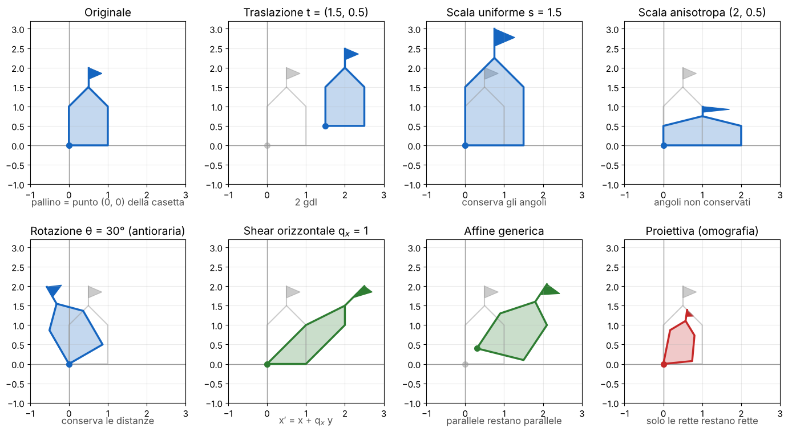

In tutte queste matrici **il blocco 2×2 in alto a sinistra è la versione eterogenea** (slide 16, 20). Sono "rigide" solo traslazione e rotazione: **scala e shear non lo sono**, anche se le slide 6 e 13 le chiamano tutte "rigid".

> **Il punto**
> 
> Traslazione, scala, rotazione e shear sono matrici 3×3 con ultima riga \[0, 0, 1\]. **La traslazione sta nella terza colonna, il resto nel blocco 2×2**. R è ortogonale e antioraria con y in alto.

### 4\. Comporre le trasformazioni

**Il problema.** Vuoi ruotare una foto attorno al suo centro, non attorno all'angolo. Fra le matrici viste non c'è: si costruisce componendo.

**L'idea** (slide 24). **Qualunque catena di trasformazioni è una sola matrice 3×3**, M = Tn…T2T1: **un solo prodotto per punto**, comunque lunga sia la catena. Due regole:

  - **si legge da destra a sinistra**: in M p la prima trasformazione applicata è quella più a destra, vicina a p;
  - **l'ordine conta**: il prodotto di matrici non è commutativo.

**Esempio di non commutatività.** Prendi p = (1, 0), T = traslazione di (2, 0), R = rotazione di 90°. Prima T poi R: (1, 0) → (3, 0) → (0, 3). Prima R poi T: (1, 0) → (0, 1) → (2, 1). Stessi due passi, risultati diversi.

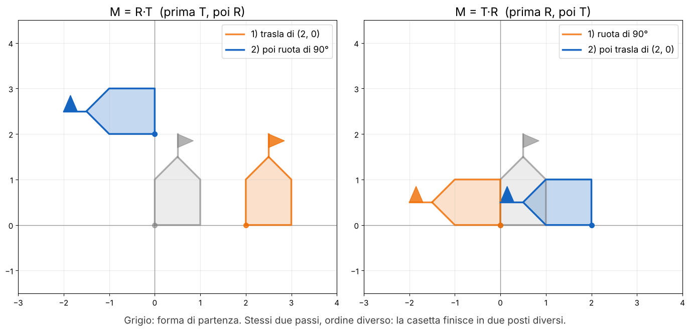

**Rotazione attorno a un punto t** (slide 25, visionbook § 38.3.5): porta t nell'origine, ruota, riportalo indietro.

`p′ = Tt Rθ T−t p`

**Esempio svolto.** t = (2, 1), θ = 90°. Moltiplicando le tre matrici:

`Tt R90° T−t = [[0, −1, 3], [1, 0, −1], [0, 0, 1]]`

Il centro (2, 1) resta fermo: \[0·2 − 1 + 3, 2 + 0 − 1, 1\] = \[2, 1, 1\]. Il punto (3, 1), un passo a destra del centro, va in (2, 2), un passo sopra: ruotato di 90° attorno a t, come deve.

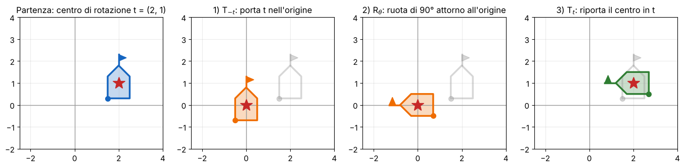

**Gruppi.** Ogni famiglia è chiusa rispetto al prodotto (slide 24): Rθ1Rθ2 = Rθ1+θ2, due traslazioni danno una traslazione. Ma **non lo shear con entrambi i parametri**: Q(1, 0)Q(0, 1) = \[\[2, 1\], \[1, 1\]\] non ha la forma di Q (riquadro Attenzione alla slide 24).

**Affine e proiettiva** (slide 26). Componendo tutto si ottiene l'**affine: \[\[a, b, c\], \[d, e, f\], \[0, 0, 1\]\], 6 gradi di libertà, conserva il parallelismo**. Liberando anche l'ultima riga si ottiene la **proiettiva (omografia): una 3×3 invertibile qualsiasi, 8 gradi di libertà** (9 numeri meno la scala), che **conserva solo le rette**: è la trasformazione dei panorami di [L9](https://gabriele-marsili.github.io/appunti-magistrale-ai/anno-2/computer-vision/sito/#L9).

**Trasformazioni come convoluzioni** (slide 27, libro § 38.3.7). Con l'immagine come insieme di punti, una rotazione calcola x′i e y′i con gli stessi due pesi per tutti i punti: una convoluzione 1D lungo la lista, con kernel di dimensione 2. Il kernel della slide, wx = \[cos θ, sin θ\], è quello della matrice oraria del libro; per la rotazione antioraria è \[cos θ, −sin θ\] (riquadro Attenzione alla slide 27).

> **Il punto**
> 
> Le catene di trasformazioni diventano una sola matrice, **applicata da destra a sinistra; l'ordine conta**. Per ruotare attorno a t: TtRθT−t. Affine 6 gdl (parallele conservate), proiettiva 8 gdl (solo rette).

### 5\. Deformare un'immagine vera: il warping

**Il problema.** Hai la matrice M e vuoi l'immagine ruotata. Ma un'immagine è una griglia di pixel interi, e **M manda i pixel in posizioni non intere** (slide 29). Bisogna decidere quale valore mettere in ogni pixel della nuova griglia: questo ricampionamento si chiama **warping**.

**Prima idea: forward mapping** (slide 30–31). Per ogni pixel sorgente (x, y) calcoli (x′, y′) = M(x, y), arrotondi e scrivi il valore lì. È semplice, ma:

  - se l'immagine si allarga, **alcuni pixel di destinazione non li raggiunge nessuno: buchi**;
  - se si stringe, più pixel sorgente finiscono nello stesso pixel e si sovrascrivono;
  - con trasformazioni non uniformi (omografie, deformazioni) i due difetti convivono in zone diverse.

**L'idea giusta: backward mapping** (slide 32, libro § 38.5). Giri la domanda: per ogni pixel di *destinazione* (x′, y′) ti chiedi "da dove viene?", calcoli **(x, y) = M−1(x′, y′)** e leggi la sorgente in quel punto, interpolando ([L6](https://gabriele-marsili.github.io/appunti-magistrale-ai/anno-2/computer-vision/sito/#L6)). **Ogni pixel di destinazione riceve esattamente un valore: niente buchi**. Serve M−1, che per una matrice invertibile è un'inversione e basta.

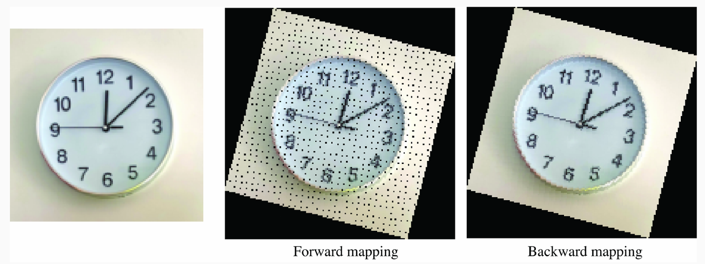

**Quanti buchi?** Se la trasformazione ingrandisce di un fattore s, l'area si moltiplica per s2 mentre i pixel sorgente restano gli stessi. Con s = 1.6 ogni pixel sorgente deve "coprire" 2.56 pixel di destinazione, ma ne riempie al massimo uno: **almeno 1 − 1/2.56 ≈ 61% di buchi**.

È ciò che fanno `cv2.warpAffine` e `cv2.warpPerspective`: ricevono M e la invertono internamente.

**Warping di qualità** (slide 34). Il valore in un punto non intero si può prendere dal pixel più vicino (**effetto a blocchi**), con la bilineare o con kernel di ordine più alto (bicubica, Lanczos). Se la trasformazione **rimpicciolisce**, **si rischia l'aliasing** di [L6](https://gabriele-marsili.github.io/appunti-magistrale-ai/anno-2/computer-vision/sito/#L6) e bisogna sfocare prima la sorgente. Il **MIP-mapping** lo fa in modo efficiente: precalcola una piramide di versioni sempre più piccole e legge dal livello con la scala giusta (così le schede grafiche trattano le texture).

> **Il punto**
> 
> Il forward mapping lascia buchi; **il backward mapping parte da ogni pixel di destinazione, applica M−1 e interpola la sorgente**. Se si rimpicciolisce, prima si filtra contro l'aliasing.

### 6\. La camera come matrice: la proiezione prospettica

**Il problema.** Passiamo al 3D. Con più camere, o una camera che si muove (slide 36), l'origine può stare al massimo in una di esse. Servono tre sistemi di coordinate (slide 37): il **mondo** (3D, metri, fisso e condiviso, per esempio con l'origine su un angolo del tavolo), la **camera** (3D, metri, origine nel centro della camera) e i **pixel** (2D, dall'angolo in alto a sinistra).

La slide 37 scrive "camera (2D, meters)" e "pixel (3D, pixels)": **è il contrario** (riquadro Attenzione alla slide 37). Dal mondo alla camera si passa con gli **estrinseci R, T, che dipendono solo dalla posizione e dall'orientamento della camera**; dalla camera ai pixel con gli **intrinseci K, che dipendono solo dalla camera (ottica e sensore)** (slide 38). Se sposti il telefono cambiano R e T; se cambi lo zoom cambia K.

**Il riferimento della camera** (slide 40–41, visionbook § 39.2). Origine nel **centro della camera** (il foro, dove convergono i raggi), asse Z lungo l'asse ottico, verso cui la camera guarda. Il piano immagine sta a distanza f lungo Z.

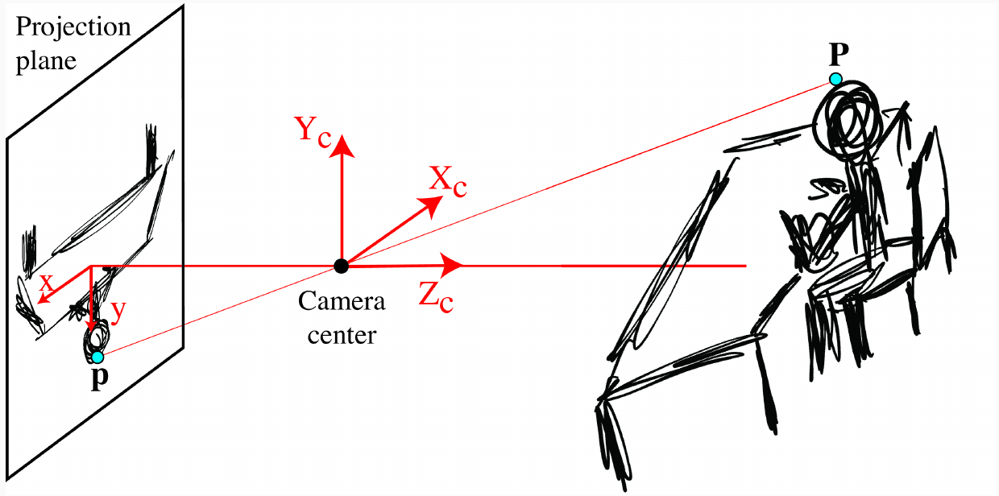

Un piano **virtuale** a Z = +f, davanti al foro, dà la stessa immagine ma **non capovolta** (slide 41): useremo sempre quello.

**Le equazioni** (slide 42). Il triangolo piccolo (altezza y, base f) e quello grande (altezza Y, base Z) sono simili, quindi y/f = Y/Z:

`x = f X/Z,   y = f Y/Z`

). Il raggio dalla cima dell'oggetto passa per il foro: sul piano virtuale (blu) cade a y = fY/Z, sul sensore vero (grigio) nello stesso punto ma capovolto.](../sito-src/L11/disp2_triangoli_simili.png)

Qui x e y sono in **metri** sul piano immagine, non in pixel. **L'unica parte non lineare è la divisione per Z** (slide 42).

**In omogenee** (slide 43–44). Il punto è P = \[X, Y, Z, 1\] e la proiezione è una matrice 3×4:

`K P = [[f, 0, 0, 0], [0, f, 0, 0], [0, 0, 1, 0]] [X, Y, Z, 1]⊤ = [fX, fY, Z]⊤ = λ[x, y, 1]⊤`

La matrice copia Z nella terza componente; dividendo per essa si ottiene (fX/Z, fY/Z): **la proiezione prospettica è diventata un prodotto matrice-vettore**. Il fattore λ è proprio Z, la profondità. Nella slide 44 la prima componente è scritta "x F/Z": **è un refuso per fX/Z** (riquadro Attenzione alla slide 44).

**Esempio.** f = 5 mm, punto (0.5, 0.25, 2) m. K P = \[0.0025, 0.00125, 2\], diviso 2: (1.25 mm, 0.625 mm) sul piano immagine.

**La versione riscalata** (slide 45). Una matrice omogenea vale a meno di un fattore, quindi si può dividere per f: K = \[\[1, 0, 0, 0\], \[0, 1, 0, 0\], \[0, 0, 1/f, 0\]\] dà \[X, Y, Z/f\], cioè di nuovo (fX/Z, fY/Z), come nel libro. Il libro scrive così anche la **proiezione parallela**: con ultima riga \[0, 0, 0, 1\] si ottiene (X, Y), e gli oggetti lontani non rimpiccioliscono. **Cambiare modello di camera vuol dire solo cambiare K**.

> **Il punto**
> 
> Riferimento della camera: origine nel foro, Z lungo l'asse ottico. **In omogenee la prospettiva è una matrice 3×4 che mette Z nella terza componente**; la divisione per Z la fa la conversione finale.

### 7\. Dai metri ai pixel: la matrice degli intrinseci K

**Il problema.** x = fX/Z è in metri, con l'origine al centro dell'immagine; i pixel si contano dall'angolo in alto a sinistra. Bisogna **cambiare unità** e **spostare l'origine**.

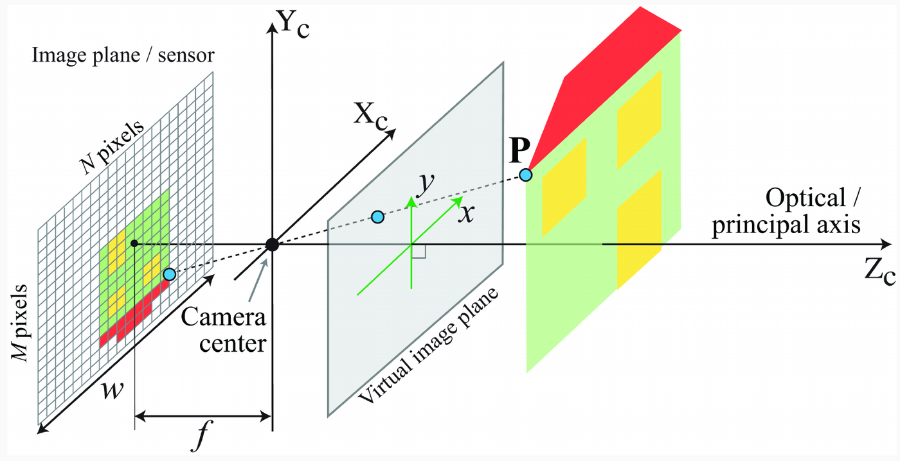

**Passo 1: da metri a pixel** (slide 48). Se il sensore è largo w metri e ha N pixel in orizzontale, ci sono N/w pixel per metro. Moltiplicando:

`a = f · N / w   (la focale misurata in pixel)`

e la matrice diventa \[\[a, 0, 0, 0\], \[0, a, 0, 0\], \[0, 0, 1, 0\]\]. Nota che **f e w compaiono solo nel rapporto: conta a, non i millimetri**.

**Passo 2: spostare l'origine** (slide 49). Il **punto principale (cx, cy) è il pixel in cui l'asse ottico buca il sensore**: di solito circa il centro, cx = N/2, cy = M/2. Sommarlo è una traslazione, che in omogenee va nella terza colonna.

**Passo 3: pixel non quadrati** (slide 50). Se i pixel sono più alti che larghi, la scala verticale è diversa: **b = f · M / h**, con h l'altezza del sensore. Mettendo tutto insieme (slide 51, libro eq. 39.5–39.6):

`K = [[a, 0, cx, 0], [0, b, cy, 0], [0, 0, 1, 0]],   n = a X/Z + cx,   m = b Y/Z + cy`

Sono **4 parametri intrinseci**: a, b, cx, cy. Spesso K si scrive 3×3, \[\[a, 0, cx\], \[0, b, cy\], \[0, 0, 1\]\], applicata a (X, Y, Z): è la stessa cosa senza la colonna di zeri.

**Esempio svolto.** f = 5 mm, sensore 6.4 × 3.6 mm, immagine 1280 × 720: a = 5 · 1280 / 6.4 = **1000** pixel, b = 5 · 720 / 3.6 = 1000, c = (640, 360). Il punto (0.5, 0.25, 2) m di prima:

`[[1000, 0, 640], [0, 1000, 360], [0, 0, 1]] [0.5, 0.25, 2]⊤ = [1780, 970, 2]⊤ → (890, 485)`

Passo per passo: sul piano (1.25, 0.625) mm; × 200 pixel/mm = (250, 125) pixel dal centro; + (640, 360) = **(890, 485)**.

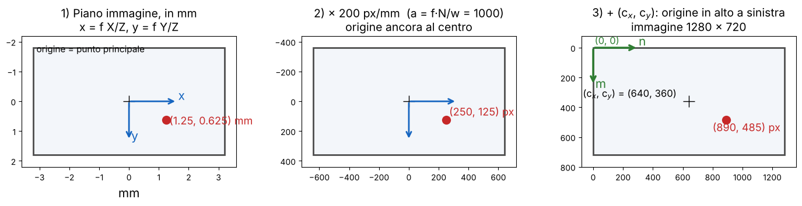

Cosa fa ogni parametro, sulla stessa scena:

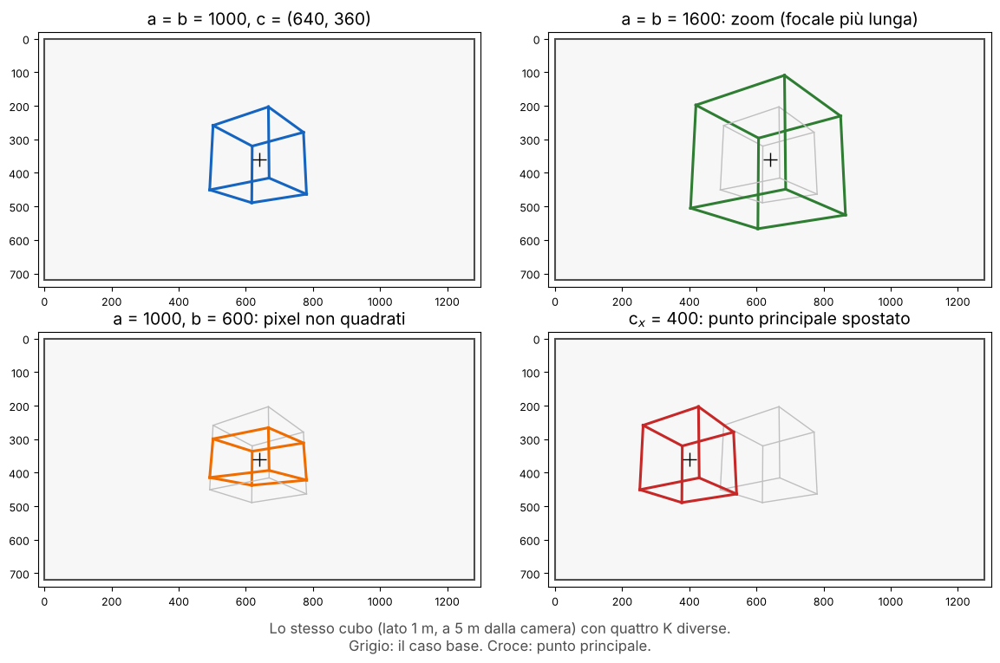

**Il segno di a e b** (slide 52, libro § 39.3.1). Se un asse dei pixel punta al contrario del corrispondente asse della camera, il suo fattore è negativo. Nel riferimento del libro, guardando il sensore, x della camera punta a sinistra e y in alto. Con l'origine dei pixel in basso a sinistra (convenzione 1, del libro) **solo a è negativo**; in alto a sinistra (convenzione 2, degli array) **lo sono sia a sia b**. La slide è corretta.

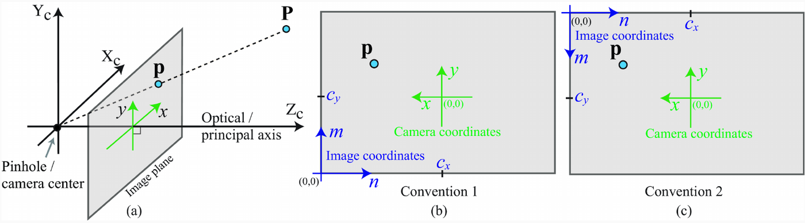

OpenCV evita il problema con la camera orientata **X a destra, Y in basso, Z in avanti: assi di camera e pixel concordi, a e b positivi**. È la convenzione dei nostri esempi. L'importante è **dichiarare la convenzione e non mescolarne due** (slide 73).

**Altri parametri** (slide 53). Se righe e colonne del sensore non sono perpendicolari serve un quinto parametro, lo **skew**, nella posizione (1, 2) di K (quasi sempre ≈ 0). Le lenti vere hanno poi la **distorsione radiale: le rette appaiono curve**, e nessuna matrice lo riproduce; si corregge a parte (L12).

**Dal pixel al raggio** (libro § 39.3.2). K−1\[n, m, 1\] dà la direzione del raggio uscente: **da un pixel non si ricava la profondità**, solo la retta su cui sta il punto. K−1\[890, 485, 1\] = \[0.25, 0.125, 1\]; tutti i punti λ(0.25, 0.125, 1) cadono in (890, 485), e con λ = 2 ritrovi (0.5, 0.25, 2). Per il 3D servono due viste, un sensore di profondità o una rete che la stima.

> **Il punto**
> 
> **K converte i metri del piano immagine in pixel (a = fN/w, b = fM/h) e sposta l'origine nell'angolo (cx, cy)**. Dipende solo dalla camera. I segni di a e b dipendono dalla convenzione degli assi.

### 8\. Una calibrazione semplice (ma poco affidabile)

**Il problema.** Come si trovano i numeri di K? Le schede tecniche raramente danno la focale in pixel, e il software ritaglia o ricampiona le foto: conviene misurarla. Il libro (§ 39.3.3) propone un metodo di una riga (slide 55–58).

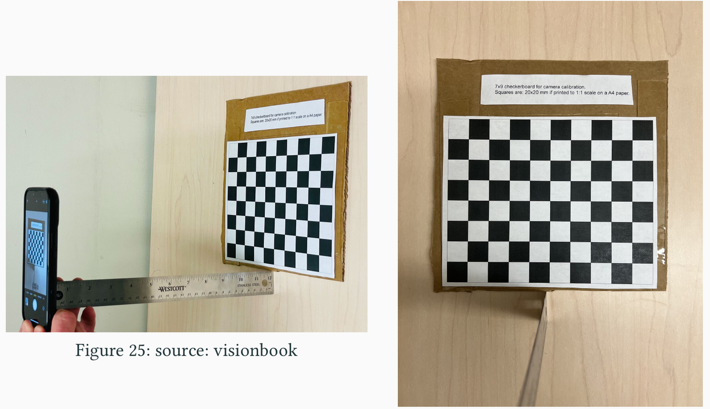

**Gli ingredienti** (slide 56): un oggetto di larghezza nota (scacchiera W = 20 cm), la distanza misurata col righello (Z = 31 cm) e la sua larghezza nella foto (L = 2002 pixel).

**La matematica.** È la proiezione della sezione 7 scritta per una lunghezza invece che per un punto: L = a · W / Z, quindi

`a = Z · L / W = 31 · 2002 / 20 = 3103.1 pixel`

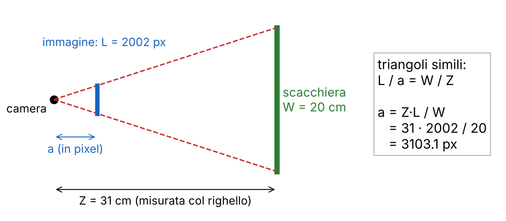

La foto è 4032 × 3024, scattata in verticale (la slide 55 lo mostra): larga 3024 e alta 4032. Quindi cx = 3024/2 = 1512 e cy = 4032/2 = 2016, come nella slide 57 e nel libro. Sembrano scambiati solo se si legge 4032 × 3024 come larghezza × altezza. La matrice:

`K = [[3103.1, 0, 1512, 0], [0, 3103.1, 2016, 0], [0, 0, 1, 0]]`

Nella slide 57 l'elemento centrale è scritto "30103.1": **è un refuso per 3103.1**, e "bold (K)" è un residuo di formattazione (riquadro Attenzione alla slide 57).

**Quanto è precisa?** (slide 58). Dalla scheda tecnica (iPhone 13 Pro, focale 5.7 mm, sensore 7.6 × 5.7 mm) si ricava a = 5.7 · 4032 / 7.6 = 3024. L'errore è (3103.1 − 3024)/3024 ≈ **2.6%**: non male, ma **tutto dipende da una sola misura col righello** (dove sta il centro ottico dentro il telefono?) e **si assume il punto principale esattamente al centro, senza skew né distorsione**. In L12 si stima K da molte foto della scacchiera.

> **Il punto**
> 
> Con un oggetto di larghezza nota W a distanza nota Z, **a = Z·L/W**: qui 3103.1 pixel contro i 3024 veri (2.6% di errore). Semplice, ma fragile.

### 9\. Dal mondo alla camera: gli estrinseci R e T

**Il problema.** Finora la camera era nell'origine e guardava lungo Z (slide 60). In un'auto con sei camere i punti si misurano in un riferimento del **mondo** comune: prima di applicare K bisogna esprimerli nel riferimento di *quella* camera.

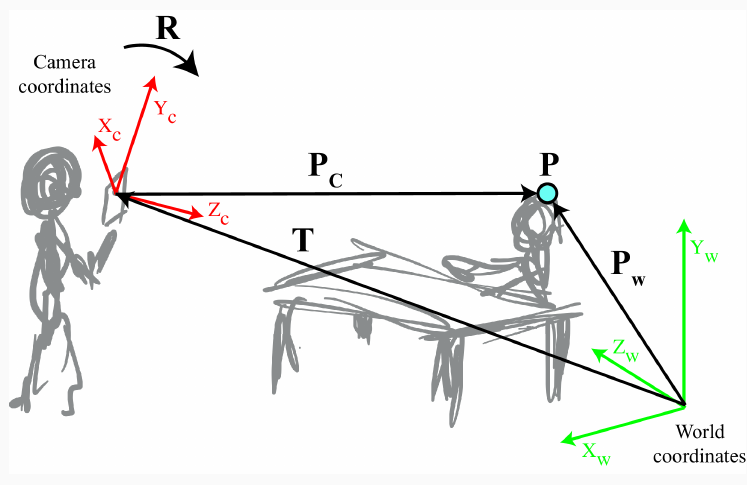

**I due parametri** (slide 61–62, libro § 39.4):

  - **T: la posizione del centro della camera, in coordinate del mondo** (3 numeri);
  - **R: la rotazione 3×3 che porta gli assi del mondo su quelli della camera** (3 gradi di libertà). La camera è orientata di R⊤ rispetto al mondo; R fa il viaggio inverso.

**L'idea** (slide 63–65): prima **trasla** di −T, così l'origine va nel centro della camera; poi **ruota** di R, così gli assi coincidono.

`PC = R(PW − T) = R PW − R T`

Come leggere R: **le sue righe r1, r2, r3 sono gli assi della camera scritti nel mondo**. Così XC = r1·(PW − T) è la componente del vettore camera→punto lungo l'asse X della camera, e ZC = r3·(PW − T) la profondità.

**In omogenee** (slide 66–68). Traslazione e rotazione diventano due matrici 4×4:

`M1 = [[1, 0, 0, −TX], [0, 1, 0, −TY], [0, 0, 1, −TZ], [0, 0, 0, 1]],   M2 = [[R, 0], [0⊤, 1]]`

e, poiché prima si trasla e poi si ruota, PC = M2M1PW (da destra a sinistra). Il prodotto ha una forma compatta:

`M2M1 = [[R, −RT], [0⊤, 1]]`

La quarta colonna non è −T ma **−RT** (elementi −ri·T, slide 67): si trasla prima di ruotare, quindi la traslazione esce ruotata. È la non commutatività della sezione 4, in 3D.

**Esempio svolto.** Origine del mondo su un tavolo, Y verso il basso come nella camera. La camera sta in T = (−3, 0, −4), a 5 m dal tavolo, girata attorno all'asse verticale per guardare l'origine:

`R = [[0.8, 0, −0.6], [0, 1, 0], [0.6, 0, 0.8]]   (rotazione di circa 37° attorno a Y, det R = 1)`

La terza riga r3 = (0.6, 0, 0.8) è l'asse ottico: punta da T verso l'origine. Il punto PW = (0.8, 0.5, −0.6):

  - PW − T = (3.8, 0.5, 3.4);
  - XC = 0.8·3.8 − 0.6·3.4 = 1, YC = 0.5, ZC = 0.6·3.8 + 0.8·3.4 = 5;
  - quindi **PC = (1, 0.5, 5)**: 1 m a destra dell'asse ottico, 0.5 m sotto, 5 m davanti.

E −RT = (0, 0, 5): l'origine del mondo, nel riferimento della camera, sta 5 m dritta davanti a lei.

**Una notazione che incontrerai.** OpenCV e Hartley-Zisserman scrivono PC = R PW + t, con **t = −RT**. Attenzione: **t non è la posizione della camera**; la posizione è T = −R⊤t. Nell'esempio t = (0, 0, 5), mentre la camera sta in (−3, 0, −4).

> **Il punto**
> 
> Gli estrinseci dicono dove sta la camera (T, nel mondo) e come è orientata (R). **PC = R(PW − T): prima trasla, poi ruota**; in omogenee \[\[R, −RT\], \[0⊤, 1\]\]. Le righe di R sono gli assi della camera.

### 10\. La matrice completa della camera

**Il problema.** Abbiamo tutti i pezzi. Ora li incolliamo in una matrice sola, da mondo a pixel.

**La matematica** (slide 70, libro § 39.5). Prima gli estrinseci, poi gli intrinseci, sempre da destra a sinistra:

`λ[x, y, 1]⊤ = [x′, y′, w]⊤ = K M2 M1 [X, Y, Z, 1]⊤`

La colonna di zeri di K annulla l'ultima riga degli estrinseci; togliendole entrambe resta la forma da ricordare:

`p = K [R | −RT] PW   con K 3×3, [R | −RT] 3×4, PW = [X, Y, Z, 1]`

Il prodotto **P = K\[R | −RT\]** è la **matrice della camera, 3×4**: **una sola matrice porta qualunque punto del mondo nel suo pixel**. Per tornare ai pixel si divide per la terza componente w.

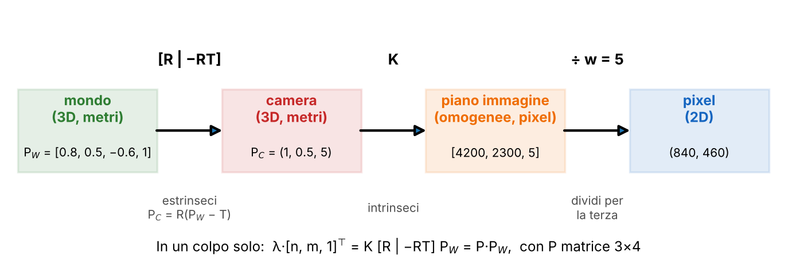

**Esempio svolto** (verificato con numpy). Con K = \[\[1000, 0, 640\], \[0, 1000, 360\], \[0, 0, 1\]\] della sezione 7 e R, T della sezione 9:

`P = K[R | −RT] = [[1184, 0, −88, 3200], [216, 1000, 288, 1800], [0.6, 0, 0.8, 5]]`

Applicata a PW = \[0.8, 0.5, −0.6, 1\]:

  - prima riga: 1184·0.8 − 88·(−0.6) + 3200 = 947.2 + 52.8 + 3200 = 4200;
  - seconda riga: 216·0.8 + 1000·0.5 + 288·(−0.6) + 1800 = 2300;
  - terza riga: 0.6·0.8 + 0.8·(−0.6) + 5 = 5, la profondità ZC;
  - pixel: (4200/5, 2300/5) = **(840, 460)**.

Lo stesso risultato si ottiene a passi: PC = (1, 0.5, 5), poi n = 1000·1/5 + 640 = 840 e m = 1000·0.5/5 + 360 = 460. L'origine del mondo \[0, 0, 0, 1\] dà \[3200, 1800, 5\] → (640, 360): il punto principale, perché la camera la guarda dritta.

**Quanti parametri** (slide 71):

  - intrinseci: a, b, cx, cy = 4, più lo skew = **5**;
  - estrinseci: 3 per la rotazione + 3 per la traslazione = **6**;
  - totale **11 gradi di libertà**, gli stessi di una 3×4 generica: 12 numeri meno la scala, che non conta (P e 2P danno gli stessi pixel).

Il conto torna con lo skew: **5 + 6 = 11 = 12 − 1**. È il punto di partenza di L12: stimare le 11 incognite di P da corrispondenze 3D–2D (DLT), poi separare K, R e T.

**Le trappole** (slide 73). Quasi tutti gli errori sono di tre tipi: **confondere i sistemi di coordinate** (dichiara sempre in quale sei), **sbagliare l'ordine** delle matrici, **sbagliare il verso degli assi** (y in alto o in basso, segno di a e b, R contro R⊤, T contro t).

    import numpy as np
    K = np.array([[1000, 0, 640], [0, 1000, 360], [0, 0, 1.]])
    R = np.array([[0.8, 0, -0.6], [0, 1, 0], [0.6, 0, 0.8]])
    T = np.array([-3, 0, -4.])              # centro della camera nel mondo
    P = K @ np.c_[R, -R @ T]                # 3x4
    h = P @ np.array([0.8, 0.5, -0.6, 1])   # [4200, 2300, 5]
    print(h[:2] / h[2])                     # [840. 460.]

> **Il punto**
> 
> **p = K\[R | −RT\] PW: estrinseci (mondo → camera), poi intrinseci (camera → pixel), poi divisione per la terza componente**. P è 3×4 con 11 gradi di libertà (5 intrinseci con lo skew, 6 estrinseci).

### Il riassunto in 10 righe

1.  Coordinate omogenee: (x, y) → \[x, y, 1\], \[x, y, w\] → (x/w, y/w); vettori multipli sono lo stesso punto, e in omogenee i punti non si sommano.
2.  Traslazione, scala, rotazione e shear diventano matrici 3×3 con ultima riga \[0, 0, 1\]; la traslazione sta nella terza colonna.
3.  La rotazione antioraria è \[\[cos θ, −sin θ\], \[sin θ, cos θ\]\], ortogonale (R−1 = R⊤); con y verso il basso appare oraria, e la matrice del libro è quella oraria.
4.  Una catena di trasformazioni è una sola matrice, applicata da destra a sinistra; l'ordine conta. Rotazione attorno a t: TtRθT−t. Affine 6 gdl, proiettiva 8 gdl.
5.  Warping: il forward mapping lascia buchi; il backward usa M−1 e interpola; rimpicciolendo si filtra prima.
6.  Riferimento della camera: origine nel foro, Z lungo l'asse ottico; in omogenee la prospettiva è \[\[f, 0, 0, 0\], \[0, f, 0, 0\], \[0, 0, 1, 0\]\], che mette Z nella terza componente.
7.  Intrinseci: K = \[\[a, 0, cx\], \[0, b, cy\], \[0, 0, 1\]\], a = fN/w in pixel, (cx, cy) punto principale; i segni di a e b dipendono dagli assi.
8.  Calibrazione semplice: a = Z·L/W = 31·2002/20 = 3103.1 pixel, contro 3024 veri: 2.6% di errore, ma fragile.
9.  Estrinseci: T = posizione della camera nel mondo, R = rotazione mondo → camera; PC = R(PW − T), in omogenee \[\[R, −RT\], \[0⊤, 1\]\].
10. Matrice completa: p = K\[R | −RT\] PW, una 3×4 con 11 gradi di libertà (5 + 6); si divide per la terza componente alla fine.

### Verifica di aver capito

**Scrivi la matrice che ruota di 90° attorno al punto (1, 1) e applicala a (2, 1).**

T(1,1)R90°T(−1,−1) = \[\[0, −1, 2\], \[1, 0, 0\], \[0, 0, 1\]\]. Applicata a \[2, 1, 1\]: \[0 − 1 + 2, 2 + 0 + 0, 1\] = \[1, 2, 1\], cioè (1, 2). Controllo: (2, 1) era un passo a destra del centro, ora è un passo sopra. Il centro (1, 1) resta fermo.

**Perché il warping si fa all'indietro? Cosa succede col forward mapping se l'immagine viene ingrandita di 2 volte?**

Ogni pixel sorgente riempie al più un pixel, ma l'area è 4 volte più grande: almeno 3/4 dei pixel restano vuoti. All'indietro si parte da ogni pixel di destinazione, si calcola M−1(x′, y′) e si interpola: nessun buco.

**Una camera ha focale 4 mm, sensore largo 6 mm, immagine 1500 × 1000 pixel, pixel quadrati e punto principale al centro. Dove finisce il punto (0.3, −0.2, 3) m, espresso nel riferimento della camera?**

a = b = 4 · 1500 / 6 = 1000, c = (750, 500). n = 1000 · 0.3/3 + 750 = 850, m = 1000 · (−0.2)/3 + 500 ≈ 433.3. Pixel (850, 433.3).

**La camera sta in T = (0, 0, −10) e ha gli assi allineati al mondo (R = I). Qual è PC del punto PW = (1, 2, 0)? E t = −RT?**

PC = R(PW − T) = (1, 2, 10): il punto è 10 m davanti alla camera. t = −RT = (0, 0, 10). Nota che t non è la posizione della camera, che è (0, 0, −10).

**Perché la matrice della camera 3×4 ha 11 gradi di libertà e non 12? Come si dividono fra intrinseci ed estrinseci?**

P e λP danno gli stessi pixel (λ si semplifica nella divisione): 12 − 1 = 11 = 5 intrinseci (a, b, cx, cy, skew) + 6 estrinseci (3 rotazione, 3 traslazione).

**Nella calibrazione col righello, perché cx = 1512 e non 2016 se la foto è 4032 × 3024?**

La foto è verticale: larga 3024, alta 4032. cx è metà della larghezza, cy metà dell'altezza.

### Come proseguire

  - Visionbook, cap. 38 [Representing Images and Geometry](https://visionbook.mit.edu/homogeneous_coordinates.html): § 38.1–38.3 e 38.5. Occhio alla rotazione del § 38.3.3, oraria con y in alto.
  - Visionbook, cap. 39 [Camera Modeling and Calibration](https://visionbook.mit.edu/imaging_geometry.html): § 39.1–39.5; § 39.6–39.7 (esempi e calibrazione) sono L12.
  - Szeliski, *Computer Vision: Algorithms and Applications*, 2a ed. ([szeliski.org/Book](https://szeliski.org/Book/)), cap. 2 (trasformazioni geometriche, proiezione 3D → 2D), con notazione vicina a OpenCV; Hartley-Zisserman cap. 6 per la versione rigorosa.

Ora ripassa con le schede qui sotto, slide per slide: i riquadri «Dal libro» riprendono le derivazioni, i riquadri Attenzione correggono le slide 22, 24, 27, 37, 44 e 57.
