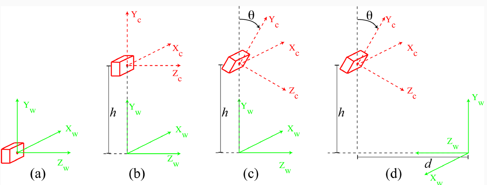
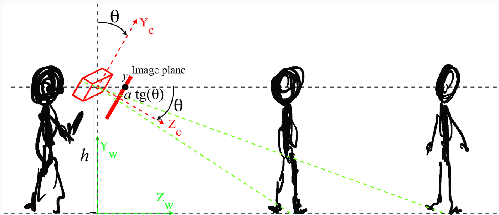
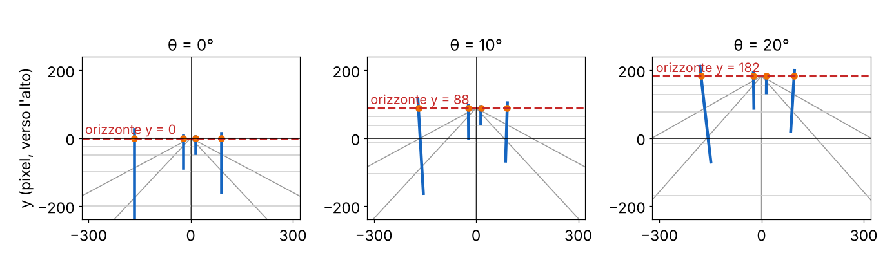
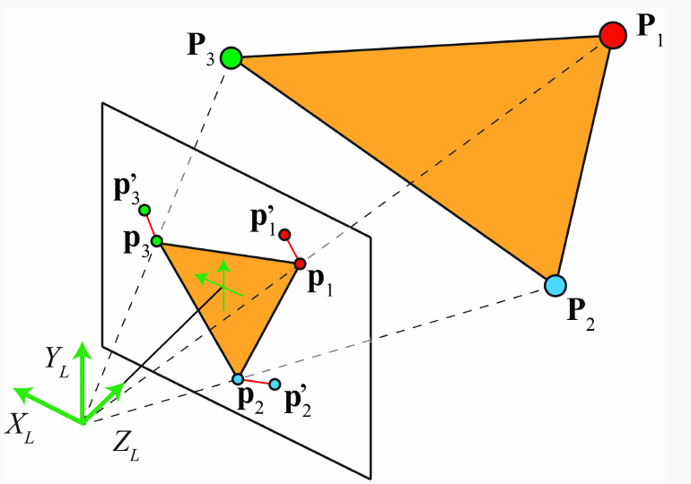
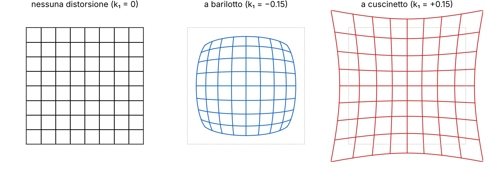

# L12 · Calibrazione

*Lezione 12 · Antonio Carta · 8 ottobre 2026*

[Versione interattiva sul sito, con videolezione](https://gabriele-marsili.github.io/appunti-magistrale-ai/anno-2/computer-vision/sito/#L12) · [Indice della dispensa](README.md)

**In una frase:** **calibrare una camera vuol dire stimare la matrice 3×4 che porta i punti del mondo nei pixel**, cioè K, R e T più i coefficienti di distorsione della lente; si fa fotografando un oggetto di geometria nota (una scacchiera), con una stima lineare iniziale (DLT, o il metodo multipiano di Zhang) rifinita minimizzando l'errore di riproiezione in pixel, ed è quello che fa `cv.calibrateCamera` in una riga.

### Prima di iniziare

Questa lezione chiude il discorso sulla camera iniziato nella [L11](https://gabriele-marsili.github.io/appunti-magistrale-ai/anno-2/computer-vision/sito/#L11). Ti servono:

  - dalla [L11](https://gabriele-marsili.github.io/appunti-magistrale-ai/anno-2/computer-vision/sito/#L11): coordinate omogenee in 3D, la matrice degli intrinseci K (focale in pixel *a* = fN/w, centro cx, cy), la rotazione R e la posizione T della camera nel mondo, e il modello completo **p ∝ K\[R | −RT\] P**;
  - dalla [L9](https://gabriele-marsili.github.io/appunti-magistrale-ai/anno-2/computer-vision/sito/#L9): la DLT per l'omografia (moltiplicare per il denominatore, due righe per corrispondenza, A h = 0, soluzione = ultimo vettore singolare destro di A). Qui si rifà identica con una matrice 3×4 al posto della 3×3;
  - dalla [L8](https://gabriele-marsili.github.io/appunti-magistrale-ai/anno-2/computer-vision/sito/#L8): gli angoli di Harris, perché gli angoli della scacchiera si trovano allo stesso modo;
  - di algebra lineare: SVD, decomposizione QR, matrici triangolari e ortogonali.

Gli esempi numerici con matrici "inventate" sono calcolati con numpy; quelli del notebook `camera_calibration_opencv` vengono dalla sua riesecuzione con OpenCV 5.0 sulle 13 immagini di `calibration_data`, e coincidono alla quarta cifra con l'output del professore (OpenCV 4.13).

### Guarda prima questi video

  - [Linear Camera Model | Camera Calibration](https://www.youtube.com/watch?v=qByYk6JggQU) (Video). Shree Nayar, First Principles of Computer Vision. Ripasso della L11: come intrinseci ed estrinseci si combinano in un'unica matrice 3×4. Base per le sezioni 2–4.
  - [Camera Calibration | Camera Calibration](https://www.youtube.com/watch?v=GUbWsXU1mac) (Video). Shree Nayar. Tutto: l'oggetto di calibrazione, le due equazioni per punto, il sistema A m = 0 risolto ai minimi quadrati con il vincolo ‖m‖ = 1. Corrisponde alla sezione 5.
  - [Intrinsic and Extrinsic Matrices | Camera Calibration](https://www.youtube.com/watch?v=2XM2Rb2pfyQ) (Video). Shree Nayar. Come si separa la matrice stimata in K (triangolare) e R (ortogonale) con la decomposizione QR, e come si ricava la traslazione. Sezione 6.
  - [Camera Calibration using Zhang's Method (Cyrill Stachniss)](https://www.youtube.com/watch?v=-9He7Nu3u8s) (Video). Cyrill Stachniss. Il metodo multipiano: un'omografia per foto, i vincoli su K, la soluzione in forma chiusa. Da guardare prima della sezione 9; è lungo, ma la prima metà basta.

### 1\. Il problema: che cosa vuol dire "calibrare"

**Il problema.** Vuoi misurare un oggetto da una foto, appoggiare un oggetto virtuale su un tavolo in realtà aumentata, far capire a un robot a che distanza è la tazza. Tutti questi compiti chiedono la stessa cosa: sapere **da quale raggio di luce arriva ogni pixel**. Senza questa informazione una foto è solo una griglia di colori.

Una camera è **calibrata** quando conosci **la trasformazione dalle coordinate del mondo ai pixel** (slide 30). Dalla [L11](https://gabriele-marsili.github.io/appunti-magistrale-ai/anno-2/computer-vision/sito/#L11) sai che, in coordinate omogenee, è una matrice 3×4:

`p ∝ M P,   M = K [R | −RT]`

P = \[X, Y, Z, 1\]⊤ è il punto del mondo, p = \[x′, y′, w\]⊤ il pixel in omogenee (il pixel vero è (x′/w, y′/w)), K contiene gli **intrinseci** (focale in pixel, centro dell'immagine: dipendono dalla camera), R e T gli **estrinseci** (orientazione e posizione della camera nel mondo: dipendono da dove la metti).

**Perché non leggerli dalla scheda tecnica?** In teoria la focale in pixel è a = fN/w (focale in metri × pixel per metro sul sensore). Il libro (§ 39.3.3) prova con un iPhone 13 Pro: dalla scheda tecnica viene a ≈ 3024, misurando una scacchiera con un righello a ≈ 3103. La differenza c'è perché il telefono ritaglia, stabilizza e corregge le immagini via software: **la scheda tecnica descrive l'hardware, non l'immagine che ricevi**. E gli estrinseci cambiano ogni volta che muovi la camera. Quindi **i parametri si stimano dalle immagini**.

**L'idea.** Fotografi punti di cui conosci le coordinate 3D, trovi dove finiscono nell'immagine, e cerchi la M che spiega meglio le corrispondenze (Pi, pi). La figura riassume tutta la lezione.

> **Il punto**
> 
> Calibrare = stimare M = K\[R | −RT\] (più la distorsione) **da corrispondenze fra punti 3D noti e i loro pixel**. Si stima perché la scheda tecnica non basta e gli estrinseci cambiano a ogni posa.

### 2\. Quattro camere di esempio: (a) e (b)

**Il problema.** M è una tabella di 12 numeri: che cosa significano? Il modo migliore per capirlo è scriverla a mano in situazioni semplici (visionbook § 39.6, slide 8–28). Le quattro situazioni sono nella figura.

In tutti gli esempi si mette il centro dell'immagine in (0, 0), cioè cx = cy = 0, e quindi K = \[\[a, 0, 0, 0\], \[0, a, 0, 0\], \[0, 0, 1, 0\]\]. Si usa la forma 4×4 degli estrinseci, \[\[R, −RT\], \[0⊤, 1\]\], e M = K · estrinseci. Negli esempi del libro **l'asse y dell'immagine punta in su** (y positivo = sopra il centro), non in giù come negli array di OpenCV.

#### (a) La camera nell'origine

Camera e mondo coincidono: R = I, T = 0, gli estrinseci sono l'identità 4×4 e

`M = [[a, 0, 0, 0], [0, a, 0, 0], [0, 0, 1, 0]]   ⇒   x = aX/Z,   y = aY/Z`

È la proiezione prospettica di [L2](https://gabriele-marsili.github.io/appunti-magistrale-ai/anno-2/computer-vision/sito/#L2), in pixel (slide 10–11).

#### (b) La camera alzata di h

Una persona tiene la camera all'altezza degli occhi, con l'asse ottico orizzontale (slide 12–15). L'origine del mondo è sul pavimento sotto la camera, quindi T = (0, h, 0) e R = I. La slide scrive T = (0, h): è un vettore 3D con Z = 0. Gli estrinseci traslano di −T:

`M = [[a, 0, 0, 0], [0, a, 0, −ah], [0, 0, 1, 0]]   ⇒   x = aX/Z,   y = a(Y − h)/Z`

**Esempio.** a = 500 pixel, h = 1.6 m. I piedi di una persona a 5 m (Y = 0, Z = 5) finiscono in y = 500 · (−1.6)/5 = −160; a 10 m in −80. I suoi occhi, se è alta come te (Y = 1.6), finiscono in y = 0 **a qualunque distanza**. Lo stesso vale per tutti i punti all'infinito (Z → ∞): l'**orizzonte è la riga y = 0**, quella che passa per il centro dell'immagine (foto della slide 15).

> **Il punto**
> 
> In (a) M è la sola proiezione; in (b) l'altezza h compare nell'ultima colonna (−ah). Con l'asse ottico orizzontale **l'orizzonte passa per il centro dell'immagine**, e lì finiscono anche gli occhi delle persone alte come chi scatta.

### 3\. La camera inclinata (c) e la linea dell'orizzonte

**Il problema.** Nessuno scatta con l'asse ottico perfettamente orizzontale. Se inclini il telefono in giù di θ, dove va a finire l'orizzonte? E al contrario: dall'orizzonte in una foto, puoi capire quanto era inclinata la camera?

**La matematica** (slide 16–21, visionbook eq. 39.17–39.19). La camera ruota attorno al suo asse Xc, che resta orizzontale. La rotazione è

`R = [[1, 0, 0], [0, cos θ, sin θ], [0, −sin θ, cos θ]]`

e si applica **dopo** la traslazione di (b). Moltiplicando (con −RT = \[0, −h cos θ, h sin θ\]):

`M = [[a, 0, 0, 0], [0, a cos θ, a sin θ, −ah cos θ], [0, −sin θ, cos θ, h sin θ]]` `x = a X / (sin θ (h − Y) + cos θ Z),   y = a (cos θ (Y − h) + sin θ Z) / (sin θ (h − Y) + cos θ Z)`

Il denominatore è la profondità del punto vista dalla camera inclinata. Due controlli: con θ = 0 torni a (b); con θ = 90° (camera che guarda in giù) x = aX/(h − Y), y = aZ/(h − Y): ora la "profondità" è h − Y, la distanza dal pavimento, e Z fa la parte che prima faceva Y (slide 20).

**L'orizzonte.** Fai andare Z all'infinito: nel numeratore e nel denominatore di y dominano i termini con Z, e

`y → a sin θ / cos θ = a tan θ`

Se poi Y = h (occhi all'altezza della camera), numeratore e denominatore diventano sin θ · Z e cos θ · Z per *ogni* Z: **gli occhi delle persone alte come te stanno sulla linea dell'orizzonte qualunque sia la loro distanza** (slide 22).

**Esempio svolto.** Con a = 500 e θ = 10°, i piedi di una persona a 5 m (Y = 0, Z = 5): numeratore cos 10° · (−1.6) + sin 10° · 5 = −1.576 + 0.868 = −0.708, denominatore sin 10° · 1.6 + cos 10° · 5 = 0.278 + 4.924 = 5.202, quindi y = 500 · (−0.708/5.202) ≈ −68. I suoi occhi vanno in 88.2 = 500 · tan 10°, come l'orizzonte.

**Al contrario: misurare θ o a** (slide 23). Se conosci a (camera già calibrata) e vedi dove sta l'orizzonte, ricavi l'inclinazione: **θ = arctan(yorizzonte/a)**. Il libro lo fa con l'iPhone (a ≈ 3103): in una foto l'orizzonte, trovato come incrocio di due rette parallele del vialetto, è 1129 pixel sopra il centro, quindi θ = arctan(1129/3103) ≈ 20.0°; nell'altra è 798 pixel sotto, cioè la camera era inclinata in su di circa 14.4°. Se invece conosci θ, ricavi a.

> **Il punto**
> 
> Inclinando la camera in giù di θ, **l'orizzonte sale a y = a tan θ**, e lì finiscono gli occhi delle persone alte come chi scatta. Dall'orizzonte si ricava θ se conosci a, o a se conosci θ.

### 4\. Caso (d): due rotazioni, e l'ordine conta

**Il problema.** Nella situazione (d) l'origine del mondo è sul pavimento, a distanza d davanti alla camera, e gli assi del mondo sono girati: Zw punta *verso* la camera e Xw nel verso opposto a Xc. La slide 24 avverte: **la camera è inclinata come in (c), ma la rotazione da scrivere è diversa**, perché R deve portare gli assi del mondo (verdi) su quelli della camera (rossi).

**La matematica** (slide 25–28, visionbook eq. 39.20). Servono due rotazioni: 180° attorno a Yw (per girare X e Z) e θ attorno a X (l'inclinazione):

`Ry(180°) = [[−1, 0, 0], [0, 1, 0], [0, 0, −1]],   R = Rx(θ) Ry(180°) = [[−1, 0, 0], [0, cos θ, −sin θ], [0, −sin θ, −cos θ]]`

Nel prodotto RxRy applicato a un vettore agisce **prima** Ry: prima si gira di 180°, poi si inclina. La slide 25 elenca i due passi nell'ordine opposto; quella giusta è la 26. La slide 27 mostra che **invertendo l'ordine si ottiene una matrice diversa**: RyRx = \[\[−1, 0, 0\], \[0, cos θ, sin θ\], \[0, sin θ, −cos θ\]\]. Quale è giusta? La terza riga di R è la direzione dell'asse ottico espressa nel mondo: con RxRy è (0, −sin θ, −cos θ), cioè verso −Zw e in giù, come nel disegno; con RyRx sarebbe (0, sin θ, −cos θ), una camera **inclinata in su**.

Con T = (0, h, d) il risultato è (verificato con numpy per θ = 30°, h = 1.6, d = 3):

`M = [[−a, 0, 0, 0], [0, a cos θ, −a sin θ, −ah cos θ + ad sin θ], [0, −sin θ, −cos θ, h sin θ + d cos θ]]`

Il −a nella prima riga dice che x cambia segno: è l'effetto della rotazione di 180°. Se d e θ sono legati da tan θ = h/d (l'asse ottico colpisce il pavimento proprio nell'origine), l'ultima entrata della seconda riga si annulla: è il "sistema di visione semplice" del cap. 2 del libro.

> **Il punto**
> 
> **La terza riga di R è l'asse ottico visto dal mondo**: è il controllo più rapido per capire se hai composto le rotazioni nell'ordine giusto. **Le rotazioni non commutano**.

### 5\. La DLT per la matrice 3×4

**Il problema.** Finora abbiamo costruito M conoscendo h, θ, d. La calibrazione fa il contrario: conosce alcuni punti Pi e i loro pixel pi = (xi, yi), e cerca M.

**L'idea** (slide 32, "è lo stesso metodo dell'omografia"). È la DLT della [L9](https://gabriele-marsili.github.io/appunti-magistrale-ai/anno-2/computer-vision/sito/#L9): l'equazione della proiezione è una frazione, quindi non lineare; moltiplicando per il denominatore diventa lineare nelle 12 entrate di M.

**La matematica** (slide 33–36, visionbook § 39.7.1). Chiama m0⊤, m1⊤, m2⊤ le tre righe di M (vettori di 4 numeri). Allora

`xi = m0⊤Pi / m2⊤Pi,   yi = m1⊤Pi / m2⊤Pi`

e, moltiplicando per il denominatore,

`Pi⊤m0 − xi Pi⊤m2 = 0,   Pi⊤m1 − yi Pi⊤m2 = 0`

Mettendo le 12 entrate in un vettore m = \[m0; m1; m2\], ogni corrispondenza dà due righe di 12 numeri, \[−Pi⊤, 0⊤, xiPi⊤\] e \[0⊤, −Pi⊤, yiPi⊤\] (le stesse equazioni cambiate di segno). Impilando N corrispondenze: **A m = 0 con A di dimensione 2N × 12**. La slide 34 scrive "A è 2 × 12": vale per un punto solo.

**Quanti punti.** M ha 12 entrate ma **11 gradi di libertà**, perché M e λM danno gli stessi pixel. Ogni punto dà 2 equazioni: servono almeno 11/2 = 5.5, cioè **6 punti** (slide 35), e in pratica molti di più per mediare il rumore. Con una condizione che la slide non dice e il libro sì: **i punti non devono stare tutti su un piano**.

**Risolvere** (slide 36). m = 0 risolve sempre ma non serve; poiché la scala è libera si impone ‖m‖ = 1 e si minimizza ‖A m‖. La soluzione è **l'autovettore di A⊤A con l'autovalore più piccolo**, che è lo stesso dell'**ultimo vettore singolare destro di A** (la "minimum eigenvector" della slide va letta così).

**Esempio svolto.** Camera con a = 800, centro (320, 240), alta 1.6 m e inclinata in giù di 20° (lo scenario (c) con il centro dell'immagine). Dieci punti sugli spigoli di due scatole fra 3 e 6 m. Per esempio il punto (0, 0.5, 4) finisce nel pixel (320, 304.70). La SVD di A (20 × 12) dà la M vera, a meno della scala:

`M ∝ [[1461.9, −200.0, 549.5, 320.0], [0, 1223.7, 912.1, −1958.0], [0, −0.625, 1.717, 1]]`

Se metti tutti i punti sul pavimento (Y = 0), le tre colonne di A che moltiplicano Y sono zero: A ha rango 8 invece di 11 e il nucleo ha dimensione 4. **Con una scacchiera piatta la DLT della 3×4 non funziona**: per questo Zhang (sezione 9) parte da omografie.

> **Il punto**
> 
> DLT: **due equazioni lineari per punto, A m = 0, m = ultimo vettore singolare destro di A**. Servono almeno 6 punti **non complanari**. ‖A m‖ non ha unità di misura: è solo un buon punto di partenza.

### 6\. Da M a K, R e T

**Il problema.** La DLT dà 12 numeri mescolati. A noi servono separati: K (la camera), R e T (dove sta).

**L'idea** (slide 37, visionbook § 39.7.2). Scrivi M = \[K R | −K R T\] = \[B | b\], con **B = KR** la parte 3×3 di sinistra e **b = −KRT** l'ultima colonna. Le due incognite si separano:

  - **T**: b = −B T, quindi **T = −B−1b** (eq. 39.23 del libro).
  - **K e R**: B è il prodotto di una matrice **triangolare superiore** (K) per una **ortogonale** (R), in quest'ordine. È esattamente la **decomposizione RQ** (triangolare × ortogonale). La QR fa il contrario (ortogonale × triangolare); per questo il libro fa la QR di B−1 = R⊤K−1, che ha l'ordine giusto, e poi inverte.
  - **Segni**: la decomposizione è unica solo a meno dei segni. Se un elemento della diagonale di K esce negativo, cambi segno a quella colonna di K e alla riga corrispondente di R; alla fine dividi K per K33.

> **Attenzione: alla slide 37 manca un segno meno, e "QR" va letto con cura**
> 
> La slide scrive T = B−1b. Con M = \[KR | −KRT\] è **T = −B−1b**, come nel libro. Nell'esempio qui sotto la formula della slide dà T = (0, −1.6, 0): una camera 1.6 m sotto il pavimento. E "KR si ricava con la decomposizione QR" è vero solo nel senso del libro (QR di B−1), oppure con la RQ di B: la QR di B dà i fattori nell'ordine sbagliato.

**Esempio svolto** (numpy, `scipy.linalg.rq`). Con la M della sezione 5: B−1b = (0, −1.6, 0), quindi T = (0, 1.6, 0); la RQ di B, con i segni sistemati, restituisce esattamente K = \[\[800, 0, 320\], \[0, 800, 240\], \[0, 0, 1\]\] e la R di un'inclinazione di 20°. Aggiungendo ai pixel un rumore di 0.5 px:

`K ≈ [[801.5, −0.7, 320.8], [0, 802.2, 240.1], [0, 0, 1]],   T ≈ (0.00, 1.599, −0.01),   θ ≈ 19.94°`

Due cose da notare. La focale sbaglia di 2 pixel su 800: **la decomposizione è sensibile al rumore**, e il libro la consiglia solo come inizializzazione. E compare uno **skew** (−0.7 nell'entrata K12) che la camera vera non ha: è rumore, non fisica. Nell'esempio del libro (iPhone, 12 punti misurati a mano) viene K12 = −24.9, per lo stesso motivo.

    import numpy as np, scipy.linalg as sl
    
    def decompose(M):
        B, b = M[:, :3], M[:, 3]
        T = -np.linalg.solve(B, b)              # T = -B^-1 b
        K, R = sl.rq(B)                         # B = K R, K triangolare superiore
        D = np.diag(np.sign(np.diag(K)))        # diagonale di K positiva
        K, R = K @ D, D @ R
        if np.linalg.det(R) < 0:                # M era definita a meno del segno
            K, R = -K, -R
        return K / K[2, 2], R, T

> **Il punto**
> 
> M = \[B | b\]: **T = −B−1b, e K, R dalla decomposizione RQ di B** (triangolare × ortogonale), con la diagonale di K resa positiva. Funziona, ma amplifica il rumore.

### 7\. L'errore di riproiezione e l'ottimizzazione non lineare

**Il problema.** La DLT minimizza ‖A m‖, un errore "algebrico". Che cosa misura? Ogni riga di A è l'equazione di un punto moltiplicata per il suo denominatore m2⊤Pi, cioè per la sua profondità (slide 38). Quindi **i punti lontani pesano più di quelli vicini**, e ‖A m‖ non è in pixel: non ha un significato fisico.

**L'idea.** Misurare l'errore dove lo vediamo davvero: nell'immagine. Si proietta ogni Pi con i parametri correnti e si misura quanto il pixel previsto p′i cade lontano dal pixel osservato pi. È l'**errore di riproiezione** (slide 39, visionbook eq. 39.24):

`E(K, R, T) = ∑i ‖pi − π(K [R | −RT] Pi)‖2`

π è il passaggio da omogenee a pixel, π(\[u, v, w\]) = (u/w, v/w), e può includere anche la distorsione della lente (sezione 8). Per la slide 38 il vero obiettivo è questo, non ‖A m‖.

**Esempio.** Con la camera della sezione 5 il punto (0, 0.5, 4) viene proiettato in (320, 304.70). Se l'angolo era stato rilevato in (321.0, 303.9), l'errore di riproiezione di quel punto è √(1.0² + 0.8²) ≈ 1.28 pixel. Nell'esempio rumoroso della sezione 6 la media su tutti i punti, con i parametri della DLT, è 0.30 pixel.

**Come si minimizza.** E è non lineare (c'è la divisione per w, e R va tenuta una rotazione). Non esiste una formula chiusa: si parte dalla soluzione lineare e si scende con un metodo iterativo. Il libro dice "gradient descent". In pratica (OpenCV, Zhang) si usa **Levenberg-Marquardt**: un metodo per minimi quadrati non lineari che a ogni passo linearizza i residui (come Gauss-Newton) e, se il passo peggiora le cose, si avvicina a una discesa del gradiente. **Converge in poche decine di iterazioni**.

> **Attenzione: non è SGD (slide 39 e 45)**
> 
> Le slide dicono che K, R, T "sono minimizzati con SGD" e "usiamo SGD". **Qui non c'è niente di stocastico**: i punti sono poche centinaia, si usano tutti a ogni passo. La documentazione di `calibrateCamera` dice che esegue "the global Levenberg-Marquardt optimization algorithm to minimize the reprojection error". Il messaggio della slide 45 resta giusto: è un ottimizzatore **locale**.

Proprio perché è locale, **da un punto di partenza sbagliato converge al minimo sbagliato**: serve una buona inizializzazione in forma chiusa (DLT, o Zhang). Ed è un problema di minimi quadrati: **un angolo rilevato male (outlier) trascina la soluzione**, come visto in [L9](https://gabriele-marsili.github.io/appunti-magistrale-ai/anno-2/computer-vision/sito/#L9).

> **Il punto**
> 
> La stima lineare minimizza un errore senza significato; quella finale minimizza **la distanza in pixel fra angoli osservati e riproiettati**, con Levenberg-Marquardt partendo dalla soluzione lineare.

### 8\. La distorsione della lente

**Il problema.** Le lenti vere, soprattutto quelle grandangolari e economiche, **piegano le rette**: una porta vicino al bordo della foto appare curva. Nessuna matrice 3×4 lo può spiegare, perché una trasformazione proiettiva manda rette in rette.

**L'idea.** Si aggiunge al modello un passo in più fra la proiezione e i pixel: si proietta sul piano a distanza 1 (x′ = Xc/Zc, y′ = Yc/Zc, coordinate "normalizzate"), poi si sposta ogni punto lungo il raggio dal centro di una quantità che dipende dalla distanza r dal centro, e solo alla fine si applica K.

**La matematica** (modello di OpenCV, documentazione di calib3d). Con r2 = x′2 + y′2:

`x″ = x′(1 + k1r2 + k2r4 + k3r6) + 2p1x′y′ + p2(r2 + 2x′2)y″ = y′(1 + k1r2 + k2r4 + k3r6) + p1(r2 + 2y′2) + 2p2x′y′` `u = fx x″ + cx,   v = fy y″ + cy`

  - k1, k2, k3: distorsione **radiale**. Con k1 \< 0 i punti lontani dal centro vengono tirati verso il centro: **a barilotto**. Con k1 \> 0 vengono spinti fuori: **a cuscinetto**.
  - p1, p2: distorsione **tangenziale**, dovuta alla lente non perfettamente parallela al sensore. Di solito piccolissima.
  - OpenCV restituisce i coefficienti nell'ordine **(k1, k2, p1, p2, k3)**: k3 è l'ultimo, non il terzo.

**Esempio con i numeri del notebook.** La calibrazione del notebook dà k1 = −0.294, k2 = 0.123, k3 = 0.010 e f ≈ 534, centro (341.7, 232.1). L'angolo in alto a sinistra (0, 0) ha coordinate normalizzate (−0.640, −0.434), quindi r = 0.773 e il fattore radiale vale 1 − 0.294 · 0.598 + 0.123 · 0.358 + 0.010 · 0.214 ≈ 0.870: il punto viene avvicinato al centro del 13%, cioè di circa **54 pixel**. Un pixel 200 righe sotto il centro (r = 0.374) si sposta di 8 pixel; vicino al centro meno di 1.

Due conseguenze pratiche. **La distorsione si vede ai bordi**: se nessuna foto di calibrazione ha la scacchiera vicino ai bordi, k1 e k2 sono stimati male (slide 44 e 56). E **la DLT non può stimarla**, perché non è lineare: entra solo nell'ottimizzazione non lineare, dentro π (slide 57: "DLT ignoring distortion, nonlinear refinement includes distortion").

> **Il punto**
> 
> La distorsione radiale sposta i punti lungo il raggio di un fattore 1 + k1r2 + k2r4 + k3r6: **trascurabile al centro, decine di pixel agli angoli**. Si stima solo nella fase non lineare.

### 9\. Il metodo multipiano di Zhang

**Il problema.** Per la DLT servono punti 3D noti, non complanari, misurati con precisione. Costruire e misurare un oggetto 3D è lento e scomodo (slide 42). **Un foglio stampato invece è facile, preciso e gratis**. Ma è piatto, e abbiamo visto che con punti complanari la DLT della 3×4 è degenere.

**L'idea di Zhang** (2000, slide 41): **fotografare lo stesso piano in tante pose diverse**, con la camera ferma. Ogni foto da sola dice poco, ma tutte condividono la stessa K. Le diverse inclinazioni del piano fanno il lavoro che faceva la terza dimensione.

#### La scacchiera

Una scacchiera con n × m **angoli interni** (quelli dove si toccano quattro quadretti) è il bersaglio standard (slide 43). **Gli angoli sono punti ben localizzati, con forte contrasto in due direzioni**: si trovano con una risposta tipo Harris ([L8](https://gabriele-marsili.github.io/appunti-magistrale-ai/anno-2/computer-vision/sito/#L8)) e si mettono in ordine usando la struttura a griglia. E le coordinate nel mondo si scrivono senza misurare niente: con lato del quadretto s, l'angolo (r, c) è in **(r · s, c · s, 0)**. Il mondo ha origine in un angolo della scacchiera e Z = 0 sul piano.

#### Un piano = un'omografia

Con Z = 0 la terza colonna r3 di R viene moltiplicata per zero e sparisce (lo stesso conto della [L9](https://gabriele-marsili.github.io/appunti-magistrale-ai/anno-2/computer-vision/sito/#L9), caso del piano):

`λ [u, v, 1]⊤ = K [r1  r2  t] [X, Y, 1]⊤ = H [X, Y, 1]⊤`

dove r1, r2 sono le prime due colonne di R e t = −RT. Quindi **fra la scacchiera e ogni foto c'è un'omografia H, che si stima con la DLT della L9** (8 gradi di libertà, 54 angoli: più che abbastanza).

#### I vincoli su K

Ora il trucco. Le colonne di H sono h1 = λKr1 e h2 = λKr2, quindi r1 ∝ K−1h1, r2 ∝ K−1h2. Ma r1 e r2 sono colonne di una rotazione: ortogonali e di uguale lunghezza. Scritto con B = K−⊤K−1 (simmetrica):

`h1⊤ B h2 = 0,   h1⊤ B h1 = h2⊤ B h2`

Sono **due equazioni lineari** nelle 6 entrate distinte di B, per ogni foto. B è definita a meno di scala (5 incognite): **bastano 3 foto in pose diverse** (2 se si impone skew nullo). Si risolve ancora con la SVD, si ricava K da B (è una specie di Cholesky), poi R e t di ogni foto da H, e infine si rifinisce tutto, distorsione compresa, con Levenberg-Marquardt sull'errore di riproiezione. Prova con numpy su tre pose sintetiche di una camera con f = 800, centro (320, 240): le formule di Zhang restituiscono α = β = 800.0, centro (320.0, 240.0), skew 0.00005.

Perché le pose devono essere **diverse**? Se la scacchiera è sempre parallela al sensore (fronto-parallela), tutte le H si somigliano e **le equazioni sono quasi le stesse: K resta poco vincolata** (slide 45 e 56, "planar degeneracy").

#### Le regole pratiche

Dalle slide 44 e 47:

  - **rigidità**: il modello assume un piano perfetto, **un foglio ondulato o piegato non funziona**; incollalo su qualcosa di rigido;
  - **dimensione**: abbastanza grande da rilevare bene gli angoli, abbastanza piccola da stare tutta nell'immagine;
  - **copertura**: 15–25 foto, con la scacchiera al centro, **negli angoli e sui bordi**, a distanze diverse e **inclinata in entrambe le direzioni**;
  - scacchiera ferma e a fuoco: **il mosso sposta gli angoli**.

> **Il punto**
> 
> Zhang: **un piano noto fotografato in molte pose; ogni foto dà un'omografia H = K\[r1 r2 t\] e due equazioni lineari su K**; da 3 foto in su si ricava K in forma chiusa, poi si rifinisce tutto con Levenberg-Marquardt. Pose varie, piano rigido.

### 10\. La calibrazione in OpenCV: il notebook

**Il problema.** Tutto quello che abbiamo visto si fa con quattro funzioni (slide 48):

    criteria = (cv.TERM_CRITERIA_EPS + cv.TERM_CRITERIA_MAX_ITER, 30, 0.001)
    objp = np.zeros((6 * 7, 3), np.float32)
    objp[:, :2] = np.mgrid[0:7, 0:6].T.reshape(-1, 2)      # (c, r, 0), in quadretti
    
    for fname in glob.glob('calibration_data/*.jpg'):
        gray = cv.cvtColor(cv.imread(fname), cv.COLOR_BGR2GRAY)
        ret, corners = cv.findChessboardCorners(gray, (7, 6), None)
        if ret:
            objpoints.append(objp)
            imgpoints.append(cv.cornerSubPix(gray, corners, (11, 11), (-1, -1), criteria))
    
    ret, mtx, dist, rvecs, tvecs = cv.calibrateCamera(objpoints, imgpoints, gray.shape[::-1], None, None)

  - `objpoints`: per ogni foto, le coordinate (X, Y, 0) degli angoli, **sempre le stesse** perché la scacchiera non cambia;
  - `imgpoints`: i pixel degli angoli rilevati, una lista per foto, **nello stesso ordine** (slide 49: l'i-esimo angolo trovato deve corrispondere all'i-esimo punto di `objp`);
  - `gray.shape[::-1]` è (larghezza, altezza) = (640, 480): OpenCV vuole prima la larghezza.

#### Gli angoli: findChessboardCorners e il pattern (7, 6)

`findChessboardCorners` cerca una griglia di **esattamente** quel numero di angoli interni e restituisce un booleano (trovata o no) e gli angoli in ordine per righe (slide 49). Le immagini dove non la trova si scartano.

La scacchiera di queste foto ha 9 × 6 angoli interni, non 7 × 6. Con (7, 6) OpenCV a volte trova un sotto-blocco e a volte no: **4 foto su 13 vengono scartate** (left04, 05, 09, 11) e le altre usano 42 angoli invece di 54. Il risultato è comunque buono, ma con 9 foto invece di 13. Il commento del notebook ("normalmente una scacchiera ha 8 × 8 quadretti e 7 × 7 angoli interni") viene dal tutorial di OpenCV: la regola utile è **angoli interni = quadretti − 1 in ogni direzione**.

#### Sub-pixel: cornerSubPix

`cornerSubPix` (slide 50) rifinisce ogni angolo: in un intorno dell'angolo, il gradiente dell'immagine in ogni pixel dev'essere **ortogonale** al vettore che va dall'angolo vero a quel pixel (lungo un bordo il gradiente è perpendicolare al bordo, e il bordo passa per l'angolo). Si risolve ai minimi quadrati con poche iterazioni. Nei dati del notebook, senza `cornerSubPix` l'RMS finale è 0.34 px, con `cornerSubPix` 0.20 px (calibrazione corretta con pattern (9, 6) e finestra piccola, vedi sotto). (In OpenCV 5 `findChessboardCorners` restituisce già coordinate con decimali, non pixel interi come dice la slide, ma meno precise.)

Attenzione al parametro `winSize`: è la **metà** del lato della finestra. (11, 11) vuol dire una finestra di 23 × 23 pixel, e in queste foto un quadretto è largo 32–46 pixel. Per gli angoli dell'ultima riga, vicini al bordo esterno della scacchiera, la finestra include il bordo e **l'angolo viene tirato via di qualche pixel**. Lo si vede solo con il pattern (9, 6), che usa anche quegli angoli (sezione 11).

#### calibrateCamera e i suoi risultati

`calibrateCamera` fa l'inizializzazione in forma chiusa dalle omografie dei piani (per bersagli piani), stima le pose iniziali con `solvePnP`, poi esegue Levenberg-Marquardt su tutti i parametri (slide 51 e documentazione). Restituisce:

  - `ret` = 0.1559: **l'RMS dell'errore di riproiezione, in pixel**, cioè √(media degli errori al quadrato) su tutti gli angoli;
  - `mtx` = K = \[\[534.16, 0, 341.71\], \[0, 534.25, 232.05\], \[0, 0, 1\]\]: fx ≈ fy ≈ 534 pixel, centro (341.7, 232.1). Nota lo 0 in K12: **OpenCV non stima lo skew**;
  - `dist` = (k1, k2, p1, p2, k3) = (−0.2943, 0.1232, 0.0011, −0.0001, 0.0102): un barilotto marcato, tangenziale trascurabile;
  - `rvecs`, `tvecs`: una posa per foto, che porta la scacchiera nel riferimento della camera (cioè R e t = −RT, non la posizione T della camera). `rvecs` è un **vettore di rotazione** di Rodrigues (direzione = asse, lunghezza = angolo in radianti; `cv.Rodrigues` lo trasforma in R). `tvecs[0]` = (3.79, 0.92, 14.86) è in **lati di quadretto, non in metri**, perché `objp` è scritto in quadretti: per avere i metri moltiplica `objp` per il lato vero.

L'ultima cella del notebook calcola la **media delle norme** degli errori, 0.1375 px. Non è lo stesso numero di `ret`, che è la **radice della media dei quadrati**, 0.1559: **l'RMS pesa di più gli errori grandi ed è sempre ≥ della media**. Entrambi vanno bene, purché tu sappia quale stai confrontando (il tutorial di OpenCV ne usa ancora un terzo).

#### Togliere la distorsione

`cv.undistort(img, K, dist, None, newK)` crea un'immagine nuova come la vedrebbe una camera senza distorsione con intrinseci `newK` (con il warping all'indietro della [L9](https://gabriele-marsili.github.io/appunti-magistrale-ai/anno-2/computer-vision/sito/#L9)). `getOptimalNewCameraMatrix(K, dist, (w, h), alpha)` sceglie newK: con **alpha = 1 tieni tutti i pixel originali**, e compaiono bordi neri curvi; con **alpha = 0 tieni solo pixel validi**, ritagliando un po' ai bordi. Il notebook usa alpha = 1 e poi ritaglia con la ROI restituita.

> **Il punto**
> 
> `findChessboardCorners` + `cornerSubPix` per ogni foto, poi `calibrateCamera`: **ret è l'RMS di riproiezione, mtx = K, dist = (k1, k2, p1, p2, k3)**, rvecs/tvecs una posa per foto nelle unità di `objp`. Il pattern dev'essere il numero vero di angoli interni.

### 11\. Come capire se la calibrazione è buona

**Il problema.** `calibrateCamera` restituisce sempre dei numeri. Come sai se sono giusti? Le slide 52–56 danno tre strumenti: l'errore per immagine, i controlli di plausibilità, la stabilità.

#### L'errore di riproiezione per immagine

L'RMS globale è una media e **nasconde le foto cattive**. Si guarda l'RMS di ogni foto (slide 53): in una buona calibrazione è basso e uniforme. Una foto con errore molto più alto delle altre indica un problema di rilevamento (mosso, occlusione, angoli sbagliati) o una vista estrema: si toglie e si ricalibra. Come ordine di grandezza, **sotto 0.5 px** (meglio sotto 0.3) con dati buoni.

**Esempio vero.** Con il pattern giusto (9, 6) e il `winSize` (11, 11) del notebook vengono usate tutte e 13 le foto, ma l'RMS globale sale a 0.41 px. Il grafico per immagine dice subito perché: left02 ha 1.22 px, tutte le altre fra 0.16 e 0.46. Il residuo più grande, 4.8 px, è un angolo dell'ultima riga di left02.

Una sola foto ha alzato l'RMS globale di due volte, e ha spostato anche i parametri: con la finestra grande k3 passa a 0.25 e f a 536. È esattamente lo scenario delle slide 45 e 56: **pochi angoli sbagliati, e i minimi quadrati li inseguono**. Il rimedio è quello della slide 49: **guardare gli angoli rilevati** e l'errore per immagine prima di fidarsi del numero finale.

#### I controlli di plausibilità

La slide 52 usa la notazione di Zhang: K = \[\[α, γ, u0\], \[0, β, v0\], \[0, 0, 1\]\], dove α, β sono le focali in pixel (fx, fy), (u0, v0) il centro (cx, cy) e γ lo skew. I controlli:

  - **centro**: u0, v0 vicini al centro dell'immagine. Con la calibrazione corretta (pattern (9, 6), finestra piccola): (342.5, 233.9) contro (320, 240): 22 pixel di scarto, normale;
  - **pixel quadrati**: α ≈ β. Qui 532.83 e 532.95, uguali allo 0.02%;
  - **skew**: γ ≈ 0 per quasi tutte le camere.

> **Attenzione: γ è lo skew, non la distorsione (slide 52)**
> 
> La slide scrive "lens distortion: γ ≈ 0". Nella notazione di Zhang che usa la slide stessa, **γ è lo skew**, l'entrata K12 (assi del sensore non perpendicolari); la distorsione della lente sono k1, k2, … e non è affatto ≈ 0 (qui k1 ≈ −0.29 nel notebook, −0.28 con la calibrazione corretta). OpenCV non stima nemmeno γ: lo fissa a 0.

#### Stabilità e quanti coefficienti usare

Una calibrazione buona dà **K e distorsione stabili se ricalcolate su un sottoinsieme casuale delle foto** (slide 54). E non conviene aggiungere coefficienti che non servono (slide 56): **k3 e gli altri termini di ordine alto, se k1 e k2 bastano, adattano il rumore** e peggiorano il modello fuori dalle foto di calibrazione.

Il grafico è la versione numerica della slide 56. k1 è ben determinato; k3 no, perché r6 conta solo negli angoli estremi, dove ci sono pochi punti. In OpenCV si può fissare con `flags=cv.CALIB_FIX_K3`: qui l'RMS passa da 0.195 a 0.196, cioè non perdi nulla.

#### Gli errori tipici

Riassumendo la slide 56:

  - **copertura scarsa**: nessuna foto con la scacchiera ai bordi, distorsione stimata male anche se l'RMS sembra buono;
  - **degenerazione planare**: tutte le viste quasi frontali o con la stessa inclinazione, K poco vincolata;
  - **mosso o angoli sbagliati**: si vedono nell'errore per immagine (come left02 qui sopra);
  - **troppi coefficienti**: k3 o modelli esotici senza bisogno.

E alla fine il controllo più semplice di tutti: **guarda un'immagine raddrizzata**. Se le rette vicino ai bordi sono ancora curve, la distorsione è sottostimata (slide 54).

> **Il punto**
> 
> Non fidarti dell'RMS globale da solo: **guarda l'errore per immagine, la plausibilità di K (centro, α ≈ β, γ ≈ 0), la stabilità sui sottoinsiemi e un'immagine raddrizzata**. Usa i coefficienti di distorsione che servono, non di più.

### Il riassunto in 10 righe

1.  Calibrare = stimare M = K\[R | −RT\] (11 gradi di libertà) e la distorsione, da punti 3D noti e i loro pixel.
2.  Negli esempi del libro l'altezza h finisce nell'ultima colonna di M, l'inclinazione θ in R; le rotazioni vanno composte nell'ordine giusto (RxRy ≠ RyRx).
3.  Con la camera inclinata in giù di θ l'orizzonte è a y = a tan θ, e lì stanno gli occhi delle persone alte come chi scatta: da qui si ricava θ o a.
4.  DLT: due equazioni lineari per punto, A m = 0 (2N × 12), m = ultimo vettore singolare destro; almeno 6 punti non complanari.
5.  M = \[B | b\]: T = −B−1b (la slide dimentica il segno), K e R dalla decomposizione RQ di B con la diagonale di K positiva.
6.  La DLT minimizza un errore algebrico; la stima finale minimizza l'errore di riproiezione in pixel con Levenberg-Marquardt (non SGD), partendo dalla DLT.
7.  Distorsione radiale: fattore 1 + k1r2 + k2r4 + k3r6, barilotto con k1 \< 0; OpenCV dà (k1, k2, p1, p2, k3).
8.  Zhang: una scacchiera in molte pose, un'omografia H = K\[r1 r2 t\] per foto, due vincoli lineari su K per foto, almeno 3 foto, poi rifinitura non lineare.
9.  In OpenCV: findChessboardCorners (pattern = angoli interni veri), cornerSubPix, calibrateCamera (ret = RMS), undistort con getOptimalNewCameraMatrix.
10. Per valutare: errore per immagine, centro vicino al centro, α ≈ β, γ ≈ 0, stabilità sui sottoinsiemi, immagine raddrizzata con rette dritte.

### Verifica di aver capito

**Calibri il telefono e trovi a = 3000 pixel. In una foto l'orizzonte è 520 pixel sopra il centro. Di quanto era inclinata la camera, e in che verso?**

θ = arctan(520/3000) ≈ 9.8°, in giù: con la convenzione del libro (y verso l'alto) un orizzonte sopra il centro vuol dire camera inclinata verso il pavimento.

**Perché per stimare M con la DLT servono almeno 6 punti, e perché non vanno bene 20 angoli di una scacchiera piatta?**

M ha 11 gradi di libertà (12 entrate meno la scala) e ogni punto dà 2 equazioni: 11/2 = 5.5, quindi 6. Con punti tutti su un piano (per esempio Z = 0) le colonne di A che moltiplicano quella coordinata sono nulle: il nucleo di A ha dimensione maggiore di 1 e la soluzione non è unica, qualunque sia il numero di punti.

**Hai M = \[B | b\] dalla DLT. Scrivi come ricavi T, K e R.**

Da M = \[KR | −KRT\]: B = KR e b = −BT, quindi T = −B−1b. K e R dalla decomposizione RQ di B (triangolare superiore × ortogonale), o dalla QR di B−1; poi si rendono positivi gli elementi diagonali di K cambiando segno alle colonne di K e alle righe di R corrispondenti, e si divide K per K33.

**Perché non ci si ferma alla DLT? Che cosa minimizza la fase successiva, e con quale algoritmo?**

La DLT minimizza ‖A m‖, un errore algebrico in cui ogni punto è pesato per la sua profondità e che non è in pixel; inoltre non può includere la distorsione. La fase successiva minimizza l'errore di riproiezione ∑‖pi − π(K\[R | −RT\]Pi)‖2, distorsione compresa, con Levenberg-Marquardt inizializzato dalla soluzione lineare (è un ottimizzatore locale).

**calibrateCamera restituisce ret = 0.41 px. Ti fidi? Che cosa controlli?**

0.41 è accettabile come media, ma va guardato l'errore per immagine: nel notebook con pattern (9, 6) una sola foto (left02) aveva 1.22 px per colpa di angoli rifiniti male. Poi controlli che il centro sia vicino al centro dell'immagine, fx ≈ fy, che K e la distorsione non cambino ricalibrando su sottoinsiemi, e che un'immagine raddrizzata abbia le rette dritte.

**Nel notebook tvecs\[0\] = (3.79, 0.92, 14.86). La scacchiera è a 14.86 metri?**

No: objp è scritto in lati di quadretto (0, 1, 2, …), quindi anche tvecs è in quadretti. Con quadretti da 2.5 cm sarebbe a circa 37 cm. Per avere i metri si moltiplica objp per il lato vero prima di calibrare. K e la distorsione non cambiano, perché sono in pixel.

**Ricalibrando su sottoinsiemi diversi k1 resta a −0.28 ± 0.01 mentre k3 va da −0.01 a 0.23. Che cosa concludi?**

k1 è ben determinato dai dati; k3 no, perché r6 pesa solo negli angoli estremi dove ci sono pochi punti. k3 sta adattando il rumore: conviene fissarlo a 0 (CALIB\_FIX\_K3), che qui non peggiora l'RMS (0.195 contro 0.196).

### Come proseguire

  - Visionbook, cap. 39 [Camera Modeling and Calibration](https://visionbook.mit.edu/imaging_geometry.html): § 39.5 (modello completo), § 39.6 (i quattro esempi e l'orizzonte), § 39.7 (DLT, decomposizione, Zhang, errore di riproiezione, l'esempio dell'ufficio con l'iPhone), § 39.8. Occhio a due sviste del libro: nell'esempio della foto inclinata in su l'angolo è arctan(−798/3103) ≈ −14.4°, non 14.6°; nel § 39.7.5 l'inclinazione 20.5° è arccos(0.9368), non arccos(−0.9368).
  - Zhang, "A flexible new technique for camera calibration", IEEE TPAMI 2000: il metodo multipiano con tutte le formule (vincoli su B, estrazione di K, distorsione, Levenberg-Marquardt).
  - Documentazione OpenCV: il [tutorial Camera Calibration](https://docs.opencv.org/4.x/dc/dbb/tutorial_py_calibration.html) (quello da cui viene il notebook) e il modulo [calib3d](https://docs.opencv.org/4.x/d9/d0c/group__calib3d.html) per il modello di distorsione completo.
  - Hartley-Zisserman, *Multiple View Geometry*, cap. 6 (modelli di camera) e cap. 7 (stima della matrice di camera, DLT normalizzata, decomposizione RQ). Szeliski 2a ed., cap. 2 (proiezioni e distorsione) e cap. 11 (calibrazione).

Ora ripassa con le schede qui sotto, slide per slide e poi cella per cella del notebook. I riquadri Attenzione segnalano il segno di T e la decomposizione (slide 37), SGD invece di Levenberg-Marquardt (slide 39 e 45) e γ scambiato per distorsione (slide 52).
