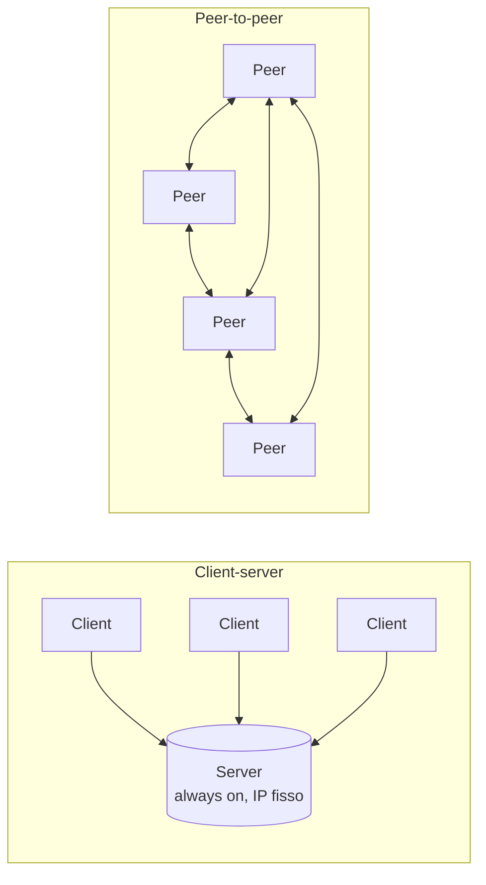
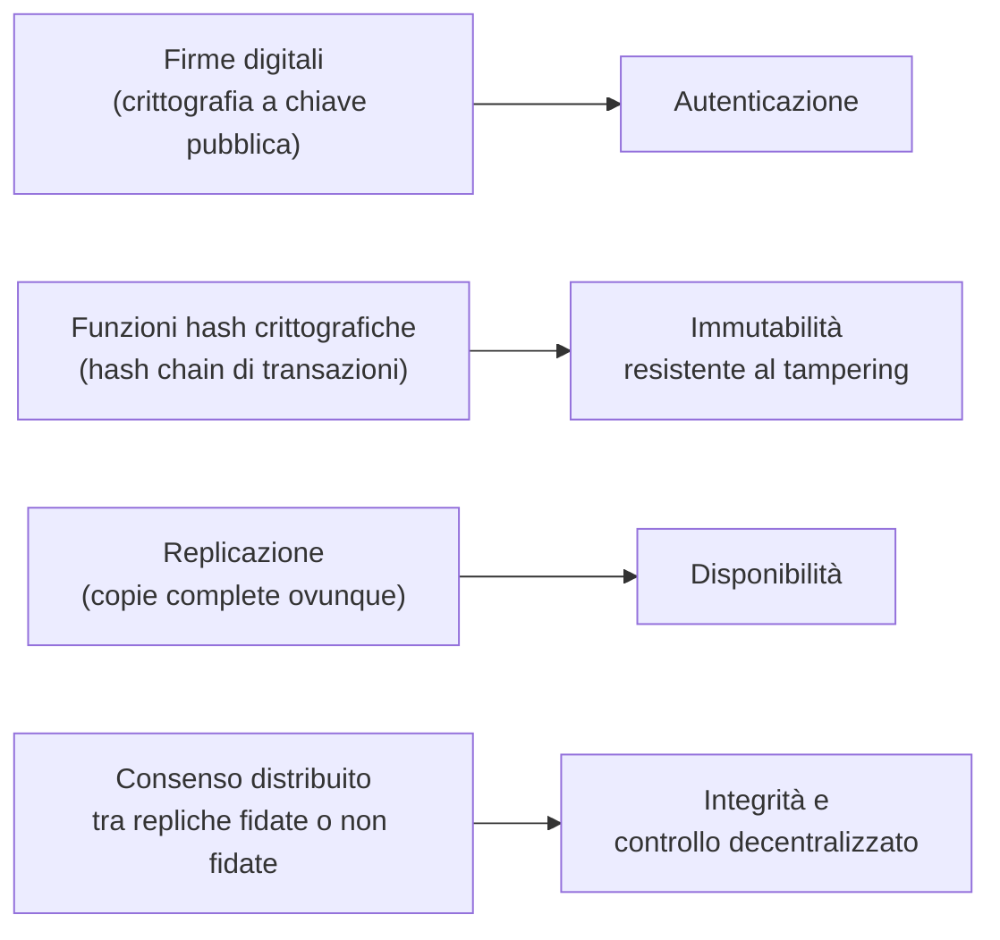
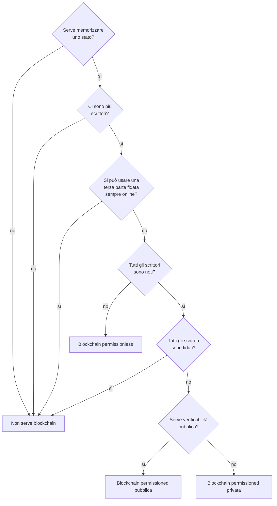
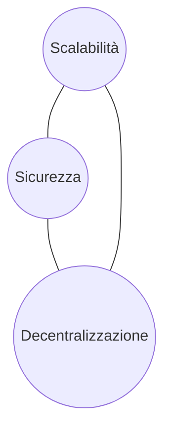

---
tags:
  - università/p2p-blockchain
  - peer-to-peer
  - blockchain
  - introduzione
data: 2026-02-16
lezione: "L01 - Introduzione al corso"
professore: "Laura Ricci"
---

# Introduzione: dai sistemi P2P alla blockchain

La prima lezione ha un doppio scopo. Da un lato presenta l'organizzazione del corso (modalità d'esame, progetto, programma, materiale didattico); dall'altro introduce i due grandi protagonisti del corso: il **paradigma peer-to-peer** (P2P), che per la prima volta ha messo in discussione il modello client-server su scala Internet, e la **blockchain**, che del P2P è la "seconda killer application". L'idea che attraversa tutta la lezione è che la blockchain non nasce dal nulla: è la combinazione di tecniche P2P (reti overlay, replicazione, gossip), crittografiche (firme digitali, hash) e di consenso distribuito, messe insieme per ottenere fiducia in un ambiente in cui i partecipanti non si fidano l'uno dell'altro.

## Organizzazione del corso

Il corso "P2P Systems and Blockchains" vale **9 CFU** ed è tenuto da Laura Ricci (lezioni teoriche, circa 6 CFU) e Damiano Di Francesco Maesa (laboratorio, circa 3 CFU). È un corso della laurea magistrale in Informatica, disponibile come esame a scelta per altre magistrali. I prerequisiti sono Reti di calcolatori, Algoritmica e le nozioni di base di crittografia applicata, che vengono comunque riprese durante il corso. Il laboratorio di ricerca di riferimento è il **DLT Lab** (Distributed Ledger Technologies) del Dipartimento, i cui membri tengono alcune lezioni ospiti; il laboratorio collabora, tra gli altri, con CNR, Università di Firenze, Banca d'Italia, University of Cambridge, University of Surrey e KAUST.

### Modalità d'esame

L'esame consiste in un **progetto finale** più un **orale**. Il progetto è un'applicazione basata su blockchain; l'orale comprende la discussione del progetto e domande sugli argomenti del corso non coperti dal progetto. Gli strumenti per il progetto sono **Solidity**, il linguaggio per scrivere smart contract su Ethereum, e **Hardhat**, un ambiente open source per costruire e testare smart contract che include compilatore Solidity, framework di test, framework di debug e funzionalità di deployment; Hardhat può girare in locale ma anche sfruttare le *testnet* (reti di test) di Ethereum. Esempi di progetti degli anni passati: MasterMind o Battaglia Navale su blockchain, aste "smart", lotterie "smart", scambio e ricompensa di contenuti, Splitwise su blockchain.

> [!tip] Come si svolge davvero l'orale
>
> Dalle testimonianze degli orali passati: circa i primi venti minuti sono dedicati al progetto (demo, qualità del codice, motivazione delle scelte implementative), poi seguono domande ampie sui "grandi argomenti" (Bitcoin, Ethereum, strutture dati e metodi crittografici, attacchi, DHT). La docente non si sofferma sui dettagli minimi ma chiede di costruire un discorso: *perché* serve un certo sistema, quali sono le sue caratteristiche, quali problemi risolve. Conviene quindi studiare ogni argomento partendo dalla motivazione.

### Struttura e programma

Il corso si concentra su: i principi di base dei sistemi P2P (overlay non strutturati e DHT), le blockchain in generale, Bitcoin ed Ethereum in profondità, la programmazione di smart contract, la scalabilità (tecnologie *layer-2*) e le applicazioni (DeFi, supply chain, Self Sovereign Identity). Per definire questi sistemi si usano tre "attrezzi" di base: **algoritmi distribuiti**, **metodi crittografici** e **strutture dati probabilistiche**. Il laboratorio è focalizzato sulle applicazioni dei concetti teorici, con un'ampia parte di sviluppo in Solidity.

Il programma si articola in quattro blocchi.

Il blocco **fondamenti P2P** tratta gli *overlay* (reti virtuali a livello applicativo): overlay non strutturati (flooding, random walk, protocolli epidemici) e strutturati, cioè le **Distributed Hash Table** (DHT), con Kademlia in teoria e nelle applicazioni; poi la rete P2P di Ethereum e **IPFS** (InterPlanetary File System), un protocollo di storage distribuito che permette a computer di tutto il mondo di memorizzare e servire file come parte di un'enorme rete P2P.

Il blocco **fondamenti della blockchain** tratta gli strumenti crittografici (firme digitali, hash crittografico, tecniche avanzate come Zero-Knowledge e Fully Homomorphic Encryption), le strutture dati viste dal punto di vista applicativo (ripasso dei Bloom filter, strutture dati autenticate, Merkle tree, Merkle Patricia trie) e i protocolli di consenso (Nakamoto consensus basato su Proof of Work, Proof of Stake).

Il blocco **piattaforme** tratta Bitcoin (struttura di transazioni e blocchi, PoW e mining, attacchi come double spending e malleability, la rete P2P di Bitcoin, wallet e light client, pseudo-anonimato con tracciabilità e mixing, scalabilità tramite payment channel off-chain e Lightning Network) ed Ethereum (differenze rispetto alla blockchain di Bitcoin, smart contract in Solidity, gas, vulnerabilità degli smart contract, scalabilità e soluzioni layer-2 come zero-knowledge rollup e optimistic rollup).

Il blocco **applicazioni** tratta criptovalute, Decentralized Finance (DeFi), tokenizzazione, supply chain e Self Sovereign Identity (SSI).

### Materiale didattico

Il materiale obbligatorio sono le slide dell'anno corrente (quelle degli anni precedenti sono dichiarate obsolete) e i tutorial pubblicati sulla pagina del corso. I libri di riferimento sono: Antonopoulos e Wood, *Mastering Ethereum*; Antonopoulos, *Mastering Bitcoin*; Antonopoulos, *Mastering the Lightning Network*; Narayanan, Bonneau, Felten, Miller, Goldfeder, *Bitcoin and Cryptocurrency Technologies* (Princeton University Press); Rosenbaum, *Grokking Bitcoin* (Manning, 2019).

---

## Il paradigma client-server

Per capire che cosa introduce il P2P conviene partire da ciò che il P2P mette in discussione. Nel **paradigma client-server** i ruoli sono rigidamente asimmetrici. Il **client** gira sugli *end-host* (i computer degli utenti), ha un comportamento *on/off* (si connette e si disconnette quando vuole), è un consumatore di servizi, invia richieste, non comunica direttamente con gli altri client e deve conoscere l'indirizzo IP (o il nome DNS) del server. Il **server** invece gira su host dedicati, è sempre acceso (*always on*), è il fornitore del servizio, riceve le richieste e deve soddisfare quelle di tutti gli $N-1$ client; per essere raggiungibile ha bisogno di un indirizzo IP fisso.

## Il paradigma peer-to-peer

Nel **paradigma peer-to-peer** questa asimmetria scompare. Ogni nodo, detto **peer** (pari), gira su un end-host e ha comportamento on/off: il sistema deve quindi gestire il **churn**, cioè il continuo ingresso e uscita di nodi. Un peer deve eseguire una procedura di **join** (ingresso nella rete) e deve **scoprire** gli altri peer. Ciascun peer è contemporaneamente fornitore e consumatore di servizi, e i peer comunicano direttamente tra loro. Proprio perché non c'è un'autorità centrale, occorre definire delle **regole di comunicazione**, e occorre anche affrontare problemi "sociali": prevenire il **free riding** (il comportamento di chi consuma risorse senza offrirne) e incentivare la partecipazione e la reciprocità.

*Fig. — Nel modello client-server tutte le richieste convergono sul server; nel modello P2P ogni peer è insieme client e server e comunica direttamente con gli altri.*

> [!warning] I server non spariscono del tutto
>
> Anche nei sistemi P2P i server sono tipicamente ancora necessari per il **bootstrap**, cioè per permettere a un nuovo peer di trovare un primo punto di contatto nella rete. Non servono invece per la **condivisione delle risorse**, che avviene direttamente tra peer.

### Definizioni di sistema P2P

Le slide propongono due definizioni complementari.

> [!definition] Sistema P2P (definizione 1)
>
> Un sistema peer-to-peer è un insieme di entità autonome (i peer) capaci di auto-organizzarsi e di condividere un insieme di risorse distribuite in una rete di calcolatori. Il sistema sfrutta tali risorse per fornire un servizio in modo completamente o parzialmente decentralizzato.

Le risorse condivise possono essere **ledger** (registri, come nelle blockchain), spazio di storage in lettura/scrittura (file system distribuiti), potenza di calcolo e banda.

> [!definition] Sistema P2P (definizione 2)
>
> Un sistema P2P è un sistema distribuito definito da un insieme di nodi interconnessi, capaci di auto-organizzarsi e di costruire topologie diverse con l'obiettivo di condividere risorse come cicli di CPU, memoria e banda. Il sistema è in grado di adattarsi a un continuo churn dei nodi mantenendo connettività e prestazioni ragionevoli senza un'entità centralizzata (come un server).

La seconda definizione mette l'accento su due aspetti che torneranno in tutto il corso: la **costruzione di topologie** (gli overlay) e la **resistenza al churn**.

### Condivisione delle risorse

Il P2P riguarda il "dare e ricevere da una comunità": ogni peer condivide un insieme di risorse e ottiene in cambio risorse o servizi. Uno dei primi scenari è stato lo scambio di musica: condivido i miei file audio e ottengo quelli altrui (Napster, Gnutella, BitTorrent). In questo contesto un peer si comporta sia da client sia da server, con funzionalità simmetriche: per questo viene chiamato **servent** (fusione di *server* e *client*).

La reciprocità però non è l'unico modello. Un peer può offrire gratuitamente una risorsa per partecipare a un progetto (ricerca di vita extraterrestre, ricerca su terapie contro il cancro, manutenzione di un ledger distribuito), oppure può essere **ricompensato** per il contributo alla gestione della rete, come accade ai **miner** di Bitcoin.

In ogni caso le risorse condivise si trovano "al bordo" di Internet: sono condivise direttamente dai peer, senza nodi speciali dedicati alla loro gestione. Questo ha conseguenze importanti. Le connessioni dei peer sono **transitorie** (connessioni e disconnessioni molto frequenti); le risorse offerte vengono aggiunte e rimosse dinamicamente; e soprattutto a ogni nuova connessione un peer può ricevere un **indirizzo IP diverso**. Ne segue che una risorsa non può essere localizzata tramite un IP statico: servono **nuovi meccanismi di indirizzamento definiti a livello applicativo**, non a livello IP. È esattamente il problema che risolveranno gli overlay e le DHT nelle prossime lezioni.

### Dal file sharing alla blockchain

Il **file sharing** P2P è un servizio leggero e *best effort*: persistenza e sicurezza non sono l'obiettivo principale, mentre l'anonimato è importante. Esempi storici sono Napster, Gnutella, KaZaA, eMule e BitTorrent. Oltre al file sharing, il paradigma P2P è alla base delle blockchain e dei file system distribuiti come IPFS.

> [!note] Timeline
>
> Nelle slide è presente una timeline grafica dei sistemi P2P e blockchain di cui il testo estratto non riporta il contenuto. Le date principali citate altrove nella lezione sono: Napster a fine anni '90 (circa dieci anni dopo il World Wide Web) e il paper di Bitcoin nell'ottobre 2008.

#### Il file sharing, prima killer application

Lo scenario tipico è il seguente. Un utente U ha un client P2P sul portatile e una connessione intermittente a Internet, con un nuovo IP a ogni connessione. U memorizza i file da condividere in una directory e associa a ogni file un insieme di chiavi che lo identificano (per una canzone: titolo, autore, data di pubblicazione). Quando cerca una canzone, U invia una **query** al sistema e ottiene l'elenco dei peer che possiedono il file richiesto; sceglie uno di questi peer P secondo qualche criterio, e il file viene copiato dal computer di P a quello di U. Mentre U scarica, altri utenti possono già scaricare da U le parti del file che U ha già ottenuto e messo nella directory condivisa: è l'idea alla base di BitTorrent.

Il file sharing esplode con il successo di **Napster** alla fine degli anni '90. La **prima generazione** (Napster) introduce un insieme di server centrali in cui gli utenti registrano i descrittori dei file che intendono condividere: solo il trasferimento dei contenuti (download/upload) usa un protocollo P2P, mentre la **ricerca è centralizzata**. Questa directory centralizzata è stata il "tallone d'Achille" dell'applicazione: Napster è stato condannato per violazione del copyright perché, analizzando la propria directory centralizzata, avrebbe potuto rilevare i contenuti scambiati tra gli utenti. La **seconda generazione** (Gnutella, FastTrack/KaZaA, BitTorrent) elimina ogni punto di centralizzazione: sia la ricerca sia il trasferimento sono completamente distribuiti.

---

## La blockchain, seconda killer application

### Che cos'è una blockchain

Le slide propongono tre definizioni, via via più precise.

> [!definition] Blockchain (tre definizioni)
>
> **Definizione 1.** Un database condiviso memorizzato in copie multiple su computer sparsi per il mondo, mantenuto senza bisogno di un'autorità centrale (una banca, un governo, Google...).
>
> **Definizione 2.** Un sistema di memorizzazione dati replicato e consistente, immutabile, *append-only* (in cui si può solo aggiungere) e resistente alle manomissioni (*tampering*).
>
> **Definizione 3.** Una macchina a stati *write-only* e decentralizzata, mantenuta da attori non fidati e resa sicura da incentivi economici.

La terza definizione è la più ricca e viene dettagliata così: in una blockchain non si possono cancellare dati; il sistema non può essere spento né censurato; supporta operazioni definite e concordate dai partecipanti; i partecipanti possono non conoscersi (nel caso delle blockchain pubbliche); ed è nell'interesse stesso degli attori rispettare le regole. Quest'ultimo punto è cruciale: la sicurezza non si basa sulla fiducia negli altri, ma sul fatto che barare non conviene economicamente.

### Le tecnologie di base

Una blockchain combina quattro tecnologie, ognuna delle quali fornisce una proprietà precisa.

*Fig. — Le quattro tecnologie su cui si fonda una blockchain e la proprietà che ciascuna garantisce.*

Le **firme digitali** garantiscono l'autenticazione: solo chi possiede la chiave privata può autorizzare una transazione. Le **funzioni hash crittografiche**, concatenando i blocchi in una catena di hash, rendono i dati immutabili: modificare un dato passato cambierebbe tutti gli hash successivi. La **replicazione** (ogni nodo ha una copia completa) garantisce disponibilità. Il **consenso distribuito** tra repliche che possono fidarsi o non fidarsi l'una dell'altra garantisce integrità e controllo decentralizzato.

> [!note] Slide grafica
>
> La slide "Blockchain in a nutshell" è solo un'immagine. In sintesi, e come verrà approfondito nelle lezioni su Bitcoin, una blockchain è una sequenza di blocchi, ciascuno contenente un insieme di transazioni e l'hash del blocco precedente, replicata su tutti i nodi di una rete P2P che si accordano tramite un protocollo di consenso su quale sia la catena valida.

### Quando serve (e quando non serve) una blockchain

Una domanda classica è: invece di una blockchain, perché non usare un database? Le slide fanno riferimento al paper *"Do you need a Blockchain?"* (Wüst e Gervais, IACR ePrint 2017/375) e sono molto nette nel dire quando **non** serve una blockchain. Se tutte le parti sono **note e fidate**, non si deve usare una blockchain ma un qualunque numero di database; e molti dei casi d'uso "business" proposti per la blockchain ricadono proprio in questa categoria. Se tutte le parti sono note e fidate ma serve anche **immutabilità**, ancora non serve una blockchain: bastano database arricchiti con checksum crittografici (ad esempio AWS QLDB o Kafka).

> [!note] Il diagramma di decisione di Wüst e Gervais
>
> Le slide citano il paper senza riportarne il diagramma. Per completezza, il paper propone un albero di decisione di questo tipo (contenuto non presente nelle slide):

*Fig. — Albero di decisione ispirato a "Do you need a Blockchain?".*

Specularmente, le slide elencano le **applicazioni target** per una blockchain: applicazioni che richiedono un database comune, condiviso, *append-only* e di capacità limitata; applicazioni con più partecipanti che hanno gradi diversi di fiducia reciproca; applicazioni che devono girare in modo distribuito; applicazioni che altrimenti richiederebbero un processo di *settlement* (regolamento) complesso con una terza parte fidata; applicazioni che richiedono integrità, autenticazione e **non ripudio**; applicazioni governate da regole precise, che non cambiano e sono semplici da codificare; applicazioni che richiedono **trasparenza** (in contrapposizione alla privacy).

### Bitcoin, "la madre di tutte le blockchain"

Il paper di Bitcoin, firmato con lo pseudonimo **Satoshi Nakamoto**, viene pubblicato nell'**ottobre 2008**. Nella prima transazione *coinbase* (quella del blocco genesi) Satoshi inserisce il titolo di un giornale dell'epoca: *"The Times 03/Jan/2009 Chancellor on brink of second bailout for banks"*, cioè "il Cancelliere dello Scacchiere Alistair Darling ipotizza un secondo salvataggio per le banche". Il messaggio ha un doppio valore: politico (porre fine al controllo di banche e governi sul denaro, in piena crisi finanziaria) e tecnico (testimonia la data della prima transazione, che non può essere antecedente all'uscita di quel giornale).

L'idea di Bitcoin è che i pagamenti avvengano direttamente tra gli utenti, senza un'entità finanziaria centralizzata che li garantisca, con costi inferiori. Dietro c'è la visione **cypherpunk**: "possiamo rivoluzionare il mondo costruendo protocolli sicuri". Bitcoin ha anche dato nuove motivazioni e nuovi strumenti per imparare concetti classici di sicurezza informatica. Il concetto di **blockchain** è poi più generale di Bitcoin: è una nuova tecnologia per sviluppare applicazioni sicure in un ambiente non fidato, da cui nascono Ethereum e molte altre piattaforme che impattano processi, aziende e società.

### Ethereum e gli smart contract

**Ethereum** è stato finanziato in crowdfunding raccogliendo circa 20 milioni di dollari in circa un mese, e ha reso popolare la visione di una criptovaluta "generalizzata". La sua innovazione principale sono gli **smart contract**: programmi che implementano un protocollo sulla blockchain, scritti in un linguaggio **Turing-completo** (Solidity) ed eseguiti da tutti i nodi. In Ethereum il consenso diventa quindi **accordo sul risultato di una computazione**, non solo su un elenco di transazioni.

Rispetto a Bitcoin, dove gli *script* hanno potere computazionale volutamente limitato, Ethereum può in principio risolvere qualunque problema computazionale. Per evitare attacchi di tipo **denial of service** (ad esempio un contratto con un ciclo infinito che bloccherebbe tutti i nodi) introduce il **gas**, un costo da pagare per ogni operazione eseguita. Ethereum tratta la blockchain e i suoi nodi come un unico **computer globale, replicato e consistente**: l'intera macchina a stati, il suo codice, input e output sono replicati ed eseguiti in modo consistente.

> [!example] Smart contract: rimborso per ritardo aereo
>
> Bob è in aeroporto e il suo volo è in ritardo. Ha un'assicurazione che prevede un rimborso in caso di ritardo. La compagnia assicurativa ha pubblicato uno smart contract su Ethereum che è collegato a un database, monitora i ritardi dei voli e, non appena verifica un ritardo di almeno X minuti (o ore), genera automaticamente il rimborso, trasferendo criptovaluta nel wallet di Bob. Nessun intermediario deve approvare la pratica: la regola è codificata nel contratto.

Molte altre blockchain sono state proposte più di recente; le slide mostrano una mappa grafica dell'ecosistema blockchain.

---

## Le sfide della blockchain

Le due sfide principali sono **privacy** e **scalabilità**.

Sul fronte della **privacy**, le transazioni sono visibili sul registro pubblico, le identità degli utenti possono talvolta essere dedotte, e c'è un rischio di esposizione di dati sensibili. Sul fronte della **scalabilità**, le blockchain hanno un *throughput* (numero di transazioni al secondo) limitato, latenza elevata e congestione di rete, e richiedono risorse ed energia crescenti.

### Il trilemma della blockchain

> [!definition] Blockchain trilemma
>
> Il trilemma della blockchain afferma che è difficile ottenere contemporaneamente tre proprietà: **scalabilità**, **sicurezza** e **decentralizzazione**. La grande sfida scientifica è: come migliorare la scalabilità senza ridurre il livello di sicurezza e mantenendo un alto livello di decentralizzazione?

*Fig. — Il trilemma: migliorare un vertice tende a sacrificare almeno uno degli altri due.*

> [!warning] Chiesto all'esame
>
> Il trilemma della blockchain è stato chiesto all'orale, spesso collegato alla domanda successiva "quali soluzioni esistono per la scalabilità di Bitcoin ed Ethereum?" (Lightning Network, dimensione dei blocchi, intervallo tra blocchi, rollup). Bisogna saper spiegare perché le tre proprietà sono in tensione.

> [!note] Perché le tre proprietà sono in tensione
>
> Le slide enunciano il trilemma senza esempi. Un'intuizione standard: aumentare la dimensione dei blocchi o ridurre l'intervallo tra blocchi aumenta il throughput (scalabilità), ma rende più costoso far girare un nodo completo, quindi meno persone lo fanno (meno decentralizzazione); affidare la validazione a pochi nodi potenti è veloce ma riduce la decentralizzazione; ridurre il numero di conferme o il costo del consenso rende il sistema più veloce ma più attaccabile (meno sicurezza).

### Soluzioni: strumenti crittografici avanzati

Le soluzioni a queste sfide richiedono **crittografia avanzata**: Merkle tree e loro alternative, **Zero Knowledge Proofs** (ZKP), **Fully Homomorphic Encryption** (FHE), **Multiparty Computation** (MPC), **Authenticated Data Structures** (ADS). Per ciascuna di queste tecniche restano aperte questioni di testing, prestazioni, usabilità e integrazione con la blockchain.

### Privacy e auditabilità

Bilanciare privacy e **auditabilità** (verificabilità) è difficile: aumentare la privacy tende a nascondere i dettagli delle transazioni, mentre la piena auditabilità richiede trasparenza. Un esempio tipico è la DeFi. Da un lato i protocolli DeFi possono aver bisogno di confidenzialità: transazioni, depositi, *swap* e prestiti senza rivelare importi o indirizzi on-chain, perché gli utenti non vogliono esporre, ad esempio, quanto hanno preso in prestito. Dall'altro gli stessi protocolli devono essere auditabili: anche se alcuni dati sono privati, il protocollo deve verificare la correttezza, controllare che non ci sia double spending, confermare che il prestito sia adeguatamente coperto da garanzia (*collateralisation*). Le soluzioni indicate sono le Zero Knowledge Proof e la Fully Homomorphic Encryption.

> [!definition] Fully Homomorphic Encryption (FHE)
>
> Tipo di cifratura che permette di effettuare computazioni su dati cifrati senza decifrarli. I risultati, una volta decifrati, coincidono con quelli che si sarebbero ottenuti operando sul testo in chiaro. Idea chiave: "posso calcolare sui tuoi dati segreti senza mai vedere il segreto".

Nella blockchain la FHE permette computazioni che preservano la privacy: calcolare prestiti, *staking* o rendimenti senza rivelare i saldi degli utenti, e dimostrare la correttezza delle operazioni proteggendo i segreti. Ad esempio, un protocollo di lending può calcolare l'idoneità a un prestito o i tassi di interesse su saldi cifrati: i saldi esatti restano privati ma il sistema produce risultati corretti.

> [!definition] Zero Knowledge Proof (ZKP)
>
> Protocollo che permette a una parte (il **prover**, dimostratore) di convincere un'altra parte (il **verifier**, verificatore) della validità di un'affermazione senza rivelare i dati sottostanti.

Le ZKP migliorano la privacy perché nascondono i dati sensibili preservando la correttezza, abilitano l'esecuzione privata di smart contract e mantengono la verificabilità pubblica senza esporre i dati. Applicazioni tipiche: dimostrare la validità di una transazione senza rivelarne importi o identità, verifica privata dell'identità on-chain, DeFi che preserva la privacy.

### Scalabilità: spostare il lavoro fuori dalla catena

L'idea generale per la scalabilità è **spostare computazioni e dati pesanti fuori dalla blockchain** (*off-chain*) e usare la blockchain come **"ancora di fiducia"** (*trust anchor*). Qui le Zero Knowledge Proof vengono usate con uno scopo diverso rispetto alla privacy: servono a **dimostrare on-chain la correttezza di una computazione avvenuta off-chain**. Questa è l'idea alla base dei rollup che si vedranno nella lezione sui layer-2.

---

## Applicazioni della blockchain

### Token e valuta

Le criptovalute sono un'alternativa alle **valute fiat**. Rompono lo status quo in cui solo il governo emette moneta e ne definisce le procedure di emissione, e in cui autorità centrali (le banche) decidono quali transazioni sono valide. Le valute fiat hanno svincolato l'offerta di moneta da un bene fisico (ad esempio l'oro); la blockchain tipicamente lega l'offerta a un **bene virtuale limitato**, con un limite garantito crittograficamente. La blockchain registra e verifica i trasferimenti e, soprattutto, **risolve il problema del double spending** (la doppia spesa della stessa moneta digitale). Si distingue tra **token fungibili** (unità intercambiabili, come le monete) e **token non fungibili**.

> [!example] NFT e proprietà di un'opera digitale
>
> Un'opera d'arte in un file .jpeg può essere copiata e distribuita facilmente; proprio perché è facile da copiare, è difficile costruirci un modello di business, anche per opere molto buone. Come dimostrare chi è il vero proprietario? La risposta sono gli **NFT** (Non Fungible Token), che registrano on-chain la proprietà di un oggetto unico. La slide illustra con una vignetta le rivendicazioni contrapposte: "io sono il creatore", "ora è mio", "non è vero".

### Decentralized Finance

Un **Decentralized Exchange** (DEX) permette di scambiare asset peer-to-peer direttamente sulla blockchain. È costruito su Ethereum tramite smart contract, garantendo trasparenza ed esecuzione *trustless* (senza bisogno di fidarsi di una controparte). Usa l'**Automated Market Making**, cioè *liquidity pool* al posto dei tradizionali *order book*; è *permissionless* (chiunque può scambiare o fornire liquidità senza approvazione) ed è un'infrastruttura fondamentale dell'ecosistema DeFi. L'esempio principale è **Uniswap**: in Uniswap V3 le posizioni di liquidità sono rappresentate come **LP NFT**, e ogni posizione ha un insieme distinto e personalizzabile di parametri che ne determinano valore e ricompense.

### Self Sovereign Identity, supply chain, proprietà intellettuale

La **Self Sovereign Identity** (SSI) è presentata graficamente nelle slide e verrà trattata in una lezione ospite. Nella **supply chain** la blockchain serve al monitoraggio e alla certificazione della filiera. Un esempio è il sistema di Walmart sviluppato con tecnologia **Hyperledger** in collaborazione con IBM, che traccia l'origine agricola, le date di scadenza, la temperatura di conservazione, i dettagli di spedizione e parametri presi da sensori. Un altro esempio riguarda la pesca: i ristoranti possono vedere e verificare la catena di custodia del pesce, e sensori attaccati al pesce registrano posizione, temperatura e umidità.

Per la **proprietà intellettuale**, il proprietario di un contenuto digitale ne calcola l'hash insieme alla propria identità e lo registra (*commit*) sulla blockchain. Se nessun altro può dimostrare di averlo pubblicato prima di quel momento, questa è una prova di proprietà. È più comodo di un ufficio brevetti e permette di non rivelare i dettagli dell'oggetto digitale, perché on-chain c'è solo l'hash.

---

## Conclusioni

I vantaggi del P2P sono molteplici. Per i partecipanti, permette di sfruttare risorse "in eccesso" (cicli di CPU inutilizzati, spazio disco, banda) ottenendo in cambio risorse, servizi o partecipazione sociale, e di usare risorse per garantire **fiducia in un ambiente senza fiducia**. Per la comunità vale la proprietà di **self-scaling**: la partecipazione di più utenti aumenta naturalmente le risorse del sistema e la sua capacità di servire più richieste. Per chi lancia un'applicazione si riduce il costo di avvio: un sistema client-server richiede una *server farm* con alta connettività per soddisfare milioni di utenti, replicata in più luoghi per la tolleranza ai guasti e gestita per offrire un servizio 24/7.

Il successo di un'applicazione P2P dipende dal raggiungimento di una **massa critica** di utenti, cioè un livello di partecipazione che le permetta di auto-sostenersi. Nei primi sistemi è stata la novità dell'applicazione a portare alla massa critica: contenuti gratuiti e ampia scelta nel file sharing, un asset profittevole nelle criptovalute, un modo semplice di scambiare asset nei token. Il successo delle nuove applicazioni P2P dipenderà, oltre che da una buona ingegnerizzazione, dall'attrattiva dell'applicazione e dalla definizione di nuovi modelli di business.

Infine, le **sfide scientifiche**. Le metodologie classiche per i sistemi distribuiti "di vecchia generazione" non si applicano: l'ordine di grandezza è diverso (milioni di nodi invece di centinaia), gli algoritmi classici non scalano su reti di queste dimensioni, e l'uscita o il guasto di un nodo è un **evento normale**, non un'eccezione. Servono strumenti nuovi: teoria dei giochi (strategie di cooperazione, equilibri di Nash), nuove tecniche crittografiche, nuovi algoritmi di consenso e strumenti di analisi dei sistemi complessi.

> [!question] Possibili domande d'esame
>
> - Quali sono le differenze tra paradigma client-server e paradigma peer-to-peer? Perché nei sistemi P2P servono indirizzamenti a livello applicativo?
> - Dia una definizione di sistema P2P. Che cos'è il churn e perché è un problema centrale?
> - Che cos'è una blockchain? Quali sono le tecnologie di base e quale proprietà garantisce ciascuna?
> - Quando non ha senso usare una blockchain al posto di un database?
> - Che cos'è il trilemma della blockchain? Perché scalabilità, sicurezza e decentralizzazione sono in tensione?
> - Quali sono le principali differenze concettuali tra Bitcoin ed Ethereum? A che cosa serve il gas?
> - Come possono Zero Knowledge Proof e Fully Homomorphic Encryption aiutare a conciliare privacy e auditabilità?
> - Quali caratteristiche rendono un'applicazione adatta a essere realizzata su blockchain?

> [!abstract] Sintesi
>
> Il P2P sostituisce l'asimmetria client-server con peer che sono insieme client e server (servent), connessi in modo transitorio e con IP variabili: servono quindi indirizzamento a livello applicativo, gestione del churn e incentivi contro il free riding. Il file sharing (Napster centralizzato nella ricerca, poi Gnutella/BitTorrent completamente distribuiti) è stata la prima killer application; la blockchain è la seconda. Una blockchain è un registro replicato, append-only e immutabile mantenuto da attori non fidati e reso sicuro da incentivi economici, costruito su firme digitali (autenticazione), hash (immutabilità), replicazione (disponibilità) e consenso (integrità). Bitcoin (2008) introduce la moneta decentralizzata; Ethereum aggiunge smart contract Turing-completi protetti dal gas. Le sfide aperte sono privacy e scalabilità, riassunte nel trilemma scalabilità-sicurezza-decentralizzazione, affrontate con ZKP, FHE, MPC, ADS e soluzioni off-chain.
