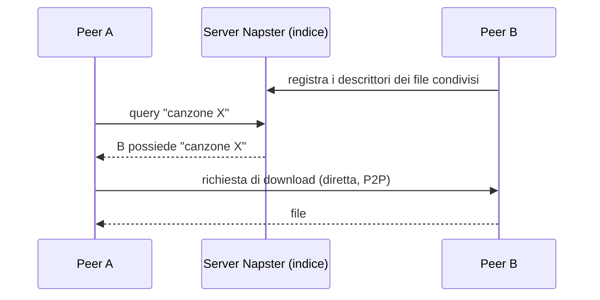
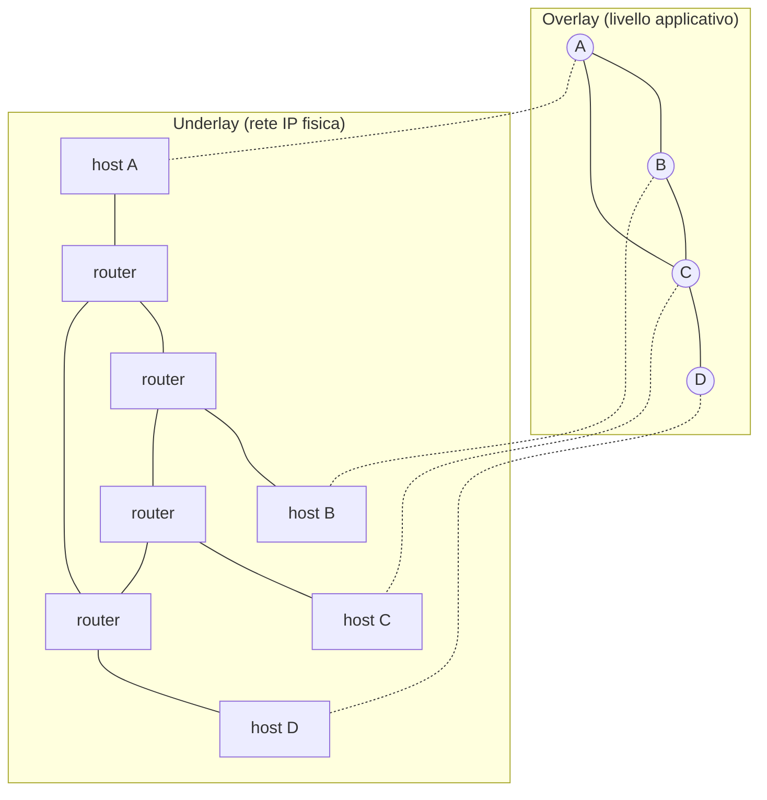
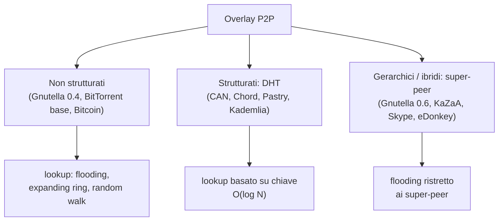
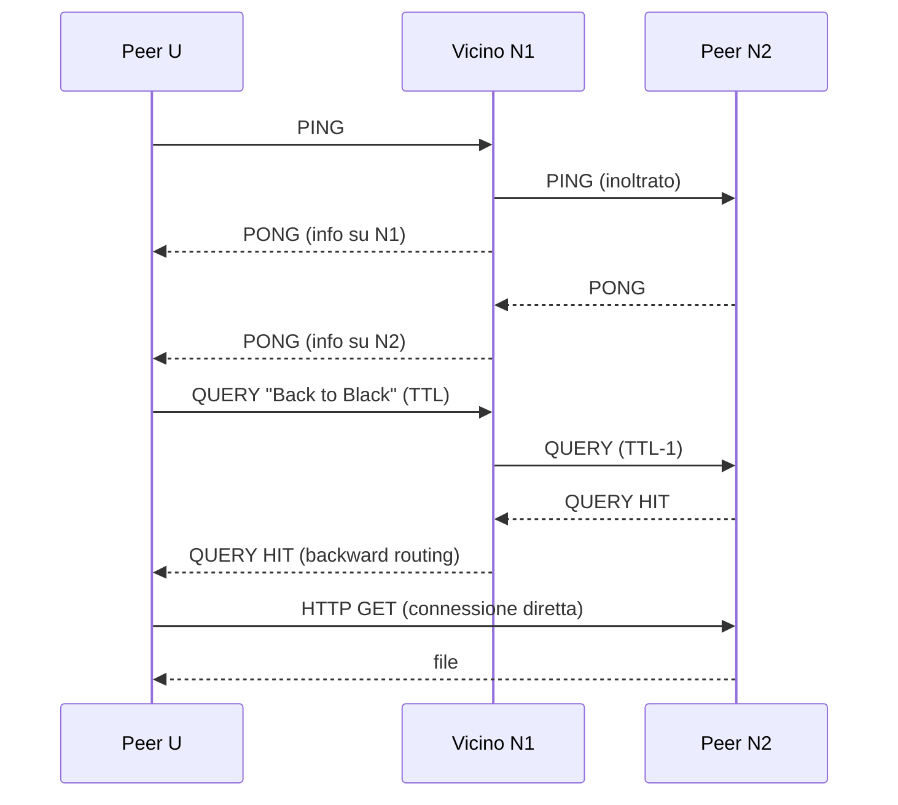
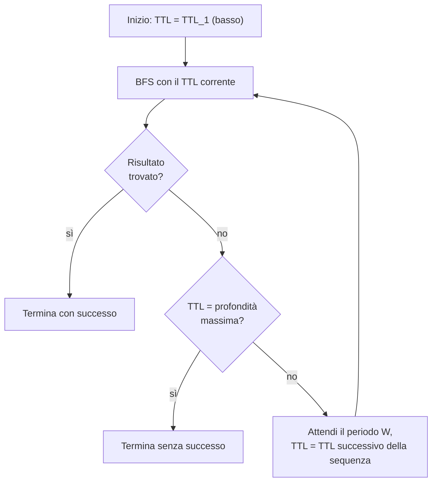
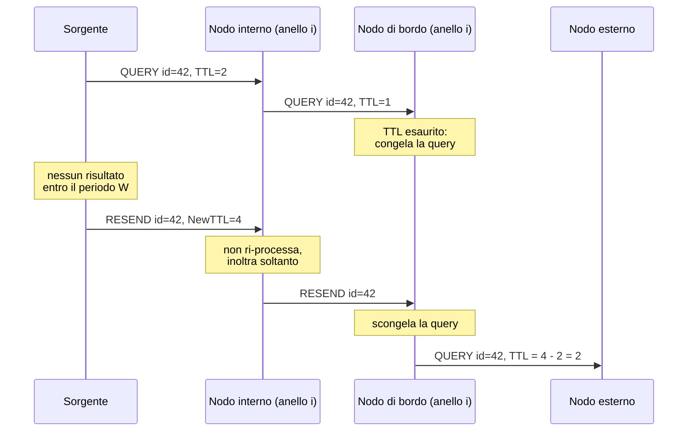
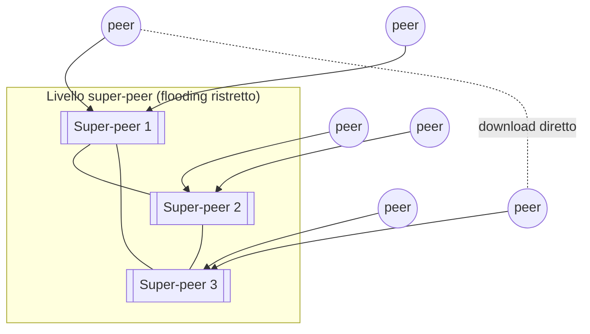

---
tags:
  - università/p2p-blockchain
  - peer-to-peer
  - overlay
  - overlay-non-strutturati
data: 2026-02-17
lezione: "L02 - P2P Overlays, unstructured overlays"
professore: "Laura Ricci"
---

# Overlay P2P e overlay non strutturati

Questa lezione affronta il primo problema tecnico di ogni sistema P2P: **come trovare una risorsa** quando non esiste un server che sappia dove si trova. Il percorso segue l'evoluzione storica. Si parte dai sistemi **semi-decentralizzati** come Napster, che centralizzano solo la ricerca; si passa ai sistemi **completamente decentralizzati** come Gnutella, dove la ricerca avviene per **flooding** (inondazione) su una rete logica detta **overlay**; si studiano poi le numerose varianti del flooding pensate per ridurne il costo (expanding ring, random walk, directed BFS, routing indices); infine si introducono gli overlay **strutturati** (DHT, oggetto della lezione successiva) e quelli **gerarchici** a super-peer. Lo stesso meccanismo di flooding ricomparirà in Bitcoin per propagare transazioni e blocchi.

## Sistemi semi-decentralizzati: Napster

Nel 2001 Napster dava accesso a una quantità di dati di scala paragonabile a quella di Google (all'epoca), usando però un numero enormemente minore di server: circa **15.000 server Google** contro circa **100 server Napster**. Come era possibile?

L'idea di base è **esternalizzare agli utenti** la parte più costosa del lavoro, cioè la memorizzazione e lo scambio dei file. La maggior parte del servizio è fornita dagli utenti stessi; i server di Napster servono solo a **localizzare** gli utenti che possono fornire un certo file, che è la parte economica del servizio. La distinzione tra server che forniscono il servizio e client che lo consumano diventa sfumata: per la prima volta gli utenti non vengono più chiamati client ma **peer**, e i sistemi risultanti vengono chiamati per la prima volta **peer-to-peer**.

Napster era un sistema di condivisione di file musicali su scala globale: nel febbraio 2001 contava **26,4 milioni di utenti** e circa **10 TB di dati** (2 milioni di canzoni, in media 220 canzoni per utente).



*Fig. — In Napster la ricerca è centralizzata sul server-indice, mentre il trasferimento dei file avviene direttamente tra i peer.*

### Lezioni apprese da Napster

Il **punto di forza** di Napster è la condivisione delle risorse. Ogni nodo "paga" la propria partecipazione fornendo accesso alle proprie risorse: risorse fisiche (disco, rete), conoscenza (annotazioni) e contenuti (file). Ogni nodo agisce sia da client sia da server (**servent**). Si ottiene così un sistema informativo globale senza investimenti enormi, con **decentralizzazione di costi e amministrazione**, evitando colli di bottiglia sulle risorse.

Il **punto debole** è che un punto di centralizzazione esiste ancora. Il server è un **single point of failure** (punto singolo di guasto); serve un'entità unica per controllare il sistema, che è un collo di bottiglia progettuale; e la copia di materiale protetto da copyright ha reso Napster bersaglio di attacchi legali. La tendenza che ne segue è verso la **decentralizzazione completa**.

## Sistemi completamente decentralizzati: Gnutella

In **Gnutella**, come in Napster, i file musicali sono memorizzati presso gli utenti. A differenza di Napster però **non esiste alcun server centrale** per localizzare i file e non esiste un indice centrale. I peer stabiliscono tra loro **connessioni dirette non transitorie**, usate non per scaricare contenuti ma solo per la **ricerca**. L'insieme di queste connessioni definisce una **rete overlay**.

I punti di forza dei sistemi completamente decentralizzati sono l'assenza di infrastruttura e di amministrazione e l'assenza di single point of failure. I punti deboli sono l'**elevato traffico di rete**, l'assenza di una ricerca strutturata e il **free riding**.

## La rete overlay

> [!definition] Overlay network
>
> Una rete overlay P2P è una **rete logica costruita sopra una rete fisica** (detta *underlay*). I link dell'overlay sono "tunnel" attraverso la rete sottostante: non tutti i link logici sono anche link fisici, e ogni link logico può corrispondere a un insieme di link fisici e attraversare più router.



*Fig. — Un singolo link logico dell'overlay (ad esempio A–C) corrisponde a un percorso di più link fisici e router nell'underlay.*

Su una stessa rete sottostante possono coesistere **molti overlay contemporaneamente**, ciascuno dei quali fornisce un proprio servizio particolare, non disponibile nella rete sottostante. I nodi dell'overlay sono spesso end-host che agiscono da nodi intermedi, inoltrando traffico e fornendo un servizio (ad esempio l'accesso a file). Oggi la maggior parte degli overlay P2P è costruita **a livello applicativo** sopra lo stack TCP/IP: sono quindi astrazioni applicative. L'overlay si appoggia all'underlay per le funzioni di rete di base (routing e forwarding a livello IP), ma può offrire **nuove funzionalità di routing e forwarding senza modificare i router**.

### Il protocollo P2P

> [!definition] Protocollo P2P
>
> Un protocollo P2P definisce l'insieme dei messaggi che i peer si scambiano, il loro formato e la loro semantica. È definito sopra l'overlay.

Tutti i protocolli P2P hanno alcune caratteristiche comuni: definiscono una **strategia di routing a livello applicativo** dello stack TCP/IP; identificano i peer tramite **identificatori univoci**, generalmente calcolati con una **funzione hash**; e i loro messaggi sono composti da un **header** e un **payload**, come i pacchetti a livello IP.

### Classificazione degli overlay

Gli overlay P2P si dividono in tre famiglie: **overlay non strutturati**, **overlay strutturati** (le Distributed Hash Table) e **overlay ibridi/gerarchici** basati su **super-peer**.



*Fig. — Le tre famiglie di overlay e il relativo meccanismo di ricerca.*

---

## Overlay non strutturati

In un **overlay non strutturato** i peer sono connessi in modo arbitrario, e la rete overlay risultante non ha una struttura prefissata. Gli algoritmi di lookup sono il **flooding**, l'**expanding ring** e il **random walk**. Questi overlay sono facili da programmare e da mantenere e sono **molto resilienti** (non c'è una struttura da riparare quando i nodi entrano o escono); in compenso hanno un **costo di lookup elevato, lineare in $n$** (numero di nodi della rete) e quindi **bassa scalabilità**.

Esempi: Gnutella (puro fino alla versione 0.4, poi gerarchico dalla 0.6, come KaZaA), BitTorrent (nel protocollo base; usa anche una DHT) e **Bitcoin**. Le slide mostrano una fotografia della topologia della rete P2P di Bitcoin presa nel 2013: le connessioni tra i peer dell'overlay sono casuali, e alcuni nodi (evidenziati a colori) hanno grado più alto degli altri.

Prendendo Gnutella come esempio: nessuna informazione di indice viene usata e le connessioni tra peer sono definite a caso. Restano due problemi: **come fare il bootstrap** nella rete e **come trovare un contenuto senza un indice centrale**.

### Bootstrap

Per entrare nella rete un nuovo peer deve conoscere almeno un peer già presente. Le slide indicano due meccanismi. Il primo sono **server DNS noti** che memorizzano gli indirizzi IP di un insieme di "peer stabili"; su questi server gira uno script che interagisce con i peer e aggiorna la cache in modo dinamico e automatico. Il secondo è una **cache interna**: ogni client memorizza gli indirizzi IP dei peer contattati nella sessione corrente e nelle sessioni precedenti, e questa cache viene aggiornata dinamicamente facendo **gossip** (scambio di informazioni) con i peer vicini.

### Scenario di funzionamento

Il funzionamento di una rete non strutturata come Gnutella si articola in quattro passi.

Al **passo 0** il peer entra nella rete (join). Al **passo 1** determina "chi c'è nella rete": invia un messaggio **ping** per annunciare la propria presenza; gli altri peer rispondono con un messaggio **pong** e inoltrano a loro volta il ping ai peer a cui sono connessi. Un pong contiene anche informazioni sul peer che lo invia. Al **passo 2** avviene la **ricerca**: un messaggio **query** chiede agli altri peer un contenuto, ad esempio "hai qualche contenuto che corrisponde alla stringa *Back to Black*?". I peer controllano se hanno corrispondenze e, se sì, rispondono; se no, inoltrano il pacchetto ai peer connessi. Il processo continua finché non si esaurisce il **TTL**. Al **passo 3** avviene il **download**: il trasferimento del contenuto usa una connessione diretta tramite il metodo **GET di HTTP**.

Anche la scoperta della rete (ping/pong) usa il **TTL** per limitare il flooding.



*Fig. — Scoperta della rete con ping/pong, ricerca con query inoltrata sull'overlay, risposta per backward routing e download diretto via HTTP.*

---

## Ricerca per flooding

> [!definition] Flooding
>
> Nel **message flooding** il peer che cerca invia la query a tutti i suoi vicini; ciascun vicino la inoltra a sua volta ai propri vicini (tranne quello da cui l'ha ricevuta), e così via. Per fermare la ricerca i messaggi hanno un **time-to-live (TTL)** limitato; per rilevare i cicli ogni messaggio è associato a un **identificatore univoco**.

Il flooding con TTL (*TTL enhanced flooding*) funziona dunque così: la query è inviata a tutti i vicini diversi da quello che l'ha propagata, e il TTL, decrementato a ogni hop, limita la portata (*scope*) della query. La risposta torna all'origine tramite **backward routing**, cioè ripercorrendo all'indietro il cammino della query lungo le connessioni non transitorie dell'overlay. Il contenuto invece può essere trasferito direttamente con una connessione HTTP tra chi cerca e chi possiede il file. In sintesi, l'overlay serve per **individuare** il contenuto, la connessione HTTP diretta per **scaricarlo**.

> [!definition] Time-to-live (TTL)
>
> Il TTL è un contatore associato a ogni messaggio che indica il numero massimo di hop che il messaggio può ancora percorrere. Ogni nodo che inoltra il messaggio decrementa il TTL; quando raggiunge 0 il messaggio viene scartato. Serve a limitare il raggio della ricerca e quindi il numero di messaggi generati.

Il flooding ha però limiti evidenti. Il ritrovamento del contenuto **non è garantito**: possono verificarsi **falsi negativi**, cioè la risorsa esiste nella rete ma si trova oltre il raggio TTL, e la ricerca fallisce. Inoltre la scalabilità è ridotta. Nonostante questo, molte delle reti P2P più popolari sono non strutturate e usano il flooding o sue varianti.

### Pseudocodice

Lo pseudocodice delle slide descrive che cosa fa un nodo quando riceve una query `q` da un vicino `p`.

```text
FloodForward(Query q, Source p)
    // ho già visto questa query?
    if (q.id ∈ oldIdsQ) return            // sì: la scarto
    else oldIdsQ ← oldIdsQ ∪ {q.id}       // ricordo la query
    // il TTL è scaduto?
    q.TTL ← q.TTL - 1
    if (q.TTL ≤ 0) return                  // sì: la scarto
    else
        // no: la inoltro a tutti i vicini tranne la sorgente
        foreach (s ∈ Neighbors)
            if (s ≠ p) send(s, q)
```

La prima parte usa l'identificatore univoco della query per **scartare i duplicati** (che arrivano quando il grafo contiene cicli); la seconda decrementa il TTL e scarta la query se è scaduto; la terza inoltra la query a tutti i vicini tranne quello da cui è arrivata. Le risposte seguono il backward routing.

> [!note] Condizione sul TTL
>
> Nel testo estratto dalle slide il simbolo di confronto sul TTL non è leggibile; la forma usata qui ($\le 0$) è quella standard. L'effetto è che con TTL iniziale $t$ la query raggiunge al massimo i nodi a distanza $t$ dall'origine (con piccole differenze di convenzione su dove avviene il decremento).

### Il flooding come BFS

Nel flooding **non esiste alcuna regola** che stabilisca dove sono memorizzati i dati né quali nodi sono vicini tra loro. Il flooding può essere visto come una **Breadth First Search** (BFS, visita in ampiezza) dell'overlay, con il numero di hop limitato da un TTL massimo valido per tutto il sistema. Trova il **massimo numero di risultati** all'interno dell'"anello" centrato sul nodo che interroga e con raggio pari al TTL; però genera un numero elevato di messaggi, molti dei quali **duplicati**, e **non scala bene**.

> [!tip] Perché il flooding costa tanto
>
> Se ogni nodo ha grado medio $d$, dopo $t$ hop il numero di messaggi cresce all'incirca come $d \cdot (d-1)^{t-1}$: la crescita è esponenziale nel TTL. In un grafo con cicli molti di questi messaggi arrivano a nodi che hanno già visto la query e vengono scartati: è banda sprecata. Questo è il "problema del flooding" su cui insiste la docente: **consumo di banda**. (Stima non presente nelle slide, aggiunta per chiarezza.)

> [!warning] Chiesto all'esame
>
> Domanda reale: "Se vuole mandare informazioni su una rete non strutturata, quali meccanismi può utilizzare? Qual è il problema del flooding? Cos'è il TTL? Come funziona l'expanding ring?". La risposta attesa copre: flooding come BFS limitata dal TTL, rilevazione dei duplicati con ID univoco, backward routing; problema del consumo di banda e dei messaggi duplicati, falsi negativi; expanding ring come sequenza di BFS con TTL crescente; random walk come alternativa a basso overhead.

### Flooding delle transazioni in Bitcoin

Il flooding non serve solo per cercare, ma anche per **propagare transazioni** (e blocchi) nella rete P2P sottostante a una blockchain. In questo caso il problema principale diventa **mantenere la consistenza**: tutti i nodi devono ricevere le stesse transazioni, e il ritardo di propagazione fa sì che nodi diversi possano avere viste temporaneamente diverse.

### Alternative al flooding

Sono stati proposti molti schemi per risolvere i problemi del flooding originale, classificabili in due famiglie. Gli approcci **basati su BFS** sono: iterative deepening/expanding ring, k-walker random walk, two-level k-walker random walk, directed BFS, modified random BFS. Gli approcci **basati su DFS** (Depth First Search) sono: ricerca basata su indici locali, ricerca basata su **routing indices**, ricerca basata su **attenuated Bloom filter**. Il riferimento per approfondire è il materiale "Searching in P2P Networks" pubblicato sulla pagina del corso. Nel seguito si vedono quelli trattati esplicitamente nelle slide.

---

## Expanding ring / iterative deepening

> [!definition] Expanding ring (iterative deepening)
>
> È un **flooding con TTL crescente**: una sequenza di BFS limitate dal TTL, ciascuna con TTL maggiore della precedente. Si parte con una BFS a TTL basso; se la ricerca non ha successo, si ripete la BFS a profondità maggiore aumentando il TTL. La ricerca termina quando la query è soddisfatta oppure quando si raggiunge la profondità massima.

A ogni passo si può scegliere di inoltrare la query a tutti i vicini oppure solo a una frazione (un sottoinsieme casuale). L'idea è che le risorse **popolari** sono numerose e si trovano probabilmente vicino a chi cerca: un piccolo anello basta e si evita di inondare tutta la rete. Solo per le risorse rare si arriva ad anelli grandi.



*Fig. — L'algoritmo expanding ring: sequenza di BFS con TTL crescente fino al successo o alla profondità massima.*

### Algoritmo naive e ottimizzazione

Nella versione **naive** ogni nuova BFS riparte da zero: i nodi vicini alla sorgente, che hanno già ricevuto e processato la query negli anelli precedenti, la ricevono e la processano di nuovo. È uno spreco.

La versione **ottimizzata** usa questi accorgimenti. Ogni query ha un **identificatore univoco**. Il periodo **W** tra due query successive può essere regolato. La sequenza di TTL deve essere **crescente**, ma i valori **non devono essere necessariamente contigui** (ad esempio 1, 3, 5, 7 invece di 1, 2, 3, 4). E soprattutto si evita di processare la query più volte. I nodi che si trovano "sul bordo dell'anello $i$" (quelli presso cui il TTL si è esaurito) **congelano** (*freeze*) la query per un periodo maggiore di W. Quando la sorgente avvia l'anello $i+1$, invia un messaggio **resend** con lo **stesso ID** della query precedente e con un nuovo TTL maggiore, *NewTTL*. Ogni nodo **interno** all'anello $i$ si limita a inoltrare il messaggio resend senza ri-processare la query. Il resend raggiunge così il bordo dell'anello $i$, dove i nodi **scongelano** la query e la inviano ai propri vicini con

$$
TTL = NewTTL - PreviousTTL
$$

cioè con esattamente i hop che mancano per coprire l'anello $i+1$.



*Fig. — Ottimizzazione dell'expanding ring: i nodi interni inoltrano solo il resend, i nodi di bordo scongelano la query e la propagano con TTL = NewTTL − PreviousTTL.*

> [!note] Politica dei TTL
>
> Le slide dicono solo che i TTL sono crescenti ma non necessariamente contigui. In letteratura (Lv et al., "Search and replication in unstructured P2P networks", 2002) una politica tipica è partire da TTL = 1 e incrementare di 2 a ogni passo fino a un massimo. Il vantaggio rispetto al flooding è che per oggetti popolari si ottiene una forte riduzione dei messaggi, al costo di un **ritardo maggiore** per gli oggetti rari (si ripetono più tentativi, ciascuno con attesa W).

---

## Random walk

> [!definition] Random walk
>
> Il **random walk** (passeggiata aleatoria, detta anche *drunkard's walk*, "passeggiata dell'ubriaco") è un cammino costruito facendo passi successivi in direzioni casuali. È descritto da una **catena di Markov**: vale la **proprietà di Markov**, cioè il sistema è senza memoria; gli stati precedenti sono irrilevanti per predire lo stato successivo e la distribuzione di probabilità dello stato futuro dipende solo dallo stato presente. Nessuna direzione è più probabile di un'altra.

Ne esistono varie varianti, come la *percolation search* o schemi con probabilità diverse per ciascun vicino.

Nel random walk applicato alla ricerca, **un solo messaggio** di query viene inviato a un vicino scelto a caso. Il TTL viene decrementato a ogni hop. Se la query incontra un nodo che possiede il contenuto, la ricerca termina e il contenuto viene restituito; altrimenti la query fallisce, e il fallimento è determinato da un **timeout**. Il peer che ha avviato la ricerca può scegliere di riemettere la query lungo un altro cammino casuale. Il random walk **riduce l'overhead di messaggi** ma provoca un **ritardo di ricerca più lungo**, perché esplora la rete un nodo alla volta.

### K-walker random walk

Per ridurre il ritardo si lanciano **più random walk in parallelo**. Il nodo che interroga invia $k$ copie della query a $k$ vicini scelti a caso (è quindi un protocollo **probabilistico**); ogni copia segue il proprio cammino, scegliendo a ogni passo un solo vicino a cui inoltrarla. Ogni cammino si chiama **walker**. Un TTL $T$ ferma la ricerca.

Ci sono due modi per terminare un walker: basato su **TTL**, oppure il **checking method**, in cui i walker controllano periodicamente con la sorgente della query se la condizione di stop è stata raggiunta (ad esempio se un altro walker ha già trovato la risorsa). Si possono anche **polarizzare i cammini** verso i nodi di grado più alto, regolando la probabilità di scelta dei vicini: in generale l'interesse è inoltrare adattivamente le query verso vicini "buoni".

Vantaggi e svantaggi si possono quantificare. Il numero di messaggi ha come limite superiore

$$
\#\text{messaggi} \le k \times TTL
$$

Inoltre $k$ walker dopo $T$ passi dovrebbero raggiungere all'incirca lo stesso numero di nodi di un solo walker dopo $k \times T$ passi: il ritardo viene quindi ridotto di un fattore $k$. Per diminuire il ritardo si aumentano i walker.

Le prestazioni dipendono dai parametri $k$ e $T$ e dalla **popolarità** $p$ della risorsa. Con $k$ e $T$ bassi si ha ritardo elevato e basso tasso di successo; con $k$ e $T$ alti si ha overhead elevato. In generale il numero di nodi interrogati può essere maggiore o minore di quello necessario. Una possibile soluzione è **impostare adattivamente i parametri** del random walk in base alla popolarità della risorsa.

> [!tip] Flooding vs random walk
>
> Il flooding "spara in tutte le direzioni" e trova rapidamente tutto ciò che c'è entro il raggio TTL, ma con un numero esponenziale di messaggi. Il random walk usa un numero di messaggi lineare ($k \cdot T$) ma impiega più tempo e dà meno garanzie. L'expanding ring sta nel mezzo: flooding, ma solo quanto basta.

## Directed BFS

Nella **directed BFS** la sorgente invia la query **solo ai vicini "buoni"**. Un vicino è buono se, ad esempio, ha prodotto risultati in passato, ha bassa latenza, ha fornito risultati con il minor numero di hop, ha a sua volta buoni vicini, oppure è stabile. Dopo il primo hop la query può essere instradata come in una normale BFS. L'idea è che la scelta del primo hop è quella che conta di più, perché determina in quale "regione" della rete si esplora.

## Ricerca basata su routing indices

L'obiettivo di un **Routing Index** (RI) è permettere a un nodo di selezionare il **vicino migliore** a cui inviare una query.

> [!definition] Routing Index
>
> Un routing index è una struttura dati che, data una query, restituisce una lista di vicini ordinati secondo la loro "bontà" (*goodness*) rispetto alla query.

Ogni peer ha un **indice locale** per trovare i documenti locali quando riceve una query. In più mantiene un RI che memorizza, per ogni percorso (cioè per ogni vicino), il **numero di documenti disponibili** e il **numero di documenti per ciascun argomento**. Ad esempio, per il nodo A ci sono 100 documenti raggiungibili attraverso B e i suoi discendenti, di cui 20 della categoria *Database*, 10 della categoria *Theory* e 30 della categoria *Languages*.

Come si calcola la bontà di un vicino? Le slide mostrano un esempio per una query su documenti di "databases" e "languages" ma il calcolo è in forma grafica.

> [!note] Calcolo della goodness (non nelle slide)
>
> Nel lavoro originale sui routing indices (Crespo e Garcia-Molina, 2002) si stima il numero di documenti che soddisfano una query congiuntiva assumendo che gli argomenti siano indipendenti:
>
> $$ goodness = NumDocs \times \prod_{j} \frac{RI(s_j)}{NumDocs} $$
>
> dove $NumDocs$ è il numero totale di documenti raggiungibili tramite quel vicino e $RI(s_j)$ il numero di documenti sull'argomento $s_j$. Nell'esempio di B, per una query "databases AND languages": $100 \times \frac{20}{100} \times \frac{30}{100} = 6$ documenti attesi. Il nodo A confronta questo valore con quello degli altri vicini e inoltra la query al vicino con goodness più alta.

---

## Auto-organizzazione negli overlay non strutturati

I **sistemi auto-organizzati** sono ben noti in fisica, biologia e cibernetica. Le loro caratteristiche sono: distribuzione del controllo; interazioni, informazioni e decisioni **locali**; **emergenza di strutture globali**; resilienza ai guasti. Le slide citano due esempi. Dalla fisica, il **fenomeno di Bénard**: una sostanza scaldata da un lato e raffreddata dall'altro comincia a mostrare strutture regolari (rulli di convezione). Dalla biologia, le **colonie di insetti** come le termiti, che producono strutture complesse senza alcun coordinamento centrale.

In **Gnutella** si osserva un fenomeno analogo: dalle interazioni tra i peer emerge spontaneamente un **"backbone"**, una rete di nodi simili a server, con grado molto più alto della media. Le slide mostrano il backbone formato dai nodi con grado maggiore di 10 e quello formato dai nodi con grado maggiore di 20. Nessuno ha progettato questa struttura: è emersa dalle interazioni locali, ed è proprio questa osservazione che porta agli overlay gerarchici.

## Overlay strutturati (anticipazione)

In un **overlay strutturato** la scelta dei vicini è definita secondo un **criterio preciso**, e la rete overlay risultante è strutturata. L'obiettivo è **garantire la scalabilità**: il lookup è basato su chiave (*key-based lookup*) e la struttura della rete garantisce che la ricerca di un'informazione abbia una complessità nota, ad esempio $O(\log N)$. Garanzie di complessità valgono anche per l'ingresso (*join*) e l'uscita (*leave*) dei peer. Esempi sono gli approcci a **Distributed Hash Table**: CAN, Chord, Pastry, Kademlia. Le slide mostrano una fotografia della DHT Chord (anello), che verrà trattata nella lezione successiva.

## Overlay gerarchici: peer e super-peer

Negli **overlay gerarchici** esistono due tipi di nodi: **peer** e **super-peer**. I peer si connettono ai super-peer; i super-peer conoscono le risorse dei peer a loro collegati e le **indicizzano**. Il lookup avviene tramite un flooding **ristretto ai soli super-peer**, mentre le risorse sono scambiate direttamente tra i peer.



*Fig. — Overlay gerarchico: i peer caricano la descrizione delle proprie risorse sul proprio super-peer, la ricerca avviene tra super-peer, il trasferimento direttamente tra peer.*

I pro e contro sono: costo di lookup **più basso** e **scalabilità migliore**, ma **minore resistenza al churn dei super-peer** (se un super-peer se ne va, i suoi peer perdono il punto di accesso all'indice).

Esempi: in **Gnutella** (dalla versione 0.6) i super-peer, chiamati *ultrapeer*, sono **auto-promossi**; in **KaZaA**, **Skype** (per il relay) ed **eDonkey** (prima di Kad) gli ultrapeer sono **definiti staticamente**.

### Ruoli nelle reti gerarchiche

I **super-peer** agiscono da hub di ricerca locali: sono simili a un server Napster per una piccola porzione della rete. Sono scelti autonomamente dal sistema in base alle loro **capacità** (storage, banda, ecc.) e alla loro **disponibilità** (tempo di connessione), definendo così dinamicamente un livello gerarchico nella rete. Si scambiano periodicamente informazioni sulle risorse dei peer e si fanno carico di gran parte del lavoro dei nodi più lenti. I **peer** caricano la descrizione delle proprie risorse su un super-peer, interrogano i super-peer e partecipano al trasferimento delle risorse.

> [!tip] Il cerchio si chiude
>
> Gli overlay gerarchici sono un compromesso tra Napster e Gnutella: reintroducono una forma di indice (come Napster), ma distribuito su molti super-peer scelti dinamicamente (niente single point of failure, come in Gnutella). Sono anche la versione "progettata" del backbone che in Gnutella emergeva spontaneamente.

## Riepilogo della classificazione

Le slide chiudono con una tabella riassuntiva (grafica) degli overlay e delle applicazioni che li usano. La si può ricostruire dai contenuti della lezione:

| Tipo di overlay | Lookup | Costo lookup | Resilienza | Esempi |
|---|---|---|---|---|
| Semi-decentralizzato | server-indice centrale | $O(1)$ | bassa (single point of failure) | Napster |
| Non strutturato | flooding, expanding ring, random walk | lineare in $n$ | alta | Gnutella 0.4, BitTorrent (base), Bitcoin |
| Strutturato (DHT) | basato su chiave | $O(\log N)$ | alta, ma serve manutenzione | CAN, Chord, Pastry, Kademlia |
| Gerarchico | flooding tra super-peer | ridotto | bassa rispetto al churn dei super-peer | Gnutella 0.6, KaZaA, Skype, eDonkey |

> [!question] Possibili domande d'esame
>
> - Che cos'è una rete overlay? Che rapporto ha con la rete sottostante e perché si costruisce a livello applicativo?
> - Confronti Napster e Gnutella: architettura, punti di forza, punti deboli, motivi del fallimento di Napster.
> - Se deve inviare/cercare informazioni su una rete non strutturata, quali meccanismi può usare? Come funziona il flooding e qual è il suo problema? A cosa serve il TTL?
> - Come funziona l'expanding ring? Descriva la progressione del TTL e l'ottimizzazione con freeze/resend.
> - Come funziona il k-walker random walk? Quanti messaggi genera e che relazione c'è tra $k$, $T$ e ritardo?
> - Che cosa sono directed BFS e routing indices? Come si sceglie il vicino "migliore"?
> - Che cosa sono gli overlay gerarchici a super-peer? Quali vantaggi e svantaggi hanno?
> - Come avviene il bootstrap in una rete non strutturata?

> [!abstract] Sintesi
>
> Napster centralizza la ricerca (indice sui server) e decentralizza lo scambio dei file: economico ma con single point of failure e vulnerabile legalmente. Gnutella elimina il server: i peer formano un overlay, cioè una rete logica a livello applicativo sopra IP, e cercano per flooding. Il flooding è una BFS limitata dal TTL, con ID univoci per eliminare i duplicati e backward routing per le risposte: trova tutto entro il raggio TTL ma genera moltissimi messaggi e ammette falsi negativi. Le alternative riducono il costo: expanding ring (BFS ripetute con TTL crescente, con ottimizzazione freeze/resend), random walk e k-walker (al massimo $k \cdot T$ messaggi, ritardo ridotto di un fattore $k$), directed BFS e routing indices (inoltro verso vicini "buoni"). Negli overlay non strutturati emergono spontaneamente nodi ad alto grado; gli overlay gerarchici a super-peer lo sfruttano esplicitamente. Gli overlay strutturati (DHT) garantiscono invece lookup in $O(\log N)$.
