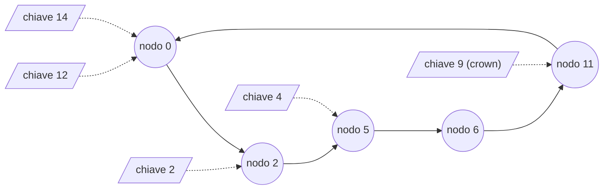
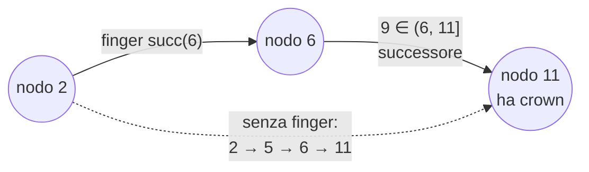
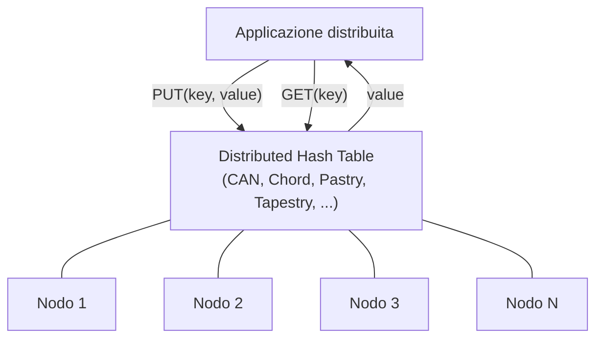

---
tags:
  - università/p2p-blockchain
  - peer-to-peer
  - dht
  - consistent-hashing
  - chord
data: 2026-02-19
lezione: "L03 - Introduction to DHT: consistent hashing, routing"
professore: "Laura Ricci"
---

# Introduzione alle DHT: consistent hashing e routing

La lezione precedente si è chiusa con un problema aperto: negli overlay non strutturati la ricerca costa molto (lineare nel numero di nodi, con flooding e falsi negativi), mentre un indice centrale è efficiente ma introduce un single point of failure. Questa lezione introduce la soluzione intermedia che domina i sistemi P2P moderni: le **Distributed Hash Table** (DHT, tabelle hash distribuite). Il percorso è il seguente: si confrontano le due modalità di recupero dei contenuti (ricerca per attributi e indirizzamento per identificatore); si parte dall'hashing distribuito usato nelle web cache e se ne mostra il limite (il **problema del rehashing**); si introduce il **consistent hashing** che lo risolve; si costruisce passo passo una DHT ad anello, che è esattamente **Chord**, prima con i soli puntatori al successore (lookup $O(N)$) e poi con le **finger table** (lookup $O(\log N)$). Si chiude con indirizzamento per contenuto, bilanciamento del carico, API delle DHT e un primo sguardo alle funzioni hash SHA.

## Il problema: dove memorizzare e come ritrovare

Il nodo A memorizza un contenuto I; il nodo B vuole trovare I ma non sa dove si trovi. Quali meccanismi si possono usare per decidere **dove** memorizzare l'informazione e **come** trovarla senza un server centralizzato? Qualunque soluzione deve tener conto di due aspetti. Il primo è la **scalabilità**: si valutano l'overhead di comunicazione e la memoria richiesta a ogni nodo in funzione del numero di nodi (peer). Il secondo è l'**adattabilità**: il sistema deve reagire ai guasti e ai frequenti cambiamenti di composizione (churn).

## Ricerca contro indirizzamento

Ci sono due modi fondamentalmente diversi di recuperare un contenuto in una rete P2P pura.

Con la **ricerca** (*searching*) la ricerca è guidata dai valori di un insieme di attributi del contenuto, in modo "simile a una ricerca Google". Il vantaggio è che è *user friendly*: non servono strutture ausiliarie e si possono fare query complesse. Lo svantaggio è la scarsa scalabilità e l'overhead dovuto al confronto di oggetti interi. È l'approccio degli overlay non strutturati.

Con l'**indirizzamento** (*addressing*) si associa al contenuto un **identificatore univoco** (ID) e si usa l'ID per recuperarlo; tipicamente l'ID è l'**hash del contenuto**. È l'approccio delle DHT. Il vantaggio è la localizzazione efficiente degli oggetti, con **limiti teorici garantiti sul routing**. Lo svantaggio è che bisogna mantenere la struttura di indirizzamento. È un indirizzamento non basato sulla posizione (come gli URL) ma **basato sul contenuto** (come in IPFS).

## Motivazioni delle DHT

Il confronto tra i due estremi motiva le DHT.

Nell'**approccio centralizzato** un server indicizza i dati. La ricerca costa $O(1)$ ("il contenuto è indicizzato su un server centrale"), ma lo spazio richiesto al server è $O(N)$ (con $N$ quantità di contenuto condiviso) e anche la banda tra server e overlay è $O(N)$. Le query complesse sono facilmente gestibili.

Nell'**approccio completamente distribuito** (rete non strutturata) la ricerca costa nel caso peggiore $O(N^2)$, perché "ogni nodo contatta ciascuno dei propri vicini"; con ottimizzazioni (TTL, identificatori per evitare cammini ciclici) si scende a $O(N)$. In compenso lo spazio richiesto a ogni nodo è $O(1)$: non dipende dal numero di nodi del sistema, perché non serve alcuna struttura dati per instradare le query (si fa flooding).

Le DHT si collocano nel mezzo: ogni nodo mantiene $O(\log N)$ informazioni di routing e una ricerca richiede $O(\log N)$ passi.

> [!note] Slide grafiche
>
> Due slide di motivazione sono solo grafiche. Mostrano il classico confronto memoria-per-nodo contro overhead di comunicazione: il server centrale ha memoria $O(N)$ e comunicazione $O(1)$, il flooding ha memoria $O(1)$ e comunicazione $O(N^2)$, la DHT si pone in un punto di equilibrio con $O(\log N)$ per entrambe.

---

## Funzioni hash e hash table

Il termine *hash*, secondo il dizionario Webster, indica "carne tritata mescolata con patate e rosolata". In informatica una **funzione hash** mappa un dato in un altro dato di **lunghezza fissa**, tipicamente un intero. Poiché l'insieme di input è più grande di quello di output, esistono inevitabilmente **collisioni** (input diversi con lo stesso hash).

In una **hash table** (HT) si memorizzano coppie chiave-dato: la chiave viene trasformata tramite l'hash per individuare direttamente un **bucket** (contenitore) della tabella, e ci si aspetta che ogni bucket contenga circa $\#items / \#buckets$ elementi.

Le **funzioni hash crittografiche** devono in più soddisfare un insieme di proprietà di sicurezza, che verranno studiate più avanti nel corso.

### Hashing distribuito per le web cache: memcached

**Memcached** è un sistema di caching distribuito di oggetti in memoria, usato per il caching web dinamico. Un pool di server di cache fornisce accesso veloce alle informazioni, riducendo il carico sul database server (al database si accede solo in caso di *cache miss*). La hash table viene divisa in più parti ospitate da server diversi, così da superare i limiti di memoria di un singolo computer.

Questo è lo **scaling out** tramite **hashing distribuito**: si divide la hash table in più parti distribuite su più server. Si usa l'hash delle risorse (o dei loro URL) per mapparle su un insieme dinamico di web cache: l'hash dell'URL è la chiave per accedere al contenuto e la chiave viene mappata su un singolo server. Ogni macchina (utente) può calcolare **localmente** quale cache dovrebbe contenere la risorsa referenziata da un certo URL, **senza comunicazione tra le cache**. La tecnica verrà estesa alle DHT per i sistemi P2P. Ma c'è un problema: in scenari dinamici il **rehashing** è costoso.

### Il problema del rehashing

Con una funzione hash classica si procede così. Supponiamo di avere 4 nodi di cache e di memorizzare la risorsa con URL $x$ nella cache

$$
\text{cacheID} = SHA(x) \bmod 4
$$

dove $SHA(x)$ è un identificatore a 160 bit. Ora il sistema cresce e servono altre 2 cache, per un totale di 6. Bisogna ricalcolare dove sono memorizzati tutti gli URL: gli unici che restano sullo stesso nodo sono quelli per cui

$$
SHA(URL) \bmod 4 = SHA(URL) \bmod 6
$$

Le slide riportano che con 10 bucket e 1000 chiavi circa il 99% delle chiavi dovrebbe essere rimappato. Questo significa un enorme traffico di dati.

> [!example] Quante chiavi restano al loro posto passando da 4 a 6 cache
>
> Sia $h = SHA(URL)$. Le condizioni $h \bmod 4$ e $h \bmod 6$ dipendono solo da $h \bmod 12$ (minimo comune multiplo). Per i 12 residui possibili, i due valori coincidono solo per $h \bmod 12 \in \{0,1,2,3\}$: ad esempio $h=5$ dà $1$ contro $5$, $h=13$ dà $1$ contro $1$ (e infatti $13 \bmod 12 = 1$). Quindi resta al suo posto solo $4/12 = 1/3$ delle chiavi e **due terzi delle chiavi devono essere spostati**, anche se abbiamo solo aggiunto due server. (Calcolo di esempio non presente nelle slide.)

> [!note] Sull'ordine di grandezza
>
> Il numero esatto dipende da quanti bucket si aggiungono: passando da $n$ a $n+1$ bucket resta fermo circa $1/(n+1)$ delle chiavi, quindi con 10 bucket circa il 90% delle chiavi viene spostato. Il messaggio delle slide non cambia: con il modulo, qualunque variazione del numero di server rimescola **quasi tutte** le chiavi.

## Consistent hashing

Serve uno schema di hashing che **non dipenda direttamente dal numero di server**, in modo che aggiungendo o rimuovendo server il numero di chiavi da ricollocare sia **minimo**, senza riordinamento globale della tabella.

> [!definition] Consistent hashing
>
> Il **consistent hashing** è una tecnica di hashing che garantisce che l'aggiunta o la rimozione di nodi comporti lo spostamento solo di una **minoranza** degli elementi. Lo schema di distribuzione non dipende direttamente dal numero di server: ogni nodo gestisce un **intervallo di chiavi hash consecutive**, non un insieme di chiavi sparse; quando i nodi entrano o escono, gli intervalli vengono uniti o divisi e le chiavi vengono ridistribuite **solo tra peer adiacenti**.

Il punto cruciale è mappare un **intervallo contiguo** di valori hash sullo stesso nodo, anziché un insieme di valori sparsi come quelli ottenuti dalla funzione modulo. Come si associa un intervallo a un nodo? Oltre a calcolare l'hash dei nomi degli oggetti (URL, indirizzi IP), si calcola **anche l'hash dei nomi $s_i$ di tutti i nodi, nello stesso spazio**. Poi si definisce la regola di associazione: se l'oggetto $x$ ha hash $h(x)$, si scandiscono i bucket alla destra di $h(x)$ finché non si trova il bucket $h(s)$ in cui cade il nome di qualche server $s$, **ricominciando dall'inizio dell'array** (*wrap around*) se necessario. In altre parole, lo spazio degli hash è un **anello** e ogni oggetto è assegnato al primo server che si incontra procedendo in senso orario.

> [!tip] Perché funziona
>
> Con il modulo, la posizione di ogni chiave dipende da $n$ (numero di server): cambiare $n$ cambia tutto. Con il consistent hashing la posizione di chiavi e server nell'anello dipende solo dal loro hash, che non cambia mai. L'arrivo di un server "ruba" solo le chiavi dell'arco tra il suo predecessore e lui stesso; l'uscita di un server cede solo le sue chiavi al successore. Tutto il resto dell'anello non si accorge di nulla.

> [!warning] Chiesto all'esame
>
> Il consistent hashing è tra le domande più frequenti in assoluto ("Che cos'è il consistent hashing?", "Qual è la differenza tra hash crittografico e consistent hashing?"). Bisogna saper spiegare: il problema del rehashing con il modulo, l'idea di mappare nodi e chiavi nello stesso spazio circolare, la regola del successore, il fatto che solo $k/n$ chiavi in media vengono rimappate. Per la differenza con l'hash crittografico: il consistent hashing è uno **schema di assegnazione** delle chiavi ai nodi, mentre l'hash crittografico è la **funzione** (ad esempio SHA) che si usa per generare gli identificatori, e deve rispettare proprietà di sicurezza (one-way, resistenza alle collisioni...) che saranno trattate nella lezione sugli strumenti crittografici.

### Dalle web cache ai sistemi P2P

Il consistent hashing funziona anche per i sistemi P2P: si fa **content addressing**, mappando i contenuti sui peer e usando la chiave per recuperarli. Però la situazione è diversa rispetto alle web cache: la **dimensione del sistema** è molto maggiore e il **livello di churn** è molto più alto. Per questo i peer **non possono tenere traccia di tutte le chiavi di tutti gli altri peer** (e neppure di tutti i peer): a differenza di memcached, dove ogni client conosce l'elenco completo dei server, in una DHT ogni nodo ha solo una visione parziale della rete, e serve un **algoritmo di routing** per arrivare al nodo responsabile di una chiave.

> [!example] Caso d'uso: Web 3 e metaverso
>
> Nel **Web 3.0**, visto come Internet "distribuita", gli oggetti non vengono memorizzati come nell'Internet classica sui server centrali (Facebook, Instagram, Dropbox...) ma in un ambiente P2P distribuito. **IPFS** è un file system distribuito basato su DHT. Un caso d'uso è memorizzare gli oggetti di un gioco nel file system distribuito: gli utenti non delegano la gestione dei propri dati ai server centrali.

---

## Costruire una DHT

La costruzione di una DHT richiede tre decisioni.

La prima è scegliere uno **spazio delle chiavi comune** per nodi e valori. La seconda è **collegare i nodi** usando un numero piccolo e limitato di link, in modo che il numero massimo di hop sia limitato; le connessioni scelte definiscono topologie di overlay diverse (ad esempio un anello con corde, oppure un albero). La terza è definire una **strategia di assegnazione degli elementi ai nodi**: sia gli elementi sia i nodi sono mappati dalla funzione hash nello stesso spazio degli identificatori, e occorre stabilire una relazione tra gli hash dei contenuti e gli hash dei nodi.

### Lo spazio degli identificatori ad anello

Si usa uno spazio logico dei nomi, detto **identifier space**, formato dagli identificatori $\{0, 1, 2, \dots, N-1\}$, e lo si organizza come un **anello logico modulo $N$**. Ogni nodo sceglie un identificatore casuale tramite la funzione hash $H$.

Nell'esempio delle slide lo spazio è $N = 16$, cioè $\{0, \dots, 15\}$, e ci sono cinque nodi $a, b, c, d, e$ con $H(a) = 6$, $H(b) = 5$, $H(c) = 0$, $H(d) = 11$, $H(e) = 2$. I nodi presenti sull'anello sono quindi 0, 2, 5, 6, 11.

### Il successore

> [!definition] Successore
>
> Il **successore** di un identificatore $x$, $succ(x)$, è il primo nodo che si incontra muovendosi in senso orario a partire da $x$, cioè il primo nodo sull'anello con identificatore **maggiore o uguale** a $x$ (con wrap around).

Nell'esempio: $succ(12) = 0$ (dopo 11 non ci sono nodi fino a 15, si riparte da 0), $succ(1) = 2$, $succ(6) = 6$. Bisogna fare attenzione alla differenza tra **identificatori** (tutti i 16 punti dell'anello) e **nodi** (solo i punti occupati da un peer).

### Collegare i nodi

Per costruire l'overlay si fa puntare ogni nodo al proprio successore. Il successore del nodo $n$ è $succ(n+1)$. Nell'esempio: il successore di 0 è $succ(1) = 2$; di 2 è $succ(3) = 5$; di 5 è $succ(6) = 6$; di 6 è $succ(7) = 11$; di 11 è $succ(12) = 0$.

### Dove memorizzare i dati

Si usa **la stessa funzione hash $H$** per calcolare l'hash dei dati. I dati sono coppie $\langle key, value \rangle$, ad esempio *key* = "crown", *value* = "JPEG della corona" per il rendering. Ogni elemento riceve l'identificatore $k = H(key)$ e viene **memorizzato presso il suo successore** $succ(k)$.

Nell'esempio gli oggetti hanno hash 12, 2, 9, 14 e 4, e "crown" ha hash 9. Di conseguenza: 12 e 14 vanno al nodo 0, 2 va al nodo 2, 4 va al nodo 5, 9 ("crown") va al nodo 11. Il nodo 6 in questo esempio non memorizza nulla.



*Fig. — L'anello dell'esempio ($N=16$, nodi 0, 2, 5, 6, 11): ogni nodo punta al proprio successore e ogni chiave è memorizzata presso il successore del proprio hash.*

### Uscita di un peer

Che cosa succede se il peer 11 viene rimosso? Bisogna rimappare **solo le chiavi che erano assegnate a lui**, spostandole sul suo successore: "crown" viene ora assegnata al peer 0. L'assenza del peer 11 non ha alcun effetto sulle chiavi che appartengono agli altri server.

### Proprietà del consistent hashing

> [!theorem] Proprietà del consistent hashing
>
> Quando la hash table viene ridimensionata, in media vanno rimappate solo
>
> $$ \frac{k}{n} $$
>
> chiavi, dove $k$ è il numero di chiavi e $n$ il numero di server. Questo vale a condizione che l'hash sia **uniforme**.

Quando un nodo viene **rimosso** dall'anello, solo le chiavi associate a quel nodo vengono ri-assegnate, invece di rimappare tutte le chiavi. Quando un nodo viene **aggiunto**, le chiavi comprese tra il nuovo nodo e il nodo precedente sull'anello vengono assegnate al nuovo nodo, e non sono più associate al vecchio nodo (il successore del nuovo nodo, che prima le gestiva).

### Gestione dell'uscita e dei guasti

Nel caso di **uscita volontaria** di un nodo, lo spazio di indirizzi del nodo viene partizionato tra i nodi vicini, le coppie chiave/valore vengono copiate ai nodi corrispondenti e il nodo viene cancellato dalle tabelle di routing degli altri nodi.

Nel caso di **guasto** di un nodo, se il nodo si disconnette improvvisamente dalla rete tutti i dati memorizzati su di esso vanno persi, a meno che non siano memorizzati anche altrove. Le contromisure sono: introdurre **ridondanza** (replicazione dei dati); contro la perdita di informazione, fare un **refresh periodico** delle informazioni; sfruttare **cammini di routing alternativi o ridondanti**; **sondare periodicamente** (*probing*) i nodi vicini per verificarne l'attività, aggiornando le tabelle di routing quando si rileva un guasto.

---

## Lookup dei dati

Per cercare una chiave $k$ si calcola $H(k)$ e si seguono i puntatori al successore finché non si trova l'elemento. Nell'esempio, il lookup di "crown" dal nodo 2 calcola $H(\text{crown}) = 9$ e attraversa i nodi 2, 5, 6, 11; il nodo 11 restituisce il valore a chi ha avviato la ricerca.

Se ogni nodo usa **solo il puntatore a $succ(n+1)$**, il tempo di lookup nel caso peggiore è $O(N)$ per $N$ nodi: si può dover fare il giro di tutto l'anello.

### Un lookup inefficiente in pseudocodice

L'algoritmo distribuito si scrive con **Remote Procedure Call** (RPC). Le slide fissano la notazione: $predecessor$ è un puntatore ausiliario al predecessore di un nodo; $(a, b]$ è il segmento dell'anello che va in senso orario da $a$ escluso fino a $b$ incluso; $n.foo()$ indica una RPC della procedura $foo()$ sul nodo $n$; $n.bar$ indica una RPC che legge il valore della variabile $bar$ sul nodo $n$. Si assume che ogni nodo abbia un puntatore al proprio predecessore.

> [!note] Pseudocodice ricostruito
>
> Il codice della slide è in forma grafica. La versione standard (dal paper di Chord) con i soli puntatori al successore è la seguente.

```text
// chiesto al nodo n: trova il nodo responsabile di id
n.find_successor(id)
    if (id ∈ (n, successor])
        return successor
    else
        // inoltra la domanda lungo l'anello
        return successor.find_successor(id)
```

Con il puntatore al predecessore, un nodo $n$ sa di essere responsabile di $id$ se $id \in (predecessor, n]$. Ogni chiamata avanza di un solo nodo: da qui il costo $O(N)$.

### Velocizzare il lookup: la finger table

Per velocizzare il lookup si aggiungono **più connessioni** nell'overlay. Ogni nodo mantiene una **finger table** (tabella di routing) con puntatori a $succ(n+1)$, $succ(n+2)$, $succ(n+4)$, $succ(n+8)$, e così via fino a $succ(n + 2^{M-1})$, dove $M$ è il numero di bit degli identificatori. Così la **distanza dalla destinazione viene sempre almeno dimezzata** a ogni passo.

> [!definition] Finger table di Chord
>
> In uno spazio di $N = 2^M$ identificatori, ogni nodo $n$ conosce
>
> $$ finger[i] = successor\left(n + 2^{i-1}\right) \quad \text{per } i = 1, \dots, M $$
>
> (somma modulo $2^M$). La tabella ha quindi $M = \log_2 N$ righe.

La dimensione delle tabelle di routing è **logaritmica**: $M$ voci con $N = 2^M$, cioè $\log_2 N$ voci; e servono al massimo $\log_2 N$ hop per andare da un nodo qualunque a un qualunque altro. Ad esempio, $\log_2(1.000.000) \approx 20$: con un milione di nodi bastano circa 20 voci per nodo e circa 20 hop.

> [!example] Finger table nell'anello dell'esempio ($M = 4$, nodi 0, 2, 5, 6, 11)
>
> | nodo | $n+1$ | $n+2$ | $n+4$ | $n+8$ |
> |---|---|---|---|---|
> | 0 | succ(1)=2 | succ(2)=2 | succ(4)=5 | succ(8)=11 |
> | 2 | succ(3)=5 | succ(4)=5 | succ(6)=6 | succ(10)=11 |
> | 5 | succ(6)=6 | succ(7)=11 | succ(9)=11 | succ(13)=0 |
> | 6 | succ(7)=11 | succ(8)=11 | succ(10)=11 | succ(14)=0 |
> | 11 | succ(12)=0 | succ(13)=0 | succ(15)=0 | succ(3)=5 |
>
> **Lookup di "crown" ($H = 9$) dal nodo 2.** Il nodo 2 verifica se $9 \in (2, 5]$ (intervallo verso il suo successore): no. Allora sceglie, tra i suoi finger, quello che **precede più da vicino** 9 senza superarlo: 11 supera 9, mentre 6 sta in $(2, 9)$, quindi inoltra a 6. Il nodo 6 verifica $9 \in (6, 11]$: sì, quindi il responsabile è 11. Due passi invece dei tre del cammino 2 → 5 → 6 → 11.
>
> (Tabella ed esecuzione calcolate per questa dispensa: nelle slide il lookup è mostrato graficamente.)



*Fig. — Con la finger table il lookup salta direttamente al finger più vicino che precede la chiave.*

> [!note] Pseudocodice scalabile (dal paper di Chord, non nelle slide)
>
> La ricerca con i finger si scrive così: se $id \in (n, successor]$ si restituisce $successor$; altrimenti si individua $n' = $ *closest\_preceding\_node*$(id)$, cioè il finger più alto $finger[i]$ tale che $finger[i] \in (n, id)$, e si restituisce $n'.find\_successor(id)$. Poiché a ogni passo la distanza residua almeno si dimezza, i passi sono $O(\log N)$.

## La DHT Chord

La DHT costruita nelle slide precedenti corrisponde a **Chord**, sviluppata nel 2001 da un gruppo di ricerca del MIT e della University of California (Ion Stoica, Robert Morris, David Liben-Nowell, David R. Karger, M. Frans Kaashoek, Frank Dabek, Hari Balakrishnan, *"Chord: A Scalable Peer-to-peer Lookup Protocol for Internet Applications"*, IEEE/ACM Transactions on Networking). Le slide ne mostrano la topologia: un anello di identificatori con, per ogni nodo, le "corde" verso i finger a distanza $2^{i-1}$, da cui il nome.

> [!warning] Chiesto all'esame
>
> "Come funziona Chord?" è stata una domanda d'esame. La risposta completa comprende: spazio degli identificatori ad anello modulo $2^M$; nodi e chiavi mappati con la stessa funzione hash (SHA-1); chiave memorizzata presso il successore; lookup con soli successori in $O(N)$; finger table con $finger[i] = succ(n + 2^{i-1})$, $M = \log_2 N$ voci, lookup in $O(\log N)$ perché la distanza si dimezza a ogni hop; gestione di join/leave secondo il consistent hashing (si spostano solo le chiavi tra nodi adiacenti).

---

## Indirizzamento per posizione e per contenuto

### Location addressing

L'**indirizzamento per posizione** è il metodo classico con cui si recuperano contenuti nell'Internet attuale. Si usa un link `http://` o `https://` per localizzare una pagina web, un'immagine, un foglio di calcolo, un dataset, un tweet. Il link è un identificatore che punta a una **posizione** precisa del web, corrispondente a un server o a un insieme di server, e **chi controlla quella posizione controlla il contenuto**. Anche se mille persone hanno scaricato una copia di un contenuto, e quindi il contenuto esiste in mille posizioni, HTTP punta a una sola di esse. L'approccio basato sulla posizione ci costringe a fingere che i dati si trovino in un solo posto, e chi controlla quel posto decide quale contenuto restituire quando si usa quel link. È così che HTTP e il WWW hanno funzionato negli ultimi 30 anni.

### Content addressing

L'**indirizzamento per contenuto** identifica un contenuto tramite la sua **impronta** (*fingerprint*) anziché tramite la sua posizione, usando un **hash crittografico**. Avendo l'impronta di un contenuto lo si può ottenere da **chiunque ne abbia una copia**. Poiché l'hash crittografico non cambia, l'indirizzamento per contenuto garantisce che i link restituiscano **sempre lo stesso contenuto**, indipendentemente da dove il contenuto viene recuperato, da chi lo ha aggiunto alla rete e da quando è stato aggiunto. Questo approccio è adottato da **IPFS** per realizzare il Web3, il web distribuito.

> [!tip] Verificabilità gratuita
>
> Con il content addressing chi riceve un contenuto può ricalcolarne l'hash e confrontarlo con l'identificatore richiesto: se coincidono, il contenuto è quello giusto, anche se proviene da un peer sconosciuto e non fidato. Questa idea (l'hash come impegno sul contenuto) tornerà continuamente nelle blockchain.

### Content-based routing

Nel **routing basato sul contenuto** è la conoscenza della chiave del contenuto a guidare il routing verso il peer che lo possiede. Ogni nodo mantiene una tabella di routing che memorizza una **vista parziale** della rete, e il routing dovrebbe essere efficiente (logaritmico). Nell'esempio delle slide $H(\text{"my data"}) = 3107$: il routing richiede $O(\log N)$ passi per raggiungere il nodo che memorizza l'informazione (su un anello di nodi con identificatori come 611, 709, 1008, 1622, 2011, 2207, 2906, 3485), e ogni nodo ha una tabella di routing di dimensione $O(\log N)$. Gli identificatori logici sono slegati dagli indirizzi IP reali dei peer.

---

## Bilanciamento del carico

Le cause principali di **sbilanciamento del carico** in una DHT sono tre. La prima è che un nodo gestisce una porzione più grande dello spazio di indirizzi logico; questo si può risolvere usando una funzione hash uniforme. La seconda è che lo spazio di indirizzi è distribuito uniformemente, ma agli indirizzi gestiti da un nodo corrispondono molti dati. La terza è che lo spazio è distribuito uniformemente, ma un nodo riceve molte query perché i dati associati ai suoi indirizzi sono molto **popolari**.

Lo sbilanciamento del carico comporta **minore robustezza**, **minore scalabilità** e la perdita delle garanzie $O(\log N)$. La soluzione indicata sono i **virtual server**: ogni peer gestisce **più segmenti** dell'anello (più identificatori virtuali), così che le differenze tra le dimensioni dei segmenti tendano a compensarsi.

### Sfide delle DHT

Le sfide principali sono tre. **Evitare gli hotspot**, distribuendo uniformemente le responsabilità (nelle slide un peer "rosso" è più carico di uno "verde"). **Gestire il churn**, ridistribuendo le responsabilità ai nodi che entrano e da quelli che escono. Trovare il giusto **compromesso** tra quantità di **stato di routing** mantenuto da ogni nodo, **traffico nell'overlay** e **stretch** rispetto all'underlay.

> [!note] Stretch
>
> Lo *stretch* (non definito nelle slide) è il rapporto tra il costo (ad esempio la latenza) del cammino nell'overlay e quello del cammino diretto nella rete sottostante tra gli stessi due nodi. Poiché nodi vicini sull'anello possono essere geograficamente lontanissimi, un lookup di pochi hop logici può attraversare più volte il pianeta.

### Varianti del consistent hashing nelle DHT

Esistono diverse proposte "compatibili con il consistent hashing", che differiscono per il modo in cui i dati sono associati ai peer e per il modo in cui si individua il peer associato a un bucket (operazione *FindPeer* o *FindSuccessor*), aspetto legato alla scelta precedente. Chord usa il successore sull'anello; Kademlia, che si vedrà nella prossima lezione, usa invece una diversa nozione di distanza (XOR).

---

## L'API di una DHT

La maggior parte delle DHT fornisce un'interfaccia molto semplice: **PUT(key, value)** per inserire un contenuto e **GET(key)** per cercarlo, che restituisce il **value**. In genere l'API non contiene funzioni per spostare le chiavi: lo spostamento è gestito internamente dalla DHT.



*Fig. — La DHT come servizio generico: l'applicazione vede solo PUT e GET, la distribuzione sui nodi è trasparente.*

## Confronto tra approcci

| Approccio | Memoria per nodo | Overhead di comunicazione | Query complesse | Falsi negativi | Robustezza |
|---|---|---|---|---|---|
| Server centrale | $O(N)$ | $O(1)$ | sì | no | no |
| P2P puro (flooding) | $O(1)$ | $O(N^2)$ | sì | sì | sì |
| DHT | $O(\log N)$ | $O(\log N)$ | no | no | sì |

> [!note] Ricostruzione della tabella
>
> I valori asintotici sono quelli delle slide; i segni di spunta delle ultime tre colonne non sono leggibili nel testo estratto e sono stati ricostruiti secondo il contenuto della lezione: il server centrale supporta query complesse e non ha falsi negativi ma è un single point of failure; il flooding supporta query complesse, ha falsi negativi (TTL) ed è robusto; la DHT supporta solo lookup esatti per chiave, non ha falsi negativi (se la chiave esiste viene trovata) ed è robusta.

## Applicazioni delle DHT

Le DHT offrono un **servizio generico** di memorizzazione e indicizzazione distribuita delle informazioni. Il valore associato a una chiave può essere un file, un indirizzo IP o qualunque altro dato. Applicazioni che sfruttano una DHT sono IPFS, BitTorrent (per memorizzare i riferimenti ai peer di uno *swarm*), Ethereum (per memorizzare i riferimenti ai peer della rete) e in generale il supporto a servizi di livello più alto.

In conclusione, le proprietà delle DHT sono: routing basato su una **chiave** (identificatore univoco); chiavi **distribuite uniformemente** sui nodi, evitando colli di bottiglia; **inserimento incrementale** delle chiavi; **tolleranza ai guasti**; **auto-organizzazione**; organizzazione semplice ed efficiente. I termini "P2P strutturato" e "DHT" sono spesso usati come sinonimi. Le DHT supportano molte applicazioni, e i valori associati alle chiavi dipendono dall'applicazione.

---

## La funzione hash per il content addressing: SHA

Gli identificatori di peer e dati sono generati tramite **funzioni hash crittografiche**. Si usa il **Secure Hash Algorithm** (SHA), definito dal *Secure Hash Standard*: una funzione hash crittografica che produce un **message digest** (riassunto) dell'input. Esistono diverse famiglie: SHA-1, SHA-224, SHA-256, SHA-384 e SHA-512; le ultime quattro sono chiamate complessivamente **SHA-2**, e il suffisso indica la lunghezza in bit del digest prodotto. Non si tratta di un hash qualunque: deve soddisfare un insieme di proprietà che verranno viste in dettaglio con le criptovalute.

Le slide propongono di far girare SHA-1 in Java e osservare l'output.

```java
import java.security.*;

class SHA {
    public static void main(String[] a) {
        try {
            MessageDigest md = MessageDigest.getInstance("SHA1");
            System.out.println("Algorithm = " + md.getAlgorithm()); // SHA1
            System.out.println("Provider = " + md.getProvider());   // SUN version 1.8

            String input = "";
            md.update(input.getBytes());
            byte[] output = md.digest();
            System.out.println("SHA1(\"" + input + "\")=" + bytesToHex(output));
            // SHA1("")    = DA39A3EE5E6B4B0D3255BFEF95601890AFD80709

            input = "abc";
            md.update(input.getBytes());
            output = md.digest();
            System.out.println("SHA1(\"" + input + "\")=" + bytesToHex(output));
            // SHA1("abc") = A9993E364706816ABA3E25717850C26C9CD0D89D

            input = "abd";
            md.update(input.getBytes());
            output = md.digest();
            System.out.println("SHA1(\"" + input + "\")=" + bytesToHex(output));
            // SHA1("abd") = CB4CC28DF0FDBE0ECF9D9662E294B118092A5735
        } catch (Exception e) {
            System.out.println("Exception: " + e);
        }
    }

    public static String bytesToHex(byte[] b) {
        char hexDigit[] = {'0','1','2','3','4','5','6','7',
                           '8','9','A','B','C','D','E','F'};
        StringBuffer buf = new StringBuffer();
        for (int j = 0; j < b.length; j++) {
            buf.append(hexDigit[(b[j] >> 4) & 0x0f]);
            buf.append(hexDigit[b[j] & 0x0f]);
        }
        return buf.toString();
    }
}
```

La funzione `bytesToHex` converte ogni byte in due cifre esadecimali. `0x0F` è il numero esadecimale che vale 15 in decimale e corrisponde al pattern di bit `0000 1111`: fare `& 0x0f` significa tenere solo i 4 bit meno significativi. Quindi `hexDigit[(b[j] >> 4) & 0x0f]` sposta a destra di 4 posizioni e conserva i 4 bit **più significativi** del byte (la prima cifra esadecimale), mentre `hexDigit[b[j] & 0x0f]` conserva i 4 bit **meno significativi** (la seconda cifra).

### Che cosa si osserva

Dall'output si ricavano le proprietà fondamentali di SHA. L'input ha **lunghezza variabile** e l'output (digest) ha **lunghezza fissa**, anche per la stringa vuota. Un **piccolo cambiamento nell'input** produce output **completamente diversi**: "abc" e "abd" differiscono per un solo carattere, ma i loro digest non hanno nulla in comune (è il cosiddetto *effetto valanga*). La funzione è **deterministica**: lo stesso input dà sempre lo stesso output. L'output è lungo 40 cifre esadecimali, cioè $40 \times 4 = 160$ bit (per questo SHA-1 è detto anche SHA-160), quindi ci sono

$$
2^{160}
$$

valori possibili. Oggi sono disponibili altri algoritmi con digest più lunghi, come **Keccak**, usato da Ethereum.

Questa funzione, o altre simili, è il **mattone di base** per implementare sia il **consistent hashing** (per generare gli identificatori di nodi e chiavi in modo uniforme) sia **puzzle crittografici complessi** come la Proof of Work di Bitcoin.

> [!warning] Chiesto all'esame: le proprietà dell'hash crittografico
>
> All'orale è stato più volte chiesto di elencare "le tre caratteristiche importanti dell'hash crittografico" (resistenza alla preimmagine / one-way, resistenza alla seconda preimmagine, resistenza alle collisioni). In questa lezione le slide si limitano alle proprietà osservabili (input variabile e output fisso, effetto valanga, determinismo, 160 bit); le proprietà di sicurezza formali sono trattate nella lezione sugli strumenti crittografici. Attenzione a non confondere le proprietà dell'hash crittografico con quelle del consistent hashing.

> [!question] Possibili domande d'esame
>
> - Che differenza c'è tra ricerca per attributi e indirizzamento per identificatore? Quali vantaggi e svantaggi hanno?
> - Che cos'è il problema del rehashing? Mostri con un esempio perché la funzione modulo non va bene quando cambia il numero di server.
> - Che cos'è il consistent hashing? Come vengono mappati nodi e chiavi, cosa succede quando un nodo entra o esce, quante chiavi vengono rimappate?
> - Qual è la differenza tra un hash crittografico e il consistent hashing?
> - Come funziona Chord? Descriva lo spazio degli identificatori, il successore, la finger table e la complessità del lookup.
> - Perché con la finger table il lookup costa $O(\log N)$? Quante voci ha la tabella?
> - Che differenza c'è tra location addressing e content addressing? Perché il content addressing è adatto al Web3/IPFS?
> - Quali sono le cause di sbilanciamento del carico in una DHT e come si risolvono? Come si gestiscono uscite volontarie e guasti?

> [!abstract] Sintesi
>
> Le DHT offrono un compromesso tra indice centrale (ricerca $O(1)$, memoria $O(N)$, single point of failure) e flooding (memoria $O(1)$, comunicazione $O(N^2)$, falsi negativi): $O(\log N)$ per memoria e lookup. Il punto di partenza è l'hashing distribuito delle web cache, dove il modulo sul numero di server impone di rimappare quasi tutte le chiavi a ogni cambiamento (rehashing). Il consistent hashing mappa nodi e chiavi nello stesso spazio circolare e assegna ogni chiave al suo successore: entrate e uscite spostano solo $k/n$ chiavi in media, tra nodi adiacenti. Chord costruisce su questo un anello modulo $2^M$: con i soli successori il lookup costa $O(N)$, con la finger table ($finger[i] = succ(n+2^{i-1})$, $M = \log_2 N$ voci) costa $O(\log N)$ perché la distanza si dimezza a ogni hop. L'API è PUT/GET; servono replicazione e probing contro i guasti e virtual server contro lo sbilanciamento. Gli identificatori sono generati con hash crittografici (SHA-1, 160 bit: output fisso, deterministico, effetto valanga), base del content addressing usato da IPFS e mattone anche della Proof of Work.
