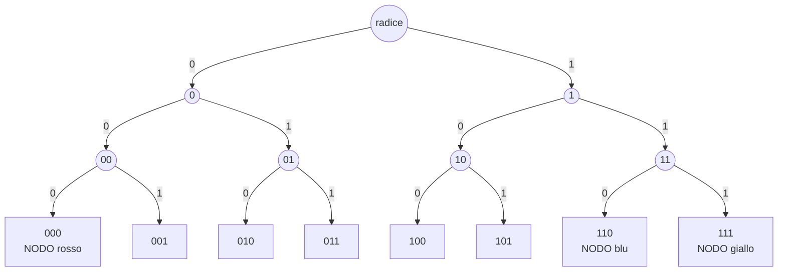
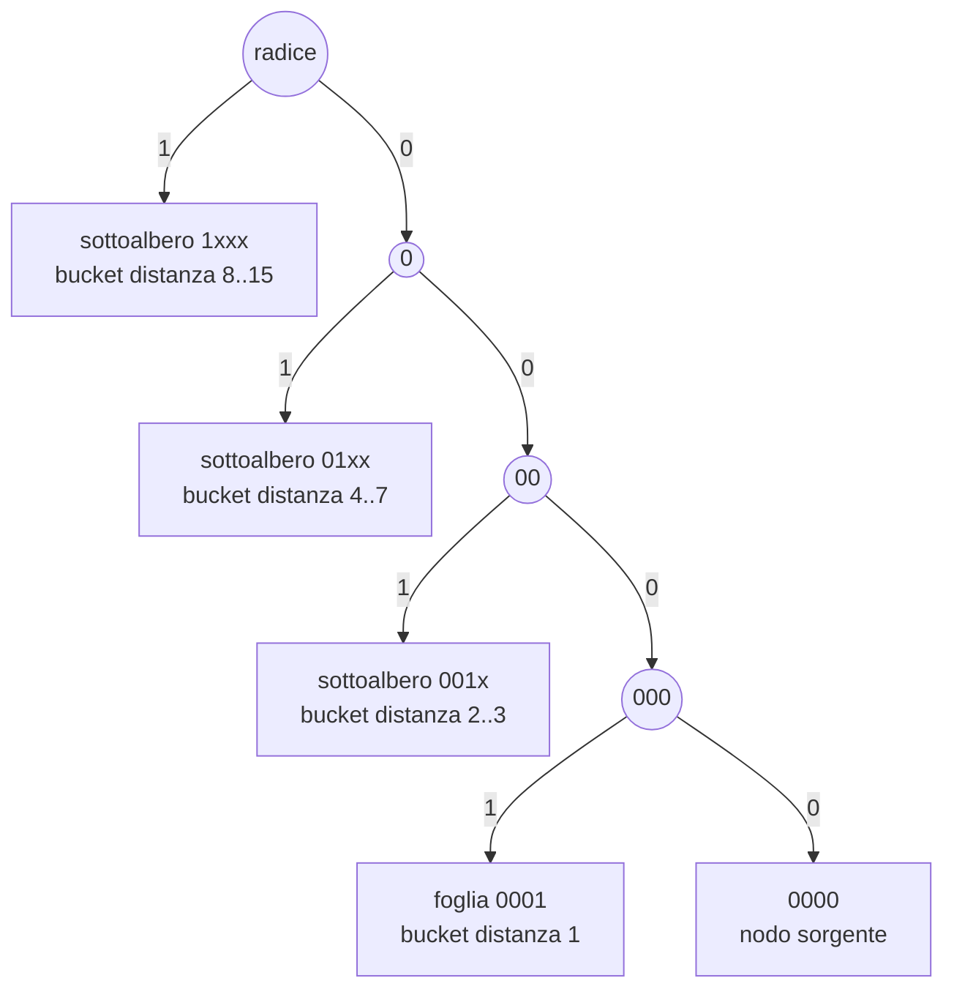
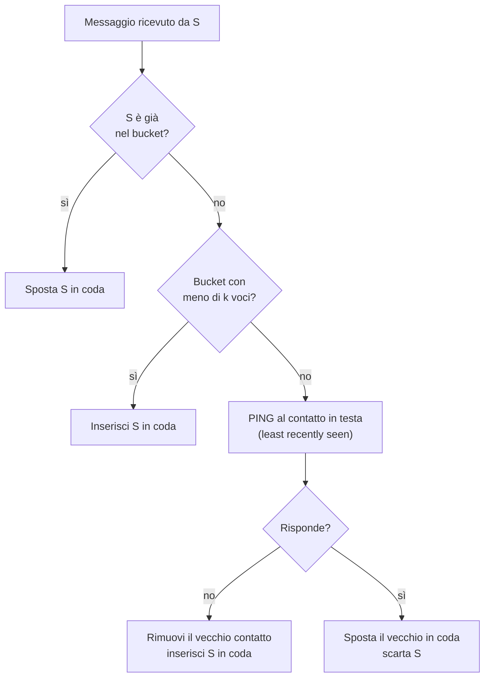
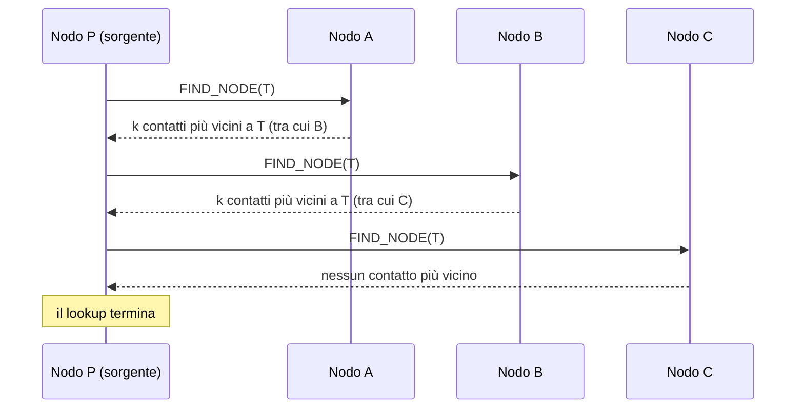
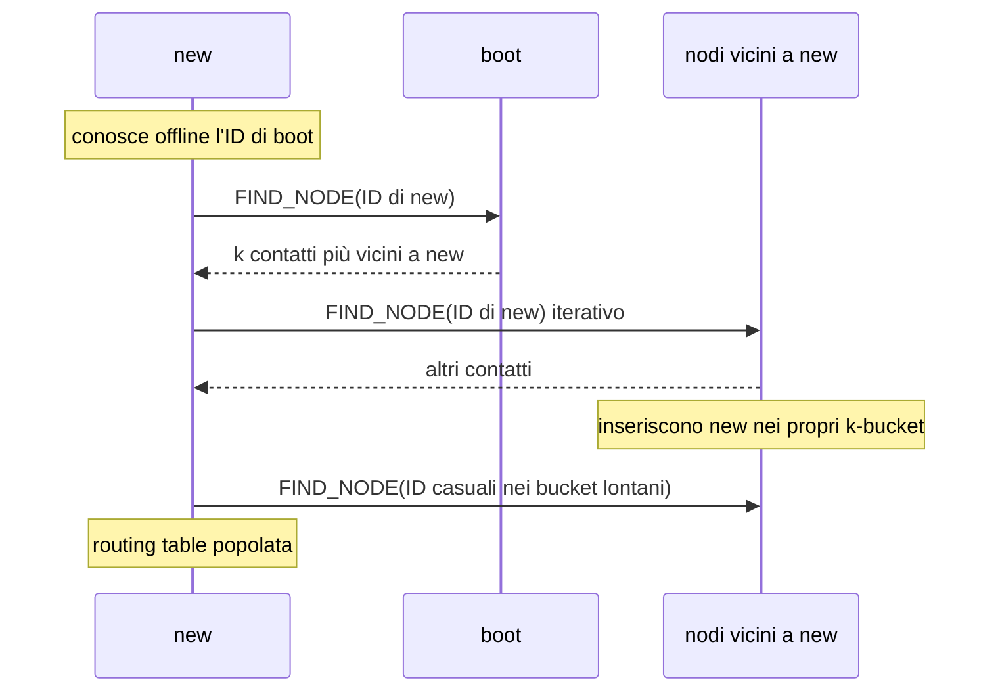

---
tags:
  - università/p2p-blockchain
  - dht
  - kademlia
  - overlay-strutturati
data: 2026-02-23
lezione: "L04 - The Kademlia DHT"
professore: "Laura Ricci"
---

# Kademlia DHT

Nella lezione precedente abbiamo visto come una **DHT** (*Distributed Hash Table*, tabella hash distribuita) permetta di memorizzare coppie (chiave, valore) su un insieme di peer senza alcun server centrale, e abbiamo studiato in dettaglio **Chord**. In questa lezione affrontiamo **Kademlia**, la DHT che nella pratica si è imposta come standard: la ritroveremo più avanti nel corso sotto la rete peer-to-peer di Ethereum e dentro IPFS. L'idea centrale che distingue Kademlia da Chord è l'uso di una metrica di distanza particolare, lo **XOR**, dalla quale discendono quasi tutte le proprietà "belle" del protocollo: tabelle di routing simmetriche che si auto-aggiornano, lookup paralleli, gestione del churn quasi gratuita.

## Richiamo a Chord

Conviene ripartire da Chord per avere un termine di paragone. In Chord i nodi scelgono un identificatore (quasi) uniformemente casuale su un **anello logico** di $2^m$ posizioni. Gli identificatori sull'anello vengono chiamati **chiavi** (*keys*) per distinguerli dagli ID dei nodi, e lo spazio delle chiavi viene partizionato in blocchi contigui: ogni nodo è responsabile del segmento di anello che termina in corrispondenza del proprio ID (una chiave è assegnata al suo *successor*, cioè al primo nodo che la segue sull'anello).

Per rendere il lookup logaritmico, un nodo con identificatore $ID$ mantiene una **finger table** i cui elementi puntano ai nodi

$$
\text{successor}(ID + 2^{i}) \quad \text{per } i = 0, \dots, m-1
$$

dove $m$ è il numero di bit degli identificatori. Ogni finger dimezza (circa) la distanza residua verso la chiave cercata, e quindi il lookup richiede $O(\log n)$ passi.

> [!warning] Chiesto all'esame
>
> "Come funziona Chord?" è una domanda posta esplicitamente all'orale. Nel rispondere su Kademlia è utile saper confrontare le due DHT: la differenza chiave è che la distanza di Chord (in senso orario sull'anello) **non è simmetrica**, mentre quella di Kademlia (XOR) lo è.

## Che cos'è Kademlia

Il nome, secondo il suo ideatore Petar Maymounkov, deriva da una parola turca che significa "uomo fortunato" ed è anche il nome di un picco montuoso in Bulgaria. La specifica completa del protocollo è pubblicata online (progetto *xlattice*), ma come vedremo tra i punti deboli è stata a lungo *sottospecificata*, cosa che ha generato molte implementazioni diverse.

Kademlia è stato definito "l'algoritmo di ricerca standard *de facto* per le reti P2P su Internet". Si tratta di una specifica di protocollo per memorizzare e recuperare dati in modo efficiente su una rete peer-to-peer, con tre caratteristiche fondamentali:

- è **decentralizzato**: i dati non stanno su un server centrale, ma sono memorizzati in modo ridondante sui peer;
- è **fault tolerant** (tollerante ai guasti): se uno o più peer abbandonano la rete, i dati, essendo replicati su più peer, restano recuperabili;
- non richiede motori di database complessi: i dati sono semplici coppie chiave-valore, quindi possono partecipare anche dispositivi con poca memoria, come i dispositivi IoT.

Il protocollo è usato dalle più grandi DHT pubbliche esistenti: la rete peer-to-peer di **Ethereum**, **IPFS** (che usa varianti chiamate *S/Kademlia* e *Sloppy Kademlia*), la **BitTorrent Mainline DHT** (MDHT) e la rete **KAD** di eMule.

Rispetto alle DHT precedenti, Kademlia offre alcune caratteristiche che nessun'altra DHT forniva insieme:

- l'informazione di routing si **diffonde automaticamente come effetto collaterale dei lookup**: ogni messaggio ricevuto insegna qualcosa al nodo sulla rete;
- è possibile inviare **più richieste in parallelo** (*parallel routing*) per velocizzare i lookup, evitando di restare bloccati sui timeout dei nodi non raggiungibili;
- usa il **routing iterativo**, in cui è il nodo che inizia la ricerca a pilotarla passo per passo.

---

## Strutturare lo spazio degli identificatori

### Il trie binario

In Kademlia gli identificatori dei nodi e dei dati sono organizzati in una topologia virtuale che è un **trie binario completo**.

> [!definition] Trie binario
>
> Un trie binario è una struttura dati ad albero usata per memorizzare chiavi/identificatori binari, in cui ogni livello dell'albero rappresenta un bit, ogni nodo ha al più due figli (il figlio sinistro corrisponde al bit 0, il destro al bit 1) e un cammino dalla radice a una foglia rappresenta un identificatore completo, memorizzato nella foglia.

Le **foglie** del trie rappresentano l'intero spazio degli identificatori, condiviso da nodi e dati. Ogni peer ottiene il proprio identificatore applicando una funzione hash (ad esempio al proprio indirizzo IP): il risultato è una foglia. Anche le chiavi dei dati sono ottenute per hashing, e sono anch'esse foglie dello stesso albero. Nella realtà gli identificatori sono lunghi 160 bit, quindi lo spazio è enorme e il numero di nodi effettivamente presenti è molto minore del numero di identificatori possibili.

Nell'esempio delle slide lo spazio ha solo 3 bit e partecipano tre nodi, con identificatori `000`, `110` e `111`.


*Fig. — Trie binario completo su 3 bit: ogni foglia è un identificatore; solo tre foglie (000, 110, 111) corrispondono a nodi effettivamente presenti, le altre sono chiavi.*

## Assegnare le chiavi ai nodi

### La regola del Lowest Common Ancestor

Il problema da risolvere è lo stesso di ogni DHT: come partizionare le foglie (lo spazio degli identificatori) tra i nodi presenti? La prima idea proposta nelle slide sfrutta la struttura ad albero: una chiave viene assegnata al nodo con cui ha il **Lowest Common Ancestor** (LCA) più profondo.

> [!definition] Lowest Common Ancestor (LCA)
>
> L'LCA di due foglie di un albero è il nodo più profondo che è antenato di entrambe, cioè l'ultimo punto in cui i cammini dalla radice alle due foglie coincidono prima di divergere. In un trie binario, la profondità dell'LCA è esattamente la **lunghezza del prefisso comune** dei due identificatori.

La regola di partizionamento è quindi: presa una chiave, la si assegna al nodo della DHT che ha con essa l'LCA più profondo, cioè il nodo che condivide con la chiave il prefisso più lungo. Nell'esempio, le chiavi `001`, `010`, `011` condividono con `000` il prefisso `0`, mentre con `110` e `111` non condividono nulla: vanno quindi al nodo rosso `000`. Le chiavi `100` e `101` hanno invece LCA `1` sia con il nodo blu `110` sia con il nodo giallo `111`.

### Rompere i pareggi

Qui nasce un problema: se la regola fosse applicata in modo ingenuo (ad esempio assegnando tutto al primo nodo trovato), le chiavi `100` e `101` finirebbero tutte al nodo blu e al nodo giallo non resterebbe nulla. Le slide mostrano proprio questa situazione e si chiedono perché il giallo resti vuoto pur avendo lo stesso LCA del blu. Serve una regola per **rompere il pareggio** (*break the tie*) che divida equamente le chiavi tra le due foglie.

La regola è la seguente: se due peer pareggiano sull'LCA, si guarda il bit più significativo in cui i due peer differiscono (sia $b$ il suo indice), e si assegna la chiave al nodo il cui $b$-esimo bit è uguale al $b$-esimo bit della chiave.

> [!example] Rottura del pareggio
>
> Consideriamo i peer `110` e `111` e la chiave `101`. L'LCA della chiave con entrambi i peer è `1`. I due peer differiscono nel terzo bit (`0` contro `1`). La chiave `101` ha terzo bit `1`, quindi viene assegnata al nodo `111`. Analogamente la chiave `100` (terzo bit `0`) va al nodo `110`. Così blu e giallo si dividono equamente le chiavi.

### Calcolare la vicinanza bit per bit

Generalizzando la regola dell'LCA con la rottura dei pareggi si ottiene una procedura per trovare il nodo "più vicino" a una chiave:

1. si parte da un insieme di candidati che contiene tutti gli ID dei nodi;
2. finché resta più di un candidato, si esaminano gli ID bit per bit, dal più significativo al meno significativo;
3. a ogni posizione, se almeno un candidato ha lo stesso bit della chiave, si eliminano tutti i candidati il cui bit differisce da quello della chiave; altrimenti si passa al bit successivo senza eliminare nessuno;
4. quando resta un solo candidato, quello è il nodo più vicino alla chiave.

Con $n$ nodi e identificatori di $m$ bit, il costo nel caso peggiore è $O(n \cdot m)$. La procedura è corretta ma scomoda: vorremmo un singolo numero che esprima "quanto" una chiave è lontana da un nodo.

### Dalla vicinanza alla distanza: nasce lo XOR

Cambiamo prospettiva e definiamo un valore scalare che rappresenti la **distanza** invece della vicinanza. Questo valore deve penalizzare di più le differenze sui bit più significativi. Confrontando chiave e ID bit per bit a partire dal più significativo: se i bit sono uguali non si applica penalità; se differiscono, la penalità deve essere tale che tutte le penalità successive (sui bit meno significativi), sommate, restino comunque inferiori a essa. Poiché vale

$$
2^{i} > \sum_{j=0}^{i-1} 2^{j} = 2^{i} - 1
$$

la scelta giusta è aggiungere come penalità una potenza di 2 tanto più alta quanto più il bit è significativo. La procedura diventa: si inizializza la distanza a 0; si confrontano chiave e ID bit per bit; se differiscono all'$i$-esimo bit meno significativo, si aggiunge $2^{i}$.

Ma questo è **esattamente ciò che fa l'operazione XOR** (*or esclusivo*) interpretata come numero intero: il bit $i$ del risultato vale 1 (e contribuisce $2^i$) se e solo se i due operandi differiscono in quella posizione.

> [!definition] Distanza XOR
>
> La distanza tra due identificatori $x$ e $y$ (chiave-nodo o nodo-nodo) è
> $$
> d(x, y) = x \oplus y
> $$
> interpretato come intero senza segno. Una chiave va memorizzata sul nodo che, tra tutti i nodi presenti, ha il valore XOR più basso con la chiave.

> [!example] Verifica sull'esempio
>
> Chiave `101`, nodi `000`, `110`, `111`:
> $101 \oplus 000 = 101 = 5$, $\quad 101 \oplus 110 = 011 = 3$, $\quad 101 \oplus 111 = 010 = 2$.
> Il nodo più vicino è `111`, esattamente come stabilito dalla regola LCA con rottura dei pareggi.

> [!warning] Chiesto all'esame
>
> "Qual è la regola utilizzata da Kademlia per mappare oggetti e nodi?" e "le distanze in Kademlia" sono domande ricorrenti. La risposta attesa: nodi e chiavi sono hashati nello stesso spazio a 160 bit (foglie di un trie binario); un oggetto è assegnato ai nodi più vicini secondo la distanza XOR, che equivale a scegliere il nodo con il prefisso comune più lungo con la chiave (LCA più profondo), con i pareggi risolti in modo naturale dai bit successivi.

### Lo XOR è davvero una metrica?

Per poter parlare di "distanza" lo XOR deve soddisfare le proprietà di una metrica. Vediamole.

- $d(x, x) = 0$: uno XOR di un valore con se stesso dà zero.
- $d(x, y) > 0$ se $x \neq y$: se i due valori differiscono in almeno un bit, il risultato ha almeno un bit a 1.
- $\forall x, y: \; d(x, y) = d(y, x)$: **simmetria**, perché lo XOR è commutativo.
- $d(x, y) \oplus d(y, z) = d(x, z)$: detta nelle slide **transitività**; vale perché $(x \oplus y) \oplus (y \oplus z) = x \oplus z$, dato che $y \oplus y = 0$.
- $d(x, y) + d(y, z) \geq d(x, z)$: **disuguaglianza triangolare**, "andare direttamente da $x$ a $z$ è almeno altrettanto corto che passare per $y$". Segue dalla proprietà precedente, perché per interi non negativi vale $a \oplus b \leq a + b$ (lo XOR è una somma senza riporti).

A queste si aggiunge una proprietà non richiesta a una metrica ma cruciale per Kademlia, l'**unidirezionalità**: dato un punto $x$ e una distanza $\Delta > 0$, esiste **un unico** $y$ tale che $d(x, y) = \Delta$, ed è $y = x \oplus \Delta$.

> [!example] Unidirezionalità
>
> Con $x = 1001$ e $\Delta = 0001$, l'unico punto a distanza $\Delta$ da $x$ è $y = 1001 \oplus 0001 = 1000$. Sulla retta dei numeri, invece, i punti a distanza 1 da 9 sarebbero due (8 e 10).

### Perché proprio la metrica XOR

Le due proprietà che rendono lo XOR speciale sono la simmetria e l'unidirezionalità.

La **simmetria** significa che se il nodo A misura la sua distanza da B, B misura la stessa distanza da A. La conseguenza pratica è che **ogni nuova informazione su un nodo della rete è utile**: se A vede B come vicino, anche B vede A come vicino, quindi B può fornire ad A nodi vicini a se stesso, che sono anche vicini ad A, rendendo i lookup affidabili ed efficienti. Distanze non simmetriche, come quelle dei finger di Chord, non permettono di sfruttare ogni nodo incontrato per popolare la propria tabella di routing.

L'**unidirezionalità** significa che esiste un solo nodo a distanza minima dalla chiave, e quindi **i lookup per la stessa chiave convergono sullo stesso cammino**, indipendentemente da dove partono. Questo rende efficace il **caching** degli elementi lungo quel cammino, utile per evitare *hotspot* (nodi sovraccarichi perché custodi di una chiave molto richiesta).

Infine la metrica è strettamente legata al **prefisso** degli identificatori: più lungo è il prefisso comune tra due identificatori, più piccola è la loro distanza XOR. Nodi "vicini" sono caratterizzati da un lungo prefisso comune. Nella realtà gli identificatori sono a 160 bit e la distanza si calcola con lo XOR bit a bit sull'intera stringa.

### Differenza con la distanza numerica

Attenzione a non confondere la distanza XOR con la differenza numerica. Lo spazio di Kademlia è un albero binario bilanciato e due foglie possono essere adiacenti nell'ordinamento (numericamente vicine) ma lontanissime secondo lo XOR, perché stanno in sottoalberi diversi fin dalla radice.

> [!example] Numericamente vicini, XOR-lontani
>
> $1000 \oplus 0111 = 1111 = 15$, cioè la massima distanza possibile su 4 bit, mentre la differenza numerica tra $1000 = 8$ e $0111 = 7$ è appena 1. I due identificatori stanno ai due lati della radice del trie.

## Memorizzare una coppia chiave-valore

Supponiamo di voler memorizzare nella DHT una coppia (chiave, valore). Il procedimento è:

1. si calcola l'hash della chiave, ottenendo un identificatore `keyID` nello stesso spazio dei nodi;
2. il nodo che vuole memorizzare esegue un **lookup** per `keyID`, che restituisce i $k$ nodi con ID più vicini a `keyID` secondo la distanza XOR;
3. questi $k$ nodi diventano responsabili della chiave e ne memorizzano una copia.

La **replicazione** su $k$ nodi serve a proteggere i dati dalla perdita dovuta al **churn**, cioè al continuo ingresso e uscita dei peer dalla rete.

> [!tip] Intuizione chiave
>
> In Kademlia non esiste "il" nodo responsabile di una chiave, ma un gruppo di $k$ nodi più vicini. È questa ridondanza, insieme al meccanismo di ripubblicazione periodica visto più avanti, a rendere il sistema robusto senza procedure esplicite di uscita dei nodi.

---

## La tabella di routing

### Obiettivo

Vogliamo definire una procedura di lookup, cioè un modo per trovare una chiave, che soddisfi due requisiti in tensione tra loro: ogni nodo deve memorizzare gli indirizzi di **pochi** altri nodi, e tuttavia deve essere possibile trovare le chiavi rapidamente. Il criterio guida è che **a ogni passo la query deve avvicinarsi alla chiave di almeno "un bit"**, cioè allungare di almeno un bit il prefisso comune con la chiave; in questo modo il lookup richiede $O(\log n)$ passi.

L'idea principale è prendere alcuni contatti dal trie degli identificatori e organizzarli in base alla loro distanza dal nodo che possiede la tabella di routing.

### I k-bucket

Guardiamo il trie dal punto di vista di un nodo sorgente, ad esempio `0000` in uno spazio a 4 bit. Scendendo dalla radice verso la foglia `0000`, a ogni livello lasciamo da parte un sottoalbero "fratello" che non contiene il nodo: il sottoalbero `1xxx` al primo livello, `01xx` al secondo, `001x` al terzo e la foglia `0001` all'ultimo. Kademlia associa **un bucket a ciascuno di questi sottoalberi**. Ogni bucket corrisponde a un intervallo di distanze (dal nodo sorgente) delle chiavi contenute in quel sottoalbero, e registra **al più $k$ contatti**: da qui il nome **k-bucket**.


*Fig. — I sottoalberi visti dal nodo 0000: a ciascuno corrisponde un k-bucket, che copre un intervallo di distanze XOR. I sottoalberi più lontani sono anche i più grandi.*

### Sottoalberi e intervalli di distanza

La corrispondenza tra sottoalberi e intervalli di distanza è una conseguenza diretta della metrica XOR. Consideriamo due identificatori $x$ e $y$ di lunghezza $L$ che condividono un prefisso comune di lunghezza $p$ e differiscono quindi a partire dal bit successivo; poniamo $i = L - p$. Lo XOR ha i primi $p$ bit a zero e il bit in posizione $i$ (contando da destra, a partire da 1) a uno, mentre i bit meno significativi possono essere qualsiasi. Quindi

$$
2^{i-1} \leq d(x, y) < 2^{i}
$$

> [!example] Estremi dell'intervallo
>
> Con $L = 6$ e prefisso comune `01` ($p = 2$, $i = 4$):
>
> $X = 010110$, $Y = 011110$: $X \oplus Y = 001000$, $d = 2^3 = 8$ (distanza minima dell'intervallo, i due differiscono solo nel primo bit dopo il prefisso).
>
> $X = 010110$, $Y = 011001$: $X \oplus Y = 001111$, $d = 2^4 - 1 = 15$ (distanza massima dell'intervallo, differiscono in tutti i bit dopo il prefisso).

Quindi a ogni sottoalbero corrisponde un intervallo di distanze ben preciso. Due casi estremi su 4 bit aiutano a fissare le idee. Una foglia del sottoalbero sinistro e una del destro hanno prefisso comune di lunghezza 0, e la loro distanza varia in $2^3 \leq d < 2^4$: ad esempio $0111 \oplus 1000 = 1111 = 15$ (distanza massima, pur essendo la differenza numerica minima) e $0111 \oplus 1111 = 1000 = 8$ (distanza minima dell'intervallo, pur essendo la differenza numerica alta). All'estremo opposto, due foglie che differiscono solo nell'ultimo bit, come `0110` e `0111`, hanno distanza $0110 \oplus 0111 = 0001 = 1$, cioè $2^0 \leq d < 2^1$.

### Non tutti gli identificatori sono nodi

Il numero di nodi nella rete è molto inferiore al numero di identificatori: lo spazio è enorme e non ogni identificatore è associato a un peer. Per questo è utile una vista alternativa del trie, il **node tree** (albero dei nodi): un albero binario **non bilanciato** che mostra solo le foglie corrispondenti ai nodi effettivamente presenti, una foglia per ogni peer e non per ogni identificatore.

In questo albero una foglia corrisponde a un **prefisso** di identificatore: il peer associato alla foglia è tale che quel prefisso lo identifica univocamente. Nell'esempio delle slide il prefisso `0011` identifica univocamente il peer rosso, perché nessun altro peer dell'overlay ha lo stesso prefisso; la parte più profonda del cammino non serve a distinguerlo dagli altri.

Le slide mostrano poi i contatti della tabella di routing del peer rosso con $k = 2$ (un **2-bucket**): due contatti per ciascun sottoalbero. Alcuni sottoalberi possono contenere più di 2 nodi (e allora il bucket ne conserva solo 2), altri meno di 2 (e allora il bucket resta parzialmente vuoto). I sottoalberi più lontani sono più grandi e tendono quindi a contenere più nodi tra cui scegliere.

### Dalla struttura ad albero alla tabella

Traducendo tutto in una tabella, la routing table di Kademlia è fatta così:

| Riga (k-bucket) | Distanza $d$ dal nodo | Prefisso comune con il nodo | Porzione dello spazio coperta |
|---|---|---|---|
| $i = 1$ | $1 \leq d < 2$ | 159 bit | minima (1 identificatore) |
| $i = 2$ | $2 \leq d < 4$ | 158 bit | 2 identificatori |
| $\dots$ | $\dots$ | $\dots$ | $\dots$ |
| $i$ | $2^{i-1} \leq d < 2^{i}$ | $160 - i$ bit | $2^{i-1}$ identificatori |
| $i = 160$ | $2^{159} \leq d < 2^{160}$ | 0 bit | metà dello spazio |

Le righe sono i k-bucket, con $1 \leq i \leq 160$ per identificatori a 160 bit. Ogni riga corrisponde a un sottoalbero e contiene al più $k$ contatti, ciascuno memorizzato come tripla **(ID, indirizzo IP, porta UDP)**. La riga $i$ contiene contatti a distanza $2^{i-1} \leq d < 2^{i}$ dal proprietario della tabella. Ogni riga corrisponde quindi a un prefisso comune: più bassa è la riga, più lungo è il prefisso comune (in alcune implementazioni l'ordine è invertito).

L'insieme dei k-bucket copre tutto lo spazio degli identificatori. Le prime righe corrispondono a peer che condividono un prefisso lungo con il proprietario: coprono pochi identificatori e possono contenere pochi contatti (spesso sono vuote). Le ultime righe corrispondono a peer con prefisso comune corto, coprono un insieme molto grande di identificatori e possono contenere molti candidati, ma mai più di $k$ contatti. Ne risulta che ogni nodo conosce molto bene il proprio "vicinato" e in modo sempre più rado le regioni lontane, esattamente come in Chord, ma con una struttura derivata dal prefisso anziché dalle potenze di 2 sull'anello.

Il valore di $k$ è scelto in modo che il crash di più di $k$ nodi (contemporaneamente, all'interno dello stesso bucket) sia un evento raro. Inoltre, i nodi all'interno di ciascun bucket sono mantenuti **ordinati per tempo dell'ultimo contatto**: i nodi contattati meno di recente (*least recently seen*) stanno nelle prime posizioni della lista, quelli visti più di recente in coda.

> [!note] Valori tipici (non nelle slide)
>
> Nell'articolo originale di Maymounkov e Mazières i valori suggeriti sono $k = 20$ e parametro di concorrenza $\alpha = 3$. Le slide usano $k = 2$ e $\alpha = 1$ o $3$ solo negli esempi.

> [!warning] Chiesto all'esame
>
> "Come sono fatte le tabelle di Kademlia?" Bisogna saper dire che la tabella è una lista di k-bucket, uno per ogni sottoalbero del trie non contenente il nodo (cioè per ogni lunghezza di prefisso comune), che il bucket $i$ copre le distanze $[2^{i-1}, 2^i)$, che ogni bucket contiene al più $k$ triple (ID, IP, porta UDP) ordinate per ultimo contatto, e quale sia la politica di aggiornamento (preferenza per i nodi più vecchi).

### Gestione dei k-bucket: aggiunta di un contatto

Ogni volta che un nodo riceve **un qualsiasi messaggio** (richiesta o risposta) da un altro nodo, aggiorna il k-bucket appropriato, cioè quello nel cui intervallo di distanze cade l'ID del mittente. La procedura è la seguente.

Se il mittente è già presente nel k-bucket, viene spostato in coda alla lista (diventa il più recentemente visto). Altrimenti, se il bucket ha meno di $k$ elementi, il nuovo mittente viene inserito in coda. Se invece il bucket è pieno, il nodo fa un **PING** al contatto visto meno di recente (quello in testa): se questo non risponde, viene rimosso e il nuovo mittente viene inserito in coda; se risponde, viene spostato in coda e **il contatto del nuovo mittente viene scartato**.


*Fig. — Aggiornamento di un k-bucket alla ricezione di un messaggio.*

### Perché preferire i contatti vecchi

La politica appena vista privilegia i contatti già noti rispetto ai nuovi. Il motivo è empirico: deriva dall'analisi di tracce raccolte sulla rete Gnutella. Le slide riportano un grafico che mostra, in funzione del tempo $x$ (in minuti) per cui un peer è già rimasto online, la percentuale di peer che restano online anche nell'ora successiva. La curva è crescente: **più a lungo un nodo è rimasto attivo, più è probabile che resti attivo per un'altra ora**. Mantenendo i contatti vivi più vecchi, i k-bucket massimizzano la probabilità che i nodi che contengono restino online. Da qui la politica di **least recently seen eviction**: si eliminano solo i nodi in testa alla lista, cioè quelli contattati meno di recente, e solo se non rispondono.

Il secondo beneficio è la **resistenza a certi attacchi DoS** (*Denial of Service*): un attaccante non può "svuotare" lo stato di routing dei nodi inondando il sistema di nuovi nodi, perché i nodi Kademlia inseriscono i nuovi arrivati nei k-bucket solo quando i vecchi lasciano il sistema.

### Refresh periodico dei k-bucket

I k-bucket si aggiornano naturalmente grazie alle query che attraversano il nodo: se un nodo lascia la rete, le nuove informazioni portate dalle query "rinfrescano" le liste. Può però succedere che un k-bucket non venga aggiornato per un certo periodo, perché nessun messaggio proviene da nodi nel suo intervallo. Per questo si esegue un **refresh periodico** (tipicamente una volta all'ora): per ogni bucket non aggiornato, Kademlia sceglie a caso un identificatore nell'intervallo coperto da quel bucket e ne esegue la ricerca; i nodi che rispondono vengono inseriti nel k-bucket.

---

## Il lookup

### Il lookup in sintesi

Un lookup in Kademlia è una procedura di ricerca distribuita che si sposta progressivamente verso un identificatore obiettivo (*target ID*) nello spazio XOR. Il target può essere:

- un **ID di nodo** (*node lookup*), usato per mantenere le tabelle di routing e per trovare i nodi su cui memorizzare un dato sotto una certa chiave;
- un **ID di chiave** (*value lookup*), usato per recuperare il valore associato alla chiave.

In entrambi i casi il lookup è una ricerca diretta, guidata dalla chiave e dalla distanza XOR. Lo schema di base è: il nodo che interroga trova nella propria tabella il nodo più vicino al target; chiede a quel nodo dei nodi ancora più vicini al target; itera il processo con i nodi via via più vicini. Il lookup termina quando l'interrogazione non restituisce alcun nodo più vicino del più vicino già noto, ovvero quando il nodo noto più vicino al target è già stato interrogato.

A ogni iterazione la distanza XOR dal target si dimezza (almeno), e si passa a usare k-bucket che coprono sottoalberi sempre più piccoli: è il **prefix match routing**, in cui a ogni passo il prefisso comune con la chiave cresce.

> [!example] Lookup da 0011 verso 1110
>
> Nell'esempio grafico delle slide il nodo sorgente è `0011` e il target è `1110`. Al passo 0 la sorgente guarda i propri bucket: il target inizia con `1`, quindi sta nel sottoalbero `1xxx`, il più lontano; la sorgente contatta un nodo che conosce in quel sottoalbero. Quel nodo (che condivide con il target almeno il primo bit) conosce nei propri bucket nodi con prefisso comune più lungo, ad esempio in `11xx`; questi a loro volta conoscono nodi in `111x`, e così via fino a `1110`. A ogni passo il prefisso comune con la chiave aumenta di almeno un bit.

### Parallelismo: il parametro α

Si indica con $\alpha$ il numero di nodi a cui la query viene propagata a ogni passo di routing. Con $\alpha = 1$ (come nella figura dell'esempio) il routing è sequenziale; se $\alpha > 1$ il routing si dice **parallelo**.

### Routing iterativo e ricorsivo

Esistono due strategie di routing. Nel **routing iterativo** il nodo $n$ che invia la richiesta di lookup gestisce l'intero processo di ricerca: a ogni passo attende una risposta, e la risposta contiene l'indicazione del passo successivo (cioè i nodi da contattare). Nel **routing ricorsivo** il lookup passa da nodo a nodo senza l'intervento del nodo iniziale. **Kademlia adotta il routing iterativo**.


*Fig. — Routing iterativo: è sempre la sorgente P a contattare i nodi successivi, usando le risposte ricevute.*

> [!note] Perché l'iterativo si sposa bene con Kademlia
>
> Con il routing iterativo la sorgente vede ogni risposta e mantiene il controllo della ricerca: può lanciare richieste in parallelo, scartare i nodi che vanno in timeout senza bloccare tutto, e aggiornare i propri k-bucket con tutti i contatti ricevuti. Questa osservazione è un'interpretazione coerente con le slide, non una loro citazione.

### I vantaggi del routing parallelo

Il routing parallelo serve perché il nodo più vicino al target non è necessariamente quello che conosce la strada più breve. Nell'esempio delle slide, il nodo blu `0011` cerca il nodo rosso `1101` e ha nella propria tabella i nodi verdi `1001` e `1110`, con

$$
d(1101, 1001) = 0100 = 4, \qquad d(1101, 1110) = 0011 = 3 .
$$

È possibile che `1001`, più lontano dal target, abbia un riferimento diretto al target, mentre `1110`, più vicino, non ce l'abbia. Con il routing parallelo il nodo blu invia la richiesta a entrambi, e il ritardo complessivo è determinato dal percorso migliore.

In generale: dati un nodo $x$ e due nodi $y$ e $z$ con $d(y, x) < d(z, x)$, può accadere che $z$ conosca $x$ mentre $y$ no. Inviare la query al nodo più vicino al target non implica necessariamente il cammino più breve. Per questo la query viene inviata agli $\alpha \geq 1$ nodi più vicini al target; e l'**unidirezionalità** della metrica XOR garantisce che tutti i cammini convergano comunque verso il target.

---

## Le operazioni del protocollo

Il protocollo Kademlia è composto da **4 operazioni primitive** (non iterative, cioè ciascuna è un singolo scambio richiesta-risposta), definite come **RPC** (*Remote Procedure Call*) su **UDP**. Nella notazione delle slide, $v \to w$ indica che il peer $v$ invia il messaggio al peer $w$.

**FIND_NODE$_{v \to w}(T)$**, con $T$ target del lookup. Il destinatario $w$ restituisce $k$ triple (indirizzo IP, porta UDP, ID) per i $k$ nodi che conosce più vicini al target $T$. Le triple possono provenire da un unico k-bucket o da più k-bucket, se il bucket più vicino non è pieno. In ogni caso il destinatario deve restituire $k$ elementi, a meno che in tutti i suoi k-bucket messi insieme ci siano meno di $k$ nodi, nel qual caso restituisce tutti quelli che conosce.

**FIND_VALUE$_{v \to w}(T)$**, con $T$ identificatore a 160 bit di un valore. Se $w$ possiede un valore associato a $T$, restituisce i dati; altrimenti si comporta come FIND_NODE e restituisce $k$ triple. Se FIND_VALUE restituisce una lista di peer, spetta al richiedente continuare a cercare il valore a partire da quella lista.

**PING$_{v \to w}$**: sonda il nodo $w$ per verificare se è online.

**STORE$_{v \to w}(\text{Key}, \text{Value})$**: chiede al nodo $w$ di memorizzare una coppia chiave-valore. Il nodo destinatario è stato individuato in precedenza tramite un lookup.

> [!tip] Intuizione chiave
>
> Le quattro RPC sono volutamente semplici; la "intelligenza" del lookup sta tutta nel nodo che lo inizia, che compone le FIND_NODE in un algoritmo iterativo e parallelo. Inoltre ogni RPC, anche un semplice PING, fa aggiornare i k-bucket di chi la riceve: è così che l'informazione di routing si diffonde come effetto collaterale.

## Il node lookup completo

Il **node lookup** serve a localizzare i $k$ nodi più vicini a un dato ID. È un algoritmo iterativo basato sulla primitiva FIND_NODE, di cui molte istanze possono essere eseguite in parallelo secondo il parametro di concorrenza di sistema $\alpha$. Con $\alpha = 1$ l'algoritmo è simile a Chord, un passo di avanzamento alla volta; ma Kademlia ha in più la flessibilità di poter scegliere, a ogni passo, a quale dei $k$ nodi noti inoltrare la richiesta. Il lookup è usato sia per trovare nodi sia per trovare valori: nel secondo caso (con FIND_VALUE) si ferma non appena il valore viene trovato.

### Esempio passo per passo

Le slide seguono un esempio completo in cui il nodo P cerca la chiave Q (che può essere l'identificatore di un nodo o di un contenuto), con $\alpha = 3$.

1. P cerca nella propria lista di bucket i nodi più vicini a Q: guarda il k-bucket non vuoto più vicino alla chiave e, se contiene meno di $\alpha$ nodi, attinge anche ai bucket vicini. I contatti selezionati possono quindi appartenere a k-bucket diversi.
2. P seleziona $\alpha$ nodi dal bucket scelto e invia loro **in parallelo** la RPC FIND_NODE(Q).
3. Ciascun nodo contattato individua a sua volta, nella propria tabella, i $k$ nodi che conosce più vicini alla chiave (ognuno può usare un bucket diverso della propria tabella).
4. Essendo il routing iterativo, ogni nodo restituisce i risultati a P, che li inserisce in una lista ordinata in base alla distanza da Q e prosegue il processo a partire da essi.
5. P aggiorna i propri k-bucket con le informazioni ricevute (ad esempio i nodi A, B, C) e seleziona di nuovo $\alpha$ nodi: se ha ottenuto nodi più vicini al target dei precedenti, esegue il lookup su questi; altrimenti sceglie altri nodi tra quelli non ancora contattati.
6. La procedura termina quando un giro di FIND_NODE non restituisce alcun nodo più vicino.

### Pseudocodice

```text
k-closest   = α contatti dal k-bucket non vuoto più vicino alla chiave
se quel bucket contiene meno di α contatti:
    k-closest = k-closest ∪ contatti più vicini presi da altri bucket
closestNode = il nodo più vicino in k-closest

ripeti
    seleziona da k-closest gli α contatti più vicini non ancora interrogati
    invia loro FIND_NODE in parallelo e in modo asincrono
    ogni contatto vivo restituisce k nodi
    aggiungi a k-closest i nodi ricevuti e aggiorna closestNode
finché nessun nodo più vicino di closestNode viene restituito

invia FIND_NODE, in parallelo e asincrono, ai k nodi più vicini
    non ancora interrogati
restituisci i k nodi più vicini
```

L'ultimo passo, oltre il ciclo principale, serve a "consolidare" il risultato: quando il ciclo si arresta, può darsi che tra i $k$ più vicini noti ce ne siano alcuni mai interrogati; interrogandoli tutti si ha la garanzia di restituire davvero i $k$ nodi più vicini raggiungibili.

---

## Store, join, leave e manutenzione

### Memorizzazione e ripubblicazione

Per memorizzare una coppia (chiave, valore) un nodo esegue un lookup per trovare i $k$ nodi più vicini alla chiave e invia loro delle RPC STORE; il dato viene così replicato su questi nodi.

A questo si aggiunge un meccanismo di **ripubblicazione** (*re-publishing*): ogni nodo ripubblica le coppie (chiave, valore) quanto necessario per mantenerle vive. Questo serve in due situazioni: quando alcuni (o tutti) dei $k$ nodi che avevano inizialmente ricevuto la coppia lasciano la rete, e quando entrano nella rete nuovi nodi con un identificatore più vicino alla chiave rispetto ai nodi su cui la coppia era stata pubblicata originariamente. Per l'applicazione di file sharing basata su Kademlia, il publisher originale di una coppia è tenuto a ripubblicarla **ogni 24 ore**.

I valori sono quindi considerati **soft state**: se nessuno li rinfresca, scadono. Inoltre i valori vengono messi in **cache** sul primo nodo del cammino di ricerca che non li conosceva, sfruttando il fatto (garantito dall'unidirezionalità) che le ricerche successive per la stessa chiave tenderanno a passare di lì.

Per ridurre il numero di messaggi scambiati dalla ripubblicazione periodica esistono alcune ottimizzazioni: ad esempio, se un nodo riceve una STORE per una chiave, assume che la STORE sia stata inviata anche agli altri vicini più prossimi e **non ripubblica** quella chiave nell'ora successiva.

### Join di un nodo

La procedura di ingresso è sorprendentemente semplice.

1. Il nuovo nodo (*new*) ottiene "fuori banda" (offline) l'ID e l'indirizzo di un nodo già attivo, il **bootstrap node** (*boot*).
2. La tabella di routing iniziale di *new* ha un unico k-bucket che contiene *new* e *boot*.
3. *new* invia FIND_NODE(*new*), cioè cerca il proprio stesso ID, tramite *boot*: in questo modo scopre alcuni nodi vicini a sé e popola alcuni k-bucket (quelli relativi ai sottoalberi attraversati dal lookup).
4. Contemporaneamente, i nodi attraversati dal lookup ricevono messaggi da *new* e lo inseriscono nelle proprie tabelle di routing: gli altri nodi iniziano a conoscerlo.
5. *new* esegue poi FIND_NODE(ID) per identificatori ID generati a caso nei k-bucket più lontani del proprio vicinato, in modo da riempire anche quelli.
6. Da lì in poi i k-bucket si arricchiscono con le informazioni portate dalle query che passano per *new*.

Le slide sottolineano la **flessibilità** di questa procedura rispetto al join di Chord, che richiede di inserirsi con precisione nell'anello, aggiornare successore e predecessore e ricostruire le finger table.


*Fig. — Join in Kademlia: bastano un nodo di bootstrap e un lookup del proprio ID.*

### Leave

L'uscita di un nodo **non richiede alcuna operazione**: se un nodo non risponde più, verrà semplicemente scartato dai k-bucket degli altri alla prima occasione (PING fallito durante l'aggiornamento di un bucket, timeout durante un lookup). I dati che custodiva sopravvivono grazie alla replicazione su $k$ nodi e alla ripubblicazione periodica, che ha proprio lo scopo di evitare perdite di dati causate da uscite volontarie o crash.

### Manutenzione

Riassumendo le attività periodiche: si rinfrescano i k-bucket per cui non c'è stato alcun contatto entro un certo tempo (ad esempio un'ora), il che significa eseguire un lookup di un ID casuale nell'intervallo del bucket; e si ripubblicano periodicamente le coppie (chiave, valore) per garantirne la persistenza nell'overlay.

---

## Chord contro Kademlia

Kademlia definisce una tabella di routing **flessibile**. Le distanze sono **simmetriche**; esistono **cammini alternativi** verso un nodo, e quindi è possibile fare lookup paralleli; la gestione della tabella di routing ha un **costo inferiore**; ed è possibile sfruttare la **località**, memorizzando il *round-trip time* insieme a ciascun contatto e scegliendo, a parità di utilità, il contatto con RTT minore.

Il punto chiave è che la metrica simmetrica permette a ogni nodo di **arricchire la propria tabella di routing attraverso le query** che riceve. In Chord, invece, se un nodo $x$ riceve una query da $y$, significa che $y$ ha $x$ nella propria finger table, ma non è detto che $y$ sia un finger di $x$: l'informazione contenuta nella query ricevuta, in generale, non può essere sfruttata per arricchire la finger table.

| Aspetto | Chord | Kademlia |
|---|---|---|
| Spazio degli ID | anello di $2^m$ posizioni | foglie di un trie binario a 160 bit |
| Distanza | in senso orario, non simmetrica | XOR, simmetrica e unidirezionale |
| Responsabile di una chiave | il successor della chiave | i $k$ nodi XOR-più vicini |
| Tabella di routing | finger table: successor$(ID+2^i)$ | k-bucket: fino a $k$ contatti per prefisso comune |
| Scelta del prossimo hop | un unico finger | uno qualsiasi dei $k$ del bucket, anche in parallelo ($\alpha$) |
| Routing | tipicamente ricorsivo | iterativo |
| Aggiornamento tabella | protocolli di stabilizzazione dedicati | automatico, da ogni messaggio ricevuto |
| Join/leave | procedure esplicite | join con un lookup, leave senza operazioni |
| Complessità del lookup | $O(\log n)$ | $O(\log n)$ |

*Tabella riassuntiva costruita a partire dal confronto nelle slide e dal richiamo su Chord.*

## Punti di forza e debolezze

Tra i **punti di forza** di Kademlia le slide elencano il basso overhead di messaggi di controllo (la manutenzione avviene in gran parte "a costo zero" durante il traffico normale), la tolleranza ai guasti e alle uscite dei nodi, la capacità di selezionare cammini a bassa latenza per l'instradamento delle query, e la presenza di limiti prestazionali dimostrabili.

Tra le **debolezze**: una distribuzione non uniforme dei nodi nello spazio degli ID produce tabelle di routing sbilanciate e routing inefficiente; il bilanciamento del carico di memorizzazione non è davvero risolto; il protocollo era originariamente sottospecificato, e ne esiste una pletora di implementazioni diverse; è difficile ottenere risultati analitici; e i risultati del routing (tempi, vicinato trovato) sono non deterministici.

> [!note] Materiale aggiuntivo
>
> Le slide consigliano l'animazione interattiva disponibile su kelseyc18.github.io/kademlia_vis, che mostra passo per passo la costruzione dei k-bucket e il lookup.

> [!question] Possibili domande d'esame
>
> - Qual è la regola con cui Kademlia assegna le chiavi ai nodi? Come si arriva dalla regola dell'LCA alla distanza XOR?
> - Che proprietà ha la distanza XOR? È una metrica? Perché simmetria e unidirezionalità sono importanti per Kademlia?
> - Com'è fatta la tabella di routing di Kademlia? Che cosa contiene un k-bucket e quale intervallo di distanze copre?
> - Come viene aggiornato un k-bucket quando arriva un messaggio? Perché si preferiscono i contatti più vecchi?
> - Descriva il lookup di Kademlia: che cosa sono il parametro $\alpha$ e il routing iterativo? Perché il routing parallelo è utile?
> - Quali sono le RPC del protocollo Kademlia e cosa fanno?
> - Come avvengono join e leave di un nodo? Come si garantisce la persistenza dei dati in presenza di churn?
> - Quali sono le principali differenze tra Chord e Kademlia?

> [!abstract] Sintesi
>
> Kademlia è la DHT più diffusa (Ethereum, IPFS, BitTorrent, eMule). Nodi e chiavi sono identificatori a 160 bit, foglie di un trie binario; una chiave è assegnata ai $k$ nodi più vicini secondo la distanza XOR, equivalente a massimizzare il prefisso comune. Lo XOR è una metrica simmetrica e unidirezionale: la simmetria permette di imparare la topologia da ogni messaggio ricevuto, l'unidirezionalità fa convergere i lookup sullo stesso cammino (utile per il caching). La tabella di routing è formata da 160 k-bucket, il bucket $i$ contiene fino a $k$ contatti a distanza $[2^{i-1}, 2^i)$, gestiti con politica least-recently-seen che preferisce i nodi più longevi e resiste a certi DoS. Il lookup è iterativo e parallelo ($\alpha$ richieste FIND_NODE contemporanee), avvicina di almeno un bit a ogni passo e richiede $O(\log n)$ passi. Le primitive sono FIND_NODE, FIND_VALUE, PING e STORE su UDP. Il join richiede solo un nodo di bootstrap e un lookup del proprio ID, il leave nessuna operazione; la persistenza è garantita da replicazione su $k$ nodi e ripubblicazione periodica.
