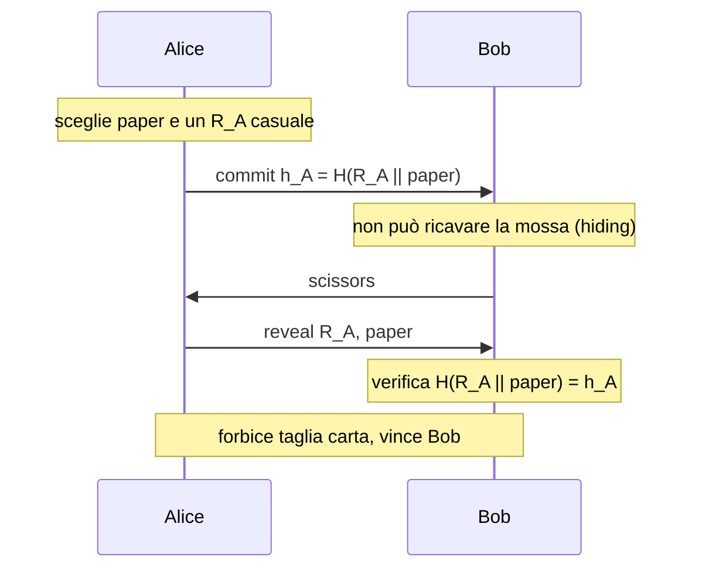
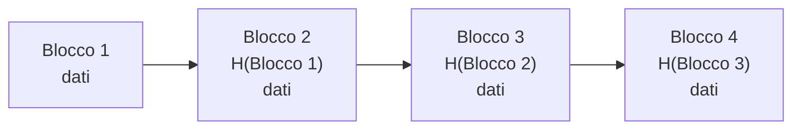
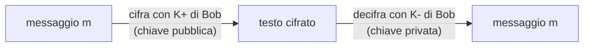
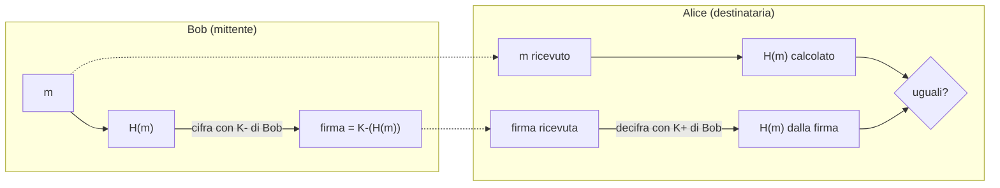

---
tags:
  - università/p2p-blockchain
  - crittografia
  - hash-crittografico
  - firme-digitali
data: 2026-02-26
lezione: "L05 - Crypto primitives for DHT and Blockchains"
professore: "Laura Ricci"
---

# Strumenti crittografici per DHT e Blockchain

Dopo aver visto le DHT, il corso inizia a costruire le basi per le blockchain. Prima di poter capire come funziona Bitcoin servono due mattoni crittografici fondamentali: le **funzioni hash crittografiche** (*cryptographic hash functions*, anche dette *secure hash*) e le **firme digitali** (*digital signatures*). Le prime servono a collegare i blocchi della blockchain in modo che qualsiasi manomissione sia evidente (*tamper-proof*); le seconde servono a firmare digitalmente i dati, in modo che nessuno possa "barare" sulle proprie azioni (ad esempio spendere monete altrui o negare di aver effettuato un pagamento). Strumenti crittografici più avanzati, come le prove a conoscenza zero (*zero knowledge*), le strutture dati autenticate (*authenticated data structures*) e gli accumulatori crittografici (*cryptographic accumulators*), verranno introdotti più avanti nel corso.

## Hashing per le strutture dati

Il concetto di funzione hash è già noto dalle strutture dati: una **tabella hash** memorizza e recupera elementi calcolando, a partire dalla chiave, la posizione in cui collocarli. Una funzione hash per questo scopo deve essere:

- **deterministica**: la stessa chiave deve produrre sempre la stessa posizione, altrimenti non si ritroverebbe ciò che si è memorizzato;
- **pseudocasuale**: deve distribuire le chiavi uniformemente sulla tabella, in modo da minimizzare le collisioni;
- **efficiente**: facile e veloce da calcolare.

Un esempio classico è $y = x \bmod \text{table\_dim}$. Per una tabella hash, però, le collisioni sono solo un problema di prestazioni: nessuno cerca attivamente di provocarle. Nel contesto della sicurezza, e quindi delle blockchain, servono proprietà molto più forti, perché bisogna difendersi da un **avversario**.

## L'hash crittografico come impronta digitale

L'analogia usata nelle slide è quella dell'**impronta digitale** (*fingerprint*): così come un'impronta identifica univocamente una persona, un hash crittografico è un'impronta di un contenuto, che lo identifica univocamente. Il valore prodotto si chiama anche **digest** e, informalmente, *checksum*.

> [!definition] Funzione hash
>
> Una funzione hash converte una stringa binaria di lunghezza arbitraria (anche 0) in una stringa binaria di **lunghezza fissa**. L'input può essere di qualunque tipo (video, audio, testo, file eseguibili) e di qualunque dimensione; l'output ha sempre la stessa dimensione (ad esempio 256 bit per SHA-256).
> $$
> H : \{0,1\}^{*} \rightarrow \{0,1\}^{n}
> $$

### Le proprietà di base

Un hash crittografico ha diverse proprietà. Le slide le introducono prima in modo intuitivo.

**Unidirezionalità (one-way).** È una delle proprietà più importanti, detta anche **preimage resistance** (resistenza alla preimmagine). Intuitivamente, l'hash deve essere difficile da invertire: dato un $y$ scelto a caso, cioè una stringa di $n$ bit presa nello spazio di output (quindi $y = h(x')$ per qualche $x'$), deve essere difficile trovare *un qualsiasi* $x$ tale che $h(x) = y$. Quanto difficile? L'unico modo di invertire la funzione deve essere la forza bruta: provare ogni possibile $x$ e controllare se $h(x) = y$. Per SHA-1, con output di 160 bit, le slide indicano un tempo dell'ordine di $2^{71}$ anni per invertire l'hash di un'immagine casuale.

**Determinismo.** Applicando più volte l'algoritmo allo stesso documento si ottiene sempre lo stesso risultato.

**Calcolo veloce.** Dato l'input, l'hash deve essere efficiente da calcolare, anche per input grandi.

**Effetto valanga (avalanche effect).** Se si prende lo stesso documento e si cambia anche un solo bit, l'hash risulta completamente diverso. Questo dipende da come è implementato l'algoritmo: cambiare anche un bit deve cambiare "tutto" l'output, in modo che hash di input simili non abbiano alcuna somiglianza visibile.

> [!example] Effetto valanga
>
> Due frasi che differiscono per una sola lettera, o per un punto finale, producono con SHA-256 due digest a 64 cifre esadecimali che non hanno alcuna relazione apparente: circa metà dei bit risultano diversi. Non esiste modo di capire, dagli hash, che i due input erano quasi identici.

## Collisioni e principio dei cassetti

### Le collisioni esistono sempre

Poiché il codominio della funzione hash è più piccolo del dominio, le **collisioni** (due input diversi con lo stesso hash) esistono necessariamente. Il numero di documenti possibili è enormemente maggiore del numero di stringhe diverse di 256 bit (per SHA-256). È un'applicazione del **principio dei cassetti** (*pigeonhole principle*).

> [!theorem] Principio dei cassetti
>
> Se $n$ oggetti vengono messi in $m$ contenitori, con $n > m$, allora almeno un contenitore contiene più di un oggetto.

È un principio molto semplice, ma permette di dimostrare risultati a volte inaspettati.

> [!example] Numeri consecutivi
>
> Si scelgono 51 numeri tra gli interi da 1 a 100. Dimostrare che due dei numeri scelti sono consecutivi.
>
> *Dimostrazione.* Prendiamo come cassetti le 50 coppie di interi consecutivi $\{1,2\}, \{3,4\}, \dots, \{99,100\}$ e come oggetti i 51 numeri estratti. Poiché $51 > 50$, per il principio dei cassetti almeno un cassetto contiene due numeri estratti, che sono quindi consecutivi.

### Resistenza alle collisioni

Visto che le collisioni esistono, non si può chiedere che non ci siano; si chiede che la funzione sia resistente alle **collisioni "artificiali"**, cioè create ad hoc da un avversario. La sicurezza di un hash si basa sulla **difficoltà** computazionale: trovare una collisione deve richiedere un'enorme quantità di potenza di calcolo. Difficile, però, non vuol dire impossibile. Da qui le domande: se ho un computer potente, quanti tentativi mi servono per trovare una collisione? E come si misura la sicurezza di un hash?

### Quanti tentativi servono per trovare una collisione?

Qual è il numero massimo di tentativi per trovare **con certezza** una collisione con un attacco a forza bruta, ad esempio su SHA-256? Basta scegliere $2^{256} + 1$ valori distinti del dominio, calcolarne gli hash e controllare se due output coincidono: per il principio dei cassetti una collisione verrà trovata. Il numero massimo di tentativi è quindi $2^{256} + 1$.

Ma scegliendo input casuali e calcolandone gli hash, si può dimostrare che si trova una collisione **con alta probabilità molto prima** di esaminare $2^{256} + 1$ valori: con circa $2^{128}$ tentativi si ha già una probabilità del 50% di collisione. Scegliendo a caso appena $2^{128} + 1$ input, cioè circa la **radice quadrata** del numero di output possibili, c'è un'alta probabilità che almeno due collidano. Il motivo è il **paradosso del compleanno**.

### Il paradosso del compleanno

Consideriamo un insieme di $n$ persone scelte a caso in una stanza. Quanto deve essere grande $n$ perché la probabilità che due di esse compiano gli anni lo stesso giorno superi il 50%? Le ipotesi sono che l'anno sia di 365 giorni (niente anni bisestili) e che tutti i giorni siano equiprobabili. Il risultato è sorprendentemente basso: con $n = 23$ (circa $\sqrt{365}$) la probabilità che due persone condividano il compleanno è appena superiore al 50%.

Il ragionamento conviene farlo sull'evento complementare, cioè che **nessuno** condivida il compleanno. Quando entra la seconda persona, per non coincidere deve evitare il compleanno della prima: ha 364 giorni favorevoli su 365. Quando entra la terza, deve evitare due compleanni: 363 giorni favorevoli, e la probabilità che nessuno coincida si ottiene moltiplicando per il risultato del passo precedente. In generale, con $n$ persone:

$$
P(\text{nessuna coincidenza}) = \frac{365}{365} \cdot \frac{364}{365} \cdot \frac{363}{365} \cdots \frac{365 - n + 1}{365} = \prod_{i=0}^{n-1} \frac{365 - i}{365}
$$

$$
P(\text{almeno una coincidenza}) = 1 - \prod_{i=0}^{n-1} \frac{365 - i}{365}
$$

Con 9 persone la probabilità che tutti evitino il compleanno degli altri è già scesa a circa il 90%, quindi la probabilità che almeno una coppia coincida è salita a quasi il 10%. Quando entra la ventitreesima persona, la probabilità che ognuno abbia un compleanno unico è scesa a circa 0,49, quindi la probabilità che almeno due persone condividano il compleanno supera il 50%.

> [!tip] Intuizione chiave
>
> Il paradosso nasce dal fatto che non stiamo cercando qualcuno che compia gli anni in un giorno *fissato*, ma una *qualsiasi coppia* che coincida. Con $n$ persone le coppie sono $\binom{n}{2} = n(n-1)/2$: con 23 persone sono già 253, e ciascuna ha probabilità $1/365$ di coincidere. Il numero di coppie cresce con il quadrato di $n$, ed è per questo che basta $n \approx \sqrt{365}$.

> [!note] Approssimazione (non nelle slide)
>
> Una formula approssimata utile è $P(\text{collisione}) \approx 1 - e^{-n(n-1)/(2N)}$ con $N$ numero di valori possibili; ponendo $P = 1/2$ si ottiene $n \approx 1{,}18\sqrt{N}$, da cui la regola "circa $\sqrt{N}$ tentativi".

### Dal compleanno all'hash

Il collegamento con le funzioni hash è diretto. Sia $H$ una funzione hash con output di $n$ bit, quindi con $2^n$ hash possibili (i "giorni dell'anno"). Se applichiamo $H$ a $k$ input casuali (le "persone"), quanto deve valere $k$ perché la probabilità che almeno una coppia $x, y$ soddisfi $H(x) = H(y)$ sia 0,5? Per il paradosso del compleanno, calcolando l'hash di circa

$$
\sqrt{2^{n}} = 2^{n/2}
$$

valori casuali ci si aspetta di trovare una collisione. Per SHA-1 questo significa circa $2^{80}$ tentativi in media invece di $2^{160}$. Grazie al paradosso del compleanno un attacco a forza bruta richiede molti meno tentativi del previsto; per fortuna, con le funzioni moderne, il numero di tentativi resta comunque troppo alto.

## Le proprietà formali di un hash crittografico

La caratteristica chiave è che l'hash crittografico è **facile da calcolare e difficile da invertire**: è una *one-way function*. Le proprietà vengono formalizzate in tre requisiti principali, a cui se ne aggiungono due particolarmente utili per criptovalute e blockchain.

> [!definition] Preimage resistance (resistenza alla preimmagine)
>
> Dato un output $y$, è computazionalmente difficile trovare un input $x$ tale che $H(x) = y$. In breve: è difficile trovare input che corrispondano a un output dato.

> [!definition] Second preimage resistance (resistenza debole alle collisioni)
>
> Dato un input casuale $x$, è computazionalmente difficile trovare un altro input $x' \neq x$ tale che $H(x') = H(x)$. È detta anche **weak collision resistance**.

> [!definition] Collision resistance (resistenza forte alle collisioni)
>
> È computazionalmente difficile trovare **una qualsiasi** coppia di input $x \neq y$ tali che $H(x) = H(y)$. L'avversario qui è libero di scegliere entrambi gli input.

La differenza tra le ultime due è sottile ma importante. Nella *second preimage resistance* l'input $x$ è imposto; nella *collision resistance* l'attaccante sceglie liberamente entrambi. Trovare una collisione qualsiasi è quindi più facile, ed è proprio qui che si applica il paradosso del compleanno ($2^{n/2}$ tentativi), mentre per la seconda preimmagine servono circa $2^{n}$ tentativi.

La resistenza debole alle collisioni protegge da un attacco concreto: introdurre una distribuzione software corrotta. L'attaccante vuole ingannare qualcuno facendogli autenticare come genuini dei dati che ha generato lui (un software o dei dati corrotti) con lo stesso hash di quelli originali; se la funzione è second-preimage resistant, dato il software originale non riesce a costruirne una versione modificata con lo stesso hash.

> [!note] L'attacco contro cui protegge la collision resistance
>
> Le slide mostrano in figura l'attacco da evitare con la collision resistance. Un esempio classico (aggiunto qui per chiarezza) è quello dei due contratti: l'attaccante prepara due documenti, uno innocuo e uno fraudolento, con lo stesso hash; fa firmare alla vittima quello innocuo (la firma è apposta sull'hash) e poi sostiene che la vittima abbia firmato quello fraudolento, perché la firma risulta valida anche su di esso.

Accanto a queste, l'**effetto valanga** (una piccola modifica all'input produce un output completamente diverso) è considerato una proprietà desiderata. Le due proprietà aggiuntive utili per le blockchain, **hiding** e **puzzle-friendliness**, sono discusse più avanti in questa lezione.

Infine, le funzioni hash sono organizzate in **famiglie**, che condividono un design simile ma con parametri e lunghezza dell'output diversi (ad esempio SHA-256 e SHA-512 appartengono alla famiglia SHA-2).

> [!warning] Chiesto all'esame
>
> "Quali sono le caratteristiche di un hash crittografico?" è stata chiesta più volte, e secondo gli studenti era importante ricordarle **tutte e tre**: preimage resistance (one-way), second preimage resistance (weak collision resistance), collision resistance. È bene aggiungere determinismo, efficienza, effetto valanga, e le due proprietà "blockchain": hiding e puzzle-friendliness.

> [!warning] Chiesto all'esame
>
> "Qual è la differenza tra un hash crittografico e il consistent hashing?" Il **consistent hashing** (visto con le DHT) è una *tecnica* per mappare chiavi e nodi nello stesso spazio di identificatori in modo che, quando un nodo entra o esce, solo una piccola frazione delle chiavi debba essere riassegnata. L'**hash crittografico** è una *funzione* con proprietà di sicurezza (one-way, resistenza alle collisioni). Le DHT come Chord e Kademlia usano un hash crittografico (ad esempio SHA-1) per generare gli identificatori, sfruttandone l'uniformità e la difficoltà di manipolazione, e su questi applicano lo schema di consistent hashing.

## Hash non crittografici

Per capire meglio che cosa rende "crittografico" un hash, le slide mostrano due esempi di funzioni che producono un checksum ma **non** sono sicure.

La prima è la **parità a blocchi di 8 bit** (*8-bit block parity*): il messaggio $m$ viene diviso in blocchi di 8 bit, messi uno sotto l'altro, e il checksum è lo XOR colonna per colonna. Trovare una collisione è banale: basta invertire un numero pari qualsiasi di bit che si trovino nella stessa colonna, e la parità non cambia.

La seconda è il **CRC** (*Cyclic Redundancy Check*), che essenzialmente è il resto di una divisione polinomiale. Il CRC è ottimo per rilevare errori a raffica (*burst errors*) e gli errori casuali difficilmente producono una collisione; però è facile costruire collisioni deliberatamente, quindi è un hash insicuro. Il CRC è stato erroneamente usato dove serviva integrità crittografica: il protocollo di sicurezza wireless **WEP** (*Wired Equivalent Privacy*) usava il CRC, con le conseguenze di sicurezza che ne derivano.

> [!tip] Intuizione chiave
>
> Un checksum come il CRC protegge da errori **casuali** (rumore sul canale); un hash crittografico protegge da modifiche **intenzionali** di un avversario. La differenza non sta nel formato dell'output, ma nel modello di minaccia.

## Attaccare le funzioni hash

Esistono due tipi di attacco.

L'**attacco a forza bruta** consiste nel controllare sistematicamente tutte le possibilità finché non si trova quella giusta. È sempre possibile, ma per funzioni con output grande i tempi sono enormi: un computer che calcola 10.000 hash al secondo impiegherebbe circa $10^{27}$ anni per calcolare $2^{128}$ hash. Come osservano Narayanan et al., anche se tutti i computer mai costruiti dall'umanità avessero calcolato hash dall'inizio dell'universo fino a oggi, la probabilità che avessero trovato una collisione sarebbe ancora infinitesimale.

La **crittoanalisi** sfrutta invece debolezze logiche dell'algoritmo: una "scorciatoia" nell'hash, un "buco" nella funzione. Una funzione si dice **rotta** (*broken*) quando è possibile trovare collisioni in modo significativamente più veloce della forza bruta.

### Sicurezza delle funzioni hash

Contro la forza bruta, la robustezza di una funzione hash dipende **solo dalla lunghezza** del codice prodotto. Per un hash di lunghezza $n$ bit, lo sforzo richiesto è proporzionale a $2^{n}$ per la preimmagine e la seconda preimmagine, e a $2^{n/2}$ per le collisioni. Un hash di 56 bit si può attaccare con $2^{56}$ operazioni: si dice che ha un **livello di sicurezza** di 56 bit. $2^{128}$ operazioni sono infattibili per le macchine attuali, mentre $2^{80}$ diventano fattibili. Si noti che la scala è esponenziale: $2^{81}$ operazioni richiedono il doppio del tempo di $2^{80}$.

Se non ci sono difetti di progettazione, quindi, la sicurezza di una funzione hash dipende dalla lunghezza in bit dell'output: con una funzione a $m$ bit, all'attaccante servono $2^{m/2}$ calcoli a forza bruta per trovare una collisione.

| Funzione | Lunghezza output | Sicurezza contro collisioni |
|---|---|---|
| MD5 | 128 bit | 64 bit |
| SHA-1 | 160 bit | 80 bit |
| SHA-256 | 256 bit | 128 bit |
| SHA-512 | 512 bit | 256 bit |

Per garantire la sicurezza servono **almeno 80 bit**. La blockchain di Bitcoin usa **SHA-256** (*Secure Hash Algorithm*).

### Funzioni hash reali e ciclo di vita

Tra le funzioni **ritirate** ci sono SHA-1, MD2 e MD4 (output a 128 bit, progettate da Rivest), considerate vulnerabili; MD5 (128 bit, Rivest) è vulnerabile, ma ancora accettabile per un'ampia gamma di applicazioni non legate alla sicurezza. Tra le funzioni **attuali** ci sono SHA-2 e SHA-3, disponibili con impronte di 224, 256, 384 e 512 bit, e **RIPEMD-160** (output a 160 bit), anch'essa usata in Bitcoin.

Storicamente, le funzioni hash crittografiche più diffuse hanno avuto una vita utile di **circa 10 anni**, prima che la crittoanalisi o l'aumento della potenza di calcolo le rendessero insicure. L'ultima standardizzata è **SHA-3**, basata sull'algoritmo **Keccak**.

> [!note] SHA-256 e RIPEMD-160 in Bitcoin
>
> Le slide si limitano a dire che entrambe sono usate in Bitcoin. Come si vedrà nelle lezioni su Bitcoin, SHA-256 è usata per il Proof of Work e per gli hash di blocchi e transazioni, mentre gli indirizzi derivano dalla chiave pubblica applicando SHA-256 e poi RIPEMD-160. Ethereum usa invece Keccak-256.

---

## Applicazioni degli hash al di fuori della blockchain

Prima di passare alle blockchain, le slide mostrano alcuni usi classici degli hash crittografici (quelli legati alle firme digitali sono discussi nell'ultima parte della lezione).

**Memorizzazione delle password.** Le password non vanno salvate in chiaro, ma come hash crittografico. Al login si calcola l'hash della password inserita e lo si confronta con quello memorizzato. In questo modo, anche se il database viene compromesso, l'attaccante non ottiene direttamente le password originali.

**Controlli di integrità (anti-tampering).** Si pubblicano i checksum dei file, così che gli utenti possano verificare l'autenticità dei file scaricati o trasmessi: si calcola l'hash prima di aprire o eseguire il file e, se coincide con il checksum pubblicato, il file non è stato alterato né corrotto durante la trasmissione.

**Deduplicazione dei dati.** Nei sistemi di storage si eliminano i duplicati confrontando gli hash dei file o dei blocchi di dati, risparmiando spazio. È utile proprio perché l'hash è piccolo: non serve confrontare i file interi. Ad esempio eMule usava MD5 per verificare che due file fossero lo stesso file, anche se descritti con parole chiave diverse.

### L'attacco con rainbow table

L'uso degli hash per le password ha un punto debole. L'attacco con **rainbow table** usa tabelle precalcolate per ridurre il tempo necessario a scoprire le password: le tabelle si costruiscono calcolando l'hash di tutte le password in chiaro plausibili e memorizzando gli hash in un grande database. Quando si ottiene un hash di password (ad esempio da un database rubato), lo si cerca nella tabella; se c'è una corrispondenza, la password è identificata.

Dov'è il problema, visto che la funzione è one-way e trovare l'input dato l'output è computazionalmente infattibile? Il problema è che **se l'input è scelto da un insieme piccolo o prevedibile**, trovare l'input corrispondente a un hash è facile: basta provarli tutti. La one-wayness protegge solo quando l'input è "imprevedibile". Serve quindi qualcosa in più: la proprietà di hiding.

> [!note] Precisazione (non nelle slide)
>
> Le rainbow table vere e proprie usano una tecnica di compressione a catene per ridurre lo spazio rispetto a una semplice tabella hash→password; la descrizione delle slide corrisponde al concetto generale di tabella precalcolata. La contromisura standard è il *salt*, cioè un valore casuale concatenato alla password prima dell'hashing: è esattamente l'applicazione della proprietà di hiding vista qui sotto.

## La proprietà di hiding

> [!definition] Hiding
>
> Intuitivamente: dato $H(x)$, è infattibile ricavare qualcosa di utile su $x$. Formalmente, una funzione hash $H$ è **hiding** se, quando un valore segreto $R$ è scelto da una distribuzione di probabilità con **alta min-entropy**, dato $H(R \,\|\, x)$ è infattibile trovare $x$.

Una funzione one-way, da sola, non ha necessariamente la proprietà di hiding (come mostrano le rainbow table). Il modo per ottenerla è:

1. scegliere un intero casuale $R$, ad esempio di 256 bit, da una distribuzione con alta min-entropy, cioè tale che ogni valore abbia probabilità trascurabile e nessun valore sia più probabile degli altri;
2. concatenare $R$ all'input originale e calcolare l'hash di $R \,\|\, x$.

In questo modo lo spazio degli input diventa estremamente difficile da enumerare: dato un valore di hash, per un attaccante che non conosce $R$ è estremamente difficile dedurre l'input.

> [!tip] Intuizione chiave
>
> La **min-entropy** misura quanto è prevedibile il valore più probabile di una distribuzione. Se $R$ è uniforme su 256 bit, anche il valore "più probabile" ha probabilità $2^{-256}$: l'attaccante non ha alcun punto di partenza privilegiato, e precalcolare tabelle diventa inutile.

---

## Applicazioni degli hash nelle blockchain

Nelle blockchain gli hash crittografici hanno molti usi. Le slide ne evidenziano tre: i **commitment** (impegni), usati ad esempio nelle aste online, per offrire un prezzo senza rivelarlo pubblicamente e rivelarlo solo in seguito; gli **hash puzzle** (o *search puzzle*), su cui si basa il Proof of Work di Bitcoin; e gli **hash pointer**, puntatori usati come riferimento univoco e verificabile a un dato (saranno approfonditi nella lezione sulle strutture dati).

### Commitment: la motivazione

Alice vuole giocare con Bob a **carta-forbice-sasso** per telefono (o via Internet), senza una terza parte fidata. La regola di equità del gioco è che nessuno decida la propria mossa dopo aver saputo quella dell'altro. Se i due potessero dichiarare le mosse contemporaneamente il gioco sarebbe equo, ma la simultaneità è difficile da ottenere in un sistema distribuito: chi parla per primo perde, perché l'altro può scegliere la mossa vincente. (Se entrambi scelgono lo stesso oggetto, la partita è pari.)

### Lo schema di commitment

Uno **schema di commitment** permette di impegnarsi su un valore e rivelarlo in seguito. L'analogia è la **busta sigillata**: si mette il valore in una busta, la si sigilla e la si lascia sul tavolo dove tutti la vedono. Nessuno può leggere cosa c'è dentro (il valore resta segreto) e chi l'ha sigillata non può più cambiarne il contenuto. Più tardi si apre la busta e si rivela il valore.

Con le funzioni hash: **sigillare** la busta significa calcolare l'hash del valore; **aprire** la busta significa rivelare la preimmagine. Ma attenzione: se lo spazio dei valori è piccolo o indovinabile, un avversario può precalcolare gli hash dei valori probabili e confrontarli con il commitment, scoprendo il valore originale. Nel caso di carta-forbice-sasso i valori possibili sono solo tre! Quindi, anche se l'hash crittografico ha proprietà desiderabili come one-wayness e resistenza alle collisioni, un suo uso ingenuo in uno schema di commitment non garantisce la proprietà di hiding. Si usa la **casualità** per ottenerla.

### Carta-forbice-sasso con commitment

Chi gioca per primo si **impegna** (*commits*) sulla propria scelta; l'altro non può determinare su cosa si sia impegnato; alla fine l'altro può verificare che chi rivela non abbia cambiato la propria scelta tra la fase di commitment e quella di rivelazione. Con $R_A$ valore casuale scelto da Alice, il protocollo è:

$$
\begin{aligned}
A \rightarrow B &: \; h_A = H(R_A \,\|\, \text{paper}) \\
B \rightarrow A &: \; \text{scissors} \\
A \rightarrow B &: \; R_A, \; \text{paper}
\end{aligned}
$$


*Fig. — Carta-forbice-sasso con commitment basato su hash.*

Alla fine del protocollo Bob verifica che l'$h_A$ inviato da Alice sia uguale a $H(R_A \,\|\, \text{paper})$: se i valori coincidono, Bob sa che Alice non ha barato. Il risultato è che Alice perde, perché le forbici tagliano la carta.

Analizziamo perché lo schema funziona. Bob **non può scoprire** che Alice si è impegnata su "paper", perché non conosce il valore casuale $R_A$ (proprietà di **hiding**) e non è in grado di invertire la funzione hash (**preimage resistance**). D'altra parte, appena Bob invia "scissors", Alice sa di aver perso ma **non può barare**: dovrebbe trovare un diverso valore $R'_A$ tale che

$$
H(R_A \,\|\, \text{paper}) = H(R'_A \,\|\, \text{stone})
$$

il che significherebbe che Alice sa trovare collisioni nella funzione hash. Questo non accade se la funzione è resistente (secondo le slide, second-preimage resistant). Questa proprietà dello schema si chiama **binding** (vincolo): Alice non può cambiare idea dopo la fase di commitment.

> [!note] Binding e tipo di resistenza
>
> Le slide collegano il binding alla *second preimage resistance*. A rigore, poiché Alice è libera di scegliere sia $R_A$ sia $R'_A$ (e quindi entrambi gli input), la proprietà che serve pienamente è la *collision resistance*: una Alice disonesta potrebbe cercare in anticipo due input che collidono. Nel caso "onesto" in cui $R_A$ è già fissato, basta invece la second preimage resistance.

> [!definition] Proprietà di uno schema di commitment
>
> **Hiding**: dal commitment non si ricava nulla sul valore impegnato. **Binding**: chi si è impegnato non può aprire il commitment su un valore diverso da quello originale.

Il commitment risolve anche il problema del gioco "simultaneo": se entrambi i giocatori pubblicano prima il proprio commitment e solo dopo rivelano le mosse, nessuno dei due trae vantaggio dal parlare per secondo.

### API di uno schema di commitment

Formalmente, uno schema di commitment è descritto da due operazioni. **Sigillare la busta**: si calcola `com := commit(value, nonce)` e si pubblica `com`. **Aprire la busta**: si pubblicano `(nonce, value)`; poiché `com` era già stato pubblicato, chiunque può usare `verify` per controllarne la validità.

```text
com   := commit(msg, nonce)       implementato come   com := H(msg | nonce)
match := verify(com, nonce, msg)  implementato come   match := (H(msg | nonce) == com)
```

Il `nonce` è il valore casuale ad alta min-entropy che garantisce l'hiding.

### Search puzzle

> [!definition] Hash puzzle (search puzzle)
>
> Un hash puzzle è composto da una funzione hash crittografica $H$, un valore casuale $r$ (detto anche *id* del puzzle) e un insieme obiettivo $S$ (*target set*). Una soluzione del puzzle è un valore $x$ tale che
> $$
> H(r \,\|\, x) \in S
> $$

Il puzzle si basa su un attacco di **preimmagine parziale**: bisogna trovare una parte dell'input ($x$, mentre $r$ è fissato) tale che l'output appartenga a un **insieme** di valori, non a un singolo valore come nell'attacco di preimmagine classico. Il **Proof of Work** (PoW) di Bitcoin è basato proprio su un search puzzle.

Le slide mostrano graficamente lo spazio degli output con, al suo interno, l'insieme $S$: un valore $m$ è una soluzione valida se $H(r \,\|\, m)$ cade dentro $S$, e non valida se cade fuori. La **difficoltà** si regola definendo la dimensione di $S$: se $S$ è grande il puzzle è facile, se è piccolo è difficile. In Bitcoin la difficoltà è definita dal **numero di zeri iniziali** richiesti nell'output di SHA-256: l'insieme $S$ è quello degli hash che iniziano con un certo numero di zeri, cioè inferiori a una soglia.

> [!example] Difficoltà e zeri iniziali
>
> Se si richiede che l'hash (a 256 bit) inizi con $d$ bit a zero, l'insieme $S$ contiene una frazione $2^{-d}$ di tutti gli output possibili. Poiché l'output si comporta come casuale, servono in media $2^{d}$ tentativi per trovare una soluzione: ogni zero in più raddoppia il lavoro atteso. (Esempio aggiunto per chiarezza.)

### Puzzle-friendliness

> [!definition] Puzzle-friendliness
>
> Una funzione hash $H$ è **puzzle-friendly** se, per ogni possibile output $y$ di $n$ bit, quando $k$ è scelto da una distribuzione con alta min-entropy, è infattibile trovare $x$ tale che $H(k \,\|\, x) = y$ in tempo significativamente inferiore a $2^{n}$.

La puzzle-friendliness implica che **non esiste una strategia di soluzione di un search puzzle molto migliore del provare esaustivamente tutti i valori di $x$**. È questa proprietà che rende il Proof of Work "equo": nessuno può trovare una scorciatoia, e la probabilità di risolvere il puzzle è proporzionale solo alla potenza di calcolo impiegata.

### Hash nelle DHT e nelle blockchain

Le slide chiudono la parte sugli hash richiamando due applicazioni già note o che vedremo. Una **DHT** è una classe di sistemi distribuiti decentralizzati che offre un servizio di lookup simile a una tabella hash: coppie (chiave, valore) sono memorizzate nella DHT e qualsiasi nodo partecipante può recuperare in modo efficiente il valore associato a una chiave; gli identificatori di nodi e chiavi si ottengono tramite hash crittografico (si vedano [[L03 - DHT e consistent hashing]] e [[L04 - Kademlia DHT]]). **Bitcoin** usa una blockchain, cioè una **catena di hash** (*hash chain*), per memorizzare il registro delle transazioni in una rete P2P: ogni blocco contiene l'hash del precedente, e questo garantisce la proprietà di **tamper freeness**, perché modificare un blocco cambierebbe il suo hash e romperebbe tutti i collegamenti successivi.


*Fig. — Hash chain: ogni blocco contiene l'hash del precedente; modificare un blocco invalida tutti quelli successivi.*

---

## Crittografia asimmetrica

### Chiave pubblica e chiave privata

Gli algoritmi a chiave pubblica si basano sulla **crittografia asimmetrica**, che usa due chiavi diverse, dette **chiave privata** e **chiave pubblica**. Ciò che una chiave cifra, l'altra lo decifra, e viceversa. La chiave privata deve essere nota solo al suo proprietario; la chiave pubblica è nota a tutti. Deve essere difficile ricavare la chiave privata da quella pubblica.

### Confidenzialità

Per inviare un messaggio confidenziale lo si protegge con la chiave pubblica del destinatario: "tu" cifri qualcosa con la "mia chiave pubblica", che conosci perché l'ho resa pubblica, e "io" ho bisogno della mia chiave privata per decifrarlo. Ciò che è cifrato con una chiave viene decifrato con l'altra, usando lo stesso algoritmo.


*Fig. — Confidenzialità con crittografia asimmetrica: solo il possessore della chiave privata può leggere.*

I vantaggi rispetto agli algoritmi simmetrici sono evidenti: non c'è bisogno che mittente e destinatario si accordino su una chiave comune. Chi vuole inviare un messaggio cifrato deve solo conoscere la chiave pubblica del destinatario, e finché il destinatario mantiene segreta la propria chiave privata nessun altro potrà decifrare i messaggi cifrati con la chiave pubblica corrispondente.

## Firme digitali

### Motivazione e proprietà

Nella vita reale usiamo le firme continuamente: chi paga con carta di credito firma una ricevuta, e il venditore verifica che la firma sulla ricevuta sia uguale a quella sulla carta. Possiamo avere un servizio analogo nel mondo elettronico?

La **firma digitale** è l'equivalente della firma autografa, ma molto più sicura (una firma autografa si falsifica molto più facilmente). Il mittente (Bob) firma digitalmente un documento, stabilendo di esserne il proprietario/autore. La firma è **verificabile** e **non falsificabile**: il destinatario (Alice) può dimostrare a terzi che Bob, e nessun altro (Alice compresa), deve aver firmato il documento. Una firma digitale permette di dimostrare tre proprietà:

- **autenticazione** (*authentication*): il messaggio è stato creato da un mittente riconosciuto;
- **non ripudio** (*non-repudiation*): il mittente non può negare di aver inviato il messaggio;
- **integrità** (*integrity*): il messaggio non è stato alterato durante la trasmissione.

### Uno schema ingenuo

Indichiamo con $K_B^-$ la chiave privata di Bob e con $K_B^+$ la sua chiave pubblica. Bob firma il messaggio $m$ cifrandolo con la propria chiave privata, e ottiene il messaggio "firmato" $K_B^-(m)$. Bob invia ad Alice sia $K_B^-(m)$, che è la firma, sia il messaggio in chiaro $m$. La confidenzialità non è considerata in questo schema.

Alice riceve $m$ con la firma $K_B^-(m)$ e verifica che $m$ sia stato firmato da Bob applicando la chiave pubblica di Bob alla firma e controllando che

$$
K_B^+\big(K_B^-(m)\big) = m .
$$

Se l'uguaglianza vale, chi ha firmato $m$ deve aver usato la chiave privata di Bob. Alice verifica quindi che Bob ha firmato $m$, che nessun altro ha firmato $m$, e che Bob ha firmato proprio $m$ e non un altro messaggio $m'$. Inoltre c'è **non ripudio**: Alice può portare $m$ e la firma $K_B^-(m)$ in tribunale e dimostrare che Bob ha firmato $m$.

### Firmare l'hash del messaggio

Cifrare messaggi lunghi con la crittografia asimmetrica è computazionalmente costoso. La soluzione è applicare una funzione hash $H$ al messaggio, ottenendo un digest di dimensione fissa $H(m)$, e firmare $H(m)$ invece di $m$.


*Fig. — Schema di firma digitale con hash: si firma il digest, e la verifica confronta il digest ricalcolato con quello estratto dalla firma.*

> [!tip] Intuizione chiave
>
> Firmare l'hash è sicuro proprio grazie alle proprietà dell'hash crittografico: se l'hash non fosse resistente alle collisioni, un attaccante potrebbe trovare un altro messaggio con lo stesso digest e "trasferirvi" la firma. È qui che si vede il legame tra i due mattoni della lezione.

### Integrità e confidenzialità insieme

Lo schema appena visto garantisce l'**integrità**: abbiamo un modo per sapere se il messaggio ricevuto è esattamente quello inviato dal mittente. Ma il messaggio viaggia in chiaro, quindi **non** garantisce la confidenzialità. Per avere confidenzialità e integrità insieme si applicano entrambi gli schemi: il mittente firma il documento con la propria chiave privata e lo cifra con la chiave pubblica del destinatario; il destinatario lo decifra con la propria chiave privata e applica al risultato la chiave pubblica del mittente; se il risultato "ha senso", la verifica ha successo.

### Autenticazione debole e autorità di certificazione

La soluzione vista garantisce solo un'**autenticazione debole** (*weak authentication*). Solo la chiave pubblica del mittente può decifrare la firma cifrata con la sua chiave privata, ma questo garantisce soltanto che chi ha inviato il messaggio possiede la chiave privata corrispondente alla chiave pubblica usata per la verifica. Magari il mittente non è chi dice di essere, ma qualcuno che lo sta impersonando. Se l'autenticazione debole non basta, servono i **certificati digitali**, emessi da **autorità di certificazione** (*Certification Authorities*, CA), che attestano il legame tra una chiave pubblica e l'identità del suo proprietario.

> [!example] Lo scherzo della pizza
>
> Alice vuole fare uno scherzo a Bob. Crea un ordine via e-mail: *"Gentile pizzeria, per favore consegnatemi quattro pizze ai peperoni. Grazie, Bob"*. Firma l'ordine con la **propria** chiave privata e lo invia alla pizzeria, insieme alla propria chiave pubblica, dicendo però che è la chiave pubblica di Bob. La pizzeria verifica la firma, che risulta valida, e consegna quattro pizze ai peperoni a Bob. A Bob, peraltro, i peperoni non piacciono nemmeno. Il problema è che la pizzeria non aveva modo di sapere a chi appartenesse davvero la chiave pubblica: è esattamente ciò che risolve una CA.

> [!note] E nelle blockchain?
>
> In Bitcoin non esistono CA: l'identità *è* la chiave pubblica (o il suo hash, l'indirizzo). Non interessa sapere chi sia la persona, ma solo che chi spende controlli la chiave privata associata ai fondi. L'autenticazione "debole" è quindi proprio ciò che serve. Questa osservazione anticipa contenuti delle lezioni su Bitcoin e non è nelle slide di questa lezione.

### API per le firme digitali

Uno schema di firma digitale si descrive con tre operazioni:

```text
(sk, pk) := generateKeys(keysize)   // sk: chiave segreta di firma
                                    // pk: chiave pubblica di verifica
sig      := sign(sk, message)       // si cifra il messaggio con la chiave
                                    // segreta e si ottiene la firma
isValid  := verify(pk, message, sig) // si decifra la firma con la chiave
                                     // pubblica e si confronta con il messaggio
```

e deve valere la proprietà di correttezza:

$$
\text{verify}\big(pk, \text{message}, \text{sign}(sk, \text{message})\big) = \text{true}
$$

In termini più formali, uno schema di firma è una terna di algoritmi (**KeyGen**, **Sign**, **Verify**). *KeyGen* riceve in input il parametro di sicurezza e restituisce la chiave di firma e la chiave di verifica. *Sign* riceve la chiave di firma e il messaggio da firmare e restituisce una firma. *Verify* riceve la chiave di verifica, un messaggio e una firma sul messaggio e restituisce vero o falso.

La sfida principale nella costruzione di uno schema è garantire che un avversario **non possa imparare a firmare messaggi analizzando la chiave di verifica** (o le firme già viste), cioè che la firma sia infalsificabile.

### Costruzioni concrete

Le slide citano le principali costruzioni.

- **RSA** (Rivest, Shamir, Adleman) si basa su una *one-way trapdoor function*, cioè una funzione facile da calcolare e difficile da invertire a meno di conoscere un'informazione segreta (la *trapdoor*); la sua difficoltà è legata al **problema della fattorizzazione** di interi grandi.
- **DSA** (*Digital Signature Algorithm*) si basa sul **problema del logaritmo discreto**.
- **Bitcoin** usa **ECDSA** (*Elliptic Curve DSA*), una variante di DSA sui gruppi delle curve ellittiche.

In una tipica transazione Bitcoin, l'**input** contiene una firma e una chiave pubblica, mentre l'**output** contiene il codice (uno script, una sorta di *smart contract* elementare) per la procedura di verifica. Questo sarà il cuore delle lezioni su transazioni e script di Bitcoin.

> [!note] Sul testo delle slide
>
> Il testo estratto dalle slide in questo punto è confuso ("the RSA algorithm, based on the discrete-logarithm problem, the DSA algorithm"). La lettura corretta, riportata sopra, è che RSA si basa sulla fattorizzazione e DSA sul logaritmo discreto. Le curve ellittiche permettono chiavi e firme molto più corte a parità di sicurezza, motivo per cui sono preferite nelle blockchain; Bitcoin ha poi introdotto anche le firme di Schnorr con l'aggiornamento Taproot (vedi lezione L13).

## Hash e cifratura a confronto

La lezione si chiude con una distinzione che è bene avere chiarissima. La **cifratura** (*encryption*) è **bidirezionale**: richiede una chiave per cifrare e (la stessa o un'altra) per decifrare, e il suo scopo è poter recuperare il messaggio originale. L'**hashing** è **unidirezionale**: non esiste alcun "de-hashing", e non c'è alcuna chiave. Lo scopo dell'hash non è nascondere un messaggio per poi recuperarlo, ma produrne un'impronta compatta e verificabile.

| | Hash crittografico | Cifratura |
|---|---|---|
| Direzione | one-way, non invertibile | two-way, invertibile con la chiave |
| Chiave | nessuna | necessaria (simmetrica o coppia pubblica/privata) |
| Output | lunghezza fissa | proporzionale all'input |
| Scopo | integrità, impronta, commitment, PoW | confidenzialità (e, con la chiave privata, firme) |

> [!question] Possibili domande d'esame
>
> - Che cos'è una funzione hash crittografica? Quali sono le sue proprietà fondamentali (le tre resistenze) e in che cosa differisce da un hash per tabelle hash?
> - Qual è la differenza tra hash crittografico e consistent hashing?
> - Perché le collisioni esistono sempre? Che cos'è il paradosso del compleanno e che conseguenze ha sulla sicurezza di un hash a $n$ bit?
> - Come si misura la sicurezza di una funzione hash? Perché SHA-256 offre 128 bit di sicurezza contro le collisioni?
> - Che cos'è la proprietà di hiding e perché la sola one-wayness non basta (rainbow table)?
> - Che cos'è uno schema di commitment? Descriva il protocollo carta-forbice-sasso e le proprietà di hiding e binding.
> - Che cos'è un search puzzle e che cosa significa puzzle-friendliness? Che legame hanno con il Proof of Work di Bitcoin?
> - Come funziona una firma digitale? Quali proprietà garantisce, perché si firma l'hash del messaggio e a che cosa servono le autorità di certificazione?

> [!abstract] Sintesi
>
> Hash crittografici e firme digitali sono i due mattoni di DHT e blockchain. Un hash crittografico mappa input arbitrari in un output di lunghezza fissa ed è deterministico, veloce, con effetto valanga, e soprattutto resistente alla preimmagine, alla seconda preimmagine e alle collisioni. Le collisioni esistono sempre (principio dei cassetti), ma per il paradosso del compleanno trovarne una richiede circa $2^{n/2}$ tentativi: SHA-256 offre quindi 128 bit di sicurezza, e ne servono almeno 80. Per le blockchain servono anche hiding (ottenuto concatenando un valore casuale ad alta min-entropy) e puzzle-friendliness. Con queste proprietà si costruiscono commitment (hiding + binding), search puzzle (base del Proof of Work, difficoltà regolata dalla dimensione del target set) e hash chain (tamper freeness). La crittografia asimmetrica usa una coppia di chiavi: cifrando con la pubblica si ottiene confidenzialità, firmando (l'hash del messaggio) con la privata si ottengono autenticazione, integrità e non ripudio. Senza CA l'autenticazione è solo debole. Le firme si descrivono con KeyGen/Sign/Verify; Bitcoin usa ECDSA. Infine, l'hash è one-way e senza chiave, la cifratura è invertibile e richiede una chiave.
