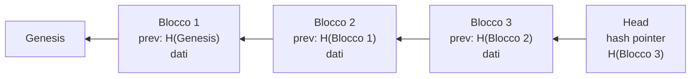
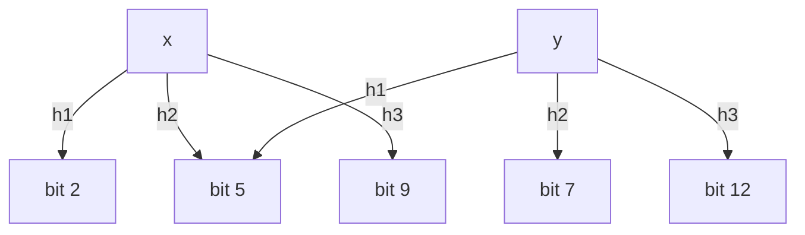
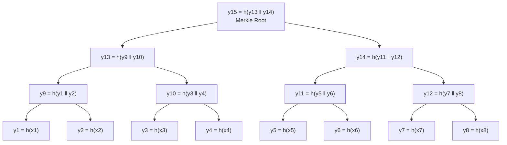
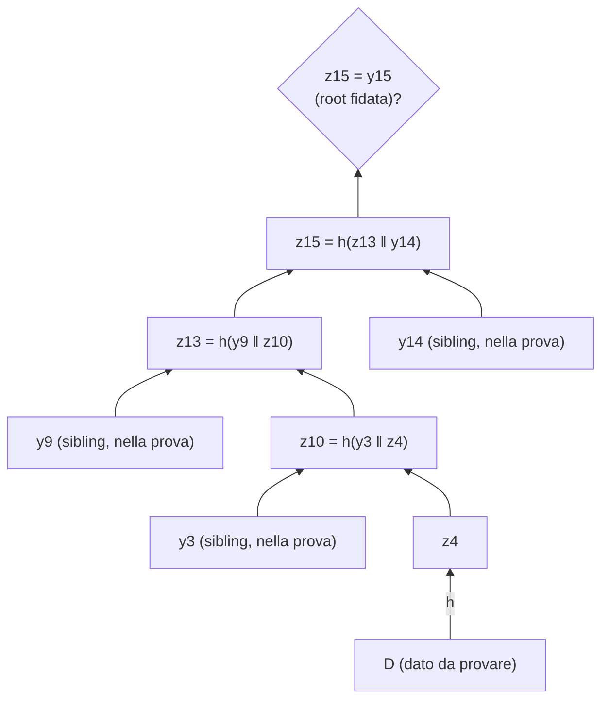
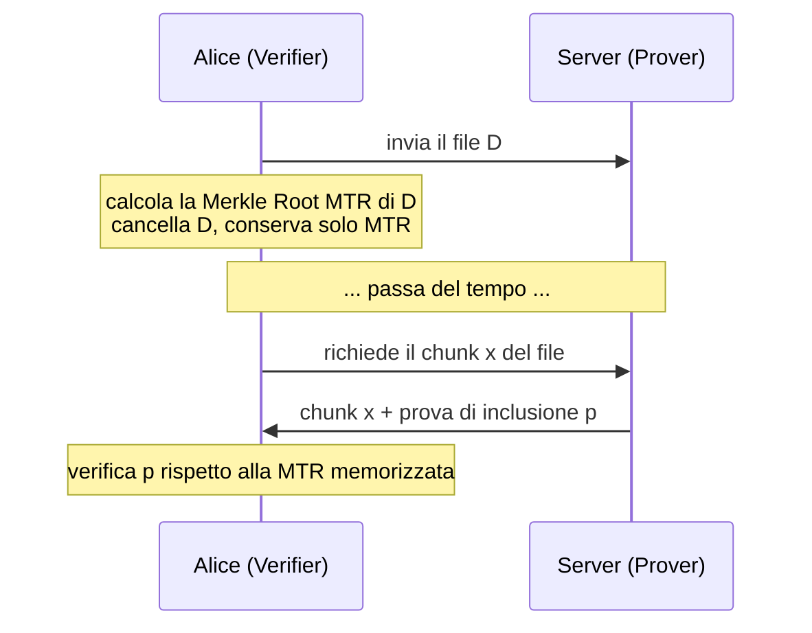
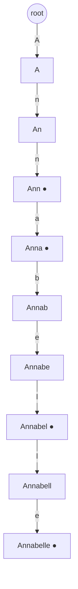
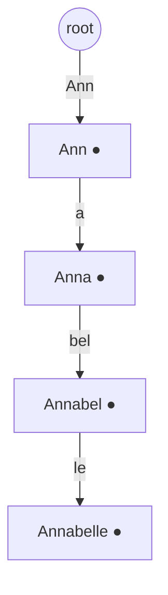
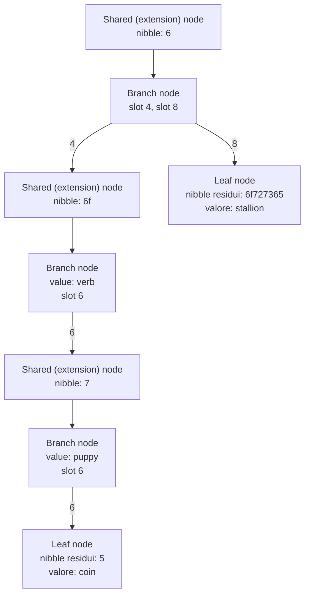

---
tags:
  - università/p2p-blockchain
  - strutture-dati
  - merkle-tree
  - bloom-filter
  - patricia-trie
data: 2026-03-02
lezione: "L06 - Strutture dati per DHT e Blockchain"
professore: "Laura Ricci"
---

# Strutture dati per DHT e Blockchain

Questa lezione costruisce la "cassetta degli attrezzi" (*data structure toolbox*) di strutture dati che torneranno continuamente nel resto del corso: nelle blockchain (Bitcoin ed Ethereum), ma anche nelle DHT e in IPFS. Nella lezione precedente abbiamo visto gli strumenti crittografici, in particolare le funzioni hash crittografiche; qui vediamo come quelle funzioni, combinate con strutture dati classiche, producano strutture **autenticate**, cioè strutture in cui è possibile accorgersi di qualsiasi manomissione dei dati.

Il percorso della lezione è il seguente: si parte dagli **hash pointer**, il mattone elementare; si passa ai **Bloom filter**, una struttura probabilistica per il problema dell'appartenenza a un insieme; poi ai **Merkle tree**, che permettono di verificare in modo efficiente che un dato appartenga a un insieme; infine ai **trie**, alla loro versione compressa (**Patricia trie**) e alla loro versione autenticata, il **Merkle Patricia Trie** usato da Ethereum.

> [!warning] Chiesto all'esame
>
> Le strutture dati sono indicate esplicitamente tra i "grandi argomenti" dell'orale. In particolare sono state chieste domande come: *"Cos'è un Merkle Tree? Quando si usa la Merkle Root e quando una Merkle Proof in Bitcoin?"* (la professoressa voleva arrivare ai nodi SPV) e *"Come sono organizzati i dati in Ethereum? Qual è la struttura del Merkle Patricia Trie?"*.

---

## Hash pointer

### Definizione

Un puntatore ordinario ci dice *dove* si trova un'informazione. Un **hash pointer** aggiunge a questa informazione una garanzia: oltre al riferimento alla posizione del dato, contiene anche l'hash crittografico del dato stesso.

> [!definition] Hash pointer
>
> Un hash pointer è una coppia formata da:
> - un puntatore alla posizione in cui è memorizzata un'informazione;
> - l'hash crittografico di quell'informazione.
>
> Con un hash pointer possiamo sia chiedere di recuperare l'informazione, sia **verificare che non sia cambiata** dal momento in cui il puntatore è stato creato.

Per questo motivo un hash pointer è detto anche **tamper-evident data pointer** (puntatore "a prova di manomissione", nel senso che la manomissione diventa evidente). Quando recuperiamo il dato, ne ricalcoliamo l'hash e lo confrontiamo con quello memorizzato nel puntatore: se differiscono, il dato è stato alterato.

### Strutture dati costruite con hash pointer

L'idea chiave è semplice: prendere una qualunque struttura dati basata su puntatori e sostituire i puntatori normali con hash pointer. Il caso più immediato è la lista concatenata, che diventa una **block chain**: una lista di blocchi collegati da hash pointer. Ogni blocco contiene un hash pointer al blocco precedente; per calcolare l'hash pointer a un blocco si calcola l'hash dell'**intero** blocco, compreso l'hash pointer che esso contiene al suo predecessore.

*Fig. — Una lista collegata tramite hash pointer: ogni blocco contiene l'hash del blocco precedente, che a sua volta include l'hash del blocco prima ancora.*

Il caso d'uso fondamentale è il **tamper-evident log**, un registro in cui ogni manomissione è rilevabile, che è la struttura dati di base di Bitcoin e di Ethereum.

Perché la manomissione è evidente? Supponiamo che un avversario modifichi il blocco $k$. L'hash del blocco $k$ cambia, quindi l'hash pointer memorizzato nel blocco $k+1$ non corrisponde più. Per nascondere la modifica l'avversario dovrebbe aggiornare anche l'hash pointer nel blocco $k+1$, ma questo cambia l'hash del blocco $k+1$, che quindi non corrisponde più a quanto memorizzato nel blocco $k+2$, e così via fino alla testa della lista. Alla fine l'avversario dovrebbe modificare anche l'hash pointer di testa, che però chi verifica tiene al sicuro. Tutto questo funziona perché la funzione hash è **collision resistant**: l'avversario non può alterare i dati del blocco $k$ in modo che l'hash rimanga uguale a quello dei dati originali.

> [!tip] Intuizione chiave
>
> Basta ricordare il solo hash pointer di testa (poche decine di byte) per "congelare" l'intera storia della lista: qualunque modifica, in qualunque punto, si propaga fino alla testa.

Nelle blockchain basate su **Proof of Work** (PoW) c'è un ulteriore livello di protezione: il blocco contiene anche la prova che il lavoro computazionale richiesto dal PoW è stato svolto con successo. Se i dati di un blocco vengono cambiati, non basta ricalcolare gli hash: occorre **rieseguire il PoW** per quel blocco e per tutti i blocchi successivi, il che è computazionalmente impraticabile (*computationally infeasible*). Vedremo i dettagli nelle lezioni sul mining.

### Generalizzazione: qualunque struttura aciclica

Gli hash pointer si possono usare in qualunque struttura dati basata su puntatori **senza cicli**, ad esempio un **DAG** (*Directed Acyclic Graph*, grafo diretto aciclico). L'assenza di cicli è necessaria: per calcolare l'hash di un nodo servono gli hash dei nodi a cui punta, e con un ciclo questo calcolo non potrebbe mai partire.

> [!note] Nota
>
> Il motivo per cui i cicli sono esclusi è una spiegazione aggiuntiva rispetto alle slide, che si limitano ad affermarlo.

Le slide citano diverse applicazioni storiche e attuali:

- una delle prime è l'**AICH** (*Advanced Intelligent Corruption Handling*) di **eMule**, usato per verificare che un blocco di file scaricato dalla rete non sia stato manomesso; sfrutta i Merkle tree, cioè alberi binari costruiti con hash pointer;
- **Bitcoin**, la cui blockchain è una lista di blocchi di transazioni concatenati tramite hash pointer, e che usa le funzioni hash crittografiche SHA-256 (applicata due volte) e RIPEMD-160;
- il **Merkle DAG** di IPFS, che vedremo più avanti nel corso, e molte altre applicazioni.

---

## Bloom filter

### Il problema dell'appartenenza a un insieme

Consideriamo un insieme $S = \{s_1, s_2, \dots, s_n\}$ di $n$ elementi, con $n$ molto grande. Vogliamo una struttura dati efficiente che risponda a **membership queries** (interrogazioni di appartenenza) del tipo "$k$ è un elemento di $S$?". Formalmente cerchiamo una funzione $f$ che restituisce *true* o *false* a seconda che $k$ appartenga o meno all'insieme.

Una soluzione esatta (ad esempio una tabella hash con tutti gli elementi) richiede spazio proporzionale alla dimensione degli elementi stessi. Il **problema dell'appartenenza approssimata** (*approximate set membership problem*) rilassa il requisito: si sceglie una rappresentazione degli elementi di $S$ tale che la query sia calcolata efficientemente e lo spazio occupato sia ridotto, accettando che il risultato sia **approssimato**. In particolare si accetta la possibilità di **falsi positivi**: la struttura può rispondere "sì, l'elemento c'è" anche quando non c'è. Si crea così un compromesso (*trade-off*) tra lo spazio richiesto e la probabilità di falsi positivi.

### Costruzione

> [!definition] Bloom filter
>
> Dati:
> - un insieme $S = \{s_1, \dots, s_n\}$ di $n$ elementi;
> - un vettore $B$ di $m$ bit, $b_i \in \{0,1\}$, con $m \gg n$ (in generale $m > n \cdot k$);
> - $k$ funzioni hash indipendenti $h_1, \dots, h_k$, dove ogni $h_i : S \to [1..m]$ restituisce un valore uniformemente distribuito nell'intervallo $[1..m]$;
>
> il Bloom filter $B[1..m]$ è costruito in modo che
> $$
> \forall x \in S: \quad B[h_j(x)] = 1, \quad j = 1, 2, \dots, k
> $$

In pratica si parte da un vettore di tutti zeri e, per ogni elemento $x$ da inserire, si calcolano i $k$ hash $h_1(x), \dots, h_k(x)$ e si mettono a 1 i bit corrispondenti. Un bit può essere "bersaglio" di più di un elemento: se due elementi diversi hanno un hash che cade sulla stessa posizione, quel bit è 1 per entrambi. Questa condivisione è proprio la causa dei falsi positivi.

*Fig. — Inserimento di due elementi con $k=3$ funzioni hash: il bit 5 viene posto a 1 sia da $x$ sia da $y$.*

### Lookup

Per verificare se un elemento $y$ appartiene all'insieme rappresentato dal filtro si applicano a $y$ le stesse $k$ funzioni hash e si controllano i bit corrispondenti:

- se **almeno un bit è 0**, l'elemento **sicuramente non appartiene** all'insieme (se ci fosse stato, al momento dell'inserimento quel bit sarebbe stato messo a 1);
- se **tutti i bit sono 1**, l'elemento **potrebbe** appartenere all'insieme: è possibile che un altro elemento, o una combinazione di altri elementi, abbia messo a 1 esattamente gli stessi bit. In quel caso si ha un **falso positivo**.

> [!tip] Intuizione chiave
>
> Un Bloom filter è una struttura dati **probabilistica**: la risposta è "l'elemento **sicuramente non c'è**" oppure "l'elemento **forse c'è**". Non ci sono mai falsi negativi, solo falsi positivi. Questo è il prezzo pagato per l'efficienza in spazio e tempo.

### Probabilità di falsi positivi

Consideriamo $n$ elementi mappati su un vettore di $m$ bit tramite $k$ funzioni hash. Le funzioni hash usate in un Bloom filter devono essere **indipendenti, uniformemente distribuite e il più veloci possibile**; **non è richiesto che siano crittografiche**. Un esempio che funzionerebbe è $h_i(x) = \text{MD5}(x + i)$ oppure $h_i(x) = \text{MD5}(x \,\|\, i)$, dove $i$ è l'indice della funzione hash: da un'unica funzione si ricava una famiglia di $k$ funzioni diverse.

L'assunzione di base per l'analisi è che le funzioni hash siano casuali e indipendenti. Si può quindi applicare il paradigma **balls and bins** (palline e contenitori): costruire il filtro è come lanciare $kn$ palline a caso in $m$ contenitori.

**Primo passo.** Calcoliamo la probabilità che, dopo aver inserito tutti gli $n$ elementi, uno specifico bit del filtro sia ancora 0. Una singola applicazione di una funzione hash "manca" quel bit con probabilità $1 - \frac{1}{m}$. Le applicazioni in totale sono $kn$, tutte indipendenti, quindi:

$$
p = \Pr[\text{bit} = 0] = \left(1 - \frac{1}{m}\right)^{kn} \approx e^{-kn/m}
$$

L'approssimazione deriva dalla definizione di $e$: $\lim_{x\to\infty}\left(1 - \frac{1}{x}\right)^{x} = e^{-1}$, quindi $\left(1-\frac1m\right)^{kn} = \left[\left(1-\frac1m\right)^{m}\right]^{kn/m} \approx e^{-kn/m}$ per $m$ grande. Di conseguenza, dopo la costruzione, una frazione pari circa a $e^{-kn/m}$ dei bit è 0.

**Secondo passo.** Consideriamo un elemento che **non** appartiene all'insieme e applichiamogli le $k$ funzioni. Si ha un falso positivo se **tutte** le $k$ posizioni restituite contengono 1. Ogni posizione è 1 con probabilità $1 - p$, e (sotto l'ipotesi di indipendenza) la probabilità di un falso positivo è:

$$
f = \left(1 - \left(1 - \frac{1}{m}\right)^{kn}\right)^{k} \approx \left(1 - e^{-kn/m}\right)^{k}
$$

> [!note] Nota
>
> Nel testo estratto dalle slide le formule sono presenti solo come immagini; quelle riportate qui sono le formule standard dell'analisi dei Bloom filter, coerenti con i passaggi descritti nelle slide (probabilità che un bit resti 0, approssimazione tramite la definizione di $e$, probabilità che tutti i $k$ bit siano 1).

La probabilità di falsi positivi dipende quindi da due parametri: il rapporto $m/n$, cioè il numero di bit "spesi" per ogni elemento dell'insieme, e $k$, il numero di funzioni hash.

#### Come scegliere $k$

Fissato $m/n$, sembrano esistere due fattori in conflitto nella scelta di $k$:

- **diminuire $k$** aumenta il numero di zeri nel filtro (si mettono a 1 meno bit per elemento), e quindi la probabilità di falso positivo dovrebbe diminuire;
- **aumentare $k$** aumenta la precisione del metodo, perché per un elemento estraneo servono più "coincidenze" per ingannare il test, quindi anche così la probabilità di falso positivo dovrebbe diminuire.

La risoluzione di questo apparente paradosso è che, **fissato $m/n$, al crescere di $k$ la probabilità di falsi positivi prima decresce e poi cresce**: esiste un valore ottimo. Le slide propongono due esempi:

- con $m/n = 2$ (pochi bit per elemento) non si possono usare "troppe" funzioni hash, perché riempirebbero di 1 il filtro;
- con $m/n = 10$, nell'intervallo di valori considerato, aumentare il numero di funzioni hash diminuisce la probabilità di falsi positivi e non la fa mai crescere.

Se invece fissiamo $k$, la probabilità di falsi positivi **decresce esponenzialmente al crescere di $m$**. Per valori bassi di $m/n$ la probabilità è più alta per valori grandi di $k$.

> [!note] Nota
>
> Un risultato standard, non riportato nel testo delle slide, è che il valore di $k$ che minimizza $f$ è
> $$
> k_{opt} = \frac{m}{n}\ln 2
> $$
> in corrispondenza del quale circa metà dei bit del filtro è a 1 e $f \approx (0.6185)^{m/n}$.

In pratica un Bloom filter diventa efficace quando $m = c \cdot n$ con $c$ costante piccola, ad esempio $c = 8$: in questo caso con **5-6 funzioni hash** la probabilità di falsi positivi è bassa. Si ottengono quindi buone prestazioni con un numero limitato di bit.

> [!example] Esempio numerico
>
> Con $m/n = 8$ e $k = 5$: $e^{-5/8} \approx 0.535$, quindi $f \approx (1 - 0.535)^5 = 0.465^5 \approx 0.0217$. Con $k=6$: $e^{-6/8}\approx 0.472$, $f \approx 0.528^6 \approx 0.0216$. Usando solo 8 bit per elemento (indipendentemente da quanto siano grandi gli elementi) si ha un tasso di falsi positivi di circa il 2%.

### Operazioni sui Bloom filter

**Unione.** Dati due Bloom filter $B_1$ e $B_2$ che rappresentano rispettivamente gli insiemi $S_1$ e $S_2$, costruiti con lo stesso numero di bit e le stesse funzioni hash, il Bloom filter che rappresenta $S_1 \cup S_2$ si ottiene con l'**OR bit a bit** di $B_1$ e $B_2$. Il risultato è esattamente il filtro che avremmo ottenuto inserendo tutti gli elementi di $S_1 \cup S_2$ in un filtro vuoto.

**Intersezione.** Nelle stesse ipotesi, l'**AND bit a bit** di $B_1$ e $B_2$ **approssima** $S_1 \cap S_2$. È solo un'approssimazione perché un bit può essere a 1 in entrambi i filtri per due motivi diversi:

- il bit corrisponde a un elemento di $S_1 \cap S_2$, quindi è 1 in entrambi i filtri: in questo caso non c'è approssimazione;
- il bit corrisponde a un elemento di $S_1 - (S_1 \cap S_2)$ e, contemporaneamente, a un elemento **diverso** di $S_2 - (S_1 \cap S_2)$: il bit è 1 in entrambi i filtri ma non corrisponde a nessun elemento dell'intersezione.

**Cancellazione.** Non è possibile cancellare un elemento semplicemente rimettendo a 0 i bit indicati dalle sue funzioni hash: a causa dei conflitti, quei bit potrebbero essere stati messi a 1 anche da altri elementi, e azzerarli introdurrebbe falsi negativi. La soluzione sono i **Counting Bloom Filter**: ogni posizione del filtro è un **contatore** anziché un singolo bit. In fase di inserimento si incrementano i contatori, in fase di cancellazione si decrementano; una posizione è "1" se il contatore è maggiore di zero.

### Applicazioni dei Bloom filter

**Client leggeri in Bitcoin.** L'insieme $S$ mappato sul filtro può essere un insieme di indirizzi Bitcoin. I nodi leggeri (ad esempio su dispositivi mobili) non memorizzano l'intera blockchain; costruiscono un Bloom filter $BF$ con gli indirizzi che li interessano (quelli verso cui ricevono o da cui inviano transazioni) e inviano $BF$ a un **full node**, che possiede l'intera blockchain. Quando il full node riceve un blocco, usa $BF$ per controllare, in modo approssimato, se qualche indirizzo del blocco appartiene al filtro, e inoltra al client leggero solo le transazioni rilevanti. I vantaggi sono due: **risparmio di banda** e **privacy**. La privacy deriva proprio dai falsi positivi: il full node non sa quali, tra gli indirizzi che fanno "match", siano davvero del client.

> [!warning] Chiesto all'esame
>
> Il tema dei client leggeri (nodi SPV) è stato chiesto all'orale a partire dai Merkle tree. I Bloom filter ne sono un tassello: il client leggero li usa per farsi inviare dal full node solo le transazioni di interesse, e le Merkle proof (sezione successiva) per verificarne l'inclusione nel blocco. Il meccanismo SPV completo è trattato nella lezione su Multisig, P2SH e SPV.

**Log bloom in Ethereum.** In Ethereum i Bloom filter sono usati per riassumere gli **eventi** generati dagli smart contract. Supponiamo di voler trovare tutti i token venduti da un certo utente in un blocco di 500 transazioni: invece di analizzare tutte le transazioni, si interroga un Bloom filter contenuto nell'header del blocco (il *log bloom*) per verificare la presenza di quell'utente, e si esegue una ricerca nel blocco **solo se si trova un match**.

**Altre applicazioni.** Il browser Google Chrome ha usato un Bloom filter locale contenente URL malevoli: ogni URL viene prima controllato contro il filtro locale, e solo in caso di hit si esegue un controllo completo. Google BigTable usa i Bloom filter per evitare costose ricerche su disco, aumentando notevolmente le prestazioni delle query.

> [!tip] Schema ricorrente
>
> In tutte queste applicazioni il Bloom filter funge da **filtro economico** davanti a un'operazione costosa: se risponde "no" si evita l'operazione con certezza; se risponde "forse" si paga il costo pieno. I falsi positivi costano solo un po' di lavoro in più, mai una risposta sbagliata.

---

## Merkle tree

### Motivazione: authenticated file storage

Il problema che motiva i Merkle tree è quello dell'**authenticated file storage** (memorizzazione autenticata di file). Un client vuole memorizzare su un server un file, con identificatore $F$ e contenuto $D$, e recuperare $D$ in un momento successivo. I casi d'uso tipici sono il risparmio di spazio (ad esempio storage su cloud) e la ridondanza (ad esempio il backup).

Il protocollo ingenuo è: il client invia $(F, D)$ al server, il server memorizza la coppia, il client cancella $D$ dalla memoria locale; più tardi il client richiede $F$ e il server restituisce $D$. Ma cosa succede se il server è corrotto e restituisce $D' \neq D$?

Una soluzione banale è che il client non cancelli $D$ e confronti $D'$ con la propria copia. Ma questo vanifica lo scopo: non funziona se il client non ha abbastanza memoria per conservare $D$ a lungo.

La soluzione crittografica è che il client, prima di cancellare $D$, calcoli e memorizzi localmente $H(D)$. Quando il server restituisce $D'$, il client verifica che $H(D') = H(D)$; per la collision resistance di $H$, il server non può produrre un $D' \neq D$ con lo stesso hash. L'hash funge da **commitment** (impegno) sul contenuto del file.

Resta però un problema: **e se il client ha bisogno di un solo byte, o di una piccola parte, del file?** Con un singolo hash dovrebbe scaricare l'intero file per verificarlo. L'idea è **aggiungere struttura al commitment**: non un singolo hash, ma una **gerarchia di hash**. Ecco il Merkle tree.

### Definizione

Il Merkle tree è stato introdotto da **Ralph Merkle nel 1979**. È una struttura dati che riassume una grande quantità di dati con due obiettivi:

- **verifica efficiente dei dati**: permettere di verificare che uno specifico dato appartenga all'insieme senza controllare l'insieme intero;
- **sicurezza e integrità**: permettere di verificare che i dati non siano stati manomessi usando un insieme ridotto di informazioni.

> [!definition] Merkle tree
>
> Un Merkle tree è un albero binario completo di hash costruito a partire da un insieme iniziale di dati $\{f_1, \dots, f_n\}$:
> - l'$i$-esima foglia memorizza l'hash $h_i = H(f_i)$;
> - ogni nodo interno contiene l'hash della concatenazione degli hash dei suoi figli: $H(x, y) = H(x \,\|\, y)$, dove $\|$ indica la concatenazione;
> - l'hash memorizzato nella radice è chiamato **Merkle Root Hash** (o Merkle root) e costituisce il commitment finale su tutto l'insieme di dati.

### Costruzione

Assumiamo di avere $n$ dati $x_1, \dots, x_n$ con $n$ potenza di 2 e una funzione hash $h$. Numeriamo i nodi dell'albero da $y_1$ a $y_{2n-1}$: le foglie sono $y_1, \dots, y_n$ con $y_i = h(x_i)$, e ogni nodo interno è l'hash della concatenazione dei figli. La radice è $y_{2n-1}$. Con $n = 8$:

*Fig. — Merkle tree su 8 dati: $2n-1 = 15$ nodi, la radice $y_{15}$ è il commitment finale.*

Una volta costruito l'albero si pubblica (*commit*) il valore della Merkle root. In seguito la root può essere usata per mostrare che i dati non sono stati manomessi e per mostrare che un certo dato appartiene all'insieme.

### Merkle proof

Supponiamo di avere un dato $D$ e di voler dimostrare che appartiene al Merkle tree, ad esempio che $D = x_4$. Una **Merkle proof** consiste nei **fratelli (siblings) dei nodi lungo il cammino dalla foglia alla radice**. Per $x_4$ il cammino è $y_4 \to y_{10} \to y_{13} \to y_{15}$, e i fratelli sono $y_3$, $y_9$, $y_{14}$.

Per verificare la prova, chi verifica calcola:

$$
z_4 = h(D), \quad z_{10} = h(y_3 \,\|\, z_4), \quad z_{13} = h(y_9 \,\|\, z_{10}), \quad z_{15} = h(z_{13} \,\|\, y_{14})
$$

e controlla che $z_{15} = y_{15}$. Condizione essenziale: il verificatore deve possedere una **root hash fidata** (*trusted root hash*), ottenuta in modo sicuro; la prova non ha valore se anche la root viene fornita dalla parte non fidata.

*Fig. — Verifica della Merkle proof per $D = x_4$: il verificatore ricalcola il cammino fino alla radice usando i tre sibling ricevuti.*

> [!warning] Attenzione all'ordine della concatenazione
>
> La concatenazione non è commutativa: $h(y_3 \| z_4) \neq h(z_4 \| y_3)$. La prova deve quindi indicare, per ogni sibling, se sta a sinistra o a destra. Questo è anche il motivo per cui una Merkle proof dimostra non solo che il dato appartiene all'insieme, ma anche la sua **posizione** (è l'$i$-esimo input).

### Complessità in tempo e spazio

| Operazione | Costo |
|---|---|
| Costruzione del Merkle tree | $O(n)$ spazio e $O(n)$ hash |
| Dimensione del commitment | $O(1)$ (una root da 256 bit) |
| Dimensione della Merkle proof | $O(\log n)$ |
| Tempo per costruire la prova | $O(\log n)$ |
| Hash necessari per verificarla | $O(\log n)$ |

Il guadagno è enorme: con un milione di dati la prova contiene circa 20 hash, contro il milione di dati necessari con un singolo hash dell'intero insieme.

### Consistenza delle Merkle proof

Le Merkle proof godono di due proprietà di correttezza:

- **nessun falso negativo**: se il dato appartiene a $\{x_1, \dots, x_n\}$ è sempre possibile costruire una Merkle proof che supera il test;
- **nessun falso positivo** (a meno di trovare una collisione di $h$): se il dato non appartiene all'insieme è impraticabile costruire una prova falsa che superi il test. Infatti, da qualche parte lungo il cammino, bisognerebbe trovare un falso sibling che, concatenato con il valore calcolato, dia esattamente l'hash del genitore corretto; ma due input diversi con lo stesso hash sono per definizione una **collisione**.

> [!tip] Confronto con i Bloom filter
>
> Il Bloom filter ammette falsi positivi per costruzione (è probabilistico e compatto); la Merkle proof non ammette falsi positivi, grazie alla collision resistance. In compenso la Merkle proof richiede che qualcuno (il prover) possieda l'intero albero.

### Proof of non-membership

Come si dimostra invece che un dato **non** appartiene all'insieme? Si modifica la costruzione disponendo le foglie **in ordine**. Per dimostrare che $\text{Data} \notin \{x_1, \dots, x_n\}$ si trova l'indice $i$ tale che $x_i < \text{Data} < x_{i+1}$ e si dimostra l'appartenenza di $x_i$ in posizione $i$ e di $x_{i+1}$ in posizione $i+1$. Poiché le foglie sono ordinate e le due sono adiacenti, tra di esse non c'è spazio per $\text{Data}$.

### Il protocollo di file storage basato su Merkle tree

Torniamo al problema iniziale. Il protocollo diventa:

*Fig. — Authenticated file storage con Merkle tree: Alice conserva solo la root.*

Alice memorizza la **Merkle Tree Root (MTR)** e non l'hash del file. Il server, che ha il ruolo di **prover**, può dare ad Alice (il **verifier**) uno dei chunk $f_i$ e convincerla che quel chunk appartiene all'insieme usato per calcolare la MTR e che è proprio l'$i$-esimo input, fornendo una Merkle proof (detta anche **proof of inclusion** o *membership proof*) senza mostrare tutti gli altri input. La prova contiene i sibling lungo il cammino che collega la foglia del chunk $f_i$ alla MTR.

### Applicazioni dei Merkle tree

I Merkle tree sono usati in **IPFS** (in forma di Merkle DAG), in **Bitcoin** per memorizzare le transazioni di un blocco (la Merkle root delle transazioni è inserita nell'header del blocco) e in **Ethereum**, che usa i Merkle Patricia Trie per lo stato e le transazioni.

> [!warning] Chiesto all'esame
>
> *"Quando si usa la Merkle Root e quando la Merkle Proof in Bitcoin?"* La Merkle root delle transazioni sta nell'header di ogni blocco e fa da commitment sull'insieme delle transazioni del blocco; la Merkle proof serve a un client leggero (SPV), che scarica solo gli header, per verificare che una transazione sia inclusa in un blocco ricevendo $O(\log n)$ hash invece dell'intero blocco.

---

## Trie

### Definizione

Un **trie** (pronunciato "try", dal termine *retrieval*), chiamato anche **radix tree** o **prefix tree** (albero dei prefissi), è una struttura dati per applicazioni che eseguono molte operazioni di elaborazione e ricerca di stringhe, come motori di ricerca ed elaborazione del linguaggio naturale.

È una struttura ad albero in cui:

- le chiavi sono di solito stringhe;
- gli archi sono etichettati con lettere, e il cammino dalla radice a un nodo rappresenta una stringa;
- ogni nodo tranne la radice rappresenta un **prefisso** di una stringa (da cui il nome "prefix tree");
- i nodi hanno un indicatore (*marker*) che segnala se quel nodo rappresenta la **fine di una stringa** memorizzata.

Ogni ramo rappresenta un carattere dell'alfabeto: in un trie per parole inglesi ogni nodo ha al massimo 26 figli, uno per lettera.

**Ricerca.** Per cercare una stringa si scende dalla radice scegliendo i rami in base ai caratteri della stringa. Se si trova un cammino che rappresenta l'intera sequenza, si controlla se il nodo finale è marcato: se sì, la stringa è presente. Se ci si blocca in un nodo (manca il ramo per il carattere successivo) oppure si arriva alla fine del cammino su un nodo non marcato, la ricerca fallisce.

*Fig. — Un trie con le chiavi Ann, Anna, Annabel, Annabelle (● = fine di una stringa). Si nota la lunga catena di nodi con un solo figlio.*

> [!note] Nota
>
> Le slide mostrano l'esempio dei nomi (Ann, Anna, Annab, Annabe, Annabel...) come figura; le chiavi usate nel diagramma sopra sono una ricostruzione illustrativa di quell'esempio.

La rappresentazione a trie permette ricerche veloci (il costo dipende dalla lunghezza della chiave, non dal numero di chiavi), ma lo **spazio richiesto è elevato**: nell'esempio la maggior parte dei nodi ha un solo figlio.

### Patricia trie

L'idea è **comprimere il trie**: se combiniamo i nodi che hanno un solo figlio, riduciamo la dimensione dell'albero. Questa è l'idea alla base del **Patricia trie** (*Practical Algorithm To Retrieve Information Coded In Alphanumeric*), un trie ottimizzato in spazio introdotto negli anni '60.

Avere catene di nodi con un solo figlio (Ann, Anna, Annab, Annabe, Annabel, ...) è uno spreco. In un Patricia trie un cammino isolato, composto da nodi non marcati (nessun nodo finale nel cammino) che sono figli unici, viene **fuso in un singolo arco**, la cui etichetta è la **concatenazione delle etichette** dei nodi fusi. In altre parole, si etichettano gli archi con stringhe di più caratteri anziché con un singolo carattere, e si ottiene un trie in cui ogni nodo interno ha **almeno due rami** (salvo i nodi che segnano la fine di una chiave).

*Fig. — Lo stesso insieme di chiavi in un Patricia trie: le catene di nodi con un solo figlio sono compresse in archi etichettati con stringhe.*

### Patricia trie per coppie chiave-valore

I trie non sono limitati alla rappresentazione di stringhe: possono rappresentare coppie **(chiave, valore)**. Le chiavi sono le stringhe rappresentate dal trie e il valore è memorizzato nel nodo che si trova alla fine del cammino della chiave. È esattamente l'uso che ne fa Ethereum per rappresentare lo stato dei contratti.

In Ethereum le chiavi sono rappresentate in esadecimale e i prefissi sono condivisi a livello di **nibble**: un nibble è **mezzo byte**, cioè 4 bit, corrispondente a **un carattere esadecimale**. Condividere prefissi a livello di nibble anziché di byte permette una condivisione più granulare. Ad esempio il carattere ASCII `d` vale `0x64`, ovvero i due nibble `6` e `4`.

---

## Merkle Patricia Trie

### Definizione

> [!definition] Merkle Patricia Trie (MPT)
>
> Un Merkle Patricia Trie è una struttura dati usata nelle blockchain (in particolare in Ethereum) per memorizzare coppie chiave-valore (ad esempio *account → balance*) in modo **efficiente** e **verificabile crittograficamente**. Combina tre concetti:
> - **Trie** (prefix tree): le chiavi sono scomposte in prefissi, permettendo ricerche veloci e deterministiche;
> - **Patricia**: versione compressa del trie che rimuove i nodi inutili per ridurre spazio e profondità;
> - **Merkle tree**: ogni nodo non foglia è identificato dall'hash crittografico dei suoi figli, permettendo una verifica efficiente e sicura dell'integrità dei dati.

Si tratta quindi di un **Patricia trie autenticato**: dalla componente Patricia eredita la ricerca veloce, memorizzando le chiavi e raggruppandone il cammino comune in un nodo; dalla componente Merkle eredita l'integrità e la validazione a prova di manomissione. L'albero è organizzato in modo che ogni nodo sia "hashato" nel senso delle Merkle proof, e i cammini comuni siano raggruppati nel senso dei Patricia trie.

È una struttura introdotta nello **Yellow Paper di Ethereum**, originale proprio nel combinare queste due strutture. È usata da Ethereum per rappresentare lo stato degli account e degli smart contract, ed è ora adottata dalla maggior parte delle blockchain basate su EVM.

### I tipi di nodo

Un MPT ha tre tipi di nodo:

- **leaf node** (nodo foglia): contiene i nibble finali della chiave (quelli non ancora consumati lungo il cammino) e il **valore** associato alla chiave;
- **shared node** (nelle specifiche di Ethereum chiamato *extension node*): contiene i **nibble condivisi** da più chiavi e un **hash pointer a un branch node**. Serve a comprimere un tratto di cammino comune, come nei Patricia trie;
- **branch node**: il nodo in cui due o più prefissi si separano. Ha **16 elementi**, uno per ogni carattere esadecimale (nibble $0$-$f$), ciascuno dei quali può contenere un hash pointer al sottoalbero corrispondente.

> [!note] Nota
>
> Le slide indicano 16 elementi per il branch node; nell'implementazione di Ethereum il branch node ha in realtà **17** slot: i 16 per i nibble più uno slot *value*, usato quando una chiave termina esattamente in quel branch node. Questo slot è quello usato nell'esempio seguente, dove il valore `verb` viene "inserito nel branch node". Il nome *extension node* per lo shared node viene dallo Yellow Paper.

La parte "Merkle" della struttura è che **i puntatori ai figli sono hash pointer**: il puntatore a un nodo è l'hash del nodo stesso. Di conseguenza l'hash della radice (**root hash**) è un commitment sull'intero insieme di coppie chiave-valore.

### Esempio di costruzione

Le slide mostrano la costruzione passo passo di un MPT con le seguenti coppie (l'esempio canonico della documentazione di Ethereum):

| Chiave | Chiave in esadecimale | Valore |
|---|---|---|
| `do` | `64 6f` | `verb` |
| `dog` | `64 6f 67` | `puppy` |
| `doge` | `64 6f 67 65` | `coin` |
| `horse` | `68 6f 72 73 65` | `stallion` |

> [!note] Nota
>
> Il testo estratto nomina esplicitamente le chiavi `do`, `verb`, `puppy`, il prefisso comune `646f` e le root hash `fa6dc296` e `e6ed1967`; la tabella completa è in un'immagine, qui ricostruita secondo l'esempio standard di Ethereum da cui è tratta.

**Inserimento di `do`.** L'albero è vuoto: si crea un nuovo **leaf node** con chiave `646f` e valore `verb`.

**Inserimento di `dog` (valore `puppy`).** La chiave `646f67` condivide con `do` il prefisso `646f`. Il leaf node esistente viene "espanso": si crea uno **shared node** per il prefisso comune `646f`, che punta a un **branch node** in cui i due cammini si separano. La chiave `do` termina esattamente al branch node, quindi il suo valore `verb` viene memorizzato nel branch node stesso; per la chiave `dog` si crea una nuova foglia, raggiunta dal ramo del nibble `6` (primo nibble di `67`), che contiene il nibble residuo `7` e il valore `puppy`. Il branch node contiene un puntatore alla nuova foglia, e questo puntatore è l'**hash del leaf node**: è la parte Merkle dell'albero.

**Inserimento di `doge` e `horse`.** Procedendo allo stesso modo si ottiene l'albero completo. Poiché `do`, `dog`, `doge` iniziano con `64...` e `horse` con `68...`, il nibble `6` è condiviso da **tutti** i prefissi: si crea uno shared node per esso, seguito da un branch node che separa il nibble `4` (verso `do`/`dog`/`doge`) dal nibble `8` (verso `horse`). I prefissi sono quindi condivisi a livello di nibble, non di byte. La root hash dell'albero completo è `fa6dc296`.

*Fig. — Struttura del Merkle Patricia Trie dell'esempio (do, dog, doge, horse). Ogni freccia è un hash pointer; la root hash è l'hash del nodo in cima.*

> [!note] Nota
>
> Il diagramma è una ricostruzione della figura finale delle slide basata sull'esempio standard di Ethereum. I dettagli esatti della codifica (prefissi di parità dei nibble, codifica RLP dei nodi) non sono trattati nelle slide e non sono richiesti; ciò che conta è il ruolo dei tre tipi di nodo e degli hash pointer.

### Cosa succede se cambia un valore?

Se si modifica il valore associato a una chiave, cambia l'hash della foglia che lo contiene; quindi cambia l'hash pointer nel suo nodo genitore, e quindi l'hash del genitore, e così via fino alla radice. Nell'esempio delle slide, modificando un valore la **root hash cambia** da `fa6dc296` a `e6ed1967`. Esattamente come nei Merkle tree, la root hash è un commitment sull'intero stato, e qualunque modifica è evidente confrontando la root.

> [!tip] Intuizione chiave
>
> Il MPT unisce il meglio dei due mondi: come un Patricia trie, permette di **cercare, inserire e aggiornare** una chiave percorrendo un cammino di lunghezza proporzionale alla chiave; come un Merkle tree, permette di **dimostrare** il valore associato a una chiave fornendo solo i nodi lungo il cammino, verificabili rispetto alla root hash. Un Merkle tree classico, invece, è pensato per insiemi statici e non supporta in modo naturale ricerca per chiave e aggiornamenti.

### Merkle Patricia Trie in Ethereum

La blockchain di Ethereum memorizza sia lo **stato** dei contratti sia gli **insiemi di transazioni** nei blocchi. Lo stato è una combinazione di coppie chiave-valore: la chiave può essere l'indirizzo di un account, con valore il saldo dell'account, oppure (per le transazioni) l'identificativo di una transazione, con valore l'importo trasferito. Ethereum usa i Merkle Patricia Trie per memorizzare tutte le informazioni sulla blockchain.

> [!note] Nota
>
> Il fatto che Ethereum abbia bisogno di una struttura più sofisticata di Bitcoin deriva dal diverso modello: Bitcoin ha un modello a UTXO (vedi L08), in cui lo "stato" è l'insieme delle uscite non spese, mentre Ethereum ha un modello ad account con uno stato globale che cambia a ogni blocco e va aggiornato e verificato in modo efficiente. La struttura dei trie di Ethereum è ripresa nella lezione "Ethereum - Fee e Trie".

---

> [!question] Possibili domande d'esame
>
> - Cos'è un hash pointer e come si costruisce una blockchain a partire dagli hash pointer? Perché la manomissione di un blocco è evidente, e quale proprietà della funzione hash lo garantisce?
> - Cos'è un Bloom filter? Descriva la costruzione, il lookup e perché possono esserci falsi positivi ma non falsi negativi. Come dipende la probabilità di falsi positivi da $m/n$ e $k$?
> - Quali operazioni si possono fare sui Bloom filter (unione, intersezione, cancellazione)? Perché l'intersezione è approssimata? Cosa sono i Counting Bloom Filter?
> - In quali contesti sono usati i Bloom filter nelle blockchain (client leggeri Bitcoin, log bloom di Ethereum)?
> - Cos'è un Merkle tree? Come si costruisce una Merkle proof e come si verifica? Qual è la complessità? Perché non ci sono falsi positivi?
> - Quando si usa la Merkle root e quando una Merkle proof in Bitcoin?
> - Come si dimostra la non appartenenza di un elemento a un Merkle tree?
> - Cos'è un trie, cos'è un Patricia trie e cos'è un Merkle Patricia Trie? Quali tipi di nodo ha un MPT e perché Ethereum lo usa?

> [!abstract] Sintesi
>
> Gli **hash pointer** (puntatore + hash del dato) rendono evidente ogni manomissione e, applicati a strutture acicliche, generano strutture autenticate: la lista diventa una **blockchain**, l'albero binario un **Merkle tree**. I **Bloom filter** risolvono in modo approssimato e compatto il problema dell'appartenenza: nessun falso negativo, falsi positivi con probabilità $\approx (1 - e^{-kn/m})^k$, controllabile con circa 8 bit per elemento e 5-6 hash; sono usati dai client leggeri di Bitcoin e nei log di Ethereum. I **Merkle tree** riassumono $n$ dati in una root da 256 bit e permettono **Merkle proof** di dimensione $O(\log n)$ senza falsi positivi (salvo collisioni); risolvono l'authenticated file storage e stanno nell'header dei blocchi Bitcoin. I **trie** sono alberi dei prefissi, i **Patricia trie** ne comprimono le catene di nodi con un solo figlio, e il **Merkle Patricia Trie** di Ethereum aggiunge hash pointer, con leaf, shared (extension) e branch node e prefissi condivisi a livello di nibble: la root hash è un commitment sull'intero stato.
