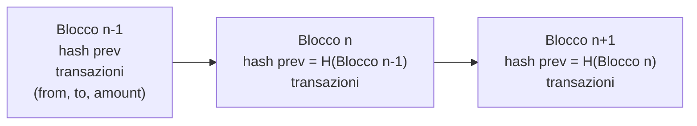
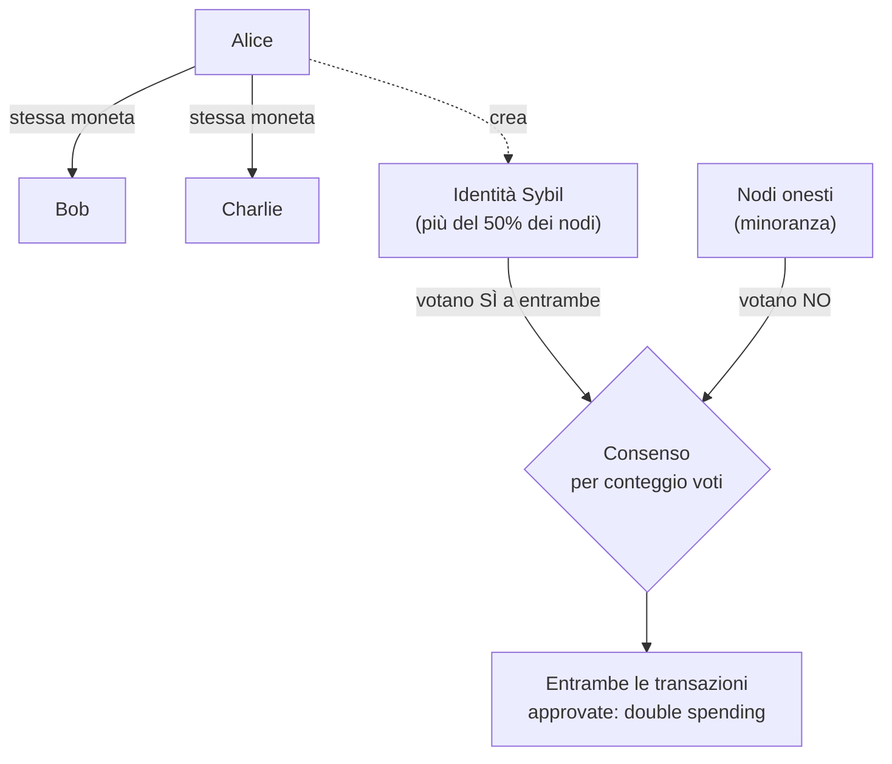
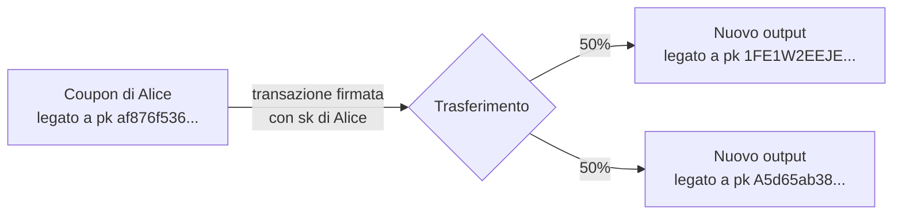
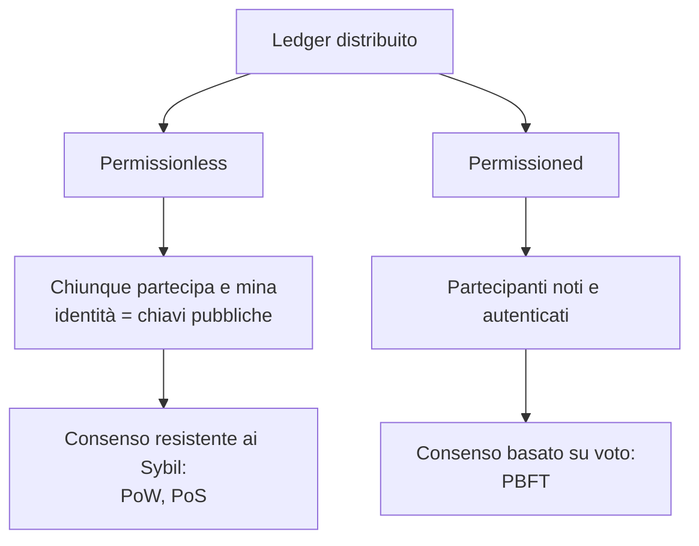

---
tags:
  - università/p2p-blockchain
  - blockchain
  - consenso
  - sybil-attack
data: 2026-03-03
lezione: "L07 - Introduzione alla Blockchain"
professore: "Laura Ricci"
---

# Introduzione alla Blockchain

Il corso non riguarda (solo) Bitcoin: riguarda le blockchain, studiate da una prospettiva **scientifica**. Come sottolinea la professoressa, "non dobbiamo vendere blockchain". Prima di tornare alle criptovalute, che restano comunque la *killer application* della tecnologia e saranno il tema della prossima lezione con l'ecosistema Bitcoin, questa lezione offre un'introduzione generale che va oltre le criptovalute: mostra altri casi d'uso della blockchain, introduce l'idea che esistano algoritmi di consenso diversi dal Proof of Work (ad esempio il **Proof of Stake** di Ethereum, attivo da settembre 2022), e fa vedere come gli strumenti crittografici visti finora (hash, firme digitali, hash pointer) vengano combinati per costruire una blockchain.

I concetti di base introdotti sono cinque: cos'è un **ledger** (registro), il **consenso** in un ambiente distribuito, la **tamper freeness** (resistenza alla manomissione), la **proof of ownership** (prova di proprietà), e la distinzione tra blockchain **permissioned** e **permissionless**.

---

## La blockchain in sintesi

> [!definition] Blockchain "at a glance"
>
> Una blockchain è un **ledger** (registro) che:
> - è **replicato** tra i nodi di una rete peer-to-peer;
> - è tale che **tutti i nodi hanno la stessa replica** del registro;
> - è **immutabile**, grazie alla proprietà di tamper freeness;
> - può fungere da **notaio**, certificando che un evento è avvenuto e in quale ordine.

Guardando dentro un blocco troviamo dei dati e un collegamento al blocco precedente. Nel caso delle criptovalute i dati sono **transazioni** che trasferiscono una somma di denaro tra due entità: ogni transazione ha, in forma semplificata, un mittente (*from*), un destinatario (*to*) e un importo (*amount*). Il collegamento tra i blocchi è realizzato con gli **hash pointer** visti nella lezione precedente: ogni blocco contiene l'hash del blocco che lo precede, e sono proprio gli hash pointer a creare la catena.

*Fig. — Blocchi collegati da hash pointer (le frecce indicano l'ordine temporale; ogni blocco contiene l'hash del precedente).*

### Tamper freeness

Se qualcuno modifica il contenuto di un blocco, il suo hash cambia, e quindi cambia l'hash pointer memorizzato nel blocco successivo, e con esso l'hash di quest'ultimo, e così via per tutti i blocchi seguenti. In una blockchain basata su PoW questo non significa soltanto ricalcolare alcuni hash: per ogni blocco modificato occorre **trovare un valore che, combinato con il nuovo hash, risolva di nuovo il Proof of Work**, un'operazione computazionalmente molto costosa. Altre blockchain possono usare meccanismi diversi per rendere costosa la riscrittura.

> [!tip] Intuizione chiave
>
> Gli hash pointer da soli rendono la manomissione **evidente** (chiunque può accorgersene), ma è il Proof of Work a renderla **costosa**: chi vuole riscrivere la storia deve rifare il lavoro computazionale di tutti i blocchi successivi a quello modificato.

---

## La prima astrazione: il ledger

Un **ledger** (libro mastro, registro) è come una bacheca su cui si registrano operazioni e che ne mantiene l'**ordine**. Quali proprietà deve avere un ledger?

- deve essere una **lista append-only** di eventi: si può solo aggiungere in fondo, non modificare o cancellare;
- deve essere **tamper-proof**, a prova di manomissione, così da garantire **auditability** (verificabilità a posteriori), come farebbe un notaio;
- **tutti devono concordare sul suo contenuto**: serve il **consenso**.

Il ledger non è necessariamente finanziario: qualunque applicazione che abbia bisogno di un log di eventi può usarlo.

### Un esempio: il registro condiviso di Alice

Alice ha un'azienda che fa da intermediaria tra grossisti (*wholesale*) e rivenditori al dettaglio (*retail*): i grossisti le inviano la merce e Alice la trasferisce ai rivenditori. Poiché serve centinaia di rivenditori e grossisti, è difficile per lei mantenere un registro consistente di tutte queste operazioni. Decide allora di **condividere il registro** con tutti loro: ognuno ne mantiene una copia e la aggiorna. Ma sorge subito il problema: **come si garantisce la consistenza** tra tutte queste copie?

### Il ledger come blockchain

Se il ledger è organizzato come una **lista di blocchi**, lo chiamiamo **blockchain**. Non è l'unica struttura possibile: esistono registri distribuiti organizzati come grafi, ad esempio **IOTA**. Per semplicità, in questa lezione supponiamo che ogni blocco contenga una sola operazione (cosa non vera in Bitcoin o Ethereum, dove un blocco contiene molte transazioni).

### Aggiungere voci al ledger

Il punto cruciale è: chi aggiunge una nuova voce? Il **consenso** è il meccanismo che stabilisce:

- **chi** decide quale operazione verrà aggiunta alla blockchain;
- **quale** operazione, tra quelle in attesa di conferma, verrà aggiunta.

---

## Il consenso

### Cos'è il consenso

Immaginiamo che ogni nodo della rete proponga un elemento da aggiungere al ledger. Il consenso è l'**accordo sullo stesso valore**: i nodi concordano su uno degli input proposti dai nodi. La proprietà di **validità** richiede che il valore concordato sia effettivamente la proposta di qualcuno. Il problema è che possono esistere nodi **guasti** o **malevoli**.

> [!definition] Consenso in una blockchain
>
> Un accordo tra i nodi di una rete distribuita sull'**ordine** e sulla **validità** delle informazioni memorizzate su un ledger condiviso e replicato.

### Perché serve il consenso

Nelle criptovalute la domanda fondamentale è: **chi impedisce a qualcuno di spendere due o più volte la stessa moneta digitale**, se non esiste un'autorità centrale? Il problema è serio perché i bit sono molto più facili da copiare della carta. Questo è il problema del **double spending** (doppia spesa).

Un primo approccio intuitivo è il voto: se la maggioranza dei nodi è onesta, voterà contro l'inserimento in un blocco di transazioni che costituiscono una doppia spesa. Come vedremo, però, questo semplice approccio **non funziona se la rete è sotto un Sybil attack**.

Il meccanismo che garantisce la tamper freeness, riassumendo, è: si calcola l'hash di ogni voce (blocco), si memorizza in ogni voce l'hash del predecessore; se una voce viene manomessa, bisogna ricalcolare l'hash di tutte le successive, e questo deve essere computazionalmente difficile, cosa che si ottiene includendo nell'hash del blocco la prova del Proof of Work. Questo abilita l'auditability.

### Protocolli di consenso

Negli ultimi anni è stata proposta una vera "giungla" di algoritmi di consenso: la "nuvola" che nel nostro schema rappresenta il consenso può essere implementata in molti modi diversi.

Il **consenso basato su voto** (*voting-based consensus*) è un processo decisionale decentralizzato in cui i nodi della rete si scambiano i risultati della verifica di un nuovo blocco o di una nuova transazione prima di prendere una decisione finale sulla sua validità. Si basa sul principio dell'**accordo di maggioranza**: la maggioranza determina la correttezza delle transazioni e l'ordine dei blocchi nella blockchain. Anche qui vale lo stesso limite: l'approccio **non funziona sotto Sybil attack**.

### Le sfide del consenso distribuito

Raggiungere il consenso in una rete distribuita presenta diverse sfide: mantenere la consistenza in presenza di *jitter*, ritardi di rete variabili e così via; ma soprattutto la sfida principale è che **alcune parti possono imbrogliare**: sono le cosiddette **parti bizantine** (*byzantine parties*), cioè nodi che possono comportarsi in modo arbitrario e malevolo.

Un risultato classico dei sistemi distribuiti dice che, se la **maggioranza è onesta**, il sistema funziona bene. Ma **quale nozione di maggioranza**? Assumiamo una maggioranza onesta, cioè di nodi che seguono correttamente il protocollo, e implementiamo il consenso tramite voto: ogni operazione viene diffusa in broadcast sulla rete e poi si raccolgono i voti. Come implementare il voto è un problema molto noto nei sistemi distribuiti. Il problema, come vedremo, è che in una rete aperta "contare i nodi" non ha senso.

---

## Il Sybil attack

### Origine del nome

Nell'antica Grecia le **Sibille** erano profetesse che profetizzavano sotto l'influenza divina: al momento della profezia era un dio a parlare attraverso le labbra della Sibilla, non la persona. Sono quindi una metafora dell'avere **più identità per la stessa persona** (sono raffigurate nel pavimento del Duomo di Siena). Nel 1973 Flora Rheta Schreiber pubblicò il libro *Sybil*, sulla storia di una donna con 16 personalità distinte, da cui il nome dell'attacco.

### Il Sybil attack nei sistemi P2P

> [!definition] Sybil attack
>
> Attacco in cui un singolo nodo fisico inietta nella rete **molteplici identità false** (le *sybil*), impersonando più identità logiche.

Nei sistemi P2P aperti iniettare identità false è facile: ad esempio basta registrarsi molte volte in una DHT. Il problema è come garantire che un singolo nodo non possa impersonare più identità logiche. Le identità multiple sono di solito il punto di partenza per ulteriori attacchi: attacchi alle DHT e attacchi alle blockchain.

Gli obiettivi potenziali di un Sybil attack sono:

- **routing attack**: controllare i percorsi dei messaggi;
- **controllare le repliche dei dati**;
- **interrompere la connettività** della rete;
- nel caso di decisioni a maggioranza, **diventare la maggioranza**: è il caso del consenso nelle criptovalute.

Le difese possibili sono:

- **Proof of Work**: richiedere potenza di calcolo (Bitcoin, e Ethereum fino al 2022);
- **Proof of Stake**: richiedere un deposito (*stake*) di valore;
- **Node-ID certificati**: richiedono però un'autorità centrale, quindi **non sono una soluzione peer-to-peer**.

> [!note] Nota
>
> Il Sybil attack è già stato incontrato nelle lezioni sulle DHT (attacchi al routing e all'assegnazione degli identificatori); qui viene ripreso nel contesto del consenso, dove il suo effetto è più dirompente.

### Double spending e Sybil

Vediamo come un Sybil attack permette il double spending in un sistema di consenso basato sul semplice conteggio dei voti.

1. Alice esegue un Sybil attack assumendo **più identità**, oltre il 50% dei nodi della rete. In un sistema aperto come Bitcoin creare identità è facile: un indirizzo è solo una coppia di chiavi.
2. Alice spende la **stessa moneta** due volte: una volta con Bob e una volta con Charlie.
3. Ogni operazione deve essere approvata dalla rete tramite consenso; Alice, con le sue identità multiple che costituiscono la maggioranza, approva **entrambe** le transazioni.
4. L'attacco ha successo: Bob e Charlie credono entrambi di essere stati pagati.

*Fig. — Double spending tramite Sybil attack in un consenso basato sul semplice conteggio dei voti.*

> [!warning] Chiesto all'esame
>
> *"Quali sono gli attacchi a Bitcoin? Se volesse fare un double spending attack, come lo farebbe?"* Questo è il primo tassello della risposta: il double spending è il problema fondamentale delle monete digitali, e un consenso basato sul conteggio delle identità è vulnerabile ai Sybil attack. Il double spending in Bitcoin (con il PoW) è trattato nella lezione sugli attacchi.

---

## Consenso nelle blockchain basate su PoW

### Cambiare la nozione di maggioranza

Come si definisce la maggioranza in un contesto in cui chiunque può entrare facilmente nella rete e assumere identità multiple? Se ci si limita a contare i voti, è facile controllare la maggioranza assumendo molte identità.

Si adotta allora un approccio diverso: si usa la **potenza di calcolo** dei nodi. Creare molte identità è inutile se si possiede un solo computer: per controllare il consenso serve la **maggioranza della potenza di calcolo** della rete, perché per "votare" bisogna risolvere un problema difficile.

### Proof of Work

Serve dunque un meccanismo, diverso dal semplice voto, che sia **difficile da falsificare**. Per partecipare al consenso bisogna risolvere un problema che richiede molta computazione: "falsificare" il voto non significa più generare molte identità, ma risolvere un problema complesso prima di poter prendere una decisione. Di conseguenza i Sybil attack diventano **costosi e inutili**.

> [!definition] Proof of Work come lotteria
>
> Il Proof of Work funziona come una **lotteria** per scegliere quale nodo deciderà il prossimo blocco:
> - i biglietti della lotteria sono molto costosi (per ottenerne uno bisogna risolvere il problema computazionale);
> - il vincitore della lotteria decide **unilateralmente** quale sarà il prossimo blocco;
> - il sistema fornisce **incentivi** per il buon comportamento (la ricompensa per il blocco).

Il risultato è un **ledger a prova di manomissione**: gli hash pointer rendono evidente ogni modifica, il PoW rende costoso riscrivere la storia e ostacola i Sybil attack, e il consenso garantisce che tutti concordino sul contenuto.

> [!tip] Intuizione chiave
>
> Il cambio di paradigma è da "una identità, un voto" (falsificabile) a "una unità di potenza di calcolo, un voto" (non falsificabile senza spendere risorse reali). Nel Proof of Stake la risorsa scarsa diventa invece il capitale depositato.

---

## Proof of ownership

Un ledger a prova di manomissione non basta: serve anche un modo per dimostrare **chi possiede cosa**.

### L'esempio del ristorante di Alice

Alice decide di aprire un ristorante, ma gli affitti sono alti e i venture capitalist sono avidi. Alice usa allora una **ICO** (*Initial Coin Offering*): propone un progetto che verrà implementato su una blockchain, ottiene finanziamenti da persone che desiderano partecipare al progetto e crea dei **token** da dare ai finanziatori come compenso. Nel suo caso i token sono **cryptocoupon**: buoni sconto sui pasti, utilizzabili quando il ristorante aprirà.

Alice usa un ledger per registrare i trasferimenti di token, ma le serve una soluzione per garantire la **proprietà** dei coupon: come può Alice dimostrare di possedere un coupon? Come può un finanziatore che vuole spendere un coupon dimostrare di averlo ricevuto e di possederlo ora? Non c'è alcuna **certification authority**, nessuna entità centralizzata che certifichi le identità. La soluzione è completamente decentralizzata e si basa sulla **crittografia asimmetrica**.

### Chiave pubblica e chiave privata

Alice genera una coppia **(chiave pubblica, chiave privata)**. Chiunque conosca la chiave privata corrispondente alla chiave pubblica di Alice possiede i cryptocoupon di Alice: Alice stessa, chiunque riceva da Alice la chiave privata, ma anche chiunque la rubi.

> [!definition] Proof of ownership
>
> - La **chiave pubblica identifica** il proprietario del coupon.
> - La **chiave privata conferisce la proprietà**: permette di rivendicarla **firmando** l'operazione di trasferimento.
> - Sul ledger si registrano le **transazioni firmate**, che chiunque (in particolare il destinatario) può verificare.

> [!warning] Attenzione
>
> La proprietà coincide con la **conoscenza della chiave privata**, non con l'identità della persona. Chi ruba la chiave privata diventa, a tutti gli effetti, il proprietario dei fondi: non esiste un'autorità a cui rivolgersi per recuperarli.

### Spendere i coupon

Alice decide di trasferire il 50% della proprietà di un coupon a ciascuno di due finanziatori diversi. Alice ha una chiave privata corrispondente alla chiave pubblica `af876f536...`; individua le chiavi pubbliche degli utenti a cui vuole trasferire il coupon (`1FE1W2EEJE...` e `A5d65ab38...`); **firma** il trasferimento, dimostrando di conoscere la chiave privata e quindi di essere autorizzata al trasferimento; trasferisce il 50% della proprietà a ciascuno dei due possessori delle chiavi private corrispondenti a quelle chiavi pubbliche. I due utenti useranno le loro chiavi private per riscuotere e usare la loro metà del coupon.

*Fig. — Il coupon di Alice viene "distrutto" e ne nascono due nuovi, ciascuno legato alla chiave pubblica di un destinatario.*

Si noti che in questo modello:

- **non esiste la nozione di conto, saldo, ecc.**, come in una banca; ci sono solo **trasferimenti di coupon**;
- la proprietà dei coupon è memorizzata nel ledger: un utente può ritrovare tutti i suoi coupon scorrendo il ledger;
- **spendere un coupon lo distrugge** (e ne crea di nuovi per i destinatari).

Questo porta al concetto di **UTXO** (*Unspent Transaction Output*, output di transazione non speso): una struttura che registra tutti i coupon posseduti da un utente e non ancora spesi.

> [!warning] Chiesto all'esame
>
> *"Cosa sono gli UTXO?"* è stata una domanda d'esame. Qui compare l'intuizione (un coupon non ancora speso, che viene distrutto quando si spende); la trattazione completa del modello UTXO di Bitcoin è nella lezione L08.

---

## Blockchain permissionless e permissioned

### Blockchain permissionless

I cryptocoupon di Alice vivono su una blockchain **permissionless** (senza permessi):

- **chiunque può partecipare**;
- **chiunque può essere un miner**;
- **non c'è un'autorità centrale**;
- il sistema si basa su **ricompense** (*reward*) che incentivano il comportamento corretto.

Questo modello può avere dei problemi: le **fork** della blockchain (biforcazioni della catena) e incidenti come il **DAO attack da 54 milioni di dollari**.

> [!note] Nota
>
> Il DAO attack (2016) fu un attacco a uno smart contract su Ethereum che sfruttava una vulnerabilità di *reentrancy* per sottrarre fondi; la comunità reagì con una hard fork, da cui nacque la separazione tra Ethereum ed Ethereum Classic. Le slide lo citano soltanto; fork e attacchi sono trattati nelle lezioni successive.

### Blockchain permissioned: la supply chain di Alice

Alice vende il ristorante e apre un'attività di frozen yogurt, ma il business va male: le spedizioni arrivano sciolte. Dov'è il problema? Lungo la **supply chain** (catena di fornitura) ci sono diversi attori: i trasportatori (Bob e Carol) e dei **sensori** che misurano ad esempio la temperatura durante il trasporto.

La soluzione è un **ledger distribuito** che registra gli eventi della catena di fornitura, in cui però l'accesso è **ristretto**: **solo gli attori coinvolti nel processo partecipano al consenso**. È una blockchain **permissioned** (con permessi).

In questo contesto si usa un **algoritmo di consenso diverso**, in effetti **basato sul voto**: il **PBFT** (*Practical Byzantine Fault Tolerance*). Il voto qui funziona perché siamo in un **ambiente controllato**, con pochi nodi che partecipano al consenso e con identità note, quindi il Sybil attack non è possibile.

> [!note] Nota
>
> Nelle slide l'acronimo PBFT è sciolto come "Practical Blockchain Fault Tolerance"; il nome corretto dell'algoritmo (Castro e Liskov, 1999) è **Practical Byzantine Fault Tolerance**.

### Cosa cambia in una blockchain permissioned

- Le parti **hanno identità**: gli umani hanno password e chiavi, i sensori hanno chiavi; sia umani sia sensori sono **autenticati**.
- Si usano **meccanismi di consenso diversi** (basati su voto, come il PBFT).
- C'è **accountability**: chi viene sorpreso a imbrogliare ne risponde, perché la sua identità è nota. È un approccio diverso al problema del Sybil attack: invece di renderlo costoso, lo si impedisce alla radice con l'autenticazione.

### Byzantine Fault Tolerance

Le slide dedicano una slide (solo grafica) alla **Byzantine Fault Tolerance** (BFT), cioè la capacità di un sistema distribuito di raggiungere il consenso anche in presenza di nodi bizantini, che possono comportarsi in modo arbitrario (mentire, inviare messaggi contraddittori a nodi diversi, tacere).

> [!note] Nota
>
> Il contenuto seguente non è nel testo delle slide ma è il risultato classico che la slide richiama: nel problema dei generali bizantini (Lamport, Shostak, Pease, 1982), con $f$ nodi bizantini il consenso è possibile solo se il numero totale di nodi è $n \geq 3f + 1$, cioè se meno di un terzo dei nodi è malevolo. PBFT raggiunge il consenso sotto questa ipotesi con uno scambio di messaggi in più fasi, con costo di comunicazione quadratico nel numero di nodi: per questo è adatto a reti piccole e permissioned, non a reti aperte con migliaia di nodi.

### Tipologie di blockchain

| Tipologia | Esempi |
|---|---|
| **Aperte e permissionless** | Bitcoin, Ethereum, Steemit, Algorand e molte altre |
| **Permission-based** | Hyperledger, Ethereum Quorum, Corda |

*Fig. — Le due famiglie di blockchain e i relativi meccanismi di consenso.*

---

> [!question] Possibili domande d'esame
>
> - Cos'è una blockchain? Quali proprietà deve avere un ledger e come le garantisce una blockchain?
> - Come si ottiene la tamper freeness in una blockchain? Qual è il ruolo degli hash pointer e quale quello del Proof of Work?
> - Cos'è il consenso e perché è necessario in una criptovaluta? Cos'è il problema del double spending?
> - Cos'è un Sybil attack? Quali sono i suoi obiettivi e le possibili difese nei sistemi P2P?
> - Perché un consenso basato sul semplice voto non funziona in una rete aperta? Come si potrebbe fare double spending con un Sybil attack, e come il PoW risolve il problema?
> - Come si dimostra la proprietà di un bene digitale senza un'autorità centrale? Qual è il ruolo di chiave pubblica e chiave privata?
> - Che differenza c'è tra blockchain permissionless e permissioned? Perché nelle permissioned si può usare un consenso basato sul voto come PBFT?

> [!abstract] Sintesi
>
> Una blockchain è un **ledger append-only, replicato e tamper-proof** su una rete P2P, su cui tutti concordano tramite **consenso**. Gli **hash pointer** rendono evidente ogni manomissione e il **Proof of Work** la rende costosa. Il consenso serve a evitare il **double spending**, ma un consenso basato sul conteggio delle identità è vulnerabile al **Sybil attack**: nelle reti aperte si passa quindi a "un voto per unità di potenza di calcolo" (PoW, una lotteria con biglietti costosi e incentivi) o di stake (PoS). La **proof of ownership** si ottiene con la crittografia asimmetrica: la chiave pubblica identifica il proprietario, la chiave privata consente di firmare i trasferimenti; spendere un coupon lo distrugge, da cui il concetto di **UTXO**. Le blockchain **permissionless** (Bitcoin, Ethereum) sono aperte a tutti; quelle **permissioned** (Hyperledger, Quorum, Corda) hanno partecipanti autenticati e usano consenso basato su voto come il **PBFT**.
