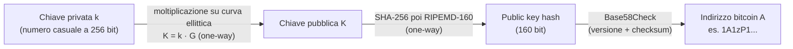
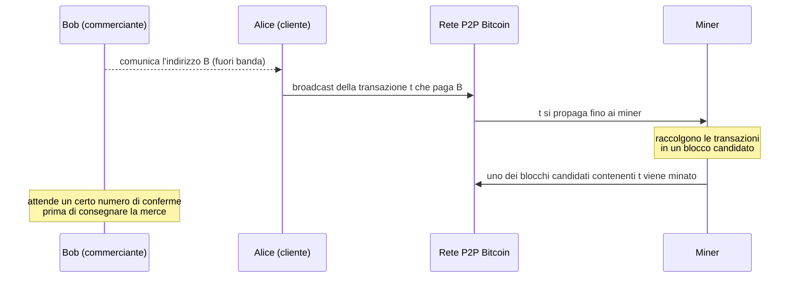
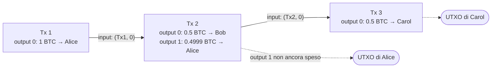
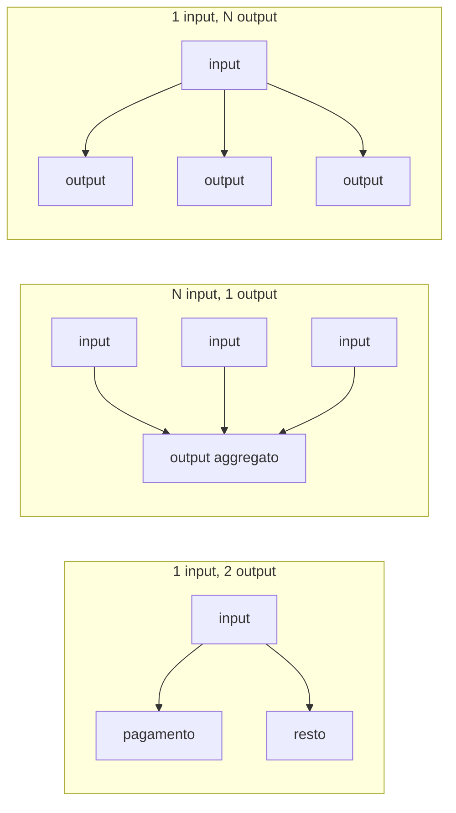
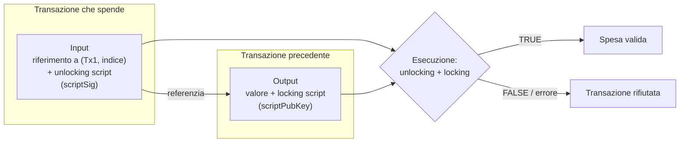
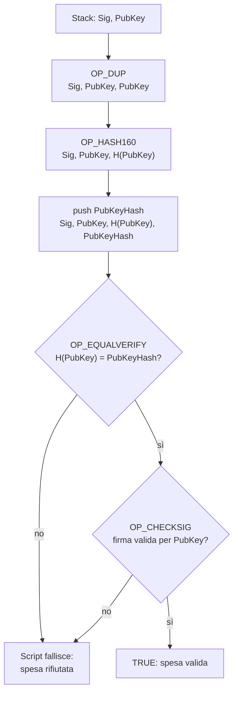
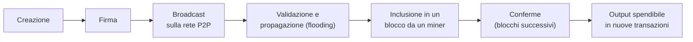

---
tags:
  - università/p2p-blockchain
  - bitcoin
  - transazioni
  - utxo
  - bitcoin-script
data: 2026-03-05
lezione: "L08 - Bitcoin: Transazioni e Script"
professore: "Laura Ricci"
---

# Bitcoin: Transazioni e Script

Con questa lezione si entra nel cuore di Bitcoin. La lezione ha due anime: una prima parte storica e di contesto (da dove nasce l'idea di moneta elettronica, chi è Satoshi Nakamoto, perché Bitcoin è sopravvissuto a scandali e crisi) e una seconda parte tecnica, che è quella più importante per l'esame: come si rappresentano le **identità** in un sistema senza autorità centrale, com'è fatta una **transazione**, cos'è il modello **UTXO**, come funzionano gli **script** che bloccano e sbloccano i bitcoin e qual è il **ciclo di vita** di una transazione fino al momento in cui serve il consenso.

Bitcoin è difficile da capire perché si trova all'incrocio di molte discipline, non solo l'informatica: non è soltanto una tecnologia, ma piuttosto un **cambio di paradigma culturale**, con rilevanti implicazioni legali, politiche e sociali.

---

## Prima di Bitcoin: l'idea di e-cash

### Moneta elettronica affidabile

L'idea di una moneta elettronica viene molto prima di Bitcoin. Nel 1999 l'economista **Milton Friedman** (premio Nobel per l'economia nel 1976, Scuola di Chicago) diceva:

> "L'unica cosa che manca, ma che sarà presto sviluppata, è un e-cash affidabile, un metodo con cui su Internet si possano trasferire fondi da A a B, senza che A conosca B o B conosca A, nel modo in cui io posso prendere una banconota da 20 dollari e dartela."

Un tentativo precedente di sistema digitale per trasferire fondi in modo anonimo in rete è **e-Cash**, proposto da **David Chaum** all'inizio degli anni '80 (professore a Berkeley, considerato il vero padrino del movimento cyberpunk), basato sulle **blind signatures** (firme cieche).

### Il meccanismo delle blind signatures

Il funzionamento di e-Cash è il seguente:

1. l'utente genera una **moneta**, cioè un token casuale unico;
2. l'utente "acceca" (*blinds*) la moneta e la invia alla banca perché la firmi;
3. la banca **non può vedere il token reale** perché è accecato (è questo il senso della firma cieca);
4. la banca firma la moneta accecata se l'utente ha fondi sufficienti (e li addebita);
5. l'utente "scopre" (*unblinds*) la moneta, ottenendo una moneta firmata valida che può essere spesa **in modo anonimo**.

A questo punto la banca sa di aver firmato una moneta, ma **non sa quale**: quando la moneta verrà spesa, la banca non potrà collegarla all'utente che l'ha ritirata.

### Il problema del double spending

Il controllo della banca sui fondi disponibili **non impedisce il double spending**: l'utente può inviare la stessa moneta (che è solo una stringa di bit, copiabile a piacere) a due commercianti diversi.

Il meccanismo per prevenire la doppia spesa, quando l'utente spende la moneta presso un commerciante, è:

- il commerciante sottopone la moneta alla banca per la verifica;
- la banca controlla il suo database di monete già spese;
- se la moneta è nuova, approva la transazione;
- se la moneta è già stata spesa, la rifiuta.

Questo previene il double spending perché la banca mantiene un registro di tutte le monete spese. **Ma serve ancora la banca!** La banca resta un'autorità centrale fidata che deve essere interpellata a ogni pagamento.

> [!tip] Intuizione chiave
>
> Il registro delle monete spese tenuto dalla banca di Chaum è esattamente il ruolo che in Bitcoin svolge la **blockchain**: un registro pubblico delle spese, mantenuto però da una rete peer-to-peer tramite consenso invece che da un'autorità centrale.

### Le proprietà richieste all'e-cash

La sfida è che il contante elettronico deve conservare gli attributi fisici del contante:

- **infalsificabile** (*unforgeable*): in particolare, niente double spending;
- **non tracciabile** (*untraceable*): *pecunia non olet*, il denaro non porta traccia di chi lo ha usato.

---

## La nascita di Bitcoin

### Satoshi Nakamoto

Questa era la situazione fino al 2008. Poi, sotto lo pseudonimo **Satoshi Nakamoto**, qualcuno pubblica il paper nell'**ottobre 2008**, rilascia il codice nel **gennaio 2009** e interrompe ogni interazione a **metà 2010**.

L'annuncio, inviato il 31 ottobre 2008 sulla mailing list di crittografia, recitava: *"Ho lavorato a un nuovo sistema di contante elettronico completamente peer-to-peer, senza terza parte fidata"*, ed elencava le proprietà principali:

- il **double spending è prevenuto con una rete peer-to-peer**;
- **nessuna zecca** o altra parte fidata;
- i partecipanti possono essere **anonimi**;
- le nuove monete sono create con un **proof-of-work in stile Hashcash**;
- il proof-of-work per la generazione di nuove monete alimenta anche la rete per prevenire il double spending.

Il titolo del paper è *Bitcoin: A Peer-to-Peer Electronic Cash System*.

### Timeline

| Data | Evento |
|---|---|
| 18/08/2008 | Registrazione del dominio bitcoin.org |
| 31/10/2008 | Pubblicazione del paper di Bitcoin |
| 09/11/2008 | Progetto Bitcoin registrato su sourceforge.net |
| 03/01/2009 | **Genesis block**, alle 18:15:05 GMT |
| 09/01/2009 | Rilascio di Bitcoin v0.1, annunciato sulla mailing list di crittografia |
| 12/01/2009 | Prima transazione (blocco 170), da Satoshi a **Hal Finney** |

### La "pizza transaction"

Nel **maggio 2010** avviene il primo acquisto noto di beni reali in bitcoin. **Laszlo Hanyecz**, dalla Florida, offrì sul forum Bitcointalk **10.000 BTC** (che aveva ricevuto come ricompensa di mining) a chi gli avesse consegnato "un paio di pizze". La richiesta fu soddisfatta da un utente della West Coast, che ricevette 10.000 BTC (oggi una somma enorme) in cambio di pizze per un valore di 25 dollari.

---

## Cos'è Bitcoin

Bitcoin è una versione puramente peer-to-peer di "contante digitale": **nessuna autorità di controllo**, nessun server, nessuna banca come in e-Cash. Le sue caratteristiche dichiarate sono:

- **permissionless**: nessun regolatore;
- **transazioni anonime** (più precisamente pseudo-anonime, come vedremo);
- **resistente alla censura**: nessun fondo può essere congelato;
- **gratuito**: costi di transazione trascurabili (almeno nei primi anni);
- **senza confini** (*borderless*): nessun limite geografico;
- **transnazionale**: non appartiene a nessun paese;
- **cross-giurisdizionale**: non si applica una giurisdizione specifica;
- l'impostazione predefinita è il **sospetto**, in un ambiente completamente non fidato;
- soprattutto, è **una soluzione al double spending**, il problema fondamentale che doveva essere risolto perché una moneta digitale potesse crescere legittimamente.

### Pagamenti senza intermediari

| Problemi degli approcci precedenti | Bitcoin |
|---|---|
| Serve un **server fidato**, un'istituzione finanziaria | **Apertura**: basta un client Bitcoin; niente conto bancario né carta di credito; le transazioni non passano da una terza parte; nessuna entità centralizzata controlla l'offerta di moneta |
| **Nessun anonimato** | **Pseudo-anonimato**: transazioni senza rivelare l'identità, come "pagare in contanti"; gli indirizzi sono pseudonimi |
| **Commissioni alte** | Commissioni basse (nei primi anni) |

### Bitcoin come protocollo e come valuta

Conviene distinguere due usi della parola: **Bitcoin** (maiuscolo) indica il protocollo, il software e la comunità; **bitcoin** (minuscolo) indica le unità della valuta. I bitcoin sono inviati usando il protocollo Bitcoin e sono l'**asset digitale nativo** intrinseco al protocollo.

---

## Sedici anni di Bitcoin: scandali e resilienza

### Il fallimento di Mt Gox

A gennaio 2014 **Mt Gox** (*Magic the Gathering Online eXchange*) era il più grande exchange USD/Bitcoin al mondo. A febbraio 2014 ha chiesto la protezione fallimentare: circa **850.000 bitcoin** appartenenti ai clienti e alla società risultavano mancanti e probabilmente rubati, per un valore di oltre 450 milioni di dollari all'epoca. Frode o furto? Probabilmente la causa fu una vulnerabilità del protocollo, il **malleability attack**, che vedremo nelle prossime lezioni.

> [!warning] Chiesto all'esame
>
> *"Cos'è il malleability attack?"* è una domanda che è stata posta all'orale, e in un altro caso la professoressa ha chiesto di approfondirlo quando lo studente lo ha nominato. Qui compare solo come causa probabile del caso Mt Gox; la trattazione è nelle lezioni successive (attacchi, SegWit).

### Silk Road

Tra il 2011 e il 2013 Bitcoin divenne popolare per l'acquisto di beni illegali. **Silk Road** era un mercato online del dark web, operante come servizio nascosto su Tor, dove gli utenti potevano comprare beni illeciti (droghe, pornografia) usando bitcoin, navigando in modo anonimo e senza possibilità di monitoraggio del traffico. Lanciato nel febbraio 2011 e chiuso nell'ottobre 2013, il suo presunto proprietario **Ross William Ulbricht** è stato condannato all'ergastolo. Altri mercati neri ne hanno preso il posto.

### Ransomware

Le slide citano anche i **ransomware**, malware che cifrano i dati della vittima e chiedono un riscatto, tipicamente in bitcoin.

### Perché Bitcoin è ancora vivo

Esiste qualcos'altro nel mondo finanziario che, pur avendo appena 17 anni, senza sostegno di governi o aziende, con una frode o un furto nel suo exchange di riferimento (Mt Gox) e con una pessima reputazione (Silk Road, riciclaggio, terrorismo, ransomware), sia ancora vivo e vegeto? Solo Bitcoin. Le ragioni della sua popolarità sono diverse:

- **ideologiche**: cripto-anarchia (nessuno controlla il denaro) e movimento cyberpunk;
- **buon tempismo** con la crisi finanziaria del 2008: in Bitcoin non si stampa moneta, ed è stato definito un "figlio della crisi";
- **Bitcoin come oro digitale**: l'offerta è controllata e imposta dal protocollo, nessuno può intervenire sulla quantità di moneta, ed è sicuro;
- **Bitcoin come asset di investimento**: alcuni suggeriscono di investire in Bitcoin fino al 5% del portafoglio;
- la presenza di **exchange**, luoghi dove i bitcoin vengono scambiati con valute fiat: Mt Gox ha chiuso nel febbraio 2014, ma ne sono nati altri più affidabili (CoinDesk, BPI, Bitstamp, Bitfinex, Coinbase, itBit, OKCoin);
- **pagamenti economici**: per lungo tempo quasi senza commissioni (contro il 2-10% di PayPal);
- la nascita di **mercati regolamentati** per Bitcoin e di centinaia di altre criptovalute e token.

Dal punto di vista della percezione, l'assenza di un'autorità centrale che difenda dalle classiche minacce alla sicurezza fa sì che, come per il contante, la criptovaluta possa essere sfruttata per scopi illeciti. Le slide mostrano infine l'andamento fortemente oscillante del prezzo di Bitcoin nel corso degli anni.

### Cosa vedremo

Il percorso su Bitcoin nelle prossime lezioni tocca: la gestione delle identità, le transazioni, gli script, la blockchain, il consenso (miner e mining pool) e gli attacchi (double spending e altri). Questa lezione copre i primi tre punti.

---

## Gestione decentralizzata delle identità

### Identità come coppie di chiavi

Se voglio inviare bitcoin a qualcuno, il primo problema è: **come si rappresentano le identità** in un sistema completamente decentralizzato come Bitcoin, senza un'autorità di certificazione centralizzata?

Un modo semplice di generare nuove identità in un sistema crittografico è **creare una nuova coppia di chiavi casuale**:

- $sk$, la chiave privata (*secret key*);
- $pk$, la chiave pubblica, che "sembra casuale": nessuno ha bisogno di sapere chi sei.

La chiave pubblica $pk$ è il "nome" pubblico di un utente: "parla per conto" dell'identità dell'utente. Più spesso si usa $\text{Hash}(pk)$. Solo il proprietario di $sk$ può controllare l'identità: se su una transazione vedi una firma $sig$ tale che $\text{verify}(pk, data, sig) = \text{true}$, puoi pensare che sia stato $pk$ a generare la transazione.

### ECDSA

Bitcoin usa l'**ECDSA** (*Elliptic Curve Digital Signature Algorithm*) sulla curva **secp256k1**:

- per **firmare** le transazioni con la chiave privata;
- per **verificare** la firma delle transazioni con la chiave pubblica corrispondente.

> [!warning] Attenzione
>
> **In Bitcoin nulla è cifrato!** Le chiavi sono usate solo per **provare la proprietà** (firme digitali), non per cifrare. Tutto è pubblico sulla blockchain di Bitcoin. Per ottenere privacy si possono usare tecniche di Zero Knowledge, ma non fanno parte del protocollo base.

### Chiavi e indirizzi

La generazione di un indirizzo parte dalla chiave privata e procede tramite funzioni one-way:

- la **chiave privata** $k$ è un numero, di solito scelto a caso. Il controllo sulla chiave privata è fondamentale: chi la controlla controlla tutti i fondi associati all'indirizzo bitcoin corrispondente;
- dalla chiave privata si genera la **chiave pubblica** $K$ tramite **moltiplicazione su curva ellittica**, una funzione crittografica one-way;
- da $K$ si genera l'**indirizzo bitcoin** $A$ tramite un **hash crittografico** one-way.


*Fig. — Dalla chiave privata all'indirizzo: ogni passaggio è one-way, quindi dall'indirizzo non si risale alla chiave pubblica né da questa alla privata.*

> [!note] Nota
>
> La figura con i dettagli della generazione degli indirizzi è un'immagine nelle slide. I passaggi riportati sono quelli standard per un indirizzo P2PKH: $\text{PKH} = \text{RIPEMD160}(\text{SHA256}(K))$; si antepone un byte di versione (`0x00` per la rete principale, da cui gli indirizzi che iniziano con "1"), si calcola un checksum come i primi 4 byte di $\text{SHA256}(\text{SHA256}(\cdot))$, e si codifica il tutto in Base58 (**Base58Check**). $G$ è il punto generatore della curva secp256k1. È coerente con quanto detto nella lezione precedente sull'uso di SHA-256 e RIPEMD-160 in Bitcoin.

### Codifica Base58

Perché proprio base 58? Perché 58 è il numero di caratteri che restano prendendo l'alfabeto alfanumerico (62 caratteri: 10 cifre, 26 maiuscole, 26 minuscole) e rimuovendo i caratteri facilmente confondibili: `0` (zero), `O` (o maiuscola), `l` (elle minuscola), `I` (i maiuscola), che in alcuni font appaiono identici. I vantaggi sono:

- un insieme ampio di caratteri permette di rappresentare numeri grandi in un formato più corto;
- l'esclusione dei caratteri ambigui evita errori all'utente quando trascrive un indirizzo.

### Riepilogo sugli indirizzi e privacy

Le identità in Bitcoin sono chiamate **indirizzi** (*addresses*) e nella maggior parte dei casi rappresentano il proprietario di una coppia di chiavi privata/pubblica e sono generati a partire dalla chiave pubblica. Non in tutti i casi però: **un indirizzo può anche rappresentare uno script** (lo vedremo con P2SH).

**Chiunque può creare una nuova identità in qualunque momento**, e quante ne vuole. Un indirizzo si usa come il nome del beneficiario su un assegno: "pagate all'ordine di xxx".

Per quanto riguarda la privacy, gli indirizzi (chiavi pubbliche) non sono direttamente collegati a identità del mondo reale, ma un osservatore può collegare tra loro le attività di un indirizzo nel tempo e fare inferenze. Si parla quindi di **pseudo-anonimato**: si è anonimi finché qualcuno non riesce a collegare uno pseudonimo a una persona.

> [!tip] Intuizione chiave
>
> Il fatto che creare identità sia gratuito e illimitato è ciò che rende Bitcoin vulnerabile ai Sybil attack se il consenso si basasse sul voto per identità (lezione L07), ed è il motivo per cui Bitcoin usa il Proof of Work.

---

## Il flusso di un pagamento

Il flusso generale di un pagamento in Bitcoin è il seguente:


*Fig. — Il flusso di un pagamento Bitcoin, dall'indirizzo del commerciante alle conferme.*

Il commerciante Bob condivide il suo indirizzo $B$ **fuori banda** (*out of band*), cioè non attraverso la rete P2P di Bitcoin (ad esempio tramite un QR code o una mail). La cliente Alice genera una transazione $t$ che paga $B$ e la diffonde in broadcast sulla rete P2P. I miner raccolgono le transazioni diffuse in un **blocco candidato**, e prima o poi uno dei blocchi candidati che contengono $t$ viene minato. Il commerciante attende un certo numero di **conferme** su $t$ prima di consegnare la merce.

---

## Transazioni

### Una transazione semplificata

In forma semplificata una transazione ha degli **input** (da dove prende i fondi) e degli **output** (a chi li assegna). La differenza tra la somma degli input e la somma degli output è la **transaction fee** (commissione):

$$
\text{fee} = \sum \text{input} - \sum \text{output}
$$

La fee:

- è un importo **opzionale**;
- è **incassata dalle entità che validano la transazione**, cioè i miner;
- è una **buona pratica** per ridurre il tempo di validazione della transazione, perché i miner tendono a includere per prime le transazioni con fee più alta.

### Da dove vengono gli input: la catena di proprietà

Alice riceve dei bitcoin come **output di una transazione**, su uno dei suoi indirizzi; in seguito può usare quei bitcoin come **input di una nuova transazione**. Le transazioni sono quindi **collegate tra loro** e formano una **catena di proprietà** (*chain of ownership*): i valori si spostano da indirizzo a indirizzo attraverso le transazioni. Tutte le transazioni sono registrate nei blocchi della blockchain.


*Fig. — Catena di proprietà: ogni input punta a un output di una transazione precedente; gli output non ancora referenziati sono UTXO.*

### Il modello UTXO

> [!definition] UTXO (Unspent Transaction Output)
>
> Un **UTXO** è un output di una transazione che **non è ancora stato speso**, cioè non è ancora referenziato dall'input di alcuna transazione successiva.
> - Ogni **input** di una transazione è collegato a (fa riferimento a) un UTXO di una transazione precedente.
> - Ogni **output** di una transazione genera un nuovo UTXO, disponibile per essere speso e incluso nel wallet dell'utente.
> - Un UTXO viene **speso** (e smette di essere un UTXO) quando è collegato all'input di una transazione successiva.

Il **saldo** di un utente è la **somma di tutti i suoi UTXO**.

> [!warning] Chiesto all'esame
>
> *"Cosa sono gli UTXO?"* è una domanda d'esame reale. Una buona risposta spiega: output non speso, input che referenziano output precedenti tramite (hash della transazione, indice dell'output), il fatto che un UTXO si spende per intero (da cui il resto), che in Bitcoin **non esiste un saldo memorizzato** ma solo UTXO sparsi, e il ruolo della cache UTXO nella validazione.

### Esempio: Alice invia 0.5 BTC a Bob

Alice e Bob hanno ciascuno un **wallet**, che contiene una lista di chiavi private e pubbliche; gli indirizzi sono hash delle chiavi pubbliche. Gli input specificano l'importo da inserire nella transazione, preso da uno degli indirizzi del wallet; Alice può decidere come distribuire il valore preso dagli input tra gli output.

> [!example] Esempio: pagamento con resto
>
> Supponiamo che Alice possieda un UTXO da 1 BTC e voglia pagare 0.5 BTC a Bob. La transazione ha:
> - **input**: il riferimento all'UTXO da 1 BTC di Alice, con la firma di Alice;
> - **output 0**: 0.5 BTC all'indirizzo di Bob;
> - **output 1**: 0.4999 BTC a un indirizzo di Alice (il **resto**, *change*).
>
> La fee è $1 - (0.5 + 0.4999) = 0.0001$ BTC e va al miner che include la transazione in un blocco. Dopo la conferma, l'UTXO da 1 BTC è speso e ne esistono due nuovi: 0.5 BTC di Bob e 0.4999 BTC di Alice.

> [!note] Nota
>
> I valori precisi dell'esempio nelle slide sono in un'immagine; quelli riportati sopra sono illustrativi. La struttura (input dal wallet di Alice, output verso Bob, resto ad Alice, fee implicita) è quella descritta nelle slide.

### Forme di transazione

#### Un input, due output

È la forma più comune: "prendi il denaro e dallo al venditore, c'è un resto che torna a te". L'input prende il denaro da un indirizzo del wallet di Alice; un output va a Bob, l'altro è il **resto** (*change*), restituito allo stesso indirizzo di Alice o a un altro suo indirizzo.

> [!warning] Attenzione
>
> **L'input deve essere consumato interamente**: non si può "dividere" un input lasciandone una parte sull'indirizzo di partenza. Se l'UTXO vale più di quanto si vuole pagare, la differenza va esplicitamente inserita in un output di resto; altrimenti diventa fee per il miner.

#### Più input, un output (merging funds)

È l'equivalente di cambiare un mucchio di monete con una singola banconota più grande: si aggregano più input in un unico output. Serve a "fare pulizia" di tanti piccoli importi ricevuti come resto di pagamenti, generati dalle applicazioni wallet. Questi piccoli importi sono il bersaglio del **dusting attack**. Questa forma è usata anche per i **pagamenti congiunti** (transazioni multisignature).

> [!note] Nota
>
> Nel *dusting attack* un attaccante invia quantità minuscole di bitcoin (*dust*) a molti indirizzi; quando il wallet della vittima le aggrega con altri UTXO in una transazione a più input, l'attaccante può collegare tra loro indirizzi della stessa persona, riducendone la privacy. Le slide si limitano a nominarlo.

#### Un input, più output (distributing funds)

Transazioni che distribuiscono il valore dell'input tra più destinatari, ad esempio per il pagamento degli stipendi a più dipendenti.


*Fig. — Le tre forme tipiche di transazione.*

---

## Script: gli output sono programmabili

### Cos'è uno script

Una transazione Bitcoin contiene più che semplici valori: **ogni transazione contiene degli script**. Uno **script** è un piccolo programma scritto in un linguaggio di programmazione semplice, usato principalmente per **verificare la proprietà delle monete trasferite**. Il linguaggio **non è Turing completo**, e la limitazione è **intenzionale**: serve a prevenire cicli infiniti ed errori di esecuzione.

### Locking e unlocking

L'idea è che gli output delle transazioni siano **programmabili**. Supponiamo che un indirizzo $A_1$ invii bitcoin a un indirizzo $A_2$:

- $A_1$ ha dei bitcoin bloccati, memorizzati in uno dei suoi UTXO, che vuole spendere;
- $A_1$ mette un piccolo pezzo di codice (**locking script**) "sopra" i bitcoin inviati, per bloccarli;
- quando $A_2$ vorrà spendere i bitcoin ricevuti dovrà sbloccarli, fornendo un altro piccolo pezzo di codice (**unlocking script**);
- il codice di sblocco viene eseguito insieme al codice di blocco, e se l'esecuzione ha successo $A_2$ può spendere i bitcoin.

Con la semplificazione di usare chiavi pubbliche al posto degli indirizzi: $B$ comunica la propria chiave pubblica ad $A$; $A$ sblocca alcuni suoi bitcoin, che erano stati bloccati da una transazione precedente, e crea un blocco sui bitcoin inviati a $B$, legato alla chiave pubblica di $B$. Solo $B$ potrà sbloccare i bitcoin ricevuti, usando la propria chiave privata. Nelle figure delle slide: **verde** = chiave pubblica (lock), **rosso** = firma (unlock); il locking script si riferisce al verde, l'unlocking al rosso.


*Fig. — Il locking script sta nell'output della transazione che crea l'UTXO; l'unlocking script sta nell'input della transazione che lo spende.*

> [!note] Nota
>
> I nomi tecnici `scriptPubKey` (locking script) e `scriptSig` (unlocking script) sono quelli usati nel codice di Bitcoin e nei JSON delle transazioni; nelle slide compaiono come "locking script" e "unlocking script".

### Una transazione reale: i metadati JSON

Le slide mostrano una transazione reale in formato JSON. I campi principali sono:

- **hash** (o *txid*): l'hash dell'intera transazione, che ne costituisce l'**identificatore univoco**;
- **version**: permette interpretazioni diverse di alcuni campi;
- **locktime**: definisce il momento **più vicino nel tempo** in cui la transazione può essere aggiunta alla blockchain. Nella maggior parte delle transazioni vale 0, a indicare l'esecuzione immediata; è usato negli **escrow** e nella **Lightning Network** (un canale di pagamento).

Gli **input** (`vin`) sono un array JSON in cui ogni elemento contiene:

- un **hash pointer a una transazione precedente** e l'**indice dell'output** di quella transazione da spendere;
- un **unlocking script**.

Gli **output** (`vout`) sono un array JSON in cui ogni elemento contiene:

- il **valore** da trasferire con quell'output;
- un **locking script** contenente l'indirizzo a cui il valore deve essere trasferito.

```json
{
  "hash": "7c4025...",
  "ver": 1,
  "vin_sz": 1,
  "vout_sz": 2,
  "lock_time": 0,
  "in": [
    {
      "prev_out": { "hash": "2007ae...", "n": 0 },
      "scriptSig": "3045...01 04b0bd..."
    }
  ],
  "out": [
    { "value": "0.3190", "scriptPubKey": "OP_DUP OP_HASH160 45b21c... OP_EQUALVERIFY OP_CHECKSIG" },
    { "value": "0.0010", "scriptPubKey": "OP_DUP OP_HASH160 7f9b1a... OP_EQUALVERIFY OP_CHECKSIG" }
  ]
}
```
*Fig. — Schema (valori abbreviati e illustrativi) della struttura JSON di una transazione: metadati, input con riferimento all'output precedente e unlocking script, output con valore e locking script.*

> [!warning] Chiesto all'esame
>
> *"Bitcoin: cos'è un escrow?"* è stata una domanda d'esame. Qui l'escrow compare come caso d'uso del locktime e tra gli "script più complessi". In sintesi, un escrow è un pagamento in cui i fondi vengono bloccati in modo che possano essere sbloccati solo con l'accordo di più parti (tipicamente acquirente, venditore e un arbitro, con uno script multisig 2-di-3), eventualmente con un meccanismo temporale di rimborso. La trattazione completa è nella lezione su Multisig e P2SH.

### Coinbase transaction

Una **coinbase transaction** è una transazione speciale con **zero input** e solo output:

- trasferisce **bitcoin freschi**, generati dal sistema;
- è generata per **ricompensare i miner** per aver risolto il Proof of Work;
- trasferisce la ricompensa a uno degli indirizzi del miner.

È l'unico modo in cui nuovi bitcoin entrano in circolazione, ed è la prima transazione di ogni blocco.

> [!note] Nota
>
> Tecnicamente la coinbase ha un input "fittizio" che non referenzia alcun output precedente (e il cui campo script può contenere dati arbitrari); dal punto di vista logico ha zero input reali, come dicono le slide.

---

## Il linguaggio di scripting di Bitcoin

### Obiettivi di progetto

Il linguaggio di scripting di Bitcoin è **simile a FORTH**:

- **basato su stack**;
- **volutamente non Turing completo**;
- **senza cicli**.

Perché non Turing completo? Perché così non è possibile creare cicli infiniti, e questo **aumenta la sicurezza**. Tutti i **full node** di Bitcoin (miner e full node, non i client mobili) devono validare questi script, e non devono cadere in un ciclo infinito: si impedisce così che il meccanismo di validazione delle transazioni venga sfruttato come vulnerabilità (ad esempio per un attacco di tipo denial of service, inviando transazioni con script che non terminano). Inoltre il linguaggio è eseguibile su un'ampia gamma di hardware.

Altre caratteristiche di progetto:

- **stateless**: non c'è uno stato prima dell'esecuzione dello script né uno stato salvato dopo. Tutte le informazioni necessarie per eseguire uno script sono contenute nello script stesso. È una **differenza importante rispetto a Ethereum**, dove i contratti hanno uno stato persistente;
- **deterministico**: uno script si esegue in modo prevedibile e identico su qualunque sistema (tutti i nodi devono arrivare allo stesso verdetto sulla validità);
- **semplice e compatto**: gli **opcode sono di un byte**, quindi al massimo 256 istruzioni. Comprendono aritmetica di base, logica di base (IF...THEN...ELSE) e istruzioni speciali per la crittografia: **hash**, **verifica di firme** e **verifica di firme multiple** (multisignature).

> [!tip] Intuizione chiave
>
> Il linguaggio Script è progettato per rispondere a una sola domanda: "chi sta cercando di spendere questi bitcoin ne ha il diritto?". Non serve a fare calcoli generali, e proprio per questo può permettersi di essere limitato, e quindi sicuro e verificabile da tutti.

### Esecuzione basata su stack

Uno script è una sequenza di **dati** e **opcode** letti da sinistra a destra:

- quando si incontra un **dato** (una firma, una chiave pubblica, un hash), lo si **inserisce in cima allo stack** (*push*);
- quando si incontra un **opcode**, lo si esegue: preleva (*pop*) i suoi operandi dalla cima dello stack e vi inserisce il risultato.

Per validare una spesa si esegue prima l'**unlocking script** (dell'input) e poi il **locking script** (dell'output referenziato), sullo stesso stack. La spesa è valida se l'esecuzione termina senza errori e in cima allo stack resta il valore **TRUE**.

### Tipi di script

Uno script è un pezzo di codice che verifica un insieme di condizioni arbitrarie che devono essere soddisfatte per spendere le monete. I tipi di script sono:

- la maggior parte sono **semplici verifiche di firma**: si riscatta una transazione precedente firmandola, cioè fornendo una firma corrispondente alla chiave pubblica;
- **MultiSig**: servono più firme;
- **Pay-to-Script-Hash** (P2SH);
- **proof-of-burn**: bitcoin resi intenzionalmente non spendibili.

Script più complessi codificano condizioni di spesa più complesse: **escrow transactions**, **green addresses**, **micropagamenti**. Questi casi saranno trattati nelle prossime lezioni.

### Istruzioni

Le slide riportano una tabella di istruzioni del linguaggio. Di particolare interesse sono le istruzioni crittografiche per:

- la verifica di firme (multiple): `OP_CHECKSIG`, `OP_CHECKMULTISIG`, ...;
- il **locktime**: `OP_CHECKLOCKTIMEVERIFY`, `OP_CHECKSEQUENCEVERIFY`.

| Opcode | Effetto |
|---|---|
| `OP_DUP` | duplica l'elemento in cima allo stack |
| `OP_HASH160` | sostituisce la cima con $\text{RIPEMD160}(\text{SHA256}(\cdot))$ |
| `OP_EQUAL` | confronta i due elementi in cima, inserisce TRUE/FALSE |
| `OP_EQUALVERIFY` | come `OP_EQUAL`, ma se falso interrompe lo script con errore |
| `OP_CHECKSIG` | preleva chiave pubblica e firma, verifica la firma sulla transazione, inserisce TRUE/FALSE |
| `OP_CHECKMULTISIG` | verifica $m$ firme su $n$ chiavi pubbliche |
| `OP_CHECKLOCKTIMEVERIFY` | fallisce se la transazione non rispetta un vincolo di tempo assoluto |
| `OP_CHECKSEQUENCEVERIFY` | fallisce se non è trascorso un tempo relativo |

> [!note] Nota
>
> La tabella delle istruzioni nelle slide è un'immagine; le descrizioni sintetiche sopra sono quelle standard degli opcode Bitcoin, limitate a quelli usati in questa lezione e citati nelle slide.

---

## P2PK: Pay-to-PubKey

Il **Pay to PubKey** è lo script più semplice. Il locking script contiene direttamente la chiave pubblica del destinatario e l'istruzione di verifica della firma; l'unlocking script contiene la firma.

$$
\text{Locking script: } \texttt{<Public Key> OP\_CHECKSIG} \qquad \text{Unlocking script: } \texttt{<Signature>}
$$

L'esecuzione concatena unlocking e locking: `<Signature> <Public Key> OP_CHECKSIG`.

| Passo | Elemento letto | Stack dopo il passo (cima a destra) |
|---|---|---|
| 1 | `<Signature>` | `Signature` |
| 2 | `<Public Key>` | `Signature, PublicKey` |
| 3 | `OP_CHECKSIG` | `TRUE` (se la firma è valida per quella chiave) |

Al passo 3 `OP_CHECKSIG` preleva la chiave pubblica e la firma e verifica che la firma sia valida per la transazione che sta spendendo, rispetto a quella chiave pubblica. Se sì, lo stack contiene TRUE e la spesa è autorizzata.

---

## P2PKH: Pay-to-Public-Key-Hash

### L'idea

Il **P2PKH** è lo **script più diffuso**: permette di inviare bitcoin a un **indirizzo**, cioè all'hash della chiave pubblica del destinatario, anziché alla chiave pubblica stessa. Richiede un controllo in più:

- il locking script contiene l'**hash della chiave** invece della chiave pubblica;
- chi spende deve fornire una **chiave pubblica il cui hash coincide** con quello nello script, oltre alla firma.

$$
\text{Locking: } \texttt{OP\_DUP OP\_HASH160 <PubKeyHash> OP\_EQUALVERIFY OP\_CHECKSIG}
$$
$$
\text{Unlocking: } \texttt{<Signature> <Public Key>}
$$

### Esecuzione passo passo

| Passo | Elemento letto | Stack dopo il passo (cima a destra) | Commento |
|---|---|---|---|
| 1 | `<Signature>` | `Sig` | push della firma |
| 2 | `<Public Key>` | `Sig, PubKey` | push della chiave pubblica |
| 3 | `OP_DUP` | `Sig, PubKey, PubKey` | duplica la chiave |
| 4 | `OP_HASH160` | `Sig, PubKey, H(PubKey)` | hash della copia |
| 5 | `<PubKeyHash>` | `Sig, PubKey, H(PubKey), PubKeyHash` | push dell'hash atteso (dal locking script) |
| 6 | `OP_EQUALVERIFY` | `Sig, PubKey` | se i due hash differiscono, errore e stop |
| 7 | `OP_CHECKSIG` | `TRUE` | verifica la firma con la chiave pubblica |


*Fig. — Esecuzione dello script P2PKH: prima si verifica che la chiave pubblica corrisponda all'indirizzo, poi che la firma sia valida.*

### Perché serve OP_DUP

Lo script deve fare due controlli in sequenza sulla stessa chiave pubblica: **prima** verificare che il suo hash sia uguale a quello riportato nel locking script, **poi** verificare la firma con la chiave pubblica. Ma `OP_HASH160` consuma l'elemento in cima allo stack, sostituendolo con il suo hash. Serve quindi **duplicare la chiave** per conservarne una copia intatta per il passo di verifica della firma.

> [!tip] Intuizione chiave
>
> Con P2PKH la chiave pubblica viene rivelata **solo al momento della spesa**. Finché i bitcoin restano non spesi, sulla blockchain compare solo il suo hash (più corto, 160 bit, e protetto da due funzioni hash).

> [!note] Nota
>
> Il vantaggio della brevità dell'indirizzo e della chiave pubblica rivelata solo al momento della spesa è un'osservazione aggiuntiva rispetto alle slide.

### P2PKH in pratica

Subway accetta pagamenti in bitcoin e Bob compra un sandwich: come paga? Il pagamento deve essere bloccato da uno script P2PKH (lo script "sfida"). Subway fornisce a Bob il corrispondente **indirizzo P2PKH**, che può essere codificato in un **QR code** e scansionato da Bob con la fotocamera del telefono; in altri scenari l'indirizzo può essere inviato per e-mail. Il wallet di Bob costruisce la transazione con un output il cui locking script contiene l'hash della chiave pubblica di Subway: solo Subway, che possiede la chiave privata corrispondente, potrà spendere quell'output.

> [!warning] Chiesto all'esame
>
> In un orale è stato chiesto di Bitcoin *"proof of work, distanza temporale tra blocchi, script"*: saper eseguire a voce lo stack di P2PK e P2PKH e spiegare perché il linguaggio non è Turing completo è il minimo atteso sugli script.

---

## Il ciclo di vita di una transazione

### Le fasi

1. La transazione viene **creata**.
2. Viene **firmata** con una o più firme, che indicano l'autorizzazione a spendere i fondi referenziati dalla transazione.
3. Viene **diffusa** (*broadcast*) sulla rete P2P di Bitcoin.
4. Ogni nodo della rete **valida e propaga** la transazione, finché non raggiunge (quasi) tutti i nodi della rete.
5. La transazione viene verificata da un **nodo miner** e **inclusa in un blocco** di transazioni registrato sulla blockchain.
6. Una volta registrata sulla blockchain e **confermata da un numero sufficiente di blocchi successivi** (conferme), la transazione diventa parte permanente della blockchain.
7. I fondi assegnati al nuovo proprietario possono allora essere spesi in una nuova transazione, estendendo la catena di proprietà.


*Fig. — Il ciclo di vita di una transazione Bitcoin.*

### Propagazione

Per effettuare un pagamento, un peer crea una transazione corretta e la invia ai propri vicini, che la inviano ai loro vicini e così via; dopo un po' l'intera rete (raggiungibile) conosce la nuova transazione. È una forma di **flooding** sulla rete non strutturata di Bitcoin (si ricordi la lezione sugli overlay non strutturati).

### Validazione

Ogni nodo verifica la **validità** della transazione:

- gli **output precedenti referenziati** dalla transazione **esistono e non sono stati spesi**;
- la **somma dei valori di input è maggiore o uguale** alla somma degli output;
- le **firme** degli input sono valide: ogni input è firmato con la chiave privata corrispondente alla chiave pubblica referenziata nello script dell'output speso.

**Solo se la transazione è valida viene inoltrata ai vicini.** In questo modo le transazioni non valide non si propagano e non sprecano la banda della rete.

---

## UTXO e cache UTXO

### Non esistono saldi

Gli output di ogni transazione possono essere nello stato **speso** o **non speso**. Gli output non spesi (UTXO) sono quelli che non sono input di alcuna transazione successiva. Ne segue che:

- i bitcoin di un utente possono essere **sparsi** come UTXO tra centinaia di transazioni e centinaia di blocchi della blockchain;
- **non esiste un saldo memorizzato** di un indirizzo o di un account; esistono solo UTXO sparsi.

Il concetto di **saldo** di un utente è un **costrutto derivato, creato dall'applicazione wallet**: il wallet calcola il saldo scansionando la blockchain e aggregando tutti gli UTXO che appartengono all'utente. Il saldo di un indirizzo è la somma dei bitcoin nei suoi output non spesi.

### La cache UTXO

Gli UTXO rappresentano lo **stato condiviso** della rete Bitcoin: *"lo stato di Bitcoin risiede negli output non spesi delle transazioni"*. Ethereum, come vedremo, necessita di una rappresentazione dello stato più complessa (i Merkle Patricia Trie della lezione L06).

La **cache UTXO** di Bitcoin è una cache che contiene gli output non spesi:

- è utile per **verificare la validità** delle nuove transazioni;
- è **molto più piccola** dell'intero database delle transazioni (la blockchain);
- può essere mantenuta **in RAM**, il che velocizza la verifica.

Quando si verifica la validità di una nuova transazione, si cercano i suoi input nell'insieme degli UTXO: se tutti gli input vengono trovati, corrispondono a output precedenti non spesi; altrimenti la transazione viene scartata.

### L'algoritmo di ricezione di una transazione

Ogni nodo Bitcoin, quando riceve una transazione, esegue il seguente algoritmo, dove ogni input è identificato dalla coppia $(h, i)$: hash della transazione precedente e indice dell'output.

```text
Receive transaction t
for each input (h, i) in t do
    if output (h, i) is not in local UTXO or signature invalid
        then Drop t and stop
    end if
end for
if sum of values of inputs < sum of values of outputs then
    Drop t and stop
end if
for each input (h, i) in t do
    Remove (h, i) from local UTXO
end for
Append t to local memory pool (waiting for confirmation)
Forward t to neighbors in the Bitcoin network
```

Il primo ciclo verifica che ogni input referenzi un UTXO esistente e che la firma sia valida; poi si controlla che non si stia creando valore dal nulla; poi si rimuovono dalla cache gli UTXO spesi (così una seconda transazione che tentasse di spendere gli stessi output verrebbe scartata localmente), si aggiunge la transazione alla **memory pool** locale in attesa di conferma e la si inoltra ai vicini.

### Accettazione locale e consenso

Tutti i nodi Bitcoin eseguono l'algoritmo precedente quando ricevono una transazione. Ma l'algoritmo descrive una **politica di accettazione locale**:

- le transazioni accettate localmente eseguendo l'algoritmo **potrebbero non essere accettate globalmente**;
- le transazioni considerate non confermate vengono aggiunte a un pool, la **memory pool** locale (*mempool*);
- vengono aggiunte alla blockchain di Bitcoin quando sono **confermate globalmente**.

Due nodi diversi potrebbero ricevere, in ordine diverso, due transazioni in conflitto che spendono lo stesso UTXO (un tentativo di double spending), e ciascuno accetterebbe localmente la prima che ha visto. Chi decide quale delle due è quella "vera"? **Serve il consenso!** Questo è il tema della prossima lezione sul mining.

> [!tip] Intuizione chiave
>
> La validazione locale protegge da transazioni **malformate** (firme false, output inesistenti o già spesi nella vista del nodo, creazione di valore), ma non può risolvere da sola il double spending, perché le viste dei nodi possono divergere. Serve un meccanismo globale che stabilisca un **ordine** unico delle transazioni: la blockchain con il Proof of Work.

---

> [!question] Possibili domande d'esame
>
> - Quali erano i limiti dell'e-cash di Chaum e quale problema risolve Bitcoin? Perché il double spending è il problema centrale di una moneta digitale?
> - Come si rappresentano le identità in Bitcoin? Come si genera un indirizzo a partire dalla chiave privata? Perché Bitcoin è pseudo-anonimo e non anonimo?
> - Cosa sono gli UTXO? Com'è fatta una transazione (input, output, fee) e come si calcola il saldo di un utente?
> - Descriva le forme tipiche di transazione e il ruolo del resto. Cos'è una coinbase transaction?
> - Cos'è uno script in Bitcoin? Quali sono le caratteristiche di progetto del linguaggio e perché non è Turing completo?
> - Esegua passo passo sullo stack uno script P2PK e uno script P2PKH. Perché serve `OP_DUP`?
> - Qual è il ciclo di vita di una transazione? Quali controlli esegue un nodo quando riceve una transazione e a cosa serve la cache UTXO?
> - Perché l'accettazione locale di una transazione non basta e serve il consenso?

> [!abstract] Sintesi
>
> L'e-cash di Chaum garantiva anonimato con le firme cieche ma richiedeva una **banca** per prevenire il double spending; Bitcoin (Satoshi Nakamoto, 2008) sostituisce la banca con una rete P2P e il Proof of Work. Le **identità** sono coppie di chiavi ECDSA (secp256k1); l'indirizzo è l'hash della chiave pubblica codificato in **Base58**; nulla è cifrato e il sistema è **pseudo-anonimo**. Una **transazione** consuma interamente degli **UTXO** (input) e ne crea di nuovi (output), con resto esplicito e fee implicita pari a input meno output; non esistono saldi memorizzati, il saldo è la somma degli UTXO. Gli output sono **programmabili**: un **locking script** nell'output e un **unlocking script** nell'input vengono eseguiti insieme da un linguaggio **stack-based, non Turing completo, stateless e deterministico**. Gli script base sono **P2PK** (`<sig>` + `<pk> OP_CHECKSIG`) e **P2PKH** (`<sig> <pk>` + `OP_DUP OP_HASH160 <pkh> OP_EQUALVERIFY OP_CHECKSIG`). Ogni nodo valida le transazioni ricevute (UTXO esistenti, firme valide, input $\geq$ output) usando la **cache UTXO** in RAM, le mette nella **mempool** e le propaga; ma l'accettazione è solo locale e per risolvere i conflitti **serve il consenso**.
