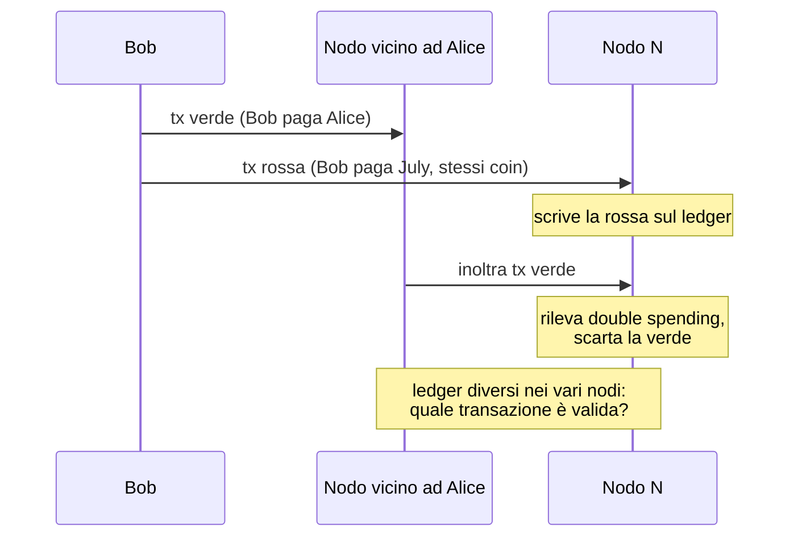
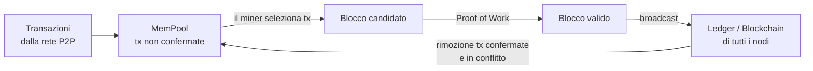
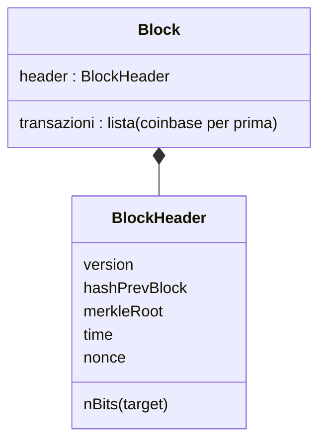
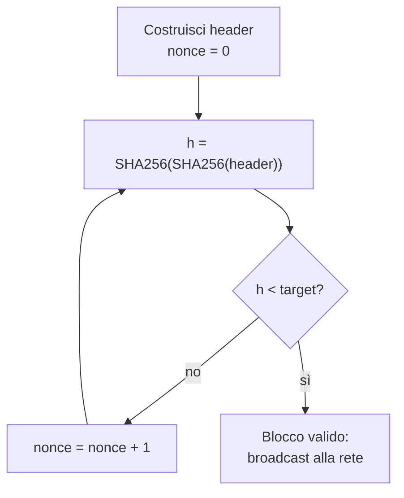
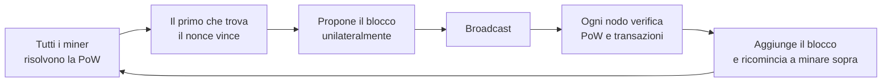
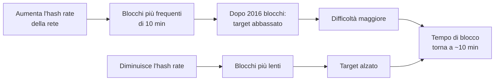
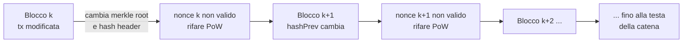
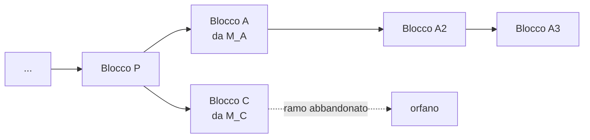
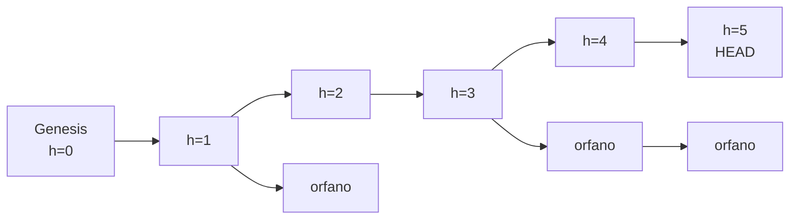

---
tags:
  - università/p2p-blockchain
  - bitcoin
  - mining
  - proof-of-work
  - consenso
data: 2026-03-12
lezione: "L09 - Bitcoin Mining: Proof of Work"
professore: "Laura Ricci"
---

# Bitcoin Mining: Proof of Work e Consenso di Nakamoto

Nelle lezioni precedenti abbiamo visto come sono fatte le transazioni Bitcoin, come si concatenano tramite gli UTXO e come vengono "sbloccate" dagli script. Resta però aperta la domanda più importante: **chi decide quali transazioni entrano nel registro, e in che ordine?** In un sistema senza autorità centrale, dove chiunque può partecipare, la risposta non è banale. Questa lezione introduce il meccanismo con cui Bitcoin risolve il problema: il **mining** basato su **Proof of Work** (PoW, "prova di lavoro"), che realizza una forma di consenso del tutto nuova, il **consenso di Nakamoto**.

## Il problema del consenso distribuito

### Il consenso nei sistemi distribuiti classici

Per **consenso distribuito** si intende una procedura che permette di raggiungere un accordo comune in un sistema multi-agente distribuito o decentralizzato. Nei sistemi distribuiti tradizionali il consenso è lo strumento principale per ottenere **affidabilità** e **tolleranza ai guasti** (*fault tolerance*): il sistema deve continuare a funzionare correttamente anche in presenza di problemi. I problemi tipici considerati sono tre:

- **nodi guasti** (*faulty nodes*): un nodo va in crash o diventa improvvisamente irraggiungibile;
- **partizioni di rete** (*network partition*): la rete si spezza in parti che non comunicano tra loro;
- **guasti bizantini** (*byzantine faults*): un nodo inizia a comportarsi in modo arbitrario o malevolo, per esempio inviando informazioni diverse a nodi diversi.

Esempi classici in cui serve il consenso sono il commit di una transazione in un database distribuito, la **state machine replication** (più repliche di un servizio devono eseguire gli stessi comandi nello stesso ordine) e la sincronizzazione distribuita degli orologi.

### Una soluzione nuova: il consenso di Nakamoto

Bitcoin propone un approccio radicalmente diverso, che chiamiamo **consenso di Nakamoto**. È un consenso **implicito**: non c'è nessuna votazione e nessun algoritmo collettivo di scambio di messaggi eseguito dai nodi per mettersi d'accordo. Il prezzo da pagare è che la consistenza garantita è solo **eventuale** (*eventual consistency*): occasionalmente nodi diversi possono avere viste inconsistenti del registro (sono i **fork** della blockchain, che vedremo), ma alla lunga tutti vedranno la stessa storia del ledger, a patto che la maggioranza dei nodi sia onesta.

Il consenso di Nakamoto funziona molto bene in pratica, ma è difficile da dimostrare formalmente. Come osservato nelle slide: *"il meccanismo con cui Bitcoin raggiunge la decentralizzazione non è puramente tecnico, ma una combinazione di metodi tecnici e di un'accorta ingegneria degli incentivi"*. Questa idea, tecnica più incentivi economici, tornerà continuamente nel corso.

> [!definition] Consenso di Nakamoto
>
> Meccanismo di consenso implicito (senza votazioni né protocolli di message passing collettivi) in cui a ogni round un nodo viene scelto casualmente, tramite Proof of Work, per proporre il prossimo blocco. Garantisce consistenza eventuale: i fork temporanei vengono risolti e tutti i nodi convergono sulla catena più lunga, purché la maggioranza della potenza di calcolo sia onesta.

## Perché serve il consenso: Bitcoin senza consenso

Per capire perché serve un consenso, le slide costruiscono un esperimento mentale: immaginiamo Bitcoin **senza** alcun meccanismo di consenso.

Bob manda dei bitcoin ad Alice generando una transazione (la "transazione verde"). La transazione viene propagata nella rete P2P e raggiunge tutti i nodi. Supponiamo che, in assenza di consenso, ogni nodo scriva la transazione **direttamente sul proprio ledger** appena la riceve. Finché tutto va bene, la transazione verde viene inserita in ogni copia del ledger e tutte le copie restano allineate.

Ma non è sempre così semplice. Supponiamo che Bob, disonesto, spenda con July **gli stessi bitcoin** già spesi con Alice: la nuova transazione ("transazione rossa") è un **double spending** (doppia spesa). Bob la inietta nella rete tramite un altro nodo, in un momento in cui non tutti i nodi hanno ancora ricevuto la transazione verde. Un certo nodo N riceve quindi la rossa **prima** della verde, la scrive subito sul ledger e, quando più tardi arriva la verde, si accorge del double spending e la scarta. Altri nodi, invece, avranno fatto l'esatto contrario.

Il risultato è che quando N riconosce il conflitto, le transazioni sono già state memorizzate nei ledger: il ledger replicato contiene complessivamente **due transazioni in conflitto**, e non c'è modo di stabilire quale sia quella valida. Serve quindi un meccanismo per trovare un **consenso su quale dei due valori aggiungere al ledger**.


*Fig. — Senza consenso, l'ordine di arrivo delle transazioni determina il contenuto dei ledger locali, che finiscono per divergere.*

### La MemPool

La soluzione di Bitcoin è **non scrivere subito** le transazioni sul ledger. Ogni nodo mantiene in RAM una "memoria temporanea" chiamata **MemPool** (*memory pool*), che contiene l'insieme di tutte le transazioni Bitcoin **in attesa di conferma**: restano lì finché non si raggiunge un consenso e vengono incluse nei prossimi blocchi del ledger.

> [!warning] MemPool non è l'insieme UTXO
>
> La MemPool contiene transazioni *non ancora confermate*, in attesa di entrare in un blocco. L'insieme UTXO contiene gli output *già confermati* nella blockchain e non ancora spesi. Sono due strutture diverse, e confonderle è un errore comune.

Con questa scelta, le transazioni in conflitto possono comparire nella MemPool, **ma non nel ledger**. Quando un nodo riceve una transazione in conflitto con una già presente nella sua MemPool (un double spend), semplicemente la scarta. Nodi diversi possono quindi avere nella MemPool versioni diverse (uno la verde, un altro la rossa), ma questo non è grave: la MemPool è locale e provvisoria.

I nodi cercano poi di "estrarre" transazioni dalla propria MemPool e scriverle sul ledger, e per farlo **competono**. Se entrerà nel ledger la transazione rossa o la verde dipende da quale nodo vince la competizione; l'importante è che **non entrino entrambe**. Il consenso di Nakamoto è implementato come una **lotteria**, e il processo di competizione per aggiungere transazioni dalla MemPool al ledger si chiama **mining**. Il vincitore aggiunge le transazioni valide della propria MemPool al ledger e diffonde ai vicini la versione aggiornata (in realtà non l'intero ledger, ma solo le nuove transazioni aggiunte, cioè il nuovo blocco).

Quando la versione aggiornata del ledger raggiunge il nodo N, questo **rimuove dalla MemPool** la transazione ormai in conflitto con quelle confermate (per esempio la verde, se ha vinto un nodo che aveva la rossa). La MemPool funziona quindi come una sorta di **stanza di compensazione** (*clearing house*) per le transazioni. Man mano che il ledger aggiornato si propaga, ogni nodo espelle la transazione in conflitto e, alla fine, il destinatario della transazione vincente riceve i suoi bitcoin.


*Fig. — Ciclo di vita di una transazione: dalla MemPool al blocco candidato, alla blockchain; i nodi ripuliscono poi la propria MemPool.*

## Il mining

### Comporre il blocco candidato

Il **mining** è il processo con cui si aggiungono nuovi blocchi alla blockchain: una competizione estesa a tutta la rete, in cui ogni nodo può provare ad aggiungere il blocco successivo. Il processo si articola in tre passi:

1. il nodo riempie un **blocco candidato** con transazioni prese dalla propria MemPool, proponendolo per l'aggiunta al ledger;
2. costruisce il **block header** (intestazione del blocco), cioè un breve riassunto di tutte le transazioni del blocco più alcuni metadati;
3. esegue la **Proof of Work**.

È utile ricordare la distinzione di ruoli: le **transazioni** possono essere create da chiunque possieda unità di valuta, e servono a trasferirle; i **blocchi** invece sono creati dai **miner**, incapsulano un certo numero di transazioni e sono concatenati tra loro nella blockchain. L'header contiene informazioni riassuntive, mentre la lista delle transazioni è circa **1000 volte più grande** dell'header.

### I campi del block header

Il block header di Bitcoin contiene sei campi, che vediamo uno per uno.

**Version.** Indica la versione del protocollo. Il protocollo evolve nel tempo, per correggere bug o abilitare nuove funzionalità (attraverso *soft fork* e *hard fork*, che vedremo più avanti nel corso), e la versione serve a stabilire quali funzionalità sono valide per quel blocco.

**Time.** È il timestamp del clock locale del miner, in formato **Unix timestamp**, cioè i secondi trascorsi dalla mezzanotte del 1° gennaio 1970. Rappresenta il momento di creazione del blocco. Non esiste alcuna sincronizzazione degli orologi tra i nodi, quindi il valore è approssimativo; è comunque usato per **regolare la difficoltà** della PoW, come vedremo.

**Merkle root** (*mhash*). È la radice del **Merkle tree** costruito sulle transazioni del blocco, le cui foglie sono appunto le transazioni. Il Merkle tree è costruito "su richiesta" (*on demand*) e non è rappresentato esplicitamente nel blocco: nel blocco si memorizzano le transazioni e, nell'header, solo la radice. Qualsiasi modifica a una transazione cambia la Merkle root e, di conseguenza, l'hash dell'intero blocco.

**Hash del blocco precedente** (*hashprev*). È lo SHA-256 (in Bitcoin, doppio) di tutti i campi dell'header del blocco precedente, cioè del blocco sul quale il miner sta costruendo quello corrente. È il **hash pointer** che collega i blocchi in catena.

**Target** (nel formato compatto *nBits*) e **nonce**. Sono i due campi legati alla Proof of Work: il target è la soglia che l'hash del blocco deve rispettare, il nonce è il numero che il miner fa variare per cercare una soluzione.


*Fig. — Struttura di un blocco Bitcoin: l'header (80 byte) e la lista delle transazioni.*

> [!note] Dimensione dell'header
>
> Le slide non riportano la dimensione in byte: per completezza, l'header di Bitcoin è di 80 byte (version 4, hashPrevBlock 32, merkleRoot 32, time 4, nBits 4, nonce 4). Questo spiega il rapporto di circa 1:1000 rispetto a un blocco pieno di transazioni.

## La Proof of Work

### L'algoritmo

La Proof of Work consiste nel trovare un valore del nonce tale che l'hash dell'header sia inferiore a una certa soglia. L'algoritmo è concettualmente semplicissimo:

1. imposta il nonce dell'header a 0;
2. calcola il **doppio hash** SHA-256 dell'intero header, nonce compreso;
3. controlla se il valore ottenuto è **sotto una certa soglia** (il **target**);
4. se non lo è, incrementa il nonce e riprova.

Mantenendo invariati tutti gli altri campi dell'header e cambiando solo il nonce, si ottiene un hash **completamente diverso** (per le proprietà delle funzioni hash crittografiche viste nella lezione sugli strumenti crittografici). Si continua quindi a incrementare il nonce finché non si trova un valore sotto la soglia.


*Fig. — Il ciclo della Proof of Work.*

Nel codice di un miner, il ciclo centrale (riportato nella lezione successiva) è letteralmente:

```c
while (1) {
    HDR[kNoncePos]++;
    if (SHA256(SHA256(HDR)) < (65535 << 208) / DIFFICULTY)
        return;
}
```

> [!note] Nonce esaurito
>
> Le slide non lo trattano, ma è utile sapere che il nonce è di soli 32 bit: con l'hardware moderno lo spazio di $2^{32}$ valori si esaurisce in una frazione di secondo. In pratica i miner modificano anche altri campi (il timestamp, o un campo "extra nonce" nella transazione coinbase, che cambia la Merkle root) per ottenere nuovi spazi di ricerca.

### Zeri iniziali: una semplificazione

In molti libri e articoli si legge che la PoW è risolta se e solo se l'hash calcolato ha un certo numero di **zeri iniziali** (*leading zeros*). È una **semplificazione**: il numero di zeri iniziali è solo un indicatore indiretto della difficoltà. Una difficoltà più alta corrisponde a un target più basso, che a sua volta richiede più zeri iniziali nell'hash; ma il numero di zeri può rimanere uguale anche se la difficoltà aumenta, quando il target diminuisce non abbastanza da richiedere uno zero in più.

> [!example] Target e zeri iniziali
>
> Se il target passa da `001001` a `001000`, la difficoltà è aumentata (il target è più basso, quindi meno hash lo soddisfano), ma il numero di zeri iniziali resta 2. La condizione vera è sempre "hash < target", non "hash inizia con k zeri".

Detto questo, nelle slide e nel resto della lezione la PoW viene spesso approssimata considerando solo il numero di zeri iniziali, perché rende molto intuitivo il ragionamento. Ogni blocco può avere un target diverso: la difficoltà si può regolare.

### Definizione formale

Formalmente, siano:

- $d$ la **difficoltà**, un numero positivo usato per regolare il tempo necessario a produrre la prova;
- $c$ la **sfida** (*challenge*), una stringa data: in Bitcoin è l'header del blocco senza il nonce;
- $x$ il **nonce**, una stringa incognita.

La Proof of Work è una funzione

$$
F_d(c, x) \rightarrow \{\text{true}, \text{false}\}
$$

che soddisfa le seguenti proprietà: $d$ e $c$ sono fissati; $F_d(c, x)$ è **veloce da calcolare** se $d$, $c$ e $x$ sono noti; invece **trovare** un $x$ tale che $F_d(c, x) = \text{true}$ è **computazionalmente difficile, ma fattibile**.

> [!tip] L'asimmetria della PoW
>
> Il cuore della PoW è l'asimmetria tra risolvere e verificare: trovare il nonce richiede in media moltissimi tentativi, mentre chiunque può verificare la soluzione con un solo calcolo di hash. È questa asimmetria che permette a tutti i nodi di controllare i blocchi ricevuti senza bisogno di un punto di centralizzazione.

### Perché la PoW è difficile

Cosa rende difficile la Proof of Work? L'output di SHA-256 si comporta come una stringa casuale di 256 bit, in cui ogni bit ha la stessa probabilità di essere 0 o 1, indipendentemente dagli altri: ogni bit è come un lancio di moneta. Non esiste quindi un modo migliore di trovare un output adatto che la **forza bruta**.

La probabilità $p$ che l'hash di un blocco cada sotto la soglia $T$ è il rapporto tra il numero di valori ammissibili e il numero totale di valori possibili:

$$
p = \frac{T}{2^{256}}
$$

e il numero medio di tentativi necessari per trovare un hash sotto la soglia è $1/p$ (il numero di tentativi segue una distribuzione geometrica). Per esempio, guardando il campo *nBits* dei blocchi del 1° gennaio 2017, il numero medio di tentativi era di circa $2^{70}$.

> [!note] Formula ricostruita
>
> Nel testo estratto dalle slide la formula di $p$ non è leggibile; quella riportata sopra è la formula standard, coerente con il valore medio di tentativi $1/p$ indicato nella slide.

Da qui si capisce anche la metafora degli zeri: se richiediamo $k$ zeri iniziali, la probabilità di successo per tentativo è $2^{-k}$, e il numero medio di tentativi è $2^k$. **Aggiungere uno zero raddoppia** in media lo sforzo computazionale, **toglierne uno lo dimezza**.

### La metafora delle freccette

Le slide propongono una metafora efficace: la PoW è come **lanciare freccette su un bersaglio con gli occhi bendati**. Ogni lancio ha la stessa probabilità di colpire qualsiasi punto; l'obiettivo è colpire dentro l'anello verde centrale. La difficoltà è **inversamente proporzionale** alla dimensione dell'anello verde, che si può regolare per ottenere la difficoltà desiderata. Se i lanciatori diventano più veloci (più lanci al secondo, cioè hardware più potente), l'anello verde deve rimpicciolirsi, adattando il target in base al tempo medio necessario per produrre un risultato valido. Rimpicciolire o allargare l'anello equivale ad aumentare o diminuire il numero di zeri iniziali richiesti.

### Altri usi della Proof of Work

Più in generale, la Proof of Work è un meccanismo che permette a una parte di **dimostrare a un'altra** di aver impiegato una certa quantità di risorse computazionali per un certo periodo di tempo. Si basa su **puzzle crittografici** che possono essere risolti, richiedono uno sforzo considerevole che **non può essere aggirato** (*short-circuited*) e la cui soluzione deve poter essere **verificata facilmente**, in molto meno tempo di quello necessario per risolverli.

Il mining di Bitcoin non è la prima applicazione di questa tecnica. Era stata proposta prima per:

- **contrastare gli attacchi DoS** (*Denial of Service*): si concede l'accesso a un servizio solo a chi risolve un problema computazionalmente costoso. Lo sforzo richiesto è di fatto un modo per rallentare (*throttle*) i richiedenti, e il fornitore del servizio deve poter controllare facilmente che il lavoro sia stato fatto, erogando il servizio solo in quel caso;
- **contrastare lo spam via e-mail**: la PoW viene legata a ogni messaggio, come un **francobollo** pagato in cicli di CPU invece che in denaro. Chi manda pochi messaggi fa pochissimo lavoro complessivo, mentre uno spammer che invia centinaia di migliaia o milioni di messaggi troverebbe proibitivo spendere così tanti cicli di CPU per ciascuno.

> [!note] Hashcash
>
> Non citato esplicitamente nelle slide: lo schema anti-spam più noto di questo tipo è Hashcash (Adam Back, 1997), a cui Bitcoin si ispira direttamente.

## Selezione casuale del leader e resistenza a Sybil

### Selezione proporzionale a una risorsa difficile da monopolizzare

Il consenso di Nakamoto richiede, a ogni round, di **scegliere a caso un nodo** che proponga il prossimo blocco. Come si fa in un sistema aperto, in cui non si conoscono i partecipanti? L'idea chiave è selezionare i nodi **in proporzione a una risorsa difficile da monopolizzare**. In Bitcoin questa risorsa è la **potenza di calcolo**, e la selezione avviene tramite la Proof of Work: la probabilità di un nodo di vincere è proporzionale alla frazione di potenza di calcolo (*hash power*) che controlla. I nodi che provano a risolvere la PoW si chiamano **miner** e l'intero processo di validazione si chiama **mining**.

Il consenso di Nakamoto si può quindi descrivere così. A ogni round un nodo leader viene selezionato a caso, come si estrae un biglietto in una lotteria; la lotteria è implementata con la PoW, e chi trova il nonce giusto vince il diritto di proporre il prossimo blocco. Perché il sistema funzioni, **almeno il 51% delle volte** questo processo deve scegliere un nodo onesto. Il nodo selezionato propone **unilateralmente**, senza contattare nessun altro nodo, il prossimo blocco: si può vedere come un'**elezione casuale del leader a ogni blocco**. Il blocco viene diffuso nella rete, tutti i nodi ne verificano la validità e aggiornano la propria blockchain.


*Fig. — Il consenso di Nakamoto come elezione casuale di un leader a ogni blocco.*

### PoW e attacchi Sybil

Un grande vantaggio del rendere costosa la proposta di nuovi blocchi è la resistenza agli **attacchi Sybil**, in cui un attaccante crea moltissime identità fittizie per ottenere un peso sproporzionato nel sistema. Con la PoW la validazione **non è più influenzata dal numero di identità di rete** controllate dall'attaccante, ma dalla **potenza di calcolo totale** che mette in campo. Creare mille identità non serve a nulla se la potenza di calcolo complessiva resta la stessa; un imbroglione avrebbe bisogno di risorse computazionali enormi, rendendo l'attacco impraticabile. Il sistema è quindi **Sybil resistant**.

Questo porta a **riformulare l'ipotesi iniziale**: non chiediamo più che la maggioranza dei *nodi* sia onesta, ma che la maggioranza dei *miner, pesati per hash power*, sia onesta, cioè segua il protocollo. Inoltre, si danno ai miner **incentivi** per essere onesti.

> [!tip] Ricapitolando il consenso di Nakamoto
>
> È un consenso implicito: nessun algoritmo distribuito collettivo, nessuna votazione, e anche la selezione dei nodi malevoli è gestita implicitamente dal sistema. Anche se i nodi possono avere occasionalmente viste inconsistenti del ledger (fork), il consenso verrà raggiunto: il ledger consistente sarà la **catena più lunga**, a patto che la maggioranza (pesata per potenza di calcolo) sia onesta.

## Propagazione dei blocchi

Il blocco minato viene diffuso (*broadcast*) sulla rete. Ogni nodo che lo riceve verifica che la PoW sia stata risolta: calcola l'hash dell'header e controlla che sia inferiore al target. È una verifica **facile** e che non richiede punti di centralizzazione. Dopo la verifica (che include ovviamente anche la validità delle transazioni), il nodo aggiunge il blocco alla propria blockchain ed **espelle dalla MemPool** ogni transazione in conflitto con quelle del blocco, oltre a quelle ormai confermate.

## Gli incentivi: perché dovrei minare?

Minare costa hardware ed energia: perché qualcuno dovrebbe farlo, e farlo onestamente? Bitcoin prevede **due meccanismi di incentivo**.

Il primo è la **block reward** (ricompensa di blocco): un pagamento al miner in cambio del servizio di creare un blocco. Bitcoin **conia nuove monete** ogni volta che viene minato un blocco, ed è **l'unico modo** in cui vengono creati nuovi bitcoin. Il nome stesso "miner" deriva da questa ricompensa, per analogia con i cercatori d'oro (*mining for gold*).

Il secondo è la **transaction fee** (commissione di transazione): per ogni transazione del blocco, il miner incassa la **differenza tra la somma degli input e la somma degli output**. È inserita volontariamente da chi crea la transazione per ottenere una buona "qualità del servizio" dai miner, cioè per far includere la transazione più rapidamente.

$$
\text{fee} = \sum \text{input} - \sum \text{output}
$$

### La transazione coinbase

Le ricompense vengono incassate tramite la **transazione coinbase**, che è la **prima transazione di ogni blocco**. Essa codifica il trasferimento al miner della block reward più le fee di tutte le transazioni del blocco, e **crea bitcoin dal nulla**. Non consuma alcun UTXO precedente: ha un unico input fittizio (*dummy*), non collegato a nessun output, che contiene uno spazio generalmente usato per inserire un messaggio. Satoshi Nakamoto inserì nella coinbase del **genesis block** (il primo blocco) il messaggio:

> *"The Times 03/Jan/2009 Chancellor on brink of second bailout for banks."*

Gli output della coinbase sono uno o più indirizzi del miner stesso, e il valore totale è la somma della reward e delle fee di tutte le transazioni del blocco.

> [!definition] Transazione coinbase
>
> Prima transazione di ogni blocco, creata dal miner. Ha un solo input fittizio (non spende alcun UTXO, contiene dati arbitrari) e output verso indirizzi del miner, per un valore pari a block reward + somma delle fee delle transazioni del blocco. È l'unico modo in cui vengono creati nuovi bitcoin.

### Halving e offerta limitata

La reward non è fissa ma varia nel tempo: viene **dimezzata** (*halving*) ogni **210.000 blocchi**, cioè circa ogni 4 anni. Le "ere" di Bitcoin sono quindi:

| Era | Reward per blocco |
|---|---|
| 1 | 50 BTC |
| 2 | 25 BTC |
| 3 | 12,5 BTC |
| 4 | 6,25 BTC |
| 5 (attuale) | 3,125 BTC |
| ... | ... |
| 33 | 0,00000001 BTC = 1 satoshi |

L'unità minima è il **satoshi**, con $1\ \text{BTC} = 10^8$ satoshi. Attualmente la reward è di **3,125 BTC**: l'ultimo dimezzamento è avvenuto a **maggio 2024** e siamo nel quinto periodo dell'"era Bitcoin".

Conseguenza diretta dell'halving è che l'offerta di Bitcoin è **limitata**: non supererà mai i **21 milioni** di bitcoin. Si tratta di una serie geometrica:

$$
210\,000 \times 50 \times \left(1 + \tfrac{1}{2} + \tfrac{1}{4} + \dots\right) = 210\,000 \times 50 \times 2 = 21\,000\,000
$$

Se possiedo 1 bitcoin, possiederò sempre almeno un ventunmilionesimo dell'offerta totale: Bitcoin è quindi **resistente all'alta inflazione**. È una caratteristica che non si trova in nessuna valuta *fiat*, dove le decisioni sull'offerta sono prese da uno Stato (o da un'azienda). L'offerta di Bitcoin smetterà di crescere intorno al **2140**, quando si raggiungerà il limite di 21 milioni. Le slide mostrano inoltre la correlazione storica tra gli halving e l'andamento del prezzo di Bitcoin.

### L'evoluzione degli incentivi

Storicamente, la maggior parte della retribuzione dei miner è venuta dalla block reward e solo una piccola percentuale dalle fee. Con il tempo, e con i successivi halving, una percentuale sempre maggiore della retribuzione sarà dovuta **solo alle transaction fee**. Inoltre, i nuovi entranti che cercano di conquistare le reward abbassano la probabilità di vincere di tutti i miner già presenti: i miner devono quindi continuare ad **aumentare il proprio hash rate** per mantenere la propria probabilità di ottenere una ricompensa. È la radice della corsa all'hardware specializzato che vedremo nella prossima lezione.

## Difficoltà variabile

### L'obiettivo dei 10 minuti

Satoshi Nakamoto scriveva: *"per compensare l'aumento di velocità dell'hardware e il variare dell'interesse a far girare nodi nel tempo, la difficoltà della proof-of-work è determinata da una media mobile che punta a un numero medio di blocchi all'ora. Se vengono generati troppo velocemente, la difficoltà aumenta."*

L'obiettivo di Bitcoin è che venga minato **un blocco ogni 10 minuti**. Il target non è fisso, ma viene aggiustato dal protocollo per raggiungere questo obiettivo. La frequenza del mining dipende infatti da due fattori: la **difficoltà della PoW** e la **potenza di calcolo complessiva** dei miner nella rete. Poiché la seconda varia continuamente (nuovi miner possono entrare quando vogliono, e con più potenza aumenta la probabilità che qualcuno risolva la PoW, quindi la frequenza dei blocchi tende ad aumentare), per mantenere i 10 minuti **si regola la difficoltà**.

### Perché proprio 10 minuti?

Ancora Satoshi: *"se le trasmissioni risultassero in pratica più lente del previsto, il tempo tra i blocchi potrebbe dover essere aumentato per evitare di sprecare risorse. Vogliamo che i blocchi si propaghino di solito in molto meno tempo di quanto serva a generarli, altrimenti i nodi passerebbero troppo tempo a lavorare su blocchi obsoleti."*

L'obiettivo era quindi lasciare il **tempo di propagare** il blocco in tutta la rete prima che venga minato il successivo. Se i blocchi fossero minati troppo frequentemente, i miner costruirebbero **catene concorrenti** (fork), delle quali solo una diventerà la più lunga: alcuni miner sprecherebbero energia costruendo su una catena destinata a essere abbandonata, e la **sicurezza effettiva si abbasserebbe**, perché parte della potenza onesta va dispersa. Lo scenario ideale è che tutti i miner concentrino la potenza di mining della rete sull'estensione **della stessa catena**.

> [!warning] Chiesto all'esame
>
> Agli orali è stato chiesto di parlare di Proof of Work e dell'**intervallo di tempo tra i blocchi**. Bisogna saper spiegare perché 10 minuti (tempo di propagazione vs frequenza dei fork, sicurezza effettiva) e come la difficoltà viene regolata ogni 2016 blocchi.

### Bitcoin contro Ethereum

Scegliere un tempo di blocco più breve ha dei vantaggi: **conferme più rapide** e **minore varianza dei guadagni** per i miner (e quindi minore dipendenza dai grandi mining pool). È la scelta fatta da **Ethereum**, che però paga il prezzo di **più fork** e di un **sistema di ricompense più complesso**.

> [!note] Ethereum oggi
>
> Il confronto nelle slide si riferisce a Ethereum in epoca Proof of Work. Dal 2022 Ethereum usa Proof of Stake, con slot da 12 secondi; lo vedremo nella lezione dedicata.

### L'algoritmo di aggiustamento

Blocchi diversi possono avere valori di target diversi. Le slide confrontano il **genesis block** con uno degli ultimi blocchi minati: il target iniziale, scritto nel primo blocco, era probabilmente una stima di Satoshi, un buon punto di partenza per un target abbastanza difficile da produrre un intervallo di 10 minuti tra i blocchi.

L'aggiustamento avviene **ogni 2016 blocchi**: si prende la differenza tra i campi *time* del primo e dell'ultimo di questi blocchi. Il numero 2016 non è casuale:

$$
2016 = 14 \times 24 \times 6
$$

cioè il numero di blocchi minati in **due settimane** se si trova un blocco ogni 10 minuti (6 blocchi l'ora, 24 ore, 14 giorni). Due settimane corrispondono a $20160$ minuti, quindi idealmente 2016 blocchi vengono minati in 20160 minuti. Il nuovo target si calcola come:

$$
T_{\text{nuovo}} = T_{\text{vecchio}} \times \frac{\text{tempo effettivo per 2016 blocchi}}{20160\ \text{min}}
$$

> [!example] Aggiustamento del target
>
> **Blocchi troppo veloci.** Nell'esempio delle slide i 2016 blocchi sono stati minati in 16128 minuti invece di 20160 (forse sono entrati nuovi miner). Il rapporto è $16128 / 20160 = 0{,}8$: il target viene moltiplicato per 0,8, quindi **si abbassa**, e diventa più difficile trovare un hash sotto di esso. Difficoltà più alta.
>
> **Blocchi troppo lenti.** Se servono 22176 minuti invece di 20160, il rapporto è $22176/20160 = 1{,}1$: il target viene moltiplicato per 1,1, quindi **si alza**, ed è più facile trovare un hash valido. Difficoltà più bassa.

> [!note] Dettagli non nelle slide
>
> Nell'implementazione reale il fattore di aggiustamento è limitato a un massimo di 4 volte in entrambe le direzioni per evitare variazioni brusche. Inoltre la difficoltà è definita come $\text{difficulty} = T_{\max} / T$, dove $T_{\max}$ è il target massimo (quello del genesis block): per questo il ciclo del miner confronta l'hash con $(65535 \ll 208)/\text{DIFFICULTY}$.

### Un sistema auto-adattivo

Chi regola il target? Nessuno in particolare. Ogni nodo è **autonomo** e non esiste un'entità centrale che aggiusta il target. Il comportamento è **auto-adattivo** (*self-adaptive*): ogni nodo esegue esattamente lo stesso algoritmo sugli stessi dati (i timestamp dei blocchi della catena), quindi tutti finiscono per calcolare lo stesso target, e tutti i nodi condividono lo stesso target corrente per lo stesso blocco. Le slide illustrano questo comportamento con una serie di grafici che mostrano come, al crescere dell'hash rate della rete, la difficoltà segua la crescita e riporti il tempo medio di blocco verso i 10 minuti.


*Fig. — Il ciclo di retroazione con cui la difficoltà si adatta alla potenza di calcolo della rete.*

## La struttura della blockchain

### Blocchi, identificatori e immutabilità

La blockchain di Bitcoin consiste in una lista lineare di blocchi, ciascuno composto da un block header e da una lista di transazioni strutturate come visto nella lezione precedente, collegati tramite **hash pointer**.

Come si identificano i blocchi? In due modi. Il primo è il **block hash**, l'hash dell'header: non è incluso nel blocco stesso, ma viene calcolato da ogni nodo quando riceve il blocco, e serve a facilitare l'indicizzazione e il recupero dei blocchi. Il secondo è la **block height** (altezza del blocco), cioè il numero di blocchi che lo precedono nella blockchain a partire dal genesis block, che si trova all'altezza 0.

> [!warning] Altezza non univoca
>
> L'hash identifica un blocco in modo univoco, l'altezza no: in presenza di un fork due blocchi diversi possono avere la stessa altezza. Per questo l'altezza si riferisce sempre alla posizione nella catena più lunga.

La concatenazione tramite hash rende la blockchain **tamper-free** (a prova di manomissione). Immaginiamo un attaccante che modifica una transazione in un blocco: cambia la Merkle root, quindi cambia l'header, quindi il nonce del blocco **non è più valido** e bisogna rieseguire la PoW per trovare un nuovo nonce. Ma nel blocco successivo cambia anche l'hash pointer al blocco precedente, quindi anche il suo nonce non è più valido e la PoW va rieseguita; lo stesso vale per il successore del successore, e così via. Un attaccante dovrebbe **ricalcolare la PoW per l'intera catena** successiva al blocco modificato, e contemporaneamente superare la catena onesta che nel frattempo continua a crescere: servirebbe una potenza di calcolo enorme.


*Fig. — Effetto a cascata della modifica di una transazione: occorre rifare la PoW di tutti i blocchi successivi.*

### Perché blocchi e non singole transazioni?

I blocchi sono l'**unità di lavoro** dei miner. Perché non minare le singole transazioni? Per diverse ragioni: una catena di hash di blocchi è molto più corta di una catena di hash di transazioni, quindi la **verifica è più veloce**; minare transazioni singole richiederebbe complessivamente **molto più lavoro di mining**; e trasmettere un blocco è una **comunicazione più efficiente** che trasmettere tante transazioni separate.

### Aggiunta dei blocchi e fork temporanei

Nello scenario più semplice (nessun blocco minato in contemporanea, nessun attacco), un miner trova un nuovo blocco B e lo condivide con gli altri nodi; quando gli altri lo ricevono, lo aggiungono alla propria blockchain e ogni miner comincia a cercare di minare un nuovo blocco **sopra B**.

Ma cosa succede se due miner "vincono contemporaneamente"? Due miner, $M_A$ e $M_C$, validano e diffondono quasi simultaneamente due blocchi A e C che puntano **allo stesso blocco precedente**. Si crea un **fork temporaneo**: lo stato della blockchain visto dalla rete consiste di due rami che partono dallo stesso blocco genitore. Entrambi i rami sono **legittimi**, perché creati da miner onesti che seguono le regole: abbiamo due istanze della blockchain, e alcune transazioni possono comparire in uno dei due blocchi ma non nell'altro. Quali bitcoin sono stati davvero spesi? Serve riconciliare le due versioni.

> [!warning] Fork temporaneo e double spending non sono la stessa cosa
>
> Un fork temporaneo è un evento *naturale*, dovuto alla latenza di propagazione e prodotto da miner onesti. Un double spending attack è un comportamento *malevolo* di un miner disonesto (lo vedremo nella prossima lezione), che può però sfruttare lo stesso meccanismo di risoluzione dei fork.

Ogni nodo riceve prima A oppure prima C, a seconda della sua vicinanza nella rete a $M_A$ o a $M_C$. Il nodo **aggiunge il primo blocco ricevuto** alla propria copia locale della blockchain e, se è un miner, comincia a minare sopra quel blocco. Se in seguito riceve anche l'altro blocco, si accorge del fork e lo **memorizza in una cache locale**: il secondo blocco non fa parte della blockchain attiva, ma viene tenuto da parte. Entrambi i blocchi sono validi, quindi la catena si divide brevemente in due versioni in competizione.

I due rami possono crescere indipendentemente: ogni miner mina sul ramo del blocco che ha ricevuto per primo, quindi miner diversi lavorano su rami diversi. Si applica allora la **regola di Nakamoto**: **vince il fork più lungo**.


*Fig. — Fork temporaneo: A e C estendono lo stesso P. Quando il ramo di A diventa più lungo, C diventa un blocco orfano.*

### La longest chain rule

Secondo la **longest chain rule** (regola della catena più lunga), se un miner riceve un blocco che rende più lungo l'altro ramo, **abbandona il ramo più corto**. Le transazioni del ramo abbandonato che non sono state approvate nel ramo vincente vengono **restituite alla MemPool**, tra le transazioni "non ancora approvate".

> [!note] Catena più lunga o più pesante?
>
> Le slide parlano, come è consuetudine, di catena "più lunga". Tecnicamente i nodi Bitcoin scelgono la catena con il **maggior lavoro cumulativo** (somma delle difficoltà dei blocchi), che coincide con la più lunga quando la difficoltà è la stessa. La distinzione impedisce di "vincere" con una catena lunga ma a bassa difficoltà.

Questo è anche il motivo della **regola delle 6 conferme**: una transazione non è considerata confermata finché nel ramo più lungo non ci sono almeno **5 blocchi successivi** a quello che la contiene (quindi 6 blocchi in tutto, contando il suo). Sei è il valore di default, ma il numero di conferme può essere deciso dal client (per esempio in base all'importo). L'obiettivo è dare alla rete il **tempo di mettersi d'accordo** sull'ordinamento dei blocchi: più blocchi seguono una transazione, più è improbabile che il ramo che la contiene venga scavalcato.

### L'algoritmo eseguito alla ricezione di un blocco

Le slide riportano lo pseudocodice che ogni nodo esegue quando riceve un blocco:

```text
Ricevi blocco b
  // per questo nodo la testa corrente è bmax, ad altezza hmax
  Collega b nell'albero come figlio del suo genitore p, ad altezza hb = hp + 1
  if hb > hmax then
      hmax = hb
      bmax = b
      calcola l'insieme UTXO per il cammino che porta a bmax
      ripulisci la memory pool
  end if
```

Il punto importante è che il nodo mantiene un **albero** di blocchi e non una semplice lista: ogni blocco viene agganciato al proprio genitore, e solo se il nuovo blocco supera l'altezza della testa corrente il nodo cambia la propria "catena principale", ricalcola lo stato UTXO lungo il nuovo cammino e ripulisce la MemPool.

### Fork più lunghi e riorganizzazione

È possibile che vengano trovati di nuovo blocchi validi quasi contemporaneamente su entrambi i rami, facendoli crescere perfettamente in parallelo alla stessa altezza? È **possibile ma estremamente improbabile**: la probabilità che accada ripetutamente per un lungo periodo è bassissima, perché la casualità del mining e i ritardi di propagazione dei blocchi introducono nel protocollo una casualità che lo impedisce. I nodi tengono traccia degli header dei blocchi di entrambi i rami, ogni miner si sposta a minare sul ramo più lungo di cui viene a conoscenza, e alla fine un ramo diventerà più lungo dell'altro.

Quando questo accade, i nodi che stavano sul ramo perdente effettuano una **chain reorganization** (riorganizzazione della catena): sostituiscono alcuni blocchi con quelli nuovi per seguire la longest chain rule. Tutti i miner si concentrano così su quella catena. I miner sono **incentivati** a costruire sulla catena più lunga, che ha maggiore probabilità di essere accettata: se minassero su una catena più corta, con ogni probabilità sprecherebbero il proprio sforzo computazionale (e la reward del blocco sul ramo perdente non varrebbe nulla). Le slide chiudono con una domanda che anticipa la prossima lezione: **la possibilità di sostituire blocchi può essere sfruttata per degli attacchi?**

### Il teorema del consenso di Nakamoto

> [!theorem] Consistenza eventuale
>
> I fork vengono prima o poi risolti e tutti i nodi finiscono per concordare su quale sia la blockchain più lunga. Il sistema garantisce quindi **consistenza eventuale**.
>
> **Idea della dimostrazione.** Perché un fork continui a esistere, devono essere trovate coppie di blocchi in rapida successione che estendano rami distinti; altrimenti i nodi sul ramo più corto passerebbero a quello più lungo. La probabilità che i rami vengano estesi quasi simultaneamente **decresce esponenzialmente** con la lunghezza del fork. Quindi arriverà prima o poi un momento in cui un solo ramo viene esteso, diventando il più lungo.

### Un albero di blocchi

La conseguenza di tutto questo è che la struttura della blockchain di Bitcoin **può contenere fork**, e i rami morti vengono abbandonati. In realtà, quindi, è un **albero di blocchi** più che una catena: la blockchain vera e propria è il **cammino nell'albero che corrisponde alla catena più lunga**. I cammini morti contengono i cosiddetti **blocchi orfani** (*orphan blocks*). La **block height** è la posizione di un blocco lungo il cammino più lungo a partire dal genesis block, e la **blockchain head** (testa della blockchain) è l'ultimo blocco aggiunto.


*Fig. — La blockchain come albero: la catena principale è il cammino più lungo, i rami morti contengono blocchi orfani.*

## Conclusioni: consenso esplicito e Bitcoin

La letteratura sui sistemi distribuiti propone approcci classici al consenso basati sul **consenso esplicito**: i nodi eseguono un algoritmo distribuito per mettersi d'accordo. Esistono molti algoritmi di questo tipo, come **Paxos**, **Raft**, gli algoritmi di **Byzantine Fault Tolerance** (BFT) e **Practical Byzantine Fault Tolerance** (PBFT). Perché non funzionano per Bitcoin?

Tutti questi algoritmi "tradizionali" sono progettati per **ambienti chiusi**: i nodi sono identificati, ogni nodo conosce l'identità degli altri e può inviare un messaggio a un nodo specifico. Alcuni di essi sono infatti adottati nelle **blockchain permissioned**. Le **blockchain permissionless** come Bitcoin sono invece **ambienti aperti**: qualsiasi nodo può entrare nel sistema in qualunque momento, e nessuno conosce l'identità di tutti gli altri. Nelle reti peer-to-peer, a causa dell'**alto churn**, i nodi non si conoscono a priori (vanno e vengono, chiunque può unirsi), non ci sono **canali autenticati** e non c'è **sincronizzazione di rete**. Anche se il consenso è studiato da più di trent'anni, gli algoritmi classici come Paxos non funzionano in questo contesto, e serve ancora ricerca. Il consenso di Nakamoto è la prima soluzione pratica per questo scenario aperto.

| | Consenso classico (Paxos, Raft, PBFT) | Consenso di Nakamoto |
|---|---|---|
| Ambiente | chiuso, permissioned | aperto, permissionless |
| Identità dei nodi | note a tutti | ignote, chiunque entra ed esce |
| Meccanismo | votazioni e scambio di messaggi | lotteria implicita via PoW |
| Protezione da Sybil | identità autenticate | costo computazionale |
| Consistenza | forte (finalità immediata) | eventuale (fork, 6 conferme) |

> [!question] Possibili domande d'esame
>
> - Perché Bitcoin ha bisogno di un meccanismo di consenso? Mostri con un esempio cosa succederebbe se ogni nodo scrivesse le transazioni direttamente sul ledger, e spieghi il ruolo della MemPool.
> - Che cos'è il consenso di Nakamoto e in cosa differisce dagli algoritmi di consenso classici come Paxos o PBFT? Perché questi ultimi non sono adatti a una blockchain permissionless?
> - Descriva il block header di Bitcoin e il ruolo di ciascun campo, in particolare Merkle root, hash del blocco precedente, target e nonce.
> - Come funziona la Proof of Work? Perché è difficile da risolvere ma facile da verificare? Perché rende il sistema resistente agli attacchi Sybil?
> - Perché Bitcoin punta a un blocco ogni 10 minuti e come viene regolata la difficoltà? Chi decide il nuovo target?
> - Quali incentivi ricevono i miner? Descriva la transazione coinbase, l'halving e perché l'offerta di Bitcoin è limitata a 21 milioni.
> - Che cos'è un fork temporaneo, come si risolve e perché si aspettano 6 conferme? Perché si dice che la blockchain è in realtà un albero?
> - Perché la blockchain è a prova di manomissione? Cosa dovrebbe fare un attaccante per modificare una transazione in un blocco passato?

> [!abstract] Sintesi
>
> Senza consenso, l'ordine di arrivo delle transazioni farebbe divergere i ledger dei nodi; Bitcoin tiene quindi le transazioni non confermate in una MemPool e le scrive nel ledger solo tramite blocchi prodotti da una lotteria, il mining. Il miner compone un blocco candidato, costruisce l'header (version, time, Merkle root, hash del precedente, target, nonce) e cerca un nonce per cui il doppio SHA-256 dell'header sia sotto il target: difficile da trovare, banale da verificare. La selezione del leader proporzionale all'hash power rende il sistema resistente a Sybil. I miner sono incentivati da block reward (dimezzata ogni 210.000 blocchi, offerta massima 21 milioni) e fee, incassate con la coinbase. Ogni 2016 blocchi il target si aggiusta per mantenere i 10 minuti, intervallo scelto per limitare i fork. I fork temporanei si risolvono con la longest chain rule (consistenza eventuale); per questo si attendono 6 conferme, e la blockchain è in realtà un albero di cui conta il cammino più lungo.
