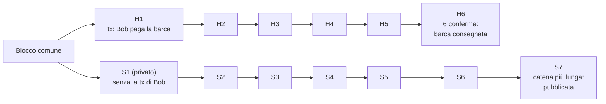
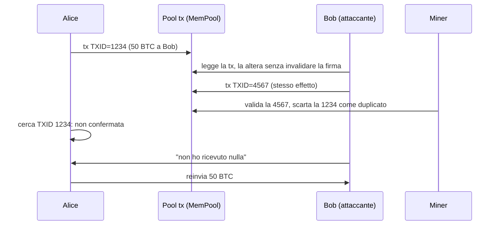
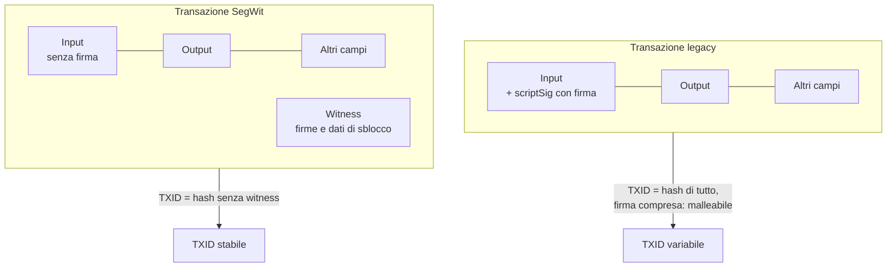
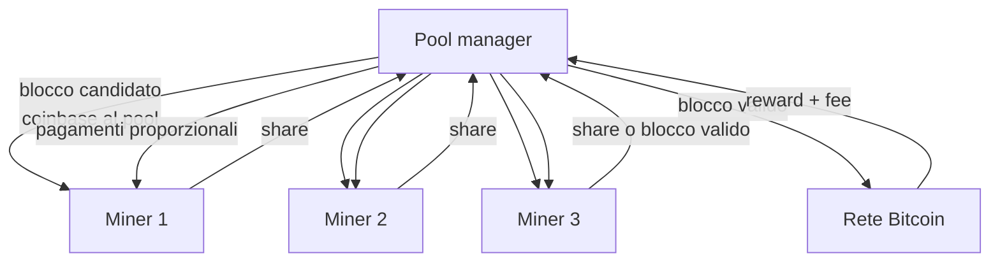
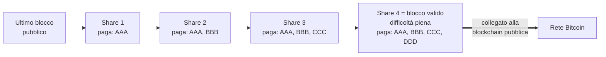

---
tags:
  - università/p2p-blockchain
  - bitcoin
  - attacchi
  - mining-pool
  - malleability
data: 2026-03-19
lezione: "L10 - Attacchi: double spending, malleability, mining pool"
professore: "Laura Ricci"
---

# Attacchi a Bitcoin e Mining Pool

Nella lezione precedente abbiamo visto che il consenso di Nakamoto permette ai nodi di **sostituire blocchi** per seguire la longest chain rule, e ci siamo chiesti se questa possibilità potesse essere sfruttata per degli attacchi. Questa lezione risponde alla domanda: analizziamo i principali attacchi alla rete Bitcoin (il **double spending** e il cosiddetto **attacco del 51%**, la **transaction malleability** con il caso Mt. Gox e la sua soluzione, **SegWit**, e un semplice attacco di **denial of service**) e poi passiamo agli attori del sistema, in particolare ai **miner**: l'hardware per il mining, perché il mining in solitaria è rischioso e come funzionano i **mining pool**, centralizzati e decentralizzati, con i loro schemi di pagamento.

> [!note] Selfish mining
>
> Il titolo della lezione nelle slide cita il **selfish mining**, ma il testo delle slide non contiene alcuna trattazione di questo attacco. Per completezza, a titolo informativo: il selfish mining (Eyal e Sirer, 2013) è una strategia in cui un miner (o un pool) che trova un blocco non lo pubblica subito, ma continua a minare in privato sulla propria catena segreta, rivelandola solo quando serve a rendere orfani i blocchi degli onesti. In questo modo ottiene una quota di ricompense superiore alla propria quota di hash power anche con meno del 50% della potenza. Verificare con il docente se l'argomento è in programma.

## Attaccare la rete Bitcoin

### Il double spending attack

Il **double spending attack** (attacco di doppia spesa) consiste nel tentare di **spendere due volte lo stesso bitcoin**. Vediamo diversi modi, via via più sofisticati, con cui si potrebbe provare a farlo.

> [!warning] Chiesto all'esame
>
> "Quali sono gli attacchi a Bitcoin? Se lei volesse fare un double spending attack, come lo farebbe?" è una domanda realmente posta all'orale. Bisogna saper esporre i tentativi ingenui, perché falliscono, e l'attacco vero basato sulla catena privata e sul 51% dell'hash power.

#### Primo tentativo ingenuo: inviare due transazioni

La soluzione più ingenua è inviare semplicemente alla rete **due transazioni** che spendono lo stesso bitcoin. Entrambe finiscono nelle MemPool dei miner, ma un miner onesto ne inserirà **solo una** nel prossimo blocco; la seconda sarà considerata non valida e non verrà confermata dal miner che mina il blocco successivo. L'attacco fallisce.

E se le due transazioni venissero validate **contemporaneamente da due miner diversi**, ciascuno nel proprio blocco? La blockchain subisce un fork. Mentre la divisione è in corso, uno qualsiasi dei due rami può diventare orfano, e alla fine solo uno dei due blocchi (con la relativa transazione) verrà inserito nella catena definitiva. La difesa è la longest chain rule unita alla prudenza del venditore: **attendere 6 conferme prima di accettare la transazione**.

#### Secondo tentativo ingenuo: un blocco con entrambe le transazioni

Un secondo tentativo ingenuo: l'acquirente è un **miner malevolo**, che valida un blocco e vi inserisce **entrambe** le transazioni. Gli altri nodi, verificando la validità del blocco, lo rifiutano semplicemente. L'attacco non ha successo, e anzi nessun miner razionale lo tenterebbe: sprecherebbe lo sforzo di mining e perderebbe la block reward.

#### L'attacco vero: mining in stealth mode

Consideriamo ora l'attacco realistico. Bob spende 10 bitcoin per comprare una **barca a vela**: i suoi bitcoin vengono consegnati all'azienda dopo **6 conferme**, e a quel punto la barca viene consegnata a Bob. Bob però è un **miner malevolo** e tenta un double spending **"invertendo" la catena più lunga**. Come? Mina in **stealth mode** (modalità nascosta), cioè **non diffonde la propria catena** al resto dei nodi.

Bob spende i propri bitcoin sul **ramo onesto** della blockchain, quello creato dai miner onesti, ma **non include questa transazione** nella propria "blockchain nascosta": nella sua catena privata Bob possiede ancora quei bitcoin (e può eventualmente inserirvi una transazione che li manda a un altro suo indirizzo). Non appena Bob riesce a creare una catena **più lunga** di quella onesta, la diffonde al resto della rete, che la accetta per via della longest chain rule: è più lunga di quella su cui stavano lavorando, quindi tutti vi si spostano.

Se l'attacco riesce, la vecchia catena viene abbandonata e le transazioni che conteneva **non sono più valide**; ma Bob ha già ricevuto la barca, ed è di nuovo in possesso dei suoi bitcoin, che può spendere un'altra volta.


*Fig. — Double spending con catena privata: quando la catena segreta di Bob supera quella onesta viene pubblicata, e la transazione di pagamento sparisce dalla storia accettata.*

### L'attacco del 51%

Perché l'attacco funzioni, il miner malevolo deve aggiungere blocchi alla propria versione della blockchain **più velocemente** del resto della rete, fino a costruire una catena più lunga: gli serve **più hash power di tutti gli altri miner messi insieme**, cioè il **51% della potenza di calcolo**. Per questo il double spending di questo tipo è noto come **51% attack**.

Senza questa maggioranza, per Bob è molto difficile rendere il proprio fork più lungo dell'altro: dovrebbe essere fortunato e minare **sei blocchi** nel proprio ramo prima che il resto della rete trovi anche un solo blocco in più. La cosa dipende dalla potenza di calcolo di Bob, e la sua probabilità di successo è **infinitesimale**, a meno che non riesca a risolvere puzzle PoW a un ritmo paragonabile a quello di tutti gli altri miner messi insieme; e questo può accadere nella rete Bitcoin se Bob controlla il 51% dell'hash power.

> [!tip] Perché 6 conferme proteggono
>
> Con una quota $q < 0{,}5$ dell'hash power, la probabilità che l'attaccante recuperi uno svantaggio di $z$ blocchi decresce esponenzialmente con $z$ (è l'analisi del whitepaper di Nakamoto, non riportata nelle slide). Attendere 6 conferme rende l'attacco praticamente impossibile per chi non ha la maggioranza. Con $q > 0{,}5$, invece, l'attaccante prima o poi riesce sempre: nessun numero di conferme basta.

### Mining pool e 51% nella realtà: il caso GHash.io

Un singolo miner difficilmente raggiunge il 51%, ma un **mining pool**, che aggrega la potenza di molti miner, potrebbe. Nel **2014** il pool **GHash.io** si è avvicinato al 50% dell'hash power della rete, ma **non è successo nulla**. Infatti, anche se un miner supera il 50% della potenza di mining, non significa necessariamente che eseguirà un attacco: con tanta potenza è probabilmente **più redditizio continuare a minare blocchi** e incassare le block reward piuttosto che invertire una singola transazione (distruggendo, per di più, la fiducia nella moneta che sta accumulando). È un altro esempio dell'"ingegneria degli incentivi" di cui si parlava nella lezione precedente.

## Transaction malleability

### Che cos'è

La **transaction malleability** (malleabilità delle transazioni) è una vulnerabilità, oggi in gran parte risolta, che permetteva a qualcuno di **cambiare l'identificatore di una transazione (TXID)** senza cambiare ciò che la transazione fa davvero: chi invia, chi riceve e quanto. La transazione modificata **resta valida** e viene regolarmente confermata sulla blockchain, ma il suo **identificatore cambia**.

L'analogia proposta dalle slide è quella di un pacco spedito: il pacco arriva correttamente a destinazione, ma il **numero di tracking cambia**, e così chi lo aspetta (o chi lo ha spedito) pensa che non sia mai arrivato.

> [!warning] Chiesto all'esame
>
> "Cos'è il malleability attack?" è stata una domanda d'esame, e in un orale la docente ha chiesto di spiegarne nel dettaglio il funzionamento dopo che lo studente lo aveva nominato. Occorre sapere: cosa è il TXID, perché la firma non copre sé stessa, il trucco $(r, s) \to (r, n-s)$, il caso Mt. Gox e la soluzione SegWit.

### Una metafora

Alice scrive una lettera (una transazione) in cui dice di mandare 50 BTC a Bob, e la mette nella cassetta delle lettere (il pool delle transazioni Bitcoin). Questa transazione ha TXID = 1234. Bob, l'attaccante, riesce a **duplicare la lettera** e mette il duplicato nella cassetta: la lettera duplicata ha TXID = 4567. Il contenuto è sostanzialmente lo stesso (entrambe dicono che Alice dà 50 BTC a Bob), ma il TXID è diverso. A questo punto c'è una **gara**.

I miner validano che la lettera provenga davvero da Alice controllandone la **firma**. Nel momento in cui una delle due transazioni viene validata, l'altra viene ignorata, perché riconosciuta come duplicato (spende gli stessi input). Supponiamo che venga validata la transazione **dell'attaccante**: i 50 bitcoin vengono comunque inviati a Bob, perché il contenuto è quasi identico e, in particolare, la firma di Alice è valida; i 50 BTC vengono scalati dal conto di Alice.

Ora Bob sostiene di **non aver ricevuto** alcun BTC da Alice. Alice non ha modo di dimostrare di averli inviati: per farlo le servirebbe la "ricevuta" della propria transazione, ma la sua transazione (TXID 1234) è stata scartata, mentre è stata validata quella di Bob (TXID 4567), che Alice **non conosce**. Alice cerca la propria transazione sulla blockchain, non la trova, e finisce per **reinviare** i 50 BTC.


*Fig. — Scenario di malleability: la transazione confermata è quella con TXID alterato, e Alice non riesce a dimostrare il pagamento.*

### Come si realizza l'attacco

È un attacco sottile, basato sul modificare l'hash della transazione (il TXID) **alterando il contenuto** della transazione **senza modificare i campi rilevanti**, in particolare la firma, in modo che resti valida.

Ricordiamo la struttura: una transazione ha molte componenti, tra cui un insieme di input e di output. Gli **input** sono firmati con la chiave privata dei proprietari dei fondi e permettono di verificarne la proprietà. Il **TXID** è l'hash dell'**intera transazione**: input, **firma inclusa**, output e altri campi. Ecco il punto debole: la firma non può firmare sé stessa, quindi c'è una parte della transazione (la firma, contenuta nello *scriptSig*) che contribuisce al TXID ma non è protetta dalla firma. Se si riesce a modificare la firma mantenendola valida, il TXID cambia ma la transazione resta perfettamente accettabile.

Bitcoin usa **ECDSA** (*Elliptic Curve Digital Signature Algorithm*, algoritmo di firma digitale a curva ellittica), un metodo crittografico per firmare digitalmente dati e verificarne le firme. In ECDSA una firma non è una stringa unica, ma è composta da **due numeri** $(r, s)$, che costituiscono insieme la firma. Per le proprietà matematiche di ECDSA:

$$
(r, s) \text{ valida} \implies (r, n - s) \text{ valida}
$$

dove $n$ è una costante associata alla curva ellittica (l'ordine del punto generatore). Quindi chiunque, **senza conoscere la chiave privata**, può trasformare una firma valida in un'altra firma valida: la firma "logica" non cambia, cambia solo una **rappresentazione equivalente**. Ma poiché il TXID è calcolato anche sui byte della firma, il TXID cambia.

> [!tip] Il nocciolo della malleabilità
>
> Il TXID dipende da dati (la firma) che non sono protetti dalla firma stessa. Chi osserva una transazione nella rete può quindi produrne una variante semanticamente identica, con firma ancora valida, ma con un TXID diverso, e cercare di farla confermare al posto dell'originale.

> [!note] Altre forme di malleabilità
>
> Le slide si concentrano sul caso $(r, s) \to (r, n-s)$ e, nel caso Mt. Gox, sulla codifica non standard della firma. Storicamente esistevano anche altre fonti di malleabilità (per esempio l'aggiunta di operazioni inutili nello scriptSig, come push di dati superflui), tutte accomunate dal fatto di alterare lo scriptSig senza invalidarlo.

### Il caso Mt. Gox

**Mt. Gox** (*Magic The Gathering Online Exchange*) fu fondato nel 2010 e nel 2013 era il più famoso exchange di criptovalute del Giappone: su di esso passava, su base giornaliera, almeno il **72% delle transazioni** mondiali. A un certo punto l'exchange sospese le negoziazioni, chiuse il sito e il servizio di cambio e chiese la protezione dai creditori per bancarotta. Ad **aprile 2014** la società avviò la procedura di liquidazione, annunciando che circa **744.408 BTC** appartenenti ai clienti erano spariti, probabilmente rubati: il **6% di tutti i bitcoin** esistenti all'epoca, per un valore di oltre **450 milioni di dollari** di allora. Gli esperti hanno ipotizzato un attacco di malleabilità.

La ricostruzione proposta procede così. Come premessa, Mt. Gox **non usava una codifica standard** della firma. Le transazioni con firma non standard non venivano inoltrate dai client ufficiali, quindi le transazioni di Mt. Gox si propagavano con difficoltà. Alcuni utenti scoprirono il problema e iniziarono a "correggere" le transazioni, inserendo codifiche standard della firma: una sorta di **reverse malleability**, cioè creare una transazione standard a partire da una non standard. Questo diede agli attaccanti l'idea che la malleabilità fosse sfruttabile.

L'attacco vero e proprio: l'attaccante chiede un prelievo a Mt. Gox, **intercetta la transazione** e ne cambia il TXID. La transazione resta valida (firma corretta), viene confermata sulla blockchain e l'attaccante riceve i bitcoin. Mt. Gox però cercava sulla blockchain il **TXID originale**, vedeva che non veniva mai incluso in un blocco e quindi **non scalava il saldo** dell'attaccante, considerando il prelievo fallito. L'attaccante poteva così richiedere di nuovo il prelievo e **ricevere i fondi due volte**.

Cosa sia successo davvero resta **incerto** e le opinioni divergono, ma molti osservatori hanno attribuito la bancarotta a un attacco di transaction malleability.

> [!warning] Una questione di progettazione dell'applicazione
>
> La malleabilità non permette di rubare fondi a chi li possiede: la transazione malleata fa esattamente ciò che l'originale faceva. Il danno nasce quando un'applicazione (come l'exchange) usa il TXID come prova del pagamento e prende decisioni, come riaccreditare un saldo, basandosi sulla sua assenza.

### La soluzione: Segregated Witness (SegWit)

La soluzione è stata **Segregated Witness** (SegWit, "testimone separato"), che cambia la **struttura dei dati** delle transazioni Bitcoin per evitare la malleabilità. È un **fork** famoso del protocollo Bitcoin: non un fork temporaneo di consenso come quelli visti nella lezione precedente, ma un fork dovuto a un **cambiamento del protocollo**, e in particolare un **soft fork** (i fork di protocollo saranno trattati in una lezione successiva).

L'idea principale è **separare tutte le informazioni malleabili** in una struttura a parte, i **witness data** ("dati testimone"), e **calcolare il TXID senza la firma dello script**. In questo modo l'identificatore **non potrà mai cambiare**: modificare la firma altera il witness, ma non il TXID.


*Fig. — Con SegWit la firma viene spostata nel witness, escluso dal calcolo del TXID.*

> [!note] Dettagli su SegWit non nelle slide
>
> SegWit è stato attivato nell'agosto 2017. Il witness viene comunque impegnato nel blocco tramite un secondo Merkle tree (il *witness commitment*, inserito nella coinbase), e SegWit ha anche aumentato di fatto la capacità dei blocchi introducendo il concetto di *block weight*. La correzione della malleabilità è stata inoltre un prerequisito per la Lightning Network, che richiede di firmare transazioni figlie di transazioni non ancora pubblicate, cosa possibile solo se il TXID del genitore è stabile.

## Altri attacchi: denial of service

Consideriamo infine un attacco di **denial of service** (negazione del servizio) mirato. Una miner, Alice, detesta un certo utente, Bob, e vuole negargli il servizio: decide che **non includerà nessuna transazione** proveniente dagli indirizzi di Bob in nessun blocco che proporrà.

L'attacco è però inefficace. Se la transazione di Bob non viene inserita nel prossimo blocco proposto da Alice, **resta nella MemPool** di tutti gli altri miner. Bob deve solo **aspettare** che un nodo onesto proponga un nuovo blocco: la sua transazione entrerà in quel blocco, sarà confermata, e il blocco verrà inserito nella blockchain. Alice può al massimo ritardare la conferma, e solo per i blocchi che vince lei.

> [!tip] La casualità del leader come difesa
>
> Poiché il leader di ogni round è scelto a caso in proporzione all'hash power, un miner con una frazione $q$ della potenza vince solo una frazione $q$ dei blocchi. Per censurare Bob in modo permanente, Alice dovrebbe vincere tutti i blocchi, cioè avere praticamente tutta la potenza di calcolo, o comunque la maggioranza per rendere orfani i blocchi altrui.

---

## Gli attori di Bitcoin: i miner

### Il mining è calcolo di SHA-256

Le slide passano poi agli attori del sistema Bitcoin (utenti, nodi completi, miner, pool...), concentrandosi sui **miner**. In sostanza, il mining **è calcolo di SHA-256**. Il ciclo fondamentale di un miner è:

```c
while (1) {
    HDR[kNoncePos]++;
    if (SHA256(SHA256(HDR)) < (65535 << 208) / DIFFICULTY)
        return;
}
```

Si incrementa il nonce nell'header, si calcola il doppio SHA-256 e lo si confronta con il target, espresso come $(65535 \ll 208)/\text{DIFFICULTY}$, cioè il target massimo diviso per la difficoltà corrente. Tutto il resto (hardware, pool, strategie) serve a eseguire questo ciclo il più velocemente ed economicamente possibile.

### L'evoluzione dell'hardware: gli ASIC

Le slide mostrano la crescita della difficoltà di mining nel tempo, dovuta all'evoluzione dell'hardware. La quarta generazione è quella degli **ASIC** (*Application Specific Integrated Circuits*, circuiti integrati per applicazioni specifiche), iniziata nel **2013** con pochi grandi produttori. Si tratta di **hardware special-purpose**: chip progettati e costruiti **solo** per il mining di Bitcoin, cioè per il calcolo veloce di SHA-256. I primi furono progettati e prodotti molto in fretta e non erano affidabili. Un esempio citato è il **TerraMiner 4**, con **2 TeraHash al secondo** e un costo di circa **3500 USD**. Ma questo potrebbe non bastare...

> [!note] Le generazioni precedenti
>
> Le slide parlano di "quarta generazione" senza elencare le precedenti. Per completezza, la sequenza classica è: mining su CPU, poi su GPU (schede grafiche, molto più parallele), poi su FPGA (hardware riconfigurabile), infine su ASIC.

### Solo mining: un processo di Poisson

Ci sono due approcci al mining. Il **solo mining** consiste nel minare da soli. Il mining è un'attività **molto rischiosa**, anche se la ricompensa è alta (dato l'elevato valore di Bitcoin): c'è un'alta probabilità di spendere molto in hardware ed elettricità **senza ottenere alcuna ricompensa per molto tempo**.

Il motivo è che il ritrovamento di blocchi da parte di un singolo miner è un **processo di Poisson**: ogni tentativo di hash è un evento indipendente con probabilità di successo minuscola, quindi il numero di blocchi trovati in un intervallo segue una **distribuzione di Poisson**, che ha una **grande deviazione standard** relativa. In una distribuzione di Poisson con media $\lambda$, la deviazione standard è $\sqrt{\lambda}$.

> [!example] Varianza del solo mining
>
> Se in un mese un miner si aspetta di trovare $\lambda = 4$ blocchi, la deviazione standard è $\sqrt{4} = 2$. In alcuni mesi ne troverà 6, in altri 2, e a volte **zero**. Per un miner piccolo, con $\lambda$ molto minore di 1 al mese, possono passare anni senza alcuna ricompensa.

Il solo mining è quindi molto **stressante**, come ironizzano le slide: non si dorme la notte. Il mio miner funziona correttamente? Per saperlo potrei dover aspettare anni. Gli altri miner stanno barando? Sto ottenendo la mia giusta quota? E sì: i miner **possono barare** e guadagnare più degli altri.

### Mining pool: minare insieme

L'alternativa è il mining in **mining pool**: si mina insieme ad altri miner, che si uniscono in "cartelli" chiamati appunto mining pool. Lo scopo è **ridurre la varianza** del proprio reddito. È un'idea antica: una **mutua assicurazione** per abbassare il rischio, in cui si ottengono ricompense **più piccole ma costanti**.

> [!definition] Mining pool
>
> Gruppo di miner, piccoli o grandi, che lavorano insieme alla ricerca dei blocchi e si dividono le ricompense in proporzione al lavoro svolto, così da ridurre la varianza del reddito di ciascuno. Può essere gestito da un operatore centralizzato, di cui i miner devono fidarsi, oppure in modo peer-to-peer tramite una blockchain privata.

Un pool può operare in due modi: tramite un **operatore centralizzato** (*pool manager*), di cui i miner devono fidarsi, oppure in modo **peer-to-peer**, usando una blockchain privata per gestire il pool.

### Mining pool centralizzati

In un pool centralizzato il **pool manager** invia i blocchi (cioè i blocchi candidati da minare, con la coinbase che paga il pool) a tutti i miner, distribuisce i ricavi ai membri in base al lavoro che hanno svolto, può trattenere per sé una parte (una **fee**) e deve essere considerato fidato da tutti.


*Fig. — Funzionamento di un mining pool centralizzato.*

Le sfide sono evidenti. Come fa il pool manager a sapere **quanto lavoro** sta effettivamente svolgendo ciascun membro? Anche i miner che **non** sono riusciti a risolvere la PoW devono essere ricompensati per il loro lavoro: come si divide il ricavo in proporzione al lavoro di ciascuno? E i partecipanti potrebbero **barare**, dichiarando di aver fatto più lavoro di quanto abbiano realmente fatto.

### Le share

La soluzione sono le **share** (quote): una share è una **prova del lavoro svolto** da un miner, inviata al coordinatore del pool. Si tratta di **"blocchi quasi validi"** (*near-valid blocks*) o **"hash quasi ottimi"** (*near-optimal hashes*): hash che contengono **meno zeri** di quelli richiesti dalla difficoltà corrente, ma che sono comunque abbastanza rari da dimostrare che il miner sta lavorando duramente. Le share **dimostrano in modo probabilistico** quanto lavoro è stato fatto: se per trovare una share servono in media $2^{k}$ tentativi, chi consegna $S$ share ha eseguito in media circa $S \cdot 2^{k}$ hash.

> [!tip] Perché le share non si possono falsificare
>
> Una share è un header che contiene la coinbase del pool, con un hash sotto un target "facile". Non si può produrre senza fare davvero il lavoro, e non si può riutilizzare per un altro pool, perché la coinbase (e quindi la Merkle root) paga il pool. Ogni blocco valido è anche una share; ogni share ha una piccola probabilità di essere anche un blocco valido.

## Schemi di pagamento dei pool

### Fully Pay Per Share (FPPS)

Nello schema **FPPS** (*Fully Pay Per Share*) i miner vengono pagati un **importo fisso** indipendentemente dal fatto che il pool trovi o meno un blocco: si viene pagati per **ogni share valida** inviata al pool, più una porzione delle transaction fee dei blocchi minati. Questo garantisce **guadagni stabili e prevedibili** senza dover aspettare che il pool trovi un blocco. **Nessun bonus** viene pagato al miner che trova effettivamente il blocco. Il compromesso è che le **fee del pool sono più alte**.

I miner vengono pagati attingendo al **saldo esistente del pool**, per cui il **rischio** è tutto dell'**operatore**: deve pagare i miner anche quando non vengono trovati blocchi, ed è protetto proprio dalle fee dei partecipanti.

Lo svantaggio principale è che i lavoratori **non hanno incentivi validi** a inviare al manager i blocchi validi che trovano: possono **scartarli** e continuare comunque a essere pagati, dato che vengono remunerati per share indipendentemente dal ritrovamento di blocchi. Le slide riassumono questa famiglia di schemi come varianti del **Pay Per Share**.

### Pay Per Last N Shares (PPLNS)

Nello schema **PPLNS** (*Pay Per Last N Shares*) i miner vengono pagati **solo quando il pool mina con successo un blocco**. I pagamenti sono determinati dal numero di share che il miner ha contribuito **entro una certa finestra**, per esempio le ultime $N$ share o il periodo trascorso dall'ultimo blocco minato. Rispetto a FPPS le **fee sono più basse** ma i **guadagni meno prevedibili**.

> [!example] Pagamento PPLNS
>
> Un mining pool mina con successo un blocco dopo aver ricevuto $N = 200\,000$ share, e calcola subito la quota di ciascun partecipante sulle ultime $N$ share. Se il miner A ha contribuito con 200 share su 200.000, riceve della ricompensa della coinbase:
>
> $$
> 3{,}125 \times \frac{200}{200\,000} = 0{,}003125\ \text{BTC}
> $$
>
> Contemporaneamente, anche le transaction fee generate dal blocco vengono distribuite in base alla quota di share di A.

### Pay Proportional

Nello schema **Pay Proportional** (pagamento proporzionale), invece di pagare una cifra fissa per share, l'importo del pagamento **dipende dal fatto che venga effettivamente trovato un blocco valido**. Ogni volta che si trova un blocco valido, le sue ricompense vengono distribuite ai membri **in proporzione al lavoro** effettivamente svolto (le share inviate dall'ultimo blocco).

Il rischio per il pool manager è **più basso**, perché paga solo quando si trovano blocchi validi. I miner sono **incentivati a consegnare i blocchi validi** che trovano, perché è proprio questo che fa arrivare i ricavi. E se il pool è abbastanza grande, la varianza della frequenza con cui il pool trova blocchi è piuttosto bassa, quindi anche il reddito dei singoli miner resta abbastanza regolare.

| Schema | Quando si paga | Rischio | Fee del pool | Incentivo a consegnare blocchi |
|---|---|---|---|---|
| FPPS / PPS | per ogni share, sempre | sull'operatore | alte | assente |
| PPLNS | quando il pool trova un blocco, sulle ultime N share | sui miner | basse | presente |
| Proportional | quando il pool trova un blocco, sulle share del round | sui miner | basse | presente |

*Tab. — Confronto tra gli schemi di pagamento dei mining pool.*

## Mining pool decentralizzati

### L'idea di P2Pool

Un pool centralizzato richiede fiducia nell'operatore. Il **mining pool decentralizzato**, adottato da **P2Pool** nel 2011 e oggi sfruttato anche da altre soluzioni, elimina la necessità di un operatore che verifichi il contributo di ciascun miner. Al suo posto si crea una **rete di miner parallela a Bitcoin**.

L'idea di base è costruire una **catena separata e privata** che contiene **"weak blocks"** (blocchi deboli), minati con **difficoltà più bassa**. Nella catena privata si memorizzano le transazioni che ricompensano chi ha minato i blocchi deboli, finché non si trova un blocco valido per la rete principale; a quel punto la ricompensa viene distribuita tramite una **blockchain laterale** (*side blockchain*) che viene poi fusa con la catena principale: si parla di **merge mining**. Gli obiettivi sono uno schema di pagamento **trasparente ed equo** ed **efficienza**, con un overhead di prestazioni minimo.

### La sharechain

I miner del pool creano una blockchain privata, la **sharechain**, con difficoltà $n' \ll n$ (dove $n$ è la difficoltà della rete principale), scelta in modo che un nuovo blocco compaia spesso, per esempio **una volta ogni 30 secondi**. La sharechain è costruita **sopra l'ultimo blocco della blockchain pubblica**. Ogni blocco della sharechain corrisponde a una **share** di lavoro svolta da uno dei miner: invece di inviare la share a un operatore centrale, la si **scrive sulla blockchain**.

Il pagamento si accumula lungo la catena. Il **primo blocco** della sharechain include un pagamento ad AAA, il primo miner che ha generato una share; il **secondo blocco** include un pagamento sia ad AAA sia a BBB, il secondo miner che ha risolto la PoW ridotta; e così via, ogni blocco include i pagamenti a tutti i precedenti. Quando infine un miner risolve la PoW **completa**, l'ultimo blocco viene collegato alla blockchain pubblica "vera", e la sua coinbase paga tutti i miner che hanno contribuito.

**Nessun miner può barare** omettendo, nei blocchi successivi, i pagamenti ai miner precedenti: l'**auditabilità** della blockchain permette a tutti di verificarlo, e un blocco della sharechain che non include i pagamenti dovuti non viene accettato dagli altri partecipanti.


*Fig. — La sharechain di un pool decentralizzato: ogni share accumula i pagamenti ai contributori precedenti; quando un miner raggiunge la difficoltà piena, il blocco entra nella blockchain pubblica.*

Per il **resto della rete**, dopo che il pool ha trovato un blocco, la blockchain appare del tutto normale: si vede semplicemente un nuovo blocco, la cui coinbase ha molti output verso i vari miner del pool. Le share intermedie esistono solo nella sharechain, vista dai membri del pool.

## I mining pool nella realtà

Il primo pool è comparso alla **fine del 2010**, ancora nell'epoca delle GPU. Già nel **2014** circa il **90%** del mining avveniva tramite pool, e le slide mostrano la distribuzione dell'hash power tra i pool nel 2025 e negli anni 2019-2021, da cui emerge la forte concentrazione della potenza in pochi grandi pool. Un fattore che mitiga il problema è che **protocolli standardizzati** facilitano ai miner il passaggio da un pool all'altro: se un pool diventasse troppo grande o si comportasse male, i miner potrebbero spostarsi altrove. Esploratori come blockchain.info permettono di verificare che la maggior parte dei blocchi è effettivamente trasmessa da mining pool.

> [!warning] Pool e centralizzazione
>
> I mining pool risolvono il problema della varianza, ma concentrano il controllo: il pool manager decide quali transazioni includere e su quale catena minare. È così che il rischio di un attacco del 51%, teoricamente remoto per un singolo miner, diventa concreto, come mostra il caso GHash.io.

> [!question] Possibili domande d'esame
>
> - Quali sono i principali attacchi alla rete Bitcoin? Come si potrebbe realizzare un double spending attack e perché i tentativi ingenui falliscono?
> - Cos'è l'attacco del 51%? Perché la regola delle 6 conferme protegge da un attaccante con poca potenza di calcolo, ma non da uno con la maggioranza? Perché un pool con più del 50% potrebbe comunque non attaccare?
> - Cos'è la transaction malleability? Spieghi nel dettaglio come si realizza, il ruolo della firma ECDSA $(r, s)$ e perché il TXID cambia.
> - Racconti il caso Mt. Gox e il ruolo che vi avrebbe avuto la malleabilità. Come risolve il problema SegWit?
> - Un miner può impedire a un utente di far confermare le proprie transazioni? Perché?
> - Perché il solo mining è rischioso? Cosa significa che è un processo di Poisson?
> - Come funziona un mining pool centralizzato? Cosa sono le share e come si confrontano gli schemi di pagamento FPPS, PPLNS e proporzionale?
> - Come funziona un mining pool decentralizzato come P2Pool e cos'è la sharechain?

> [!abstract] Sintesi
>
> Inviare due transazioni in conflitto o metterle nello stesso blocco non basta per un double spending: la MemPool e la verifica dei blocchi lo impediscono, e le 6 conferme proteggono dai fork. L'attacco vero consiste nel minare di nascosto una catena privata che esclude il proprio pagamento e pubblicarla quando supera quella onesta; richiede però la maggioranza dell'hash power (attacco del 51%), e anche chi ce l'ha, come GHash.io nel 2014, ha più convenienza a minare onestamente. La transaction malleability sfruttava il fatto che il TXID includeva la firma, che si può alterare restando valida ($(r,s) \to (r, n-s)$): è la causa ipotizzata del crollo di Mt. Gox ed è stata risolta dal soft fork SegWit, che sposta le firme nel witness escluso dal TXID. Censurare un utente è inefficace perché la sua transazione resta nelle MemPool degli altri. Il mining, ormai fatto con ASIC, è un processo di Poisson ad alta varianza; per ridurla i miner si uniscono in pool, che misurano il lavoro con le share (hash quasi validi) e pagano con schemi come FPPS, PPLNS o proporzionale. P2Pool elimina l'operatore con una sharechain a bassa difficoltà che accumula i pagamenti.
