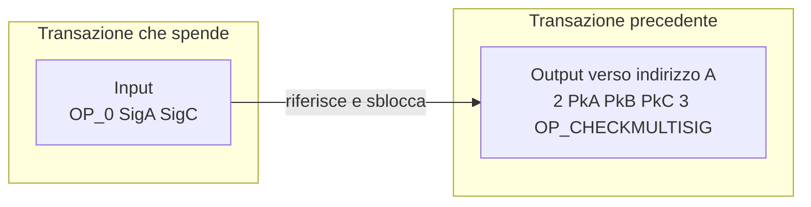
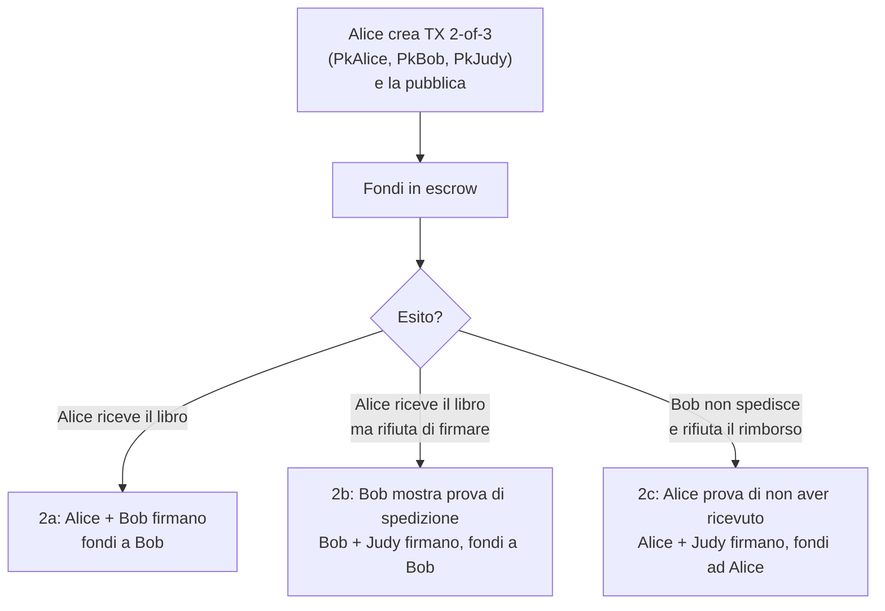
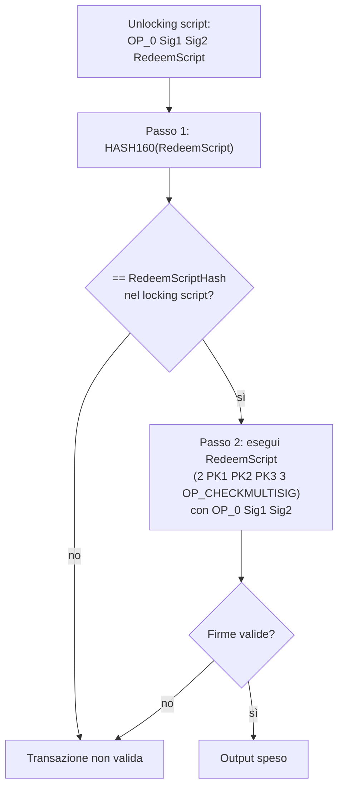
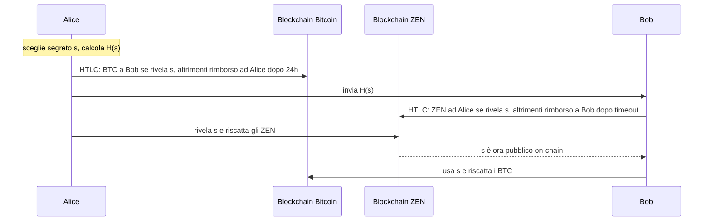
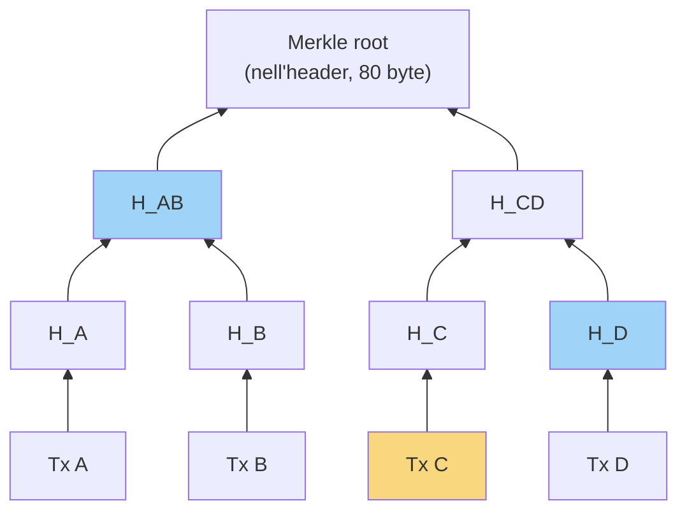
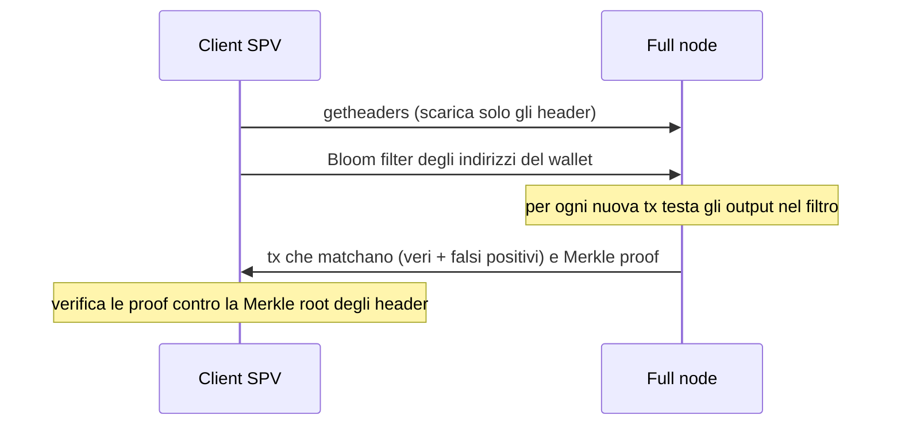
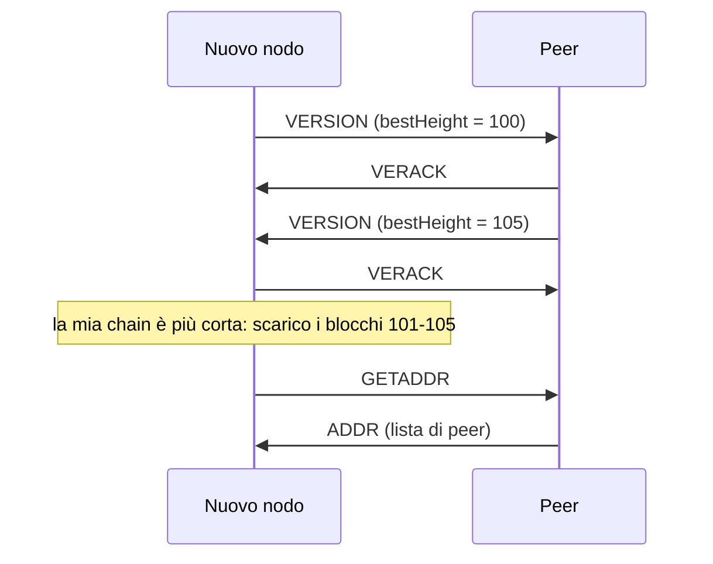
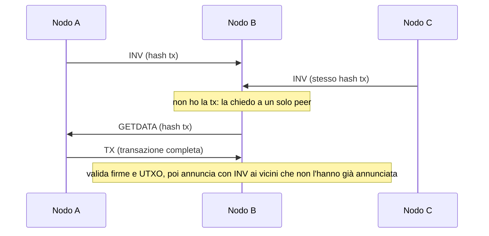

---
tags:
  - università/p2p-blockchain
  - bitcoin
  - bitcoin-script
  - spv
data: 2026-03-24
lezione: "L11 - Advanced Bitcoin Scripts, SPV Clients"
professore: "Laura Ricci"
---

# Bitcoin: script avanzati, client SPV e rete P2P

Nelle lezioni precedenti abbiamo visto come funzionano le transazioni Bitcoin nel caso "normale": un output viene bloccato da un *locking script* (tipicamente P2PKH, che richiede una firma corrispondente a una certa chiave pubblica) e viene speso da un input che fornisce un *unlocking script* adeguato. Il linguaggio Script, però, è molto più espressivo di così: permette di scrivere condizioni di spesa più ricche, e proprio queste condizioni sono i mattoni su cui si costruiscono soluzioni più avanzate.

Questa lezione ha tre parti. Nella prima si studiano alcuni **script avanzati**: le **multi-signature** (firme multiple), il **Pay-to-Script-Hash (P2SH)**, i **hash lock** e i **time lock**, combinati negli **Hash-Time Locked Contracts (HTLC)**, e infine gli script usati per registrare dati sulla blockchain (**OP_RETURN**, **proof of burn**). Multisig, hash lock e time lock sono esattamente gli strumenti su cui si basa la **Lightning Network**, la soluzione di scalabilità per Bitcoin che vedremo nella lezione successiva: vale quindi la pena capirli bene. Nella seconda parte si affronta il problema dei **client leggeri**: come può un telefono verificare un pagamento senza scaricare centinaia di gigabyte di blockchain? La risposta è la **Simplified Payment Verification (SPV)**, che sfrutta i Merkle tree e i Bloom filter. Nella terza parte si guarda da vicino la **rete P2P di Bitcoin**: bootstrap, scoperta dei peer, propagazione di transazioni e blocchi.

---

## Multi-signature

### Il problema delle firme di gruppo

Un **protocollo multi-signature** permette a un gruppo di firmatari di firmare *collettivamente* un contenuto; la verifica della firma viene poi fatta usando le chiavi pubbliche di tutti i firmatari. Il modo banale di realizzarlo è che ciascun firmatario produca una firma indipendente con la propria chiave privata e che le firme vengano semplicemente concatenate. Questa soluzione funziona, ma ha un difetto evidente: la dimensione della "firma complessiva" **cresce linearmente con il numero di firmatari**. Idealmente vorremmo invece una firma la cui dimensione sia indipendente dal numero di firmatari e vicina a quella di una firma ordinaria (firme *aggregate*).

Bitcoin ha adottato in origine la soluzione più semplice. Le firme **ECDSA**, usate da Bitcoin fin dall'inizio, non si possono aggregare: una multisig richiede quindi più firme separate. Le **firme di Schnorr**, che invece permettono l'aggregazione, sono state introdotte solo più tardi con l'aggiornamento **Taproot** (che vedremo in una lezione successiva).

> [!definition] Indirizzo multi-signature
>
> Un **multisignature address** è un indirizzo Bitcoin associato a un locking script che, per spendere i fondi, richiede un numero specificato $M$ di firme valide scelte fra un insieme di $N$ chiavi pubbliche associate all'indirizzo. Si parla di schema **M-of-N**.

### Applicazioni tipiche

Le slide presentano una serie di casi d'uso che aiutano a capire perché uno schema M-of-N sia utile. Un **1-of-2** modella il conto cassa comune di marito e moglie per le piccole spese: basta la firma di uno dei due per spendere. Un **2-of-2** modella invece un conto di risparmio comune, in cui ciascuna delle due parti deve approvare ogni transazione. Un **2-of-3** può rappresentare il conto di risparmio di un figlio con i due genitori: il figlio non può prelevare senza il consenso di almeno uno dei genitori.

Un caso interessante è il **wallet a due fattori** con 2-of-2. Se il wallet usa una sola chiave e un trojan infetta il telefono, l'attaccante prende il controllo del nodo e può mandarsi i soldi. Se invece il software del wallet è installato sia sul telefono sia sul laptop e ogni spesa richiede la firma di entrambi i dispositivi, compromettere uno solo dei due non basta.

Infine, il **2-of-3 con escrow senza fiducia** fra compratore e venditore, usato comunemente per i contratti di deposito in garanzia (che vedremo in dettaglio fra poco), e il **2-of-2 come mattone fondamentale della Lightning Network**.

### Locking e unlocking script

La forma generale di un locking script che impone una condizione M-of-N è:

```
M <PubKey1> ... <PubKeyN> N OP_CHECKMULTISIG
```

dove $N$ è il numero totale di chiavi pubbliche elencate e $M$ è la soglia di firme richieste per spendere l'output. Ad esempio, una condizione 2-of-3 si scrive:

```
2 <PkA> <PkB> <PkC> 3 OP_CHECKMULTISIG
```

Questo locking script può essere soddisfatto da un unlocking script che contiene **una qualunque combinazione** del numero richiesto di firme, prodotte con le chiavi private corrispondenti alle chiavi pubbliche elencate:

```
<Signature 1> ... <Signature M>
```

Per l'esempio 2-of-3, un unlocking valido è `<Signature A> <Signature C>`, ma anche A+B o B+C funzionerebbero. Questo schema di uscita "nuda" con le chiavi scritte direttamente nel locking script si chiama **P2MS** (*Pay-to-Multisig*): l'output che fa riferimento all'indirizzo contiene le chiavi pubbliche di tre persone, e solo due di loro devono fornire le firme nell'input che spende i bitcoin.

> [!note] Il bug di OP_CHECKMULTISIG
>
> Nelle slide, negli esempi successivi (P2SH), l'unlocking script di una multisig comincia con un `OP_0`. Il motivo, non spiegato nelle slide, è un bug storico dell'implementazione originale: `OP_CHECKMULTISIG` preleva dallo stack un elemento in più di quelli che dovrebbe. Per compatibilità il bug non è mai stato corretto, e si aggiunge quindi un valore fittizio (`OP_0`) all'inizio dell'unlocking script, cioè `OP_0 <Sig A> <Sig C>`.


*Fig. — Uno schema P2MS 2-of-3: l'output contiene tre chiavi pubbliche, l'input che lo spende ne presenta due firme.*

---

## Escrow transactions

> [!warning] Chiesto all'esame
>
> "Bitcoin: cos'è un escrow?" è stata una domanda d'orale. Bisogna saper raccontare lo scenario completo (Alice, Bob, Judy), il ruolo del 2-of-3 e i tre possibili esiti.

### Lo scenario

Alice vuole comprare un libro raro da Bob. Vivono in città diverse, quindi non possono scambiarsi merce e denaro di persona; Bob promette di spedire il libro una volta ricevuto il pagamento in bitcoin. Il problema è che **Alice e Bob non si fidano l'uno dell'altra**: Alice non vuole pagare prima di aver ricevuto il libro, e Bob non vuole spedire prima di essere stato pagato.

La soluzione è introdurre una terza parte e fare una **escrow transaction** (in italiano, *deposito in garanzia*). Alice e Bob si fidano entrambi di Judy per risolvere un'eventuale disputa, ma **non vogliono affidarle i fondi**. La multisig permette esattamente questo: durante la transazione nessuno può muovere i fondi da solo, i bitcoin restano in una specie di "limbo". Naturalmente il contratto fallisce se Judy si mette d'accordo (*colludes*) con Alice o con Bob.

### Il funzionamento

Alice crea una transazione **2-of-3**: l'input è un suo indirizzo con i bitcoin per il pagamento, sbloccato dalla sua firma, mentre l'output contiene una chiave pubblica ciascuno di Alice, Bob e Judy. Alice pubblica la transazione sulla blockchain. Da questo momento i coin sono in escrow fra i tre, e **due qualsiasi di loro** possono riscattarli e decidere chi li riceve.

Se tutto va bene, Alice riceve il libro e **Alice e Bob firmano insieme** la transazione che rilascia i fondi a Bob, senza nessun coinvolgimento di Judy. Nel caso normale, quindi, serve solo una transazione in più sulla blockchain: la prima mette i soldi in escrow (dall'indirizzo di Alice), la seconda li manda a Bob, firmata da Alice e Bob.

Se invece c'è una disputa, per esempio Bob non ha spedito il libro o il pacco è andato perso, Alice non vuole pagare perché si sente truffata, e Bob non firmerà mai una transazione che restituisce i soldi ad Alice, magari negando l'accusa. Nessuna delle due parti vuole firmare. A quel punto interviene Judy, che può muovere i fondi insieme ad Alice o insieme a Bob. Se decide che Bob ha imbrogliato, firma con Alice una transazione che restituisce il denaro ad Alice: Alice e Judy forniscono due delle tre firme richieste. La procedura è simmetrica nell'altro senso.


*Fig. — I tre esiti di una escrow transaction 2-of-3.*

> [!tip] Intuizione chiave
>
> L'arbitro Judy è necessario solo nel caso di disputa, e anche allora non può rubare i fondi da sola: il 2-of-3 le dà potere decisionale ma non la custodia. È la differenza fra un arbitro e un custode.

---

## Pay-to-Script-Hash (P2SH)

### I problemi delle multisig "nude"

Gli script multisig, così come li abbiamo scritti, sono scomodi da usare. Il locking script deve essere comunicato a **chiunque voglia pagare** l'indirizzo multisig. Se un amico vuole mandare un regalo al conto 1-of-2 di marito e moglie, i due devono comunicargli l'intero locking script, e l'amico deve inserirlo nella parte di locking della sua transazione.

Il problema si aggrava con un esempio più realistico. Un cliente vuole pagare un'azienda con 5 soci che richiede una multisig 2-of-5 per spendere i fondi:

```
2 <PubKey1> <PubKey2> <PubKey3> <PubKey4> <PubKey5> 5 OP_CHECKMULTISIG
```

L'azienda deve comunicare questo script a tutti i suoi clienti, e il cliente ha bisogno di un wallet speciale capace di costruire transazioni con script personalizzati. La transazione risultante è circa **cinque volte più grande** di una normale, quindi richiede fee più alte per essere presa in considerazione dai miner, e il costo di questa transazione enorme ricade sul **cliente**, che non ha scelto lui di usare una multisig. Lo script potrebbe anche essere troppo lungo per stare in un QR code. Infine, uno script lungo resta nell'**UTXO set**, tenuto in RAM da ogni full node, finché l'output non viene speso.

### L'idea di P2SH

Il **Pay-to-Script-Hash** (P2SH), introdotto nel gennaio 2012 con il **BIP-16**, risolve questi problemi con un'idea semplice: il beneficiario di una transazione diventa **l'hash di uno script**, invece del proprietario di una chiave pubblica. Nel locking script si inserisce l'hash dello script, non lo script: il mittente manda soldi a un hash, non a un indirizzo di chiave pubblica. Per sbloccare e riscattare l'output, il destinatario deve presentare lo **script originale**, che deve produrre lo stesso hash contenuto nel locking script, insieme alle firme richieste dallo script stesso.

> [!definition] P2SH
>
> Locking script: `OP_HASH160 <RedeemScriptHash> OP_EQUAL`
>
> Unlocking script: `<Response To Redeem Script> <Redeem Script>`
>
> Il **redeem script** è lo script "vero" (ad esempio la multisig); il locking script ne contiene solo l'hash (HASH160 = RIPEMD160(SHA256(·)), 20 byte). La validazione verifica prima che l'hash del redeem script presentato coincida, poi esegue il redeem script con i dati di risposta.

Le slide mostrano l'esempio del confronto. Una multisig 1-of-2 "nuda" avrebbe:

```
Locking:   OP_1 <PubKey1> <PubKey2> OP_2 OP_CHECKMULTISIG
Unlocking: OP_0 <Sig1>        (oppure OP_0 <Sig2>)
```

Con P2SH, invece, il locking diventa sempre lo stesso schema corto, e tutto lo script si sposta nell'unlocking. Per una 2-of-3:

```
Locking:   OP_HASH160 <RedeemScriptHash> OP_EQUAL
Unlocking: OP_0 <Sig1> <Sig2> <OP_2 <PubKey1> <PubKey2> <PubKey3> OP_3 OP_CHECKMULTISIG>
```

dove l'ultimo elemento, fra parentesi angolari esterne, è il redeem script serializzato come un unico dato.


*Fig. — Validazione in due passi di un output P2SH.*

### Vantaggi di P2SH

Gli script complessi sono sostituiti nell'output da un'**impronta corta**, e le transazioni diventano più piccole. Gli script vengono codificati come **indirizzi normali** (gli indirizzi P2SH iniziano con "3"), quindi anche un wallet semplice può pagare verso di essi. Soprattutto, P2SH **sposta l'onere** in quattro sensi:

- l'onere di **costruire lo script** passa dal mittente al destinatario;
- l'onere di **memorizzare lo script lungo** passa dall'output (che sta nell'UTXO set, in RAM) all'input (che sta nella blockchain, su disco);
- la memorizzazione dello script lungo passa dal **momento presente** (quando si paga) a un **momento futuro** (quando l'output viene speso);
- il **costo in fee** dello script lungo passa dal mittente al destinatario.

> [!tip] Intuizione chiave
>
> P2SH rende "chi vuole la complessità, la paga". Chi riceve decide di usare una multisig o uno script complicato; chi paga vede solo un indirizzo normale di 20 byte.

---

## Hash-Time Locked Contracts (HTLC)

### Hash lock e time lock

Gli **HTLC** sono script con una condizione di riscatto più complessa, ottenuta combinando due meccanismi.

Un **hash lock** funziona così: si calcola l'hash di un segreto e lo si memorizza pubblicamente in uno script (o smart contract); i fondi vengono sbloccati solo se il destinatario designato fornisce il segreto, rivelandolo quindi pubblicamente. Poiché le funzioni hash crittografiche sono *one-way* (non invertibili), conoscere l'hash non permette di ricavare il segreto.

Un **hash time lock** aggiunge una via d'uscita: l'hash del segreto è pubblicato nello script, e i fondi si sbloccano **o** se il destinatario fornisce il segreto, **oppure** dopo un **timeout** specificato nello script (in quel caso tornano al mittente). Il time lock garantisce che i fondi non restino bloccati per sempre se la controparte sparisce.

Gli HTLC sono usati per i **payment channel** come la Lightning Network e per realizzare gli **atomic swap**.

### Atomic swap: scambi senza intermediario

Se voglio scambiare una criptovaluta con un'altra, di solito vado da un **exchange**. L'exchange deve offrire la coppia di scambio che mi interessa, e soprattutto devo inviare i miei fondi al suo indirizzo: **devo fidarmi** dell'exchange.

Gli **atomic swap** sono una tecnologia che permette scambi P2P fra criptovalute diverse **senza terze parti**. Il problema da risolvere è che qualcuno deve inviare i fondi per primo, e la controparte potrebbe poi decidere di non fare la sua parte. Gli HTLC impediscono che questo accada.

Lo schema generale è: Alice blocca i fondi usando l'hash $H(s)$ di un segreto $s$; manda $H(s)$ a Bob; Bob fa lo stesso sull'**altra** blockchain usando lo **stesso** hash; quando uno dei due (Alice) rivela il segreto per riscattare, il segreto viene registrato on-chain e l'altro può usarlo per riscattare a sua volta. L'**hash lock sincronizza** lo scambio, il **time lock protegge**: se qualcosa va storto, i fondi si possono recuperare.

### Esempio: Bitcoin contro ZEN

Alice possiede bitcoin, Bob possiede la criptovaluta ZEN, e si accordano per scambiarne una certa quantità.

Alice crea un HTLC sulla blockchain Bitcoin che impone queste condizioni: se non succede nulla per 24 ore, i soldi tornano ad Alice (componente time lock), così Alice non perde nulla se Bob non risponde, magari perché è offline; se Bob fornisce il segreto, i bitcoin vengono trasferiti automaticamente al suo indirizzo. Bob conosce l'hash ma **non il segreto**, perché le funzioni hash sono one-way.

Bob crea un contratto analogo sulla chain ZEN, bloccandolo con il lock che Alice gli ha mandato (lo stesso hash usato da lei). A questo punto Alice usa il segreto scelto all'inizio per sbloccare l'hash lock del contratto di Bob sulla chain ZEN, e riceve gli ZEN. Questa operazione è **pubblica** e verificabile sulla blockchain. Bob vede ora il segreto e lo usa per sbloccare i bitcoin del contratto di Alice: l'HTLC rilascia automaticamente i fondi al suo indirizzo Bitcoin.


*Fig. — Atomic swap Bitcoin/ZEN con HTLC: lo stesso hash lock lega i due contratti.*

> [!note] Un dettaglio sui timeout
>
> Le slide non lo esplicitano, ma perché lo scambio sia sicuro il timeout del contratto di Bob deve essere **più corto** di quello di Alice. Altrimenti Alice potrebbe aspettare che il suo contratto scada, riprendersi i bitcoin e solo dopo rivelare $s$ per prendere anche gli ZEN. Con un timeout più corto sul contratto di Bob, se Alice rivela $s$ lo fa in tempo perché Bob possa usarlo sul contratto di Alice, ancora attivo. Lo stesso principio (timeout decrescenti) ricomparirà nei pagamenti multi-hop della Lightning Network.

### HTLC in Bitcoin Script

Queste condizioni si possono codificare in Bitcoin Script, il linguaggio a stack in stile FORTH, che offre diverse istruzioni per esprimere condizioni di riscatto complesse (le slide mostrano uno script di esempio in forma di immagine).

> [!note] Uno script HTLC tipico (non riportato testualmente nelle slide)
>
> Una forma standard di HTLC in Bitcoin Script è la seguente:
>
> ```
> OP_IF
>     OP_SHA256 <H> OP_EQUALVERIFY <PubKey Bob>
> OP_ELSE
>     <timeout> OP_CHECKLOCKTIMEVERIFY OP_DROP <PubKey Alice>
> OP_ENDIF
> OP_CHECKSIG
> ```
>
> Il ramo `IF` è l'hash lock: Bob spende fornendo la preimmagine di $H$ e la sua firma. Il ramo `ELSE` è il time lock: dopo `timeout` (verificato da `OP_CHECKLOCKTIMEVERIFY`) Alice può riprendersi i fondi con la sua firma.

---

## Registrare dati sulla blockchain

### La blockchain come notaio

L'irreversibilità della blockchain è utile anche oltre i pagamenti. Si può calcolare l'**impronta digitale** (hash) di un file e registrarla sulla blockchain, stabilendo una **proof-of-existence**: la prova che quel file esisteva in una certa data. La blockchain diventa un **registro notarile**.

Il primo modo in cui questo veniva fatto era usare l'indirizzo di destinazione di un output come un campo libero generico di 20 byte, cioè fare un **pagamento finto** verso un "indirizzo" che in realtà è l'hash del documento. Nessuna chiave privata corrisponde a quell'indirizzo, quindi l'output non può mai essere riscattato. Il problema è che la voce corrispondente nell'**UTXO set non può mai essere rimossa**: è **inquinamento di dati**, e la RAM occupata dall'UTXO set cresce. La questione era controversa: permettere la scrittura di dati sulla blockchain o vietarla?

### OP_RETURN

Dopo il 2013 si è adottato un compromesso con un nuovo script:

```
OP_RETURN <Data>
```

`OP_RETURN` fornisce un metodo **standardizzato** per inserire dati arbitrari in un output **non spendibile**: si crea un output fittizio con un testo arbitrario, e i bitcoin associati non potranno mai essere spesi. Poiché l'output è dichiaratamente non spendibile, i nodi possono **non inserirlo nell'UTXO set**, risolvendo il problema dell'inquinamento. Si usa in due casi: quando non si spende nessun bitcoin (valore 0) e si vuole solo registrare dati, oppure per **bruciare** bitcoin.

### Proof of burn

Uno script di **proof-of-burn** non può mai essere riscattato. Un **burn address** è un indirizzo senza chiave privata: mandare coin a uno script di proof-of-burn li distrugge per sempre, non c'è alcun modo di spenderli, ed è **dimostrabile** che quei bitcoin sono stati distrutti.

Gli usi citati nelle slide sono due. Il primo è il **bootstrap di una criptovaluta alternativa**: si costringe chi vuole ottenere monete nuove della nuova criptovaluta a distruggere bitcoin. Il secondo è implementare una **forma alternativa di consenso**: si "bruciano" coin per vincere la lotteria dell'estrazione del blocco, e più coin si bruciano, maggiore è la probabilità di vincere. Invece di pagare in energia (come nella Proof of Work) si paga in monete. Il problema è che i coin bruciati e le ricompense devono essere bilanciati, e questo è difficile da realizzare.

---

## Simplified Payment Verification (SPV)

> [!warning] Chiesto all'esame
>
> Una domanda d'orale è stata: "Cos'è un Merkle tree? Quando si usano la Merkle root e una Merkle proof in Bitcoin?". La docente voleva arrivare ai **nodi SPV** (light client). Bisogna saper collegare header, Merkle root e Merkle proof.

### Perché servono i client leggeri

Per fare una transazione è davvero necessario scaricare tutta la blockchain Bitcoin? Richiederebbe molto tempo e molto spazio: le slide citano più di 649 GB al 7 aprile 2025. La maggior parte degli utenti non vuole memorizzare tutti questi dati nel proprio wallet, né usare molta CPU per validare le transazioni degli altri. Serve un **client leggero** che possa girare su un telefono, meno esigente in memoria e CPU, ma senza rinunciare a un buon livello di sicurezza.

La soluzione è il client **SPV** (*Simplified Payment Verification*, detto anche *lightweight client*), che scarica **solo gli header dei blocchi**. Un client SPV è interessato solo alle transazioni che riguardano gli indirizzi del suo wallet; è di solito ospitato su dispositivi mobili; non scarica l'intera blockchain e non riceve le transazioni che non gli servono. Ogni header pesa solo **80 byte**, e l'insieme degli header è circa **1000 volte più piccolo** della blockchain completa.

> [!note] Ordine di grandezza
>
> Con circa 900.000 blocchi, gli header occupano $900.000 \times 80\ \text{B} \approx 72\ \text{MB}$: una quantità che un telefono gestisce senza problemi, contro le centinaia di GB della chain completa. (Stima aggiunta, non presente nelle slide.)

Sul piano della sicurezza, l'header contiene il **nonce** e il target di difficoltà, quindi il client SPV **può verificare la Proof of Work** di ogni blocco e seguire la catena con più lavoro. Inoltre, grazie alla Merkle root contenuta nell'header, **può verificare che una transazione appartiene davvero a un blocco**.

### Verificare che una transazione è in un blocco

Il client SPV chiede una transazione e il full node gliela manda. Ma il full node potrebbe imbrogliare e inviare transazioni non valide o inesistenti. Per dimostrare al client che la transazione appartiene davvero a un blocco della blockchain, il full node invia anche il **Merkle branch** che collega la transazione alla Merkle root del suo blocco: una **Merkle proof**.

Il client SPV applica ricorsivamente la funzione hash partendo dalla transazione ricevuta, combinandola via via con gli hash "fratelli" della proof, e confronta il risultato con la **Merkle root** memorizzata nell'header del blocco (che ha già e di cui ha verificato la PoW). Se coincidono, questa è la prova che la transazione appartiene davvero al blocco.


*Fig. — Merkle proof per la Tx C: il full node invia solo H_D e H_AB (in blu); il client calcola H_C, poi H_CD = H(H_C ∥ H_D), poi H(H_AB ∥ H_CD) e lo confronta con la root dell'header.*

> [!tip] Intuizione chiave
>
> Per un blocco con $n$ transazioni la Merkle proof contiene solo circa $\log_2 n$ hash. Con 4000 transazioni bastano 12 hash da 32 byte, meno di 400 byte, invece di scaricare l'intero blocco. È proprio la struttura ad albero che rende possibile la verifica leggera.

> [!note] Cosa l'SPV *non* verifica
>
> Il client SPV verifica che la transazione è inclusa in un blocco con PoW valida, e quanti blocchi sono stati minati sopra (le conferme). Non verifica invece da solo che gli input della transazione non siano già stati spesi, perché non ha l'UTXO set: si fida del fatto che la maggioranza della potenza di calcolo non avrebbe esteso un blocco invalido. Per questo si parla di sicurezza "quasi" pari a quella di un full node. (Precisazione aggiunta rispetto alle slide.)

### Il problema della privacy e i Bloom filter

Se il client SPV chiede a un full node proprio le transazioni che gli interessano, **rivela informazioni**: il full node scopre quali indirizzi appartengono al wallet. Una soluzione è che il client SPV mandi al full node un **Bloom filter** degli indirizzi del wallet.

Il nodo SPV crea un Bloom filter che rappresenta solo gli indirizzi che gli interessano (quelli del suo wallet) e lo invia al full node. Per costruirlo, prende ciascun indirizzo (hash di chiave pubblica) del wallet, gli applica tutte le funzioni hash del Bloom filter ottenendo un vettore di bit con alcuni 1, e infine calcola l'**OR bit a bit** dei vettori ottenuti per tutti gli indirizzi.

Il full node, a sua volta, testa gli output di ogni transazione contro il filtro e manda al client SPV solo le transazioni che corrispondono. Per ogni output applica le stesse funzioni hash all'indirizzo di destinazione. Se **tutte** le funzioni restituiscono l'indice di una posizione che vale 1 nel filtro, la transazione **potrebbe** interessare al client SPV: sono possibili **falsi positivi**. Se invece **almeno una** funzione restituisce una posizione a 0, la transazione **sicuramente non** interessa al wallet.


*Fig. — Interazione fra client SPV e full node con Bloom filter.*

Perché usare i Bloom filter? Per due motivi. Il primo è la **privacy**: il filtro offusca gli indirizzi del client, perché i falsi positivi fanno sì che il full node riceva richieste per un insieme più ampio di transazioni e non sappia quali siano davvero di interesse. Questa privacy è però **limitata**, e ci sono proposte di miglioramento. Il secondo è il **risparmio di banda**: il client riceve solo una piccola frazione delle transazioni.

> [!tip] Il compromesso dei falsi positivi
>
> La dimensione del filtro e il numero di funzioni hash regolano il tasso di falsi positivi. Più falsi positivi significano più privacy (il full node vede un insieme più grande di transazioni "candidate") ma più banda consumata; meno falsi positivi significano meno banda ma meno privacy. Per i dettagli sui Bloom filter si veda la lezione sulle strutture dati ([[L06 - Strutture dati per DHT e Blockchain]]).

---

## La rete P2P di Bitcoin

### Lo stack e la topologia

Bitcoin è organizzato come uno stack di protocolli in cui, sotto il livello del consenso e delle transazioni, c'è una **rete P2P** che trasporta i messaggi. Questa rete è un **overlay non strutturato**: chiunque può connettersi. Ma come?

### Bootstrap

Un nuovo client deve contattare qualche peer della rete per ricevere i blocchi. Ci sono diversi metodi. Il primo sono gli **indirizzi seed** codificati nel client (*hard-coded*): nodi stabili, attivi da molto tempo, i cui indirizzi sono noti; il loro IP deve essere statico. Il secondo è il **DNS bootstrap**: alcuni nodi dedicati (DNS seed) rispondono a query DNS restituendo indirizzi IP di altri nodi. Se tutti i metodi precedenti falliscono, si possono chiedere indirizzi IP di altri partecipanti su **chat e forum** e aggiungerli manualmente al client.

Dopo il bootstrap, un nodo ricorda gli indirizzi delle sue connessioni riuscite più recenti, così se viene riavviato può ristabilire rapidamente le connessioni con i peer precedenti.

### Peer discovery

I nodi seed non sono molto decentralizzati, quindi non è consigliabile affidarsi completamente alla lista di peer che forniscono. Il nodo deve trovare altri peer: invia un messaggio **GETADDR** ai vicini, chiedendo una lista di indirizzi di rete di altri peer, e li riceve in messaggi **ADDR**. Il nuovo peer pubblicizza anche la propria esistenza, inviando ai vicini un messaggio ADDR con il proprio indirizzo IP; i vicini lo inoltrano a loro volta ai propri vicini.

### Connessioni e handshake

Bitcoin usa **TCP**, sulla porta ben nota **8333** per accettare connessioni in ingresso, e **senza autenticazione né cifratura**.

> [!warning] Attenzione ai numeri delle connessioni
>
> Le slide riportano "by default 117 outgoing TCP connections, 8 incoming connections". In Bitcoin Core i valori di default sono in realtà invertiti: **8 connessioni in uscita** (*outbound*) e fino a **117 in ingresso** (*inbound*), per un massimo di 125 connessioni totali. Probabilmente si tratta di un'inversione nel testo delle slide.

Quando stabilisce una connessione, il nodo avvia un **handshake**. Il messaggio **VERSION** contiene informazioni identificative di base, fra cui **bestHeight**, l'altezza attuale della blockchain del nodo (numero di blocchi). Il nodo che lo riceve confronta: se la propria blockchain è più corta di bestHeight, richiede e scarica i blocchi mancanti.


*Fig. — Handshake e peer discovery (lo scambio VERACK è un dettaglio standard aggiunto rispetto alle slide).*

### Il protocollo di gossip

Nella maggior parte delle blockchain permissionless, transazioni e blocchi si propagano con **broadcast** o **gossip**: una comunicazione *any-to-all* in cui ogni nodo propaga ai vicini la transazione o il blocco ricevuto. I peer formano un overlay **casuale e ben connesso**.

La propagazione standard non invia subito i dati completi, ma usa un meccanismo di **annuncio**:

- **INV** è un messaggio di annuncio che contiene gli **hash** dei blocchi o delle transazioni posseduti dal nodo, non i blocchi o le transazioni completi. Ogni volta che un nodo riceve una transazione o un blocco, la annuncia a ciascun vicino con un INV.
- **GETDATA** è la richiesta di un blocco o di una transazione, inviata dai peer che non hanno ancora quel dato.
- **BLOCK** e **TX** contengono il blocco o la transazione vera e propria.

Una regola importante: **richiedere ogni oggetto a un solo peer**. Se ricevo lo stesso hash da più peer, invio GETDATA a uno solo, per minimizzare il consumo di banda.


*Fig. — Propagazione INV / GETDATA / TX.*

Un nodo **non propaga** una transazione se è invalida o se la conosce già. Inoltre esegue alcuni controlli: validazione delle firme e validazione degli **UTXO** (gli input devono riferirsi a output esistenti e non spesi). I messaggi di blocco sono gestiti in modo analogo.

### Protezione dal Denial of Service

Cosa impedisce a un nodo malevolo di inondare la rete di oggetti invalidi? Un flooding di questo tipo saturerebbe la rete e aumenterebbe i ritardi di trasmissione. La prevenzione si ottiene con una semplice scelta di progetto: un nodo invia l'INV di un blocco ai suoi peer **solo dopo averlo validato**, quindi gli oggetti invalidi non si propagano oltre il primo nodo onesto. Inoltre i nodi mantengono una **reputazione** dei propri peer, secondo alcune euristiche predefinite: se un peer si comporta male (ad esempio invia una transazione con firme invalide), la sua reputazione viene abbassata e, sotto una certa soglia, viene disconnesso.

### Unsolicited block push

Per i blocchi appena minati c'è un'eccezione al meccanismo INV/GETDATA. Il miner sa di essere l'**unico** peer a conoscere il blocco appena trovato: gli altri non possono averlo. È inutile annunciarlo e aspettare la richiesta, quindi il miner **invia direttamente il blocco** ai vicini, risparmiando un round-trip. Questo riduce il tempo di propagazione, che come sappiamo è importante per ridurre i fork.

### GETBLOCKS: sincronizzare la chain

Il messaggio GETBLOCKS (nelle slide "GETBLOCK") permette a un peer $P$ che è stato disconnesso, o che si avvia per la prima volta, di ottenere i blocchi necessari a ricostruire la blockchain aggiornata. È complicato a causa dei **fork**: $P$ non sa a priori da quale punto la sua versione diverge da quella dei vicini.

$P$ chiede a un vicino la sua visione locale della blockchain; il vicino risponde con gli hash di un insieme di blocchi a varie altezze della sua chain locale. $P$ trova il **primo hash in comune** e chiede i blocchi successivi con GETDATA. Il processo è **iterativo**: dopo aver scaricato tutti questi blocchi, si invia un altro GETBLOCKS.

> [!note] Block locator
>
> Nell'implementazione reale è di solito $P$ a inviare nel messaggio un *block locator*, cioè una lista di hash della propria chain presi a distanze crescenti (gli ultimi 10 blocchi, poi a salti che raddoppiano fino al genesis); il vicino trova l'ultimo hash in comune e risponde con un INV dei blocchi successivi (fino a 500). La struttura esponenziale permette di trovare il punto di fork con pochi hash anche su chain molto lunghe. (Dettaglio aggiunto.)

---

> [!question] Possibili domande d'esame
>
> - Che cos'è una multi-signature in Bitcoin? Come si scrive un locking script M-of-N e quali sono le applicazioni tipiche?
> - Che cos'è una escrow transaction? Descriva lo scenario di Alice, Bob e Judy e i possibili esiti.
> - Quali problemi hanno le multisig "nude" e come li risolve P2SH? Chi paga il costo dello script, e perché?
> - Che cos'è un HTLC? Come funzionano hash lock e time lock, e come si usano per realizzare un atomic swap?
> - A cosa servono OP_RETURN e la proof of burn? Perché il vecchio metodo di registrare dati "inquinava" l'UTXO set?
> - Che cos'è un client SPV? Come verifica che una transazione è contenuta in un blocco? Quale ruolo hanno Merkle root e Merkle proof?
> - Perché un client SPV usa i Bloom filter? Quali vantaggi e quali limiti hanno?
> - Come si propagano transazioni e blocchi nella rete P2P di Bitcoin? Come si protegge la rete dal DoS?

> [!abstract] Sintesi
>
> Bitcoin Script permette condizioni di spesa avanzate. La **multisig M-of-N** (`OP_CHECKMULTISIG`) richiede $M$ firme su $N$ chiavi e abilita conti condivisi, wallet a due fattori ed **escrow** 2-of-3 con arbitro. **P2SH** (BIP-16) sostituisce lo script con il suo hash nel locking, spostando costo e complessità dal mittente al destinatario e dall'UTXO set alla blockchain. Gli **HTLC** combinano **hash lock** (sblocco con la preimmagine di un hash) e **time lock** (rimborso dopo un timeout); sono alla base della Lightning Network e degli **atomic swap** fra chain diverse. **OP_RETURN** registra dati in output non spendibili senza inquinare l'UTXO set; la **proof of burn** distrugge coin in modo verificabile. I client **SPV** scaricano solo gli header da 80 byte, verificano la PoW e controllano l'inclusione delle transazioni con **Merkle proof** di $O(\log n)$ hash; usano i **Bloom filter** per privacy (limitata) e risparmio di banda. La rete P2P di Bitcoin è un overlay non strutturato su TCP/8333, con bootstrap via seed e DNS, discovery con GETADDR/ADDR, handshake VERSION con bestHeight, gossip INV/GETDATA, validazione prima dell'inoltro e reputazione dei peer contro il DoS.
