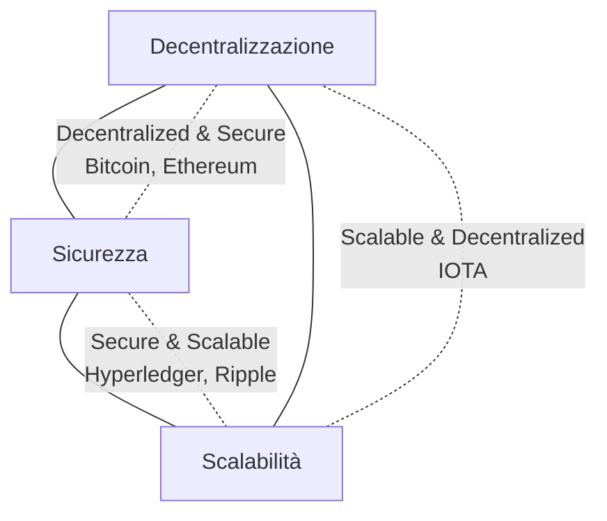
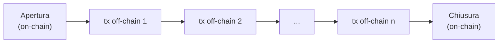
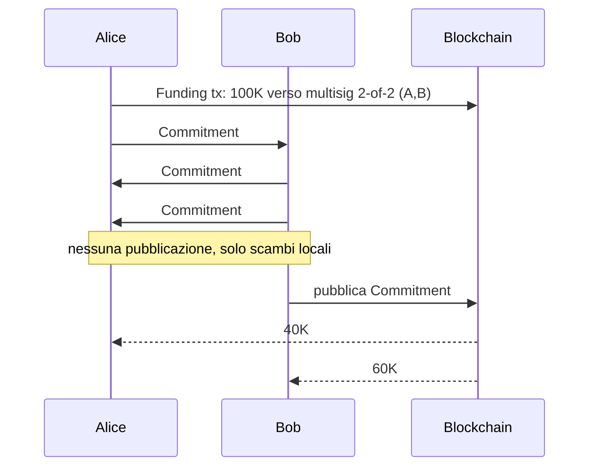
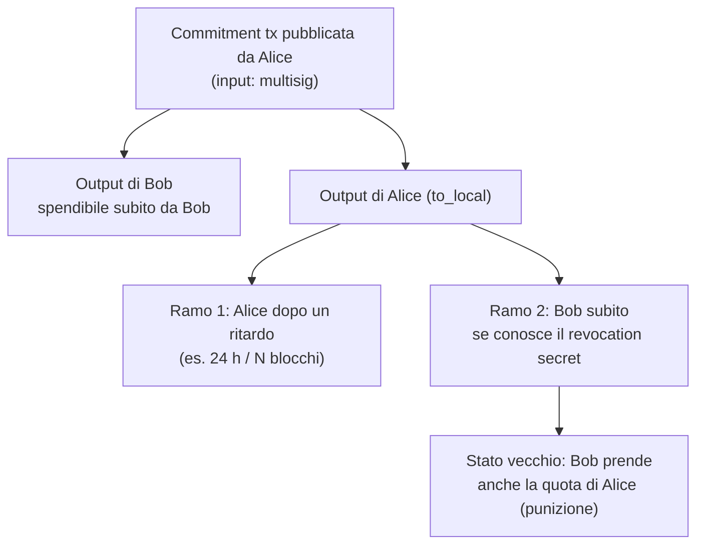
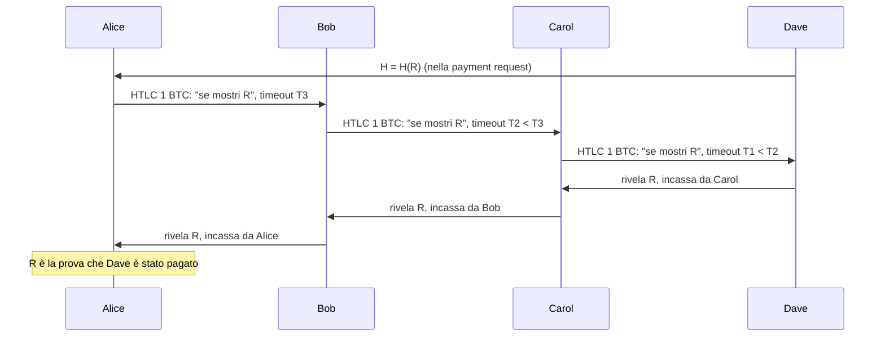
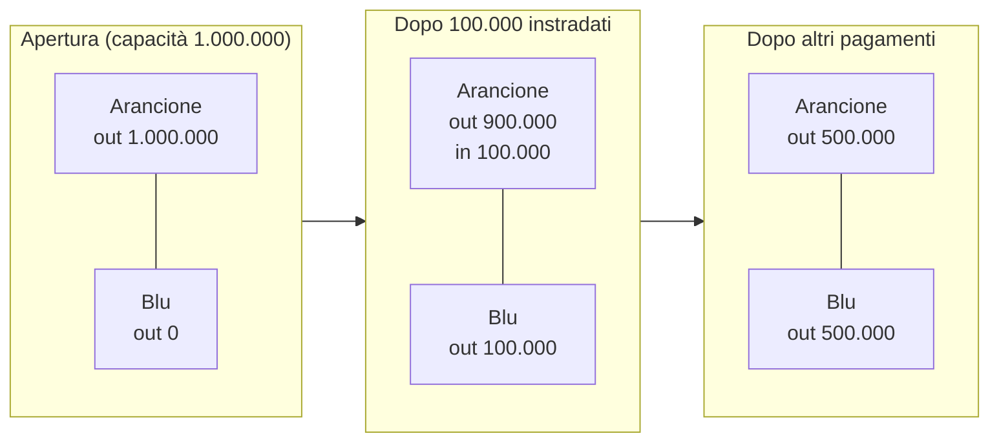
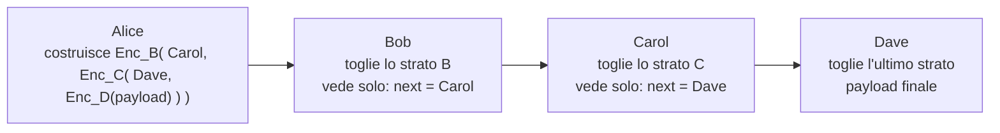

---
tags:
  - università/p2p-blockchain
  - bitcoin
  - lightning-network
  - scalabilità
data: 2026-03-26
lezione: "L12 - Scaling Blockchain: the Bitcoin Lightning Network"
professore: "Laura Ricci"
---

# Scalare la blockchain: la Bitcoin Lightning Network

Bitcoin funziona, è sicuro ed è decentralizzato, ma è **lento** e gestisce **pochissime transazioni al secondo**. Questa lezione parte da questo limite, lo inquadra nel cosiddetto **trilemma della blockchain**, discute le soluzioni "on-chain" (blocchi più grandi, blocchi più frequenti, consenso alternativo) e mostra perché non bastano. Arriva poi all'idea dei **canali di pagamento off-chain** e alla loro realizzazione più importante, la **Lightning Network**: una rete di canali costruita "sopra" Bitcoin (*layer 2*) che permette pagamenti istantanei ed economici usando la blockchain solo come arbitro.

Per capire la Lightning Network servono gli strumenti visti nella lezione precedente ([[L11 - Bitcoin - Multisig, P2SH, HTLC e SPV]]): **multisig 2-of-2**, **time lock**, **hash lock** e il loro composto, l'**HTLC**.

> [!warning] Chiesto all'esame
>
> La Lightning Network è uno degli argomenti più chiesti all'orale: "Cos'è la Lightning Network, perché è stata introdotta e quali sono i principi di funzionamento?" (risposta attesa: è stata introdotta perché Bitcoin non è abbastanza scalabile). Altre domande collegate: "Blockchain trilemma" e "Quali sono i modi per risolvere la scalabilità in Bitcoin ed Ethereum?" (Lightning Network, dimensione del blocco, intervallo fra i blocchi, rollup per Ethereum).

---

## Il trilemma della blockchain

### Enunciato

Il termine **blockchain trilemma** è stato introdotto da **Vitalik Buterin**, il fondatore di Ethereum. La domanda è: è possibile massimizzare *contemporaneamente* i tre attributi desiderabili di una blockchain? La risposta è **no**, almeno per ora: si può ottenere solo un "lato" del triangolo, cioè due proprietà su tre.

> [!definition] Le tre proprietà del trilemma
>
> **Decentralization** (decentralizzazione): costruire un sistema che non dipenda da un punto centrale di controllo; ne deriva la **resistenza alla censura**.
>
> **Scalability** (scalabilità): capacità del sistema di gestire un numero crescente di transazioni nell'unità di tempo.
>
> **Security** (sicurezza): capacità della blockchain di funzionare come previsto e di difendersi dagli attacchi.

*Fig. — Il trilemma: ogni sistema ne sceglie un lato.*

### Esempi per ogni lato

Il lato **decentralizzato e sicuro** è quello di **Bitcoin ed Ethereum** (nella sua forma originale), che però non sono affatto scalabili. Sono davvero decentralizzati? Sì, ma con il caveat delle **mining pool**, che concentrano la potenza di calcolo in poche entità.

Il lato **sicuro e scalabile** è quello di sistemi come **Hyperledger** e **Ripple**, che hanno una resistenza alla censura minima: pochi nodi controllano la rete.

Il lato **scalabile e decentralizzato** è quello di **IOTA**, che però non è sicura, perché usa una PoW "leggera".

---

## Le criptovalute non scalano

In Bitcoin **ogni singola transazione è registrata sulla blockchain**, e questo porta a due lamentele.

La prima: **il trasferimento è troppo lento**. Un blocco ogni 10 minuti, moltiplicato per le 6 conferme raccomandate, fa circa **un'ora** prima che un pagamento si possa considerare definitivo (*settlement*).

La seconda: **Bitcoin non scala**. La dimensione del blocco è 1 MB (4 MB di "peso" dal 2017 con SegWit), e una transazione media occupa circa 250 byte. Il calcolo è:

$$
\frac{1\,\text{MB}}{250\,\text{B/tx}} \approx 4000\ \text{tx/blocco}, \qquad \frac{4000\ \text{tx}}{600\ \text{s}} \approx 7\ \text{tps}
$$

cioè circa **7 transazioni al secondo, a livello globale**.

> [!note] Una svista nelle slide
>
> Le slide scrivono "400 tx / 10 min", ma con 1 MB e 250 byte per transazione si ottengono circa 4000 transazioni per blocco, ed è questo il numero coerente con i 7 tps riportati subito dopo ($4000/600 \approx 6{,}7$).

> [!example] Confronto con i circuiti tradizionali
>
> Per dare un ordine di grandezza, i circuiti di pagamento come VISA gestiscono migliaia di transazioni al secondo (e picchi di decine di migliaia). Bitcoin è indietro di diversi ordini di grandezza. (Confronto discorsivo; le slide citano VISA nella sezione sul block size.)

### Soluzioni "on chain"

Una prima famiglia di soluzioni interviene sul protocollo della blockchain stessa.

Si può **aumentare la dimensione del blocco**: ogni blocco contiene più transazioni. Ma blocchi più grandi impiegano più tempo a propagarsi nella rete, e servono nodi più potenti; questo porta a **centralizzazione** e riduce l'incentivo a partecipare.

Si può **aumentare la frequenza dei blocchi**, cioè ridurre l'intervallo fra un blocco e l'altro. Ma se i blocchi arrivano più spesso rispetto al tempo di propagazione, aumentano i **fork**, e quindi diminuisce la **sicurezza** (più lavoro sprecato su rami orfani, più facile per un attaccante).

Si possono usare **protocolli di consenso alternativi**, come la **Proof of Stake** o altri consensi leggeri. I vantaggi sono un basso costo energetico, alta scalabilità, transazioni veloci, e la neutralizzazione dell'attacco del 51% di potenza di calcolo. Gli svantaggi sono che, in molti casi, questi sistemi non sono realmente decentralizzati, e "i poveri restano poveri": chi ha più stake guadagna di più.

### Aumentare il block size: Bitcoin Cash

Una prima soluzione semplice è quella di **Bitcoin Cash**, un **hard fork** di Bitcoin che ha portato la dimensione del blocco a 8 MB e, più di recente, a 32 MB. In realtà **non è una vera soluzione** alla scalabilità. Per sostenere lo stesso numero di transazioni di VISA, il blocco dovrebbe essere di circa **8 GB**. I nodi dovrebbero allora memorizzare circa **400 TB di dati all'anno** e avere una banda di circa **120 Mbit/s**. Questo porterebbe a una drastica riduzione del numero di nodi in grado di sostenere la rete, quindi a **maggiore centralizzazione** e **minore sicurezza**: è esattamente il trilemma all'opera.

> [!tip] Intuizione chiave
>
> Le soluzioni on-chain spostano il sistema lungo il triangolo del trilemma: guadagnano scalabilità ma perdono decentralizzazione o sicurezza. L'idea dei canali off-chain è diversa: invece di far fare più lavoro alla blockchain, le si chiede di fare **meno** lavoro.

---

## Canali di pagamento off-chain

### L'idea di base

Le idee chiave sono tre: **non serve trasmettere tutte le transazioni** alla rete; si fanno la maggior parte delle transazioni **off-chain**; si usa la blockchain **come arbitro solo quando necessario**.

Un canale di pagamento off-chain è un meccanismo **trustless** per scambiare transazioni fra due parti **fuori dalla blockchain**. Le parti transano direttamente alla velocità della rete, evitando la lentezza della blockchain. Le transazioni off-chain sono come **cambiali** (*promissory notes*): promesse di pagamento valide ma non ancora incassate; la blockchain si usa solo per il **settlement** (il regolamento finale). Il meccanismo è costruito sull'infrastruttura esistente (Bitcoin o Ethereum) e offre micropagamenti "decentralizzati", trustless, ad alto volume e istantanei. La forma più semplice è il **canale unidirezionale**; le estensioni sono i **canali bidirezionali** e la **composizione di canali** (pagamenti su più salti).

*Fig. — Ciclo di vita di un canale: solo apertura e chiusura toccano la blockchain.*

### Perché i canali di pagamento sono utili

I canali sono **quasi totalmente off-chain**: eliminano la maggior parte delle operazioni on-chain, e non richiedono un hard fork del protocollo. Offrono **quasi la stessa sicurezza della main chain**, perché seguono le stesse ipotesi di sicurezza, usano la blockchain come arbitrato per prevenire comportamenti disonesti e non riducono la sicurezza della catena principale. Riducono drasticamente il **tempo di settlement** e le **fee**, perché il regolamento è locale e non serve un costoso consenso globale.

I problemi potenziali sono il **blocco dei fondi** (i soldi restano vincolati nel canale), una possibile **centralizzazione** (ancora non del tutto chiara) e il **requisito di essere sempre online** (per sorvegliare la controparte, come vedremo).

### Stato dell'arte

La **Bitcoin Lightning Network** ha avuto una release alpha nel gennaio 2017; nel gennaio 2018 c'è stato il primo acquisto noto tramite Lightning; è sviluppata da diversi gruppi; il 20 marzo 2018 ha subito il primo attacco DDoS, che ha messo offline 200 nodi. Su Ethereum, la **Raiden Network** (e µRaiden) è stata lanciata sulla mainnet nel novembre 2017, ma non ha avuto successo: Ethereum si è orientato verso altre soluzioni di layer 2 (che vedremo nella lezione sui rollup).

---

## La Lightning Network: l'idea generale

La Lightning Network è formata da canali fra nodi Bitcoin che costituiscono una rete di **livello 2** (*layer 2*) sopra Bitcoin: una **rete P2P di canali di pagamento**. È basata su Bitcoin, nel senso che le **transazioni Lightning sono transazioni Bitcoin** a tutti gli effetti (solo che non vengono pubblicate). Permette pagamenti economici e istantanei, anche micropagamenti, ed è estremamente scalabile. La domanda di fondo è: **e se non pubblicassimo tutto?**

### L'analogia del bar

Un cliente dà la carta di credito al barista e comincia a ordinare da bere. Il barista segna le bevute su un conto (*tab*) ma non addebita subito la carta: così evita di pagare la commissione della carta ogni volta, e tiene il saldo fino alla fine. Il barista non rischia nulla, perché ha in mano la carta: se il cliente sparisce, la carta è una garanzia.

La Lightning Network funziona in modo simile. Invece di dare la carta al barista, il cliente **deposita denaro in un indirizzo** chiamato **payment channel**. I pagamenti non vengono registrati sulla blockchain come transazioni, ma in "**registri privati**" gestiti dalle due parti. Il barista riceve una transazione dal cliente, ma, proprio come non addebita la carta, **non la invia alla blockchain**, perché sa che il cliente potrebbe ordinare un'altra bevanda: niente attesa per la conferma, niente fee.

Ogni volta che il cliente beve una nuova birra invia una **nuova transazione**, firmata da lui, che **sostituisce la precedente**. Cliente e barista tengono traccia delle transazioni, ma non modificano il registro pubblico. Il barista non rischia nulla perché può pubblicare la transazione sulla blockchain quando vuole: è valida, dato che è firmata dal cliente. È come pagare a rate il droghiere, segnando tutto su un libretto.

Quando le bevute sono finite, le parti creano una transazione che paga i saldi finali a entrambi e la trasmettono alla rete Bitcoin. Questo approccio aumenta anche la **privacy**, perché sulla blockchain restano solo la transazione di **apertura** e quella di **chiusura**.

---

## Il protocollo Lightning

### Struttura generale

La Lightning Network è un protocollo di layer 2 proposto da **Poon e Dryja**, basato su canali off-chain unidirezionali o bidirezionali. Un payment channel è una struttura che definisce tre operazioni:

1. **apertura del canale** (*channel opening*);
2. **commitment off-chain** (gli aggiornamenti del saldo);
3. **chiusura del canale** (*channel closing*).

Solo le transazioni di apertura e di chiusura vengono registrate sulla blockchain. Non serve quindi inserire ogni transazione nella chain principale: non si aspettano 10 minuti per la conferma, non si pagano fee elevate (anche se una fee, più bassa, si paga anche sulla Lightning Network), e non si sovraccarica la rete con enormi quantità di transazioni.

Il protocollo deve inoltre **punire i comportamenti scorretti**: se una delle due parti imbroglia, **tutti i fondi del canale vanno alla controparte**. Se una parte pubblica un vecchio commitment, questo viene invalidato dall'altra parte, che pubblica un "**remedy script**" che realizza il meccanismo di punizione.

Gli strumenti tecnici di base sono: **multisignature**, **time lock**, **valori hash e segreti**, **transazioni non confermate** (valide e firmate ma non pubblicate) e la **protezione dal double spending** della blockchain.

### Apertura: la funding transaction

A livello tecnico, un payment channel è un **indirizzo multisig 2-of-2**: per spendere i soldi servono le firme sia di Alice sia di Bob, come un conto bancario che richiede due firme per ogni prelievo.

L'apertura avviene con la **funding transaction**: Alice manda del denaro all'indirizzo multisig, prendendolo da uno dei suoi indirizzi. Questa transazione **deve essere registrata sulla blockchain**.

> [!example] Funding transaction
>
> Input: indirizzo di Alice. Output: indirizzo multisig 2-of-2 (Alice, Bob). Importo: 100K.

### Aggiornamenti: le commitment transaction

Alice e Bob iniziano poi a transare tramite **commitment transaction non confermate**. Ciascuna ha come **input l'indirizzo multisig** di funding e come **output** gli indirizzi di Alice e di Bob con i rispettivi saldi. È firmata da entrambi: Alice la firma prima di mandarla a Bob. Non viene trasmessa alla rete, ma tenuta localmente da Alice e Bob, così che ciascuno abbia la propria "fotografia locale" dei saldi.

> [!example] Evoluzione dei saldi nel canale
>
> Le slide seguono questa sequenza (importi in migliaia di unità, "K"; le slide a volte li chiamano "BTC"):
>
> 1. Apertura: la multisig contiene 100K di Alice.
> 2. Alice paga 80K a Bob → commitment: **Alice 20K, Bob 80K**.
> 3. Bob restituisce 10K ad Alice → nuovo commitment: **Alice 30K, Bob 70K**, che sostituisce il precedente.
> 4. Bob restituisce altri 10K → **Alice 40K, Bob 60K**.
>
> Fino a qui nessuna di queste transazioni è stata mandata alla blockchain; entrambi hanno una copia dell'ultima, firmata da entrambi.

È sabato sera e Bob ha bisogno di contanti per uscire: **pubblica sulla blockchain l'ultima transazione** firmata da entrambi. Fatto: l'unica transazione finale on-chain stabilisce il saldo finale, ciascuno riceve ciò che gli spetta.

*Fig. — Un canale bidirezionale: una transazione on-chain per aprire, una per chiudere.*

### Protezione dal double spending

Quando una transazione di chiusura viene pubblicata, né Alice né Bob possono mandare alla blockchain una transazione più vecchia che spende dallo **stesso indirizzo multisig**: verrebbe rifiutata dalla rete come **double spending**, perché l'output della funding transaction è già stato speso. Quindi, una volta pubblicata l'ultima transazione, Alice non può provare a pubblicarne una precedente più favorevole a lei.

Attenzione però: questo protegge solo *dopo* che l'ultima transazione è stata pubblicata. Il vero problema, come vedremo, è impedire che qualcuno pubblichi per primo una transazione **vecchia**.

---

## Le truffe possibili e le contromisure

### Truffa 1: fondi intrappolati

Alice finanzia la multisig con 100K. Cosa succede se Bob **sparisce** subito dopo? I fondi di Alice sono **intrappolati** nella multisig, perché per sbloccarli servono le firme di entrambi.

La contromisura è una **transazione di rimborso** (*refund* o "transazione di garanzia"). Alice chiede a Bob di firmare una transazione che le restituisce **tutti i soldi** dalla multisig, **dopo un certo periodo di tempo**. Alice deve ricevere questa transazione **prima** di trasmettere la funding transaction alla rete, e la tiene off-chain. Se Bob sparisce dopo che lei ha finanziato la multisig, Alice pubblica la transazione di rimborso e riavrà i suoi soldi dopo, ad esempio, 30 giorni. Il **ritardo** (time lock) serve a prevenire un'altra truffa: senza ritardo, Alice potrebbe pubblicare il rimborso completo in qualsiasi momento, anche dopo aver ricevuto servizi da Bob.

> [!tip] Perché firmare il rimborso *prima* del funding
>
> Se Alice pubblicasse il funding e solo dopo chiedesse il rimborso, Bob avrebbe in ostaggio i fondi e potrebbe ricattarla. Firmando prima il rimborso (che spende un output non ancora esistente), Alice si garantisce una via d'uscita prima di impegnare qualunque cosa.

### Riepilogo del canale unidirezionale

Le slide riassumono così il canale unidirezionale. Bob invia ad Alice, all'apertura, una transazione con **time lock**: un time lock rende una transazione valida solo a partire da un certo momento futuro, ad esempio "paga ad Alice 100 BTC dalla multisig dopo 7 giorni"; serve a rimborsare Alice se Bob non risponde. Alice mette 100 BTC nell'escrow multisig.

Alice manda 10 BTC a Bob inviandogli una transazione off-chain che spende dall'escrow e dà 90 ad Alice e 10 a Bob, firmata da lei; Bob non la pubblica. Poi Alice manda altri 10 BTC con una nuova transazione: 80 ad Alice, 20 a Bob, firmata da lei. La seconda vale di più per Bob, che quindi la tiene e scarta l'altra. Alla chiusura, Bob **aggiunge la sua firma** all'ultima transazione e la pubblica: riceve il totale inviatogli e Alice riceve il resto.

> [!note] Perché il canale unidirezionale è semplice
>
> In un canale unidirezionale i soldi vanno solo da Alice a Bob, quindi ogni nuova transazione è **più favorevole a Bob** della precedente. Bob, che è l'unico a poter completare la firma, non ha alcun interesse a pubblicare uno stato vecchio. Il problema nasce con i canali **bidirezionali**, dove a volte lo stato vecchio favorisce l'una, a volte l'altra parte.

### Truffa 2: pubblicare uno stato vecchio

Anche se ogni transazione dovrebbe essere sostituita dall'ultima, che mostra il saldo corretto, **le transazioni precedenti restano valide**: sono conservate privatamente da Alice e Bob, sono firmate da entrambi e possono essere pubblicate sulla blockchain.

Alice decide di pubblicare una transazione precedente più favorevole a lei, ad esempio lo stato iniziale in cui aveva 100K, anche se nel frattempo Bob le ha dato da bere e il saldo non è più quello. La transazione **viene accettata**: era stata firmata da Bob. Serve un meccanismo che garantisca la sicurezza, ed è **il problema più complesso** da affrontare.

La metafora degli assegni aiuta. Le transazioni sono come assegni tratti da un conto comune e non incassati. Ogni volta che firmano un nuovo insieme di assegni, Alice e Bob dovrebbero **strappare** quelli precedenti, così che Alice non possa incassarne uno vecchio. Ma in Bitcoin **non c'è modo di "strappare"** una transazione inviata off-chain: nessuna garanzia che Alice non ne tenga una copia per trasmetterla più tardi.

### La soluzione: punizione con revocation secret

Visto che la Lightning Network non può garantire che le parti cancellino le transazioni vecchie, adotta una soluzione basata sulla **punizione**: il protocollo punisce chi pubblica una transazione vecchia. Il meccanismo si basa sui **revocation secret** (segreti di revoca) ed è implementato con uno script **hash lock**.

Ogni transazione include un "revocation secret" (più precisamente il suo hash). Chi possiede il segreto può "punire il comportamento illecito". Prima di emettere una nuova transazione, Alice deve dare a Bob il revocation secret dello stato **precedente**. Se Alice pubblica una transazione precedente, non più valida, Bob la punisce dimostrando di avere il segreto e **prendendosi tutte le quote**.

Più in dettaglio, ogni commitment transaction spende sempre dall'indirizzo multisig e dà denaro a Bob o ad Alice sotto certe condizioni; **uno degli output può essere sbloccato anche fornendo il revocation secret**. Bob deve poter punire Alice **solo per le transazioni vecchie**, non per quella attuale. Per questo Alice rivela a Bob un nuovo segreto **solo quando crea una nuova transazione**; il segreto è inviato off-chain, si riferisce alla transazione precedente, e dà a Bob il diritto di "strappare" le vecchie transazioni. Il meccanismo è simmetrico: anche Bob consegna ad Alice i propri segreti di revoca.

### L'ultima complicazione: il ritardo

Il protocollo deve dare a Bob il **tempo** di accorgersi che Alice sta imbrogliando e di punirla. Alice non deve poter prendere i soldi dall'output di una transazione vecchia prima che sia trascorso un certo intervallo, per lasciare a Bob la possibilità di controllare. Si ottiene modificando la transazione con un **time delay**: ad esempio Alice può prendere quei soldi solo dopo 24 ore.

*Fig. — Struttura dell'output di chi pubblica un commitment: ritardo per sé, via immediata per la controparte se lo stato è revocato.*

> [!note] Commitment asimmetrici
>
> Le slide descrivono il meccanismo in forma semplificata. Nella specifica reale (BOLT #3) ogni parte tiene una **propria versione** del commitment, asimmetrica: in quella di Alice è l'output di Alice a essere ritardato e revocabile, in quella di Bob è l'output di Bob. Così chi pubblica è sempre chi subisce il ritardo e rischia la punizione. Lo schema generale è quello della figura.

> [!tip] Intuizione chiave
>
> Il revocation secret trasforma ogni stato vecchio in una **trappola** per chi lo pubblica. Non si impedisce di barare: si rende barare **irrazionale**, perché la pena (perdere tutto il canale) supera il guadagno.

### Watchtower

La punizione funziona solo se la parte onesta si accorge in tempo della frode. Le due parti devono controllare periodicamente la blockchain per monitorare eventuali comportamenti scorretti della controparte, e devono intervenire con l'azione anti-frode **prima che siano minati 1000 blocchi** (il ritardo del time lock), il che significa controllare la blockchain almeno una volta a settimana ($1000 \times 10\ \text{min} \approx 7$ giorni).

Una terza parte può sorvegliare la blockchain al posto loro: una **watchtower** è un servizio che osserva la blockchain per conto dell'utente e reagisce a un'eventuale frode. Nelle slide si dice che la watchtower "cannot betray you", ma più avanti si osserva anche che deve essere "trusted": in pratica la watchtower riceve solo le informazioni necessarie a pubblicare la transazione di punizione, e non può rubare i fondi, ma l'utente deve fidarsi che faccia davvero il suo lavoro.

### Riepilogo dei pagamenti off-chain

Il risultato è un trasferimento di bitcoin **decentralizzato, istantaneo, off-chain e senza fiducia**. Sulla chain vanno solo due transazioni, una per aprire e una per chiudere il canale. I bitcoin possono essere trasferiti direttamente fra le parti senza broadcast alla rete. Le nuove transazioni sostituiscono localmente le vecchie finché il canale resta aperto, e il canale si chiude quando i pagamenti sono finiti.

---

## Routing: pagamenti su più salti

### Il problema

Alice vuole comprare una fetta di pizza ma non ha un canale aperto con la pizzeria. Potrebbe aprirne uno nuovo, ma non è sensato aprire un canale con **ogni** persona a cui si vuole mandare denaro, perché aprire un canale richiede comunque una transazione costosa sul layer 1.

Alice però ha già un canale con il barista (la caffetteria), e il barista ha già un canale con la pizzeria. Alice può sfruttare i canali esistenti. Ma non si fida del barista, quindi non può semplicemente dargli i soldi da girare alla pizzeria: crea uno script che dice "**paga il barista solo se lui ha pagato la pizzeria**".

In generale: Alice deve mandare 1 BTC a Dave, non vuole aprire un canale con lui (o Dave non ha la capacità di aprirne uno nuovo), e sfrutta i canali esistenti: paga 1 BTC a Bob, che paga 1 BTC a Carol, che paga 1 BTC a Dave. Il problema di fiducia è evidente: e se Bob imbroglia e non inoltra il pagamento? La soluzione sfrutta di nuovo **hash lock** e **time lock**, cioè l'**HTLC** (*Hashed Timelock Contract* = Hash Lock + Time Lock).

### Pagamenti multi-hop con HTLC

Il protocollo procede così:

1. **Dave** (il destinatario) genera un segreto casuale $R$ e il suo hash $H = H(R)$, e manda $H$ ad Alice.
2. **Alice** manda 1 BTC a Bob, bloccato in uno script hash-time lock: crea una transazione verso Bob con un output **hash-locked** che contiene $H$. Bob può riscattare 1 BTC da Alice **solo se produce il segreto $R$** che genera l'hash inserito da Alice.
3. **Ogni nodo** intermedio genera a sua volta una transazione hash-time locked verso il nodo successivo, con lo stesso $H$. Per il momento nessuno può prendere i soldi.
4. Infine **Dave** risponde all'hash lock con il segreto $R$ e prende i suoi bitcoin.
5. Tutti gli altri nodi vengono pagati quando riescono a esibire $R$: il segreto si **propaga all'indietro** lungo il percorso.
6. Quando Alice riceve $R$, sa che **tutti** lungo il percorso sono stati pagati: $R$ funge da ricevuta.

*Fig. — Pagamento multi-hop: gli HTLC vengono creati in avanti, il segreto R viaggia all'indietro.*

Poiché ogni nodo non può spendere il pagamento senza fornire il segreto $R$ che genera $H$, e rivelarlo per incassare lo rende disponibile anche al nodo precedente, **le operazioni di routing sono atomiche**: o tutti vengono pagati, o nessuno.

### Il ruolo del time lock

Cosa succede se il segreto non viene fornito in tempo? Dave può decidere di non rivelare $R$ e di non ricevere i bitcoin, lasciando i fondi bloccati lungo il percorso. Qui interviene il **time lock**: ogni HTLC prevede un **rimborso** al mittente di quel salto se $R$ non viene fornito entro `nLockTime`, e questo tempo è **decrescente salto dopo salto**, così da garantire che nessuno resti "scoperto" (*no defaulters*).

Il modello di pagamento HTLC si può riassumere così: "**ti pago in cambio della preimmagine di questo hash; se non rispondi, riprendo i miei soldi dopo un ritardo**". Una richiesta di pagamento (*payment request*) contiene quindi **importo + hash + ritardo**.

> [!tip] Perché i timeout decrescono
>
> Consideriamo Bob. Il suo HTLC in uscita verso Carol scade a $T_2$, quello in entrata da Alice a $T_3 > T_2$. Se Carol rivela $R$ all'ultimo momento utile (poco prima di $T_2$), Bob ha ancora il margine $T_3 - T_2$ per usare $R$ e incassare da Alice. Se i timeout fossero uguali o crescenti, Bob rischierebbe di aver pagato Carol senza riuscire più a incassare da Alice. (Spiegazione estesa rispetto alle slide.)

---

## Capacità, bilancio e liquidità

### Il problema del routing

Trovare un percorso fra due nodi non basta: serve un percorso **con fondi sufficienti** lungo tutti i canali.

> [!definition] Capacità e bilancio di un canale
>
> **Channel capacity** (capacità): la somma totale di denaro depositata nel canale con la transazione di apertura. È **fissa** dal momento dell'apertura.
>
> **Channel balance** (bilancio): come il denaro è ripartito fra i due nodi. **Varia dinamicamente** man mano che i due nodi eseguono transazioni.

In Lightning i pagamenti sono inoltrati con HTLC in cui **ogni nodo impegna i propri fondi**, invece di passare avanti i fondi ricevuti. Un nodo di routing deve quindi avere **liquidità in uscita** (*outbound liquidity*), perché blocca il proprio saldo per inoltrare il pagamento **prima** di essere pagato. Gli HTLC garantiscono l'atomicità: o ogni salto si completa e viene pagato, o tutti i fondi tornano indietro in sicurezza.

### Liquidity provider: un esempio

I nodi di routing devono essere **fornitori di liquidità**. Nell'esempio delle slide, due operatori di nodi di routing, arancione e blu, aprono un canale insieme. L'arancione mette a disposizione 1.000.000 satoshi per instradare pagamenti su quel canale: la sua **outbound liquidity** è 1.000.000 e la sua **inbound liquidity** è 0. Può quindi spostare pagamenti verso il blu, ma **non può riceverne** da inoltrare dal blu.

L'arancione riceve una richiesta di instradare un pagamento da 100.000 sats attraverso il canale. Blocca 100.000 nel canale, cioè "promette" di mandarli al blu quando riceverà il segreto. Quando riceve il segreto, la sua nuova outbound liquidity è **900.000 sats** e la sua inbound liquidity diventa **100.000 sats**.

Man mano che altri pagamenti vengono instradati nello stesso verso, il saldo si sposta: dopo altri pagamenti, il blu arriva ad avere una outbound liquidity di **500.000 satoshi** ed è quindi in grado di inoltrare pagamenti verso l'arancione.

*Fig. — La capacità resta costante, il bilancio si sposta da un lato all'altro del canale.*

Un liquidity provider può aprire canali verso **più di un** altro nodo: nell'esempio delle slide l'arancione aumenta così la sua inbound liquidity complessiva a 2.300.000 satoshi, come combinazione della liquidità in ingresso di due canali.

> [!note] Rebalancing e nodi mobili
>
> Le slide mostrano, solo in forma di figura, la topologia della Lightning Network, il **ribilanciamento dei canali** (*rebalancing*) e la connessione dei **nodi mobili** alla rete. Il ribilanciamento consiste, in generale, nel far circolare un pagamento circolare (da sé a sé) attraverso un ciclo di canali per spostare liquidità da un canale "sbilanciato" a un altro; i nodi mobili tipicamente si collegano con uno o pochi canali verso nodi ben connessi. (Descrizione aggiunta, dato che le slide riportano solo i titoli.)

---

## Requisiti del routing e onion routing

### Requisiti

Un algoritmo di routing per la Lightning Network deve soddisfare diversi requisiti. Deve essere **efficiente**, con un basso tasso di fallimenti nella ricerca dei percorsi: è il problema principale degli algoritmi attuali, che falliscono spesso. Deve garantire **privacy**: quando un nodo inoltra un pagamento non dovrebbe sapere da dove viene né dove va, perché Alice e Bob non vogliono che gli altri nodi sappiano che stanno facendo una transazione. Deve essere **decentralizzato**, **scalabile** (quante transazioni il sistema sostiene al crescere della rete) e mantenere i **canali bilanciati**.

### Onion routing

L'anonimato è garantito dall'**onion routing** (instradamento "a cipolla"). Alice prepara una "cipolla" a più strati, per esempio a 2 strati se ci sono 2 nodi intermedi, e la manda a Bob. Bob decifra il primo strato, che contiene l'indirizzo del nodo successivo (Carol). Ogni nodo "sbuccia" il proprio strato di cifratura e inoltra il pacchetto decifrato al nodo successivo. Ogni intermediario può decifrare **solo il proprio strato**: ogni strato corrisponde a un nodo e si può decifrare solo con la sua chiave privata. Di conseguenza, ogni nodo conosce il **nodo precedente e quello successivo**, ma **non gli altri nodi** del percorso, e in particolare non sa se il precedente è il mittente o il successivo è il destinatario.

*Fig. — Onion routing: ogni nodo conosce solo il salto precedente e il successivo.*

### Routing con informazioni incomplete

Un nodo calcola il percorso sfruttando la **capacità** dei canali, che è pubblica, ma **non conosce il bilancio**, che è privato. Non è quindi sicuro che ci siano abbastanza fondi lungo il percorso per inoltrare il pagamento. Esempio: un canale ha capacità 3 BTC, ma il saldo di Alice su quel canale è 1 BTC, quindi non può trasferire più di 1 BTC.

La strategia usata è il **brute force path probing**: Alice prova un percorso con capacità sufficiente; se il pagamento fallisce, prova un altro percorso, e continua finché il pagamento riesce. Il tasso di fallimento è alto: il routing richiede **più di 3 minuti per il 5% dei pagamenti**.

> [!example] Come un percorso diventa inutilizzabile
>
> Le slide mostrano, con una sequenza di figure, un esempio: un primo pagamento trova un percorso valido ("the green path is OK"); dopo il pagamento alcuni bilanci cambiano, mentre le **capacità restano le stesse**. Un percorso che prima era valido diventa inutilizzabile nella direzione richiesta; Charlie usa l'altro percorso; lo stato dei canali cambia ancora, e alla fine **il trasferimento non è più possibile**, anche se guardando solo le capacità pubbliche i percorsi sembrerebbero ancora percorribili. È proprio questo il motivo dell'alto tasso di fallimento del routing.

---

## Implementazioni e specifiche

Esistono diverse implementazioni indipendenti e open source: **C-Lightning**, **Eclair** (Scala), **LND** (Go), e poi Ptarmigan (C++), Rust-Lightning (Rust), LIT (Python), Electrum (Python) e altre. Tutte sono interoperabili perché seguono specifiche aperte, in stile RFC, chiamate **BOLT** (*Basis Of Lightning Technology*):

| BOLT | Contenuto |
|---|---|
| #1 | Protocollo di base |
| #2 | Protocollo fra peer per la gestione dei canali |
| #3 | Formati delle transazioni e degli script Bitcoin |
| #4 | Protocollo di onion routing |
| #5 | Raccomandazioni per la gestione delle transazioni on-chain |
| #7 | Scoperta di nodi e canali nella rete P2P |
| #8 | Trasporto cifrato e autenticato |
| #9 | Feature flag assegnati |
| #10 | Bootstrap via DNS e localizzazione assistita dei nodi |
| #11 | Protocollo delle invoice per i pagamenti Lightning |

---

## Sfide aperte e limiti

### Sfide di ricerca

Le slide elencano diverse sfide di ricerca aperte: nuovi algoritmi di routing decentralizzati, scalabili ed efficienti (ad esempio basati su **ant algorithm** o su **gossip**); capire **quando conviene aprire nuovi canali**; gestire i **nodi offline** (ad esempio con la delega); i **pagamenti atomici multi-path**, cioè suddividere un pagamento su più percorsi quando nessun percorso singolo è fattibile; la relazione con i trasferimenti **inter-ledger**, come gli atomic swap fra criptovalute diverse; lo studio della Lightning Network come **rete complessa**, monitorandola e ricostruendone la topologia.

### Pro e contro

La Lightning Network potrebbe rendere Bitcoin una **vera moneta** di uso quotidiano, invece che un semplice asset di investimento. Ha però diversi problemi:

- se non si usa una watchtower, i nodi devono essere **sempre online** per proteggersi da chiusure fraudolente; l'alternativa è appunto la watchtower, di cui però bisogna fidarsi;
- ha senso solo quando le parti hanno **scambi frequenti**;
- il comportamento scorretto della controparte può lasciare i coin **bloccati a lungo** (fino alla scadenza dei time lock);
- servono **fee di rete**, anche se più basse di quelle della blockchain;
- servono **algoritmi di routing**;
- non si può semplicemente "entrare nella rete": serve un **payment channel**, e servono **capitali** per gestire un canale;
- più lungo è il percorso, maggiori sono le probabilità di **ritardi**;
- infine, la domanda aperta: **la Lightning Network è centralizzata?** I nodi di routing con grande liquidità tendono a diventare hub.

### Conclusione: i canali off-chain risolvono il trilemma?

La lezione chiude con una domanda aperta: i canali off-chain sono una soluzione al trilemma della blockchain? Aumentano enormemente la scalabilità senza toccare il layer 1, e quindi senza intaccarne decentralizzazione e sicurezza; ma introducono nuovi compromessi al livello 2: requisito di essere online, capitale bloccato, routing difficile e una possibile tendenza alla centralizzazione attorno a pochi hub molto liquidi.

> [!note] Collegamento con Ethereum
>
> All'orale è stata chiesta anche la scalabilità di Ethereum ("What is Ethereum Rollup?"). I rollup sono un'altra famiglia di soluzioni layer 2, trattata nella lezione [[L22 - Scaling di Ethereum e Layer 2]]: conviene studiarli insieme alla Lightning Network per poter fare un confronto.

---

> [!question] Possibili domande d'esame
>
> - Che cos'è il trilemma della blockchain? Faccia degli esempi di sistemi che si collocano sui tre lati.
> - Perché Bitcoin non scala? Quali soluzioni on-chain esistono e quali sono i loro limiti (ad esempio Bitcoin Cash)?
> - Che cos'è la Lightning Network, perché è stata introdotta e quali sono i suoi principi di funzionamento?
> - Descriva il ciclo di vita di un canale di pagamento: funding transaction, commitment transaction, chiusura. Quali transazioni vanno sulla blockchain?
> - Quali truffe sono possibili in un canale e come vengono prevenute (refund con time lock, revocation secret, time delay, watchtower)?
> - Come funziona un pagamento multi-hop? Qual è il ruolo di hash lock e time lock, e perché i timeout devono decrescere lungo il percorso?
> - Che differenza c'è fra capacità e bilancio di un canale? Perché il routing nella Lightning Network fallisce spesso?
> - Come si garantisce la privacy dei pagamenti instradati (onion routing)? Quali sono i limiti della Lightning Network?

> [!abstract] Sintesi
>
> Il **trilemma** di Buterin dice che una blockchain non può massimizzare insieme decentralizzazione, scalabilità e sicurezza. Bitcoin è decentralizzato e sicuro ma fa circa **7 tps** con un'ora di settlement; le soluzioni on-chain (blocchi più grandi come in Bitcoin Cash, blocchi più frequenti, PoS) scambiano scalabilità con decentralizzazione o sicurezza. I **canali off-chain** usano la blockchain solo come arbitro: la **Lightning Network** (Poon e Dryja) apre un canale con una **funding transaction** verso una **multisig 2-of-2**, aggiorna i saldi con **commitment transaction** firmate ma non pubblicate, e chiude pubblicando l'ultimo stato. Un **refund con time lock** firmato prima del funding protegge dai fondi intrappolati; i **revocation secret** con **time delay** puniscono chi pubblica stati vecchi (la controparte prende tutto), con le **watchtower** che sorvegliano la chain. I **pagamenti multi-hop** usano **HTLC** con lo stesso hash e **timeout decrescenti**: il segreto $R$ torna indietro e rende il pagamento atomico. Il routing usa le **capacità** pubbliche ma ignora i **bilanci** privati, quindi procede per tentativi con alti tassi di fallimento; l'**onion routing** protegge la privacy. Restano limiti: nodi sempre online, capitale bloccato, bisogno di liquidità, possibile centralizzazione.
