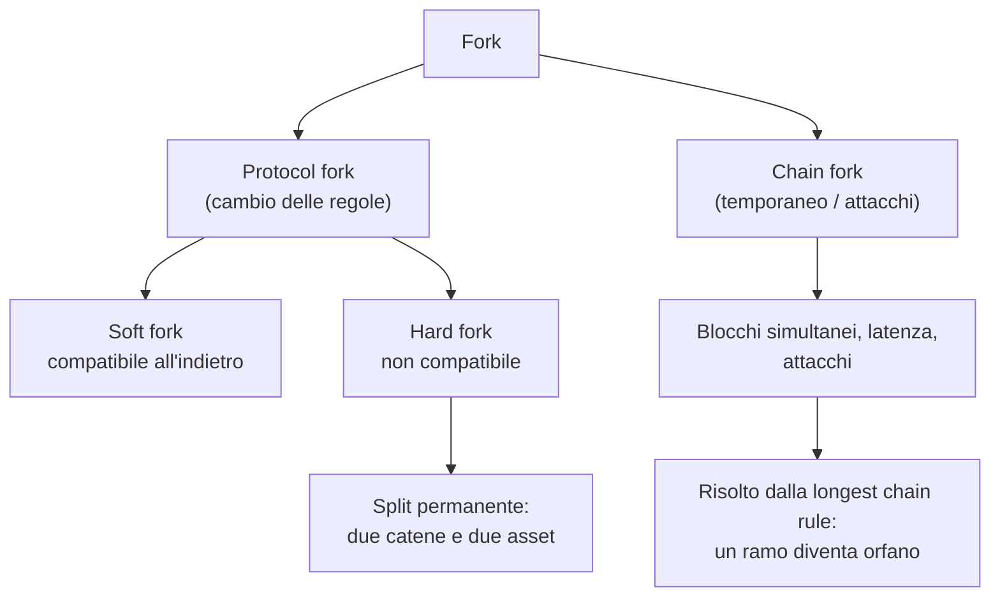
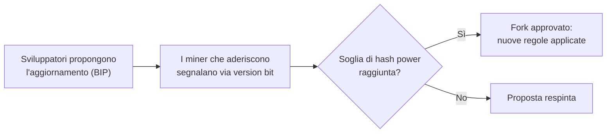
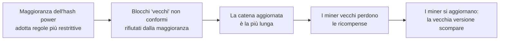
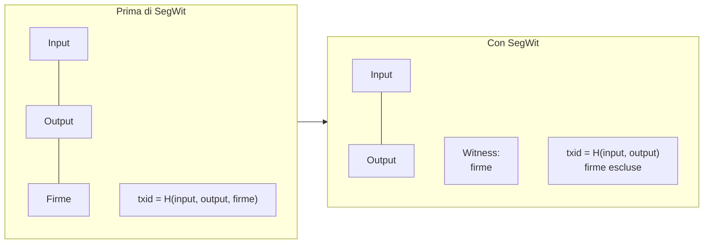
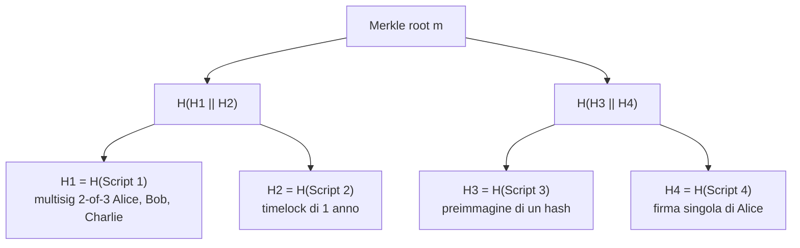
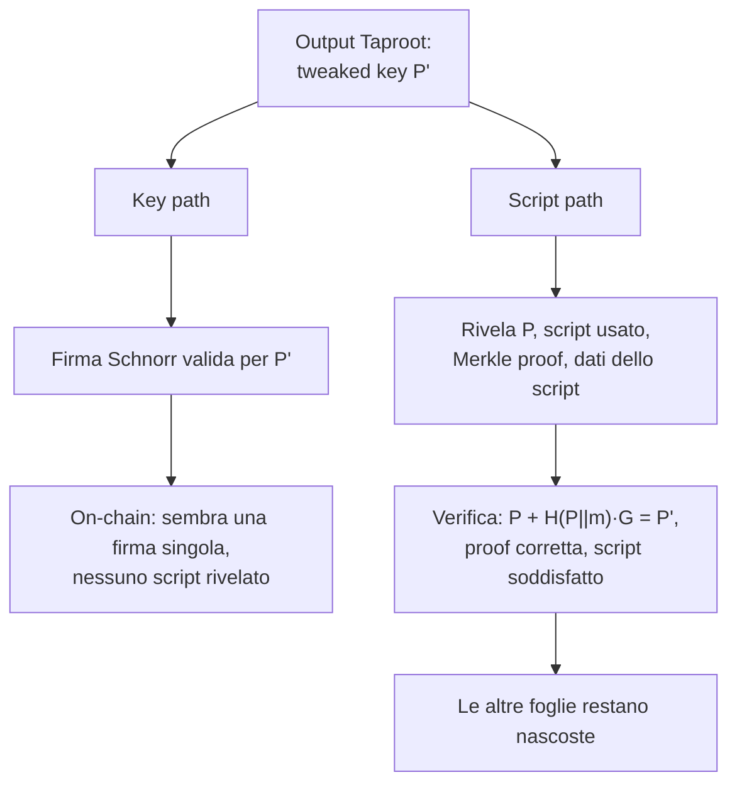
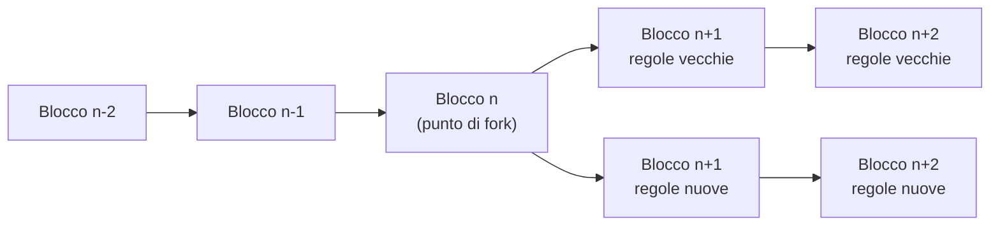

---
tags:
  - università/p2p-blockchain
  - bitcoin
  - fork
  - segwit
  - taproot
data: 2026-03-31
lezione: "L13 - Hard e Soft Fork in Bitcoin"
professore: "Laura Ricci"
---

# Hard e Soft Fork in Bitcoin

Qualsiasi software ha bisogno di essere aggiornato nel tempo: si scoprono bug, emergono vulnerabilità, si vogliono aggiungere funzionalità, cambiano le esigenze degli utenti. In un sistema centralizzato l'aggiornamento è banale: chi gestisce il server installa la nuova versione e tutti i client si adeguano. In una blockchain pubblica e permissionless, invece, non esiste nessuno che possa "installare" una nuova versione per tutti: il protocollo è eseguito da migliaia di nodi indipendenti, ciascuno dei quali decide autonomamente quale versione del software far girare. Aggiornare il protocollo significa quindi convincere una rete decentralizzata a cambiare le proprie regole di consenso, e se non tutti sono d'accordo la rete può spaccarsi in due.

Questa lezione studia proprio questo problema. Il concetto di **fork** (letteralmente "biforcazione") è generale e riguarda tutte le blockchain, ma qui lo si analizza nel caso di Bitcoin. Vedremo la distinzione tra fork di protocollo e fork di catena, la differenza fondamentale tra **soft fork** e **hard fork**, il meccanismo di "votazione distribuita" con cui i miner accettano o rifiutano un aggiornamento, e tre casi concreti: **SegWit** (2017), **Taproot** (2021) e **Bitcoin Cash** (2017).

## Che cos'è un fork

> [!definition] Fork
>
> Un **fork** è una modifica al protocollo e alle strutture dati di una rete blockchain. Nel mondo delle criptovalute, gli aggiornamenti software del protocollo prendono il nome di fork.

Le motivazioni per cui si rende necessario un fork sono essenzialmente quattro. La prima è l'introduzione di **nuove funzionalità** o miglioramenti del protocollo (è il caso di Taproot, che ha migliorato lo scripting e la privacy). La seconda è la **correzione di vulnerabilità di sicurezza o bug** (SegWit ha risolto il problema della transaction malleability). La terza è affrontare problemi di **scalabilità e prestazioni** (ancora SegWit, che di fatto ha aumentato la capacità dei blocchi). La quarta, meno tecnica ma molto concreta, è **risolvere disaccordi all'interno della comunità** e tra gli sviluppatori sulla direzione che la rete deve prendere: quando le visioni sono inconciliabili, la comunità si divide e nasce una nuova catena (è quello che è successo con Bitcoin Cash).

### Protocol fork e chain fork

Il termine "fork" viene usato in due accezioni molto diverse, che è importante non confondere.

Un **protocol fork** (fork di protocollo, o *rule change*) è causato da un **cambiamento delle regole di consenso**. È un evento intenzionale e coordinato, cioè un vero e proprio aggiornamento. Poiché dopo l'aggiornamento nodi diversi possono seguire regole diverse, un protocol fork può produrre uno **split persistente**, che crea due blockchain separate e quindi due asset distinti. I protocol fork si dividono a loro volta in *soft fork* (compatibili all'indietro) e *hard fork* (non compatibili).

Un **chain fork** (fork di catena) è invece un fenomeno temporaneo, che avviene regolarmente durante il normale funzionamento della rete. È causato dal mining simultaneo di due blocchi, dalla latenza della rete oppure da attacchi: il risultato è che esistono più blocchi validi alla stessa altezza. Il conflitto viene risolto dalla **longest chain rule** (la regola della catena più lunga, o più precisamente quella con il maggior lavoro cumulativo): uno dei due rami prevale, l'altro viene abbandonato e i suoi blocchi diventano **orphaned** (o *stale blocks*). In un chain fork non cambia nessuna regola e non nasce nessun nuovo asset.

*Fig. — Classificazione dei fork: i protocol fork cambiano le regole, i chain fork sono biforcazioni temporanee risolte dal consenso.*

> [!tip] Intuizione chiave
>
> Il chain fork è un effetto collaterale della natura distribuita del consenso (due miner trovano un blocco quasi contemporaneamente), e si risolve da solo. Il protocol fork è una scelta deliberata della comunità di cambiare le regole del gioco. I chain fork sono stati trattati nelle lezioni sul mining e sugli attacchi; in questa lezione ci concentriamo sui protocol fork.

## L'accettazione di un fork: una votazione distribuita

Come si decide se un aggiornamento del protocollo entra in vigore? Il processo parte dagli sviluppatori, che propongono una modifica al software (in Bitcoin tramite un documento chiamato BIP, *Bitcoin Improvement Proposal*). L'aggiornamento non diventa effettivo subito, ma dopo alcuni mesi. Nel frattempo i nodi possono osservare quanti miner hanno accettato l'aggiornamento guardando il **numero di versione** contenuto negli header dei blocchi minati: un miner che adotta il fork, in genere, aggiorna il numero di versione nei blocchi che produce. In questo modo la rete può rispondere a due domande: la maggior parte dei miner ha accettato? L'aggiornamento è diventato effettivo?

I miner quindi scelgono se adottare il fork, e questa scelta funziona come una **votazione distribuita** sull'aggiornamento, che confermerà o rigetterà la proposta. È importante sottolineare che il **version bit è solo un segnale**, non una regola di consenso attiva. I miner che conoscono le nuove regole segnalano il proprio supporto tramite i version bit e sono pronti a farle rispettare, ma **non le applicano ancora**: le nuove regole vengono applicate soltanto quando il fork è approvato.

*Fig. — Il ciclo di vita di una proposta di fork: la segnalazione nei blocchi funziona come un voto pesato sull'hash power.*

> [!example] BIP66 (2015)
>
> Il soft fork del 2015 che ha introdotto il **BIP66**, una modifica al formato delle firme, ha ottenuto il consenso del **95% dell'hashing power** dei miner prima di essere attivato.

> [!note] Nota
>
> Il fatto che il voto sia pesato sull'hash power, e non sul numero di nodi, è coerente con la logica della Proof of Work: è la potenza di calcolo a determinare quale catena cresce più velocemente, e quindi quale insieme di regole prevarrà di fatto.

## Soft fork

> [!definition] Soft fork
>
> Un **soft fork** è una modifica all'implementazione di una blockchain che è **compatibile all'indietro** (*backward compatible*): i nodi non aggiornati possono continuare a interagire con i nodi aggiornati. In genere un soft fork **rende le regole più restrittive**.

Il punto chiave è proprio la restrizione delle regole. Se le nuove regole sono un sottoinsieme delle vecchie, allora ogni blocco valido secondo le nuove regole è valido anche secondo le vecchie: i nodi non aggiornati continueranno ad accettare i blocchi prodotti dai nodi aggiornati, senza nemmeno accorgersi che qualcosa è cambiato.

L'esempio visto a lezione è la **riduzione della dimensione massima del blocco**. Supponiamo che il limite passi da 1 MB a un valore inferiore. I nodi non aggiornati, che accettano blocchi fino a 1 MB, riceveranno blocchi più piccoli e li accetteranno senza problemi: se sono in grado di gestire blocchi grandi, sono certamente in grado di gestire blocchi più piccoli. Il contrario non vale: un blocco da 1 MB prodotto da un nodo vecchio verrà rifiutato dai nodi aggiornati.

### Come muore la vecchia versione

Un soft fork può avere tre esiti. Se **tutti i miner sono d'accordo**, il fork non è davvero un fork, ma un semplice aggiornamento software. Se **la maggioranza dei miner è d'accordo**, il nuovo fork si afferma e la vecchia versione muore lentamente. Se **la maggioranza dei miner è contraria**, è il nuovo fork a morire.

Perché, nel caso in cui la maggioranza dell'hash power accetti le nuove regole, la vecchia versione scompare gradualmente? Il meccanismo è economico. I blocchi generati dai nodi non aggiornati che violano le nuove regole (più restrittive) vengono **rifiutati dalla maggioranza aggiornata**. La catena dei nodi aggiornati, avendo più hash power, cresce più velocemente e diventa la catena più lunga, che anche i nodi vecchi finiscono per seguire (perché per loro i blocchi nuovi sono validi). I miner non aggiornati si ritrovano quindi a produrre blocchi che vengono scartati, perdendo le ricompense. E i miner seguono la catena che paga: non hanno interesse a sprecare hash power per minare blocchi che la rete scarterà, per cui finiscono per aggiornarsi.

*Fig. — Perché dopo un soft fork la versione legacy si estingue: gli incentivi economici spingono tutti verso le nuove regole.*

> [!warning] Attenzione
>
> In un soft fork i nodi vecchi **accettano** i blocchi nuovi, ma i nodi nuovi **possono rifiutare** i blocchi vecchi. La compatibilità è quindi asimmetrica: è "all'indietro" nel senso che il software vecchio continua a funzionare sulla catena nuova.

## SegWit (agosto 2017)

**SegWit** (*Segregated Witness*, "testimone separato") è uno dei soft fork più importanti della storia di Bitcoin, attivato ad agosto 2017.

### Il problema: la transaction malleability

Prima di SegWit, una transazione Bitcoin conteneva diversi componenti, tra cui gli **input** (da dove provengono i bitcoin), gli **output** (dove vengono inviati) e le **firme** (la prova che il mittente ha autorizzato la transazione). Le firme erano incluse nei dati della transazione, e quindi contribuivano al calcolo del suo identificativo, il **txid**, che è l'hash dell'intera transazione.

Questo creava un problema: un attaccante poteva **alterare leggermente i dati della firma senza invalidare la transazione** (una firma ECDSA ammette più codifiche equivalenti, tutte valide). La transazione restava valida e spostava gli stessi fondi, ma il suo txid cambiava. Questo è il cosiddetto **malleability attack**, che crea problemi a tutti i protocolli che costruiscono transazioni facendo riferimento al txid di transazioni non ancora confermate, come la **Lightning Network**.

> [!warning] Chiesto all'esame
>
> "Cosa è il malleability attack?" è una domanda realmente posta all'orale. Occorre saper spiegare che la firma faceva parte dei dati su cui si calcola il txid, che un terzo può modificare la firma mantenendola valida, che quindi il txid cambia pur restando invariata la semantica della transazione, e perché questo rompe i protocolli (come Lightning) che si basano sul txid di transazioni non ancora confermate. Infine, che SegWit risolve il problema separando le firme nel witness.

### La soluzione: separare il witness

SegWit **separa i dati della firma dai dati della transazione**, spostandoli in una nuova sezione chiamata **witness** (testimone). Il txid viene ora calcolato **senza** i dati della firma, e quindi non può più essere alterato una volta che la transazione è stata firmata.

*Fig. — SegWit sposta le firme nella sezione witness, fuori dai dati su cui si calcola il txid.*

I benefici sono tre: **niente più manipolazione del txid**, **transazioni non confermate più sicure** (perché il loro identificativo è stabile) e la **possibilità di realizzare la Lightning Network**, che richiede di costruire catene di transazioni che spendono output di transazioni non ancora pubblicate.

> [!note] Nota
>
> Il collegamento con la [[L12 - Bitcoin - Lightning Network|Lightning Network]] è diretto: l'apertura di un canale richiede che le parti firmino una transazione di rimborso che spende l'output della funding transaction *prima* che questa venga pubblicata. Se il txid della funding transaction potesse cambiare, la transazione di rimborso diventerebbe invalida e i fondi potrebbero restare bloccati.

### Block weight: un aumento di capacità "nascosto"

SegWit non era stato progettato esplicitamente come un aumento della dimensione dei blocchi, ma di fatto ha **aumentato il throughput** delle transazioni. Prima di SegWit i blocchi Bitcoin erano limitati a **1 MB**. SegWit ha introdotto il concetto di **block weight** (peso del blocco), in cui le firme "pesano meno" e quindi ne entrano di più in un blocco. Le regole sono:

- ogni byte dei dati di transazione tradizionali conta **4 weight units**;
- ogni byte del witness conta **1 weight unit**;
- il peso massimo di un blocco è di **4 milioni di weight units**.

$$
\text{weight} = 4 \cdot (\text{byte non-witness}) + 1 \cdot (\text{byte witness}) \le 4\,000\,000
$$

Se un blocco non contiene dati witness, il limite di 4 milioni di weight units corrisponde esattamente a 1 MB (perché ogni byte pesa 4). Se invece una parte dei dati è costituita da firme nel witness, queste pesano un quarto e il blocco può superare, in byte effettivi, 1 MB.

> [!example] Esempio numerico
>
> Un blocco con 800 KB di dati non-witness e 800 KB di witness pesa $4 \cdot 800\,000 + 800\,000 = 4\,000\,000$ weight units: è al limite ma valido, pur occupando 1,6 MB complessivi. Un nodo vecchio vede solo gli 800 KB di dati non-witness, che sono sotto il vecchio limite di 1 MB.

> [!note] Nota
>
> L'esempio numerico non è nelle slide, ma segue direttamente dalle regole di peso riportate a lezione.

### SegWit è davvero un soft fork?

Un soft fork richiede che i nodi vecchi continuino ad accettare i blocchi nuovi. A prima vista SegWit non sembrerebbe un soft fork, perché cambia la struttura delle transazioni e permette blocchi più grandi di 1 MB. Gli sviluppatori hanno però implementato un **"trucco"** per ottenere compatibilità all'indietro, nessuna rottura della rete e un aggiornamento graduale.

Il trucco consiste nel fatto che **le firme sono spostate fuori dalla parte che i nodi vecchi contano**. I nodi vecchi non analizzano affatto le firme, non vedono il witness, e quindi vedono blocchi **di dimensione ≤ 1 MB**: dal loro punto di vista tutto è valido e nessuna regola è violata.

In questo modo l'aggiornamento ha permesso a Bitcoin di scalare **senza richiedere un hard fork**: transazioni e blocchi rispettano ancora le regole correnti della rete, e i nodi "vecchi" accettano questi blocchi "nuovi" aggiungendoli alla propria blockchain. I nodi vecchi non possono sfruttare le nuove funzionalità di SegWit finché non si aggiornano, ma possono continuare a fare transazioni "vecchio stile" e restare sincronizzati con la blockchain.

> [!note] Nota
>
> Il meccanismo che consente ai nodi vecchi di accettare gli output SegWit (non descritto nel dettaglio nelle slide) è che questi output hanno uno script che, interpretato con le vecchie regole, risulta spendibile da chiunque (*anyone-can-spend*). I nodi vecchi quindi non trovano nulla di invalido, mentre i nodi aggiornati applicano la regola più restrittiva che richiede una firma valida nel witness. È esattamente lo schema del soft fork: regole più restrittive per i nodi nuovi, compatibili con quelle vecchie.

La professoressa descrive SegWit come un modo un po' **"hacky"** di correggere la malleability e aumentare la capacità dei blocchi, che però evita il problema di dover convincere tutti ad aggiornare il software, pena restare tagliati fuori dalla rete.

> [!abstract] SegWit in sintesi
>
> SegWit è un soft fork (agosto 2017) che sposta le firme in una sezione separata, il witness. Risolve la transaction malleability (il txid non dipende più dalle firme), rende possibile la Lightning Network e, tramite il concetto di block weight (4 WU per byte normale, 1 WU per byte witness, massimo 4 milioni), aumenta di fatto la capacità dei blocchi. È compatibile all'indietro perché i nodi vecchi non vedono il witness e continuano a vedere blocchi entro 1 MB.

## Taproot (novembre 2021)

**Taproot** è un soft fork attivato il **14 novembre 2021**, che ha avuto il supporto di oltre il **90% dei miner**, cosa che ne ha reso relativamente semplice l'attivazione. Si basa su due tecniche, le **firme di Schnorr** (*Schnorr signatures*) e il **MAST** (*Merkelized Abstract Syntax Tree*), e ha l'obiettivo di migliorare le **capacità di scripting** e la **privacy** della rete Bitcoin.

### Le firme di Schnorr

Le **firme di Schnorr** sono uno schema di firma digitale basato sul **problema del logaritmo discreto**, che in Bitcoin affianca lo schema ECDSA. Le loro proprietà sono:

- **privacy**: non è possibile distinguere le singole firme che compongono una firma aggregata;
- **linearità**: forniscono un metodo semplice ed efficiente che consente a più parti che collaborano di produrre un'unica firma valida per la **somma delle loro chiavi pubbliche**;
- **batch verification** (verifica in blocco): più firme possono essere verificate insieme con un'unica operazione, invece che una alla volta;
- **non malleabilità**: le firme non possono essere modificate;
- **sicurezza dimostrabile** (*provable security*).

La differenza sulla verifica si può schematizzare così:

$$
\text{ECDSA (sequenziale): } \text{Ver}(sig_1) + \text{Ver}(sig_2) + \text{Ver}(sig_3) = 3 \text{ operazioni}
$$
$$
\text{Schnorr (batch): } \text{Ver}(sig_1 + sig_2 + sig_3) = 1 \text{ operazione}
$$

La conseguenza più importante della linearità è l'**aggregazione**: un insieme di firmatari può produrre **una sola chiave pubblica e una sola firma**, e la firma può essere verificata **come se fosse stata creata da un unico firmatario**. Questo richiede però una **cooperazione interattiva** tra i firmatari, che devono scambiarsi le chiavi pubbliche e coordinare il processo di firma.

> [!tip] Intuizione chiave
>
> Con le firme di Schnorr un multisig tra Alice, Bob e Charlie, visto sulla blockchain, è indistinguibile da una normale transazione firmata da una singola persona. Si guadagna sia in privacy (nessuno sa che si trattava di un accordo tra più parti) sia in spazio (una firma invece di tre).

> [!note] Nota
>
> La "somma" delle firme nella formula della batch verification è una semplificazione didattica delle slide: la verifica in blocco di Schnorr combina le equazioni di verifica di più firme in un'unica equazione su curva ellittica, che costa meno della somma delle verifiche separate.

### MAST: Merkelized Abstract Syntax Tree

Il secondo ingrediente di Taproot è il **MAST**, che combina due idee già note: l'**abstract syntax tree** (albero di sintassi astratta) e il **Merkle tree**.

La parte di **abstract syntax tree** serve a stabilire come dividere la logica di spesa in foglie. Si analizzano (*parse*) le condizioni di spesa e si astrae la struttura dello script. La regola è semplice: condizioni in **OR** vanno in **foglie separate**, perché nella formula "A OR B OR C" basta che una sola condizione sia soddisfatta; condizioni in **AND** restano nella **stessa foglia**, perché devono essere verificate tutte insieme.

La parte di **Merkle tree** consiste nel calcolare l'hash di ciascuna foglia (cioè di ciascuno script alternativo) e costruire su di esse un Merkle tree, la cui radice riassume in modo crittograficamente vincolante tutte le condizioni di spesa.

*Fig. — Il MAST dell'esempio della lezione: quattro condizioni di spesa alternative (in OR), ciascuna in una foglia del Merkle tree.*

L'esempio della lezione considera quattro condizioni di spesa alternative: un multisig 2-di-3 tra Alice, Bob e Charlie; un timelock di un anno; la rivelazione della preimmagine di un hash; una firma singola di Alice. **Senza MAST** tutti gli script devono essere inclusi nella transazione di spesa, anche quelli che non vengono utilizzati. **Con MAST** si includono solo **lo script effettivamente eseguito e la sua Merkle proof**, cioè gli hash dei fratelli lungo il cammino verso la radice, sufficienti a dimostrare che quello script faceva parte dell'albero.

> [!tip] Intuizione chiave
>
> Il MAST applica al caso degli script lo stesso principio della Merkle proof usata dai nodi SPV: per dimostrare che un elemento appartiene a un insieme non serve rivelare l'intero insieme, basta un cammino logaritmico di hash. Il vantaggio è doppio: la transazione è più piccola (meno fee) e le condizioni non usate restano segrete (più privacy).

### La tweaked public key

Taproot unisce firme di Schnorr e MAST attraverso la **tweaked public key** (chiave pubblica "modificata"), una chiave pubblica che combina una normale chiave pubblica con un **commitment** alle condizioni di spesa nascoste.

Si parte da due elementi: una chiave pubblica $P$ (che può essere una chiave singola oppure una chiave aggregata tramite Schnorr) e la radice del Merkle tree degli script (il MAST), indicata con $m$. Si calcola il **tweak** come hash della concatenazione dei due:

$$
t = H(P \,\|\, m)
$$

e si applica il tweak alla chiave con una somma sulla curva ellittica, dove $G$ è il punto generatore:

$$
P' = P + t \cdot G
$$

Il risultato $P'$ è la tweaked public key.

**Cosa viene scritto sulla blockchain?** L'output on-chain **non** contiene separatamente la chiave pubblica e la radice del MAST: contiene soltanto la **tweaked public key**, che racchiude in un unico oggetto crittografico sia la chiave Schnorr interna sia l'intero albero degli script. Le proprietà sono notevoli: la tweaked key è **indistinguibile da una chiave normale**, gli script **non sono visibili** ma sono vincolati crittograficamente all'interno della chiave, e la chiave consente una **spesa flessibile preservando la privacy**.

### Key path e script path

Un output Taproot può essere speso in due modi.

Nel **key path spending** (spesa tramite chiave) i proprietari della chiave interna $P$ (ad esempio tutte le parti di un accordo, che hanno aggregato le chiavi con Schnorr) producono semplicemente una firma valida per la tweaked key $P'$. Sulla blockchain appare una normale firma singola: nessuno può sapere che esistevano script alternativi, né che dietro la chiave c'erano più persone. È il caso "cooperativo", il più economico e il più privato.

Nello **script path spending** (spesa tramite script) si ricorre a uno degli script del MAST. Chi spende rivela la chiave interna $P$, lo script che intende eseguire, la Merkle proof che collega lo script alla radice $m$, e i dati che soddisfano lo script (firme, preimmagini, ecc.). I nodi verificano che $P + H(P \| m) \cdot G = P'$, che la Merkle proof sia corretta e che lo script sia soddisfatto. Anche in questo caso vengono rivelati solo lo script usato e il cammino nel Merkle tree: le altre condizioni restano nascoste.

*Fig. — Le due modalità di spesa di un output Taproot.*

> [!note] Nota
>
> Le slide sul key path e sullo script path sono solo figure: la descrizione del processo di verifica riportata sopra è una ricostruzione basata sul funzionamento standard di Taproot (BIP340-342), coerente con la definizione di tweaked key data a lezione.

> [!abstract] Taproot in sintesi
>
> Taproot (soft fork, novembre 2021, oltre il 90% dei miner favorevoli) combina firme di Schnorr (aggregabili, lineari, verificabili in batch, non malleabili) e MAST (Merkle tree delle condizioni di spesa alternative, di cui si rivela solo quella usata). Il tutto è racchiuso in una tweaked public key $P' = P + H(P\|m)\cdot G$, indistinguibile da una chiave normale. Il risultato è più privacy, script più flessibili e transazioni più compatte.

---

## Hard fork

> [!definition] Hard fork
>
> Un **hard fork** è una modifica **non compatibile all'indietro** delle regole di consenso, che crea uno **split permanente** della blockchain.

Nell'hard fork le nuove regole sono in genere **più permissive** (o semplicemente diverse): esistono blocchi validi per i nodi nuovi che i nodi vecchi considerano invalidi. Ne seguono alcune conseguenze fondamentali: i nodi **devono aggiornarsi** per seguire le nuove regole; i nodi vecchi **rifiutano i blocchi nuovi**, e quindi la catena si divide (*chain split*); le due catene **condividono la storia fino al punto di fork**, ma da lì in poi procedono indipendentemente; il risultato sono **due reti e due asset separati**.

*Fig. — Hard fork: storia comune fino al punto di biforcazione, poi due catene indipendenti che non si ricongiungeranno mai.*

> [!tip] Soft fork vs hard fork: la regola pratica
>
> Nel soft fork le regole diventano **più restrittive**: i nodi vecchi accettano i blocchi nuovi, e basta la maggioranza dell'hash power per far sparire la vecchia versione. Nell'hard fork le regole diventano **più permissive o diverse**: i nodi vecchi rifiutano i blocchi nuovi e, se una parte della comunità non aggiorna, le catene restano separate per sempre.

| | Soft fork | Hard fork |
|---|---|---|
| Compatibilità | Backward compatible | Non backward compatible |
| Regole | Più restrittive | Più permissive / diverse |
| Nodi vecchi | Accettano i blocchi nuovi | Rifiutano i blocchi nuovi |
| Aggiornamento | Non obbligatorio per restare in rete | Obbligatorio per seguire le nuove regole |
| Esito | Una sola catena (la vecchia versione muore) | Split permanente, due asset |
| Esempi | BIP66, SegWit, Taproot | Bitcoin Cash |

### Bitcoin Cash (agosto 2017)

Bitcoin ha sempre cercato di evitare gli hard fork, ma nell'agosto 2017 ne è avvenuto uno: la nascita di **Bitcoin Cash**, che ha aumentato la dimensione dei blocchi a **8 MB** (e successivamente oltre).

Il motivo è un conflitto nella comunità sulla **scalabilità** e sulla **dimensione dei blocchi**. Si sono confrontate due visioni. **Bitcoin (Core)** sosteneva di mantenere blocchi piccoli (circa 1 MB) e di scalare con soluzioni come **SegWit e la Lightning Network**. **Bitcoin Cash** sosteneva invece di aumentare direttamente la dimensione dei blocchi (8 MB e oltre). Le due visioni erano inconciliabili, e la comunità si è divisa.

Le conseguenze per gli utenti sono interessanti. Dopo il fork, chi possedeva 10 bitcoin si è ritrovato con **10 bitcoin e 10 bitcoin cash**. Questo perché le due catene hanno una **storia comune fino al fork**: tutti gli UTXO esistenti al momento della biforcazione esistono su entrambe le catene. La **chiave privata** per la blockchain Bitcoin funziona anche per Bitcoin Cash, e gli **indirizzi dei wallet sono gli stessi**. Si possono spendere sia i bitcoin sia i bitcoin cash, e non c'è **double spending**, perché le due catene sono separate: se si spende un UTXO su una catena, quello stesso UTXO **rimane non speso sull'altra**.

> [!note] Nota
>
> Proprio perché la stessa transazione firmata poteva in teoria essere valida su entrambe le catene, all'epoca del fork si pose il problema del *replay* di una transazione da una catena all'altra; Bitcoin Cash introdusse una protezione specifica (un diverso formato di firma). Questo aspetto non è nelle slide, ma si collega al concetto di replay attack visto in [[L14 - Ethereum - Account, Transazioni, Gas|L14]].

Cosa è successo poi a Bitcoin Cash? Molti utenti hanno **venduto i propri bitcoin cash a prezzo alto per comprare più bitcoin**. Il prezzo di Bitcoin Cash ha avuto un picco e poi è calato. Bitcoin Cash è comunque **ancora attivo**: offre circa **200 transazioni al secondo** e mantiene lo **stesso algoritmo di mining** di Bitcoin, così i miner possono minare anche la nuova criptovaluta.

### Hard fork e nuove criptovalute

Un hard fork può anche essere usato come strategia per **lanciare una nuova criptovaluta**. Chi crea una nuova crypto teme che le persone non siano interessate a una moneta nuova e sconosciuta. Invece di partire da zero, si può fare un hard fork di Bitcoin e pubblicizzare la nuova moneta (ad esempio sui blog della comunità Bitcoin): chiunque abbia bitcoin si ritroverà automaticamente la stessa quantità della nuova moneta. La blockchain si divide e gli utenti hanno valute indipendenti sulle due catene: dopo il fork, in un certo senso, "raddoppiano" il proprio patrimonio. È un modo efficace per fare il **bootstrap** di una nuova criptovaluta, perché parte già con una base di utenti e una distribuzione di fondi.

Molte **altcoin** sono nate così: non da fork decisi dalla comunità Bitcoin, ma da altre persone che hanno creato hard fork per sviluppare nuove criptovalute. Nel solo 2017 ci sono stati numerosi fork di Bitcoin.

### Hard fork dovuti a falle crittografiche

Esiste infine un caso in cui l'hard fork può diventare inevitabile: la scoperta di **falle nelle tecnologie crittografiche** su cui la blockchain si basa. A seconda della gravità della falla, l'unica soluzione può essere un hard fork.

Il primo esempio è quello della funzione hash. Se **SHA-256 venisse rotta**, la blockchain dovrebbe migrare a **SHA-3**. Qui la distinzione tra soft e hard fork diventa molto concreta: **aggiungere** SHA-3 come opzione in più potrebbe essere un soft fork, ma **rimuovere SHA-2 e sostituirlo** con SHA-3 è un hard fork, perché i blocchi e le transazioni prodotti con le nuove regole non sarebbero riconosciuti dai nodi vecchi.

Il secondo esempio sono i **computer quantistici**, che sono in grado di rompere la crittografia su curve ellittiche e quindi le firme digitali, **comprese le firme di Schnorr**. Un attaccante con un computer quantistico potrebbe ricavare la chiave privata dalla chiave pubblica e sottrarre i fondi di tutti. Sarebbe necessario un hard fork per adottare un algoritmo di firma digitale **resistente ai computer quantistici** (*quantum resistant*).

> [!note] Nota
>
> Il legame con la lezione sugli [[L05 - Strumenti crittografici|strumenti crittografici]] è evidente: tutta la sicurezza di Bitcoin poggia sulle proprietà della funzione hash (one-way, collision resistance) e sulla difficoltà del logaritmo discreto su curve ellittiche. Se una di queste ipotesi cade, cambiare la primitiva richiede di cambiare le regole di consenso.

---

> [!question] Possibili domande d'esame
>
> - Che cos'è un fork? Qual è la differenza tra un protocol fork e un chain fork?
> - Qual è la differenza tra soft fork e hard fork? Perché si dice che un soft fork rende le regole più restrittive? Fai un esempio.
> - Come viene deciso se un fork viene accettato dalla rete? Che ruolo hanno i version bit? Perché dopo un soft fork approvato la vecchia versione scompare?
> - Cos'è il malleability attack e come lo risolve SegWit? Perché è importante per la Lightning Network?
> - Perché SegWit è considerato un soft fork pur aumentando di fatto la capacità dei blocchi? Cos'è il block weight?
> - Cos'è Taproot? Quali proprietà hanno le firme di Schnorr e cos'è il MAST? Cos'è la tweaked public key e perché migliora la privacy?
> - Cosa è successo con Bitcoin Cash? Cosa succede agli UTXO di un utente dopo un hard fork e perché non c'è double spending tra le due catene?
> - In quali casi un hard fork diventa inevitabile? Discuti il caso di una rottura di SHA-256 e dei computer quantistici.

> [!abstract] Sintesi
>
> Un fork è un aggiornamento del protocollo di una blockchain. Si distinguono i chain fork (biforcazioni temporanee risolte dalla longest chain rule) e i protocol fork (cambi delle regole di consenso). L'adozione di un fork è una votazione distribuita dei miner tramite i version bit dei blocchi. Il soft fork è compatibile all'indietro perché restringe le regole: i nodi vecchi accettano i blocchi nuovi e la vecchia versione muore per ragioni economiche. SegWit (2017) sposta le firme nel witness, risolvendo la malleability e aumentando la capacità tramite il block weight; Taproot (2021) introduce firme di Schnorr e MAST, racchiusi in una tweaked public key che migliora privacy e flessibilità. L'hard fork non è compatibile e produce uno split permanente con due asset, come nel caso di Bitcoin Cash (2017, blocchi da 8 MB); può servire a lanciare nuove criptovalute o diventare necessario in caso di rottura delle primitive crittografiche (SHA-256, computer quantistici).
