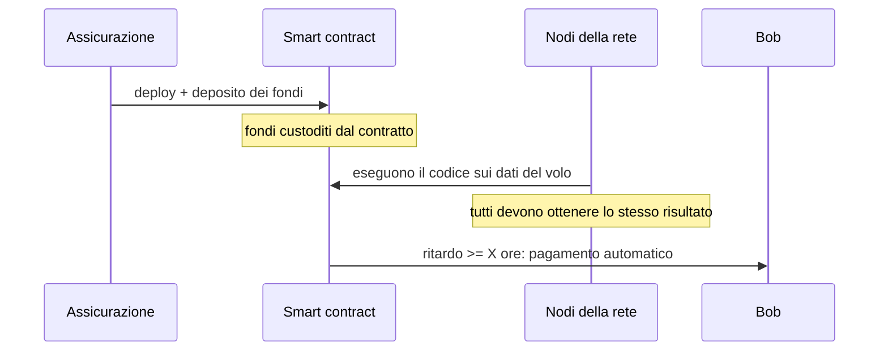
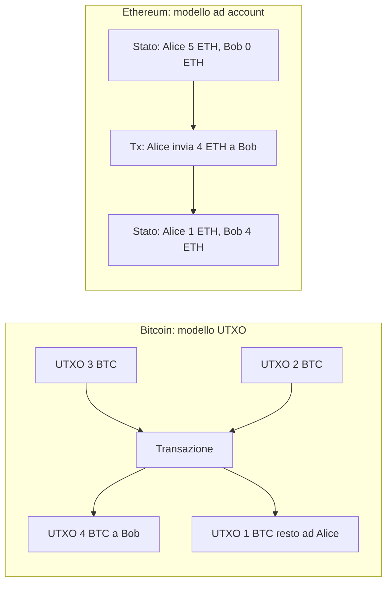
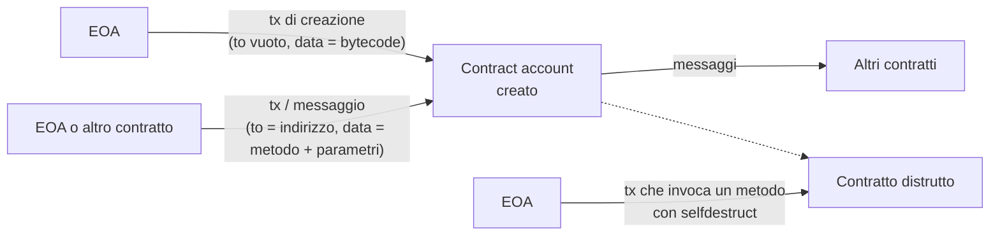
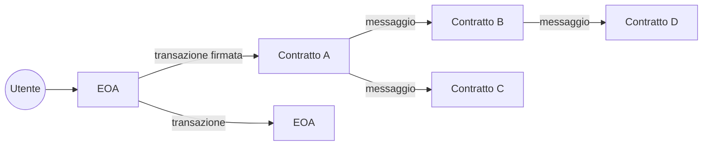
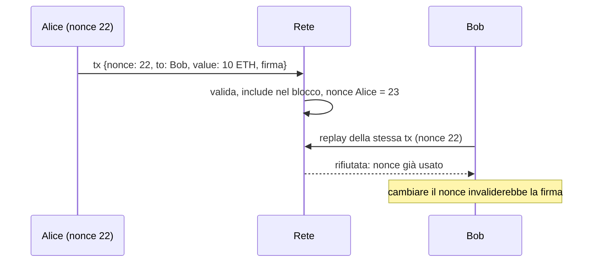
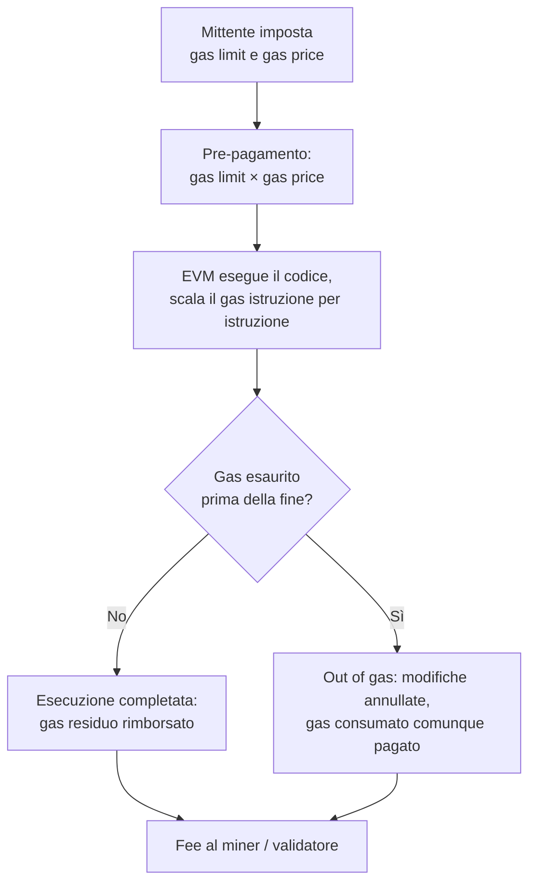

---
tags:
  - università/p2p-blockchain
  - ethereum
  - smart-contract
  - gas
data: 2026-04-09
lezione: "L14 - Ethereum: Account, Transazioni, Gas"
professore: "Laura Ricci"
---

# Ethereum: Account, Transazioni, Gas

Con questa lezione si apre il blocco dedicato a Ethereum. Fin qui abbiamo studiato Bitcoin, una blockchain nata per fare una cosa sola, trasferire valore, con un linguaggio di scripting volutamente limitato. Ethereum parte dalla stessa infrastruttura concettuale (rete P2P, blocchi concatenati da hash, firme digitali, consenso distribuito) ma la estende in una direzione nuova: non solo **memorizzazione distribuita** di dati, ma anche **computazione distribuita**. Il mezzo per farlo sono gli **smart contract**.

Il percorso delle prossime lezioni è il seguente: l'idea di smart contract, gli account di Ethereum, le transazioni, il concetto di gas (oggetto di questa lezione); poi la programmazione degli smart contract in Solidity (in laboratorio), e infine la blockchain di Ethereum vera e propria, con le sue strutture dati e la Proof of Stake.

## L'idea di smart contract

Il concetto di smart contract è molto più antico di Ethereum. È stato formulato da **Nick Szabo** nel 1994, nel saggio *The Idea of Smart Contracts*:

> [!quote] Nick Szabo, 1994
>
> "Uno smart contract è un protocollo di transazione computerizzato che esegue i termini di un contratto. Gli obiettivi generali sono soddisfare le comuni condizioni contrattuali (come termini di pagamento, pegni, riservatezza e persino l'esecuzione forzata), minimizzare le eccezioni sia malevole sia accidentali, e minimizzare il bisogno di intermediari fidati. Obiettivi economici correlati includono la riduzione delle perdite per frode, dei costi di arbitrato ed esecuzione e di altri costi di transazione."

L'idea originale è semplice: uno smart contract è un pezzo di codice che automatizza la parte "**se succede questo, allora fai quello**" dei contratti tradizionali. Cosa c'è di meglio rispetto a un contratto normale? Il codice si comporta in modo prevedibile e non ha le ambiguità e le sfumature linguistiche delle lingue umane.

Un **contratto**, in generale, formalizza una relazione e contiene le promesse fatte tra le parti (i *principals*). Uno **smart contract** si basa sulla traduzione delle clausole contrattuali in codice. È più funzionale rispetto al contratto cartaceo e può ridurre i costi; mira a **eliminare il bisogno di intermediari fidati**, rendendo più difficile per le parti malintenzionate sottrarsi al rispetto dei termini; usa la crittografia e altri meccanismi di sicurezza per proteggere le relazioni specificabili algoritmicamente e garantire che i termini concordati vengano soddisfatti.

### Esempio: l'assicurazione sul ritardo del volo

L'esempio visto a lezione è quello di Bob, che si trova in aeroporto con il volo in ritardo. Bob ha un'assicurazione che prevede un risarcimento per il ritardo. La compagnia assicurativa ha pubblicato (*deployed*) uno smart contract su una blockchain, ad esempio Ethereum, che monitora i ritardi dei voli ed è collegato al database della compagnia aerea. Non appena si verifica la condizione "ritardo di almeno X ore", Bob viene accreditato automaticamente nel proprio wallet della somma assicurata.

Il ciclo è il seguente. Lo smart contract viene creato e contiene termini e condizioni. Viene quindi pubblicato, cioè **registrato in un blocco della blockchain**. In base al suo codice, il contratto **custodisce il denaro della compagnia assicurativa** finché una certa condizione non è soddisfatta. Il contratto viene **eseguito da tutti i nodi della rete P2P**, che ottengono i dati dal database dei voli; tutti i nodi che eseguono il contratto devono arrivare allo stesso risultato. Se la maggioranza dei nodi onesti valuta la condizione come vera, il risarcimento viene prelevato dal wallet dello smart contract e dato a Bob.


*Fig. — Lo smart contract assicurativo: nessun intermediario decide il pagamento, lo fa il codice eseguito da tutti i nodi.*

> [!note] Nota
>
> L'esempio nasconde un problema che le slide non approfondiscono: una blockchain non può accedere direttamente a dati esterni come un database di voli, perché tutti i nodi devono ottenere risultati identici e deterministici. Nella pratica si usano gli **oracoli**, servizi che scrivono i dati esterni sulla blockchain tramite transazioni.

### Esempio: il conto bancario

Anche un conto bancario può comportarsi come uno smart contract. Il conto ha un saldo; ogni mese imposto un pagamento automatico che sottrae una cifra fissa e la invia alla padrona di casa; se sul conto non ci sono abbastanza soldi, il pagamento fallisce, ricevo una multa e parte un'altra procedura. Sono istruzioni associate al conto, un contratto tra me e la banca facilmente eseguibile da un computer. Però... la banca resta un intermediario fidato, che controlla il codice e i dati e potrebbe modificarli. Uno smart contract su blockchain elimina proprio questo intermediario.

## Da Bitcoin a Ethereum

Si potrebbe pensare di usare il linguaggio di scripting di Bitcoin per scrivere smart contract. Questo linguaggio ha però diverse limitazioni:

- **non è Turing-completo**: ad esempio non ha cicli;
- **non ha variabili di stato arbitrarie**: gli script Bitcoin non possono mantenere uno stato interno; uno script consuma i suoi input per produrre l'output, ma non lascia alcuno stato;
- soffre di **blockchain-blindness** (cecità rispetto alla blockchain): non può accedere ai valori dell'header dei blocchi come il nonce, il timestamp o l'hash del blocco precedente.

Ethereum nasce proprio dall'idea di estendere gli script di Bitcoin fino a definire veri smart contract. Quello che Bitcoin fa per la **memorizzazione distribuita dei dati**, Ethereum lo estende a una blockchain che supporta **memorizzazione distribuita e computazione**. Il suo ideatore è **Vitalik Buterin** (nato il 31 gennaio 1994), e Ethereum è spesso descritto come il **"world computer"**.

> [!warning] Chiesto all'esame
>
> "Qual è la differenza più grande tra Ethereum e Bitcoin?" è stata chiesta all'orale. Una buona risposta deve toccare: smart contract in un linguaggio Turing-completo (contro script limitati); modello ad **account** con stato globale (contro modello **UTXO**); computazione replicata e non solo storage replicato; necessità del **gas** per gestire il problema della terminazione; consenso passato dalla PoW alla PoS (settembre 2022).

### Ethereum in breve

Ethereum è una **piattaforma blockchain per costruire applicazioni decentralizzate**. Il codice delle applicazioni e il loro stato sono memorizzati sulla blockchain. Le transazioni trasferiscono criptovaluta, ma provocano anche l'**esecuzione di codice**, aggiornano lo stato, emettono **eventi** e scrivono **log**; le interfacce web di frontend possono reagire agli eventi e leggere i log.

Ethereum è inoltre la piattaforma più popolare per la creazione di nuovi **token**: gli NFT, gli **ICO** (*Initial Coin Offering*) basati su contratti di token ERC-20, e la **DeFi** (*Decentralized Finance*). Un ICO funziona così: un'azienda che vuole raccogliere fondi per creare una nuova applicazione o servizio emette un nuovo token, che gli investitori ricevono in cambio del loro investimento; il token può avere un'utilità legata al prodotto o rappresentare una quota. Gli investimenti in ICO sono stati di circa 7 miliardi di dollari nel 2017 e circa 12 miliardi nel 2018.

Le applicazioni vanno ben oltre il denaro: crowdfunding, token, DeFi, **Self Sovereign Identity** (SSI), supply chain, Internet of Things (tracciamento dei dati dei sensori), voto, e centinaia di altre. Esempi concreti sono l'**Ethereum Name Service** (ENS), gli exchange decentralizzati, e gli NFT, tra cui il famosissimo **CryptoKitties**.

### Un computer distribuito

Gli smart contract di Ethereum sono **decentralizzati**, **replicati** ed **eseguiti su tutti i nodi della rete**, senza un coordinatore centrale. I meccanismi di consenso garantiscono che tutti i nodi concordino sui risultati dell'esecuzione e aggiornino lo stato allo stesso modo: ogni nodo aggiorna la propria versione del ledger con il risultato della valutazione dello smart contract.

Ethereum è quindi come un **computer distribuito** che esegue codice: non è replicato solo lo storage, ma anche la **computazione**, e si raggiunge il consenso sui risultati della computazione. È una **macchina a stati distribuita**, in cui lo **stato globale** è lo stato di tutti gli smart contract (e di tutti gli account), e le **transazioni modificano lo stato globale**.

Due caratteristiche derivano da questa impostazione. La prima è la **trasparenza**: tutti i partecipanti eseguono lo stesso codice, verificandosi a vicenda, e perciò lo smart contract **deve essere deterministico**; la logica del contratto è visibile a tutti. La privacy può quindi diventare un problema, e in alcuni casi si possono usare soluzioni basate su **zero-knowledge proof**. La seconda è la **flessibilità** rispetto agli script di Bitcoin: gli smart contract sono scritti in un linguaggio **Turing-completo** e possono fare tutto ciò che fa un normale computer. Ma c'è un prezzo: bisogna **pagare** perché tutti i nodi della rete eseguano il codice in parallelo. I nodi devono essere ricompensati per l'esecuzione, e chi la richiede paga il costo di esecuzione. Da qui nasce il concetto di gas.

### Bitcoin e Ethereum a confronto

Ethereum, come Bitcoin, è una blockchain **pubblica e permissionless**: gli indirizzi sono generati a partire dalle chiavi, le transazioni sono firmate con firme digitali. In Ethereum i blocchi contengono dati e smart contract, in Bitcoin dati e script. Il consenso era inizialmente basato su **Proof of Work**, poi, dal **settembre 2022** (il cosiddetto **Merge**), su **Proof of Stake**. Come Bitcoin, ha una criptovaluta nativa, l'**Ether (ETH)**, ma offre anche la possibilità di creare token di livello superiore. Anche Ethereum è costruito su una rete peer-to-peer, e usa **Kademlia** a livello P2P per scoprire i peer.

> [!note] Nota
>
> Il collegamento con [[L04 - Kademlia DHT|Kademlia]] è notevole: il protocollo di discovery dei nodi di Ethereum (discv4/discv5) usa una tabella di routing a k-bucket basata sulla metrica XOR, esattamente come visto per la DHT.

### Da macchina a stati UTXO a macchina a stati ad account

Anche Bitcoin può essere visto come una macchina a stati. Lo stato è memorizzato negli **UTXO** (*Unspent Transaction Output*); il saldo disponibile di un utente è la **somma dei suoi UTXO**; una transazione provoca una transizione di stato, consumando alcuni UTXO e creandone di nuovi.

> [!warning] Chiesto all'esame
>
> "Cosa sono gli UTXO?" è una domanda frequente. Nel contesto di Ethereum conviene saper contrapporre il modello UTXO di Bitcoin (lo stato è l'insieme degli output non spesi; il saldo non è memorizzato ma si calcola) al modello ad account di Ethereum (lo stato è la mappa indirizzo → saldo e dati dell'account).

Ethereum, come Bitcoin, è una **macchina a stati deterministica basata su transazioni**: una macchina virtuale che applica modifiche a uno stato globale replicato. Come in Bitcoin, le transazioni provocano cambiamenti di stato, ma in Ethereum **chiunque può creare le proprie funzioni di transizione di stato**, senza essere limitato agli script: sono gli smart contract. E, a differenza di Bitcoin, Ethereum usa gli **account**, che come un conto bancario tengono traccia del saldo. Lo stato globale condiviso di Ethereum è memorizzato in una moltitudine di account, piccoli oggetti che interagiscono tra loro secondo un paradigma a **scambio di messaggi** (*message passing*).


*Fig. — Stessa operazione nei due modelli: in Bitcoin si consumano output e se ne creano di nuovi (con il resto), in Ethereum si aggiornano direttamente i saldi.*

## Gli account di Ethereum

Ogni account di Ethereum ha un **identificativo di 20 byte (160 bit)**, il suo indirizzo, e uno **stato**. Esistono due tipi di account.

> [!definition] Externally Owned Account (EOA)
>
> Account **controllato da una chiave privata**, posseduto da un'entità esterna (una persona o un'organizzazione). Chi possiede la chiave privata può firmare transazioni, accedendo ai fondi e invocando contratti. Non ha codice associato.

> [!definition] Contract Account
>
> Account che ha del **codice associato** ed è **controllato da quel codice**. Non ha una chiave privata.

### Externally Owned Account

Gli EOA sono gli "account personali". Il loro stato contiene l'**indirizzo**, il **saldo in Ether** e un **nonce**, cioè il numero totale di transazioni emesse da quell'account (da non confondere con il nonce della Proof of Work). Un EOA può inviare transazioni per **trasferire Ether** e per **attivare l'esecuzione di uno smart contract**.

Una transazione da EOA a EOA è un semplice trasferimento di denaro, come una transazione Bitcoin, ma basata sugli account e non sugli UTXO. Nel suo formato compaiono il **destinatario** della transazione, l'**importo** trasferito (espresso in **wei**, la più piccola frazione di Ether) e la **firma digitale** creata con la chiave privata del mittente.

### Contract account

Un contract account contiene il **codice del contratto** e uno **storage persistente** per le variabili del contratto. Come gli EOA, ha un **saldo in Ether** e può ricevere e trasferire Ether, sfruttando istruzioni particolari. Ha un **nonce**, che conta i messaggi inviati da quell'account (più precisamente, come vedremo, le creazioni di contratti). **Non ha chiave privata.**

| | EOA | Contract account |
|---|---|---|
| Controllo | Chiave privata | Codice del contratto |
| Codice associato | No | Sì |
| Storage | No | Sì (variabili del contratto) |
| Saldo in Ether | Sì | Sì |
| Nonce | Numero di transazioni inviate | Numero di contratti creati |
| Può iniziare una transazione | Sì | No, reagisce solo a transazioni/messaggi |

### Che cos'è uno smart contract

Uno smart contract è un **programma**. Il suo **codice non può cambiare** una volta pubblicato, ed è **eseguito dai full node**. La computazione deve essere **deterministica**: il risultato deve essere lo stesso per ogni nodo. Il **contesto di esecuzione** di uno smart contract comprende il **contesto della transazione** (i dati presi dalla transazione che ha attivato il contratto), lo **storage interno**, ed eventualmente informazioni prese dagli **header dei blocchi** della blockchain (superando la blockchain-blindness di Bitcoin).

## Il ciclo di vita di uno smart contract

Uno smart contract attraversa tre fasi: **creazione**, **interazione** (le chiamate alle sue funzioni) e, eventualmente, **distruzione**.


*Fig. — Il ciclo di vita di uno smart contract: creazione, interazione, distruzione.*

### Creazione

Chi crea uno smart contract? Serve un **EOA**: è l'EOA che pubblica (*deploy*) lo smart contract sulla blockchain di Ethereum (vedremo in [[L15 - Token - ERC-20, ERC-721, ERC-1155|L15]] che anche un contratto può crearne un altro, ma la catena di chiamate parte sempre da un EOA). La **transazione di creazione** ha una forma particolare: il campo del destinatario è **vuoto**, perché il contratto non ha ancora un indirizzo finché non viene pubblicato, e il campo dati contiene il **codice dello smart contract** (il bytecode compilato).

### Interazione

Un EOA chiama un metodo dello smart contract tramite una **transazione**. Anche un contratto può chiamare un altro contratto, tramite un **messaggio** (una *internal transaction*). Nella transazione di interazione il destinatario è l'**indirizzo del contratto**, e il campo dati specifica **quale metodo chiamare** e i suoi **parametri**.

Gli smart contract vengono quindi attivati da transazioni provenienti da EOA o da messaggi provenienti da altri smart contract, che chiamano funzioni all'interno di un contratto specificandone l'indirizzo, ne specificano i parametri e **possono contenere Ether** da trasferire al contratto.

Alcune caratteristiche fondamentali: un contract account **non può iniziare una transazione da solo**. Quando viene attivato può chiamare altri contratti (ma non sé stesso, secondo le slide) e costruire così percorsi di esecuzione complessi; può generare messaggi come risposta alle transazioni ricevute da un EOA o da un altro contratto. Quando riceve una transazione o un messaggio, il contratto viene eseguito dalla **Ethereum Virtual Machine** (EVM), e può compiere diverse azioni: **computazione**, **scrittura nello storage interno**, **invio di messaggi** ad altri contratti, **creazione di nuovi contratti**.

### Distruzione

Un contratto può essere distrutto con una transazione indirizzata all'**indirizzo del contratto**, che invoca un metodo che esegue l'operazione **`selfdestruct`**.

> [!note] Nota
>
> Le slide riportano `selfdestruct` come meccanismo di distruzione. Va segnalato che, con l'aggiornamento Dencun (marzo 2024, EIP-6780), `selfdestruct` non cancella più codice e storage di un contratto, se non quando è chiamato nella stessa transazione che ha creato il contratto; negli altri casi si limita a trasferire l'Ether residuo. È un aspetto non trattato a lezione.

### Tutto parte da un EOA

> [!tip] Intuizione chiave
>
> Qualsiasi azione che avviene sulla blockchain di Ethereum è **sempre messa in moto da una transazione emessa da un EOA**. Gli EOA sono il **ponte tra il mondo esterno e lo stato interno** di Ethereum: i contratti sono "passivi" e reagiscono soltanto.

Una **transazione** è un pacchetto di dati firmato che contiene un messaggio. Viene serializzata e inviata da un EOA a un altro account; può innescare messaggi successivi da contratti ad altri contratti; se viene inclusa in un blocco genera un cambiamento dello stato della blockchain; è usata anche per creare nuovi contratti.


*Fig. — L'EOA come unico punto di ingresso: una transazione può scatenare una cascata di messaggi tra contratti.*

## Il nonce delle transazioni e il replay attack

Il **Yellow Paper** di Ethereum (la specifica formale del protocollo) definisce il nonce come *"un valore scalare pari al numero di transazioni inviate da questo indirizzo o, nel caso di account con codice associato, al numero di creazioni di contratti effettuate da questo account"*.

Il nonce è un **attributo dell'indirizzo** che origina la transazione, non della transazione in sé (anche se ogni transazione riporta il valore corrente). Registra l'**ordine delle transazioni** e serve come protezione contro la **duplicazione delle transazioni** e i **replay attack**, evitando il double spending dallo stesso indirizzo.

> [!warning] Attenzione: due tipi di nonce
>
> In Ethereum esistono due nonce diversi. Il **transaction nonce** (o account nonce) è quello descritto qui, e **non ha nulla a che vedere** con il nonce di Bitcoin. Il **block nonce** era invece usato dalla Proof of Work, esattamente come il nonce di Bitcoin (con il passaggio alla PoS non è più usato).

### Il replay attack

Per capire perché il nonce è necessario occorre confrontare i due modelli. Bitcoin memorizza sulla blockchain gli output non spesi, e le transazioni li consumano: un output speso **non esiste più**, e per ogni UTXO può esistere una sola transazione che lo spende. Rinviare la stessa transazione non serve a nulla, perché l'UTXO che essa consuma è già stato speso.

Ethereum invece memorizza **saldi**, e più transazioni possono attingere allo stesso saldo. Questo apre la porta al **replay attack**: l'attaccante prende una transazione esistente e la **reinvia** sulla rete più e più volte. Tutte le transazioni reinviate prelevano fondi dallo stesso account e sono **valide**, perché sono firmate dal proprietario dell'account. Se l'account ha abbastanza Ether, l'attacco ha successo.

> [!example] Esempio: Bob svuota il conto di Alice
>
> Alice firma una transazione per inviare 10 ETH a Bob. Un miner la prende, la scrive in un blocco e aggiorna i saldi di Alice e Bob. A questo punto Bob, che ha ricevuto la transazione firmata, la **reinvia** sulla rete ripetutamente: la firma è valida, e ogni copia sposta altri 10 ETH. Bob può ripetere fino a svuotare il conto di Alice.

La difesa di Ethereum è proprio il **nonce**. Supponiamo che il nonce di Alice sia 22 quando invia la transazione. Una volta che questa è stata inclusa, la rete **non accetta un'altra transazione di Alice con nonce 22**. Bob non può cambiare il nonce, perché il nonce fa parte dei dati firmati e modificarlo **invaliderebbe la firma**.

Ogni volta che un account invia una transazione, il suo nonce **aumenta di 1**. Il nonce viene usato per imporre le regole di validità delle transazioni: le transazioni devono essere **in ordine** (una transazione con nonce 1 non può essere minata prima di una con nonce 0) e **non si possono saltare** (una transazione con nonce 2 non può essere minata se la rete non ha già confermato quelle con nonce 0 e 1).


*Fig. — Il nonce impedisce il replay: la stessa transazione firmata può essere applicata una sola volta.*

## Transizioni di stato

Lo stato della rete Ethereum è lo **stato di tutti i suoi account**. Uno stato di account semplificato comprende l'**indirizzo**, il **saldo** e, per i contract account, il **codice** e lo **stato delle variabili**. Una transazione tra EOA provoca una transizione di stato semplice: il saldo del mittente diminuisce (dell'importo più le fee), quello del destinatario aumenta, il nonce del mittente si incrementa. Una transazione verso un contratto può invece provocare modifiche più articolate, perché l'esecuzione del codice può cambiare le variabili del contratto, il suo saldo e, tramite messaggi, lo stato di altri contratti.

$$
\sigma_{t+1} = \Upsilon(\sigma_t, T)
$$

> [!note] Nota
>
> La formula sopra (funzione di transizione di stato $\Upsilon$ che, dato lo stato $\sigma_t$ e una transazione $T$, produce il nuovo stato) è la notazione del Yellow Paper e non compare nelle slide, che mostrano la transizione solo con figure. È utile per fissare l'idea di "macchina a stati basata su transazioni".

## Il gas

### Il problema della terminazione

Ogni nodo della rete valuta tutte le transazioni e memorizza lo stato di tutti i contratti. Qui emerge un problema classico dell'informatica teorica, il **problema della terminazione** (*halting problem*): non è possibile stabilire, semplicemente guardando un programma, se la sua esecuzione terminerà o durerà per sempre; per saperlo bisogna eseguirlo. A causa della Turing-completezza, questo può accadere in Ethereum, mentre non può accadere in Bitcoin (che non ha cicli).

Cosa succede se un utente malintenzionato, o semplicemente un errore, chiede di eseguire codice che non termina mai?

```solidity
function foo() {
    while (true) { /* Loop forever! */ }
}
```

Poiché l'EVM è una macchina **single-threaded**, senza alcuno scheduler, un codice del genere bloccherebbe tutti i nodi della rete: sarebbe un **denial of service**.

### Il gas come "male necessario"

Ethereum introduce il concetto di **gas**. L'idea è di **far pagare l'esecuzione** dei contratti, fornendo al contratto "gas" a pagamento. In questo modo gli attacchi DoS diventano **costosi**, l'esecuzione di uno smart contract **non è gratuita**, e l'EVM **interrompe l'esecuzione del programma quando il contratto esaurisce il gas**.

Ogni passo computazionale ha una **tariffa in gas fissa**, e hanno un costo in gas anche le risorse di **storage** richieste per le azioni del contratto. L'EVM è quindi una macchina **quasi-Turing-completa**: può eseguire qualsiasi programma, ma solo se il programma ha pagato abbastanza gas; in ogni momento esiste un limite computazionale definito, dato dalla quantità di gas disponibile.

> [!tip] Intuizione chiave
>
> Il gas non "risolve" l'halting problem, lo aggira: invece di stabilire in anticipo se un programma termina, si garantisce che **ogni esecuzione termini comunque**, al più quando finisce il gas. E poiché il gas si paga, un ciclo infinito danneggia soprattutto chi l'ha lanciato.

### Gas e gas price

Per eseguire uno smart contract bisogna "comprare gas": acquistare gas è come acquistare **potenza di calcolo distribuita e trustless**.

Occorre distinguere due grandezze. Il **costo in gas di ciascuna istruzione è fisso**, stabilito dal protocollo. Alcuni esempi dalle slide:

| Operazione | Costo in gas |
|---|---|
| Somma di due numeri | 3 gas |
| Hash Keccak-256 | 30 gas + 6 gas per ogni blocco di 256 bit di dati |
| Invio di una transazione | 21.000 gas |

Il **gas price**, invece, cioè il prezzo in Ether di ogni unità di gas, **è deciso da chi invia la transazione**: è la quantità di Ether che si è disposti a spendere per ogni unità di gas. Un prezzo basso significa priorità bassa, e viceversa. Il gas price si misura in **gwei**, dove $1\ \text{gwei} = 10^9\ \text{wei}$, ed è variabile.

> [!tip] Perché separare gas e gas price?
>
> Il costo in gas misura il **lavoro computazionale** e non cambia; il gas price misura il **valore di mercato** di quel lavoro, che varia con la domanda e con il prezzo dell'Ether. Separandoli, il costo di un'operazione non dipende dalle oscillazioni della criptovaluta.

### Ether e le sue frazioni

L'**Ether** è la valuta interna di Ethereum, usata per **trasferire valore** nelle transazioni e per **pagare il gas** (le fee di computazione). Ha diverse frazioni, ognuna delle quali porta il nome di un personaggio dell'informatica ("*a piece of computer science*"):

| Unità | Valore in wei | Nome ispirato a |
|---|---|---|
| wei | $1$ | Wei Dai |
| Kwei (babbage) | $10^3$ | Charles Babbage |
| Mwei (lovelace) | $10^6$ | Ada Lovelace |
| Gwei (shannon) | $10^9$ | Claude Shannon |
| microether (szabo) | $10^{12}$ | Nick Szabo |
| milliether (finney) | $10^{15}$ | Hal Finney |
| ether | $10^{18}$ | — |

> [!note] Nota
>
> La tabella delle frazioni è in una slide solo immagine; i valori riportati sono quelli standard di Ethereum.

### Gas limit e fee

Per ogni transazione si impostano il **gas price** e il **gas limit**. Il gas limit è la **quantità massima di gas** che il mittente è disposto a pagare per quella transazione. La fee massima è quindi:

$$
\text{fee}_{\max} = \text{gas price} \times \text{gas limit}
$$

cioè la quantità massima di wei che il mittente è disposto a pagare, calcolata per ogni transazione. Le fee sono la **ricompensa per i miner** per lo sforzo di eseguire le computazioni e validare le transazioni: più alto è il gas price, più è probabile che i miner selezionino la transazione.

Nello scegliere il gas limit bisogna tenere conto di tre fatti. Operazioni diverse hanno costi in gas diversi. I miner **interrompono l'esecuzione nel momento in cui il gas finisce**. Se invece avanza del gas, questo viene **immediatamente rimborsato** a chi ha generato la transazione. Il costo effettivo è quindi:

$$
\text{fee effettiva} = \text{gas usato} \times \text{gas price}, \qquad \text{rimborso} = (\text{gas limit} - \text{gas usato}) \times \text{gas price}
$$

> [!example] Esempio numerico
>
> Alice invia una transazione con gas limit 50.000 e gas price 20 gwei. È disposta a spendere al massimo $50\,000 \times 20 = 1\,000\,000$ gwei $= 0{,}001$ ETH. L'esecuzione consuma 30.000 gas: paga $30\,000 \times 20 = 600\,000$ gwei e riceve indietro 400.000 gwei. Se invece l'esecuzione avesse richiesto 60.000 gas, si sarebbe interrotta a 50.000 per *out of gas*: le modifiche allo stato vengono annullate, ma il gas consumato è comunque pagato (il lavoro dei nodi è stato svolto).

> [!note] Nota
>
> Il fatto che, in caso di out of gas, le modifiche siano annullate ma la fee sia comunque trattenuta è il comportamento standard di Ethereum, implicito nelle slide ma non esplicitato. Inoltre, il modello "gas price scelto dall'utente" descritto qui è quello originale; con l'EIP-1559 (2021) la fee è stata divisa in *base fee* (bruciata) e *priority fee* (al validatore). Questo sarà trattato nella lezione sulle fee di Ethereum (L18). Infine, dopo il Merge le fee vanno ai validatori e non più ai miner.

Ethereum ha anche un **limite di gas per blocco** (*block gas limit*): i miner considerano un blocco pieno quando la somma dei costi in gas delle transazioni incluse raggiunge questo limite. È l'analogo, per Ethereum, del limite di dimensione del blocco in Bitcoin.


*Fig. — Il meccanismo del gas riassunto.*

### Messaggi e gas

Nei messaggi interni (le chiamate da contratto a contratto) **non c'è un gas limit**. Perché? Il gas limit è stabilito dal **creatore esterno della transazione originale**, cioè da un EOA, e deve essere sufficiente a coprire **tutta** l'esecuzione, comprese tutte le sotto-esecuzioni che derivano da quella transazione, come i messaggi tra contratti. Se, nella catena di transazioni e messaggi, l'esecuzione di un particolare messaggio esaurisce il gas, **l'esecuzione di quel messaggio viene annullata** (*revert*), insieme a tutti i messaggi successivi innescati da essa. Tuttavia, **l'esecuzione padre non deve necessariamente essere annullata**.

> [!note] Nota
>
> In realtà, a livello di EVM, un contratto che chiama un altro contratto può specificare quanto del proprio gas residuo inoltrare alla chiamata (e dall'EIP-150 al massimo 63/64 del gas disponibile). Il punto delle slide resta valido: il budget complessivo è sempre quello fissato dall'EOA nella transazione originale.

## Il formato completo di una transazione

Una transazione Ethereum è serializzata con lo schema di codifica **RLP** (*Recursive Length Prefix*) e contiene i seguenti campi:

| Campo | Significato |
|---|---|
| `nonce` | Numero di sequenza dell'account mittente (protezione dal replay) |
| `gasPrice` | Prezzo che il mittente paga per unità di gas (in wei) |
| `gasLimit` | Quantità massima di gas utilizzabile dalla transazione |
| `to` | Indirizzo destinatario (20 byte); vuoto per la creazione di un contratto |
| `value` | Quantità di Ether (in wei) inviata al destinatario |
| `data` | Payload: chiamata di funzione, oppure bytecode in creazione |
| `v, r, s` | Componenti della firma ECDSA dell'EOA mittente |

Si noti che **non c'è un campo "from"**: l'indirizzo del mittente non è scritto esplicitamente, ma si ricava dalla firma.

### Il destinatario

Il campo **TO** è un indirizzo Ethereum di 20 byte, che può essere un EOA o un contratto. Il protocollo **non fa alcuna validazione** di questo campo: qualsiasi valore di 20 byte è considerato valido. Se l'indirizzo è sbagliato (non corrisponde a nessuno che possieda la chiave), l'Ether inviato è **bruciato**, cioè perso per sempre.

Rispetto a Bitcoin, la differenza è netta: c'è **un solo indirizzo di output** e **nessuno script** al suo interno; il valore è inserito direttamente nella transazione, **senza riferimento all'output di una transazione precedente**.

### VALUE e DATA

Il "payload" di una transazione è costituito dai campi **VALUE** e **DATA**, che possono essere significativi o nulli. Le combinazioni sono tre: solo VALUE significativo è un **pagamento**; solo DATA significativo è un'**invocazione di funzione**; entrambi significativi sono un'**invocazione di smart contract con invio di Ether**.

Il VALUE trasmesso a un **EOA** viene aggiunto al saldo dell'account di destinazione. Se trasmesso a un **contract account**: se non viene indicata nessuna funzione, aumenta il saldo del contratto; altrimenti, la funzione indicata nel payload data deve essere **`payable`**, cioè deve poter accettare Ether dal chiamante.

Il DATA trasmesso a un EOA è consentito ma non ha un significato specificato dal protocollo. Trasmesso a un contratto, contiene due parti:

- il **function selector**: i **primi 4 byte dell'hash Keccak-256 del prototipo della funzione**, che permettono di identificare in modo univoco quale funzione invocare;
- gli **argomenti della funzione**, codificati secondo le regole previste per i vari tipi elementari.

Nelle **transazioni di creazione** di un contratto, il payload data contiene invece il **bytecode compilato** che creerà il contratto.

> [!example] Function selector
>
> Per chiamare `transfer(address,uint256)` di un token ERC-20, si calcola $\text{Keccak256}(\texttt{"transfer(address,uint256)"})$ e se ne prendono i primi 4 byte, ottenendo `0xa9059cbb`. Il campo data sarà `0xa9059cbb` seguito dall'indirizzo e dall'importo, ciascuno codificato su 32 byte. (Esempio non presente nelle slide.)

### Gli altri campi

Oltre a **GAS PRICE** e **GAS LIMIT**, già discussi, ci sono i campi **V, R, S**, le tre componenti della **firma digitale ECDSA** dell'EOA che origina la transazione. Permettono di **calcolare l'indirizzo dell'account** che invia la transazione (recuperando la chiave pubblica dalla firma), ed è per questo che non serve un campo "from".

## Bitcoin ed Ethereum: confronto riassuntivo

| | Bitcoin | Ethereum |
|---|---|---|
| Scopo | Trasferimento di valore (storage distribuito) | Computazione distribuita (world computer) |
| Modello di stato | UTXO | Account (EOA e contratti) |
| Programmabilità | Script non Turing-completo, senza stato | Smart contract Turing-completi, con storage |
| Terminazione | Garantita (no cicli) | Garantita dal gas |
| Protezione dal replay | Implicita (UTXO spendibile una volta) | Nonce dell'account |
| Output di una tx | Più output, ciascuno con script | Un solo destinatario, nessuno script |
| Consenso | Proof of Work | PoW fino al Merge (settembre 2022), poi PoS |
| Discovery P2P | — | Kademlia |
| Valuta nativa | bitcoin (satoshi) | Ether (wei) |

> [!note] Nota
>
> La tabella ricostruisce e integra la slide di confronto finale (solo immagine) con quanto detto nel resto della lezione.

Restano da discutere, nelle lezioni successive: la programmazione degli smart contract in **Solidity** (in laboratorio) e la struttura dei blocchi di Ethereum, cioè i **log**, i **Merkle Patricia Trie**, la **Proof of Stake** e la **Ethereum Virtual Machine**.

---

> [!question] Possibili domande d'esame
>
> - Cos'è uno smart contract? Qual è l'idea originale di Nick Szabo e cosa aggiunge Ethereum?
> - Quali sono le principali differenze tra Bitcoin ed Ethereum? Perché lo scripting di Bitcoin non basta per realizzare smart contract?
> - Confronta il modello UTXO di Bitcoin con il modello ad account di Ethereum.
> - Quali tipi di account esistono in Ethereum e cosa contiene il loro stato? Chi può iniziare una transazione?
> - Cos'è il nonce di un account in Ethereum? Cos'è un replay attack e perché in Bitcoin non si pone allo stesso modo?
> - Perché Ethereum ha bisogno del gas? Collega il gas all'halting problem e agli attacchi DoS.
> - Qual è la differenza tra gas, gas price e gas limit? Cosa succede se una transazione esaurisce il gas? E se avanza?
> - Descrivi il formato di una transazione Ethereum. Come si capisce quale funzione di un contratto viene invocata? Perché non c'è il campo "from"?

> [!abstract] Sintesi
>
> Ethereum estende l'idea di Bitcoin dalla memorizzazione distribuita alla computazione distribuita tramite smart contract, programmi deterministici e immutabili eseguiti da tutti i nodi in un linguaggio Turing-completo. Lo stato globale è un insieme di account: gli EOA, controllati da chiave privata, sono gli unici a poter iniziare transazioni; i contract account sono controllati dal loro codice, hanno storage e reagiscono a transazioni e messaggi. Il modello ad account richiede un nonce per account che impone ordine alle transazioni e impedisce il replay attack. Per aggirare l'halting problem ed evitare DoS ogni istruzione costa una quantità fissa di gas; il mittente fissa gas price (priorità) e gas limit (budget), il gas non usato viene rimborsato e l'esaurimento del gas annulla l'esecuzione. Una transazione contiene nonce, gasPrice, gasLimit, to, value, data (function selector + argomenti, o bytecode) e la firma v, r, s da cui si ricava il mittente.
