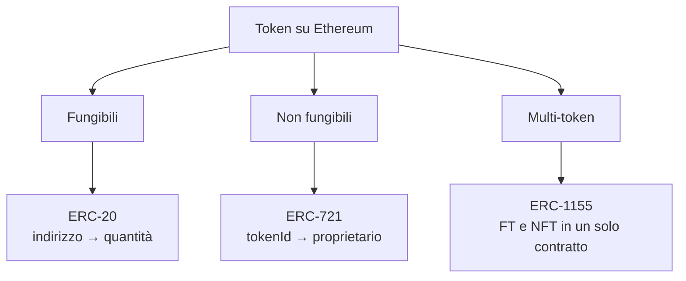
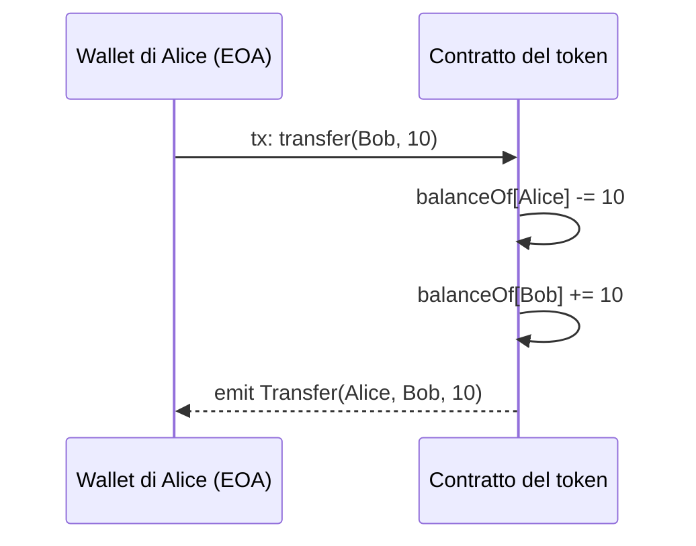
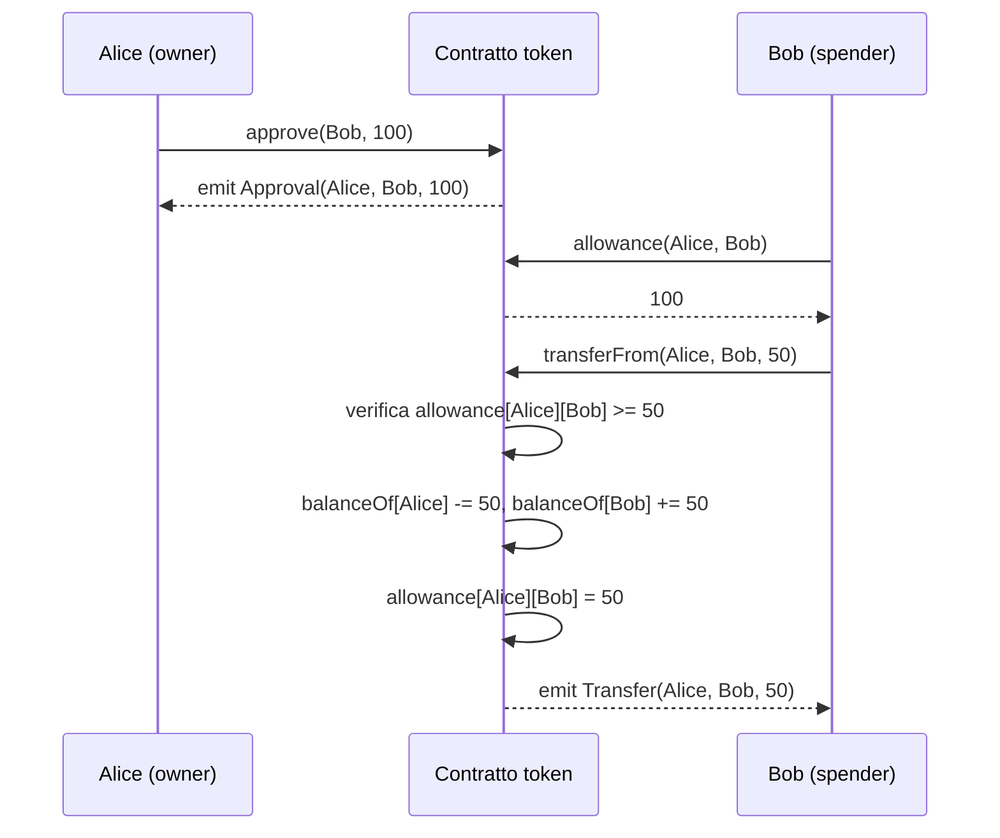
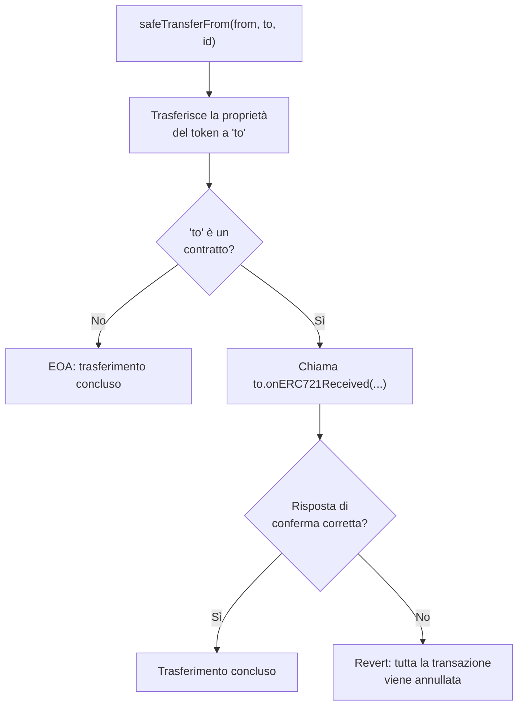
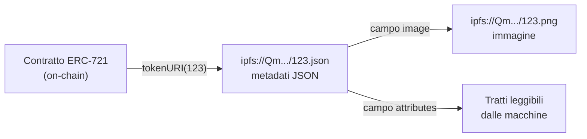
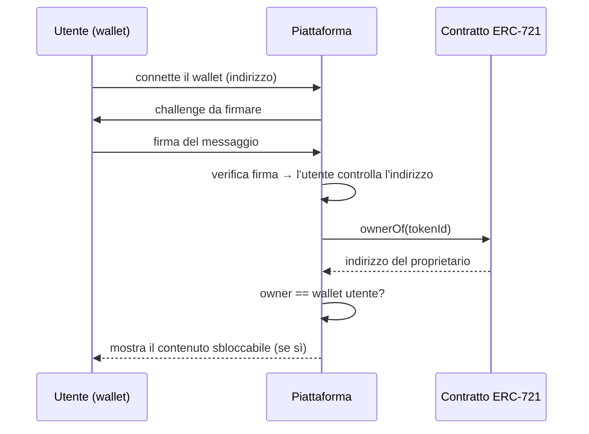
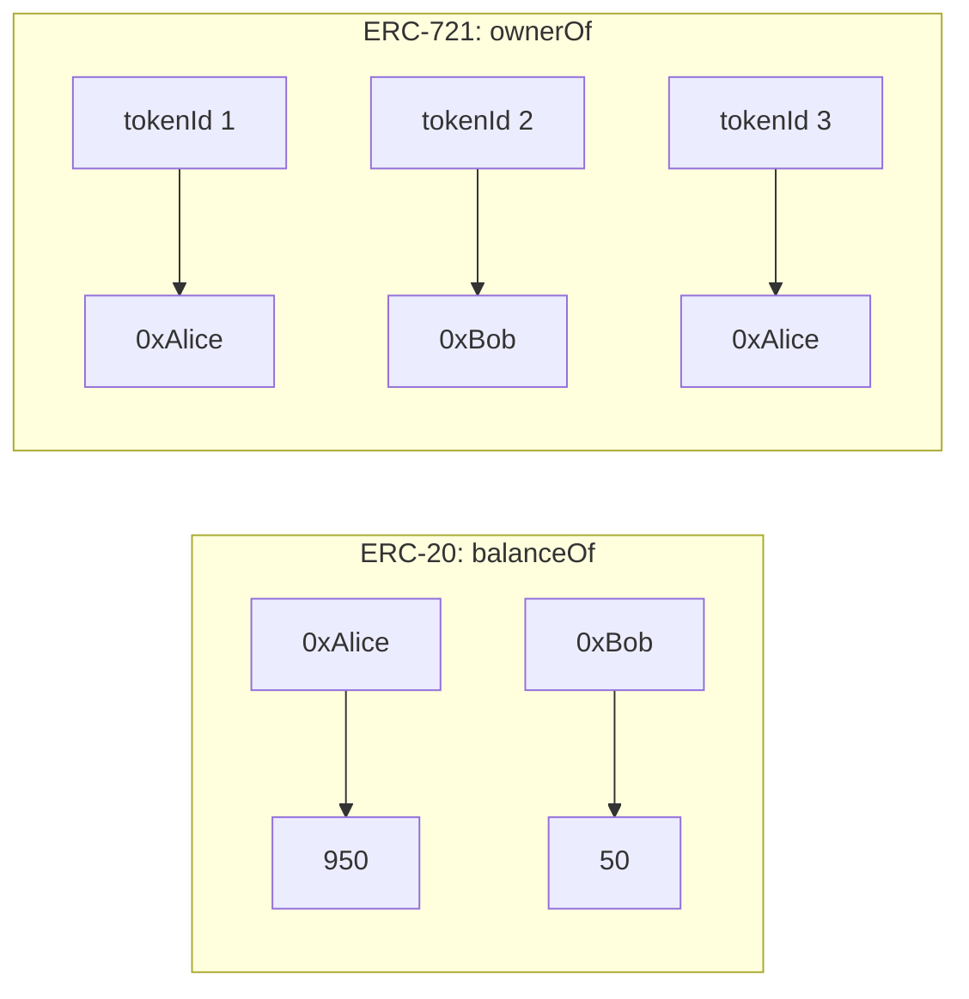

---
tags:
  - università/p2p-blockchain
  - ethereum
  - token
  - nft
  - erc-20
  - erc-721
data: 2026-04-20
lezione: "L15 - Fungible e Non Fungible Token: standard ERC"
professore: "Laura Ricci"
---

# Fungible e Non Fungible Token: gli standard ERC

Tra le cosiddette *killer application* della blockchain, cioè le applicazioni che ne hanno decretato il successo, ci sono ovviamente le criptovalute (Bitcoin, Ethereum, ...), ma subito dopo vengono i **token**, sia **fungibili** sia **non fungibili** (NFT). Seguono la finanza decentralizzata (DeFi), le supply chain e la certificazione, la Self Sovereign Identity (SSI) e molte altre.

In questa lezione capiamo cosa distingue un token da una moneta nativa, cosa significa che un bene è fungibile o non fungibile, e soprattutto come i token vengono realizzati su Ethereum tramite smart contract che rispettano degli **standard**: l'**ERC-20** per i token fungibili, l'**ERC-721** per gli NFT e l'**ERC-1155** che li unifica. Lungo la strada vedremo alcuni costrutti di **Solidity** (creazione di contratti, ereditarietà, interfacce) necessari per implementarli.

> [!note] Rilevanza per l'esame
>
> Dalle testimonianze degli orali passati, sui temi finali del corso (applicazioni della blockchain, token, NFT) la docente fa in genere meno domande, ma non ci sono garanzie, soprattutto per chi porta il progetto su Bitcoin. Conviene quindi conoscere bene almeno i concetti di fondo: coin vs token, fungibilità, cosa standardizza l'ERC-20 (in particolare il meccanismo di allowance) e l'ERC-721.

## Coin e token

I termini *coin* e *token* vengono spesso usati in modo intercambiabile, ma indicano due concetti diversi.

> [!definition] Digital coin
>
> Un **digital coin** è un asset **nativo della propria blockchain**. Esempi: bitcoin (Bitcoin), ether (Ethereum), ADA (Cardano), BNB (Binance), SOL (Solana).

I coin si comportano come denaro, e sono usati come una moneta reale: per **trasferire valore** (si può dare e ricevere valore usandoli), come **riserva di valore** (si possono conservare e scambiare in seguito con qualcosa di utile) e come **unità di conto** (si possono dare prezzi a beni e servizi in quella moneta). Inoltre sono usati per **ricompensare i nodi** che garantiscono il funzionamento della blockchain (miner o validatori).

> [!definition] Digital token
>
> Un **digital token** è un asset **non nativo**, creato **sopra una blockchain esistente** tramite **smart contract**.

Il fatto che i token siano creati da smart contract spiega perché la maggior parte dei token sia definita su Ethereum. I token **ereditano le capacità e la sicurezza della blockchain** che li ospita, e la maggior parte di essi esiste per essere usata all'interno di applicazioni decentralizzate (**DApp**), dove svolge una funzione specifica che ha senso nell'ecosistema di quella DApp.

Storicamente, i token sono oggetti simili a monete ma generalmente **privi di un quadro giuridico**: pseudo-valute o *voucher* usati come sostituti del denaro a corso legale (*fiat money*), emessi da un soggetto privato per un uso specifico, nati per esigenze private. Hanno valore all'interno di un certo ecosistema: il valore può anche essere alto, ma **solo all'interno della comunità** che li usa, nella quale tutti hanno concordato sul loro uso e sul loro scambio.

## Fungibilità

### Token fungibili

> [!definition] Bene fungibile
>
> Un bene è **fungibile** quando le sue unità sono **identiche** per natura e funzionalità: non esistono caratteristiche che distinguano una specifica unità dalle altre. Esempi: le valute fiat (euro, dollaro), le criptovalute (bitcoin, ether).

Le proprietà principali dei beni fungibili sono tre. L'**intercambiabilità**: ogni unità è intercambiabile con qualsiasi altra dello stesso tipo; la mia banconota da 20 dollari e la tua possono essere scambiate, un lingotto d'oro da 1 kg equivale a un altro lingotto da 1 kg. La **fusione** (*merging*): si possono unire più unità per ottenere un valore maggiore in quantità. La **divisibilità**: si può inviare o ricevere una frazione di un token.

> [!note] Le criptovalute sono davvero fungibili?
>
> In genere si considerano fungibili, ma la slide aggiunge un "ma...": **ogni bitcoin ha la propria storia**, tracciabile sulla blockchain. Un UTXO che proviene, ad esempio, da un furto noto potrebbe essere rifiutato da un exchange, e quindi valere "meno" di un altro. La questione è rimandata dalla docente ("to be discussed").

Esempi di token fungibili nel mondo reale sono le **fiches dei casinò**: il denaro viene scambiato con fiches, che generalmente non hanno valore al di fuori del casinò, anche se nelle città del gioco d'azzardo possono essere spese presso servizi che le accettano (taxi, mance ai camerieri, ...). Un altro esempio storico è quello delle **città minerarie**, che spesso avevano un unico negozio, il *company store*, dove i minatori acquistavano tutte le provviste: le compagnie minerarie creavano una propria valuta, che poteva essere scambiata con merci ma non aveva valore al di fuori del company store.

### Token non fungibili (NFT)

> [!definition] Non Fungible Token (NFT)
>
> Un **NFT** rappresenta un **asset unico**: ogni asset ha informazioni o attributi unici che lo rendono insostituibile. Rappresenta un'entità intera e **non può essere suddiviso** in più parti. Ogni token può essere associato a un **ID univoco**.

Gli NFT hanno centinaia di potenziali casi d'uso. Possono rappresentare, tramite entità digitali uniche, un **asset unico del mondo fisico**, **oggetti digitali riproducibili** trattati come elementi unici, **oggetti da collezione** (*collectibles*), **certificati di proprietà**.

Esempi dal mondo reale sono le **carte collezionabili dei Pokémon**: alcune sono molto più rare di altre, ognuna ha informazioni uniche, e sono sempre intere: vale l'**indivisibilità**, non si può scambiare mezza carta con un amico. Un caso curioso è quello dei **Beanie Babies** negli anni '90: peluche distribuiti in piccole quantità a piccoli rivenditori (nessuna catena, nessun grande ordine), con la produzione di alcuni modelli interrotta per creare esclusività, e con errori di stampa e difetti introdotti intenzionalmente per creare edizioni extra rare. È un buon esempio delle dinamiche del perché e del come le persone collezionano.

| Proprietà | Fungibile | Non fungibile |
|---|---|---|
| Unità | Identiche, intercambiabili | Uniche, ognuna con attributi propri |
| Divisibilità | Divisibile | Indivisibile |
| Identificazione | Conta solo la quantità | Ogni token ha un ID |
| Esempi reali | Banconote, oro, fiches | Carte Pokémon, opere d'arte, immobili |
| Standard Ethereum | ERC-20 | ERC-721 |

> [!tip] Intuizione chiave
>
> Per un bene fungibile conta **quanto** ne possiedi; per un bene non fungibile conta **quale** possiedi. Questa differenza si rifletterà direttamente nelle strutture dati dei due standard: l'ERC-20 associa indirizzi a quantità, l'ERC-721 associa ID a proprietari.

## Token crittografici e standard ERC

I **crypto-token** sono sviluppati sulla blockchain come **smart contract**. Questo apre la possibilità di creare token altamente sicuri e affidabili, sia fungibili sia non fungibili, perché ereditano alcune caratteristiche delle criptovalute: **tracciabilità, sicurezza, impossibilità di falsificazione**. La generazione di token crittografici è in piena espansione. I primi crypto-token sono stati le **colored coins**, sviluppate sulla blockchain di Bitcoin; oggi **Ethereum** è la piattaforma più usata grazie agli smart contract, anche se esistono ormai altre piattaforme specifiche.

### Perché uno standard

Immaginiamo che ogni progetto implementi il proprio token con funzioni dai nomi e dalle semantiche diverse: un wallet o un exchange dovrebbe scrivere codice ad hoc per ciascun token. Lo standard risolve questo problema: dà agli sviluppatori la **garanzia che gli asset si comporteranno in un modo specifico**, e assicura alle aziende che i loro token saranno **compatibili con l'infrastruttura Ethereum esistente**, come wallet ed exchange.

Uno **standard** è un insieme di regole a cui uno smart contract deve attenersi: definisce come un token funziona e come può essere **creato, trasferito, modificato e distrutto**. **ERC** sta per *Ethereum Request for Comment* (le slide citano anche la dicitura *Ethereum Request for Improvements*). Uno standard ERC per token specifica l'**interfaccia** che lo smart contract che implementa il token deve offrire.

> [!note] Nota
>
> Gli ERC sono una categoria degli **EIP** (*Ethereum Improvement Proposal*), l'analogo dei BIP di Bitcoin visti in L13: un ERC è un EIP che definisce uno standard a livello applicativo (interfacce di contratti), senza modificare il protocollo di consenso.


*Fig. — I principali standard ERC per i token (ne esistono molti altri).*

## Token fungibili: applicazioni

Le **Initial Coin Offering** (ICO) sono un modo per raccogliere fondi per nuovi progetti: aziende e startup creano i propri token e li vendono agli investitori in cambio di fondi per finanziare i propri progetti; l'uso di token standardizzati garantisce che gli investitori possano poi scambiarli.

Nella **finanza decentralizzata** (DeFi) i token sono usati come **collaterale** nelle piattaforme di prestito, dove gli utenti possono prendere in prestito fondi depositando i propri token come garanzia; come diritti di **voto e governance** nelle **DAO** (*Decentralized Autonomous Organization*), entità che operano senza un'autorità centrale; e in generale come **mezzo di scambio** nelle applicazioni DeFi.

Nel **gaming** i token servono a creare valute di gioco e rappresentare asset di gioco (anche le abilità di un personaggio): gli sviluppatori possono creare economie di gioco uniche e i giocatori possono scambiarsi oggetti e comprare o vendere valuta di gioco. Nelle **piattaforme social** online possono rappresentare **punti reputazione**.

## ERC-20: lo standard per i token fungibili

L'**ERC-20** è lo standard per gli smart contract di Ethereum che implementano token fungibili, proposto nel **novembre 2015** (le slide lo attribuiscono al co-fondatore di Ethereum Vitalik Buterin). Definisce un elenco comune di regole che un token deve implementare per offrire le seguenti funzionalità:

- **trasferire token**;
- ottenere il **saldo** corrente di token di un account;
- ottenere l'**offerta totale** (*total supply*) del token disponibile sulla rete;
- **permettere ad altri di trasferire token** per conto del possessore;
- **approvare** che una certa quantità di token di un account possa essere spesa da un account terzo.

È quindi un insieme di funzioni che tutti i token ERC-20 devono implementare, così da permettere l'integrazione con altri contratti, wallet o marketplace.

> [!note] Nota
>
> Storicamente l'ERC-20 è stato proposto da Fabian Vogelsteller insieme a Vitalik Buterin; le slide citano solo Buterin.

### Il saldo: una mappa indirizzo → quantità

Il contratto del token contiene una **mappa** che associa gli indirizzi degli account al loro **saldo**. Cosa rappresenti quel saldo **dipende dal contratto del token**: può rappresentare una quantità di oggetti fisici, diritti, valori monetari, e così via.

> [!warning] Attenzione
>
> I token ERC-20 **non stanno "dentro" il wallet** dell'utente come l'Ether. Il saldo in Ether è un campo dello stato dell'account; il saldo di un token è una riga nella mappa interna al contratto del token. "Possedere 100 token" significa che nello storage del contratto c'è `balanceOf[mio_indirizzo] = 100`.

### Funzioni obbligatorie e campi opzionali

Le funzioni obbligatorie dello standard sono sei (`totalSupply`, `balanceOf`, `transfer`, `approve`, `allowance`, `transferFrom`) più due eventi (`Transfer`, `Approval`). I campi opzionali sono `name`, `symbol` e `decimals`.

| Elemento | Tipo | Descrizione |
|---|---|---|
| `totalSupply()` | obbligatoria | Unità totali di token esistenti; l'offerta può essere fissa o variabile |
| `balanceOf(address)` | obbligatoria | Saldo di token dell'indirizzo dato |
| `transfer(to, amount)` | obbligatoria | Trasferisce `amount` token dal chiamante a `to` |
| `approve(spender, amount)` | obbligatoria | Autorizza `spender` a spendere fino a `amount` token del chiamante |
| `allowance(owner, spender)` | obbligatoria | Quantità che `spender` può ancora spendere per conto di `owner` |
| `transferFrom(from, to, amount)` | obbligatoria | Un delegato trasferisce token da `from` a `to` |
| `Transfer`, `Approval` | eventi | Registrati nei log a ogni trasferimento / approvazione |
| `name()` | opzionale | Nome leggibile (es. "US Dollars") |
| `symbol()` | opzionale | Simbolo leggibile (es. "USD") |
| `decimals()` | opzionale | Cifre decimali per la visualizzazione (fino a 18) |

Il campo **decimals** merita una spiegazione. Indica il numero di cifre dopo la virgola da usare quando si **visualizzano** i valori: se decimals vale 2, la quantità di token va divisa per 100 per ottenerne la rappresentazione visiva. È necessario perché **Solidity non supporta i numeri decimali** e rappresenta tutti i valori numerici come interi.

$$
\text{valore visualizzato} = \frac{\text{valore memorizzato}}{10^{\text{decimals}}}
$$

> [!example] Esempio
>
> Con `decimals = 18` (lo stesso rapporto tra ether e wei), un saldo memorizzato pari a $1{,}5 \cdot 10^{18}$ viene mostrato come 1,5 token. Il contratto lavora sempre con l'intero; la virgola è solo una convenzione di visualizzazione.

### Il trasferimento diretto: transfer

La funzione **`transfer`** implementa una transazione **a un solo passo**: dato un indirizzo e una quantità, trasferisce quella quantità di token all'indirizzo, prelevandola dal saldo dell'indirizzo che esegue il trasferimento. È usata dal proprietario dei token per inviarli a un altro indirizzo, esattamente come una normale transazione di criptovaluta tra due wallet.

Vediamo cosa succede quando Alice vuole inviare 10 token a Bob. Il wallet di Alice invia una **transazione all'indirizzo del contratto del token**, chiamando la funzione `transfer` con l'indirizzo di Bob e 10 come argomenti. Il contratto aggiorna il saldo di Alice (−10) e quello di Bob (+10), ed **emette un evento `Transfer`** sulla blockchain, utile per registrare l'operazione nei log.


*Fig. — Un trasferimento ERC-20: la transazione non va a Bob, ma al contratto del token, che aggiorna la propria mappa dei saldi.*

> [!tip] Collegamento con L14
>
> È un'applicazione diretta di quanto visto sulle transazioni: il campo `to` è l'indirizzo del contratto del token (non quello di Bob!), `value` è 0 (non si inviano Ether), e `data` contiene il function selector di `transfer(address,uint256)` seguito dall'indirizzo di Bob e da 10.

### La delega: approve, allowance, transferFrom

L'ERC-20 prevede anche un processo di pagamento **a due passi**, basato sull'**allowance** (autorizzazione, "permesso di spesa"): si consente a una **terza parte** di effettuare una transazione di token **per proprio conto**. I token restano associati al proprio indirizzo, ma vengono trasferiti da un terzo. Serve per questo una nuova funzione di trasferimento, **`transferFrom`**, che consente di trasferire token da un indirizzo che non si possiede.

Perché sono state create le funzioni di allowance? Si pensi a un pagamento che va effettuato ogni mese con regolarità, come l'affitto o le bollette. Ma soprattutto sono usate negli scenari in cui i possessori di token li offrono su un **marketplace**: il marketplace può finalizzare la transazione **senza attendere una nuova approvazione** del proprietario. In generale, sono lo strumento base della **DeFi**, dove un contratto (un exchange, una piattaforma di prestito) deve poter muovere i token dell'utente.

Le tre funzioni coinvolte sono:

- **`approve(spender, amount)`**: il proprietario dell'indirizzo che esegue la funzione autorizza un indirizzo **delegato** a prelevare token dal suo account e trasferirli ad altri account, fissando la **quantità massima** consentita;
- **`allowance(owner, spender)`**: prende in input l'indirizzo del proprietario e quello del delegato, e restituisce il numero di token attualmente approvato dal proprietario per quel delegato;
- **`transferFrom(from, to, amount)`**: permette a un delegato approvato di trasferire i fondi del proprietario a un account terzo, **sottraendo** i token trasferiti dall'allowance del delegato.

> [!example] Esempio di allowance
>
> Alice (A) ha 1000 token e vuole dare a Bob (B) il permesso di spenderne 100.
>
> 1. A chiama `approve(address(B), 100)`.
> 2. B controlla quanti token A gli ha permesso di usare chiamando `allowance(address(A), address(B))`, che restituisce 100.
> 3. B invia al proprio account una parte di questi token chiamando `transferFrom(address(A), address(B), 50)`. Ora l'allowance residua è 50, il saldo di A è 950.
> 4. Con prelievi successivi B può ritirare il resto, ma **fino a un massimo di 100 token in totale**.


*Fig. — Il pagamento in due passi: prima l'owner approva, poi il delegato preleva entro il limite approvato.*

### La mappa delle allowance

Nel contratto, le autorizzazioni sono memorizzate in una **mappa di mappe**:

```solidity
mapping(address => mapping(address => uint256)) public allowance;
```

Serve a tenere traccia di quanto un dato account (l'**owner**) consente a un altro account (lo **spender**) di spendere per suo conto. Perché una mappa di mappe? Perché un'allowance **non è una proprietà di un singolo indirizzo, ma di una coppia** (owner, spender). La prima mappa (`address => ...`) rappresenta il proprietario dei token; la seconda (`address => uint256`) rappresenta lo spender autorizzato per quel proprietario; il valore `uint256` è la quantità massima che lo spender può spendere. In altre parole:

$$
\texttt{allowance[owner][spender]} = \text{quantità che lo spender può spendere dai token dell'owner}
$$

| owner \ spender | Bob | Exchange X | Carol |
|---|---|---|---|
| Alice | 100 | 500 | 0 |
| Dave | 0 | 1000 | 20 |

*Una tabella di allowance: ogni riga è un owner, ogni colonna uno spender autorizzato.*

## Costrutti di Solidity per implementare token

Prima di vedere un contratto ERC-20 completo, la lezione introduce alcuni costrutti di **Solidity** utili per sviluppare token: creazione di contratti, ereditarietà, costruttori e interfacce.

### Contratti come classi, deployment come istanziazione

Il codice di un contratto è come il codice di una **classe**; l'**oggetto** viene creato (istanziato) quando il contratto viene pubblicato sulla blockchain, a un certo indirizzo, tramite una transazione. Il creatore di un contratto può essere un **account esterno** oppure **un altro contratto**. L'esempio seguente (un token volutamente minimale, **non conforme all'ERC-20**) mostra una "fabbrica" di token:

```solidity
contract Token {
    string public name;
    constructor(string memory _name) {
        name = _name;
    }
}

contract Fabric {
    address[] public tokens;
    function newToken(string memory _name) public {
        Token token = new Token(_name);
        tokens.push(address(token));
    }
}
```

Quando si crea un nuovo contratto con **`new`**, il valore restituito è un'**istanza** del contratto, che può essere usata per invocare le funzioni `public` o `external` del contratto creato. Il contratto `Token`, ad esempio, ha una variabile di stato pubblica `name`; le **variabili di stato pubbliche generano automaticamente dei metodi** (*getter*) che ne restituiscono il valore: `token.name()`.

È anche possibile usare l'espressione `tokens[_tokenId]`, che restituisce un indirizzo, e convertirla in un'istanza di tipo `Token` con `Token(indirizzo)` per accedere alla variabile pubblica:

```solidity
function getTokenName(uint8 _tokenId) public view returns (string memory) {
    string memory name = Token(tokens[_tokenId]).name();
    return name;
}
```

> [!tip] Intuizione chiave
>
> `Fabric` è il pattern *factory*: un contratto che crea altri contratti. Conferma quanto visto in L14: i contratti possono creare contratti, ma tutto parte comunque da un EOA che chiama `newToken`. Ogni `new` incrementa il nonce del contratto `Fabric` (che conta proprio le creazioni di contratti).

### Ereditarietà

Come nella programmazione orientata agli oggetti, Solidity consente l'**ereditarietà**. Un contratto eredita tutte le variabili di stato e le funzioni **non dichiarate `private`**. Le variabili e funzioni **`internal`** sono ereditate dai contratti figli e sono accessibili all'interno del contratto e dai contratti derivati. Le funzioni e variabili **`private`** sono accessibili **solo all'interno del contratto** in cui sono dichiarate, e non possono essere accedute dai contratti derivati né dall'esterno, migliorando l'incapsulamento e la sicurezza.

L'esempio della lezione:

```solidity
pragma solidity ^0.8.7;

contract Flower {
    address public owner;
    string flowerType;
    constructor(string memory newFlowerType) {
        owner = msg.sender;
        flowerType = newFlowerType;
    }
    function water() public pure returns (string memory) {
        return "ohhhh, thanks, I love";
    }
}

contract Rose is Flower("Rose") {
    function pick() public pure returns (string memory) {
        return "ouuuch";
    }
}

contract Jasmine is Flower("Jasmine") {
    function smell() public pure returns (string memory) {
        return "Mmmmm, smells good!!";
    }
}
```

`Rose` e `Jasmine` ereditano da `Flower` la variabile `owner`, la variabile `flowerType` (che ha visibilità di default `internal`) e la funzione `water()`. Il costruttore del padre richiede un parametro, che viene passato direttamente nella dichiarazione di ereditarietà: `is Flower("Rose")`.

> [!warning] Attenzione: il codice nelle slide
>
> Nella versione delle slide le funzioni `pick()` e `smell()` restituiscono `(owner, "ouuuch")`, cioè due valori, pur dichiarando un solo valore di ritorno di tipo `string` e pur essendo marcate `pure` (che vieta di leggere variabili di stato come `owner`); inoltre il costruttore è marcato `public`, cosa non ammessa da Solidity 0.7 in poi. Quel codice non compilerebbe: qui è riportata una versione corretta che conserva il senso dell'esempio. Per restituire anche `owner` bisognerebbe dichiarare la funzione `view` e `returns (address, string memory)`.

Le funzioni possono essere ereditate e anche **ridefinite** (*override*), a patto che nel padre siano dichiarate **`virtual`** e nel figlio **`override`**:

```solidity
pragma solidity ^0.8.7;

contract Foo {
    function calculate(uint x, uint y) public virtual pure returns (uint) {
        return x + y;
    }
}

contract Bar is Foo {
    function calculate(uint x, uint y) public override pure returns (uint) {
        return x - y;
    }
}
```

### Interfacce

Le **interfacce** sono simili ai contratti astratti, ma **non implementano alcuna funzione** e **non dichiarano variabili di stato**. Come nei linguaggi orientati agli oggetti, sono dei *blueprint*, un elenco di funzioni da implementare senza la loro implementazione. Sono proprio lo strumento usato per **descrivere gli standard** da implementare, come ERC-20 ed ERC-721. Le interfacce possono ereditare da altre interfacce:

```solidity
pragma solidity ^0.8.7;
interface Foo {}
interface Bar is Foo {}
```

L'interfaccia che descrive l'ERC-20 si chiama **`IERC20`**:

```solidity
interface IERC20 {
    function totalSupply() external view returns (uint256);
    function balanceOf(address account) external view returns (uint256);
    function transfer(address to, uint256 amount) external returns (bool);
    function allowance(address owner, address spender) external view returns (uint256);
    function approve(address spender, uint256 amount) external returns (bool);
    function transferFrom(address from, address to, uint256 amount) external returns (bool);

    event Transfer(address indexed from, address indexed to, uint256 value);
    event Approval(address indexed owner, address indexed spender, uint256 value);
}
```

> [!note] Nota
>
> La slide dell'interfaccia IERC20 è un'immagine; il codice riportato è la definizione standard (quella di OpenZeppelin), coerente con le funzioni descritte a lezione.

## Un contratto ERC-20 completo

Mettendo insieme tutto, ecco il contratto ERC-20 visto a lezione. La prima parte dichiara i campi opzionali, l'offerta totale, le due mappe e gli eventi:

```solidity
pragma solidity ^0.8.7;

contract MyToken {
    string public name = "My Token";
    string public symbol = "MTK";
    uint8 public decimals = 18;
    uint public totalSupply = 100_000 * 10 ** decimals;

    mapping(address => uint) public balanceOf;
    mapping(address => mapping(address => uint)) public allowance;

    event Transfer(address indexed _from, address indexed _to, uint256 _value);
    event Approval(address indexed _owner, address indexed _spender, uint256 _value);
```

Si noti che, dichiarando `name`, `symbol`, `decimals`, `totalSupply`, `balanceOf` e `allowance` come variabili `public`, Solidity genera automaticamente i getter omonimi: in questo modo le funzioni `totalSupply()`, `balanceOf(address)` e `allowance(address,address)` richieste dallo standard sono già implementate. La totalSupply vale $100\,000 \cdot 10^{18}$ unità interne, cioè 100.000 token visualizzati.

Seguono `transfer` e `approve`:

```solidity
    function transfer(address _to, uint256 _value) public returns (bool success) {
        balanceOf[msg.sender] -= _value;
        balanceOf[_to] += _value;
        emit Transfer(msg.sender, _to, _value);
        return true;
    }

    function approve(address _spender, uint256 _value) public returns (bool success) {
        allowance[msg.sender][_spender] = _value;
        emit Approval(msg.sender, _spender, _value);
        return true;
    }
```

`msg.sender` è l'indirizzo di chi ha chiamato la funzione. In `transfer` si scala il saldo del chiamante e si incrementa quello del destinatario; in `approve` si scrive nella mappa delle allowance, alla riga del chiamante (owner) e alla colonna dello spender. Entrambe emettono il relativo evento.

Infine `transferFrom`:

```solidity
    function transferFrom(address _from, address _to, uint256 _value)
        public returns (bool success)
    {
        require(allowance[_from][msg.sender] >= _value);
        balanceOf[_from] -= _value;
        balanceOf[_to] += _value;
        allowance[_from][msg.sender] -= _value;
        emit Transfer(_from, _to, _value);
        return true;
    }
}
```

Qui il chiamante (`msg.sender`) è lo **spender**: si verifica con `require` che la sua allowance sul conto di `_from` sia sufficiente, si spostano i token da `_from` a `_to`, e si **scala l'allowance** della quantità spesa.

> [!warning] Attenzione: errore nelle slide
>
> Nella slide, dentro `transferFrom`, le due righe dei saldi sono invertite (`balanceOf[_from] += _value; balanceOf[_to] -= _value;`), il che farebbe **aumentare** il saldo di chi paga e **diminuire** quello di chi riceve. È evidentemente un refuso: la versione corretta, riportata sopra, sottrae da `_from` e aggiunge a `_to`.

> [!note] Perché non ci sono controlli sul saldo?
>
> In `transfer` non c'è un `require(balanceOf[msg.sender] >= _value)`. Dalla versione 0.8 di Solidity l'aritmetica è controllata: se il saldo è insufficiente, la sottrazione andrebbe in *underflow* e la transazione viene annullata automaticamente. Nelle versioni precedenti questo controllo andava scritto esplicitamente, e la sua mancanza era una fonte classica di vulnerabilità. (Osservazione non presente nelle slide.)

### Non reinventare la ruota: OpenZeppelin

Scrivere da zero un token è rischioso: un errore come quello appena visto può costare milioni. Il consiglio della docente è **non reinventare la ruota** e usare il kit di sviluppo sicuro proposto da **OpenZeppelin**: è open source, è frutto di uno sforzo comunitario con continuo *auditing* di sicurezza del codice, offre un *wizard* per la generazione del codice e contiene template per tutti i tipi di token. Nel 2021 era usato in circa 3000 progetti blockchain.

```solidity
pragma solidity ^0.8.0;
import "@openzeppelin/contracts/token/ERC20/ERC20.sol";
// OPPURE
import "@openzeppelin/contracts/token/ERC721/ERC721.sol";
// OPPURE
import "@openzeppelin/contracts/token/ERC1155/ERC1155.sol";

contract <name> is ERC<N> {
    // [...]
}
```

Un token ERC-20 completo, con OpenZeppelin, si scrive in poche righe:

```solidity
import "@openzeppelin/contracts/token/ERC20/ERC20.sol";

contract MyToken is ERC20 {
    constructor() ERC20("MyToken", "MTK") {
        _mint(msg.sender, 1000);
    }
}
```

Il contratto `ERC20` è un'implementazione di OpenZeppelin dell'interfaccia `IERC20`. Il contratto `MyToken` è **figlio** di `ERC20`, e ne eredita variabili e funzioni. Il contratto padre ha un **costruttore che richiede parametri** (nome e simbolo del token), che devono essere passati dal contratto figlio. La funzione **`_mint`** conia (*mints*) token e li invia a un certo account: i token vengono **creati dal nulla** e la totalSupply viene aumentata di conseguenza.

> [!note] Nota
>
> Nell'esempio `_mint(msg.sender, 1000)` crea 1000 unità **interne**. Poiché l'ERC20 di OpenZeppelin ha `decimals = 18` per default, a schermo il deployer vedrebbe $1000 / 10^{18}$ token. Per coniare 1000 token "visibili" si scriverebbe `_mint(msg.sender, 1000 * 10 ** decimals())`.

---

## Token non fungibili

Gli NFT sono **asset crittografici tracciati su una blockchain**, con **codici identificativi unici e metadati** che li distinguono l'uno dall'altro, definiti da uno smart contract. Possono rappresentare asset **solo online**, come opere d'arte digitali o oggetti di gioco; **oggetti del mondo reale**, come opere d'arte o immobili (la **tokenizzazione** di beni tangibili rende più efficienti compravendita e scambio, riducendo la probabilità di frode); **identità** degli individui, **diritti di proprietà** e altro.

### ERC-721

Lo standard **ERC-721** per gli NFT è stato proposto nel **gennaio 2018**. Il concetto centrale è che tutti gli NFT hanno una variabile **`uint256` chiamata `tokenId`**, e che per qualsiasi contratto ERC-721 la coppia

$$
(\text{indirizzo del contratto},\ \texttt{tokenId})
$$

deve essere **globalmente unica**. In altre parole, il `tokenId` è unico all'interno di un contratto; l'indirizzo del contratto lo rende unico in tutto Ethereum.

Lo standard fornisce un elenco comune di funzioni per: verificare il **numero di token posseduti** da un utente (`balanceOf`); ottenere l'**indirizzo del proprietario** attuale di un dato NFT, identificato dal suo tokenId (`ownerOf`); **trasferire e approvare** movimenti di singoli token; un meccanismo di **allowance** simile a quello dell'ERC-20.

```solidity
interface IERC721 {
    event Transfer(address indexed from, address indexed to, uint256 indexed tokenId);
    event Approval(address indexed owner, address indexed approved, uint256 indexed tokenId);
    event ApprovalForAll(address indexed owner, address indexed operator, bool approved);

    function balanceOf(address owner) external view returns (uint256 balance);
    function ownerOf(uint256 tokenId) external view returns (address owner);
    function safeTransferFrom(address from, address to, uint256 tokenId, bytes calldata data) external;
    function safeTransferFrom(address from, address to, uint256 tokenId) external;
    function transferFrom(address from, address to, uint256 tokenId) external;
    function approve(address to, uint256 tokenId) external;
    function setApprovalForAll(address operator, bool approved) external;
    function getApproved(uint256 tokenId) external view returns (address operator);
    function isApprovedForAll(address owner, address operator) external view returns (bool);
}
```

> [!note] Nota
>
> La slide con l'interfaccia ERC-721 è un'immagine: il codice riportato è l'interfaccia standard. Rispetto all'ERC-20 l'allowance è per singolo token (`approve` / `getApproved`) oppure "totale" su tutti i token di un owner verso un operatore (`setApprovalForAll`), tipicamente usata dai marketplace.

### safeTransferFrom

Se Bob vuole trasferire un token ERC-721 ad Alice può chiamare `transferFrom(BobAddr, AliceAddr, ID)`. Il problema di `transferFrom` è che il trasferimento viene eseguito **senza verificare il destinatario**: se il parametro `to` è uno smart contract che **non supporta l'ERC-721**, l'NFT può restare **bloccato per sempre** (il contratto ne diventa proprietario ma non ha alcun codice per trasferirlo altrove).

Per questo è stata introdotta **`safeTransferFrom`**, una versione più sicura che verifica se il destinatario è in grado di gestire gli NFT. Se Bob vuole trasferire un token a un contratto chiama `safeTransferFrom(BobAddr, contractAddr, ID)`, e il contratto destinatario deve essere in grado di **confermare la ricezione** (*acknowledge*) del trasferimento. Oltre a trasferire il token, la funzione controlla se `to` è uno smart contract; se lo è, chiama su di esso la funzione **`onERC721Received(...)`**. Se il contratto non implementa correttamente questa funzione, cioè la conferma non viene ricevuta, **la transazione viene annullata** (*revert*): o il contratto è in grado di gestire gli NFT, o il trasferimento non avviene. Lo scopo è evitare che i token restino bloccati per sempre: gli NFT sono preziosi!


*Fig. — La logica di safeTransferFrom: un contratto che non sa gestire NFT non può riceverne.*

## I metadati degli NFT

Un NFT non è solo un ID: è accompagnato da **metadati** che lo descrivono. Quelli tipici sono il **nome**, il **contenuto principale** (ad esempio l'immagine o il video), un **contenuto di anteprima**, una **descrizione**, i **tratti** (*traits*), l'eventuale **contenuto sbloccabile** (*unlockable content*), le **royalty** continuative e la **supply**, che quasi sempre vale 1.

### tokenURI e il file JSON

Nell'ERC-721, la funzione **`tokenURI`** indica **dove trovare i metadati** di uno specifico NFT. Fa parte dello standard (nell'estensione per i metadati):

```solidity
function tokenURI(uint256 tokenId) external view returns (string memory);
```

Dato un `tokenId`, restituisce un **URI** (un link) che punta a un **file JSON** che descrive quell'NFT. Tipicamente restituisce un URL HTTP, come `https://my-nft-site.com/metadata/123.json`, oppure un link **IPFS**, come `ipfs://Qm.../123.json`. Questi link puntano a un file JSON che può contenere a sua volta altri link.

```json
{
  "name": "Cool Cat #123",
  "description": "Un gatto molto raro",
  "image": "ipfs://Qm.../123.png",
  "attributes": [
    { "trait_type": "Fur", "value": "Gold" },
    { "trait_type": "Eyes", "value": "Laser Eyes" },
    { "trait_type": "Strength", "value": 85 }
  ]
}
```

> [!note] Nota
>
> Il JSON di esempio della slide è un'immagine; quello sopra è una ricostruzione nel formato standard dei metadati (usato ad esempio da OpenSea), coerente con i tratti citati a lezione ("gold fur", "Laser Eyes", "Strength").

Il campo `"image"` è un altro link IPFS che punta all'immagine vera e propria dell'NFT. Piattaforme come **OpenSea** seguono automaticamente questa catena di riferimenti.


*Fig. — La catena di riferimenti di un NFT: on-chain c'è solo l'ID, il proprietario e un puntatore ai metadati.*

### A cosa servono gli attributi

Perché servono gli attributi se c'è già l'immagine? Gli usi sono tre. Il primo è **ricerca e filtraggio**, molto importante: i marketplace (OpenSea, Blur, ecc.) usano gli attributi per permettere agli utenti di filtrare gli NFT (ad esempio "solo pelo dorato"), cercare per tratti e costruire collezioni. Il secondo è il **calcolo della rarità**: gli attributi sono usati per calcolare punteggi di rarità; se solo l'1% degli NFT ha "Laser Eyes" è un tratto molto raro, se l'80% ha "Brown Fur" è comune; questo influisce direttamente su prezzo e desiderabilità. Il terzo è la **logica di gioco o di utilità**: in alcuni NFT (giochi, metaverso) un tratto come `{ "trait_type": "Strength", "value": 85 }` può influenzare il gameplay, sbloccare funzionalità, determinare comportamenti.

> [!tip] Intuizione chiave
>
> **L'immagine è per gli umani, gli attributi sono per le macchine.**

### Metadati on-chain o off-chain?

Una decisione importante è se **incorporare i metadati direttamente nello smart contract** (dati *on-chain*) oppure ospitarli separatamente (dati *off-chain*). Memorizzare i metadati sulla blockchain può essere **estremamente costoso** (ogni byte di storage costa gas) e non è raccomandato in generale.

I metadati on-chain sono però necessari in due casi. Il primo è quando l'informazione **deve essere registrata in modo persistente** sulla blockchain: ad esempio un'opera d'arte digitale che deve sopravvivere nel tempo indipendentemente dal fatto che il sito originale esista ancora. Il secondo è quando la **logica on-chain deve interagire con i metadati**: ad esempio in CryptoKitties l'"età" di un gattino influenza la velocità con cui può riprodursi, quindi la logica del contratto deve poter accedere a quel dato on-chain.

Per i dati off-chain ci sono due soluzioni principali. La prima sono i **servizi di cloud storage** come Amazon AWS o Google Cloud, che però **non sono davvero nello "spirito" della blockchain**: se il server chiude o il file viene modificato, l'NFT punta a qualcosa che non esiste più o che è cambiato. La seconda è l'**InterPlanetary File System** (**IPFS**), una rete peer-to-peer decentralizzata di computer sparsi nel mondo in cui i contenuti sono memorizzati in più posizioni.

> [!note] Nota
>
> IPFS sarà trattato nella lezione successiva (L16). Il motivo per cui si adatta bene agli NFT è che usa il **content addressing**: l'identificatore del file (CID) è derivato dall'hash del contenuto, quindi il link nel tokenURI vincola crittograficamente anche il contenuto a cui punta, e non può essere cambiato senza cambiare il link.

### Royalty continuative

Se impostate, le **royalty continuative** (*ongoing royalties*) fanno sì che ogni volta che l'NFT viene rivenduto in futuro, una certa percentuale torni al creatore originale. L'importo della royalty viene inviato **automaticamente** al wallet del creatore, che sceglie la percentuale desiderata. In questo modo artisti e creatori possono guadagnare dalle vendite future delle loro creazioni senza dover fare nient'altro.

> [!example] Esempio di royalty
>
> Un artista vende un NFT per 1 ETH. Più tardi qualcuno lo rivende per 10 ETH: l'artista riceve, ad esempio, il 5% della rivendita, cioè 0,5 ETH. E questo accade **a ogni scambio** dell'NFT.

> [!note] Nota
>
> L'ERC-721 di per sé non impone le royalty; esiste uno standard separato (EIP-2981) con cui un contratto dichiara la royalty dovuta, ma il pagamento effettivo dipende dal marketplace che esegue la vendita. Questa precisazione non è nelle slide.

### Contenuto sbloccabile

L'**unlockable content** è un contenuto che **solo il proprietario dell'NFT** può vedere o a cui può accedere. Può essere qualsiasi tipo di contenuto (un'immagine, un video), informazioni per riscattare oggetti fisici o altri vantaggi, ad esempio una chiave di attivazione di un gioco.

Serve una **piattaforma**, cioè un'applicazione (di solito un sito web o un server di backend) che **ospita e controlla l'accesso** al contenuto sbloccabile, mostrandolo o nascondendolo. Può essere un sito web (come OpenSea o un sito NFT dedicato), un server di backend (Node.js, Python, ecc.) oppure un'applicazione decentralizzata (DApp).

La verifica della proprietà dell'NFT da parte della piattaforma avviene in cinque passi:

1. **l'utente connette il wallet**: la piattaforma ottiene l'indirizzo del wallet dell'utente;
2. **verifica del controllo**: l'utente **firma un messaggio** per dimostrare di controllare davvero quel wallet;
3. **identificazione dell'NFT**: il sito deve conoscere l'indirizzo del contratto e il tokenId;
4. **interrogazione della blockchain**: si chiama `ownerOf(tokenId)` sul contratto ERC-721;
5. **confronto degli indirizzi**: si verifica che il proprietario coincida con il wallet dell'utente.


*Fig. — Verifica della proprietà di un NFT per l'accesso al contenuto sbloccabile.*

> [!tip] Intuizione chiave
>
> Il passo 2 è essenziale: conoscere un indirizzo non significa possederlo, e l'indirizzo del proprietario di un NFT è pubblico. Solo la firma di un messaggio con la chiave privata dimostra che l'utente controlla davvero quel wallet. `ownerOf` è una chiamata di sola lettura (`view`), che non costa gas perché non genera una transazione.

## Riepilogo ERC-20 vs ERC-721

La differenza fondamentale tra i due standard si riassume in una frase: **l'ERC-20 associa indirizzi a quantità, l'ERC-721 associa ID unici a proprietari**.


*Fig. — Le strutture dati dei due standard: indirizzo → quantità contro tokenId → proprietario.*

## ERC-1155: il multi-token standard

L'**ERC-1155** è stato proposto per la prima volta dal CTO di **Enjin**, tramite un EIP, nel **2018**. L'idea è **ridurre il volume delle transazioni e i costi**: è stato creato con la capacità di **coniare e trasferire più token alla volta**, e **combina le funzioni dell'ERC-20 e dell'ERC-721**, consentendo di creare token fungibili e NFT **in un unico smart contract**.

Le differenze con l'ERC-721 si possono leggere lungo quattro assi.

Per il **tipo di token**, l'ERC-721 supporta solo NFT (ogni token è unico e non sostituibile), mentre l'ERC-1155 può creare sia NFT sia token fungibili (FT).

Per gli **smart contract**, l'ERC-721 supporta un solo tipo di token per contratto, e quindi serve un contratto distinto per ogni tipo; l'ERC-1155 può usare un solo contratto per vari token e per nuovi oggetti.

Per il **trasferimento in batch**, l'ERC-721 consente di trasferire un solo token per transazione, il che è inefficiente e potenzialmente costoso in gas; l'ERC-1155 supporta l'invio in blocchi (*batch*).

Per la **sicurezza degli asset**, secondo le slide le transazioni ERC-721 sono irreversibili, per cui se un utente invia a un indirizzo sbagliato l'asset è perso; l'ERC-1155 ha invece una funzione di "safe transfer" che consente di verificare la validità della transazione.

> [!warning] Attenzione: una precisazione sulle slide
>
> Le slide affermano che con l'ERC-1155 "l'asset può essere recuperato anche se inviato all'indirizzo sbagliato". Questa formulazione va presa con cautela: anche l'ERC-721 ha `safeTransferFrom` (vista sopra), e il safe transfer dell'ERC-1155 (che richiede al contratto destinatario di implementare `onERC1155Received`) **impedisce** l'invio a contratti incapaci di gestire i token, facendo fallire la transazione; non permette però di recuperare token inviati a un indirizzo EOA sbagliato. Le transazioni su blockchain restano irreversibili. All'esame conviene riportare il concetto come "l'ERC-1155 rende obbligatorio il controllo di sicurezza sul destinatario".

| | ERC-721 | ERC-1155 |
|---|---|---|
| Tipi di token | Solo NFT | NFT e FT |
| Contratti | Uno per tipo di token | Uno per molti tipi |
| Trasferimenti | Un token per transazione | Batch di più token |
| Safe transfer | Opzionale (`safeTransferFrom` accanto a `transferFrom`) | Sempre obbligatorio |

### ERC-1155 nell'industria

Tre esempi di utilizzo citati a lezione. La **Enjin Platform**, una piattaforma di gaming basata su blockchain che usa l'ERC-1155 per creare asset di gioco utilizzabili in più giochi, con asset diversi (armi, scudi e altri oggetti) in un unico smart contract. **The Sandbox**, una piattaforma di gioco virtuale in cui gli utenti possono costruire, possedere e monetizzare le proprie esperienze in un mondo virtuale, che usa l'ERC-1155 per creare e gestire asset di gioco come terreni, edifici ed equipaggiamento. **Rarible**, una piattaforma che consente agli utenti di creare e vendere opere d'arte digitali come NFT, e che usa l'ERC-1155 per supportare sia FT sia NFT, offrendo maggiore flessibilità nei tipi di opere create e scambiate.

La lezione si chiude osservando che, in realtà, quella dei token è una vera e propria **"giungla"**: oltre ai tre standard principali ne esistono moltissimi altri.

---

> [!question] Possibili domande d'esame
>
> - Qual è la differenza tra un coin e un token? Perché la maggior parte dei token è definita su Ethereum?
> - Cosa significa che un bene è fungibile? Quali proprietà ha? Le criptovalute sono davvero fungibili?
> - Cos'è un NFT? Cosa può rappresentare e come viene identificato in modo univoco?
> - Perché servono gli standard ERC? Quali funzioni definisce l'ERC-20?
> - Spiega il meccanismo di allowance dell'ERC-20: a cosa serve, quali funzioni coinvolge e come è memorizzato nel contratto. Fai un esempio.
> - Cosa succede, a livello di transazione Ethereum, quando Alice invia 10 token ERC-20 a Bob?
> - Cos'è l'ERC-721? Qual è la differenza tra transferFrom e safeTransferFrom?
> - Dove vengono memorizzati i metadati di un NFT? Pro e contro di on-chain, cloud e IPFS. Come fa una piattaforma a verificare che un utente possieda un NFT?
> - Cos'è l'ERC-1155 e in cosa differisce dall'ERC-721?

> [!abstract] Sintesi
>
> I coin sono asset nativi di una blockchain; i token sono asset creati sopra una blockchain esistente tramite smart contract, e ne ereditano la sicurezza. I token fungibili sono intercambiabili, fondibili e divisibili; gli NFT sono unici, indivisibili e identificati da un ID. Gli standard ERC definiscono l'interfaccia che un contratto deve implementare per essere compatibile con wallet ed exchange. L'ERC-20 (token fungibili) mantiene una mappa indirizzo → saldo e offre totalSupply, balanceOf, transfer e il meccanismo di delega approve / allowance / transferFrom, basato su una mappa di mappe owner → spender → quantità. In Solidity i token si implementano con interfacce ed ereditarietà, preferibilmente partendo dalle implementazioni verificate di OpenZeppelin. L'ERC-721 (NFT) associa ogni tokenId a un proprietario, con la coppia (contratto, tokenId) globalmente unica; safeTransferFrom evita di bloccare NFT in contratti incapaci di gestirli; i metadati sono tipicamente off-chain (preferibilmente su IPFS) e raggiunti tramite tokenURI. L'ERC-1155 unisce FT e NFT in un solo contratto con trasferimenti in batch.
