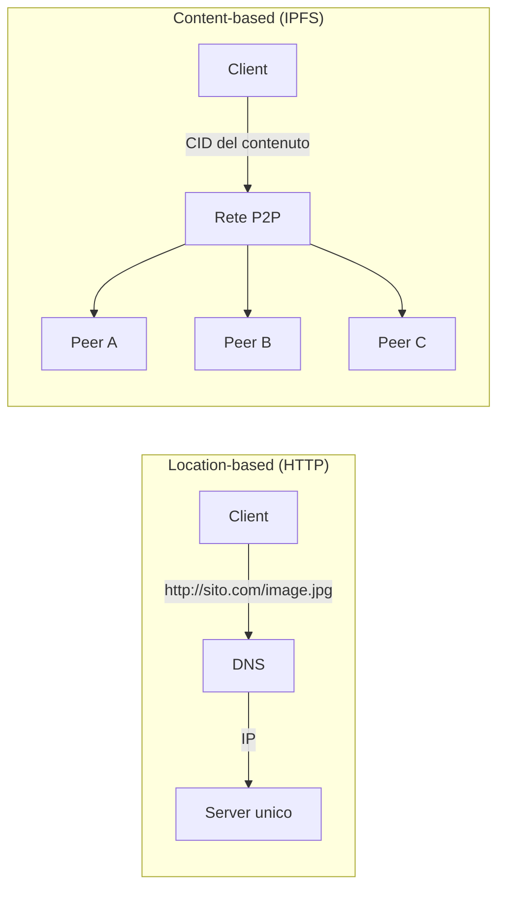
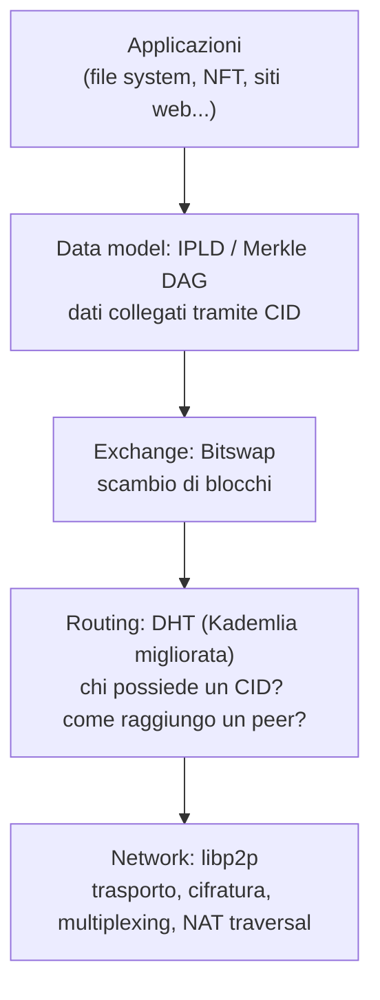
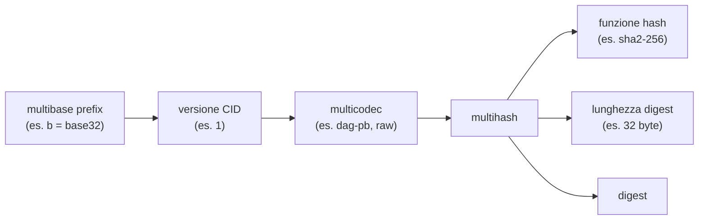
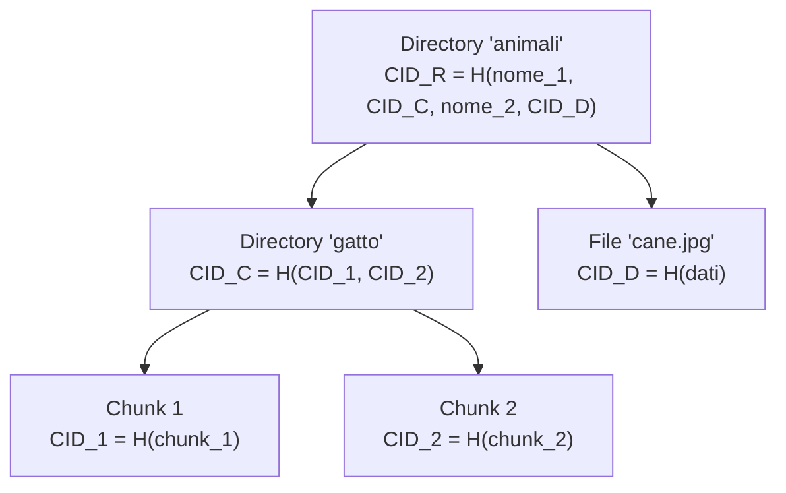
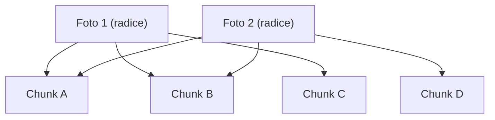
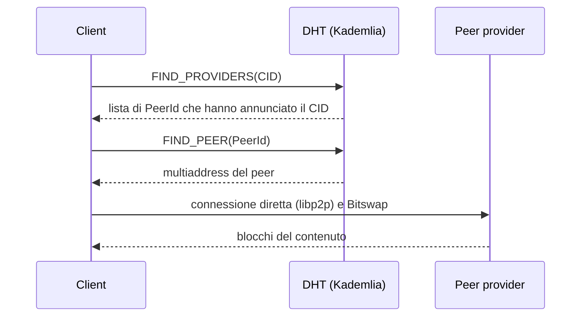
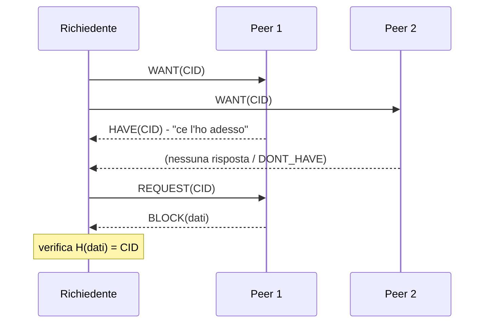
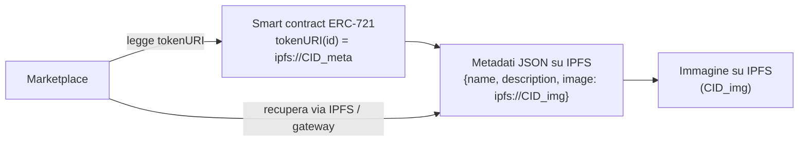

---
tags:
  - università/p2p-blockchain
  - ipfs
  - content-addressing
  - merkle-dag
data: 2026-04-23
lezione: "L16 - IPFS: A Distributed Content Based Storage"
professore: "Laura Ricci"
---

# IPFS: un sistema di storage distribuito basato sul contenuto

Questa lezione presenta **IPFS** (*InterPlanetary File System*), un file system distribuito peer-to-peer che rappresenta un punto di incontro naturale tra le due metà del corso. Da un lato riprende quasi tutti gli strumenti visti nella parte P2P (DHT di tipo Kademlia, scambio di blocchi alla BitTorrent), dall'altro usa le stesse strutture dati autenticate che sono alla base delle blockchain (funzioni hash crittografiche, strutture di Merkle). Inoltre IPFS è oggi lo strato di storage di riferimento per molte applicazioni blockchain, in particolare per gli NFT, perché memorizzare dati voluminosi direttamente on-chain è proibitivamente costoso.

Il filo conduttore della lezione è il passaggio da un web **basato sulla posizione** (*location-based*) a un web **basato sul contenuto** (*content-based*): invece di chiedere "dammi il file che si trova su quel server", si chiede "dammi il file che ha questo contenuto", indipendentemente da dove sia memorizzato.

## I limiti del web centralizzato

### Censura e punti singoli di fallimento

Le prime slide della lezione mostrano, tramite immagini, esempi di **censura** nel web centralizzato. Il problema è strutturale: se un contenuto è identificato dall'indirizzo del server che lo ospita, basta bloccare quel server (o il nome di dominio che punta a esso) per rendere il contenuto irraggiungibile per un'intera popolazione di utenti, anche se migliaia di copie identiche esistono sui computer delle persone che lo hanno già scaricato.

> [!note] Nota
>
> Le slide sulla censura sono solo immagini e il testo non è stato estratto. Un esempio classico, spesso citato proprio a proposito di IPFS, è il blocco di Wikipedia in Turchia nel 2017: in risposta ne venne pubblicata una copia su IPFS, raggiungibile tramite il suo identificatore di contenuto anche senza passare dai server bloccati. Questo esempio non è ricavabile dal testo delle slide.

### Trovare il contenuto

Il secondo limite riguarda la **localizzazione del contenuto**. Ognuno di noi ospita moltissimi file sul proprio computer. Se Mary ha bisogno di un'immagine che Bob possiede già localmente, nel web attuale Mary non ha alcun modo di saperlo: dovrà comunque rivolgersi al web server originale, magari lontano e sovraccarico, anche se Bob si trova nella stanza accanto. La domanda che la slide pone è: *come ottenere un'informazione da dove essa si trova effettivamente, senza passare dal web server?*

### Il web basato sulla posizione

Nel web attuale, **HTTP indirizza posizioni**. Un URL come `http://sito.com/image.jpg` non dice nulla sul contenuto dell'immagine: dice *dove* andare a prenderla. Il nome di dominio `sito.com` viene risolto dal DNS in un indirizzo IP, che identifica la macchina che ospita il contenuto; il percorso `/image.jpg` identifica un file su quella macchina. Ne derivano tre conseguenze:

- se la macchina è irraggiungibile, il contenuto è irraggiungibile, anche se esistono copie altrove;
- se il proprietario del server sostituisce `image.jpg` con un'altra immagine, l'URL resta identico ma il contenuto cambia, e il client non ha modo di accorgersene;
- lo stesso contenuto ospitato su due server diversi ha due indirizzi diversi, quindi non è possibile riconoscerlo come "lo stesso".

### Il web basato sul contenuto

L'idea alternativa è **disaccoppiare i dati dal server**: mi interessa *che cosa* è il contenuto, non *da dove* lo prendo. Si indirizza il contenuto anziché il contenitore. L'utente dice semplicemente cosa vuole, e il sistema si occupa di localizzare il contenuto nella rete. Il contenuto non "vive" in un posto preciso: è **replicato**, e si trova ovunque un peer lo abbia scaricato. Ogni peer che ha ottenuto un contenuto può a sua volta servirlo ad altri, esattamente come accade nei sistemi di file sharing P2P visti nella prima parte del corso.

*Fig. — Nel web location-based il nome identifica una macchina; nel web content-based il nome identifica il contenuto, che può essere ottenuto da qualunque peer ne possieda una copia.*

## IPFS: il contesto e le idee chiave

### Protocol Labs, IPFS e Filecoin

IPFS è sviluppato da **Protocol Labs**, un laboratorio di ricerca e sviluppo open-source che costruisce protocolli, strumenti e servizi per migliorare Internet. Tre progetti vanno tenuti distinti:

- **IPFS**, un protocollo peer-to-peer che rende il web "aggiornabile, resiliente e aperto": lo si può pensare come una *versione peer-to-peer e basata sul contenuto di HTTP*;
- **Filecoin**, una rete di storage decentralizzata costruita sopra IPFS, che introduce incentivi economici per memorizzare i contenuti del web;
- **libp2p**, lo stack di rete modulare nato come sottoprogetto di IPFS (lo vedremo più avanti).

Il riferimento originale è il white paper di Juan Benet, *IPFS - Content Addressed, Versioned, P2P File System* (2013, DRAFT 3); l'implementazione di riferimento è scritta in Go.

### Un file system distribuito, versionato e indirizzato per contenuto

Il titolo del white paper riassume già le caratteristiche fondamentali: IPFS è un file system **content addressed** (indirizzato per contenuto), **versioned** (versionato) e **P2P**. Secondo il white paper, IPFS combina tre ingredienti:

1. una **distributed hash table** (DHT), per il routing;
2. un meccanismo di **incentivized block exchange** (scambio di blocchi incentivato);
3. un **self-certifying namespace** (spazio dei nomi auto-certificante).

> [!tip] Intuizione chiave
>
> Juan Benet descrive così il contributo di IPFS: *"The contribution of IPFS is simplifying, evolving, and connecting proven techniques into a single cohesive system, greater than the sum of its parts."* IPFS non inventa tecniche radicalmente nuove: mette insieme in modo coerente idee già collaudate in altri sistemi P2P.

Le idee riprese da sistemi precedenti sono:

- per il **routing**, una DHT con miglioramenti per la **sicurezza** (presi da **S/Kademlia**, variante di Kademlia resistente ad attacchi Sybil ed Eclipse) e per le **prestazioni** (presi dalla *sloppy hierarchical DHT* di **Coral**);
- le **strutture di tipo Merkle**, per l'integrità dei dati;
- i **block exchanger** come **BitTorrent**, per il trasferimento efficiente dei blocchi;
- i **sistemi di controllo di versione** come **Git**, per l'organizzazione versionata dei dati;
- i **Self-Certified File Systems** (**SFS**), per l'idea di nomi che certificano da soli l'autenticità di ciò che identificano.

Le proprietà che ne risultano sono le seguenti. IPFS gestisce dati di grandi dimensioni in modo distribuito e versionato, **senza nodi privilegiati**. Ogni nodo memorizza gli oggetti IPFS in uno store locale, e i nodi si connettono tra loro per trasferirli. I contenuti sono identificati tramite un **hash sicuro del contenuto**. Lo scambio dei blocchi avviene con un protocollo simile a BitTorrent chiamato **Bitswap**. I file sono organizzati in un **Merkle DAG** (*Directed Acyclic Graph*, grafo diretto aciclico), con un modello di versionamento simile a Git. Infine, il Merkle DAG è una struttura generale sopra cui si possono costruire file system versionati, ma anche blockchain e altre applicazioni.

> [!note] Collegamento
>
> Le tecniche richiamate sono quelle della prima parte del corso: [[L04 - Kademlia DHT|Kademlia]] per il routing e [[L06 - Strutture dati per DHT e Blockchain|Merkle tree]] per l'integrità. È utile ripassarle insieme a questa lezione.

### Lo stack di IPFS

Le slide presentano (in forma grafica) lo stack di IPFS, che si può ricostruire dai livelli discussi nella lezione. Dal basso verso l'alto troviamo un livello di **rete** (libp2p), che si occupa di connettere i peer; un livello di **routing** (la DHT), che trova chi possiede un contenuto; un livello di **scambio** (Bitswap), che trasferisce effettivamente i blocchi; un livello di **modello dei dati** (IPLD e il Merkle DAG), che definisce come i dati sono strutturati e collegati tramite CID; e infine le **applicazioni**.

*Fig. — Lo stack di IPFS ricostruito dai livelli descritti nella lezione.*

> [!note] Nota
>
> La figura originale dello stack non è leggibile dal testo estratto; la ricostruzione sopra segue l'ordine con cui la lezione tratta i livelli (network, routing, exchange, data model). Nello stack ufficiale compare anche un livello di **naming** (IPNS, per nomi mutabili che puntano a CID diversi nel tempo), che nelle slide non viene discusso.

## Indirizzamento basato sul contenuto tramite hashing

### Cosa succede quando si aggiunge un file

Immaginiamo di aggiungere una foto a IPFS. L'immagine viene innanzitutto vista come dati grezzi, cioè una sequenza di bit. Per renderla **indirizzabile per contenuto**, questi dati vengono trasformati in un'etichetta che li identifica univocamente: si calcola l'**hash** dei dati, ottenendo un digest. Per default IPFS usa **SHA-256**, ma supporta anche diversi altri algoritmi di hashing (vedremo che questa flessibilità è resa possibile dal progetto Multiformats).

### Le proprietà sfruttate

L'indirizzamento per contenuto funziona perché sfrutta le proprietà delle funzioni hash crittografiche:

- **tamper-freeness** (resistenza alla manomissione): se si modifica anche un solo pixel dell'immagine, l'output dell'hash cambia completamente (effetto valanga). Di conseguenza non è possibile alterare un contenuto mantenendone l'identificatore;
- **verificabilità**: si ottiene un **self-certifying file system**. Chiunque riceva la foto può ricalcolarne l'hash e confrontarlo con l'identificatore richiesto; se coincidono, la foto non è stata manomessa. Non serve fidarsi del peer da cui la si è scaricata;
- **sicurezza**: vedendo solo l'output non si può risalire all'input (proprietà di non invertibilità, o *one-wayness*).

> [!warning] Chiesto all'esame
>
> Le **proprietà delle funzioni hash crittografiche** sono state chieste più volte all'orale ("tre caratteristiche importanti dell'hash crittografico"). Le tre proprietà classiche sono **resistenza alla preimmagine** (one-way: dato $h$ è difficile trovare $x$ con $H(x)=h$), **resistenza alla seconda preimmagine** (dato $x$ è difficile trovare $x' \neq x$ con $H(x') = H(x)$) e **resistenza alle collisioni** (è difficile trovare una qualunque coppia $x \neq x'$ con $H(x) = H(x')$). IPFS è un ottimo esempio applicativo: la resistenza alla seconda preimmagine e alle collisioni garantisce che nessuno possa fornire un contenuto diverso con lo stesso identificatore.

> [!tip] Intuizione chiave
>
> Nel web location-based ci si deve **fidare del server**; nel web content-based ci si fida **della matematica**. Poiché il nome del contenuto è il suo hash, il contenuto certifica sé stesso: questo permette di scaricarlo da peer sconosciuti e potenzialmente malevoli senza rischi per l'integrità.

### Il Content Identifier (CID)

Il digest non viene usato "nudo": viene trasformato in un **CID** (*Content Identifier*). Un CID è un **identificatore di contenuto auto-descrittivo** e contiene due tipi di informazione:

- l'**hash del contenuto**, che identifica *quali* sono i dati;
- dei **metadati sul contenuto**, che dicono *come decodificarlo e interpretarlo*.

Il CID non indica dove il contenuto è memorizzato: costituisce una sorta di indirizzo basato sul contenuto stesso. Nelle slide il CID di esempio è rappresentato nella **versione legacy** (CIDv0), riconoscibile perché inizia con `Qm...`, come in `QmPK1s3pNYLi9ERiq3BDxKa4XosgWwFRQUydHUtz4YgpqB`.

Per capire come è fatto un CID bisogna prima introdurre il progetto Multiformats, di cui il CID è la composizione.

## Il progetto Multiformats

### Motivazione: formati che evolvono

L'idea di base del progetto **Multiformats** è che sistemi diversi possano usare formati di dati diversi e tuttavia scambiarsi e comprendere i dati, **senza assunzioni cablate nel codice** (*no hard-coded assumptions*) e quindi con meno problemi di compatibilità, tenendo conto anche dell'**evoluzione nel tempo**. La soluzione è arricchire ogni valore con una **auto-descrizione**: i metadati vengono memorizzati insieme al valore stesso. I vantaggi sono l'assenza di *lock-in*, l'**interoperabilità** e l'**agilità** (la possibilità di cambiare formato senza riscrivere tutto).

Le slide propongono alcuni scenari concreti.

Una funzione hash oggi considerata sicura potrebbe essere **rotta** in futuro, ad esempio grazie a computer più potenti: è esattamente ciò che è successo a **MD5**. Se l'algoritmo di hashing è cablato nel codice, cambiarlo significa modificare gran parte della codebase. Il problema è grave nei sistemi grandi, dove strumenti e applicazioni hanno fatto assunzioni sulla funzione hash e sulla **lunghezza del digest** (ad esempio "un hash è lungo 32 byte"). La slide richiama il **millennium bug**: un'assunzione implicita sul formato (anni a due cifre) sparsa in innumerevoli programmi, costosissima da correggere.

Lo stesso vale per i **protocolli di rete**: il passaggio da HTTP/1 a HTTP/2 è un esempio di evoluzione che un sistema deve poter assorbire senza rompersi.

### I protocolli Multiformats

Multiformats è una collezione di standard e protocolli adatti a supportare software che evolve. Il progetto è nato con IPFS ma oggi è indipendente e usato anche da altri progetti. I protocolli attuali sono quattro:

| Protocollo | Cosa auto-descrive |
|---|---|
| **multihash** | hash auto-descrittivi |
| **multibase** | codifiche di dati (base encoding) auto-descrittive |
| **multicodec** | serializzazioni auto-descrittive |
| **multiaddr** | indirizzi di rete auto-descrittivi |

### Multibase

**Multibase** è un modo per indicare quale **codifica in base** è usata per una stringa. Aggiunge un singolo **carattere di prefisso** all'inizio della stringa che dice "questi dati sono codificati in base X". Per convertire byte binari in testo si usano codifiche come **Base32** o **Base58** (quest'ultima usata anche da Bitcoin per gli indirizzi). In IPFS, multibase indica come è codificato il CID. Un'applicazione che usa multibase non deve preoccuparsi di quale codifica sia stata usata: l'implementazione di multibase la riconosce dal prefisso e decodifica correttamente.

> [!note] Nota
>
> Esempi di prefissi (non presenti nel testo delle slide, che li mostra in una figura): `b` indica base32 minuscolo, `z` indica base58btc, `f` indica esadecimale minuscolo. Per questo i CIDv1 in base32 iniziano tipicamente con `b` (ad esempio `bafy...`).

### Multihash

**Multihash** non memorizza solo il valore dell'hash, ma anche:

- **quale funzione hash** è stata usata;
- la **lunghezza** dell'hash;
- l'**hash** vero e proprio.

$$
\text{multihash} = \langle \text{codice funzione} \rangle \; \| \; \langle \text{lunghezza digest} \rangle \; \| \; \langle \text{digest} \rangle
$$

Anche se il sistema usa una sola funzione hash alla volta, multihash rende esplicito alle applicazioni che i valori hash potrebbero in futuro usare funzioni diverse o essere più lunghi. Strumenti, applicazioni e script possono quindi evitare di fare assunzioni sulla lunghezza e leggerla direttamente dal valore multihash. In caso di cambio di funzione hash, la stragrande maggioranza del software non dovrà essere aggiornata affatto: il processo di upgrade si semplifica enormemente, risparmiando moltissime ore di lavoro di ingegneria del software.

> [!example] Esempio: un multihash SHA-256
>
> Per SHA-256 il codice della funzione è `0x12` e la lunghezza del digest è 32 byte, cioè `0x20`. Un multihash SHA-256 ha quindi la forma `12 20 <32 byte di digest>`. Codificando in Base58 questi 34 byte, il prefisso `0x1220` produce sempre i caratteri iniziali `Qm`: ecco perché i CID legacy iniziano tutti con `Qm`.
>
> (I valori numerici dei codici non sono nel testo delle slide ma sono quelli standard della tabella multicodec.)

### Multicodec

La slide su **multicodec** è solo grafica. Multicodec è una tabella di codici numerici brevi che identificano il **formato di serializzazione** (il *codec*) con cui interpretare i dati: ad esempio se il blocco identificato è un nodo `dag-pb` (il formato dei nodi Merkle DAG usato storicamente da IPFS per i file), `dag-cbor`, `raw` (byte grezzi), e così via. Lo stesso registro di codici multicodec è usato anche per identificare le funzioni hash nei multihash e i protocolli nei multiaddr.

> [!note] Nota
>
> La descrizione di multicodec e l'elenco di codec d'esempio sono un'espansione basata sulla specifica standard, perché la slide corrispondente non contiene testo estraibile.

### Il CID come composizione dei multiformati

Il CID mette insieme tutti i multiformati visti. Si distinguono due versioni.

Il **CIDv0** (legacy) è semplicemente un multihash SHA-256 codificato in Base58: implicitamente la versione è 0, il codec è `dag-pb` e la base è base58btc, senza prefissi espliciti. Per questo inizia sempre con `Qm`.

Il **CIDv1** è completamente auto-descrittivo e ha la struttura:

$$
\text{CIDv1} = \langle \text{multibase prefix} \rangle \big( \langle \text{versione CID} \rangle \,\|\, \langle \text{multicodec del contenuto} \rangle \,\|\, \langle \text{multihash} \rangle \big)
$$

*Fig. — Struttura di un CIDv1: ogni campo è auto-descrittivo e deriva da uno dei protocolli Multiformats.*

Il sito `cid.ipfs.io` (CID Inspector), mostrato nelle slide, permette di ispezionare un CID e vedere scomposti i suoi campi: base, versione, codec, funzione hash, lunghezza e digest. Un CIDv0 può sempre essere convertito nell'equivalente CIDv1 (gli stessi dati, rappresentati in modo auto-descrittivo).

> [!warning] Attenzione
>
> Lo **stesso contenuto** può avere **CID diversi** se cambia la rappresentazione: versione (v0 o v1), codec, funzione hash o base di codifica. Ciò che resta invariato, a parità di funzione hash e di codec, è il digest. Inoltre, per file grandi il CID dipende anche da come il file viene suddiviso in blocchi (chunking), perché il CID radice è l'hash della struttura di blocchi.

## IPLD e il Merkle DAG

### InterPlanetary Linked Data

**IPLD** (*InterPlanetary Linked Data*) è lo **strato dati** per i sistemi indirizzati per contenuto: è il livello del modello dati di IPFS e definisce come i dati sono strutturati e collegati tra loro. IPLD trasforma tutti i dati in un **grafo di nodi collegati da CID**: ogni frammento di dati è un nodo, i nodi sono connessi tramite link che sono CID, e il sistema nel suo complesso è un **Merkle DAG** (*Directed Acyclic Graph*, grafo diretto aciclico).

### Merkle DAG

In un Merkle DAG il contenuto di cui si calcola l'hash può **contenere i digest di altri contenuti**. Ogni contenuto autentica quindi i contenuti a cui è "collegato", poiché ne include i digest. L'hash del nodo padre autentica l'intera struttura sottostante. I link sono rappresentati da CID.

> [!definition] Merkle DAG
>
> Un Merkle DAG è un grafo diretto aciclico in cui ogni nodo è identificato dall'hash (CID) del proprio contenuto, e il contenuto di un nodo include i CID dei nodi figli. È una generalizzazione del Merkle tree: un nodo può avere un numero arbitrario di figli, i nodi interni possono contenere dati propri, e uno stesso nodo può avere più padri (per questo è un DAG e non un albero).

*Fig. — Un piccolo Merkle DAG: ogni nodo contiene i CID dei figli, quindi il CID della radice autentica l'intera struttura.*

> [!note] Collegamento
>
> Rispetto al [[L06 - Strutture dati per DHT e Blockchain|Merkle tree]] usato in Bitcoin per le transazioni di un blocco, il Merkle DAG è più generale: non è necessariamente binario né bilanciato, e i sottografi possono essere condivisi tra più padri. Anche la blockchain stessa, in cui ogni blocco contiene l'hash del precedente, è un caso particolare di struttura collegata tramite hash.

### Condivisione dei chunk e deduplicazione

Un vantaggio fondamentale del Merkle DAG è la **deduplicazione**: lo stesso contenuto viene memorizzato **una sola volta**. Consideriamo due foto molto simili: le si divide in **chunk** (blocchi) e i chunk comuni vengono memorizzati una sola volta, perché avendo lo stesso contenuto hanno lo stesso CID. Entrambe le foto saranno rappresentate da un nodo radice che punta, tra gli altri, agli stessi CID condivisi.

> [!example] L'alfabeto e il libro
>
> Le slide propongono un esempio estremo: se ogni lettera dell'alfabeto avesse il proprio CID e fosse memorizzata una sola volta nel sistema, un intero libro potrebbe essere rappresentato semplicemente componendo i CID delle lettere che ne costituiscono il testo. È un esempio concettuale (nella pratica i chunk sono dell'ordine dei kilobyte), ma mostra che la struttura a grafo consente di riutilizzare qualunque frammento già presente.

*Fig. — Deduplicazione: due foto simili condividono i chunk A e B, memorizzati una volta sola.*

### Proprietà del Merkle DAG

Il CID di ogni nodo **dipende dal CID di tutti i suoi discendenti**. Se si modifica in qualche modo la foto del gatto (le slide dicono "se la si ritocca con Photoshop"), il CID corrispondente cambia; e poiché il CID di un figlio fa parte dei dati del padre, anche il CID del padre (nell'esempio, la directory del gatto) cambia. Ne derivano due conseguenze:

- il DAG va **sempre costruito dal basso verso l'alto** (*bottom-up*): un nodo padre non può essere creato finché non sono noti i CID dei suoi figli;
- la struttura **non può contenere cicli** (ed è infatti un DAG): per creare un ciclo un nodo dovrebbe contenere, direttamente o indirettamente, il proprio hash, cosa impossibile da calcolare.

In generale, **qualsiasi modifica a un nodo si propaga a tutti i suoi antenati**. Una modifica in un ramo del DAG, però, **non** forza cambiamenti nei CID dei nodi di altri rami: il CID di un nodo cambia solo in risposta a una modifica dei propri dati o di quelli dei propri discendenti.

> [!tip] Intuizione chiave
>
> Il comportamento è identico a quello del Merkle tree: la modifica di una foglia cambia solo il cammino dalla foglia alla radice. Questo è ciò che rende naturale il **versionamento alla Git**: una nuova versione di una directory riusa tutti i sottografi non modificati e crea solo i nuovi nodi lungo il cammino verso la radice.

### Verificabilità

Il CID del nodo radice identifica univocamente non solo quel nodo, ma **l'intero DAG** di cui è radice. Le slide propongono un esempio: durante un lavoro di editing si fa una copia di backup temporanea di una directory. Mesi dopo si ritrovano le due directory e ci si chiede se il loro contenuto sia ancora identico. Invece di confrontare i file uno a uno, si può calcolare il Merkle DAG di ciascuna copia: se i CID delle due directory radice coincidono, i contenuti sono identici e si può cancellare una delle due copie liberando spazio.

### Ogni nodo può essere la radice

Il DAG è una **struttura ricorsiva**: ogni DAG contiene DAG più piccoli. Questo ha tre conseguenze pratiche:

- se si vuole condividere un sottografo con qualcuno, non occorre includere il contesto del grafo più grande di cui fa parte: basta inviare il **CID del sottografo**;
- si può **incorporare** quel sottografo in un DAG più grande, diverso da quello in cui lo si è trovato, perché il CID di un DAG (cioè il CID della sua radice) dipende dai **discendenti** della radice e non dai suoi **antenati**;
- lo stesso DAG può essere incorporato **contemporaneamente** in più DAG più grandi.

## Il livello di rete: libp2p

### Uno stack di rete modulare per il P2P

**libp2p** è in sostanza uno **stack di rete modulare per sistemi peer-to-peer**. È stato introdotto dalla comunità IPFS come sottoprogetto, ma oggi è usato da molti altri progetti (tra cui, ad esempio, il livello di consenso di Ethereum). Le funzionalità che offre sono:

- **peer discovery**: scoperta di altri peer;
- **connection establishment** (*transport*): apertura di connessioni su diversi protocolli di trasporto;
- **secure communication**: cifratura e autenticazione dei canali;
- **stream multiplexing**: più flussi logici sulla stessa connessione;
- **protocol handling**: negoziazione dei protocolli applicativi;
- **peer routing**: trovare come raggiungere un dato peer;
- **content routing**: trovare quali peer possiedono un dato contenuto;
- **PubSub messaging**: comunicazione publish/subscribe;
- **NAT traversal e relay**: raggiungere peer dietro NAT;
- **peer identity**: identità crittografica dei peer.

### Identità dei peer e multiaddress

Ogni peer controlla una **coppia di chiavi** (pubblica e privata). Il **PeerId** è l'hash crittografico della chiave pubblica del peer. La coppia di chiavi permette ai peer di stabilire tra loro canali di comunicazione sicuri: chi si presenta con un certo PeerId può dimostrare di possedere la chiave privata corrispondente.

> [!tip] Intuizione chiave
>
> Il PeerId è a sua volta **auto-certificante**, esattamente come il CID: è l'hash di una chiave pubblica, quindi nessuno può impersonare un peer senza possederne la chiave privata. È la stessa idea degli indirizzi Bitcoin, derivati dall'hash della chiave pubblica.

I PeerId, come gli identificatori di contenuto, sono rappresentati come CID, e sono incapsulati in strutture chiamate **multiaddr**. Un **multiaddress** è un indirizzo di rete auto-descrittivo: dice *come* raggiungere un peer, elencando la pila di protocolli da usare.

> [!example] Un multiaddress
>
> `/ip4/203.0.113.7/tcp/4001/p2p/QmPeerId...`
>
> Si legge da sinistra a destra: usa IPv4 all'indirizzo 203.0.113.7, poi TCP sulla porta 4001, e all'altro capo aspettati il peer con quel PeerId. Lo stesso peer potrebbe essere raggiungibile anche via `/ip6/.../udp/4001/quic/...`. (L'esempio numerico è illustrativo; la slide sul multiaddress è grafica.)

## Il livello di routing: la DHT

### Cosa cerca la DHT

La DHT di IPFS serve a trovare:

- **quali peer possiedono un dato CID** (*content routing*);
- **come raggiungere un peer**: se si conosce un PeerId, si chiede "chi sa come raggiungere questo peer?" e la DHT restituisce un multiaddress (*peer routing*).

> [!warning] Attenzione
>
> La DHT di IPFS **non memorizza i dati**. Memorizza soltanto dei **puntatori**: per ogni CID, l'elenco dei peer che hanno annunciato di poterlo fornire (*provider records*). Il trasferimento dei dati avviene poi direttamente tra peer.

Il problema che la DHT risolve è il seguente: si possiede un CID, ad esempio `bafybeigdyrzt...`, ma non si sa chi abbia i dati né da dove scaricarli. La DHT aiuta a trovare i peer che memorizzano i dati cercati. Si usa l'hash del file come **chiave** per ottenere le **posizioni** del file; una volta determinate, il trasferimento avviene peer-to-peer in modo decentralizzato.

### Miglioramenti rispetto a Kademlia

L'osservazione di base delle slide è che per far funzionare davvero una DHT in un sistema aperto e di grandi dimensioni servono alcuni miglioramenti, presi da:

- **S/Kademlia**, per la **sicurezza**: rende costosa la generazione di identificatori (mitigando gli attacchi Sybil) e usa lookup su cammini multipli disgiunti (mitigando gli attacchi Eclipse);
- la **sloppy DHT di Coral**, per le **prestazioni**: invece di memorizzare tutti i puntatori per una chiave solo sui nodi più vicini (che per contenuti popolari diventerebbero hot spot), li distribuisce anche su nodi "abbastanza vicini", e organizza i nodi in cluster gerarchici basati sulla latenza.

> [!note] Nota
>
> I dettagli su cosa prendano S/Kademlia e Coral sono un'espansione basata sulla letteratura standard: le slide si limitano a citarli come fonti dei miglioramenti per sicurezza e prestazioni.

*Fig. — Ruolo della DHT: fornisce puntatori (chi ha il CID, come raggiungerlo), mentre i dati viaggiano direttamente tra peer.*

## Il livello di scambio: Bitswap

### Un BitTorrent con un unico swarm

**Bitswap** è il protocollo di scambio dei dati (blocchi) di IPFS, molto simile alla combinazione di BitTorrent e della Mainline DHT. I file sono suddivisi in **blocchi**, l'unità minima di dati trasferibile. Bitswap è ispirato ai principi di BitTorrent ma non è identico. La differenza principale è che:

- in **BitTorrent** esiste uno **swarm separato per ogni file**;
- in **IPFS** esiste **un unico swarm** di peer per **tutti** i dati condivisi dagli utenti.

Il white paper introduce anche una semplice **strategia di baratto** (*bartering*) per lo scambio dei blocchi, analoga al tit-for-tat di BitTorrent; un vero sistema di baratto basato su una valuta virtuale è invece definito in **Filecoin**.

### Perché la DHT non basta

La DHT dice "**questo peer ha annunciato di poter fornire questo CID**", ma **non** garantisce che "**questo peer abbia sicuramente questo CID adesso**". Tra il lookup nella DHT e lo scambio Bitswap possono succedere molte cose:

- il peer può essere andato **offline**: era disponibile prima, ora non più;
- il blocco può essere stato **rimosso**: i dati potrebbero essere stati *unpinned* o eliminati dal garbage collector;
- il peer **non risponde**, per problemi di rete, timeout e così via;
- in generale, **l'informazione nella DHT è obsoleta**.

La DHT quindi non garantisce la disponibilità: risponde alla domanda "**chi potrebbe avere il contenuto**". Serve un altro protocollo, Bitswap, che risponde alla domanda "**chi te lo dà effettivamente**".

### Il protocollo in sintesi

Il funzionamento (presentato nelle slide con una figura) si basa su pochi messaggi. Il richiedente annuncia ai peer con cui è connesso i blocchi che desidera (**WANT**, la sua *wantlist*). Un peer può rispondere con **HAVE**, cioè una conferma in tempo reale: mentre la DHT dice "potrebbe averlo", HAVE dice "**ce l'ho adesso**". A quel punto il richiedente chiede il blocco e il peer lo invia (**BLOCK**).

Il messaggio HAVE è **opzionale**: un peer può rispondere direttamente con il blocco, secondo la sequenza WANT, REQUEST, BLOCK; HAVE è solo una conferma facoltativa. Bitswap è un protocollo **best effort**: può provare più peer finché non ottiene il blocco.

*Fig. — Scambio Bitswap: HAVE conferma la disponibilità attuale; il blocco ricevuto viene verificato ricalcolandone l'hash.*

> [!note] Nota
>
> Nell'implementazione attuale i messaggi si chiamano `WANT-HAVE`, `HAVE`/`DONT_HAVE`, `WANT-BLOCK` e `BLOCK`; le slide usano una terminologia semplificata (WANT, HAVE, REQUEST, BLOCK). Il passo di verifica dell'hash in figura è implicito nel fatto che IPFS è self-certifying.

## Disponibilità dei file in IPFS

### Dove sono memorizzati i file?

Ogni nodo della rete mantiene una **cache** dei file che ha **scaricato** o **condiviso**. In questo modo contribuisce alla condivisione se altri ne hanno bisogno, similmente a uno swarm BitTorrent; ma mentre BitTorrent ha uno swarm per ogni contenuto, IPFS ha un unico swarm per tutti i contenuti.

### Il problema della disponibilità

Che cosa succede se tutti i nodi che possiedono un file vanno offline? L'esempio delle slide mostra quattro nodi che possiedono il file: se si disconnettono tutti, **il file diventa non disponibile**. IPFS, di per sé, **non garantisce la persistenza**: un contenuto esiste nella rete solo finché qualcuno lo conserva. Le soluzioni possibili sono:

- usare **servizi di pinning**;
- **incentivare** i nodi a memorizzare i file e a renderli disponibili;
- **distribuire proattivamente** i file per garantire un certo numero di copie nella rete.

> [!definition] Pinning
>
> "Fare il *pin*" di un contenuto significa segnalare al proprio nodo IPFS che quel contenuto va conservato in modo permanente, escludendolo dal garbage collector che periodicamente elimina dalla cache i blocchi non più necessari. L'operazione inversa è l'*unpin*.

### Servizi di pinning: Pinata

**Pinata** è un servizio di pinning **centralizzato**: gestisce una propria infrastruttura, decide di memorizzare (fare il pin) dei dati degli utenti e ne garantisce l'uptime. Mantiene i dati sempre online facendo girare dei nodi IPFS; è veloce e semplice da usare, una sorta di "cloud storage per IPFS". Il flusso è semplice: si carica il file, si ottiene il CID, e i dati restano disponibili.

Va però notato che lo **stesso CID** può essere memorizzato contemporaneamente su Pinata, sul proprio nodo locale e su altri peer. L'uso di un servizio centralizzato **non** crea dipendenza dal servizio stesso come avverrebbe con un URL HTTP: il contenuto è identificato dal CID e resta recuperabile da chiunque lo possieda. Se Pinata chiudesse, basterebbe che un altro nodo avesse fatto il pin dello stesso CID.

### Filecoin: incentivare la condivisione

**Filecoin** è costruito sopra IPFS ed è un **mercato decentralizzato dello storage**: se si ha spazio libero sul disco, si possono guadagnare soldi memorizzando i file di altri utenti. La criptovaluta è **FIL**.

L'osservazione di partenza è che moltissime persone hanno spazio di archiviazione in eccesso che potrebbe essere utilizzato: Filecoin mette in contatto chi cerca storage con chi lo offre. È un'alternativa decentralizzata a Pinata, ma anche a Google Drive e Dropbox. Secondo le slide, i vantaggi rispetto alle alternative sono:

- il mercato **iper-competitivo** rende i prezzi dello storage più equi rispetto a quelli dei fornitori centralizzati;
- tutto lo storage inutilizzato del mondo può essere messo a frutto, invece di costruirne di nuovo.

Il token **FIL** è usato dai client per pagare lo storage sulla rete, ed è usato anche per ricompensare i *miner* che svolgono compiti come memorizzare i dati, rendere sicura la rete e pagare le commissioni di transazione.

> [!note] Nota
>
> Le slide non descrivono come Filecoin verifichi che un miner stia davvero conservando i dati. Per completezza: Filecoin usa prove crittografiche chiamate *Proof-of-Replication* (dimostra che è stata creata una copia fisica unica dei dati) e *Proof-of-Spacetime* (dimostra che i dati sono stati conservati nel tempo).

## NFT e IPFS

Le ultime slide, solo grafiche, mostrano il legame tra **NFT**, **IPFS** e i **marketplace**. Un NFT (vedi [[L15 - Token - ERC-20, ERC-721, ERC-1155|la lezione sui token ERC-721]]) è un token on-chain che punta a dei metadati e, tramite questi, a un contenuto digitale (un'immagine, un video). Memorizzare l'immagine direttamente sulla blockchain sarebbe costosissimo, quindi di solito lo smart contract memorizza solo un **URI**.

Se l'URI è un URL HTTP (`https://server.com/nft/1.png`), l'NFT soffre di tutti i problemi del web location-based: il server può sparire o, peggio, il contenuto può essere sostituito senza che il token cambi. Se invece l'URI è un CID IPFS (`ipfs://bafy...`), il contenuto è **immutabile** e **verificabile**: chiunque può controllare che l'immagine scaricata corrisponda esattamente a quella referenziata dal token. I marketplace leggono il `tokenURI` dal contratto, recuperano i metadati da IPFS (spesso tramite un gateway HTTP) e mostrano l'immagine.

*Fig. — Tipico schema NFT + IPFS: on-chain solo il riferimento, off-chain su IPFS metadati e contenuto, entrambi identificati da CID.*

> [!note] Nota
>
> Questa sezione espande slide che contengono solo immagini. Va ricordato che l'immutabilità del CID non implica la **disponibilità**: se nessuno fa il pin dell'immagine, questa può sparire dalla rete e l'NFT punterà a un contenuto non recuperabile. Per questo i progetti NFT usano servizi di pinning o Filecoin.

> [!question] Possibili domande d'esame
>
> - Qual è la differenza tra un web basato sulla posizione e un web basato sul contenuto? Quali problemi del web attuale risolve l'indirizzamento per contenuto?
> - Quali proprietà delle funzioni hash crittografiche sfrutta IPFS, e perché si parla di *self-certifying file system*?
> - Che cos'è un CID e come è composto? Perché IPFS usa i Multiformats (multihash, multibase, multicodec, multiaddr) invece di un semplice hash?
> - Che cos'è un Merkle DAG? Quali sono le sue proprietà (costruzione bottom-up, assenza di cicli, propagazione delle modifiche, deduplicazione, ogni nodo può essere radice)? In cosa differisce da un Merkle tree?
> - Qual è il ruolo della DHT in IPFS? Memorizza i dati? Quali miglioramenti rispetto a Kademlia adotta e perché?
> - Perché serve Bitswap oltre alla DHT? In cosa differisce da BitTorrent?
> - IPFS garantisce la persistenza dei file? Come si affronta il problema della disponibilità (pinning, Pinata, Filecoin)?
> - Perché IPFS è usato per gli NFT?

> [!abstract] Sintesi
>
> IPFS sostituisce l'indirizzamento per posizione di HTTP con l'indirizzamento per contenuto: ogni oggetto è identificato da un CID, cioè da un hash crittografico del contenuto arricchito di metadati auto-descrittivi (Multiformats). Poiché il nome è l'hash, i dati sono auto-certificanti e possono essere scaricati da qualunque peer. I dati sono organizzati da IPLD in un Merkle DAG, costruito bottom-up e aciclico, che permette verifica dell'intera struttura tramite il CID radice, deduplicazione dei chunk e versionamento alla Git. Lo stack comprende libp2p per la rete (identità dei peer come hash della chiave pubblica, multiaddr), una DHT Kademlia migliorata con idee di S/Kademlia e Coral per sapere chi ha un CID (senza memorizzare i dati), e Bitswap, simile a BitTorrent ma con un unico swarm globale, per ottenere effettivamente i blocchi. IPFS non garantisce la persistenza: servono pinning (ad esempio Pinata) o incentivi economici (Filecoin). È lo storage tipico per i contenuti degli NFT.
