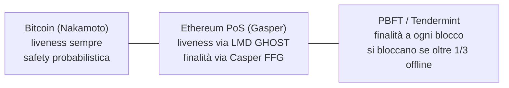
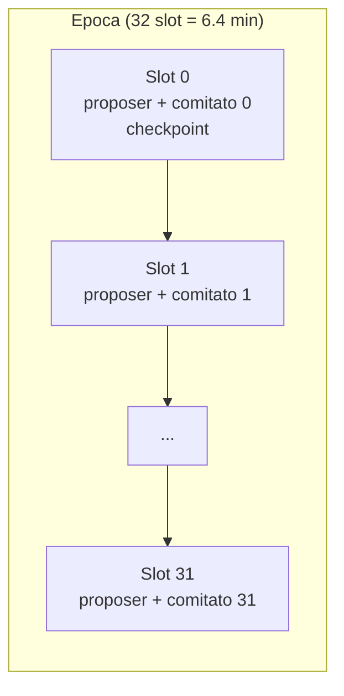
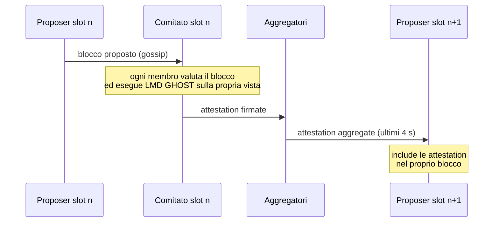
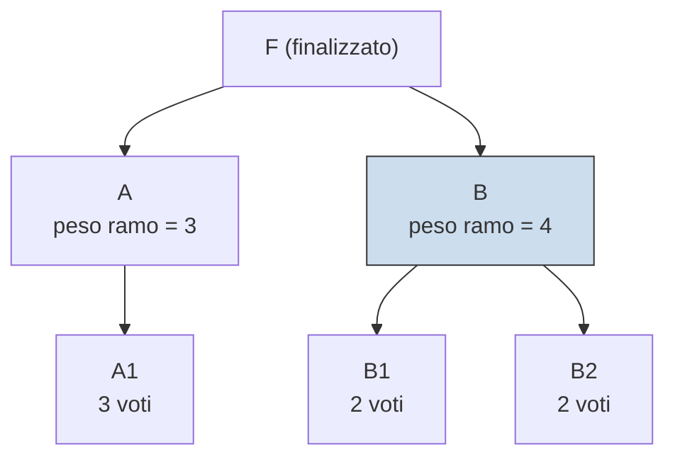
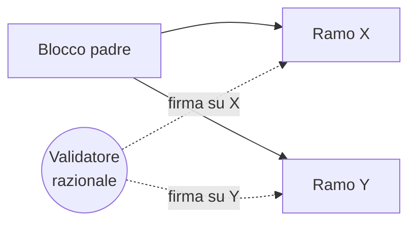
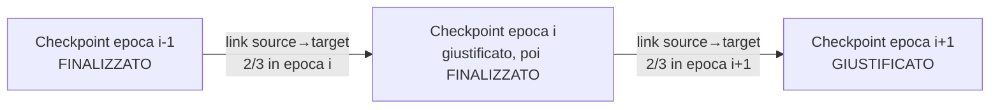

---
tags:
  - università/p2p-blockchain
  - ethereum
  - proof-of-stake
  - consenso
data: 2026-04-28
lezione: "L17 - Ethereum Consensus: Proof of Stake"
professore: "Laura Ricci"
---

# Il consenso di Ethereum: Proof of Stake

Fino a settembre 2022 Ethereum usava, come Bitcoin, un consenso basato su **Proof of Work** (PoW). Con "the Merge" è passato alla **Proof of Stake** (PoS): non esistono più miner che risolvono puzzle crittografici, ma **validatori** che bloccano una quantità di ETH come garanzia e votano sui blocchi. Questa lezione parte dai concetti generali del consenso distribuito (problema dei generali bizantini, safety e liveness, teorema CAP, finalità), per poi descrivere nel dettaglio il protocollo di Ethereum, chiamato **Gasper**, che è la combinazione di due protocolli: **LMD GHOST**, una regola di scelta del fork che garantisce la liveness, e **Casper FFG**, un "gadget" che aggiunge la finalità.

## Consenso: concetti generali

### Il problema

La sfida del consenso è **costruire un sistema distribuito affidabile sopra un'infrastruttura inaffidabile**. Un'infrastruttura è inaffidabile quando i nodi:

- comunicano via Internet, con connessioni che possono avere banda bassa, latenza alta, perdere o scartare pacchetti;
- possono essere guasti in qualunque modo arbitrario;
- possono essere semplicemente spenti o non comunicativi;
- possono seguire una versione diversa del protocollo;
- possono cercare attivamente di ingannare gli altri nodi, ad esempio pubblicando messaggi contraddittori, o esibire qualunque altro tipo di guasto.

Nonostante tutto questo, il consenso deve permettere a **decine di migliaia di nodi indipendenti** sparsi per il mondo, che comunicano su un'infrastruttura inaffidabile, di **procedere in perfetta sincronia** (*in lockstep*), cioè di concordare sulla stessa sequenza di blocchi.

### Il problema dei generali bizantini

La formulazione classica è il **problema dei generali bizantini** (presentato nelle slide con una figura). Un gruppo di generali, ciascuno al comando di una divisione dell'esercito, assedia una città e deve decidere se **attaccare** o **ritirarsi**. I generali comunicano solo tramite messaggeri. L'attacco riesce solo se tutti i generali leali agiscono insieme; un attacco parziale porta alla sconfitta. Il problema è che alcuni generali sono **traditori**.

I traditori esibiscono un **comportamento bizantino** (*Byzantine behaviour*, o *Byzantine faults*): possono agire in qualsiasi modo arbitrario, ad esempio

- ritardare i messaggi;
- riordinare i messaggi;
- mentire;
- inviare messaggi contraddittori a destinatari diversi (dire "attacco" a uno e "ritirata" a un altro);
- non rispondere affatto.

Il **consenso** richiede che i generali leali abbiano un metodo che produca in modo affidabile un esito tale che:

- **tutti i generali leali decidano lo stesso piano d'azione**, "attacco" oppure "ritirata";
- anche se inizialmente i generali leali non sono d'accordo, la **comunicazione ripetuta** permetta loro di filtrare le informazioni errate o malevole e di raggiungere alla fine la stessa decisione;
- un **piccolo numero di traditori** non possa indurre i generali leali ad adottare un piano contraddittorio.

> [!note] Nota
>
> Il risultato classico (Lamport, Shostak, Pease, 1982), non riportato esplicitamente nelle slide, è che con messaggi non firmati il consenso bizantino è possibile se e solo se i traditori sono meno di un terzo del totale, cioè $n \geq 3f + 1$ dove $f$ è il numero di nodi bizantini. È il motivo per cui la soglia di **1/3** ricorre continuamente nella PoS di Ethereum.

### Safety e liveness

Le proprietà di un protocollo di consenso si dividono in due famiglie.

> [!definition] Safety: "nothing bad ever happens"
>
> Il sistema non raggiunge **mai** uno stato scorretto o inconsistente, qualunque cosa accada. Nei generali bizantini: nessuna coppia di nodi onesti decide valori diversi; se un nodo dice "attacco", un altro nodo onesto non deve dire "ritirata". È ottenibile sotto certe condizioni, cioè con una soglia sul numero di traditori.

> [!definition] Liveness: "something good eventually happens"
>
> Mentre la safety riguarda il non sbagliare mai, la liveness riguarda il **non bloccarsi**. Nei generali bizantini, una violazione di liveness significa che nessuno decide e il sistema resta bloccato per sempre. In una blockchain significa che le transazioni restano pendenti per sempre e non vengono mai incluse nella catena: una situazione di stallo in cui non si producono nuovi blocchi.

### Bitcoin: liveness prima della safety

Nel consenso di Bitcoin (il **Nakamoto consensus**), anche dopo molte conferme **l'inversione della catena è sempre possibile**: la safety è solo **probabilistica** e non c'è **finalità assoluta**. Più conferme rendono un attacco più difficile, ma mai impossibile. Più si aspetta, più la transazione è sicura, perché la probabilità che una transazione confermata venga annullata decresce rapidamente (esponenzialmente) con il numero di conferme, ma non diventa mai zero.

Il Nakamoto consensus mette quindi l'enfasi sulla **liveness**: il sistema continua sempre a funzionare (è sempre disponibile), accettando **inconsistenze temporanee**, cioè i fork.

> [!warning] Collegamento con domande d'esame
>
> All'orale è stato chiesto come si realizza un **double spending attack** in Bitcoin e quale sia la **differenza principale tra Bitcoin ed Ethereum**. La safety probabilistica di Bitcoin è proprio ciò che rende possibile il double spending (con abbastanza potenza di calcolo si può riscrivere la storia); il consenso di Ethereum, con la **finalità** di Casper FFG, è una delle differenze fondamentali tra i due sistemi.

### Gli svantaggi del Nakamoto consensus

Le slide elencano gli svantaggi del consenso di Bitcoin:

- il **costo del mining è troppo alto**: si usano quantità enormi di energia per rendere sicura la blockchain;
- le **mining pool** (e le *farm*) controllano una grande porzione della blockchain, che quindi non è pienamente decentralizzata.

Le alternative proposte sono l'uso di energia che altrimenti non potrebbe essere immagazzinata, oppure algoritmi di consenso alternativi:

- **Proof of Stake**: Ethereum 2.0, Algorand, Cardano (Ouroboros), Solana, ...;
- **Delegated Proof of Stake**: Steemit, EOS, ...;
- **consenso bizantino** classico: Hyperledger, ...

### Il teorema CAP

**CAP** sta per *Consistency, Availability, Partition tolerance* (consistenza, disponibilità, tolleranza alle partizioni). Il teorema afferma che un sistema distribuito **non può garantire sempre contemporaneamente** consistenza, disponibilità e tolleranza alle partizioni. Quando le cose vanno male (partizione della rete), bisogna dare priorità al più a due delle tre proprietà e scegliere un compromesso.

In altre parole, **in presenza di una partizione di rete** bisogna scegliere tra:

- essere **sempre corretti** (consistenza), a costo di non rispondere;
- **rispondere sempre** (disponibilità), a costo di dare risposte potenzialmente inconsistenti.

> [!tip] Intuizione chiave
>
> Consistenza corrisponde a safety, disponibilità a liveness. Il teorema CAP dice che, in caso di partizione, un protocollo di consenso deve sacrificare una delle due. Bitcoin sceglie la disponibilità: entrambe le metà della rete continuano a produrre blocchi (fork), e la riconciliazione avviene dopo. I protocolli BFT classici scelgono la consistenza: si fermano.

### La finalità come forma di safety

> [!definition] Finalità
>
> Quando un blocco è **finalizzato**, tutti i nodi onesti della rete concordano che il blocco resterà **per sempre** parte della storia della catena, e quindi anche tutti i suoi antenati.

La finalità è la **protezione definitiva contro il double spending**: rende il pagamento di una pizza irrevocabile come se lo si fosse fatto in contanti.

Alcuni protocolli di consenso **finalizzano ogni round** (ogni blocco): non ci sono fork e si privilegia la safety; una volta che una transazione è inclusa on-chain, non verrà mai annullata. D'altra parte questi protocolli sono **vulnerabili a fallimenti di liveness**: se i nodi non riescono a mettersi d'accordo il protocollo si blocca, ad esempio se più di un terzo dei nodi è spento o irraggiungibile. Esempi sono il classico **PBFT** (*Practical Byzantine Fault Tolerance*) e **Tendermint**.

### E la PoS di Ethereum?

La PoS di Ethereum **privilegia la liveness (disponibilità) rispetto alla safety**, scelta sensata provenendo da una soluzione PoW, ma **cerca anche di garantire la safety quando non ci sono partizioni di rete**. In buone condizioni di rete offre **sia safety sia liveness**; quando le cose non vanno bene, dà priorità alla liveness.

In caso di **partizione di rete**, i nodi di ciascun lato continuano a produrre blocchi. La finalità potrebbe non essere più raggiunta su entrambi i lati: a seconda della proporzione di stake gestita da ciascun lato, o **un solo lato** oppure **nessuno** continuerà a finalizzare.

> [!tip] Perché al massimo un lato finalizza
>
> Per finalizzare serve una supermaggioranza di 2/3 dello stake. Due lati disgiunti non possono avere entrambi più di 2/3 dello stake totale; quindi al massimo uno finalizza, e se nessuno dei due ha 2/3 nessuno finalizza. Non si potrà mai avere finalizzazione in conflitto senza che qualcuno violi le regole.

La sintesi delle slide è che Ethereum PoS cerca di bilanciare **prima la safety** (finalità tramite Casper FFG) e la **liveness eventuale** (continua a produrre blocchi a meno che le cose non siano veramente compromesse). In casi estremi, ad esempio con più di 1/3 dei validatori offline, la **finalità si ferma** (perdita parziale di liveness), ma la **catena continua a crescere** (non è del tutto morta). Rispetto a Bitcoin, Ethereum PoS offre una **consistenza più forte** (finalità), ma può **ritardare il progresso** in caso di problemi.

*Fig. — Lo spettro tra liveness e safety: Ethereum PoS si colloca in mezzo, combinando una catena sempre viva con una finalità periodica.*

## Da Ethereum PoW a Ethereum PoS

### La timeline

La transizione del livello di consenso è avvenuta in più fasi (presentate in una figura). Il passo centrale è la **Beacon Chain**: una rete decentralizzata completamente indipendente, eseguita in parallelo alla mainnet di Ethereum e basata su PoS, frutto di molti anni di ricerca e sperimentazione. Il suo scopo era supportare la transizione da PoW a PoS ed è stato il primo passo necessario per completare **"the Merge"**, avvenuto a **settembre 2022**. Con il Merge, la catena di esecuzione esistente (quella con account, transazioni e smart contract) ha smesso di usare PoW e ha iniziato a ricevere il consenso dalla Beacon Chain.

> [!note] Nota
>
> La Beacon Chain è stata lanciata il 1 dicembre 2020 e per quasi due anni ha raggiunto il consenso solo su sé stessa (validatori e loro saldi), senza transazioni utente. Le date precise sono nella figura della slide e non nel testo estratto.

### La struttura del protocollo: Gasper

Il protocollo di consenso PoS di Ethereum è costruito applicando il **finality gadget Casper FFG** sopra la **fork choice rule LMD GHOST**, una variante della regola GHOST (*Greedy Heaviest-Observed Sub-Tree*) che considera solo il **voto più recente** di ciascun partecipante (*Latest Message Driven*, LMD). Il consenso di Ethereum 2.0 "imbullona insieme" due protocolli diversi:

- **LMD GHOST**, responsabile della **liveness**: decide qual è la testa della catena;
- **Casper FFG**, responsabile della **finalità**: decide quali blocchi non potranno mai essere annullati.

La combinazione è nota come **Gasper**.

## I validatori

### Dai miner ai validatori

In Ethereum PoS **non ci sono miner né mining**, ma **validatori**. Un validatore è un nodo che **blocca ETH** e partecipa al consenso per mantenere sicura la rete. Ha due ruoli principali:

- **block proposer** (a volte): viene selezionato occasionalmente per creare un blocco;
- **attester** (la maggior parte del tempo): vota regolarmente sui blocchi, confermando qual è la catena corretta.

La maggior parte del tempo un validatore **vota**, non propone.

Più in dettaglio, i compiti dei validatori legati al consenso sono: proporre nuovi blocchi, **senza risolvere la PoW**; esprimere un voto per decidere quale sarà il prossimo blocco della blockchain (le **attestation**, voti dati secondo la propria vista locale della blockchain); aiutare la sincronizzazione dei client leggeri; ricevere **ricompense** o **punizioni** in base al proprio comportamento. Il **block proposer** è un validatore selezionato casualmente per costruire un nuovo blocco.

### Lo stake e il collateral

Per diventare validatore bisogna depositare **32 ETH**. Il peso del validatore dipende dalla quantità di ETH messa in stake come **collateral** (garanzia).

> [!definition] Collateral
>
> In generale, un collateral è un bene che chi prende a prestito offre a chi presta come garanzia per un prestito o un debito. Se il debitore non ripaga o non rispetta altri obblighi, il creditore può prendersi il collateral per recuperare quanto dovuto. Riduce il rischio per il creditore. Esempio: in un mutuo per comprare casa, la casa stessa è il collateral; se non si ripaga il mutuo, la banca può prendere la casa e venderla.

In Ethereum PoS l'ETH è usato come collateral: i validatori mettono in stake una certa quantità di ETH per partecipare al processo di consenso, e se agiscono in modo disonesto o non svolgono correttamente i propri compiti possono perdere parte dell'ETH come penalità.

Lo stake è importante perché crea **incentivi economici**: chi si comporta correttamente guadagna **ricompense**; chi agisce in modo malevolo può essere **slashed** (perdere ETH). I validatori sono quindi economicamente motivati a seguire le regole del protocollo.

> [!tip] Intuizione chiave
>
> In PoW la sicurezza deriva da un costo **esterno** al sistema (energia e hardware spesi); in PoS da un costo **interno** (ETH bloccati che possono essere distrutti). In entrambi i casi attaccare costa, ma in PoS la punizione può essere inflitta direttamente dal protocollo a chi si è comportato male.

### Il deposit contract

Per diventare validatore si depositano i 32 ETH in un **deposit smart contract**. Lo stake è bloccato nel contratto per rendere possibile lo **slashing**: se il validatore viene sorpreso a comportarsi male, il suo stake nel contratto viene bruciato. I 32 ETH sono una quantità **fissa**, che permette di trattare tutti i validatori in modo uguale; chiunque può verificare che un validatore abbia messo in stake la quantità corretta guardando il contratto.

### Partecipare senza 32 ETH

Si può partecipare alla PoS di Ethereum anche senza avere 32 ETH o senza gestire un proprio nodo validatore, usando:

- **staking pool** come **Lido** o **Rocket Pool**;
- **exchange centralizzati** che offrono staking di ETH (Coinbase, Binance).

Nelle staking pool si mettono in stake ETH senza bisogno di 32 ETH né di gestire un validatore: gli ETH vengono raggruppati con quelli di altri da operatori professionali, a cui si delegano i propri ETH. In cambio si riceve un **token** che matura le ricompense di staking e può essere usato nei servizi DeFi. Le ricompense vengono distribuite ai partecipanti della pool dai validatori.

> [!note] Nota
>
> È lo stesso fenomeno delle mining pool di Bitcoin, trasposto alla PoS: permette la partecipazione di piccoli possessori, ma introduce un rischio di centralizzazione (poche pool controllano una grande parte dello stake). Il token ricevuto da Lido, ad esempio, si chiama stETH (*liquid staking token*).

### L'insieme dei validatori

Ogni validatore ha la propria **chiave privata** e la relativa **chiave pubblica**, che è la sua identità nel protocollo. L'**insieme dei validatori è noto e dinamico**: è disponibile l'elenco completo delle chiavi pubbliche che ci si aspetta siano attive in ogni momento, ma validatori possono entrare e uscire.

Un singolo nodo può ospitare da zero a centinaia o migliaia di validatori. I validatori sullo stesso nodo non agiscono in modo indipendente: condividono la stessa vista della blockchain. Migliaia di validatori partecipano attivamente al processo decisionale, attualmente circa **1 milione di istanze** di validatori: secondo le slide, un sistema davvero "democratico".

> [!warning] Attenzione
>
> A differenza di Bitcoin, dove chiunque può iniziare a minare senza registrarsi, in Ethereum PoS **l'insieme dei partecipanti è noto** a tutti (le chiavi pubbliche dei validatori). Questo è ciò che rende possibile ragionare in termini di "2/3 dei validatori" e di voti firmati attribuibili: in PoW non si può contare i partecipanti.

## Slot, epoche e comitati

### Il tempo nella PoS

La PoW non ha una relazione stretta con il tempo: è un protocollo **asincrono** (i blocchi arrivano quando qualcuno trova la soluzione). Il consenso di Ethereum PoS invece deve ordinare gli eventi in **epoche** (*epochs*), suddivise in **slot**. Epoche e slot fungono da **orario** per la partecipazione dei validatori al protocollo.

$$
1 \text{ slot} = 12 \text{ s}, \qquad 1 \text{ epoca} = 32 \text{ slot} = 32 \times 12 \text{ s} = 384 \text{ s} = 6.4 \text{ min}
$$

### Il block proposer

Il **proposer** è il validatore scelto per creare il blocco successivo, uno **per ogni slot**: quindi ci sono **32 block proposer per epoca**. Il proposer ha piena responsabilità nel selezionare e ordinare le transazioni pendenti da inserire nel blocco e nel costruirlo; propone un singolo blocco agli altri membri del comitato e sceglie il **blocco padre** a cui agganciare il nuovo blocco (secondo la propria vista della fork choice).

### I comitati

Ogni validatore è assegnato a **esattamente uno slot per epoca**: alla fine di un'epoca, tutti i validatori attivi hanno avuto l'opportunità di partecipare. I validatori sono suddivisi uniformemente tra gli slot, formando dei **comitati** (*committees*), tutti di dimensione approssimativamente uguale.

L'assegnazione dei validatori agli slot avviene secondo l'output di un **random beacon** (una sorgente di casualità pubblica), usando un protocollo distribuito chiamato **RANDAO**. L'assegnazione è effettuata **due epoche in anticipo**: i validatori hanno così tutto il tempo di scoprire lo slot che è stato loro assegnato.

*Fig. — Un'epoca è divisa in 32 slot da 12 s; ogni slot ha un proposer e un comitato di attester; ogni validatore attesta una volta per epoca.*

### RANDAO: generare casualità in modo decentralizzato

Ethereum ha bisogno di **casualità** per scegliere i block proposer e assegnare i validatori ai comitati. Ma se una sola entità genera il numero casuale, può barare; e se il numero è prevedibile, può essere sfruttato da un attaccante (che potrebbe, ad esempio, far sì che i propri validatori finiscano tutti nello stesso comitato).

La soluzione è **RANDAO**: un modo in cui molti validatori generano congiuntamente un numero casuale che **nessun singolo partecipante può controllare**. L'idea di fondo è un metodo decentralizzato per generare un numero casuale **pubblico**, **imprevedibile** e **verificabile**, in cui ogni validatore aggiunge un pezzo al risultato finale.

Le slide su funzionamento, proprietà e uso in Ethereum sono grafiche; il meccanismo standard è il seguente. Il protocollo mantiene un valore accumulato, il *RANDAO mix*. Ogni proposer, quando propone un blocco, include un **RANDAO reveal**, cioè la propria **firma BLS** sul numero dell'epoca corrente. Questo valore è deterministico (il proposer non può sceglierlo), imprevedibile per gli altri (serve la chiave privata) e verificabile da tutti (con la chiave pubblica). Il mix viene aggiornato come

$$
\text{mix}_{\text{nuovo}} = \text{mix}_{\text{vecchio}} \oplus H(\text{reveal})
$$

Dopo un'epoca, il mix ha accumulato i contributi di 32 proposer e viene usato come seme per calcolare, con anticipo, i proposer e i comitati delle epoche future.

> [!note] Nota
>
> La descrizione precisa (firma BLS del numero di epoca, XOR con l'hash) è un'espansione standard, non presente nel testo estratto. Un limite noto di RANDAO è il **bias dell'ultimo rivelatore**: l'ultimo proposer di un'epoca può scegliere se pubblicare il proprio blocco (e quindi il proprio contributo) o saltarlo, influenzando il risultato di un bit, al costo di perdere la ricompensa del blocco. La casualità è quindi "abbastanza buona" ma non perfetta.

### Le fasi di uno slot

Per ogni slot ci sono tre fasi:

1. **proposta del blocco**: un singolo validatore designato propone un blocco e lo propaga via gossip a tutti i membri del comitato;
2. **periodo di voto**: tutti gli altri membri del comitato votano (*attestano*) un blocco;
3. **propagazione del voto**: i voti di tutti i membri del comitato vengono aggregati e inviati al block proposer dello slot successivo, negli ultimi 4 secondi.

*Fig. — Le tre fasi di uno slot: proposta, voto, propagazione aggregata dei voti al proposer successivo.*

### Le attestation

I validatori valutano la validità del blocco proposto nello slot loro assegnato. Un'**attestation** contiene i voti per la **testa della catena**, determinata tramite **LMD GHOST** sulla vista locale di ciascun nodo; la nuova testa della catena viene determinata da questi voti. L'attestation contiene anche i voti per la **finalizzazione** della blockchain (Casper FFG, vedi sotto). Ogni validatore attesta **un solo blocco per epoca**: altrimenti viene **slashed**.

### Traffico di rete

In circa 384 secondi (6 minuti e 24 secondi) tutti i validatori attivi hanno l'opportunità di esprimere un singolo voto o di proporre un blocco. Ciò significa **almeno 500.000 messaggi** propagati in circa 384 secondi, e tutti devono essere consegnati entro vincoli temporali stretti. Secondo le slide, nessun altro protocollo di consenso è progettato per gestire un insieme così attivo e grande di partecipanti. Per evitare troppo traffico si usano l'**aggregazione dei messaggi** e dei **nodi aggregatori**.

## Gasper: i due protocolli di voto

Il protocollo di consenso di Ethereum "mette insieme" due protocolli di voto distinti.

- **Fork choice**: una nuova regola per scegliere il ramo in caso di fork, diversa dalla *longest chain rule* di Bitcoin; è implementata da **LMD GHOST** (*Latest Message Driven Greedy Heaviest-Observed Sub-Tree*).
- **Scelta del checkpoint candidato (finalizzazione)**: stabilisce se un blocco precedentemente accettato diventerà il prossimo **checkpoint globale**; è implementata da **Casper FFG**.

La combinazione è **Gasper**, l'algoritmo PoS di Ethereum.

### Perché si verificano i fork

La presenza di fork indica che il **tempo di propagazione dei blocchi** è diventato dello stesso ordine di grandezza, o superiore, dell'intervallo di produzione dei blocchi (lo slot). In breve, non tutti i validatori vedono tutti i blocchi in tempo per attestarli o per costruirci sopra. Questo è più probabile in Ethereum, dove la frequenza dei blocchi (uno ogni 12 s) è molto più alta che in Bitcoin (uno ogni 10 minuti).

> [!note] Nota
>
> In Ethereum PoS un fork può nascere anche perché un proposer non riceve in tempo il blocco dello slot precedente e costruisce su quello ancora prima, oppure perché un proposer è offline e lo slot resta vuoto. Le slide mostrano un esempio grafico.

## LMD GHOST: la regola di scelta del fork

### Il nome

LMD GHOST combina due acronimi:

- **Latest Message Driven** (LMD): si considera solo l'**ultimo messaggio** (l'attestation più recente) di ciascun validatore;
- **Greedy Heaviest-Observed Sub-Tree** (GHOST): partendo dalla radice, si scende nell'albero scegliendo a ogni passo, in modo greedy, il **sottoalbero più pesante** osservato.

### Il funzionamento

I validatori sono i votanti. Ogni validatore guarda la propria **vista locale**, che a causa dei fork può essere un albero di blocchi, e vota per il blocco che considera la **"migliore testa"** della blockchain. Ogni validatore onesto produce **esattamente un'attestation per epoca**.

La decisione si basa sulla vista locale della catena del nodo e sulle attestation (messaggi) che il nodo ha ricevuto per i blocchi. Non esiste una "visione divina" (*God's eye view*): ogni nodo lavora con la propria vista locale, che può differire da quella degli altri nodi.

Il peso si calcola così:

- il **peso di un blocco foglia** è semplicemente la somma dei voti ricevuti da quel blocco;
- il **peso di un ramo** è il peso dei voti per il blocco alla sua radice **più** la somma dei pesi di tutti i rami sotto di esso.

L'algoritmo è **ricorsivo** e parte dall'**ultimo blocco finalizzato** (la finalizzazione è ottenuta tramite Casper FFG). Ogni nodo esamina le attestation ricevute e assegna i pesi ai blocchi. Un **voto per un figlio è anche un voto per i suoi antenati**. Si considera solo il voto più recente di ciascun validatore (LMD).

> [!definition] LMD GHOST
>
> A partire dall'ultimo blocco finalizzato, a ogni biforcazione si sceglie il figlio il cui sottoalbero ha il peso maggiore, dove il peso di un sottoalbero è la somma degli stake effettivi dei validatori il cui **ultimo** voto punta a un blocco di quel sottoalbero. Si ripete finché si arriva a una foglia, che è la testa della catena.

$$
w(B) = \sum_{v \,:\, \text{latest}(v) \in \text{subtree}(B)} \text{effective\_balance}(v)
$$

### Il peso dei voti

Non tutti i voti sono uguali: ogni voto è pesato con il **peso del validatore**, misurato dal suo **effective balance** (saldo effettivo) al momento del voto, che comprende il deposito iniziale di 32 ETH, più le ricompense accumulate nel tempo, meno le penalità subite. Il ramo vincente quindi **non è quello con più voti**, ma quello con la **maggiore quantità di ETH in stake** che lo ha votato.

> [!example] Esempio di LMD GHOST
>
> Dall'ultimo blocco finalizzato F nascono due figli, A e B. A ha un figlio A1; B ha due figli, B1 e B2. Supponiamo che ogni validatore abbia peso 1 e che gli ultimi voti siano: 3 voti per A1, 2 voti per B1, 2 voti per B2.
>
> - Peso del ramo A: $3$ (tutti i voti in A1 contano anche per A).
> - Peso del ramo B: $2 + 2 = 4$.
>
> LMD GHOST sceglie B (peso 4 contro 3), poi tra B1 e B2 (pari) sceglie con un criterio di spareggio. Una **longest chain rule** avrebbe invece potuto scegliere diversamente, e nessun singolo blocco foglia ha la maggioranza: ma i 4 validatori che hanno votato B1 o B2 sono comunque tutti d'accordo che B sia il ramo giusto.

*Fig. — LMD GHOST: il ramo B vince perché i voti per B1 e B2 si sommano sul padre comune, anche se nessuna foglia di B ha più voti di A1.*

### L'intuizione

I voti per due figli diversi dello stesso blocco padre vanno interpretati come conferma che tutti quei validatori **favoriscono il ramo del padre**, anche se non sono d'accordo sui figli. Si permette quindi a un voto per un blocco figlio di aggiungere peso a tutti i suoi antenati.

Perché preferire questa regola alla longest chain? Perché in Ethereum si verificano **molti fork** a causa dell'alta frequenza dei blocchi: il tempo di propagazione è confrontabile con la durata dello slot e non tutti i validatori vedono tutti i blocchi in tempo. L'idea è **sfruttare la massima quantità di informazione disponibile**: con la longest chain i voti su blocchi "perdenti" verrebbero sprecati, mentre con GHOST contribuiscono comunque alla scelta del ramo.

### Ricompensare il comportamento onesto

Sia i proposer sia gli attester vengono ricompensati, in modi diversi, per aver identificato correttamente la testa della catena.

Per il proposer l'incentivo è **implicito**: quando è selezionato può guadagnare le **gas fee** del blocco; se non costruisce sulla testa corretta, il suo blocco resterà orfano e non riceverà nessuna ricompensa, come accade ai miner nella PoW.

Quando l'attestation di un validatore viene inclusa in un blocco già nello **slot immediatamente successivo**, il validatore riceve una **micro-ricompensa**. I proposer sono esplicitamente incentivati a includere tali attestation nei blocchi, perché ricevono una micro-ricompensa proporzionale per ciascuna di quelle che riescono a includere.

### Il problema del "nothing at stake"

Nella PoW **produrre un blocco è costoso**, e questo è un forte incentivo per i miner a comportarsi bene: un miner non ha interesse a disperdere la propria potenza di calcolo minando su più rami contemporaneamente.

Nella PoS nasce il problema del **nothing at stake** (niente in gioco): i validatori **non hanno nulla da perdere** a sostenere **più catene concorrenti**, perché produrre nuovi blocchi o attestation è quasi gratuito (basta una firma). Potrebbero farlo per massimizzare la probabilità di trovarsi sulla catena vincente. Se tutti lo facessero, i fork non si risolverebbero mai.

*Fig. — Nothing at stake: senza punizioni, votare su tutti i rami costa solo una firma e garantisce di essere sul ramo vincente.*

### Slashing

La soluzione è punire l'**equivocazione**: quando un validatore ha equivocato (ad esempio ha proposto due blocchi diversi per lo stesso slot, o ha firmato due attestation contraddittorie) viene punito, e la punizione si chiama **slashing**. Consiste nel rimuovere una parte dello stake del validatore e nell'**espellerlo** dal protocollo.

Poiché ogni blocco proposto e ogni attestation sono **firmati** dal validatore, non è difficile **dimostrare** che un validatore ha proposto più blocchi: bastano due messaggi firmati contraddittori, che chiunque può inserire in un blocco come prova.

> [!tip] Intuizione chiave
>
> Lo slashing risolve il nothing at stake reintroducendo artificialmente un costo: ora sostenere due rami ha un prezzo, la perdita di parte dello stake. È l'analogo PoS del costo energetico della PoW, ma è applicato solo a chi si comporta male.

### Slashing involontario

La maggior parte degli eventi di slashing avviene **involontariamente**, quando due client diversi usano la **stessa chiave di validatore**. Una chiave di validatore deve comportarsi come un'**unica entità**: se si eseguono due client con la stessa chiave, entrambi firmeranno messaggi, e prima o poi firmeranno messaggi diversi per lo stesso slot, cosa indistinguibile da un'equivocazione malevola. Di solito non si tratta di comportamento malevolo ma di errori operativi:

- validatore in esecuzione su due macchine (ad esempio un nodo di backup lasciato acceso);
- nodo in cloud e nodo locale entrambi attivi;
- ripristino da backup eseguito male;
- *failover* senza spegnere la vecchia istanza;
- configurazioni Docker/Kubernetes errate;
- stessa chiave usata per errore su testnet e mainnet.

### Reorg e revisioni

Quando un nodo riceve nuovi blocchi e nuovi voti, **rivaluta la fork choice rule** alla luce delle nuove informazioni. Generalmente il nuovo blocco sarà figlio di quello che il nodo considera la testa attuale e diventerà la nuova testa. Talvolta però, eseguendo la fork choice sull'albero aggiornato, risulta una testa che si trova su un **ramo diverso** da quello della testa precedente: si ha una **riorganizzazione** (*reorg*) della catena. È per limitare le reorg a blocchi recenti che serve la finalità.

## Casper FFG: la finalità

### Un meta-protocollo

La **finalità** garantisce che esistano blocchi nella catena che **non verranno mai annullati**: faranno parte della catena per sempre. **Casper FFG** (*Friendly Finality Gadget*) è una sorta di **meta-protocollo di consenso**: uno strato (*overlay*) che può essere eseguito sopra un protocollo di consenso sottostante per aggiungergli la finalità. Nella PoS di Ethereum il protocollo sottostante è LMD GHOST, che da solo non fornisce finalità. Casper FFG funziona quindi come un **"finality gadget"**.

Un **blocco finalizzato** è un blocco su cui tutti i nodi onesti della rete hanno concordato che resterà per sempre parte della storia della catena, e quindi anche tutti i suoi antenati.

### Finalità economica

Tecnicamente un blocco finalizzato **potrebbe** ancora essere annullato, ma il **costo** di tale annullamento sarebbe così elevato che, per tutti gli scopi pratici, si può dire che non avverrà. Se la catena subisse una **finalizzazione in conflitto** (due blocchi in conflitto entrambi finalizzati), almeno **1/3 dell'ETH totale in stake verrebbe bruciato**: 1/3 dello stake totale di Ethereum, cioè molti miliardi di dollari.

> [!tip] Intuizione chiave
>
> Si parla di **finalità economica**: non è impossibile annullare un blocco finalizzato, ma è garantito che chi lo fa perderà una quantità enorme e quantificabile di denaro. È una garanzia molto più forte della safety probabilistica di Bitcoin, dove un attaccante con abbastanza potenza di calcolo può riscrivere la storia senza subire punizioni dal protocollo (perde solo il costo dell'energia spesa).

### Checkpoint, justification e finalization

Il **primo blocco di ogni epoca** è definito **checkpoint**. Tutti i validatori devono produrre **un'attestation per epoca**; l'attestation contiene il **voto LMD** (la testa della catena) **più** un voto per il checkpoint di quell'epoca, espresso tramite due campi:

- **target**: il checkpoint dell'epoca **corrente**;
- **source**: il checkpoint (giustificato) dell'epoca **precedente**.

Il voto FFG è quindi un **link** $\text{source} \rightarrow \text{target}$ tra due checkpoint. Ogni validatore propone quello che ritiene il miglior checkpoint e raccoglie le attestation sulle viste degli altri validatori durante gli slot dell'epoca.

> [!example] Formato di un'attestation
>
> La slide sul formato è grafica. I campi principali di un'attestation sono:
>
> - `slot` e `index` (comitato) a cui il validatore appartiene;
> - `beacon_block_root`: il voto LMD GHOST per la testa della catena;
> - `source`: coppia (epoca, hash) del checkpoint sorgente, l'ultimo giustificato;
> - `target`: coppia (epoca, hash) del checkpoint obiettivo, quello dell'epoca corrente;
> - `signature`: firma BLS (aggregabile) del validatore.
>
> (Elenco ricostruito dalla specifica del consenso, non dal testo delle slide.)

Alla fine di ogni epoca, se **2/3** dei validatori (una **supermaggioranza**) concordano sullo stesso checkpoint, questo diventa **giustificato** (*justified*). La supermaggioranza è **pesata** con l'effective balance di ciascun validatore. Contemporaneamente, il precedente checkpoint giustificato, cioè il **source**, diventa **finalizzato** (*finalized*).

*Fig. — Justification e finalization: un checkpoint giustificato diventa finalizzato quando il checkpoint dell'epoca successiva viene giustificato con esso come source.*

### Due fasi, un solo tipo di messaggio

Il significato delle due giustificazioni successive è:

- **giustificazione all'epoca $i$**: "penso che il checkpoint A sia corretto";
- **giustificazione all'epoca $i+1$**: "sto costruendo sopra A".

Si usa **sempre lo stesso tipo di messaggio** (l'attestation), ma con il source aggiornato al checkpoint giustificato. La seconda giustificazione non introduce un nuovo messaggio: introduce un **vincolo**, cioè costruire sopra ciò che è stato giustificato al round precedente.

> [!note] Nota
>
> È l'analogo delle due fasi (*prepare* e *commit*) dei protocolli BFT classici come PBFT: la prima supermaggioranza dice "siamo d'accordo su A", la seconda "sappiamo tutti che siamo d'accordo su A". Casper FFG le fonde in un unico messaggio, in una pipeline in cui il voto dell'epoca $i+1$ fa da commit per l'epoca $i$ e da prepare per l'epoca $i+1$.

### Perché due supermaggioranze consecutive garantiscono la finalità

Perché un checkpoint giustificato in un'epoca e giustificato di nuovo nell'epoca successiva diventa finalizzato e non può essere annullato? Il punto chiave è che **due supermaggioranze si sovrappongono per almeno 1/3** dello stake totale:

$$
|S_1 \cap S_2| \;\geq\; |S_1| + |S_2| - |V| \;\geq\; \tfrac{2}{3} + \tfrac{2}{3} - 1 \;=\; \tfrac{1}{3}
$$

dove $V$ è lo stake totale, e $S_1, S_2$ sono gli insiemi (pesati) di validatori che hanno formato le due supermaggioranze.

Due supermaggioranze consecutive garantiscono la safety perché si sovrappongono in almeno 1/3 dello stake totale. Ciò significa che qualunque tentativo di costruire una catena in conflitto richiederebbe a quei validatori di **votare in modo inconsistente** tra le due epoche. Di conseguenza almeno un terzo dello stake verrebbe **slashed**, rendendo l'attacco **economicamente irrazionale**.

> [!note] Nota
>
> Le regole di slashing di Casper FFG, non esplicitate nel testo delle slide, sono due: il **double vote** (un validatore firma due attestation diverse con lo stesso target epoch) e il **surround vote** (un validatore firma un'attestation il cui intervallo source-target "circonda" quello di un'altra sua attestation). Violare una di queste regole è l'unico modo per contribuire a una finalizzazione in conflitto, ed è dimostrabile esibendo le due firme.

> [!warning] Attenzione
>
> La finalità richiede **2/3** dello stake attivo. Se più di 1/3 dei validatori è offline, **la finalizzazione si ferma**, ma LMD GHOST continua a far crescere la catena: è la "perdita parziale di liveness" citata all'inizio. Ethereum prevede un meccanismo, l'*inactivity leak*, che riduce progressivamente lo stake dei validatori inattivi finché quelli attivi tornano a rappresentare 2/3 e la finalità può riprendere (dettaglio non presente nelle slide).

## Ulteriori aspetti

### Aggregazione

Inviare le attestation di ogni validatore a tutti gli altri validatori della rete crea un enorme overhead. La soluzione è dividere i comitati in **sottoreti**: un validatore del comitato fa da **aggregatore** e raccoglie le informazioni di tutti i validatori del comitato. Si usano le **firme BLS**, che permettono di **aggregare** le firme di un insieme di validatori in **un'unica firma**, verificabile contro l'aggregato delle chiavi pubbliche.

> [!tip] Perché BLS
>
> Con firme ECDSA (come in Bitcoin), $n$ firme occupano $n$ volte lo spazio e richiedono $n$ verifiche. Con BLS, $n$ firme sullo stesso messaggio si combinano in una sola firma di dimensione costante: è ciò che rende gestibili centinaia di migliaia di attestation per epoca.

### Ricompense e penalità

Il sistema di incentivi prevede:

- **ricompense** per le attestation, per i proposer e per la partecipazione ai **sync committee** (i comitati che aiutano la sincronizzazione dei client leggeri);
- **penalità** per attestation mancanti, in ritardo o scorrette;
- **slashing** per i comportamenti malevoli.

> [!question] Possibili domande d'esame
>
> - Che cos'è il problema dei generali bizantini? Cosa si intende per safety e liveness, e come si collocano Bitcoin, i protocolli BFT classici ed Ethereum PoS rispetto a queste due proprietà?
> - Che cosa dice il teorema CAP e come si applica ai protocolli di consenso delle blockchain?
> - Che cos'è la finalità? Perché Bitcoin offre solo una safety probabilistica e in che senso Ethereum offre una finalità economica?
> - Chi sono i validatori in Ethereum PoS, quali ruoli hanno e perché devono mettere in stake 32 ETH? Cosa sono slot, epoche e comitati?
> - Come funziona LMD GHOST? Perché Ethereum non usa la longest chain rule di Bitcoin?
> - Che cos'è il problema del nothing at stake e come viene risolto con lo slashing?
> - Come funziona Casper FFG? Cosa sono i checkpoint, la justification e la finalization? Perché due supermaggioranze consecutive garantiscono la finalità?
> - A che cosa serve RANDAO e quali proprietà deve avere la casualità usata dal protocollo?

> [!abstract] Sintesi
>
> Il consenso deve garantire safety (nessuna decisione inconsistente) e liveness (il sistema progredisce) su un'infrastruttura inaffidabile con nodi bizantini; per il teorema CAP, sotto partizione bisogna scegliere. Bitcoin privilegia la liveness con safety solo probabilistica e ha costi energetici e centralizzazione nelle pool. Dal Merge (settembre 2022) Ethereum usa la PoS Gasper = LMD GHOST + Casper FFG. I validatori depositano 32 ETH nel deposit contract; il tempo è diviso in slot da 12 s ed epoche da 32 slot; RANDAO sceglie un proposer per slot e distribuisce i validatori in comitati, e ogni validatore attesta una volta per epoca. LMD GHOST sceglie la testa scendendo dall'ultimo blocco finalizzato verso il sottoalbero con più stake, considerando solo l'ultimo voto di ciascuno. Il nothing at stake è risolto dallo slashing delle equivocazioni firmate. Casper FFG rende il primo blocco di ogni epoca un checkpoint: con 2/3 dello stake diventa giustificato, e quando il successivo è giustificato su di esso diventa finalizzato. Due supermaggioranze si sovrappongono per almeno 1/3, quindi una finalizzazione in conflitto costerebbe almeno 1/3 dello stake totale. L'aggregazione con firme BLS rende gestibile il traffico di centinaia di migliaia di voti per epoca.
