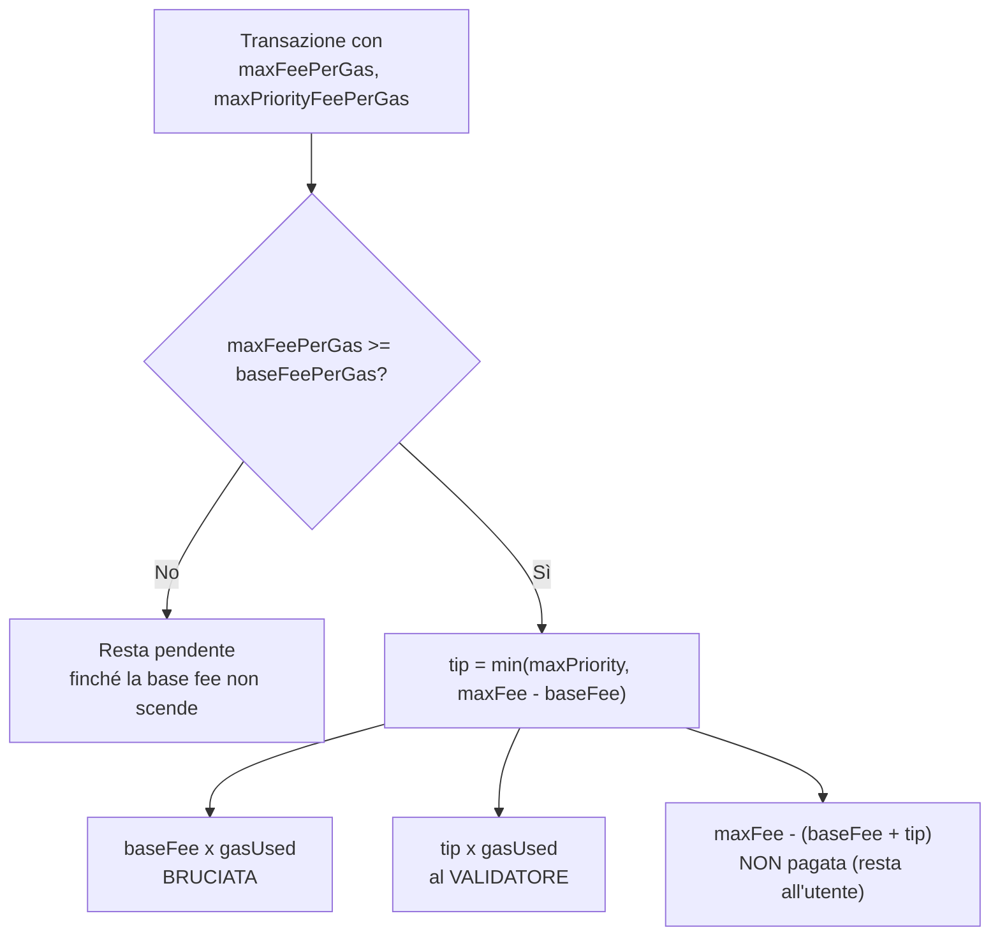
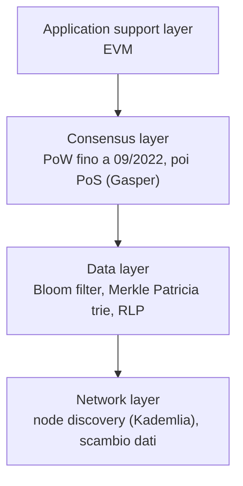
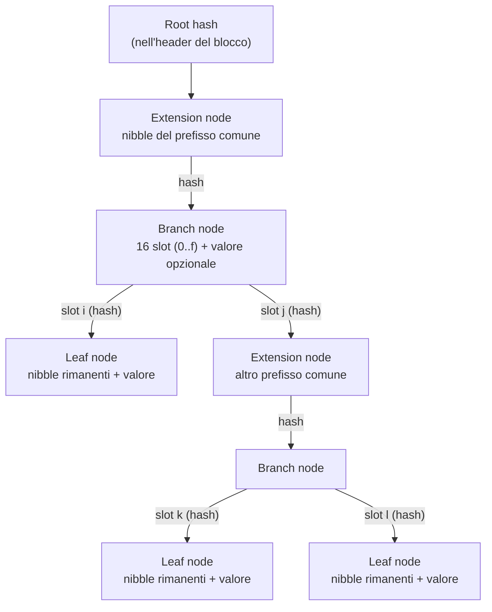
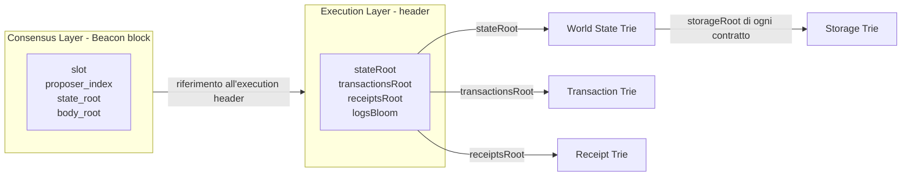
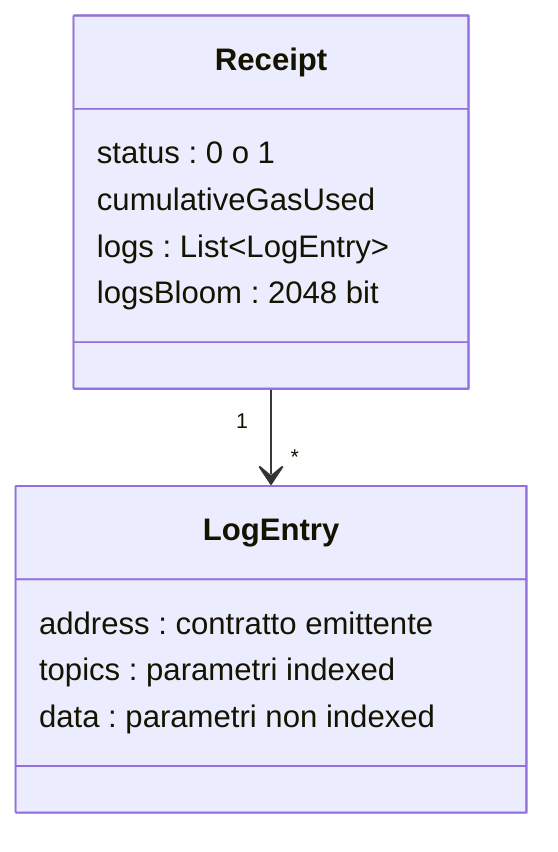
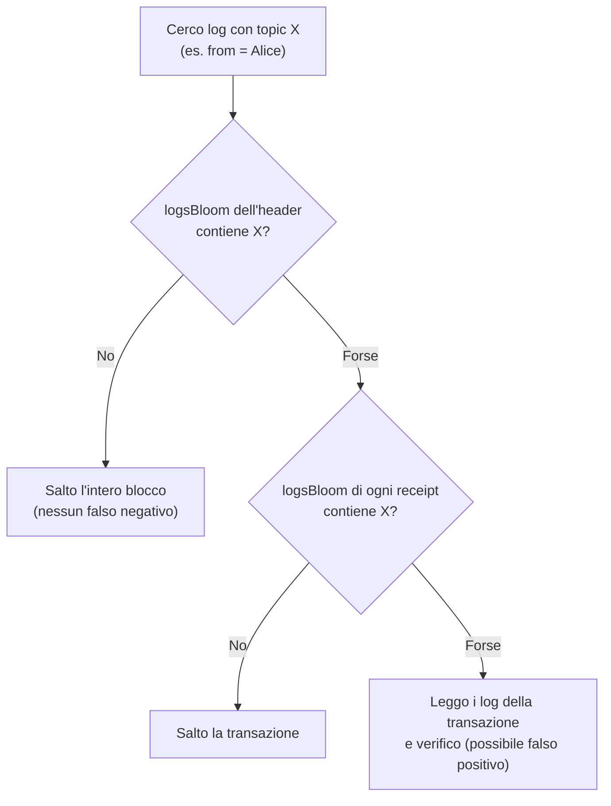
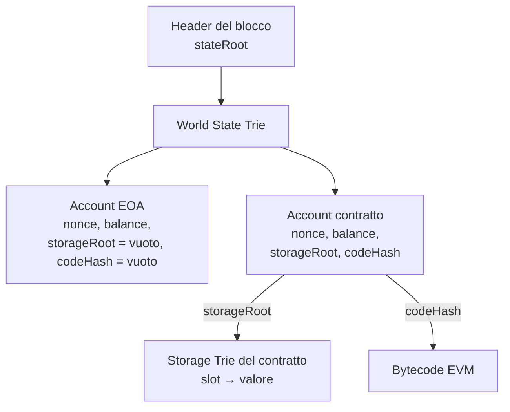

---
tags:
  - università/p2p-blockchain
  - ethereum
  - eip-1559
  - merkle-patricia-trie
data: 2026-05-04
lezione: "L18 - Ethereum 2.0: Fees and Tries"
professore: "Laura Ricci"
---

# Ethereum 2.0: fee e trie

Questa lezione affronta due temi distinti di Ethereum. Il primo è **economico**: come viene emesso l'ETH e come funzionano le commissioni (*fee*) dopo la riforma introdotta da **EIP-1559**, che ha sostituito l'asta al primo prezzo con una *base fee* calcolata dal protocollo e bruciata. Il secondo è **strutturale**: come Ethereum organizza i propri dati nel **data layer**, cioè i diversi **Merkle Patricia Trie** (World State, Storage, Transaction, Receipt) e i **Bloom filter** usati per indicizzare i log degli eventi. La lezione si chiude con un confronto tra Bitcoin ed Ethereum.

## L'offerta di ETH

### L'ICO e l'offerta iniziale

La distribuzione iniziale di Ethereum risale al **2014** ed è avvenuta tramite una raccolta fondi pubblica, una **ICO** (*Initial Coin Offering*), che ha finanziato lo sviluppo del progetto. I primi sostenitori acquistarono ETH pagando in **Bitcoin**, prima che la rete fosse lanciata. L'offerta iniziale fu di **72 milioni di ETH**, assegnati in parte ai primi contributori e in parte alla **Ethereum Foundation**. I fondi raccolti furono cruciali per lo sviluppo, per attrarre talenti e costruire l'ecosistema.

### Dinamica dell'offerta prima del Merge

Prima del Merge, con il consenso basato su Proof of Work, nuovi ETH venivano emessi continuamente come **ricompense di mining**, per incentivare i miner e garantire la sicurezza della rete; i miner ricevevano inoltre le **gas fee**.

Come in Bitcoin, anche in Ethereum la ricompensa per blocco cambia nel tempo, ma con una differenza importante: invece di **halving automatici** codificati nel protocollo, gli aggiornamenti che regolano l'emissione di nuovi Ether sono **decisi dalla governance** (tramite hard fork):

| Anno | Aggiornamento | Ricompensa per blocco |
|---|---|---|
| 2015 | genesis | 5 ETH |
| 2017 | Byzantium | 3 ETH |
| 2019 | Constantinople | 2 ETH |

Questi aggiornamenti hanno ridotto il tasso di inflazione della rete nel tempo. Tuttavia, a parte perdite accidentali o azioni volontarie (ad esempio l'invio di ETH a un indirizzo irrecuperabile), **non esisteva alcun meccanismo sistematico per rimuovere ETH dalla circolazione**. L'offerta poteva solo crescere.

> [!note] Collegamento
>
> In Bitcoin l'offerta è fissata dal protocollo (massimo 21 milioni, con halving ogni 210.000 blocchi): la politica monetaria è predeterminata. In Ethereum non esiste un tetto massimo all'offerta e la politica monetaria è cambiata più volte per decisione della comunità.

## Le gas fee

### Richiamo: che cos'è il gas

Il **gas** è l'unità che misura la quantità di **sforzo computazionale** necessaria per eseguire specifiche operazioni sulla rete Ethereum. Poiché ogni transazione Ethereum richiede risorse computazionali per essere eseguita, queste risorse devono essere pagate, così che Ethereum non sia vulnerabile allo **spam** e non possa rimanere bloccato in **cicli di calcolo infiniti**. Il pagamento della computazione avviene sotto forma di **gas fee**: la quantità di gas usata per un'operazione moltiplicata per il costo di ogni unità di gas.

Prima del Merge (e prima di EIP-1559) **l'intera fee andava ai miner**: se la transazione veniva inclusa, l'utente pagava esattamente

$$
\text{fee} = \text{gasPrice} \times \text{gasUsed}
$$

### Il modello ad asta al primo prezzo

Prima della riforma, gli utenti di Ethereum partecipavano essenzialmente a un'**asta**: un'asta aperta per ogni blocco. Ogni utente faceva un'offerta indicando quanti ETH (espressi in **gwei**, dove $1 \text{ gwei} = 10^{-9} \text{ ETH}$) era disposto a pagare per ogni unità di gas. Poiché lo spazio nel blocco è limitato, i miner tipicamente davano priorità alle transazioni con il gas price più alto: **offerta più alta, inclusione più rapida**.

L'**asta al primo prezzo** (*first-price auction*) è un concetto dell'economia tradizionale e della teoria delle aste, e Ethereum lo implementava implicitamente per le commissioni: **chi vince paga esattamente quanto ha offerto**, senza rimborso in caso di offerta eccessiva.

Il problema è che **non esisteva un "prezzo equo" chiaro**, solo competizione. Bisognava indovinare quanto offrire:

- gli utenti spesso **pagavano troppo** per essere inclusi più in fretta;
- se l'offerta era troppo bassa, la transazione **restava bloccata**;
- se era troppo alta, la transazione veniva inclusa rapidamente, ma si pagava più del necessario.

> [!example] Bob paga troppo
>
> Bob individua un'opportunità di valore su Ethereum e vuole agire immediatamente. Per non perderla imposta un gas price alto, **100 gwei**, aspettandosi che la competizione faccia salire le fee. In realtà la sua transazione sarebbe stata inclusa altrettanto rapidamente con **50 gwei**. Bob ha pagato il doppio del necessario perché ha sovrastimato la domanda della rete.

## EIP-1559: la riforma del mercato delle fee

### Le novità del London hard fork

**EIP-1559** (*Ethereum Improvement Proposal* 1559), introdotta con il **London hard fork**, ha riformato il mercato delle fee. Le novità principali sono:

- **riforma del mercato delle fee**: l'asta al primo prezzo è sostituita da un meccanismo più prevedibile;
- **burn della base fee**: la *base fee* è regolata automaticamente a ogni blocco in base alla domanda ed è **rimossa permanentemente dalla circolazione** (bruciata);
- **priority fee** (*tip*, mancia): pagata ai validatori per incentivare l'inclusione della transazione;
- **migliore prevedibilità delle fee**: gli utenti non devono più indovinare il gas price;
- **dimensione del blocco elastica**: i blocchi possono espandersi fino a **2 volte il target** nei periodi di alta domanda;
- **impatto sull'offerta**: si introduce una **pressione deflazionistica**, e l'ETH può diventare deflazionistico quando la quantità bruciata supera l'emissione;
- **migliore esperienza utente**: meno transazioni fallite o pagate troppo.

> [!note] Nota
>
> Il London hard fork è stato attivato ad agosto 2021, quindi **prima** del Merge: per circa un anno la priority fee è andata ai miner PoW (per questo la slide del caso 1 parla ancora di "miners"). Dopo il Merge va ai validatori (più precisamente, al block proposer).

### baseFeePerGas

La **baseFeePerGas** è il **prezzo minimo** da pagare per unità di gas perché la transazione sia inclusa in un blocco. Le sue caratteristiche sono:

- è **fissata algoritmicamente dal protocollo**, non dall'utente;
- **non è un campo esplicito della transazione**, ma un parametro di protocollo determinato **a livello di blocco**: è diversa per ogni blocco;
- dipende dal livello di **congestione** di Ethereum, calcolato sui blocchi recenti;
- viene successivamente **bruciata**;
- è fissata definitivamente al momento dell'inclusione ed è usata per calcolare quanto l'utente paga effettivamente.

Le slide propongono un paragone con l'**aggiustamento della difficoltà di Bitcoin**: in entrambi i casi si ha una **auto-organizzazione del sistema**, in cui un parametro si adatta automaticamente alle condizioni della rete. La base fee è come un **"prezzo di mercato" nativo** per un'unità di gas necessaria per l'inclusione in un blocco.

### maxPriorityFeePerGas e maxFeePerGas

Con EIP-1559 una transazione contiene due nuovi campi:

- **maxPriorityFeePerGas**: un **contributo volontario** ai validatori, una mancia che si aggiunge alla base fee per dare priorità all'inclusione della transazione in un blocco;
- **maxFeePerGas**: quanto si è disposti a pagare **in totale** per unità di gas. Nelle slide è presentato come la somma di baseFeePerGas e maxPriorityFeePerGas; il suo scopo è **proteggere l'utente dalle variazioni della base fee** tra il momento in cui la transazione viene inviata e quello in cui viene inclusa.

La regola effettiva, che si ricava dai tre casi d'esempio delle slide, è la seguente. La transazione può essere inclusa solo se $\text{maxFeePerGas} \geq \text{baseFeePerGas}$. In tal caso la mancia effettivamente pagata è

$$
\text{priorityFee}_{\text{eff}} = \min\big(\text{maxPriorityFeePerGas},\; \text{maxFeePerGas} - \text{baseFeePerGas}\big)
$$

e il prezzo effettivo per unità di gas è

$$
\text{effectiveGasPrice} = \text{baseFeePerGas} + \text{priorityFee}_{\text{eff}} \;\leq\; \text{maxFeePerGas}
$$

Di questo importo, la parte $\text{baseFeePerGas} \times \text{gasUsed}$ viene **bruciata**, mentre la parte $\text{priorityFee}_{\text{eff}} \times \text{gasUsed}$ va al **validatore**. La differenza tra maxFeePerGas e il prezzo effettivo **non viene pagata** (a differenza dell'asta al primo prezzo, in cui si pagava sempre l'intera offerta).



*Fig. — Come viene ripartito il pagamento di una transazione con EIP-1559.*

### Tre casi d'esempio

In tutti e tre i casi consideriamo un pagamento tra due EOA (*Externally Owned Account*), da A a B, di **1 ETH**. Un semplice trasferimento tra EOA consuma **21.000 gas**. I prezzi sono espressi in gwei per unità di gas.

> [!example] Caso 1: maxFee ampiamente sufficiente
>
> baseFeePerGas = 100, maxPriorityFeePerGas = 20, maxFeePerGas = 200.
>
> Poiché $200 - 100 = 100 \geq 20$, la mancia effettiva è piena: 20. Il prezzo effettivo è $100 + 20 = 120$ gwei/gas.
>
> $$21.000 \times (100 + 20) = 2.520.000 \text{ gwei} = 0{,}00252 \text{ ETH}$$
>
> - A paga $1{,}00252$ ETH;
> - B riceve $1$ ETH;
> - il miner/validatore riceve $21.000 \times 20 = 420.000$ gwei $= 0{,}00042$ ETH;
> - vengono bruciati $21.000 \times 100 = 2.100.000$ gwei $= 0{,}0021$ ETH.
>
> Il margine di $200 - 120 = 80$ gwei/gas non viene speso.

> [!example] Caso 2: maxFee che copre solo in parte la mancia
>
> baseFeePerGas = 100, maxPriorityFeePerGas = 20, maxFeePerGas = 110.
>
> Ora $110 - 100 = 10 < 20$: la mancia effettiva scende a 10. Il prezzo effettivo è $100 + 10 = 110$ gwei/gas.
>
> $$21.000 \times (100 + 10) = 2.310.000 \text{ gwei} = 0{,}00231 \text{ ETH}$$
>
> - A paga $1{,}00231$ ETH;
> - B riceve $1$ ETH;
> - i validatori ricevono $0{,}00021$ ETH;
> - vengono bruciati $0{,}0021$ ETH.
>
> La mancia è ridotta, ma la transazione viene comunque inclusa.

> [!example] Caso 3: maxFee inferiore alla base fee
>
> baseFeePerGas = 100, maxPriorityFeePerGas = 20, maxFeePerGas = 90.
>
> La transazione **non può coprire nemmeno la base fee**: resta **pendente** finché la baseFeePerGas non scende a un valore minore o uguale a 90. Nel blocco corrente **non viene inclusa**.

> [!warning] Attenzione
>
> La parte bruciata è **la stessa** nei casi 1 e 2 (0,0021 ETH), perché dipende solo dalla base fee del blocco e dal gas usato, non da quanto l'utente era disposto a pagare. Ciò che cambia è solo la mancia al validatore.

### Come si regola la base fee

L'idea centrale è che la base fee si **aggiusta a ogni blocco** in base a quanto era pieno il blocco precedente. La regola (a livello intuitivo) è:

- se il blocco è pieno **più del 50%**, la base fee **aumenta**;
- se è pieno **esattamente al 50%**, la base fee **resta invariata**;
- se è pieno **meno del 50%**, la base fee **diminuisce**.

Il 50% è il **target** di utilizzo del gas: il protocollo punta ad avere blocchi pieni a metà (per questo i blocchi possono arrivare fino a 2 volte il target). La base fee cambia **proporzionalmente** a quanto l'utilizzo di gas si discosta dal target, ma la variazione è limitata a **±12,5% per blocco**. Poiché la base fee può cambiare mentre una transazione è in attesa, servono i valori "max" negli altri due parametri.

> [!note] Formula
>
> Le slide danno solo l'intuizione. La formula della specifica è
>
> $$
> \text{baseFee}_{n+1} = \text{baseFee}_n \cdot \left(1 + \frac{1}{8} \cdot \frac{\text{gasUsed}_n - \text{gasTarget}}{\text{gasTarget}}\right)
> $$
>
> Con un blocco completamente pieno ($\text{gasUsed} = 2 \cdot \text{gasTarget}$) la base fee aumenta di $1/8 = 12{,}5\%$; con un blocco vuoto diminuisce del 12,5%.

> [!tip] Intuizione chiave
>
> La base fee è un meccanismo a **retroazione**: se c'è troppa domanda il prezzo sale finché la domanda rientra, se ce n'è poca scende. Poiché cambia al massimo del 12,5% per blocco, è **prevedibile** a breve termine: un wallet può proporre un maxFeePerGas pari, ad esempio, al doppio della base fee corrente con la ragionevole certezza che la transazione verrà inclusa, senza rischiare di pagare troppo (si paga solo il prezzo effettivo).

### EIP-1559 e la deflazione

Il passaggio a EIP-1559 e poi alla PoS ha cambiato profondamente la politica di emissione di ETH tramite **due misure deflazionistiche**:

1. le ricompense di mining sono state sostituite dalle **ricompense di staking** per validatori e proposer che si comportano correttamente. Queste ricompense sono significativamente più basse di quelle di prima: si ha una **forte riduzione dell'emissione** di nuovi ETH;
2. è stato introdotto un **meccanismo di burn**: una parte delle gas fee viene **rimossa permanentemente** dalla circolazione.

Quando l'attività della rete è alta e la quantità bruciata supera la nuova emissione, l'offerta totale di ETH **diminuisce**.

## L'architettura di Ethereum e il data layer

### I quattro livelli

Nel corso l'architettura di Ethereum viene descritta come organizzata in **quattro livelli**:

- **network layer**: gli aspetti legati alla rete P2P, cioè il protocollo di **node discovery**, basato sulla **DHT Kademlia**, e lo scambio di dati (formato dei dati e protocolli);
- **data layer**: le strutture dati per account, storage degli account, transazioni e receipt (**Bloom filter** e **Merkle Patricia trie**), e la serializzazione dei dati;
- **consensus layer**: PoW fino a settembre 2022, poi PoS;
- **application support layer**: la **Ethereum Virtual Machine** (EVM).



*Fig. — I quattro livelli dell'architettura di Ethereum; questa lezione si concentra sul data layer.*

### Il data layer

Il data layer comprende tre elementi:

- i **tipi di dato astratti** usati da Ethereum: i **Bloom filter** e il **Merkle Patricia trie**;
- le **strutture dati** implementate usando questi tipi astratti: il **World State Trie**, il **Transaction Trie**, il **Receipts Trie** e lo **Storage Trie**;
- il **formato di serializzazione**: **Hex-Prefix** e **RLP**.

> [!note] Nota
>
> Le slide scrivono "Recursive Length Path", ma il nome corretto del formato è **RLP, Recursive Length Prefix**: una codifica che serializza byte array e liste annidate prefissando ogni elemento con la sua lunghezza. L'**Hex-Prefix** è la codifica usata per memorizzare nei nodi del trie i percorsi di nibble (cifre esadecimali), indicando anche se il percorso ha lunghezza pari o dispari e se il nodo è una foglia o un'estensione.

## Il Merkle Patricia Trie

> [!warning] Chiesto all'esame
>
> All'orale è stato chiesto esplicitamente: *"Come sono organizzati i dati in Ethereum? Qual è la struttura del Merkle Patricia Trie?"*. Bisogna saper spiegare perché è una combinazione di Patricia trie e Merkle tree, quali tipi di nodo ha, e quali trie usa Ethereum e dove sono memorizzate le loro radici.

### Definizione

Il **Merkle Patricia Trie** (MPT) è organizzato come un albero in cui **ogni nodo è identificato dal suo hash** (nel senso delle Merkle proof) e in cui i **percorsi comuni sono raggruppati** (nel senso del Patricia trie). È la combinazione di:

- un **Patricia trie**, per consentire una **ricerca veloce** dei dati: memorizza le chiavi raggruppando in un unico nodo i sotto-percorsi comuni, rappresentati da diversi tipi di nodo;
- un **Merkle tree**, per mantenere l'**integrità** dei dati e consentire una validazione a prova di manomissione.

È una struttura dati **introdotta nello Yellow Paper di Ethereum**, unica nel combinare queste due strutture. È usata da Ethereum per rappresentare lo stato degli account, degli smart contract e le transazioni, ed è oggi usata dalla maggior parte delle blockchain basate su EVM.

### Richiamo: i nodi del MPT

La struttura interna è stata descritta nella lezione sulle [[L06 - Strutture dati per DHT e Blockchain|strutture dati]]. In sintesi, le chiavi sono viste come sequenze di **nibble** (cifre esadecimali, 4 bit ciascuna) e ci sono tre tipi di nodo:

- **leaf node** (foglia): contiene la parte finale della chiave (i nibble rimanenti) e il **valore** associato alla chiave;
- **extension node** (chiamato nelle slide di L06 *shared node*): contiene i nibble di un **prefisso condiviso** da più chiavi e un **hash pointer** al nodo successivo, tipicamente un branch node;
- **branch node**: il punto in cui due o più prefissi si separano; ha **16 elementi**, uno per ogni carattere esadecimale, più uno slot per un eventuale valore di una chiave che termina esattamente lì.

I puntatori tra nodi sono **hash pointer**: il puntatore a un nodo figlio è l'hash del figlio. Questa è la parte "Merkle" dell'albero: la **root hash** dipende da tutti i dati, e se un qualunque valore cambia, cambia la root hash.



*Fig. — Schema generico dei tre tipi di nodo di un MPT: gli extension node comprimono i prefissi comuni, i branch node separano i percorsi, le foglie contengono i valori; ogni collegamento è un hash, quindi la root hash autentica tutto il trie. L'esempio concreto con le chiavi do, dog, doge, horse è in L06.*

> [!tip] Intuizione chiave
>
> Il Patricia trie dà **efficienza** (percorsi compressi, ricerca in tempo proporzionale alla lunghezza della chiave), il Merkle tree dà **autenticazione** (una sola root hash, di 32 byte, certifica l'intero contenuto e permette di dimostrare l'appartenenza di una coppia chiave-valore con una Merkle proof lungo il cammino). Inoltre, a differenza di un Merkle tree costruito su una lista, in un trie la struttura dipende **solo dall'insieme delle chiavi** e non dall'ordine di inserimento: due nodi con lo stesso stato calcolano la stessa root.

## I due livelli di Ethereum 2.0

Dopo il Merge, un blocco Ethereum è in realtà composto da due parti, corrispondenti a due livelli.

Il **Consensus Layer** (la **Beacon Chain**) gestisce il consenso e la validazione. Il suo blocco contiene campi come `slot`, `proposer_index`, `state_root` e `body_root`, e **non memorizza direttamente** transazioni o receipt.

L'**Execution Layer** gestisce transazioni, smart contract e log. Il suo header contiene campi come `stateRoot`, `transactionsRoot`, `receiptsRoot` e `logsBloom`. È qui che avvengono la computazione e l'esecuzione effettive, ed è il livello che la lezione esamina.

I due livelli sono collegati perché il **blocco Beacon include un riferimento all'header del blocco dell'Execution Layer** (nel corpo del blocco Beacon, il cosiddetto *execution payload*).



*Fig. — Il blocco Beacon riferisce l'header di esecuzione, che contiene le radici dei trie dell'Execution Layer.*

## I trie dell'Execution Layer

La slide sui trie dell'Execution Layer è una figura. L'organizzazione, che si ricostruisce dai campi dell'header visti sopra e dalle slide successive, è la seguente.

- **World State Trie**: un unico trie **globale**, che rappresenta lo stato di tutti gli account; la sua radice è lo `stateRoot` dell'header. Mappa ogni indirizzo di account nel relativo stato.
- **Storage Trie**: uno **per ogni smart contract**; contiene le variabili persistenti del contratto. La sua radice è memorizzata nello stato dell'account del contratto (campo `storageRoot`).
- **Transaction Trie**: uno **per blocco**; contiene le transazioni del blocco; la sua radice è il `transactionsRoot`.
- **Receipt Trie**: uno **per blocco**; contiene le receipt delle transazioni del blocco; la sua radice è il `receiptsRoot`.

> [!note] Dettagli del World State Trie
>
> Non presenti nel testo estratto: nel World State Trie la chiave è $\text{keccak256}(\text{indirizzo})$ e il valore è la codifica RLP di quattro campi dell'account, ovvero **nonce**, **balance**, **storageRoot** (radice dello storage trie; per gli EOA è la radice di un trie vuoto) e **codeHash** (hash del bytecode del contratto; per gli EOA è l'hash della stringa vuota). Nello Storage Trie la chiave è l'hash della posizione (*slot*) della variabile e il valore è il suo contenuto. Nel Transaction Trie e nel Receipt Trie la chiave è la codifica RLP dell'indice della transazione nel blocco.

> [!tip] Perché trie diversi
>
> Lo stato (World State e Storage) è **persistente e mutabile**: cambia a ogni blocco ma solo in piccola parte, quindi serve una struttura in cui modificare un account richieda di ricalcolare solo il cammino fino alla radice, riusando il resto (come nel Merkle DAG di IPFS). Transazioni e receipt invece sono **specifiche di un blocco** e non cambiano più: il loro trie viene costruito una volta e non modificato.

### Il Transaction Trie

Il **Transaction Trie** è un albero che memorizza **tutte le transazioni di un blocco**. Ogni transazione viene sottoposta a hash, e gli hash vengono combinati fino a ottenere **un'unica root hash**, che viene salvata nell'**header del blocco**. Serve per:

- una **ricerca veloce** delle transazioni;
- **rilevare qualunque modifica** (se una transazione cambia, cambia l'hash e quindi la radice);
- **dimostrare che una transazione esiste** nel blocco senza avere i dati completi, tramite una Merkle proof.

> [!note] Collegamento
>
> È l'equivalente del Merkle tree delle transazioni di Bitcoin, la cui radice (Merkle root) è nell'header del blocco e permette ai client SPV di verificare l'inclusione di una transazione con una Merkle proof (argomento anch'esso chiesto all'esame).

## Log ed eventi

### A cosa servono i log

Consideriamo un contratto **NFT**: dove sono memorizzati i dati significativi del contratto?

- La **proprietà dei token** (chi possiede cosa, adesso) è nello **storage dell'account** del contratto, perché il contratto stesso deve poterla leggere e modificare.
- La **storia della proprietà** dei token interessa a investitori o decisori, ma non serve al contratto: può essere registrata nei **log** ogni volta che un token viene coniato (*minted*) o trasferito.
- Le **notifiche al front end**: quando un token viene coniato, l'applicazione front end potrebbe voler mostrare la conferma e altri dettagli al proprietario. Ma le transazioni sono **asincrone** e lo smart contract **non può restituire un valore al front end**. Quando avviene il mint, il contratto può scriverlo nel log; il front end si mette in ascolto delle notifiche e le mostra all'utente.

### Account storage e log

Uno smart contract memorizza informazioni sulla blockchain in **due modi distinti**:

- lo **storage dell'account** contiene tutti i dati che definiscono lo **stato** dello smart contract e a cui il contratto può accedere;
- i **log** memorizzano informazioni che **non servono al contratto** ma devono essere accessibili ad altre applicazioni **off-chain** (front end, strumenti di analisi, ecc.).

Lo storage nei log è **molto più economico** dello storage dell'account. Quando uno smart contract vuole registrare dati per gli scenari visti, **emette un evento** (`emit` in Solidity), che viene scritto nei record di log della **receipt** della transazione.

> [!warning] Attenzione
>
> Un contratto **non può leggere** i log, né i propri né quelli di altri contratti: i log sono scrivibili dal contratto ma leggibili solo dall'esterno. È proprio questo che li rende economici: non devono far parte dello stato che la EVM deve mantenere accessibile.

### Parametri indexed

Nella dichiarazione di un evento, i parametri marcati con la parola chiave **`indexed`** vengono memorizzati nei **topic** del log. Servono per **ricerche e filtri efficienti**, ad esempio:

- elencare tutti i trasferimenti di token avvenuti oggi;
- restituire tutti i token venduti da un certo utente.

I parametri non indicizzati finiscono invece nel campo **data** del log. Entrambi sono memorizzati nella receipt della transazione.

> [!example] L'evento Transfer di ERC-721
>
> ```solidity
> event Transfer(address indexed from, address indexed to, uint256 indexed tokenId);
>
> function mint(address to, uint256 tokenId) public {
>     // ... aggiornamento dello storage (proprietà del token)
>     emit Transfer(address(0), to, tokenId);
> }
> ```
>
> Nel log risultante il primo topic è l'hash della firma dell'evento, `keccak256("Transfer(address,address,uint256)")`, e i topic successivi sono `from`, `to` e `tokenId`. Un front end può così filtrare "tutti i Transfer con `to` uguale al mio indirizzo". (Il dettaglio sul primo topic è un'aggiunta rispetto alle slide.)

## La Transaction Receipt

### Struttura

La **transaction receipt** (ricevuta di transazione) è una struttura dati che contiene informazioni relative all'**esecuzione della transazione**, così come è stata inclusa in un blocco. Contiene i seguenti campi:

- uno **status code**;
- il **cumulative gas** (gas cumulativo usato);
- una **lista di log entry**;
- **logsBloom**: un Bloom filter costruito facendo l'hash delle informazioni contenute nelle log entry, per velocizzare la ricerca.



*Fig. — Struttura di una transaction receipt e delle sue log entry.*

**Status.** Vale **0 oppure 1** e serve al chiamante come indicazione del **successo** (1) o del **fallimento** (0) della transazione. Poiché la transazione è **asincrona**, il chiamante deve aspettare che il blocco sia prodotto per leggere lo status dalla receipt.

**Gas used.** Il campo di gas della receipt è il **totale del gas consumato da tutte le transazioni precedenti del blocco, inclusa quella corrente** (per questo è "cumulativo"). Il gas usato dalla singola transazione si ottiene come differenza tra il suo valore e quello della receipt precedente.

### Il problema della ricerca nei log

Supponiamo di voler trovare **tutti i token venduti da un certo utente in un certo blocco**. Bisognerebbe esaminare i log di tutte le transazioni del blocco per individuare l'indirizzo "from": la ricerca richiede di scorrere **tutti i record di log** (topic e data) di **tutte le transazioni**. Un'alternativa è creare, per ogni transazione, un campo che indichi se l'informazione cercata **esiste o no** nei log di quella transazione. Per questo si usa un **Bloom filter**.

> [!definition] Bloom filter (richiamo)
>
> Un Bloom filter è un array di $m$ bit, inizialmente a zero, con $k$ funzioni hash. Per inserire un elemento si calcolano le $k$ posizioni e si mettono a 1 i bit corrispondenti. Per interrogare un elemento si controllano le $k$ posizioni: se anche una sola è 0, l'elemento **sicuramente non c'è**; se sono tutte 1, l'elemento **probabilmente c'è**. Sono possibili **falsi positivi** ma **non falsi negativi**. Vedi [[L06 - Strutture dati per DHT e Blockchain|la lezione sulle strutture dati]].

### logsBloom a due livelli

In Ethereum il Bloom filter è usato a **due livelli**, in entrambi i casi con **2048 bit**:

- **logsBloom nella receipt**: sintesi degli eventi (log) di **una transazione**. Vi si inseriscono l'indirizzo del contratto che ha emesso ogni log e ciascuno dei suoi topic;
- **logsBloom nell'header del blocco**: sintesi dei logsBloom di **tutte le transazioni del blocco** (si ottiene facendo l'OR bit a bit dei Bloom filter delle receipt).



*Fig. — Ricerca gerarchica nei log: il Bloom filter del blocco e quello della receipt permettono di scartare rapidamente blocchi e transazioni irrilevanti.*

> [!note] Nota
>
> Dettaglio non presente nelle slide: per ogni elemento inserito, Ethereum calcola $\text{keccak256}$ dell'elemento e ne usa tre coppie di byte, ciascuna ridotta modulo 2048, per ottenere le $k = 3$ posizioni da mettere a 1.

### Il Receipt Trie

Le receipt di tutte le transazioni di un blocco sono organizzate in un **Receipt Trie** (un Merkle Patricia Trie), la cui radice è il `receiptsRoot` nell'header del blocco. In questo modo anche l'esito dell'esecuzione e i log sono **autenticati**: un client leggero può verificare, con una Merkle proof rispetto al `receiptsRoot`, che una certa transazione ha avuto successo o ha emesso un certo evento, senza rieseguire il blocco.

### Lo Storage Trie

Lo **Storage Trie** (presentato in una figura) contiene lo stato persistente di **ciascuno smart contract**: tutte le variabili di stato del contratto sono memorizzate come coppie chiave-valore in un MPT dedicato, la cui radice è il campo `storageRoot` dell'account del contratto nel World State Trie. Una modifica a una variabile cambia la radice dello Storage Trie, quindi lo stato dell'account, quindi la radice del World State Trie, cioè lo `stateRoot` nell'header del blocco: è la stessa propagazione verso la radice vista per il Merkle DAG di IPFS.



*Fig. — Dal World State Trie allo Storage Trie: lo stato di ogni contratto è un sottotrie la cui radice è memorizzata nell'account.*

## Bitcoin ed Ethereum a confronto

La lezione si chiude con una tabella di confronto tra Bitcoin ed Ethereum, presente nelle slide solo come immagine. La tabella seguente riassume le differenze viste nel corso.

| Aspetto | Bitcoin | Ethereum |
|---|---|---|
| Scopo | moneta digitale, trasferimento di valore | piattaforma per smart contract e applicazioni decentralizzate |
| Modello dello stato | **UTXO** (output non spesi) | **account** (EOA e contract account con saldo e nonce) |
| Linguaggio | Script, volutamente non Turing-completo | EVM e Solidity, Turing-completo (limitato dal gas) |
| Consenso | Proof of Work (Nakamoto), longest/heaviest chain | Proof of Stake (Gasper: LMD GHOST + Casper FFG) dal 2022 |
| Finalità | probabilistica | economica (checkpoint finalizzati) |
| Tempo di blocco | circa 10 minuti | 12 secondi (uno slot) |
| Fee | offerta dell'utente, per byte, tutta al miner | gas; base fee bruciata + tip al validatore (EIP-1559) |
| Offerta | fissa, max 21 milioni, halving | nessun tetto; emissione di staking e burn |
| Strutture dati | Merkle tree delle transazioni | Merkle Patricia Trie (stato, storage, transazioni, receipt) + Bloom filter |

> [!note] Nota
>
> La tabella è ricostruita dai contenuti del corso perché la slide originale non è leggibile dal testo estratto; potrebbe differire nei dettagli da quella presentata a lezione.

> [!warning] Chiesto all'esame
>
> All'orale è stato chiesto: *"Qual è la differenza più grande tra Ethereum e Bitcoin?"*. Una buona risposta parte dal **modello dello stato** (UTXO contro account) e dalla **programmabilità** (Script contro EVM Turing-completa con gas), e poi tocca consenso (PoW contro PoS con finalità) e organizzazione dei dati (Merkle tree contro Merkle Patricia Trie).

> [!question] Possibili domande d'esame
>
> - Come funzionava il mercato delle fee di Ethereum prima di EIP-1559 e quali problemi aveva l'asta al primo prezzo?
> - Che cosa introduce EIP-1559? Spiega baseFeePerGas, maxPriorityFeePerGas e maxFeePerGas, e come si calcola quanto paga l'utente e quanto va bruciato (con un esempio numerico).
> - Come viene regolata la base fee da un blocco all'altro? Che analogia c'è con la regolazione della difficoltà in Bitcoin?
> - Perché si dice che dopo EIP-1559 e il Merge l'ETH può essere deflazionistico?
> - Come sono organizzati i dati in Ethereum? Che cos'è un Merkle Patricia Trie, quali tipi di nodi ha e perché combina Patricia trie e Merkle tree?
> - Quali trie esistono nell'Execution Layer, cosa contengono e dove sono memorizzate le loro radici? Come sono collegati Consensus Layer ed Execution Layer?
> - Che differenza c'è tra lo storage di un account e i log? Che cos'è una transaction receipt e a cosa servono i Bloom filter logsBloom?
> - Quali sono le principali differenze tra Bitcoin ed Ethereum?

> [!abstract] Sintesi
>
> L'ETH è nato con un'ICO nel 2014 (72 milioni); con la PoW l'emissione per blocco è scesa per decisione della governance (5, 3, 2 ETH), ma non c'era alcun meccanismo di rimozione. Le fee erano un'asta al primo prezzo, in cui si pagava quanto offerto e si tendeva a pagare troppo. EIP-1559 (London) introduce una baseFeePerGas per blocco, calcolata dal protocollo in base al riempimento del blocco precedente (target 50%, variazione massima ±12,5%) e bruciata, più una mancia al validatore. L'utente fissa maxFeePerGas e maxPriorityFeePerGas e paga baseFee + min(maxPriority, maxFee − baseFee); se maxFee < baseFee la transazione resta pendente. Burn e ricompense di staking ridotte rendono l'ETH potenzialmente deflazionistico. Nel data layer Ethereum usa i Merkle Patricia Trie (Patricia trie per la ricerca, Merkle per l'integrità; nodi leaf, extension e branch a 16 vie): il World State Trie globale (stateRoot), uno Storage Trie per contratto (storageRoot), e per ogni blocco il Transaction Trie (transactionsRoot) e il Receipt Trie (receiptsRoot). Dopo il Merge il blocco Beacon riferisce l'header dell'Execution Layer. Le receipt contengono status, gas cumulativo, log (eventi con topic indexed) e un Bloom filter di 2048 bit, aggregato anche nell'header del blocco per cercare rapidamente gli eventi.
