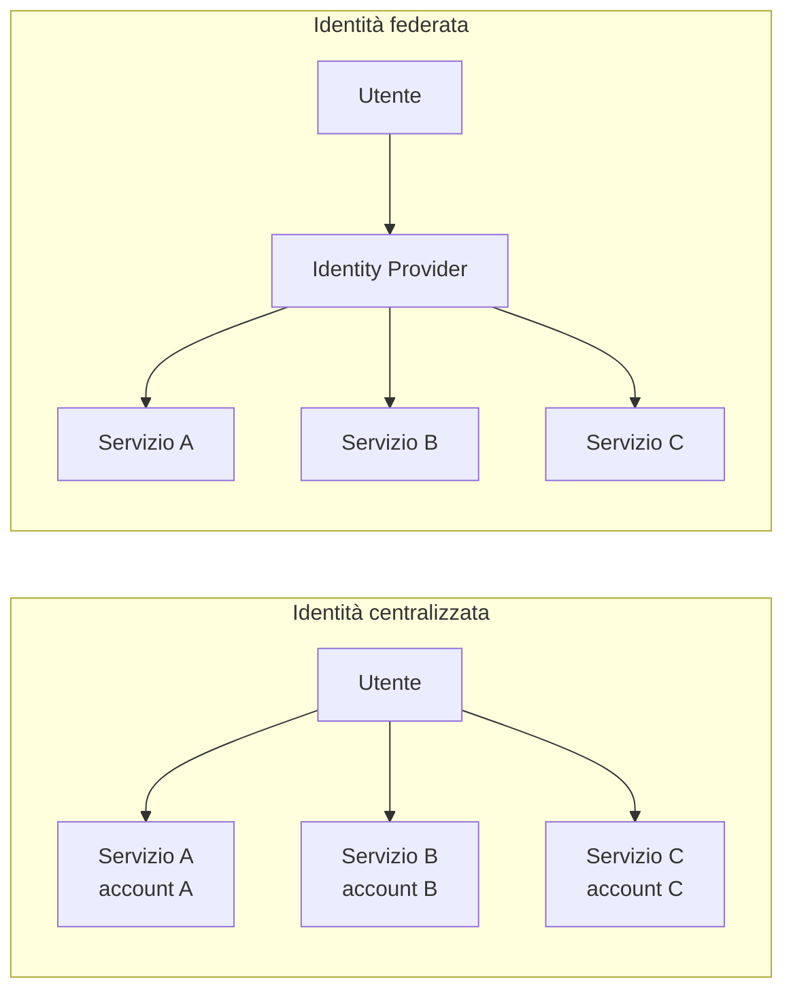
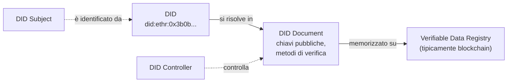
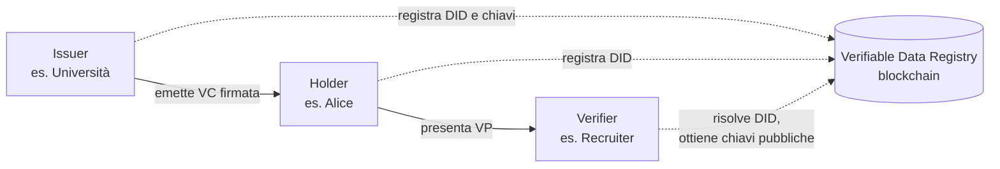
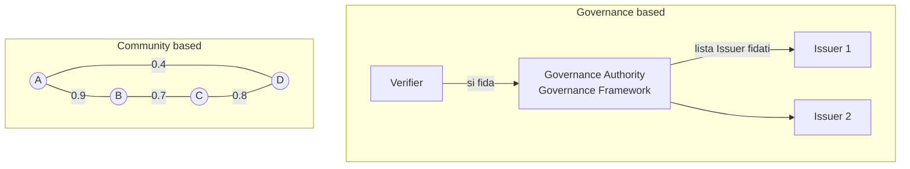
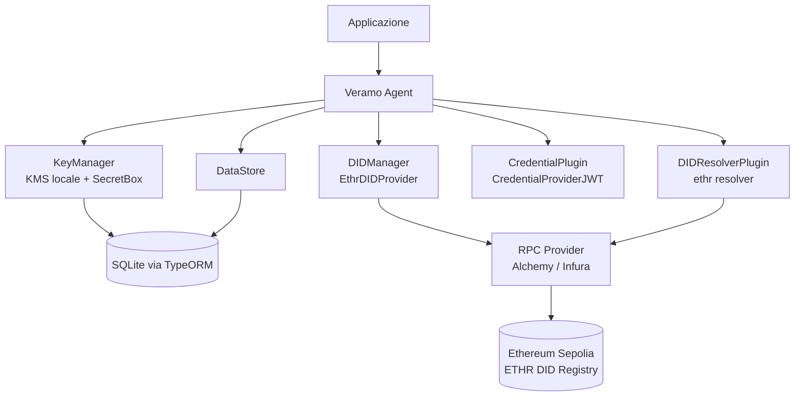
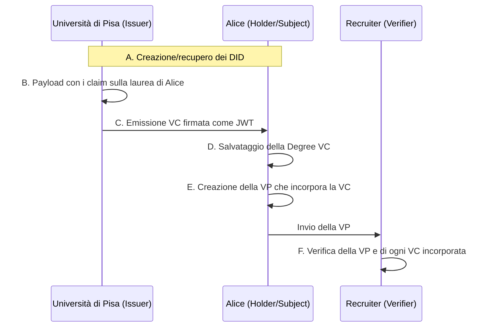

---
tags:
  - università/p2p-blockchain
  - self-sovereign-identity
  - decentralized-identifier
  - verifiable-credential
  - veramo
data: 2026-05-07
lezione: "L19 - Guest lecture: An Introduction to Self-Sovereign Identity and Veramo"
professore: "Calogero Turco (guest lecture)"
---

# Self-Sovereign Identity e Veramo

> [!note] Seminario ospite
>
> Questa lezione è una *guest lecture* tenuta da Calogero Turco (dottorando, Università di Pisa). Come tutti i seminari ospiti, è in genere **meno centrale per l'orale** rispetto ai grandi argomenti del corso (Bitcoin, Ethereum, strutture dati e metodi crittografici, attacchi). Dalle testimonianze degli orali passati risulta che sugli ultimi argomenti del corso (applicazioni della blockchain, token) le domande sono rare, ma non c'è garanzia. Conviene comunque conoscere bene i concetti chiave: DID, Verifiable Credential, Verifiable Presentation e i tre ruoli Issuer/Holder/Verifier.

La lezione affronta un problema molto concreto: **chi controlla la nostra identità digitale?** Oggi i dati personali sono sparsi in decine di account gestiti da aziende diverse, e l'utente non ha praticamente alcun controllo su di essi. La *Self-Sovereign Identity* (SSI, identità auto-sovrana) propone di ribaltare questo modello sfruttando le stesse idee che hanno reso possibile la blockchain: fiducia senza intermediari, crittografia a chiave pubblica e registri condivisi. La seconda parte della lezione mostra come costruire concretamente un sistema SSI su Ethereum con il framework **Veramo**.

Il percorso della lezione segue questa struttura: evoluzione dell'identità digitale, principi e componenti della SSI, SSI su Ethereum e Veramo, un esempio pratico completo (la laurea di Alice) e infine le prospettive future.

---

## L'evoluzione dell'identità digitale

### Identità centralizzata

Il modello più antico e ancora oggi più diffuso è quello dell'**identità centralizzata** (*centralized digital identity*). Ogni fornitore di servizi (*service provider*) gestisce autonomamente i propri account utente: per usare un sito ci si registra, si crea una coppia username/password e si forniscono i propri dati personali. La conseguenza è che l'utente deve rivelare i propri dati a **ogni** servizio che utilizza, e che l'identità non è **portabile**: l'account creato su un sito non serve a nulla su un altro.

Il problema più grave però è la dipendenza dal provider: se il fornitore subisce un *breach* (violazione dei dati) o diventa indisponibile, l'utente perde l'accesso ai propri dati o il controllo su di essi. L'identità, in questo modello, appartiene di fatto al provider e non all'utente.

### Identità federata

Il modello **federato** (*federated digital identity*) è un primo passo avanti. Un unico **Identity Provider** (IdP) autentica l'utente per conto di molti servizi diversi: è il caso tipico dei pulsanti "Accedi con Google" o "Accedi con Facebook". L'utente evita di creare un nuovo account per ogni sito, e i *service provider* si fidano dell'Identity Provider per l'autenticazione.

L'identità diventa così "in qualche misura" portabile, ma il controllo dell'utente resta limitato: semplicemente, invece di tanti custodi, ce n'è uno solo (molto potente), che vede tutti gli accessi dell'utente e che rimane un punto singolo di fallimento e di controllo.



*Fig. — Confronto tra identità centralizzata (un account per servizio) e federata (un Identity Provider di cui i servizi si fidano).*

### Il problema: dati dispersi e violazioni di massa

Le slide mostrano alcune visualizzazioni (tratte da *haveibeenpwned.com* e da *informationisbeautiful.net*) delle più grandi violazioni di dati della storia: miliardi di record personali sono stati compromessi. Il messaggio è netto: **la nostra identità è dispersa in account centralizzati che non controlliamo davvero**.

Da qui nasce la spinta verso la decentralizzazione. Da un lato c'è la **mancanza di controllo** (gli individui hanno poco controllo diretto sui propri dati) e il **rischio massiccio** (miliardi di record compromessi); dall'altro la blockchain ha mostrato che è possibile ottenere **fiducia senza intermediari**. Questo cambio di paradigma apre la strada alla Self-Sovereign Identity.

### Un esempio motivante: la laurea di Alice (parte I)

Per rendere concreto il problema, la lezione usa un esempio che accompagna tutto il seminario. Alice si è laureata all'Università di Pisa e si candida per un lavoro; il *recruiter* vuole verificare che la laurea sia autentica. Nel modello tradizionale:

- Alice non ha una credenziale **portabile e pronta da condividere**;
- non esiste una **prova crittograficamente verificabile** della laurea;
- la prova deve essere richiesta all'università;
- per verificarla, il recruiter deve **contattare direttamente l'università**.

L'università resta quindi un intermediario obbligato in ogni verifica. La SSI mira a eliminare proprio questo passaggio.

---

## Self-Sovereign Identity (SSI)

> [!definition] Self-Sovereign Identity
>
> La **Self-Sovereign Identity** è un modello di identità digitale che consente a un'entità (persona, organizzazione, oggetto) di **conservare e controllare direttamente** le proprie informazioni di identità, senza dipendere da un'autorità centrale che le custodisce.

Le due proprietà cardine sottolineate dalle slide sono:

- **controllo e consenso** (*control & consent*): è l'utente a decidere **quando** e **cosa** condividere con terze parti;
- **portabilità** (*portability*): i dati di identità sono riutilizzabili universalmente tra servizi diversi.

Secondo il relatore, la SSI è uno dei **pilastri del passaggio dal Web 2.0 al Web3**: così come le criptovalute rendono l'utente custode del proprio denaro, la SSI lo rende custode della propria identità.

### Decentralized Identifier (DID)

Il primo mattone della SSI è il **Decentralized Identifier** (DID, identificatore decentralizzato), standardizzato dal W3C.

> [!definition] Decentralized Identifier (DID)
>
> Un **DID** è un identificatore univoco di risorsa (URI) che **si risolve in un DID Document**, cioè un documento che descrive il soggetto identificato e contiene in particolare le **chiavi pubbliche** e i metodi di verifica associati. Il DID Document è memorizzato su un **Verifiable Data Registry**, che in genere è una blockchain.

Nella specifica W3C compaiono due ruoli distinti. Il **DID Subject** è l'entità identificata dal DID (ad esempio Alice), mentre il **DID Controller** è l'entità che ha il potere di modificare il DID Document (ad esempio aggiornare le chiavi). Spesso coincidono, ma non necessariamente.

La sintassi di un DID è `did:<metodo>:<identificatore specifico del metodo>`. Il **metodo** stabilisce dove e come il DID Document viene memorizzato e risolto. Le slide riportano tre esempi:

| DID | Metodo | Dove si trova il DID Document |
|---|---|---|
| `did:ethr:0x3b0bc51ab9de...` | `ethr` | Rete Ethereum (registro on-chain) |
| `did:web:identity.foundation` | `web` | Server web del DID Controller |
| `did:key:z82Lkytz3HqpWi...` | `key` | Generato algoritmicamente dall'identificatore stesso |

Il metodo `did:ethr` usa quindi un indirizzo Ethereum come identificatore; `did:web` si appoggia al DNS e a un server HTTPS (meno decentralizzato); `did:key` codifica direttamente la chiave pubblica nell'identificatore, per cui il documento si ricostruisce senza consultare alcun registro.



*Fig. — Relazioni tra DID, DID Document, Verifiable Data Registry, Subject e Controller (dalla specifica W3C DID).*

### Verifiable Credential (VC)

Il secondo mattone è la **Verifiable Credential** (VC, credenziale verificabile), anch'essa standardizzata dal W3C (*Verifiable Credentials Data Model*).

> [!definition] Verifiable Credential (VC)
>
> Una **Verifiable Credential** è un insieme di **affermazioni** (*claims*) su un soggetto, **firmate digitalmente** da un'entità emittente fidata (l'Issuer). La firma consente a chiunque di verificare l'autenticità e l'integrità della credenziale usando la chiave pubblica dell'Issuer, ricavata dal suo DID Document.

Le slide la descrivono come una **tecnologia a tutela della privacy per le credenziali**, usata per emettere, conservare e presentare titoli di studio, documenti d'identità rilasciati dallo Stato, manifesti di carico dei container, informazioni certificate sui prodotti e in generale qualsiasi credenziale leggibile da una macchina.

### Il modello Issuer–Holder–Verifier

Il *Verifiable Credentials Data Model* del W3C definisce tre ruoli, che sono il cuore concettuale della SSI:

- l'**Issuer** (emittente) crea e **firma** la credenziale (es. l'università);
- l'**Holder** (titolare) **riceve, conserva** la credenziale nel proprio *wallet* e decide a chi mostrarla (es. Alice);
- il **Verifier** (verificatore) **richiede** una credenziale e ne **verifica le firme** (es. il recruiter).

Il Verifiable Data Registry (la blockchain) fa da punto di riferimento comune: l'Issuer vi registra i propri identificatori e chiavi, il Verifier lo consulta per risolvere i DID e ottenere le chiavi pubbliche con cui verificare le firme.



*Fig. — Il triangolo della fiducia della SSI: il Verifier non contatta l'Issuer, ma verifica le firme usando le chiavi pubbliche pubblicate sul registro.*

> [!tip] Intuizione chiave
>
> Il guadagno rispetto al modello tradizionale è che il **Verifier non deve più contattare l'Issuer**. Nella laurea di Alice, il recruiter non telefona all'università: gli basta risolvere il DID dell'università, ottenere la sua chiave pubblica e controllare la firma sulla credenziale.

### Due domande di verifica dalla lezione

Il relatore ha proposto due domande di autoverifica, che conviene saper rispondere:

1. **Chi controlla i dati nella SSI, cioè chi decide come vengono condivisi?** Le opzioni erano Big Tech, Issuer, Holder. La risposta è l'**Holder**: è il titolare a decidere quando e con chi condividere le proprie credenziali.
2. **La verifica delle Verifiable Credential avviene on-chain tramite smart contract?** Vero o falso? La risposta è **falso**: la verifica è un'operazione crittografica svolta **off-chain** dal Verifier. La blockchain serve come registro per risolvere i DID e recuperare le chiavi pubbliche, non per eseguire la verifica.

> [!warning] Attenzione
>
> È un errore comune pensare che nella SSI "tutto stia sulla blockchain". Le credenziali (che contengono dati personali) **non** vengono scritte on-chain: sono conservate dall'Holder. On-chain finisce solo ciò che serve a risolvere gli identificatori (DID Document, chiavi, eventuali deleghe e revoche).

### I principi della SSI

Le slide citano come riferimenti l'articolo di Christopher Allen *The Path to Self-Sovereign Identity* (2016) e i principi SSI della fondazione Sovrin, mostrandoli in forma grafica senza elencarli nel testo.

> [!note] Integrazione (non presente nel testo delle slide)
>
> I dieci principi di Allen, per completezza, sono: **esistenza** (l'utente esiste indipendentemente dalla sua identità digitale), **controllo**, **accesso** (ai propri dati), **trasparenza** (dei sistemi e algoritmi), **persistenza** (l'identità deve durare nel tempo), **portabilità**, **interoperabilità**, **consenso**, **minimizzazione** (rivelare il minimo indispensabile) e **protezione** (dei diritti dell'utente). Controllo, consenso e portabilità sono quelli su cui la lezione ha insistito esplicitamente.

### Modelli di fiducia (Trust Models)

Resta una questione aperta: il Verifier può verificare che una credenziale sia stata firmata da un certo DID, ma **come fa a sapere che quel DID appartiene davvero a un'università affidabile** e non a un falsario? Serve un modello di fiducia. La lezione ne presenta due.

Nel modello **basato su governance** (*governance based*) esiste una **Governance Authority**, composta da una o più entità (persone, organizzazioni), che definisce un **Governance Framework** e specifica la **lista degli Issuer fidati**. Il Verifier si fida della Governance Authority e, **per transitività**, degli Issuer da essa riconosciuti. Un esempio naturale sarebbe un ministero che certifica l'elenco delle università abilitate a rilasciare lauree.

Nel modello **basato sulla comunità** (*community based*) la fiducia emerge invece da un grafo simile a quelli di "amicizia" dei social network: i **nodi** sono gli attori SSI, gli **archi** sono relazioni di fiducia tra attori, e il **peso** di ciascun arco è il punteggio di fiducia (*trust score*). La fiducia può essere **aggregata** lungo i cammini del grafo e **decade con la distanza**: mi fido molto di chi è mio vicino diretto, meno di chi è raggiungibile solo attraverso molti intermediari.



*Fig. — I due modelli di fiducia: fiducia transitiva attraverso un'autorità di governance, oppure grafo pesato di relazioni di fiducia in cui la fiducia decade con la distanza.*

### La laurea di Alice (parte II)

Rivisto con la SSI, l'esempio diventa: l'Università di Pisa (Issuer) emette ad Alice (Holder) una VC firmata che attesta la laurea; Alice la conserva nel proprio wallet; quando si candida, Alice presenta la credenziale al recruiter (Verifier), che la verifica autonomamente risolvendo il DID dell'università, senza contattarla. La credenziale è portabile, pronta da condividere e crittograficamente verificabile: esattamente le tre proprietà che mancavano nella parte I.

---

## SSI su Ethereum e Veramo

### Universal DID Resolver e `did:ethr`

Per verificare una firma bisogna **risolvere** un DID, cioè ottenere il DID Document corrispondente. Esistono molti metodi DID diversi, e ciascuno richiede una logica di risoluzione specifica. Lo **Universal DID Resolver** (dimostrato in lezione su `dev.uniresolver.io`) è un servizio che, dato un DID di qualunque metodo supportato, restituisce il relativo DID Document.

Il metodo usato nella lezione è `did:ethr`, sviluppato originariamente dal progetto uPort. Il DID è costruito a partire da un indirizzo (o da una chiave pubblica) Ethereum, e il DID Document è gestito tramite uno smart contract, l'**Ethereum DID Registry** (standard ERC-1056), che memorizza eventuali modifiche (cambio di proprietario, deleghe, attributi aggiuntivi). In assenza di modifiche il DID Document si deriva direttamente dall'indirizzo, senza alcuna transazione: creare un `did:ethr` è gratuito.

> [!note] Integrazione (non presente nel testo delle slide)
>
> Il riferimento a ERC-1056 e il fatto che un `did:ethr` possa essere creato senza transazioni sono dettagli standard del metodo, non esplicitati nel testo delle slide (che mostrano però l'indirizzo del registry e rimandano al repository `uport-project/ethr-did-registry`).

### Verifica delle firme su Ethereum

Le slide mostrano come si verifica una firma nel contesto `did:ethr`, rimandando alla documentazione di `ethr-did`, a EIP-155 e alla funzione `recover` di web3.js. L'idea è quella tipica di Ethereum: data una firma ECDSA su secp256k1 e il messaggio firmato, si **recupera** la chiave pubblica (e quindi l'indirizzo) del firmatario. Se l'indirizzo recuperato corrisponde a una chiave autorizzata nel DID Document dell'Issuer, la firma è valida. EIP-155 introduce il *chain ID* nella firma per evitare attacchi di replay tra catene diverse.

### Verifiable Credential in formato JWT

Una VC può essere rappresentata in vari formati. Veramo usa per default il formato **JWT** (*JSON Web Token*), con tipo di prova `JwtProof2020`. La credenziale ha una parte "leggibile" in JSON e una parte `proof` che contiene il JWT firmato. Riportiamo la struttura dell'esempio mostrato in lezione:

```json
{
  "credentialSubject": {
    "fullName": "Alice Rossi",
    "birthDate": "2002-10-28",
    "birthPlace": "Lucca (LU), Italy",
    "id": "did:ethr:sepolia:0x02ae91ae6d31..."
  },
  "issuer": { "id": "did:ethr:sepolia:0x02b42bdd2ee0..." },
  "type": ["VerifiableCredential", "Digital-ID-Credential"],
  "@context": ["https://www.w3.org/2018/credentials/v1"],
  "issuanceDate": "2026-05-06T21:11:28.000Z",
  "proof": {
    "type": "JwtProof2020",
    "jwt": "eyJhbGciOiJFUzI1NksiLCJ0eXAiOiJKV1QifQ.eyJ2YyI6..."
  }
}
```

I campi da riconoscere sono: `@context` (il vocabolario W3C a cui si fa riferimento), `type` (il tipo di credenziale), `issuer` (il DID dell'emittente), `issuanceDate`, `credentialSubject` (le affermazioni sul soggetto, incluso il suo DID nel campo `id`) e `proof`. Notare che i DID usano il metodo `did:ethr:sepolia`, cioè la testnet Sepolia di Ethereum.

Un JWT è composto da tre parti codificate in Base64URL e separate da punti: **header** (algoritmo di firma, qui `ES256K`, cioè ECDSA su secp256k1, la curva di Ethereum), **payload** (i dati della credenziale, con i campi `sub` = soggetto, `iss` = issuer, `nbf` = *not before*) e **firma**. Il sito *jwt.io*, citato in lezione, permette di decodificare il JWT e leggerne il contenuto.

### L'ecosistema Veramo

**Veramo** è un framework JavaScript/TypeScript per costruire applicazioni di identità decentralizzata. Fa parte dell'ecosistema della **Decentralized Identity Foundation** (DIF), un'organizzazione che promuove gli interessi della comunità dell'identità decentralizzata svolgendo ricerca e sviluppo sulle fondamenta tecniche "pre-competitive", verso standard globali e interoperabili. Veramo è sviluppato dal **Veramo User Group**, un gruppo aperto e senza diritti di proprietà intellettuale, ed è rilasciato con licenza **Apache 2.0**.

### Architettura di Veramo

L'architettura di Veramo è costruita attorno al concetto di **agente** (*agent*), un oggetto che espone metodi e che viene composto da **plugin**. Ogni plugin aggiunge una capacità specifica:

```typescript
export const agent = createAgent({
  plugins: [
    KeyManager,
    DIDManager,
    DIDResolverPlugin,
    new CredentialPlugin([new CredentialProviderJWT()]),
    new DataStore(dbConnection)
  ]
})
```

Il **KeyManager** gestisce le chiavi crittografiche (creazione, firma), appoggiandosi a un *Key Management System* (KMS). Il **DIDManager** crea e gestisce i DID tramite *provider* specifici per ciascun metodo (qui `did:ethr`). Il **DIDResolverPlugin** risolve i DID in DID Document. Il **CredentialPlugin** crea e verifica VC e VP, con un *provider* per il formato di prova (qui JWT). Il **DataStore** persiste credenziali, presentazioni e altri dati in un database.



*Fig. — Architettura di un agente Veramo: i plugin incapsulano gestione delle chiavi, dei DID, risoluzione, credenziali e persistenza.*

### Prerequisiti e setup

Per usare Veramo servono Node.js versione > 20 (eventualmente gestito con *nvm*, Node Version Manager), un package manager come yarn o npm, un account presso un **RPC Provider** (ad esempio Alchemy o Infura) per comunicare con la rete Ethereum senza gestire un nodo proprio, e, come nota ironicamente il relatore, "un po' di pazienza". Le slide mostrano come creare un endpoint RPC su Alchemy per la rete Sepolia; la guida di riferimento è il tutorial ufficiale sul sito di Veramo.

### Configurazione del KeyManager

Veramo usa un database SQLite locale, gestito tramite TypeORM, per memorizzare chiavi, DID, credenziali e altri dati. Le chiavi private vengono cifrate nel database con una chiave segreta (`KMS_SECRET_KEY`), che in un progetto reale va tenuta in una variabile d'ambiente e può essere generata con `npx @veramo/cli config create-secret-key`.

```typescript
const dbConnection = new DataSource({
  type: 'sqlite',
  database: 'database.sqlite',
  synchronize: false,
  migrations,
  migrationsRun: true,
  logging: ['error', 'info', 'warn'],
  entities: Entities,
}).initialize()

new KeyManager({
  store: new KeyStore(dbConnection),
  kms: {
    local: new KeyManagementSystem(
      new PrivateKeyStore(dbConnection, new SecretBox(KMS_SECRET_KEY))
    ),
  },
})
```

Il `KeyStore` memorizza i metadati delle chiavi, mentre il `PrivateKeyStore` memorizza le chiavi private cifrate con `SecretBox`. Il KMS chiamato `local` è quello che verrà usato per creare i DID.

### Configurazione di DIDManager e DIDResolver

Per operare con `did:ethr` servono l'URL RPC della rete (Sepolia via Alchemy) e l'indirizzo dell'**ETHR DID Registry** su quella rete (nelle slide `0x03d5003bf0e79C5F5223588F347ebA39AfbC3818`, lo stesso su Sepolia e mainnet). Il registry è fondamentale per le transazioni legate ai `did:ethr`.

```typescript
new DIDManager({
  defaultProvider: 'did:ethr:sepolia',
  providers: {
    'did:ethr:sepolia': new EthrDIDProvider({
      defaultKms: 'local',
      network: 'sepolia',
      registry: ETHR_REGISTRY,
      rpcUrl: RPC_URL
    }),
  },
})

const ethrResolverAlchemy = getResolver({
  networks: [{ name: 'sepolia', rpcUrl: SEPOLIA_RPC_URL, registry: ETHR_REGISTRY }],
})
```

Il DIDManager usa il provider per **creare** DID; il resolver serve invece a **leggere** i DID Document interrogando il registry sulla blockchain.

---

## Veramo in azione: la laurea di Alice (parte III)

L'esempio completo (codice disponibile sul repository GitHub `caltr98/UniversityExampleSSI`) implementa l'intero flusso in sei passi, distribuiti tra i tre attori.



*Fig. — I sei passi dell'esempio: DID, payload, emissione, memorizzazione, presentazione, verifica.*

### A. Creazione dei DID

La funzione `getOrCreateDid` cerca un DID tramite un alias; se non esiste lo crea con il provider `did:ethr:sepolia` e il KMS locale. Vengono creati due DID: uno per l'università (`university-of-pisa`) e uno per Alice (`alice`).

```typescript
async function getOrCreateDid(agent, alias) {
  try {
    return await agent.didManagerGetByAlias({ alias, provider: 'did:ethr:sepolia' })
  } catch {
    return await agent.didManagerCreate({ alias, provider: 'did:ethr:sepolia', kms: 'local' })
  }
}
```

### B. Payload della credenziale

L'università prepara il contenuto della credenziale di laurea: contesto W3C, tipo `UniversityDegreeCredential`, issuer (il DID dell'università), data di emissione e soprattutto il `credentialSubject`, che contiene il DID di Alice e i claim: nome completo, data e luogo di nascita, data di immatricolazione, anno accademico, nome del corso ("Laurea Magistrale in Informatica"), curriculum, classe di laurea (LM-18), durata normale, data di laurea, voto finale ("110/110 with honors") e data di rilascio del diploma.

### C. Emissione della VC

L'università firma la credenziale con `agent.createVerifiableCredential({ credential: payload, proofFormat: 'jwt' })`. Il risultato è la *Degree VC*, contenente la prova JWT firmata con la chiave associata al DID dell'università.

### D. Memorizzazione della VC

Alice salva la credenziale nel proprio DataStore con `agent.dataStoreSaveVerifiableCredential(...)`, che restituisce l'hash della VC memorizzata. Questo è il "wallet" dell'Holder.

### E. Creazione della Verifiable Presentation

> [!definition] Verifiable Presentation (VP)
>
> Una **Verifiable Presentation** è un involucro firmato dall'**Holder** che contiene una o più VC. Dimostra che chi presenta le credenziali è effettivamente il loro titolare (possiede la chiave privata associata al DID del soggetto), e non qualcuno che ne ha semplicemente ottenuto una copia.

Alice crea una presentazione di tipo `VerifiablePresentation`, con `holder` pari al suo DID e con la Degree VC nel campo `verifiableCredential`, e la firma sempre in formato JWT con `agent.createVerifiablePresentation(...)`.

### F. Verifica

Il recruiter verifica prima la presentazione nel suo complesso con `agent.verifyPresentation({ presentation: degreeVP })`, che controlla la firma di Alice. Poi estrae ogni VC incorporata e la verifica singolarmente con `agent.verifyCredential(...)`, controllando la firma dell'università. In entrambi i casi la verifica avviene risolvendo i DID e usando i metodi di verifica dichiarati nei DID Document. Se entrambe le verifiche hanno esito `verified: true`, il recruiter sa che la laurea è stata emessa dall'università e che chi la presenta è davvero Alice.

> [!tip] Perché servono due firme
>
> La firma dell'Issuer sulla VC garantisce **autenticità e integrità del contenuto** (la laurea è vera e non è stata alterata). La firma dell'Holder sulla VP garantisce il **possesso** (chi la presenta è il legittimo titolare). Senza la seconda, chiunque avesse intercettato la VC potrebbe spacciarsi per Alice.

---

## Prospettive future e tesi

### Selective Disclosure

Un limite dell'esempio è che Alice, per dimostrare di essere laureata, rivela **tutti** i campi della credenziale, incluso voto e data di nascita. La **Selective Disclosure** (divulgazione selettiva) consente di mostrare solo **alcuni attributi** di una credenziale: ad esempio "data di laurea" e "nome completo" dalla Degree VC, senza rivelare data di nascita e voto finale. È un'applicazione diretta del principio di minimizzazione.

Le tecniche citate sono: un **plugin di Veramo** dedicato; l'**hashing dei valori degli attributi** (l'Issuer firma gli hash, l'Holder rivela solo i valori che vuole insieme al relativo *salt*, e il Verifier ricalcola gli hash); la **cifratura dei valori degli attributi**; le **Zero-Knowledge Proofs**, in particolare **AnonCreds**, che permettono di dimostrare proprietà di un attributo (ad esempio "ho più di 18 anni") senza rivelarne il valore.

> [!note] Integrazione (non presente nel testo delle slide)
>
> La spiegazione del meccanismo di hashing con *salt* è un'espansione standard (è il principio di schemi come SD-JWT); le slide si limitano a elencare "attributes value hashing".

### Messaggi chiave

Il relatore ha riassunto la lezione in pochi punti, che conviene memorizzare:

- **DID** = identificatore decentralizzato + chiavi pubbliche;
- **Verifiable Credential** = insieme di claim firmati da un'entità fidata;
- **Verifiable Presentation** = prova del possesso di una VC, presentata dall'Holder;
- l'**Issuer** firma le credenziali;
- l'**Holder** conserva le proprie credenziali e controlla con chi condividerle;
- il **Verifier** richiede credenziali e ne verifica le firme usando i metodi di verifica dichiarati nel DID Document.

### Proposte di tesi

Le ultime slide presentano una proposta di tesi: **governance decentralizzata nella SSI tramite Optimistic Oracles**. L'idea è un **Trusted Issuers Registry** in cui un Issuer si registra come fidato per un certo *topic*, e la legittimità della registrazione viene validata non da un'autorità centrale ma da un *optimistic oracle* (come quello di UMA): la registrazione è considerata valida a meno che qualcuno non la contesti entro un certo periodo, nel qual caso si apre una disputa risolta con meccanismi di voto economicamente incentivati. È un modo di rendere decentralizzato il modello di fiducia *governance based*.

> [!note] Integrazione
>
> Le slide mostrano solo il diagramma e il link al blog di UMA; la descrizione del funzionamento "ottimistico" (valido salvo contestazione) è un'espansione basata sulla conoscenza standard degli optimistic oracle.

---

> [!question] Possibili domande d'esame
>
> - Quali sono i limiti dei modelli di identità centralizzata e federata, e come li affronta la Self-Sovereign Identity?
> - Che cos'è un DID? Come è fatto, in cosa si risolve e che ruolo ha il Verifiable Data Registry? Fai esempi di metodi DID diversi.
> - Descrivi i ruoli di Issuer, Holder e Verifier e il flusso di emissione e verifica di una credenziale. Perché il Verifier non deve contattare l'Issuer?
> - Qual è la differenza tra una Verifiable Credential e una Verifiable Presentation? Perché servono entrambe?
> - La verifica delle credenziali avviene on-chain? Che cosa viene effettivamente scritto sulla blockchain in un sistema SSI?
> - Confronta i modelli di fiducia governance based e community based.
> - Che cos'è la Selective Disclosure e con quali tecniche si può realizzare?

> [!abstract] Sintesi
>
> I modelli di identità centralizzato e federato lasciano i dati sotto il controllo dei provider, esponendoli a violazioni di massa e rendendo l'identità poco portabile. La **Self-Sovereign Identity** restituisce all'utente il controllo e la portabilità, basandosi su **DID** (identificatori che si risolvono in DID Document con chiavi pubbliche, memorizzati su un registro, tipicamente una blockchain) e **Verifiable Credential** (claim firmati da un Issuer). L'**Holder** conserva le VC e le presenta dentro una **Verifiable Presentation** firmata; il **Verifier** le verifica off-chain risolvendo i DID, senza contattare l'Issuer. La fiducia negli Issuer si stabilisce tramite modelli **governance based** o **community based**. **Veramo** è un framework modulare (agente + plugin: KeyManager, DIDManager, DIDResolver, CredentialPlugin, DataStore) che implementa tutto il flusso su Ethereum con `did:ethr` e VC in formato JWT. Il futuro punta alla privacy tramite **Selective Disclosure** e Zero-Knowledge Proofs.
