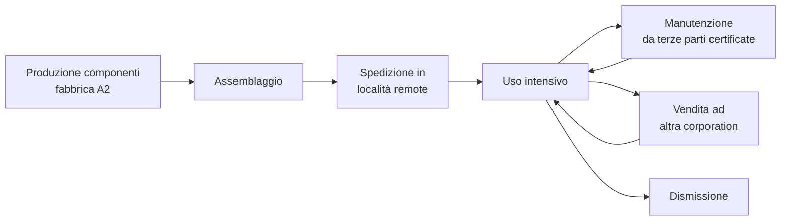
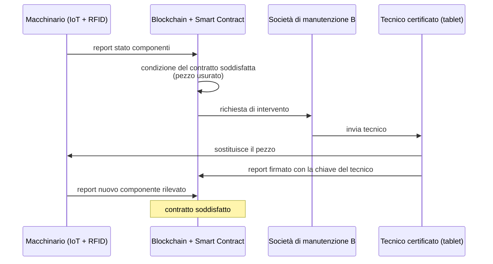
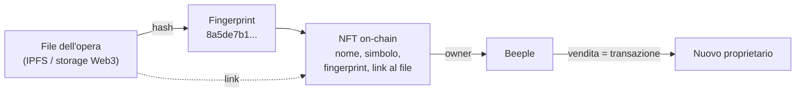
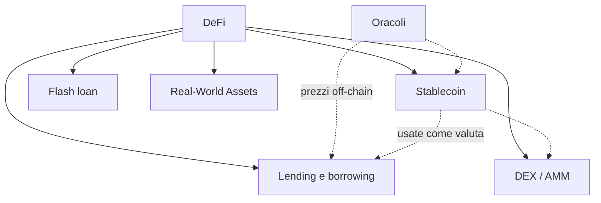
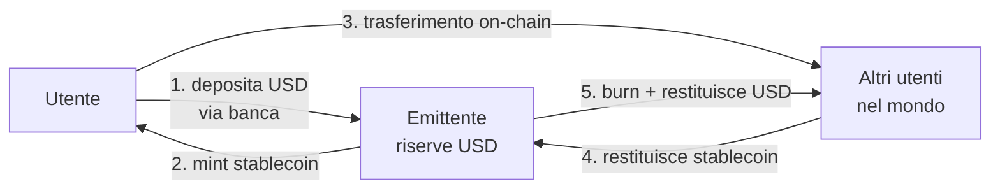
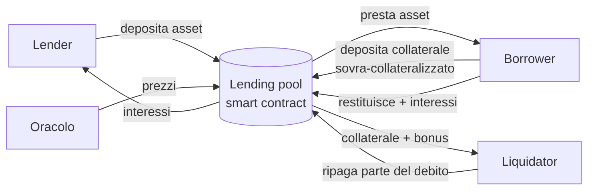
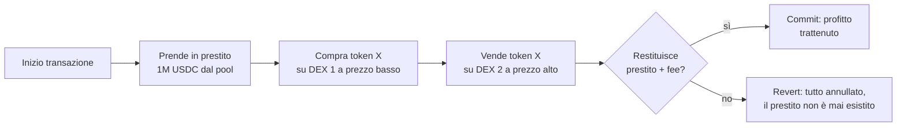
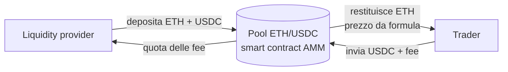
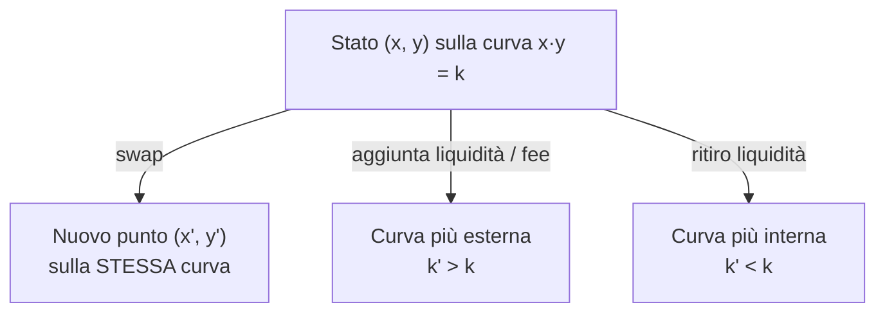
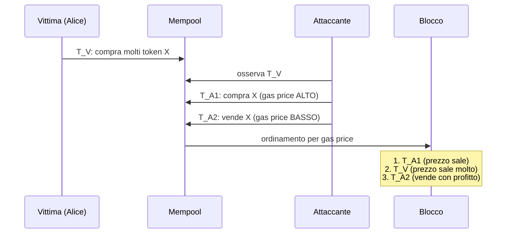

---
tags:
  - università/p2p-blockchain
  - smart-contract
  - supply-chain
  - nft
  - defi
  - stablecoin
  - mev
data: 2026-05-12
lezione: "L20 - Building Real-World Applications with Smart Contracts"
professore: "Laura Ricci"
---

# Applicazioni reali con Smart Contract

> [!note] Nota sulla numerazione
>
> Nelle slide questa lezione compare come "Lesson 19: Building real-world applications with smart contracts" (12/05/2026). Nella numerazione della dispensa è la L20, perché la L19 è la guest lecture sulla Self-Sovereign Identity.

> [!note] Rilevanza per l'orale
>
> Dalle testimonianze degli orali passati, sugli ultimi argomenti del corso (applicazioni della blockchain, token, NFT) la professoressa fa raramente domande, preferendo i "grandi argomenti" (Bitcoin, Ethereum, strutture dati e metodi crittografici, attacchi). Non c'è però garanzia, soprattutto per chi non porta il progetto su Ethereum. Da questa lezione è utile saper discutere con sicurezza almeno gli **oracoli**, le **stablecoin**, gli **AMM** e gli **attacchi basati sull'ordinamento delle transazioni** (sandwich attack, MEV), che si collegano agli attacchi visti nel corso.

Fino a questo punto il corso ha studiato le blockchain soprattutto come supporto alle criptovalute: Bitcoin, Ethereum, Solana e molte altre sono state le "*killer application*" della tecnologia. Gli **smart contract** però cambiano la prospettiva: permettono di passare da semplici trasferimenti di valore a **sistemi digitali interamente programmabili on-chain**. Questa lezione è una panoramica delle principali classi di applicazioni che ne derivano:

- **supply chain** (catena di fornitura) e certificazione;
- **token**, fungibili e non fungibili (NFT);
- **DeFi** (*Decentralized Finance*, finanza decentralizzata), un sistema finanziario in cui gli smart contract sostituiscono gli intermediari tradizionali come banche, broker ed exchange;
- **organizzazioni decentralizzate** governate da comunità;
- **identità digitale** (SSI), trattata nella guest lecture di Calogero Turco (vedi [[L19 - Self-Sovereign Identity e Veramo]]).

Un tema che attraversa tutta la lezione è che gli smart contract sono **programmabili e componibili** (*composable*): gli sviluppatori possono combinare protocolli diversi come se fossero moduli software, creando ecosistemi complessi di applicazioni interoperabili. La DeFi, come vedremo, è l'esempio più evidente di questa componibilità.

---

## Supply chain su blockchain permissioned

### Lo scenario: la corporation Alpha

La lezione sviluppa un esempio dettagliato di catena di fornitura. **Alpha** è una corporation che progetta e supervisiona la produzione di **macchinari complessi composti da molte parti**, ad esempio per l'industria pesante. **A1** è la sede centrale di Alpha. I componenti vengono prodotti e assemblati in una delle fabbriche di Alpha, **A2**.

Il ciclo di vita del macchinario è lungo e coinvolge molti attori. Il macchinario viene spedito in località remote e usato intensamente; richiede **manutenzione e assistenza regolari** per rispettare le norme di sicurezza e la legislazione locale. Alpha affida la manutenzione a **terze parti autorizzate**, che impiegano tecnici certificati e ricambi approvati. Il macchinario può essere **venduto** da una corporation all'altra, e per questo è vitale avere un registro della **storia degli interventi e della provenienza**. Alla fine del ciclo di vita, il macchinario viene **dismesso** (*decommissioned*).

*Fig. — Ciclo di vita del macchinario nello scenario Alpha.*

### L'architettura classica e i suoi limiti

Nella soluzione tradizionale, la sede A1 gestisce un **database centralizzato** che traccia componenti, macchinari, località, storia degli interventi e ciclo di vita. Questa architettura ha diversi problemi:

- un attacco **Denial of Service** sul database può creare un rischio serio;
- i record in un database possono essere **alterati o cancellati**;
- alcuni processi, come l'ordine di ricambi, sono **manuali** e dipendono dalla memoria e dall'intervento umano.

A questi si aggiungono problemi organizzativi: la **conformità normativa** e l'**audit da parte di terzi**, la **concessione e revoca dei permessi di accesso**, l'**interoperabilità** tra sistemi diversi di aziende diverse. Infine le **dispute** sono difficili da risolvere a posteriori: l'auditabilità non è semplice e si finisce in azioni legali costose e lunghe, perché nessuna delle parti può fidarsi completamente dei dati custoditi dall'altra.

### La soluzione: una blockchain permissioned

La soluzione proposta è una **blockchain permissioned** (con permessi), cioè una blockchain in cui solo partecipanti autorizzati possono unirsi alla rete e aggiungere blocchi. Il processo si costruisce passo dopo passo.

**Avvio della catena.** Alpha avvia una blockchain permissioned creando un **genesis block** ed esegue il primo nodo su un computer della sede A1. Il genesis block contiene la **chiave pubblica della sede di Alpha**: questa chiave identificherà A1 sulla blockchain in futuro e permetterà di verificare le firme di A1 e autenticare i dati che registra. A intervalli regolari Alpha aggiunge nuovi blocchi.

**Ingresso dei partecipanti.** La fabbrica A2 e la società di manutenzione a contratto **B** generano ciascuna una coppia di chiavi pubblica/privata e inviano la chiave pubblica ad A1, che la **annuncia sulla blockchain**. Da quel momento A2 e B entrano nella rete: sono nodi della rete P2P, eseguono i propri nodi blockchain e aggiungono blocchi. A1 non conosce le chiavi private di A2 e B, né loro conoscono quella di A1: **nessun partecipante può impersonare un altro**. Un messaggio sulla blockchain firmato con la chiave privata di B e verificato con la sua chiave pubblica è garantito provenire da B.

> [!tip] Intuizione chiave
>
> In questo schema la chiave pubblica funge da **identità** sulla blockchain, e l'annuncio firmato da A1 funge da **certificazione**: A1 fa da "autorità" che ammette i partecipanti, un po' come la Governance Authority del modello di fiducia visto nella SSI.

**Identità dei componenti.** A2, che produce i componenti, crea una **coppia di chiavi unica per ogni componente** e annuncia la chiave pubblica sulla blockchain insieme alla posizione del pezzo (il magazzino della fabbrica). La chiave privata può essere incorporata nel componente stesso. Quando i componenti vengono assemblati nella macchina finale, viene generata un'altra coppia di chiavi per il **prodotto finito**, anch'essa registrata.

Il livello di "partecipazione" dei componenti dipende dal loro costo:

- i **componenti economici** sono marcati con un **QR code** della chiave pubblica e **non partecipano** direttamente alla blockchain: altri dispositivi di scansione (lettori RFID) leggono il valore della chiave e inviano report alla blockchain per loro conto;
- i **componenti più costosi** sono dotati di un **tag RFID attivo** con connettività Bluetooth, che può contattare dispositivi vicini connessi in rete e inviare report alla blockchain;
- il **macchinario finito** può avere un **dispositivo IoT** completo, con buona connettività, **GPS** a bordo per il posizionamento ed eventualmente un **nodo blockchain leggero** che partecipa alla generazione di nuovi blocchi. Un lettore RFID integrato scansiona periodicamente l'intera macchina, rileva tutti i suoi componenti e le eventuali modifiche.

**Smart contract e automazione.** Quando un componente viene registrato sulla blockchain tramite l'annuncio della sua chiave pubblica, all'annuncio può essere **associato uno smart contract**. Tali contratti possono attivare automaticamente una richiesta di assistenza, una dismissione o un ordine di ricambio verso una società di manutenzione. La complessità dell'automazione dipende da come è progettato il sistema blockchain.

Ad esempio, quando una condizione dello smart contract è soddisfatta (un pezzo è usurato), il nodo che genera il blocco corrente invia una richiesta di intervento a B. B manda un tecnico sul posto per sostituire il pezzo. I **tecnici sono a loro volta certificati sulla blockchain** tramite la propria chiave pubblica, memorizzata nello smartphone o nel tablet di servizio. Quando il tecnico sostituisce il pezzo, il tablet e il dispositivo IoT della macchina inviano report alla blockchain che registrano l'evento, e il contratto risulta soddisfatto.

*Fig. — Flusso automatizzato di manutenzione: lo smart contract collegato al componente attiva la richiesta di intervento.*

**Revoca delle chiavi.** Supponiamo che l'entità **D** (l'azienda da cui dipende il tecnico) decida di **revocare la certificazione** di un tecnico, ad esempio perché ha lasciato l'azienda. D pubblica sulla blockchain un **messaggio di revoca della chiave**, firmato con la propria chiave privata. Un aspetto importante: **tutti i record fatti con la chiave del tecnico (nell'esempio `b555`) prima del blocco della revoca (blocco 412) restano validi**, e comunque i record non possono essere rimossi. La revoca vale solo per il futuro.

**Cambio di proprietà e dismissione.** Se la società X, proprietaria della macchina, la vende alla società Y, il passaggio di proprietà e il cambio di posizione vengono registrati sulla blockchain, fornendo per il futuro un **registro immutabile della provenienza**. Alla fine del ciclo di vita, la dismissione viene registrata con una **firma del produttore originale** A: ciò consente in futuro un audit affidabile del rispetto della legislazione ambientale.

### Il risultato finale

Al termine del processo esiste sulla blockchain un **registro completo** di tutti i partecipanti, i componenti, le località e gli spostamenti, di chi ha sostituito quali pezzi, dove e quando, dei trasferimenti di proprietà e della dismissione finale. I record **non possono essere alterati o cancellati** a posteriori. I singoli partecipanti possono seguire l'avanzamento durante il trasporto e rivedere i dati dopo consegne, modifiche o trasferimenti, e **non esiste un server centrale né un singolo punto di fallimento**.

> [!example] Confronto tra le due architetture
>
> | Problema | Database centralizzato | Blockchain permissioned |
> |---|---|---|
> | DoS | Punto singolo di fallimento | Replica su tutti i nodi dei partecipanti |
> | Integrità | Record alterabili/cancellabili | Record immutabili, append-only |
> | Autenticità | Si fida del gestore del DB | Ogni record firmato con la chiave del partecipante |
> | Processi manuali | Ordini ricambi manuali | Smart contract che automatizzano le richieste |
> | Permessi | Gestiti dall'amministratore del DB | Annuncio e revoca delle chiavi on-chain |
> | Dispute e audit | Costosi, dati di una sola parte | Storia condivisa e verificabile da tutti |

### Certificazione e tracciabilità

L'esempio di Alpha è un caso particolare di un uso più generale della blockchain: **certificazione e tracciabilità**. La **tracciabilità** consiste nel seguire i prodotti lungo l'intera catena di fornitura, verificandone origine, proprietà e storia del ciclo di vita, e migliorando la trasparenza nella logistica e nell'approvvigionamento. La **certificazione** fornisce una prova di autenticità a prova di manomissione: certificati digitali per prodotti e materiali, verifica del rispetto di standard etici e di sostenibilità.

Le principali aree di applicazione sono: alimentare e agricoltura, farmaceutica, manifattura industriale, edilizia e **BIM** (*Building Information Modeling*, con tracciabilità sicura di materiali, certificazioni e dati sul ciclo di vita degli edifici attraverso registri di progetto condivisi e immutabili), beni di lusso e diamanti.

### EU Digital Product Passport

Un caso concreto molto attuale è il **Digital Product Passport** (DPP, passaporto digitale del prodotto) dell'Unione Europea: una raccolta di dati sul prodotto (composizione, origine, impatto ambientale, riparabilità) accessibile lungo tutta la sua vita.

> [!note] Integrazione
>
> La slide sul DPP è solo grafica; la breve definizione qui sopra è un'integrazione. La guest lecture di Domenico Tortola (L21) riprende il product passport come caso d'uso delle blockchain interoperabili.

Sullo stato attuale del DPP, le slide riportano che molti progetti pilota stanno valutando blockchain, DID, Verifiable Credential e smart contract. Lo scenario **più realistico**, però, non è una blockchain pura, ma un'**architettura ibrida**: database centralizzati affiancati da **prove su blockchain** (ad esempio hash dei dati ancorati on-chain), **reti DLT permissioned**, e standard di interoperabilità come **EBSI** (*European Blockchain Services Infrastructure*).

---

## Non Fungible Token: il caso dell'arte digitale

### Il problema

L'arte digitale è il caso d'uso che ha reso celebri gli NFT (*Non Fungible Token*, token non fungibili), ed è anche oggetto di una grande controversia. Un'opera digitale è **facilissima da copiare**: chiunque abbia un computer e Internet può accedervi e farne una copia, anche solo con uno screenshot (magari a risoluzione non ottimale, ma il punto è chiaro). Come si può dimostrare che un artista è il vero proprietario di un'opera se molte persone ne hanno una copia? E come si costruisce un modello di business?

La risposta degli NFT parte da una distinzione: **copiare non significa possedere**. La proprietà dell'immagine resta a chi detiene il copyright, in genere l'artista che l'ha creata. Un NFT attribuisce la **proprietà di un'opera** in modo verificabile. Il paragone del mondo reale è la **prima edizione di un libro**: vale molto di più delle ristampe, anche se il contenuto è identico.

### Come funziona: l'esempio di Beeple

L'artista **Beeple** esegue il *minting* (coniazione) di un NFT per la sua opera. L'NFT contiene:

- un'**impronta univoca** (*fingerprint*, cioè l'hash) del file che contiene l'opera, ad esempio `8a5de7b183ecf2ec9f488`;
- il **nome** del token: *Everydays: The First 5000 Days*;
- il **simbolo** del token: `EF5000D`.

L'artista genera poi una transazione sulla blockchain che memorizza l'NFT e diventa così proprietario del token: "il token `8a5de7b183ecf2ec9f488` è creato da Beeple, che ne è il proprietario".

Un punto fondamentale: **l'opera in sé non è memorizzata dentro l'NFT sulla blockchain** (sarebbe troppo costoso). L'NFT può contenere un **link al file** memorizzato su un file system distribuito come **IPFS** o un altro file system Web3. Ciò che si acquista è **l'NFT che prova la proprietà**, non il file. Può sembrare strano, ma funziona in modo simile nel mondo reale: la **chitarra di Elvis Presley** vale moltissimo non per le sue caratteristiche materiali, ma perché esiste una prova di provenienza che la collega a Elvis.

*Fig. — Un NFT memorizza on-chain l'hash e il link all'opera; la proprietà è registrata nello stato del contratto e si trasferisce con una transazione.*

> [!note] Collegamento
>
> Il fatto che nell'NFT ci sia l'**hash** del file sfrutta la resistenza alle collisioni della funzione hash crittografica: nessuno può produrre un file diverso con la stessa impronta. È un'applicazione diretta delle proprietà viste nella parte sui metodi crittografici. Lo standard Ethereum per gli NFT è ERC-721 (trattato nelle lezioni sui token).

Le slide mostrano infine una panoramica grafica di altri casi d'uso degli NFT, senza testo.

> [!note] Integrazione
>
> Tra i casi d'uso tipicamente citati: biglietti per eventi, oggetti di gioco, certificati e titoli, licenze, beni immobiliari tokenizzati, identità e appartenenza a community.

---

## Decentralized Finance (DeFi)

La **DeFi** è un sistema finanziario in cui gli **smart contract sostituiscono gli intermediari tradizionali** (banche, broker, exchange). Le slide introducono la sezione con uno schema grafico dei suoi mattoni principali, che vengono poi trattati uno per uno: **stablecoin**, **lending e borrowing** (prestiti), **oracoli**, **flash loan**, **exchange decentralizzati (DEX)** con **Automated Market Maker**, e **asset reali tokenizzati**.

*Fig. — I mattoni della DeFi trattati nella lezione e le loro dipendenze: gli oracoli forniscono i prezzi, le stablecoin fanno da unità di conto.*

### Stablecoin

Le criptovalute come BTC ed ETH sono molto **volatili**, e questo le rende scomode come mezzo di pagamento e come unità di conto. Le **stablecoin** sono token progettati per mantenere un **valore stabile**, tipicamente ancorato (*pegged*) a una valuta *fiat* come il dollaro: 1 coin = 1 USD, 1 coin = 1 EUR, e così via, usando diversi meccanismi di garanzia (*backing*).

Gli obiettivi sono due. Il primo è **integrare le valute reali nelle applicazioni on-chain**: gli utenti possono usare le applicazioni blockchain con valute stabili e familiari invece di asset crittografici molto volatili. Il secondo è permettere a chi non ha facile accesso al dollaro di **detenere e scambiare un asset equivalente al dollaro**: nei paesi ad alta inflazione, stablecoin come **USDC** o **USDT (Tether)** proteggono i risparmi dalla svalutazione della valuta locale, e danno accesso a un "dollaro digitale" senza bisogno di un conto in una banca statunitense.

Le slide distinguono diversi **tipi di stablecoin** (con uno schema grafico); nel testo compaiono esplicitamente tre famiglie: **fiat-backed** (garantite da valuta fiat), **crypto-collateralized** (garantite da criptovalute) e **algoritmiche**.

#### Stablecoin garantite da fiat

Nelle **fiat-backed stablecoin** (come USDC e USDT) un emittente centralizzato detiene riserve in valuta fiat (o titoli equivalenti) pari alle monete in circolazione. Il ciclo di vita ha tre fasi, illustrate nelle slide:

- **minting**: un utente deposita dollari presso l'emittente attraverso l'infrastruttura bancaria tradizionale, e l'emittente conia una quantità equivalente di stablecoin on-chain;
- **trasferimento**: le stablecoin, una volta create, possono essere trasferite **globalmente e solo on-chain**, senza accesso diretto a una banca USA; gli utenti possono acquistarle con valuta locale, carte di debito, mercati P2P e così via;
- **withdrawal** (riscatto): l'utente restituisce le stablecoin all'emittente, che le **brucia** (*burn*) e restituisce i dollari corrispondenti.

*Fig. — Ciclo di vita di una stablecoin fiat-backed: minting, trasferimento globale on-chain, riscatto.*

**Stabilità tramite arbitraggio.** Le stablecoin collateralizzate in fiat mantengono la stabilità di prezzo grazie all'**arbitraggio**, cioè la pratica di trarre profitto da una differenza di prezzo dello stesso asset in mercati o forme diverse.

> [!example] Arbitraggio sul peg
>
> Se sul mercato la stablecoin scende a 0,98 USD, un arbitraggista la compra a 0,98 e la riscatta presso l'emittente per 1 USD, guadagnando 0,02 per moneta: gli acquisti fanno risalire il prezzo. Se invece sale a 1,02 USD, l'arbitraggista deposita 1 USD presso l'emittente, conia una moneta e la vende a 1,02: le vendite fanno riscendere il prezzo. Il profitto degli arbitraggisti è quindi la forza che riporta il prezzo al peg.

> [!note] Integrazione
>
> Le slide sull'arbitraggio sono principalmente grafiche; l'esempio numerico è un'espansione del meccanismo descritto nel testo.

#### Stablecoin garantite da criptovalute

Le **crypto-collateralized stablecoin** (il caso più noto è DAI di MakerDAO) sono garantite da altre criptovalute **bloccate in smart contract**. Sono quindi **decentralizzate** e **non-custodial** (nessuna entità custodisce i fondi: li custodisce il contratto).

Poiché le criptovalute sono molto volatili, serve la **sovra-collateralizzazione** (*over-collateralization*): per mantenere la stabilità, gli utenti devono bloccare un collaterale che valga **più** delle stablecoin che coniano. Ad esempio si depositano 150 $ in ETH e si coniano solo 100 $ di stablecoin. Lo smart contract blocca il collaterale e conia le stablecoin; se il valore del collaterale scende troppo, la posizione può essere **liquidata automaticamente**.

Le slide chiudono la sezione con un'immagine dell'ecosistema delle stablecoin, senza testo.

#### Stablecoin algoritmiche

Le **stablecoin algoritmiche** sono trattate più avanti, parlando di oracoli: mantengono il valore stabile **senza essere completamente garantite** da riserve tradizionali, usando algoritmi, smart contract, incentivi di mercato e meccanismi di arbitraggio per regolare l'offerta.

### Lending e borrowing

Il secondo pilastro della DeFi sono i **protocolli di prestito** (*lending protocols*, come Aave o Compound). Il modello generale coinvolge tre attori: il **lender** (prestatore), il **borrower** (mutuatario) e il **liquidator** (liquidatore), con un **pool di liquidità** gestito da uno smart contract al centro.

*Fig. — Modello generale di lending e borrowing con i tre attori, l'oracolo dei prezzi e il pool.*

**Il lender** deposita asset nel protocollo e guadagna **interessi** nel tempo, pagati dai borrower.

**Il borrower** ottiene liquidità **senza vendere i propri asset**, depositando un collaterale (sempre in sovra-collateralizzazione, perché il protocollo non conosce l'identità del debitore e non può fare affidamento sulla sua solvibilità).

> [!example] Sbloccare liquidità senza vendere
>
> Bob possiede 10 BTC del valore di 1 M$, ma un servizio DeFi di intelligenza artificiale accetta solo ETH o USDC. Bob considera BTC un asset scarso con potenziale di apprezzamento a lungo termine e non vuole venderlo. Invece di vendere, **deposita i BTC come collaterale** in un protocollo di lending e prende in prestito USDC. Ora Bob può pagare servizi, investire in altri protocolli e accedere ad altre opportunità DeFi, **mantenendo piena esposizione al rialzo di BTC**: se BTC raddoppia, il collaterale può arrivare a 2 M$ mentre il debito resta invariato.

**Il liquidator** interviene quando una posizione diventa rischiosa.

> [!example] Liquidazione
>
> Bob deposita **10 ETH** come collaterale, con ETH a 3.000 $: il collaterale vale **30.000 $**. Prende in prestito **20.000 USDC**. La posizione è inizialmente sicura (rapporto di collateralizzazione $30.000/20.000 = 150\%$).
>
> Il mercato crolla: ETH scende da 3.000 $ a **2.200 $**. Il collaterale ora vale solo **22.000 $**, mentre il debito resta 20.000 USDC (rapporto $22.000/20.000 = 110\%$). Il protocollo rileva che il rapporto di collateralizzazione è **sotto la soglia di sicurezza** e consente ai liquidatori di intervenire.
>
> La liquidatrice Alice **ripaga 5.000 USDC** del debito di Bob. In cambio il protocollo le dà ETH per un valore **leggermente superiore**, ad esempio 5.500 $ in ETH. Questo extra (500 $) è il **liquidation bonus**. Bob perde parte del collaterale ma il suo debito diminuisce; Alice guadagna il bonus; il **protocollo resta solvibile** e in salute.

Il liquidation bonus è l'incentivo economico che fa sì che qualcuno, nel proprio interesse, si preoccupi di chiudere le posizioni a rischio prima che il collaterale valga meno del debito. Resta però una domanda cruciale: **come fa il protocollo a conoscere in tempo reale il prezzo di ETH**, per monitorare il valore dei collaterali e identificare le posizioni sotto-collateralizzate? Serve un **oracolo**.

### Oracoli

Gli smart contract accedono ai **dati memorizzati sulla catena**. L'accesso ai dati on-chain è sicuro grazie al **consenso**: lo stato è creato dalle transazioni, e i nodi concordano sull'ordine delle transazioni, quindi tutti calcolano lo stesso stato. Ma le blockchain **non hanno connessione a Internet**: una blockchain è come un "**database isolato**".

> [!definition] Oracolo (blockchain oracle)
>
> Un **oracolo** è un servizio che funge da **ponte** tra il mondo esterno e la blockchain, portando **in modo sicuro dati off-chain on-chain** (prezzi di mercato, risultati di eventi, orari dei voli, ecc.) affinché gli smart contract possano usarli.

> [!tip] Perché uno smart contract non può semplicemente "chiamare un'API"
>
> Ogni nodo riesegue le transazioni per verificare lo stato. Se un contratto interrogasse direttamente un sito web, nodi diversi in momenti diversi potrebbero ottenere risposte diverse e il **determinismo** necessario al consenso si romperebbe. L'oracolo risolve il problema scrivendo il dato **in una transazione**: da quel momento il dato fa parte della storia della catena e tutti i nodi lo vedono uguale.

> [!note] Integrazione
>
> L'argomento del determinismo è un'espansione standard. Il testo delle slide si limita a dire che le blockchain "lack internet connections". Il rovescio della medaglia (non esplicitato nelle slide) è il cosiddetto *oracle problem*: la sicurezza del contratto dipende ora dall'affidabilità dell'oracolo; per questo si usano reti di oracoli decentralizzate (es. Chainlink) che aggregano più fonti.

Gli usi degli oracoli mostrati nelle slide sono:

- **lending e borrowing**: l'oracolo fornisce i prezzi di mercato con cui il protocollo calcola il valore dei collaterali e decide le liquidazioni;
- **mercati di scommesse** (*betting markets*): l'oracolo permette al contratto di conoscere il **risultato finale di un evento**;
- **assicurazione sui voli** (*flight insurance*): l'oracolo tiene traccia degli **orari dei voli**, così il contratto può rimborsare automaticamente in caso di ritardo;
- **stablecoin algoritmiche**.

#### Oracoli per le stablecoin algoritmiche

Le **stablecoin algoritmiche** mantengono un valore stabile senza essere completamente garantite da riserve, basandosi su algoritmi, smart contract, incentivi di mercato e arbitraggio. Nell'esempio delle slide, un oracolo **monitora il prezzo di mercato** della stablecoin sui vari exchange e lo invia on-chain allo smart contract. Il protocollo confronta questo prezzo con il **peg** obiettivo: se il prezzo è **sopra** il peg, il sistema viene ribilanciato **aumentando l'offerta** (più monete in circolazione fanno scendere il prezzo); altrimenti **diminuisce l'offerta**.

> [!warning] Attenzione
>
> Le stablecoin algoritmiche sono le più fragili: se la fiducia crolla, il meccanismo può innescare una spirale (è il caso storico di TerraUSD/Luna nel 2022). *Questa osservazione non è nelle slide.*

### Flash loan

Le slide presentano i **flash loan** come "una innovazione della DeFi", qualcosa che non ha equivalente nella finanza tradizionale.

> [!definition] Flash loan
>
> Un **flash loan** è un prestito **ottenuto e restituito all'interno di una singola transazione**. Se la restituzione fallisce, l'**intera transazione viene automaticamente annullata** (*reverted*), come se il prestito non fosse mai avvenuto.

Le conseguenze sono notevoli: il rischio per il lender è **zero**, e il borrower **non ha bisogno di collaterale**, perché la restituzione è garantita dall'**atomicità** della transazione. L'idea di fondo è che gli utenti possono accedere a **quantità enormi di capitale per pochi secondi** per eseguire operazioni complesse, ad esempio un **arbitraggio**.

*Fig. — Un flash loan usato per un arbitraggio: tutto avviene dentro un'unica transazione atomica.*

> [!tip] Intuizione chiave
>
> Il flash loan sfrutta una proprietà che abbiamo visto studiando l'EVM: una transazione Ethereum è **atomica**, o va a buon fine per intero o viene annullata per intero (pagando comunque il gas). Nella finanza tradizionale un prestito senza garanzie è rischioso perché il debitore può sparire; qui il debitore non può "sparire" a metà transazione.

---

## Exchange: centralizzati e decentralizzati

### Centralized Exchange (CEX)

Un **exchange** è un mercato in cui compratori e venditori scambiano asset finanziari come azioni, valute o criptovalute. I **compratori** piazzano offerte di acquisto (*bid*), i **venditori** offerte di vendita (*ask*). Un **market maker** è un'entità o un meccanismo che fornisce continuamente **liquidità** al mercato piazzando ordini sia di acquisto sia di vendita.

I **Centralized Exchange** (CEX) funzionano come le borse tradizionali: gli utenti **depositano fondi** su una piattaforma centralizzata, l'exchange gestisce **custodia, esecuzione e liquidità**, e gli scambi sono processati internamente dalla piattaforma. Prima dell'ascesa della DeFi, la maggior parte del trading di criptovalute avveniva su CEX come **Binance, Coinbase e Kraken**.

**Limit order e order book.** Un trader vuole scambiare il token A con il token B. Un **limit order** è un ordine di acquisto o vendita a un prezzo specifico o migliore. Serve un luogo che elenchi le persone disposte a fare gli scambi: le richieste vengono registrate in un **order book** (libro degli ordini).

**Formazione del prezzo in un CEX.** Il prezzo è determinato dal **matching** degli ordini di acquisto (bid) e di vendita (ask) nell'order book. I compratori specificano il prezzo **massimo** che sono disposti a pagare, i venditori il prezzo **minimo** che sono disposti ad accettare. Quando un ordine di acquisto incontra un ordine di vendita compatibile avviene uno scambio, e il prezzo di quello scambio diventa l'**ultimo prezzo di mercato**. L'order book viene aggiornato continuamente man mano che entrano nuovi ordini e quelli esistenti vengono eseguiti o cancellati.

> [!example] Un piccolo order book ETH/USDC
>
> | Bid (acquisto) | Quantità | | Ask (vendita) | Quantità |
> |---|---|---|---|---|
> | 1.998 | 3 ETH | | 2.001 | 2 ETH |
> | 1.995 | 5 ETH | | 2.004 | 4 ETH |
> | 1.990 | 10 ETH | | 2.010 | 6 ETH |
>
> Il miglior bid è 1.998, il miglior ask 2.001: la differenza è lo *spread*. Se arriva un ordine di acquisto a 2.001 per 2 ETH, si incrocia con il miglior ask, lo scambio avviene a 2.001 e questo diventa l'ultimo prezzo. *(Esempio illustrativo, non presente nelle slide.)*

Tenere un order book **on-chain** sarebbe però molto costoso: ogni inserimento, modifica e cancellazione di ordine richiederebbe una transazione con gas. Da qui la soluzione alternativa dei DEX.

### Decentralized Exchange (DEX)

Un **Decentralized Exchange** (DEX, come Uniswap) permette agli utenti di scambiare criptovalute **direttamente dai propri wallet**, senza un'azienda centrale che detenga i fondi. I token vengono acquistati da un **liquidity pool**: questi pool contengono **coppie di token** (es. ETH/USDC) depositate da altri utenti chiamati **liquidity provider** (fornitori di liquidità). I prezzi dei token sono calcolati automaticamente da uno smart contract usando una **formula matematica**, invece di un order book. Ogni scambio paga una piccola **commissione** (*fee*), distribuita ai liquidity provider.

*Fig. — Un DEX basato su liquidity pool: i trader scambiano contro il pool, non contro un'altra persona.*

### Automated Market Maker (AMM)

L'idea dell'**Automated Market Maker** si riassume così: **più un asset diventa scarso nel pool, più diventa costoso**. Non c'è order book: solo matematica, liquidità e uno smart contract.

La formula più diffusa (usata da Uniswap v2) è quella del **prodotto costante** (*constant product*). Se il pool contiene una quantità $x$ di ETH e una quantità $y$ di USDC, ogni scambio deve lasciare invariato il prodotto:

$$
x \cdot y = k
$$

dove $k$ è una costante. I punti $(x, y)$ ammissibili stanno quindi su un'iperbole: un trader che toglie ETH dal pool (diminuendo $x$) deve aggiungere abbastanza USDC (aumentando $y$) da mantenere il prodotto uguale a $k$.

**Il prezzo in un punto della curva.** Per una curva generica, qual è il prezzo in un dato punto? Il prezzo risponde alla domanda "per comprare una **piccola** quantità di ETH, quanti USD devo pagare?", ed è quindi la **pendenza della tangente** alla curva. Per la curva a prodotto costante, da $y = k/x$ si ottiene:

$$
P = \left|\frac{dy}{dx}\right| = \frac{k}{x^2} = \frac{y}{x}
$$

cioè il prezzo marginale di ETH in USDC è semplicemente il **rapporto tra le riserve**.

> [!note] Ricostruzione
>
> Le slide sulla matematica dell'AMM sono in gran parte grafiche e la formula non è estratta nel testo; l'esplicito riferimento a "does $k$ ever change?" conferma però che si tratta del modello a prodotto costante $x \cdot y = k$. Formule ed esempio numerico sono ricostruiti di conseguenza.

> [!example] Uno scambio sul pool
>
> Il pool contiene $x = 10$ ETH e $y = 20.000$ USDC, quindi $k = 200.000$ e il prezzo marginale è $20.000/10 = 2.000$ USDC per ETH. Un trader vuole comprare 1 ETH: dopo lo scambio il pool avrà $x' = 9$ ETH, quindi dovrà avere $y' = 200.000 / 9 \approx 22.222$ USDC. Il trader paga $22.222 - 20.000 = 2.222$ USDC (fee esclusa), cioè un prezzo medio di 2.222 $/ETH, più alto del prezzo marginale iniziale. La differenza è lo *slippage* (scivolamento del prezzo), tanto maggiore quanto più grande è l'ordine rispetto al pool. Il nuovo prezzo marginale è $22.222/9 \approx 2.469$: ETH è diventato più scarso nel pool e quindi più caro.

**$k$ cambia mai?** Sì, ma **non per effetto degli scambi normali**. $k$ **aumenta** quando i liquidity provider aggiungono liquidità e quando le commissioni di trading si accumulano nel pool; **diminuisce** quando la liquidità viene ritirata dal pool. In sintesi: **gli swap muovono il pool lungo la curva, mentre le variazioni di liquidità spostano l'intera curva**.

*Fig. — Swap e variazioni di liquidità: i primi spostano lungo la curva, le seconde spostano la curva.*

> [!abstract] CEX vs AMM
>
> In un **CEX** i prezzi vengono **scoperti** attraverso gli ordini di trader umani che competono nel mercato (order book). In un **AMM** i prezzi sono **generati automaticamente** da una formula matematica e dall'equilibrio degli asset nel liquidity pool. Il prezzo di un AMM si riallinea a quello del resto del mercato grazie agli arbitraggisti.

---

## Tokenized Real-World Assets

I **Tokenized Real-World Assets** (RWA, asset reali tokenizzati) sono asset fisici o finanziari tradizionali **rappresentati digitalmente su una blockchain tramite token**. Un asset reale viene convertito in un token che può essere scambiato, trasferito o usato nelle applicazioni DeFi. Esempi: immobili, titoli di Stato, azioni, materie prime (oro, petrolio, ecc.), arte e oggetti da collezione, credito privato.

Il funzionamento è il seguente: l'asset reale esiste **off-chain**; una **struttura legale/societaria** collega l'asset a un token sulla blockchain; i token rappresentano **proprietà, quote o diritti** sull'asset; gli utenti possono scambiare o usare questi token sulle piattaforme blockchain.

> [!warning] Il punto debole
>
> Il legame tra token e asset **non è garantito dalla blockchain**, ma dalla struttura legale: è un problema analogo a quello degli oracoli (portare on-chain qualcosa che vive off-chain). *Osservazione non esplicitata nelle slide, ma implicita nel ruolo della "legal/entity structure".*

La tokenizzazione è importante perché consente la **proprietà frazionata** (si può possedere una piccola quota di un immobile), **aumenta la liquidità**, permette scambi **24/7 a livello globale**, un **regolamento più rapido**, **maggiore trasparenza** e l'**integrazione con smart contract e DeFi**.

Esempi concreti citati:

- token garantiti da **titoli di Stato USA a breve termine**: il fondo **BUIDL** di BlackRock (*BlackRock USD Institutional Digital Liquidity Fund*), che investe in Treasury bill a breve termine, liquidità e altro, e la cui proprietà è rappresentata da token su blockchain;
- fondi e istituzioni che tokenizzano **prestiti e prodotti di credito**, come **Maple Finance**;
- esperimenti di **tokenizzazione immobiliare** a Dubai, Singapore e in Svizzera.

---

## I rischi nascosti della DeFi

### Ordinamento delle transazioni

La DeFi elimina banche e intermediari, sostituendoli con smart contract, protocolli automatizzati e transazioni pubbliche su blockchain. Questo crea trasparenza e accessibilità, ma apre anche la porta a **nuove forme di manipolazione del mercato** e di rischio tecnico.

Il punto critico è che **le transazioni non vengono eseguite istantaneamente**: prima di essere confermate on-chain restano **visibili nella mempool pubblica**, dove validatori/miner possono osservarle e **decidere in che ordine includerle** in un blocco. Ne deriva un rischio fondamentale: **chi controlla l'ordinamento delle transazioni può influenzare l'esito del mercato**.

> [!warning] Collegamento con argomenti chiesti all'esame
>
> Gli **attacchi** sono uno dei "grandi argomenti" dell'orale (è stato chiesto, ad esempio, il double spending e il malleability attack). Il sandwich attack e il MEV sono attacchi di tipo diverso, basati non sulla rottura del consenso ma sullo **sfruttamento dell'ordinamento** delle transazioni: se si parla di attacchi a Ethereum può essere utile saperli citare, collegandoli alla mempool e al meccanismo del gas price.

### Sandwich attack

Supponiamo che Alice voglia comprare una **grande quantità** del token X su un DEX. Un attaccante vede la transazione di Alice nella mempool; nell'esempio delle slide l'attaccante, Bob, è un miner. Bob crea **due transazioni proprie** e le inserisce **prima e dopo** quella di Alice, "prendendola in mezzo" come in un sandwich:

1. Bob **compra** per primo il token X (facendone già salire leggermente il prezzo);
2. Alice compra una grande quantità di X, che ne **fa salire il prezzo** (per la dinamica dell'AMM vista sopra) e la paga di più di quanto si aspettasse;
3. Bob **vende** il token X, ora a prezzo più alto, con **profitto**.

In termini più generali: un attaccante A osserva una transazione profittevole $T_V$ della vittima V e invia due transazioni proprie $T_{A1}$ e $T_{A2}$. $T_{A1}$ ha un **gas price più alto** di $T_V$ e $T_{A2}$ un **gas price più basso**. I miner, che ordinano le transazioni per gas price per massimizzare le proprie commissioni, includeranno $T_{A1}$ prima di $T_V$ e $T_{A2}$ dopo. Quindi l'attacco non richiede neppure che l'attaccante sia un miner: basta sfruttare le regole con cui i miner ordinano le transazioni.

*Fig. — Sandwich attack: la transazione della vittima viene inserita tra due transazioni dell'attaccante grazie al gas price.*

> [!note] Collegamento
>
> Il sandwich attack è una forma di **front-running** (eseguire prima la propria transazione sapendo cosa farà quella altrui) combinata con un **back-running**. Il riepilogo sull'ordinamento delle transazioni nelle slide è grafico.

### Prevenzione

Le contromisure indicate sono due:

- **limite superiore sul gas price** (*upper bound on gasPrice*): impedisce agli utenti di ottenere un ordinamento preferenziale pagando di più; **non funziona però se l'attaccante è il miner stesso**, che può ordinare le transazioni come vuole indipendentemente dal gas price;
- **schema commit-reveal**: la transazione viene inviata con le informazioni **nascoste** (ad esempio il loro hash); **dopo** che la transazione è stata inclusa in un blocco, l'utente invia una seconda transazione che **rivela** i dati. Quando l'attaccante vede il contenuto, l'ordine è ormai fissato.

### MEV: Maximum Extractable Value

> [!definition] MEV (Maximum Extractable Value)
>
> Il **MEV** è il **massimo profitto potenziale** che un miner (o un partecipante alla rete) può estrarre dalla produzione dei blocchi e dall'**ordinamento delle transazioni**, includendo, escludendo o riordinando arbitrariamente le transazioni nei blocchi che produce.

Oggi la maggior parte del MEV non è estratta direttamente dai miner/validatori, ma da **bot operator** che cercano attivamente opportunità di MEV on-chain: osservando la mempool, reagiscono rapidamente alle nuove transazioni e massimizzano i profitti con diverse strategie, sfruttando proprio attacchi come quelli visti sopra (sandwich, front-running, arbitraggi, liquidazioni).

> [!note] Integrazione
>
> In origine l'acronimo stava per *Miner Extractable Value*; dopo il passaggio di Ethereum al Proof of Stake si è generalizzato in *Maximal/Maximum Extractable Value*, perché a ordinare le transazioni sono i validatori. *(Non nelle slide.)*

---

## Conclusione: le innovazioni chiave della DeFi

La lezione si chiude riassumendo le innovazioni fondamentali della DeFi:

- **Flash loan**: prestiti istantanei senza collaterale, purché restituiti nella stessa transazione;
- **Automated Market Maker**: sostituiscono gli order book tradizionali con pool di liquidità algoritmici;
- **Finanza componibile** (*composable finance*): i protocolli possono interagire e costruire uno sopra l'altro come moduli software;
- **Accesso permissionless**: chiunque può usare i protocolli finanziari senza banche o intermediari;
- **Logica finanziaria programmabile**: mercati, prestiti e governance diventano codice eseguibile;
- **Governance on-chain**: i protocolli possono essere gestiti collettivamente tramite voto con token;
- **Infrastruttura finanziaria aperta**: i sistemi finanziari diventano API pubblicamente accessibili agli sviluppatori.

---

> [!question] Possibili domande d'esame
>
> - Perché una blockchain permissioned è preferibile a un database centralizzato in una supply chain come quella di Alpha? Come vengono gestite identità dei partecipanti, dei componenti e revoca delle chiavi?
> - Che cos'è un NFT? Cosa viene effettivamente memorizzato sulla blockchain e cosa si "compra" quando si acquista un NFT di un'opera d'arte digitale?
> - Che cosa sono le stablecoin, a cosa servono e quali tipi esistono? Come mantengono il peg (arbitraggio, sovra-collateralizzazione, algoritmi)?
> - Descrivi il funzionamento di un protocollo di lending e borrowing e il ruolo del liquidatore. Perché è necessario un oracolo?
> - Che cos'è un oracolo e perché una blockchain ne ha bisogno? Fai degli esempi d'uso.
> - Che cos'è un flash loan e perché non richiede collaterale?
> - Qual è la differenza tra un CEX con order book e un DEX basato su AMM? Spiega la formula a prodotto costante e come si calcola il prezzo.
> - Che cos'è un sandwich attack? Come si previene? Che cos'è il MEV?

> [!abstract] Sintesi
>
> Gli smart contract permettono di passare dalle criptovalute a sistemi programmabili e componibili. Nella **supply chain**, una blockchain permissioned sostituisce il database centralizzato: partecipanti, componenti e tecnici sono identificati da chiavi pubbliche annunciate on-chain, gli smart contract automatizzano manutenzione e ordini, le revoche valgono solo per il futuro e si ottiene uno storico immutabile di componenti, interventi, proprietà e dismissione; nella pratica (es. EU Digital Product Passport) prevalgono architetture ibride. Gli **NFT** certificano la proprietà di un'opera memorizzandone l'hash e un link (es. IPFS), non l'opera stessa. La **DeFi** comprende **stablecoin** (fiat-backed stabilizzate dall'arbitraggio, crypto-collateralized sovra-collateralizzate, algoritmiche), **lending/borrowing** con sovra-collateralizzazione e liquidatori incentivati da un bonus, **oracoli** che portano dati off-chain on-chain, **flash loan** garantiti dall'atomicità della transazione, **DEX** basati su **AMM** a prodotto costante $x \cdot y = k$ con prezzo $y/x$, e **asset reali tokenizzati**. La visibilità della mempool e la possibilità di ordinare le transazioni aprono però a **sandwich attack** e **MEV**, mitigabili con limiti sul gas price e schemi commit-reveal.
