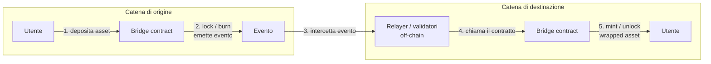
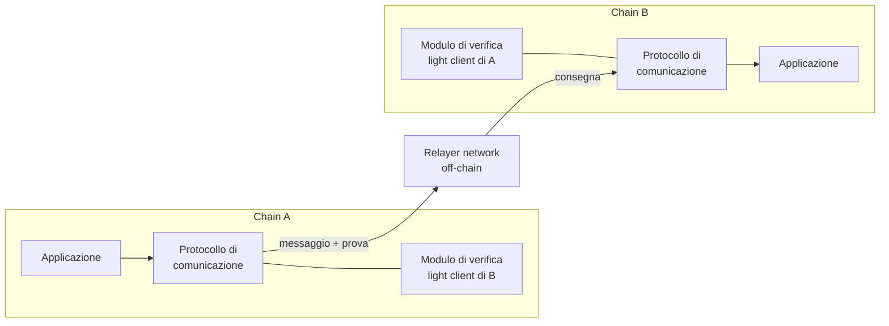
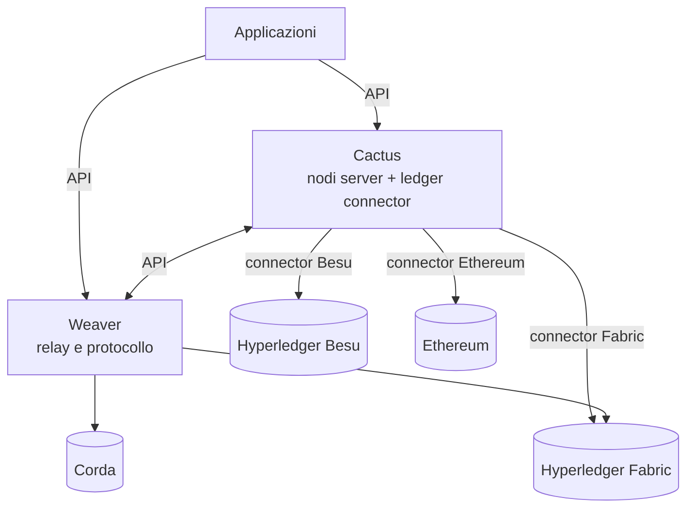
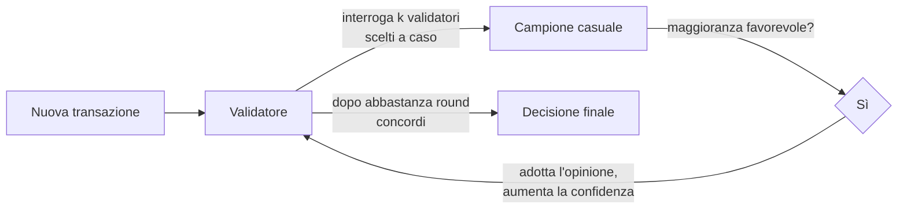
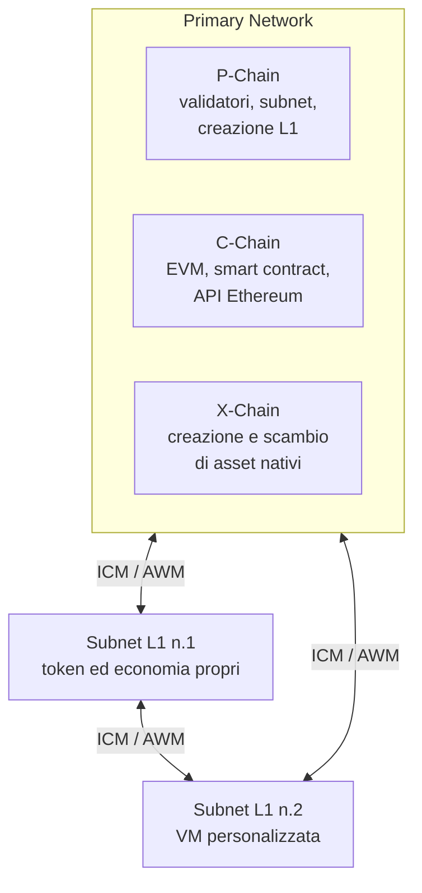
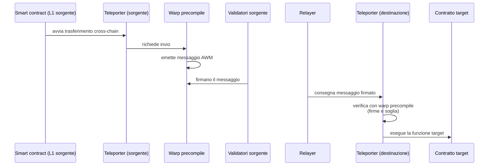
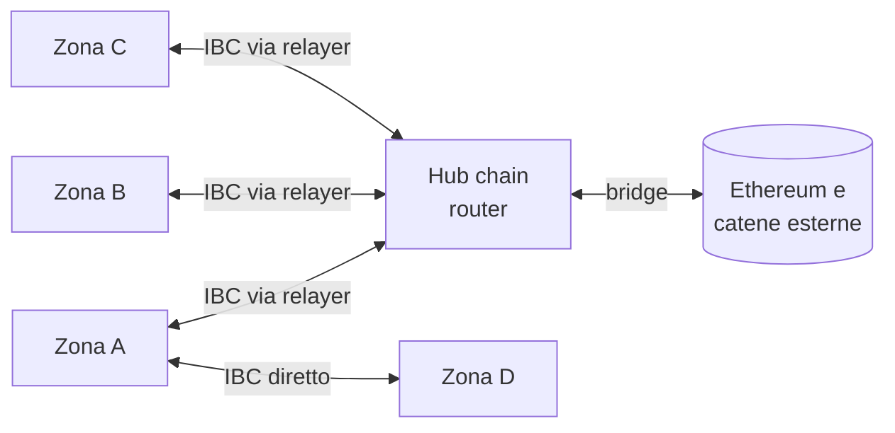
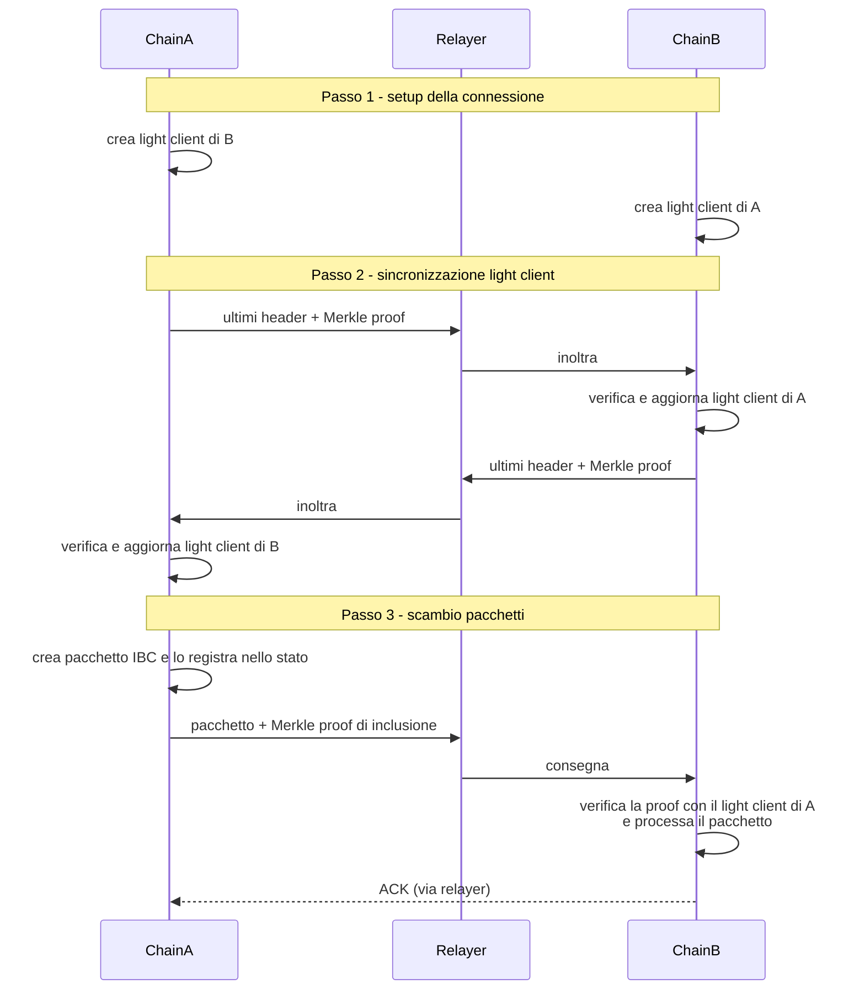

---
tags:
  - università/p2p-blockchain
  - interoperabilità
  - cross-chain
  - bridge
  - cosmos-ibc
  - avalanche
  - hyperledger-cacti
data: 2026-05-14
lezione: "L21 - Guest lecture: Blockchain interoperability in a nutshell"
professore: "Domenico Tortola (guest lecture)"
---

# Interoperabilità tra blockchain

> [!note] Seminario ospite
>
> Questa lezione è una *guest lecture* tenuta da Domenico Tortola (dottorando, Università di Pisa / IIT-CNR). Come gli altri seminari ospiti è in genere **meno centrale per l'orale** rispetto ai grandi argomenti del corso. Ha però diversi punti di contatto con argomenti chiesti all'esame: i **light client** e le **Merkle proof** (che richiamano i nodi SPV di Bitcoin) e i **rollup** di Ethereum (citati tra le proposte di tesi). Vale la pena conoscere la distinzione tra interoperabilità **bridge-based** e **nativa**, i componenti di un sistema cross-chain (moduli di verifica e relayer) e il funzionamento di **IBC** in Cosmos.

Il corso ha studiato Bitcoin ed Ethereum come sistemi autonomi, ciascuno con il proprio stato, il proprio consenso e la propria valuta. Oggi però esistono centinaia di blockchain, e ciascuna tende a diventare un **silo**: un ambiente molto grande ma **isolato** dagli altri, in cui asset e dati non possono uscire. Un utente che possiede ETH non può usarli direttamente su un'altra catena; uno smart contract su Ethereum non può leggere lo stato di una catena diversa. L'**interoperabilità** è la risposta a questo problema.

---

## Che cos'è l'interoperabilità

> [!definition] Blockchain interoperability
>
> L'**interoperabilità tra blockchain** è la capacità delle blockchain di **comunicare con altre blockchain**. È una contromisura alle **blockchain silo**, ambienti molto grandi e isolati dagli altri.

Il relatore distingue due tipi di interoperabilità, che rispondono a esigenze diverse:

- **bridge-based** (basata su ponti): una connessione tra blockchain **già esistenti**, progettata per **scambiare asset**;
- **nativa** (*native*): framework o piattaforme che danno agli sviluppatori **pieno controllo** su cosa stanno sviluppando e su come lo fanno, con l'interoperabilità integrata a livello di protocollo.

---

## Interoperabilità bridge-based

### Obiettivo e meccanismo

L'obiettivo dei **bridge** è facilitare lo **scambio di asset digitali** (criptovalute, token) tra blockchain diverse. Il meccanismo di base è il seguente: sulla catena si installa uno **smart contract dedicato**; dei **custodi** (*custodians*) gestiscono gli asset sulla catena di origine, mentre **relayer** o **validatori off-chain** gestiscono lo spostamento dell'asset.

Il trasferimento vero e proprio non sposta fisicamente nulla: gli asset vengono **bloccati** (*locked*) o **bruciati** (*burned*) sulla catena di origine, e sulla catena di destinazione viene **coniato** (*minted*) o **sbloccato** (*unlocked*) un **wrapped asset** (asset "avvolto"), cioè una **rappresentazione con lo stesso valore** dell'originale.

> [!example] Wrapped asset
>
> Un esempio classico è **WBTC** (*Wrapped Bitcoin*): i BTC vengono bloccati presso un custode, e su Ethereum viene coniato un token ERC-20 che vale 1:1 un BTC e che può essere usato nei protocolli DeFi di Ethereum. Per riavere i BTC si bruciano i WBTC e il custode sblocca i BTC originali. *(Esempio non presente nelle slide.)*

I bridge sono implementati tra blockchain esistenti (le slide citano Ethereum ↔ Bitcoin o le sidechain di Polygon) e sono spesso progettati per contesti **DeFi**.

*Fig. — Funzionamento di un bridge: lock/burn sulla catena di origine, relayer off-chain che osserva l'evento, mint/unlock del wrapped asset sulla destinazione.*

### Bridge e reti di relayer

I meccanismi burn/mint o lock/unlock sulle catene collegate sono orchestrati da **bridge**, da **reti di relayer**, o da entrambi a seconda dell'implementazione:

- i **relayer** sono entità **off-chain e indipendenti** che ricevono una **ricompensa** se consegnano una transazione cross-chain;
- i **bridge** sono di solito un **insieme di smart contract**, installati su **entrambe** le catene, che emettono eventi specifici per innescare le operazioni.

I due componenti possono lavorare **in sinergia**: i contratti del bridge emettono eventi, i relayer li intercettano ed eseguono la propria logica (come nella figura sopra).

### Pro e contro

Tra i **vantaggi**: una gestione efficiente di token e liquidità, e una riduzione effettiva del problema delle blockchain silo.

Tra gli **svantaggi**: i bridge **possono essere centralizzati**, perché bisogna **fidarsi ciecamente dei relayer** (o dei custodi); e rappresentano una **possibile minaccia alla sicurezza**, essendo spesso bersaglio di hacker.

> [!warning] Attenzione
>
> Il bridge concentra in un unico contratto (o presso pochi custodi) enormi quantità di asset bloccati che garantiscono i wrapped asset sull'altra catena: se un attaccante riesce a far coniare wrapped asset senza un lock corrispondente, o a sbloccare gli asset originali senza bruciare quelli wrapped, il "sottostante" viene svuotato. Per questo molti dei più grandi furti nella storia delle criptovalute hanno colpito bridge (es. Ronin, Wormhole, 2022). *(Esempi non presenti nelle slide.)*

---

## Interoperabilità nativa

### Il concetto chiave: prima la rete, poi l'applicazione

Nell'interoperabilità nativa il principio è rovesciato: **si costruisce prima la rete, poi l'applicazione**. L'interoperabilità è gestita a **livello di protocollo** da tre componenti:

- un **protocollo di comunicazione**, che definisce **come vengono trasferiti i dati**;
- un **modulo di verifica** (*verification module*, es. **light client**), che assicura la **consistenza dello stato** e certifica l'**integrità dei dati cross-chain**;
- **entità off-chain** (es. **relayer**) che eseguono la logica cross-chain del protocollo.

A differenza dei bridge, che **simulano** un trasferimento (bloccando da una parte e coniando una copia dall'altra), qui i **dati vengono effettivamente trasferiti** tra le catene coinvolte. Inoltre è supportato lo scambio **multi-hop**, che coinvolge **più di due catene**.

*Fig. — Architettura dell'interoperabilità nativa: protocollo di comunicazione, modulo di verifica su ogni catena e rete di relayer.*

### Moduli di verifica

Il **modulo di verifica**, presente su **ciascuna** catena, ha il compito di **verificare lo stato della catena** prima di procedere con lo scambio cross-chain. Le slide ne presentano due tipi:

- **light client**: verificano lo stato della catena controparte e generano una **prova crittografica** da accoppiare al messaggio;
- **signature-based** (basati su firme): un **validatore** deve apporre la propria **firma crittografica** al messaggio cross-chain.

> [!tip] Il modulo di verifica definisce la sicurezza
>
> Il modulo di verifica ha un ruolo enorme nella sicurezza complessiva del sistema, perché **definisce le ipotesi di sicurezza** necessarie per considerare sicuro il sistema cross-chain. Con un light client ci si fida solo della crittografia e del consenso della catena controparte; con uno schema a firme ci si deve fidare anche dell'**onestà dei validatori** che firmano.

> [!warning] Collegamento con argomenti chiesti all'esame
>
> Il **light client** è lo stesso concetto dei nodi **SPV** (*Simplified Payment Verification*) di Bitcoin, chiesti all'orale insieme alle **Merkle proof**: un nodo leggero conserva solo gli **header** dei blocchi e verifica che un dato (una transazione, un pacchetto) faccia parte dello stato tramite una **Merkle proof** rispetto alla radice contenuta nell'header. In IBC (vedi sotto) una catena mantiene un light client dell'altra esattamente in questo modo.

### Rete di relayer

La **rete di relayer** è responsabile dell'esecuzione "fisica" del **trasferimento dei dati** tra le catene. I relayer sono di solito **off-chain** e possono essere un pool indipendente o essere legati a specifici canali di comunicazione tra catene. **Competono** per consegnare i messaggi (di solito con politica **FCFS**, *First Come First Served*: il primo che consegna viene ricompensato) e ricevono una ricompensa se riescono.

La **decentralizzazione** della rete di relayer è cruciale: un relayer singolo o centralizzato creerebbe un **punto singolo di fallimento** per l'intero protocollo cross-chain, oltre che una minaccia alla sicurezza.

### Pro e contro

Tra i **vantaggi**: pieno controllo sulla topologia di rete e sullo sviluppo dell'applicazione; maggiore **sicurezza**, perché le ipotesi di sicurezza sono minori o più rilassate e non ci sono punti singoli di fallimento.

Tra gli **svantaggi**: è **complessa da costruire** e richiede molte risorse; la gestione della rete (e dei relativi errori) è a carico dello sviluppatore, specialmente negli scambi **multi-hop**.

### Bridge o interoperabilità nativa?

> [!abstract] Quando usare cosa
>
> I **bridge** sono preferibili quando il focus è la **gestione dei token** e possiamo costruire la nostra logica su **catene esistenti**. L'**interoperabilità nativa** è preferibile quando serve costruire una **logica profonda** e vogliamo **più controllo sulla topologia** della rete.

| | Bridge-based | Nativa |
|---|---|---|
| Obiettivo | Scambio di asset | Comunicazione generica (dati, logica) |
| Catene | Esistenti | Costruite per interoperare |
| Trasferimento | Simulato (lock/burn + mint/unlock) | Dati effettivamente trasferiti |
| Numero di catene | Tipicamente 2 | Multi-hop |
| Fiducia | Nei relayer/custodi | Nel modulo di verifica (es. light client) |
| Complessità | Minore | Maggiore |

Il resto della lezione si concentra sull'interoperabilità nativa, discutendo tre approcci diversi: **Hyperledger Cacti** (interoperabilità tra blockchain permissioned e permissionless), **Avalanche** (interoperabilità nativa tra Layer 1) e **Cosmos** (blockchain su misura e interconnesse).

---

## Hyperledger Cacti

**Hyperledger Cacti** è uno **stack tecnologico middleware** sviluppato dalla Hyperledger Foundation che abilita l'interoperabilità tra **blockchain eterogenee**. Non implementa una nuova blockchain né nulla on-chain: è un **framework da integrare in reti esistenti**. Attualmente è in grado di collegare prodotti Hyperledger (Fabric, Besu, ecc.), Corda ed Ethereum, e supporta molti linguaggi di programmazione (JavaScript, Go, Java, Solidity). È ancora in fase iniziale.

Cacti nasce dalla fusione di due progetti preesistenti:

- **Hyperledger Cactus** permette di interfacciare i nodi delle catene esistenti con dei **nodi server**, responsabili dei trasferimenti cross-chain, e di definire dei **ledger connector** specifici, personalizzati per ciascuna DLT da collegare, che eseguono l'SDK della catena e un **adattatore di protocollo** per non perdere generalità;
- **Weaver** gestisce l'interoperabilità a livello di **relay e protocollo**.

Entrambi funzionano tramite **API** (per collegarsi tra loro, con i nodi delle catene e con le applicazioni). Il risultato è che **non servono relayer o validatori**: l'interoperabilità è **peer-to-peer diretta**.

*Fig. — Architettura (semplificata) di Hyperledger Cacti come unione di Cactus e Weaver, collegati via API alle catene e alle applicazioni.*

> [!note] Integrazione
>
> Le slide mostrano le architetture di Cactus, Weaver e dell'insieme solo in forma grafica; il diagramma qui sopra è una semplificazione basata sul testo delle slide.

**Quando usare Cacti:**

- quando serve un collegamento cross-chain con **prodotti Hyperledger**: Cacti è lo strumento migliore per collegare i prodotti Hyperledger a Ethereum e alle altre catene supportate;
- quando si hanno **catene eterogenee** da collegare: grazie alle API non bisogna "forzare" tutti i partecipanti ad adottare un unico protocollo;
- quando il **deploy è semplice**: installare e orchestrare tutti i componenti di Cacti può non scalare adeguatamente in deploy complessi;
- quando gli **aspetti economici sono secondari**: i prodotti Hyperledger in generale non costruiscono un sistema economico/token/crypto nativo.

---

## Avalanche

### Architettura generale

**Avalanche** è un ecosistema blockchain **Layer 1** che usa la criptovaluta **AVAX**, progettato per essere scalabile e per supportare pienamente l'**interoperabilità nativa tra L1**. La rete Avalanche è composta da una **primary network**, che contiene tutti i componenti centrali dell'ecosistema, e da una serie di **subnet L1 indipendenti e sovrane**, con le proprie economie di token, che comunicano tra loro.

### Consenso: Snowball

Avalanche implementa il protocollo di consenso **Snowball**, che funziona in modo **probabilistico**. Quando una transazione viene presentata a un validatore, questi interroga un **sottoinsieme casuale** di altri validatori chiedendo la loro "opinione". Se sono favorevoli alla transazione, il validatore diventa a sua volta favorevole. Questo si ripete per ciascun validatore coinvolto, facendo **crescere a valanga** (*snowballing*) l'opinione più popolare.

Nonostante sia probabilistico, il consenso raggiunge una **finalità rapida** con un buon livello di **scalabilità**. È usato in tutte le catene Avalanche, anche se il consenso è personalizzabile.

*Fig. — Snowball: campionamento casuale ripetuto finché l'opinione più diffusa si consolida.*

> [!note] Collegamento
>
> Rispetto al Proof of Work di Bitcoin, in cui la finalità è solo probabilistica e cresce con il numero di conferme (circa un'ora per 6 blocchi), Snowball raggiunge una finalità (anch'essa probabilistica, ma con probabilità di errore trascurabile) in pochi secondi, perché ogni validatore comunica solo con un piccolo campione e non con tutta la rete. *(Confronto non presente nelle slide.)*

### La primary network: P-Chain, C-Chain, X-Chain

La primary network di Avalanche è composta da **tre blockchain**, ciascuna con un ruolo specifico.

La **Platform Chain (P-Chain)** gestisce le operazioni di Layer 1: l'attività dei validatori, il consenso e le subnet. Espone API per **creare nuove blockchain L1**, **aggiungere nuovi validatori** e le chiamate RPC standard (`getBlock`, `getBalance`, `getBlockchains`, `getValidators`). Tutte le API rispondono in formato JSON-RPC 2.0.

La **Contract Chain (C-Chain)** è un'implementazione dell'**EVM** per Avalanche, usata per interoperare con Ethereum. Ospita molti contratti popolari su Ethereum (servizi DeFi, token noti, giochi) che girano anche su Avalanche, ed espone tutte le **API Ethereum standard** (quelle fornite dai provider RPC come Infura o Alchemy): `getTransaction` (per hash, per blocco, ecc.), `getBlock`, `getGasFee` e altre.

La **Exchange Chain (X-Chain)** gestisce gli **asset digitali** (gli *Avalanche Native Tokens*) sull'L1. Un asset digitale è la rappresentazione di una risorsa del mondo reale, governata da un insieme di regole che ne definiscono il comportamento e l'uso. La X-Chain espone API dedicate alla **creazione e al trasferimento** di tali asset.

*Fig. — La rete Avalanche: primary network con le tre catene e subnet L1 sovrane che comunicano tramite ICM.*

### Subnet

Al di fuori della primary network ci sono le **subnet**. Una subnet è un **insieme di validatori** responsabile dell'esecuzione di **una o più blockchain L1**. I vantaggi delle L1 di Avalanche sono che sono **gratuite da creare** e altamente **personalizzabili**; possono implementare i **propri token** e la propria economia, senza limiti né vincoli con le altre catene L1 (se non esplicitamente definiti); possono essere configurate come **pubbliche o private**; possono eseguire l'**EVM** o altre VM personalizzate (ad es. **WASM**).

Una subnet si crea con la **Avalanche CLI** (`avalanche blockchain create mychain`), personalizzando SDK, consenso e così via, e si installa con `avalanche blockchain deploy mychain --local`. Il deploy locale è semplice, mentre quello su testnet/mainnet richiede fondi, account e (per la mainnet) un full node.

### Interoperabilità in Avalanche: ICM e AWM

L'interoperabilità di Avalanche è implementata nativamente tramite **ICM** (*Interchain Messaging*), costruito sopra **AWM** (*Avalanche Warp Messaging*). AWM fornisce le **primitive** (firme, messaggi), mentre ICM gestisce la parte di "**rete**" (formattazione, verifica ed esecuzione dei messaggi).

Sono coinvolti due componenti principali:

- il **Warp precompile** (contratto precompilato) permette agli smart contract di usare AWM: codifica i messaggi, emette eventi AWM, verifica firme e soglie;
- il **Teleporter** è un protocollo a livello applicativo che gestisce il **ciclo di vita** del messaggio, si interfaccia con i relayer, gestisce i pacchetti di **ACK** e la logica di errore.

Il flusso di un messaggio ICM è il seguente:

*Fig. — Ciclo di vita di un messaggio ICM in Avalanche.*

> [!tip] Il modello di sicurezza di Avalanche
>
> Il modulo di verifica di Avalanche è di tipo **signature-based**: la catena di destinazione accetta il messaggio se è firmato da una soglia sufficiente dei validatori della catena sorgente. La sicurezza dipende quindi dall'**onestà di quei validatori**. È proprio questa ipotesi che una delle proposte di tesi (vedi sotto) cerca di rilassare.

### Quando usare Avalanche

- **Applicazioni che devono essere veloci**: il throughput è alto e le transazioni vengono finalizzate molto rapidamente (app di trading, giochi, ecc.);
- **applicazioni personalizzate senza "reinventare la ruota"**: le subnet offrono un ragionevole controllo e personalizzazione, sfruttando la rete Avalanche per le primitive e le operazioni centrali;
- **quando Avalanche basta**: non serve collegarsi ad altre blockchain, ad esempio quando si progetta un'applicazione da zero.

---

## Cosmos

### Architettura: zone, hub e relayer

**Cosmos** è un framework per la creazione di **blockchain personalizzabili**, dette **zone**. Le zone sono collegate tra loro **direttamente** o attraverso un **hub**; le comunicazioni sono gestite da **relayer off-chain**, e il protocollo di comunicazione usato è **IBC** (*Inter-Blockchain Communication*).

Le **zone** sono blockchain **indipendenti e personalizzabili** all'interno di un'applicazione Cosmos. Possono essere **pubbliche** (collegate all'Hub pubblico) o far parte di una **rete privata**. Usano la criptovaluta **ATOM** ed eseguono il consenso **Tendermint**, un consenso **a round** in cui ogni round è un tentativo di raggiungere l'accordo sul blocco successivo. Le zone si creano e gestiscono tramite il **Cosmos SDK**, attraverso la **Ignite CLI**, e memorizzano lo **stato della catena come un Merkle tree**.

> [!note] Integrazione
>
> Tendermint (oggi CometBFT) è un consenso **BFT** (*Byzantine Fault Tolerant*) basato su Proof of Stake: in ogni round un proponente propone un blocco e i validatori votano in due fasi (*prevote* e *precommit*); il blocco è finale quando ottiene i voti di oltre 2/3 del potere di voto. Garantisce quindi **finalità immediata**, a differenza del PoW. *(Dettagli non presenti nelle slide.)*

La **hub chain** fa da **router** per le comunicazioni tra le zone collegate; a un hub si può collegare un numero qualsiasi di zone. Esiste un **Cosmos Hub pubblico**, responsabile anche del collegamento delle zone a Ethereum e ad altre blockchain esterne; è anche la catena analizzata dai *blockchain explorer*. Si possono installare anche **hub privati** al servizio di reti più ristrette.

I **relayer** sono entità off-chain responsabili dell'esecuzione dei trasferimenti cross-chain. Ogni relayer può servire solo le catene a cui è collegato, e può essere collegato a qualsiasi numero di catene attraverso **canali** (*channels*). Se più relayer servono la stessa catena, **competono** per consegnare i pacchetti IBC (FCFS). Soprattutto, **i relayer non sono fidati**: la sicurezza è garantita da IBC, non da loro. Un relayer malevolo può al massimo non consegnare un pacchetto, ma non può falsificarlo, perché la catena di destinazione lo verifica crittograficamente.

*Fig. — Topologia di Cosmos: zone collegate direttamente o tramite un hub, con comunicazione IBC.*

### Il protocollo IBC

Il protocollo **IBC** definisce gli standard di comunicazione nelle applicazioni Cosmos. Può essere visto come un protocollo a **due livelli**:

- il **livello applicativo**: formato e gestione dei pacchetti, standard come **ICS-20** (l'equivalente Cosmos di ERC-20, per il trasferimento di token fungibili), ecc.;
- il **livello di trasporto**: light client, canali, interfacce con i relayer, ecc.

La comunicazione IBC avviene in tre passi.

**Passo 1: setup della connessione.** La ChainA crea un **light client della ChainB**, e la ChainB crea un light client della ChainA. I light client sono usati da una catena per **verificare crittograficamente lo stato della controparte**: con un light client aggiornato e verificato, una catena può sempre fidarsi dell'altra.

**Passo 2: sincronizzazione dei light client.** La ChainA invia alla ChainB i suoi **ultimi header di blocco**, accompagnati da una **Merkle proof** che ne attesta la presenza nel suo stato. La ChainB verifica la prova e aggiorna il suo light client. Lo stesso viene fatto dalla ChainB verso la ChainA. A questo punto i light client sono aggiornati, verificati crittograficamente e fidati.

**Passo 3: scambio di pacchetti IBC.** La ChainA crea un **pacchetto IBC**, lo **registra nel proprio stato** (*commit*) e lo invia alla ChainB con una **Merkle proof della sua inclusione**. La ChainB verifica la prova (usando il light client di A, che conosce la radice dello stato di A) e processa il pacchetto. Il processo si ripete per ogni pacchetto da trasmettere.

*Fig. — I tre passi di IBC: setup dei light client, loro sincronizzazione, scambio di pacchetti con Merkle proof.*

> [!warning] Attenzione
>
> La comunicazione **non è bidirezionale** di per sé: per comunicare servono un **canale** e light client aggiornati. Inoltre gli scambi **multi-hop** (A → hub → B) **non sono atomici**: se un passaggio intermedio fallisce, i passaggi precedenti non vengono annullati automaticamente, e la gestione degli errori è a carico dello sviluppatore.

> [!tip] Perché i relayer non devono essere fidati
>
> Tutto ciò che il relayer trasporta (header, pacchetti) è accompagnato da prove crittografiche verificate on-chain dalla catena di destinazione, che confronta la Merkle proof con la radice dello stato presente nell'header già verificato dal light client. L'**unica ipotesi di sicurezza** è la correttezza del light client, a sua volta verificata crittograficamente. È la differenza fondamentale rispetto ai bridge, dove si deve fidarsi dei relayer.

Gli sviluppatori definiscono come gestire i pacchetti IBC tramite **quattro funzioni**:

- `SendPacket`: invia un pacchetto IBC o di ACK su un canale disponibile;
- `OnRecvPacket`: callback invocata alla ricezione di un pacchetto IBC;
- `OnAckRecvPacket`: callback invocata alla ricezione di un pacchetto di ACK;
- `OnTimeout`: logica di gestione dell'errore di timeout.

### Ignite CLI

La **Ignite CLI** è uno strumento per sviluppare applicazioni Cosmos, costruito sopra il Cosmos SDK e integrato con le primitive IBC per un'esperienza di sviluppo tutto-in-uno. Genera automaticamente (*scaffolding*) gran parte del codice, lasciando agli sviluppatori la sola logica applicativa: creazione, test e deploy della catena, operazioni CRUD, front-end, RPC, funzioni IBC e molto altro.

### Quando usare Cosmos

- **Quando si costruisce da zero**: con Cosmos si ottengono blockchain **sovrane e indipendenti**;
- **quando la sicurezza è una priorità**: light client e Merkle proof offrono un livello di sicurezza elevato, e la correttezza del light client (verificata crittograficamente) è l'**unica ipotesi di sicurezza**;
- **quando non serve un ecosistema eterogeneo**: la gestione delle catene di Cosmos e IBC offrono uno stack molto standardizzato su cui costruire.

### Confronto tra i tre approcci

| | Hyperledger Cacti | Avalanche | Cosmos |
|---|---|---|---|
| Natura | Middleware su reti esistenti | Ecosistema L1 con primary network e subnet | Framework per zone sovrane |
| Consenso | Quello delle catene collegate | Snowball (probabilistico) | Tendermint (a round, BFT) |
| Comunicazione | API, P2P diretto (Cactus + Weaver) | ICM su AWM (Warp + Teleporter) | IBC |
| Verifica | Tramite connector/relay | Firme dei validatori (signature-based) | Light client + Merkle proof |
| Token | Nessun sistema economico nativo | AVAX | ATOM |
| Ideale per | Catene eterogenee, Hyperledger | Applicazioni veloci, personalizzate | Costruire da zero con alta sicurezza |

---

## Casi d'uso e applicazioni

In teoria quasi ogni applicazione blockchain può essere implementata in versione cross-chain, ma **non sempre ne vale la pena**. I casi d'uso migliori sono i **servizi DeFi multi-catena** per i bridge, e le **applicazioni in cui entità distinte vogliono cooperare** per i framework nativi.

### SushiSwap

**SushiSwap** è un **DEX** (exchange decentralizzato, vedi [[L20 - Applicazioni reali con Smart Contract]]) che sfrutta i bridge cross-chain per operare su più catene. È nato nel 2020 come **fork comunitario** del celebre DEX **Uniswap** ed è focalizzato sulla gestione di asset tra catene diverse; è attivo su Ethereum, Avalanche, Polygon, Arbitrum e altre.

SushiSwap usa **LayerZero** come tecnologia di bridging. LayerZero è composto da **endpoint**, installati come smart contract su ciascuna catena collegata. La componente off-chain è formata da **relayer**, che trasportano i dati delle transazioni, e da **oracoli**, che forniscono gli header dei blocchi. Questo garantisce **decentralizzazione** (la sicurezza richiede che relayer e oracolo non colludano) e **generalità** (può collegare blockchain eterogenee).

### Supply chain per la sostenibilità

Una **supply chain** è il macro-processo che copre la produzione di un prodotto (vedi anche la supply chain di Alpha in L20). Diversi progetti "green" sono legati alle supply chain:

- i **carbon credit** (crediti di carbonio), una sorta di "premio" per le aziende che riducono le emissioni di CO2;
- il **product passport** (passaporto di prodotto), una raccolta di dati sul prodotto accessibile ai clienti.

Il relatore confronta tre possibili progettazioni.

**Con Hyperledger.** Il principio di progetto è avere più catene per le aziende (installate con Fabric/Besu), collegate con Cacti. **Pro**: sviluppo semplice degli smart contract, possibilità di implementare una gestione sicura dei carbon credit collegando le catene a Ethereum. **Contro**: difficile installare reti estese; il passaporto **non è verificabile da entità esterne** (autorità, clienti).

**Con Avalanche.** Il principio è avere più subnet per le aziende, collegate con ICM. **Pro**: facile implementazione dei carbon credit sulla C-Chain, scalabilità indipendente dal numero di subnet, comunicazione efficiente per le attività della supply chain. **Contro**: tutti i dati stanno su una blockchain **pubblica** (non ideale per il passaporto e per i dati aziendali in generale); le operazioni possono diventare costose a seconda delle oscillazioni del prezzo di AVAX.

**Con Cosmos.** Il principio è avere più zone per le aziende, collegate direttamente o tramite un hub nei deploy più grandi. **Pro**: scalabile, possibilità di implementare sia i passaporti sia la gestione dei carbon credit. **Contro**: lo sviluppo più difficile, la rete va progettata e installata da zero, e se si usano hub lo sviluppo è ancora più difficile (per via dei multi-hop).

---

## Proposte di tesi

L'ultima parte della lezione presenta alcune proposte di tesi magistrale del gruppo. Sono utili anche per capire le frontiere di ricerca collegate agli argomenti del corso.

**Distributed smart contracts.** Gli smart contract sono di solito installati su una sola blockchain e possono accedere solo a variabili e funzioni di quella catena. Un compromesso è interrogare **oracoli** per ottenere dati off-chain certificati, ma ciò non sfrutta davvero l'interoperabilità. L'obiettivo è progettare e implementare smart contract che possano accedere a variabili, funzioni e asset **su più catene** sfruttando le tecnologie cross-chain invece degli oracoli. Casi d'uso: metaverso, controllo degli accessi.

**Confidential NFTs.** Gli NFT seguono lo standard **ERC-721** e rappresentano asset digitali creati e scambiati on-chain; come ogni altro token sono **trasparenti** e pubblicamente accessibili. E se volessimo privacy? L'obiettivo è usare la **cifratura omomorfica** (che permette di calcolare su dati cifrati) per progettare NFT confidenziali. Casi d'uso: licenze, product passport.

**Securing Avalanche cross-chain exchanges.** La sicurezza degli scambi cross-chain di Avalanche è basata su firme e si fonda sull'ipotesi che i validatori firmatari siano **onesti**. Rilassando questa ipotesi, ad esempio con **Zero-Knowledge Proof** o **verifiable computing**, la sicurezza dovrebbe migliorare. L'obiettivo è integrare uno schema ZKP (snarkJS? RISC0?) nel protocollo ICM.

**Optimizing L2 rollups with ML.** Nei **rollup**, il nodo **sequencer** è responsabile di registrare (*commit*) le transazioni L2 su Ethereum, e di solito invia il batch quando raggiunge una certa dimensione. L'obiettivo è integrare tecniche di **machine learning** nel sequencer per trovare il **momento ottimale** in cui inviare il batch, usando dati storici su prezzo di ETH e del gas, prezzo del gas L2, congestione di rete e dimensione dei batch inviati.

> [!warning] Chiesto all'esame
>
> I **rollup** di Ethereum sono stati chiesti all'orale, nell'ambito delle soluzioni di scalabilità di Bitcoin ed Ethereum (insieme a Lightning Network, dimensione dei blocchi, intervallo tra blocchi) e del *blockchain trilemma*. Il ruolo del **sequencer** che raccoglie le transazioni L2 in batch e le registra su L1 è un elemento centrale della risposta; per la trattazione completa si rimanda alla lezione sui rollup.

**Cross-chain decentralized AI.** Negli schemi tradizionali di AI/*Federated Learning* (FL) basati su blockchain, i client addestrano modelli in modo collaborativo, usando **IPFS** per memorizzare i risultati e la blockchain come supporto di **notarizzazione** degli hash. Tecnologie cross-chain come Cosmos potrebbero integrare meglio la blockchain in questo flusso: i client vivrebbero su catene separate e si scambierebbero dati, parametri e risultati locali. L'obiettivo è progettare e sviluppare un processo di addestramento cross-chain per modelli AI/FL.

---

> [!question] Possibili domande d'esame
>
> - Che cos'è l'interoperabilità tra blockchain e perché è necessaria? Che cosa si intende per "blockchain silo"?
> - Descrivi il funzionamento di un bridge (lock/burn, mint/unlock, wrapped asset). Quali sono i suoi vantaggi e i suoi rischi?
> - Qual è la differenza tra interoperabilità bridge-based e nativa? Quali sono i componenti dell'interoperabilità nativa?
> - Che ruolo hanno moduli di verifica e relayer? Perché il modulo di verifica determina le ipotesi di sicurezza?
> - Descrivi il protocollo IBC di Cosmos nei suoi tre passi. Perché i relayer non devono essere fidati? Che collegamento c'è con i nodi SPV e le Merkle proof?
> - Descrivi l'architettura di Avalanche (primary network, P/C/X-Chain, subnet), il consenso Snowball e il funzionamento di ICM/AWM.
> - Confronta Hyperledger Cacti, Avalanche e Cosmos: quando conviene usare ciascuno?

> [!abstract] Sintesi
>
> L'**interoperabilità** permette alle blockchain di comunicare, superando il problema delle **blockchain silo**. I **bridge** collegano catene esistenti per scambiare asset: bloccano/bruciano l'asset sulla catena d'origine e coniano/sbloccano un **wrapped asset** sulla destinazione, orchestrati da smart contract e **relayer**; sono efficienti ma spesso centralizzati e bersaglio di attacchi. L'**interoperabilità nativa** ("prima la rete, poi l'applicazione") integra a livello di protocollo un **protocollo di comunicazione**, un **modulo di verifica** (light client o firme dei validatori, che definisce le ipotesi di sicurezza) e una **rete di relayer** decentralizzata; trasferisce davvero i dati e supporta il multi-hop, al prezzo di maggiore complessità. **Hyperledger Cacti** (Cactus + Weaver) è un middleware via API per catene eterogenee, soprattutto Hyperledger. **Avalanche** ha una primary network (P-Chain, C-Chain con EVM, X-Chain) e subnet L1 sovrane, consenso probabilistico **Snowball** e interoperabilità **ICM/AWM** basata su firme dei validatori. **Cosmos** collega **zone** sovrane (Tendermint, stato come Merkle tree) direttamente o tramite hub con il protocollo **IBC**, basato su light client reciproci e **Merkle proof**, per cui i relayer non devono essere fidati. Casi d'uso: DEX multi-catena come **SushiSwap** (con LayerZero) e supply chain sostenibili (carbon credit, product passport).
