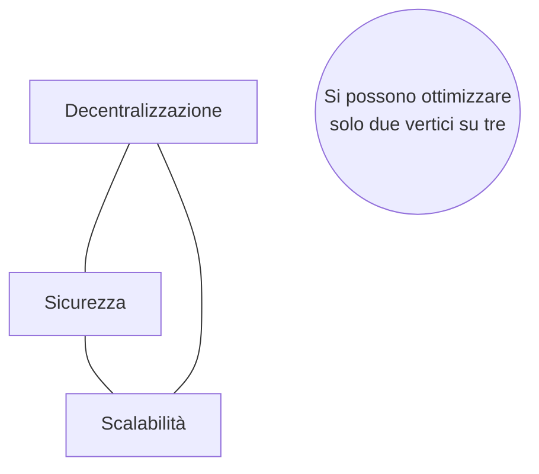
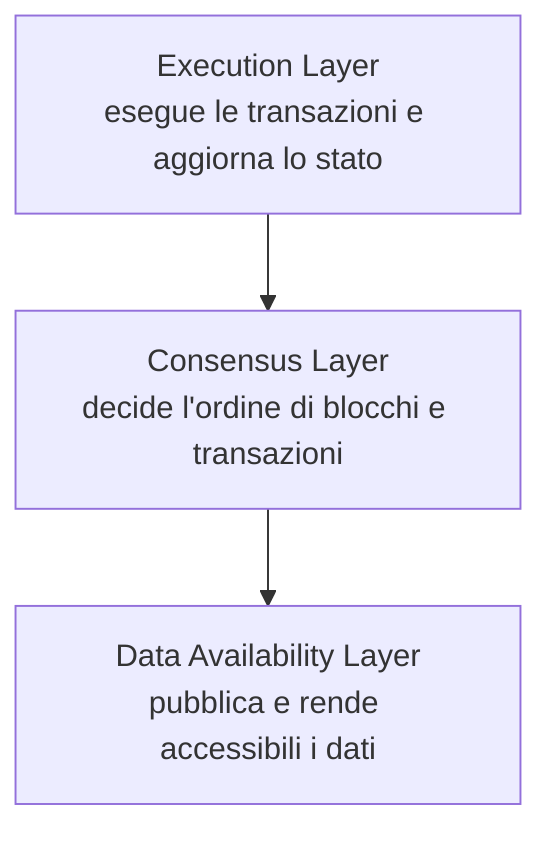
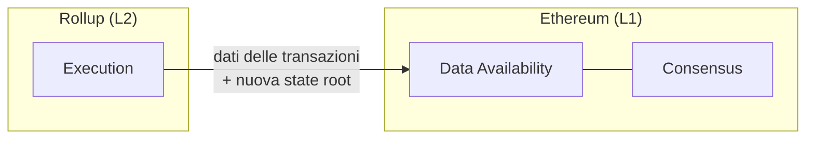
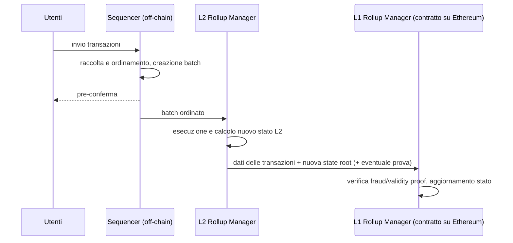
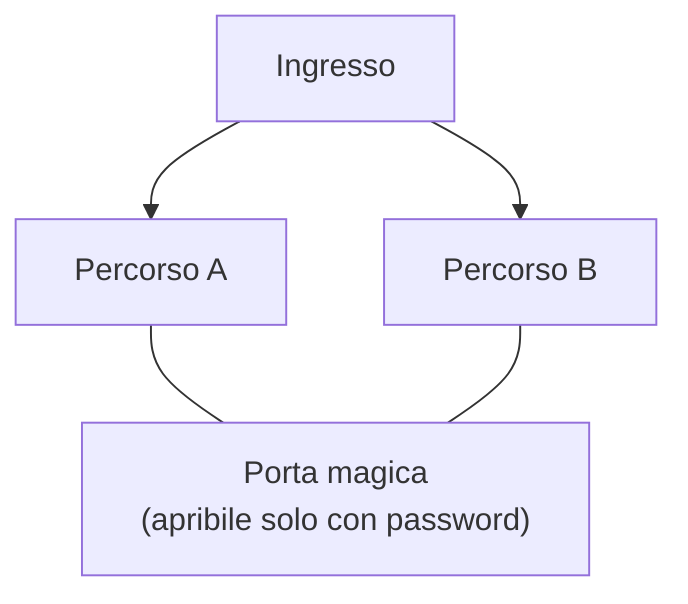
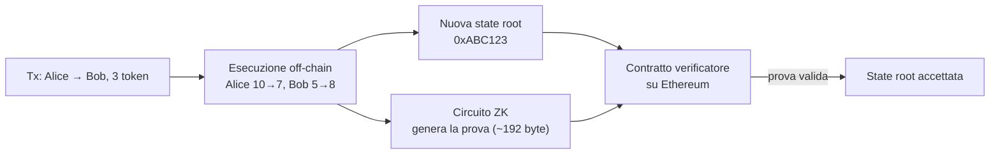
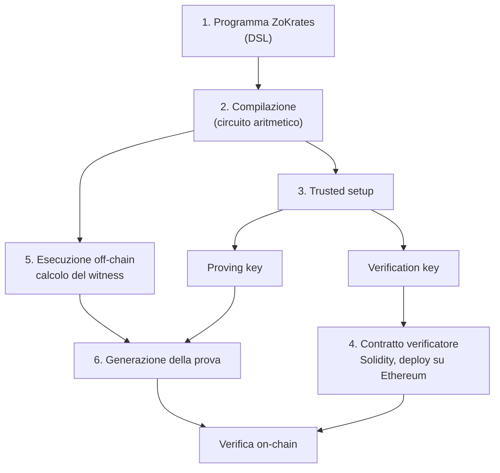

---
tags:
  - università/p2p-blockchain
  - ethereum
  - scalabilità
  - layer-2
  - rollup
  - zero-knowledge
data: 2026-05-19
lezione: "L22 - Ethereum: soluzioni di scaling (Layer 2)"
professore: "Laura Ricci"
---

# Scaling di Ethereum: Layer 2, rollup e zero-knowledge proof

Questa lezione affronta uno dei problemi strutturali di tutte le blockchain pubbliche, cioè la **scalabilità** (*scalability*): la capacità di processare un numero crescente di transazioni senza che i costi e i tempi di conferma esplodano. Nel caso di Ethereum il problema è particolarmente sentito, perché ogni transazione, ogni chiamata a smart contract e ogni aggiornamento di stato deve essere eseguito da tutti i nodi della rete, e lo spazio nei blocchi è limitato dal *gas limit*: quando la domanda cresce, il prezzo del gas sale e usare la rete diventa costoso.

Il filo logico della lezione è il seguente: si parte dal **trilemma della blockchain**, che spiega perché non si può semplicemente "aumentare le prestazioni" del Layer 1; si introduce l'idea di **Layer 2** come strato sovrapposto alla catena principale; si studiano in dettaglio i **rollup**, nelle due varianti *optimistic* e *zero-knowledge*; questo porta a introdurre le **zero-knowledge proof** (prove a conoscenza zero), sia come strumento di verifica della computazione sia come strumento di privacy, con un esempio pratico di "crittografia programmabile" tramite **ZoKrates**. Si chiude con i rischi dei rollup attuali, legati soprattutto alla centralizzazione del *sequencer*.

---

## Il trilemma della blockchain

Le prime slide della lezione riassumono il problema con uno slogan: *"can only optimize two out of three"*, si possono ottimizzare solo due proprietà su tre. È il cosiddetto **blockchain trilemma** (trilemma della blockchain), formulato originariamente da Vitalik Buterin.

> [!note] Nota
>
> Nelle slide il trilemma è presentato tramite figure (non estratte come testo); la spiegazione che segue riporta la formulazione standard, coerente con quanto visto nel corso.

Le tre proprietà in tensione tra loro sono:

- **Decentralizzazione** (*decentralization*): il sistema deve poter essere gestito da un gran numero di partecipanti, senza che serva hardware costoso per far girare un nodo completo; nessuna entità singola deve poter controllare la rete.
- **Sicurezza** (*security*): il sistema deve resistere ad attacchi da parte di una frazione consistente dei partecipanti (ad esempio un attaccante che controlla una quota rilevante di potenza di calcolo o di stake).
- **Scalabilità** (*scalability*): il sistema deve poter gestire un numero elevato di transazioni al secondo, idealmente crescente con la domanda.

L'intuizione è che, se si progetta una blockchain con i meccanismi "semplici" (ogni nodo verifica tutto), migliorare una proprietà peggiora le altre. Per esempio, aumentare la dimensione dei blocchi o ridurre il tempo tra blocchi aumenta il throughput, ma rende più oneroso far girare un nodo completo (più banda, più disco, più CPU): meno persone potranno farlo, e la rete diventa meno decentralizzata. Viceversa, affidare la validazione a pochi nodi molto potenti (come fanno alcune blockchain con pochi validatori selezionati) consente alta scalabilità ma sacrifica la decentralizzazione. Bitcoin ed Ethereum hanno storicamente privilegiato decentralizzazione e sicurezza, pagando in termini di scalabilità.



*Fig. — Il trilemma della blockchain: le tre proprietà sono in tensione reciproca.*

> [!warning] Chiesto all'esame
>
> Il trilemma della blockchain è stato chiesto esplicitamente all'orale, seguito dalla domanda "quali sono i modi per risolvere la scalabilità in Bitcoin ed Ethereum?" e "che cos'è un rollup di Ethereum?". Conviene saper collegare in un unico discorso: trilemma → perché non basta aumentare dimensione o frequenza dei blocchi → soluzioni off-chain (Lightning Network per Bitcoin, rollup per Ethereum).

---

## Come scalare Ethereum

> [!note] Nota
>
> La slide "Scaling Ethereum" è un'immagine. La classificazione seguente è quella standard, usata nella documentazione di Ethereum, e serve a inquadrare il resto della lezione.

Le strategie di scaling si dividono tradizionalmente in due famiglie. Le soluzioni **on-chain** (o di Layer 1) modificano il protocollo della catena principale: aumento del gas limit, riduzione del tempo di blocco, oppure lo *sharding*, cioè la suddivisione del carico tra sottoinsiemi di nodi. Le soluzioni **off-chain** spostano invece il grosso del lavoro fuori dalla catena principale, usando quest'ultima solo come ancora di fiducia: in questa famiglia rientrano i *payment/state channel* (lo stesso principio della Lightning Network di Bitcoin), le *sidechain*, *Plasma* e soprattutto i **rollup**, che oggi rappresentano la strategia principale di scaling di Ethereum.

### Soluzioni off-chain di Layer 2

Nel linguaggio comune ogni soluzione di scalabilità di Ethereum viene chiamata "Layer 2", ma la slide sottolinea che non tutte ricadono davvero in questa categoria. La definizione precisa è la seguente.

> [!definition] Layer 2
>
> Un **Layer 2** è una piattaforma o un servizio che costituisce un *overlay* (sovrapposizione) sopra la catena principale, detta **Layer 1**. Un Layer 2:
> - non deve necessariamente essere una blockchain (può non avere un proprio meccanismo di consenso);
> - **eredita la sicurezza** della rete principale e la sfrutta come **trust anchor** (ancora di fiducia).

Il punto chiave è l'ultimo: un vero Layer 2 non chiede agli utenti di fidarsi di un nuovo insieme di validatori, ma fa in modo che la correttezza del suo stato possa essere garantita, in ultima istanza, da Ethereum stesso. Per questo, ad esempio, una sidechain con un proprio consenso indipendente non è propriamente un Layer 2: la sua sicurezza dipende dai suoi validatori, non da Ethereum.

---

## Rollup: l'idea di fondo

L'idea dei rollup è **cambiare il modo in cui la blockchain viene usata**. Invece di eseguire ogni transazione su Ethereum, si esegue la maggior parte dell'attività **off-chain**, in un protocollo di Layer 2. Su Ethereum si fa il *deploy* di uno smart contract che ha un unico compito: **supportare la verifica di prove** che dimostrano che tutto ciò che è accaduto off-chain ha rispettato le regole corrette.

Esistono più modi per realizzare prove on-chain di attività off-chain, e le due grandi famiglie sono gli **optimistic rollup** e gli **zero-knowledge rollup**. Tutte condividono però la stessa proprietà fondamentale:

> [!tip] Intuizione chiave
>
> Eseguire la computazione off-chain e poi **verificarne le prove on-chain** costa molto meno che eseguire la computazione originale on-chain. Ethereum smette di essere "il computer che esegue tutto" e diventa "il giudice che verifica e archivia".

> [!warning] Chiesto all'esame
>
> "Che cos'è un rollup di Ethereum?" è una domanda già uscita all'orale, in collegamento con trilemma e scalabilità. Bisogna saper spiegare: esecuzione off-chain, pubblicazione su L1 di dati di transazione e state root, differenza tra optimistic (fraud proof, challenge period) e ZK (validity proof).

### Richiamo: i layer fondamentali di una blockchain

Per capire con precisione che cosa un rollup "delega" al Layer 1, la lezione richiama la scomposizione di una blockchain in tre strati funzionali.

Il **Data Availability Layer** (DA, strato di disponibilità dei dati) garantisce che blocchi e transazioni siano pubblicati e accessibili alla rete, e fornisce quindi i dati necessari a calcolare lo stato corrente della blockchain. Il **Consensus Layer** (strato di consenso) decide l'ordinamento dei blocchi e delle transazioni che contengono. L'**Execution Layer** (strato di esecuzione) si occupa di eseguire le transazioni contenute nei blocchi e di aggiornare di conseguenza lo stato della blockchain.



*Fig. — I tre strati funzionali di una blockchain. Una blockchain L1 li implementa tutti e tre.*

### Che cosa sono i rollup

> [!definition] Rollup
>
> Un **rollup** è una blockchain la cui catena e il cui stato possono essere **interamente derivati dal Data Availability layer di una blockchain L1**. A differenza delle catene L1, un rollup implementa **solo il proprio execution layer** e delega (*outsource*) al Layer 1 la gestione di **data availability** e **consenso**.

I rollup di Ethereum sono i più famosi. Ma che cosa significa, concretamente, delegare DA e consenso a una L1? Per il DA, significa che la **storia globale** del rollup (tutte le sue transazioni) è pubblicata su Ethereum: chiunque, leggendo Ethereum, può ricostruire da zero lo stato del rollup. Per il consenso, significa che Ethereum garantisce l'**integrità della storia globale delle transazioni**: una volta pubblicati su L1, i dettagli e l'ordinamento delle transazioni del rollup non possono più essere modificati.



*Fig. — Un rollup implementa solo l'esecuzione e delega consenso e disponibilità dei dati a Ethereum.*

---

## Il ciclo di vita di un rollup

La lezione descrive i componenti che intervengono nella vita di un rollup: il sequencer, il rollup manager di L2, il rollup manager di L1.

### Il sequencer

Il **sequencer** è il componente off-chain che riceve le transazioni degli utenti. Gli utenti inviano le loro transazioni al sequencer (off-chain, non a Ethereum); il sequencer le raccoglie e le **ordina**, produce i **blocchi del rollup**, detti anche **batch**, e fornisce agli utenti una **pre-conferma** (*pre-confirmation*), cioè una promessa rapida che la transazione sarà inclusa, molto prima che il batch venga effettivamente pubblicato su L1. È questa pre-conferma che rende l'esperienza d'uso di un L2 veloce.

### Il rollup manager di L2

Il **L2 rollup manager** applica le regole di transizione per aggiornare lo stato del Layer 2. In pratica esegue le transazioni su L2: prende ogni transazione del batch e ne applica la logica. Se Alice invia 5 token a Bob, il manager aggiorna i saldi di Alice e di Bob nel ledger di L2; se la transazione interagisce con uno smart contract, esegue il codice del contratto. Tutto avviene off-chain, quindi è più veloce ed economico che farlo su L1.

È importante capire che il manager di L2 **non sostituisce il consenso di L1**: è più un livello di utilità o di orchestrazione per il sequencer e la rete L2. Sicurezza e correttezza sono comunque, in ultima istanza, **garantite da L1** nel momento in cui batch o prove vengono sottomessi.

### La pubblicazione su L1

Periodicamente il sequencer (o il rollup manager) invia alla blockchain di Layer 1 due cose:

1. i **dati delle transazioni**, necessari a ricostruire lo stato del Layer 2 (è la parte di **data availability**);
2. la **nuova state root**: un *commitment* crittografico (un impegno, tipicamente la radice di un albero di Merkle) dello stato risultante dall'esecuzione delle transazioni del batch, cioè dei saldi degli account e dello storage dei contratti.

### Il rollup manager di L1

Sul Layer 1 vive il **L1 rollup manager**, uno smart contract che funge da **ancora on-chain fidata**. Il suo compito è aggiornare su L1 lo stato del rollup (memorizzando la nuova state root) e verificare le prove: **fraud proof** oppure **validity proof**, a seconda del tipo di rollup.



*Fig. — Ciclo di vita di un rollup, dalla sottomissione della transazione alla registrazione su Ethereum.*

---

## Optimistic rollup

Gli **optimistic rollup** assumono, in modo "ottimistico", che le transazioni siano **valide per default**. Il nuovo stato viene pubblicato su L1 senza alcuna prova di correttezza, ma chiunque può **contestare** (*dispute*) un risultato scorretto entro una finestra temporale detta **challenge period** (periodo di contestazione, ad esempio 7 giorni). Se nessuno contesta entro la finestra, lo stato diventa definitivo. Se invece qualcuno rileva una frode, sottomette una **fraud proof**.

> [!definition] Fraud proof
>
> Una **fraud proof** (prova di frode) è una contestazione di un batch. Un contratto su Ethereum verifica la prova, che mostra una **computazione non valida** (ad esempio un aggiornamento errato di un saldo). Se la frode è confermata, lo stato viene **revertito** (annullato) e il sequencer malevolo può essere **penalizzato**.

Il modello di sicurezza è quindi di tipo "basta un onesto": è sufficiente che almeno un partecipante osservi il rollup, ricalcoli le transizioni di stato e sia pronto a contestare quelle sbagliate. Proprio per questo è essenziale che i dati delle transazioni siano disponibili su L1: senza di essi nessuno potrebbe ricalcolare lo stato e costruire la fraud proof.

> [!note] Nota
>
> Una conseguenza pratica, non esplicitata nelle slide ma standard, è che negli optimistic rollup i prelievi da L2 verso L1 richiedono di attendere la fine del challenge period (ad esempio una settimana) prima di essere definitivi.

---

## Zero-knowledge rollup

Gli **ZK rollup** sono una soluzione di scaling di Layer 2 per Ethereum che usa una prova crittografica, precisamente una **zero-knowledge proof**. Il rollup, oltre a calcolare il nuovo stato, genera una **prova crittografica succinta** (uno **SNARK** o uno **STARK**) che attesta la correttezza della computazione. È come dire: *"ecco un certificato crittografico che dimostra che ho fatto tutto il lavoro correttamente: controlla questa piccola prova invece di rifare tutto"*.

La differenza di fondo con gli optimistic rollup è che in uno ZK rollup è **matematicamente impossibile** (più precisamente, computazionalmente infattibile) produrre una prova ZK valida per uno stato non valido. Non serve quindi alcun periodo di contestazione: se la prova è accettata dal contratto su L1, lo stato è corretto. Questa prova prende il nome di **validity proof** (prova di validità).

Ma che cos'è una zero-knowledge proof? La lezione apre qui una lunga parentesi.

---

## Zero-knowledge proof

Le **zero-knowledge proof** (ZKP) furono proposte negli anni '80 grazie al lavoro dei ricercatori del MIT **Shafi Goldwasser, Silvio Micali e Charles Rackoff**, che studiavano problemi legati ai **sistemi di prova interattivi** (*interactive proof systems*).

In un sistema di prova interattivo ci sono due attori, un **Prover** (dimostratore) e un **Verifier** (verificatore). Il Prover scambia messaggi con il Verifier perché vuole convincerlo che una certa asserzione è vera, **senza rivelare nient'altro** oltre al fatto che l'asserzione è vera. Questo si può ottenere tramite una prova crittografica detta appunto *zero-knowledge proof*.

### La caverna di Ali Babà

L'esempio classico per spiegare le ZKP è la **caverna di Ali Babà** (*Alibaba's cave*). La caverna è circolare, con un solo ingresso, e al centro, nel punto opposto all'ingresso, c'è una **porta magica** che si apre solo pronunciando una password. I due percorsi che partono dall'ingresso, A e B, si ricongiungono proprio alla porta. Gli attori sono Alice (la Prover) e Bob (il Verifier).



*Fig. — La caverna di Ali Babà: i due percorsi sono collegati solo attraverso la porta magica.*

Alice vuole dimostrare a Bob di conoscere la password che apre la porta senza dirgliela. Il protocollo è il seguente:

1. Alice sceglie a caso un percorso (A o B) ed entra nella caverna, mentre Bob aspetta fuori senza guardare.
2. Bob si avvicina all'ingresso e grida un percorso: "esci da A" oppure "esci da B".
3. Alice cerca di tornare all'ingresso usando il percorso indicato da Bob.

Se Bob grida A e Alice esce da A, ci sono due possibilità: Alice era entrata da B e ha attraversato la porta (quindi conosce la password), oppure era entrata da A e sta semplicemente barando, avendo avuto fortuna. Una singola esecuzione, quindi, lascia al baro il **50% di probabilità** di indovinare.

La soluzione è **iterare** il processo finché diventa altamente improbabile che Alice abbia barato in ogni ripetizione: ogni volta che Alice risponde correttamente, la probabilità che stia barando si **dimezza**. Dopo $n$ round superati, la probabilità che un'Alice disonesta abbia indovinato sempre è

$$
P(\text{inganno}) = \left(\frac{1}{2}\right)^n = 2^{-n}
$$

che con $n = 20$ è già inferiore a uno su un milione.

### Le tre proprietà di una zero-knowledge proof

> [!definition] Proprietà di una ZKP
>
> - **Completeness** (completezza): se l'asserzione ("conosco la password") è vera, un Prover onesto deve riuscire a convincere un Verifier onesto.
> - **Soundness** (correttezza/validità): se il Prover è disonesto, non può ingannare il Verifier, perché il test è ripetuto molte volte e prima o poi la fortuna del Prover finisce.
> - **Zero-Knowledge**: il Verifier non viene mai a sapere quale sia la password, ma resta convinto che il Prover la possieda.

### ZKP interattive e non interattive

Nella formulazione originale una ZKP è un **protocollo interattivo** tra un Prover, che conosce il **witness** (il segreto, il "testimone"), e un Verifier che deve essere convinto. Un protocollo interattivo, però, è poco utile nel mondo reale e limita i casi d'uso: rallenta i protocolli in proporzione al numero di *round trip* necessari tra Prover e Verifier, richiede che entrambi siano presenti durante la prova, ed è difficile da applicare alle blockchain, dove la prova deve essere verificata da migliaia di nodi in momenti diversi.

Le **Non-Interactive Zero Knowledge Proof** (NIZK) sono ZKP che **non richiedono interazione** tra Prover e Verifier: il Prover crea una prova che può essere verificata dal Verifier in qualsiasi momento, senza scambi di messaggi. In assenza di interazione, le prove si verificano molto più velocemente e con meno risorse computazionali, e sono perciò adatte a sistemi decentralizzati come le blockchain.

### Trovare Wally

Un secondo esempio intuitivo è quello di **"Dov'è Wally?"** (*Finding Waldo*), il gioco in cui bisogna trovare Wally in mezzo a una folla. Alice dice a Bob di sapere dove si trova Wally, ma non vuole mostrargli la posizione esatta. Prende allora un grande cartone, grande il doppio del foglio di gioco, e vi ritaglia un piccolo rettangolo. Quando Bob non guarda, Alice posiziona il cartone sopra il gioco in modo che il foglio sia completamente coperto e il rettangolo sia esattamente sopra Wally. Poi dice a Bob di guardare: Bob vede Wally attraverso il foro, ma non ha alcuna informazione su dove si trovi Wally rispetto al foglio. Ha la prova che Alice sa dov'è Wally, senza sapere nulla di più.

### zk-SNARK

La forma di NIZK più usata in ambito blockchain è lo **zk-SNARK**, acronimo di cui conviene conoscere ogni lettera:

- **ZK** (*zero-knowledge*): una prova crittografica che si conosce qualcosa, senza rivelare quel qualcosa;
- **S** (*succinct*, succinta): la prova è piccola e veloce da verificare;
- **N** (*non-interactive*): la prova è costruita senza l'aiuto del verificatore; l'interazione tra le parti è richiesta solo in una fase iniziale di **set-up**;
- **ARK** (*ARgument of Knowledge*): argomento di conoscenza.

Il termine "prova" va inteso in senso generale: tipicamente si dimostra la conoscenza di input segreti, oppure la correttezza degli output di un programma.

> [!note] Nota
>
> Le slide citano anche gli **STARK** senza approfondirli. Per completezza: gli zk-STARK (*Scalable Transparent ARgument of Knowledge*) non richiedono un trusted setup ("transparent") e si basano su funzioni hash, a costo di prove più grandi rispetto agli SNARK.

---

## Un esempio di ZK rollup

Con gli strumenti appena visti si può seguire un esempio giocattolo del funzionamento di uno ZK rollup. Alice ha 10 token, Bob ne ha 5, e c'è una transazione in cui Alice invia 3 token a Bob. Il rollup processa la transazione off-chain, dimostra con una ZK proof che il risultato è corretto e pubblica prova e risultato su Ethereum.

**Passo 1: computazione off-chain.** Il rollup processa la transazione e calcola i nuovi saldi: Alice passa da 10 a 7, Bob da 5 a 8. Calcola poi la **nuova state root**, una sorta di impronta digitale di tutti i saldi. Facendo finta che lo stato sia solo questo, si ha ad esempio

$$
\text{NewStateRoot} = H(\text{"Alice:7, Bob:8"}) = \texttt{0xABC123}
$$

**Passo 2: generazione della ZK proof.** Il rollup usa un **circuito ZK** che verifica: Alice aveva abbastanza token? È stato sottratto ad Alice l'importo corretto? È stato aggiunto a Bob? A partire da questi vincoli genera una prova che afferma: *"ho processato correttamente Alice → Bob (3 token) e il risultato è State Root = 0xABC123"*. La prova è un oggetto crittografico minuscolo: con uno SNARK può essere di circa **192 byte**.

**Passo 3: sottomissione a Ethereum.** Il rollup invia a Ethereum la nuova state root (0xABC123), la ZK proof e i dati delle transazioni. On-chain, uno smart contract verifica la prova e, se è valida, accetta la nuova state root. Ethereum **non ha bisogno di processare la transazione**: si fida della ZK proof.



*Fig. — Il flusso di uno ZK rollup nell'esempio Alice/Bob.*

### Dov'è lo "zero-knowledge"?

In questo esempio i saldi di Alice e Bob sono pubblici, quindi ci si può chiedere dove sia la parte "a conoscenza zero". La risposta è che la ZK proof dimostra la **correttezza** senza rivelare i passaggi della computazione: il verificatore non rifà i conti. Negli ZK rollup la proprietà sfruttata è soprattutto la *succinctness* (verifica rapida di una computazione lunga). In scenari **privacy-preserving**, invece, si possono anche **nascondere dati sensibili**.

---

## Data availability nei rollup

> [!note] Nota
>
> La slide "The role of the roll up node" è un'immagine senza testo estratto e non viene quindi ricostruita qui; il contenuto è coperto dalla descrizione del ciclo di vita del rollup vista sopra.

La data availability nei rollup si realizza pubblicando i dati (tutti o in parte) su L1, eventualmente integrati da **storage distribuito**, in modo che chiunque possa recuperarli e ricostruire lo stato del rollup. Poiché lo spazio su Ethereum è costoso, i dati sono spesso pubblicati nella forma di archiviazione meno costosa disponibile, la **calldata** (il campo dati di input di una transazione, che viene registrato nella storia della catena ma non entra nello storage dei contratti).

> [!note] Nota
>
> Oltre a quanto detto nelle slide: dall'aggiornamento Dencun (2024, EIP-4844, "proto-danksharding") Ethereum offre ai rollup i **blob**, spazio dati dedicato ancora più economico della calldata e conservato solo per un periodo limitato.

### Soluzioni Layer 2 esistenti

Le slide mostrano, sotto forma di immagini, un panorama delle soluzioni Layer 2 esistenti. A titolo orientativo (non ricavato dal testo delle slide), gli optimistic rollup più diffusi sono Arbitrum, Optimism e Base, mentre tra gli ZK rollup si trovano zkSync, Starknet, Scroll, Linea e Polygon zkEVM.

### Optimistic vs ZK rollup a confronto

| | Optimistic rollup | ZK rollup |
|---|---|---|
| Assunzione | transazioni valide per default | nessuna: ogni batch ha una prova |
| Prova | fraud proof, solo in caso di contestazione | validity proof (SNARK/STARK) per ogni batch |
| Finalità su L1 | dopo il challenge period (es. 7 giorni) | appena la prova è verificata |
| Sicurezza | basta un osservatore onesto che contesti | impossibilità di produrre prove valide di stati invalidi |
| Costo off-chain | basso | alto (generazione della prova) |

---

## zk-SNARK per la privacy

Le ZKP non servono solo a verificare computazioni: possono essere sfruttate anche per la **privacy** nelle blockchain, dimostrando che qualcosa è vero senza rivelare *perché* è vero. Gli esempi citati sono: nascondere input, identità o dettagli delle transazioni; dimostrare di far parte di un gruppo senza rivelare la propria identità; votare on-chain senza rivelare né l'identità né il voto; realizzare un **access control** on-chain, cioè dimostrare di possedere le proprietà necessarie ad accedere a un servizio senza rivelarle.

### Un esempio: conoscere la pre-immagine di un hash

Supponiamo che a Bob venga dato l'hash $H$ di un certo valore, e che Bob voglia una prova che Alice conosce il valore $s$ tale che $\text{hash}(s) = H$. Alice potrebbe semplicemente dare $s$ a Bob, che calcolerebbe l'hash e controllerebbe che sia uguale ad $H$. Ma se Alice non vuole rivelare $s$, e vuole solo dimostrare di conoscerlo, può usare una prova zk-SNARK.

Bob scrive il seguente programma:

```
function C(x, w)
{ return ( sha256(w) == x ); }
```

Il programma $C$ prende due input: $x$ è l'**input pubblico** (l'hash), $w$ è l'**input segreto** (la pre-immagine dell'hash, il *witness*). L'output è booleano, vero o falso. L'obiettivo è che, dato uno specifico input pubblico $x$, il Prover dimostri di conoscere un input segreto $w$ tale che

$$
C(x, w) = \text{true}
$$

usando una prova zero-knowledge non interattiva: la prova è un "blob di dati" che può essere verificato senza alcuna interazione tra Prover e Verifier.

### Transazioni private: Zcash

Una applicazione importante è il **trasferimento di valore privacy-preserving**. In una blockchain pubblica ogni transazione è registrata ed è visibile a tutti; anche se l'utente resta pseudonimo, è spesso possibile risalire alla sua identità reale analizzando le transazioni da e verso un indirizzo. Con le ZKP si può dimostrare che qualcuno è **autorizzato a spendere** un certo importo senza rivelare all'intera rete indirizzo del mittente, indirizzo del destinatario e importo. Questo è l'approccio di **Zcash**, una blockchain che usa ZKP per le transazioni private (il tema viene ripreso nel seminario sui set accumulator, a proposito di Zerocoin e Zerocash).

---

## Crittografia programmabile

La **programmable cryptography** (crittografia programmabile) è indicata come una seconda generazione di primitive crittografiche, più flessibile della crittografia classica. Il termine si riferisce a sistemi crittografici che permettono agli sviluppatori di **definire e personalizzare il loro comportamento**, "programmando" logica o vincoli direttamente dentro i protocolli crittografici. Stanno nascendo diverse librerie, con grande interesse da parte del mondo blockchain (la slide che le elenca è un'immagine).

### ZoKrates

**ZoKrates** è un toolbox per zk-SNARK su Ethereum. Serve a generare zero-knowledge proof, a verificarle on-chain tramite smart contract e a integrare logica privacy-preserving nelle applicazioni distribuite. Le sue caratteristiche principali sono: un'astrazione di alto livello (non serve scrivere i circuiti a mano), l'integrazione con Ethereum (deploy semplice dei contratti verificatori), il supporto ai **circuiti aritmetici** (ideali per esprimere vincoli numerici o logici) e un'interfaccia a riga di comando facile da usare e da automatizzare.

Più nel dettaglio, ZoKrates offre un **DSL** (*domain-specific language*, linguaggio specifico di dominio) di alto livello per scrivere circuiti zkSNARK, con sintassi ispirata a Rust e Python; fornisce compilatore, prover e verifier; genera **smart contract Solidity** per verificare le prove on-chain; supporta i sistemi di prova zkSNARK più comuni (ad esempio **Groth16**); include strumenti per trusted setup, calcolo del witness, generazione e verifica delle prove.

Il flusso di lavoro con ZoKrates si articola in sei passi.

**1. Scrittura del programma.** Si specifica in linguaggio ZoKrates il programma che codifica la computazione off-chain. Nell'esempio delle slide:

```
def main(private field x) -> field:
    assert(x * x == 49)
    return x
```

Il programma dimostra di conoscere un valore segreto `x` il cui quadrato è 49, senza rivelarlo.

**2. Compilazione.** Il programma viene compilato in un circuito aritmetico.

**3. Trusted setup.** Prima di generare prove serve un **trusted setup** che produce due chiavi: una **proving key** (chiave di prova) e una **verification key** (chiave di verifica). Il setup è "fidato" nel senso che chi lo esegue deve **dimenticare le informazioni private** usate nel processo: se non le dimentica, potrebbe potenzialmente creare **prove false**.

**4. Generazione e deploy del contratto di verifica.** A partire dalla verification key viene generato automaticamente uno smart contract in Solidity che verifica le prove.

**5. Esecuzione off-chain del programma.** Durante l'esecuzione l'interprete calcola il **witness**, cioè i valori di input, output e variabili intermedie che soddisfano i vincoli definiti nel programma. Il witness è come una **traccia di esecuzione** e permette di verificare che ogni passo della computazione sia stato eseguito correttamente.

**6. Generazione della prova e verifica on-chain.** Avendo la proving key e il witness, si crea una prova che attesta la correttezza dell'esecuzione del programma. La prova viene infine inviata allo smart contract verificatore su Ethereum, che la verifica.



*Fig. — Pipeline di ZoKrates: dalla scrittura del programma alla verifica on-chain della prova.*

> [!warning] Attenzione
>
> Il trusted setup è il punto debole degli zk-SNARK come Groth16: la sicurezza dell'intero sistema dipende dal fatto che il "materiale tossico" usato nel setup sia stato davvero distrutto. Lo stesso concetto ricompare nel seminario sui set accumulator (accumulatore RSA e bilineare).

---

## I rischi dei rollup

Nella maggior parte dei rollup attuali il **sequencer è centralizzato** e non è *trusted*. Un sequencer centralizzato ha pieno controllo su ordinamento delle transazioni, inclusione/esclusione e costruzione dei blocchi. Ne derivano diversi rischi:

- **rischio di censura**: il sequencer potrebbe ignorare o ritardare transazioni;
- **rischio di downtime**: se il sequencer va offline, gli utenti non possono effettuare transazioni (anche se i fondi restano al sicuro, perché lo stato è ancorato su L1);
- **abuso del MEV**: un sequencer centralizzato potrebbe estrarre MEV (*Maximal Extractable Value*, il valore ottenibile riordinando, inserendo o escludendo transazioni) in modo scorretto, a spese degli utenti, specialmente nei protocolli DeFi.

### Contromisure

Le contromisure proposte sono diverse e tutte ancora oggetto di ricerca. La prima è la **decentralizzazione dei sequencer**. La seconda sono le **encrypted mempool** (mempool cifrate): utenti o wallet cifrano le transazioni in modo che il sequencer non possa vederle né fare *front-running*; le transazioni vengono rivelate solo dopo essere state impegnate (*committed*) in un ordine, con l'obiettivo di prevenire la fuga di informazioni che rende possibile il front-running. La terza sono i **fair ordering protocols** (protocolli di ordinamento equo), che impongono regole di sequenziamento eque, ad esempio *First-Come-First-Serve* (FCFS) oppure un ordinamento casuale all'interno di una finestra temporale, impedendo al sequencer di riordinare arbitrariamente le transazioni per profitto MEV.

> [!note] Nota
>
> La lezione si chiude con alcune proposte di tesi (Uniswap reimplementato in Move su Sui/Aptos; auditabilità blockchain per sistemi multi-agente di AI). Non sono materia d'esame, ma la prima richiama un concetto utile: Move è un linguaggio per smart contract *resource-oriented*, in cui gli asset digitali sono risorse native che non possono essere duplicate o perse per errore, con sicurezza incorporata nel sistema di tipi, a differenza di Solidity.

---

> [!question] Possibili domande d'esame
>
> - Che cos'è il trilemma della blockchain? Perché non basta aumentare la dimensione dei blocchi o ridurre il tempo tra blocchi per scalare?
> - Quali soluzioni di scalabilità conosce per Bitcoin ed Ethereum? Che cosa si intende per Layer 2 e perché si dice che "eredita la sicurezza" del Layer 1?
> - Che cos'è un rollup? Quali layer di una blockchain implementa e quali delega a Ethereum? Descriva il ciclo di vita di un rollup (sequencer, rollup manager L2 e L1).
> - Differenze tra optimistic rollup e ZK rollup: che cos'è una fraud proof, che cos'è il challenge period, che cos'è una validity proof?
> - Che cos'è una zero-knowledge proof? Spieghi l'esempio della caverna di Ali Babà e le proprietà di completeness, soundness e zero-knowledge.
> - Perché nelle blockchain servono prove non interattive? Che cosa significa l'acronimo zk-SNARK e che ruolo ha il trusted setup?
> - Quali sono i rischi di un sequencer centralizzato e quali contromisure sono proposte?

> [!abstract] Sintesi
>
> Il trilemma impedisce di ottenere contemporaneamente decentralizzazione, sicurezza e scalabilità agendo solo sul Layer 1. Il Layer 2 è uno strato sovrapposto che usa Ethereum come ancora di fiducia. I rollup implementano solo l'esecuzione e delegano a Ethereum consenso e data availability: il sequencer ordina le transazioni in batch, il manager L2 le esegue off-chain, e su L1 vengono pubblicati dati delle transazioni e nuova state root. Gli optimistic rollup assumono la validità e permettono contestazioni con fraud proof entro un challenge period; gli ZK rollup allegano a ogni batch una validity proof succinta (SNARK/STARK). Le zero-knowledge proof (Goldwasser, Micali, Rackoff) soddisfano completeness, soundness e zero-knowledge; nella versione non interattiva (zk-SNARK) sono adatte alle blockchain, sia per la verifica della computazione sia per la privacy (Zcash). ZoKrates permette di scrivere programmi, fare il trusted setup, generare witness e prove e verificarle con contratti Solidity. Il principale rischio dei rollup attuali è la centralizzazione del sequencer (censura, downtime, MEV).
