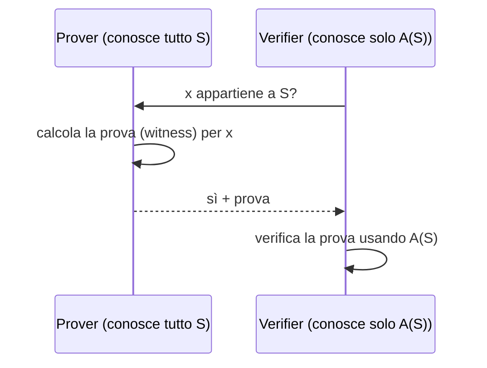
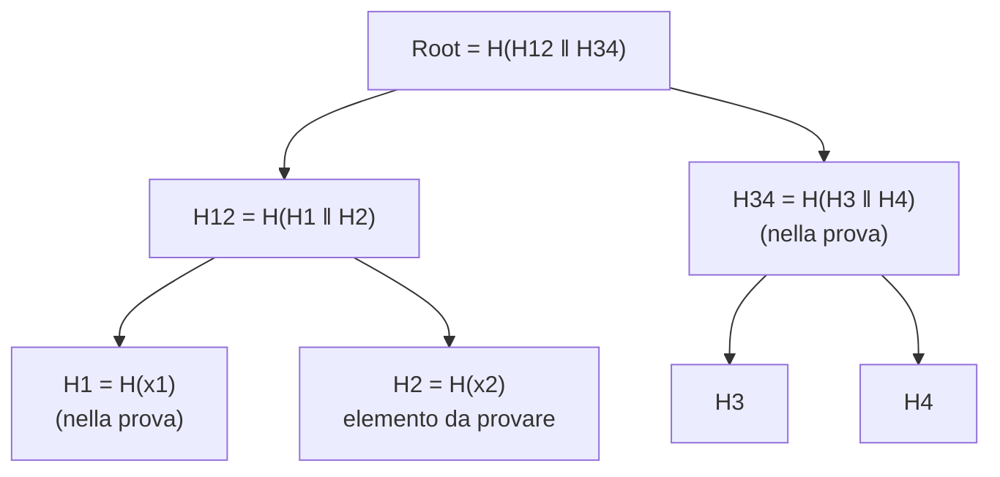
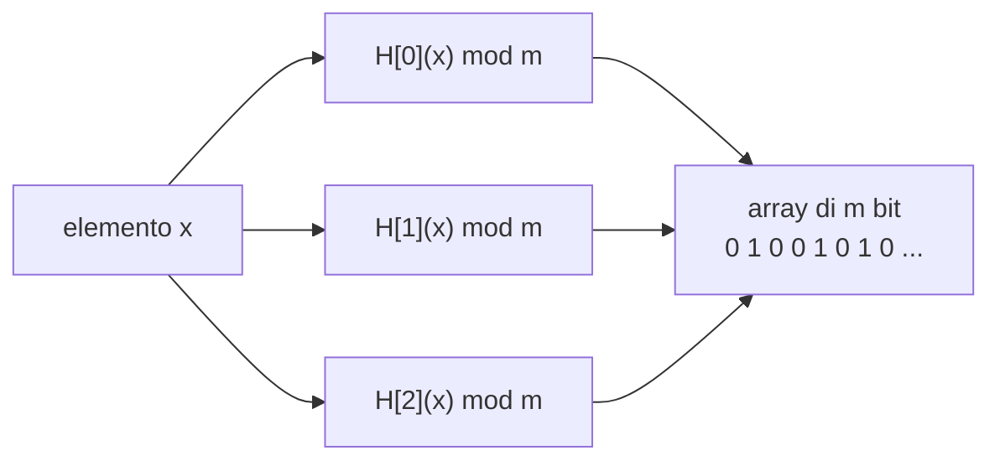
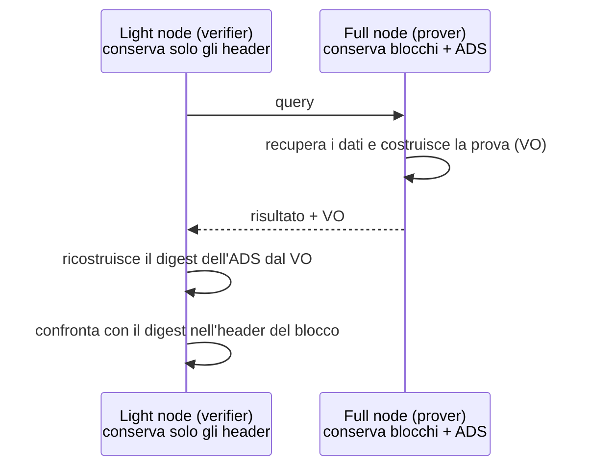
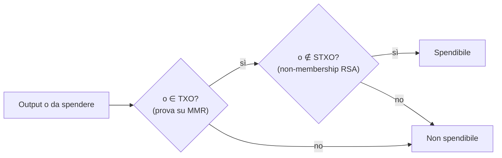
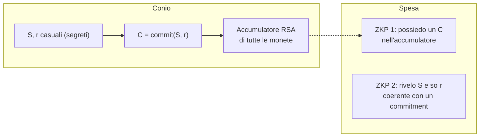

---
tags:
  - università/p2p-blockchain
  - set-accumulator
  - authenticated-data-structures
  - merkle-tree
  - seminario
data: 2026-05-21
lezione: "L23 - Guest lecture: Set Accumulators for Blockchains"
professore: "Matteo Loporchio (guest lecture)"
---

# Set accumulator per blockchain

> [!note] Seminario ospite
>
> Questa lezione è una **guest lecture** tenuta da Matteo Loporchio (Università di Pisa), che presenta anche risultati delle proprie ricerche svolte con i docenti del corso. È generalmente **meno centrale per l'orale** rispetto ai "grandi argomenti" (Bitcoin, Ethereum, strutture dati e metodi crittografici, attacchi). Riprende però concetti che invece sono chiesti spesso: **Merkle tree, Merkle proof, nodi SPV, Merkle Patricia Trie, UTXO, Bloom filter**. Conviene quindi studiarla soprattutto come approfondimento e ripasso di questi temi.

Le blockchain crescono continuamente: ogni nuovo blocco si aggiunge alla catena e nessun dato viene mai cancellato. Questo crea due problemi pratici. Il primo è di **spazio**: la dimensione della blockchain di Bitcoin e di Ethereum, così come quella di strutture ausiliarie come l'insieme degli UTXO, cresce senza sosta, e nodi con poche risorse non possono permettersi di memorizzare tutto. Il secondo è di **accesso**: la blockchain è una struttura append-only pensata per essere letta sequenzialmente, e trovare un dato specifico (una transazione, un evento, un certificato) può richiedere di scorrere moltissimi blocchi.

Il seminario presenta una famiglia di primitive crittografiche, i **set accumulator**, che permettono di **comprimere un insieme molto grande in un unico valore di dimensione costante**, conservando la possibilità di dimostrare in modo verificabile che un elemento appartiene (o non appartiene) all'insieme. Dopo aver visto le principali costruzioni (Merkle tree, accumulatore RSA, accumulatore bilineare, accumulatore espressivo, Bloom filter sicuri), il seminario ne illustra quattro aree di applicazione: autenticazione delle query, validazione stateless delle transazioni, anonimato, gestione delle identità.

---

## Che cos'è un set accumulator

> [!definition] Set accumulator
>
> Un **set accumulator** è una primitiva crittografica che:
> 1. rappresenta un insieme $S$ di elementi, anche molto grande, con un **unico valore di dimensione costante**, detto **accumulator value** (valore dell'accumulatore) $A(S)$;
> 2. permette di generare in modo efficiente una **proof of membership** (prova di appartenenza), detta anche **witness** (testimone), per un elemento di $S$.

Lo scenario tipico coinvolge due ruoli. Il **prover** conosce l'intero contenuto dell'insieme, cioè ne memorizza esplicitamente gli elementi. Il **verifier** conosce **solo il valore dell'accumulatore**, che è sufficiente per verificare le prove. Il verifier chiede "l'elemento $x$ è in $S$?" e il prover risponde "sì" allegando una prova; il verifier controlla la prova contro $A(S)$.

*Fig. — Lo schema prover/verifier di un set accumulator.*

Si vede subito perché questa primitiva interessa le blockchain: il verifier può essere un nodo leggero che conserva solo l'header dei blocchi (dove si può inserire il valore dell'accumulatore), mentre il prover è un full node che conserva tutti i dati.

### Classificazione

Gli accumulatori si classificano secondo diversi criteri.

Rispetto alla possibilità di modificare l'insieme, un accumulatore è **statico** (*static*) se non supporta inserimento e cancellazione di elementi, **dinamico** (*dynamic*) se li supporta.

Rispetto alla necessità di una prova, un accumulatore è **asimmetrico** (*asymmetric*) se richiede la generazione di una prova prima della verifica, **simmetrico** (*symmetric*) se non serve alcuna prova: il valore accumulato da solo basta per verificare l'appartenenza (è il caso dei Bloom filter, come vedremo).

Infine, un accumulatore è **universale** (*universal*) se supporta anche le **non-membership proof**, cioè prove che un elemento **non** appartiene all'insieme accumulato.

Alcune costruzioni supportano inoltre prove aggregate. Una **batch membership proof** dimostra al verifier che tutti gli elementi di un insieme $S$ sono inclusi in $X$ (cioè che $S \subseteq X$). Una **batch non-membership proof** dimostra che tutti gli elementi di $S$ non sono inclusi in $X$.

> [!warning] Attenzione
>
> La slide descrive la batch non-membership come "$S$ is not a subset of $X$". In realtà la condizione dimostrata è più forte: **nessun** elemento di $S$ appartiene a $X$, cioè $S \cap X = \emptyset$. Non essere sottoinsieme basterebbe che un solo elemento mancasse.

### Le costruzioni principali

Il seminario presenta quattro costruzioni: il **Merkle tree**, l'**accumulatore RSA** (Barić e Pfitzmann, 1997), l'**accumulatore bilineare** (Nguyen, 2005) e l'**accumulatore espressivo** (Zhang, Katz e Papamanthou, 2017). A queste si affiancano i **secure Bloom filter**.

---

## Il Merkle tree come accumulatore

Il **Merkle tree** è già noto dal corso: serve a verificare l'integrità di un insieme di elementi, ad esempio le transazioni contenute in un blocco Bitcoin. Le foglie contengono gli hash dei dati, ogni nodo interno contiene l'hash della concatenazione dei figli, e la radice (*root hash*) riassume l'intero insieme.

Visto come set accumulator, il Merkle tree ha una lettura molto naturale:

1. il **root hash** rappresenta il **valore dell'accumulatore**;
2. la **proof of membership** di un elemento è costituita dai nodi del **co-path** (co-cammino) dalla foglia alla radice, cioè dai "fratelli" dei nodi che si incontrano risalendo dalla foglia alla radice.

*Fig. — Merkle proof per $x_2$: il verifier riceve H1 e H34 (il co-path), ricalcola H2, poi H12, poi la radice, e la confronta con il root hash noto.*

Il verifier, avendo l'elemento e la prova, ricalcola la radice e la confronta con quella che conosce. La prova ha dimensione $O(\log n)$, dove $n$ è il numero di elementi.

La **sicurezza** del Merkle tree si basa sulle funzioni hash crittografiche, in particolare sulla proprietà di **collision resistance** (resistenza alle collisioni). Per modificare una foglia lasciando invariata la radice, un avversario dovrebbe trovare una collisione della funzione hash; per lo stesso motivo gli avversari non possono forgiare prove "false", cioè convincere un verifier che un elemento sta nell'insieme quando in realtà non c'è.

---

## L'accumulatore RSA

L'**accumulatore RSA** accumula un insieme di **numeri primi** $X = \{x_1, \dots, x_n\}$. Si fissa un **modulo RSA** $N = p \cdot q$, con $p$ e $q$ numeri primi grandi. Il valore dell'accumulatore di $X$ è

$$
A(X) = g^{x_1 \cdot x_2 \cdots x_n} \bmod N
$$

dove $g$ è una base di esponenziazione in $\mathbb{Z}_N$. I valori $N$, $g$ e $A(X)$ sono **pubblici**, mentre $p$ e $q$ devono restare **segreti**.

Se i dati da accumulare non sono numeri primi, si usa una funzione di **hash-to-prime**, cioè una funzione hash che produce numeri primi: ad esempio si applica SHA-256 e si verifica la primalità del risultato con il test di **Miller-Rabin**, ripetendo (ad esempio incrementando un contatore) finché non si ottiene un primo. La sicurezza dipende dalla dimensione del modulo RSA: un modulo di 3072 bit fornisce circa 128 bit di sicurezza.

> [!tip] Intuizione chiave
>
> Il valore dell'accumulatore è $g$ elevato al **prodotto** di tutti gli elementi. Per dimostrare che $x$ è nel prodotto basta mostrare $g$ elevato al prodotto di **tutti gli altri** elementi: chi riceve questo valore lo eleva a $x$ e deve ottenere $A(X)$. Non conoscendo $p$ e $q$ (e quindi l'ordine del gruppo), nessuno può calcolare radici $x$-esime di $A(X)$, quindi non si possono forgiare witness per elementi che non ci sono.

### Esempio: membership

Si fissano due primi $p = 7$ e $q = 11$, da cui $N = 77$. Sia $X = \{13, 31, 37, 59\}$ e $g = 2$. Il valore dell'accumulatore è

$$
A(X) = 2^{13 \cdot 31 \cdot 37 \cdot 59} \bmod 77 = 39
$$

Il prover P vuole dimostrare al verifier V che $37 \in X$.

1. P calcola il prodotto di tutti gli elementi di $X \setminus \{37\}$: $t = 13 \cdot 31 \cdot 59 = 23777$.
2. P calcola il witness $w = g^t = 2^{23777} \bmod 77 = 18$ e lo invia a V.
3. V calcola $w^{37} = 18^{37} \bmod 77 = 39$. Poiché $A(X) = 39$, la prova è accettata.

La correttezza è immediata: $w^{37} = (g^{t})^{37} = g^{t \cdot 37} = g^{13 \cdot 31 \cdot 37 \cdot 59} = A(X)$.

### Esempio: non-membership

Il protocollo di non-membership è reso possibile dal **lemma di Bézout**: per due interi qualsiasi $x$ e $y$, il $\gcd(x, y)$ si può esprimere come combinazione lineare di $x$ e $y$. I **coefficienti di Bézout**, cioè $a$ e $b$ tali che $ax + by = \gcd(x, y)$, si calcolano con l'**algoritmo di Euclide esteso**.

Sia ancora $X = \{13, 31, 37, 59\}$, $A(X) = 39$, $g = 2$. P vuole convincere V che $61 \notin X$.

1. P calcola $f = 13 \cdot 31 \cdot 37 \cdot 59 = 879749$.
2. Poiché 61 è primo e non compare in $X$, $\gcd(f, 61) = 1$. P trova $a, b$ tali che $a \cdot f + b \cdot 61 = 1$.
3. P invia il witness $w' = (a, b) = (-26, 374975)$.
4. V verifica controllando che $A(X)^a \cdot (g^{61})^b \equiv g \pmod{77}$. Infatti $39^{-26} \cdot 2^{61 \cdot 374975} = 53 \cdot 32 = 1696 \equiv 2 \pmod{77}$.

Il motivo per cui la verifica funziona è che

$$
A(X)^a \cdot (g^{x})^b = g^{a f} \cdot g^{b x} = g^{a f + b x} = g^{\gcd(f, x)}
$$

e questo vale $g$ solo se $\gcd(f, x) = 1$, cioè se $x$ non divide il prodotto degli elementi: poiché gli elementi sono primi, significa che $x$ non è nell'insieme.

### Vantaggi, limiti e sicurezza

L'accumulatore RSA **supporta le batch proof** e ha **dimensione della prova $O(1)$**, indipendente dalla dimensione dell'insieme: un grande vantaggio rispetto al Merkle tree, dove la prova cresce come $O(\log n)$. I limiti sono due. Serve un **trusted setup**: prover e verifier devono accordarsi sul modulo RSA $N$ senza che nessuno conosca $p$ e $q$. E le **esponenziazioni modulari** sono molto più costose dell'hashing (che consiste in operazioni sui bit).

L'accumulatore RSA è **collision-free** se è computazionalmente infattibile per un avversario forgiare una prova di membership valida per un elemento che non fa parte dell'insieme (o una di non-membership per un elemento che ne fa parte). Questo è vero **finché $p$ e $q$ restano segreti**.

---

## L'accumulatore bilineare

L'**accumulatore bilineare** si basa su **bilinear pairing** efficienti, cioè funzioni costruite sui punti di **curve ellittiche** definite su un campo finito $\mathbb{F}_q$ (ad esempio i pairing di Weil e di Tate). Supporta sia prove di membership sia di non-membership.

Anche qui è richiesto un **trusted setup**. Una parte fidata genera un valore segreto $s$, detto **trapdoor** (botola), e poi lo dimentica: chi conoscesse $s$ potrebbe forgiare prove false. I parametri pubblici sono

$$
\{ g^{s^i} \mid 0 \le i \le q \}
$$

con $q$ fissato in anticipo; di conseguenza gli insiemi accumulati possono avere **cardinalità massima $q$**.

> [!note] Nota
>
> Le slide non riportano la formula dell'accumulatore. Nella costruzione di Nguyen il valore è $A(X) = g^{\prod_{x \in X}(x + s)}$: l'esponente è un polinomio in $s$ di grado $|X|$, che si può calcolare dai parametri pubblici $g^{s^i}$ senza conoscere $s$ (per questo il grado, e quindi la cardinalità, è limitato da $q$). Il witness di $x$ è $g^{\prod_{y \ne x}(y+s)}$ e si verifica usando il pairing.

Un'implementazione Java è disponibile nella libreria **Cryptimeleon**, con un esempio d'uso nel repository del tutorial del relatore.

## L'accumulatore espressivo

L'**accumulatore espressivo** (*expressive accumulator*) è anch'esso basato su bilinear pairing, ma supporta **operazioni verificabili sugli insiemi accumulati**. Dato un insieme $X = \{x_1, \dots, x_N\}$, il prover può ad esempio dimostrare che $s = x_1 + \dots + x_N$ è effettivamente la **somma** degli elementi (SUM), oppure che $m$ è il **minimo** e $M$ il **massimo** di $X$ (MIN/MAX).

## Confronto tra accumulatori

Le slide riportano una tabella di confronto tratta dalla survey del relatore (Loporchio et al., 2023), di cui il testo estratto conserva solo la conclusione: **l'hashing è meno costoso delle esponenziazioni modulari e delle moltiplicazioni su curve ellittiche**; il Merkle tree **non richiede trusted setup**, ma la dimensione della prova è $O(\log n)$.

> [!note] Nota
>
> La tabella seguente ricostruisce il confronto sulla base di quanto detto nelle singole slide, non della tabella originale (che è un'immagine).

| | Merkle tree | RSA | Bilineare |
|---|---|---|---|
| Base crittografica | hash | esponenziazione modulare | pairing su curve ellittiche |
| Dimensione prova | $O(\log n)$ | $O(1)$ | $O(1)$ |
| Trusted setup | no | sì (modulo $N$) | sì (trapdoor $s$) |
| Non-membership | con varianti ordinate/trie | sì (Bézout) | sì |
| Costo operazioni | basso | alto | alto |

---

## Secure Bloom filter

I **secure Bloom filter** usano **funzioni hash crittografiche** per inserire elementi e verificarne l'appartenenza. Un Bloom filter è un array di $m$ bit, inizialmente tutti a zero, con $k$ funzioni hash $H[0], \dots, H[k-1]$. Per **inserire** un elemento $x$ si calcolano i $k$ hash e si pongono a 1 i bit nelle posizioni corrispondenti. Per **verificare** se $x$ è nell'insieme si controllano gli stessi $k$ bit: se sono tutti a 1 la risposta è *true*, che significa "$x$ **potrebbe** essere nell'insieme"; se almeno uno è a 0 la risposta è *false*, che significa "$x$ **sicuramente non** è nell'insieme".

*Fig. — Inserimento e ricerca in un Bloom filter con $k = 3$ funzioni hash.*

Sono quindi possibili **falsi positivi** (bit messi a 1 da altri elementi) ma non **falsi negativi**. Con $n$ elementi inseriti, la probabilità di falso positivo è

$$
p = \left(1 - e^{-k n / m}\right)^k
$$

e, fissati $n$ e la probabilità desiderata $p$, le dimensioni ottime sono

$$
m = \left\lceil -\frac{n \ln p}{(\ln 2)^2} \right\rceil, \qquad k = \operatorname{round}\left(\frac{m}{n} \ln 2\right)
$$

I Bloom filter sono **accumulatori simmetrici**: non serve calcolare un witness per controllare l'appartenenza, basta il filtro. Però la loro dimensione ottima **dipende dal numero di elementi** dell'insieme, per cui sono **meno efficienti in spazio** rispetto agli accumulatori veri e propri, il cui valore ha dimensione costante.

---

## Applicazione 1: autenticazione delle query

### Il problema

La dimensione delle blockchain di Bitcoin ed Ethereum cresce continuamente (le slide mostrano i grafici di crescita). Per recuperare dati on-chain, i **light node** (nodi leggeri), con risorse limitate, devono interrogare i **full node**, che però non sono fidati e potrebbero **alterare i risultati**. Le sfide sono due: come garantire la **correttezza** dei risultati, e come recuperare i dati in modo **efficiente**.

> [!definition] Authenticated Data Structure (ADS)
>
> Una **Authenticated Data Structure** (struttura dati autenticata) su una collezione di oggetti $C$ incorpora informazione crittografica in modo che:
> 1. un **prover non fidato** possa eseguire operazioni su $C$;
> 2. un **verifier** possa controllare in modo efficiente la correttezza del risultato di tali operazioni.

L'architettura è la seguente. Il **digest** (la radice) dell'ADS viene inserito nell'header di ogni blocco. Il light node, che conserva solo gli header, invia una query al full node; il full node recupera i dati, costruisce la prova e restituisce risultato più prova; il light node ricostruisce il digest dell'ADS dalla prova e lo confronta con quello nell'header. La prova crittografica di correttezza si chiama anche **Verification Object** (VO). Il verifier non può accedere alla collezione di dati (nota solo al prover): mantiene solo una piccola informazione di autenticazione che riassume lo stato corrente della collezione.

*Fig. — Autenticazione delle query tra light node e full node.*

### Bitcoin SPV

Il primo esempio, già noto dal corso, è la **Simplified Payment Verification** (SPV) di Bitcoin. La query è: *una transazione è confermata, cioè inclusa in un blocco?* Il light node conosce già gli header dei blocchi, e quindi la Merkle root delle transazioni; il full node invia la transazione e la Merkle proof (il co-path). Il light node ricalcola la radice e la confronta con quella nell'header.

> [!warning] Chiesto all'esame
>
> All'orale è stato chiesto "che cos'è un Merkle tree, quando si usano la Merkle root e la Merkle proof in Bitcoin?", con l'obiettivo di arrivare ai **nodi SPV** (light client). Questo seminario offre esattamente la chiave di lettura giusta: la Merkle root nell'header è un accumulatore, la Merkle proof è il witness, il nodo SPV è il verifier e il full node è il prover.

### Ethereum Merkle Patricia Trie

Il secondo esempio è il **Merkle Patricia Trie** (MPT) di Ethereum, che gestisce lo stato di Ethereum, cioè un insieme di coppie (account, saldo). È un *key-value store* in cui la **chiave è determinata dal cammino** nel trie e il **valore è contenuto in una foglia**. Supporta sia prove di membership sia di **non-membership** (per dimostrare che una chiave non c'è basta mostrare il cammino che si interrompe). La radice dell'MPT è inserita in ogni header di blocco nel campo **StateRoot** e rappresenta un **commitment** allo stato corrente di Ethereum.

> [!warning] Chiesto all'esame
>
> Anche "come sono organizzati i dati in Ethereum, qual è la struttura del Merkle Patricia Trie" è stata una domanda d'orale. Per i dettagli si rimanda alla lezione su Ethereum; qui interessa vedere l'MPT come ADS che supporta membership e non-membership.

### Merkleizzazione delle strutture dati

Molte ADS si ottengono **"merkleizzando"** strutture dati esistenti, cioè arricchendole con informazione crittografica (hash dei figli nei nodi). Esempi: **Merkle R-tree** (Merkle tree + R-tree), **Merkle B-tree** (Merkle tree + B-tree), **Merkle kd-tree** (Merkle tree + kd-tree) e lo stesso **Merkle Patricia Trie** (Merkle tree + PATRICIA trie).

### Merkle R-tree

Il **Merkle R-tree** combina Merkle tree ed R-tree per autenticare **range query su dati multidimensionali**, ad esempio dati spaziali. Una range query bidimensionale restituisce tutti i punti che cadono in un rettangolo allineato agli assi:

$$
Q = (l_x, u_x, l_y, u_y) = \{(x, y) \in \mathbb{R}^2 : l_x \le x \le u_x \land l_y \le y \le u_y\}
$$

Detta $c$ la capacità di pagina, le **foglie** contengono al più $c$ punti, e i **nodi interni** al più $c$ entry, ciascuna formata dal **minimum bounding rectangle** (il rettangolo minimo che racchiude il sottoalbero) e dal **digest crittografico** del sottoalbero. La radice dell'albero viene inserita nell'header del blocco (campo *IndexHash*, accanto a PrevHash e Nonce).

Per rispondere a una query si esplorano ricorsivamente tutti i sottoalberi il cui rettangolo si sovrappone alla query. Tutti i record delle foglie visitate vengono aggiunti al VO, insieme a rettangoli e hash dei sottoalberi **non esplorati**. Per la verifica, il light node ricostruisce la radice a partire dal VO e confronta il root hash ricostruito con il valore nell'header.

Il protocollo garantisce due proprietà dei risultati. L'**autenticità** (*authenticity*): i risultati non sono stati modificati rispetto ai dati on-chain. La **completezza** (*completeness*): nessun elemento che soddisfa la query è stato omesso. Per violare queste proprietà e forgiare una prova falsa, un attaccante dovrebbe trovare una collisione della funzione hash.

> [!tip] Intuizione chiave
>
> La completezza è garantita dal fatto che anche i sottoalberi **scartati** compaiono nel VO con il loro rettangolo: il verifier può controllare che ognuno di essi davvero non intersechi la query. Se il full node omettesse un sottoalbero rilevante, dovrebbe mentire sul suo rettangolo, ma allora l'hash ricostruito non coinciderebbe più con quello nell'header.

### vChain

**vChain** è un framework per **boolean range query verificabili** sui record delle transazioni di una blockchain, sia **intra-block** (all'interno di un blocco) sia **inter-block** (su più blocchi). Usa ADS basate su **accumulatori bilineari** (o su una costruzione basata sull'accumulatore espressivo).

Ogni blocco contiene un insieme di oggetti dati, e viene costruito un **indice intra-block**. Ogni **foglia** contiene: l'hash dell'oggetto dati, il multiset dei suoi attributi e un accumulatore. Ogni **nodo interno** contiene: l'hash dei nodi figli, l'unione dei multiset dei figli e un accumulatore. I validatori costruiscono l'ADS per ogni blocco e ne inseriscono il digest nell'header. Il full node che riceve una query attraversa l'ADS dall'alto verso il basso per trovare i risultati e costruire il VO. Quando un nodo interno **non soddisfa** la query, nel VO viene inserita una **prova di non-membership**: in questo modo si dimostra in un colpo solo che **nessun elemento** del sottoalbero corrispondente soddisfa la query, senza doverli elencare.

### Skip index

Lo **skip index** è una struttura dati per rendere efficienti le **query inter-block** e la loro autenticazione. Il caso d'uso è la ricerca di **eventi** lungo la blockchain di Ethereum, con query di membership del tipo "un certo evento è incluso in un certo blocco?".

Il punto di partenza è che gli header dei blocchi Ethereum includono già un **secure Bloom filter**, il campo **logsBloom**, che riassume gli event log del blocco: ha dimensione di 256 byte e usa la funzione hash Keccak-256 per inserimento e ricerca. Lo skip index arricchisce ogni blocco con una **sequenza di Bloom filter** che riassumono il contenuto dei blocchi predecessori a **distanza esponenzialmente crescente**.

> [!note] Nota
>
> L'interpretazione più naturale della slide (che è in gran parte grafica) è che il filtro $i$-esimo di un blocco riassuma un intervallo di $2^i$ blocchi precedenti, in modo analogo alle *skip list* o alle finger table di Chord: così una ricerca può "saltare" all'indietro di blocchi interi di ampiezza 1, 2, 4, 8, ... in un solo passo.

Con uno skip index di $E$ entry (filtri), l'obiettivo è trovare la **prima occorrenza**, cioè la più recente, di un evento $x$ in un intervallo di blocchi $[l, u]$. Si partiziona $[l, u]$ in chunk di $2^E$ blocchi, e si esplora ricorsivamente l'intervallo corrispondente al **primo filtro che dà riscontro** positivo (le slide riportano i passi successivi solo in forma grafica).

L'autenticazione della query funziona così: l'**hash dello skip index è incluso nell'header** del blocco; il full node costruisce il VO come la **sequenza ordinata degli indici dei blocchi visitati**, $VO = (S_1, \dots, S_v)$; il light node usa il VO per fare una **ricerca guidata**, confrontando $\text{hash}(S_i)$ con l'header del blocco $b_i$ e usando $S_i$ per determinare il prossimo blocco da visitare. Di conseguenza la **complessità di verifica coincide con la complessità di ricerca**.

Rispetto agli accumulatori, i Bloom filter sono simmetrici (non serve un witness), sono meno efficienti in spazio perché la dimensione ottima dipende dal numero di elementi, ma le operazioni di hashing sono più efficienti delle operazioni su curve ellittiche e **non richiedono trusted setup**.

---

## Applicazione 2: validazione stateless delle transazioni

Nel **modello UTXO** (*Unspent Transaction Output*), le nuove transazioni spendono gli output di transazioni precedenti. Una transazione è **valida** se i fondi in input corrispondono a fondi non spesi: gli input coincidono con output di transazioni già confermate, e nessun'altra transazione confermata usa gli stessi fondi come input. Per verificarlo, ogni nodo validatore mantiene l'**insieme degli UTXO**, che però cresce nel tempo e occupa ormai parecchi GiB (le slide mostrano il grafico della dimensione serializzata dell'UTXO set di Bitcoin).

> [!tip] Intuizione chiave
>
> Idea chiave: **comprimere l'UTXO set con un set accumulator**. Al posto di decine di GiB, il validatore conserva un valore di accumulatore di pochi byte (ad esempio 256).

Si ottiene un design **stateless** (senza stato): i nodi validatori valutano la validità di una transazione semplicemente controllando che gli input **appartengano all'accumulatore**, invece di esaminare l'intero insieme degli output non spesi. La **prova di validità** di una transazione diventa quindi una **prova di membership degli input nell'UTXO set**. Il flusso è:

1. chi crea la transazione vi allega la prova di validità;
2. il validator leggero verifica la transazione contro l'accumulatore contenuto nell'header del blocco: se tutti gli input appartengono all'UTXO set, la transazione è valida;
3. la transazione viene aggiunta al nuovo blocco.

Boneh, Bünz e Fisch (2019) hanno proposto per primi un **accumulatore basato su RSA con inserimenti e cancellazioni in batch**, senza un gestore centralizzato fidato dell'accumulatore (quindi adatto ad ambienti non fidati), con il valore dell'accumulatore inserito in ogni header di blocco come commitment all'ultimo stato dell'UTXO set.

### MiniChain

Il protocollo **MiniChain** divide l'UTXO set in due strutture: l'insieme degli output di transazione spesi, **STXO** (*Spent Transaction Outputs*), e l'insieme di tutti gli output di transazione, **TXO** (*Transaction Outputs*). Un output può essere speso **se e solo se** appartiene a TXO (serve una prova di membership) e **non** appartiene a STXO (serve una prova di non-membership).

Il TXO è gestito con un **Merkle Mountain Range** (MMR), cioè una lista append-only di Merkle tree; l'STXO è gestito con un **accumulatore dinamico basato su RSA**, che deve supportare l'inserimento di elementi. Ogni header di blocco memorizza il valore dell'accumulatore RSA e l'hash dei "picchi" (le radici) dell'MMR.

*Fig. — Condizione di spendibilità di un output in MiniChain.*

---

## Applicazione 3: aumentare l'anonimato

Bitcoin **non è davvero anonimo**: le transazioni sono pubbliche, gli utenti controllano più indirizzi che fungono da pseudonimi, e gli utenti possono essere **de-anonimizzati**, anche sfruttando informazioni esterne alla rete. Una delle tecniche di de-anonimizzazione più note è la **multi-input heuristic** (euristica degli input multipli), già menzionata nel paper di Nakamoto: se due o più indirizzi sono usati come input della stessa transazione, è probabile che siano controllati dallo stesso utente.

Una prima contromisura sono le **Bitcoin laundry** (servizi di mixing), che mescolano i fondi di utenti diversi per offuscare la storia delle transazioni. Hanno però due difetti: bisogna fidarsi che il servizio restituisca le monete, e una laundry compromessa o malevola non offre alcun anonimato. L'obiettivo di un vero anonimato è che **né l'origine, né la destinazione, né l'importo** di un pagamento vengano rivelati.

### Zerocoin

**Zerocoin** è uno schema di pagamento decentralizzato e anonimo, nato come estensione del protocollo Bitcoin (costruito sopra Bitcoin) e poi evoluto in **Zerocash** e **Zcash**. Il suo obiettivo è il **vero anonimato**: rompere il legame tra l'indirizzo usato per creare una moneta e quello usato per riscattarla, senza terze parti fidate.

Zerocoin usa un **accumulatore basato su RSA** come rappresentazione succinta dell'insieme di tutte le monete coniate fino al momento corrente.

**Conio di una moneta (minting).** L'utente U genera un **numero seriale** casuale $S$ e un **nonce** segreto $r$; calcola il commitment $C = \text{commit}(S, r)$, con $C$ primo, usando lo schema di commitment di **Pedersen**; i miner inseriscono $C$ nell'accumulatore RSA.

**Spesa di una moneta.** U produce due zero-knowledge proof: la prima dimostra che U possiede un commitment inserito nell'accumulatore, **senza rivelare quale** ($C$ resta nascosto); la seconda rivela il seriale $S$ e dimostra la conoscenza di un $r$ tale che $S$ ed $r$ corrispondano a un commitment, cioè a una moneta, **senza rivelare $r$**.

*Fig. — Conio e spesa in Zerocoin.*

Grazie alle ZKP i fondi riscattati **non possono essere collegati** a una specifica moneta coniata in precedenza. Per collegare la moneta $C$ al seriale $S$ usato nel prelievo bisognerebbe o conoscere $r$ (che è segreto), o sapere direttamente di quale moneta l'utente ha dimostrato la conoscenza, e nessuna delle due informazioni è rivelata dalla prova. Il seriale $S$, reso pubblico al momento della spesa, serve a impedire la doppia spesa: lo stesso seriale non può essere usato due volte.

### Zerocash

In **Zerocash** i nodi mantengono un **Merkle tree** su tutti i commitment di monete visti finora. Gli utenti dimostrano la proprietà di un commitment tramite i valori "de-committati" e una **Merkle proof** (ovviamente all'interno di una zero-knowledge proof, così da non rivelare quale foglia stanno usando).

---

## Applicazione 4: gestione delle identità

La blockchain gioca un ruolo chiave in due paradigmi di gestione dell'identità: le **PKI decentralizzate** (*Decentralized Public Key Infrastructures*) e le **Self-Sovereign Identity** (SSI, identità auto-sovrane).

### PKI decentralizzate

I **certificati a chiave pubblica** associano identità (siti web, persone, organizzazioni) a chiavi crittografiche. Nelle PKI tradizionali questi certificati sono emessi dalle **Certification Authority** (CA), che devono essere fidate sia nel non sfruttare in modo malevolo le informazioni raccolte, sia nel proteggerle efficacemente da attacchi esterni: sono un **single point of failure**. L'idea è sostituire le CA con una **Distributed Ledger Technology** (DLT), usata per mantenere un database di associazioni (identità, chiave pubblica).

Registrare i certificati on-chain comporta però **overhead di spazio**, che cresce con il ledger, e rende poco efficiente autenticare un'identità e valutare la validità di un certificato. Una PKI deve inoltre supportare **aggiornamento e revoca** dei certificati (ad esempio quando una chiave pubblica viene compromessa).

**Certcoin** è un protocollo di PKI decentralizzata che usa la blockchain di **Namecoin** come bacheca pubblica. L'idea è costruire un **Merkle tree** sull'insieme delle coppie (identità, chiave pubblica) correnti, e valutare la validità di una coppia tramite prove di membership: la complessità scende da $O(N)$ a $O(\log N)$, dove $N$ è il numero di identità registrate. Il sistema mantiene un Merkle tree globale il cui stato corrente è registrato on-chain; quando una chiave pubblica viene creata, aggiornata o revocata, il miner aggiorna l'accumulatore e i witness corrispondenti; gli utenti possono verificare che l'accumulatore incorpori correttamente (o non incorpori più) i valori aggiunti (o rimossi).

**DPKIT** è una PKI decentralizzata per gestire certificati **X.509** memorizzati on-chain. Garantisce la **certificate transparency**: i certificati sono pubblicamente verificabili, chiunque può verificarli o rilevare comportamenti scorretti. Fornisce uno schema per indicizzare i certificati e dimostrarne la validità o l'avvenuta revoca, basato su **Merkle Binary Search Tree** (Merkle BST), che memorizzano associazioni chiave-valore. Il **primary tree** è un Merkle BST che memorizza puntatori agli alberi dei certificati, indicizzati per nome del soggetto; il **secondary tree** memorizza coppie (certificato, revoca) con le impronte (*fingerprint*) dei certificati come chiavi. L'esistenza e la validità di un certificato si dimostrano con due prove di membership: quella dell'albero dei certificati nel BST primario, e quella che identifica il certificato nell'albero secondario. La **prova di revoca** è una prova di membership nell'albero secondario.

### Self-Sovereign Identity

In un sistema **SSI** la blockchain registra metadati, chiavi pubbliche e tutte le informazioni necessarie alla verifica, mentre i **Decentralized ID** (DID) riconoscono persone e organizzazioni che partecipano alla rete. L'utente è il **titolare delle credenziali** (*credential holder*). Le operazioni sulle credenziali sono tre: l'**emissione** (*issuance*), in cui un emittente crea e firma una credenziale per un titolare; la **revoca** (*revocation*), in cui un emittente invalida una credenziale emessa in precedenza, per vari motivi (frodi dell'utente, scadenza, emissione per errore, necessità di aggiornare i dati); la **verifica** (*verification*), in cui un verificatore controlla che una credenziale presentata sia autentica e valida.

**CredChain** è un framework SSI che mira a rendere più efficiente la revoca. Sia la revoca sia la verifica coinvolgono interazioni on-chain tramite smart contract. Usa vari tipi di accumulatori: **Bloom filter** (come "sub-accumulatore" probabilistico) e accumulatori **RSA** ("statici" e "dinamici"). Un'**epoca** è il periodo di tempo in cui il sub-accumulatore raggiunge la sua capacità. Le credenziali revocate vengono aggiunte al sub-accumulatore; per verificare una credenziale si controlla la sua **esclusione** dal sub-accumulatore e dagli accumulatori statici, e l'**inclusione** dell'accumulatore statico nella storia delle revoche.

**Hyperledger Indy** è una DLT **permissioned** open-source per gestire identità self-sovereign. Il ledger registra **schemi** di credenziali (nome, versione e attributi) e **definizioni** di credenziali (con cui l'emittente dichiara l'intenzione di emettere credenziali con un certo schema e definisce le chiavi usate per firmarle). In Indy la revoca è possibile solo se l'emittente pubblica sul ledger un **revocation registry**, cioè metadati che fanno riferimento a una definizione e specificano come gestire la revoca. Un **tails file** pubblico contiene un'entry per ogni possibile credenziale che potrebbe essere emessa; solo le credenziali valide (emesse e non revocate) contribuiscono al valore dell'accumulatore.

Quando emette una credenziale, l'emittente trasmette al titolare (che in seguito diventerà un prover) tre cose: il **file della credenziale**; il **private factor**, cioè l'indice corrispondente alla credenziale nel tails file; il **witness**, cioè il prodotto di tutte le altre entry del tails file. Al momento della presentazione il titolare fornisce una **primary proof**, che dimostra proprietà della credenziale ("qual è la tua data di nascita?", "indica il tuo indirizzo"), e una **proof of non-revocation**, che dimostra che la credenziale dietro la primary proof non è stata revocata: si deriva il valore dell'accumulatore dal private factor e dal witness con una sola moltiplicazione. Il **witness delta** è il meccanismo che aggiorna i witness dei prover quando l'accumulatore cambia.

---

## Discussione: pro e contro

Il seminario chiude con un bilancio per ciascuna area applicativa.

Per l'**autenticazione delle query**, gli accumulatori abilitano query autenticate, riducono la dimensione del verification object e comprimono informazioni contenute in più blocchi. D'altra parte richiedono di **modificare la struttura dei blocchi**, può servire una terza parte per il trusted setup, e le soluzioni aritmetiche possono essere più lente dell'hashing.

Per la **validazione stateless** mitigano l'impatto della crescita dell'UTXO set, specialmente per i nodi con poche risorse, ma **aumentano l'overhead di comunicazione**, perché le prove di membership viaggiano nel payload delle transazioni: l'aggregazione delle prove (batching) è la soluzione suggerita.

Per l'**anonimato** disaccoppiano il conio delle monete dalle transazioni di spesa e comprimono l'insieme delle monete non spese, ma aumentano il carico sui miner, che devono validare le prove.

Per la **gestione delle identità** riducono la dimensione del ledger (nelle PKI), migliorano ricerca e validazione dei certificati (nelle PKI) e l'efficienza della revoca delle credenziali (nelle SSI), ma la presenza di una parte fidata può essere indesiderabile per una piena decentralizzazione (anche se accettabile nei sistemi permissioned).

In conclusione, i set accumulator **comprimono grandi insiemi in un unico digest** garantendo la correttezza delle operazioni svolte su quegli insiemi. Sono ideali quando i dati vengono aggiunti continuamente alla blockchain e quando l'esigenza di recuperare dati si scontra con la difficoltà di leggere sequenzialmente la struttura. Gli obiettivi comuni sono migliorare la **scalabilità** complessiva del sistema e rendere la rete più **accessibile ai nodi con risorse limitate**.

---

> [!question] Possibili domande d'esame
>
> - Che cos'è un set accumulator? Quali ruoli hanno prover e verifier e come si classificano gli accumulatori (statici/dinamici, simmetrici/asimmetrici, universali)?
> - Perché un Merkle tree può essere visto come un accumulatore? Che cos'è una Merkle proof e come la usa un nodo SPV di Bitcoin? Su quale proprietà dell'hash si basa la sicurezza?
> - Come funziona l'accumulatore RSA? Come si costruiscono le prove di membership e di non-membership? Perché serve un trusted setup?
> - Che cos'è un Bloom filter? Perché ammette falsi positivi ma non falsi negativi? Dove compare in Ethereum?
> - Che cos'è una Authenticated Data Structure e come permette a un light node di fidarsi delle risposte di un full node? Che proprietà garantisce il Merkle R-tree?
> - In che cosa consiste la validazione stateless delle transazioni e quali vantaggi e svantaggi presenta?
> - Come usa Zerocoin l'accumulatore RSA e le zero-knowledge proof per rendere anonimi i pagamenti?

> [!abstract] Sintesi
>
> Un set accumulator rappresenta un insieme con un valore di dimensione costante e consente di generare witness di appartenenza verificabili da chi conosce solo quel valore. Il Merkle tree è l'accumulatore basato su hash (root = valore, co-path = prova, $O(\log n)$, nessun trusted setup); l'accumulatore RSA usa $g^{\prod x_i} \bmod N$, ha prove $O(1)$ e non-membership via Bézout, ma richiede trusted setup ed è più costoso; l'accumulatore bilineare usa pairing su curve ellittiche e una trapdoor da dimenticare; quello espressivo consente operazioni verificabili (somma, min, max). I Bloom filter sicuri sono accumulatori simmetrici con falsi positivi. Le applicazioni sono: autenticazione delle query per light node (SPV, MPT, Merkle R-tree, vChain, skip index), validazione stateless delle transazioni (UTXO compresso, MiniChain), anonimato (Zerocoin, Zerocash), gestione delle identità (Certcoin, DPKIT, CredChain, Hyperledger Indy).
