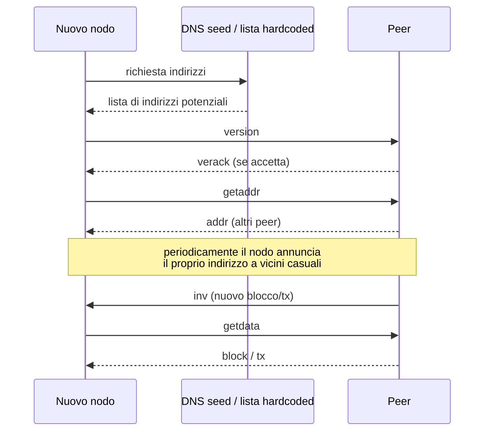
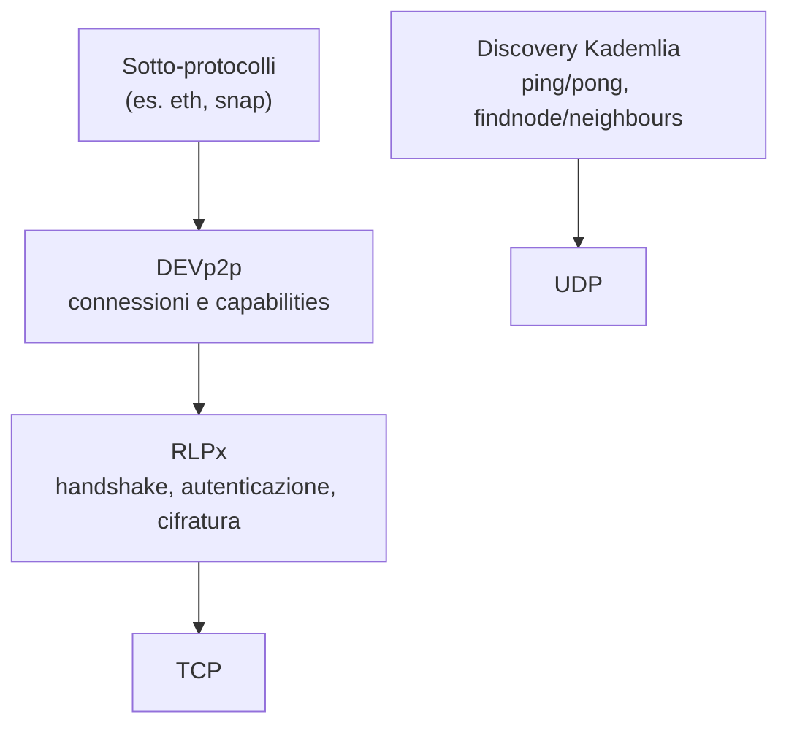
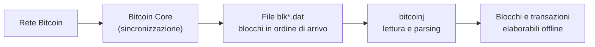
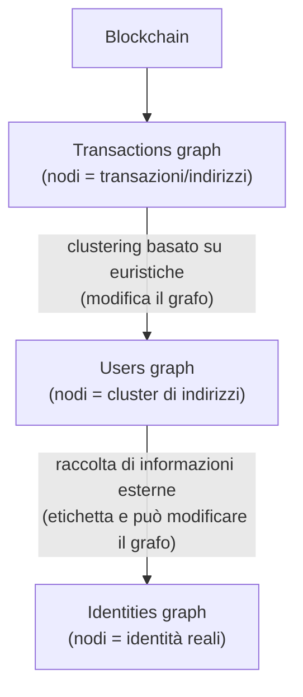
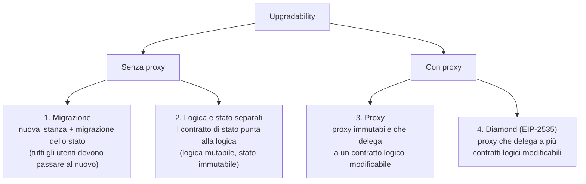
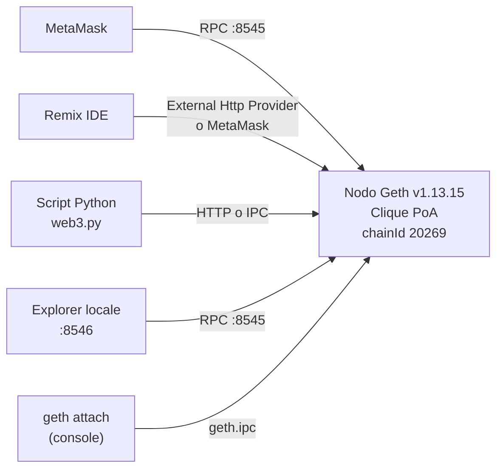
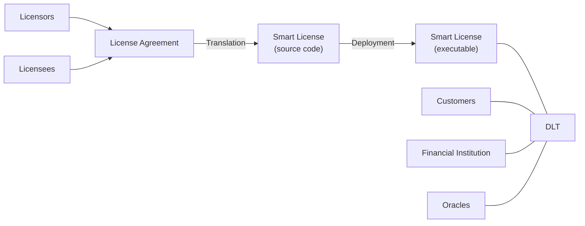
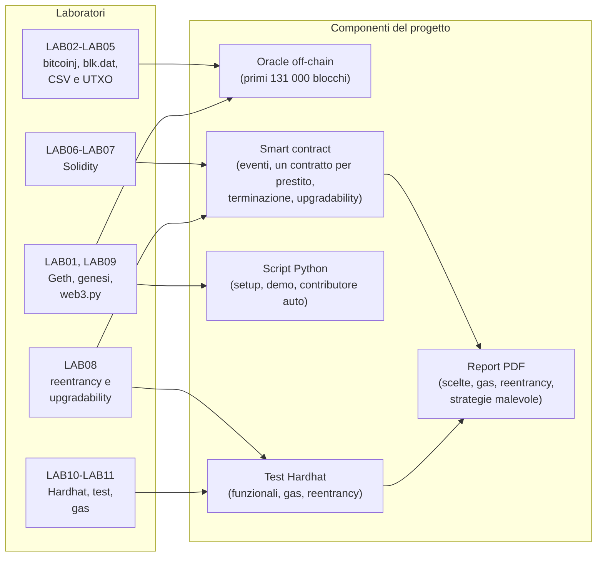

---
tags:
  - università/p2p-systems-and-blockchains
  - laboratorio
  - bitcoin
  - ethereum
  - solidity
  - hardhat
  - web3py
data: 2026-02-24
lezione: "LAB01-LAB12 - Laboratorio"
professore: "Damiano Di Francesco Maesa"
corso: "Peer-to-Peer Systems and Blockchains - Università di Pisa, A.A. 2025/26"
---

# Laboratorio di Peer-to-Peer Systems and Blockchains

Il modulo di laboratorio, tenuto dal prof. **Damiano Di Francesco Maesa**, accompagna il corso teorico e ne segue gli argomenti in modo "organico", come dice lui stesso nella prima slide: le date non sono fisse ma si adattano a quello che si è appena visto a lezione. L'idea è *bring your own device*, cioè ognuno porta il proprio portatile e riproduce quello che il docente mostra. Il materiale di riferimento è fatto dalle slide e da link o file indicati lezione per lezione. Per domande si può andare a ricevimento (ufficio 333 del Dipartimento di Informatica) o chiedere un incontro su Teams via mail (damiano.difrancesco@unipi.it).

Questo capitolo si rivolge a chi parte da zero e alla fine dovrà consegnare il **progetto finale**: un servizio di prestiti decentralizzato (*Decentralised Lending Service*) su Ethereum. Il servizio è scritto in Solidity, si testa con Hardhat, gira su una chain privata locale tramite script Python con web3.py e usa un **oracle off-chain** che legge i primi 131 000 blocchi di Bitcoin per calcolare il saldo di un indirizzo. Conviene leggere il laboratorio con il progetto in mente, perché ogni lab porta un pezzo degli strumenti che servono. Per questo ogni sezione si chiude con un callout che indica quale requisito del progetto quel lab prepara. Il callout non dice *come* soddisfarlo: quello è lavoro dello studente.

Il laboratorio si divide in tre blocchi. I primi cinque incontri riguardano **Bitcoin**: rete P2P, libreria bitcoinj, transazioni, script, file `blk.dat` e analisi della blockchain. Poi due incontri (più uno di approfondimento) sono dedicati a **Solidity**. Infine arriva l'**ambiente di test e deployment**: chain privata con Geth, web3.py e Hardhat. L'ultimo incontro mostra un caso applicativo reale.

```mermaid
%%{init: {"flowchart": {"useMaxWidth": true}}}%%
flowchart LR
    subgraph BTC["Blocco Bitcoin"]
        L1["LAB01<br/>Reti P2P<br/>Bitcoin ed Ethereum"] --> L2["LAB02<br/>bitcoinj:<br/>indirizzi e blocchi"]
        L2 --> L3["LAB03<br/>bitcoinj:<br/>transazioni e script"]
        L3 --> L4["LAB04<br/>transazioni<br/>e blk.dat"]
        L4 --> L5["LAB05<br/>CSV, UTXO<br/>e deanonimizzazione"]
    end
    subgraph SOL["Blocco Solidity"]
        L6["LAB06<br/>Ethereum recap<br/>e primi passi"] --> L7["LAB07<br/>Linguaggio<br/>Solidity"]
        L7 --> L8["LAB08<br/>Vulnerabilità<br/>e upgradability"]
    end
    subgraph ENV["Blocco ambiente di test"]
        L9["LAB09<br/>Geth, MetaMask,<br/>web3.py"] --> L10["LAB10<br/>Hardhat:<br/>test Solidity"]
        L10 --> L11["LAB11<br/>Hardhat:<br/>test TS e gas"]
    end
    L5 --> L6
    L8 --> L9
    L11 --> L12["LAB12<br/>App2Dapp<br/>caso d'uso"]
```


*Fig. — Percorso del laboratorio: dal livello di rete di Bitcoin fino allo sviluppo e al test di smart contract su Ethereum.*

> [!note] Nota sul materiale
>
> Alcuni incontri (LAB02, LAB03, LAB04 e LAB12) erano quasi del tutto *hands-on*. Le loro slide hanno solo titoli e link, mentre il codice veniva scritto dal vivo o mostrato in screenshot. In quei casi questo capitolo dice apertamente che il contenuto operativo sta nella **registrazione** e nel **materiale** della lezione, e descrive soltanto concetti e riferimenti ricavabili dalle slide. Gli snippet di codice e i comandi riportati qui compaiono tutti nelle slide originali. Non c'è codice inventato.

---

## LAB01 - Reti P2P: Bitcoin ed Ethereum (24/02)

Il primo laboratorio parte dal livello più basso: come si parlano i nodi di una blockchain. Prima di arrivare a transazioni e smart contract bisogna capire che Bitcoin ed Ethereum sono, prima di tutto, **reti peer-to-peer** che si scambiano "informazioni" su uno **stato globale condiviso**. I due sistemi hanno scelto in modo diverso come costruire la rete, e il lab li mette a confronto usando i concetti della teoria (overlay strutturati e non strutturati, DHT, Kademlia).

### Requisiti di una rete P2P

Il prof. riprende i requisiti di base visti a lezione. Ogni nodo conosce solo **informazioni topologiche locali**: nessun nodo conosce, e soprattutto nessun nodo *deve* conoscere, la topologia completa della rete. Si tratta anche di una questione di privacy, perché chi conosce la topologia può capire da dove parte una transazione. La rete deve resistere ad attacchi come il **Sybil attack** (un avversario crea molte identità finte), l'**eclipse attack** (si isola un nodo circondandolo di vicini malevoli) e il **partitioning** (si divide la rete in parti che non si parlano). Resta poi il **bootstrapping problem**: un nodo appena acceso deve trovare i primi peer senza sapere nulla della rete.

La scelta di fondo è tra **overlay non strutturato** e **overlay strutturato**. L'obiettivo resta lo stesso: permettere la comunicazione di un'applicazione decentralizzata.

### Bitcoin: overlay non strutturato

La rete di Bitcoin è un overlay **non strutturato** basato sul **gossip**: ogni nodo inoltra ai vicini ciò che riceve. Le caratteristiche principali riassunte nelle slide sono queste:

- **bootstrapping** tramite una lista hardcoded (DNS seed e indirizzi scritti nel codice);
- **privacy** affidata alla casualità nella scelta dei vicini;
- **sicurezza**: la cifratura delle connessioni esiste solo dalla versione 27 di Bitcoin Core (aprile 2024);
- **connessioni** su TCP.

La **node discovery** di Bitcoin segue una sequenza precisa. Il nodo riceve una lista di indirizzi potenziali da DNS fidati o dalla lista hardcoded, prova a connettersi inviando un messaggio `version` e, se il peer accetta, riceve un `verack`. Da lì continua a chiedere nuovi peer con `getaddr` e, periodicamente, comunica le proprie informazioni di rete a vicini scelti a caso. La propagazione vera e propria di blocchi e transazioni passa per i messaggi `inv` / `getdata` / `block`-`tx`, con meccanismi come *trickle* e *diffusion* che introducono ritardi casuali per rendere più difficile capire chi ha originato un messaggio.


*Fig. — Node discovery e propagazione dei dati nella rete Bitcoin.*

Per vedere un DNS seed dal terminale, la slide suggerisce:

```bash
nslookup seed.bitcoin.sipa.be
```

La lista hardcoded dei seed si trova invece nel sorgente di Bitcoin Core, nel file `src/chainparamsseeds.h`. Per il formato dei messaggi i riferimenti sono la pagina *Protocol documentation* della Bitcoin wiki e la sezione *networking* di learnmeabitcoin.com.

Un nodo punta ad avere tra **8 e 11 connessioni** e ne accetta al massimo **125**. Il limite si cambia con l'opzione `-maxconnections=<num>` e le costanti sono definite in `src/net.h`. Per farsi un'idea della rete reale il prof. indica bitnodes.io (con i relativi grafici) e 21.ninja.

Gli **attacchi** citati a livello di rete sono il **DNS poisoning** (si avvelenano i seed per mandare il nuovo nodo verso peer malevoli), il **network listening** (nodi spia che osservano da dove arrivano le transazioni) e il **fingerprinting**, cioè riconoscere un nodo dagli indirizzi che conosce, usati come una sorta di "cookie". Il riferimento bibliografico è arXiv:1410.6079. Il network listening torna nel LAB05, dove viene usato come strumento di deanonimizzazione.

### Ethereum: overlay strutturato con Kademlia

Ethereum ha lo stesso obiettivo, ma usa un overlay **strutturato** basato su **Kademlia**. Anche qui il bootstrapping parte da una lista hardcoded e la privacy si affida alla casualità. Le connessioni però sono **autenticate e cifrate**, e i trasporti sono due: **UDP** per la node discovery, **TCP** per la comunicazione vera e propria.

Le DHT piacciono per tre ragioni: sono **decentralizzate** (ogni nodo costruisce la propria tabella senza coordinamento), sono **tolleranti ai guasti** e reggono un churn ragionevole, e sono **scalabili**, perché ogni nodo tiene informazioni di dimensione logaritmica nel numero di nodi e il routing richiede un numero logaritmico di hop.

> [!definition] Kademlia in Ethereum: le differenze
>
> In Ethereum la DHT **non serve a cercare valori**. Chiavi e nodi condividono lo stesso spazio di identificatori, quindi raggiungere qualsiasi chiave in un numero logaritmico di hop equivale a raggiungere qualsiasi nodo. Le tabelle di routing sono mappe di *enode*. Gli ID dei peer sono di 512 bit (la chiave pubblica, già casuale). La distanza è lo XOR degli **hash Keccak-256** degli ID, valutato sul bit più significativo, e lo stesso vale per l'indice dei bucket: ci sono quindi 256 bucket da 16 elementi ciascuno. La distanza non ha niente di "geografico": serve solo a distribuire bene i nodi restando "log-vicini".

C'è poi un dettaglio di **privacy**: la tabella di routing serve a *conoscere* i peer, non per forza a *connettersi* ad essi, perché un avversario potrebbe ricostruirla. Per questo i vicini con cui si apre davvero una connessione vengono scelti a caso tra tutti i peer che rispondono, in tutti i bucket. Rispetto al Kademlia classico, inoltre, ci sono messaggi di `ping`/`pong` e una formula di reputazione più complessa del semplice uptime.

Lo stack di rete di Ethereum è a livelli (*tiered stack*): **RLPx** (da *Recursive-Length Prefix serialization*) per trovare i peer, **DEVp2p** per stabilire le connessioni e i vari **sotto-protocolli** per scambiare i messaggi applicativi. Sopra la stessa connessione di base possono girare protocolli diversi.


*Fig. — Lo stack di rete di Ethereum: discovery su UDP, comunicazione autenticata e cifrata su TCP.*

La **node discovery** in Ethereum procede così. Su **UDP** si chiede a un bootnode hardcoded (definito in `params/bootnodes.go` di go-ethereum) quali sono i vicini del proprio ID, poi si mandano `findnode` ai peer appena scoperti per riempire i bucket e si fa il *bonding* con `ping`/`pong`. Su **TCP** si apre la comunicazione vera: un **handshake RLPx** controlla le versioni, stabilisce chiavi effimere e verifica l'autenticazione, e poi un messaggio **Hello** dichiara le *capabilities*, cioè i sotto-protocolli da multiplexare. Qualunque sia il sotto-protocollo, RLPx continua a garantire autenticazione e cifratura. Per vedere la rete reale c'è il *node tracker* di Etherscan. Il paper di riferimento sulle connessioni tra peer Ethereum è "imc18_ethpeers".

### Identificatori enode e connessione a una rete privata

Un nodo Ethereum si identifica con un **enode URL**, il cui formato è:

```
enode://public key@IP:TCP port?discport=UDP discovery port
```

Per esempio:

```
enode://6f8a80d14311c39f35f516fa664deaaaa13e85b2f7493f37f6144d86991ec012937307647bd3b9a82abe2974e1407241d54947bbb39763a4cac9f77166ad92a0@10.3.58.6:30303?discport=30301
```

La parte più pratica del lab è creare un nodo **Geth** (il client ufficiale in Go) su una rete privata e collegarlo ad altri nodi. Due opzioni di Geth sono utili per le reti private:

```bash
--bootnodes enode://pubkey1@ip1:port1,enode://pubkey2@ip2:port2,enode://pubkey3@ip3:port3
--nodiscover
```

La prima indica esplicitamente i bootnode da usare al posto di quelli hardcoded. La seconda disattiva la node discovery, utile quando la rete è piccola e i nodi sono noti. I passi mostrati in aula sono: installare Geth, creare una cartella dati (`mkdir testLecture1`), procurarsi il file di genesi `testlecture1.json` (che si capirà meglio nel LAB09) e poi:

```bash
geth --datadir testLecture1/ init testlecture1.json
geth --datadir ~/testLecture1/ --networkid 35353 --port 3333 --vmdebug console
```

Dalla console di Geth si usano poi tre comandi: `admin.nodeInfo` per conoscere il proprio enode, `admin.peers` per vedere i peer connessi e `admin.addPeer()` per connettersi esplicitamente a un peer di cui si conosce l'enode.

### Topology discovery

L'ultima parte del lab torna sulla privacy. Ethereum rende la ricostruzione delle tabelle di routing **difficile e dipendente dal target**, grazie al passaggio di hashing degli ID, per non incentivare attacchi di *topology discovery*. Restano comunque due strade per un attaccante: sfruttare l'insieme di ID di nodi esistenti già noti (molto più piccolo dello spazio teorico) oppure procedere per forza bruta, sapendo che in pratica sono popolati quasi solo i bucket con prefisso comune corto. La slide lascia una domanda aperta come esercizio mentale: quando un nodo riceve un `findnode` risponde con i 16 nodi più vicini della propria tabella. Quanti `findnode` servono per scaricare l'intera tabella di routing di un nodo, e come va scelto il target di ciascuno? I riferimenti sono un articolo IEEE (documento 8969695) e l'eprint IACR 2018/236.

> [!tip] Collegamento al progetto
>
> Il LAB01 introduce **Geth**, il concetto di **file di genesi** e l'avvio di un nodo su una rete privata con `--datadir` e `--networkid`. Il progetto chiede di usare una **chain privata locale basata sul file di genesi fornito**, e la prima familiarità con Geth nasce qui (la configurazione completa arriva nel LAB09). La parte sulla rete Bitcoin serve anche a capire il contesto in cui opera l'oracle: i blocchi che leggerà vengono da questa rete.

---

## LAB02 - Bitcoin lab: strumenti, indirizzi e blocchi (10/03)

Con il secondo laboratorio si passa dalla rete ai **dati** di Bitcoin, e si comincia a lavorarci da programma. Le slide sono molto scarne: contengono titoli, link e l'enunciato di un esercizio, mentre il codice Java veniva mostrato e scritto dal vivo. **Il contenuto operativo di questo lab va recuperato dalla registrazione della lezione.** Qui si riportano gli strumenti e i concetti che si ricavano dalle slide.

### Gli strumenti: Bitcoin Core e bitcoinj

Gli strumenti presentati sono due. **Bitcoin Core** è il client di riferimento, scaricabile da bitcoin.org. **bitcoinj** è una libreria Java che implementa il protocollo Bitcoin e permette di connettersi alla rete, costruire e analizzare transazioni, leggere blocchi e gestire indirizzi senza scrivere tutto da zero. La slide dà il link al jar della versione 0.17 su Maven Central (`org/bitcoinj/bitcoinj-core/0.17/bitcoinj-core-0.17.jar`) e alla Javadoc (bitcoinj.org/javadoc/0.17/).

Il primo esempio è una **connessione alla testnet** per chiedere un blocco d'esempio, verificabile anche su un explorer. La slide indica il blocco testnet `0000000000000adc6423b570d751efcdf5e019d3d955fee155c28925913cb667` su blockstream.info.

### Tipi di indirizzi

Una parte importante del lab riguarda i **formati degli indirizzi** su mainnet, perché dal prefisso si riconosce il tipo di script associato:

- **Legacy**: P2PKH inizia con `1`, P2SH inizia con `3`;
- **Nested SegWit**: P2SH-P2WPKH e P2SH-P2WSH iniziano con `3` (formato solo transitorio);
- **SegWit nativo**: P2WPKH e P2WSH iniziano con `bc1q`;
- **Taproot**: P2TR inizia con `bc1p`.

> [!example] Esercizio 1 del LAB02
>
> Creare un **vanity address**, cioè un indirizzo che inizia con una stringa scelta. L'idea è generare coppie di chiavi finché l'indirizzo derivato non ha il prefisso voluto. Il costo cresce in modo esponenziale con la lunghezza del prefisso, ed è un buon modo per rendersi conto di quanto sia grande lo spazio degli indirizzi.

### Il blocco di genesi

Si ispeziona poi il **blocco di genesi** di Bitcoin, con hash `0x000000000019d6689c085ae165831e934ff763ae46a2a6c172b3f1b60a8ce26f` (riferimento: pagina *Genesis block* della Bitcoin wiki). È un blocco speciale: la sua coinbase non è spendibile, e questo tornerà utile quando si ragionerà sul calcolo dei saldi.

Il lab si chiude introducendo le **transazioni**, argomento del lab successivo, con due letture consigliate: *Deconstructing a Bitcoin transaction* su dev.to (thunderbiscuit) per i campi di una transazione e la pagina su **SegWit** di learnmeabitcoin.com come ripasso.

> [!tip] Collegamento al progetto
>
> L'oracle del progetto deve calcolare il **saldo disponibile di un indirizzo Bitcoin**. Per farlo bisogna sapere come si presenta un indirizzo, quali tipi esistono e come si leggono i blocchi da programma. Il LAB02 fornisce questi primi strumenti. Fai caso ai **formati degli indirizzi**: nei primi 131 000 blocchi i tipi presenti sono pochi, ma bisogna sapere quali sono per decidere come associare output e indirizzi.

---

## LAB03 - Bitcoin lab: transazioni e script (11/03)

Il terzo laboratorio continua il giorno dopo con bitcoinj e si concentra su **transazioni** e **script**. Anche qui le slide contengono quasi solo titoli e link, perché il codice era negli screenshot e nella dimostrazione dal vivo. **Per gli esempi concreti bisogna fare riferimento alla registrazione.**

### Transazioni

Si riprendono le letture già indicate (la scomposizione dei campi di una transazione su dev.to e il ripasso di SegWit). L'obiettivo è saper leggere una transazione campo per campo: versione, input (con il riferimento all'output precedente speso), output (valore e script di blocco), eventuale witness e locktime.

### Script

La seconda parte riguarda il linguaggio di **Script** di Bitcoin. I riferimenti indicati sono:

- un ripasso di Script e la lista degli opcode su learnmeabitcoin.com (sezione *technical/script*);
- liste dettagliate degli opcode su opcodeexplained.com e sulla pagina *Script* della Bitcoin wiki;
- la pagina dedicata a **OP_RETURN**, l'opcode che rende un output non spendibile ed è usato per salvare dati arbitrari sulla blockchain.

L'esercizio pratico consiste nel prendere la **transazione raw in esadecimale**, decodificarla con bitcoinj e verificare il risultato con un decoder online. I link della slide sono:

```
https://blockchain.info/rawtx/a637ad18fabee7ad3ccd51e317091a6e16991311c0c9b83233b140b66b114448?format=hex
https://www.blockchain.com/explorer/assets/btc/decode-transaction
```

> [!tip] Collegamento al progetto
>
> Per calcolare il saldo di un indirizzo l'oracle deve capire **a chi appartiene ogni output**, e quindi deve saper interpretare gli **script di output** (tipo di script, indirizzo derivabile oppure no, output non spendibili come OP_RETURN). Il LAB03 dà gli strumenti per ragionarci. Chiediti quali output vanno esclusi dal saldo e quali tipi di script si incontrano nei primi 131 000 blocchi.

---

## LAB04 - Bitcoin lab: transazioni e file blk.dat (17/03)

Il quarto laboratorio completa la parte su bitcoinj e introduce il modo in cui **Bitcoin Core salva la blockchain su disco**. Le slide hanno quasi solo titoli (una serie di "bitcoinj - transactions" e "bitcoinj - blk.dat"): **il codice era mostrato nella registrazione e nel materiale della lezione.** Nella cartella del materiale c'è il file **`Material-for-today.txt`** con i riferimenti per la sessione.

### Transazioni e Taproot

La prima parte continua il lavoro sulle transazioni con bitcoinj. Come estensione la slide propone di allargare quanto fatto a **P2TR** (Pay-to-Taproot), con riferimento alla pagina *p2tr* di learnmeabitcoin.com. È un esercizio utile per collegarsi alla lezione teorica su Taproot.

### Il formato blk.dat

La seconda parte è la più importante per il progetto. Bitcoin Core salva i blocchi ricevuti in file **`blk*.dat`** nella propria cartella dati. Questi file contengono i blocchi serializzati uno dopo l'altro, ciascuno preceduto dai *magic bytes* della rete e dalla dimensione, **nell'ordine in cui sono stati ricevuti** e non necessariamente nell'ordine della catena. Il riferimento è la pagina *blkdat* di learnmeabitcoin.com. Con bitcoinj si possono leggere questi file ed estrarre blocchi e transazioni per elaborarli offline, senza interrogare la rete.


*Fig. — Dalla rete ai file blk.dat, e dai file al parsing con bitcoinj.*

> [!warning] Attenzione
>
> I blocchi nei file `blk.dat` **non sono ordinati per altezza**. Questo problema viene ripreso esplicitamente nel LAB05, insieme alla mancanza di supporto diretto agli UTXO, ed è la ragione per cui si passa a un formato intermedio.

> [!tip] Collegamento al progetto
>
> Il progetto chiede che l'oracle off-chain **legga la blockchain Bitcoin** limitandosi ai **primi 131 000 blocchi della mainnet**, "come visto negli esempi a lezione". Il LAB04 mostra da dove arrivano questi dati (i file `blk.dat` prodotti da Bitcoin Core) e come si leggono con bitcoinj. Il progetto chiede anche di progettare il codice **come se i blocchi arrivassero uno alla volta**. Tienilo presente fin da ora: il fatto che nei file non siano ordinati è proprio uno dei problemi da affrontare.

---

## LAB05 - Bitcoin lab: dal blk.dat al CSV, UTXO e deanonimizzazione (30/03)

Il quinto laboratorio chiude il blocco Bitcoin e ha due anime. La prima è pratica: trasformare i dati grezzi di `blk.dat` in un formato testuale comodo da analizzare. La seconda è concettuale: capire quanto sia (poco) anonimo Bitcoin e come si possa ricostruire chi possiede cosa. Nella cartella del materiale c'è un **CSV "wikiFILTERED"**, cioè una porzione filtrata della blockchain Bitcoin usata negli esempi.

### Dal blk.dat a un formato CSV personalizzato

Il punto di partenza è un elenco di transazioni in un **formato testuale personalizzato** (il prof. lo chiama "c\*sv", perché i separatori non sono solo virgole). Ogni riga ha tre parti separate da `:`:

```
GenarlInfo : inputs : outputs ->

      timestamp, blockhash, txHash, isCoinbase, estimatedSize, hasWitness

      :

      [prevTx_Id, prevTxPos[;]]*

      :

      [addr, amount, scriptType][;addr, amount, scriptType]*
```

La prima parte contiene le **informazioni generali** della transazione: timestamp, hash del blocco, hash della transazione, flag coinbase, dimensione stimata, presenza di witness. La seconda elenca gli **input**, ciascuno come coppia (id della transazione precedente, posizione dell'output speso), separati da `;`. La terza elenca gli **output**, ciascuno come tripla (indirizzo, importo, tipo di script).

Questo formato ha però due problemi, indicati esplicitamente nelle slide: i **blocchi non sono ordinati** (eredità dei file `blk.dat`) e manca un **supporto diretto agli UTXO**. Un input dice solo "spendo l'output *k* della transazione *X*", ma per sapere quanto valeva e a chi apparteneva bisogna andare a cercare *X*.

### Il CSV multi-file ordinato

La prima soluzione è un **formato multi-file ordinato**. La riga del blocco di genesi nel formato "grezzo" è:

```
1231006505,000000000019d6689c085ae165831e934ff763ae46a2a6c172b3f1b60a8ce26f,4a5e1e4baab89f3a32518a88c31bc87f618f76673e2cc77ab2127b7afdeda33b,1,204,0::1A1zP1eP5QGefi2DMPTfTL5SLmv7DivfNa,5000000000,1
```

Dopo l'ordinamento, hash e indirizzi vengono sostituiti da **identificatori interi** e le tabelle di corrispondenza finiscono in file separati:

```
1231006505,0,0,1,204,0::0,5000000000,1
000000000019d6689c085ae165831e934ff763ae46a2a6c172b3f1b60a8ce26f,0
4a5e1e4baab89f3a32518a88c31bc87f618f76673e2cc77ab2127b7afdeda33b,0
1A1zP1eP5QGefi2DMPTfTL5SLmv7DivfNa,0
```

La prima riga è la transazione con gli ID compatti. Le altre sono le mappature hash-blocco → ID, hash-transazione → ID e indirizzo → ID. Il vantaggio è evidente: i file diventano molto più piccoli e i confronti tra interi sono molto più rapidi di quelli tra stringhe esadecimali.

### Il CSV con UTXO espanso

La seconda trasformazione risolve il problema degli UTXO. Ogni input viene **arricchito** con le informazioni dell'output che spende. Si confronti una transazione nel formato ordinato:

```
1238256409,9006,9095,0,388,0:8300,0;8323,0;8302,0:5270,15000000000,0
```

con la stessa nel formato **UTXO-expanded**:

```
1238256409,9006,9095,0,0,388,0:8271,5000000000,8300,0;8294,5000000000,8323,0;8273,5000000000,8302,0:5270,15000000000,0
```

Nel secondo formato ogni input porta con sé l'**indirizzo** (come ID) e l'**importo** dell'output speso, oltre al riferimento (transazione, posizione). Così si può ricostruire il flusso di valore tra indirizzi leggendo una sola riga, senza tornare indietro nella storia.

> [!tip] Intuizione chiave
>
> Il passaggio da `blk.dat` a CSV ordinato e poi a CSV con UTXO espanso è un piccolo esempio di **ETL** (*extract, transform, load*) su dati blockchain. Si parte da dati grezzi, disordinati e con riferimenti indiretti, e si arriva a un formato ordinato, compatto e autosufficiente. Buona parte del lavoro di chi analizza blockchain sta proprio in questa preparazione dei dati.

### Anonimato in Bitcoin

La seconda metà del lab riguarda l'**anonimato**. I punti chiave sono tre. L'intera storia delle transazioni è **pubblica e permanente**. L'anonimato si basa solo sulla **pseudonimia**: gli utenti sono identificati da indirizzi e non da nomi. Le transazioni vengono diffuse in rete via gossip, per lo più **dai loro stessi creatori**. Le slide mostrano con una sequenza di grafi come indirizzi apparentemente scollegati (per esempio `1A1zP1eP5QGefi2DMPTfTL5SLmv7DivfNa`, `1Ez69SnzzmePmZX3WpEzMKTrcBF2gpNQ55`, `1XPTgDRhN8RFnzniWCddobD9iKZatrvH4`) possano essere ricondotti allo stesso utente.

### L'attacco di deanonimizzazione

L'obiettivo di un **attacco di deanonimizzazione** è collegare correttamente le identità del mondo reale (chi possiede le chiavi segrete) agli indirizzi, rompendo così la pseudonimia. Le risorse a disposizione sono la blockchain, le informazioni esterne ed eventualmente l'ascolto della rete. Gli strumenti sono l'analisi passiva e le regole euristiche.


*Fig. — La pipeline di deanonimizzazione: dalla blockchain al grafo delle identità.*

### Clustering euristico

Le euristiche di clustering nascono dall'osservazione del comportamento tipico degli utenti Bitcoin e dei vincoli tecnici. Dipendono dal periodo storico e non sono generali: se non sono calibrate bene producono molti falsi positivi o negativi. Di norma **si preferisce ridurre i falsi positivi** (unire indirizzi che non c'entrano) anche a costo di più falsi negativi.

L'euristica più classica è quella degli **input comuni** (*common inputs heuristic*): tutti gli indirizzi usati come input nella stessa transazione appartengono allo stesso utente, perché chi crea la transazione deve possedere tutte le chiavi private necessarie a firmarla.

La seconda è l'euristica dell'**indirizzo di resto** (*change address*): il resto di una transazione torna a un indirizzo dello stesso utente che possiede gli input. Il difficile è capire *quale* output sia il resto, quindi l'euristica va raffinata. La versione raffinata presentata nelle slide dice che l'indirizzo *c* è un change address nella transazione *t* se e solo se:

- *t* non è una transazione coinbase;
- *t* ha più di un output;
- $\text{inputs}(t) \cap \text{outputs}(t) = \emptyset$ (nessun "self change");
- tra gli output di *t* non c'è un indirizzo già etichettato come change address o già appartenente al proprietario degli input;
- è la prima volta che *c* compare nella blockchain e nessun altro indirizzo negli output di *t* soddisfa questa condizione;
- valgono eventuali regole extra legate a comportamenti noti degli utenti.

### Informazioni esterne e network listening

Per passare dagli utenti alle identità servono **informazioni esterne**: analisi temporali (*timing*), analisi degli importi, log interni di servizi terzi (KYC degli exchange, indirizzi di spedizione) e il cosiddetto **dust attack**, cioè l'invio di piccolissime quantità a indirizzi bersaglio per seguirne i movimenti successivi.

Il **network listening**, già incontrato nel LAB01, cerca di collegare un indirizzo alle informazioni di rete (soprattutto l'IP) del proprietario. Si basa su due assunzioni, non sempre vere: il primo nodo a diffondere una transazione ne è il creatore, e il creatore, dovendo firmare, possiede le chiavi degli input. In pratica l'attaccante riempie la rete di nodi-ascoltatori molto connessi e veloci e fonde le loro osservazioni per stimare l'origine di ogni transazione. Spesso lo si combina con la **topology discovery** per triangolare meglio. In una rete non strutturata come Bitcoin, però, la topology discovery si fa di solito inquinando le liste di connessioni degli altri nodi e può causare un DoS significativo. Inoltre richiede una connessione diretta a ogni nodo bersaglio, quindi funziona solo sui full node raggiungibili.

### Il dataset Wikileaks e l'assignment

Come caso di studio il lab usa un **dataset filtrato relativo a Wikileaks**: blocchi da 130 863 a 131 006 (144 blocchi, cioè circa un giorno), 6094 transazioni e 8129 indirizzi coinvolti. L'indirizzo per le donazioni a Wikileaks è `1HB5XMLmzFVj8ALj6mfBsbifRoD4miY36v`. È questo il CSV "wikiFILTERED" nella cartella del materiale.

> [!example] Assignment del LAB05
>
> Costruire la mappatura del **users graph** (indirizzo → cluster) usando l'euristica degli input comuni. Il suggerimento della slide è che si può ottenere complessità lineare con una **BFS**, riducendo il problema al calcolo delle **componenti connesse**.

### Tracciamento dei furti e contromisure

Il lab accenna infine al **theft tracking**. Quando un furto viene reso pubblico l'indirizzo del ladro diventa noto, e gli utenti onesti possono seguirne i fondi e metterli in blacklist. Tracciare con certezza tutti i fondi è difficile, ma è facile seguirne almeno una parte fino a un servizio di terze parti, dove con buona probabilità il ladro verrà identificato. Lo strumento di base è la **taint analysis**: il *taint* dell'indirizzo A rispetto all'indirizzo B è la percentuale dei fondi di A che proviene da B. Gli esempi citati sono il furto "allinvain" del 13/06/2011 (25 001 BTC) e il ransomware TorrentLocker 2 (CryptoWall 2) del 15/09/2014 contro le pubbliche amministrazioni italiane, con una seconda ondata a novembre 2014.

Le **contromisure** sono tre famiglie:

- **CoinJoin** (2013) e il suo miglioramento **CoinShuffle** (2014): più utenti uniscono input fissi in un'unica grande transazione firmata collettivamente. L'anonimato è limitato al numero di partecipanti, resta la linkabilità interna, lo schema è vulnerabile al DoS e richiede di nascondere l'IP.
- **Tecniche di offuscamento**: spostare fondi tra indirizzi per rompere il tracciamento, con schemi di *split*, *aggregation*, **peeling chain** e albero binario.
- **Mixer**: un'entità riceve i fondi e restituisce la stessa cifra presa da fondi di altri utenti. I problemi sono la centralizzazione e la fiducia richiesta, le commissioni, la necessità di distruggere i log interni, la lentezza e l'insicurezza nel riciclare grosse somme e l'aumento dei costi e dei rischi quando si concatenano più mixer. Oppure, come chiude ironicamente la slide, "*... or just chain hop*".

> [!tip] Collegamento al progetto
>
> Questo è il lab più vicino all'**oracle off-chain** del progetto. L'oracle deve calcolare il **saldo disponibile** di un indirizzo Bitcoin, definito dal testo come *la somma di tutti i suoi output non spesi* (UTXO), sui primi 131 000 blocchi. La riflessione su come passare da `blk.dat` a un formato ordinato e su come gestire gli UTXO è esattamente il problema da affrontare. Il progetto chiede però di elaborare **un blocco alla volta**, come se i blocchi arrivassero in tempo reale: valuta tu quali strutture dati servono per aggiornare i saldi in modo incrementale. Nota anche che il dataset Wikileaks cade proprio attorno al blocco 131 000.

---

## LAB06 - Ethereum recap e primi passi in Solidity (13/04)

Con il sesto laboratorio si passa a **Ethereum**, la piattaforma su cui girerà il progetto. Il lab si apre con un ripasso del modello di Ethereum visto a lezione e poi introduce **Solidity** e l'IDE **Remix**. Nella cartella del materiale ci sono diversi contratti d'esempio: **`CrowdFunding.sol`**, **`FeedConsumer.sol`**, **`User.sol`**, **`Creator.sol`** e l'esempio sugli import (**`importExample`**, con `Counter.sol` e `Lib.sol`).

### Il modello ad account

Ethereum è **basato su account** e non su UTXO. Gli account si possono pensare come "super-indirizzi": il saldo si aggiorna in modo diretto (il resto non serve) e l'autorizzazione è una vera verifica di firma, non uno script. L'**identificativo di un account** sono gli ultimi 160 bit dell'hash Keccak-256 della chiave pubblica, senza codifica "amichevole" come quella degli indirizzi Bitcoin. Esistono due tipi di account: gli **EOA** (*externally owned accounts*), controllati da una chiave privata, e i **contratti**.

| | EOA | Contratto |
|---|---|---|
| Chiave privata | sì (può iniziare transazioni) | no |
| Può mandare transazioni a EOA | sì (semplice trasferimento di valore) | sì |
| Può mandare transazioni a contratti | sì (attivazione del contratto) | sì (sub-call) |
| Indirizzo | hash Keccak-256 della chiave pubblica | hash Keccak di sender + nonce |
| Costo di creazione | nessuno | dipende dal gas |
| Può creare nuovi contratti | sì | sì |
| Possiede e muove valore | sì | sì |
| Paga il gas | sì | no |

Ogni account ha quattro campi:

- **nonce** (dinamico): numero di transazioni inviate dall'account a partire da 0. Per un contratto conta invece i contratti creati, a partire da 1. Elimina la malleabilità ed è indispensabile nel modello ad account;
- **balance** (dinamico): saldo in wei, rappresentato come intero;
- **codeHash** (statico): hash del codice EVM dell'account, oppure hash della stringa vuota per gli EOA. I frammenti di codice stanno nel database di stato, indicizzati dal loro hash;
- **storageRoot** (dinamico): hash della radice del Merkle Patricia trie che codifica lo storage dell'account (una mappa tra interi), vuoto per default.

### Stato, receipt e log

Le slide mostrano come lo stato globale sia organizzato in **Merkle Patricia trie**. Nell'header del blocco ci sono le radici di tre trie: stato, transazioni (con chiave l'indice della transazione da 0) e **receipt**. Una receipt contiene il risultato dell'esecuzione di una transazione: lo stato intermedio dopo l'esecuzione (*medstate*), il gas usato (*gas_used*), i **log** prodotti dagli opcode `LOG0`…`LOG4` (ciascuno con l'indirizzo del contratto che l'ha emesso, fino a 4 *topic* da 32 byte e un campo dati di lunghezza arbitraria) e un **bloom filter** di indirizzi e topic. L'OR di tutti i bloom filter delle receipt finisce nell'header del blocco.

I **log** sono messaggi per i nodi della blockchain e per le applicazioni esterne. Il loro contenuto sta *sopra* lo stato interno dell'EVM, quindi **non è visibile agli smart contract**. Servono alle applicazioni esterne per mettersi in ascolto di un certo tipo di evento senza rieseguire tutte le transazioni né mantenere lo stato. In Solidity si usano tramite gli **eventi**. L'esempio della slide è:

```solidity
 event moneySent(address indexed _from, address _to, uint
 _amount);
 //[...]
 function sendMoney(address _to, uint _amount) public
 returns(bool) {
     require(Balance[msg.sender] >= _amount; "Not enough value");
     moneyBalance[msg.sender] -= _amount;
     moneyBalance[_to] += _amount;
     emit moneySent(msg.sender, _to, _amount);
 return true; }
```

> [!warning] Attenzione
>
> Lo snippet è riportato esattamente come nella slide e contiene due refusi che non compilano: nel `require` il separatore tra condizione e messaggio dev'essere una virgola (`,`) e non un punto e virgola, e `Balance` dovrebbe essere `moneyBalance`. Lo scopo della slide è mostrare la dichiarazione `event` con un parametro `indexed` e l'istruzione `emit`.

### Smart contract, EVM e gas

Il codice di un contratto è salvato nello stato come **bytecode EVM**. La slide pone una domanda: si può vedere il codice sorgente di un contratto su un explorer come Etherscan? Sì, ma solo se qualcuno lo ha pubblicato e lo ha fatto *verificare*, cioè ha dimostrato che compilandolo si ottiene esattamente il bytecode presente sulla chain.

Il **gas** esiste per due motivi: prevenire attacchi DoS, necessari da considerare vista la Turing-completezza dell'EVM, e misurare in modo equo l'uso delle risorse. Si paga sia per l'**esecuzione** sia per lo **storage**. Il `gaslimit` di una transazione evita di svuotare il saldo di un account se qualcosa va storto, per esempio in una catena di sub-call. Il gas si paga **comunque**, per il lavoro svolto, anche se la transazione fallisce, finisce il gas o causa un revert. Esiste anche un gaslimit a livello di blocco, l'analogo della dimensione del blocco, che limita il tempo di validazione. Il costo di ogni operazione è fissato nell'**Appendice G dello Yellow Paper**.

> [!note] Contratti precompilati
>
> Gli indirizzi tra `1` e `0x0a` (inclusi) ospitano i **contratti precompilati**. Si chiamano come qualsiasi contratto, ma il loro comportamento (e il loro consumo di gas) non è definito da codice EVM memorizzato a quell'indirizzo: è implementato direttamente nell'ambiente di esecuzione (Appendice E dello Yellow Paper).

### Solidity e Remix

**Solidity** è un linguaggio ad alto livello compilato in bytecode EVM. È **staticamente tipato**, cioè i tipi vengono controllati a compile time, ed è **orientato agli oggetti**: un contratto è come l'istanza di una classe, con uno stato e dei metodi. È in continua evoluzione, quindi la documentazione ufficiale (docs.soliditylang.org) va consultata con attenzione alla versione.

Per iniziare si usa **Remix** (remix.ethereum.org), un IDE nel browser. Il primo esempio è il contatore di solidity-by-example.org (*first-app*) e i passi sono:

1. creare un nuovo file `Counter.sol` in Remix;
2. copiarci dentro il codice dell'esempio;
3. compilare;
4. fare il deploy sulla **VM** interna di Remix;
5. chiamare i metodi;
6. ispezionare le **receipt** delle transazioni.

### Pragma, import e costrutti

Ogni file Solidity inizia con la direttiva **`pragma`**, che indica la versione del compilatore. Le versioni `x.y.*` introducono modifiche incompatibili rispetto a `x-1.*.*` e a `x.y-1.*`, quindi il vincolo di versione conta:

```solidity
    pragma solidity 0.4.16            above version 0.4.16

    pragma solidity >=0.4.16 <0.7.1   above version 0.4.16 but below 0.7.1

    pragma solidity ^0.4.16           above version 0.4.16 but below 0.5.0
```

Per gli **import** (dettagli sulla risoluzione dei percorsi nella documentazione, pagina *path-resolution*):

```solidity
import "lib/util.sol";                 direct import

import "../token.sol";                 relative import

import * as tokenLibrary from "lib/token.sol";
```

L'ultima forma permette di rinominare i simboli, che si usano poi come `tokenLibrary.varName1`. L'esempio `importExample` nella cartella del materiale (`Counter.sol` + `Lib.sol`) mostra un import in pratica.

I costrutti principali di un contratto sono le **variabili di stato** (con i loro tipi), le **funzioni**, gli **errori e i modificatori** e gli **eventi**.

### Modificatori di visibilità

Per le **variabili di stato** ci sono tre livelli di visibilità:

- **public**: come internal, ma il compilatore genera automaticamente un **getter** con visibilità external e modificatore `view`, quindi la variabile si legge dall'esterno;
- **internal** (default): visibile nel contratto che la definisce e nei contratti derivati;
- **private**: come internal, ma non visibile nei contratti derivati.

Per le **funzioni** i livelli sono quattro:

- **external**: chiamabile solo da transazioni o messaggi esterni (dall'interno solo tramite `this.fun()`);
- **public**: chiamabile sia dall'esterno sia dall'interno;
- **internal**: chiamabile solo dal contratto corrente o da quelli derivati (non fa parte dell'ABI);
- **private**: chiamabile solo dal contratto corrente (non fa parte dell'ABI).

> [!warning] Attenzione
>
> `private` **non significa segreto**. Lo stato di un contratto sta sulla blockchain ed è leggibile da chiunque legga lo storage direttamente. La visibilità regola solo chi può accedere a variabili e funzioni *dal codice Solidity*.

> [!tip] Collegamento al progetto
>
> Il LAB06 prepara le basi concettuali per scrivere i contratti del progetto. Il **modello ad account** e il fatto che i contratti possano **creare altri contratti** (tabella EOA/contratto) servono per il requisito che chiede di gestire **ogni prestito attivo con un nuovo contratto dedicato**. La parte su **eventi e log** prepara il requisito *"Events must be emitted as needed"* e anche lo script Python del contributore automatico, che deve "accorgersi" delle nuove proposte senza interrogare continuamente lo stato. La parte sul **gas** introduce il concetto che poi dovrai misurare e che definisce la *minimum fee* dell'oracle.

---

## LAB07 - Il linguaggio Solidity (14/04)

Il settimo laboratorio arriva il giorno dopo e riprende da capo l'introduzione a Solidity (le prime slide ripetono pragma, import e visibilità del LAB06). Poi si entra nel dettaglio del linguaggio: tipi, indirizzi, trasferimenti di valore, funzioni, errori, modificatori, eventi e `selfdestruct`. È il lab più denso di sintassi, e anche quello da tenere più a portata di mano mentre si scrive il progetto.

### Tipi e aree di memoria

La forma di una dichiarazione è `type modifier name;`. La distinzione fondamentale è tra due categorie di tipi. I **tipi valore** (*value types*) non specificano l'area dati: sono sullo stack se effimeri, oppure in **storage** (costoso in gas) se sono variabili di stato. Possono essere dichiarati **`transient`** (come storage, ma vivono solo per la durata di una transazione), **`constant`** (sostituiti a compile time) o **`immutable`** (sostituiti al momento della costruzione). I **tipi riferimento** (*reference types*: struct, array e mapping) devono invece specificare l'area dati, cioè `memory`, `storage` o `calldata` (memoria in sola lettura).

I tipi valore principali sono:

- `bool`: `true`/`false`;
- `int8`, `int16`, …, `int256`: interi con segno (`int` equivale a `int256`);
- `uint8`, …, `uint256`: interi senza segno (`uint` equivale a `uint256`);
- `bytes1`, …, `bytes32`: array di byte a dimensione fissa;
- stringhe, con apici sia doppi sia singoli.

> [!warning] Divisione intera
>
> In Solidity **le divisioni intere arrotondano sempre per difetto**. I numeri a virgola fissa esistono ma sono molto limitati. Ogni calcolo proporzionale va quindi pensato tenendo conto del resto che si perde.

Gli **enum** hanno al massimo 256 membri. Esempio dalla slide:

```solidity
contract test {
      enum ActionChoices { GoLeft, GoRight, GoStraight, SitStill }
      ActionChoices choice;
      ActionChoices constant defaultChoice = ActionChoices.GoStraight;
      function setGoStraight() public {
      choice = ActionChoices.GoStraight;
      }
      // Since enum types are not part of the ABI, the signature of "getChoice" will automatically be changed to
      //"getChoice() returns (uint8)" for all matters external to Solidity.
      function getChoice() public view returns (ActionChoices) {
      return choice;
}}
```

Il commento nel codice è importante: gli enum non fanno parte dell'ABI, quindi dall'esterno (per esempio da uno script Python) un enum si vede come `uint8`.

### Indirizzi

Il tipo **`address`** occupa 20 byte e ha una variante **`address payable`**, che può ricevere ether. Un letterale esadecimale che supera il test di checksum, come `0xdCad3a6d3569DF655070DEd06cb7A1b2Ccd1D3AF`, è di tipo address. L'indirizzo nullo si scrive `address(0)`. Gli indirizzi si confrontano con gli operatori booleani standard, ma la loro utilità sta soprattutto nei **membri**. Si possono anche convertire da e verso il tipo di un contratto: la conversione verso `address payable` è possibile se e solo se il contratto ha una `receive` o una `fallback` payable. Tramite il tipo contratto si accede ai campi external/public come membri.

I membri del tipo address sono:

- `<address>.balance` (`uint256`): saldo in wei;
- `<address>.code` (`bytes memory`): codice all'indirizzo (può essere vuoto);
- `<address>.codehash` (`bytes32`): hash del codice;
- `<address payable>.transfer(uint256 amount)`: invia wei, **fa revert in caso di fallimento**, inoltra uno *stipend* fisso di 2300 gas non modificabile;
- `<address payable>.send(uint256 amount) returns (bool)`: come transfer, ma **restituisce `false`** in caso di fallimento invece di fare revert (es. `bool success = recipient.send(amount);`).

Un esempio di conversione e pagamento:

```solidity
  address public userAddress;
  address payable public recipientAddress;
  function convertAddress(address _userAddress) public {
        recipientAddress = payable(_userAddress);
  }
  function payUser(address payable user) public payable {
        require(msg.value > 0, "Must send some ETH");
        user.transfer(msg.value);
  }
```

Il membro più potente (e più pericoloso) è **`call`**: `<address>.call(bytes memory) returns (bool, bytes memory)` esegue una CALL a basso livello con il payload indicato, restituisce il successo e i dati di ritorno e **inoltra tutto il gas disponibile**, salvo indicazione diversa:

```solidity
(bool success, bytes memory returnData) = address(nameReg).call{gas: 1000000, value: 1 ether}(abi.encodeWithSignature("register(string)", "MyName"));
require(success);
```

Il payload inizia con il **function selector**, cioè i primi 4 byte dell'hash della firma della funzione. Esistono anche **`delegatecall`**, che esegue il codice del contratto chiamato *sullo stato del chiamante* (storage, indirizzo, `msg.sender` e `msg.value` restano invariati), e **`staticcall`**, che fa revert se lo stato viene modificato.

### Creazione di contratti: Creator.sol

Per vedere in azione la creazione di contratti e i tipi address, la slide presenta il file **`Creator.sol`**, presente anche nella cartella del materiale. Nella slide il codice è impaginato su due colonne. Qui è ricomposto nell'ordine corretto, senza aggiungere nulla (il nome `innerContarct` è scritto così nell'originale):

```solidity
// SPDX-License-Identifier: GPL-3.0
pragma solidity >=0.7.0 <0.9.0;

contract Created {
    uint public x;
    constructor(uint a) payable {
    x = a;    }
    function increment() public {
         x += 1;     }
    function get() public view returns (uint)     {
         return x;       }
}
contract Creator {
    Created innerContarct;
    function createCreated(uint arg) public {
         Created newCreated = new Created(arg);
         innerContarct = newCreated;
    }
    function overrideCreated(address arg) public {
         innerContarct = Created(arg);
    }
    function getInnerContractX() public view returns (uint) {
         return innerContarct.x();
    }
    function incrementInnerContractX() public{
         innerContarct.increment();
    }
    function createAndEndowCreated(uint arg, uint amount) public payable {
         // Send ether along with the creation
         Created newCreated = new Created{value: amount}(arg);
         newCreated.x();
    }}
```

Il messaggio della slide è che i contratti **non possono iniziare né firmare transazioni**, ma possono comunque **creare nuovi contratti** con `new`, anche mandando valore insieme alla creazione (`new Created{value: amount}(arg)`). Un contratto si può anche "agganciare" a un indirizzo esistente convertendolo nel tipo contratto (`Created(arg)`) e poi chiamarne le funzioni. `Creator.sol` è il contratto usato come esempio in tutti i lab successivi (LAB08-LAB11).

### La parola chiave payable, receive e fallback

`send` e `transfer`, ormai **deprecati**, hanno un limite fisso di 2300 gas. Secondo il prof. è una cattiva scelta di progetto, perché i costi in gas cambiano nel tempo e un contratto che si affida a una quantità costante può smettere di funzionare dopo un hard fork. `call` permette limiti arbitrari, ma restituisce un booleano invece di fare revert direttamente, quindi l'esito va controllato.

Perché serve gas per inviare valore? Perché **il destinatario può essere un contratto**, e quando un contratto riceve valore esegue del codice: la funzione `receive`, la `fallback` oppure la funzione indicata, se è marcata `payable`.

- **`fallback`** è una funzione speciale senza nome (al massimo una per contratto), senza parametri né valori di ritorno, chiamabile solo dall'esterno: `fallback () payable external { … }`. Viene eseguita quando si chiama una funzione che non esiste o nessuna funzione (per esempio con un semplice trasferimento), **oppure** quando arriva un trasferimento di valore e non esiste una `receive`.
- **`receive`** è simile (nessun parametro, nessun ritorno, al massimo una) ma dev'essere obbligatoriamente payable: `receive( ) public payable { … }`.

> [!note] Nota
>
> Il fatto che **ricevere ether esegua codice del destinatario** sembra un dettaglio, ma è la base dell'attacco di reentrancy che si studia nel LAB08.

### Array, struct e mapping

- **Array**: dinamici (`uint[] storage arr;`) o statici (`uint[10] storage arr;`), con `length`, `push()`, `push(elem)` e `pop()` (vedi solidity-by-example.org/array).
- **Struct**: `struct structName { type1 name1, …, typeN nameN }`. Per l'uso di struct in storage il riferimento è `CrowdFunding.sol` nella cartella del materiale.
- **Mapping**: `mapping(KeyType => ValueType) varName`. La chiave può essere qualsiasi tipo valore built-in, `bytes`, `string`, un tipo contratto o un enum. Il valore può essere qualsiasi tipo, anche mapping, array e struct.

> [!warning] I mapping non sono iterabili
>
> I mapping funzionano come hash table in cui **tutti i valori sono inizializzati al default**. La chiave non viene salvata, non esiste una `length`, possono stare solo in storage e **non si possono iterare**. Se serve scorrere un insieme di elementi, bisogna tenere una struttura aggiuntiva.

### Unità e variabili globali

Per gli importi:

```solidity
assert(1 wei == 1);
assert(1 gwei == 1e9);
assert(1 ether == 1e18);
```

Per i tempi: `1 == 1 seconds`, `1 minutes == 60 seconds`, `1 hours == 60 minutes`, `1 days == 24 hours`, `1 weeks == 7 days`.

Le **variabili globali** più importanti sono:

- `blockhash(uint blockNumber) returns (bytes32)`: hash di uno dei **256 blocchi più recenti** (per scalabilità), zero altrimenti;
- `block.basefee`, `block.chainid`, `block.coinbase`, `block.gaslimit`;
- **`block.number`**: numero del blocco corrente;
- `block.timestamp`: timestamp del blocco in secondi Unix;
- `gasleft() returns (uint256)`: gas rimanente;
- `msg.data` (calldata completa), **`msg.sender`** (mittente della chiamata *corrente*, cambia a ogni chiamata), `msg.sig` (primi 4 byte della calldata, cioè il selettore), **`msg.value`** (wei inviati);
- `tx.gasprice` e **`tx.origin`** (mittente originale della transazione, all'inizio dell'intera catena di chiamate).

### Funzioni, mutabilità ed errori

Il **costruttore** (`constructor`) viene eseguito una sola volta, alla creazione del contratto. Una funzione può restituire **più valori**: i nomi delle variabili di ritorno si possono omettere, e se ci sono si comportano come variabili locali inizializzate al default. Non si possono restituire mapping (né tipi composti che li contengono). Se manca un `return` esplicito vengono restituiti i valori come modificati fino a quel punto. Le due forme equivalenti mostrate nella slide sono:

```solidity
pragma solidity >=0.4.16 <0.9.0;

contract Simple {
  function arithmetic(uint a, uint b)
     public
     pure
     returns (uint sum, uint product)
  {
     sum = a + b;
     product = a * b;
  }
}
```

```solidity
pragma solidity >=0.4.16 <0.9.0;

contract Simple {
  function arithmetic(uint a, uint b)
     public
     pure
     returns (uint sum, uint product)
  {
     return (a + b, a * b);
  }
}
```

Per la **mutabilità dello stato**, oltre a `payable`:

- **`view`**: non può modificare lo stato. Non può scrivere variabili di stato (anche transient), emettere eventi, creare contratti, usare `selfdestruct`, inviare ether o chiamare funzioni non `view`/`pure`;
- **`pure`**: non può né modificare né leggere lo stato, quindi niente `<address>.balance` né membri di `block`, `tx`, `msg` (eccetto `msg.sig` e `msg.data`). Dev'essere valutabile a compile time conoscendo solo gli input.

Per gli **errori**:

- `assert(bool condition)`: fa revert con un *Panic* se la condizione è falsa, senza messaggio;
- `require(bool condition, string memory message)`: fa revert con messaggio se la condizione è falsa;
- `revert(string memory reason)`: annulla le modifiche di stato.

Gli errori si dividono in `Error(string)` e `Panic(uint256)`, e *Panic* indica errori che non dovrebbero mai verificarsi in codice corretto. Il **try-catch** funziona solo su **chiamate esterne**: l'esempio è `FeedConsumer.sol` nella cartella del materiale.

### Modificatori di funzione

I **modifier** permettono di aggiungere controlli riutilizzabili prima (o dopo) il corpo di una funzione. L'esempio classico è `onlyOwner`:

```solidity
contract owned {

         constructor() { owner = payable(msg.sender); }

         address payable owner;

         modifier onlyOwner {

                   require(msg.sender == owner, "Only owner can call this function.");

                   _;

         }}

contract myContarct is owned {

         function doSomethingRestricted(uint n) public onlyOwner {

                   //[...]

         }}
```

Il simbolo `_` indica dove viene inserito il corpo della funzione. Qualche regola in più dalle slide: più modifier si applicano elencandoli separati da spazi e vengono valutati nell'ordine in cui compaiono. Un modifier non può leggere o cambiare implicitamente argomenti e valori di ritorno della funzione, che vanno passati esplicitamente. Il simbolo `_` può comparire più volte. Un `return` esplicito esce solo dal modifier o dal corpo corrente, e il controllo prosegue dopo il `_` del modifier precedente. Nei parametri del modifier sono visibili tutti i simboli della funzione, ma i simboli introdotti nel modifier non sono visibili nella funzione. L'esempio mostra anche l'**ereditarietà** (`contract myContarct is owned`).

### Eventi

Un **evento** è un log parametrizzato con al massimo **tre topic indicizzati**. Si può cercare off-chain per topic, indirizzo o firma, ma **on-chain non è accessibile in alcun modo**:

```solidity
pragma solidity >=0.4.21 <0.9.0;

contract ClientReceipt {

        event Deposit( address indexed from, bytes32 indexed id, uint value );

        function deposit(bytes32 id) public payable {

                 /* Events are emitted using `emit`, followed by the name of the event and the arguments (if any) in parentheses. Any such invocation
                 (even deeply nested) can be detected from the JavaScript API by filtering for `Deposit`.*/

                 emit Deposit(msg.sender, id, msg.value);

                 }}
```

### Selfdestruct

`selfdestruct(address payable recipient)` storicamente distruggeva il contratto mandandone i fondi a `recipient`. Ha però alcune stranezze: la `receive` del destinatario **non viene eseguita**, e il contratto viene distrutto davvero solo a fine transazione, quindi un revert può "annullare" la distruzione.

La novità importante è che **dall'hard fork Cancun in poi** `selfdestruct` si limita a inviare tutto l'ether al destinatario e **non distrugge più il contratto**. Il vecchio comportamento resta solo se `selfdestruct` viene chiamato nella stessa transazione che ha creato il contratto. Per disattivare un contratto la raccomandazione delle slide è quindi di **cambiarne uno stato interno** in modo che tutte le funzioni facciano revert, rendendolo inutilizzabile e facendogli restituire subito l'ether ricevuto.

> [!tip] Intuizione chiave
>
> Dopo Cancun, "terminare" un contratto non significa più cancellarlo dalla chain ma **renderlo inerte** tramite il suo stato. Questa idea torna nel LAB08 come esempio di *disaster recovery plan* (`Created.sol` → `CreatedSafe.sol`).

Per esercitarsi il prof. indica solidity-by-example.org e il corso interattivo CryptoZombies (cryptozombies.io), oltre a un modulo di **autovalutazione** (forms.gle/BMp19CEH8nKj8kw2A).

> [!tip] Collegamento al progetto
>
> Il LAB07 è la "grammatica" di tutti i contratti del progetto. Alcuni punti sono direttamente legati ai requisiti:
>
> - la **creazione di contratti con `new`** (vedi `Creator.sol`) serve al requisito *"A new active loan must be managed by a newly deployed dedicated smart contract"*;
> - **`selfdestruct` dopo Cancun** e la disattivazione tramite stato servono al requisito *"Properly manage contracts termination"*;
> - le **divisioni intere che arrotondano per difetto** sono decisive per le regole del progetto sugli arrotondamenti ("*leftover value discrepancy due to finite precision arithmetic*");
> - i **mapping non iterabili** influenzano come tenere traccia dei contributori;
> - **`block.number`** è rilevante perché il testo chiede di misurare tutti i periodi in differenza di altezza di blocco;
> - **modifier ed eventi** servono a controlli di accesso e notifiche.
>
> Come combinare questi elementi va deciso autonomamente.

---

## LAB08 - Solidity avanzato: vulnerabilità e upgradability (21/04)

L'ottavo laboratorio affronta due temi che il progetto chiede in modo esplicito: le **vulnerabilità** degli smart contract, con al centro la **reentrancy**, e l'**aggiornabilità** (*upgradability*) dei contratti. Le slide sono sintetiche e il codice degli esempi è nella cartella del materiale: **`Victim.sol`** e **`Attacker.sol`** (reentrancy), **`overflow.sol`** (overflow), **`phishing.sol`** (tx.origin) e i file **`Created*.sol`** (l'esempio di upgrade, tra cui `CreatedSafe.sol`).

### Avvertenze generali

Prima delle vulnerabilità specifiche il prof. dà due avvertenze generali. Sulla blockchain manca una **fonte di casualità affidabile** che i validatori non possano manipolare. E le funzioni `view` costose, anche se gratuite quando chiamate dall'esterno, **possono essere chiamate da altre funzioni** in transazioni, causando picchi di gas. Il riferimento sulle buone pratiche è la pagina *security* di ethereum.org, in particolare la sezione sui *disaster recovery plans*. Per esercitarsi c'è **Ethernaut** di OpenZeppelin (ethernaut.openzeppelin.com): datato, ma ancora ottimo.

### Overflow

Gli **overflow aritmetici** sono molto meno rilevanti **da Solidity 0.8.0**, che controlla automaticamente l'overflow e fa revert. Prima si usava la libreria **SafeMath** di OpenZeppelin. L'esempio è in `overflow.sol`.

### Phishing con tx.origin

Se un contratto controlla i permessi con **`tx.origin`** invece che con `msg.sender`, un attaccante può mettere un contratto malevolo "in mezzo" (*man-in-the-middle*). Se la vittima viene convinta a chiamare il contratto malevolo, questo può a sua volta chiamare il contratto vulnerabile, e `tx.origin` risulterà comunque la vittima. La regola è semplice: **evitare `tx.origin`** per l'autorizzazione. L'esempio è in `phishing.sol`.

### Reentrancy

Si ha **reentrancy** quando una funzione, o una combinazione di funzioni, viene richiamata dall'interno della propria esecuzione, a qualunque profondità, prima che gli effetti della prima chiamata siano stati applicati. Un attaccante può sfruttarla quando il contratto chiama un contratto esterno non fidato. L'esempio classico della slide è un prelievo:

```solidity
function withdraw() public {

         require (shares[msg.sender] > 0);

         (bool success,) = msg.sender.call{value: shares[msg.sender]}("");

         if (success)

             shares[msg.sender] = 0;

     }
```

La vulnerabilità nasce perché la `call` invia ether a `msg.sender`, che può essere un contratto. Come visto nel LAB07, ricevere ether esegue la sua `fallback` (o `receive`), e questa può richiamare `withdraw` **prima** che `shares[msg.sender]` venga azzerato. Il `require` è quindi ancora soddisfatto e il prelievo si ripete.

```mermaid
%%{init: {"sequence": {"useMaxWidth": true}}}%%
sequenceDiagram
    participant A as Attacker
    participant V as Victim
    A->>V: withdraw()
    V->>V: require(shares > 0) OK
    V->>A: call{value: shares}
    A->>V: withdraw() (dalla fallback)
    V->>V: require(shares > 0) ancora OK
    V->>A: call{value: shares}
    Note over A,V: il ciclo continua finché ci sono fondi<br/>o gas; l'azzeramento arriva troppo tardi
```
*Fig. — Schema di un attacco di reentrancy sul prelievo classico (vedi Victim.sol e Attacker.sol nel materiale).*

I riferimenti storici sono l'attacco a **The DAO** (articolo su Medium di zhongqiangc) e il repository *reentrancy-attacks* di pcaversaccio, che raccoglie attacchi reali. Le contromisure presentate, in ordine di efficacia, sono:

- adottare il pattern **Checks-Effects-Interactions**: prima i controlli, poi le modifiche di stato, solo alla fine le interazioni esterne;
- *meno efficace*: limitare il gas della `call` (o usare `send`/`transfer` con il loro stipend limitato) per contenere la rientranza, cosa non sempre possibile;
- usare un **lock non rientrante**, stando attenti a non restare bloccati per sempre. Il riferimento è `ReentrancyGuardTransient.sol` di OpenZeppelin.

### Aggiornabilità dei contratti

La seconda parte riguarda l'**upgradability**. Aggiornare i contratti è desiderabile perché aggira la loro immutabilità: permette di correggere vulnerabilità e bug, aggiungere funzionalità e attivare *disaster recovery plans*. Il prezzo è **più centralizzazione**: un aggiornamento può introdurre nuovi bug, e un codice non immutabile può anche cambiare in modo malevolo. Il problema si mitiga in parte con **timelock** e **multisig**, che danno agli utenti un periodo sicuro per uscire, a costo di ritardare anche gli aggiornamenti legittimi.

L'esempio guida è aggiungere la funzionalità di "**disattivazione corretta al posto di selfdestruct**" come piano di disaster recovery, passando da `Created.sol` a `CreatedSafe.sol`. Le opzioni principali sono quattro, divise in due famiglie.


*Fig. — Le quattro strategie di aggiornamento dei contratti presentate a lezione.*

Nel caso del **proxy** lo stato vive nel proxy, cioè nel chiamante, che usa `delegatecall` (vedi LAB07) per eseguire il codice del contratto logico sul proprio storage. Il proxy contiene solo una "facciata" con collegamenti aggiornabili ai contratti che implementano la logica. Il riferimento è `Proxy.sol` di OpenZeppelin (v4.8.2), con un tutorial di James Bachini (*proxy-contracts-tutorial*). Il pattern **diamond** è standardizzato nell'**EIP-2535**.

> [!note] virtual, override, abstract
>
> Il codice del proxy usa la parola chiave **`virtual`**: indica che un metodo può essere ridefinito dai sotto-contratti, che lo fanno specificando **`override`**. **`abstract`** funziona in modo simile a Java: il contratto lascia alcune funzioni o parametri da implementare.

> [!tip] Collegamento al progetto
>
> Il LAB08 prepara due requisiti espliciti del progetto. Il primo: *"Show how to modify the smart contracts to introduce a reentrancy vulnerability and show a test performing a reentrancy attack on the modified code (and any ad hoc additional malicious contract)"*. `Victim.sol` e `Attacker.sol` mostrano lo schema generale, ma dovrai capire **dove** nei tuoi contratti c'è un trasferimento di valore che potrebbe diventare vulnerabile. Il secondo: *"Properly manage contracts termination and main contract upgradability"*. Qui devi **scegliere** una delle strategie di upgrade e motivarla nel report. Anche la discussione sulle **strategie malevole** di un contributore richiesta dal progetto beneficia della mentalità "da attaccante" di questo lab.

---

## LAB09 - Ambiente di test: chain privata, MetaMask, Remix e web3.py (27/04)

Il nono laboratorio costruisce l'ambiente su cui girerà il progetto: una **chain Ethereum privata locale**, collegata a un wallet (MetaMask), a un IDE (Remix), eventualmente a un explorer e soprattutto a script **Python** tramite **web3.py**. Nella cartella del materiale ci sono **`example1.py`**, **`example2.py`**, **`example3.py`**, il file di genesi **`lecture9genesis.json`** e di nuovo **`Creator.sol`**.

### Perché una chain privata

L'obiettivo è una rete Ethereum "privata", intesa come riservata a un gruppo di tester noti e non come chain invisibile, che usi gli **stessi strumenti di una rete di produzione**. Si usa il client ufficiale **Geth**, ma in una **versione vecchia, la v1.13.15**, perché è l'ultima che supporta il **Proof-of-Authority** (Clique). Si scarica da geth.ethereum.org/downloads, per esempio l'archivio `geth-alltools-linux-amd64-1.13.15-c5ba367e.tar.gz`, e si verifica con `geth version`.

### Creazione dell'account

Il primo passo è creare un account che verrà prefinanziato e userà come *miner* (in PoA, *signer*):

```bash
$ mkdir lecture9Folder
$ cd lecture9Folder/
$ geth --datadir "./data" account new
       Your new account is locked with a password. Please give a password. Do not forget this password.
       Password: [lecture9]
       Repeat password: [lecture9]
       Your new key was generated
       Public address of the key: 0x9cD353F9E3Cfe91bEE50F50F039ccC5bA10EeecD
       Path of the secret key file:
       data/keystore/UTC--2026-04-26T13-15-50.298259710Z--9cd353f9e3cfe91bee50f50f039ccc5ba10eeecd
```

La chiave privata viene salvata cifrata nella cartella `keystore` in formato JSON, protetta dalla password scelta.

### Il file di genesi

Il **file di genesi** definisce il primo blocco e i parametri della chain. Bisogna scegliere un **chainId** (per evitare collisioni si può controllare chainlist.org), un **algoritmo di consenso** e gli **account prefinanziati**. Si usa il consenso **Clique** (PoA), ormai deprecato, con un singolo nodo, anche se si possono aggiungere altri nodi come visto nel LAB01. Il file della slide è:

```json
{
    "config": {
                 "chainId": 20269,
                 "homesteadBlock": 0,
                 "eip150Block": 0,
                 "eip155Block": 0,
                 "eip158Block": 0,
                 "byzantiumBlock": 0,
                 "constantinopleBlock": 0,
                 "petersburgBlock": 0,
                 "istanbulBlock": 0,
                 "berlinBlock": 0,
                 "clique": {
                                "period": 10,
                                "epoch": 30000
                 }
                   },
                   "difficulty": "1",
                   "gasLimit": "60000000",
                   "extradata":
                 "0x00000000000000000000000000000000000000000000000000000000000000009cD353F9E3Cfe91bEE50F50F039ccC5bA10EeecD0000000000000000000000000000000000000000000000000000000000000000000000000000000000000000000000000000000000000000000000000000000000",
                   "alloc": {
                                "9cD353F9E3Cfe91bEE50F50F039ccC5bA10EeecD": { "balance": "3000000000000000000000000000000000000" }
                   }}
```

Alcuni campi meritano una spiegazione. I vari `...Block: 0` attivano fin dal blocco 0 tutti gli hard fork elencati. In `clique`, `period: 10` significa un blocco ogni 10 secondi, mentre `epoch` indica ogni quanti blocchi si fa il checkpoint dei signer. L'**`extradata`** contiene 32 byte di zeri (vanity), poi l'indirizzo del signer autorizzato (lo stesso account creato prima) e infine 65 byte di zeri al posto della firma. **`alloc`** prefinanzia l'account con una quantità enorme di wei. Il riferimento è la pagina *private-network* della documentazione di Geth.

### Avvio del nodo

Si inizializza la chain con il file di genesi e si avvia il nodo in modalità mining:

```bash
geth --datadir ./data init ./lecture9genesis.json
geth --datadir data --networkid 20269 --unlock 0x9cD353F9E3Cfe91bEE50F50F039ccC5bA10EeecD --password psw.txt --mine --miner.etherbase=0x9cD353F9E3Cfe91bEE50F50F039ccC5bA10EeecD --allow-insecure-unlock --http --http.corsdomain="https://remix.ethereum.org, http://127.0.0.1:8000" --http.api web3,eth,debug,personal,net
```

Le opzioni principali: `--unlock` con `--password` sblocca l'account signer leggendo la password da file, `--mine` con `--miner.etherbase` attiva la produzione di blocchi, `--allow-insecure-unlock` permette l'uso di account sbloccati via HTTP, `--http` apre l'endpoint RPC (di default su `localhost:8545`), `--http.corsdomain` autorizza Remix e un eventuale explorer locale a collegarsi, e `--http.api` sceglie i namespace esposti. Da un altro terminale ci si collega alla console e si verifica il saldo:

```bash
geth attach ./lecture9Folder/data/geth.ipc
> eth.getBalance(eth.accounts[0])
3e+36
> exit
```

### MetaMask, Remix ed explorer

**MetaMask** è un wallet sotto forma di estensione del browser. Per collegarlo alla chain locale si aggiunge una rete personalizzata (*Networks → add a custom network*) con `http://localhost:8545` come RPC URL, e si importa l'account (*Accounts → add wallet → import an account*) dal file JSON del keystore con la sua password.

In **Remix** si imposta il compilatore alla versione **0.8.11** e ci si collega alla chain in due modi: tramite l'account sbloccato su Geth (*Environment → Custom - External Http Provider*) oppure tramite MetaMask (*Environment → Browser Extension → Metamask*).

Si può anche collegare un **explorer** all'endpoint HTTP della chain, per esempio *PrivateEtherExplorer* (github.com/adeshshukla/PrivateEtherExplorer). Lo si scarica, si aggiorna l'endpoint in `serverConfig.js` (`ChainPortNo: 8545`, `ChainIpAddr: "localhost"`), si eseguono `npm install` e `npm start` e si apre `http://localhost:8546/`.

### web3.py

La parte più importante per il progetto è **web3.py**, la libreria Python per interagire con la chain locale (documentazione su web3py.readthedocs.io):

```bash
$ pip install web3
```

Ci si connette alla chain tramite un **provider**, HTTP oppure IPC. Gli esempi della cartella del materiale seguono questa progressione:

- **`example1.py`**: i provider, cioè come connettersi alla chain;
- **`example2.py`**: account e informazioni sulla chain (modulo `web3.eth`);
- **`example3.py`**: contratti e transazioni.

ABI e bytecode di un contratto si possono copiare da Remix. Per usare direttamente il compilatore `solc` c'è l'esempio *contract deployment* nella documentazione di web3.py. Un'ultima nota utile: Remix si può usare come **explorer interattivo** di un contratto già deployato, se se ne conosce l'indirizzo.


*Fig. — L'ambiente del LAB09: un nodo Geth locale e gli strumenti che vi si collegano.*

> [!tip] Collegamento al progetto
>
> Il LAB09 è l'infrastruttura del progetto. Il testo chiede di **usare una chain privata locale basata sul file di genesi fornito** e di fornire **script Python** per il setup iniziale del servizio, per una sequenza di operazioni d'esempio con la **stampa dei saldi** e per un **contributore automatico** che si accorge delle nuove proposte di prestito. Tutto questo si costruisce con web3.py a partire dagli esempi `example1-3.py`. Attenzione a un vincolo del progetto: **gli account prefinanziati possono solo trasferire valore ad altri account** e non possono deployare contratti né eseguire altre transazioni. Dovrai quindi creare nuovi account e finanziarli: pensa a come farlo da script. Anche l'**oracle off-chain** userà web3.py per scrivere i saldi Bitcoin nel contratto oracle.

---

## LAB10 - Hardhat: set up e test in Solidity (05/05)

Con il decimo laboratorio entra in scena **Hardhat**, il framework usato per compilare, testare e fare debug dei contratti. Il prof. lo usa soprattutto per **debug e test**, anche se sa fare molto di più. Questo lab tratta il set up e i **test scritti in Solidity**. Nella cartella del materiale ci sono i test **`CreatedTest*.t.sol`** (CreatedTest1, 2 e 3) e il solito **`Creator.sol`**.

### Installazione e inizializzazione

Si usa **Hardhat 3** (versione 3.4.3 o successiva, guida *getting-started* su hardhat.org). Hardhat gira su Node.js e richiede una versione recente: con Node troppo vecchio si hanno problemi. La slide mostra come cambiare versione con `nvm`:

```bash
$ node --version
v10.24.1
$ nvm use 22.16.0
Now using node v22.16.0 (npm v10.9.2)
$ node --version
v22.16.0
```

(se necessario, prima `nvm install v22.16.0`). Poi si crea il progetto:

```bash
$ mkdir lectureTest
$ cd lectureTest
$ npx hardhat --init
```

Durante l'inizializzazione si scelgono le opzioni di default: **hardhat 3** (beta), `.` come percorso (cartella corrente), **node-test-runner-viem** (per avere la struttura di cartelle corretta) e *Yes* all'installazione delle dipendenze. Per controllare che tutto funzioni si esegue `npx hardhat --version`, che dovrebbe stampare 3.4.3 o superiore. Qualsiasi *task* si esegue con `npx hardhat <task>`, e l'elenco è disponibile con `npx hardhat --help`.

### Struttura del progetto

Il progetto Hardhat ha una struttura standard:

- `contracts/`: il codice sorgente Solidity;
- una cartella per gestire il **deployment** dei contratti e il set up iniziale;
- `test/`: i file di test (TypeScript o Solidity);
- il **file di configurazione** principale (es. per impostare la versione del compilatore);
- `node_modules/`: le librerie npm.

Con `npx hardhat build` si compilano tutti i contratti in `contracts/`. Si ottiene una cartella `artifacts` con un JSON per ogni contratto, che contiene tra l'altro **ABI e bytecode**. Non serve lanciare `build` prima di ogni test, perché i contratti non ancora compilati vengono compilati automaticamente.

### Cosa offre Hardhat per il test

Hardhat permette di simulare l'esecuzione in modo trasparente su **chain nuove** create al volo oppure su una **chain persistente**, di scrivere test in **Solidity** (anche *fuzz*) o in **TypeScript** (per test più complessi) e di usare funzioni estese come un surrogato di "println" per Solidity.

### Test in Solidity

Per default un file Solidity è considerato un **file di test** se si trova nella cartella `test`, **oppure** se si trova in `contracts` e il nome termina con **`.t.sol`**. Il comportamento è modificabile nella configurazione (vedi la guida *using-solidity* di Hardhat). Ogni contratto in un file di test con almeno una funzione il cui nome inizia per **`test`** è un *contratto di test*. I test si lanciano con:

```bash
npx hardhat test
npx hardhat test solidity
npx hardhat test file1 … fileN
```

(tutti i test; solo i test Solidity; solo i file indicati). Hardhat deploya un'istanza di ogni contratto di test ed esegue ciascuna funzione `test...` **su un'istanza nuova**, non su un'istanza condivisa. Un test **passa se la funzione non fa revert**: per questo nei test si mettono dei `require` che fanno revert quando succede qualcosa di inatteso. Se il test fallisce, lo stack trace indica il punto che ha causato il revert.

Per il debug ci sono alcuni strumenti:

- una funzione **`setUp`** nel contratto di test viene eseguita **prima di ogni** funzione di test;
- si può usare una sorta di `println` con **`console.log(...)`**, con la stessa sintassi di JavaScript, dopo aver importato `import "hardhat/console.sol";`.

Strumenti più avanzati arrivano dalla **forge standard library** (github.com/foundry-rs/forge-std). Si installa in Hardhat con:

```bash
npm add --save-dev 'github:foundry-rs/forge-std#v1.9.7'
```

e si importa nel contratto di test:

```solidity
import { Test } from "forge-std/Test.sol";
contract ContractTest1 is Test {
```

Ereditare da `Test` dà accesso alle **asserzioni** (come `assertEq`) e ai **cheatcode**, che offrono un controllo ancora maggiore sull'ambiente di esecuzione. La panoramica è in *cheatcodes-overview* nella documentazione di Hardhat.

I **fuzz test** eseguono una funzione di test con **parametri casuali**, 256 valori per default. Basta definire una funzione di test con dei parametri. Le impostazioni del fuzzing si cambiano con la **configurazione inline** (guida *inline-configuration* di Hardhat).

### Gli esempi CreatedTest

I tre file d'esempio mostrano in progressione le funzionalità viste. **`CreatedTest1.t.sol`** usa `console.log` e le asserzioni:

```
$ npx hardhat test ./contracts/CreatedTest1.t.sol
No contracts to compile

Running Solidity tests

 contracts/CreatedTest1.t.sol:CreatedTest
Instantiated a new Created contract with initial value 10
               1) test_InitialValueFAIL_ASSERT()
Instantiated a new Created contract with initial value 10
               2) test_InitialValueFAIL()
Instantiated a new Created contract with initial value 10
               ✔ test_InitialValue()
Instantiated a new Created contract with initial value 10
               ✔ test_Increment()

2 passing (2 solidity)
2 failing (2 solidity)

 1) CreatedTest#test_InitialValueFAIL_ASSERT()
              Error: Initial value should be 10: 10 != 11
              at CreatedTest.assertEq (npm/forge-std@1.9.4/src/StdAssertions.sol:80)
              at CreatedTest.test_InitialValueFAIL_ASSERT (contracts/CreatedTest1.t.sol:25)

 2) CreatedTest#test_InitialValueFAIL()
              Error: Initial value should be 10
              at CreatedTest.test_InitialValueFAIL (contracts/CreatedTest1.t.sol:21)

Test run failed
```

L'output conferma quanto detto sopra: la riga "Instantiated a new Created contract…", stampata da `setUp` con `console.log`, compare prima di **ogni** test, perché ogni test gira su un'istanza nuova. I test con suffisso `FAIL` sono fatti apposta per fallire e mostrare come appaiono gli errori: uno con `assertEq` di forge-std (che stampa i valori confrontati), l'altro con un semplice `require`.

**`CreatedTest2.t.sol`** mostra i **cheatcode** e la verifica degli **eventi** emessi:

```
$ npx hardhat test ./contracts/CreatedTest2.t.sol
No contracts to compile

Running Solidity tests

 contracts/CreatedTest2.t.sol:CreatedTest
Instantiated a new Created contract with initial value 10
               ✔ test_InitialValue()
Instantiated a new Created contract with initial value 10
               1) test_IncrementEventsFAIL2()
Instantiated a new Created contract with initial value 10
               2) test_IncrementEventsFAIL1()
Instantiated a new Created contract with initial value 10
               ✔ test_IncrementEvents()
Instantiated a new Created contract with initial value 10
               ✔ test_Increment()

3 passing (3 solidity)
2 failing (2 solidity)

 1) CreatedTest#test_IncrementEventsFAIL2()
              Error: log != expected log
              at CreatedTest.test_IncrementEventsFAIL2 (contracts/CreatedTest2.t.sol:57)

 2) CreatedTest#test_IncrementEventsFAIL1()
              Error: log != expected log
              at CreatedTest.test_IncrementEventsFAIL1 (contracts/CreatedTest2.t.sol:40)

Test run failed
```

**`CreatedTest3.t.sol`** mostra i **fuzz test** e la **configurazione inline**:

```
npx hardhat test ./contracts/CreatedTest3.t.sol
No contracts to compile

Running Solidity tests

 contracts/CreatedTest3.t.sol:CreatedTest
Instantiated a new Created contract with initial value 10
               ✔ test_InitialValue()
Instantiated a new Created contract with initial value 10
Using parameter 0
Using parameter 28
Using parameter 39
Using parameter 197
Using parameter 191
               ✔ test_IncrementFuzz4(uint8) (runs: 5)
Instantiated a new Created contract with initial value 10
Using parameter 0
Using parameter 28
               ✔ test_IncrementFuzz3(uint8) (runs: 2)
Instantiated a new Created contract with initial value 10
               ✔ test_IncrementFuzz2(uint8) (runs: 256)
Instantiated a new Created contract with initial value 10
               ✔ test_IncrementFuzz1(uint8) (runs: 256)

5 passing (5 solidity)
```

Qui si vede l'effetto della configurazione inline: `test_IncrementFuzz1` e `test_IncrementFuzz2` usano i 256 run di default, mentre `test_IncrementFuzz3` e `test_IncrementFuzz4` sono stati configurati per eseguire rispettivamente 2 e 5 run.

### Coverage

Con l'opzione **`--coverage`** Hardhat produce un report di copertura, cioè quali righe del sorgente sono state eseguite dai test:

```bash
npx hardhat test ./contracts/CreatedTest3.t.sol --coverage
```

Il report viene salvato in una nuova cartella `coverage` con un `index.html` da aprire nel browser.

> [!tip] Collegamento al progetto
>
> Il progetto chiede di **usare Hardhat per il testing** e di fornire *"a set of source files to test and showcase the proper execution of the contracts developed under different circumstances and user behaviours"*. Il LAB10 dà gli strumenti per i test in Solidity: `setUp`, `console.log`, asserzioni e cheatcode di forge-std, fuzzing e coverage. Nella consegna va incluso anche **lo zip della cartella Hardhat**, quindi conviene impostare il progetto Hardhat fin dall'inizio come visto qui. Pensa a quali "circostanze e comportamenti degli utenti" meritano un test, compresi i casi che devono fallire.

---

## LAB11 - Hardhat: test in TypeScript e misura del gas (11/05)

L'undicesimo laboratorio completa Hardhat con i **test in TypeScript** e con la **misura del gas**. Nella cartella del materiale ci sono i test **`CreatedTest*.ts`** (CreatedTest1, 2 e 3), **`CreatedTestGas.ts`** e **`Creator.sol`**.

### Test in TypeScript

I test in TypeScript usano il test runner nativo di Node.js, **`node:test`** (documentazione su nodejs.org/api/test.html):

```typescript
import { describe, it } from "node:test";
```

`describe` raggruppa i test e `it` definisce un singolo test con la sua descrizione. Rispetto ai test in Solidity, quelli in TypeScript sono più adatti a scenari complessi che coinvolgono più account, sequenze di transazioni e controlli sui saldi. L'output dei tre esempi è il seguente:

```
$ npx hardhat test test/CreatedTest1.ts
No contracts to compile
Running node:test tests

 Description of Test1
         ✔ Description of this test


1 passing (1 nodejs)
```

```
$ npx hardhat test test/CreatedTest2.ts
No contracts to compile
Running node:test tests

 Testing the increment function
          ✔ Increment should emit a correct incremented event
          ✔ Test correct value exchange
          ✔ Test correct value deposit effect
          ✔ Test correct revert if someone other than the creator attempts a withdrawal


4 passing (4 nodejs)
```

```
$ npx hardhat test test/CreatedTest3.ts
No contracts to compile
Running node:test tests

 Testing the increment function
          ✔ Increment should emit a correct incremented event
          ✔ Test correct value deposit effect
          ✔ Test correct revert if someone other than the creator attempts a withdrawal


3 passing (3 nodejs)
```

I titoli dei test di `CreatedTest2.ts` mostrano le categorie di verifica tipiche: che un'operazione **emetta l'evento corretto**, che uno **scambio di valore** sia corretto, che l'**effetto di un deposito** sia quello atteso e che un'operazione **faccia revert** se la chiama qualcuno non autorizzato (qui, chiunque non sia il creatore che tenta un prelievo).

### Misura del gas

Con l'opzione **`--gas-stats`** Hardhat produce un **report del gas** per quella esecuzione dei test: minimo, media, mediana e massimo del costo in gas di ogni funzione pubblica chiamata.

```bash
npx hardhat test test/CreatedTest2.ts --gas-stats
npx hardhat test test/CreatedTestGas.ts --gas-stats
```

La slide suggerisce di controllare **cosa cambia eseguendo `CreatedTest3.ts`**. È un esercizio utile: il report dipende da *quali* chiamate compaiono nei test, quindi test diversi sulla stessa funzione possono dare statistiche diverse. `CreatedTestGas.ts` è invece un file pensato apposta per la misura del gas.

> [!warning] Attenzione
>
> Il costo in gas di una funzione **non è una costante**: dipende dallo stato (per esempio scrivere uno slot di storage vuoto costa più che sovrascriverne uno già scritto) e dai parametri. Per questo il report dà minimo, media, mediana e massimo. Una misura seria richiede test che mettano la funzione nelle situazioni rilevanti.

### Note finali

Due osservazioni chiudono il lab. Se serve testare con i **ritardi di generazione dei blocchi** di una rete PoA locale, Hardhat supporta l'**interval mining** (documentazione *edr-simulated-networks*). E con Hardhat si può anche **interagire con una rete tramite Node** ed eseguire script.

> [!tip] Collegamento al progetto
>
> Il LAB11 prepara due requisiti. Il primo riguarda i **test TypeScript** per mostrare l'esecuzione corretta *"under different circumstances and user behaviours"*, compreso il test dell'**attacco di reentrancy** sul codice modificato, che coinvolge più contratti e più account. Il secondo è *"Provide a set of tests or scripts to measure each operation gas cost (as seen during the lectures)"*: la frase "as seen during the lectures" si riferisce proprio a `--gas-stats` e a `CreatedTestGas.ts`. La misura del gas serve anche a fissare la **minimum fee dell'oracle**, che il testo definisce come il costo in gas dell'operazione di aggiornamento del contratto oracle moltiplicato per 0.1 gwei. Infine l'**interval mining** può essere utile, perché nel progetto tutti i tempi si misurano in **differenze di altezza di blocco**.

---

## LAB12 - Esempio applicativo: App2Dapp (18/05)

L'ultimo laboratorio non introduce nuovi strumenti. Mostra un **caso d'uso reale**, cioè come si passa da un'applicazione tradizionale a un'applicazione decentralizzata (**App2Dapp**). Le slide contengono solo i titoli e uno schema: **il contenuto della lezione va recuperato dalla registrazione.**

Il caso presentato è la **gestione della proprietà intellettuale** (*IP management*) tramite **smart license**. Lo schema della slide descrive questo flusso. Un **accordo di licenza** tra licenzianti e licenziatari viene **tradotto** in una *smart license* sotto forma di codice sorgente. Il codice viene poi **deployato** su una DLT (*Distributed Ledger Technology*) e diventa una *smart license* eseguibile. Attorno alla DLT interagiscono i **clienti**, un'**istituzione finanziaria** e gli **oracle**, che portano sulla chain informazioni dal mondo esterno.


*Fig. — Lo scenario delle smart license per la gestione della proprietà intellettuale (ricostruito dallo schema della slide).*

Le slide riportano poi i titoli "*Scenario*" e "*App 2 Dapp*", il cui sviluppo era a voce. Il messaggio generale, che si ricollega alla lezione teorica sulle applicazioni reali degli smart contract, è che trasformare un'applicazione in una Dapp comporta due passi difficili. Il primo è **tradurre** un accordo scritto in linguaggio naturale in codice eseguibile. Il secondo è decidere **quali parti** portare sulla chain e quali lasciare fuori, collegandole con **oracle**.

> [!tip] Collegamento al progetto
>
> Il LAB12 non prepara un requisito tecnico specifico, ma dà una visione d'insieme utile per il **report** del progetto. Anche il servizio di prestiti è una "traduzione" di un accordo (le regole di prestito, voto e rimborso) in smart contract, con un **oracle** che porta sulla chain un'informazione esterna (il saldo Bitcoin). Ragionare su cosa sta on-chain, cosa sta off-chain e quali ipotesi di fiducia introduce l'oracle aiuta a scrivere la sezione del report sulle **scelte implementative**.

---

## Dal laboratorio al progetto: una mappa

Per chiudere, conviene vedere tutto insieme. Il progetto finale ha quattro grandi componenti: i **contratti Solidity** (servizio di prestiti, contratti dei singoli prestiti, contratto oracle), l'**oracle off-chain** che legge la blockchain Bitcoin, gli **script Python** che usano la chain privata e i **test Hardhat** (funzionali, di gas e di reentrancy). Ogni componente ha radici in uno o più lab.


*Fig. — Quali laboratori preparano quali componenti del progetto finale.*

> [!abstract] Sintesi
>
> Il blocco **Bitcoin** (LAB01-LAB05) fornisce le conoscenze per l'**oracle off-chain**: struttura di blocchi, transazioni e script, lettura di `blk.dat`, trasformazione in un formato ordinato e ragionamento sugli UTXO per calcolare i saldi. Il blocco **Solidity** (LAB06-LAB08) fornisce il linguaggio dei **contratti**, con eventi, creazione di contratti, gestione del valore, disattivazione dopo Cancun, reentrancy e upgradability. Il blocco **ambiente di test** (LAB09-LAB11) fornisce l'infrastruttura: una **chain privata Geth** basata su un file di genesi, **web3.py** per gli script Python e **Hardhat** per test, coverage e misura del gas. Il LAB12 aiuta a mettere il progetto in prospettiva per il report.

> [!warning] Promemoria sui vincoli del progetto
>
> Alcuni vincoli del testo del progetto si trascurano facilmente e sono legati direttamente a quanto visto in laboratorio:
>
> - gli **account prefinanziati** del file di genesi possono **solo trasferire valore**, non deployare né eseguire altre transazioni (LAB09);
> - l'oracle va progettato per elaborare **un blocco alla volta**, ma eseguito solo sui **primi 131 000 blocchi** (LAB04-LAB05);
> - tutti i **periodi di tempo** si misurano in **differenze di altezza di blocco** (LAB07, `block.number`);
> - la **minimum fee** dell'oracle dipende dal **costo in gas misurato** dell'operazione di aggiornamento (LAB11);
> - la reentrancy va mostrata su una **versione modificata** dei propri contratti, con un test dedicato (LAB08, LAB11).

> [!question] Domande di autoverifica
>
> - Perché i file `blk.dat` non si possono elaborare "così come sono" per calcolare saldi in ordine cronologico?
> - Che differenza c'è tra `transfer`, `send` e `call`? Perché `transfer` e `send` sono considerati deprecati?
> - Che cosa fa oggi `selfdestruct` dopo l'hard fork Cancun, e come si "termina" correttamente un contratto?
> - In che cosa consiste il pattern Checks-Effects-Interactions, e perché previene la reentrancy?
> - Quali sono i vantaggi e gli svantaggi di un proxy rispetto a una migrazione per aggiornare un contratto?
> - Perché si usa Geth 1.13.15 e non l'ultima versione per la chain privata del laboratorio?
> - Quando un file Solidity viene considerato un file di test da Hardhat, e quando una sua funzione viene eseguita come test?
> - Perché il report di `--gas-stats` riporta minimo, media, mediana e massimo invece di un singolo valore?
